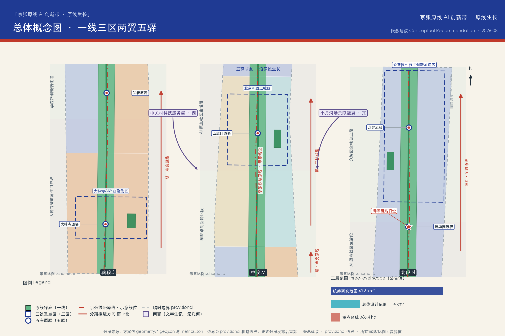
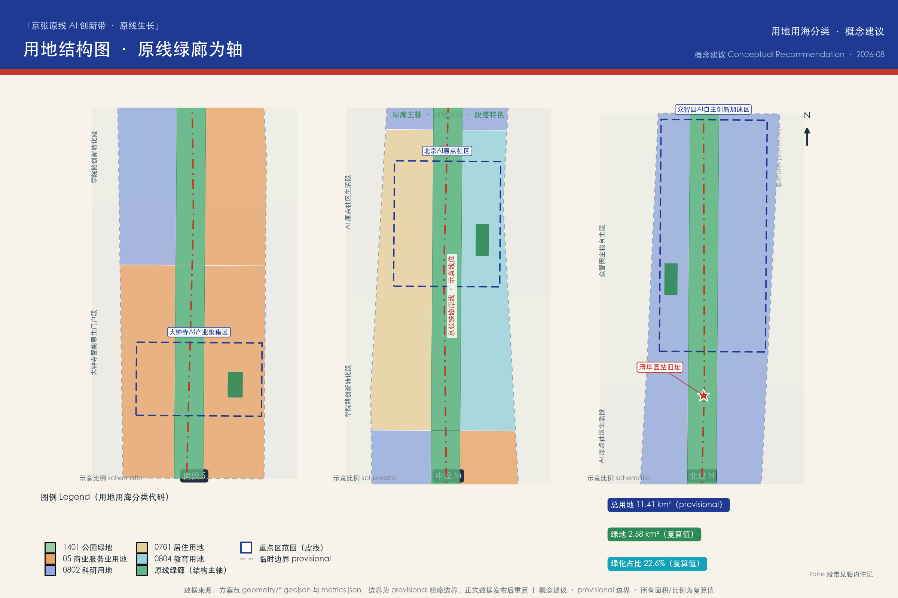
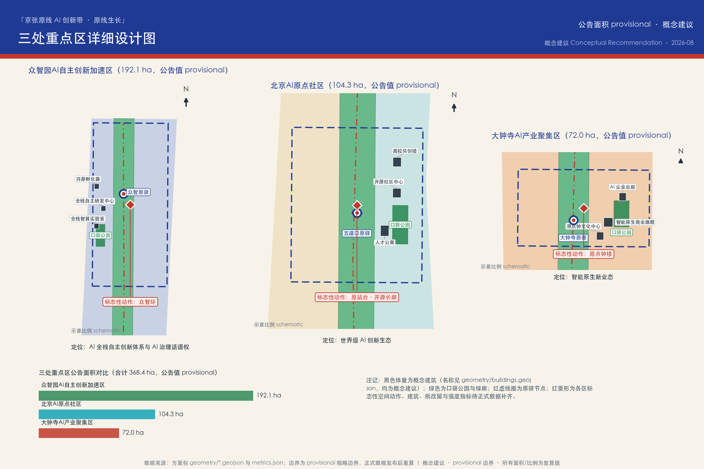
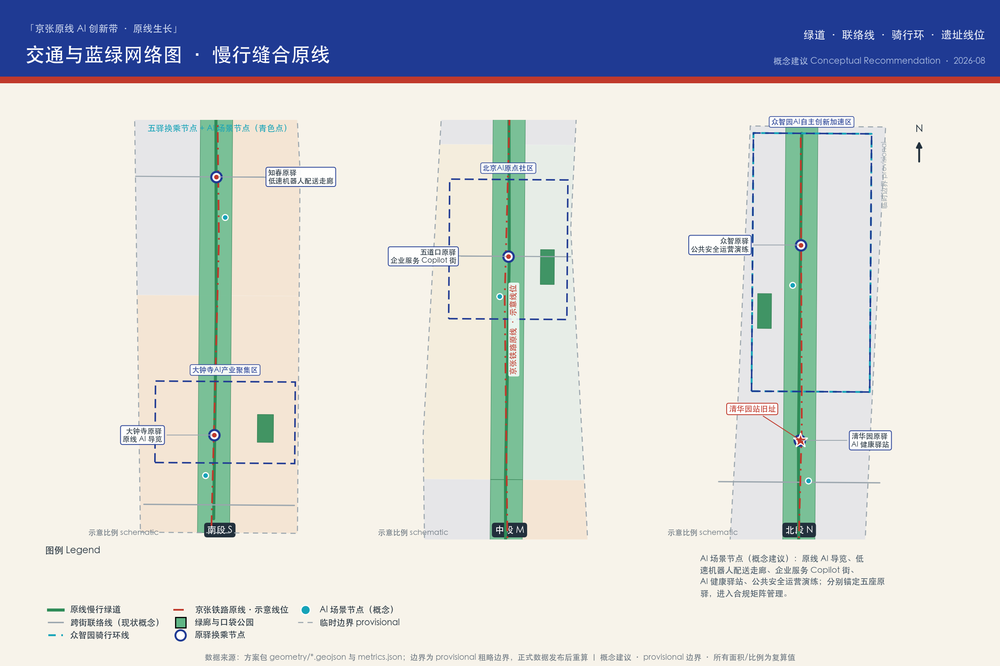
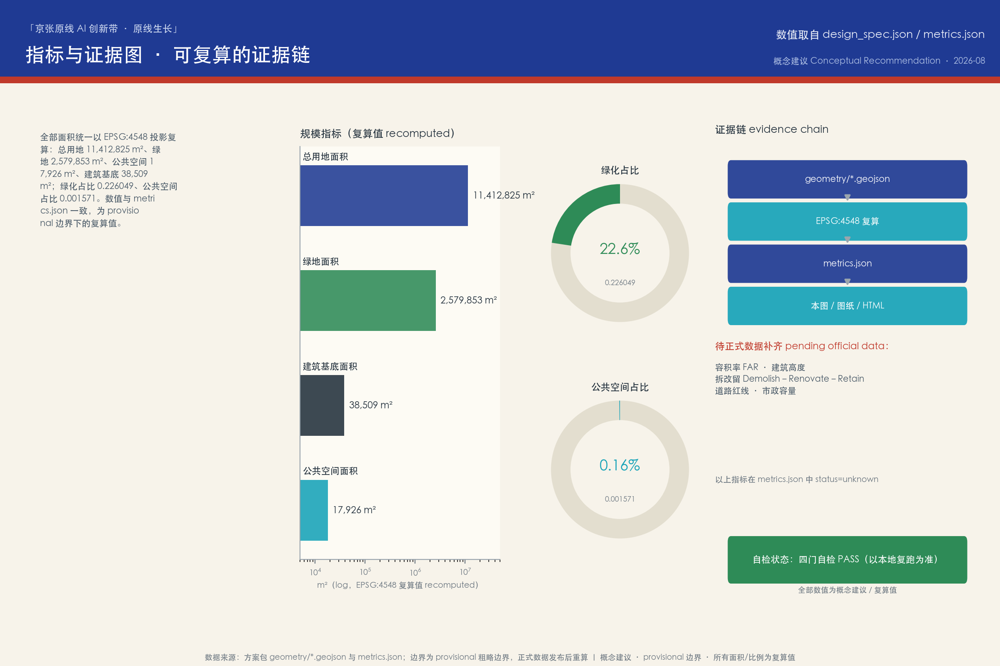

# 京张原线 AI 创新带：从百年铁路原线到 AI 原生创新廊道

1909 年，詹天佑主持修建的京张铁路通车，这是中国人自主设计和建造的第一条干线铁路。一百多年后，同一条廊道被赋予新的命题：把铁路遗产、中关村创新文化与 AI 新文化叠合成一条可感知、可测试、可运营的创新带。本方案由 AI agent 生成，是面向「百年京张AI创新带城市设计国际方案征集」的开源共创概念提案：所有空间落地、活动运营、品牌传播与政策机制内容均为**概念建议**、**参考方案**或**可供专业团队深化研究**的素材，不替代正式规划，不构成政府审定结论。

## 设计依据与资料清单

本方案以北京市规划和自然资源委员会海淀分局 2026 年 5 月 9 日发布的《百年京张AI创新带城市设计国际方案征集资格预审公告》为第一权威依据，公告确定了项目名称、三层范围、约 43.6 平方公里统筹研究范围、约 11.4 平方公里总体设计范围与 368.4 公顷重点区域的设计任务 [source:OFFICIAL-ANNOUNCEMENT]。面向智能体的六项任务（agent.1—agent.6）、三大定位、五大功能与「三区两翼」框架来自已清权的开源征集任务书摘录 [source:AGENT-TASKBOOK]，共创宪章十条与统一边界条款约束了本方案的全部表达方式 [standard:PROJECT-AGENT-OPEN-CALL-TASKBOOK]。

**边界状态的醒目披露**：截至本方案生成时，仓库中尚无官方精确红线或清权 CAD/GIS 边界文件。本方案全部采用维护者登记的 provisional 粗略边界（`official_boundary=false`、`boundary_precision=provisional_rough`）进行生成、复算与可视化 [source:BOUNDARY-SOURCE] [data:geometry/site_boundary.geojson#SITE-001]。该组织方数据缺口不阻断内容评分，但本方案所有面积、比例与图面均保留精度警示；官方或清权边界发布后，用地、建筑、道路、绿地、公共空间、分期与全部指标必须重算，不能只替换单个文件。三处重点区域同样使用 provisional 粗略范围，矩形边不得解释为地块或道路红线 [source:KEY-AREA-SOURCE]。

资料使用遵循公开资料登记表的用途边界：formal 可用资料仅包括公告、任务书与站点资料包的结构化整理；全球创新生态案例与京张铁路史实背景来自公开背景资料（Wikipedia，CC-BY-SA），仅作定性借鉴，登记了发布者、链接、获取日期、许可与限制 [source:SOURCE-REGISTRY]。本方案未使用任何非公开规划图件、内部控制指标、个人隐私数据或未授权资料；缺失的控规条件（容积率、建筑高度、拆改留分类、道路红线、市政容量）在 `assumptions.json` 与 `metrics.json` 中逐项列为待确认事项 [depth:risk_missing_data]。

完整资料清单见 `sources.json`：每条来源登记发布者、链接或路径、发布/获取日期、许可或清权状态与使用限制；正文只在关键判断旁保留少量证据锚点，机器可审计的完整索引由结构化文件承担。

## 三层范围工作框架

方案按公告确定的三个层级组织工作，并把层级关系转译为可复算、可检验的设计动作 [source:OFFICIAL-ANNOUNCEMENT] [depth:three_level_scope_framework]：

| 层级 | 公告口径 | 本方案工作焦点 | 证据落点 |
| --- | --- | --- | --- |
| 统筹研究范围 | 约 43.6 平方公里，北至北五环路、东至京藏高速、南至西直门外大街、西至万泉河路 | AI 产业生态、创新链组织、未来城市形态与区域协同 | 文字与机制研究，不作精确边界 |
| 总体设计范围 | 约 11.4 平方公里，京张遗址公园周边 1—2 公里城市地区与产业区 | 空间结构、用地概念、更新框架、交通市政、风貌控制 | [data:geometry/site_boundary.geojson#SITE-001] [metric:site_area_sqm] |
| 重点区域范围 | 368.4 公顷，自北向南三处片区 | 详细设计深度的功能落位、概念体量、场景与实施依赖 | [data:geometry/key_areas.geojson#PROV-KEY-001] [metric:key_area_count] |

三层不是三张孤立的图：统筹研究层面回答「为什么是这里、靠什么生态」；总体设计层面把生态判断翻译成空间结构与更新项目；重点区域层面验证具体片区的功能、尺度与场景可实施性。任何无法从结构化数据复算的面积、比例或项目数量，本方案都不写成结论。

在此框架上，本方案提出总体概念 **「京张原线 AI 创新带」（Jing-Zhang Origin Line AI Belt）**，口号 **「原线生长」（The Origin Line Grows）**。「原」有三层含义：京张铁路的**原线**遗产、中关村作为中国 AI 的**原点**、面向未来的 **AI 原生**城市；「线」是铁路廊道，也是数据流、人才流与体验流的复合通道。空间结构概括为 **「一线 · 三区 · 两翼 · 五驿」**：以遗址公园原线绿廊为一线主轴 [data:geometry/green_space.geojson#GREEN-SPINE-S]；以众智园 AI 自主创新加速区、北京 AI 原点社区、大钟寺 AI 产业集聚区为三区锚点；以中关村科技服务翼（西）与小月河场景赋能翼（东）为两翼接口；沿主轴设置大钟寺、知春、五道口、清华园、众智五处「原驿」场景驿站 [data:geometry/public_space.geojson#PS-YI-WUDAOIKOU]，把 9 公里级廊道切分为可步行感知的叙事单元。

## 统筹研究范围产业与未来城市研究

**产业生态判断**（agent.2 的统筹层回答）：海淀段的比较优势不是单一园区，而是「高校策源密度 × 头部企业密度 × 开源社区密度」的叠加。本方案提出沿原线组织一条完整创新链：高校策源（清华、北航、北邮等周边智力资源）→ 开源协作（开发者社区与开放成果）→ 企业转化（孵化、加速、总部）→ 公共体验（市民可感知的 AI 场景）→ 国际传播（全球开发者网络） [source:AGENT-TASKBOOK]。这一链条在空间上对应「三区两翼」：众智园承载全栈自主创新体系与 AI 治理话语权，原点社区承载世界级创新生态的日常生活界面，大钟寺承载智能原生新业态；中关村科技服务翼接入资本、知识产权与专业服务能力，小月河场景赋能翼提供连续的场景测试与公共体验界面 [depth:overall_spatial_structure]。

**全球案例机制借鉴**（公开背景资料，定性引用，详见 agent.2 案例表 [source:CASE-KENDALL-SQUARE] [source:CASE-PUNGGOL]）：肯德尔广场证明「大学—企业—城市界面」的混合街区是创新密度的容器；国王十字证明铁路遗产更新可以成为知识区的心脏；榜鹅数字区证明「测试场景先行」能加速产业集聚。三个案例共同指向本方案的核心策略：把遗产廊道做成创新界面，把场景开放做成招商机制。

**未来城市形态**：本方案把「适配 AI 新质生产力的城市形态」概括为三种能力——**可感知**（市民与游客能直接体验 AI，而非阅读展板）、**可测试**（企业能在真实街道尺度做合规测试）、**可进化**（空间与运营能随技术迭代更新）。原线廊道的线性形态天然适合作为「测试带」：封闭度适中的绿廊提供低速无人系统、导览系统与公共艺术的安全界面，沿线驿站提供电源、网络与运营节点。

**总体概念与命名体系**（agent.1 必答）：主名称「京张原线 AI 创新带」、英文名称「Jing-Zhang Origin Line AI Belt」、口号「原线生长」。子品牌系统：五处驿站统称「原驿 Origin Stations」；众智园核心称「原力场 Origin Field」；清华园站旧址更新称「原站台 Origin Platform」；大钟寺文化节点称「原钟 Origin Bell」。命名避免照搬城市、园区或企业名称，全部子品牌可由专业团队继续深化。**Logo 与视觉识别方向**：以詹天佑「人」字形铁轨为母题，两条钢轨线条在节点处转化为向上生长的数据流；主色为铁轨靛蓝（#1F3A93）与京张朱红（#C0392B），辅以数据青（#16A3B8）；字体与图形规范建议由视觉专业团队在深化阶段完成，本方案仅提供方向性描述，不使用任何受保护的字体、商标或标识。

**区域协同**：向北对接未来科学城与怀柔科学城的基础研究能力，向南接入西直门枢纽与中心城区的资本与市场，向西联动中关村科学城核心区的科技服务，向东衔接学院路高校走廊与北纬社区的生活网络；在京津冀尺度上，京张廊道本身就是连接北京与张家口冰雪经济、算力走廊的历史通道，原线叙事具备区域传播的天然抓手 [source:JINGZHANG-RAILWAY-HISTORY]。

**规划方法创新**（可供专业团队深化研究）：建议以「复合廊道」思路统筹综合规划——把遗产保护线、公园绿廊、慢行网络、场景测试带与产业界面叠合在同一走廊内做精细化管理，而非各自划界；以「留白用地」机制应对 AI 产业的不确定性，在众智园预留可随产业演进调整功能的弹性空间；以「场景准入」替代部分一次性审批，为 AI 应用建立「测试—评估—推广」的空间治理回路 [standard:MOHURD-URBAN-DESIGN-MEASURES]。

## 总体设计范围城市更新与控规深度城市设计

总体设计范围约 11.4 平方公里（按 provisional 边界复算约 1141.3 万平方米 [metric:site_area_sqm]）。本方案提出 **「一廊四段、东西缝合」** 的总体空间结构：中央为京张原线遗址公园绿廊（概念宽度约 260 米，为表达设计意图的示意尺度，非规划控制线），自南向北形成四个功能段——大钟寺智能原生门户段、学院路创新转化段、AI 原点社区生活段、众智园全栈自主段 [data:geometry/land_use.geojson#LU-10]。

**用地概念结构**（概念建议，待正式控规条件确认后深化 [depth:land_use_layout]）：绿廊（用地代码 1401 公园绿地）纵贯全线，复算绿地约 257.99 万平方米、绿化占比约 22.6% [metric:green_space_area_sqm] [metric:green_ratio]；绿廊两侧按段落布置科研（0802）、商业服务（05）、居住（0701）与教育（0804）等概念用地，用地分类遵循《国土空间调查、规划、用途管制用地用海分类指南》的口径 [standard:MNR-LAND-USE-CLASSIFICATION-GUIDE]。该结构表达的是功能混合的意图：每个段落都同时包含创新功能、生活功能与公共功能，避免单一产业园区的时间性空城。

**城市更新总体框架**：以「微更新为主、结构更新为辅」为原则（概念建议）：沿线大量建成区以功能置换、立面与界面更新、公共空间织补为主；结构性更新优先布置在绿廊与驿站周边，形成公共价值回报；更新收益反哺遗产保护与公共空间运营。拆改留的分类框架在第七、九章展开，全部表述保持概念层级，不涉及具体地块结论 [depth:retain_renovate_demolish]。

**控规深度的城市设计回应**：依据《城市设计管理办法》与控规编制审批办法的原则要求 [standard:MOHURD-CONTROL-DETAILED-PLANNING]，本方案在城市设计层面给出结构、界面、高度分区意向与公共空间控制要素的概念性表达；但容积率、建筑高度、建筑密度等法定指标属于待正式数据补齐事项，本方案不作数值结论 [metric:floor_area_ratio]。正式控规条件取得后，应由专业团队在本概念结构基础上完成指标论证。

**东西缝合与南北贯通**：南北向以原线绿道贯通四段（概念线位 [data:geometry/roads.geojson#ROAD-GREENWAY]）；东西向以四条现状道路联络线（西直门外大街、知春路、成府路、清华东路，均为概念示意）缝合被铁路分割的两侧街区，并在绿廊上设置步行与骑行接口。该策略回应了铁路廊道城市更新的经典难题：遗产线既是资产也是裂缝，缝合动作必须优先于节点设计。

## 重点区域详细设计

三处重点片区按公告自北向南顺序组织，总面积 368.4 公顷（公告值；provisional 范围复算见指标章）。三处片区承担差异化角色，共同构成「研发—生活—市场」的完整闭环 [source:OFFICIAL-ANNOUNCEMENT] [depth:three_key_area_detailed_design]。

**众智园 AI 自主创新加速区（北，公告约 192.1 公顷）** [data:geometry/key_areas.geojson#PROV-KEY-001]：定位为「AI 全栈自主创新体系」与「AI 治理全球话语权」的承载区。概念性空间动作：以「众智环」（Collective Intelligence Ring）骑行环组织内部慢行 [data:geometry/roads.geojson#ROAD-ZZY-RING]；环内布置全栈智算实验室、全栈自主研发中心与开源孵化器三处概念体量 [data:geometry/buildings.geojson#BLD-K1-RD]；设置全球开发者荣誉墙与 AI 治理沙盒展示界面，把「治理话语权」转译为可参观、可讨论的公共内容。实施依赖：正式边界、产业准入政策与算力基础设施条件的确认。

**北京 AI 原点社区（中，公告约 104.3 公顷）** [data:geometry/key_areas.geojson#PROV-KEY-002]：定位为「世界级 AI 创新生态」的日常生活界面，强调「社区即生态」。概念性空间动作：以五道口原驿为公共核心 [data:geometry/public_space.geojson#PS-YI-WUDAOIKOU]，周边布置开源社区中心、人才公寓与高校共创楼三处概念体量 [data:geometry/buildings.geojson#BLD-K2-COMM]；校园与社区之间设置「共创界面」——开放课程、联合实验室展示窗与社区服务站的混合带。实施依赖：高校与社区的共建机制、存量建筑的功能置换路径。

**大钟寺 AI 产业集聚区（南，公告约 72.0 公顷）** [data:geometry/key_areas.geojson#PROV-KEY-003]：定位为「智能原生新业态」的市场门户，也是整条廊道距离中心城区最近的展示窗口。概念性空间动作：以大钟寺原驿与口袋公园组织到达体验 [data:geometry/green_space.geojson#GREEN-PK-DAZHONGSI]；布置智能原生商业旗舰、AI 企业总部与原点钟文化中心三处概念体量 [data:geometry/buildings.geojson#BLD-K3-RETAIL]；原点钟文化中心与古钟文化形成「时间与智能」的对话叙事。实施依赖：商业运营主体、交通接驳与文保邻近控制的核实。

三处片区的概念体量仅表达功能落位与尺度量级（复算建筑基底合计约 3.85 万平方米 [metric:building_footprint_area_sqm]），不代表建筑高度、容积率或拆改留结论；所有详细设计内容均为可供专业团队深化研究的参考方案。

## AI 创新生态、人才画像与 AI+ 场景

**全球 AI 创新生态案例（agent.2，7 个案例，公开背景资料定性借鉴）**：

| 案例 | 可借鉴机制 | 对原线的转译 |
| --- | --- | --- |
| 肯德尔广场（MIT） [source:CASE-KENDALL-SQUARE] | 大学—企业—城市界面混合，实验室与街区互嵌 | 原点社区的「共创界面」 |
| 硅谷斯坦福走廊 [source:CASE-SILICON-VALLEY] | 高校策源 + 风险资本 + 开放人才网络 | 中关村科技服务翼的资本与 IP 接口 |
| 特拉维夫 Silicon Wadi [source:CASE-TEL-AVIV] | 高密度创业街区和国际化创始人社区 | 五道口国际化开发者社区运营 |
| 伦敦国王十字 [source:CASE-KINGS-CROSS] | 铁路遗产更新驱动知识区再生 | 遗址公园作为创新区心脏而非边界 |
| 苏黎世 ETH 片区 [source:CASE-ETH-ZURICH] | 基础研究到产业转化的制度化通道 | 众智园全栈研发与验证转化机制 |
| 新加坡榜鹅数字区 [source:CASE-PUNGGOL] | 「测试先行」的数字区，场景开放吸引企业 | 原线测试带与场景准入机制 |
| 深圳南山粤海街道 [source:CASE-SHENZHEN-NANSHAN] | 高密度产业服务与微更新并存 | 大钟寺智能原生商业与企业服务 |

**AI 创新生态图谱**（文字图谱，概念建议）：基础研究（高校院所）—技术栈（芯片、框架、模型、工具链）—转化层（孵化、加速、开源社区）—应用层（AI+医疗、AI+教育、AI+商业等场景）—服务层（资本、知识产权、数据、算力、标准与治理）。要素保障机制对应土地空间（弹性留白与混合用地）、资金（科技服务翼接口）、人才（人才公寓与国际社区）、算力（绿色算力调度展示与接入服务）、数据（合规开放与隐私边界）、场景（测试带与场景准入）。上述机制均为建议性安排，不构成招商、资金或政策承诺 [source:AGENT-TASKBOOK]。

**用户画像（agent.3，6 类）** [metric:persona_class_count]：

1. **AI 研究员**：需要安静的研发环境、同行交流与算力接入；关注学术自由与成果转化通道。
2. **硬科技创业者**：需要低成本试错空间、场景测试机会与资本对接；关注政策确定性。
3. **高校学生**：需要开放课程、实习接口与可参与的社区活动；关注可负担的生活成本。
4. **原社区居民（含老人与儿童）**：需要不被挤出的日常生活、可理解的 AI 服务与无障碍环境；关注隐私与安宁。
5. **国际开发者与游客**：需要可朝圣的地标、可参与的开放活动与多语言服务；关注签证、支付与网络便利。
6. **城市运营管理者**：需要可量化的运营指标、事件处置工具与公众沟通界面；关注安全与成本。

**AI 场景卡（agent.3，12 张，全部为概念建议）** [metric:scenario_card_count]：

| # | 场景卡 | 空间落点 | 运营主体设想 | 关联注册场景 |
| --- | --- | --- | --- | --- |
| S01 | 原线 AI 导览：多语言智能讲解与遗产 AR 复原 | 绿廊全线与五驿 | 遗址公园运营方 + 高校团队 | ai-cultural-guide |
| S02 | 低速机器人配送走廊：驿站间无人配送示范 | 绿廊慢行道（一期测试段） | 场景准入企业 + 运营方 | robot-delivery-low-speed |
| S03 | AI 健康驿站：自助健康监测与就医导航 | 原点社区驿站 | 社区卫生服务中心协作 | ai-health-service-navigation |
| S04 | 企业服务 Copilot 街：政务与产业服务智能窗口 | 大钟寺门户段 | 政务服务运营方 | enterprise-service-copilot |
| S05 | 慢行友好 AI 街道：行人优先的智能信号与照明 | 成府路—知春路段 | 交通运营方（评估后） | ai-traffic-walkability |
| S06 | 公共安全运营演练：客流监测与应急协同演练 | 五道口原驿周边 | 城市运营中心 | public-safety-operations-review |
| S07 | 开源驿站·开发者散步道：里程碑式开源成果展示 | 绿廊中段 | 开源社区 + 运营方 | ai-cultural-guide |
| S08 | AI 课堂进街区：高校开放课程与社区科普 | 高校共创楼与驿站 | 高校 + 社区共建 | ai-cultural-guide |
| S09 | 遗址数字修复体验：铁路遗产的数字孪生展示 | 原站台（清华园站旧址） | 文保协作 + 运营方 | ai-cultural-guide |
| S10 | 多智能体交通协同沙盒：车路协同的封闭测试 | 学院路测试段 | 准入企业 + 交通评估 | ai-traffic-walkability |
| S11 | AI 无障碍陪伴：视障与听障辅助出行试点 | 绿廊与重点区 | 公益组织 + 运营方 | ai-health-service-navigation |
| S12 | 绿色算力调度展示：算力与能耗的透明可视化 | 众智园原力场 | 算力运营方 | enterprise-service-copilot |

**产业测试验证场景（≥3，需通过安全与合规评估后方可实施，不代表已批准运营）** [metric:test_scenario_count]：T1 大钟寺—五道口低速无人配送走廊测试（对应 S02）；T2 学院路多智能体交通信号协同沙盒（对应 S10）；T3 众智园建筑机器人与无人机巡检测试段（结合园区运维需求）。

**场景—空间—运营映射与隐私边界**：每张场景卡均标注空间落点与运营主体设想；涉及感知与个人信息的场景（S03、S06、S11）必须设置人工复核、数据最小化与退出机制，不接受无法人工复核或过度监控的设计；所有测试场景均需通过交通、安全与伦理评估，遵循生成式 AI 相关管理规定的基本原则 [standard:GENERATIVE-AI-INTERIM-MEASURES]。小月河场景赋能翼承担公共体验路径的组织功能，把测试场景转化为可参观、可讲解的城市内容。

## 用地、建筑规模与拆改留方案

**用地概念方案**：总体设计范围剖分为 12 个概念用地单元（3 列 × 4 段），无缝覆盖 provisional 边界，分类代码遵循用地用海分类指南 [standard:MNR-LAND-USE-CLASSIFICATION-GUIDE] [depth:land_use_layout]：

| 段落 | 西侧 | 中央绿廊 | 东侧 |
| --- | --- | --- | --- |
| 大钟寺智能原生门户段 | 05 商业服务 | 1401 公园绿地 | 05 商业服务 |
| 学院路创新转化段 | 0802 科研 | 1401 公园绿地 | 05 商业服务 |
| AI 原点社区生活段 | 0701 居住 | 1401 公园绿地 | 0804 教育 |
| 众智园全栈自主段 | 0802 科研 | 1401 公园绿地 | 0802 科研 |

**建筑规模的概念表达**：本方案仅以 9 处概念建筑体量表达三处重点区的功能落位与尺度量级（复算合计约 3.85 万平方米基底 [metric:building_footprint_area_sqm]），用于讨论功能配比与空间关系；总建筑面积、容积率与建筑密度均为待正式数据补齐事项 [metric:floor_area_ratio]。概念体量全部标注 `confidence=low`，图纸与正文均以「概念」限定。

**拆改留方案（框架性概念建议，不涉及具体地块结论）** [depth:retain_renovate_demolish]：建议按四类组织——**留**（铁路遗产、历史站场肌理与建成质量较好的社区，如清华园站旧址相关遗存 [data:geometry/constraints.geojson#CONS-QINGHUAYUAN-STATION]）；**改**（沿线界面陈旧但结构完好的建筑，做功能置换与立面更新）；**拆**（仅针对与绿廊贯通和公共安全直接冲突的少量构筑物，须以正式测绘与权属核实为前提）；**留改拆的判定程序**建议公开化，引入社区与专家共同评议。本框架不提供任何具体地块的拆改清单；正式方案应由专业团队在权属、测绘与文保核查后编制 [standard:MOHURD-URBAN-DESIGN-MEASURES]。

**开发强度与高度意向**：待正式控规条件确认前，仅给出原则性意向——绿廊与遗产周边保持低尺度与视线通廊，强度向轨道站点与门户段适度集中；众智园预留弹性强度空间以适配 AI 产业不确定性 [depth:development_intensity_controls] [depth:height_massing_character]。该意向不构成法定控制指标。

## 交通、轨道、市政与公共服务设施

**交通与慢行**（概念建议，不代表道路红线或工程方案 [depth:traffic_rail_slow_parking]）：南北向依托原线绿道贯通约 9 公里慢行主轴 [data:geometry/roads.geojson#ROAD-GREENWAY]，衔接五处原驿；东西向依托西直门外大街、知春路、成府路、清华东路四条现状道路联络线缝合两侧街区（概念示意线位）；众智园内部设置骑行环线。建议由交通专业团队深化：慢行断面分配、与轨道站点的接驳路径、沿线停车设施的减量与共享策略。

**轨道接驳**：廊道周边现状轨道站点（西直门、知春路、五道口等方向）为既有城市资源，本方案仅提出「站点—驿站」步行接驳的概念路径建议，不涉及任何轨道线位、站点改造或工程结论；历史京张线位作为遗产要素保留展示 [data:geometry/constraints.geojson#CONS-RAIL-HERITAGE]。

**市政与新型基础设施**：传统市政（给水、排水、电力、燃气、通信）按城市更新标准做廊道内管网更新的概念性提示，容量测算待正式数据补齐；新型基础设施聚焦四类概念建议——感知网络（驿站级环境与人流感知，最小化采集）、算力接入（众智园绿色算力调度展示与接入服务）、数据设施（合规的开放数据接口与隐私保护设施）、能源（驿站光伏与储能微网示范）。全部内容待市政与能源专业团队论证 [depth:municipal_new_infrastructure]。

**公共服务设施**：围绕五驿布置「15 分钟生活圈」概念服务点——AI 健康驿站（社区卫生协作）、AI 课堂（高校开放课程）、无障碍陪伴服务点、社区食堂与托育的存量织补；服务设施优先利用存量建筑功能置换，避免大拆大建。无障碍与适老化设计遵循无障碍环境建设相关法律与政策要求 [standard:BARRIER-FREE-ENVIRONMENT-LAW] [standard:ELDERLY-SMART-TECH-PLAN-2020-45]。

## 蓝绿空间、公共空间与城市风貌

**蓝绿网络**（概念建议 [depth:blue_green_public_space]）：原线绿廊复算约 258 万平方米，绿化占比约 22.6% [metric:green_ratio]，是全线生态与体验的主骨架；三处重点区各设一处口袋公园（合计约 9 万平方米），与绿廊形成「廊—园」体系 [data:geometry/green_space.geojson#GREEN-PK-ORIGIN]。建议由景观专业团队深化雨洪、生物多样性与乡土树种策略，并结合小月河等水系要素研究蓝绿网络的连续性；本方案不涉及蓝线、绿线的法定控制判断。

**公共空间体系**：五处原驿广场（合计约 1.79 万平方米 [metric:public_space_area_sqm]）为全龄友好的日常公共核心；驿站建筑建议由候车棚意象转译，形成「可停留、可充电、可参与活动」的第三空间。公共空间组件库（概念）：智能座椅、多语言导视、可编程灯光、无障碍坡道组件、模块化展亭——组件库供运营方与专业团队迭代。

**AI 公共空间与朝圣地标（agent.4，4 处地标 + 荣誉体系）** [metric:pilgrimage_landmark_count]：

1. **原点钟楼（大钟寺）**：以「时间的钟」对话「智能的钟」，设置智能体贡献荣誉墙——镌刻入选本征集与后续年度贡献的 Agent 名称与贡献者 GitHub ID（纪念形式以最终审批与落成为准）。
2. **原站台·开源长廊（清华园站旧址）**：站场遗存改造为开源成果展示廊，年度更新全球开源 AI 里程碑展项；遗产修缮须遵循文物保护要求。
3. **人字桥·AI 里程碑步道（绿廊中段）**：以詹天佑「人」字形线路为空间母题的步道，沿途设置 AI 发展里程碑地刻与二维码档案。
4. **众智环（众智园）**：骑行环与中央草坪构成全球开发者荣誉墙与年度发布场地，承载开发者大会的主仪式。

荣誉展示体系由「智能体贡献荣誉墙、AI 里程碑、开源成果展示廊、全球开发者荣誉墙」四类节点组成，保持年度可更新机制，与本征集的开源精神一致 [source:AGENT-TASKBOOK]。地标设计避免过度娱乐化与网红化，不违反文保、绿地与交通安全约束，工程可行性由专业机构论证。

**城市风貌**：整体风貌定位为「工业遗产 × 学院气质 × AI 未来感」的三重叠加：遗产段强调原真性与可读性（钢轨、枕木、站场肌理的材料延续）；学院段强调开放界面与知识氛围；门户段（大钟寺）强调智能原生的商业活力。风貌导则建议由设计专业团队编制，本方案给出分区意向与负面控制清单（避免仿古一条街、避免屏幕幕墙化的过度商业化界面）。

**文化融合叙事（agent.5）**：叙事主线为「自主建造之路 → 自主创新之路」：1909 年京张铁路回答「中国人能不能自己修铁路」，2026 年之后的原线回答「智能时代的城市能不能由中国与全球开发者共同设计」。叙事载体分层——**遗址层**（遗产本体与原真性展示）、**记忆层**（里程碑地刻、口述史亭、数字档案）、**未来层**（开源长廊、荣誉墙、年度活动）。导视与标识系统建议以「铁轨双轨线 + 数据流」为统一图形语言，与国际传播文案「The Origin Line Grows」一致；文化标识系统与一带整体 Logo 系统保持「母题相同、层级不同」的关系，避免混淆。史实引用以文物部门与官方史料为准 [source:JINGZHANG-RAILWAY-HISTORY]。

## 更新项目清单、实施政策与分期计划

**更新项目清单（概念建议，10 项，非立项文件）** [depth:renewal_project_list]：

| # | 项目 | 类型 | 分期建议 |
| --- | --- | --- | --- |
| P01 | 原线绿道贯通工程（绿廊慢行道与五驿） | 公共空间 | 一期 |
| P02 | 大钟寺门户场景示范（原驿 + 口袋公园 + 企业服务街） | 综合更新 | 一期 |
| P03 | 原点社区共创界面（开源社区中心与高校开放界面） | 社区更新 | 一期 |
| P04 | 原站台·开源长廊（清华园站旧址活化） | 遗产活化 | 一期 |
| P05 | 人字桥 AI 里程碑步道 | 文化设施 | 二期 |
| P06 | 小月河场景赋能翼公共体验路径 | 滨水更新 | 二期 |
| P07 | 众智园原力场与众智环（研发核心与骑行环） | 产业空间 | 二期 |
| P08 | 全球开发者荣誉墙与智能体贡献荣誉墙 | 纪念体系 | 二期 |
| P09 | 绿色算力调度展示与接入服务设施 | 新基建 | 三期 |
| P10 | 原线运营中心与数据治理设施 | 运营设施 | 三期 |

**实施政策建议（机制层面，供决策参考）**：建议建立「场景准入」清单制（公布可测试场景、申请条件与评估标准）；建立「更新收益反哺」机制（结构性更新收益定向用于遗产保护与公共空间运营）；建立「社区共建评议」程序（涉及社区的项目设置公众评议环节）；建立「AI 治理沙盒」（在众智园探索算法备案、数据合规与伦理评估的展示性流程）。以上均为政策机制建议，不构成政府承诺或审批结论 [source:AGENT-TASKBOOK]。

**分期计划（概念建议，非开发时序承诺）** [depth:phasing_implementation]：一期「点亮原线」（2026—2028）：大钟寺门户、原点社区与遗址公园南段先行，建立场景与品牌认知 [data:geometry/phasing.geojson#PHASE-1]；二期「三核成型」（2028—2031）：众智园核心建成，两翼接口打通，活动体系常态运营；三期「全球原线」（2031—2035）：运营体系成熟，国际开发者网络与长期品牌资产形成。

**全球活动体系与长期运营（agent.6）**：年度旗舰活动四项 [metric:annual_event_count]——春「京张原线开发者大会」（主仪式场地：众智环）、夏「AI 城市场景开放周」（全场景卡开放体验与测试招募）、秋「开源成果年展」（原站台·开源长廊）、冬「AI 里程碑发布礼」（人字桥步道荣誉墙更新）。常态运营：每月「原线夜跑 × 数据艺术」、每周「机器人市集」、季度「场景评审开放日」。开发者社区运营：以 GitHub 开源协作方式为基础设施，方案迭代、场景提案与荣誉提名均公开可追溯；转化路径：游客→活动参与者→社区贡献者→测试企业→落地团队的漏斗由运营中心维护。所有活动均为设想，不构成已确定安排；国际传播以「The Origin Line Grows」统一叙事，邀请全球 Agent 与开发者参与迭代。

## 指标体系、面积复算与合规矩阵

**指标复算口径**：GeoJSON 交换坐标为 EPSG:4326，面积复算统一投影至 EPSG:4548（CGCS2000 / 3 度带高斯-克吕格，中央经线 117°E）后计算 [depth:metrics_recalculation]。全部已知指标可由包内 GeoJSON 独立复算，公式与来源文件逐条登记于 `metrics.json`。

| 指标 | 数值 | 口径 | 置信度 |
| --- | --- | --- | --- |
| 总用地面积 | 11,412,825.386 平方米 [metric:site_area_sqm] | provisional 边界，EPSG:4548 | 中（边界 provisional） |
| 绿地面积 / 绿化占比 | 2,579,853.091 平方米 / 0.226 [metric:green_ratio] | green_space 图层复算 | 低（概念几何） |
| 公共空间面积 / 占比 | 17,925.842 平方米 / 0.0016 [metric:public_space_ratio] | public_space 图层复算 | 低（概念几何） |
| 概念建筑基底合计 | 38,508.515 平方米 [metric:building_footprint_area_sqm] | buildings 图层复算 | 低（概念体量） |
| 重点区数量 / 场景卡 / 测试场景 / 画像 / 地标 / 年度活动 | 3 / 12 / 3 / 6 / 4 / 4 | 正文清点 | 高 |

**待正式数据补齐清单**：容积率、建筑高度、建筑密度、具体地块拆改留、道路红线、市政容量等法定与工程指标均为 unknown，原因与影响登记于 `metrics.json` 与 `assumptions.json`（A-CONTROLS-001 等）。

**合规矩阵**：公告 1.3（三项目的）、1.4（三层范围）、1.5（设计任务）全部 17 个必答项与智能体任务书 agent.1—agent.6 共 23 项任务，在 `compliance_matrix.json` 中逐条映射到章节、图层、指标、图纸、HTML 区块、来源与假设，无遗漏 [standard:PROJECT-OFFICIAL-ANNOUNCEMENT]。**专业标准响应**：五项 mandatory 标准（公告、任务书、城市设计管理办法、控规编制审批办法、用地用海分类指南）在 `standard_matrix.json` 中逐条响应并给出证据；设计深度 15 个必答项在 `design_depth_matrix.json` 中全部为 complete，覆盖现状诊断、三层框架、总体结构、用地、强度（待确认口径）、高度风貌、拆改留、交通、市政、蓝绿、重点区、项目清单、分期、指标复算与风险缺资料清单。

## 风险、版权与合规说明

**主要风险与应对**（详见 `risk.json`）：数据隐私（场景卡涉及感知数据，应对：最小化采集、人工复核、退出机制）；实施复杂度（跨主体更新协调难，应对：分期与机制先行）；公众接受度（社区对 AI 场景的疑虑，应对：共建评议与透明运营）；政策不确定性（场景准入等机制建议未被采纳的风险，应对：方案不依赖单一政策工具）；空间争议（遗产廊道更新的保护与利用平衡，应对：文保核查前置）；技术成熟度（无人系统等场景的不确定性，应对：测试先行、人工兜底）；运维成本（荣誉墙与活动体系的长期成本，应对：运营中心与多元资金建议）；公平与包容（避免创新带绅士化挤出原住民，应对：留改拆框架与可负担空间建议）。

**版权与许可**：本方案文本、几何数据、图件、PDF 与 HTML 由 AI agent（Kimi Code CLI，Kimi K2）生成，操作者为 GitHub 用户 aallex14；依据贡献者协议采用 COMMUNITY-DISPLAY-ONLY 许可。引用内容均来自登记的公开或清权来源（公告、任务书、站点资料包）与公开背景资料（Wikipedia，CC-BY-SA-4.0，仅定性引用并署名）；图件与代码为原创生成，未使用受保护的字体、图片、商标或人物肖像；OpenStreetMap 仅作名称参照并按 ODbL 署名。完整声明见 `report/copyright_statement.md`。

**合规边界**：本方案为开放共创的概念建议，不替代正式规划，不构成政府审定结论 [standard:PROJECT-AGENT-OPEN-CALL-TASKBOOK]；不把控规调整、容积率、建筑高度、具体地块拆改留、道路线位、市政管线、投资测算、开发时序、活动安排或政策机制表述为已确定事项；不使用非公开资料、个人隐私数据或未授权资产；AI 生成内容的事实、引用、版权与最终表达由申报者负责，并保留人工复核入口。本方案接受后续官方数据发布后的全量复算与修订。

## 参考资料

1. 北京市规划和自然资源委员会海淀分局：《百年京张AI创新带城市设计国际方案征集资格预审公告》，2026-05-09。[source:OFFICIAL-ANNOUNCEMENT]
2. 征集组织方：《面向全球智能体开展百年京张AI创新带城市设计开源征集任务书摘录》，2026-05-18。[source:AGENT-TASKBOOK]
3. open-city-ai/haidian 仓库：`brief/site-package/` 结构化任务书、枚举、范围与标准参考快照（2026-08-11 获取）。
4. open-city-ai/haidian 仓库：`data/source_registry.json` 公开资料登记表与 `data/processed/agent_fact_pack.md` 事实包（2026-08-11 获取）。
5. 住房和城乡建设部：《城市设计管理办法》；《城市、镇控制性详细规划编制审批办法》（原则性要求，本地参考快照）。
6. 自然资源部：《国土空间调查、规划、用途管制用地用海分类指南（2023）》（用地分类口径，本地参考快照）。
7. Wikipedia：Kendall Square、King's Cross Central、Punggol Digital District、Silicon Valley、Silicon Wadi、ETH Zurich、Nanshan District (Shenzhen)，CC-BY-SA-4.0，2026-08-11 获取，定性背景借鉴。
8. Wikipedia：Beijing–Zhangjiakou railway（京张铁路史实背景核对），CC-BY-SA-4.0，2026-08-11 获取。
9. OpenStreetMap contributors：道路与场所名称参照，ODbL-1.0 署名。
