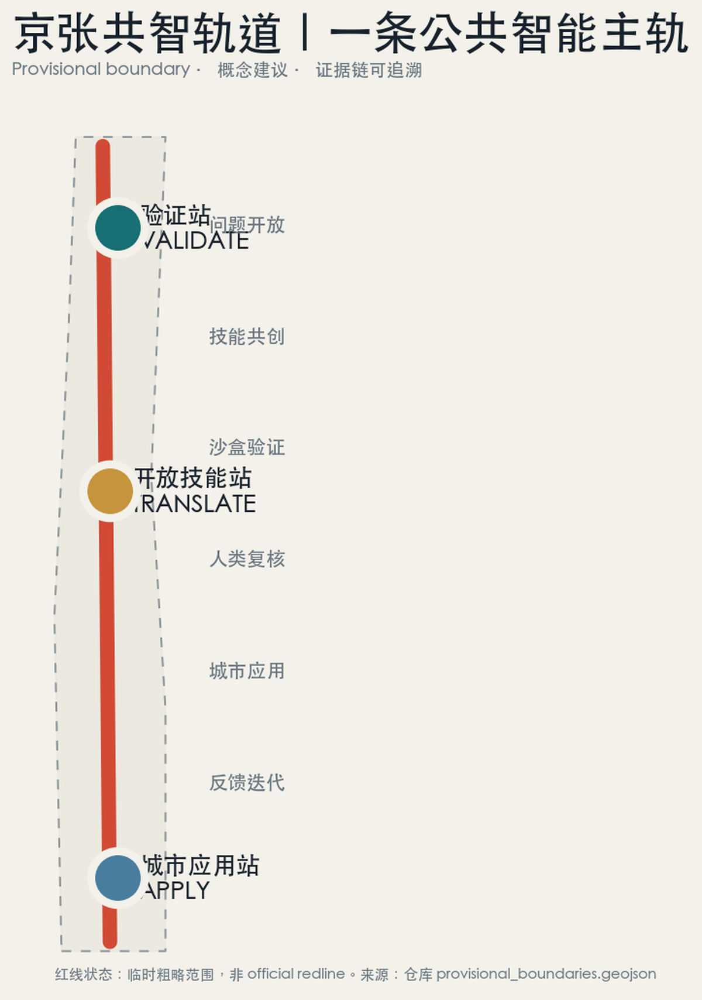
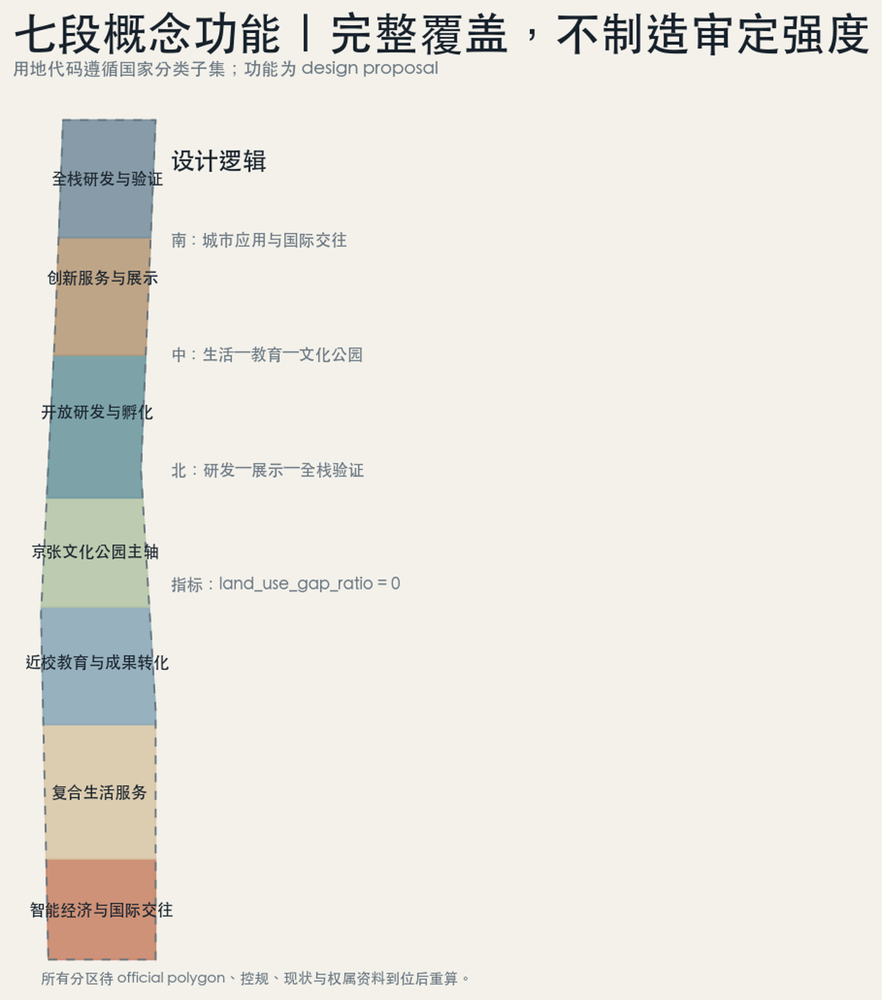
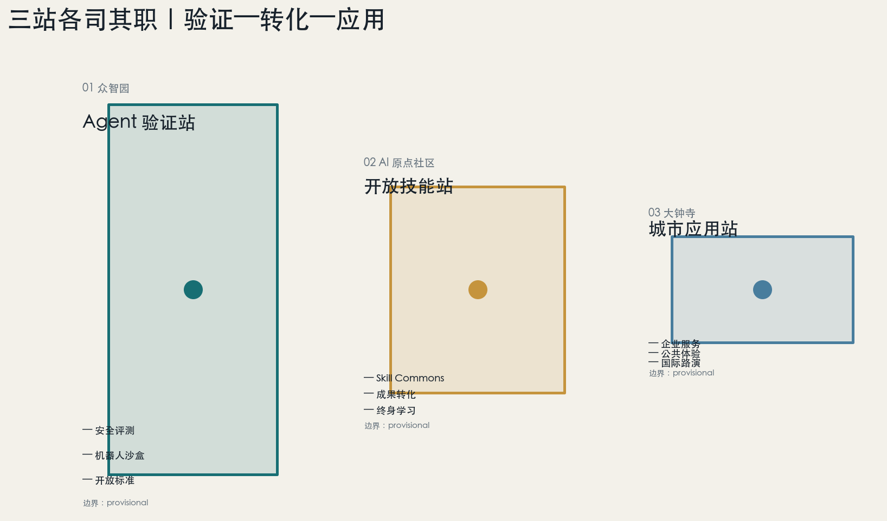
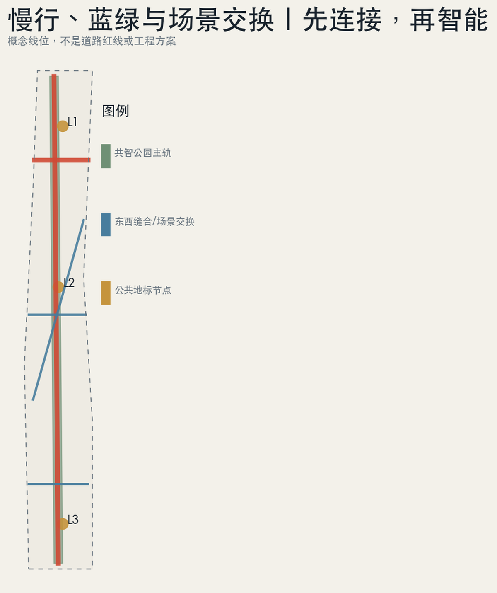
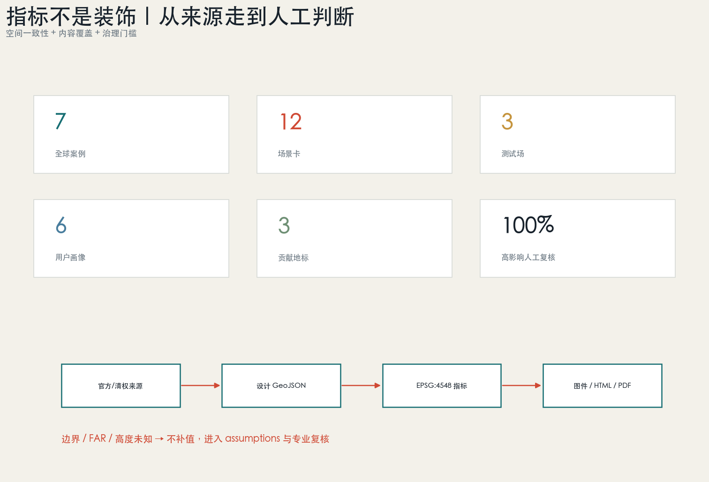

# Jing-Zhang Civic Agent OS

> Make urban experiences connectable, verifiable, and iterative like a railway.

Generated Batch: `2026-08-07T09:49:03Z` (for file provenance only, not for planning approval timestamp).

This plan transforms the "AI Innovation Belt" into a set of public intelligent operational rules: the Jing-Zhang Relic Park serves as the "Co-Intelligence Main Track" connecting history, community, schools, parks, and urban services; the northern Zhongzhiyuan is the validation station, the central AI Origin community is the transformation station, and the southern Dazhongsi is the application station; the Zhongguancun Technology Services Wing provides knowledge, talent, capital, and professional services, while the Xiaoyue River Scenario Enablement Wing provides a real but controlled urban test environment. The three stations and two wings form a closed loop of "problem openness—skill co-creation—sandbox validation—human review—city application—feedback iteration" [source:OFFICIAL-ANNOUNCEMENT] [source:AGENT-TASKBOOK] [depth:overall_spatial_structure].

All spatial design suggestions are Conceptual Recommendations or reference solutions, available for further study by professional teams. They do not replace formal planning and do not constitute government approval conclusions.

## Design Basis and Source List

The proposal adheres to the Urban Design and Control Plan regulations confirmed by the official pre-qualification announcement for project tasks, three layers of scope text, and area values, and the Agent Task Book for agent.1—agent.6. It is constrained by the Ministry of Housing and Urban-Rural Development's Urban Design and Control Plan regulations and the Land Use Classification Guide by the Ministry of Natural Resources, which dictate the depth of expression and terminology. [source:OFFICIAL-ANNOUNCEMENT] [source:AGENT-TASKBOOK] [source:SITE-PACKAGE] [source:SOURCE-REGISTRY] [source:PROCESSED-FACT-PACK] [source:KEY-AREA-SOURCE] [standard:PROJECT-OFFICIAL-ANNOUNCEMENT] [standard:PROJECT-AGENT-OPEN-CALL-TASKBOOK] [standard:MOHURD-URBAN-DESIGN-MEASURES] [standard:MOHURD-CONTROL-DETAILED-PLANNING] [standard:MNR-LAND-USE-CLASSIFICATION-GUIDE]

The current official polygon, road red line, planning control indicators, building baseline, ownership, municipal, cultural relic protection control, and public facility capacity have not been provided with the publicly available warehouse. The overall scope and three polygon areas used for submission are the temporary rough ranges provided by the warehouse maintainer: `official_boundary=false`, `geometry_role=provisional_constraint`, `boundary_precision=provisional_rough`. It is only used for concept generation, visualization, self-check, and design discussions and cannot be used as an Official Planning Boundary, accurate area, approval, or engineering reference. [source:BOUNDARY-SOURCE] [data:geometry/site_boundary.geojson#SITE-001] [data:geometry/constraints.geojson#CONSTRAINTS] [metric:site_area_sqm]

Generate the chain of logic as follows: "public sources and standards → design judgment → GeoJSON → EPSG:4548 rescaled metrics → five evidence maps → HTML and A3/A0". Spatial data is generated and rescaled with Shapely/PyProj, the figures are plotted with Matplotlib, and the PDF is formatted with ReportLab. The governance experience of Agents in the user knowledge base is used for conceptual methods, not as any planning factual source. [source:GENERATION-STACK] [standard:MOHURD-ARCH-DESIGN-DEPTH-2016] [depth:existing_conditions_diagnosis] [depth:land_use_layout] [depth:development_intensity_controls] [depth:retain_renovate_demolish] [depth:height_massing_character] [depth:blue_green_public_space] [depth:renewal_project_list] [depth:phasing_implementation] [depth:metrics_recalculation]. Among these, the current standard for architectural design depth is marked as pending official documentation in the repository. This plan records it only as a data gap and does not use third-party mirrors as formal references.

## Overall Concept, Name, and Visual Identity (agent.1)

Main name "Jing-Zhang Co-Intelligence Track" preserves the railway as a symbol of public technology and collective memory, while elevating "intelligence" from a single system to a city-wide capability for people, institutions, and agents to learn together. The English name **Jing-Zhang Civic Agent OS** emphasizes that it is not proprietary software but rather a "city public intelligence operating system" composed of public rules, open skills, verification mechanisms, and urban spaces. [source:AGENT-TASKBOOK]

Visual identity is composed of two parallel lines and three switch points: terracotta red represents the Jing-Zhang history and human judgment, deep blue represents Agent execution and city feedback; the three switch points correspond to verification, transformation, and application. The logo does not use corporate trademarks, personal likenesses, or restricted fonts; it can be redrawn using open-source or system fonts. The wayfinding system uses a three-tier syntax: "track number + station color + evidence status": JZ main track, V/T/A three categories of stations, O/P/D three categories of data status (official / provisional / design).

The spatial structure is summarized as "one track, three stations, two wings, and twelve scenes":

- One Track: Jing-Zhang Heritage—Co-Intelligence Park Main Track, Connecting Slow-Travel, Culture, Learning, Testing, and Public Services.
- Three Stations: Zhongzhiyuan "Verification Station," AI Origin Community "Transformation Station," and Dazhongsi "Application Station."
- Two Wings: The Zhongguancun Technology Services Wing provides essential services, while the Xiaoyue River Scenario Enablement Wing provides controlled trials and public feedback.
- Twelve Scenarios: Covering R&D Validation, Technology Transfer, Corporate Services, and Daily Life for Citizens.

It corresponds to three key positioning: the historical main track bears the century-old Jing-Zhang culture, twelve scenes constitute the urban AI living experience, and three stations and two wings drive AI integration and innovation; it corresponds to five functional areas: the validation station supports full-stack autonomy and governance, the transformation station supports a world-class ecosystem, and the application station and Xiao Yuehe wing support scenario empowerment and urban vitality. [source:AGENT-TASKBOOK] [data:geometry/public_space.geojson#PUBLIC-001]

## Three-Level Scope Framework

Coordinated Research Area covers 43.6 square kilometers to address "how ecology coordinates"; the Overall Design Area is approximately 11.4 square kilometers to address "how spatial and operational systems are organized"; three key areas totaling approximately 368.4 hectares address "how validation, transformation, and application are implemented in the district". The announced area is an approximate value, and the derived area of the submitted polygon is only used for topological and internal consistency recalculation. [source:OFFICIAL-ANNOUNCEMENT] [depth:three_level_scope_framework]

The Overall Design Area adopts the concept of seven segments for functional zoning, comprehensively covering the provisional site: southern intelligent economy and international exchange, composite living, near-school educational transformation, central Jing-Zhang cultural park, open research and development incubation, innovation service demonstration, and northern full-stack research and development validation. The land use codes follow the national classification subset, but all zones are design proposals rather than approved land uses. [standard:MNR-LAND-USE-CLASSIFICATION-GUIDE] [data:geometry/land_use.geojson#LU-001] [metric:land_use_gap_ratio]

## Coordinated Research Area: Industry and Future City Research

### Seven Global Ecological Case Studies Translated into Haidian (agent.2)

| Case | Verifiable Mechanism | Translation of Jing-Zhang |
| --- | --- | --- |
| Singapore Punggol Digital District | Open Digital Platform, Digital Twin, Industry-Academia Adjacencies, Real City Experiment | Establish "Public Problem API + Virtual Validation + On-site Gray Box" Scenario Access [source:CASE-PDD] |
| Helsinki Smart Kalasatama | Agile Pilot, Valuing Time Savings for Residents | Each scenario reports public value, harm risks, and operational costs [source:CASE-KALASATAMA] |
| Barcelona 22@ | Industrial, Creative, Knowledge, and Urban Renewal Coexisting | Avoiding Enclosed Campus-like Developments Through Ground-Level Public Interfaces and Mixed-Use Functions [source:CASE-22BARCELONA] |
| Montréal Mila / Québec AI | Research, talent, industrial transformation, and responsible governance are interwoven. | Assessments, safety, policies, and talent training are integrated as spatial functions rather than appendices [source:CASE-MILA] |
| London Knowledge Quarter | High-Density Inter-Institutional Networks and Open Knowledge Collaboration | Preserve the walking spine and joint activities to connect different institutions, without relying on a single landmark [source:CASE-KQ-LONDON] |
| Seoul AI Hub | Spatial, computational, validation, and global cooperation phases are divided into stages | The three stations are responsible for validation, transformation, and application, forming a clear service chain; S-Map Open Lab illustrates that digital twins can serve as open validation environments [source:CASE-SEOUL-AI-HUB] [source:CASE-SEOUL-SMAP] |
| Paris-Saclay | World-Class Research Clusters, Academic Structures, Economic Links, and Living Environment | Incorporate the living standards of international talent and inter-institutional transportation into the innovation infrastructure [source:CASE-PARIS-SACLAY] |

The seven cases collectively suggest that a world-class ecosystem is not a mere stacking of enterprise numbers, but a low-friction cycle between knowledge, space, validation, talent, services, and governance. This proposal therefore outlines eight categories of element interfaces: space, talent, computing power, data, funding, professional services, test scenarios, and international collaboration. Each category has a public entry point, validation rules, a human point of responsibility, and an exit mechanism to avoid treating recruitment, funding, or policies as predetermined commitments. [metric:global_case_count]

Ecological cycle: Higher education/research institutions propose methods and outcomes → Open Skill Stations transform into reusable skills → Zhongzhiyuan Validation Stations conduct a three-dimensional evaluation of completion rate, damage, and cost → Zhongguancun Technology Services Wing provides additional legal, intellectual property, financial, and policy services → Dazhongsi Application Stations enter enterprise and public scenarios → Xiaoyuehe Wing collects aggregated feedback → Results enter the contribution ledger and update the next version. Any high-impact stages are ultimately judged by humans.

## Overall Design Area: Urban Renewal and Regulatory-Plan-Level Urban Design

Overall design is not about creating a set of pseudo-precise control plans on the Provisional Boundary, but rather establishing a seven-segment framework for functional zones, building carriers, slow-moving blue-green spaces, public nodes, and a three-phase implementation plan that can be replaced by official data. The land use partition area is [metric:land_use_partition_area_sqm], with the difference from the site checked by [metric:land_use_gap_ratio]; the number of key areas is [metric:key_area_count]. Development Intensity, height, density, setback distances, and the demolish–renovate–retain strategy are kept unknown and will be refined once the official control plan, surveying, property rights, and engineering conditions are complete. [depth:development_intensity_controls] [depth:height_massing_character] (Demolish–Renovate–Retain Strategy)

## Detailed Design of Key Areas

### 5.1 Zhongzhiyuan: Agent Validation Station

Located as a garden-type full-stack innovation and governance validation zone. Spatially, it is centered around the "Validation Switch Field," organizing model/agent safety evaluations, low-speed robot testing, open standard workshops, and green innovation interactions; the Qinghe direction adopts a low-disturbance green interface, without making engineering judgments on the river blue line, flood protection, or cultural heritage areas. The architectural prototype includes convertible open workshops, evaluation laboratories, shared access to computing power, and public observation corridors. Specific buildings, intensities, and the Demolish–Renovate–Retain strategy await confirmation through surveying, ownership verification, and control planning. [data:geometry/key_areas.geojson#PROV-KEY-001] [data:geometry/buildings.geojson#BLDG-001] [depth:three_key_area_detailed_design] (Demolish–Renovate–Retain Strategy)

### 5.2 AI Origin Community: Open Skill Station

Positioned as a conversion and open collaboration community near the school. Spatial actions transform the breakpoints between campus, park, and neighborhood into walkable "Conversion Street," embedding open source release, Skill maintenance, intellectual property/legal affairs, talent living, and small-scale showcases. Each Skill must declare its source, capability boundaries, evaluation version, and human responsible party; open Skill stations are also community learning spaces, avoiding the separation of the technical system from residents' daily lives. [data:geometry/key_areas.geojson#PROV-KEY-002] [data:geometry/public_space.geojson#PUBLIC-002]

### 5.3 Dazhongsi: Urban Application Station

Conceptual Recommendation for positioning as a city-type smart economy and international exchange zone. Around the rail station and quadrants of pedestrian connectivity, set up "Contribution Milestone Living Room," enterprise service Copilot experience, smart terminals and content consumption displays, international roadshows, and data authorization consultation. All pedestrian connectivity, station interfaces, static transportation, and commercial space adjustments are conceptual recommendations and require review by traffic, municipal, ownership, and operational authorities. [data:geometry/key_areas.geojson#PROV-KEY-003] [data:geometry/roads.geojson#ROAD-002]

Three districts are not three isolated islands: the northern area produces credible capabilities, the central area transforms these capabilities into reusable knowledge assets, and the southern area validates real needs and commercial/public value; the co-creation main track ensures that the public can see "how the technology is validated, how it is used, and who is responsible when problems arise."

## AI Innovation Ecosystem, Personas, and AI+ Scenarios

### Six User Persona Categories

| Image | Core Task | Spatial Needs | Governance Boundaries |
| --- | --- | --- | --- |
| Researchers/Developers | Training, Collaboration, Evaluation, Release | Workshops, Open Skill Stations, Test Booking | Data and Model License Traceability |
| Start-up and Growing Enterprises | Product Validation, Customer Connection, Compliance Consultation | Flexible Office Space, Pitch Events, Corporate Services | No Commitment to Funding or Business Attraction Results |
| University Students and Faculty | Technology Transfer, Inter-institutional Exchange, Internship and Practical Experience | Near-School Active Transportation, Exhibition Hall, Learning Spaces | Campus and Research Data Require Authorization |
| Residents and Commuters | Travel, Recreation, Community Services | Continuous Slow-Travel Zones, Quiet Zones, Service Nodes | No Personal Trajectory Profiling or Commercial Recommendations |
| Elderly/Disabled | Barrier-Free Navigation, Service Access | Clear Signage, Service Counter, Rest Areas | AI Suggestions Can Be Declined, Can Be Transferred to Live Operator |
| Visitors/International Talent | Cultural Understanding, Business Exchange, Urban Experience | Bilingual Guiding, International Living Room, Life Services | Translation and Guiding Highlight Uncertainty |

[source:AGENT-TASKBOOK] [metric:persona_count]

### Ten AI scenario cards and three categories of test sites (agent.3)

| ID | Scenario / Type | Space and Data | Public Value | Risks and Human Review |
| --- | --- | --- | --- | --- |
| S01 | Agent Completion Rate—Damage—Cost Validation / **Test Field** | Zhongzhiyuan; Public Test Set, Synthetic Data | To Enable Comparative Deployment Judgments | High-Risk Results Must Be Signed Off by Experts, Not Automatically Deployed |
| S02 | Low-Speed Robot Cross-Building Coordination / **Test Field** | Zhongzhiyuan; Authorized Facility Status | Barrier-Free Delivery and Operations Learning | Speed Limits, Geofencing, On-Site Safety Officers, Immediate Shutdown Capabilities |
| S03 | Urban Services Skill Red Team / **Test Field** | Zhongzhiyuan; Desensitization/Synthetic Governmental Q&A | Reduce Hallucinations and Privilege Escalation | Source Citations, Rejection, Manual Escalation, Audit Logs |
| S04 | Low-Carbon Computational Power Scheduling Sandbox | Zhongzhiyuan; Aggregating Energy Consumption and Task Queues | Displaying Costs and Carbon Constraints | Not Connected to Key Municipal Controls, Simulate First Then Pilot |
| S05 | Open Skill Alchemy Workshop | Origin Community; Open/Clarity Knowledge | Codify Experience into Public Components | Copyright, Version, Maintainer, and Applicable Boundaries Must Be Provided |
| S06 | Campus—Enterprise Technology Transfer Copilot | Origin Community; Voluntary Submission of Results Information | Reduce Inter-Institutional Collaboration Friction | No Data Scraping of Unpublished Papers/Trade Secrets, Human Decides Facilitation |
| S07 | AI Education and Lifelong Learning Navigation | Origin Community; Original Course and Venue Information | Bridging the Digital Capability Gap | No Fixed Ability Labels, Explainable and Human Consultable |
| S08 | AI Medical Service Navigation | Community Nodes; Publish Institutional and Process Information | Assist in Finding Services, Not for Diagnosis | Explicitly State Non-Diagnostic Purpose, Redirect Emergency Situations to Human/First Aid Channels |
| S09 | Corporate Services Copilot | Dazhongsi; Public Policies and Voluntary Corporate Needs | One-stop Streamlining of Procedures | From Source to Paragraph, Timeliness Tips, Professional Review |
| S10 | Jing-Zhang Cultural Interpretive Tour | Collaborative Main Track; Clear Rights Documentation | Integrate the railway, Zhongguancun, and AI new culture. | Historical facts are verifiable, do not fabricate pseudo-histories or portraits. |
| S11 | Accessible Slow-Moving Assistant | Main Track and Stations; Public Roads, Manual Alerts | Identify Disruptions, Provide Alternative Routes | Does Not Collect Identity; Route Risks Confirmed and Feedback Possible |
| S12 | Public Activity Operation Review | Three Station Public Spaces; Booking, Weather, Aggregated Foot Traffic | Balancing Vigor, Quiet, and Safety | Only for Suggestion; Activity Permits, Safety, and Evacuation Responsibility Lie with Humans |

Three test scenarios adopt a unified threshold: first, virtual/synthetic data validation, then closed-space gray release, and finally small-scale pilot testing in approved real-world scenarios; each release records the task completion rate, potential harm, operational costs, and human intervention rate. City agents do not obtain approval rights, law enforcement powers, or irreversible control rights. [metric:scenario_card_count] [metric:testbed_count] [metric:high_impact_human_review_ratio]

## Transport, Rail, Municipal Infrastructure, and Public Services

Traffic strategy does not add pseudo-precise roads but instead proposes three categories of continuity: a north-south "Co-intelligence Main Track" serving walking, cycling, and cultural and scene experiences; three east-west seams connecting key areas with the wings; and a diagonal scene exchange line weaving together technology services and urban experiments into a loop. Dazhongsi's four quadrants, proximity to schools, Qinghe interface, and ring road nodes are all listed as professional review targets. [data:geometry/roads.geojson#ROAD-001] [metric:conceptual_mobility_length_m] [depth:traffic_rail_slow_parking]

New Infrastructure adopts a four-layer structure of public knowledge and Skill registration, trusted authorization and auditing, digital twin and synthetic testing, and edge computing power and secure takeover. It only provides recommendations and validation without directly controlling critical municipal facilities; road right-of-way, track interfaces, municipal capacity, and fire conditions are pending official documentation and review by professional teams.[data:geometry/constraints.geojson#CONSTRAINTS] [depth:municipal_new_infrastructure]

## Blue-Green Network, Public Space, and Urban Character

Green spaces are not backdrops for technological showcases, but rather the main stage for public interest: reversible sensing, barrier-free signage, low-light information, street furniture for resting and learning, and prioritizing feedback on rain and thermal environments; any robots, activities, or displays must be set to quiet periods, without technical pathways, and with manual service backups. [data:geometry/green_space.geojson#GREEN-001] [metric:green_ratio] [metric:public_space_ratio] [standard:MOHURD-URBAN-DESIGN-MEASURES] [depth:blue_green_public_space]

### Three AI landmarks, contribution system, and cultural narrative (agent.4—5)

1. **Agent Verification Track (Zhongzhiyuan)**: Display testing, failures, human takeovers, and version differences openly. The landmark is not a giant form but a set of visible verification infrastructure.
2. **Open Skill Hub (Original Point Community)**: Displays the sources, maintainers, evaluation records, and application boundaries of reusable Skills; enables developers, students, and residents to jointly raise questions.
3. **Contribution Milestone Living Room (Dazhongsi)**: Form a unified narrative for the honor wall of intelligent body contributions, AI milestones, open-source achievement nodes, and the global developer honor wall; only record verifiable contributions, supporting error correction and version updates.

[data:geometry/public_space.geojson#PUBLIC-001] [metric:landmark_count]

Culture narratives adopt a timeline of "three times turning the impossible into public capability": the Jing-Zhang Railway represents modern engineering and autonomous practice, Zhongguancun represents knowledge transitioning to industry and society, and the Agent era represents knowledge being encapsulated, verified, and continuously collaborating. Signage uses track mileage, switches, signals, and contribution versions, without replicating historical artifact shapes, unauthorized portraits, corporate logos, or paper images; when cultural heritage boundaries are not provided, all facilities adhere to a lightweight, reversible, and non-invasive approach. [source:OFFICIAL-ANNOUNCEMENT] [data:assumptions.json#A-HERITAGE-001]

International copy reads: **"From a railway engineered for connection to a civic agent system engineered for trust."** It emphasizes connection and trust, rather than portraying Beijing as an ungoverned "automatic city."

## Land Use, Building Scale, and Retain-Renovate-Demolish Strategy

The land use is divided into complete conceptual zones, with only 12 variable prototype buildings depicted: Open Evaluation Workshops, Co-Creation Incubation Units, Transformation Result Units, and Urban Application Living Rooms. They do not correspond to the existing buildings and do not specify the demolish–renovate–retain strategy; formal deepening is required to overlay current survey data, ownership, protection, control plan, fire safety, and municipal conditions. [data:geometry/buildings.geojson#BLDG-001] [metric:building_footprint_area_sqm] [data:assumptions.json#A-BUILDING-001] (Demolish–Renovate–Retain Strategy)

New Infrastructure is divided into four layers: public knowledge and Skill registration, trusted identity/authorization and auditing, digital twins and synthetic testing, and edge computing power and security takeover. The infrastructure provides suggestions and validation but does not directly control critical urban facilities; for high-impact scenarios such as healthcare, education, law, and public safety, human services and appeal channels must be retained. [depth:municipal_new_infrastructure]

## Renewal Projects, Implementation Policy, and Phasing

| Project | Recent Lightweight Pilot | Mid-term Spatial Update | Long-term Mechanism |
| --- | --- | --- | --- |
| Co-Create Main Track | Unified Signage, Issue Collection, Accessibility Inspections | Deepen Slow-Mode Discontinuity and Public Interface | Cross-Area Operations and Version Maintenance |
| Verification Station | Synthesis Data Evaluation and Public Demonstration | Test Workshop, Low-Speed Sandbox | Open Evaluation Standard and International Mutual Recognition Research |
| Open Skill Hub | Skill Registration, Source, and Version Template | Co-Created Spaces for Release and Learning | Public Skill Commons |
| Urban Application Hub | Enterprise/Resident Service Desktop Pilot | Transit-Oriented Public Living Room | Scenarios for Procurement, Exit, and Accountability Mechanisms |
| Contribution System | Digital Contribution Ledger | Three Lightweight Display Nodes | Annual Milestones and Long-term Corrective Mechanisms |

Space phasing includes the southern application pilot, the central transformation network, and the northern validation and institutionalization phase, fully covering the provisional site; it is a design narrative, not a government construction timeline. [data:geometry/phasing.geojson#PHASE-001] [metric:phase_coverage_ratio]

Conceptual Recommendation for long-term operation: "one train per year": spring for publicizing urban issues, summer for Skill co-creation and testing, autumn for city gray release and public review, and winter for releasing the human-verified annual version and contribution ledger. The developer community will operate with open proposals, maintainer responsibilities, source registration, red team challenges, and retirement mechanisms; international cooperation will focus on shared problems, reproducible experiments, and talent exchanges, without relying on one-off conferences to drive long-term transformation. All activities, funding, recruitment, procurement, and policy arrangements are conceptual recommendations that require further decision-making by relevant stakeholders. [source:AGENT-TASKBOOK] [data:assumptions.json#A-OPS-001]

## Metrics, Area Recalculation, and Compliance Matrix

The proposal aligns "how much to build" with "whether it runs credibly": structured outcome records 7 cases, 12 scenario cards, 3 types of test beds, 6 types of personas, and 3 landmarks; spatial metrics record seamless land coverage, green and Public Space proportions, conceptual slow travel lengths and three-stage coverage; governance metrics require 100% Human Review for high-impact scenarios. [metric:global_case_count] [metric:scenario_card_count] [metric:testbed_count] [metric:persona_count] [metric:landmark_count] [metric:high_impact_human_review_ratio]

Floor Area Ratio and Building Height are specified as unknown due to the lack of official boundary, control plan, and building data. The restraint in numbers is itself part of the credible city agent: unknown items are not filled in by the model but are converted into data to be obtained, responsible parties, and recalculations. [metric:floor_area_ratio] [metric:building_height_m] [standard:MOHURD-CONTROL-DETAILED-PLANNING]

## Risk, Copyright, and Compliance

- Data: Only use public, repository records, or clear title information; do not use secret maps, internal tables, personal privacy, or business secrets.
- Space: provisional polygon with low contrast and dashed line representation; official polygon to be recalculated for all layers, area, graphics, and PDF upon placement.
- Planning: Do not output final determinations for FAR, height, road right-of-way, Demolish–Renovate–Retain Strategy, ownership, municipal or engineering feasibility.
- AI: Minimize high-impact scenario data, ensure source verifiability, enable log auditing, provide for manual intervention, allow for appeal, and permit deactivation.
- Culture: Origins traceable; unauthorized fonts, portraits, trademarks, images, or paper figures are not used.
- Operation: All activities, policies, investments, business recruitment, and construction are suggested and do not constitute determined government arrangements.

The formal deepening requires sequentially completing the official three layers of scope and focus areas including the polygon, control plan, and four lines, current buildings and ownership, roads/track/municipal/fire safety, cultural protection and ecology, and public service capacity. This should be jointly reviewed by the planning, architecture, transportation, municipal works, landscape, cultural protection, data governance, ethics, and operations teams. [depth:risk_missing_data]

## References

The full sources and purpose boundaries are detailed in `sources.json`, including official announcements, assignment task books, repository site packages, source registries, provisional boundaries, and seven international case studies. [source:OFFICIAL-ANNOUNCEMENT] [source:SOURCE-REGISTRY] [source:CASE-PDD]. Professional standard responses are found in `standard_matrix.json`, task coverage in `compliance_matrix.json`, design depth in `design_depth_matrix.json`, and copyright and generation methods in `report/copyright_statement.md`. [standard:MOHURD-URBAN-DESIGN-MEASURES] [depth:risk_missing_data]

Geometric references are found in `geometry/site_boundary.geojson`, `key_areas.geojson`, `land_use.geojson`, `buildings.geojson`, `roads.geojson`, `green_space.geojson`, `public_space.geojson`, `constraints.geojson`, and `phasing.geojson`; metrics are re-calculated in EPSG:4548 and written into `metrics.json`. [data:geometry/site_boundary.geojson#SITE-001] [metric:site_area_sqm] [metric:land_use_partition_area_sqm] [metric:key_area_count]. Among the provisional geometry, only support conceptual generation, display, and self-review, but not official planning boundaries, statutory planning, ownership, or engineering conclusions. (Official Planning Boundary)

Formal data gaps to be deepened include official three-level scope and three key areas polygon, control plan and four lines, current buildings and ownership, roads, tracks, and municipal fire services, cultural and ecological conservation, and public service capacity. After obtaining these materials, it is not enough to merely modify a single map; it is necessary to recalculate the entire GeoJSON, metrics, and the five diagrams.HTML And two sets PDF, reviewed by professionals in planning, architecture, transportation, municipal services, landscape design, cultural heritage preservation, data governance, ethics, and operations.[data:assumptions.json#A-BOUNDARY-001] [metric:floor_area_ratio]
