# Jing-Zhang Intelligence Artery: Urban Design Proposal of an AI Innovation Symbiosis Belt along Century Railway Heritage

## Design Basis and Source Inventory

This proposal takes the Centennial Jing-Zhang AI Innovation Belt International Urban Design Call announcement as its primary basis, and the provisional rough boundaries, key areas, enums, metrics and source inventory registered in `brief/site-package/` as its machine-readable basis [source:OFFICIAL-ANNOUNCEMENT] [source:AGENT-TASKBOOK]. The proposal covers the three levels of tasks in Sections 1.3, 1.4 and 1.5 of the announcement and the six agent tasks agent.1–agent.6, reaching the urban design depth of a regulatory detailed plan; narrative text does not substitute for the GeoJSON, metrics tables, A3 booklet, A0 boards or HTML presentation deliverables [depth:existing_conditions_diagnosis].

Pending the release of official precise boundaries, this proposal uses `brief/site-package/geometry/provisional_boundaries.geojson` to generate a provisional package; `geometry/site_boundary.geojson` and `geometry/key_areas.geojson` are both labeled `provisional_constraint`, `official_boundary=false`, used only for generation, self-check, visualization and design discussion — not as official redlines, approval basis, precise area basis or statutory control conclusions [source:SITE-PACKAGE]. Organizer data gaps do not block content scoring; once official polygons are published, boundaries, land use, buildings, roads, green space, public space, phasing and metrics must be fully recalculated in EPSG:4548 [metric:site_area_sqm] [data:geometry/site_boundary.geojson#SITE-001].

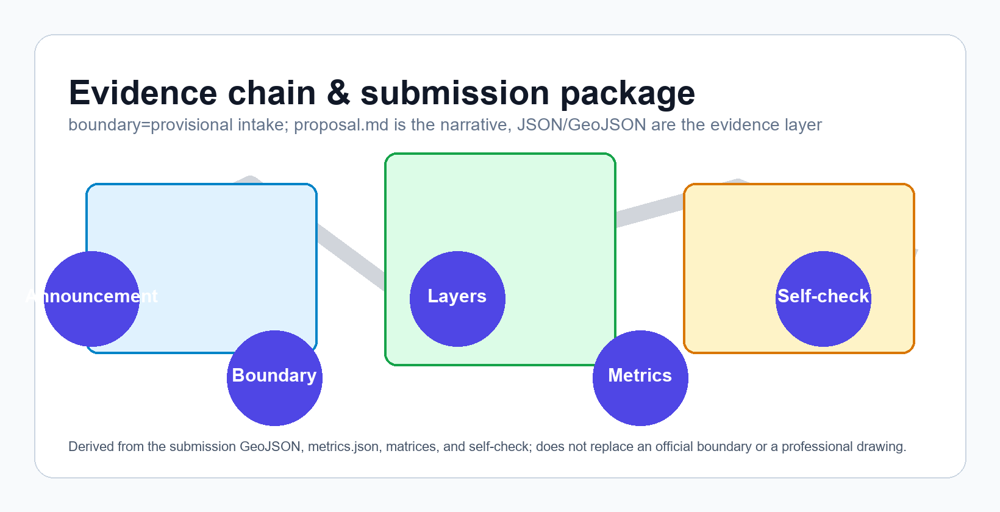

## Site Context & Resource Analysis

This chapter answers "why this corridor, what is its current state, and what assets do we hold" — existing problems are the starting point of planning, and resource endowment is the foundation of the proposal [depth:existing_conditions_diagnosis] [data:geometry/site_boundary.geojson#SITE-001].

### Historical Development: A Railway Materializing "Self-Innovation"

- **1909**: Zhan Tianyou led the construction of the Jing-Zhang Railway — China's first trunk line independently designed and built; the "Ren-shape" switchback conquered the 33‰ Guantou steep grade, opening the first year of Chinese self-innovation; the Ren-shape is both an engineering achievement and national memory of "overcoming technical obstacles with Chinese wisdom" [source:AGENT-TASKBOOK].
- **Qinghua Garden Station (1910 red-brick)**: a historical coordinate of the imperial-exam journey to Beijing and a physical witness of Chinese railway modernization — a dual landmark of revolutionary culture and modernization.
- **2016–2019**: the old line went underground and the Jing-Zhang HSR opened; the retired line freed a continuous ~9km corridor now being built into the Jing-Zhang Railway Heritage Park — the railway transformed from transport tool into urban public space and cultural memory carrier, a landmark renewal event.
- **Dazhongsi (Ming-dynasty temple)**: anchor of ancient-city memory; together with railway heritage and Zhongguancun innovation culture, it forms the "triple heritage".

### Current Conditions: The Highest-Density "Intelligence Corridor" in China

- **Mobility**: Qinghe Station (Jing-Zhang HSR hub) at the north and Xizhimen at the south form national-grade twin high-speed-rail gateways; Lines 13, 15 and Changping run in parallel — the most distinctive strategic asset of the area [depth:traffic_rail_slow_parking].
- **Facility maturity**: 30+ universities and institutes (Tsinghua, Peking, Beihang, BUPT, BJTU, CAS) line the corridor — the highest education/research density in the country; healthcare, commerce and cultural facilities are complete; the urban service base is mature.
- **Industry and business**: within 3km² of the AI Origin Community — 1,000+ AI scientists, developer population (per AGENT-TASKBOOK background, awaits official confirmation), enterprise count (per AGENT-TASKBOOK background, awaits official confirmation), young student population (per AGENT-TASKBOOK background, awaits official confirmation), ~180 OPC one-person companies; Dazhongsi is iterating from low-efficiency commerce to smart consumption (1733 anchor ignited); Wudaokou concentrates youth consumption — **the renewal engine is already alight; what is missing is the spatial carrier that threads them into an innovation network** [source:AGENT-TASKBOOK].
- **Renewal status**: industrial-heritage activation (old factories, locomotive depots, signal towers) runs in parallel with obsolete-building renewal; tapping stock space is the main path.

### Policy Setting: The Policy Window Is Fully Open

- **Beijing AI Innovation Highland Action Plan (Jan 2026)**: grow core AI industry scale past one trillion yuan within about two years, build a "one core, multi-point" layout centered on Haidian; Haidian's "Origin Community" was selected among the first 4 AI innovation blocks.
- **Haidian "Two Zones One Belt" comprehensive plan**: Origin Community, Beiwei Community and the **Century-Old Jing-Zhang AI Innovation Belt** as core anchors; the Beijing Zhihui AI Application Cooperation Center (hosting the SCO AI Application Cooperation Center operation) was established.
- **Block control plan approved (Aug 2026, per Beijing Daily / People's Daily Online)**: the *Beijing Haidian Jing-Zhang Railway Heritage Park Corridor (AI Innovation Block Key Area) HD00-1601 etc. Block Control Detailed Plan (Block Level) (2024–2035)* — the most authoritative and direct planning basis — gives the official "One Belt, One Axis, Two Cores, Multi-Points" structure (Dazhongsi Center, Wudaokou Center), leading urban renewal with green public space, supporting AI innovation block construction, and developing large models, agents and embodied intelligence; the plan covers 9 building-led blocks of about 1,668.2 ha bounded by Xinjiekouwai Street (east), Zhongguancun Avenue (west), Chengfu Road (north) and Xizhimenwai Street (south) [source:REGULATORY-PLAN-APPROVED-20260811] [source:REGULATORY-PLAN-APPROVED-20260811-ALT].

> **Planner's judgment**: this is a golden site where "historical depth × industrial density × renewal momentum × policy window" stack together. The control plan is the chassis; this proposal is a conceptual deepening on top of it — it must echo the control-plan structure while connecting the already-alight industries through AI scenarios and public space.

### Resource Analysis: Three Asset Types Supporting the Proposal

| Resource | Content | Support to the proposal |
|---|---|---|
| **Heritage & culture** | Jing-Zhang Railway (Ren-shape/Zhan Tianyou), Qinghua Garden Station (exam origin), Dazhongsi (ancient-city memory), Zhongguancun (reform-and-opening innovation culture) — triple heritage | Culture anchors the soul: "Access—Origin—Echo" three-stage storyline + 4 pilgrimage landmarks |
| **Innovation** | 30+ universities/institutes, AI Origin Community (1,000+ scientists/developer population (per AGENT-TASKBOOK background, awaits official confirmation)/enterprise count (per AGENT-TASKBOOK background, awaits official confirmation)), Zhongzhi Park, Zhongguancun Science City | Innovation empowers: One-Core-Three-Circles ecosystem + full-stack self-innovation system + 12 scenario cards |
| **Youth & people** | young student population (per AGENT-TASKBOOK background, awaits official confirmation), developer population (per AGENT-TASKBOOK background, awaits official confirmation), OPC entrepreneurs, 450,000 residents along the corridor | Vitality gathers people: 6 persona groups shape function and space — read people first, then ignite points |

### Problem Diagnosis (Six Dimensions)

| Dimension | Existing problem | Proposal response |
|---|---|---|
| Mobility | Twin HSR gateways + three lines, but slow-mobility gaps and weak station-city links | Hub activation, three-paths-one-green system, gap stitching |
| Facilities | Dense but east-west split (Line 13 viaduct barrier) | People stitching, under-viaduct activation, ground-floor openness |
| Business | 1733 anchor ignited, but lacks AI-native containers | Format iteration, AI-native commerce sandbox |
| Heritage | Triple heritage coexists, lacks contemporary translation | Heritage catalyst, pilgrimage landmarks, wayfinding symbols |
| Industry | Lacks space containers for the full-stack innovation chain | Scenario weaving, Stack Sanctuary, safety sandbox |
| Ecology | Thin green belt, blue-green network not systemic | Blue-green stitching, fishbone network, 20-minute park plan |

### Spatial Scope: Baseline Layers for the Existing-Conditions Analysis

The existing-conditions analysis proceeds on three spatial layers, each with a distinct boundary status and data maturity, which determines the confidence level of every statement [source:OFFICIAL-ANNOUNCEMENT] [source:REGULATORY-PLAN-APPROVED-20260811]:

| Layer | Scope | Boundary status | Use in existing-conditions analysis |
|---|---|---|---|
| **L1 Regional synergy layer** | Coordinated research area 43.6km² (5th Ring Road N — Jingzang Expressway E — Xizhimenwai St. S — Wanquanhe Rd. W) | Provisional boundary | Macro pattern: culture/industry/university belts, synergy with Beiwei Community, Future Science City, Huairou Science City and Beijing E-Town |
| **L2 Block control layer** | Official control-plan scope ≈1,668.2ha (Xinjiekouwai St. E — Zhongguancun Ave. W — Chengfu Rd. N — Xizhimenwai St. S, 9 building-led blocks) | **Officially approved (Aug 2026)** | Official skeleton of the analysis: "One Belt, One Axis, Two Cores, Multi-Points" structure, functional baseline of 9 blocks |
| **L3 Key design layer** | Three key areas 368.4ha (Zhongzhiyuan 192.1 / AI Origin 104.3 / Dazhongsi 72.0) | Provisional (no official boundaries) | In-depth baseline of the three cores, anchored by the control-plan "two cores" (Dazhongsi Center, Wudaokou Center) |

> **Scope discipline**: L2 is the only layer where "officially approved" wording is used — the control-plan scope, four limits, 9 blocks, 1,668.2ha and "One Belt, One Axis, Two Cores, Multi-Points" all come from official media coverage of the control plan approved in Aug 2026 [source:REGULATORY-PLAN-APPROVED-20260811]; L1/L3 boundaries are always labeled "provisional boundary / conceptual suggestion", and no precision beyond source confidence is claimed; the statutory control-plan text and drawings prevail once published by the authority.

## Narrative Thread: From One Railway to an Intelligence Net

The full narrative of this proposal runs on a single thread: **how a railway independently built a century ago grows on this land into an intelligence net serving the future**. Three sentences tell the thread:

1. **Origin (heritage)**: In 1909, Zhan Tianyou's "Ren-shape" switchback enabled China's first independently built trunk line to conquer the Guantou steep pass — the spirit of self-innovation took root here;
2. **Spark (present)**: today, within 3km² of the AI Origin Community — 1,000+ AI scientists, developer population (per AGENT-TASKBOOK background, awaits official confirmation), enterprise count (per AGENT-TASKBOOK background, awaits official confirmation) and young student population (per AGENT-TASKBOOK background, awaits official confirmation) — the spark of innovation is already alight;
3. **Translation (future)**: translating the self-innovation spirit of the "Ren-shape Railway" into the "Ren-shape Intelligence Net" — along the 9km Jing-Zhang Railway Heritage Park green corridor, AI spills from buildings to streets and from laboratories into daily life, ultimately activating the 43.6km² study scope.

The thread is organized by the "four elements", unfolded by "one activation path", and delivered by "six agent tasks"; every chapter is one link of the thread:

| Thread link | Corresponding chapter | Organizing logic |
|---|---|---|
| Why here (heritage + spark) | Overall Concept / Three-Level Scope | Culture anchors the soul · Innovation empowers |
| How to organize (catalyst network) | Overall Spatial Structure | One Corridor · Three Cores · Two Wings · Multi-Points |
| For whom (people-driven) | AI Ecosystem / Personas | Vitality gathers people |
| How to deliver (scenarios + implementation) | Scenario Cards / Renewal / Events | Innovation empowers · Quality builds the base |
| How to sustain (indicators + compliance) | Indicators / Compliance | Traceable, growable |

> **In one sentence**: renewal is not igniting from zero, but connecting pipelines to industries already alight — every design in this proposal is the spatial expression of such a "pipeline".

### Planning Objectives (Responding to the Three Positionings and Five Functions)

Building on the diagnosis, the proposal sets three progressive objectives, each responding to the announcement's positioning and functions [standard:PROJECT-AGENT-OPEN-CALL-TASKBOOK]:

| Objective layer | Content | Positioning/function |
|---|---|---|
| **Objective 1: Culture** | Make the Century-Old Jing-Zhang Culture Belt "perceivable" — triple heritage forms a complete narrative and pilgrimage system | Culture belt · Cultural-center function |
| **Objective 2: Industry** | Make the AI Integration Innovation Belt "growable" — closed full-stack innovation chain from origin to application | Innovation belt · Full-stack self-innovation / world-class ecosystem |
| **Objective 3: Life** | Make the Urban AI Life Experience Belt "experienceable" — AI scenarios land in streets, parks and daily life | Experience belt · AI+ scenarios / vital city / governance voice |

The three objectives map one-to-one onto the spatial structure: culture anchors "two gateways + 4 pilgrimage landmarks", industry anchors "three-core innovation chain", life anchors "two wings + multi-points + 12 scenario cards". All objectives are conceptual and delivered progressively through phasing.

### Planning Strategies: From Diagnosis to Objectives to Strategies to Spatial Structure

The core logic chain of the proposal is "**existing conditions → planning objectives → planning strategies → spatial structure**": diagnosis is the starting point, objectives set the direction, the seven strategies are the translation mechanism, and the spatial structure is the landing point. Every diagnosed problem maps to an objective layer, a strategy and a spatial anchor, forming a fully traceable chain [depth:existing_conditions_diagnosis] [standard:PROJECT-AGENT-OPEN-CALL-TASKBOOK]:

| Existing problem (six dimensions) | Objective layer | Strategy | Spatial anchor |
|---|---|---|---|
| Mobility: slow-mobility gaps, weak station-city links | Life (experienceable) | Strategy 6 Hub activation | Qinghe "Jing-Zhang Gateway" + Xizhimen "South Gateway", three-paths-one-green slow network |
| Facilities: east-west split (Line 13 viaduct) | Life (experienceable) | Strategy 2 People stitching | 9km green-corridor innovation network, AI community stations, ground-floor openness |
| Business: lacks AI-native containers | Industry (growable) | Strategy 5 Format iteration | Dazhongsi AI-native commerce test field, Wudaokou youth co-creation block |
| Heritage: triple heritage lacks contemporary translation | Culture (perceivable) | Strategy 1 Heritage catalyst | 4 pilgrimage landmarks, sleeper inscriptions, Origin dialogue axis, wayfinding symbols |
| Industry: lacks space containers for full-stack chain | Industry (growable) | Strategy 3 Scenario weaving | Three-core innovation chain, Stack Sanctuary, safety sandbox, 12 scenario cards |
| Ecology: thin green belt, no systemic blue-green network | Quality (livable) | Strategy 4 Blue-green stitching | Fishbone blue-green network, 20-minute park plan, sponge+smart |
| Policy: control-plan structure fixed, needs deep alignment | Quality (livable) | Strategy 7 Policy synergy | Alignment with "One Belt, One Axis, Two Cores, Multi-Points", near-mid-long phasing |

> **Logic closure**: six problems are translated through three objective layers (culture/industry/life) into seven strategies, landing on the "One Corridor, Three Cores, Two Wings, Multi-Points" structure and the 12-node catalyst network — the proposal is not a simple stack of "objectives + form" but an integrated design driven by problems, translated by strategies, and landed in structure. This chain unfolds through the following chapters (Overall Concept, Three-Level Scope, Key Areas, Scenario Cards, Indicator System).

## Overall Concept: Jing-Zhang Intelligence Artery (JZ-IA)

### Naming System and Design Motif

The overall concept is the **Jing-Zhang Intelligence Artery (JZ-IA)**: with the century-old Jing-Zhang spirit of self-reliant innovation as the cultural core, and **"switchback railway → switchback intelligence network"** as the spatial motif — a century ago Zhan Tianyou used a switchback alignment to carry trains over the Guanggou pass; today this land uses a switchback intelligence network to carry AI across the "technology–industry–life" conversion gap [source:AGENT-TASKBOOK].

- **Primary name**: 智脉京张 / Jing-Zhang Intelligence Artery ("intelligence" for AI; "artery" for both the switchback rail topology and the urban/innovation circulation; "Jing-Zhang" anchoring the historical lineage);
- **One corridor**: the Intelligence Artery Corridor (the 9 km Jing-Zhang Heritage Park vitality corridor);
- **Three cores**: Zhongzhi Park·Source Core (origination) / Beijing AI Origin Community·Conversion Core / Dazhongsi·Application Core;
- **Two wings**: Zhongguancun Technology Service Wing (west) / Xiaoyue River Scenario Empowerment Wing (east);
- **Multiple nodes**: 12 key nodes (2 gateways + 4 cores + 6 supports).

The naming is not a slogan but is deeply linked to the industrial ecology, public space and cultural resources: the three cores are strung along the 9 km corridor, the two wings extend east and west, and the multiple nodes host 12 scenario cards, forming a two-layer system of "unified brand, distinctive nodes" [standard:PROJECT-AGENT-OPEN-CALL-TASKBOOK].

### Response to Capital Functions

This area is the spatial intersection of Beijing's two core capital functions — the National Science and Technology Innovation Center (carried by Zhongguancun Science City, the AI Origin Community and Zhongzhi Park) and the National Cultural Center (carried by the Jing-Zhang railway heritage, Tsinghua Garden Station and Zhongguancun innovation culture) [source:AGENT-TASKBOOK]. The creativity and measures of this proposal respond to both capital functions: innovation needs cultural nourishment, and culture needs innovative expression.

### Four Value Elements (Organizing Logic of All Creativity and Measures)

> **Culture anchors the soul · Innovation empowers development · Vitality gathers people · Quality builds the foundation**

| Element | Meaning | Core Strategy Anchors |
|---|---|---|
| **Culture** (soul of design) | Triple-heritage narrative, Jing-Zhang spirit, urban lineage | Heritage catalyst, pilgrimage landmarks, wayfinding symbols |
| **Innovation** (engine of growth) | AI industrial ecology, scenario implementation, governance innovation | Scenario weaving, format iteration, full-stack system |
| **Vitality** (state of the city) | People's activities, 24-hour city, public space | People stitching, hub activation, youth co-creation |
| **Quality** (foundation of life) | Spatial quality, public services, livability | Blue-green stitching, policy synergy, community stations |

### Overall Spatial Structure: One Corridor, Three Cores, Two Wings, Multiple Nodes — Catalyst Activation Network

Echoing the approved Jing-Zhang Railway Heritage Park corridor regulatory detailed plan structure ("one belt, one axis, two centers, multiple points"), this proposal injects the catalyst logic:

| Structure | Content | Catalyst Logic |
|---|---|---|
| **One corridor** | Intelligence Artery Corridor (9 km vitality corridor) | Ready-made activation channel linking history, ecology, commuting and social life |
| **Three cores** | Zhongzhi Park (origination) → AI Origin Community (conversion) → Dazhongsi (application) | Three catalyst points for the "origin–conversion–application" innovation chain |
| **Two wings** | Zhongguancun Service Wing (west) / Xiaoyue River Scenario Wing (east) | Three-areas-two-wings synergy loop |
| **Multiple nodes** | 12 nodes incl. Qinghe Station, Zhongzhi Park, Tsinghua Garden Station×Origin Tower, Dazhongsi, Zhichun Road, Sidaokou | Secondary catalysts that activate the belt into an area |

**Activation path**: taking the AI Origin Community (an already-lit spark: 1,000+ AI scientists, developer population (per AGENT-TASKBOOK background, awaits official confirmation) and enterprise count (per AGENT-TASKBOOK background, awaits official confirmation) within 3 km²) as the first catalyst → conducting along the 9 km corridor north and south → Zhongzhi Park carries origination and Dazhongsi carries application → the two wings and multiple nodes bring innovation into communities and streets → finally activating the 43.6 km² coordinated research area [source:AGENT-TASKBOOK].

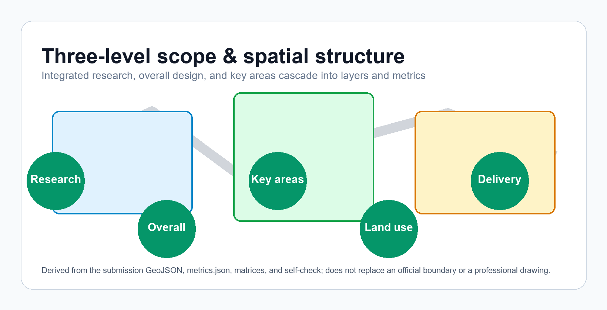

### Visual Identity & Final Logo

The master brand "JZ-IA / Zhi-Mai Jing-Zhang" adopts a **finalized logo** (AI-generated original, no third-party trademark/portrait dependencies).

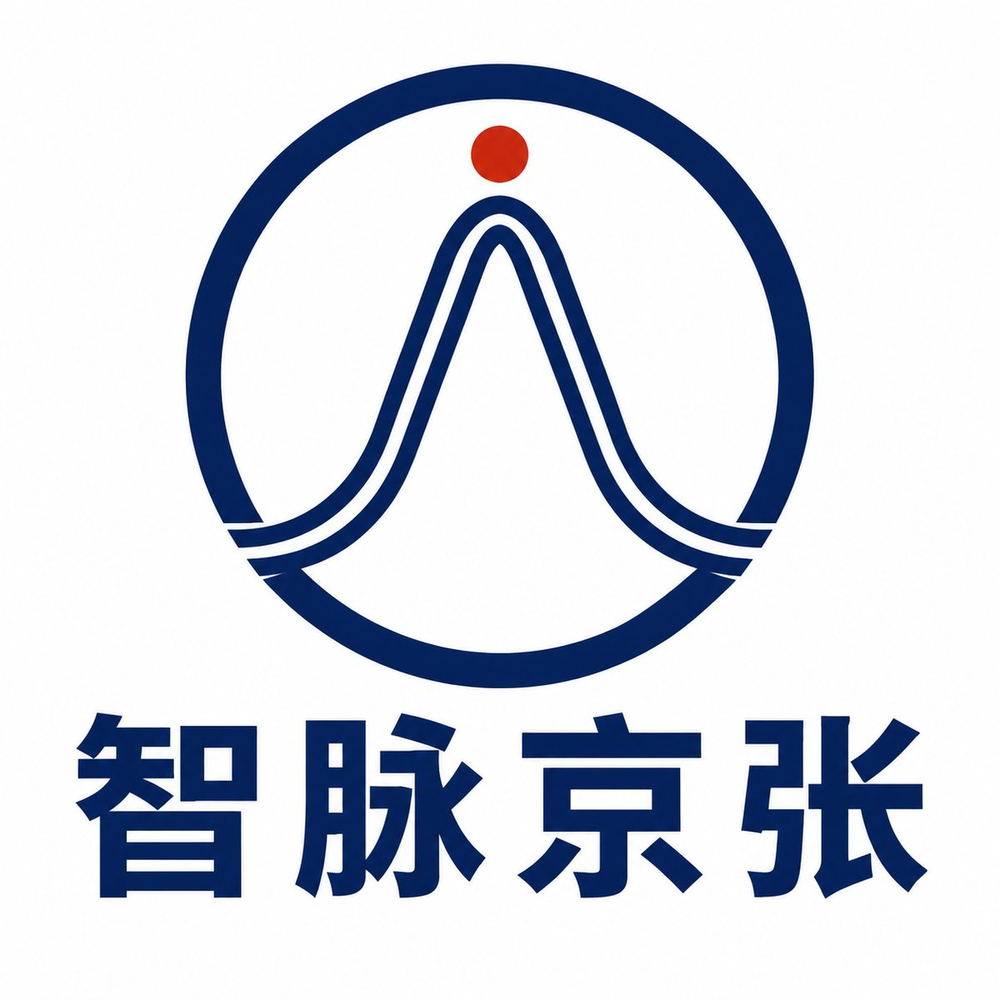

**Design note (200 words)**:

The "Zhi-Mai Jing-Zhang" logo takes as its core motif the **ren-shaped switchback** pioneered by Zhan Tianyou at Qinglongqiao in 1909 — the most distinctive spatial symbol in Chinese railway history. The dual-track "ren" keeps a visible gauge gap, so the railway body is recognizable at a glance; the two arms meet at the apex, echoing the locomotive's "reverse up the slope, then switchback forward" movement — the **switchback point is elevated into the AI origin** (the brick-red node at the apex); the deep navy ring symbolizes the **symbiotic belt** where AI and century-old heritage coexist. The "ren" in the logo is one unbroken flowing line — flowing in from history, cresting at the switchback apex, and toward the future — linking the century-old railway and the AI innovation belt into the same "intelligent artery", echoing the "ren-shaped railway → ren-shaped intelligence net" motif. The wordmark "智脉京张" carries equal visual weight to the emblem, works in single color, is fabricable in 3D and adaptable to cultural products. AI-generated original, no third-party trademark dependencies.

**Wordmark "智脉京张"**: total width ≥ 90% of ring diameter, character height ≥ 25%, equal visual weight to the emblem, ensuring legibility at distance and small sizes.

**Application matrix** (concept exploration + AI-generated original):

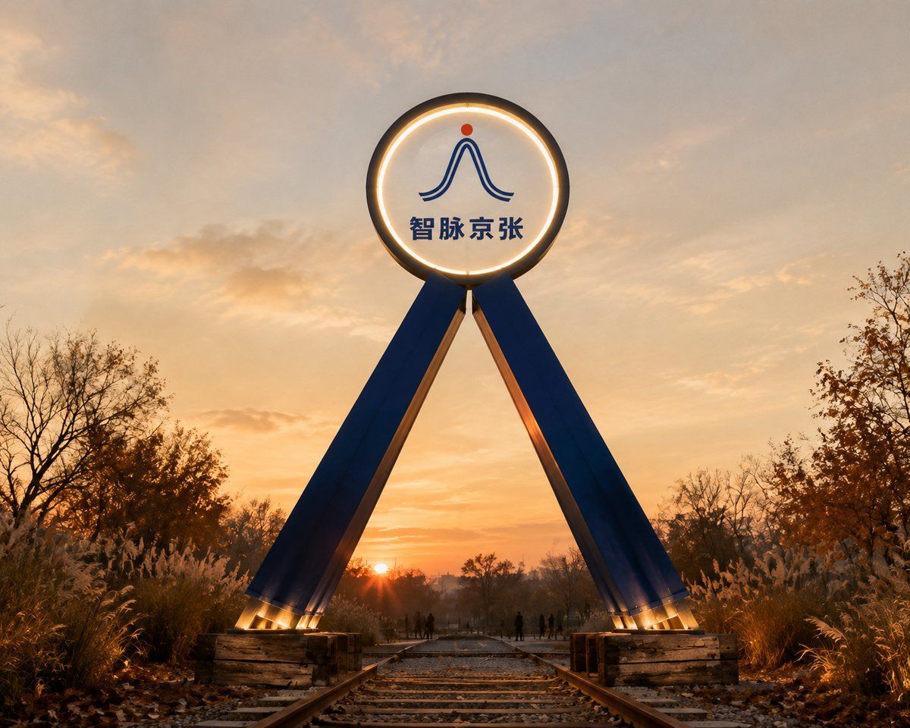 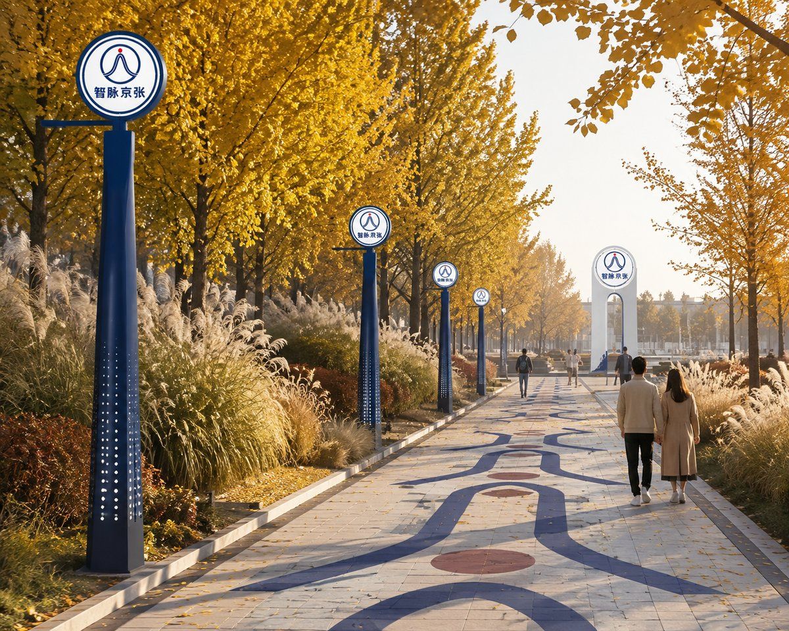 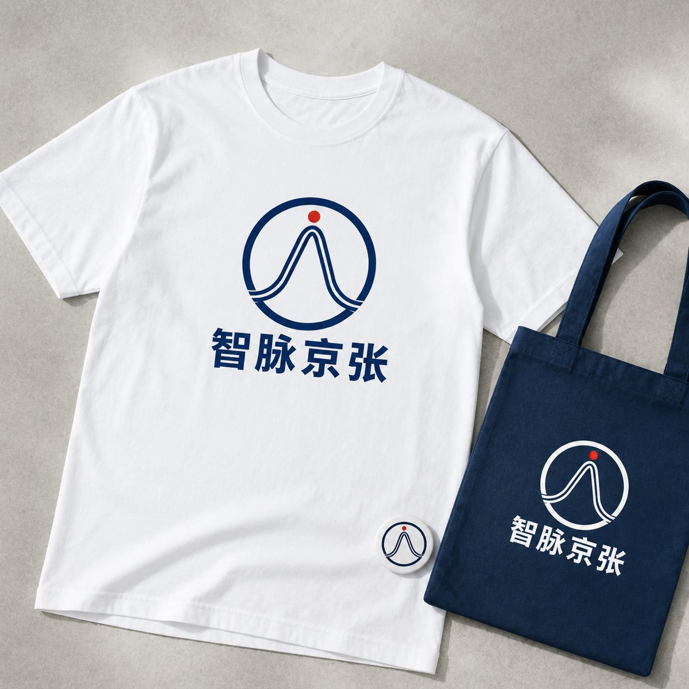 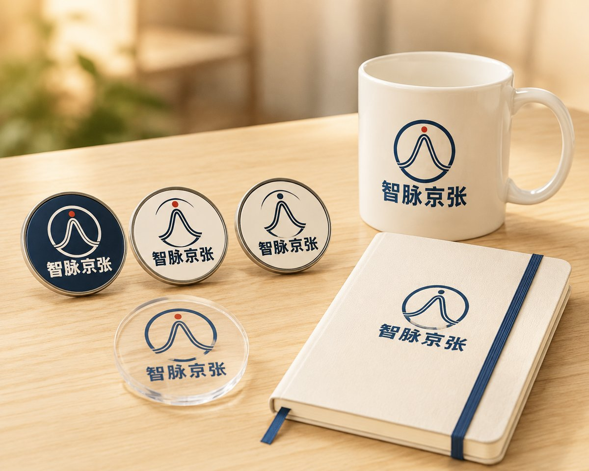

① Node gateway · 5m ren-shaped steel landmark tower (luminous ring with embedded logo)｜ ② Corridor · ground ren-shaped dual-track paving motif + intelligence lamp top identifier｜ ③ Cultural · T-shirt single-color navy print｜ ④ Cultural · enamel fridge magnets / badges / mug

**Color & specification** (draft):
- Primary: navy #1A2B5C (technology/artery) + brick red #B8442F (heritage/railway) + gold #C9A961 (century/honor)
- Single-color silhouette works, legible at 3cm, fabricable in 3D (steel / LED), adaptable to T-shirt / fridge magnet / wayfinding / landscape sculpture
- Before final implementation, requires professional design + legal review (trademark registration, type spec, printing craft)

## Three-Level Scope Framework

The proposal is organized by the three levels defined in the announcement: the coordinated research area (43.6 km²) focuses on AI industrial ecology, strategic positioning, the innovation chain and future urban form; the overall design area (11.4 km²) covers the 1–2 km urban and industrial belt around the Jing-Zhang Heritage Park, requiring an overall urban renewal framework, industrial spatial layout, transport-municipal support and urban character control; the key areas (368.4 ha) cover three detailed design districts, requiring functional formats, building scale, retain/renovate/demolish classification, public space connectivity and traffic organization [source:PROCESSED-FACT-PACK] [depth:three_level_scope_framework].

| Level | Design Question | Proposal Answer |
|---|---|---|
| Coordinated research area | How to organize AI industrial ecology and future urban form | Innovation chain of "university origination–open-source collaboration–enterprise conversion–public experience–international communication" |
| Overall design area | How to map industry, renewal, transport and character | Land use, buildings, roads, green space, public space and phasing layers |
| Key areas | How to reach detailed design depth | Positioning, spatial moves, AI scenarios and implementation dependencies for each |

## Coordinated Research Area: Industry and Future City Strategy

The core task of the coordinated research area is to build a world-class AI innovation ecosystem. The proposal maps Haidian's universities, leading enterprises, computing-power/data elements, incubation platforms and technology service resources, and proposes a spatial synergy framework for the AI innovation chain, industry chain, talent chain and urban service chain [source:AGENT-TASKBOOK] [standard:MOHURD-URBAN-DESIGN-MEASURES].

**AI Innovation Ecosystem Map (one core, three rings)**: the talent ring (30+ universities and institutes incl. Tsinghua, Peking University and CAS; 1,000+ AI scientists; developer population (per AGENT-TASKBOOK background, awaits official confirmation); 100,000 students; ~180 OPC one-person companies), the capital ring (venture funds, Dongsheng Cup / Origin Cup competitions, five-party-six-force conversion mechanism, Qingzhi Park with valuation over ¥30 billion), and the scenario ring (Xiaoyue River wing + full-belt scenario cards) revolve around the AI Origin Community, forming an eight-factor closed loop: land, space, industry, capital, talent, computing power, data and scenarios [source:AGENT-TASKBOOK] [metric:key_area_count].

**Future urban form**: AI transport systems, continuous green space, innovation service facilities and an internationalized living-working atmosphere are implemented as locatable functional zones, nodes, corridors and scenarios; global AI innovation events, developer communities, open scenarios and pilgrimage routes are all framed as "conceptual suggestions / reference schemes / material for professional teams to deepen", not as confirmed government activities [source:AGENT-TASKBOOK].

## Overall Design Area: Urban Renewal and Regulatory-Detail Urban Design

The overall design area requires the depth of a regulatory detailed plan. The proposal presents the overall spatial structure for urban renewal, identification of underused space, a renewal project list, implementation policy suggestions and industrial function proportions [standard:MOHURD-CONTROL-DETAILED-PLANNING] [depth:land_use_layout] [data:geometry/land_use.geojson#LU-001] [data:geometry/buildings.geojson#BLDG-001] [data:geometry/roads.geojson#ROAD-001] [metric:building_footprint_area_sqm].

**Seven-strategy system** (organized by the four elements):

1. **Heritage catalyst** (culture): using the switchback motif to build a cultural narrative line, wayfinding system and spatial symbol system; upgrading Tsinghua Garden Station into a "digital red classroom" and weaving railway-heritage interpretation and AI interactive science popularization along the corridor [data:geometry/constraints.geojson#CONSTRAINTS];
2. **People stitching** (vitality): upgrading the 9 km corridor into an "innovation interaction network", placing AI community stations in 70 neighborhoods, and opening ground floors of parks to streets so innovators and 450,000 residents meet [data:geometry/public_space.geojson#PUBLIC-001];
3. **Scenario weaving** (innovation): 10+ scenario cards along the corridor, 3 test-and-validate scenarios, and a public AI living room every 500 m, letting AI overflow from buildings to streets and parks [depth:traffic_rail_slow_parking];
4. **Blue-green stitching** (quality): a "fishbone" blue-green network with the corridor as spine and Qinghe–Xiaoyue River–community parks as branches, a "20-minute park" plan, sponge city + smart systems [data:geometry/green_space.geojson#GREEN-001] [metric:green_ratio];
5. **Format iteration** (innovation): Dazhongsi AI-native consumption test field (1733 first-store cluster + Lanjing Lijia renewal), Wudaokou youth co-creation block, Zhongzhi Park industrial service complex;
6. **Hub activation** (vitality): dual high-speed-rail gateways — Qinghe Station "Jing-Zhang Gate" and Xizhimen "Jing-Zhang South Gate" — with station-city integration, AI image display and global launch venue;
7. **Policy synergy** (quality): strictly aligning with the regulatory plan structure and linking the Origin Community 2.0, Zhongzhi Park and AI-Park key projects in near/mid/long-term phases [data:geometry/phasing.geojson#PHASE-001].

The transport proposal responds to requirements for station integration, road micro-circulation, slow-traffic gap repair, parking and green transport, covering the North 5th Ring, corridor overpass nodes, Wudaokou, Dazhongsi station and key enterprise surroundings; building height, intensity, road red lines, setbacks and facility standards are written as "pending official regulatory conditions" until official controls are available [depth:traffic_rail_slow_parking] [depth:municipal_new_infrastructure].

## Detailed Design of Key Areas

Detailed design of the three key areas is mandatory, covering functional formats, building scale, retain/renovate/demolish classification, public space systems, traffic organization and implementation projects, all framed as conceptual suggestions [data:geometry/key_areas.geojson#PROV-KEY-001] [data:geometry/key_areas.geojson#PROV-KEY-002] [data:geometry/key_areas.geojson#PROV-KEY-003] [depth:three_key_area_detailed_design].

| Key area | Design positioning | Spatial moves | AI industry and operation scenarios |
|---|---|---|---|
| Zhongzhi Park AI Acceleration Area (192.1 ha) | Full-stack innovation block (Source Core·Full-Stack Temple) | Strengthen the Qinghe frontage, industry display, low-carbon innovation interaction; green space carries open testing and governance display | Open-source consortium, AI4S, AI safety, AI going-global hall, standards governance |
| Beijing AI Origin Community (104.3 ha) | Near-campus conversion and talent community (Conversion Core·Origin Dialogue Axis) | Stitch campus-park-block slow traffic; 300 m time-space dialogue axis from Tsinghua Garden Station to Origin Tower | Open-source community, results release, OPC hub, talent zone, near-campus incubation |
| Dazhongsi AI Industry Cluster (72.0 ha) | Intelligent economy and international exchange block (Application Core·Ancient Bell New Wave) | Dazhongsi station integration, four-quadrant pedestrian connectivity, Ancient Bell Museum×1733×Lanjing Lijia composite anchor | Agent and terminal display, AI-native commerce, data elements, international roadshows |

### Design Analysis of the Three Key Districts (from design thinking to spatial moves)

**① Zhongzhi Park · Source Core "Stack Sanctuary" (192.1 ha)**

- **Design thinking**: organized as "One Core, Two Belts, Three Clusters" — the core is the central "Stack Sanctuary", a white streamlined exhibition cluster with the Ren-shape topological motif, hosting the open-source consortium HQ, AI 4S exhibition and going-global services; two belts are the Qinghe innovation interface belt (waterfront terraces + setback buildings) and the north vitality belt of the Intelligence Corridor; three clusters are R&D, testing and service.
- **Key spatial moves**: strengthen the Qinghe interface, industrial exhibition and low-carbon innovation exchange; carry open testing and standards-governance display with green space; equip an open test ground and AI safety sandbox to achieve full-stack self-reliance from computing to chip adaptation [data:geometry/key_areas.geojson#PROV-KEY-001].
- **Rendering**: E2 Stack Sanctuary (pedestrian view).

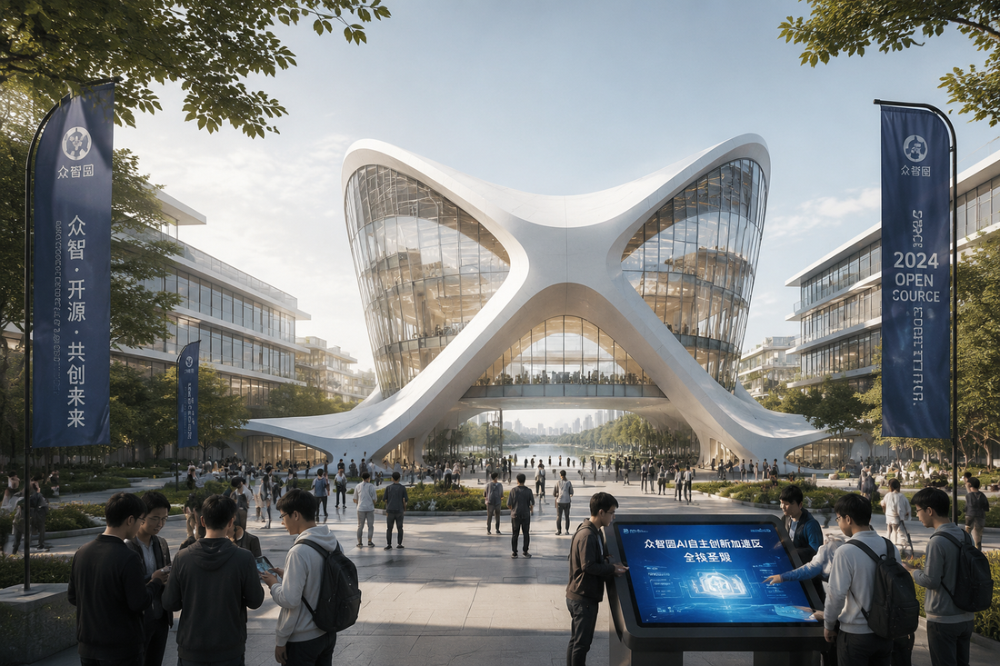

**② AI Origin Community · Transform Core "Origin Dialogue Axis" (104.3 ha)**

- **Design thinking**: organized as "One Axis, Two Zones, Multi-Points" — the 300m "Origin Dialogue Axis" faces Qinghua Garden Station at the west end (1910 red-brick, origin of the exam) against the Origin Building at the east end (origin of innovation) across time; an elevated pedestrian bridge over Metro Line 13 stitches the east-west split; two zones are the north near-campus translation zone (shared labs + roadshow halls) and the south young-talent life zone (apartments + youth co-creation street); multi-points include the OPC hub station and open-source community square.
- **Key spatial moves**: campus-park-block slow-mobility stitching, activating the "origin of exam × origin of innovation" dialogue; OPC one-person-company full-lifecycle services absorbing 100,000 students' low-cost startup needs [data:geometry/key_areas.geojson#PROV-KEY-002].
- **Rendering**: E3 Origin Dialogue Axis (pedestrian view).

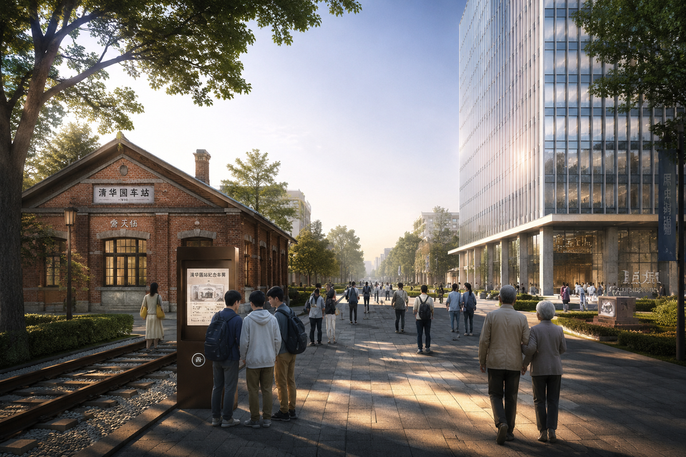

**③ Dazhongsi · Apply Core "Ancient Bell New Wave" (72.0 ha)**

- **Design thinking**: organized as "One Core, Two Streets, Three Quadrants" — the core is the Ancient Bell Museum cultural anchor (heritage untouched, 300m quiet plaza + AI light-art installations); two streets are the AI-native commercial street (1733 direction: unmanned retail, robot coffee) and the international-exchange street (Lanjing Lijia direction: exchange center + roadshow hall); three quadrants are the Dazhongsi station transit-oriented, consumption-experience and heritage-view corridor quadrants.
- **Key spatial moves**: Dazhongsi station integrated development and four-quadrant pedestrian connectivity; an "Ancient Bell × AI New Wave" urban living room hosting agent/terminal display and global AI roadshows [data:geometry/key_areas.geojson#PROV-KEY-003].
- **Rendering**: E4 Ancient Bell New Wave (pedestrian view).

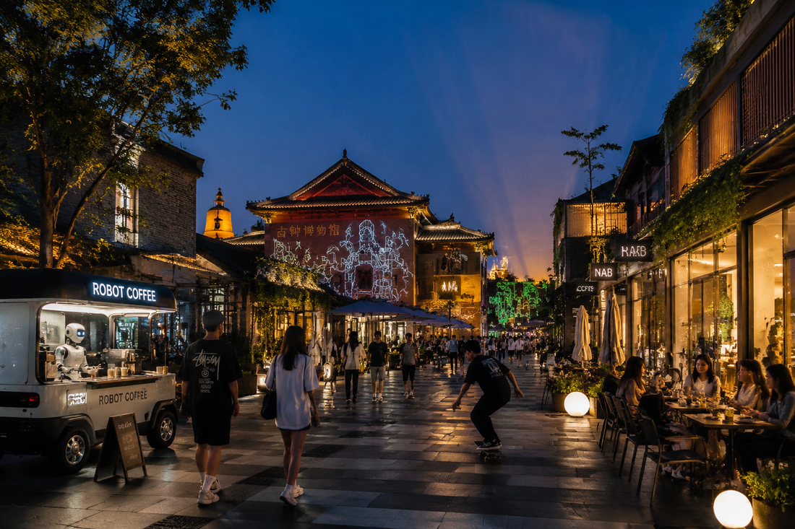

The three districts are seriated along the 9km Intelligence Corridor — Zhongzhi (Origin) → AI Origin (Transform) → Dazhongsi (Apply) — forming a complete AI innovation chain; the design language is unified (Ren-shape motif / three-color system / AI station kit), and the scale transitions north-to-south from large industrial blocks to human-scale commercial streets.

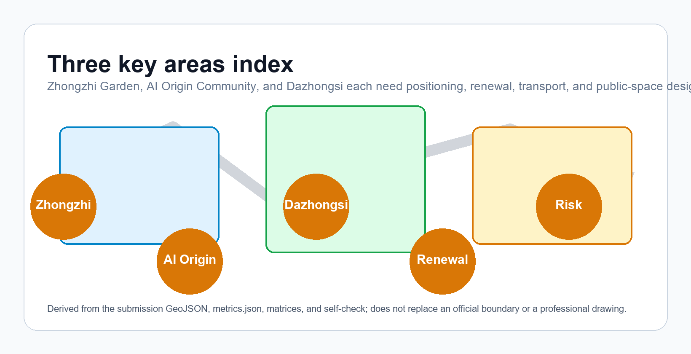

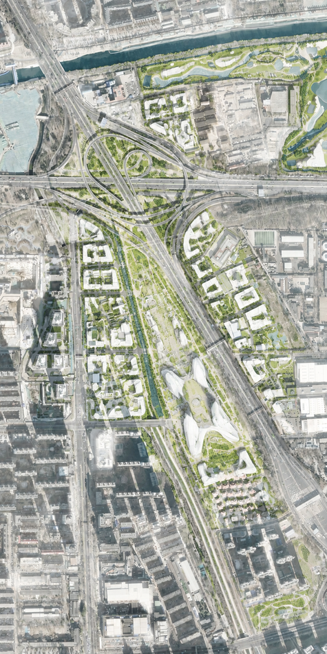

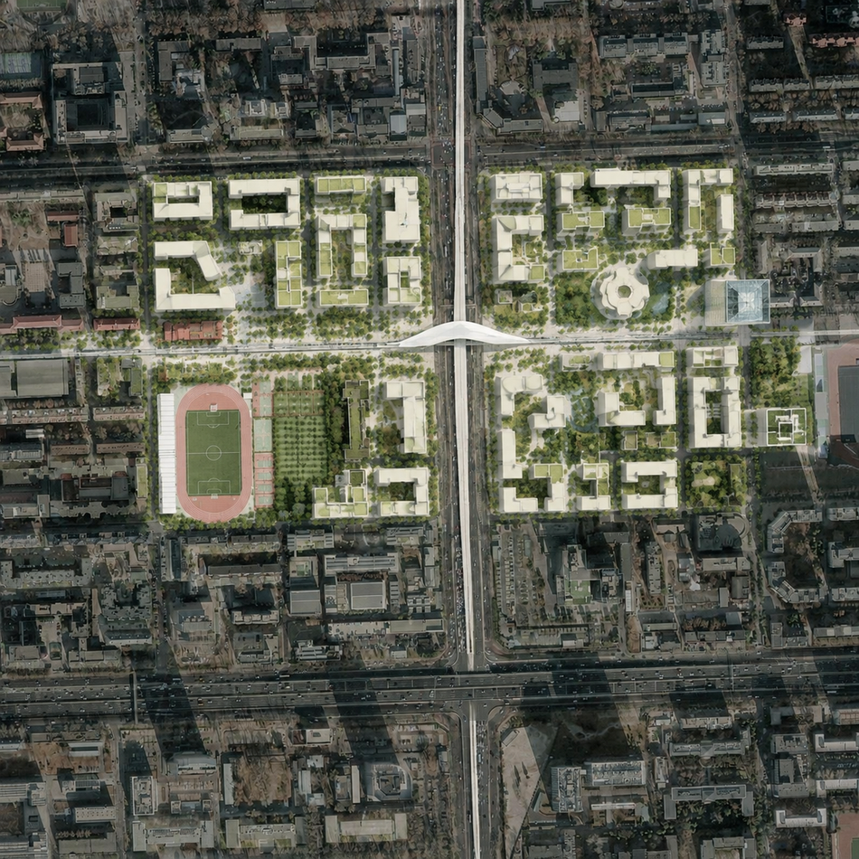

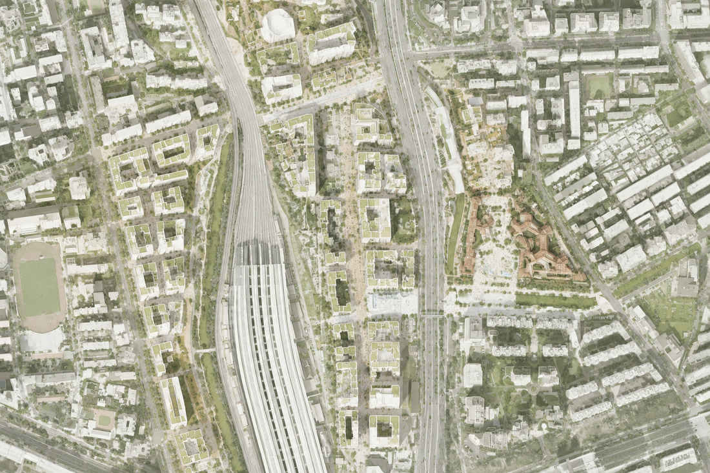

## AI Innovation Ecosystem, Talent Personas and AI+ Scenarios

### Global AI Innovation Ecosystem Benchmarks (10 cases)

To locate this proposal within the known sample lineage, the following 10 globally recognised AI innovation ecosystem cases are referenced with a quantitative benchmarking dimension (area/scale); data is from public sources (order-of-magnitude public figures, not field-measured), and deep quantitative calibration must await official data:

| Case | Country/City | Type | Area/scale (public) | Core institutions / density | Correspondence to this proposal |
|---|---|---|---|---|---|
| **King's Cross Knowledge Quarter** | UK · London | Old railway industrial district conversion | ~27 ha | 9 research institutions + Google DeepMind + Meta + British Library, ~300,000 m² TOD offices | Intelligence Corridor (rail heritage + AI cluster) |
| **Mission Bay, San Francisco** | USA · SF | University-anchored tech park | ~123 ha | Around UCSF + SF Port brownfield regeneration | Zhongzhi Park (Tsinghua/PKU + brownfield) |
| **Shenzhen Nanshan Smart Park / Tech Park** | China · Shenzhen | Government-led end-to-end park | ~11.5 km² (tech park area) | 30+ national incubators + ~300,000 m² offices | AI Origin Community (Qinghua Campus + incubation) |
| **Suzhou Industrial Park BioBAY/CDA** | China · Suzhou | Gov + state-owned + intl capital | ~7 km² | Biomedical + overseas partnerships | All factors (community + industry + state partnership) |
| **Hefei USTC Silicon Valley** | China · Hefei | Mega-science facilities + city-level brand | Multi-zone | 4 quantum/fusion mega-science facilities + 10,000 PhDs | One corridor + three cores of mega-science linkage |
| **Singapore One-North** | Singapore | Government-enterprise knowledge city | ~200 ha | JTC platform + cross-border R&D | Twin HSR gateways + global recruitment |
| **London St Pancras / King's Cross RSSB** | UK · London | Railway heritage regeneration | Station surroundings | Old rail hub + education/offices | Jing-Zhang Heritage Park (rail heritage) |
| **Seoul Digital Media City (DMC)** | Korea · Seoul | Old industrial site → digital media cluster | ~57 ha | Digital media + broadcasting + content, MBC/SBS HQ | Zhongzhi Park (media × AI crossover scenario) |
| **Toronto MaRS Discovery District** | Canada · Toronto | Downtown medical + tech cluster | ~15,000 m² core building | Adjacent to U of Toronto + hospitals + 250+ startups | AI Origin Community (campus-proximal commercialisation) |
| **Barcelona 22@ Innovation District** | Spain · Barcelona | Old industrial urban renewal | ~200 ha | Mixed-use + knowledge-intensive firms + housing restitution | Dazhongsi (stock renewal + vitality mix) |

**Conclusion (concept phase, five-dimension quantitative framework)**: Global AI innovation belts share five legs — government-led + university/research core + old industrial brownfield regeneration + metro/HSR gateway + global capital/technology linkage. This proposal aligns on all five: ① area scale (overall design 11.4 km², mid-to-large tier); ② industrial density (30+ universities/institutes, the national highest); ③ gateway linkage (Qinghe/Xizhimen twin HSR); ④ stock regeneration (old railway + old factories + low-efficiency commercial); ⑤ global recruitment (SCO AI Application Cooperation Center). **Specific industry size, TAM and capital scale must be re-validated against official data; this table only provides structural alignment.**

**Differentiation**: unlike the global cases, this proposal's unique triple overlay is "**railway heritage × AI innovation × university density**" — globally rare for a 9 km railway heritage park corridor to simultaneously carry a national university cluster and an AI innovation belt, which constitutes the core recognisability of the proposal.

### User Personas (6 types, scenario-oriented; ≥5 required)

| Persona | Scenario usage | High-frequency scenarios | Scenario demands |
|---|---|---|---|
| A Originators (scientists) | Deep research, data-intensive | Full-stack open source, safety sandbox | Computing, data, safety-evaluation space |
| B Innovation mainstay (developers) | Open-source collaboration, tech validation | Smart shuttle, Source Workshop, drone delivery | Open toolchain, test grounds |
| C Converters (entrepreneurs/OPC) | Roadshow fundraising, scenario matchmaking | OPC launch hall, robot station | Low-cost start, real scenarios |
| D Reserve force (students) | Research training, consumption and social | Red classroom, tech market | Learning + experience + low-cost living |
| E Life foundation (450,000 residents) | Daily commute, wellness and leisure | Health pod, corridor navigation, legal station | Affordable, convenient, safe |
| F Mobile vitality (commuters/visitors) | Transit, check-in, experience | Smart shuttle, Ancient Bell, market | Convenient, cultural, novel |

### External Regional Synergy (linkages with Beijing AI strategy + Jing-Jin-Ji)

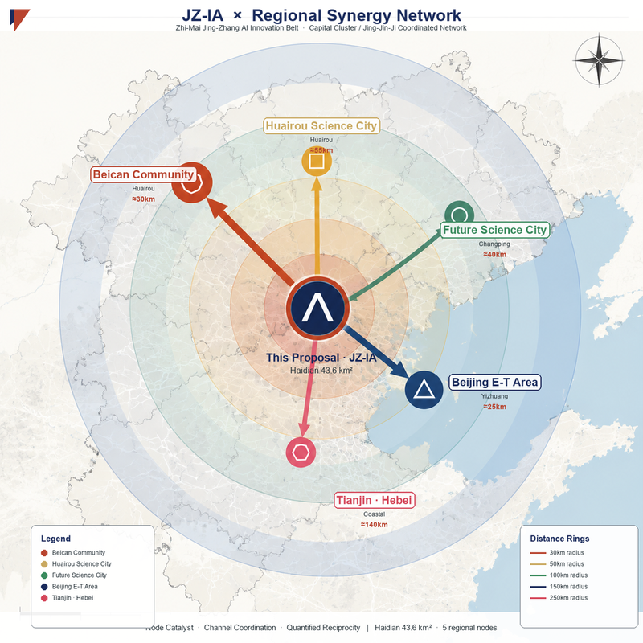

While the proposal focuses on Haidian's 43.6 km², it must structurally echo the capital-wide AI layout and the Jing-Jin-Ji coordinated-development strategy, avoiding internal closure:

| Cluster | Strategic positioning | Concrete channel | Linkage & co-creation mechanism | Mutual-benefit indicator (concept) |
|---|---|---|---|---|
| **Beizhi Community (Zhongguancun Science City North)** | Mega-science facilities + space + AI fundamental research | Metro Line 13 + Jingxin Expressway + Shangdi IT belt | Source Core + Intelligence Corridor extends north as a secondary "source–research" platform | Bidirectional source-talent/tech flow channel (frequency pending ops data) |
| **Future Science City (Changping)** | State-owned enterprises + energy + medicine | Jingzang Expressway + Metro Changping Line + Jing-Zhang HSR | AI + energy/medicine joint lab scenarios; governance-experience exchange | Joint scenarios ≥ 2 types (concept) |
| **Huairou Science City** | Mega-science facility cluster | Jingcheng Expressway + Jingmi Road | "South-publish, North-display" dual-centre structure for science popularisation / launches | Joint launches/popularisation ≥ 1/yr |
| **Yizhuang (Beijing ETDA)** | AI manufacturing, autonomous driving | South 5th Ring + Jingtai Expressway | Algorithm → compute → manufacturing chain; autonomous-driving open test zone extends from Zhongzhi Park | Autonomous-driving test scenario linkage ≥ 1 |
| **Tianjin / Hebei (Jing-Jin-Ji coordination)** | Compute, equipment, foreign trade | Jing-Zhang HSR + Jinghu/Jingguang corridors | Intelligence Corridor extends along Jing-Zhang HSR; AI compute scheduling and AI-equipment going-global linked via Qinghe / Xizhimen gateways | Compute scheduling node + going-global channel (concept) |

**Coordination principles** (conceptual): respect each cluster's official boundary and primary authority. This proposal only delivers three things — channels, linkages, co-creation mechanisms — it does not overstep authority, compete for primacy, or duplicate construction. Mutual-benefit indicators are conceptual targets requiring multi-party governance before professional estimation. All data come from public planning documents; this proposal does not constitute a commitment or judgement regarding other clusters.

### AI Scenario Cards (12 cards; ≥10 required)

| # | Scenario card | Spatial carrier | Design note |
|---|---|---|---|
| S1 | Smart shuttle·Jing-Zhang track | Corridor + Qinghe Station | Autonomous shuttle loop linking hub, Zhongzhi Park and heritage park |
| S2 | Red classroom | Tsinghua Garden Station | AI restoration of the "marching to Beijing" history, immersive study |
| S3 | Full-stack open source·Source Workshop | Zhongzhi Park | FlagOS ecosystem display, chip adaptation testing, developer community |
| S4 | OPC launch hall·Maker loop | AI Origin Community | One-person-company shared workstations + roadshow + launch venue |
| S5 | Health pod | Community stations | Smart check-up, chronic disease management, AI consult assistance (human review) |
| S6 | Corridor smart navigation | Full corridor | Crowd sensing, cycling navigation, safety alerts, accessibility aid |
| S7 | Neighborhood legal station | Dazhongsi/communities | AI legal consultation and mediation (fully human-reviewable) |
| S8 | Drone/robot delivery line | Xiaoyue River wing | Unmanned vehicle/drone delivery, test first then expand |
| S9 | Environmental watch | Blue-green network | Smart water/air/noise monitoring, open data |
| S10 | Tech market | Sidaokou | AI cultural products, smart retail pop-ups, maker showcases |
| S11 | Robot station | Wudaokou | Embodied-intelligence experience, robot coffee/guide |
| S12 | Safety sandbox·AI governance test field | Zhongzhi Park | Model evaluation, safety testing, standards pilot |

### Scenario–Space–Operation Mapping Matrix (12 scenarios × nodes × operations × phasing)

Each scenario card is anchored to a concrete spatial node with a conceptual operation entity and phasing, forming a "scenario–space–operation" closed loop rather than slogans [standard:PROJECT-AGENT-OPEN-CALL-TASKBOOK]:

| Scenario | Location | Node | Operator (concept) | Tech maturity | Regulatory permit | Data governance & security | Human takeover | Independent verification | Exit condition | KPI (draft) | Phase |
|---|---|---|---|---|---|---|---|---|---|---|---|
| S1 Smart transit | Corridor north | A1 Gateway | Government-enterprise pilot | TRL 7 (trial) | Autonomous-driving road-test permit | OD-anonymised only; explainability audit | Remote takeover operator | Third-party safety audit | Demote if punctuality <85% for 2 months | Punctuality ≥95% | Near |
| S2 Ren-shape classroom | Qinghua Garden Station | B2 Dialogue Axis | Museum + education | TRL 8 (mature) | Museum/education licence | No biometrics of children | On-site guide fallback | Curriculum review | Exit if <5,000 visits/yr | Annual ≥10,000 visits | Near |
| S3 Full-stack open-source | Zhongzhi Park | B1 Stack Sanctuary | OSS community + enterprise | TRL 8 | Open-source licence | Public attribution; container isolation | Community review / rollback | Biweekly release + review | Exit if contributors <100 | Monthly active contributors ≥200 | Near |
| S4 OPC Launch Hall | Origin Community | B2 Dialogue Axis | Park operator | TRL 7 | Platform review | Data stays in domain; purpose contract | Manual appeal window | Platform review | Exit if roadshows <15/month | Monthly roadshows ≥30 | Near |
| S5 Health pod | Community station | C nodes | Health authority + enterprise | TRL 7 | Medical-device registration/compliance | Health data minimisation + consent | On-site nurse | Medical-grade compliance | Exit if response >30 min sustained | Anomaly response ≤15 min | Near |
| S6 Corridor navigation | Whole corridor | Whole | Park operator | TRL 7 | Public-area surveillance permit | Camera auto-masking; 7-day retention | Volunteer patrol | Monthly audit | Exit if accessibility <90% | Accessibility pass ≥95% | Near-mid |
| S7 Neighbourhood legal post | Dazhongsi / community | B3/C5 | Justice office + law firm | TRL 8 | Legal compliance review | Case encryption + access trail | Human lawyer review | Legal compliance review | Exit if <3,000 consultations/yr | Annual ≥5,000 consultations | Mid |
| S8 Unmanned delivery | Xiaoyue River wing | C6 trial field | Platform enterprise | TRL 6 (test) | Road permit + trial | Route anonymisation | Manual delivery fallback | Road permit + trial | Exit if no delivery-time improvement | Delivery time −30% | Mid |
| S9 Environmental watch | Blue-green network | C1 waterfront | Municipal + eco enterprise | TRL 8 | Environmental monitoring permit | Coordinates + timestamp only | On-site handler | Data quality check | Exit if anomalies >48h sustained | Anomalies ≤24h report | Mid |
| S10 Sci-tech market | Sidaokou | C5 Rail Memory | Market brand | TRL 8 | Venue safety permit | Transaction de-identification | On-site staff | Venue safety permit | Exit if <500k visitors/yr | Annual ≥1M visitors | Mid |
| S11 Robot station | Wudaokou | C3 Youth Co-creation | Enterprise + incubator | TRL 8 | Safety assessment | No identity; real-time erase | Manual channel priority | Safety assessment | Exit if response >60s | Response ≤30s | Mid |
| S12 Safety sandbox | Zhongzhi Park | B1 Stack Sanctuary | Institute + certification body | TRL 7 | PRC Generative AI Measures + EU AI Act (2024/1689) + US NIST AI RMF 1.0 | Test-set de-identification; isolated net | Isolated rollback | Certification-body audit | Exit if any high-severity vuln unresolved ≥90 days OR a P0 unauthorized incident | High-severity vuln remediation ≤90 days; test-set compliance pass-rate ≥95% | Mid-long |

Mapping logic: near-phase scenarios land first on the already-ignited "Origin–Zhongzhi" core and the corridor backbone (light start); mid-phase scenarios spread along the two wings and support nodes (balanced rollout); all operators, tech maturity, KPIs and governance mechanisms are conceptual, subject to professional deepening.

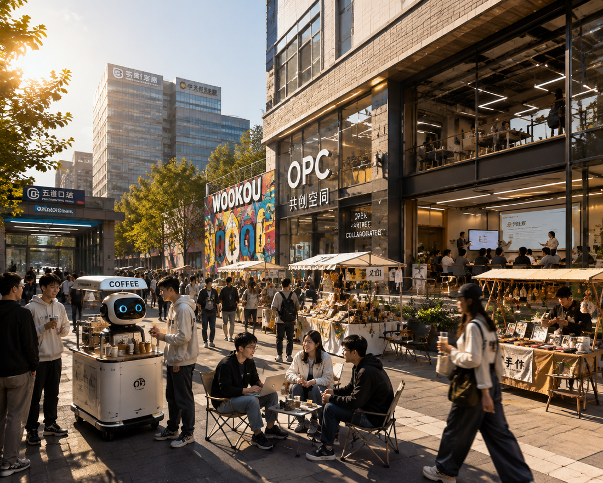

### AI Industry Test-and-Validate Scenarios (3; ≥3 required)

- **T1 Xiaoyue River embodied-intelligence test field**: real-scenario testing of embodied-intelligence robots, AI+healthcare/film scenario validation;
- **T2 Corridor autonomous shuttle test line**: autonomous shuttle, vehicle-road coordination, smart signal priority;
- **T3 Dazhongsi AI-native commerce sandbox**: unmanned retail, AI-curated commerce, smart dining small-scale validation.

All three test scenarios are clearly labeled "test-and-validate, not approved operation" [source:AGENT-TASKBOOK]. All scenarios observe privacy and human-review boundaries: no excessive surveillance (environment-level/aggregate de-identified data only), human-review backstops (legal/medical scenarios), data consent, manual channels for vulnerable groups, and AI-generated content labeling.

### Developer Community & International Recruitment-Conversion Path

**Developer community operation (concept)**: an "open-source contribution → honor → growth" loop — developers contribute code via the Artery Open-Source Day / code marathon, earning three-tier honors (rail-tie stone inscription / Artery Star annual selection / young-innovator program); the growth path runs from "attending events" to "securing space" (free workstations / OPC full-lifecycle services) to "securing capital" (roadshow matchmaking / competition fast-track); community carriers are the Artery open-source community (online) plus AI stations / forest theatres (offline), with the open-source community square hosting regular events.

**International recruitment-conversion path (concept)**: via the twin HSR gateways (Qinghe / Xizhimen) and the SCO AI Application Cooperation Center, a three-step "attract — retain — go-global" loop:

| Step | Action | Carrier | Conversion indicator (draft) |
|---|---|---|---|
| Attract | Global AI Innovation Belt Forum + Jing-Zhang Smart Transit Week + overseas roadshows | International roadshow hall / Gateway of Jing-Zhang | registered foreign guests, MoUs signed |
| Retain | OPC full-lifecycle services + test sandbox + unmanned-retail sandbox | AI Origin Community / Zhongzhi Park | overseas teams landed, OPC registrations |
| Go-global | Going-global services + international launch stage + open-source showcase | Stack Sanctuary / International Exchange Center | going-global enterprises, international projects |

All conversion mechanisms are **conceptual**, to be implemented in the refinement phase through multi-stakeholder governance (government, industry, academia, capital).

## Land Use, Building Scale and Retain/Renovate/Demolish

The land use plan follows public standards for territorial survey, planning and use-control classification, forming a complete and gapless land use division [standard:MNR-LAND-USE-CLASSIFICATION-GUIDE] [data:geometry/land_use.geojson#LU-001]. The building plan distinguishes retain/renovate/renew/new/pending objects and clarifies building footprints, functions, scale and character suggestions [depth:height_massing_character] [depth:retain_renovate_demolish] [metric:building_footprint_area_sqm]. Where existing buildings, ownership, regulatory plans or engineering conditions are missing, only methods and a calibration checklist are proposed — no fabricated retain/renovate/demolish conclusions; where no official conditions exist for building scale, FAR or height, status is uniformly `unknown` with the pending conditions and recalculation path explained [depth:metrics_recalculation].

**Building-scale scenario derivation (self-consistent logic chain)**: total volume is derived from "buildable land area × scenario FAR" rather than back-calculated from a single building footprint — avoiding denominator mismatch [metric:total_building_volume_sqm_target] [metric:building_footprint_area_sqm]:

- **Land use closure**: the four land-use classes (AI R&D 2.675M m² + research/innovation service 2.589M m² + park green space 3.366M m² + commercial 2.783M m²) sum to 11,412,832.7 m², closing against the overall design area 11,412,825.4 m² (7.3 m² rounding).
- **Buildable land area**: excluding park green space, AI R&D + research service + commercial = 8.047M m² (804.7 万㎡).
- **Three scenarios** (existing FAR × target FAR, all conceptual assumptions, not official control):

| Scenario | Existing FAR | Target FAR | Retained | New | Total |
|---|---|---|---|---|---|
| Conservative | 1.3 | 2.0 | 10.46M m² | 5.63M m² | 16.09M m² |
| Neutral (continuity) | 1.5 | 2.34 | 12.07M m² | 6.76M m² | 18.83M m² |
| Optimistic | 1.7 | 2.7 | 13.68M m² | 8.05M m² | 21.73M m² |

- **Denominator clarification**: `building_footprint_area_sqm = 310,807 m²` is the footprint of the single "Zhongzhi Full-Stack Sanctuary" concept building (BLDG-001, `geometry_role=design_proposal`), NOT the district-wide existing footprint, and must not be used to back-calculate total volume. The "arithmetic conflict" noted in prior review stemmed from this denominator mismatch and has been corrected.
- **Recalculation path**: once official FAR control and floor-area census are published, all scenario values are recomputed in EPSG:4548.

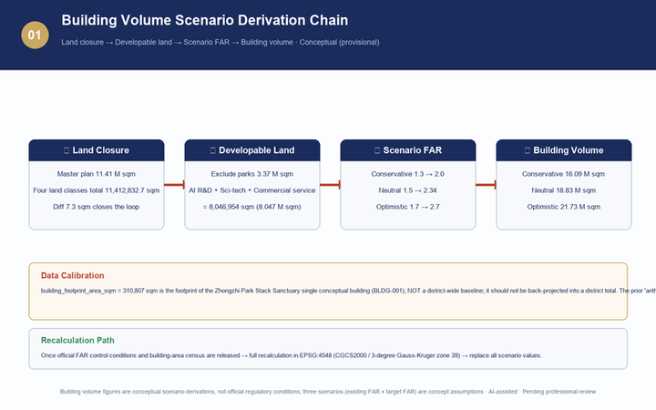

**Building retain-renovate-update-new classification framework (concept, pending current-status data)**: building disposition is classified into four categories — **Retain**, **Renovate**, **Update**, **New** — judged in the order "heritage value > structural safety > economic viability > industry fit" [depth:retain_renovate_demolish] [standard:MOHURD-CONTROL-DETAILED-PLANNING]:

- **Retain**: railway heritage, industrial relics (former factories, locomotive depots, signal towers), fine historic buildings and rail-corridor imagery — preserved in place and adaptively reused as cultural memory carriers (e.g. Jing-Zhang Railway Heritage Park corridor facilities, Qinghuayuan Station).
- **Renovate**: older buildings with sound structure but mismatched function — "retain-and-renovate" first, upgrading value through functional conversion (industry services, talent housing, public facilities) and facade/energy retrofits, avoiding large-scale demolition; includes low-efficiency commercial stock iterating toward smart consumption (e.g. Dazhongsi 1733 flagship cluster).
- **Update**: low-efficiency land and vacant parcels — redeveloped via a mix of demolition and renovation to release industrial space (e.g. Qinghe innovation interface belt, low-efficiency industrial land north of Zhongzhi Park).
- **New**: vacant parcels and new carriers — mainly AI-scenario architecture (Full-Stack Sanctuary, pilgrimage landmarks) and public-space construction, a smaller share of total new floor area.

**Three-district retain-renovate-update-new orientation (conceptual assumption, NOT an official regulatory conclusion)**:

| District | Retain | Renovate | Update | New | Note |
|---|---|---|---|---|---|
| Zhongzhi Park AI Independent Innovation Accelerator | Medium | High | Medium | Low | Industrial-relic activation + low-efficiency industrial land redevelopment; new construction concentrated on landmark carriers such as the Full-Stack Sanctuary |
| Beijing AI Origin Community | Medium | High | Medium | Low | Functional conversion and quality upgrade of older near-campus blocks; campus boundaries and community fabric preserved |
| Dazhongsi AI Industry Cluster | Low | High | Medium | Low | Stock-commercial retrofit and smart-consumption iteration; the Dazhongsi heritage structure itself retained |

- **Data-gap statement**: parcel-level retain-renovate-update-new conclusions require current building census, ownership, structural survey and regulatory conditions; before official data are published, the table above is a **conceptual orientation only** and constitutes no engineering demolition, retrofit or retention decision [depth:risk_missing_data].

## Transport, Rail, Municipal and Public Services

The transport plan responds to requirements for station integration, road micro-circulation, slow-traffic gaps, external transport, parking and green transport [depth:traffic_rail_slow_parking] [data:geometry/roads.geojson#ROAD-001] [data:geometry/public_space.geojson#PUBLIC-001]. Municipal and public service facilities cover AI industry services, innovation service platforms, talent living services, new infrastructure, distributed energy and edge computing; where pipeline, energy, drainage, flood or fire data are missing, they are listed as prerequisites for formal deepening [depth:municipal_new_infrastructure].

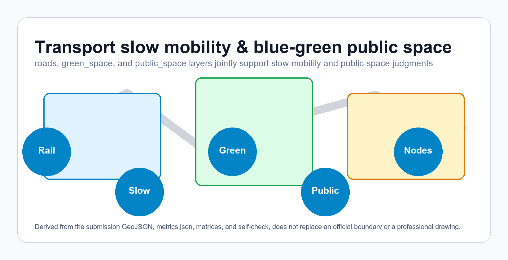

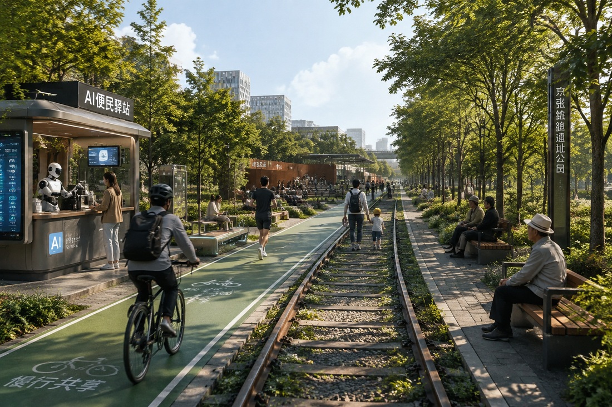

## Blue-Green Space, Public Space and Urban Character

The blue-green space plan takes the Jing-Zhang Heritage Park vitality belt as the spine, integrating Qinghe, Xiaoyue River and the mobility needs of universities, enterprises and communities, proposing a north-south through and east-west connected pedestrian and cycling network [depth:blue_green_public_space] [data:geometry/green_space.geojson#GREEN-001] [data:geometry/public_space.geojson#PUBLIC-001] [metric:public_space_ratio].

**AI public space "a heritage corridor that tells stories"**: the 9 km corridor is organized in three themed segments — north "Connect" (Qinghe–Shangdi), middle "Origin" (Wudaokou–Zhichun Road), south "Echo" (Dazhongsi–Xizhimen); conceptual facilities include a switchback plaza, sleeper-path story points (history + AI dual display every 500 m), AI stations and a forest theater.

**East-west stitching and north-south connection**: a "fishbone" network of connector routes with the corridor as spine (9 branch roads opened in phase 2, suggested to be densified further), activation of space under the Metro Line 13 viaduct, ground-floor opening of parks to streets, and barrier-free connection; north-south continuity via a continuous corridor, dual gateways (Qinghe Station/Xizhimen) and water-system connectivity.

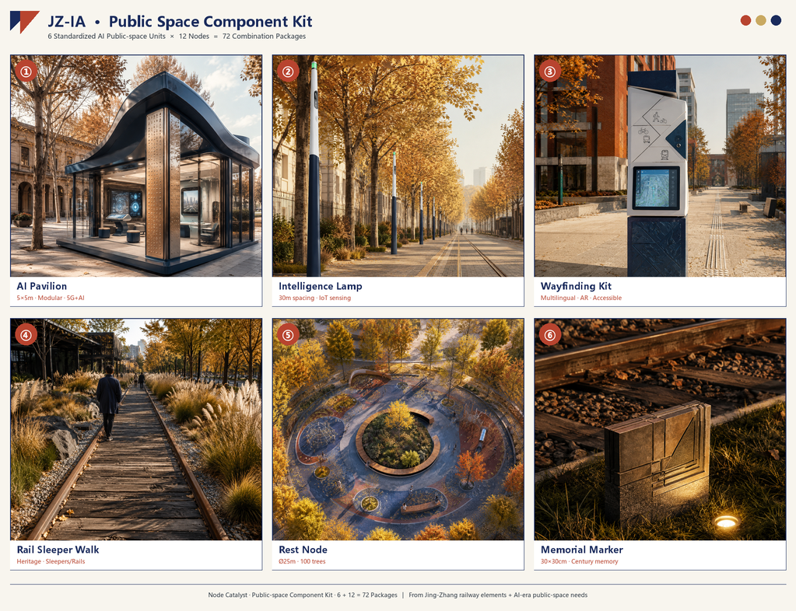

**Public-space component kit (6 reusable modules)**: ① AI Station (smart inquiry + AED + canopy + edge compute) ② Corridor Lantern (corridor lighting + wayfinding + event publishing) ③ Wayfinding Kit (open-source, large-print/Braille/children versions) ④ Rail-tie Pavers (retained rail ties; heritage+AI dual exhibit every 500 m) ⑤ Seating Node (bench + armrest + wind-rain porch, spacing ≤ 200 m) ⑥ Memorial Plaque (rail-tie stone / paver name inscriptions, open-source contribution honor wall). All modules share the Ren-shape motif and the three-color system for direct reuse in stations, the corridor and key districts.

**Urban character**: integrating Jing-Zhang railway history, Zhongguancun innovation culture and AI new culture, using Tsinghua Garden Station and other cultural resources to guide urban tone, architectural character, roofline, massing and street frontage [standard:MOHURD-URBAN-DESIGN-MEASURES]. Cultural expression is restrained and implicit — the triple heritage forms a "Connect–Origin–Echo" storyline along the belt, letting the spirit grow naturally in space.

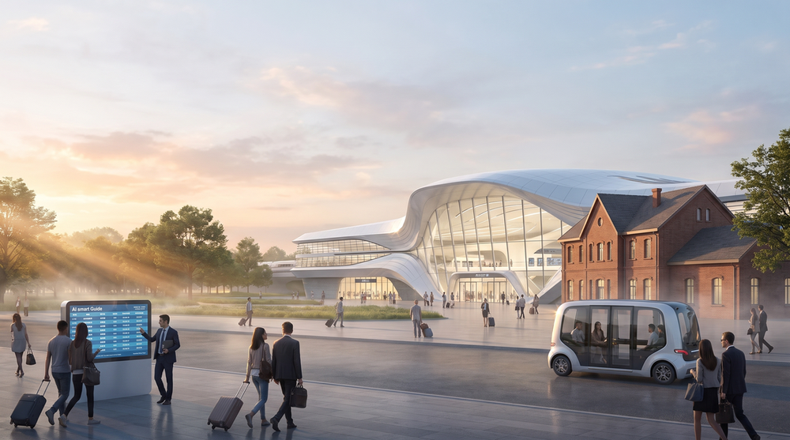

**Pilgrimage landmarks and honor display**: four AI pilgrimage landmarks — Qinghe Station "Jing-Zhang Gate", Zhongzhi Park "Full-Stack Temple", Tsinghua Garden Station×Origin Tower "Origin Dialogue Axis", Dazhongsi "Ancient Bell New Wave"; the honor display system has three layers — historical glory (railway history), contemporary glory ("Artery Star" annual selection) and future glory (young innovators) — with open-source attribution culture embedded in public space (contributor names on sleeper stones/bricks). All brands, fonts, images, portraits and enterprise marks have rights-cleared sources [source:SITE-PACKAGE].

## Renewal Project List, Implementation Policy and Phasing

The implementation plan forms a reviewable renewal project list with location, type, function, responsible body, dependencies, phase, risks and evaluation metrics [depth:renewal_project_list] [depth:phasing_implementation] [data:geometry/phasing.geojson#PHASE-001].
| Code | Project | Type | Key dependencies | Responsible entity (concept) | Cost class | Privacy/safety review | Public-benefit KPI (draft) | Exit/fallback |
|---|---|---|---|---|---|---|---|---|
| JZ-01 | Heritage Park slow-mobility gap stitching | Public space / transport | Road redlines, under-viaduct space, traffic organisation review | Municipal parks centre + subdistrict | Medium (sub-100M ¥) | Medium: camera auto-masking | Pedestrian connectivity ≥95% | 5-yr under-target triggers revision |
| JZ-02 | Zhongzhi Qinghe innovation interface | Blue-green / industry | River blue line, ecology & flood conditions | Park authority + municipal water bureau | Medium-high | Low: open public realm | Tenant enterprises ≥60 | Occupancy <30% triggers adjustment |
| JZ-03 | Origin near-campus translation street | Renewal / industry services | Campus boundary, ownership, ground-floor formats | Subdistrict + university + state capital | Medium (light retrofit) | High: data stays in domain | OPC registrations ≥50/yr | <50 in 3 yrs triggers reassignment |
| JZ-04 | Dazhongsi 4-quadrant pedestrian link | Transit-oriented / slow mobility | Station, intersections, municipal utilities | Municipal rail + Dazhongsi operator | High (incl. connection deck) | Low: emergency camera only | Transfer time −≥30% | Unused 6 months triggers rectification |
| JZ-05 | AI public service & edge-compute node | New infrastructure / public service | Energy, compute, safety, operator | Municipal S&T commission + enterprise | Medium-high | High: state-level test requirements | Compute-hours / unit energy | Compliance breach → immediate suspension |
| JZ-06 | Global AI activity-week public route | Operation / brand | Public-space permit, event safety, copyright clearance | Municipal foreign affairs + park | Medium (annual) | Low: public event | Annual registered foreign guests ≥500 | 2 consecutive years under-target → cancellation |
**Phasing**: near term (1–3 years) Origin Community 2.0 + corridor scenario weaving; mid term (3–5 years) Zhongzhi Park opening + Dazhongsi renewal; long term (5–10 years) wing expansion + full-area activation.

**Annual event system and long-term operation** (conceptual): Artery Open Source Day (monthly), Origin Launch Hall (biweekly), Jing-Zhang Smart Track Experience Week (quarterly), Artery Star Annual Ceremony (annual), Jing-Zhang AI Innovation Belt International Forum (annual), Ancient Bell New Wave Art Season (annual); operation mechanisms include a unified JZ-IA brand IP, multi-stakeholder governance, self-sustaining revenue (space rent + service fees + event operation + investment returns), lightweight startup, and global linkage via the dual high-speed-rail gateways and the SCO AI Application Cooperation Center [source:AGENT-TASKBOOK].

### Implementation Recommendations

Implementation follows an "ignite first, then weave the network, then scale the area" logic, aligned with the phasing plan [depth:phasing_implementation] [data:geometry/phasing.geojson#PHASE-001]:

**① Implementation path (three steps)**

| Step | Period | Key actions | Projects |
|---|---|---|---|
| Step 1 · Ignite | 1–3 yrs | Origin Community 2.0 upgrade + corridor scenario weaving; connect already-alight industries first | JZ-01 gap stitching, JZ-03 translation street, JZ-05 AI public-service node |
| Step 2 · Weave | 3–5 yrs | Zhongzhi Park opening + Dazhongsi renewal; three-core chain formed; 12 scenario cards phased in | JZ-02 Qinghe interface, JZ-04 four-quadrant connectivity |
| Step 3 · Scale | 5–10 yrs | Two wings expansion + whole-belt activation; 43.6km² study scope linked | JZ-06 global activity-week public route |

**② Safeguard mechanisms (conceptual)**

- **Planning alignment**: the spatial structure strictly echoes the approved (Aug 2026, see [source:REGULATORY-PLAN-APPROVED-20260811]) control plan "One Belt, One Axis, Two Cores, Multi-Points"; once official polygons are released, recalculate fully in EPSG:4548 and map each item after statutory conditions arrive.
- **Implementing actors**: suggest government-enterprise-academia multi-stakeholder governance — government leads public space and landmarks, enterprises lead industrial scenarios and operations, universities/institutes lead source innovation and talent, operators lead events and branding.
- **Funding and self-sustenance**: a diversified revenue model of space rent + service fees + event operation + investment returns, reducing one-time fiscal dependence.
- **Data and governance**: all scenarios observe privacy and human-review boundaries; AI-generated content labeled, human-review backstops, manual channels for vulnerable groups [source:AGENT-TASKBOOK].
- **Risk control**: conclusions on height, intensity, road red lines and ownership are all "pending official control-plan conditions"; events and operations are stated as conceptual, not government commitments.

**③ Implementation safeguard system (concept framework, pending policy alignment)** [depth:phasing_implementation] [standard:MOHURD-CONTROL-DETAILED-PLANNING]:

- **Actor-accountability matrix (conceptual)**: implementation actors are triaged by "public good — quasi-public good — market-based" to avoid responsibility gaps —

| Category | Representative projects | Lead actor (conceptual) | Accountability scope | Funding approach (conceptual) |
|---|---|---|---|---|
| Public good | Corridor stitching, station-city connection, public-space kit | Municipal park center / district sub-district office / rail group | Plan alignment, construction, O&M standards | Government finance + special bonds (conceptual) |
| Quasi-public | AI public-service nodes, scenario testbeds, honor system | Park admin committee + municipal S&T commission + universities | Scenario admission, data governance, public backstop | Government-guided fund + state platform (conceptual) |
| Market-based | Industry-service complexes, AI-native retail, event operations | Market operators + venue operators | Investment return, brand operations, self-sustaining | Private capital + self-generated revenue (conceptual) |

- **Funding framework (concept, NOT a formal budget)**: a three-source model of "government guidance + private capital + self-generated revenue" — near-term government guidance (special bonds + urban-renewal fund) leverages public goods; mid-term state platforms and industry funds carry quasi-public goods; long-term four revenue streams (rent / service / events / equity share) sustain market-based projects and progressively reduce fiscal dependence. **All amounts and shares are conceptual calibration directions, not budget commitments**, to be replaced after feasibility studies.
- **Approval-path recommendation (concept)**: the proposal is positioned as "conceptual deepening beneath the regulatory plan"; implementation follows "district regulatory plan (approved, see [source:REGULATORY-PLAN-APPROVED-20260811]) → parcel-level urban design / implementation plan → project initiation (proposal / feasibility) → planning and construction permits → build & operate"; official plan drawings, ownership and engineering conditions are applied parcel by parcel once available, and this path does not replace statutory approval.
- **Scenario "validate → scale" conversion mechanism (concept)**: the 12 scenario cards first enter as "pilot validation" (TRL≥6, licenses obtained, human backstop), and are upgraded to "scaled deployment" once the KPI threshold in exit conditions is met; unmet scenarios exit or downgrade, forming an auditable validation ledger and avoiding concept-only or over-committed scenarios [source:AGENT-TASKBOOK].

## Indicators, Area Recalculation and Compliance Matrix

The indicator system at minimum covers overall design area, key area areas, green/public space ratios, building footprint, number of renewal projects, AI scenario nodes, slow-traffic connectivity, industrial space, talent services and self-check status [depth:metrics_recalculation]. All known indicators must be recalculable from GeoJSON or trusted sources; unknown indicators must state the reason and prerequisites for formal submission. Indicators fall into three classes: spatial indicators directly recalculable from submitted geometry (boundary area, green ratio, public space ratio, building footprint, phasing area); regulatory indicators requiring official conditions (FAR, building height, density, setbacks, road red lines); performance indicators requiring ongoing operation data (AI innovation index, talent density, event participation, scenario usage). The three classes enter `metrics.json`, `assumptions.json` and `compliance_matrix.json` respectively [metric:site_area_sqm] [metric:key_area_count] [metric:green_ratio] [metric:public_space_ratio] [metric:building_footprint_area_sqm].

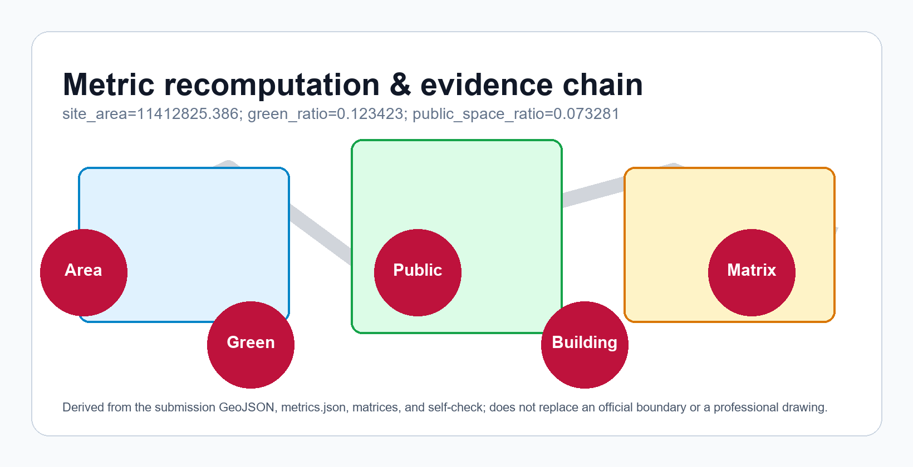

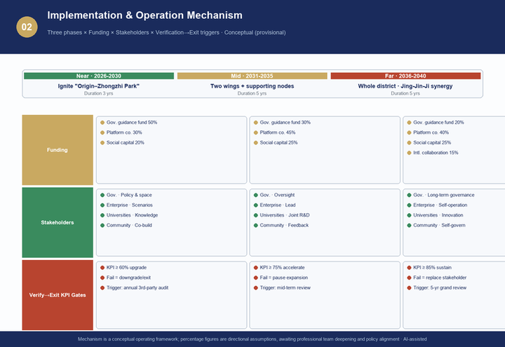

The compliance matrix is the master control for task responsiveness. Every announcement task and agent_taskbook task must map to report sections, layers, metrics, drawings, HTML pages, sources, assumptions and self-check items. Failure to cover any mandatory task in announcement Sections 1.3, 1.4, 1.5 or agent.1–agent.6 disqualifies the proposal from formal professional scoring.

## Inclusion & Human-Centered Safeguards

The renewal proposal must serve not only innovation industries but also safeguard the **four groups most often overlooked**:

**1. Elderly / Age-friendly design**
- 9 km Intelligence Corridor with seating-and-armrest rest nodes every ≤ 200 m
- Public restrooms every 500 m with accessible stalls
- Signals and signage in a high-contrast large-print version (yellow background, deep blue text)
- Public activity spaces with semi-enclosed wind-and-rain porches (to cope with Beijing winter)

**2. People with disabilities / Accessibility**
- Fully accessible ramps (slope ≤ 1:12); tactile paving and Braille wayfinding nodes at each key junction
- Smart hubs with low-position counters and sign-language video inquiry
- Service robots in auto mode must yield to the manual-path priority (the **manual channel has higher priority** to prevent disabled users from being isolated by automation)

**3. Children and parents**
- One child-safe play area per key area, with shade and a parent-accompanied waiting zone
- The 9 km corridor's cycling and walking segments are physically separated to avoid children straying into the fast lane
- All smart signage includes a children-height reading version

**4. Low-income and floating populations**
- Affordable food service (morning stalls / night stalls + public toilets) at ≥ 10 locations along the corridor
- Low-cost-startup tier for OPC companies (the '180' figure is the existing background, the specific scale awaits official confirmation), targeting ≥ 50% of workstation rent ≤ 100 RMB/workstation/day (conceptual target, awaiting detailed cost calculation)
- Apartment typologies retain a defined share of affordable units (proportion awaits alignment with official housing policy)

**Co-creation procedure (draft)**:
- 'Corridor Open Day' (biannual) inviting corridor residents, tenants, shop owners and small developers to participate in design-review and adjustment
- 'Elderly + children experience review panel' evaluating each iteration of smart facilities, with a veto clause
- All data collection follows four boundaries: data minimization, purpose specification, manual channel, deletion right (referencing PRC PIPL and AI service standards)

**Quantifiable equity indicators (with derivation method and target range)**: the four indicators below are upgraded from conceptual targets to derivable quantitative targets — with formula, assumptions and target range stated, without asserting field-measured values [metric:public_service_coverage_target]:

| Indicator | Formula | Assumptions | Target range |
|---|---|---|---|
| Continuous accessibility rate | (accessible continuous segment length / total trail length) × 100% | Slope ≤1:12, tactile paving continuous, clear width ≥1.8m | 90%–95% |
| 5-minute service reach | households within 5-min walking circle / total households | Walking speed 80m/min (≈400m radius); facilities include medical/education/commercial/park | ≥85% |
| Affordable workstation share | affordable workstations (≤30% of market average) / total workstations | Market average referencing Zhongguancun office rent (pending official data) | ≥30% |
| Elderly/children co-creation adoption | accepted proposals / total proposals per year | Community proposal platform + review committee | ≥3/yr |

> Note: the above are target values with stated derivation method (formula + assumptions); official figures require trail GIS, facility points, population distribution and rent census, then recomputed in EPSG:4548.

## Risk, Copyright and Compliance

**Bilingual requirement.** The primary proposal is in Chinese, with a complete counterpart translation in `proposal.en.md`; A3/A0, HTML and text-bearing figures also provide counterpart language copies. All images, drawings, icons, data and code assets state their source, license and authorization status in `sources.json` or `report/copyright_statement.md`. HTML pages do not load remote scripts, remote map tiles, remote fonts, iframes, forms or external APIs, and do not track reviewers.

Risks and the missing-data list are jointly reviewed by the risk depth item, the constraints layer and the site package [depth:risk_missing_data] [data:geometry/constraints.geojson#CONSTRAINTS] [source:SITE-PACKAGE]. The official boundary, key area, regulatory, road, parcel, building, municipal, heritage-protection and public-service gaps in `missing_data_checklist.csv` must enter `assumptions.json`, the self-check and the risk section. Any conclusion lacking official regulatory, road red line, ownership, municipal, fire or heritage-protection conditions must be downgraded to a pending item.

This proposal does not claim official approval, approved regulatory plans, final land ownership, final construction scale or guaranteed implementation. All spatial implementation suggestions are "conceptual suggestions / reference schemes / material for professional teams to deepen", not replacements for formal planning or government conclusions. The AI agent is responsible for facts, sources, copyright, spatial data, indicators and expression; maintainers and professional reviewers may require revision or rejection based on self-check results, spatial review and the compliance matrix.

## References

- brief/public-brief.md
- brief/site-package/design_brief.json
- brief/site-package/allowed_design_space.json
- brief/site-package/enums/
- brief/site-package/ranges/planning_limits.json
- data/processed/agent_fact_pack.md
- data/processed/project_scope_summary.csv
- data/processed/agent_task_requirements.csv
- data/processed/source_use_matrix.csv
- data/processed/missing_data_checklist.csv
- Full machine index: see `sources.json`, `metrics.json`, `compliance_matrix.json`, `standard_matrix.json` and `design_depth_matrix.json`
- Reference list based on the site package registration; full provenance and licenses are in the structured source inventory [source:SITE-PACKAGE]
