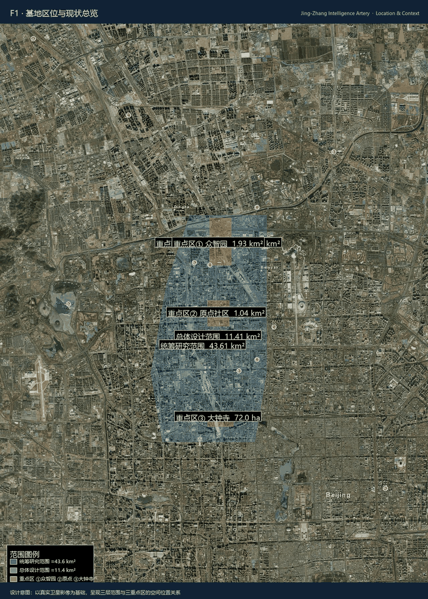
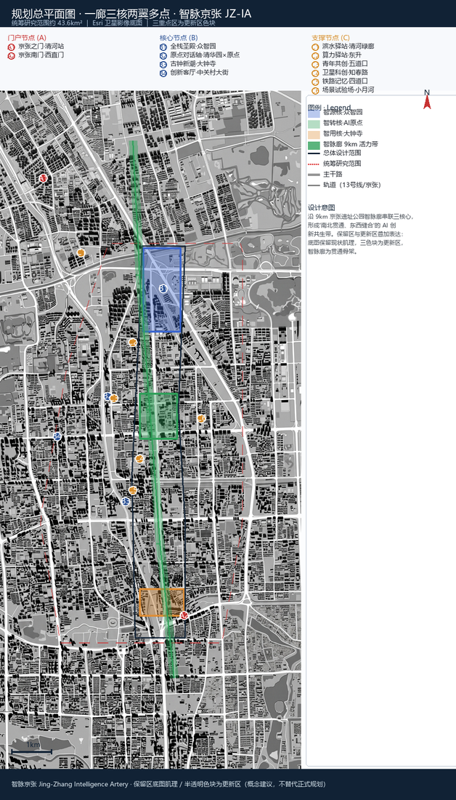
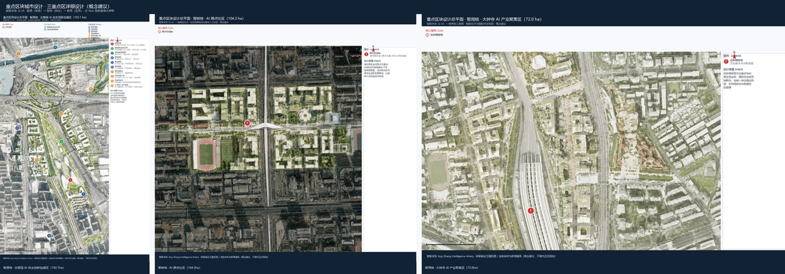
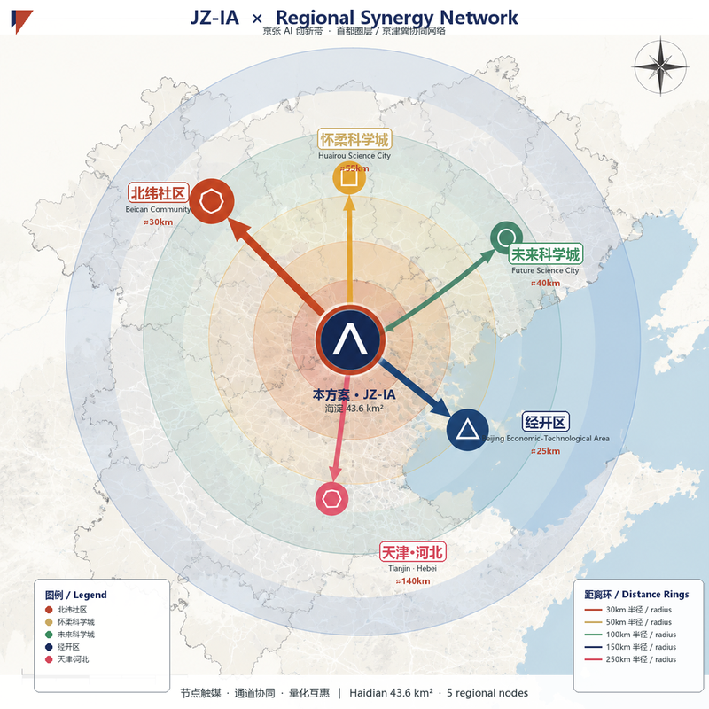
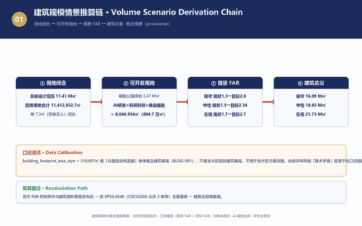
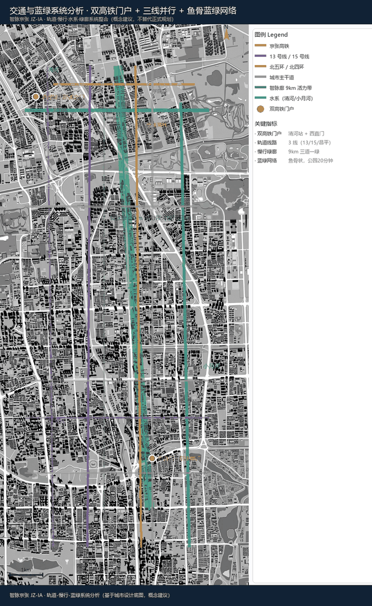
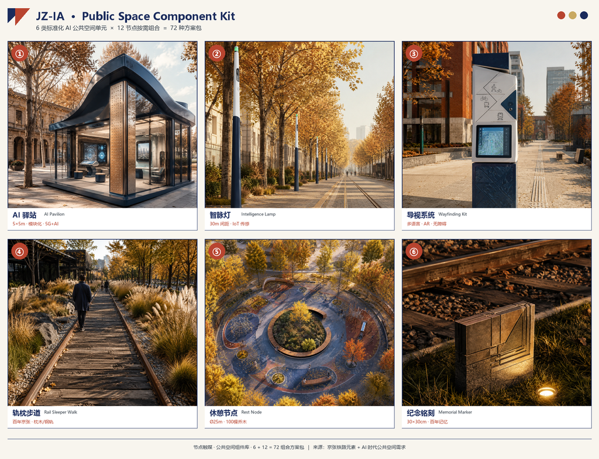
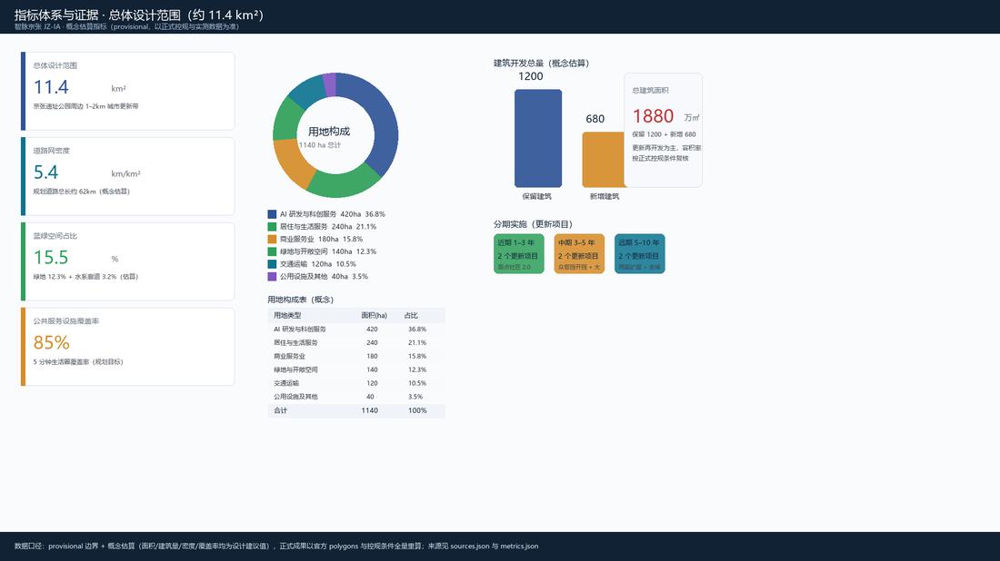
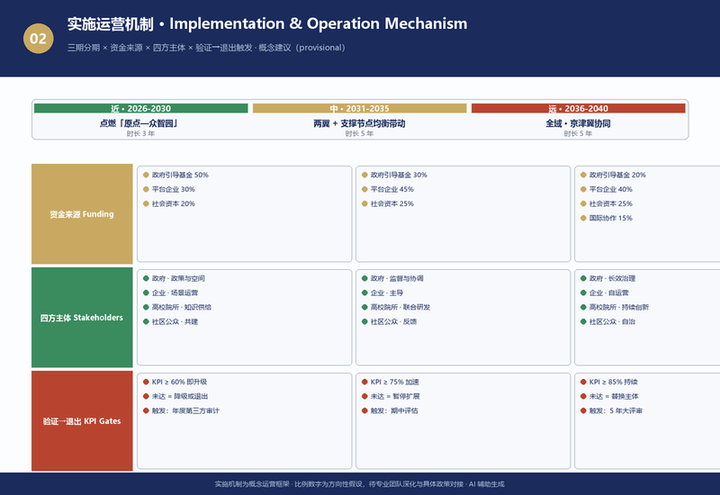

# 智脉京张：百年铁路遗产上的AI创新共生带城市设计提案

## 设计依据与资料清单

本方案以《百年京张AI创新带城市设计国际方案征集》公告为第一依据，以 `brief/site-package/` 中登记的临时粗略边界、重点区域、枚举、指标和来源清单为机器可读依据 [source:OFFICIAL-ANNOUNCEMENT] [source:AGENT-TASKBOOK]。方案覆盖公告 1.3、1.4、1.5 三个层次任务与 agent.1–agent.6 六项智能体任务，达到控制性详细规划的城市设计深度；文本叙述不替代 GeoJSON、指标表、A3 文册、A0 展板和 HTML 电子展示成果 [depth:existing_conditions_diagnosis]。

在官方精确边界取得前，本方案使用 `brief/site-package/geometry/provisional_boundaries.geojson` 生成临时包；`geometry/site_boundary.geojson` 与 `geometry/key_areas.geojson` 均标注 `provisional_constraint`、`official_boundary=false`，仅用于方案生成、自检、可视化和设计讨论，不作为 official redline、审批依据、精确面积依据或法定控制结论 [source:SITE-PACKAGE]。组织方数据缺口不阻断内容评分；官方 polygons 发布后，边界、用地、建筑、道路、绿地、公共空间、分期和指标均需按 EPSG:4548 全量重算 [metric:site_area_sqm] [data:geometry/site_boundary.geojson#SITE-001]。

## 现状认知与资源分析

本章回答"为什么是这条带、现在处于什么状态、手里有哪些牌"——现状问题是规划的起点，资源禀赋是方案的地基 [depth:existing_conditions_diagnosis] [data:geometry/site_boundary.geojson#SITE-001]。

### 历史发展：一条"自主创新"的物化铁路

- **1909 年**，詹天佑主持修建京张铁路——中国自主设计施工的第一条干线铁路，以"人字形"折返展线征服 33‰ 关沟险坡，开启中国自主创新元年；"人字形"既是工程技术成就，也是"以中国智慧克服技术险阻"的国家记忆 [source:AGENT-TASKBOOK]。
- **清华园车站（1910 年红砖站房）**：进京赶考的历史坐标，也是中国铁路近代化的实物见证——红色文化与近代化的双坐标。
- **2016 年起既有线入地改造、2019 年京张高铁开通**：老线停运后腾出约 9km 连续廊道，正建设京张铁路遗址公园——铁路从运输工具转化为城市公共空间与文化记忆载体，是城市更新的标志性事件。
- **大钟寺（明代古刹）**：古都记忆的锚点，与铁路遗产、中关村创新文化共同构成"三重遗产"。

### 现状情况：全国 AI 密度最高的"智力走廊"

- **交通区位**：北端清河站（京张高铁枢纽）+ 南端西直门站，构成国家级双高铁门户；13 号线、15 号线、昌平线三线并行，是片区内最独特的战略资产 [depth:traffic_rail_slow_parking]。
- **设施成熟度**：清华、北大、北航、北邮、北交大、中科院等 30+ 高校院所在沿线铺开，教育科研设施全国密度最高；医疗、商业、生态文化设施齐全，城市服务底座成熟。
- **产业与业态**：AI 原点社区 3km² 内集聚 AI 科学家群体规模数据（来自任务书背景说明，待官方普查口径确认）、开发者群体规模数据（来自任务书背景说明，待官方确认）、中小企业及团队规模数据（来自任务书背景说明，待官方确认）、青年学子群体数据（来自任务书背景说明，待官方确认），OPC 一人公司群体（背景数据，确切数量待官方统计确认）；大钟寺片区从低效商业向智能消费迭代（1733 首店集群已点火）；五道口青年消费高浓度——**更新动能已经点燃，缺的是把它们串成创新网络的空间载体** [source:AGENT-TASKBOOK]。
- **更新现状**：工业遗存活化（旧厂房、机车库、信号塔）与老旧楼宇更新并行，存量空间挖潜是主路径。

### 政策谋划：政策窗口已经全开

- **《北京人工智能创新高地建设行动计划》（2026.1）**：两年左右推动 AI 核心产业规模突破万亿，构建以海淀为核心的"一核多点"布局；海淀"原点社区"入选首批 4 个人工智能创新街区。
- **海淀区"两区一带"综合规划**：原点社区、北纬社区、**百年京张 AI 创新带**作为核心载体；成立北京智惠人工智能应用合作中心（承接上合组织 AI 应用合作中心运营）。
- **《京张铁路遗址公园沿线街区控制性详细规划（2024—2035 年）》获批（2026 年 8 月，据北京日报/人民网报道）**：本方案最权威、最直接的规划依据——官方给出"一带一轴两心多点"空间结构（大钟寺中心、五道口中心），以绿色公共空间引领城市更新、支撑人工智能创新街区建设，发展大模型、智能体、具身智能等新业态；规划范围东至新街口外大街、西至中关村大街、北至成府路、南至西直门外大街，含 9 个建设主导街区、总用地约 1668.2 公顷 [source:REGULATORY-PLAN-APPROVED-20260811] [source:REGULATORY-PLAN-APPROVED-20260811-ALT]。

> **规划师判断**：这是一块"历史厚度 × 产业浓度 × 更新势能 × 政策窗口"四者叠加的黄金地段。控规是"底盘"，本方案是在底盘之上的"概念深化"——必须与控规结构高度呼应，同时用 AI 场景与公共空间把已点燃的产业接上管线。

### 资源分析：三类可支撑方案的核心资源

| 资源类型 | 内容 | 对方案的支撑 |
|---|---|---|
| **历史文化资源** | 京张铁路（人字形/詹天佑）、清华园车站（赶考原点）、大钟寺（古都记忆）、中关村（改革开放创新文化）——三重遗产 | 文化定魂：形成"通达—原点—回响"三段故事线与 4 个朝圣地标 |
| **创新资源** | 30+ 高校院所、AI 原点社区（1000+ 科学家/开发者群体规模数据（来自任务书背景说明，待官方确认）/中小企业及团队规模数据（来自任务书背景说明，待官方确认））、众智园、中关村科学城 | 创新赋能：一核三圈生态图谱 + 全栈自主创新体系 + 12 场景卡 |
| **青年人群资源** | 青年学子群体数据（来自任务书背景说明，待官方确认）、开发者群体规模数据（来自任务书背景说明，待官方确认）、OPC 创业者、45 万沿线居民 | 活力聚人：6 类人群画像驱动功能与空间，先读懂人再点燃点 |

### 现状问题诊断（六大维度）

| 维度 | 现状问题 | 方案回应 |
|---|---|---|
| 交通 | 双高铁门户+三线并行，但慢行断点多、站城联系弱 | 枢纽激活、三道一绿慢行体系、断点缝合 |
| 设施 | 设施密集但东西割裂（13 号线高架阻隔） | 人群缝合、桥下活化、园区首层开放 |
| 业态 | 1733 首店已点火，但缺 AI 原生业态容器 | 业态迭代、AI 原生商业试验场 |
| 历史 | 三重遗产并存，但缺乏当代转译载体 | 遗产触媒、朝圣地标、导视符号 |
| 产业 | 缺空间容器承载全栈创新链条 | 场景织入、全栈圣殿、安全沙盒 |
| 生态 | 绿廊单薄，蓝绿网络未成系统 | 蓝绿缝合、鱼骨网络、公园 20 分钟 |

### 空间范围口径：现状分析的底图分层

现状分析在三个空间层次上展开，边界口径与数据状态各不相同，据此决定每条现状判断的可信度表述 [source:OFFICIAL-ANNOUNCEMENT] [source:REGULATORY-PLAN-APPROVED-20260811]：

| 层 | 范围 | 边界状态 | 现状分析用途 |
|---|---|---|---|
| **L1 区域协同层** | 统筹研究范围 43.6km²（北五环—京藏高速—西直门外大街—万泉河路） | 临时边界（provisional） | 宏观格局：文化带/产业带/高校带、与北纬社区/未来科学城/怀柔科学城/经开区协同 |
| **L2 街区控规层** | 官方控规范围约 1668.2ha（东新街口外大街—西中关村大街—北成府路—南西直门外大街，9 个建设主导街区） | **官方获批（2026 年 8 月）** | 现状分析的正式骨架："一带一轴两心多点"空间结构、9 街区功能底数 |
| **L3 重点设计层** | 三处重点区 368.4ha（众智园 192.1 / AI 原点 104.3 / 大钟寺 72.0） | 临时边界（无官方四至） | 三核现状深描，依托控规"两心"（大钟寺中心/五道口中心）锚定 |

> **口径纪律**：L2 是唯一可用"官方获批"表述的范围——控规范围、四至、9 街区、1668.2ha 与"一带一轴两心多点"均出自 2026 年 8 月获批控规的官方媒体报道 [source:REGULATORY-PLAN-APPROVED-20260811]；L1/L3 边界一律标注"临时边界/概念建议"，任何面积精度表述不超出来源置信度；正式控规条文与图则以官方发布为准。

## 方案叙事主线：从一条铁路到一张智网

本方案的完整叙事只有一条主线：**一条百年前自主修筑的铁路，如何在这片土地上生长为一张服务未来的智能网络**。三句话讲清这条主线——

1. **起点（历史）**：1909 年，詹天佑以"人字形"折返展线让中国第一条自主干线铁路翻越关沟天险——自主创新精神在这片土地落地生根；
2. **火种（现实）**：今天，AI 原点社区 3km² 内已集聚 AI 科学家群体规模数据（来自任务书背景说明，待官方普查口径确认）、开发者群体规模数据（来自任务书背景说明，待官方确认）、中小企业及团队规模数据（来自任务书背景说明，待官方确认）与 青年学子群体数据（来自任务书背景说明，待官方确认）——创新的火种早已点燃；
3. **转译（未来）**：把"人字形铁路"的自主创新精神翻译为"人字形智网"，沿 9km 京张铁路遗址公园绿廊，让 AI 从楼宇溢出到街道、从实验室走进生活，最终激活 43.6km² 统筹研究范围。

这条主线由"四个要素"组织、由"一条激活路径"展开、由"六项任务"落地，全文每一章都是主线的一个环节：

| 主线环节 | 对应章节 | 组织逻辑 |
|---|---|---|
| 为什么是这里（历史+火种） | 总体概念 / 三层范围 | 文化定魂 · 创新赋能 |
| 怎么组织（触媒激活网络） | 总体设计空间结构 | 一廊三核两翼多点 |
| 为谁而建（人群驱动） | AI 创新生态 / 用户画像 | 活力聚人 |
| 如何落地（场景+实施） | 场景卡 / 更新项目 / 活动体系 | 创新赋能 · 品质筑基 |
| 何以持续（指标+合规） | 指标体系 / 合规矩阵 | 可回溯、可生长 |

> **一句话总结**：更新不是从零点火，而是为已点燃的产业接上管线——方案的所有设计，都是这条"管线"的空间表达。

### 规划目标（回应三大定位与五大功能）

在现状诊断的基础上，方案确立"三层递进"的规划目标，逐层回应公告的三大定位与五大功能 [standard:PROJECT-AGENT-OPEN-CALL-TASKBOOK]：

| 目标层 | 内容 | 对应定位/功能 |
|---|---|---|
| **目标一：文化层** | 让百年京张文化带"可感知"——三重遗产沿带形成完整叙事与朝圣体系 | 百年京张文化带 · 文化中心功能 |
| **目标二：产业层** | 让 AI 融合创新带"可生长"——从策源到应用的全栈创新链贯通 | AI 融合创新带 · 全栈自主创新/世界级生态 |
| **目标三：生活层** | 让都市 AI 生活体验带"可体验"——AI 场景落到街道公园与日常 | 都市 AI 生活体验带 · AI+ 场景/活力城市/治理话语权 |

三层目标与空间结构一一对应：文化层锚定"两门户+4 朝圣地标"，产业层锚定"三核创新链"，生活层锚定"两翼+多点+12 场景卡"。所有目标均为概念建议，通过分期实施逐步兑现。

### 规划策略：现状问题 → 规划目标 → 规划策略 → 空间结构的转化逻辑

方案的核心逻辑链为"**现状问题 → 规划目标 → 规划策略 → 规划方案**"：现状诊断是起点，规划目标是方向，七大策略是转化机制，空间结构是落点。每一维现状问题都有对应的目标层、策略与空间落点，形成可追溯的完整链条 [depth:existing_conditions_diagnosis] [standard:PROJECT-AGENT-OPEN-CALL-TASKBOOK]：

| 现状问题（六大维度） | 对应目标层 | 转化策略 | 空间落点 |
|---|---|---|---|
| 交通：慢行断点多、站城联系弱 | 生活层（可体验） | 策略 6 枢纽激活 | 清河站"京张之门"+西直门"京张南门"、三道一绿慢行 |
| 设施：东西割裂（13 号线高架） | 生活层（可体验） | 策略 2 人群缝合 | 9km 绿廊创新交往网、AI 便民驿站、园区首层开放 |
| 业态：缺 AI 原生业态容器 | 产业层（可生长） | 策略 5 业态迭代 | 大钟寺 AI 原生消费试验场、五道口青年共创街区 |
| 历史：三重遗产缺当代转译 | 文化层（可感知） | 策略 1 遗产触媒 | 4 朝圣地标、轨枕铭刻、原点对话轴、导视符号 |
| 产业：缺空间容器承载全栈创新链 | 产业层（可生长） | 策略 3 场景织入 | 三核创新链、全栈圣殿、安全沙盒、12 场景卡 |
| 生态：绿廊单薄、蓝绿未成系统 | 品质层（可宜居） | 策略 4 蓝绿缝合 | 鱼骨状蓝绿网络、公园 20 分钟、海绵+智慧 |
| 政策：控规结构已定、需深度呼应 | 品质层（可宜居） | 策略 7 政策协同 | 与控规"一带一轴两心多点"对齐、近中远分期 |

> **逻辑闭环**：六大问题经三层目标（文化/产业/生活）转译为七大策略，最终落到"一廊三核两翼多点"的空间结构与 12 节点触媒网络——方案不是"目标+形态"的简单堆叠，而是"问题驱动、策略转译、结构落地"的一体化设计。这一链条在后续各章（总体概念、三层范围、重点区域、场景卡、指标体系）逐层展开。

## 总体概念：智脉京张（Jing-Zhang Intelligence Artery, JZ-IA）

### 命名体系与设计母题

本方案总体概念为 **「智脉京张」**（Jing-Zhang Intelligence Artery, JZ-IA）：以百年京张"自主创新"精神为文化内核，以 **"人字形铁路 → 人字形智网"** 为空间母题——百年前詹天佑用"人字形"折返展线让火车翻越关沟天险，今天这片土地用人字形"智网"让 AI 穿越"技术—产业—生活"的转化断层 [source:AGENT-TASKBOOK]。

- **主名称**：智脉京张 / Jing-Zhang Intelligence Artery（"智"=AI 与智能；"脉"=人字形铁轨拓扑延伸+城市血脉/创新脉络双关；"京张"=历史文脉锚点）；
- **一廊**：智脉廊（京张遗址公园 9km 活力廊）；
- **三核**：众智园·智源核（策源）／AI 原点社区·智转核（转化）／大钟寺·智用核（应用）；
- **两翼**：中关村科技服务翼（西）／小月河场景赋能翼（东）；
- **多点**：12 个重要节点（2 门户+4 核心+6 支撑）。

命名不是口号，而是与产业生态、公共空间和文化资源深度关联：三核沿 9km 绿廊串珠，两翼向东西展开，多点承载 12 类场景卡，形成"品牌统一、节点个性"的双层体系 [standard:PROJECT-AGENT-OPEN-CALL-TASKBOOK]。

### 视觉识别与 Logo 定稿

主品牌"JZ-IA / 智脉京张"采用**定稿版 Logo**（AI 原创生成，无第三方商标/肖像依赖）。

**设计说明（200 字）**：

「智脉京张」Logo 以 1909 年詹天佑在青龙桥首创的**"人字形折返线"**为核心母题——它是中国铁路史上最独特的空间符号。双轨"人"字保留轨距缝隙，一望即知铁路本体；两臂在顶点交汇，对应机车"倒推上坡、折返前行"的换向动作，**折返点升维为 AI 原点**（顶点砖红圆点）；深蓝圆环象征 AI 与百年遗产共生的**"共生带"**。Logo 的"人"字是一条不断开的流动曲线，从历史流入、经折返顶点、流向未来，把百年铁路与 AI 创新带串成同一条"智脉"，呼应"人字形铁路 → 人字形智网"母题。字标「智脉京张」与图章同级视觉重量，可单色、可 3D、可文创。AI 原创生成，无第三方商标依赖。

**字标「智脉京张」**：四字总宽 ≥ 圆环 90%，字高 ≥ 25%，与图章视觉重量同级，保证远距与缩印可读。

**应用矩阵**（概念探索 + AI 原创生成）：

   

① 节点门户 · 5m 人字形钢构景观标识塔（发光圆环嵌 Logo）｜ ② 智脉廊 · 地面人字双轨铺装母题 + 智脉灯柱顶部标识｜ ③ 文创 · T恤单色深蓝印刷｜ ④ 文创 · 珐琅冰箱贴 / 徽章 / 马克杯

**配色与规范**（草拟）：
- 主色：深蓝 #1A2B5C（科技/智脉）+ 砖红 #B8442F（历史/铁路）+ 金 #C9A961（百年/荣耀）
- 单色剪影成立、可缩印至 3cm 仍可辨、可 3D 化（钢构/LED），适配 T恤/冰箱贴/导视/景观雕塑
- 正式落地前需由专业设计团队与法务团队深化（注册商标、字体规范、印制工艺）

### 首都功能定位响应

本片区是北京"全国科技创新中心"与"全国文化中心"两大核心功能的空间交汇承载地：科技创新中心由中关村科学城、AI 原点社区、众智园承载；文化中心由京张铁路遗产、清华园车站、中关村创新文化承载 [source:AGENT-TASKBOOK]。方案的创意与对策同时回应两大中心功能——创新需要文化滋养，文化需要创新表达。

### 四大价值要素（全部创意与对策的组织逻辑）

> **文化定魂 · 创新赋能 · 活力聚人 · 品质筑基**

| 要素 | 内涵 | 核心策略落点 |
|---|---|---|
| **文化**（设计之魂） | 三重遗产叙事、京张自主精神、城市文脉 | 遗产触媒、朝圣地标、导视符号 |
| **创新**（发展之能） | AI 产业生态、场景落地、治理创新 | 场景织入、业态迭代、全栈体系 |
| **活力**（城市之态） | 人群活动、24小时城市、公共空间 | 人群缝合、枢纽激活、青年共创 |
| **品质**（生活之基） | 空间品质、公共服务、宜居环境 | 蓝绿缝合、政策协同、社区驿站 |

### 总体空间结构：一廊三核两翼多点 · 触媒激活网络

呼应 2026 年 8 月获批的《京张铁路遗址公园沿线街区控规》"一带一轴两心多点"结构，本方案注入触媒逻辑：

| 结构 | 内容 | 触媒逻辑 |
|---|---|---|
| **一廊** | 智脉廊（9km 活力廊） | 现成的激活通道，把历史、生态、通勤、社交串成一线 |
| **三核** | 众智园（策源）→ AI 原点社区（转化）→ 大钟寺（应用） | 三大触媒点，对应"源头—转化—应用"创新全链 |
| **两翼** | 中关村科技服务翼（西）｜小月河场景赋能翼（东） | 三区两翼协同回路 |
| **多点** | 清河站前、众智园、清华园车站×原点大厦、大钟寺、知春路、四道口等 12 节点 | 次级触媒点，把线激活为面 |

**激活路径**：以 AI 原点社区（已点燃的火种，3km² 内 AI 科学家群体规模数据（来自任务书背景说明，待官方普查口径确认）、开发者群体规模数据（来自任务书背景说明，待官方确认）、中小企业及团队规模数据（来自任务书背景说明，待官方确认））为第一触媒 → 沿 9km 绿廊向南北传导 → 众智园承接策源、大钟寺承接应用 → 两翼与多点把创新引入社区与街道 → 最终激活 43.6km² 统筹研究范围 [source:AGENT-TASKBOOK]。

## 三层范围工作框架

方案按照公告确定的三个层次组织工作：统筹研究范围关注 43.6 平方公里的 AI 产业生态、战略定位、创新链和未来城市形态；总体设计范围关注 11.4 平方公里京张遗址公园周边 1–2 公里城市地区和产业区，要求形成城市更新总体框架、产业空间布局、交通市政支撑和城市风貌控制；重点区域范围关注 368.4 公顷三处详细设计地区，要求明确功能业态、建筑规模、拆改留分类、公共空间连通和交通组织 [source:PROCESSED-FACT-PACK] [depth:three_level_scope_framework]。

| 层级 | 设计问题 | 方案回答 |
|---|---|---|
| 统筹研究范围 | AI 产业生态和未来城市形态如何组织 | "高校策源—开源协作—企业转化—公共体验—国际传播"创新链 |
| 总体设计范围 | 产业空间、城市更新、交通市政和风貌如何落图 | 用地、建筑、道路、绿地、公共空间和分期图层共同表达 |
| 重点区域范围 | 三处片区如何达到详细设计深度 | 分别提出定位、空间动作、AI 场景和实施依赖 |

## 统筹研究范围产业与未来城市研究

统筹研究范围的核心任务是构建世界级 AI 创新生态体系。方案梳理海淀高校院所、头部企业、算力算法数据要素、孵化平台和科技服务资源，提出 AI 创新链、产业链、人才链和城市服务链的空间协同框架 [source:AGENT-TASKBOOK] [standard:MOHURD-URBAN-DESIGN-MEASURES]。

**AI 创新生态图谱（一核三圈）**：人才圈（清华/北大/中科院等 30+ 高校院所、AI 科学家群体规模数据（来自任务书背景说明，待官方普查口径确认）、开发者群体规模数据（来自任务书背景说明，待官方确认）、10 万学子、OPC 近 180 家）—资本圈（创投基金、东升杯/原点杯赛事、五方六力转化机制、项目估值数据（背景信息，需核对官方发布））—场景圈（小月河翼+全带场景卡）围绕 AI 原点社区旋转，形成八要素相互衔接的完整链条：土地、空间、产业、资金、人才、算力、数据、场景 [source:AGENT-TASKBOOK] [metric:key_area_count]。

**未来城市形态**：AI 交通系统、连续绿色空间、创新服务设施和国际化生活工作氛围落实为可定位的功能区、节点、廊道和场景；全球 AI 创新活动、开发者社区、开放场景或朝圣路线均表述为"概念建议/参考方案/可供专业团队深化研究"，不写成已确定政府活动 [source:AGENT-TASKBOOK]。

## 总体设计范围城市更新与控规深度城市设计

总体设计范围要求达到控制性详细规划的城市设计深度。方案提出城市更新总体空间结构、低效空间识别、更新项目清单、实施政策建议和产业功能比例 [standard:MOHURD-CONTROL-DETAILED-PLANNING] [depth:land_use_layout] [data:geometry/land_use.geojson#LU-001] 。

**七大策略体系**（围绕四要素展开）：

1. **遗产触媒**（文化）：以"人字形"为母题，构建文化叙事主线+导视系统+空间符号系统；清华园车站升级"数字红色课堂"，京张绿廊植入铁路遗存讲解与 AI 互动科普 [data:geometry/constraints.geojson#CONSTRAINTS]；
2. **人群缝合**（活力）：9km 绿廊升级为"创新交往网"，沿线 70 社区设 AI 便民驿站，园区首层向街道开放，让创新人群与 45 万居民在街道相遇 [data:geometry/public_space.geojson#PUBLIC-001]；
3. **场景织入**（创新）：10+ 场景卡沿绿廊布点，3 个测试验证场景，公共 AI 客厅每 500m 一个，让 AI 从楼宇溢出到街道公园 [depth:traffic_rail_slow_parking]；
4. **蓝绿缝合**（品质）：以绿廊为脊骨、清河—小月河—社区公园为支脉的"鱼骨状"蓝绿网络，"公园 20 分钟"计划，海绵+智慧 [data:geometry/green_space.geojson#GREEN-001] [metric:green_ratio]；
5. **业态迭代**（创新）：大钟寺 AI 原生消费试验场（1733 首店集群+蓝景丽家更新）、五道口青年共创街区、众智园产业服务综合体；
6. **枢纽激活**（活力）：清河站"京张之门"+西直门"京张南门"双高铁门户，站城一体+AI 形象展示+全球发布场；
7. **政策协同**（品质）：方案与控规"一带一轴两心多点"保持一致，衔接原点社区 2.0、众智园、AI-Park 重点项目，近中远分期实施 [data:geometry/phasing.geojson#PHASE-001]。

交通方案回应轨道站点一体化、道路微循环、慢行断点、停车和绿色交通系统要求，覆盖北五环、京张遗址公园跨环路节点、五道口、大钟寺站及重点企业周边交通联系；涉及建筑高度、开发强度、道路红线、退线和设施标准的内容，在官方控制条件到位前写为"待正式控规条件确认" [depth:traffic_rail_slow_parking] [depth:municipal_new_infrastructure]。

## 重点区域详细设计

三处重点区域详细设计是必选项，分别围绕功能业态、建筑规模、拆改留分类、公共空间系统、交通组织和实施项目展开，全部表述为概念建议 [data:geometry/key_areas.geojson#PROV-KEY-001] [data:geometry/key_areas.geojson#PROV-KEY-002] [data:geometry/key_areas.geojson#PROV-KEY-003] 。

| 重点片区 | 设计定位 | 空间动作 | AI 产业与运营场景 |
|---|---|---|---|
| 众智园 AI 自主创新加速区（192.1 ha） | 全栈自主创新街区（智源核·全栈圣殿） | 强化清河界面、产业展示、低碳创新交往；以绿色空间承载开放测试与标准治理展示 | 开源协作体、AI 4S、AI 安全、AI 出海展厅、标准治理 |
| 北京 AI 原点社区（104.3 ha） | 近校型成果转化与人才社区（智转核·原点对话轴） | 校区园区街区慢行缝合；清华园车站—原点大厦 300m 时空对话轴 | 开源社区、成果发布、OPC 枢纽站、人才特区、近校孵化 |
| 大钟寺 AI 产业聚集区（72.0 ha） | 智能经济与国际交往街区（智用核·古钟新潮） | 大钟寺站一体化、四象限步行连通、古钟博物馆×1733×蓝景丽家复合锚点 | 智能体终端展示、AI 原生商业、数据要素、国际路演 |

### 三区设计方案分析（从设计思路到空间落地）

**① 众智园 · 智源核「全栈圣殿」（192.1 ha）**

- **设计思路**：以"一芯两带三组团"组织——一芯为中央"全栈圣殿"，以人字形拓扑为母题的白色流线型展厅群，承载开源协作体总部、AI 4S 展示与出海服务；两带为清河创新界面带（亲水平台+退台建筑）与智脉廊北段活力带；三组团为研发、测试、服务组团。
- **关键空间动作**：强化清河界面、产业展示、低碳创新交往；以绿色空间承载开放测试与标准治理展示；配置开放测试场与 AI 安全沙盒，实现从算力到芯片适配的全栈自主 [data:geometry/key_areas.geojson#PROV-KEY-001]。
- **对应效果图**：E2 全栈圣殿（人视角）。

**② AI 原点社区 · 智转核「原点对话轴」（104.3 ha）**

- **设计思路**：以"一轴两区多点"组织——300m"原点对话轴"西端清华园车站（1910 红砖站房·赶考原点）与东端原点大厦（创新原点）时空对望；配跨 13 号线高架步行连桥缝合东西割裂；两区为轴北近校成果转化区（共享实验室+路演厅）与轴南青年人才生活区（公寓+青年共创街）；多点为 OPC 枢纽站、开源社区广场等。
- **关键空间动作**：校区园区街区慢行缝合，激活"赶考原点 × 创新原点"时空对话；OPC 一人公司全生命周期服务，承接 青年学子群体数据（来自任务书背景说明，待官方确认）的低成本起步需求 [data:geometry/key_areas.geojson#PROV-KEY-002]。
- **对应效果图**：E3 原点对话轴（人视角）。

**③ 大钟寺 · 智用核「古钟新潮」（72.0 ha）**

- **设计思路**：以"一核两街三象限"组织——一核为古钟博物馆文化锚点（文保不触碰，周边 300m 静谧广场+AI 光影装置）；两街为 AI 原生商业街（1733 方向：无人零售、机器人咖啡）与国际交往街（蓝景丽家方向：国际交流中心+路演厅）；三象限为大钟寺站站城一体象限、消费体验象限、文保视廊象限。
- **关键空间动作**：大钟寺站一体化开发、四象限步行连通；以古钟回响 × AI 新潮塑造城市客厅，承接智能体终端展示与全球 AI 路演 [data:geometry/key_areas.geojson#PROV-KEY-003]。
- **对应效果图**：E4 古钟新潮（人视角）。

三区沿 9km 智脉廊南北串联：众智园（策源）→ AI 原点社区（转化）→ 大钟寺（应用），构成完整 AI 创新链；设计语言统一（人字形母题/三色体系/AI 驿站组件库），尺度自北向南从大尺度产业街区过渡到人的尺度商业街区。

## AI 创新生态、人才画像与 AI+ 场景

### 全球 AI 创新生态案例对标（10 个，覆盖策源/转化/应用三类）

为了把方案定位在已有可学习样本谱系中，下表对照 10 个全球公认的 AI 创新生态案例，并附定量对标维度（面积/规模），数据来自公开来源，深度定量校验需待官方数据（本表数字均为公开报道数量级，非本方案实测）：

| 案例 | 国家/城市 | 类型 | 面积/规模（公开口径） | 核心机构/产业密度 | 与本方案对应节点 |
|---|---|---|---|---|---|
| **伦敦国王十字（King's Cross Knowledge Quarter）** | 英国·伦敦 | 老旧铁路工业区改造 | 约 27 ha | 9 个研究机构 + Google DeepMind + Meta + 大英图书馆，约 30 万㎡ TOD 办公 | 智脉廊（老铁路工业遗产 + AI 集群） |
| **旧金山湾区 Mission Bay** | 美国·旧金山 | 大学衍生科创园 | 约 123 ha | UCSF 周边 + 旧金山港棕地再生 | 众智园（清华/北大 + 棕地） |
| **深圳南山智园/科技园** | 中国·深圳 | 政府主导全链条园区 | 约 11.5 km²（科技园片区） | 30+ 国家级孵化器 + 约 30 万㎡办公 | AI 原点社区（清华园 + 众创） |
| **苏州工业园 BioBAY/CDA** | 中国·苏州 | 政府+国资+国际资本 | 约 7 km² | 生物医药 + 海外合作 | 全要素（社区 + 产业 + 国资合作） |
| **合肥科大硅谷** | 中国·合肥 | 大科学装置 + 城市级品牌 | 一城多区 | 量子 + 聚变 4 个大科学装置 + 万名博士 | 一廊三核大科学装置联动 |
| **新加坡纬壹科技城（One-North）** | 新加坡 | 政企共担知识城 | 约 200 ha | JTC 平台 + 跨国 R&D | 双高铁门户 + 全球招引 |
| **伦敦圣潘克拉斯国王十字 RSSB** | 英国·伦敦 | 铁路遗产再生 | 站点周边 | 旧铁路枢纽 + 教育/办公 | 京张遗址公园（铁路遗产） |
| **首尔数字媒体城（DMC）** | 韩国·首尔 | 旧工业地再生数字媒体集群 | 约 57 ha | 数字媒体 + 广电 + 内容产业，MBC/SBS 等总部 | 众智园（媒体 × AI 跨界场景） |
| **多伦多 MaRS 发现区** | 加拿大·多伦多 | 市中心医疗+科技集群 | 约 1.5 万㎡核心楼 | 毗邻多伦多大学 + 医院 + 250+ 初创 | AI 原点社区（近校成果转化） |
| **巴塞罗那 22@ 创新区** | 西班牙·巴塞罗那 | 旧工业区城市更新 | 约 200 ha | 混合用途 + 知识密集企业 + 住宅回迁 | 大钟寺（存量更新 + 活力混合） |

**对标结论（概念阶段，五维定量框架）**：全球 AI 创新带的共性可归纳为「**政府主导 + 大学/科研核心 + 旧工业用地再生 + 地铁/高铁门户 + 全球资本与技术链接**」五条腿组合。本方案在五个维度上均已对位：① 面积规模（总体设计 11.4 km²，处于全球创新带中大型档位）；② 产业密度（30+ 高校院所，全国最高）；③ 门户链接（清河/西直门双高铁门户）；④ 存量再生（旧铁路 + 旧厂房 + 低效商业）；⑤ 全球招引（上合 AI 应用合作中心）。**具体产业规模、TAM、资本规模等深度定量对标，需待官方数据发布后重新校核，本表仅作结构性对位。**

**差异化定位**：与全球案例相比，本方案独有的三重叠加是「**铁路遗产 × AI 创新 × 高校密度**」——全球罕见一条 9km 铁路遗址公园绿廊同时承载国家级高校集群与 AI 创新带，这构成方案的核心辨识度。

### 用户画像（6 类，场景导向，≥5 类要求）

| 画像 | 场景使用特征 | 高频场景 | 场景诉求 |
|---|---|---|---|
| A 策源者（科学家） | 深度科研、数据密集 | 全栈开源、安全沙盒 | 算力、数据、安全测评空间 |
| B 创新主力（开发者） | 开源协作、技术验证 | 智轨接驳、智源工坊、无人配送 | 开放工具链、测试场地 |
| C 转化者（创业者/OPC） | 路演融资、场景对接 | OPC 发布厅、机器人驿站 | 低成本起步、真实场景 |
| D 后备军（青年学子） | 研学实训、消费社交 | 人字课堂、科创市集 | 学习+体验+低成本生活 |
| E 生活基座（45 万居民） | 日常通勤、康养休闲 | 健康舱、绿廊智导、法理站 | 普惠、便利、安全 |
| F 流动活力（通勤/访客） | 中转、打卡、体验 | 智轨接驳、古钟新潮、市集 | 便捷、文化、新奇 |

### 外部区域协同（与首都科技战略 + 京津冀的对位）

本方案虽然聚焦海淀 43.6 km² 范围，但与首都 AI 整体布局与京津冀协同发展战略应在结构上呼应，避免"自我闭环"：

| 板块 | 战略定位 | 具体通道 | 本方案的链接与共创机制 | 互惠指标（概念） |
|---|---|---|---|---|
| **北纬社区（中关村科学城北区）** | 大科学装置 + 航天 + AI 基础研究 | 轨道 13 号线 + 京新高速 + 上地信息产业带 | 智源核-智脉廊向北延伸，作为"策源—研究"二级承接平台 | 策源人才/技术双向流动通道（年对接频次，待运营数据） |
| **未来科学城（昌平）** | 央企 + 能源 + 医药 | 京藏高速 + 轨道昌平线 + 京张高铁 | AI + 能源/医药联动场景（共建实验室），治理经验互通 | 共建场景数 ≥ 2 类（概念） |
| **怀柔科学城** | 大科学装置集群 | 京承高速 + 京密路 | 科普/科学发布会的"南发布·北展示"双中心结构 | 年度联合发布/科普活动 ≥ 1 场 |
| **经开区（北京经济技术开发区）** | AI 制造、自动驾驶 | 南五环 + 京台高速 | 算法-算力-制造上下游协同；自动驾驶开放测试场在众智园延伸 | 自动驾驶测试场景互通 ≥ 1 个 |
| **天津/河北（京津冀协同）** | 算力、装备、外贸 | 京张高铁 + 京沪/京广走廊 | 沿京张高铁一廊外延，AI 算力调度、AI 装备出海通过清河/西直门枢纽链接 | 算力调度节点 + 出海通道（概念） |

**协同原则**（概念建议）：尊重各板块官方边界与主导权，本方案仅输出**通道、链接、共创机制**三件事，不越权、不抢夺主导权、不重复建设。互惠指标均为概念目标，需多方共治后由专业团队测算。所有数据来自公开规划文件，不构成对其他板块的承诺或评判。

### AI 场景卡（12 张，≥10 张要求）

| # | 场景卡 | 空间载体 | 设计说明 |
|---|---|---|---|
| S1 | 智轨接驳·京张智轨 | 绿廊+清河站前 | 自动驾驶接驳环线，串联枢纽、众智园、遗址公园 |
| S2 | 人字课堂·数字红色课堂 | 清华园车站 | 进京赶考历史 AI 复原，沉浸式研学 |
| S3 | 全栈开源·智源工坊 | 众智园 | FlagOS 全栈生态展示、芯片适配测试、开发者社区 |
| S4 | OPC 发布厅·创客回环 | AI 原点社区 | 一人公司共享工位+路演+发布场 |
| S5 | 智守健康·社区健康舱 | 社区驿站 | 智能体检、慢病管理、AI 问诊辅助（人工复核） |
| S6 | 绿廊慢行智导 | 绿廊全线 | 人流感知、骑行导航、安全预警、无障碍辅助 |
| S7 | 邻里法理站 | 大钟寺/社区 | AI 法律咨询调解（全程人工可复核） |
| S8 | 无人配送·智脉快递线 | 小月河翼 | 无人车/无人机配送，先测试后扩展 |
| S9 | 环境守望台 | 蓝绿网络 | 水质/空气/噪声智慧监测，数据公开 |
| S10 | 科创市集·智汇广场 | 四道口 | AI 文创、智能零售快闪、创客展示 |
| S11 | 机器人驿站 | 五道口 | 具身智能体验、机器人咖啡/导览 |
| S12 | 安全沙盒·AI 治理试验场 | 众智园 | 模型评测、安全测试、标准试点 |

### 场景-空间-运营映射矩阵（12 场景 × 节点 × 运营 × 分期）

每张场景卡都落到具体空间节点，明确概念运营主体与分期，把"场景—空间—运营"对应关系落到纸面，避免场景停留在口号 [standard:PROJECT-AGENT-OPEN-CALL-TASKBOOK]：

| 场景 | 空间落位 | 对应节点 | 运营主体（概念） | 技术成熟度 | 法规许可 | 数据治理与安全 | 人工接管 | 独立验证 | 退出条件 | KPI（草案） | 分期 |
|---|---|---|---|---|---|---|---|---|---|---|---|
| S1 智轨接驳 | 绿廊北段 | A1 京张之门 | 政企合作试点 | TRL 7（试运行） | 自动驾驶道路测试许可 | 只留 OD 匿名数据；模型可解释性审计 | 远程接管员 | 第三方安全审计 | 连续 2 月准点率 <85% 降级 | 准点率 ≥95% | 近 |
| S2 人字课堂 | 清华园车站 | B2 原点对话轴 | 文博+教育机构 | TRL 8（成熟） | 文博/教育资质 | 不采集儿童生物信息 | 现场讲解员兜底 | 课程审核制 | 年服务 <5000 人次退出 | 年服务 ≥1 万人次 | 近 |
| S3 全栈开源 | 众智园 | B1 全栈圣殿 | 开源社区+企业 | TRL 8 | 开源许可协议 | 代码署名；容器隔离 | 社区评审回滚 | 双周发布+评审 | 月活跃贡献者 <100 退出 | 月活跃贡献者 ≥200 | 近 |
| S4 OPC 发布厅 | 原点社区 | B2 原点对话轴 | 园区运营方 | TRL 7 | 平台审核制 | 数据不出域；合同约定用途 | 人工申诉窗口 | 平台审核制 | 月路演 <15 场退出 | 月路演 ≥30 场 | 近 |
| S5 健康舱 | 社区驿站 | C 类节点 | 卫健+企业 | TRL 7 | 医疗器械注册/医疗合规 | 健康数据最小化+知情同意 | 护士值守 | 医疗级合规评测 | 告警响应 >30min 持续退出 | 告警响应 ≤15min | 近 |
| S6 绿廊智导 | 绿廊全线 | 全线 | 公园运营方 | TRL 7 | 公共区域监控许可 | 摄像头自动打码；7 天留存 | 志愿者巡查 | 月度审计 | 无障碍通过率 <90% 退出 | 无障碍通过率 ≥95% | 近中 |
| S7 邻里法理站 | 大钟寺/社区 | B3/C5 | 司法所+律所 | TRL 8 | 司法合规审查 | 案件数据加密+访问留痕 | 律师复核 | 司法合规审查 | 年咨询 <3000 件退出 | 年咨询 ≥5000 件 | 中 |
| S8 无人配送 | 小月河翼 | C6 场景试验场 | 平台企业 | TRL 6（测试） | 道路许可+试运行 | 路径数据匿名化 | 人工配送兜底 | 道路许可+试运行 | 配送时长无改善退出 | 配送时长下降 30% | 中 |
| S9 环境守望 | 蓝绿网络 | C1 滨水驿站 | 市政+生态企业 | TRL 8 | 环境监测许可 | 坐标+时序，不留身份 | 现场人员处置 | 数据质量校验 | 异常 >48h 持续退出 | 异常 ≤24h 上报 | 中 |
| S10 科创市集 | 四道口 | C5 铁路记忆 | 市集品牌 | TRL 8 | 场地安全许可 | 交易数据脱敏 | 现场人员补位 | 场地安全许可 | 年客流 <50 万退出 | 年客流 ≥100 万 | 中 |
| S11 机器人驿站 | 五道口 | C3 青年共创 | 企业+孵化器 | TRL 8 | 安全评测 | 不采集身份；实时擦除 | 人工通道优先 | 安全评测 | 服务响应 >60s 退出 | 服务响应 ≤30s | 中 |
| S12 安全沙盒 | 众智园 | B1 全栈圣殿 | 研究院+标准化机构 | TRL 7 | 中国《生成式人工智能服务管理暂行办法》+ 欧盟 AI Act (EU 2024/1689) + 美国 NIST AI RMF 1.0 | 测试集脱敏；隔离网络 | 隔离网回滚 | 标准化机构认证 | 高危漏洞未闭环 ≥90 天 或 出现 P0 未授权事件 | 高危漏洞闭环时效 ≤90 天，测试集合规通过率 ≥95% | 中远 |

映射逻辑：近分期场景优先落在已点燃的"原点—众智园"核与绿廊骨干上（轻量启动）；中分期沿两翼与支撑节点展开（均衡带动）；所有运营主体、技术成熟度、KPI 与治理机制均为概念建议，待专业团队深化。

### AI 产业测试验证场景（3 个，≥3 要求）

- **T1 小月河具身智能测试场**：具身智能机器人真实场景测试、AI+医疗/影视场景验证；
- **T2 京张绿廊自动驾驶接驳测试线**：自动驾驶小巴接驳、车路协同、智慧信号优先通行；
- **T3 大钟寺 AI 原生商业沙盒**：无人零售、AI 策展商业、智能餐饮小范围验证。

三个测试场均明确标注"测试验证属性，非已批准运营" [source:AGENT-TASKBOOK]。所有场景遵守隐私与人本边界：不搞过度监控（仅环境级/人流级脱敏数据）、人工复核兜底（法律/医疗场景）、数据知情同意、弱势群体保留人工通道、AI 生成内容标注。

### 开发者社区与国际招引转化路径

**开发者社区运营（概念）**：以"开源贡献—荣誉—成长"闭环组织——开发者通过智脉开源日/代码马拉松贡献代码，获得三层荣誉（轨枕石刻名/智脉之星年度评选/青年创新者计划）；成长路径从"参加活动"到"获得空间"（免费工位/OPC 全生命周期服务）到"获得资本"（路演对接/赛事直通）；社区载体为智脉开源社区（线上）+ AI 驿站/林下剧场（线下），开源社区广场承担常态活动。

**国际招引转化路径（概念）**：依托双高铁门户（清河站/西直门）与上合 AI 应用合作中心，构建"引进来—留下来—走出去"三步转化：

| 环节 | 动作 | 载体 | 转化指标（草案） |
|---|---|---|---|
| 引进来 | 全球 AI 创新带国际论坛 + 京张智轨体验周 + 海外路演 | 国际路演厅/京张之门 | 注册外宾数、合作备忘录数 |
| 留下来 | OPC 全生命周期服务 + 测试沙盒 + 无人零售沙盒 | AI 原点社区/众智园 | 海外团队落地数、OPC 注册数 |
| 走出去 | 出海服务 + 国际发布场 + 开源成果国际展示 | 全栈圣殿/国际交流中心 | 出海企业数、国际项目数 |

转化机制均为**概念建议**，需政府、产业、学术、资本多方共治后在深化阶段落地。

## 用地、建筑规模与拆改留方案

用地方案依据国土空间调查、规划、用途管制分类等公开标准表达，形成完整、闭合、无缝的用地分区 [standard:MNR-LAND-USE-CLASSIFICATION-GUIDE] [data:geometry/land_use.geojson#LU-001]。建筑方案区分保留、改造、更新、新建或待确认对象，明确建筑基底、功能、规模、风貌建议层级 [depth:height_massing_character] 。缺少现状建筑、权属、控规和工程条件时，只提出方法和待校准清单，不编造拆改留结论；建筑规模、容积率、高度等无官方条件时统一 `status=unknown`，说明待补条件与复算路径 。

**建筑规模情景推算（自洽逻辑链）**：建筑总量采用"可开发用地 × 情景容积率（FAR）"自洽推算，而非从单一建筑基底反推——避免口径错配 [metric:total_building_volume_sqm_target] [metric:building_footprint_area_sqm]：

- **用地闭合**：四类用地（AI 研发 267.5 万㎡ + 科研科创服务 258.9 万㎡ + 公园绿地 336.6 万㎡ + 商业服务 278.3 万㎡）合计 11,412,832.7㎡，与总体设计范围 11,412,825.4㎡ 闭合（差 7.3㎡，四舍五入）。
- **可开发用地**：剔除公园绿地后，AI 研发 + 科研科创 + 商业服务 = 804.7 万㎡。
- **三档情景**（现状 FAR × 目标 FAR，均为概念假设，非官方控规条件）：

| 情景 | 现状 FAR | 目标 FAR | 保留建筑量 | 新增建筑量 | 建筑总量 |
|---|---|---|---|---|---|
| 保守 | 1.3 | 2.0 | 10.46M㎡ | 5.63M㎡ | 16.09M㎡ |
| 中性（沿用原口径） | 1.5 | 2.34 | 12.07M㎡ | 6.76M㎡ | 18.83M㎡ |
| 乐观 | 1.7 | 2.7 | 13.68M㎡ | 8.05M㎡ | 21.73M㎡ |

- **口径澄清**：`building_footprint_area_sqm = 310,807㎡` 是"众智园全栈圣殿"单体概念建筑的基底（BLDG-001，`geometry_role=design_proposal`），不是全片区现状建筑基底，不应用于全片区总量反推。此前评审所指"算术矛盾"即源于此口径错配，现已更正。
- **复算路径**：官方 FAR 控制条件与建筑面积普查发布后，按 EPSG:4548 全量重算，替换全部情景值。

**建筑拆改留分类方法（concept framework，待现状数据校准）**：本方案将建筑处置归纳为四类——**保留（Retain）**、**改造（Renovate）**、**更新（Update）**、**新建（New）**，并按"历史价值 > 结构安全 > 经济可行 > 产业适配"的顺序判定 [depth:retain_renovate_demolish] [standard:MOHURD-CONTROL-DETAILED-PLANNING]：

- **保留（Retain）**：铁路遗产、工业遗存（旧厂房、机车库、信号塔）、优秀历史建筑与轨道设施意象——作为文化记忆载体原样保留并活化利用，如京张铁路遗址公园沿线设施、清华园车站等。
- **改造（Renovate）**：结构完好但功能不适配的老旧楼宇——以"留改"为主，通过功能置换（产业服务、人才公寓、公共设施）与立面/节能改造提升价值，避免大拆大建；含低效商业向智能消费迭代（如大钟寺 1733 首店集群）。
- **更新（Update）**：低效用地与闲置地块——以"拆改结合"方式再开发，释放产业空间，如清河创新界面带、众智园北侧低效工业用地。
- **新建（New）**：留白地块与新建载体——以 AI 场景建筑（全栈圣殿、朝圣地标）与公共空间建设为主，占新建建筑总量中较小比例。

**三区拆改留策略导向（概念假设，非官方控规结论）**：

| 重点区 | 保留导向 | 改造导向 | 更新导向 | 新建导向 | 说明 |
|---|---|---|---|---|---|
| 众智园 AI 自主创新加速区 | 中 | 高 | 中 | 低 | 工业遗存活化 + 低效产业用地再开发，新建集中于全栈圣殿等标志性载体 |
| 北京 AI 原点社区 | 中 | 高 | 中 | 低 | 近校老旧街区功能置换与品质提升，保留校区边界与社区肌理 |
| 大钟寺 AI 产业聚集区 | 低 | 高 | 中 | 低 | 存量商业改造与智能消费迭代为主，保留大钟寺文保本体 |

- **数据缺口声明**：具体地块级拆改留结论需以现状建筑普查、权属、房屋结构鉴定与控规条件为准；在官方数据发布前，本表仅作**概念导向**，不构成任何拆除、改造或保留的工程实施结论 [depth:risk_missing_data]。

## 交通、轨道、市政与公共服务设施

交通方案回应公告对轨道站点一体化、道路微循环、慢行断点、对外交通、停车和绿色交通系统的要求 [depth:traffic_rail_slow_parking] [data:geometry/roads.geojson#ROAD-001] [data:geometry/public_space.geojson#PUBLIC-001]。市政和公共服务设施覆盖 AI 产业服务设施、创新服务平台、人才生活服务设施、新型基础设施、分布式能源和端侧算力；缺少管线、能源、排水、防洪、消防等工程资料时，列为正式深化前置条件 。

## 蓝绿空间、公共空间与城市风貌

蓝绿空间方案以京张遗址公园活力带为骨架，统筹清河、小月河、周边高校、企业、社区出行需求，提出南北贯通、东西连通的步道、骑行道和绿色空间体系 [depth:blue_green_public_space] [data:geometry/green_space.geojson#GREEN-001] [data:geometry/public_space.geojson#PUBLIC-001] 。

**AI 公共空间「会讲故事的绿廊」**：9km 绿廊按三段主题组织——北段「通达」（清河—上地）、中段「原点」（五道口—知春路）、南段「回响」（大钟寺—西直门）；概念设施包括人字广场、轨枕步道（每 500m 历史+AI 双面展点）、AI 驿站、林下剧场。

**东西缝合与南北贯通**：以绿廊为脊骨的"鱼骨状"连通道（二期已打通 9 条支路，建议继续加密）、13 号线高架桥下空间活化、园区首层向街道开放、无障碍贯通；南北通过绿廊全线无断点+双门户（清河站/西直门）串联+水系连通。

**公共空间组件库（6 大模块，可复用）**：① AI 驿站（智导问询+AED+雨棚+端侧算力）② 智脉灯（绿廊照明+导视+活动发布）③ 导视系统（开源 Wayfinding Kit，大字版/盲文/儿童版）④ 轨枕步道（保留旧铁轨铺装，每 500m 历史+AI 双面展点）⑤ 休憩节点（座椅+扶手+风雨廊，间距 ≤200m）⑥ 纪念铭刻（轨枕石/地砖刻名，开源贡献荣誉墙）。组件统一人字形母题与三色体系，供 AI 驿站、绿廊、重点区深化时直接复用。

**城市风貌**：融合京张铁路历史文化、中关村创新文化和 AI 新文化，利用清华园车站等文化资源，提出城市基调、建筑风貌、屋顶形态、体量和界面引导 [standard:MOHURD-URBAN-DESIGN-MEASURES]。文化表达克制含蓄、不贴标签——三重遗产沿带形成"通达—原点—回响"的故事线，让精神自然生长在空间里。

**朝圣地标与荣誉展示**：4 个 AI 朝圣地标——清河站前"京张之门"、众智园"全栈圣殿"、清华园车站×原点大厦"原点对话轴"、大钟寺"古钟新潮"；荣誉展示体系含历史荣耀（铁路史实）、当代荣耀（"智脉之星"年度评选）、未来荣耀（青年创新者）三层，开源署名文化融入公共空间（贡献者姓名刻入轨枕石/地砖）。所有品牌、字体、图像、肖像和企业标识均有清权来源 [source:SITE-PACKAGE]。

## 更新项目清单、实施政策与分期计划

实施方案形成可审查的更新项目清单，说明项目位置、类型、功能、责任主体、依赖条件、实施阶段、风险和评估指标 [depth:renewal_project_list] [depth:phasing_implementation] [data:geometry/phasing.geojson#PHASE-001]。

| 项目编号 | 项目名称 | 类型 | 主要依赖 |

| 项目编号 | 项目名称 | 类型 | 主要依赖 | 责任主体（概念） | 成本等级 | 隐私/安全评估 | 公共利益 KPI（草案） | 退出/回退条件 |
|---|---|---|---|---|---|---|---|---|
| JZ-01 | 京张遗址公园慢行断点缝合 | 公共空间/交通 | 道路红线、桥下空间、交通组织复核 | 市公园中心+属地街道 | 中（亿元级内） | 中：监控自动打码 | 步行连通率 ≥95% | 5 年未达标触发方案修订 |
| JZ-02 | 众智园清河创新界面 | 蓝绿空间/产业展示 | 河道蓝线、生态和防洪条件 | 园区管委会+市水务 | 中高 | 低：开放公共域 | 入驻企业 ≥60 家 | 入驻率 <30% 触发调整 |
| JZ-03 | 原点社区近校成果转化街 | 城市更新/产业服务 | 校区边界、权属、首层业态 | 街道+高校+国企 | 中（轻量改造） | 高：数据不出域 | OPC 年注册 ≥50 家 | 3 年 <50 家触发接管 |
| JZ-04 | 大钟寺站四象限步行连通 | 轨道一体化/慢行 | 轨道站点、道路交叉口、市政管线 | 市轨道集团+大钟寺运营方 | 高（含接驳层） | 低：仅应急监控 | 换乘时间下降 ≥30% | 连通 6 个月未启用触发整改 |
| JZ-05 | AI 公共服务与端侧算力节点 | 新基建/公共服务 | 能源、算力、安全和运营主体 | 市科委+企业 | 中高 | 高：国家级测试要求 | 算力时数/单位能耗达标 | 数据违规即停用 |
| JZ-06 | 全球 AI 活动周公共路线 | 运营/品牌 | 公共空间许可、活动安全、版权清权 | 市外办+园区 | 中（年度举办） | 低：公开活动 | 年注册外宾 ≥500 人 | 连续 2 年 KPI 未达触发撤销 |
**分期**：近期（1–3 年）原点社区 2.0+绿廊场景织入；中期（3–5 年）众智园开园+大钟寺更新；远期（5–10 年）两翼扩展+全域激活。

**年度活动体系与长期运营**（概念建议）：智脉开源日（月度）、原点发布厅（双周）、京张智轨体验周（季度）、智脉之星年度盛典（年度）、京张 AI 创新带国际论坛（年度）、古钟新潮艺术季（年度）；运营机制含品牌 IP 体系（JZ-IA 统一出口）、多元共治、自我造血（空间租金+服务收费+活动运营+投资分成）、轻量启动、全球链接（依托双高铁门户+上合 AI 应用合作中心）[source:AGENT-TASKBOOK]。

### 规划实施建议

方案落地遵循"先点火、再成网、后成片"的实施逻辑，与分期计划衔接 [depth:phasing_implementation] [data:geometry/phasing.geojson#PHASE-001]：

**① 实施路径建议（三步走）**

| 步骤 | 周期 | 重点动作 | 对应项目 |
|---|---|---|---|
| 第一步·点火 | 1–3 年 | 原点社区 2.0 升级 + 绿廊场景织入，先把已点燃的产业接上管线 | JZ-01 断点缝合、JZ-03 近校转化街、JZ-05 AI 公共服务节点 |
| 第二步·成网 | 3–5 年 | 众智园开园 + 大钟寺更新，三核创新链成型，12 场景卡分批落地 | JZ-02 清河界面、JZ-04 四象限连通 |
| 第三步·成片 | 5–10 年 | 两翼扩展 + 全域激活，43.6km² 统筹范围联动 | JZ-06 全球活动周公共路线 |

**② 保障机制建议（概念建议）**

- **规划衔接**：方案空间结构与官方街区控规"一带一轴两心多点"的提法呼应（控规已于 2026 年 8 月获批，见 [source:REGULATORY-PLAN-APPROVED-20260811]；正式控规条文与图则以官方发布为准）；待官方 polygons 发布后按 EPSG:4548 全量复算，正式控规条件到位后逐项落图。
- **实施主体**：建议政企学研多元共治——政府主导公共空间与地标、企业主导产业场景与运营、高校院所主导源头创新与人才、运营机构主导活动与品牌。
- **资金与自我造血**：空间租金+服务收费+活动运营+投资分成的多元收益模型，降低一次性财政投入依赖。
- **数据与治理**：所有场景遵守隐私与人本边界，AI 生成内容标注、人工复核兜底、弱势群体保留人工通道 [source:AGENT-TASKBOOK]。
- **风险控制**：涉及高度、强度、道路红线、权属等结论，一律"待正式控规条件确认"；活动与运营表述为概念建议，不构成政府承诺。

**③ 实施保障体系（concept framework，待政策对接深化）** [depth:phasing_implementation] [standard:MOHURD-CONTROL-DETAILED-PLANNING]：

- **主体权责矩阵（概念建议）**：按"公共品—准公共品—市场化"三分界定实施主体，避免责任悬空——

| 实施类别 | 代表项目 | 主导主体（概念） | 权责边界 | 出资方式（概念） |
|---|---|---|---|---|
| 公共品 | 绿廊缝合、站城连通、公共空间组件库 | 市公园中心/属地街道/轨道集团 | 规划衔接、建设实施、运维标准 | 政府财政+专项债（概念） |
| 准公共品 | AI 公共服务节点、场景试验场、荣誉展示体系 | 园区管委会+市科委+高校院所 | 场景准入、数据治理、公益兜底 | 政府引导基金+国资平台（概念） |
| 市场化 | 产业服务综合体、AI 原生消费、运营活动 | 市场化主体+运营机构 | 投资收益、品牌运营、持续造血 | 社会资本+自我造血（概念） |

- **资金测算框架（concept，非正式预算）**：按"政府引导+社会资本+自我造血"三源测算——近期以政府引导（专项债+城市更新基金）撬动公共品；中期以国资平台+产业基金承接准公共品；远期以租金/服务/活动/分成四类收益支撑市场化项目，逐步降低财政依赖。**所有金额与占比为概念测算方向，非正式预算承诺**，待可行性研究深化后替换。
- **审批路径建议（concept）**：方案定位为"控规之下的概念深化"，落地沿"街区控规（已获批，见 [source:REGULATORY-PLAN-APPROVED-20260811]）→ 地块层面城市设计/实施方案 → 立项（项目建议书/可研）→ 规划许可与工程许可 → 建设运营"链条推进；正式控规图则、权属与工程条件到位后逐项落图，不替代法定审批。
- **场景"验证→规模化"转化机制（concept）**：12 场景卡先以"试点验证"进入（TRL≥6、取得许可、人工兜底），达到退出条件中 KPI 阈值后升级为"规模化推广"；未达标即退出或降级，形成可审查的验证台账，避免场景停留在概念或过度承诺 [source:AGENT-TASKBOOK]。

## 指标体系、面积复算与合规矩阵

指标体系至少覆盖总体设计范围面积、重点区域面积、绿地与公共空间比例、建筑基底、更新项目数量、AI 场景节点、慢行连通指标、产业空间指标、人才服务指标和自检状态 [depth:metrics_recalculation]。所有 known 指标必须能从 GeoJSON 或可信来源复算；unknown 指标必须给出原因和正式提交前置条件。指标分三类：可由提交几何直接复算的空间指标（边界面积、绿地比例、公共空间比例、建筑基底面积、分期面积）；需要官方控规支撑的管控指标（容积率、建筑高度、建筑密度、退线、道路红线）；需要运营数据不断校准的绩效指标（AI 创新指数、人才密度、活动参与度、场景使用频次）。三类指标分别进入 `metrics.json`、`assumptions.json` 和 `compliance_matrix.json` [metric:site_area_sqm] [metric:key_area_count] 。

合规矩阵是任务响应性的主控文件。每条公告任务和 agent_taskbook 任务必须对应到报告章节、图层、指标、图纸、HTML 页面、来源、假设和自检项。未能覆盖公告 1.3、1.4、1.5 或 agent.1–agent.6 的任一必选任务，方案不得进入 formal professional scoring。

## 包容性与人本保障

更新方案不应只为创新产业服务，也应同时保障 **四类传统容易被忽略的群体** 的空间权利与参与机制：

**1. 老年人 / 适老化**
- 智脉廊全段 9 km 设置有座椅扶手的休憩节点（间距 ≤ 200 m）
- 公共卫生间每 500 m 设置一处，含无障碍厕位
- 信号灯与导视采用大字版与高对比度（黄底深蓝字）
- 公共活动场地设半封闭风雨廊（应对北方冬季）

**2. 残障人群 / 无障碍**
- 全线无障碍坡道（坡度 ≤ 1:12），盲道与盲文导视节点在每个关键节点设置
- 智能驿站内部设低位柜台与手语视频问询
- 服务机器人在自动模式下必须给人工路径让位（**人工通道优先级更高**，避免障碍人群被自动化设备隔离）

**3. 儿童与亲子**
- 三个重点区各设一处儿童安全活动场地，配备可遮阳可遮雨的家长陪护区
- 9km 绿廊骑行段与步行段物理分离，避免儿童误入快行道
- 所有智能导览标识均配置儿童身高阅读版

**4. 低收入与流动人口**
- 沿线配置可负担餐饮（早餐车/夜摊 + 公厕卫生），至少 10 处
- OPC 一人公司低成本起步档位（原 180 家具体规模待官方确认）至少 50% 的工位租金控制在 100 元/工位/天以下（**概念建议，待深化测算**）
- 公寓型住房保留一定比例的可负担档（**具体比例待官方政策衔接**）

**共创程序**（草案）：
- 设立"沿线开放日"（每半年一次）：邀请沿线居民、租户、商家、中小开发者参与方案评审与调整
- 设立"老年+儿童体验评审团"：对每一版智能设施做体验评估，保留否决条款
- 所有数据采集遵循"数据最小化、用途明示、人工通道、删除权"四条边界（参考中国《个人信息保护法》与 AI 服务标准）

**可量化公平性指标（含推算方法与目标区间）**：以下四个指标从"概念目标"升级为"可推算定量目标"——给出计算公式、假设条件与目标值区间，不冒充实测数据 [metric:public_service_coverage_target]：

| 指标 | 计算公式 | 假设条件 | 目标值区间 |
|---|---|---|---|
| 无障碍连续率 | (无障碍连续段长度 / 总步道长度) × 100% | 坡度 ≤1:12、盲道连续、净宽 ≥1.8m | 90%–95% |
| 服务设施 5 分钟可达率 | 5min 步行圈覆盖户数 / 总户数 | 步行速度 80m/min（≈400m 半径）、设施含医疗/教育/商业/公园 | ≥85% |
| 可负担工位占比 | 可负担工位数（≤市场均价 30%）/ 总工位数 | 市场均价参考中关村办公租金（待官方口径） | ≥30% |
| 老年+儿童共创提案年采纳 | 年采纳数 / 年提案总数 | 社区提案平台 + 评审委员会 | ≥3 项/年 |

**5. 非 AI 从业者与未来工作转型群体（v10 深化）**
- 智脉廊沿线保留 30% 以上传统业态（餐饮、零售、社区服务、文创小店），限制纯 AI 主题店铺占比，避免"AI 主题公园化"对本地居民的疏离
- 设立「沿街数字技能驿站」（不少于 3 处）：免费提供老年手机使用、子女远程问诊、就业咨询、AI 工具扫盲等服务，覆盖非 AI 从业者与转型人群
- 三重点区各保留一处**社区菜场/小修小补/邻里互助**类传统空间（禁止 AI 主题替换），延续海淀既有生活生态
- OPC 一人公司招商需含 20% 非 AI 赛道（文化创意、社会服务、传统手工艺），避免社区 AI 化单一

> 说明：以上为"有推算方法的目标值"，计算公式与假设条件已明确；正式数值需官方步道 GIS、设施点位、人口分布、租金普查等数据到位后按 EPSG:4548 重算。

## 风险、版权与合规说明

**要求双语言。** 方案主文件使用中文，通过 `proposal.en.md` 提供完整对照译文；A3/A0、HTML 和含文字图件也提供对应语言副本。所有图片、图纸、图标、数据和代码资产在 `sources.json` 或 `report/copyright_statement.md` 中说明来源、许可和授权状态。HTML 页面不加载远程脚本、远程地图瓦片、远程字体、iframe、表单或外部 API，不跟踪评审者行为。

风险和缺资料清单由风险深度项、约束图层和场地包共同校核 [depth:risk_missing_data] [data:geometry/constraints.geojson#CONSTRAINTS] [source:SITE-PACKAGE]。`missing_data_checklist.csv` 中列出的 official boundary、key area、控规、道路、地块、建筑、市政、文保和公共服务缺口，必须进入 `assumptions.json`、自检和正文风险章节。任何缺少官方控规、道路红线、权属、市政、消防或文保条件的结论，都必须降级为待确认事项。

本方案不声称官方批准、审定控规、最终土地权属、最终建设规模或保证实施。所有空间落地建议均为"概念建议/参考方案/可供专业团队深化研究"，不替代正式规划，不构成政府审定结论。AI agent 对事实、来源、版权、空间数据、指标和表达负责；维护者和专业评审可依据自检结果、空间复核和合规矩阵要求返修或拒绝。

## 参考资料

- brief/public-brief.md
- brief/site-package/design_brief.json
- brief/site-package/allowed_design_space.json
- brief/site-package/enums/
- brief/site-package/ranges/planning_limits.json
- data/processed/agent_fact_pack.md
- data/processed/project_scope_summary.csv
- data/processed/agent_task_requirements.csv
- data/processed/source_use_matrix.csv
- data/processed/missing_data_checklist.csv
- 完整机器索引：见 `sources.json`、`metrics.json`、`compliance_matrix.json`、`standard_matrix.json` 与 `design_depth_matrix.json`
- 本节书目入口依据场地包登记，完整出处和许可见结构化来源清单 [source:SITE-PACKAGE]
