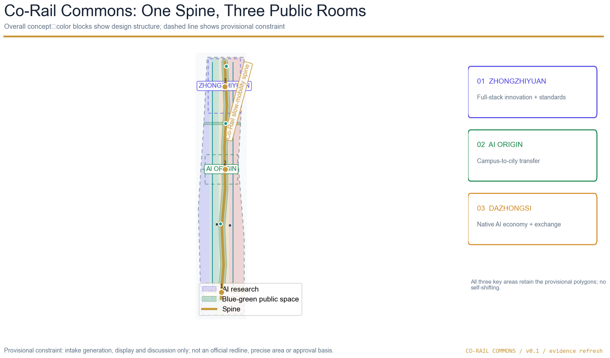

# Co-Rail Commons: AI Public Innovation Corridor

## Design Basis and Source List

This proposal interprets the “Centenary Jingzhang AI Innovation Belt” as an open public-innovation framework connecting history, industry, everyday life and accountable AI governance. The official announcement and taskbook are treated as the task basis: they provide the project name, three scope levels, stated areas, design tasks, three positions, five functions, three key areas, two wings and six agent tasks [source:OFFICIAL-ANNOUNCEMENT] [source:AGENT-TASKBOOK]. The proposal is a concept package. It does not replace planning, transport, architecture, heritage, fire, municipal, public-health or operations professionals.

The workflow reads `brief/site-package/design_brief.json`, `agent_taskbook.json`, `allowed_design_space.json`, planning limits, local standards, `data/source_registry.json` and the processed fact pack. It then locks the supplied boundary, creates auditable layers, recalculates metrics, renders drawings and runs the bilingual self-check [source:SITE-PACKAGE] [source:SOURCE-REGISTRY] [depth:existing_conditions_diagnosis]. The GeoJSON, metrics, matrices and self-check are the machine-review layer; this proposal, five figures, offline HTML and A3/A0 PDFs are the human-reading layer. Both layers use the same design decisions and identifiers.

The announcement states an approximately 43.6 km2 research area, an approximately 11.4 km2 overall design area and approximately 368.4 ha for the three key areas: Zhongzhiyuan 192.1 ha, Beijing AI Origin Community 104.3 ha and Dazhongsi AI Industry Cluster 72.0 ha. The public package does not include a verifiable official coordinate polygon, road redlines, regulatory intensity, building height, ownership, municipal, fire or heritage attachments. The submission therefore retains the maintainer file `provisional_boundaries.geojson`, with `official_boundary=false` and `geometry_role=provisional_constraint` in `site_boundary.geojson` and `key_areas.geojson` [data:geometry/site_boundary.geojson#SITE-001] [data:geometry/key_areas.geojson#PROV-KEY-001] [source:BOUNDARY-SOURCE]. These shapes support intake, discussion, display and self-check only. They are not official redlines, approval evidence or precise-area claims.

The source list records public permissions, access dates, usage and limitations in `sources.json`. Missing controls and field baselines are recorded in `assumptions.json` and `constraints.geojson` [data:geometry/constraints.geojson#CONSTRAINTS-001]. No private map, confidential table, uncleared photograph, portrait, company trademark, remote map tile or external script is embedded. Seven official public case pages are used only as mechanism comparisons: Mila, Vector Institute, Punggol Digital District, London Knowledge Quarter, Barcelona 22@, Helsinki AI Register and AI Singapore [source:GLOBAL-CASE-MILA] [source:GLOBAL-CASE-VECTOR] [source:GLOBAL-CASE-PDD] [source:GLOBAL-CASE-KQ] [source:GLOBAL-CASE-22AT] [source:GLOBAL-CASE-HELSINKI] [source:GLOBAL-CASE-AISG]. They are not used as Haidian site facts.

## Three-Level Scope Framework

The three scope levels are three scales of one evidence chain, rather than three unrelated maps. The research area asks why an AI innovation public spine is needed; the overall design area asks how that spine joins land use, buildings, movement, municipal interfaces, blue-green space and renewal projects; the three key areas ask how Zhongzhiyuan, AI Origin Community and Dazhongsi carry distinct public roles. This progression follows the announced spatial levels and the design-depth requirements [standard:PROJECT-OFFICIAL-ANNOUNCEMENT] [depth:three_level_scope_framework] [depth:overall_spatial_structure].

| Level | Announced basis | Design judgment | Structured evidence |
| --- | --- | --- | --- |
| Coordinated research area | Approximately 43.6 km2 in the Beijing urban research context | Build a chain of university knowledge, open collaboration, enterprise transfer, public experience and international communication. | `design_brief.json`, `agent_taskbook.json`, concept overview figure |
| Overall design area | Approximately 11.4 km2 around the Jingzhang heritage park and urban/industrial context | Use one walkable blue-green public spine to combine innovation services, daily services and a legible cultural narrative. | [data:geometry/site_boundary.geojson#SITE-001] [data:geometry/land_use.geojson#LU-001] |
| Three key areas | Approximately 368.4 ha in total: Zhongzhiyuan, AI Origin Community and Dazhongsi | Create three public rooms with distinct themes, while sharing the spine, scenario cards and operating loop. | [data:geometry/key_areas.geojson#PROV-KEY-001] [metric:key_area_count] |

The working name is “智轨共生带”, translated as **Co-Rail Commons**. “Co-Rail” is not a proposal for new railway infrastructure; it describes the coexistence of rail memory, shared movement and civic innovation. “Commons” describes shared knowledge, public space and public service. The logo direction is two parallel short lines enclosing an open circle: the lines suggest Jingzhang history and future walking; the circle suggests a public node that can be entered, contributed to and human-reviewed. The visual palette uses deep blue, railway gold, blue-green and safety orange. It avoids uncleared fonts, portraits, logos and corporate marks.

## Coordinated Research Area: Industry and Future City Research

### Mechanism comparisons

External cases are treated as lenses, not as promises. Mila contributes an open-science and cross-disciplinary community mechanism; the Vector Institute contributes an academic-to-industry bridge; Punggol Digital District demonstrates the value of colocating education, enterprise, community and testbed interfaces; Knowledge Quarter demonstrates a multi-institution innovation district with public-facing activity; Barcelona 22@ shows the relationship between industrial upgrading and urban renewal; Helsinki AI Register offers a model for visible public explanation and oversight; AI Singapore offers a challenge-and-training mechanism for students and developers [source:GLOBAL-CASE-MILA] [source:GLOBAL-CASE-VECTOR] [source:GLOBAL-CASE-PDD] [source:GLOBAL-CASE-KQ] [source:GLOBAL-CASE-22AT] [source:GLOBAL-CASE-HELSINKI] [source:GLOBAL-CASE-AISG].

| Public mechanism | Adaptation for this proposal | Boundary on transfer |
| --- | --- | --- |
| Mila / Montreal | Pair open science, ethics and cross-disciplinary exchange with research, startups and knowledge transfer. | Do not import the overseas institution’s scale, governance or funding as a local fact. |
| Vector / Toronto | Create an academic–enterprise interface for talent, research and trustworthy adoption. | Do not invent local partner companies, investment or policy arrangements. |
| Punggol Digital District / Singapore | Put education, enterprises, community services and test interfaces in a visible district framework. | “Living testbed” is a future pilot idea, not an existing deployment claim. |
| Knowledge Quarter / London | Use public space, institutional networks and events to support accessibility and participation. | Do not place foreign brands or institutions into uncleared local wayfinding. |
| 22@ / Barcelona | Discuss industrial upgrading and urban renewal in one framework. | Do not convert the model into a local FAR, parcel or demolition decision. |
| Helsinki AI Register | Make systems, explanations, human oversight and public questions visible. | Do not collect resident behavior or replace public procedure with an algorithm. |
| AI Singapore | Use student, developer and applied challenges to grow capability and community assets. | Activities remain proposals until permissions, operators, budgets and safeguarding are confirmed. |

The resulting ecosystem diagram has eight interacting elements: land and space; industry and enterprise; capital and resources; talent and community; computing and infrastructure; data and authorization; scenarios and testing; governance and communication. Zhongzhiyuan can host full-stack research, evaluation and standards; AI Origin Community can host campus-to-city transfer, open collaboration and talent life; Dazhongsi can host city-scale services, international exchange and intelligent-native consumption. The Zhongguancun wing supports knowledge, intellectual property, legal, cooperation and resource coordination. The Xiaoyuehe wing supports public service, walking experience, low-disruption scenarios and community opening. The wings are coordination mechanisms, not new statutory districts.

### Future-city principles

The future-city proposition is “visible service, reproducible data, accessible space and reviewable people.” AI should not remain inside a laboratory. It can appear through an open release room, a public-service station, a low-carbon computing prototype, a walking diagnosis and a cultural route so that residents and visitors can understand what it does and where human judgment remains. Every scenario must minimize collection, explain the system, provide a non-digital path, allow withdrawal or appeal and preserve a human fallback [standard:PROJECT-AGENT-OPEN-CALL-TASKBOOK] [depth:overall_spatial_structure].

## Overall Design Area: Urban Renewal and Regulatory-Plan-Level Urban Design

The spatial structure is **one Co-Rail public walking spine, three public rooms, two coordinating wings and ten AI scenario nodes**. The spine is represented by `ROAD-001` as a slow-mobility and innovation-service corridor, with conceptual east–west connections for walking and cycling [data:geometry/roads.geojson#ROAD-001] [depth:traffic_rail_slow_parking]. It is not a road redline and does not provide lane widths, vehicle capacity, intersection channelization, parking counts, bridge or underground conclusions.

Land use is generated by one continuous partition of the supplied site boundary. Four adjacent polygons provide a topology-checkable structure using repository-compatible codes: 0802 for research and development, 1401 for public green space, 05 for industry services and 0702 for community services. The partition is an intake design layer, not a statutory use plan. Its complete coverage and no-overlap properties can be recalculated from `land_use.geojson` [data:geometry/land_use.geojson#LU-001] [standard:MNR-LAND-USE-CLASSIFICATION-GUIDE] [depth:land_use_layout]. Formal use and intensity require the complete official code table and regulatory conditions.

Twelve concept footprints are included to make spatial relationships legible. Each carries a `proposed_action`: `retain_or_renovate_study` means a retention or adaptive-reuse study; `new_build_siting_study` means a possible new-build site; no feature is labeled `demolish`. These are not a survey of existing buildings and do not make parcel-level demolition, ownership or permit decisions [data:geometry/buildings.geojson#BLDG-001] [depth:retain_renovate_demolish]. The directly auditable scale indicator is footprint area [metric:building_footprint_area_sqm]. FAR, height, density, setbacks, building control lines and road redlines remain `unknown` [metric:floor_area_ratio] [standard:MOHURD-CONTROL-DETAILED-PLANNING] [depth:development_intensity_controls].

The character guidance is deliberately qualitative: a low-disruption public interface, open ground floors, continuous edges, clear cultural storytelling, reversible equipment and readable night safety. Heritage-facing spaces should privilege reversible, low-impact interventions. Enterprise-service edges should prioritize open ground floors, shade, accessibility, nighttime safety and transparent service. New building height, massing, roofline, color, setback and landscape controls must be developed by the professional team after official conditions arrive [standard:MOHURD-URBAN-DESIGN-MEASURES] [depth:height_massing_character].

## Detailed Design of Key Areas

### Zhongzhiyuan: full-stack innovation garden

Zhongzhiyuan is the northern public room for full-stack research, trustworthy evaluation, standards governance and green collaboration. Its concept actions place model testing, standards workshops and public explanations at the edge of an innovation garden; connect a river-facing interface to walking and cycling; and turn industrial display into an explainable civic node. JZ/C-02 is a public safety-governance sandbox and JZ/C-08 is a low-carbon computing service station. The geometry is the supplied provisional `PROV-KEY-001` [data:geometry/key_areas.geojson#PROV-KEY-001].

Existing space should first support shared testing, open collaboration and public service. New footprints only indicate capability interfaces. The public-space sequence is “test garden — shared green hall — standards display hall.” Sensors, if later authorized, must be minimal, consent-aware, explainable and human-reviewed. Traffic proposals are conceptual interfaces to the spine, cross-links and external transit; river, flood, fire and municipal conditions must be added before detailed design.

### Beijing AI Origin Community: campus-to-city transfer room

AI Origin Community is the middle public room. It connects university resources, open-source communities, result publication, intellectual property, human services and everyday walking through a low-disruption transfer framework. JZ/C-01 is an open-release room for small events, code contribution display and bookable collaboration. JZ/C-06 is a university–enterprise transfer room. JZ/C-04 is a talent-life service desk that keeps an offline service entrance and does not turn residents or students into unexplained behavior-data sources [data:geometry/key_areas.geojson#PROV-KEY-002].

The walking sequence is “campus — courtyard — street — public park.” Shared green halls, open ground floors and cultural guidance bring knowledge transfer into the public realm. Renewal actions are limited to retention/adaptive-reuse studies and new-build siting studies. Transit interfaces, parking, accessibility, public-service facilities and ownership must be validated by professionals. A weekly open session, monthly public issue room and quarterly cross-area opening are proposed rhythms, not confirmed schedules.

### Dazhongsi: city-service and exchange room

Dazhongsi is the southern public room for urban-scale industry services, intelligent-native everyday experience and international exchange. JZ/C-03 is a service-copilot counter with human escalation; JZ/C-07 is a responsible public-service review room; JZ/C-10 is a cultural route and exchange card. The approach prioritizes information, accessible walking, public service and human consultation before any station-scale engineering claim [data:geometry/key_areas.geojson#PROV-KEY-003].

The proposal deliberately retains `PROV-KEY-003` exactly as supplied. Public Issue #1029 records that its relationship with Dazhongsi Station remains unresolved; this package does not self-shift the polygon, claim a four-quadrant station boundary, state a station distance or assert an engineering alignment [source:ISSUE-1029]. The “station-city interface” is a design question for later professional verification. If maintainers publish an official or cleared polygon, the three scope boundaries, all drawings, HTML, layers and metrics must be regenerated together.

## AI Innovation Ecosystem, Personas, and AI+ Scenarios

The design label system uses `JZ/C-01` through `JZ/C-10` for scenario cards, `JZ/R-01` through `JZ/R-06` for renewal projects and `JZ/P-01` through `JZ/P-03` for conceptual landmarks. Ten scenario cards are deliberately operational rather than futuristic: open release, safety governance, station information, talent life, public mobility, campus–enterprise transfer, public-service review, low-carbon computing, cultural exchange and AI pilgrimage. Each card includes a user need, spatial carrier, service interface, data-minimization boundary, human fallback and a next evidence action. The count is [metric:ai_scenario_card_count].

The five personas are: a university researcher who needs reproducible evaluation; an enterprise product lead who needs a trustworthy transfer interface; a resident who needs convenient offline public service; a student or developer who needs a low-barrier contribution route; and a visitor who needs a legible Jingzhang cultural walk. These are design personas, not observed demographic statistics [metric:persona_count].

Three industry validation scenarios are intentionally marked `not_run`:

1. **Walkability and access review.** Baseline fields: an authorized route audit, barrier inventory, time-stamped manual counts and non-digital feedback. Success means the professional team can reproduce the route and identify safe human-service alternatives; stop conditions include unsafe conditions, missing consent or inability to explain the collection. Human fallback: a staff-led route review. Responsibility: the authorized operator and accessibility reviewer.
2. **Enterprise-service copilot review.** Baseline fields: scripted service questions, response trace, escalation log and human reviewer notes. Success means a person can understand the answer, challenge it and complete the task without the model; stop conditions include unsupported advice, personal-data exposure or no escalation. Human fallback: a trained service desk. Responsibility: the service operator and legal/data reviewer.
3. **Public-safety operations review.** Baseline fields: a tabletop exercise, clear incident roles, manually reviewable alerts and a deletion schedule. Success means the team can explain the alert path and stop the service safely; stop conditions include false certainty, uncontrolled surveillance or unclear responsibility. Human fallback: ordinary public-safety procedure. Responsibility: the authorized safety lead and independent review.

No field baseline, resident survey, traffic count or authorized AI pilot is claimed as completed. Numbers are not invented. Any future pilot requires authorization, a frozen protocol, human review, privacy assessment, public communication, deletion and publication of only cleared aggregates [data:geometry/constraints.geojson#CONSTRAINTS-002] [depth:risk_missing_data].

The three conceptual AI pilgrimage landmarks are: `JZ/P-01 Jingzhang Memory Gate`, a reversible timeline and oral-history entry; `JZ/P-02 Open Model Commons`, a visible contribution and human-review process; and `JZ/P-03 Trustworthy Evaluation Garden`, a place for booked test explanations and public rest. They are narrative and public-space ideas, not engineering or heritage-permission conclusions [metric:landmark_count] [data:geometry/public_space.geojson#PUBLIC-001] [depth:blue_green_public_space].

## Land Use, Building Scale, and Retain-Renovate-Demolish Strategy

The land-use codes are a repository-compatible subset: 0802 expresses AI research and evaluation; 1401 expresses the blue-green public spine; 05 expresses industry services and open exchange; 0702 expresses community services and talent life. All four polygons are derived by continuous cuts from the same overall-design polygon, so area totals can be checked from `land_use.geojson` rather than inferred from a drawing [standard:MNR-LAND-USE-CLASSIFICATION-GUIDE] [data:geometry/land_use.geojson#LU-002].

The twelve building bases serve spatial logic, not existing-building inventory. The action taxonomy prefers “retain or renovate study” and “new-build siting study”; the package does not include `demolish` conclusions. Before detailed work, the professional team must obtain existing-building outlines, floors, use, construction date, ownership, heritage and fire conditions [data:geometry/buildings.geojson#BLDG-006] [depth:retain_renovate_demolish].

The working rule is “program first, incremental construction second”: first make public ground floors, shared services, accessible connections and reversible interfaces useful; then study new construction against cleared controls. The proposal does not fill a plausible-looking FAR, height or density value. `metrics.json` keeps `floor_area_ratio`, `building_height_m` and `building_density` unknown. All character controls are expressed as professional research directions, not approval indicators.

## Transport, Rail, Municipal Infrastructure, and Public Services

The movement concept has four layers: a public spine, cross-links, station-city information interfaces and human service routes. `ROAD-001` is the north–south slow-mobility and innovation-service spine; `ROAD-002` through `ROAD-006` are conceptual walking and cycling links [data:geometry/roads.geojson#ROAD-001]. They are not road redlines and do not supply engineering widths, lanes, intersection design, parking numbers, grade separation or underground conclusions. The length metrics are intake computations from provisional geometry and must be recalculated after official boundaries and transport files arrive [metric:slow_mobility_spine_length_m] [metric:road_centerline_length_m].

Rail and station integration follows an “information interface first” principle: make guidance, accessible routes, public services, non-motorized routes and human consultation legible before studying station boundaries, road sections, crossings and municipal conditions. This is especially important at Dazhongsi: the package keeps the provisional polygon and Issue #1029 disclosure rather than rewriting it into a completed station project [source:ISSUE-1029] [depth:traffic_rail_slow_parking].

Municipal and new infrastructure are expressed as four conceptual interfaces: edge computing, distributed energy, public service and traditional municipal systems. Edge computing is limited to clear, low-sensitivity, stoppable public scenarios. Energy, drainage, fire protection, flood control, water, telecommunications and capacity remain pending formal attachments. Public services should be embedded in public rooms and ground-floor interfaces while retaining offline windows, accessibility and non-smartphone routes [depth:municipal_new_infrastructure] [data:geometry/constraints.geojson#CONSTRAINTS-004].

## Blue-Green Network, Public Space, and Urban Character

The blue-green network uses the Jingzhang heritage park activity belt as a narrative spine, five green-space features and five public-space features to form a network that can be walked north–south, stitched east–west and paused at public rooms. `GREEN-001` is the main-spine buffer; `GREEN-002` through `GREEN-005` connect the three key-area concepts. `PUBLIC-001` and its companions are release, test, cultural and service nodes [data:geometry/green_space.geojson#GREEN-001] [data:geometry/public_space.geojson#PUBLIC-001].

Green and public-space areas are recomputed from the GeoJSON union and the supplied site boundary. Current `green_ratio` and `public_space_ratio` are intake indicators; because the boundary and green line remain provisional, they must not be used as statutory green-rate or construction indicators [metric:green_space_area_sqm] [metric:green_ratio] [metric:public_space_area_sqm] [metric:public_space_ratio].

The urban narrative has three layers: “rail opens the route,” using time, old stations and public guidance to tell infrastructure modernization; “Zhongguancun becomes a network,” using labs, campuses, open collaboration and transfer to tell how knowledge enters the city; and “AI co-creation,” using scenario cards, contribution walls, trustworthy evaluation and public service to tell how technology accepts questions. Guidance uses original linear rail symbols and cleared text. It does not use uncleared portraits, company logos, paper images or protected fonts [standard:MOHURD-URBAN-DESIGN-MEASURES] [depth:blue_green_public_space].

## Renewal Projects, Implementation Policy, and Phasing

Six concept renewal projects define a reviewable next-action list. They are not confirmed government projects, funding arrangements or parcel-level renewal decisions.

| ID | Concept project | First move | Dependency and risk |
| --- | --- | --- | --- |
| JZ/R-01 | Jingzhang heritage-park walking gap | Guidance, seating, accessibility and human-route pilot | Road and park boundary, heritage and safety review |
| JZ/R-02 | Zhongzhiyuan river-edge innovation interface | Shared green hall, test explanation and low-carbon display | River blue line, flood, ecology and operating conditions |
| JZ/R-03 | AI Origin campus-transfer street | Open release, intellectual-property and talent service | Campus boundary, ownership, existing buildings and negotiation |
| JZ/R-04 | Dazhongsi public interface | Information, human service and walking continuity study | Official key polygon, station, roads and crossings |
| JZ/R-05 | AI public service and edge-compute node | Data-minimized and human-fallback tabletop | Authorization, energy, compute, safety and data governance |
| JZ/R-06 | Global AI activity public route | Culture–open source–industry–exchange route | Event permission, rights, security, operator and budget |

Phasing follows three conceptual areas in `phasing.geojson`: a southern public-space and station-interface starter, a middle AI Origin transfer and cultural-route phase, and a northern Zhongzhiyuan innovation-garden and open-test phase [data:geometry/phasing.geojson#PHASE-001] [depth:phasing_implementation]. Near term means guidance, public seating, open activity, offline service and data explanation. Mid term means shared rooms, result transfer and scenario sandboxes. Long term means deeper building, transport, municipal and operational integration only after the missing conditions are cleared. Phase geometry is provisional and does not represent investment timing or a construction commitment [metric:phase_count].

The proposed operating rhythm is week–month–season–year: a weekly open session; a monthly results or public-issue room; a quarterly cross-area scenario day; and an annual global AI activity week. The operator model can combine a space operator, professional reviewers, public feedback stewards and open-record keepers. Every activity must separately confirm venue, rights, privacy, security, fire, accessibility and budget. Brand assets are a continuing set of scenario cards, contribution records, public guidance, annual reports and review logs, not a one-time promotion.

## Metrics, Area Recalculation, and Compliance Matrix

All spatial metrics use the same GeoJSON package and EPSG:4548 recalculation. The current provisional site area is [metric:site_area_sqm]; the announced text area is [metric:site_announced_area_sqm]. They are intentionally kept separate: the announced value is a textual task constraint, while the first is the computed result of the supplied provisional polygon. Building footprint, green-space and public-space values are [metric:building_footprint_area_sqm], [metric:green_space_area_sqm] and [metric:public_space_area_sqm]; ratios are [metric:green_ratio] and [metric:public_space_ratio]. Each known metric records source files, formula, confidence and assumptions. When an official polygon arrives, the generation script must recalculate rather than hand-edit.

The task metrics cover three key areas [metric:key_area_count], the announced key-area total [metric:key_area_announced_total_sqm], ten scenario cards [metric:ai_scenario_card_count], three industry validation scenarios [metric:industry_validation_scenario_count], five personas [metric:persona_count], three conceptual landmarks [metric:landmark_count], six renewal projects [metric:renewal_project_count] and three concept phases [metric:phase_count]. These are content or design counts. They do not mean visitor capacity, operating performance, industrial scale or government assessment results.

`compliance_matrix.json` maps announcement items 1.3–1.5, the three key areas and `agent.1`–`agent.6` to narrative, layers, metrics, drawings, visuals, assumptions and checks. `standard_matrix.json` covers the announcement, taskbook, urban-design management, regulatory planning, land-use classification and the architecture-design-depth data gap. `design_depth_matrix.json` covers existing conditions, scope, spatial structure, land use, intensity, character, retain/renovate/demolish, movement, municipal systems, blue-green space, key-area detail, renewal, phasing, metrics and missing-data risk. `self_check.json` records the deterministic checks, while the offline visual pages expose the same identifiers and numbers.

Unknowns are preserved rather than backfilled: FAR, building height, density, setbacks, road redlines, ownership, heritage, municipal capacity, fire, flood, public facilities, field baseline, satisfaction, accessibility performance and AI pilot results. The evidence chain is therefore a proposed design package ready for human professional review, not a final regulatory plan [depth:metrics_recalculation] [standard:MOHURD-CONTROL-DETAILED-PLANNING].

## Risk, Copyright, and Compliance

The first risk is missing spatial data. The package uses provisional boundaries and key areas; their relative order and areas can be recalculated, but absolute anchors and road relationships remain unresolved. The second risk is missing controls: FAR, height, density, setbacks, redlines, ownership, building survey, heritage, municipal, fire, drainage, flood and public-service bases must be added. The third risk is AI governance: no field test, resident survey or authorized deployment is claimed. The three test cards retain baseline fields, success and stop conditions, human fallback and responsible review [data:geometry/constraints.geojson#CONSTRAINTS-002] [depth:risk_missing_data].

The public-interest boundary is explicit. Every scenario retains human service, an offline route, an explanation, an exit or appeal route and minimal data collection. Behavior traces, portraits, private data and uncleared enterprise data are not design prerequisites. Any future sensors, service or pilot require authorization, privacy assessment, safety review, public participation, retention/deletion rules and professional accountability.

The copyright statement records local generation with Python, Matplotlib, Shapely and pyproj. No uncleared image, remote tile, trademark, portrait, external font asset, CDN or external script is embedded. Public case pages are recorded in `sources.json` with URL and usage boundary. The package license is `COMMUNITY-DISPLAY-ONLY`. The submission status is “submitted concept / provisional intake,” not “approved,” “selected” or “implemented.” The bilingual package includes the Chinese proposal, this independent English translation, bilingual report HTML, offline visual pages, A3/A0 PDFs and English figure counterparts. `manifest.json` records SHA-256 hashes for the package files.

## References

- `brief/site-package/design_brief.json`, `agent_taskbook.json`, `allowed_design_space.json`, planning limits and schemas [source:SITE-PACKAGE]
- `data/source_registry.json`, `data/processed/agent_fact_pack.md`, `project_scope_summary.csv` and `agent_task_requirements.csv` [source:SOURCE-REGISTRY] [source:PROCESSED-FACT-PACK]
- Beijing municipal planning announcement for the Centenary Jingzhang AI Innovation Belt [source:OFFICIAL-ANNOUNCEMENT]
- Cleared taskbook extract and local taskbook evidence snapshot [source:AGENT-TASKBOOK] [standard:PROJECT-AGENT-OPEN-CALL-TASKBOOK]
- Ministry of Housing and Urban-Rural Development urban-design and regulatory-planning references; Ministry of Natural Resources land-use classification guide [source:MOHURD-URBAN-DESIGN-MEASURES] [source:MOHURD-CONTROL-DETAILED-PLANNING] [source:MNR-LAND-USE-CLASSIFICATION-GUIDE]
- Mila, Vector Institute and Punggol Digital District public mechanism pages [source:GLOBAL-CASE-MILA] [source:GLOBAL-CASE-VECTOR] [source:GLOBAL-CASE-PDD]
- Knowledge Quarter, Barcelona 22@ and Helsinki AI Register public mechanism pages [source:GLOBAL-CASE-KQ] [source:GLOBAL-CASE-22AT] [source:GLOBAL-CASE-HELSINKI]
- AI Singapore public mechanism page [source:GLOBAL-CASE-AISG]
- Maintainer provisional geometry and Issue #1029 discussion, used for explicit uncertainty disclosure only [source:BOUNDARY-SOURCE] [source:ISSUE-1029]
