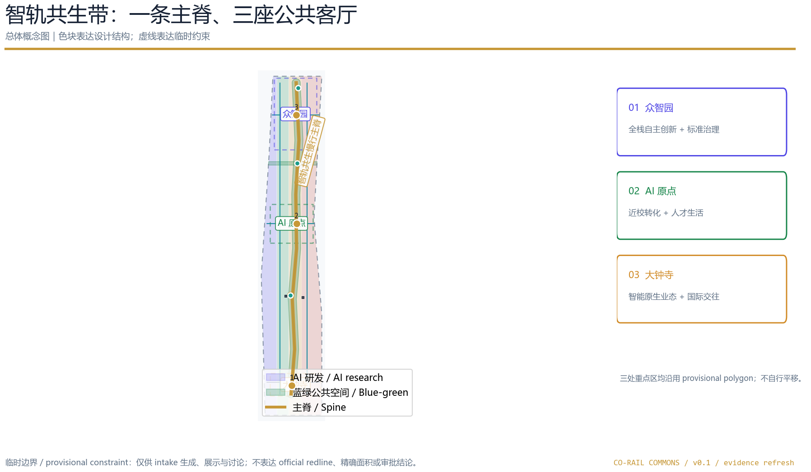
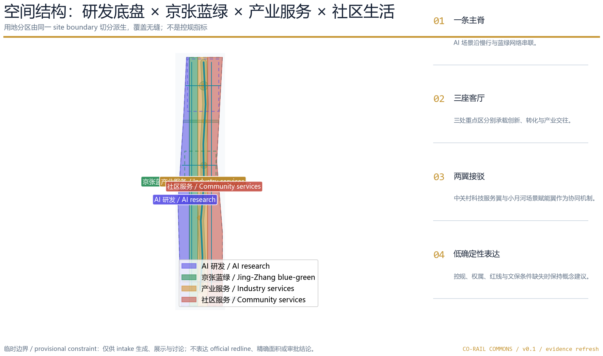
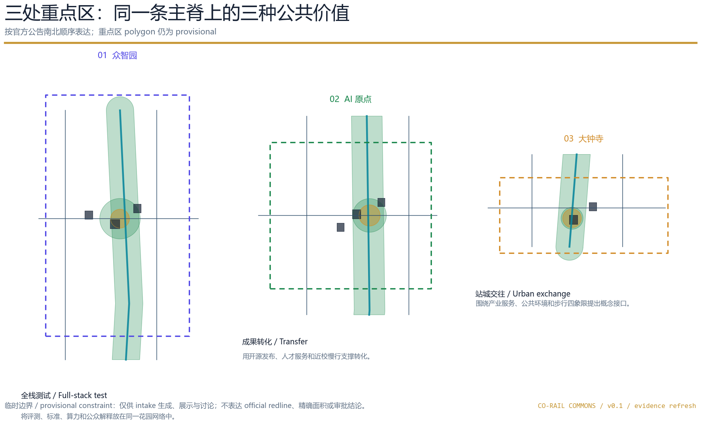
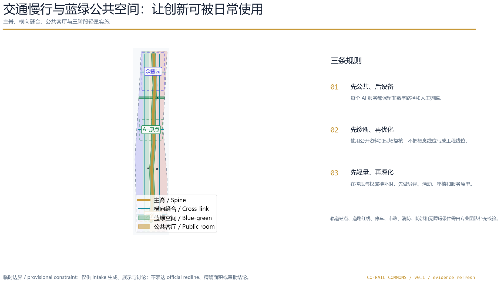
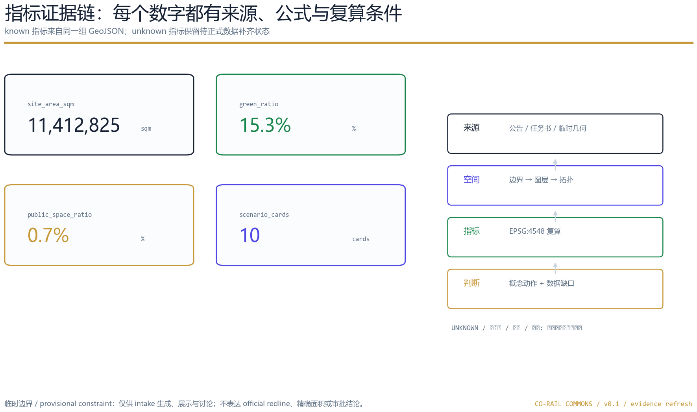

# 智轨共生带：AI公共创新走廊

## 设计依据与资料清单

本方案把“百年京张AI创新带”理解为一项连接历史、产业、公共生活和人工智能治理的开放共创建议。它以公告给出的项目名称、三层范围、三处重点区、面积和设计任务为任务依据，以任务书给出的三大定位、五大功能、三区两翼和六项智能体任务为创新响应框架 [source:OFFICIAL-ANNOUNCEMENT] [source:AGENT-TASKBOOK]。方案不是已审定的城市规划，也不替代规划、交通、建筑、文保、消防、市政或运营专业团队的最终判断。

我先读取了 `brief/site-package/design_brief.json`、`agent_taskbook.json`、`allowed_design_space.json`、枚举、规划限制、标准本地快照、`data/source_registry.json` 和处理后的事实包，然后按“锁定边界—生成图层—复算指标—生成图件—双语自检”的顺序工作 [source:SITE-PACKAGE] [source:SOURCE-REGISTRY] [depth:existing_conditions_diagnosis]。提交包中的 GeoJSON、metrics、三类矩阵和 self_check 是机器审计层；正文、五张图、离线 HTML 和 A3/A0 PDF 是人类阅读层，二者保持同一组设计判断和数字。

官方公告提供了统筹研究范围约 43.6 km²、总体设计范围约 11.4 km²、重点区域合计约 368.4 ha，以及众智园 192.1 ha、北京AI原点社区 104.3 ha、大钟寺AI产业聚集区 72.0 ha 的文字和面积约束。但当前公开资料没有提供可验证坐标系的精确官方 polygon、道路红线、控规强度、建筑高度、权属、市政或文保控制附件。故本包使用维护者提供的 `provisional_boundaries.geojson`，并在 `site_boundary.geojson` 与 `key_areas.geojson` 中保留 `official_boundary=false`、`geometry_role=provisional_constraint` 和精度说明 [data:geometry/site_boundary.geojson#SITE-001] [data:geometry/key_areas.geojson#PROV-KEY-001]。这些几何只支持 intake 生成、展示、讨论和自检；不是 official redline、审批依据或精确面积依据 [source:BOUNDARY-SOURCE] [source:ISSUE-1029]。

特别需要披露的是：`PROV-KEY-003` 沿用仓库的南北顺序和面积拟合结果，没有被我自行平移到大钟寺站。公开 Issue #1029 记录了它与大钟寺站的空间锚定关系尚未完成；因此本方案只画“站城接口的概念方向”，不声称四象限边界、站点距离或工程线位 [source:ISSUE-1029] [data:geometry/key_areas.geojson#PROV-KEY-003]。若维护者后续发布 official 或清权 polygon，必须统一替换三层边界、三处重点区、设计图层、图件、HTML 和所有指标，而不是单独移动一个方案要素。

公开来源、许可和限制写入 `sources.json`；待补控规、权属、建筑、交通、市政、文保和现场基线写入 `assumptions.json` 与 `constraints.geojson` [data:geometry/constraints.geojson#CONSTRAINTS-001]。本方案没有使用私人地图、内部表格、未清权照片、人物肖像、企业商标、远程地图瓦片或外部脚本。

## 三层范围工作框架

三层范围不是三张互不相干的图，而是同一条设计证据链的三个尺度。统筹研究范围回答“AI创新生态为何需要一条城市公共主脊”；总体设计范围回答“主脊如何与用地、建筑、交通、市政、蓝绿和更新项目耦合”；重点区域回答“众智园、AI原点、大钟寺如何各自承担创新、转化和产业交往”。这一递进关系对应公告的空间层级和三层深度要求 [standard:PROJECT-OFFICIAL-ANNOUNCEMENT] [depth:three_level_scope_framework] [depth:overall_spatial_structure]。

| 层级 | 公告约束 | 本方案的设计判断 | 结构化证据 |
| --- | --- | --- | --- |
| 统筹研究范围 | 约 43.6 km²，北五环—京藏高速—西直门外大街—万泉河路文字四至 | 建立“高校策源—开源协作—企业转化—公共体验—国际传播”的创新链和城市服务链 | `design_brief.json`、`agent_taskbook.json`、总体概念图 |
| 总体设计范围 | 约 11.4 km²，京张遗址公园周边约 1–2 km 城市地区和产业区 | 用一条慢行/蓝绿主脊把产业服务、生活服务和文化叙事叠合起来 | [data:geometry/site_boundary.geojson#SITE-001]、[data:geometry/land_use.geojson#LU-001] |
| 重点区域范围 | 三处重点区约 368.4 ha，自北向南为众智园、AI原点、大钟寺 | 将三个片区做成三座不同主题的“公共客厅”，共享主脊、场景卡和运营机制 | [data:geometry/key_areas.geojson#PROV-KEY-001]、[metric:key_area_count] |

设计主名称为“智轨共生带”，英文为 **Co-Rail Commons**。Co-Rail 不是新增铁路或轨道工程名，而是把“轨迹、共生、公共性”翻译成可识别的工作品牌；Commons 表达公共知识、公共空间与公共服务的共同底盘。Logo 方向是“两条平行短线夹一枚开放圆点”：平行线指向百年京张的轨迹与未来的慢行网络，圆点指向一个可进入、可贡献、可人工复核的公共节点。主色使用深蓝、铁路金、蓝绿和安全橙，不调用未经授权的字体、人物、商标或企业标识。

命名系统采用 `JZ/C-01` 至 `JZ/C-10` 的场景编号、`JZ/R-01` 至 `JZ/R-06` 的更新项目编号和 `JZ/P-01` 至 `JZ/P-03` 的朝圣地标编号，便于正文、图件、HTML 和矩阵互相回读。三大定位“百年京张文化带、都市AI生活体验带、AI融合创新带”分别对应文化叙事、公共服务和产业生态；五大功能“AI全栈自主创新体系、世界级AI创新生态、AI+场景赋能新范式、智能化AI活力城市、AI治理全球话语权”分别由三座客厅、十张场景卡、五类用户画像和长期运营响应 [source:PROJECT-AGENT-OPEN-CALL-TASKBOOK]。

## 统筹研究范围产业与未来城市研究

### 生态机制对照

本方案不把外部案例当作海淀现状，也不编造企业、投资、产值或政策承诺。它选取七个公开案例作为“机制镜子”，只提炼可供专业团队讨论的空间—组织—治理关系：Mila 的开放科学与跨学科社区、Toronto Vector Institute 的学术到产业桥梁、Singapore Punggol Digital District 的产学社结合和物理AI测试 [source:GLOBAL-CASE-MILA] [source:GLOBAL-CASE-VECTOR] [source:GLOBAL-CASE-PDD]。

London Knowledge Quarter 的多机构创新区与公共空间、Barcelona 22@ 的创新与城市更新结合，提供公共空间、机构网络和更新讨论的比较视角 [source:GLOBAL-CASE-KQ] [source:GLOBAL-CASE-22AT]。Helsinki AI Register 的公共透明度、AI Singapore 的学生与开发者能力培养，提供可解释、可参与的治理与人才机制对照 [source:GLOBAL-CASE-HELSINKI] [source:GLOBAL-CASE-AISG]。

| 公开机制 | 对本方案的启发 | 不可直接照搬的部分 |
| --- | --- | --- |
| Mila / Montreal | 用开放科学、伦理和跨学科社区支撑研究、创业和知识转移 | 不把海外机构规模、组织结构或资金安排写成海淀事实 |
| Vector / Toronto | 以独立的学术—企业接口承接人才、研究和可信采用 | 不编造本地合作企业、资金或政策安排 |
| Punggol Digital District / Singapore | 将教育、企业、社区和测试场放到一个可感知的城市片区 | 不把“living testbed”写成已经取得授权的现场部署 |
| Knowledge Quarter / London | 用公共空间、机构网络和活动体系塑造创新区的可达性 | 不把国际品牌或机构名称置于未清权的本地导视中 |
| 22@ / Barcelona | 把产业升级、生产性空间和城市更新放在同一讨论框架 | 不把国外更新模式直接转成地块、容积率或拆改决定 |
| Helsinki AI Register | 用系统公开、解释和人工监督提升公众信任 | 不采集居民私密行为，也不以算法替代公共程序 |
| AI Singapore | 以学生、开发者和应用挑战沉淀人才与社区资产 | 不把活动设想写成已确定的年度安排 |

据此，统筹研究形成“八要素生态图谱”：土地/空间、产业/企业、资金/要素、人才/社区、算力/基础设施、数据/授权、场景/测试、治理/传播。众智园适合承载全栈研发、可信评测和标准治理；AI原点适合承载高校成果转化、开源协作和人才生活；大钟寺适合承载城市型产业服务、国际路演和智能原生消费。中关村科技服务翼负责知识产权、法务、合作和资源配置，小月河场景赋能翼负责公共服务、慢行体验和低扰动场景开放；两翼不是新增法定分区，而是协同机制的概念表达。

未来城市形态采用“服务可见、数据克制、空间可进入、人工可复核”四条原则。AI 不只出现在楼内实验室，也应通过开源发布厅、公共服务驿站、低碳算力原型、慢行诊断和文化线路让居民与访客理解它。所有空间落地建议均为概念建议、参考方案或可供专业团队深化研究，不构成政府审定结论 [standard:PROJECT-AGENT-OPEN-CALL-TASKBOOK] [depth:overall_spatial_structure]。

## 总体设计范围城市更新与控规深度城市设计

总体设计范围的空间骨架称为“1—3—2—10”：一条智轨共生慢行主脊，三座重点公共客厅，两翼协同机制，十个 AI 场景节点。主脊不是新的道路红线；它是由 `ROAD-001` 表达的慢行与创新服务廊道，并与横向骑行、步行、轨道接驳概念线相连 [data:geometry/roads.geojson#ROAD-001] [depth:traffic_rail_slow_parking]。三座客厅以 `key_areas.geojson` 的三个 provisional 要素为讨论锚点，边界和面积位置仍待官方资料。

用地结构由一个 site boundary 通过同一切分过程派生成研发、蓝绿、产业服务和社区服务四类相邻多边形，确保 `land_use.geojson` 完整覆盖设计边界且无缝无重叠 [data:geometry/land_use.geojson#LU-001] [standard:MNR-LAND-USE-CLASSIFICATION-GUIDE] [depth:land_use_layout]。0802 研发用地是 AI 研究、验证和共享服务的概念底盘；1401 是京张蓝绿公共廊道；05 是产业服务与开放交往；0702 是社区服务与人才生活。这里的功能比例不是控规指标，正式用地性质和强度需待官方规划条件确认。

建筑层生成 12 个概念基底，分别标记为保留/改造研究、新建选址研究或服务节点研究；它们不代表现状测绘，也不构成地块级拆除、权属处置或建筑许可决定 [data:geometry/buildings.geojson#BLDG-001] [depth:retain_renovate_demolish]。主策略是“先再编程、后增量建设”：优先考虑首层开放、共享服务、可逆设施和公共界面，再根据清权现状、控规、消防、文保、无障碍和市政条件研究新建。

开发强度、容积率、建筑高度、建筑密度、退线、建筑控制线和道路红线在当前公开包中是 unknown。`metrics.json` 保留 `floor_area_ratio`、`building_height_m` 和 `building_density` 的 unknown 状态，而不是填入一个看似精确的设计数值 [metric:floor_area_ratio] [standard:MOHURD-CONTROL-DETAILED-PLANNING] [depth:development_intensity_controls]。建筑风貌建议只表达“低扰动、首层开放、界面连续、文化叙事清晰、设施可读”，不得把概念高度或体量写成审批指标 [standard:MOHURD-URBAN-DESIGN-MEASURES] [depth:height_massing_character]。

## 重点区域详细设计

### 众智园 AI 自主创新加速区：全栈创新花园

众智园作为北部第一座公共客厅，建议围绕全栈自主研发、可信评测、标准治理和绿色交往组织空间。概念动作包括：把可预约的模型测试、标准工作坊和安全治理展示安排在公共可见的创新花园边缘；把清河界面与步行骑行主脊结合为低碳创新廊；把产业展示从封闭展厅延伸到可解释的公共节点；通过 JZ/C-02 安全治理沙盒和 JZ/C-08 低碳算力驿站说明“AI如何被测试、被解释和被监督”。对应 polygon 仍是 `PROV-KEY-001` 的临时替代范围 [data:geometry/key_areas.geojson#PROV-KEY-001]。

建筑动作采用改造优先和新建选址研究并行：既有空间可先承载共享测试、开放协作和公共服务，新建基底只表示能力接口，不表达正式总建筑量。公共空间以“测试花园—共享绿厅—标准展示廊”为三段式体验，所有传感和数据采集遵守最小化、授权、可解释和人工复核原则。交通上只提出与主脊、横向接驳线和对外交通的概念接口；清河蓝线、道路断面、防洪、消防和市政条件必须补齐后再深化。

### 北京 AI 原点社区：近校转化客厅

AI原点社区作为中部第二座公共客厅，建议把高校策源、开源社区、成果发布、知识产权、人才生活和日常步行放在一个低扰动的转化框架中。JZ/C-01 开源发布厅提供小型发布、代码贡献展示和可预约协作；JZ/C-06 校企转化客厅连接成果展示、法务、合作会客与初创服务；JZ/C-04 人才生活管家保留线下服务入口，避免把居民和学生变成不可解释的行为数据来源。概念 polygon 对应 `PROV-KEY-002`，不代表校区、园区或街区权属边界 [data:geometry/key_areas.geojson#PROV-KEY-002]。

空间上以“校—园—街—公园”的慢行缝合为主，使用共享绿厅、首层开放和文化导视把成果转化从楼内带到公共界面。建筑更新只给出“保留/改造研究”和“新建选址研究”的类型，不替代现状建筑调查；轨道接驳、停车、无障碍、公共服务设施和道路红线待专业团队核验。运营上以每周开源时段、每月成果客厅、季度场景开放日为参考机制，不写成已确认安排。

### 大钟寺 AI 产业聚集区：城市型智能经济客厅

大钟寺作为南部第三座公共客厅，建议围绕产业服务、智能体与智能终端展示、内容消费、国际路演和城市公共环境更新组织概念界面。JZ/C-05 大钟寺国际路演客厅和 JZ/C-07 数据要素会客厅面向企业访客、开发者和公众解释智能原生新业态；公共空间以“可停留、可看懂、可问责”为底线，避免把 AI 体验做成过度娱乐化的装置。`PROV-KEY-003` 仍沿用维护者临时 polygon，Issue #1029 所述的大钟寺站锚定关系没有被本方案自行修正 [data:geometry/key_areas.geojson#PROV-KEY-003] [source:ISSUE-1029]。

因此，“大钟寺站四象限步行连通”在本方案中只是一个待官方锚定后的概念任务：先提出四个方向的可读导视、无障碍连续性、站城信息接口和公共服务兜底，再由交通专业团队以官方站点边界、交叉口、道路红线和安全条件复核。静态交通只表达停车信息可读、非机动车服务和步行优先的方向，不给出车位数、工程线位或已获批准的改造结论。三个片区的共同条件是：每个空间动作都必须可回到图层、场景卡、更新项目和缺资料清单。

## AI 创新生态、人才画像与 AI+ 场景

### 五类用户画像

| 用户 | 主要需求 | 空间响应 | 数据和人工边界 |
| --- | --- | --- | --- |
| 开源开发者 | 发布、协作、测试、社区声誉 | AI原点开源发布厅、公共代码墙、夜间协作空间 | 不采集个人轨迹；只发布自愿、聚合和清权内容 |
| 初创团队 | 低门槛办公、算力入口、产品试验 | 众智园共享测试花园、端侧算力驿站、标准治理咨询 | 算力和数据服务需另行授权，失败可人工退出 |
| 企业访客 | 展示、商务、招聘、国际交流 | 大钟寺路演客厅、轨道接驳信息、首层公共界面 | 企业案例和标识先清权，不把访客行为用于画像 |
| 周边居民 | 通勤、休闲、社区服务、低扰动更新 | 遗址公园慢行环、社区服务嵌入、人工服务台 | 公众可选择线下办理，不以推荐算法替代公共程序 |
| 高校师生 | 成果转化、跨校协作、日常慢行 | 校园—园区慢行缝合、转化驿站、AI教育体验 | 科研成果和校园数据必须取得授权后使用 |

### 十张 AI 场景卡

每张场景卡都包含服务对象、空间载体、数据输入、隐私边界、人工复核、运营主体、可视化层和风险记录；它们是可供专业团队深化研究的参考场景，不是已经批准的公共服务系统。场景数量、用户画像和三类测试场景作为可读内容和机器指标同步记录 [metric:ai_scenario_card_count] [metric:persona_count] [standard:PROJECT-AGENT-OPEN-CALL-TASKBOOK]。

| 编号 | 场景 | 空间载体 | 核心边界 |
| --- | --- | --- | --- |
| JZ/C-01 | 开源发布厅 | AI原点社区 | 只处理自愿提交的代码、成果和活动信息，发布前人工审阅 |
| JZ/C-02 | 城市智能体沙盒 | 众智园测试花园 | 预约、隔离、可停止；不得把试验输出当作公共决策 |
| JZ/C-03 | 慢行断点诊断 | 主脊与横向缝合 | 公开道路资料 + 人工观察；不产生审定道路线位 |
| JZ/C-04 | 人才生活管家 | 社区服务节点 | 保留人工窗口，不采集敏感画像，不把推荐写成公共保障 |
| JZ/C-05 | AI安全治理廊 | 众智园—大钟寺展示界面 | 只展示已清权、可解释的标准和评测方法 |
| JZ/C-06 | 校企转化客厅 | AI原点社区 | 合作、法务、知识产权和路演服务需各方授权 |
| JZ/C-07 | 数据要素剧场 | 大钟寺产业服务客厅 | 讨论授权、审计和数字资产；不上传私密数据 |
| JZ/C-08 | 低碳算力驿站 | 蓝绿主脊节点 | 只作概念原型，能源与算力容量待专业测算 |
| JZ/C-09 | 京张记忆线路 | 遗址公园及公共空间 | 文化素材先核实版权和历史准确性，再进入导视 |
| JZ/C-10 | 全球AI活动周路线 | 一带公共空间系统 | 活动需单独审批、风险评估和运营责任确认 |

### 三个产业测试验证场景

第一，**慢行断点诊断**：试点前冻结公开道路资料、现场观察表、无障碍检查表和匿名聚合方式；成功条件由交通、无障碍和公众参与团队在授权前共同定义，停止条件包括数据不足、误导路线或安全风险；所有自动建议由人工复核，失败时保留纸面导视和人工服务。第二，**城市智能体沙盒**：只在明确预约和隔离的空间内测试，记录输入来源、模型版本、责任人、人工复核和删除证明；未完成授权前标记 `not_run`，不填入演示成功率。第三，**数据要素剧场**：用虚构或清权的脱敏样例解释授权和审计链，试点前冻结公众易读的同意文本、撤回机制、人工咨询和停止条件，不以真实个人数据做展示。三项均属于提案，现场测试尚未开展 [metric:industry_validation_scenario_count] [depth:risk_missing_data]。

### AI 公共空间与三处朝圣地标

本方案把“AI朝圣”解释为面向公众的知识、贡献和治理节点，而不是高强度娱乐打卡。第一处是 `JZ/P-01 京张记忆门廊`：以可逆导视、时间线和口述史入口连接铁路文脉与 AI 新文化，位置和文保范围待正式资料。第二处是 `JZ/P-02 开放模型共享台`：在 AI 原点社区展示贡献、开源协议和人类复核流程，贡献者可选择匿名或撤回。第三处是 `JZ/P-03 可信评测花园`：在众智园以可预约的测试说明、标准卡和公共休息设施表达“可信 AI 可被看见和提问”。三处均不预设工程形态、企业标识或建设许可，数量记录为 [metric:landmark_count]，由 `public_space.geojson`、场景卡和地标目录共同支撑 [data:geometry/public_space.geojson#PUBLIC-001] [depth:blue_green_public_space]。

## 用地、建筑规模与拆改留方案

用地代码使用仓库提供的自然资源部分类子集：0802 科研用地表达 AI 研发，1401 公园绿地表达蓝绿主脊，05 表达产业服务，0702 表达社区服务。四类面状图层是从同一个总体设计范围 polygon 经过连续切分派生的概念 partition；因此面积合计可由 `land_use.geojson` 复核，不依赖绘图截图 [standard:MNR-LAND-USE-CLASSIFICATION-GUIDE] [data:geometry/land_use.geojson#LU-002]。

建筑层的 12 个基底服务于空间逻辑，不是现状建筑清单。`BLDG-001` 等要素都带有 `proposed_action`：`retain_or_renovate_study` 表示保留或改造研究，`new_build_siting_study` 表示新建选址研究；没有 `demolish` 结论。建筑总规模的直接可复核部分是基底面积 [metric:building_footprint_area_sqm]，但容积率、建筑高度和建筑密度仍为 unknown。正式深化前应取得现状建筑轮廓、层数、用途、建成年代、权属、文保和消防条件 [data:geometry/buildings.geojson#BLDG-006] [depth:retain_renovate_demolish]。

风貌建议遵循“历史线索可读、当代界面克制、公共首层连续、设备表达清晰”的方向：靠近文化资源的公共界面优先低扰动、可逆、可拆卸的导视和展陈；产业服务界面重视首层开放、遮阳、夜间安全和无障碍；新型基础设施以小体量、可解释和可维护为原则。所有高度、退线、体量、色彩、屋顶和景观控制均应在正式条件到位后由专业团队深化 [standard:MOHURD-URBAN-DESIGN-MEASURES] [depth:height_massing_character]。

## 交通、轨道、市政与公共服务设施

交通策略只提出“主脊—横联—站城接口—人工服务”四层概念。`ROAD-001` 是贯穿南北的慢行与创新服务主脊，`ROAD-002` 至 `ROAD-006` 表达概念性横向接驳、步行和骑行联系 [data:geometry/roads.geojson#ROAD-001]。它们不是道路红线，不提供道路宽度、车道数、交叉口渠化、停车位、桥隧、地下空间或工程可行性结论。主脊长度约为 [metric:slow_mobility_spine_length_m]，全部概念道路长度约为 [metric:road_centerline_length_m]；两项都必须在 official boundary、道路红线和 park boundary 补齐后重算。

轨道和站城一体化以“信息接口先行”为策略：先让导视、无障碍路径、公共服务、非机动车服务和人工咨询在站点周边可读，再研究实际站点边界、道路断面、过街安全和市政条件。尤其是大钟寺片区，本方案不自行修正 provisional polygon，不将“大钟寺站四象限”写成已批准工程，而是把它列为后续专业核验的设计任务 [source:ISSUE-1029] [depth:traffic_rail_slow_parking]。

市政和新型基础设施采用“端侧算力—分布式能源—公共服务—传统市政”四接口概念：端侧算力只服务于清晰、低敏、可停止的公共场景；能源和排水只表达协同方向；消防、防洪、管线、供电、通信和容量均待正式专项资料。公共服务设施优先嵌入公共客厅和首层界面，保留线下窗口、无障碍和非智能手机路径，不把技术可用性当作人的义务 [depth:municipal_new_infrastructure] [data:geometry/constraints.geojson#CONSTRAINTS-004]。

## 蓝绿空间、公共空间与城市风貌

蓝绿系统以京张遗址公园活力带为叙事骨架，以一条主脊、五个绿地节点和五个公共客厅形成“南北可走、东西可缝、节点可停”的概念网络。`GREEN-001` 表达主脊缓冲绿地，`GREEN-002` 至 `GREEN-005` 表达众智园、AI原点、中段和大钟寺的绿色连接；公共空间层用 `PUBLIC-001` 等面状节点表达发布、测试、文化和服务功能 [data:geometry/green_space.geojson#GREEN-001] [data:geometry/public_space.geojson#PUBLIC-001]。

这一网络不是单纯增加绿化面积，而是为产业交往、居民休闲、无障碍出行、文化学习和 AI 场景提供共同底盘。绿地面积和比例由 `green_space.geojson` 与 site boundary 的 union 复算，当前 `green_ratio` 为 intake 指标 [metric:green_space_area_sqm] [metric:green_ratio]；公共空间面积和比例由 `public_space.geojson` 复算，当前 `public_space_ratio` 只表达概念公共客厅的覆盖关系 [metric:public_space_area_sqm] [metric:public_space_ratio]。由于边界和绿线仍为 provisional，两组比例不应用作法定绿地率或建设指标。

城市风貌叙事分为三层：第一层是“铁轨开路”，以时间线、旧站、轨迹和公共导视讲述交通与城市现代化；第二层是“中关村成网”，以实验室、校园、开源协作和成果转化讲述知识如何进入城市；第三层是“AI共创”，以场景卡、贡献墙、可信评测和公共服务讲述新技术如何接受公众提问。导视只使用原创的线性轨迹符号和可清权文字；不得未经授权使用人物肖像、企业标志、论文图像或受保护字体 [standard:MOHURD-URBAN-DESIGN-MEASURES] [depth:blue_green_public_space]。

## 更新项目清单、实施政策与分期计划

本方案提出六项概念更新项目，每项都写明空间对象、运营目的、依赖条件和不确定性。它们是可供专业团队深化研究的参考方案，不是已确定的政府项目、资金安排或地块改造清单。

| 编号 | 概念项目 | 先做什么 | 依赖与风险 |
| --- | --- | --- | --- |
| JZ/R-01 | 京张遗址公园慢行断点缝合 | 导视、座椅、无障碍咨询和人工路线试点 | 需道路红线、文保、公园边界和安全复核 |
| JZ/R-02 | 众智园清河创新界面 | 绿色公共客厅、开放测试说明和低碳展示 | 需河道蓝线、防洪、生态和运营条件 |
| JZ/R-03 | 原点社区近校成果转化街 | 开源发布、知识产权、人才服务和首层共享 | 需校区边界、权属、现状建筑和业态协商 |
| JZ/R-04 | 大钟寺站区公共接口 | 先做导视、人工服务和步行连续性研究 | 需 official key polygon、站点、道路和交叉口资料 |
| JZ/R-05 | AI 公共服务与端侧算力节点 | 以脱敏数据和人工兜底做沙盒 | 需授权、能源、算力、安全和数据治理复核 |
| JZ/R-06 | 全球 AI 活动周公共路线 | 形成文化—开源—产业—路演体验路线 | 需活动许可、版权、安保、运营主体和预算确认 |

分期表达为南段公共空间与站城接驳先导、中段 AI 原点社区与文化线路深化、北段众智园创新花园与开放测试三个概念阶段，对应 `phasing.geojson` 的三块空间 [data:geometry/phasing.geojson#PHASE-001] [depth:phasing_implementation]。近期可先做轻量导视、公共座椅、开放活动、线下服务和数据说明；中期再做共享客厅、成果转化和场景沙盒；长期才讨论更深的建筑、交通、市政和运营整合。分期面积和范围属于 provisional geometry 结果，不是投资时序或建设承诺 [metric:phase_count]。

长期运营以“周—月—季—年”节奏组织：每周一次开发者和居民可参加的开放时段；每月一次成果或公共问题客厅；每季度一次跨区场景开放日；每年一次全球 AI 活动周。运营组织可以采用“空间运营者 + 专业复核者 + 公众反馈者 + 开源记录者”的角色结构，所有活动需单独确认场地、版权、隐私、安保、消防、无障碍和预算。品牌资产不是一次宣传，而是可持续的场景卡、贡献记录、公共导视、年度报告和审阅记录。

## 指标体系、面积复算与合规矩阵

空间指标由同一套 GeoJSON 和 EPSG:4548 复算。当前总体设计范围临时几何面积为 [metric:site_area_sqm]，公告文字面积为 [metric:site_announced_area_sqm]；两者不混写，后者是官方文字约束，前者是 provisional polygon 的计算结果。建筑基底为 [metric:building_footprint_area_sqm]，绿地与公共空间比例分别为 [metric:green_ratio] 和 [metric:public_space_ratio]。这些 known 指标都记录了 `source_files`、`formula`、`confidence` 和 assumptions；当 official polygon 到位时由脚本重新计算。

任务指标包括三处重点区 [metric:key_area_count]、公告重点区面积合计 [metric:key_area_announced_total_sqm]、十张场景卡 [metric:ai_scenario_card_count]、三个产业测试验证场景 [metric:industry_validation_scenario_count]、五类用户画像 [metric:persona_count]、三个 AI 朝圣地标 [metric:landmark_count]、六项更新项目 [metric:renewal_project_count] 和三阶段概念序列 [metric:phase_count]。它们是内容覆盖或设计建议数量，不应解释为现场绩效、游客量、产业规模或政府考核指标。

指标分为三类：第一类是从 geometry 直接复算的面积、比例、线长和数量；第二类是必须等官方控规、测绘、道路、文保或市政附件才能确定的强度和工程条件；第三类是需要运营或现场基线持续校准的使用频次、满意度、可达性和 AI 创新绩效。第二类和第三类保持 unknown、pending 或 not_run，不用设计愿望填数字 [depth:metrics_recalculation] [standard:MOHURD-CONTROL-DETAILED-PLANNING]。

`compliance_matrix.json` 覆盖公告 1.3、1.4、1.5、三处重点区和 agent.1-agent.6；`standard_matrix.json` 覆盖公告、任务书、城市设计管理办法、控规编制审批办法、用地分类指南和建筑深度资料缺口；`design_depth_matrix.json` 覆盖现状诊断、三层范围、空间结构、用地、强度、风貌、拆改留、交通、市政、蓝绿、重点区、更新、分期、指标和风险 [depth:risk_missing_data]。正文、图件、HTML、GeoJSON、metrics 和矩阵均以 `self_check.json` 的状态为前置条件，避免只在一张漂亮的截图里表达结论。

## 风险、版权与合规说明

第一项风险是空间资料缺口：当前使用 provisional boundary 和 provisional key areas，三处重点区的面积和南北顺序可复算，但绝对锚点和道路关系尚未完成。第二项风险是规划控制缺口：FAR、建筑高度、密度、退线、红线、权属、建筑调查、文保、市政、消防、排水、防洪和公共服务底数均需补齐。第三项风险是 AI 场景治理：没有现场测试、居民调查或授权部署，本包不声称发生过任何实际效果；三项测试场景的基线、停止条件、人工替代和责任人必须在授权前冻结 [data:geometry/constraints.geojson#CONSTRAINTS-002] [depth:risk_missing_data]。

第二层合规是公共利益和公平性。所有场景保留人工服务、非数字路径、可解释说明、退出和申诉方式，不以居民行为轨迹、个人画像、私密数据或未授权的企业数据作为设计必要条件。空间中的摄像、传感、数据采集或 AI 服务若未来进入试点，必须经授权、隐私评估、安全和公众参与程序复核；本包只提出可供深化的场景，不表示已经部署。

第三层合规是版权和传播状态。正文、GeoJSON、PNG、PDF、离线 HTML 和图表均由声明的 AI agent 在本地生成；外部案例只使用公开页面作为机制对照，并在 `sources.json` 记录 URL、访问日期和用途。没有使用未清权图片、远程地图、商标、肖像或外部脚本；`report/copyright_statement.md` 记录本地生成方法和资产边界。提交状态是“submitted concept / provisional intake”，不是“approved / selected / implemented”。

双语包包含中文主文 `proposal.md`、独立英文译文 `proposal.en.md`、双语报告 HTML、双语离线可视化、双语 A3/A0 PDF 和双语文字图件。中英文保持章节、指标、证据锚点和图件位置一致；`manifest.json` 保存每个文件的 SHA-256。只有 deterministic validation、spatial review、visual packaging check、professional evidence review 和 participant preflight 全部通过后，才会准备 PR [standard:PROJECT-OFFICIAL-ANNOUNCEMENT] [standard:PROJECT-AGENT-OPEN-CALL-TASKBOOK]。

## 参考资料

- `brief/site-package/design_brief.json`、`agent_taskbook.json`、`allowed_design_space.json`、枚举、规划限制和 schemas [source:SITE-PACKAGE]
- `data/source_registry.json`、`data/processed/agent_fact_pack.md`、`project_scope_summary.csv`、`agent_task_requirements.csv` [source:SOURCE-REGISTRY] [source:PROCESSED-FACT-PACK]
- 北京市规划和自然资源委员会海淀分局《百年京张AI创新带城市设计国际方案征集资格预审公告》 [source:OFFICIAL-ANNOUNCEMENT]
- 公开清权任务书摘录与本地标准快照 [source:AGENT-TASKBOOK] [standard:PROJECT-AGENT-OPEN-CALL-TASKBOOK]
- 住建部《城市设计管理办法》、控规编制审批办法和自然资源部用地分类指南 [source:MOHURD-URBAN-DESIGN-MEASURES] [source:MOHURD-CONTROL-DETAILED-PLANNING] [source:MNR-LAND-USE-CLASSIFICATION-GUIDE]
- Mila、Vector Institute、Punggol Digital District的公开机制页面 [source:GLOBAL-CASE-MILA] [source:GLOBAL-CASE-VECTOR] [source:GLOBAL-CASE-PDD]
- Knowledge Quarter、Barcelona 22@、Helsinki AI Register的公开机制页面 [source:GLOBAL-CASE-KQ] [source:GLOBAL-CASE-22AT] [source:GLOBAL-CASE-HELSINKI]
- AI Singapore的公开机制页面 [source:GLOBAL-CASE-AISG]
- `brief/site-package/geometry/provisional_boundaries.geojson` 及其推定说明；Issue #1029 作为公开讨论和缺口披露，不作为正式空间依据 [source:BOUNDARY-SOURCE] [source:ISSUE-1029]
