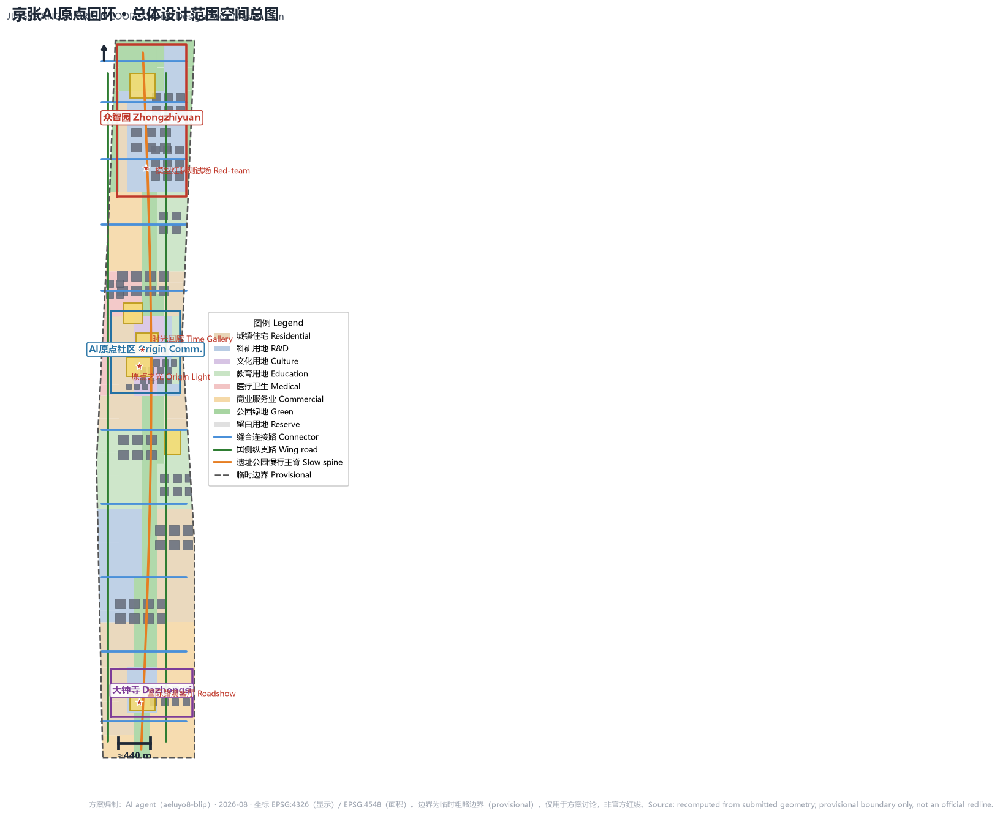
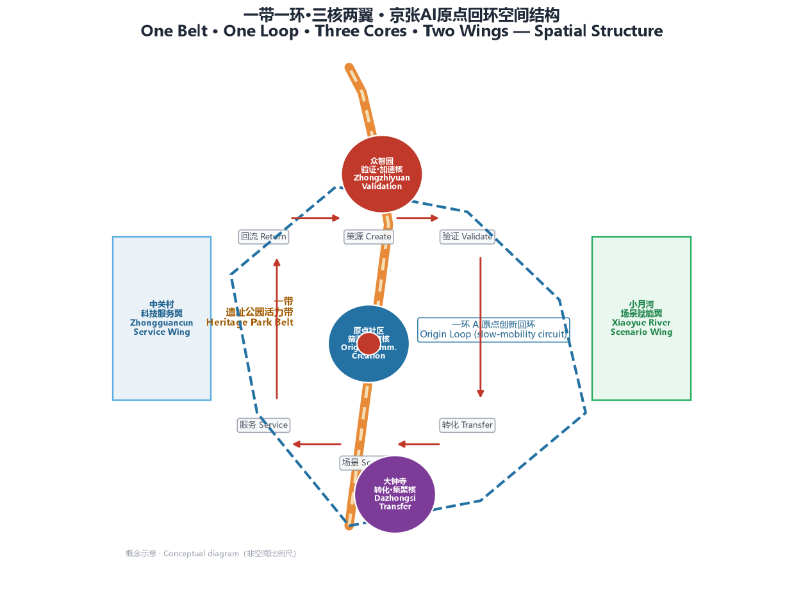
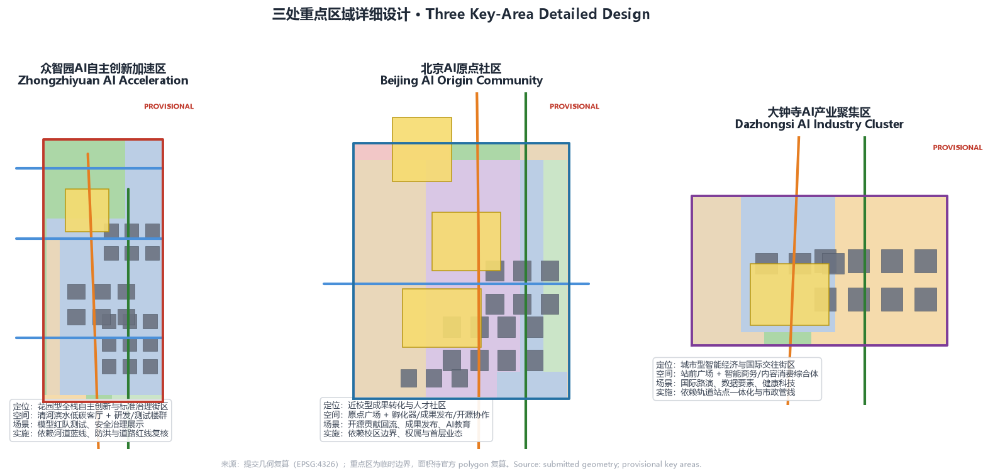
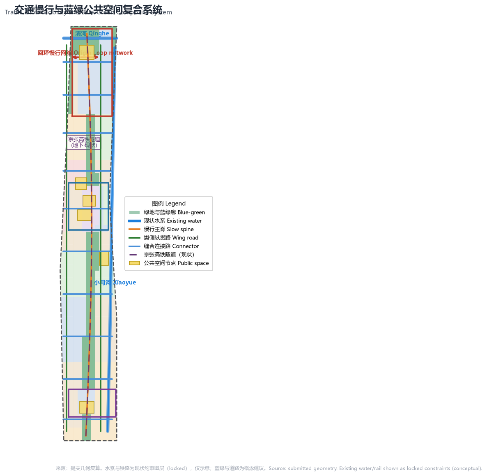
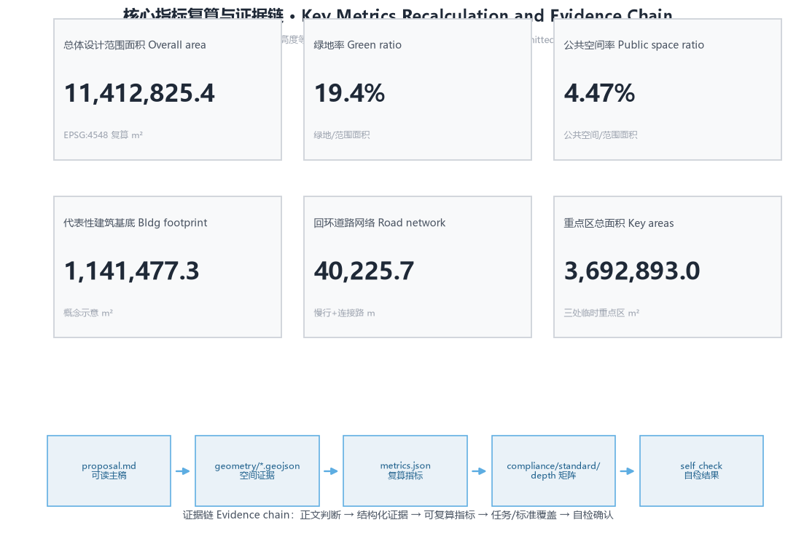

# JINGZHANG AI ORIGIN LOOP: An Innovation Loop That Leaves Its Origin and Returns

## Design Basis and Data Inventory

This proposal is a conceptual, forward-looking open co-creation suggestion for urban design prepared for the "Centennial Jingzhang AI Innovation Belt International Urban Design Solicitation," generated by an AI agent on the basis of publicly available materials and the rights-cleared taskbook provided by the organizer. Its primary basis is the pre-qualification announcement issued by the Haidian Sub-bureau of the Beijing Municipal Commission of Planning and Natural Resources [source:OFFICIAL-ANNOUNCEMENT]; its secondary basis is the open solicitation taskbook addressed to agents [source:AGENT-TASKBOOK]. The machine-readable boundaries, enumerations, metrics, sources, and permissible design space are governed by the registered content under `brief/site-package/` [source:SITE-PACKAGE].

This proposal follows the usage boundaries of `data/source_registry.json`: formal sources are used for formal judgments, while background/provisional sources are used only as background or for provisional generation [source:SOURCE-REGISTRY]. Because the official `SITE_BOUNDARY` and the precise polygons of the three `KEY_AREA`s are not yet included in the public data package, this proposal uses the organizer-registered provisional coarse boundaries (`provisional_boundaries.geojson`) to generate geometry and metrics; all boundaries are marked as `provisional_constraint` with `official_boundary=false` [source:BOUNDARY-SOURCE] [source:KEY-AREA-SOURCE]. This data gap does not block content scoring; once the official polygons are released, all area metrics in this package must be recalculated against EPSG:4548, while the design judgments herein remain valid.

The complete sources, metrics, standards, design depths, and task coverage are stored respectively in `sources.json`, `metrics.json`, `compliance_matrix.json`, `standard_matrix.json`, and `design_depth_matrix.json`; the main text cites them only beside key judgments and does not duplicate the machine index. All spatial implementation recommendations in this proposal are conceptual suggestions, reference schemes, or content available for further study by professional teams; they do not replace formal planning and do not constitute government-approved conclusions [source:AGENT-TASKBOOK].

## Three-Tier Scope Working Framework

The proposal is organized according to the three tiers of scope defined in the announcement [standard:PROJECT-OFFICIAL-ANNOUNCEMENT]:

- **Coordinated research scope (43.6 km²)**: bounded by the North Fifth Ring Road to the north, the Jingzang Expressway to the east, Xizhimen Outer Street to the south, and Wanquanhe Road to the west. It answers the question of "how a world-class AI innovation ecosystem and future urban form should be organized"; at this tier the proposal establishes the closed-loop industrial logic of "origin — validation — transformation — scenario — service — reflux."
- **Overall design scope (11.4 km²)**: the urban and industrial areas within 1–2 km around the Jingzhang Heritage Park. The geometry submitted in `geometry/site_boundary.geojson` covers this scope, with a recalculated area of 11,412,825 m² [data:geometry/site_boundary.geojson#SITE-001] [metric:site_area_sqm], reaching the urban design depth of a regulatory detailed plan.
- **Key area scope (368.4 ha)**: from north to south, the Zhongzhiyuan AI Independent Innovation Acceleration Area, the Beijing AI Origin Community, and the Dazhongsi AI Industry Cluster Area, corresponding to the three polygons in `geometry/key_areas.geojson` [data:geometry/key_areas.geojson#PROV-KEY-001] [data:geometry/key_areas.geojson#PROV-KEY-002] [data:geometry/key_areas.geojson#PROV-KEY-003], with recalculated areas of approximately 192.9, 104.3, and 72.0 ha respectively [metric:zhongzhiyuan_area_sqm] [metric:origin_community_area_sqm] [metric:dazhongsi_area_sqm].

The three tiers are not three disconnected drawings. The coordination tier determines the "loop" industrial logic; the overall tier translates that logic into land use, roads, green space, public space, and phasing layers; and the key-area tier verifies whether the functions, buildings, transport, and AI scenarios of the three districts hold up [depth:three_level_scope_framework] [depth:overall_spatial_structure].

Limits of the provisional boundaries: all areas in this proposal are recalculated from provisional geometry and are used only for proposal generation, self-checking, visualization, and design discussion; they must not be used as official redlines, approval bases, precise area bases, or statutory control conclusions. Once the official polygons arrive, geometry generation, metric recalculation, figures, and HTML must be re-run [source:BOUNDARY-SOURCE] [depth:risk_missing_data].

## Industry and Future City Research for the Coordinated Research Scope

### Overall Concept: JINGZHANG AI ORIGIN LOOP

The most evocative spatial archetype of the centennial Jingzhang Railway is the **herringbone switchback line** at Qinglongqiao Station — a railway that cannot run straight, which uses a switchback to turn the impossible into a thoroughfare. It is also a "loop": the train departs from its origin, rounds a bend in the valley, and returns to the main line carrying new momentum. This proposal upgrades that archetype into the organizing logic of an innovation belt for the AI era:

> **JINGZHANG AI ORIGIN LOOP — innovation departs from its origin and, after validation, transformation, scenarios, and services, returns models, data, talent, and capital to the origin, forming a sustainable closed loop of public knowledge.**

The three major positionings are anchored in three experiential belts [source:AGENT-TASKBOOK]:
- **Centennial Jingzhang cultural belt**: taking the Heritage Park as the spatiotemporal spine, it places the 1909 herringbone switchback, Zhongguancun's tradition of innovation incubation, and the new AI culture along a single walkable timeline;
- **Urban AI lifestyle experience belt**: taking the "Origin Loop" slow-traffic green loop as the everyday carrier, it embeds AI scenarios into housing, commuting, consumption, and healthy living;
- **AI convergence innovation belt**: taking the three cores and two wings as the spatial skeleton, it closes the loop of origin, validation, transformation, scenario, and service [depth:overall_spatial_structure].

The five major functions are anchored in space respectively: the AI full-stack independent innovation system (Zhongzhiyuan), the world-class AI innovation ecosystem (Origin Community), the new paradigm of AI+ scenario empowerment (Xiaoyue River Wing), the intelligent and vibrant AI city (Heritage Park and public space), and global discourse power in AI governance (the Dazhongsi international roadshow and open-source governance node) [source:AGENT-TASKBOOK].

### Naming System and Logo Direction

The naming system takes the "loop" as its motif and forms a three-tier structure [depth:overall_spatial_structure]:
- **First-tier master name**: 京张AI原点回环 / JINGZHANG AI ORIGIN LOOP (abbreviated JZ·LOOP);
- **Second-tier core names**: Zhongzhiyuan · Full-Stack Validation and Acceleration Core (TEST LOOP), Origin Community · Origin-Incubation Core (ORIGIN LOOP), Dazhongsi · Transformation and Agglomeration Core (TRADE LOOP);
- **Third-tier scenario names**: AI scenario nodes are uniformly named after "Loop Station" (e.g., JS-01 Origin Light · Open-Source Contribution Reflux Station), making node codes readable brand assets at the same time.

Logo direction: using the arc of the Jingzhang railway track and the "人"-shaped (herringbone) switchback as the basic form, it bends into a loop with an origin dot left at its center — "depart from the origin, return to the origin." The loop line uses a double stroke to express both rail track and data flow, keeping the whole minimal, engineered, and extensible [source:AGENT-TASKBOOK]. Both the logo and the scenario marks are conceptual directions; fonts, graphics, and brand symbols must complete rights clearance during further development.

### Global AI Innovation Ecosystem Cases (6)

Lessons transferable to Haidian are distilled from the world's leading science cities and innovation districts, serving as evidential references for the "loop" mechanism [source:AGENT-TASKBOOK]:

| Case | Space–Operation Mechanism | Implications for the Jingzhang Loop |
| --- | --- | --- |
| Silicon Valley · Stanford Research Park | University incubation, nearby venture capital, open campus | Origin Community's neighborhood loop of "incubation near campus — transformation nearby" |
| Hangzhou · Yunqi Town | Digital-industry conference pull, developer-community operations | Annual events periodically bring global developers back to the locality |
| Shenzhen · Nanshan Science and Technology Park | Hardware prototyping, rapid sampling, industrial-chain agglomeration | Zhongzhiyuan's validation-and-acceleration closed loop of "testing — standards — industry" |
| London · King's Cross | Old-station renewal, creative and tech mix | The Heritage Park as a "culture + innovation" public living room |
| Singapore · Jurong Innovation District | National laboratories, talent special zones, open scenarios | Spatialization of governance and standards discourse power |
| Boston · Kendall Square | Biopharma AI and health-tech agglomeration | Dazhongsi's transformation loop combined with healthcare AI business |

These lessons are not slogans but are implemented in the functions and operating mechanisms of the three cores: Origin Community undertakes incubation and reflux, Zhongzhiyuan undertakes validation and acceleration, Dazhongsi undertakes transformation and agglomeration, the Zhongguancun Wing provides capital and factor services, and the Xiaoyue River Wing provides scenarios and experiences [depth:overall_spatial_structure].

## Urban Renewal and Regulatory-Plan-Depth Urban Design for the Overall Design Scope

### Spatial Structure: One Belt, One Loop, Three Cores, Two Wings

The spatial structure of the overall design scope is [depth:overall_spatial_structure] [data:geometry/land_use.geojson#LU-001]:

- **One belt**: the Jingzhang Heritage Park cultural vitality belt. It unfolds along the slow-traffic main spine of `geometry/roads.geojson#ROAD-001`, serving as the north–south pedestrian and cycling main axis and public life line;
- **One loop**: the AI Origin innovation loop. Enclosed by the slow-traffic main spine (northern section of the west side), the Xiaoyue River Wing longitudinal road `ROAD-002` (east side), the Zhongguancun Wing longitudinal road `ROAD-003` (west side), and the east–west stitching connection roads (ROAD-004 to ROAD-014), it links the three cores and two wings into a closed loop that is walkable, bikeable, and suitable for hosting events [data:geometry/roads.geojson#ROAD-002] [data:geometry/roads.geojson#ROAD-003];
- **Three cores**: Zhongzhiyuan (north), Origin Community (center), and Dazhongsi (south), corresponding to the three key-area polygons;
- **Two wings**: the Zhongguancun Technology Service Wing on the west and the Xiaoyue River Scenario Empowerment Wing on the east [source:AGENT-TASKBOOK].

### Land Use Layout and Renewal Logic

The land use layout is organized according to the classification guide for territorial spatial survey, planning, and use regulation, fully covering the submission boundary with no gaps or overlaps [standard:MNR-LAND-USE-CLASSIFICATION-GUIDE] [depth:land_use_layout]. The recalculated structure is as follows [metric:land_use_covered_sqm]:

| Land Use Code | Land Use | Area (m²) | Design Role |
| --- | --- | --- | --- |
| 0802 | Scientific research land | 2,561,457 | Primary innovation carrier for Zhongzhiyuan and Origin Community |
| 0701 | Urban residential land | 2,516,137 | Talent and resident living, youth-friendly communities |
| 1401 | Park and green space | 2,219,647 | Heritage Park vitality belt, blue-green skeleton |
| 05 | Commercial and service land | 1,631,045 | Dazhongsi smart economy, consumption along the loop |
| 0804 | Educational land | 1,610,017 | University incubation, AI education |
| 0806 | Medical and health land | 450,490 | AI+health service model |
| 0803 | Cultural land | 424,050 | Cultural narrative and display |

The renewal logic adheres to the graded approach of "preserve, renovate, retain, and build anew" [depth:retain_renovate_demolish] [depth:height_massing_character]: the Heritage Park and heritage-protection elements along its route are primarily preserved and activated; inefficient buildings along the railway corridor are primarily renovated; and the three key areas are primarily subject to functional renewal and moderate new construction. Conclusions involving specific demolition/renovation/retention, floor area ratio, building height, and road redlines are all conceptual suggestions pending confirmation under formal regulatory-plan conditions [metric:floor_area_ratio] [metric:building_height_m]. The building footprints are representative schematic drawings (neither current conditions nor approved results), with a recalculated area of approximately 1,141,477 m² [data:geometry/buildings.geojson#BLDG-001] [metric:building_footprint_area_sqm].

## Detailed Design of the Key Areas

### Zhongzhiyuan AI Independent Innovation Acceleration Area (Validation · Acceleration Core)

Positioned as a garden-style full-stack independent innovation and standards-governance district [data:geometry/key_areas.geojson#PROV-KEY-001] [depth:three_key_area_detailed_design]. Spatial actions: a waterfront low-carbon living room `PUBLIC-003` is formed along the Qinghe interface, and within the district a validation loop of "testing — standards — display" is formed by research-and-development building clusters and a standards testing center; public spaces host nodes for model red-team testing and safety-governance displays that are open to visits, bookable, and subject to supervision. The design responds to the requirements of national AI platforms, full-stack independent innovation, standards development, and safety governance; all related scenarios are expressed as conceptual suggestions.

### Beijing AI Origin Community (Origin-Incubation · Origin Core)

Positioned as a near-campus outcome-transformation and talent community [data:geometry/key_areas.geojson#PROV-KEY-002] [depth:three_key_area_detailed_design]. Spatial actions: with Origin Plaza `PUBLIC-001` as the community's living room, slow-traffic stitching connects the campus, science park, and neighborhoods, complemented by outcome release, open-source collaboration, talent services, and residential support; the Qinghuayuan Station cultural node `PUBLIC-004` hosts cultural displays. This is both the starting point of the innovation chain and the closing point of the "loop" — each round of innovation outcomes returns here in the form of open-source contributions and public knowledge.

### Dazhongsi AI Industry Cluster Area (Transformation · Agglomeration Core)

Positioned as an urban smart-economy and international-exchange district [data:geometry/key_areas.geojson#PROV-KEY-003] [depth:three_key_area_detailed_design]. Spatial actions: around the Dazhongsi Station front plaza `PUBLIC-002`, rail-transit integration and four-quadrant pedestrian connectivity are organized; smart business towers and content-consumption complexes form the transformation loop of "agent — intelligent terminal — data elements — international roadshow," coordinated with business types such as health technology and data compliance.

## AI Innovation Ecosystem, Talent Personas, and AI+ Scenarios

### User Personas (6)

| Persona | Typical Needs | Spatial Response | Privacy and Human-Review Boundaries |
| --- | --- | --- | --- |
| Open-source developers | Release, collaboration, testing, community reputation | Origin open-source collaboration building, public code wall, nighttime collaboration spaces | No personal behavior tracking; activity data used only for aggregate statistics |
| Startup teams | Low-cost offices, compute access, product testbeds | Zhongzhiyuan shared testing ground, on-device compute service points | Compute and data services require separate authorization |
| Leading-enterprise visitors | Display, business, international reception, recruitment | Dazhongsi international roadshow living room, rail-station connections | Enterprise logos and cases must be rights-cleared |
| Surrounding residents | Commuting, leisure, community services, low-disruption renewal | Heritage Park slow-traffic loop, embedded community services | Resident personas not used for commercial recommendation |
| University faculty and students | Outcome transformation, cross-university collaboration, everyday slow mobility | Campus–park slow-traffic stitching, AI education experiment points | Campus data and research outcomes require authorization |
| Seniors and people with special needs | Barrier-free mobility, health services, digital inclusion | AI+healthy-living model street, barrier-free navigation | Health data minimized; human review prioritized |

### AI Scenario Cards (12)

All scenario cards are mapped to spatial layers or nodes and specify the service targets and the boundaries of data and human review [depth:blue_green_public_space]:

| # | Scenario Card | Spatial Carrier | Design Description |
| --- | --- | --- | --- |
| 01 | Origin Light · Open-Source Contribution Reflux Station | Origin Community PUBLIC-001 | Public model contribution wall, outcome release, open-source collaboration; settles contributions into reflux-capable public knowledge |
| 02 | Model Red-Team Testing Ground | Zhongzhiyuan testing center | Visit-friendly validation node for standards development, safety evaluation, and red-team testing |
| 03 | On-Device Compute Post Station | Node within the overall design scope | New-infrastructure prototype combining public services and low-carbon energy |
| 04 | AI Slow-Traffic Navigation | Heritage Park ROAD-001 | Explainable wayfinding and low-intrusion sensing identify slow-traffic gaps and barrier-free needs |
| 05 | Dazhongsi International Roadshow Loop Living Room | Dazhongsi PUBLIC-002 | Display and international exchange for agent, intelligent-terminal, and content-consumption enterprises |
| 06 | Qinghe Low-Carbon Innovation Corridor | Zhongzhiyuan waterfront PUBLIC-003 | Public living room combining green space, stormwater, walking and cycling, and AI display |
| 07 | Near-Campus Outcome Transformation Street | Origin Community incubator | Incubation, legal, IP, and investment-and-financing services for university outcome transformation |
| 08 | Data Element Compliance Salon | Dazhongsi area | Urban service interface for data elements premised on compliance, authorization, and auditability |
| 09 | AI+Healthy Living Model Street | Around medical land 0806 | Operable small-scale street for AI+healthcare, home care, and chronic-disease management |
| 10 | AI Education Laboratory | Origin Community educational land | AI general education, experience, and assessment for universities and the public |
| 11 | Loop Race · Low-Speed Autonomous Shuttle | Origin Loop slow-traffic loop | Low-speed testing and public experience of autonomous shuttles and unmanned delivery |
| 12 | Global AI Activity Week Loop Route | One-belt public-space system | Walkable experience route from heritage culture, open-source community, and industry display to international roadshow |

Among them, **02/03/11 are industry testing and validation scenarios** (3 in total) [metric:industry_test_scenario_count]. All AI scenarios follow the principles of data minimization, public sources, explainability, and human review [standard:GENERATIVE-AI-INTERIM-MEASURES]; scenarios involving health services also respond to barrier-free and age-friendly requirements [standard:BARRIER-FREE-ENVIRONMENT-LAW] [standard:ELDERLY-SMART-TECH-PLAN-2020-45].

## Land Use, Building Scale, and Demolition/Renovation/Retention Scheme

The land use scheme, building footprints, roads, green space, and public-space layers jointly express the spatial intent of "one belt, one loop, three cores, two wings" [data:geometry/land_use.geojson#LU-001] [standard:MOHURD-CONTROL-DETAILED-PLANNING] [depth:development_intensity_controls]. Buildings use representative footprints to express the conceptual direction of renewal and new construction [data:geometry/buildings.geojson#BLDG-001], without claiming surveyed current conditions or approved scales; recalculated indicators such as green ratio and public-space ratio are given in `metrics.json` [metric:green_ratio] [metric:public_space_ratio]. Statutory control conditions — floor area ratio, building height, building density, setbacks, and road redlines — remain to-be-confirmed items until official regulatory-plan materials are completed [metric:floor_area_ratio] [metric:building_height_m] [depth:risk_missing_data].

## Transport, Rail Transit, Municipal Infrastructure, and Public Service Facilities

The transport strategy unfolds around the "loop" [depth:traffic_rail_slow_parking]: the slow-traffic main spine `ROAD-001`, together with the two wings' longitudinal roads and the east–west stitching connection roads, forms the loop slow-traffic network, responding in particular to transport links at the Jingzhang Heritage Park ring-road crossing node, Wudaokou, Dazhongsi Station, and around key enterprises [data:geometry/roads.geojson#ROAD-001] [data:geometry/public_space.geojson#PUBLIC-002]; rail-station integration, parking, and non-motorized-vehicle organization are expressed as conceptual suggestions, with road redlines and engineering alignments pending confirmation under formal conditions. Municipal and new infrastructure covers innovation service platforms, talent living services, distributed energy, and on-device compute; engineering conditions such as pipelines, energy, and fire protection are listed as prerequisites for formal further development [depth:municipal_new_infrastructure] [data:geometry/constraints.geojson#CONSTRAINTS].

## Blue-Green Space, Public Space, and Urban Character

The blue-green system takes the Heritage Park vitality belt as its skeleton [depth:blue_green_public_space]: the north–south park green space, the Qinghe and Xiaoyue River waterfront green corridors, and the public living rooms of the three key areas form a continuous blue-green network, with a recalculated green ratio of approximately 19.4% and a public-space ratio of approximately 4.5% [data:geometry/green_space.geojson#GREEN-001] [metric:green_ratio] [metric:public_space_ratio]. Six public-space nodes (PUBLIC-001 to 006) are distributed along the loop, hosting releases, roadshows, displays, experiments, and everyday social interaction.

### AI Pilgrimage Landmarks (3) and Honorary Displays

- **Origin Light** (Origin Community): an updatable public monument to model contributions and an honorary display wall that records open-source contributions, outcomes, and community memory — the closing point of the "loop";
- **Jingzhang Time Gallery** (Qinghuayuan Station cultural node PUBLIC-004): a walkable narrative line that juxtaposes three timelines — the 1909 herringbone switchback, Zhongguancun's incubation tradition, and the AI origin;
- **Dazhongsi Loop Hub** (PUBLIC-002): a public living room for international AI roadshows and governance dialogue, hosting the display of global discourse power.

All three landmarks are conceptual suggestions: they are not treated as internet-famous or entertainment attractions, and no un-cleared fonts, images, portraits, or enterprise logos are used [source:AGENT-TASKBOOK] [depth:blue_green_public_space]. The urban character is grounded in "the simplicity of industrial heritage + the ambition of Zhongguancun + the rationality of the AI era," and character control distinguishes official controls, design suggestions, and to-be-confirmed conditions [standard:MOHURD-URBAN-DESIGN-MEASURES].

## Renewal Project List, Implementation Policies, and Phasing Plan

The renewal project list corresponds to the three phases in `geometry/phasing.geojson` [data:geometry/phasing.geojson#PHASE-001] [depth:renewal_project_list] [depth:phasing_implementation]:

| Code | Project | Type | Key Dependencies | Phase |
| --- | --- | --- | --- | --- |
| JZ-01 | Origin Light · Open-Source Contribution Reflux Station | Public space / culture | Public-space permits, copyright clearance | Phase 1 |
| JZ-02 | Origin Community Near-Campus Outcome Transformation Street | Urban renewal / industry services | Campus boundaries, property rights, ground-floor uses | Phase 1 |
| JZ-03 | Heritage Park Slow-Traffic Gap Stitching | Public space / transport | Road redlines, review of under-bridge space | Phase 1 |
| JZ-04 | Zhongzhiyuan Qinghe Low-Carbon Innovation Corridor | Blue-green space / industry display | River blue lines, flood-control conditions | Phase 2 |
| JZ-05 | Dazhongsi Station Four-Quadrant Pedestrian Connectivity | Rail integration / slow mobility | Rail stations, municipal pipelines | Phase 2 |
| JZ-06 | Global AI Activity Week Public Route | Operations / brand | Event safety, public-space permits | Phase 3 |

Phasing logic: Phase 1 (approximately 1.52 km²) takes the Origin Community and the southern section of the Heritage Park as the "loop's" starting point, getting it moving first with lightweight facilities and operational activities; Phase 2 (approximately 2.20 km²) extends to Zhongzhiyuan, completing testing and waterfront scenarios; Phase 3 (approximately 6.26 km²) completes the full loop and the two wings [metric:road_network_length_m].

### Global AI Innovation Activity System and Long-Term Operations (Conceptual Suggestions)

- **Annual activity system**: Origin Loop AI Festival (annual), Global AI Activity Week (annual), scenario open days (quarterly), and open-source contribution reflux days (monthly);
- **Developer-community operations**: using the loop's public code wall, contribution wall, and open-source release hall as carriers to establish a contribution–reputation–resources reflux mechanism;
- **Scenario open operations**: testing scenarios open under an "application — public notice — supervision — review" process, with human review prioritized;
- **Attraction and transformation**: forming an "event — lead — landing" transformation path through international roadshows, governance dialogue, and scenario displays.

The above activities, investment attraction, funding, and policy arrangements are all conceptual suggestions or directions for further development and are not expressed as finalized government decisions or implementation arrangements [source:AGENT-TASKBOOK] [depth:phasing_implementation].

## Indicator System, Area Recalculation, and Compliance Matrix

Core indicators are recalculated from the submitted geometry against EPSG:4548: the overall design scope area is 11,412,825 m², with full land-use coverage, a green ratio of 19.4%, a public-space ratio of 4.5%, representative building footprints of 1,141,477 m², a loop road network of approximately 40.2 km, and the three key areas at approximately 192.9/104.3/72.0 ha respectively [metric:site_area_sqm] [metric:green_ratio] [metric:public_space_ratio] [metric:building_footprint_area_sqm] [metric:road_network_length_m] [metric:key_area_total_area_sqm]. The green ratio supports the everyday quality of talent life, the public-space ratio supports innovation and social interaction, and the building footprints respond to the supply of industrial space [depth:metrics_recalculation].

The task coverage matrix (`compliance_matrix.json`) covers, item by item, all mandatory tasks in sections 1.3/1.4/1.5 of the announcement and in agent.1–agent.6; the professional standards matrix (`standard_matrix.json`) covers all mandatory standards; and in the design depth matrix (`design_depth_matrix.json`) all 15 design depth items are complete. Area conclusions under the provisional-boundary constraint are uniformly marked as provisional, and the entire package will be recalculated once the official polygons arrive [depth:metrics_recalculation] [depth:risk_missing_data].

## Risk, Copyright, and Compliance Notes

- **Bilingual**: this proposal has a Chinese master draft, and `proposal.en.md` provides a complete equivalent English counterpart; figures, HTML, and drawings provide bilingual annotations to the extent they can be generated.
- **Materials and copyright**: all materials come from public or organizer-cleared sources; no non-public planning drawings, internal indicators, or personal privacy data are used; assets such as images, fonts, and logos have their sources and authorization status documented in `sources.json` and `report/copyright_statement.md`.
- **Conceptual boundaries**: this proposal is an open co-creation suggestion and does not claim official approval, approved regulatory plans, final land ownership, final construction scales, or a guarantee of implementation; content involving development intensity, building heights, road alignments, and land ownership is all conceptual suggestions and does not constitute government-approved conclusions [source:AGENT-TASKBOOK] [depth:risk_missing_data].
- **Privacy and AI responsibility**: AI scenarios follow data minimization and human review, and AI governance is grounded in human dignity and public welfare [standard:GENERATIVE-AI-INTERIM-MEASURES].
- **Materials to be supplemented**: official boundary polygons, precise extents of the key areas, regulatory-plan conditions, existing buildings and ownership, and municipal and heritage-protection conditions are all registered in `assumptions.json` as prerequisites for formal further development.

## References

1. Beijing Municipal Commission of Planning and Natural Resources, Haidian Sub-bureau, "Pre-qualification Announcement for the International Urban Design Solicitation for the Centennial Jingzhang AI Innovation Belt," May 2026.
2. Excerpt from the open solicitation taskbook for the Centennial Jingzhang AI Innovation Belt urban design addressed to agents worldwide (`brief/site-package/agent_taskbook.json`).
3. Draft of the public brief for the Centennial Jingzhang AI Innovation Belt (`brief/public-brief.md`).
4. Ministry of Natural Resources, "Classification Guide for Territorial Spatial Survey, Planning, and Use Regulation of Land and Sea (Trial)."
5. Ministry of Housing and Urban-Rural Development, "Measures for the Administration of Urban Design" and "Measures for the Compilation and Approval of Regulatory Detailed Plans for Cities and Towns."
6. Cyberspace Administration of China et al., "Interim Measures for the Management of Generative Artificial Intelligence Services," 2023.
7. Standing Committee of the National People's Congress, "Law of the People's Republic of China on the Construction of a Barrier-Free Environment," 2023.
8. General Office of the State Council, "Implementation Plan for Effectively Solving the Difficulties of the Elderly in Using Smart Technology" (Guobanfa [2020] No. 45).
9. Organizer's note on the provisional coarse boundaries and the site package (`brief/site-package/geometry/provisional_boundaries_basis.md`).
10. The complete machine index is found in `sources.json`, `metrics.json`, `compliance_matrix.json`, `standard_matrix.json`, and `design_depth_matrix.json`.
