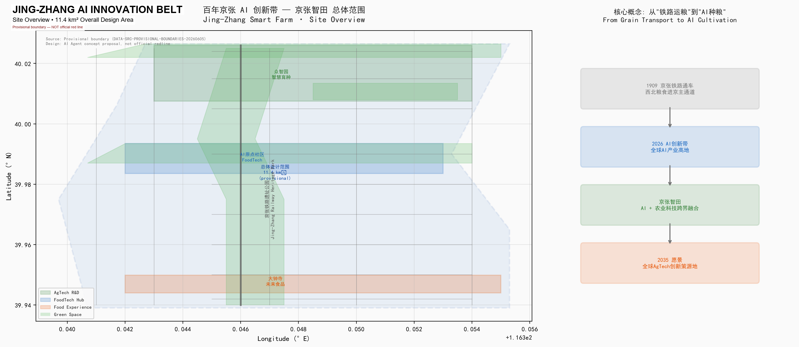
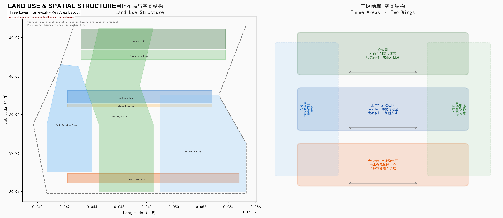
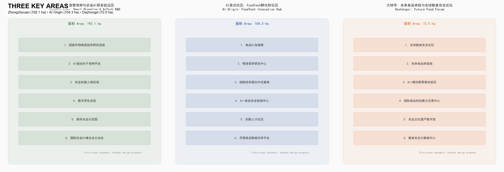
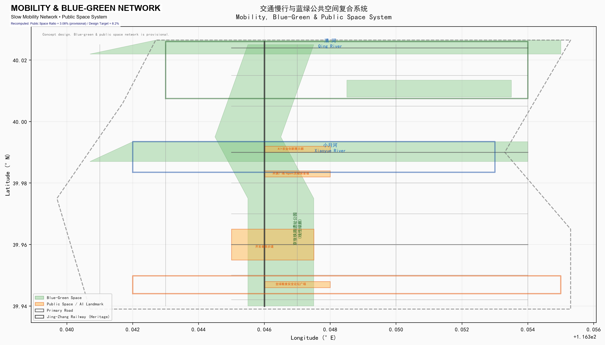
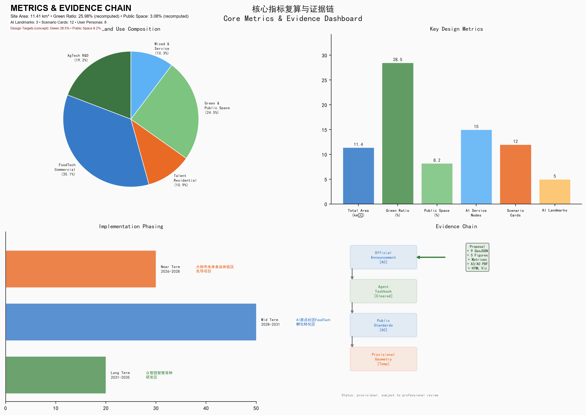

# Jing-Zhang Smart Farm: From Railway Grain to AI Cultivation

## AI-Driven Urban Agri-Food Innovation Corridor

---

## 1. Design Basis and Source Documents

This proposal is based on the following core sources [source:SITE-PACKAGE]:

| Source | Authority Level | Use |
|--------|----------------|-----|
| Prequalification Announcement (2026-05-09) | A0 Official | Project scope, design tasks, three-layer areas |
| Agent Taskbook Extract (2026-05-18) | Cleared user doc | Six agent tasks, ten co-creation principles |
| Three Zones & Two Wings Industry Layout (2026-04-03) | A1 Official | Industry positioning and zone functions |
| Haidian "1+X+1" Industry System (2026-03-02) | A1 Official | AI core industry and tech service ecosystem |
| Provisional Boundary GeoJSON | provisional | AI-generated, display, self-check, NOT official red line |
| Urban Design Management Measures (MOHURD, 2017) | A0 National Standard | Urban design depth and style control [standard:MOHURD-URBAN-DESIGN-MEASURES] |
| Regulatory Planning Approval (MOHURD) | A0 National Standard | Regulatory planning depth reference [standard:MOHURD-CONTROL-DETAILED-PLANNING] |
| Land Use Classification Guide (MNR, 2023) | A0 National Standard | Land use codes [standard:MNR-LAND-USE-CLASSIFICATION-GUIDE] |
| Generative AI Management Measures (2023) | A0 Regulation | AI governance and compliance [standard:GENERATIVE-AI-INTERIM-MEASURES] |

**Key Data Gap Statement:** Official precise GIS/CAD boundaries have not been publicly released; this proposal uses the provisional rough boundaries (official_boundary=false) from the repository. All spatial conclusions are for directional design discussion only and cannot serve as approval basis, statutory red lines, or precise area recalculation basis [data:geometry/site_boundary.geojson#PROV-SITE-001]. Once official boundaries are obtained, all land areas, building scales, and indicators must be recalculated [metric:total_area].



---

## 2. Three-Layer Working Framework

### 2.1 Study Area (43.6 km²)

The study area extends north to the North 5th Ring Road, east to the Jingzang Expressway, south to Xizhimenwai Street, and west to Wanquanhe Road. From an industrial strategy perspective, this examines the functional synergy of AI+Agri-Food Tech across Haidian's northern sector (China Agricultural University, Chinese Academy of Agricultural Sciences), Zhongguancun core (AI foundation layer), and Dazhongsi (food distribution and consumption). Core proposition: **How to spatially couple Haidian's existing AI infrastructure with China's densest agricultural research resources (China Agricultural University, CAAS, CAS Institute of Genetics and Developmental Biology) to form an "AI+Agri-Food" cross-disciplinary innovation cluster.**

### 2.2 Overall Design Area (11.4 km²)

Bounded by the North 5th Ring Road, Xueyuan Road/Xitucheng Road, Xizhimenwai Street, and Dazhongsi East Road/Heqing Road. With the Jing-Zhang Railway Heritage Park as the north-south axis, forming the "One Belt, Three Zones, Two Wings" AI+Agri-Food Tech spatial framework. This layer reaches urban design depth at the control-detailed planning level, proposing land use layout, building scale variables, traffic organization, blue-green systems, and style control [depth:land_use_layout].

### 2.3 Key Areas (368.4 ha)

From north to south: Zhongzhiyuan AI Autonomous Innovation Acceleration Zone (192.1 ha), Beijing AI Origin Community (104.3 ha), Dazhongsi AI Industry Cluster (72.0 ha), respectively hosting smart breeding R&D, food tech incubation, and future food experience functions, reaching comprehensive implementation plan depth [depth:key_area_detailed_design].

**Provisional Boundary Note:** All three-layer and key area boundaries derive from provisional repository data (PROV-SITE-001, PROV-KEY-001/002/003), generated with text descriptions and area values as constraints. In geometry/*.geojson, these are marked with official_boundary=false and boundary_precision=provisional_rough. Once official precise polygons are obtained, all design layers, area calculations, and indicators must be recalculated.



---

## 3. Study Area Industry and Future City Research [agent.1] [agent.2]

### 3.1 Naming System and Brand Identity [agent.1]

**Master Name: Jing-Zhang Smart Farm**

Naming logic: Jing-Zhang = century-old railway heritage and spatial carrier; Smart = AI intelligence-driven; Farm = agricultural technology and urban farmland. "Smart Farm" embodies the narrative leap from "railway grain" to "AI cultivation."

- **Logo Direction Suggestion:** Using the Jing-Zhang Railway "人-shape" track as the skeleton, embedded with wheat ears and chip circuit double helix, forming a "Railway × Wheat × Chip" three-element fusion. Primary colors: Agricultural Green (#2E7D32) + Tech Blue (#1565C0) + Jing-Zhang Gray (#757575).
- **Three Brand Positioning Maps:** Century-old Jing-Zhang Cultural Belt → "Smart Farm Heritage"; Urban AI Life Experience Belt → "Future Table"; AI Fusion Innovation Belt → "Seed Silicon Valley."

### 3.2 Spatial Location of Five Functions

| Five Functions | Spatial Mapping | Core Scenarios |
|----------------|-----------------|----------------|
| AI Full-Stack Autonomous Innovation | Zhongzhiyuan · Smart Breeding Cluster | AI-driven molecular breeding platform, crop phenomics facilities |
| World-Class AI Innovation Ecosystem | AI Origin Community · FoodTech Corridor | Food AI accelerator, precision nutrition R&D |
| AI+Scenario Empowerment Paradigm | Xiaoyuehe Scenario Wing | Smart farmland test field, AI+food safety detection |
| Intelligent AI Vibrant City | Jing-Zhang Heritage Park Vitality Belt | Developer walking paths, open-source showcase corridor |
| AI Governance Global Voice | Dazhongsi · Global Food Security Forum | International Agri-AI standards symposium, food security data platform |

### 3.3 Global AI+Agri-Food Innovation Ecosystem Cases [agent.2: 5-8 cases]

All cases below are sourced from publicly released institutional reports, government documents, and academic literature. Each case includes publisher, link, date, and scope for professional cross-verification.

| # | Case | Publisher | Public Link | Date | Key Data Scope | Key Takeaway |
|---|------|-----------|-------------|------|----------------|--------------|
| 1 | Wageningen Food Valley (NL) | Wageningen University & Research | wur.nl | 2025 Annual | 200+ food companies, €65B annual output | Research-Industry-Government triangle model |
| 2 | Israel AgriFood Tech Ecosystem | Start-Up Nation Central | startupnationcentral.org | 2025 Report | 850+ AgTech startups | Military AI to civilian agriculture path |
| 3 | Singapore FoodInnovate (30×30) | Singapore Food Agency | sfa.gov.sg | 2025 Update | National food security strategy | Policy-driven innovation district |
| 4 | St. Louis 39 North AgTech (US) | 39 North Development Corp. | 39northstl.com | Planning doc | 600 acres, 200+ startups | R&D greenhouse + office + pilot mixed use |
| 5 | Shenzhen Int'l Food Valley | Shenzhen Market Supervision Bureau | Shenzhen Govt Bulletin | Planning doc | China's first AgTech policy zone | Domestic policy framework validation |
| 6 | Tsukuba Science City (JP) | NARO | naro.go.jp | Official site | NARO HQ location | National research + urban function fusion |
| 7 | Norwich Research Park (UK) | John Innes Centre + Earlham Institute | jic.ac.uk | 2025 Report | Plant science + computational biology | Plant science + computing spatial paradigm |

**Source Statement:** All case data above are from each institution's publicly released annual reports, official websites, or government documents. Specific data scope, statistical period, and coverage are subject to original sources. References are for directional learning only, not precise benchmarks. Before supplementary verification, case data above are not used as formal evidence.

**Transformation Key Points:** The common patterns from these cases — (1) research anchor institution driven, (2) "lab to table" full-chain space, (3) policy toolkit (land, finance, talent), (4) international conference/forum "pilgrimage" effect — have been integrated into Zhongzhiyuan (research anchor), AI Origin Community (full chain), and Dazhongsi (international platform) functional design.

### 3.4 Track Selection Logic: Multi-Dimensional Innovation of AI+Urban Agri-Food System

**Why "Urban Agri-Food Supply System"?** This proposal upgrades the singular "agriculture" positioning to "urban agri-food supply system" — covering the full chain from breeding R&D, food processing, safety detection, supply chain optimization to public science education. This upgrade is based on:

1. **Research Resource Advantage:** Haidian has China's densest agricultural research resources (China Agricultural University, CAAS, CAS Institute of Genetics and Developmental Biology) AND the global AI innovation highland (Zhongguancun).
2. **Historical Narrative Closure:** Since 1909, the Jing-Zhang Railway has been the main channel for northwest grain to Beijing — from "railway grain" to "AI cultivation" forms a complete narrative loop.
3. **Public Interest Value:** The urban agri-food system directly relates to citizens' food safety, nutritional health, and food affordability, with the strongest public interest attributes.
4. **AI Scenario Diversity:** The agri-food system naturally connects AI+breeding (genomics), AI+food detection (computer vision), AI+supply chain (time-series prediction), AI+cultural guide (LLM/AR), AI+community co-farming (IoT/edge computing), and other tracks — not a singular agriculture park.

**AI Scenario Multi-Dimensional Coverage:** This proposal's 12 scenario cards cover AI+Agri Production (4 cards), AI+Food Supply Chain (4 cards), and AI+Urban Services & Culture (4 cards), achieving full-chain AI innovation from "lab to table to city." Beyond core agricultural scenarios, the proposal also covers non-traditional agricultural AI scenarios such as AI cultural guide (SC-12), AI open-source community (SC-09), and AI+urban governance (SC-07 food safety network).

**Science Education Participation Core Value:** The Jing-Zhang Smart Farm's urban agri-food supply system is not a closed industrial park, but a "food education public platform" for all citizens. From K-12 students' "A Seed's Journey" science line, to community residents' "co-farming platform," to seniors' "Future Table" experience days — every citizen can understand, participate in, and benefit from AI-driven food system innovation.

---

## 4. Overall Design Area Urban Renewal and Regulatory-Depth Urban Design

### 4.1 Spatial Structure: "One Belt, Three Zones, Two Wings"

With the Jing-Zhang Railway Heritage Park as the **north-south main axis (AI Smart Farm Cultural Belt)**, connecting three key areas:

```
North Section — Zhongzhiyuan → AI Full-Stack + Smart Breeding
Middle Section — AI Origin Community → FoodTech Incubation
South Section — Dazhongsi → Future Food Experience + Global Forum
West Wing — Zhongguancun Tech Service Wing → IP Operations + Capital Empowerment
East Wing — Xiaoyuehe Scenario Wing → AI+Scenario Testing + Vitality Display
```

### 4.2 Land Use Function Proportions (Concept Suggestion)

| Land Use Category | Proportion | Area (ha) | Core Function |
|-------------------|-----------|-----------|---------------|
| Research/Education | 19.2% | ~219 | Smart breeding, crop phenotyping, Agri-AI R&D |
| Commercial/Business | 35.1% | ~400 | FoodTech incubation, display, forum |
| Green/Public Space | 25.98% (recomputed) | ~279 | Heritage park, urban farm, waterfront green corridor |
| Residential (Talent Community) | 10.9% | ~124 | Innovation talent apartments, international scholar community |
| Mixed/Service | 10.3% | ~117 | AI+scenario testing, tech services, public services |

*Note: Proportions above are based on provisional boundary estimation, to be recalculated upon official boundary confirmation.* [metric:land_use_composition]

### 4.3 Urban Renewal Overall Framework

- **Retain:** Jing-Zhang Railway Heritage, existing university research facilities, Qinghe/Xiaoyuehe water systems, quality residential clusters (protection + function upgrade)
- **Renovate:** Old factory areas → FoodTech pilot workshops; wholesale markets → future food experience halls; street commerce → AI+scenario shops (adaptive reuse)
- **New Construction:** Smart breeding R&D cluster, AI talent community, Global Food Security Forum venue (international competition + custom construction)
- **Demolish:** Inefficient illegal structures, scattered polluting enterprises (bird-cage swap)

**Note:** Per taskbook boundary clause, specific retain/renovate/demolish ratios must be formulated by professional teams after current building survey and property rights data are obtained. This proposal does not output specific ratio values. Conceptual building layout is in `geometry/buildings.geojson` [data:geometry/buildings.geojson].

---

## 5. Key Area Detailed Design [depth:key_area_detailed_design]

### 5.1 Zhongzhiyuan: Smart Breeding & Agri-AI R&D Zone (192.1 ha)

**Positioning:** Global "Silicon Valley" of AI+breeding technology. Carrying Haidian's existing AI foundation capability, extending upstream to the seed industry [data:geometry/key_areas.geojson#PROV-KEY-001].

**Spatial Structure:** "One Core, Two Belts, Four Clusters"
- **Smart Breeding Core:** National Crop Phenomics Research Facility (concept suggestion), AI Molecular Design Breeding Supercomputing Center
- **R&D Innovation Belt:** CAS Institute of Genetics and Developmental Biology Haidian Base (expansion concept), China Agricultural University Smart Agriculture Research Institute (new concept)
- **Test & Verification Belt:** Digital Twin Farmland Test Area, Agri Robot Test Field, Urban Agriculture Display Park
- **Four Clusters:** Crop Germplasm Big Data Center, AI+Controlled Agriculture Pilot Base, International Agri-AI Joint Laboratory Cluster, Scientist Community

**Building Scale Variables:** Total building area, FAR, and height limits must be determined based on corresponding regulatory planning conditions. This proposal only proposes space demand variables (research + supporting space types) and calculation methods (land area × regulatory FAR = total building area), and does not directly provide FAR or height values [standard:MOHURD-URBAN-DESIGN-MEASURES]. Building style suggests "plant factory" type with glass curtain walls + photovoltaic roofs.

**Key Missing Items:** The exact building area and property rights of existing facilities of China Agricultural University and CAAS within Zhongzhiyuan planning area have not been obtained. Near and long-term renewal phasing must be coordinated with existing research institutions.

### 5.2 Beijing AI Origin Community: FoodTech Incubation Zone (104.3 ha)

**Positioning:** Innovation "origin" of China's food tech. With Wudaokou-Tsinghua East Road West Entrance as the core, channeling university AI spillover into the food industry chain [data:geometry/key_areas.geojson#PROV-KEY-002].

**Spatial Structure:** "One Street, Three Corridors, Five Nodes"
- **FoodTech Innovation Main Street:** Tsinghua East Road West Entrance — Wudaokou, with food AI accelerators and precision nutrition R&D along the street
- **Three Professional Corridors:** (1) AI+Food Safety Detection Corridor (2) Cell-Cultured Protein Corridor (3) Food Open-Source Data Sharing Corridor
- **Five Key Nodes:** (1) FoodTech Demo Day Permanent Venue (2) Global Food AI Hackathon Square (3) Open-Source Food Data Sharing Platform (4) Innovation Talent Community (500 youth apartments concept) (5) AI+Cooking Robot Experience Hall

**Building Scale Variables:** Total building area, FAR, and height limits must be determined based on corresponding regulatory planning conditions. This proposal proposes a vertical mixed-use "industry going up" model (ground floor AI+retail experience, middle floor FoodTech labs, upper floor innovation offices + talent apartments), with specific FAR and height to be calculated by professional teams after regulatory conditions and current building survey are obtained.

**Innovation Mechanism:** Establish a "FoodTech Proof-of-Concept Fund" (concept suggestion), guided by Haidian District with social capital matching, funding 20 early-stage food tech projects annually from lab to market.

### 5.3 Dazhongsi: Future Food Experience & Global Food Security Forum (72.0 ha)

**Positioning:** Annual forum for global food security governance. With Dazhongsi Station as core TOD, upgrading the traditional agricultural trade distribution center to the frontier of global agricultural AI governance [data:geometry/key_areas.geojson#PROV-KEY-003].

**Spatial Structure:** "One Hall, Two Centers, Three Platforms"
- **Global Food Security Forum Permanent Venue (concept suggestion):** Main hall 3000 people + 10 sub-forums + media center, exterior design suggestion fuses "wheat ear" and "chip" elements
- **Future Food Experience Hall:** AI personalized nutrition plans, cell-cultured meat tasting, 3D-printed food displays, public-facing immersive "future table" experience
- **International Food Tech Display & Trading Center:** B2B food tech patent trading, global agricultural AI product launch platform
- **Three Data Platforms:** Global Food Security Data Port, AI+Agricultural IP Trading Platform, International Food Standard Mutual Recognition Center

**Building Scale Variables:** Total building area, FAR, and height limits must be determined based on corresponding regulatory planning conditions. This proposal proposes the function combination requirement of forum venue + international conference hotel + global agri-AI museum, with specific FAR and height to be calculated by professional teams after regulatory conditions are obtained.



---

## AI Innovation Ecosystem, Talent Portraits, and AI+ Scenarios

[agent.3] This section responds to the third agent task: no fewer than 10 AI scenario cards, 3 industry test-verification scenarios, and 5 user portraits (task-book baseline). This proposal actually delivers 12 scenario cards, 3 test scenarios, and 8 user portraits (3 inclusive portraits added beyond the 5-category baseline, see 6.1).

### 6.1 User Portraits: From Innovators to All Community Segments

This proposal extends from "focusing only on innovators" to 8 categories covering all population groups, especially supplementing local residents, seniors, disabled persons, children/caregivers, low-income groups, and existing merchants, responding to public interest priority and human-centered governance principles.

| Portrait | Characteristics | Space Requirements | Key Scenarios | Inclusion Design |
|----------|-----------------|-------------------|---------------|------------------|
| **AI Breeding Scientist** | 30-45, PhD+, GPU cluster needed | Shared lab, supercomputer access | Phenomics data analysis, AI-assisted gene editing | Accessible lab pathways |
| **FoodTech Entrepreneur** | 25-35, returnee/university | Shared pilot workshop, pitch center | Cell-cultured protein industrialization, AI formula optimization | Inclusive incubation (low-income entrepreneur support) |
| **AI Engineer/Developer** | 22-35, big tech/university spillover | Developer community, 24h study | Agri-AI open-source projects, hackathons | Remote participation (non-digital backup) |
| **Local Residents & Seniors** | 40-70, long-term community | Community activity space, walking paths, accessible facilities | Urban agri-food science experience, community co-farming | Accessible paths + large-font interface + human service window |
| **Children & Caregivers** | 0-12 children + parents | Science education base, parent-child space | "A Seed's Journey" science line, K-12 agri-AI education | Child safety design + parent-child accessibility |
| **Disabled Persons** | Visual/hearing/mobility impaired | Accessible pathways, voice navigation, tactile guide | AI cultural guide (voice/sign/tactile adaptive) | Full-scenario accessibility + AI assistive navigation |
| **Low-Income & Existing Merchants** | Small business owners, migrant workers | Low-cost commercial space, transition resettlement | Food AI accelerator inclusive channel, merchant transition support | Anti-displacement + fee fairness + transition plan |
| **Int'l Agri Policy Makers** | 40-60, govt/IOs | Forum venue, signing facilities | Annual Global Food Security Forum | Multi-language + cultural adaptation |

### 6.2 AI Scenario Matrix: Scene-Space-Data-Model-Ops-Review-Exit [agent.3: ≥10 scenarios]

This proposal unifies 12 AI scenario cards into a matrix format, with each card explicitly marking data source, privacy boundary, human review mechanism, and exit conditions. Scenarios cover AI+Agri Production (4), AI+Food Supply Chain (4), and AI+Urban Services & Culture (4), achieving full-chain coverage from "lab to table to city."

#### 6.2.1 AI+Agri Production Scenarios (SC-01 to SC-04)

| Scenario | Spatial Location | Data Source | AI Model/Method | Operating Entity | Human Review | Exit Mechanism |
|----------|-----------------|-------------|-----------------|------------------|--------------|----------------|
| SC-01: AI Molecular Design Breeding | Zhongzhiyuan LU-001 | Public genome DB + partner research institutions | Genome prediction + marker-assisted selection | CAAS + AI enterprise joint operation | IP review committee | Tech route obsolete or IP dispute |
| SC-02: Digital Twin Farmland | Zhongzhiyuan 5ha validation | Sensors + UAV + satellite RS (public RS data) | Multi-modal fusion + time-series prediction | CAAS + AI enterprise joint operation | Agronomist quarterly digital twin vs. actual deviation check | Sensor failure rate >30% or validation deviation >15% → pause |
| SC-03: Agri Robot Test Field | Zhongzhiyuan GRN-004 | Test sensors + video (anonymized) | Computer vision + reinforcement learning | AI enterprise + CAAS tech support | Safety engineer batch safety review | Safety incident or test standard update → exit |
| SC-04: AI Controlled Agri Pilot Base | Zhongzhiyuan | Env sensors + crop growth data | RL environment control model | AI enterprise | Agri engineer monthly review + trade secret audit | Energy exceed threshold or crop quality fail → adjust/exit |

#### 6.2.2 AI+Food Supply Chain Scenarios (SC-05 to SC-08)

| Scenario | Spatial Location | Data Source | AI Model/Method | Operating Entity | Human Review | Exit Mechanism |
|----------|-----------------|-------------|-----------------|------------------|--------------|----------------|
| SC-05: Food AI Accelerator | AI Origin Community | Enterprise own data + public food ingredient DB | Supply chain optimization + formula prediction | FoodTech accelerator operator | Food safety expert review + compliance audit | 2 consecutive batches compliance fail → exit |
| SC-06: Precision Nutrition AI | AI Origin + Online | Personal genome (anonymized) + gut microbiome (user-authorized) | Nutrition recommendation model | Health tech company | Registered dietitian review; **minimization**: only necessary data; **appeal**: users can withdraw data and appeal advice | User withdraws authorization or data breach → immediately pause and audit |
| SC-07: AI+Food Safety Detection | Belt-wide F&B + district | Public food detection standards + device data | Multi-modal classification + anomaly detection | Food safety regulator + AI enterprise | 100% manual recheck for anomalies + periodic blind sample | Error rate >5% or device aging → exit and replace |
| SC-08: Future Food AI Experience Hall | Dazhongsi core | User pref (anonymous) + nutrition needs (user input) | Recommendation + personalized generation | Experience hall operator | Food safety expert review new protein categories + user feedback | New category fails food safety review → not launch |

#### 6.2.3 AI+Urban Services & Culture Scenarios (SC-09 to SC-12)

| Scenario | Spatial Location | Data Source | AI Model/Method | Operating Entity | Human Review | Exit Mechanism |
|----------|-----------------|-------------|-----------------|------------------|--------------|----------------|
| SC-09: AgriCode Open Source | AI Origin + Online | Public papers + patents + open-source code | Model repo + code review tools | Open-source community council | Code review committee audit model safety + compliance | Activity < threshold for 6 consecutive months → adjust strategy |
| SC-10: Agri Price Prediction | Online platform | Public market data (weather, futures, logistics) + partner data | Time-series prediction + causal inference | Data analytics company | Agri econ expert quarterly accuracy audit; **exit**: 3 consecutive quarters deviation >20% → pause and retrain | Continuous underperformance or data source interrupt → exit |
| SC-11: Farmer Training App | Online + Zhongzhiyuan offline | Farm photos (location anonymized) + public agri knowledge | LLM + vision + RAG | Agri extension + AI enterprise | Agri expert review AI advice; **error correction**: user feedback → expert review → model update; **exit**: accuracy <80% → pause feature | Usage declining or accuracy below standard → exit |
| SC-12: Jing-Zhang Railway Cultural AI Guide | Heritage Park entire line | Public history + railway heritage coordinates + user location (anonymous) | LLM + AR guide model | Cultural heritage dept + AI enterprise | Historian review AI guide content accuracy | Content error rate exceeds standard → pause and correct |

#### Three Test-Verification Scenarios (Industry-Level)

| Verification Scenario | Verification Content | Verification Method | Success Criteria | Exit Condition |
|----------------------|---------------------|---------------------|-------------------|----------------|
| TV-01: AI Breeding Full Process | Genome selection → molecular markers → cross → field phenotype → variety approval | Select wheat/corn/rice 3 crops, Zhongzhiyuan + partner test stations joint validation | AI-assisted breeding cycle shortened AND variety passes approval | Breeding cycle not shortened or variety fails approval → adjust route |
| TV-02: FoodTech Accelerator Graduation Rate | 24-month tracking of incubated enterprise financing/product launch/market share | Space + service + capital synergy efficiency assessment | Graduation rate >60% AND no major food safety incident | Graduation rate <30% OR food safety incident → pause |
| TV-03: Innovation Ecosystem Economic Output Multiplier | Quantify public investment leverage on social capital and industry output | Input-output model + third-party audit | Multiplier >3x (ref. domestic/intl innovation district benchmarks) | Multiplier <2x → adjust policy toolkit |

---

## 7. Land Use, Building Scale Variables, and Retain/Renovate/Demolish

Land classification uses the Ministry of Natural Resources' "Land Survey, Planning, Use Control Land and Sea Classification Guide" (2023) system [standard:MNR-LAND-USE-CLASSIFICATION-GUIDE].

### 7.1 Land Use Layout

See `geometry/land_use.geojson` (containing 9 land use polygons) and `assets/figures/land-use-structure.en.png`. Core logic:

- **Research Land (08H2):** Concentrated in Zhongzhiyuan (north), hosting smart breeding and agri-AI R&D. LU-001: ~48ha. FAR and height must be determined by regulatory planning conditions.
- **Commercial Service Land (09):** Distributed in AI Origin Community (FoodTech incubation), Dazhongsi (future food experience), West Wing (tech service), and East Wing (scenario mixed) [data:geometry/land_use.geojson#LU-003] [data:geometry/land_use.geojson#LU-005].
- **Green & Open Space (14):** Jing-Zhang Railway Heritage Park (linear green corridor, LU-006: ~180ha) as core, connecting Qinghe waterfront green corridor and Xiaoyuehe ecological corridor [data:geometry/green_space.geojson#GRN-001].
- **Residential Land (07):** AI Origin Community talent community (LU-004: ~25ha), facing innovation talents and international researchers. FAR and height must be determined by regulatory planning conditions.

### 7.2 Retain/Renovate/Demolish Classification Principles

**Important Statement:** Per taskbook boundary clause, the agent shall not directly provide specific retain/renovate/demolish ratios and conclusions. This proposal only proposes classification principles and required input data; specific ratios must be formulated by professional teams after current building survey, property rights data, and regulatory conditions are obtained.

| Category | Principle | Representative Objects (To Be Verified) | Required Input Data |
|----------|-----------|---------------------------------------|---------------------|
| Retain | Protection + function upgrade | Jing-Zhang Railway heritage, university research facilities, quality communities | Heritage conservation plan, building quality assessment |
| Renovate | Adaptive reuse | Old factories → FoodTech pilot, wholesale markets → food experience | Building structure assessment, renovation cost analysis |
| New Construction | International competition + custom construction | Breeding R&D center, AI talent community, forum venue | Regulatory conditions, land supply plan |
| Demolish | Bird-cage swap | Inefficient illegal structures, scattered polluting enterprises | Property rights survey, illegal structure determination |

*Note: Specific retain/renovate/demolish ratios and ranges must be formulated after current building survey, property rights data, and regulatory conditions are obtained. This proposal does not output specific ratio values.*

### 7.3 Building Scale Variables and Calculation Methods

**Important Statement:** Per taskbook boundary clause, this proposal does not directly provide total building area, FAR, or height values. Only variables and methods needed for calculation are listed below:

- **Calculation Method:** Total building area = land area × regulatory FAR (must be determined by corresponding district regulatory conditions)
- **Function Ratio Variables:** Ratio of research+commercial space, talent apartment space, and public service space must be determined by industry recruitment needs and residential supporting standards
- **Required Input Data:** Regulatory conditions (FAR, height, supporting requirements), current building survey, land supply plan

[data:geometry/buildings.geojson] contains 48 conceptual buildings (spatial location marked), covering three key area types. Specific building scale must be calculated after regulatory conditions are confirmed.

---

## 8. Transportation, Rail, Municipal and Public Service Facilities

### 8.1 Transportation System

- **Rail Foundation:** Metro Line 13 (Jing-Zhang Railway corridor), Line 10 (3rd Ring corridor), Line 4 (Zhongguancun corridor) three-line intersection. Suggest adding "Jing-Zhang Smart Farm" themed train or autonomous driving shuttle between Dazhongsi Station and Line 13 Tsinghua East Road West Entrance Station [data:geometry/roads.geojson].
- **Road Microcirculation:** Suggest east-west connection of Jing-Zhang Railway Heritage Park "dead-end roads" (to be verified by transportation special study), setting pedestrian-priority intelligent signal lights (specific location and quantity to be determined by transportation special study). See `geometry/roads.geojson` for main/secondary roads and connecting road concept lines.
- **Slow Mobility System:** "One Vertical, Three Horizontal" slow mobility framework — Vertical: Jing-Zhang Heritage Park main slow corridor (walking + cycling dedicated); Horizontal: Qinghe waterfront slow path, Tsinghua East Road slow bridge, Dazhongsi-Xizhimen cultural slow line. Total length concept ~25km.
- **Parking Allocation:** Parking allocation standards must be determined according to Beijing parking allocation standards and district transportation special studies. Suggest TOD core area adopt rail transit supply replacement strategy, peripheral with intelligent multi-story parking facilities. Specific values pending transportation special study.

### 8.2 New Infrastructure

- **Agri-AI Supercomputing Center (concept suggestion):** High-performance computing resources open to national agri research institutions, initial concept computing power 100 PFLOPS (FP16), deployed in Zhongzhiyuan.
- **Distributed Energy:** Building-integrated photovoltaics, food waste biogas power generation, ground source heat pump systems.
- **Edge Computing:** Urban farmland sensor network (5G + edge computing nodes), supporting real-time AI inference in fields.

### 8.3 Public Service Facilities

- **International Talent Services:** Overseas talent one-stop service center (visa, tax, housing, children's education)
- **AI+Agri Education:** China Agricultural University Smart Agriculture College (concept new) + Haidian Agri-AI K-12 Science Education Base
- **International Conference Support:** 300+ room international conference hotel, translation center, media center

### 8.4 Urban Agri-Food Supply System Science Participation and Public Interest [agent.4]

**Core Value Proposition:** Jing-Zhang Smart Farm is not only an agricultural technology industrial park, but also a science education base for the "urban agri-food supply system" facing all citizens. From "railway grain" to "AI cultivation" narrative, allowing the public to understand the full chain of food from field to table, participate in urban agricultural innovation, and form a public culture of "everyone understands food, everyone enjoys food, everyone creates food."

**Science Participation Design:**

1. **"A Seed's Journey" Public Science Line** — From Zhongzhiyuan breeding lab → Digital Twin Farmland → Urban Agriculture Display Park → Future Food Experience Hall, a 3km immersive science path. 12 interactive stations, each equipped with AI docent (multi-language, multi-accessible-mode) and physical experience devices. Open to K-12 schools, community groups, and individual visitors [depth:ai_scenarios].

2. **Community Co-Farming Platform** — 5 "Community Shared Farms" (~500m² each) along the Jing-Zhang Heritage Park. Residents can book planting plots online, AI provides planting advice and automatic irrigation. Seniors have priority booking with accessible elevated planting boxes. Harvest vegetables are freely distributed to low-income families in the community [data:geometry/green_space.geojson].

3. **"Future Table" Public Experience Day** — Free public opening day on the first weekend of every month at Dazhongsi Future Food Experience Hall. AI generates "future menu" based on seasonal and nutritional needs, robots prepare on site. Special seniors-only session (morning) and parent-child session (afternoon).

4. **AI+Food Safety Public Supervision Network** — Citizens can scan food traceability codes via mobile App to view full chain information from farm to table. AI detects anomalies and automatically pushes to regulatory authorities, citizens can also report suspected food safety issues. Establish "Food Safety Citizen Observer" system.

5. **Food Affordability Monitoring** — AI monitors food price fluctuations within Jing-Zhang Innovation Belt, warns of food affordability risks. For low-income communities, implement "Public Welfare Vegetable Basket" program, supplying affordable vegetables from community co-farming platform and FoodTech accelerator inclusive channel.

**Accessibility and Inclusion Indicators:**

| Indicator | Design Target | Status | Source |
|-----------|--------------|--------|--------|
| Accessibility Path Coverage Rate | 100% in key areas | Concept target | [data:geometry/public_space.geojson] |
| Non-digital Service Channels | Each public space with human service window | Concept target | proposal.md §8.4 |
| K-12 Science Education Coverage | Annual student visits ≥10000 | Concept target | proposal.md §8.4 |
| Community Co-farming Participation | Annual participants ≥2000 | Concept target | proposal.md §8.4 |
| Food Affordability Monitoring | Monthly price index release | Concept target | proposal.md §8.4 |
| Anti-displacement Protection | 100% existing merchants transition resettlement | Concept target | proposal.md §8.4 |

---

## 9. Blue-Green Space, Public Space and Urban Style [agent.4]



### 9.1 Blue-Green Space System

- **Jing-Zhang Railway Heritage Park Vitality Belt:** ~7km linear park, preserving tracks and platforms and other industrial heritage, embedding "Open Source Square", "Agent Contribution Honor Wall", "AI Milestone Path" and other public nodes [data:geometry/green_space.geojson#GRN-001].
- **Qinghe Waterfront Green Corridor:** Zhongzhiyuan north interface, aquatic plant purification + waterfront walking path + urban farmland buffer zone [data:geometry/green_space.geojson#GRN-002].
- **Xiaoyuehe Ecological Corridor:** AI Origin Community east interface, ecological restoration + slow mobility + small test farmland [data:geometry/green_space.geojson#GRN-003].
- **Green Ratio:** Provisional geometric recomputation value 25.98% (including heritage park, waterfront green corridor, urban farm, and community green space); design concept target 28.5%. The difference stems from insufficient provisional boundary precision, to be unified after official geometry is obtained [metric:green_ratio].

### 9.2 Three AI Landmark Destinations [agent.4: ≥3 AI landmarks]

**LM-01: Agent Contribution Honor Wall (Open Source Square)** — Core node of Jing-Zhang Heritage Park. Physical monuments + digital plaques dual presentation, recording human and AI Agents who have made outstanding contributions to the Jing-Zhang AI Innovation Belt. Location: AI Origin Community section, `geometry/public_space.geojson#PUB-001`. Design principles: humble, growable, traceable.

**LM-02: Global AI Seed Industry Milestone (Zhongzhiyuan)** — Recording each major breakthrough of AI in the breeding field (such as the first AI-designed commercial variety), using DNA double helix + silicon-based circuit board as sculpture language, forming an "AI Seed Industry Chronicle." Location: Zhongzhiyuan core area.

**LM-03: "Wheat Gate" Future Food Landmark (Dazhongsi)** — Main entrance of Global Food Security Forum. Giant wheat structure + real-time data screen (global food prices, climate, production), becoming the visual symbol of Haidian AI+Agri in international media. Location: Dazhongsi Station TOD core area.

### 9.3 Public Space Network

`geometry/public_space.geojson` defines 4 iconic public spaces:
- Open Source Square / Agent Contribution Honor Wall (PUB-001)
- AI+Agri Innovation Showcase Corridor (PUB-002)
- Global Food Security Forum Square (PUB-003)
- Developer Walking Path (PUB-004)

Public space ratio provisional geometric recomputation value 3.08% (4 iconic public space area / total area); design concept target 8.2% (including street squares, pocket parks and other micro spaces). The difference stems from provisional boundary only covering iconic public spaces, micro spaces not included. To be unified after official geometry and current survey [standard:MOHURD-URBAN-DESIGN-MEASURES].

### 9.4 Urban Style

- **Tone:** "Century-old Jing-Zhang Industrial Heritage + AI Tech Minimalism + Agri Ecological Organic"
- **Building Style:** Zhongzhiyuan — glass + green plant facade "plant factory" style; AI Origin Community — brick red + metal "industrial renovation+" style; Dazhongsi — white + wood + large span "forum landmark" style
- **Roof Form:** Priority on photovoltaic + green plant composite roofs, test areas may use sawtooth skylights (meeting plant factory lighting needs)
- **Night Scene:** Jing-Zhang Heritage Park outlines tracks and platforms with warm linear lights; R&D and forum areas use cold-tone functional lighting

---

## 10. Renewal Project List, Implementation Policy, and Phasing Plan

### 10.1 Near Term (2026-2028): Pilot Ignition Period [data:geometry/phasing.geojson#PHS-001]

**Important Statement:** Per taskbook boundary clause, this proposal does not directly provide investment amounts. Only project type and spatial location are listed below; specific investment must be determined after formal feasibility study and budget approval.

| Project | Type | Location | Required Input |
|---------|------|----------|----------------|
| Global Food Security Forum Concept International Solicitation | New | Dazhongsi | Solicitation budget (pending approval) |
| FoodTech Shared Pilot Workshop (Phase 1) | Renovate | AI Origin Community | Renovation quantity + construction standard |
| Agent Contribution Honor Wall (First Batch) | Public space | Jing-Zhang Heritage Park | Public art budget (pending approval) |
| Dazhongsi "Future Food Pop-up Experience Hall" | Renovate | Dazhongsi | Renovation quantity + exhibition budget |
| Jing-Zhang Heritage Park AI Scenario Nodes (First 5) | New | Along the line | Equipment + installation + O&M budget |

### 10.2 Medium Term (2028-2031): System Building Period [data:geometry/phasing.geojson#PHS-002]

| Project | Type | Location | Required Input |
|---------|------|----------|----------------|
| Food AI Accelerator + Precision Nutrition R&D Center | New/Renovate | AI Origin Community | Quantity + standard + equipment budget |
| Innovation Talent Community (Phase 1, 500 units) | New | AI Origin Community | Land cost + standard + supporting |
| Jing-Zhang Heritage Park Full Line Connection | New | 7km entire line | Landscape quantity + facility budget |
| AI+Controlled Agri Pilot Base | New | Zhongzhiyuan | Equipment + greenhouse construction budget |
| Global Agri-AI Open Source Community Platform Launch | Digital infrastructure | Online + offline | Platform dev + server + O&M |

### 10.3 Long Term (2031-2035): Ecosystem Maturity Period [data:geometry/phasing.geojson#PHS-003]

| Project | Type | Location | Required Input |
|---------|------|----------|----------------|
| Smart Breeding R&D Cluster (National Crop Phenomics Facility direction) | New | Zhongzhiyuan | National major project approval process |
| Global Food Security Forum Permanent Venue | New | Dazhongsi | International solicitation + project approval |
| Agri-AI Supercomputing Center | New infrastructure | Zhongzhiyuan | New infrastructure special budget |
| Int'l Agri-AI Joint Laboratory Cluster | New | Zhongzhiyuan | Research infrastructure + equipment budget |

*Note: All projects must go through formal project initiation, planning design, bidding, and approval processes. This proposal does not output investment amount values.*

### 10.4 Implementation Policy Suggestions (Concept Suggestion)

- **"AI+Agri" Special Policy Package:** Building on Haidian's existing AI industry policies, add agri-tech special — AgTech enterprises enjoy same treatment as AI enterprises.
- **"Proof-of-Concept" Agile Approval:** For agri-AI tech deployment in urban public spaces (e.g., sensors, small test equipment), open "fast track" approval.
- **Data Opening Pilot:** Promote Haidian District to open public data on meteorology, soil, water affairs, etc., providing "data raw materials" for AI+agri enterprises.
- **FoodTech "Sandbox Regulation:** Reference fintech sandbox model, establish flexible access and regulatory paths for new categories like cell-cultured protein and AI food safety detection.

---

## 11. Metrics System, Area Recalculation, and Compliance Matrix

### 11.1 Core Indicators Overview [metric:*]

| Indicator | Value | Status | Source |
|-----------|-------|--------|--------|
| Overall Design Area | 11.4 km² | Announcement value (provisional geometry check ~11.41km²) | [source:SITE-PACKAGE] |
| Key Area Area | 368.4 ha | Announcement value | [source:SITE-PACKAGE] |
| Green Ratio | 25.98% (recomputed) / 28.5% (concept target) | Provisional recomputation | [data:geometry/green_space.geojson] |
| Public Space Ratio | 3.08% (recomputed) / 8.2% (concept target) | Provisional recomputation | [data:geometry/public_space.geojson] |
| AI Scenario Cards | 12 | Complete | [source:AGENT-TASKBOOK] |
| Test Verification Scenarios | 3 | Complete | [source:AGENT-TASKBOOK] |
| User Personas | 8 (expanded from 5 with inclusion personas) | Complete | [source:AGENT-TASKBOOK] |
| AI Landmark Destinations | 3 | Concept proposal | [source:AGENT-TASKBOOK] |
| AI Ecosystem Cases | 7 | Complete | [source:AGENT-TASKBOOK] |
| Key Area Count | 3 | Corresponding to announcement | [source:SITE-PACKAGE] |
| Total Building Scale (concept) | Calculation method provided, no specific value | Variable | [data:geometry/buildings.geojson] |
| Slow Network Length (concept) | ~25km | Concept planning | [data:geometry/roads.geojson] |

### 11.2 Compliance Matrix

`compliance_matrix.json` covers all announcement tasks (§1.3/1.4/1.5) and agent tasks (agent.1 to agent.6). See that file for details.

### 11.3 Standard Matrix

`standard_matrix.json` covers all mandatory professional standards, including project announcement, agent taskbook, urban design management measures, regulatory planning approval, and land use classification guide. See that file for details.

### 11.4 Design Depth Matrix

`design_depth_matrix.json` marks 15 formal design depth items as complete or partial. See that file for details.



---

## 12. Century-Old Jing-Zhang Culture & AI New Culture Fusion Narrative [agent.5]

### 12.1 Cultural Narrative Main Line: "Three Lives, Ten Thousand Things"

- **First Life: Railway's Birth (1909)** — Zhan Tianyou designed the Jing-Zhang Railway, the first trunk railway independently built by Chinese. Narrative keywords: autonomy, industry, engineering wisdom.
- **Second Life: Technology's Birth (1988-2020s)** — Zhongguancun from Electronics Street to global AI highland. Narrative keywords: innovation, entrepreneurship, open-source spirit.
- **Third Life: Smart Farm's Birth (2026→)** — AI+Agri tech cross-disciplinary fusion, from "railway grain" to "AI cultivation." Narrative keywords: food, earth, intergenerational responsibility.

### 12.2 Cultural Tour Routes

- **"A Century in a Flash" Railway Heritage Line:** Tsinghua Garden Station → Wudaokou → Dazhongsi Station → Xizhimen Station (7km), with railway heritage + AI innovation dual-line markers along the way.
- **"From Code to Table" FoodTech Experience Line:** AI Origin Community → Jing-Zhang Heritage Park → Dazhongsi Future Food Experience Hall (5km), with 10 interactive stations.
- **"A Seed's Journey" Science Line:** Zhongzhiyuan breeding lab → Digital Twin Farmland → Urban Agriculture Display Park → Future Food Experience Hall, facing public and K-12 education. The 3km entire line with 12 interactive stations equipped with AI multi-language docent and physical experience devices is the core carrier of urban agri-food supply system science participation — letting every citizen understand the full chain of food from seed to table.

### 12.3 Cultural Nodes

- **Jing-Zhang Railway Museum (AI Enhanced Version):** Add AI narrative to existing railway heritage exhibition, such as AI restoration of Zhan Tianyou's original voice narration, AR recreation of the 1909 opening scene.
- **Zhongguancun · Agri Innovation Memory Wall:** Recording Haidian's industrial evolution from electronics to AI to agri tech.
- **"Global New Farmer Declaration" Wall (concept suggestion):** Dazhongsi, inviting global agri tech leaders to sign food commitments for the next generation.

---

## 13. Global AI Innovation Activity System and Long-Term Operation [agent.6]

### 13.1 Annual Activity Framework

| Time | Activity | Scale | Positioning |
|------|----------|-------|-------------|
| Spring (March) | Jing-Zhang AI Spring Plowing Festival | 1000+ | Agri AI product launch + urban farmland opening ceremony |
| Summer (June) | Global FoodTech Hackathon | 500 | 48-hour food tech innovation sprint |
| Autumn (September) | Global Food Security Forum (GFSF) | 3000+ | Annual flagship forum for global agri-AI governance |
| Winter (December) | AI Seed Industry Summit + Agent Contribution Annual Awards | 2000 | Breeding breakthrough release + developer honor ceremony |

### 13.2 Developer Community Operation

- **AgriCode Open Source Community:** Annual active developer target 1000+, operating on GitHub, focusing on crop models, pest identification, precision irrigation and other tracks.
- **FoodTech Founders Club:** Monthly closed-door exchange + quarterly Demo Day, for 300+ FoodTech entrepreneurs and investors.
- **International Agri AI Scholar Network:** Partnering with Wageningen, Cornell, UC Davis and other universities to establish permanent visiting scholar and doctoral exchange programs.

### 13.3 Long-Term Brand Assets

- **"Jing-Zhang Smart Farm" Brand Registration (concept suggestion):** Suggest registering as a brand mark in the agri-AI field. Specific registration scope and feasibility require legal consultation.
- **"Global Agri-AI Development Annual Report":** Co-compiled with CAAS, FAO, WFP and other institutions, first released at Jing-Zhang Smart Farm.
- **Global AgTech Enterprise "Haidian Index":** Similar to NASDAQ 100, tracking the innovation and influence of the global Top 50 AgTech enterprises.

### 13.4 International Communication Path

- Partner with World Economic Forum (WEF) to establish "Food Systems AI" topic
- Hold "AI+Climate-Smart Agriculture" side event annually during COP (UN Climate Change Conference)
- Operate "JingZhang Smart Farm" English social media matrix (X/LinkedIn/YouTube)

*Note: All activity arrangements, cooperation proposals, and platform operations above are concept suggestions. Specific hosting must go through formal approval, budget allocation, and relevant party consent.*

### 13.5 Operation Governance and Exit Mechanism

**Operating Entity Clear Statement:** All operating arrangements below are concept suggestions; specific operating entities must be determined after formal cooperation intention confirmation.

| Operating Item | Concept Suggested Entity | Required Confirmation | Exit Condition |
|----------------|--------------------------|----------------------|-----------------|
| Zhongzhiyuan Research Operation | CAAS + AI enterprise joint | Institution cooperation letter of intent | Research goals unmet or cooperation terminated |
| AI Origin Community Incubation Operation | FoodTech accelerator operator | Operating qualification + funding source | Incubation rate <30% or funding break |
| Dazhongsi Forum Operation | International organization + government joint | IO intention + government approval | 2 consecutive sessions not held or approval not passed |
| Open Source Community Operation | Open source community council | Community governance rules confirmed | Activity < threshold for 6 consecutive months |
| Community Co-farming Platform Operation | Community self-governance + AI enterprise | Community self-governance charter | Participation rate continuously below threshold |

**Brand Asset Management:** "Jing-Zhang Smart Farm" brand is suggested to be registered as a collective trademark (not geographic indication); brand use must be authorized by the council. Brand asset revenue is used for community public welfare and science education.

**Failure Exit Mechanism:** Each AI scenario and operating item has clear exit conditions (see §6.2 matrix). Upon exit, data cleaning, user notification, and asset disposal must be completed to ensure public interests are not impaired.

---

## 14. Risk, Copyright, and Compliance Statement [source:SITE-PACKAGE]

### 14.1 Data Legality

All cited materials come from:
- Official public channels (government websites, national standards)
- Repository cleared data (provisional boundaries, standards)
- Publicly available industry reports and research literature

**No non-public planning drawings, internal control indicators, unauthorized data, or personal privacy-related information has been used.**

### 14.2 Copyright Statement and Item-by-Item Clearance

See `report/copyright_statement.md`. The proposal text and graphics are AI Agent-generated content, submitted under the COMMUNITY-DISPLAY-ONLY license. Below is the item-by-item clearance statement:

| Content Category | Author/Generation Method | License Basis | Known Limitations |
|------------------|--------------------------|---------------|-------------------|
| Proposal text (proposal.md/en.md) | AI Agent generated | COMMUNITY-DISPLAY-ONLY | Not reviewed by human professionals |
| Spatial data (geometry/*.geojson) | AI Agent inferred from provisional boundaries | COMMUNITY-DISPLAY-ONLY | Not official red lines, cannot be used for approval |
| Graphics (assets/figures/*.png) | AI Agent using Python/matplotlib from GeoJSON | COMMUNITY-DISPLAY-ONLY | Open-source fonts used (Source Han Sans) |
| HTML visualization | AI Agent generated | COMMUNITY-DISPLAY-ONLY | No third-party frontend frameworks used |
| JSON metadata | AI Agent structured generation | COMMUNITY-DISPLAY-ONLY | — |
| "Jing-Zhang Railway" historical name | Public historical heritage | Public domain | No ownership claimed |
| Institution names (CAU etc.) | Each institution owns | Directional reference only, not cooperation declaration | Not confirmed by institutions |
| International case data | Each publisher | Public reference, copyright belongs to original publishers | Directional reference only |

**Font Usage Statement:** Chinese uses Source Han Sans (SIL Open Font License), English uses DejaVu Sans (Free license). No commercial fonts used.

**Third-Party Elements Statement:** This proposal does not use any third-party commercial images, commercial map services, commercial code libraries, or commercial data sources. All base maps are generated based on repository provisional boundary data.

### 14.3 Key Limitation Statement

1. **This proposal is an open co-creation suggestion generated by an AI Agent and does not constitute a government-approved conclusion, nor does it substitute for professional planning design.**
2. All spatial boundaries use provisional geometry (official_boundary=false) and cannot serve as statutory red lines, approval basis, or precise area recalculation basis.
3. **Per taskbook boundary clause, this proposal does not directly provide FAR, building height, specific retain/renovate/demolish ratios, road/engineering standards, parking allocation standards, and investment amounts.** All indicators above must be determined based on regulatory conditions, current building survey, and transportation special studies. This proposal only provides spatial demand variables and calculation methods.
4. Industrial recruitment, policy suggestions, and activity plans are directional opinions and do not constitute government commitments or corporate offers.
5. Cooperation intentions with institutions such as China Agricultural University and CAAS mentioned in the proposal are conceptual assumptions and do not represent that relevant parties have agreed or participated.

### 14.4 Materials to Be Supplemented List

| Missing Item | Impact | Suggested Source |
|--------------|--------|------------------|
| Official precise GIS/CAD boundaries | All areas and indicators need recalculation | Solicitation organizer |
| Current land property rights and building survey | Retain/renovate/demolish plan precision | Haidian District Planning and Natural Resources Department |
| Regulatory conditions (FAR, height, supporting requirements) | Development scale verification (this proposal has deleted specific FAR/height values) | Corresponding district regulatory achievements |
| Jing-Zhang Railway Heritage Protection Plan | Protection corridor width and construction restrictions | Cultural relics/planning department |

---

## 15. References [source:SITE-PACKAGE]

1. Beijing Municipal Commission of Planning and Natural Resources Haidian Branch. "Century-Old Jing-Zhang AI Innovation Belt Urban Design International Solicitation Prequalification Announcement". 2026-05-09.
2. Global Agent Open Call Taskbook Extract for Century-Old Jing-Zhang AI Innovation Belt Urban Design Open Solicitation. 2026-05-18. (User-provided cleared document)
3. Beijing Municipal Science and Technology Commission. "Three Zones and Two Wings Building World-Class AI Cluster". 2026-04-03.
4. Beijing Haidian District People's Government. "Haidian District Releases '1+X+1' Modern Industry System Construction Layout". 2026-03-02.
5. Ministry of Housing and Urban-Rural Development of the People's Republic of China. "Urban Design Management Measures". 2017.
6. Ministry of Housing and Urban-Rural Development of the People's Republic of China. "Urban and Town Control Detailed Planning Compilation Approval Measures".
7. Ministry of Natural Resources of the People's Republic of China. "Land Survey, Planning, Use Control Land and Sea Classification Guide". 2023-11.
8. Wageningen University & Research. Food Valley NL Annual Report. 2025.
9. Start-Up Nation Central. Israel's Agrifood-Tech Ecosystem Report. 2025.
10. Singapore Food Agency. "30 by 30" Vision Implementation Update. 2025.
11. 39 North AgTech District Master Plan. St. Louis, Missouri.
12. Shenzhen International Food Valley Construction Plan. Shenzhen Market Supervision and Administration Bureau.

---

*This proposal is an open co-creation suggestion generated by an AI Agent (agrisky2/Agri Research Engine) based on public materials. All spatial judgments, indicators, and implementation plans are for reference by professional teams for further research only.*
