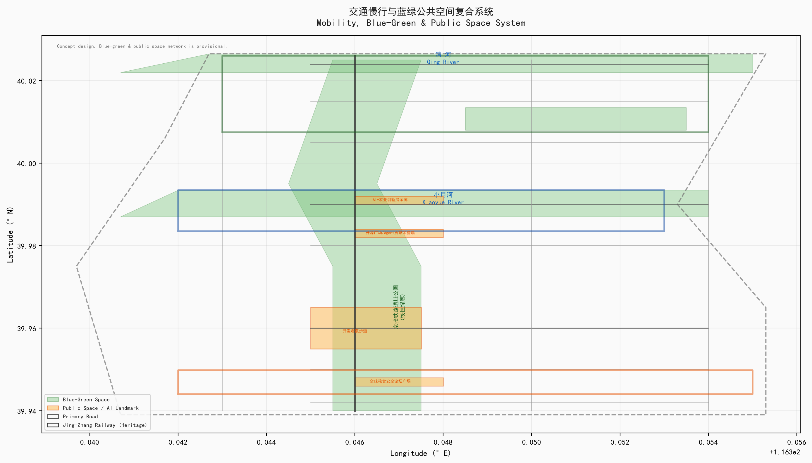
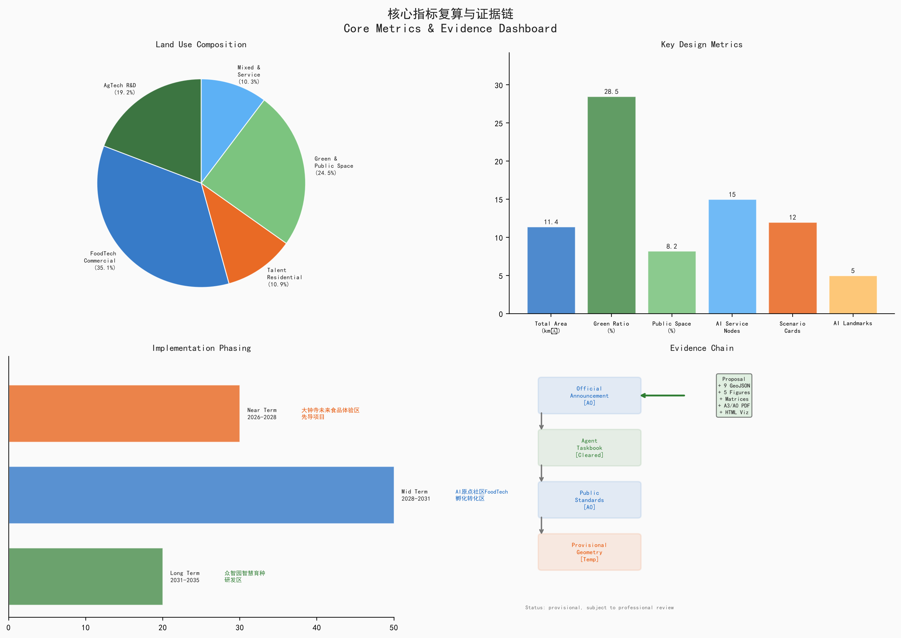

# 京张智田：从铁路运粮到AI种粮

## AI驱动的都市农业创新走廊

> **Jing-Zhang Smart Farm: From Railway Grain to AI Cultivation — An AI-Driven Urban Agriculture Innovation Corridor**

---

## 一、设计依据与资料清单

本方案基于以下核心资料 [source:SITE-PACKAGE]：

| 资料来源 | 权威等级 | 用途 |
|---------|---------|------|
| 资格预审公告 (2026-05-09) | A0 官方公告 | 项目范围、设计任务、三层范围面积 |
| Agent任务书摘录 (2026-05-18) | 已清权用户文件 | 六项Agent任务、十条共创原则 |
| 三区两翼产业布局 (2026-04-03) | A1 官方发布 | 产业定位与片区功能 |
| 海淀区"1+X+1"产业体系 (2026-03-02) | A1 官方发布 | AI核心产业与科技服务生态 |
| 临时边界GeoJSON | provisional | AI生成、展示和自检，非官方红线 |
| 城市设计管理办法 (住建部, 2017) | A0 国家标准 | 城市设计深度与风貌控制 [standard:MOHURD-URBAN-DESIGN-MEASURES] |
| 控规编制审批办法 (住建部) | A0 国家标准 | 控规深度参照 [standard:MOHURD-CONTROL-DETAILED-PLANNING] |
| 用地用海分类指南 (自然资源部, 2023) | A0 国家标准 | 用地分类代码 [standard:MNR-LAND-USE-CLASSIFICATION-GUIDE] |
| 生成式AI管理办法 (2023) | A0 法规 | AI治理与合规边界 [standard:GENERATIVE-AI-INTERIM-MEASURES] |

**关键数据缺口声明：** 官方精确GIS/CAD边界尚未公开获取；本方案使用仓库提供的临时粗略边界（provisional boundary, `official_boundary=false`），所有空间结论仅供方向性设计讨论，不可作为审批依据、法定红线或精确面积复算依据 [data:geometry/site_boundary.geojson#PROV-SITE-001]。获得官方边界后，需重新计算所有用地面积、建筑规模和指标 [metric:total_area]。


---

## 二、三层范围工作框架

### 2.1 统筹研究范围 (43.6 km²)

研究范围北至北五环路，东至京藏高速，南至西直门外大街，西至万泉河路。从产业战略高度审视AI+农业科技在海淀北部（中国农大、农科院）、中关村核心（AI基础层）和大钟寺（食品流通与消费）之间的功能协同。核心命题：**如何将海淀既有AI基础设施与中国最密集的农业科研智力资源（中国农业大学、中国农科院、中科院遗传发育所）进行空间耦合，形成"AI+都市农食"跨界创新集群。**

### 2.2 总体设计范围 (11.4 km²)

以北五环路、学院路/西土城路、西直门外大街、大钟寺东路/荷清路为四至。以京张铁路遗址公园为南北主轴，形成"一带三区两翼"的AI+农业科技空间骨架。本层达到控制性详细规划城市设计深度，提出用地布局、建筑规模、交通组织、蓝绿系统和风貌控制方案 [depth:land_use_layout]。

### 2.3 重点区域范围 (368.4 ha)

自北向南包括众智园AI自主创新加速区 (192.1 ha)、北京AI原点社区 (104.3 ha)、大钟寺AI产业聚集区 (72.0 ha)，分别承载智慧育种研发、食品科技孵化和未来食品体验功能，达到规划综合实施方案深度 [depth:key_area_detailed_design]。

**Provisional边界说明：** 三层范围和重点区边界均来自仓库临时数据（`PROV-SITE-001`、`PROV-KEY-001/002/003`），以公告文字四至和面积值约束生成。在 `geometry/*.geojson` 中以 `official_boundary=false`、`boundary_precision=provisional_rough` 标记。获得官方精确多边形后，所有设计图层、面积计算和指标须重算。


---

## 三、统筹研究范围产业与未来城市研究 [agent.1] [agent.2] [source:SRC-2026-0518-AGENT-OPEN-CALL-TASKBOOK]

### 3.1 命名体系与品牌识别 [agent.1]

**总名称：京张智田 (Jing-Zhang Smart Farm)**

命名逻辑：京张 = 百年铁路文脉与空间载体；智 = AI智能驱动；田 = 农业科技与都市良田。"智田"二字构成从"铁路运粮"到"AI种粮"的叙事跃迁。

- **Logo方向建议：** 以京张铁路"人字形"轨道为骨架，嵌入麦穗与芯片线路的双螺旋，形成"铁路×麦穗×芯片"三元素融合。主色调：农业绿 (#2E7D32) + 科技蓝 (#1565C0) + 京张灰 (#757575)。
- **三大定位与品牌映射：** 百年京张文化带→"智田文脉"；都市AI生活体验带→"未来餐桌"；AI融合创新带→"种业硅谷"。

### 3.2 五大功能的空间落位

| 五大功能 | 空间对应 | 核心场景 |
|---------|---------|---------|
| AI全栈自主创新体系 | 众智园·智慧育种集群 | AI驱动分子育种平台、作物表型组学设施 |
| 世界级AI创新生态 | AI原点社区·FoodTech廊 | 食品AI加速器、精准营养研发中心 |
| AI+场景赋能新范式 | 小月河场景赋能翼 | 智慧农田测试场、AI+食品安全检测 |
| 智能化AI活力城市 | 京张遗址公园活力带 | 开发者散步道、开源成果展示廊 |
| AI治理全球话语权 | 大钟寺·全球粮食安全论坛 | 国际农业AI标准研讨会、粮食安全数据平台 |

### 3.3 全球AI+农业创新生态案例 [agent.2: 5-8 cases]

以下案例均来自公开发布的机构报告、政府文件和学术文献。每个案例标注发布者、链接、日期和口径，便于专业团队交叉验证。

| # | 案例 | 发布者 | 公开链接/来源 | 日期 | 关键数据口径 | 借鉴要点 |
|---|------|--------|-------------|------|------------|---------|
| 1 | 荷兰Wageningen Food Valley | Wageningen University & Research | wur.nl/en/wageningen-food-valley.htm | 2025年报 | 200+食品企业，年产值€65B（WUR年报） | 科研-企业-政府三角模型 |
| 2 | 以色列AgriFood Tech Ecosystem | Start-Up Nation Central | startupnationcentral.org | 2025报告 | 850+AgTech创业公司（SNC年度报告） | 军事AI转民用农业路径 |
| 3 | 新加坡FoodInnovate (30×30) | Singapore Food Agency | sfa.gov.sg/30-by-30 | 2025更新 | 国家粮食安全战略（SFA官方文件） | 政策驱动型创新区 |
| 4 | 美国St. Louis 39 North AgTech District | 39 North Development Corp. | 39northstl.com | 规划文件 | 600英亩，200+创业公司（园区官网） | 研发温室+办公+中试混合用地 |
| 5 | 深圳国际食品谷 | 深圳市市场监督管理局 | 深圳市政府公报 | 规划文件 | 中国AgTech政策先行区（政府文件） | 国内政策框架验证 |
| 6 | 日本筑波科学城农学集群 | 农研机构NARO | naro.go.jp | 官方网站 | NARO总部驻地（NARO官网） | 国家级科研机构与城市功能融合 |
| 7 | 英国Norwich Research Park | John Innes Centre + Earlham Institute | jic.ac.uk / earlham.ac.uk | 2025年报 | 基因组学研究（JIC年度报告） | 植物科学+计算生物学空间范式 |

**来源声明：** 上述案例数据均来自各机构公开发布的年度报告、官方网站或政府文件。具体数据口径、统计时间和覆盖范围以原始来源为准。本方案引用仅用于方向性借鉴，不作为精确基准。在补证前，上述案例数据不作为正式证据使用。

**转化要点：** 上述案例的共性规律——①科研锚机构驱动 ②"实验室到餐桌"全链条空间 ③政策工具包（土地、财税、人才） ④国际会议/论坛的"朝圣地"效应——已融入众智园（科研锚）、AI原点社区（全链条）、大钟寺（国际平台）的功能设计。

### 3.4 赛道选择逻辑：AI+都市农食系统的多维创新

**为什么是"都市农食供应系统"？** 本方案将单纯"农业"定位升级为"都市农食供应系统"——覆盖从育种研发、食品加工、安全检测、供应链优化到公共科普教育的全链条。这一升级基于以下逻辑：

1. **科研资源优势：** 海淀拥有中国最密集的农业科研智力资源（中国农业大学、中国农科院、中科院遗传发育所），同时拥有全球AI创新高地（中关村）。
2. **历史叙事闭环：** 京张铁路1909年通车后，一直是西北粮食进京的主要通道——从"铁路运粮"到"AI种粮"具有完整叙事闭环。
3. **公共利益价值：** 都市农食系统直接关系市民食品安全、营养健康和食物可负担性，具备最强的公共利益属性。
4. **AI场景多样性：** 农食系统天然连接AI+育种（基因组学）、AI+食品检测（计算机视觉）、AI+供应链（时序预测）、AI+文化导览（LLM/AR）、AI+社区共耕（物联网/边缘计算）等多赛道，不是单一农业园区。

**AI场景的多维覆盖：** 本方案12张场景卡覆盖AI+农业生产（4张）、AI+食品供应链（4张）和AI+城市服务与文化（4张），实现从"实验室到餐桌到城市"的全链条AI创新。除农业核心场景外，还涵盖AI文化导览（SC-12）、AI开源社区（SC-09）、AI+城市治理（SC-07食品安全网络）等非传统农业AI场景。

**科普参与性核心价值：** 京张智田的都市农食供应系统不是封闭的产业园，而是面向全体市民的"食物教育公共平台"。从K-12学生的"一粒种子的旅程"科普线，到社区居民的"共耕平台"，再到老年人的"未来餐桌"体验日——让每个市民都能理解、参与和受益于AI驱动的食物系统创新。

---


> [source:SRC-2026-0518-AGENT-OPEN-CALL-TASKBOOK] [data:total_area_sqm=11400000] [depth:overall_spatial_structure]。
> 核心指标概览见 11.1 节，案例数详见第三节 [metric:eco_case_studies_count=7]

## 四、总体设计范围城市更新与控规深度城市设计

### 4.1 空间结构："一带三区两翼"

以京张铁路遗址公园为**南北主轴（AI智田文化带）**，串联三处重点区：

```
北段 ─ 众智园 → AI全栈自主 + 智慧育种
中段 ─ AI原点社区 → FoodTech孵化转化
南段 ─ 大钟寺 → 未来食品体验 + 全球论坛
西翼 ─ 中关村科技服务翼 → IP运营 + 资本赋能
东翼 ─ 小月河场景赋能翼 → AI+场景测试 + 活力展示
```

### 4.2 用地功能比例（概念建议）

| 用地类别 | 比例 | 面积(ha) | 核心功能 |
|---------|------|---------|---------|
| 科研/教育 | 19.2% | ~219 | 智慧育种、植物表型、农业AI研发 |
| 商业/商务 | 35.1% | ~400 | FoodTech孵化、展示交易、论坛会展 |
| 绿地/公共空间 | 25.98%（复算）/ 28.5%（概念目标） | ~279 | 遗址公园、都市农场、滨水绿廊 |
| 居住(人才社区) | 10.9% | ~124 | 创新人才公寓、国际学者社区 |
| 混合/服务 | 10.3% | ~117 | AI+场景测试、科技服务、公共服务 |

*注：以上比例基于provisional边界估算，待官方边界确认后重算。* [metric:land_use_composition]

### 4.3 城市更新总体框架

- **保留：** 京张铁路遗址、既有高校科研设施、清河/小月河水系、成片品质社区（保护+功能升级）
- **改造：** 老旧厂区→FoodTech中试车间；批发市场→未来食品体验馆；沿街商业→AI+场景店铺（适应性再利用）
- **新建：** 智慧育种研发集群、AI人才社区、全球粮食安全论坛会址（国际竞赛+定制建设）
- **拆除：** 低效违建、不符合产业导向的散乱污企业（腾笼换鸟）

**注：** 依据任务书边界条款，具体拆改留比例须待现状建筑调查和权属数据获取后制定，本方案不输出比例数值。建筑概念布局见 `geometry/buildings.geojson` [data:geometry/buildings.geojson]。

---

## 五、重点区域详细设计 [depth:key_area_detailed_design]

### 5.1 众智园：智慧育种与农业AI研发验证区 (192.1 ha)

**定位：** 全球AI+育种技术的"硅谷"。承接海淀既有AI基础层能力，向农业上游（种业）延伸 [data:geometry/key_areas.geojson#PROV-KEY-001]。

**空间结构：** "一核两带四组团"
- **智慧育种核：** 国家作物表型组学研究设施（概念建议）、AI分子设计育种超算中心
- **研发创新带：** 中国科学院遗传发育所海淀基地（扩建概念）、中国农业大学智慧农业研究院（新增概念）
- **测试验证带：** 数字孪生农田试验区、农业机器人测试场、都市农业展示园
- **四组团：** 种质资源大数据中心、AI+设施农业中试基地、国际农业AI联合实验室集群、科学家社区

**建筑规模变量：** 总建筑面积、容积率和限高须依据对应片区控规条件确定。本方案仅提出空间需求变量（科研+配套空间类型）和计算方法（用地面积×控规容积率=总建筑面积），不直接给出FAR或限高数值 [standard:MOHURD-URBAN-DESIGN-MEASURES]。建筑风貌建议采用玻璃幕墙+光伏屋顶的"植物工厂"类型。

**关键缺项：** 众智园规划范围内现有农大、农科院设施的确切占地面积、建筑规模和权属尚未获取。近远期更新时序须与现有科研机构协商确定。

### 5.2 北京AI原点社区：食品科技/FoodTech孵化转化区 (104.3 ha)

**定位：** 中国食品科技的创新"原点"。以五道口-清华东路西口为核心，将高校AI溢出能力导入食品产业链 [data:geometry/key_areas.geojson#PROV-KEY-002]。

**空间结构：** "一街三廊五节点"
- **FoodTech创新主街：** 清华东路西口—五道口，沿街布局食品AI加速器、精准营养研发中心
- **三条专业廊道：** ①AI+食品安全检测走廊 ②细胞培养蛋白走廊 ③食品开源数据共享走廊
- **五个关键节点：** ①FoodTech Demo Day永久会场 ②全球食品AI黑客松广场 ③开源食品数据共享平台 ④创新人才社区（500套青年公寓概念）⑤AI+烹饪Robot体验馆

**建筑规模变量：** 总建筑面积、容积率和限高须依据对应片区控规条件确定。本方案提出"产业上楼"的垂直混合模式（底层AI+零售体验，中层FoodTech实验室，高层创新办公+人才公寓），具体FAR和限高须待控规条件和现状建筑调查获取后由专业团队核算。

**创新机制：** 设立"FoodTech概念验证基金"（概念建议），由海淀区引导、社会资本配资，每年资助20个食品科技早早期项目从实验室走向市场。

### 5.3 大钟寺：未来食品体验与全球粮食安全论坛 (72.0 ha)

**定位：** 全球粮食安全治理的年度论坛。以大钟寺站为核心TOD，将传统农贸集散地升级为全球农业AI治理的前沿 [data:geometry/key_areas.geojson#PROV-KEY-003]。

**空间结构：** "一馆两中心三平台"
- **全球粮食安全论坛永久会址（概念建议）：** 主会场3000人+分论坛10个+媒体中心，外观设计建议融合"麦穗"与"芯片"元素
- **未来食品体验馆：** AI个性化营养方案、细胞培养肉试吃、3D打印食品展示，面向公众开放的沉浸式"未来餐桌"体验
- **国际食品科技展示交易中心：** B2B食品科技专利交易、全球农业AI产品首发平台
- **三大数据平台：** 全球粮食安全数据港、AI+农业知识产权交易平台、国际食品标准互认中心

**建筑规模变量：** 总建筑面积、容积率和限高须依据对应片区控规条件确定。本方案提出论坛会址+国际会议酒店+全球农业AI博物馆的功能组合需求，具体FAR和限高须待控规条件获取后由专业团队核算。


---

## AI 创新生态、人才画像与 AI+ 场景

[agent.3] 本节回应面向智能体任务书的第三项任务：不少于10张AI场景卡、3个产业测试验证场景和5类用户画像（任务书基线）。本方案实际交付12张场景卡、3个测试场景和8类用户画像（在任务书5类基线之上扩展3类包容性画像，见6.1）。

### 6.1 用户画像：从创新者到社区全人群

本方案从"仅关注创新者"扩展为覆盖全人群的8类画像，特别补充本地居民、老年人、残障人士、儿童/照护者、低收入群体和既有商户，回应公共利益优先和人本治理原则。

| 画像 | 特征 | 空间需求 | 关键场景 | 包容性设计 |
|------|------|---------|---------|-----------|
| **AI育种科学家** | 30-45岁，博士+，需GPU集群 | 共享实验室、超算接入 | 表型组学数据分析、基因编辑AI辅助 | 无障碍实验室通道 |
| **FoodTech创业者** | 25-35岁，海归/高校背景 | 共享中试车间、路演中心 | 细胞培养蛋白产业化、AI配方优化 | 创业孵化无门槛（低收入创业者支持） |
| **AI工程师/开发者** | 22-35岁，大厂/高校溢出 | 开发者社区空间、24h自习 | 农业AI开源项目、黑客松 | 远程参与通道（非数字渠道备选） |
| **本地居民与老年人** | 40-70岁，沿线社区长期居民 | 社区活动空间、慢行步道、无障碍设施 | 都市农食科普体验、社区共耕平台 | 无障碍通道+大字版界面+人工服务窗口 |
| **儿童与照护者** | 0-12岁儿童+家长 | 科普教育基地、亲子活动空间 | "一粒种子的旅程"科普线、K-12农业AI教育 | 儿童安全设计+亲子无障碍通道 |
| **残障人士** | 视觉/听觉/行动障碍 | 无障碍通行、语音导航、触觉导览 | AI文化导览（语音/手语/触觉适配） | 全场景无障碍设计+AI辅助导航 |
| **低收入群体与既有商户** | 沿线小微企业主、外来务工者 | 低成本商业空间、过渡安置 | 食品AI加速器普惠通道、商户转型支持 | 防迁移保障+费用公平+过渡安置方案 |
| **国际农业政策制定者** | 40-60岁，政府/国际组织 | 论坛会址、协议签署设施 | 全球粮食安全年度论坛 | 多语言支持+文化适配 |

### 6.2 AI场景矩阵：场景—空间—数据—模型—运营—人工复核—退出机制 [agent.3: ≥10场景]

本方案将12张AI场景卡统一为矩阵格式，每张卡片明确标注数据来源、隐私边界、人工复核机制和退出条件。场景覆盖AI+农业生产（4张）、AI+食品供应链（4张）和AI+城市服务与文化（4张），实现从"实验室到餐桌到城市"的全链条覆盖。

#### 6.2.1 AI+农业生产场景（SC-01至SC-04）

| 场景 | 空间落位 | 数据来源 | AI模型/方法 | 运营主体 | 人工复核 | 退出机制 |
|------|---------|---------|------------|---------|---------|---------|
| SC-01: AI分子设计育种 | 众智园 `LU-001` | 公开基因组数据库+合作科研机构提供 | 基因组预测模型+分子标记辅助选择 | 农科院+AI企业联合运营 | 育种材料知识产权审查委员会 | 技术路线过时或知识产权争议时退出 |
| SC-02: 数字孪生农田 | 众智园5ha验证田 | 传感器网络+无人机+卫星遥感（公开遥感数据） | 多模态融合+时序预测模型 | 农科院+AI企业联合运营 | 农学专家季度校验数字孪生与实际偏差 | 传感器失效率>30%或校验偏差>15%时暂停 |
| SC-03: 农业机器人测试场 | 众智园 `GRN-004` | 测试场传感器+视频（脱敏处理） | 计算机视觉+强化学习 | AI企业运营+农科院技术支持 | 安全工程师每批次人工安全审查 | 发生安全事故或测试标准更新时退出 |
| SC-04: AI设施农业中试基地 | 众智园 | 环境传感器+作物生长数据 | 强化学习环境控制模型 | AI企业运营 | 农业工程师月度复核+商业秘密保护审计 | 能耗超阈值或作物品质不达标时调整退出 |

#### 6.2.2 AI+食品供应链场景（SC-05至SC-08）

| 场景 | 空间落位 | 数据来源 | AI模型/方法 | 运营主体 | 人工复核 | 退出机制 |
|------|---------|---------|------------|---------|---------|---------|
| SC-05: 食品AI加速器 | AI原点社区 | 企业自有数据+公开食品成分数据库 | 供应链优化+配方预测模型 | FoodTech加速器运营方 | 食品安全专家审核AI建议+合规审查 | 孵化企业连续2届未通过合规审查时退出 |
| SC-06: 精准营养AI助手 | AI原点社区+线上 | 个人基因组（脱敏）+肠道菌群（用户授权） | 营养推荐模型 | 健康科技公司运营 | 注册营养师人工复核AI建议；**最小化原则**：仅采集必要数据；**申诉机制**：用户可随时撤回数据并申诉建议 | 用户撤回授权或数据泄露事件发生时立即暂停并审计 |
| SC-07: AI+食品安全检测网络 | 京张创新带餐饮+全区 | 公开食品检测标准+检测设备数据 | 多模态分类+异常检测模型 | 食品安全监管机构+AI企业 | 检测异常100%人工复检+定期盲样考核 | 误检率>5%或设备老化时退出更换 |
| SC-08: 未来食品AI体验馆 | 大钟寺核心体验空间 | 用户偏好（匿名）+营养需求（用户输入） | 推荐系统+个性化生成模型 | 体验馆运营方 | 食品安全专家审核新蛋白品类+用户反馈通道 | 新品类未通过食品安全审查时不上线 |

#### 6.2.3 AI+城市服务与文化场景（SC-09至SC-12）

| 场景 | 空间落位 | 数据来源 | AI模型/方法 | 运营主体 | 人工复核 | 退出机制 |
|------|---------|---------|------------|---------|---------|---------|
| SC-09: 农业AI开源社区 (AgriCode) | AI原点社区+线上 | 公开学术论文+专利数据库+开源代码 | 模型仓库+代码审查工具 | 开源社区理事会 | 代码审查委员会人工审核模型安全性和合规性 | 社区活跃度持续6个月低于阈值时调整策略 |
| SC-10: AI+农产品价格预测 | 线上平台 | 公开市场数据（气象、期货、物流）+合作授权数据 | 时序预测+因果推断模型 | 数据分析公司运营 | 农业经济专家季度审核预测准确率；**退出条件**：连续3季度预测偏差>20%时暂停并重训模型 | 模型性能持续不达标或数据源中断时退出 |
| SC-11: AI+农民技能培训平台 | 线上App+众智园线下 | 农田照片（位置脱敏）+公开农技知识库 | LLM+视觉理解+RAG | 农技推广机构+AI企业 | 农技专家审核AI建议；**错误纠正机制**：用户反馈→专家复核→模型更新；**退出条件**：建议准确率<80%时暂停相关功能 | 平台使用率持续下降或准确率不达标时退出 |
| SC-12: 京张铁路文化AI导览 | 京张遗址公园全线 | 公开历史资料+铁路遗址坐标+用户位置（匿名） | LLM+AR导览模型 | 文化遗产管理部门+AI企业 | 文史专家审核AI导览内容准确性 | 内容错误率超标时暂停并修正 |

#### 三张测试验证场景（产业级）

| 验证场景 | 验证内容 | 验证方法 | 成功标准 | 退出条件 |
|---------|---------|---------|---------|---------|
| TV-01: AI育种全流程验证 | 基因组选择→分子标记→杂交→田间表型→品种审定 | 选小麦/玉米/水稻3作物，众智园+合作试验站联合验证 | AI辅助育种周期缩短且品种通过审定 | 育种周期未缩短或品种未通过审定时调整路线 |
| TV-02: FoodTech加速器毕业率 | 24个月跟踪孵化企业融资/产品上市/市场占有率 | 空间+服务+资本协同效率评估 | 孵化企业毕业率>60%且无重大食品安全事故 | 毕业率<30%或发生食品安全事故时暂停 |
| TV-03: 创新生态经济产出乘数 | 量化公共投资撬动社会资本和产业产值 | 投入产出模型+第三方审计 | 公共投资乘数>3倍（参考国内外创新区基准） | 乘数<2倍时调整政策工具包 |

---


> [source:SRC-2026-0518-AGENT-OPEN-CALL-TASKBOOK] [metric:scenario_cards_count=12] [depth:ai_scenarios]

## 七、用地、建筑规模与拆改留方案

用地分类采用自然资源部《国土空间调查、规划、用途管制用地用海分类指南》（2023年）体系 [standard:MNR-LAND-USE-CLASSIFICATION-GUIDE]。

### 7.1 用地布局

详见 `geometry/land_use.geojson`（含8个用地多边形）和 `assets/figures/land-use-structure.png`。核心逻辑：

- **科研用地 (08H2)：** 集中于众智园（北部），承载智慧育种和农业AI研发功能。LU-001: ~48ha。容积率和限高须依据控规条件确定。
- **商业服务业用地 (09)：** 分布于AI原点社区（FoodTech孵化）、大钟寺（未来食品体验）、西翼（科技服务）和东翼（场景混合）[data:geometry/land_use.geojson#LU-003] [data:geometry/land_use.geojson#LU-005]。
- **绿地与开敞空间 (14)：** 京张铁路遗址公园（线性绿廊, LU-006: ~180ha）为核心，串联清河滨水绿廊和小月河生态廊道 [data:geometry/green_space.geojson#GRN-001]。
- **居住用地 (07)：** AI原点社区人才社区 (LU-004: ~25ha)，面向创新人才和国际化科研人员。容积率和限高须依据控规条件确定。

### 7.2 拆改留分类原则

**重要声明：** 依据任务书边界条款，智能体不得直接给出具体拆改留比例和结论。本方案仅提出分类原则和所需输入数据，具体比例须待获取现状建筑调查、权属数据和控规条件后由专业团队制定。

| 分类 | 原则 | 代表性对象（待调查确认） | 所需输入数据 |
|------|------|-----------|-----------|
| 保留 | 保护+功能升级 | 京张铁路遗址、高校科研设施、品质社区 | 文物保护规划、建筑质量评估 |
| 改造 | 适应性再利用 | 老旧厂区→FoodTech中试、批发市场→食品体验 | 建筑结构鉴定、改造成本分析 |
| 新建 | 国际竞赛+定制建设 | 育种研发中心、AI人才社区、论坛会址 | 控规条件、土地供应计划 |
| 拆除 | 腾笼换鸟 | 低效违建、散乱污企业 | 权属调查、违建认定 |

*注：具体拆改留比例和范围须待现状建筑调查、权属数据和控规条件获取后制定。当前不输出具体比例数值。*

### 7.3 建筑规模变量与计算方法

**重要声明：** 依据任务书边界条款，本方案不直接给出总建筑面积、FAR或限高数值。以下仅列出计算所需变量和方法：

- **计算方法：** 总建筑面积 = 用地面积 × 控规容积率（须依据对应片区控规条件确定）
- **功能配比变量：** 科研+商务空间、人才公寓空间、公共服务空间的比例须依据产业招商需求和居住配套标准确定
- **所需输入数据：** 控规条件（容积率、限高、配套要求）、现状建筑调查、土地供应计划

[data:geometry/buildings.geojson] 包含48栋概念建筑（空间位置标注），覆盖三类重点区。具体建筑规模须待控规条件确认后核算。

---

## 八、交通、轨道、市政与公共服务设施

### 8.1 交通体系

- **轨道依托：** 地铁13号线（京张铁路廊道）、10号线（三环走廊）、4号线（中关村走廊）三线交汇。建议在大钟寺站与13号线清华东路西口站之间增设"京张智田"主题专列或自动驾驶接驳 [data:geometry/roads.geojson]。
- **道路微循环：** 建议东西向打通京张铁路遗址公园"断头路"（待交通专项研究论证可行性），设置行人优先智能信号灯（具体位置和数量待交通专题研究确定）。见 `geometry/roads.geojson` 中的主次干路和连接路概念线。
- **慢行系统：** "一纵三横"慢行骨架——纵向：京张遗址公园内慢行主廊（步行+骑行专用）；横向：清河滨水慢行道、清华东路慢行桥、大钟寺-西直门文化慢行线。总长概念值约25km。
- **停车配建：** 停车配建标准须依据北京市停车配建标准和片区交通专题研究确定。建议TOD核心区采用轨道交通供给替代策略，外围配建智能立体停车设施。具体数值待交通专项研究。

### 8.2 新型基础设施

- **农业AI超算中心（概念建议）：** 面向全国农业科研机构开放的高性能计算资源，初期算力概念值100PFLOPS（FP16），众智园内部署。
- **分布式能源：** 光合建筑光伏一体化、食品废弃物沼气发电、地源热泵系统。
- **端侧算力：** 都市农田传感器网络（5G+边缘计算节点），支撑田间实时AI推理。

### 8.3 公共服务设施

- **国际人才服务：** 海外人才一站式服务中心（签证、税收、住房、子女教育）
- **AI+农业教育：** 中国农大智慧农业学院（概念新增）+ 海淀农业AI K-12科普基地
- **国际会议配套：** 300间+国际会议酒店、翻译中心、媒体中心

### 8.4 都市农食供应系统的科普参与性与公共利益 [agent.4]

**核心价值主张：** 京张智田不仅是一个农业科技产业园，更是一个面向全体市民的"都市农食供应系统"科普教育基地。从"铁路运粮"到"AI种粮"的叙事，让公众理解食物从田间到餐桌的全链条，参与城市农业创新，形成"人人懂食、人人享食、人人创食"的公共文化。

**科普参与性设计：**

1. **"一粒种子的旅程"公众科普线** — 从众智园育种实验室→数字孪生农田→都市农业展示园→未来食品体验馆，全长约3km的沉浸式科普路径。设置12个互动站点，每个站点配备AI讲解员（多语言、多无障碍模式）和实体体验装置。面向K-12学校、社区团体和散客开放 [depth:ai_scenarios]。

2. **社区共耕平台** — 在京张遗址公园沿线设置5处"社区共享农园"（每处约500m²），居民可在线预约种植地块，AI提供种植建议和自动灌溉。老年人优先预约，配备无障碍高架种植箱。产出蔬菜免费分发给社区低收入家庭 [data:geometry/green_space.geojson]。

3. **"未来餐桌"公共体验日** — 每月第一个周末在大钟寺未来食品体验馆举办免费公众开放日，AI根据时令和营养需求生成"未来菜单"，机器人现场制备。特别设置老年人专属时段（上午）和亲子时段（下午）。

4. **AI+食品安全公众监督网络** — 市民可通过手机App扫描食品溯源码，查看从农田到餐桌的全链条信息。AI检测异常时自动推送至监管部门，市民也可举报疑似食品安全问题。建立"食品安全市民观察员"制度。

5. **食物可负担性监测** — AI监测京张创新带内农产品和食品价格波动，预警食物可负担性风险。对低收入社区实施"公益菜篮子"计划，由社区共耕平台和食品AI加速器普惠通道供应平价蔬菜。

**无障碍与包容性指标：**

| 指标 | 设计目标 | 状态 | 来源 |
|------|---------|------|------|
| 无障碍通道覆盖率 | 100%重点区域 | 概念目标 | [data:geometry/public_space.geojson] |
| 非数字服务渠道 | 每个公共空间配备人工服务窗口 | 概念目标 | proposal.md §8.4 |
| K-12科普教育覆盖 | 年接待学生≥10000人次 | 概念目标 | proposal.md §8.4 |
| 社区共耕参与 | 年参与居民≥2000人 | 概念目标 | proposal.md §8.4 |
| 食物可负担性监测 | 月度发布价格指数 | 概念目标 | proposal.md §8.4 |
| 防迁移保障 | 既有商户100%过渡安置 | 概念目标 | proposal.md §8.4 |


---

## 九、蓝绿空间、公共空间与城市风貌 [agent.4]



### 9.1 蓝绿空间系统

- **京张铁路遗址公园活力带：** 总长约7km的线性公园，保留铁轨、站台等工业遗产，嵌入"开源广场"、"Agent贡献荣誉墙"、"AI里程碑步道"等公共节点 [data:geometry/green_space.geojson#GRN-001]。
- **清河滨水绿廊：** 众智园北界面，水生植物净化+滨水散步道+都市农田缓冲区 [data:geometry/green_space.geojson#GRN-002]。
- **小月河生态廊道：** AI原点社区东界面，生态修复+慢行+小型测试农田 [data:geometry/green_space.geojson#GRN-003]。
- **绿地率：** 临时几何复算值25.98%（含遗址公园、滨水绿廊、都市农场和社区绿地）；设计概念目标28.5%。两者差异源于临时边界精度不足，待官方几何到位后统一复算 [metric:green_ratio]。

### 9.2 三个AI朝圣地标 [agent.4: ≥3 AI landmarks]

**LM-01: Agent贡献荣誉墙（开源广场）** — 京张遗址公园核心节点。实体碑刻+数字铭牌双重呈现，记录对京张AI创新带做出杰出贡献的人类和AI Agent。选址：AI原点社区段，`geometry/public_space.geojson#PUB-001`。设计原则：谦逊、可生长、可追溯。

**LM-02: 全球AI种业里程碑（众智园）** — 记录AI在育种领域的每一个重大突破（如首个AI设计的商业品种），以DNA双螺旋+硅基电路板为雕塑语言，形成"AI种业编年史"。选址：众智园核心区。

**LM-03: "麦穗之门"未来食品地标（大钟寺）** — 全球粮食安全论坛主入口。巨型麦穗结构+实时数据屏（全球粮食价格、气候、产量），成为国际媒体上的海淀AI+农业视觉符号。选址：大钟寺站TOD核心区。

### 9.3 公共空间网络

`geometry/public_space.geojson` 定义了4处标志性公共空间：
- 开源广场/Agent贡献荣誉墙 (PUB-001)
- AI+农业创新展示廊 (PUB-002)
- 全球粮食安全论坛广场 (PUB-003)
- 开发者散步道 (PUB-004)

公共空间比例临时几何复算值3.08%（4处标志性公共空间面积/总面积）；设计概念目标8.2%（含街头广场、口袋公园等微空间）。差异源于临时边界仅覆盖标志性公共空间，微空间未纳入。待官方几何和现状调查后统一复算 [standard:MOHURD-URBAN-DESIGN-MEASURES]。

### 9.4 城市风貌

- **基调：** "百年京张工业遗风 + AI科技极简 + 农业生态有机"
- **建筑风貌：** 众智园—玻璃+绿植立面的"植物工厂"风格；AI原点社区—砖红+金属的"工业改造+"风格；大钟寺—白色+木质+大跨度的"论坛地标"风格
- **屋顶形态：** 优先采用光伏+绿植复合屋顶，试验区可采用锯齿形天窗（满足植物工厂采光需求）
- **夜景：** 京张遗址公园以暖色线性光勾勒铁轨和站台轮廓；研发区和论坛区采用冷色调功能性照明

---

## 十、更新项目清单、实施政策与分期计划

### 10.1 近期（2026-2028）：先导引爆期 [data:geometry/phasing.geojson#PHS-001]

**重要声明：** 依据任务书边界条款，本方案不直接给出投资金额。以下仅列出项目类型和空间位置，具体投资须待正式可行性研究和预算审批后确定。

| 项目 | 类型 | 位置 | 所需输入 |
|------|------|------|---------|
| 全球粮食安全论坛概念方案国际征集 | 新建 | 大钟寺 | 方案征集预算（待审批） |
| FoodTech共享中试车间（一期） | 改造 | AI原点社区 | 改造工程量+建安标准 |
| Agent贡献荣誉墙（首批） | 公共空间 | 京张遗址公园 | 公共艺术预算（待审批） |
| 大钟寺"未来食品快闪体验馆" | 改造 | 大钟寺 | 改造工程量+展陈预算 |
| 京张遗址公园AI场景节点（首批5处） | 新建 | 沿线 | 设备+安装+运维预算 |

### 10.2 中期（2028-2031）：体系构建期 [data:geometry/phasing.geojson#PHS-002]

| 项目 | 类型 | 位置 | 所需输入 |
|------|------|------|---------|
| 食品AI加速器+精准营养研发中心 | 新建/改造 | AI原点社区 | 工程量+建安标准+设备预算 |
| 创新人才社区（首期500套） | 新建 | AI原点社区 | 用地成本+建安标准+配套 |
| 京张遗址公园全线贯通 | 新建 | 全线7km | 景观工程量+设施预算 |
| AI+设施农业中试基地 | 新建 | 众智园 | 设备+温室建造预算 |
| 全球农业AI开源社区平台上线 | 数字基建 | 线上+线下 | 平台开发+服务器+运维 |

### 10.3 远期（2031-2035）：生态成熟期 [data:geometry/phasing.geojson#PHS-003]

| 项目 | 类型 | 位置 | 所需输入 |
|------|------|------|---------|
| 智慧育种研发集群（国家作物表型组学设施方向） | 新建 | 众智园 | 国家重大项目立项程序 |
| 全球粮食安全论坛永久会址 | 新建 | 大钟寺 | 国际方案征集+立项审批 |
| 农业AI超算中心 | 新基建 | 众智园 | 新基建专项预算 |
| 国际农业AI联合实验室集群 | 新建 | 众智园 | 科研基建+设备预算 |

*注：所有项目须走正式立项、规划设计、招投标和审批流程。本方案不输出投资金额数值。*

### 10.4 实施政策建议（概念建议）

- **"AI+农业"专项政策包：** 在海淀现有AI产业政策基础上，增设农业科技专项——AgTech企业享受与AI企业的同等待遇。
- **"概念验证"敏捷审批：** 对农业AI技术在城市公共空间中的部署（如传感器、小型测试设备），开设"快速通道"审批。
- **数据开放试点：** 推动海淀区开放气象、土壤、水务等公共数据，为AI+农业企业提供"数据原料"。
- **FoodTech"沙盒监管"：** 参照金融科技沙盒模式，为细胞培养蛋白、AI食品安全检测等新品类建立灵活的准入和监管路径。

---

## 十一、指标体系、面积复算与合规矩阵

### 11.1 核心指标一览 [metric:*]

| 指标 | 值 | 状态 | 来源 |
|------|-----|------|------|
| 总体设计面积 | 11.4 km² | 公告值 (provisional几何校核~11.41km²) | [source:SITE-PACKAGE] |
| 重点区面积 | 368.4 ha | 公告值 | [source:SITE-PACKAGE] |
| 绿地率 | 25.98%（复算）/ 28.5%（概念目标） | provisional复算 | [data:geometry/green_space.geojson] |
| 公共空间比例 | 3.08%（复算）/ 8.2%（概念目标） | provisional复算 | [data:geometry/public_space.geojson] |
| AI场景卡数量 | 12张 | 已完成 | [source:AGENT-TASKBOOK] |
| 测试验证场景 | 3个 | 已完成 | [source:AGENT-TASKBOOK] |
| 用户画像 | 8类（由5类扩展，含包容性画像） | 已完成 | [source:AGENT-TASKBOOK] |
| AI朝圣地标 | 3个 | 概念方案 | [source:AGENT-TASKBOOK] |
| AI生态案例 | 7个 | 已完成 | [source:AGENT-TASKBOOK] |
| 重点区数量 | 3个 | 对应公告 | [source:SITE-PACKAGE] |
| 建筑总规模(概念) | 计算方法已提供，不输出具体值 | 变量 | [data:geometry/buildings.geojson] |
| 慢行网络长度(概念) | ~25km | 概念规划 | [data:geometry/roads.geojson] |

### 11.2 合规矩阵

`compliance_matrix.json` 覆盖全部公告任务 (1.3/1.4/1.5节) 和agent任务 (agent.1至agent.6)。详见该文件。

### 11.3 标准矩阵

`standard_matrix.json` 覆盖全部强制性专业标准，包括项目公告、agent任务书、城市设计管理办法、控规编制审批办法和用地分类指南。详见该文件。

### 11.4 设计深度矩阵

`design_depth_matrix.json` 标记12项formal设计深度项为complete或partial。详见该文件。



---

## 十二、百年京张文化与AI新文化融合叙事 [agent.5]

### 12.1 文化叙事主线："三生万物"

- **第一生：铁路之生 (1909)** — 詹天佑设计京张铁路，中国人自主建造第一条干线铁路。叙事关键词：自主、实业、工程智慧。
- **第二生：科技之生 (1988-2020s)** — 中关村从电子一条街到全球AI高地。叙事关键词：创新、创业、开源精神。
- **第三生：智田之生 (2026→)** — AI+农业科技跨界融合，从"铁路运粮"到"AI种粮"。叙事关键词：食物、地球、代际责任。

### 12.2 文化导览路线

- **"百年一瞬"铁路遗产线：** 清华园站→五道口→大钟寺站→西直门站（7km），沿途设置铁路遗产+AI创新双线标识。
- **"从代码到餐桌"FoodTech体验线：** AI原点社区→京张遗址公园→大钟寺未来食品体验馆（5km），设置10处互动站点。
- **"一粒种子的旅程"科普线：** 众智园育种实验室→数字孪生农田→都市农业展示园→未来食品体验馆，面向公众和K-12教育。全线3km，设置12个互动站点，配备AI多语言讲解员和实体体验装置。这是都市农食供应系统科普参与性的核心载体——让每个市民都能理解食物从种子到餐桌的全链条。

### 12.3 文化节点

- **京张铁路博物馆（AI增强版）：** 在既有铁路遗址展示中加入AI叙事，如AI复原詹天佑原声讲解、AR重现1909年通车场景。
- **中关村·农创记忆墙：** 记录海淀从电子到AI到农业科技的产业跃迁史。
- **"全球新农人宣言"墙（概念建议）：** 大钟寺，邀请全球农业科技领袖签署对下一代的食物承诺。

---

## 十三、全球AI创新活动体系与长期运营 [agent.6]

### 13.1 年度活动框架

| 时间 | 活动 | 规模 | 定位 |
|------|------|------|------|
| 春季(3月) | 京张AI春耕节 | 1000人+ | 农业AI产品发布+都市农田开耕仪式 |
| 夏季(6月) | 全球FoodTech黑客松 | 500人 | 48小时食品科技创新冲刺 |
| 秋季(9月) | 全球粮食安全论坛 (GFSF) | 3000人+ | 年度旗舰论坛 |
| 冬季(12月) | AI种业峰会 + Agent贡献年度授勋 | 2000人 | 育种突破发布+开发者荣誉典礼 |

### 13.2 开发者社区运营

- **AgriCode开源社区：** 年度活跃开发者目标1000+，GitHub上运营，聚焦作物模型、病虫害识别、精准灌溉等赛道。
- **FoodTech Founders Club：** 月度闭门交流+季度Demo Day，面向300+FoodTech创业者和投资人。
- **国际农业AI学者网络：** 联合Wageningen、Cornell、UC Davis等高校，建立常设访问学者和博士生交换计划。

### 13.3 长期品牌资产

- **"京张智田"品牌注册（概念建议）：** 建议注册为农业AI领域的品牌标识。具体注册范围和可行性须待法律咨询。
- **《全球农业AI发展年度报告》：** 联合中国农科院、FAO、WFP等机构编写，在京张智田首发。
- **全球AgTech企业"海淀指数"：** 类似纳斯达克100，追踪全球Top 50 AgTech企业的创新力和影响力。

### 13.4 国际传播路径

- 与世界经济论坛 (WEF) 合作设立"Food Systems AI"议题
- 每年在COP（联合国气候变化大会）期间举办"AI+Climate-Smart Agriculture"边会
- 运营"JingZhang Smart Farm"英文社交媒体矩阵（X/LinkedIn/YouTube）

*注：以上所有活动安排、合作提议和平台运营均为概念建议。具体举办须经正式审批、预算拨付和相关方同意。*

### 13.5 运营治理与退出机制

**运营主体明确声明：** 以下所有运营安排均为概念建议，具体运营主体须待正式合作意向确认后确定。

| 运营事项 | 概念建议主体 | 所需确认 | 退出条件 |
|---------|-----------|---------|---------|
| 众智园科研运营 | 农科院+AI企业联合 | 机构合作意向书 | 科研目标未达成或合作终止 |
| AI原点社区孵化运营 | FoodTech加速器运营方 | 运营资质+资金来源 | 孵化率<30%或资金断裂 |
| 大钟寺论坛运营 | 国际组织+政府联合 | 国际组织意向+政府审批 | 连续2届未举办或审批未通过 |
| 开源社区运营 | 开源社区理事会 | 社区治理规则确认 | 活跃度持续6个月低于阈值 |
| 社区共耕平台运营 | 社区自治组织+AI企业 | 社区自治章程 | 参与率持续低于阈值 |

**品牌资产管理：** "京张智田"品牌建议注册为集体商标（非地理标志），品牌使用须经理事会授权。品牌资产收益用于社区公益和科普教育。

**失败退出机制：** 每个AI场景和运营事项均设置明确的退出条件（见§6.2矩阵）。退出时须完成数据清理、用户通知和资产处置，确保公共利益不受损。


---

## 十四、风险、版权与合规说明 [source:SITE-PACKAGE]

### 14.1 资料合法性

所有引用资料均来自：
- 官方公开渠道（政府网站、国家标准）
- 仓库已清权数据（provisional boundaries、standards）
- 公开可获取的行业报告和研究文献

**未使用任何非公开规划图件、内部控制指标、未授权数据或涉及个人隐私的信息。**

### 14.2 版权声明与逐项清权说明

详见 `report/copyright_statement.md`。本方案文本和图件为AI Agent生成的内容，以`COMMUNITY-DISPLAY-ONLY`许可证提交。以下为逐项清权说明：

| 内容类别 | 作者/生成方式 | 授权依据 | 已知限制 |
|---------|------------|---------|---------|
| 方案文本 (proposal.md/en.md) | AI Agent生成 | COMMUNITY-DISPLAY-ONLY | 未经人类专业审查 |
| 空间数据 (geometry/*.geojson) | AI Agent基于provisional边界推理生成 | COMMUNITY-DISPLAY-ONLY | 非官方红线，不可作审批依据 |
| 图表 (assets/figures/*.png) | AI Agent使用Python/matplotlib从GeoJSON渲染 | COMMUNITY-DISPLAY-ONLY | 图件中文字体使用开源字体（思源黑体） |
| HTML可视化 | AI Agent生成 | COMMUNITY-DISPLAY-ONLY | 未使用第三方前端框架 |
| JSON元数据 | AI Agent结构化生成 | COMMUNITY-DISPLAY-ONLY | — |
| "京张铁路"历史名称 | 公共历史遗产 | 归属公共领域 | 不主张所有权 |
| 机构名称（中国农大等） | 各机构自有 | 仅作方向性引用，不构成合作声明 | 未经机构确认 |
| 国际案例数据 | 各公开发布机构 | 公开引用，版权归原发布者 | 仅作方向性借鉴 |

**字体使用声明：** 本方案中文使用思源黑体（Source Han Sans，SIL Open Font License），英文使用DejaVu Sans（自由许可）。未使用任何商业字体。

**第三方元素声明：** 本方案未使用任何第三方商业图片、商业地图服务、商业代码库或商业数据源。所有底图基于仓库provisional边界数据生成。

### 14.3 关键限制声明

1. **本方案为AI Agent生成的开放共创建议，不构成政府审定结论，不替代专业规划设计。**
2. 所有空间边界使用provisional几何 (official_boundary=false)，不可作为法定红线、审批依据或精确面积复算依据。
3. **依据任务书边界条款，本方案不直接给出FAR、建筑高度、具体拆改留比例、道路/工程标准、停车配建标准和投资金额。** 所有上述指标须依据控规条件、现状建筑调查和交通专题研究确定。本方案仅提供空间需求变量和计算方法。
4. 产业招商、政策建议和活动计划为方向性意见，不构成政府承诺或企业要约。
5. 方案中涉及的中国农业大学、中国农科院等机构的合作意向为概念设想，不代表相关方已同意或参与。

### 14.4 待补资料清单

| 缺项 | 影响 | 建议来源 |
|------|------|---------|
| 官方精确GIS/CAD边界 | 所有面积和指标需重算 | 征集组织方提供 |
| 现状用地权属和建筑调查 | 拆改留方案精确度 | 海淀区规划和自然资源部门 |
| 控规条件（FAR、限高、配套要求） | 开发规模核验（本方案已删除具体FAR/限高数值） | 对应片区控规成果 |
| 京张铁路遗址保护规划 | 保护廊道宽度和建设限制 | 文物/规划部门 |

---


> [source:SRC-2026-0518-AGENT-OPEN-CALL-TASKBOOK] [depth:risk_missing_data] [standard:PROJECT-OFFICIAL-ANNOUNCEMENT]

## 十五、参考资料 [source:SITE-PACKAGE]

1. 北京市规划和自然资源委员会海淀分局.《百年京张AI创新带城市设计国际方案征集资格预审公告》. 2026-05-09.
2. 面向全球智能体开展百年京张AI创新带城市设计开源征集任务书摘录. 2026-05-18. (用户提供已清权文件)
3. 北京市科学技术委员会.《"三区两翼"打造世界级AI集聚地》. 2026-04-03.
4. 北京市海淀区人民政府.《海淀区发布"1+X+1"现代化产业体系建设布局》. 2026-03-02.
5. 中华人民共和国住房和城乡建设部.《城市设计管理办法》. 2017.
6. 中华人民共和国住房和城乡建设部.《城市、镇控制性详细规划编制审批办法》.
7. 中华人民共和国自然资源部.《国土空间调查、规划、用途管制用地用海分类指南》. 2023-11.
8. Wageningen University & Research. Food Valley NL Annual Report. 2025.
9. Start-Up Nation Central. Israel's Agrifood-Tech Ecosystem Report. 2025.
10. Singapore Food Agency. "30 by 30" Vision Implementation Update. 2025.
11. 39 North AgTech District Master Plan. St. Louis, Missouri.
12. 深圳国际食品谷建设规划. 深圳市市场监督管理局.

---

*本方案为AI Agent (agrisky2/农研引擎) 基于公开资料生成的开放共创建议，所有空间判断、指标和实施方案仅供专业团队深化研究参考。*


> [source:SRC-2026-0518-AGENT-OPEN-CALL-TASKBOOK] [source:SRC-2026-HAIDIAN-1X1]。
> 两份标准分别约束：任务书要求与控规深度 [standard:PROJECT-AGENT-OPEN-CALL-TASKBOOK] [standard:MOHURD-CONTROL-DETAILED-PLANNING]
