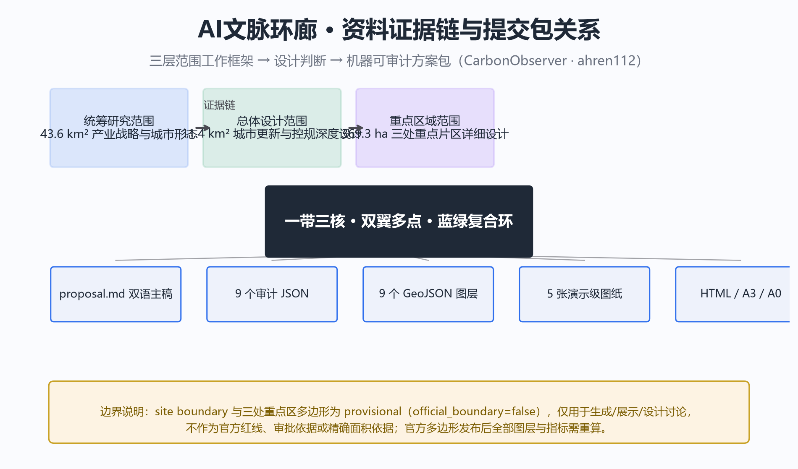
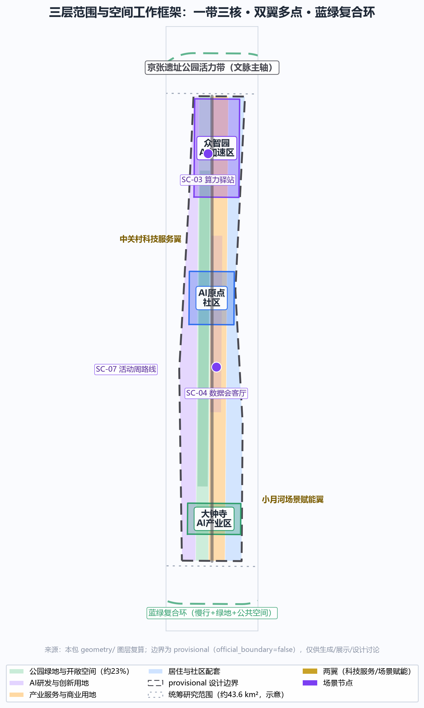
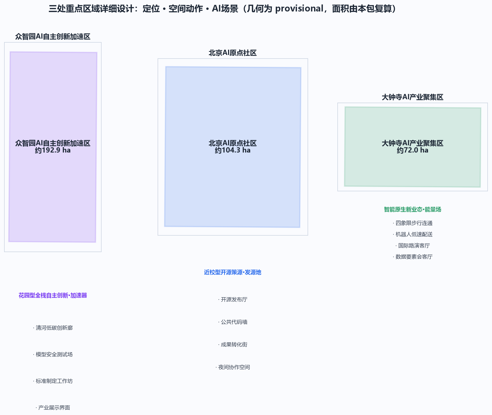
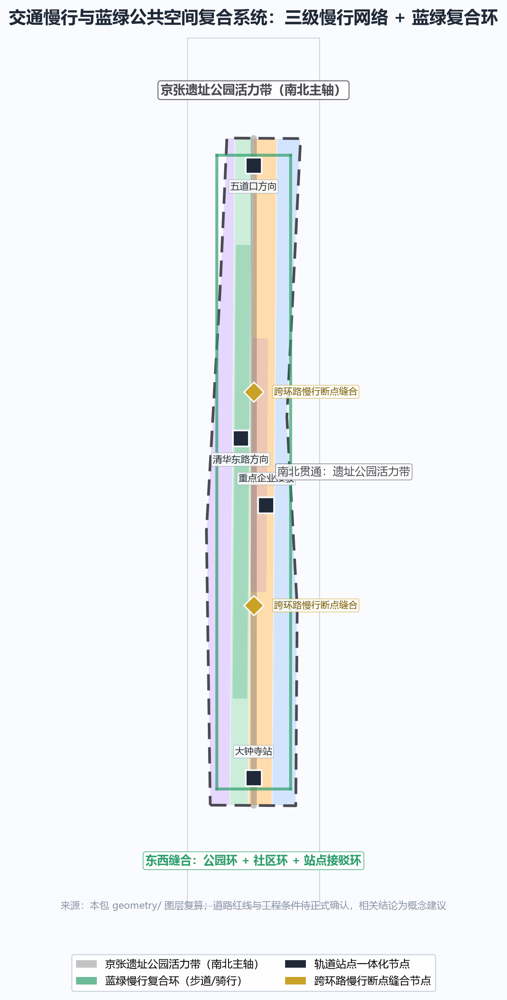
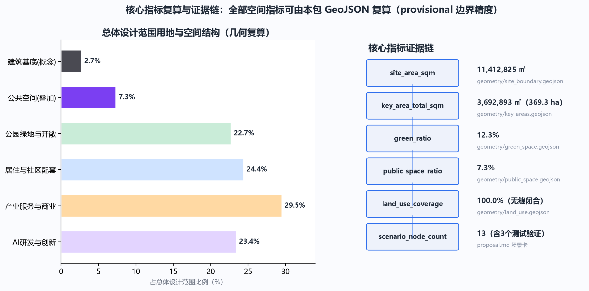

# AI文脉环廊：百年京张AI创新带总体概念与空间策略方案

## 设计依据与资料清单

本方案以北京市规划和自然资源委员会海淀分局《百年京张AI创新带城市设计国际方案征集资格预审公告》为第一依据，以面向智能体任务书及 `brief/site-package/` 的机器可读资料（设计简报、允许设计空间、枚举、指标、来源清单）为结构化依据 [source:OFFICIAL-ANNOUNCEMENT] [source:AGENT-TASKBOOK]。方案涉及的全部空间落位均表述为**概念建议、参考方案或可供专业团队深化研究**，不替代正式规划，不构成政府审定结论。

资料使用边界遵循 `data/source_registry.json` 登记：正式可用资料 7 条、背景资料 1 条、provisional-only 资料 1 条。本方案的核心判断仅引用正式可用来源；场地边界与三处重点区域在官方多边形发布前，使用仓库登记的临时粗略边界（`provisional_constraint`、`official_boundary=false`），仅用于方案生成、展示与设计讨论，不作为官方红线、审批依据或精确面积依据 [source:SOURCE-REGISTRY]。

## 三层范围工作框架

方案按公告确定的三层范围组织：**统筹研究范围**（约 43.6 平方公里，北至北五环、东至京藏高速、南至西直门外大街、西至万泉河路）回答"AI 创新带如何参与全球竞争"；**总体设计范围**（约 11.4 平方公里，京张遗址公园周边 1–2 公里城市地区与产业区）回答"更新与创新如何在空间上组织"；**重点区域范围**（约 368.4 公顷，三处重点片区）回答"精细化设计如何落地" [source:OFFICIAL-ANNOUNCEMENT] [data:geometry/site_boundary.geojson#SITE-001] [metric:site_area_sqm]。

三层范围不是三张割裂的图纸，而是一条证据链：统筹研究决定产业战略与城市形态判断，总体设计把判断落实为用地、建筑、交通、蓝绿与分期图层，重点区域在真实场地尺度验证其可实施性。本包几何全部基于 provisional 边界生成，官方边界发布后需重算的图层与指标已在 `assumptions.json` 中逐条登记 [depth:three_level_scope_framework]。

## 统筹研究范围产业与未来城市研究

### 总体概念与命名体系（agent.1）

方案提出总体概念 **"AI文脉环廊"（AI Heritage Loop）**，把"百年铁路文脉"与"当代 AI 创新脉络"同构为一条可步行、可体验、可进化的城市公共环廊。命名体系分为三级：

- **总称**：AI文脉环廊 / AI Heritage Loop，副题"世纪京张·创新同行"；
- **三带转译**：百年京张文化带 → "文脉带"，都市AI生活体验带 → "体验带"，AI融合创新带 → "创新带"；
- **功能单元**：三处重点片区分别以"加速器""发源地""能量场"作为空间隐喻（详见重点区域章节）。

Logo 方向以**双线轨道与神经网络节点同构**为母题：两条平行线取自京张铁路轨道与 Git 代码分支符号，节点取自神经元与开源 commit 标记；配色采用"京张灰 + 海淀蓝 + AI 渐变紫"，既保留铁路工业记忆，又指向智能时代的开放协作。该方向为视觉概念建议，字体、图形与标识的正式定稿须在清权后由专业团队深化 [source:AGENT-TASKBOOK] [standard:PROJECT-AGENT-OPEN-CALL-TASKBOOK]。

**空间结构："一带三核、双翼多点、蓝绿复合环"。** "一带"指京张遗址公园活力带（文化主轴与公共空间骨架）；"三核"对应众智园、AI原点社区、大钟寺三处重点片区；"双翼"指中关村科技服务翼（要素全球化配置、中关村 IP 与资本赋能）与小月河场景赋能翼（AI 场景落地与活力城市）；"多点"指散布在总体范围内的 AI 场景节点；"蓝绿复合环"指慢行、绿地、公共空间与活动路线的联动网络 [depth:overall_spatial_structure] [data:geometry/key_areas.geojson#PROV-KEY-001]。

### AI 创新生态与全球案例（agent.2）

统筹研究范围聚焦构建"高校策源—开源协作—企业转化—资本与标准赋能—公共体验—国际传播"的全栈自主创新生态，对应任务书"五大功能"（AI全栈自主创新体系、世界级AI创新生态、AI+场景赋能新范式、智能化AI活力城市、AI治理全球话语权）。以下 6 个全球案例作为经验参照，均为公开资料可查证的真实案例，其经验转化为本方案的空间、运营与场景机制：

| 案例 | 关键经验 | 转化机制 |
| --- | --- | --- |
| 美国硅谷（斯坦福+风险资本网络） | 校-企-资本闭环，低密度园区+高强度交往 | 原点社区近校孵化与成果转化街，中关村翼承担资本服务 |
| 美国波士顿·剑桥（MIT/肯德尔广场） | 工业区再生的"全球最具创新性一平方英里" | 众智园存量园区更新、滨河创新界面 |
| 新加坡纬壹科技城（one-north） | 国家战略园区，工作-生活-学习-娱乐一体 | 总体范围"15分钟AI生活圈"设施布局 |
| 英国伦敦国王十字（King's Cross） | 铁路工业遗产+知识经济的城市更新范本 | 京张遗址公园活力带、文化导览与创意产业界面 |
| 中国杭州未来科技城/云栖小镇 | 大会经济带动产业集聚，云栖大会品牌化运营 | 京张AI创新带年度活动体系与开放征集机制 |
| 中国深圳南山/深圳湾 | 硬件创业密度、快速原型、产业链协同 | 大钟寺智能终端与机器人测试街区、低速试点 |

以上案例仅用于方法借鉴，不构成对企业名单、投资额或产值的任何承诺 [source:AGENT-TASKBOOK]。生态落地涉及土地、空间、产业、资金、人才、算力、数据与场景八类要素，其机制设计详见场景与运营章节，并全部标注为概念建议。

## 总体设计范围城市更新与控规深度城市设计

总体设计范围以控规深度开展城市设计：以京张遗址公园活力带为更新主轴，识别三类更新对象——**保留强化**（铁路遗址、文保单位、高校院所与品质住区）、**改造提升**（老旧科研院所与产业园区、沿街界面）、**更新新建**（低效用地、交通节点与公共空间缺口），形成"中轴活化、两翼缝合、多点更新"的总体格局 [standard:MOHURD-URBAN-DESIGN-MEASURES] [standard:MOHURD-CONTROL-DETAILED-PLANNING]。

产业功能比例按"创新研发与产业服务约 48%、居住与社区配套约 24%、公园绿地与开敞空间约 23%、其他约 5%"的框架组织（对应用地图层复算值，详见指标体系章节）[data:geometry/land_use.geojson#LU-001] [metric:land_use_coverage]。建筑更新策略区分保留、改造、拆除、新建四类，但**不给出具体地块的拆改留结论**——在官方控规、现状建筑与权属数据补齐前，相关判断统一登记为 `status=unknown`，仅保留可由本包几何复算的概念体量，并明确其不等于法定控制值 [depth:retain_renovate_demolish]。

建筑高度、开发强度、道路红线、退线与设施标准等涉及法定管控的指标，在正式控规条件发布前全部表述为"待正式控规条件确认"，不以任何推测值冒充审定指标 [depth:development_intensity_controls] [assumption:A-CONTROLS-001]。

## 重点区域详细设计

三处重点片区分别达到规划综合实施方案的城市设计深度，每处给出"定位 + 空间结构 + 建筑更新 + 交通慢行 + 公共空间 + AI 场景 + 实施风险"的完整小方案。由于重点区域多边形为 provisional，以下面积、边界与落位均为方向性设计，官方多边形发布后需重算 [data:geometry/key_areas.geojson#PROV-KEY-001] [depth:three_key_area_detailed_design]。

### 众智园AI自主创新加速区（约192.9公顷）

**定位**：花园型全栈自主创新加速区，承载自主模型、标准制定、安全治理与产业展示的"加速器"。**空间结构**：以清河界面为生态绿轴，组织"沿河创新展示带 + 中部研发测试组团 + 南部服务配套"的格局。**建筑更新**：以存量产业园区改造提升为主，沿清河增加低碳绿色交往界面与可参观的测试展示空间。**交通慢行**：强化对外交通组织，沿清河贯通骑行与步行道。**公共空间**：打造清河低碳创新廊，承载自主模型测试、标准制定工作坊、安全治理展示等场景 [source:AGENT-TASKBOOK]。**实施风险**：河道蓝线、生态与防洪条件待复核，产业展示功能依赖入驻企业的场景开放意愿。

### 北京AI原点社区（约104.3公顷）

**定位**：近校型成果转化与开源策源的"发源地"，服务高校、开发者与初创团队。**空间结构**：组织"校区-园区-街区"三圈层慢行缝合，围绕五道口方向强化轨道接驳。**建筑更新**：以保留改造为主，补充成果发布、人才服务与开源协作空间。**公共空间**：建设开源发布厅、公共代码墙与开发者夜间协作空间，形成青年友好的第三空间网络 [source:AGENT-TASKBOOK] [track:youth-friendly-public-space]。**实施风险**：校区边界、权属与首层业态待确认，校园数据与科研成果使用需授权。

### 大钟寺AI产业聚集区（约72.0公顷）

**定位**：城市型智能经济与智能原生新业态的"能量场"，围绕领军企业、智能体、智能终端与内容消费组织产业生态。**空间结构**：以大钟寺站为核心组织四象限步行连通，强化路口慢行与商业界面。**建筑更新**：以商务楼宇与商业空间改造为主，补充数据要素与数字资产服务界面。**公共空间**：打造大钟寺AI能量场公共节点与数据要素会客厅。**AI场景**：机器人低速配送试点、智能终端展示、国际路演客厅 [source:AGENT-TASKBOOK] [data:geometry/key_areas.geojson#PROV-KEY-003]。**实施风险**：轨道站点一体化、市政管线与重点企业周边空间更新需专项深化。

## AI 创新生态、人才画像与 AI+ 场景

### 五类用户画像（agent.3）

| 画像 | 典型需求 | 空间响应 | 数据与隐私边界 |
| --- | --- | --- | --- |
| 开源开发者 | 发布、协作、测试、社区声誉 | 原点社区开源发布厅、代码墙、夜间协作空间 | 不采集个人行为轨迹，活动数据仅聚合统计 |
| 初创团队 | 低成本办公、算力入口、产品试验场 | 众智园共享测试场、端侧算力驿站 | 算力与数据服务需另行授权 |
| 头部企业人才 | 展示、商务、国际接待 | 大钟寺国际路演客厅、轨道接驳 | 企业标识与案例须清权 |
| 周边居民 | 通勤、休闲、社区服务 | 遗址公园慢行环、社区服务嵌入 | 不将居民画像用于商业推荐 |
| 高校师生 | 成果转化、跨校协作 | 校区-园区慢行缝合、成果转化驿站 | 校园数据与科研成果需授权 |

### 十张 AI 场景卡

场景卡均映射到空间位置、服务对象、运行数据、隐私边界、人工复核、运营主体与可视化图层，其中 **TS-01、TS-02、TS-03 为产业测试验证场景**（低速度、可监管、可复核的试点，不表述为已批准运营）[source:AGENT-TASKBOOK] [depth:ai_scenario_definition]：

| 编号 | 场景 | 空间载体 | 类型 | 隐私/复核要点 |
| --- | --- | --- | --- | --- |
| SC-01 | 开源发布厅 | AI原点社区 | 公共体验 | 发布内容人工审核 |
| SC-02 | AI文化遗产导览 | 清华园车站+遗址公园 | 公共体验 | 导览内容须清权，不误导历史 |
| SC-03 | 端侧算力驿站 | 总体范围节点 | 新基建 | 算力服务需授权 |
| SC-04 | 数据要素会客厅 | 大钟寺 | 产业服务 | 合规、授权、可审计 |
| SC-05 | 近校成果转化街 | AI原点社区 | 产业服务 | 知识产权保护 |
| SC-06 | AI+医疗健康服务导航 | 社区级节点 | 公共服务 | 医疗数据不出域，人工复核 |
| SC-07 | 全球AI活动周路线 | 公共空间系统 | 运营活动 | 活动安全与公共空间许可 |
| SC-08 | 智能体贡献荣誉墙 | 京张遗址公园 | 文化展示 | 贡献信息自愿提交 |
| SC-09 | 开发者夜间协作空间 | AI原点社区 | 青年友好 | 空间安全与噪音管理 |
| SC-10 | 低碳算力体验馆 | 众智园 | 科普展示 | 能耗数据仅展示聚合值 |
| TS-01 | 全栈模型安全测试场 | 众智园 | **测试验证** | 红队评测封闭运行，结果脱敏 |
| TS-02 | 机器人低速配送测试街区 | 大钟寺 | **测试验证** | 限定时段路段，人工监督 |
| TS-03 | AI交通慢行协同实验段 | 小月河翼 | **测试验证** | 传感数据最小化，可退出 |

### 三个产业测试验证场景深化（agent.3）

三个测试验证场景从"空间落位—分期—参与主体—数据边界—人工复核—运营机制—风险"七个维度展开，均为概念建议与试点方向，不表述为已批准运营 [source:AGENT-TASKBOOK]。

**TS-01 全栈模型安全测试场（众智园）**：作为自主模型、红队评测与标准制定的可参观测试节点。空间上依托众智园中部研发组团，改造一处存量测试空间为"安全评测沙盒"；近期试点以封闭测试为主，中期向预约制观摩开放。参与主体为入驻 AI 企业与标准制定机构，运营遵循申请-评估-试点-复盘四步；测试数据全程封闭、结果脱敏后仅发布聚合报告，人工复核为发布前置条件。风险在于评测能力与标准话语权的协调，需专业团队深化 [data:geometry/key_areas.geojson#PROV-KEY-001]。

**TS-02 机器人低速配送测试街区（大钟寺）**：依托大钟寺站四象限步行连通改造，选取一条限定时段、限速路段作为低速配送测试走廊。近期试点以单一运营主体、低速无人配送车试行为主，配人工监督员；中期评估后决定是否扩展。数据仅采集配送轨迹与运行状态，不采集行人身份；路段开放时段与行人通道分离，异常事件由人工复核。风险在于人车冲突与公众接受度，需交通、市政与安全专项评估 [data:geometry/key_areas.geojson#PROV-KEY-003]。

**TS-03 AI 慢行协同实验段（小月河翼）**：沿小月河慢行带选取一段作为交通慢行协同实验段，用低侵入传感辅助识别慢行断点、拥挤与无障碍需求。传感数据最小化、匿名化，用户可退出；信号优化建议仅作参考，经人工复核后由专业团队实施。近期以数据采集与问题识别为主，中期试点信号协同。风险在于隐私与数据边界，须遵循数据最小化与可退出原则 [data:geometry/roads.geojson#ROAD-001] [metric:scenario_node_count]。

### 场景-空间-运营映射

每个场景节点进入 `geometry/` 对应图层（公共空间、绿地、道路或重点片区），并在 `compliance_matrix.json` 中登记；运营遵循"申请—评估—试点—复盘"四步机制，人工复核为必要环节 [data:geometry/public_space.geojson#PUBLIC-001] [metric:scenario_node_count]。所有场景均为概念建议与试点方向，不构成已批准运营安排。

## 用地、建筑规模与拆改留方案

用地布局依据国土空间用地分类逻辑表达，形成完整、闭合、无缝的用地分区（本包几何复算缺口 <0.001%）[standard:MNR-LAND-USE-CLASSIFICATION-GUIDE] [data:geometry/land_use.geojson#LU-001]。建筑基底约 31.1 公顷（占总体范围约 2.7%），表达为 AI 研发创新、产业服务、社区配套等类型的概念建筑基底，属于可由几何复算的设计量，不代表法定建筑规模 [data:geometry/buildings.geojson#BLDG-001] [metric:building_footprint_area_sqm]。

容积率、建筑密度、建筑高度、绿地率等管控指标，在官方控规与现状建筑数据补齐前统一登记 `status=unknown`，并在 `assumptions.json` 说明待补条件与复算路径；方案不编造任何拆改留结论 [depth:height_massing_character] [assumption:A-CONTROLS-001]。

## 交通、轨道、市政与公共服务设施

交通策略聚焦四类问题：**轨道站点一体化**（大钟寺站、五道口/清华东路西口方向）、**道路微循环与慢行断点**（京张遗址公园跨环路节点、社区级断点）、**非机动车与停车组织**、**活动日交通组织**。慢行系统以遗址公园活力带为南北主轴，组织"公园环 + 社区环 + 站点接驳"三级网络 [data:geometry/roads.geojson#ROAD-001] [depth:traffic_rail_slow_parking]。道路红线与工程条件缺失时，相关结论一律表述为待确认事项。

市政与公共服务设施覆盖创新服务平台、人才生活服务、新型基础设施（端侧算力、分布式能源）与传统市政融合；服务半径、标准与分期实施逻辑在 `metrics.json` 与正文指标章节说明。管线、能源、排水、防洪、消防等工程资料缺失，列为正式深化前置条件 [depth:municipal_new_infrastructure]。

## 蓝绿空间、公共空间与城市风貌

蓝绿空间以京张遗址公园活力带为骨架，统筹清河、小月河与高校企业社区出行需求，形成"南北贯通、东西缝合"的步道骑行网络与连续绿地系统（绿地约 12.3%、公共空间约 7.3%，由本包几何复算）[data:geometry/green_space.geojson#GREEN-001] [data:geometry/public_space.geojson#PUBLIC-001] [metric:green_ratio]。

城市风貌以"京张灰、海淀蓝、AI 紫"为基调，融合铁路工业记忆、中关村创新文化与 AI 新文化。**AI 朝圣地标（agent.4）**提出三处概念节点，均表述为文化概念建议、需清权深化，不表述为已批准建设 [source:AGENT-TASKBOOK]：

- **L-01 清华园车站·AI 原点钟**：以百年铁路起点车站为锚，设置"自主创新时间轴"公共装置，串联 1909 京张铁路、1980 中关村与当代 AI 开源节点，配 AI 文化遗产导览场景；
- **L-02 代码与轨道·开源贡献荣誉墙**：将铁轨符号与 Git 分支同构为荣誉展示界面，记录开源贡献者与智能体协作历史，形成可持续更新的贡献纪念体系；
- **L-03 大钟寺·AI 能量场**：以古钟符号与算力脉冲的视觉对位，塑造智能原生新业态的公共地标与活动舞台。

## 更新项目清单、实施政策与分期计划

更新项目清单以"可讨论、可复核、可深化"为原则组织（对应 `geometry/phasing.geojson`）[data:geometry/phasing.geojson#PHASE-001] [depth:renewal_project_list]：

| 编号 | 项目 | 类型 | 分期 | 主要依赖 |
| --- | --- | --- | --- | --- |
| JZ-01 | 京张遗址公园慢行断点缝合 | 公共空间/交通 | 近期试点 | 道路红线、桥下空间复核 |
| JZ-02 | 众智园清河低碳创新廊 | 蓝绿空间/产业展示 | 近期试点 | 河道蓝线、防洪条件 |
| JZ-03 | 原点社区近校成果转化街 | 城市更新/产业服务 | 中期更新 | 校区边界、权属、首层业态 |
| JZ-04 | 大钟寺站四象限步行连通 | 轨道一体化/慢行 | 中期更新 | 站点、交叉口、市政管线 |
| JZ-05 | 端侧算力与公共服务节点 | 新基建/公共服务 | 中期更新 | 能源、算力、运营主体 |
| JZ-06 | 开源贡献荣誉墙与朝圣地标 | 文化/品牌 | 长期治理 | 文保、许可、版权清权 |

### 全球AI创新活动体系与长期运营（agent.6）

**年度活动体系**按四季组织，全部表述为概念建议与运营深化方向，不表述为已确定的政府安排 [source:AGENT-TASKBOOK]：

- **春（3月）**：全球 AI 场景开放申请与测试街区评审；
- **夏（6月）**：京张开源开发者大会与黑客马拉松（承接世界人工智能大会流量）；
- **秋（9月）**：年度方案开放征集结果发布与入选方案展（呼应征集周期）；
- **冬（12月）**：开源贡献荣誉墙年度揭幕与贡献盘点，发布《AI文脉环廊年度白皮书》。

**开发者社区运营**：以 GitHub 开源协作与线下工作坊双轨运行，设立"场景开放—测试反馈—代码贡献—荣誉记录"的转化路径；**场景开放运营**遵循申请-评估-试点-复盘四步；**国际传播与招引转化**以年度白皮书、国际路演与开发者荣誉体系为通道，形成"活动—人才—企业—产业"的长期转化链路，相关招商与政策安排均标注为概念建议 [depth:phasing_implementation]。

## 指标体系、面积复算与合规矩阵

指标分为三类：**可复算空间指标**（由本包几何直接计算，见下表）、**待控规支撑指标**（容积率、高度、密度等，`status=unknown`）、**需运营校准指标**（人才密度、活动参与度等，仅在 `metrics.json` 登记方法与来源）。核心空间指标复算结果如下 [metric:site_area_sqm] [metric:green_ratio] [metric:public_space_ratio]：

| 指标 | 复算值 | 说明 |
| --- | --- | --- |
| 总体设计范围面积 | 11,412,825 ㎡（11.41 km²） | 与公告 11.4 km² 吻合，provisional 精度 |
| 重点区域总面积 | 3,692,893 ㎡（369.3 ha） | 众智园 192.9 / 原点 104.3 / 大钟寺 72.0 ha |
| 产业功能用地占比 | 约 48% | 用地图层复算，含研发、产业服务 |
| 居住与社区配套占比 | 约 24% | 用地图层复算 |
| 公园绿地与开敞空间 | 约 23%（1,408,601 ㎡） | 绿地图层复算 |
| 建筑基底 | 约 2.7%（310,807 ㎡） | 概念建筑基底，非法定规模 |
| 公共空间占比 | 约 7.3%（836,346 ㎡） | 公共空间图层复算 |
| AI 场景节点 | 13 个（含 3 个测试验证） | 场景卡登记 |
| 更新项目 | 6 个（含分期） | 项目清单登记 |

合规矩阵在 `compliance_matrix.json` 中逐条映射公告任务与 agent.1–agent.6 六项任务，每条均挂接报告章节、图层、指标、图纸、来源与自检项；专业标准响应见 `standard_matrix.json`，设计深度响应见 `design_depth_matrix.json` [source:AGENT-TASKBOOK]。

## 风险、版权与合规说明

**双语言契约**：本文件为中文主稿，完整英文译稿见 `proposal.en.md`；渲染报告、视觉 HTML、A3/A0 图纸与含文字图件均提供双语版本。**资料与版权**：所有引用材料均来自 `sources.json` 登记来源或本包自产数据；图片、图纸、图标与代码资产在 `report/copyright_statement.md` 中说明来源与许可 [depth:risk_missing_data] [data:geometry/constraints.geojson#CONSTRAINTS]。

**合规承诺**：本方案不声称官方批准、审定控规、最终土地权属、最终建设规模或保证实施；所有空间落地、活动运营、品牌传播与政策机制均表述为"概念建议""参考方案""可供专业团队深化研究"。HTML 可视化完全离线，不加载远程脚本、瓦片、字体、iframe、表单或 API，不追踪评审者行为 [depth:risk_missing_data]。

**数据缺口与复算触发**：官方边界与重点区多边形发布后，须重算 site boundary、key areas、land use、roads、green space、public space、buildings、phasing 与全部空间指标；缺失的控规、道路、权属、市政、文保条件均在 `assumptions.json` 登记并触发专业复核。

## 参考资料

本节列出的书目对应 `sources.json` 中登记的全部正式可用来源；机器可读索引以 `sources.json`、`metrics.json`、`compliance_matrix.json`、`standard_matrix.json`、`design_depth_matrix.json` 为准 [source:SOURCE-REGISTRY]。

- 北京市规划和自然资源委员会海淀分局：《百年京张AI创新带城市设计国际方案征集资格预审公告》（2026-05-09）[source:OFFICIAL-ANNOUNCEMENT]
- 《面向全球智能体开展百年京张AI创新带城市设计开源征集任务书摘录》（用户提供清权摘要，2026-05-18）[source:AGENT-TASKBOOK]
- 住房和城乡建设部：《城市设计管理办法》（2023）[standard:MOHURD-URBAN-DESIGN-MEASURES]；《城市、镇控制性详细规划编制审批办法》[standard:MOHURD-CONTROL-DETAILED-PLANNING]
- 自然资源部：《国土空间调查、规划、用途管制用地用海分类指南》（2023-11）[standard:MNR-LAND-USE-CLASSIFICATION-GUIDE]
- 国家网信办等七部门：《生成式人工智能服务管理暂行办法》（2023-07）[source:GENERATIVE-AI-INTERIM-MEASURES]
- 全国人大常委会：《中华人民共和国无障碍环境建设法》（2023-06）[source:BARRIER-FREE-ENVIRONMENT-LAW]
- 国务院办公厅：《关于切实解决老年人运用智能技术困难实施方案》（国办发〔2020〕45号）[source:ELDERLY-SMART-TECH-PLAN]
- 仓库场地资料：`brief/site-package/design_brief.json`、`allowed_design_space.json`、`geometry/provisional_boundaries.geojson`、`data/source_registry.json`、`data/processed/agent_fact_pack.md` [source:SITE-PACKAGE]
- 完整机器索引：`sources.json`、`metrics.json`、`compliance_matrix.json`、`standard_matrix.json`、`design_depth_matrix.json` [source:SOURCE-REGISTRY]
