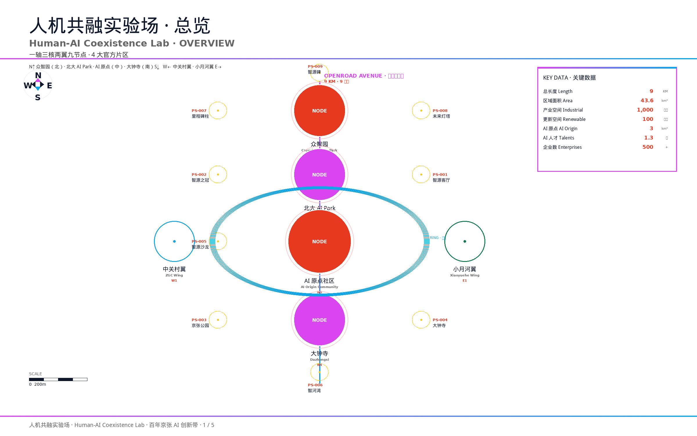
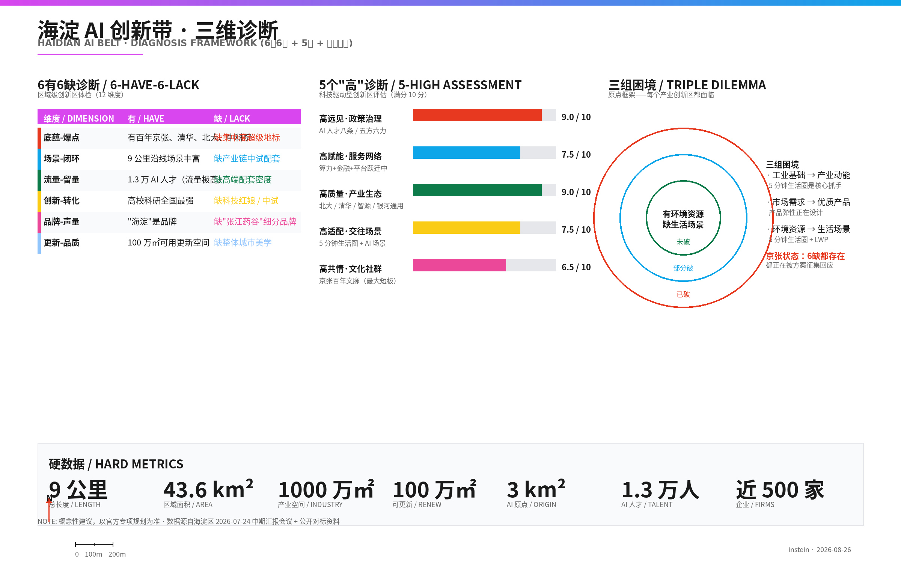
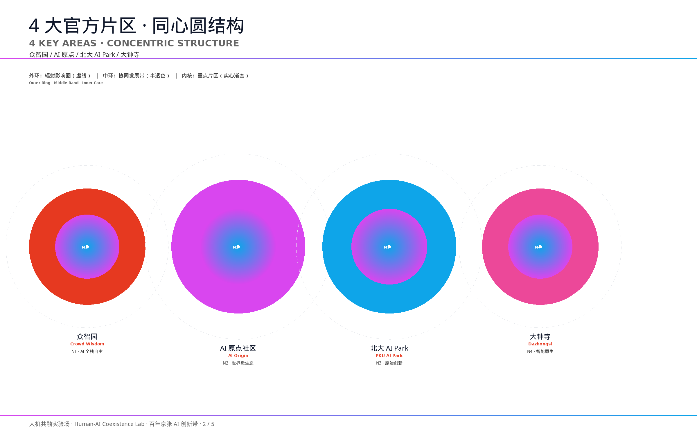
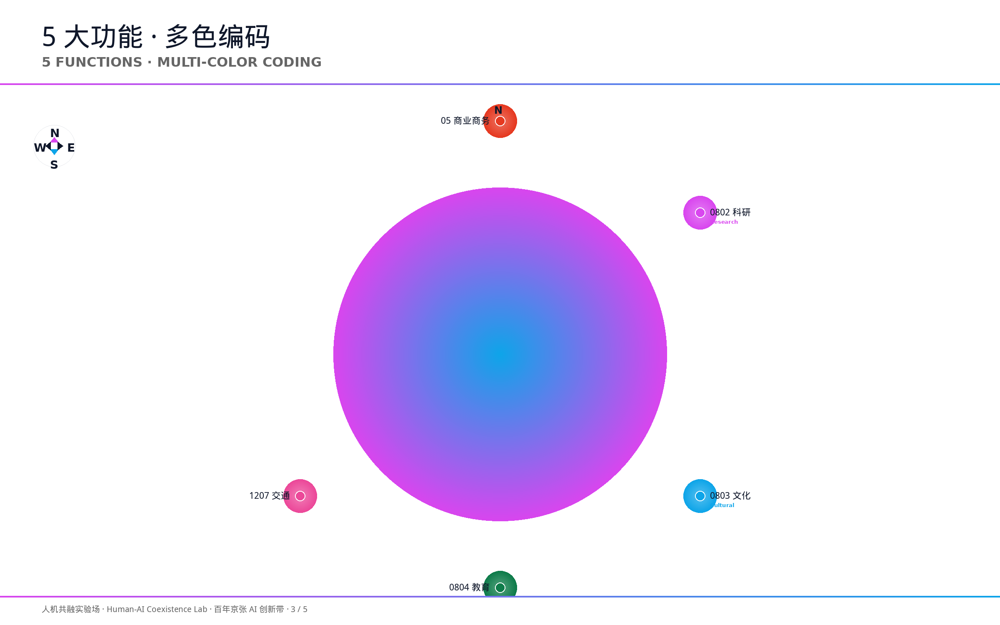
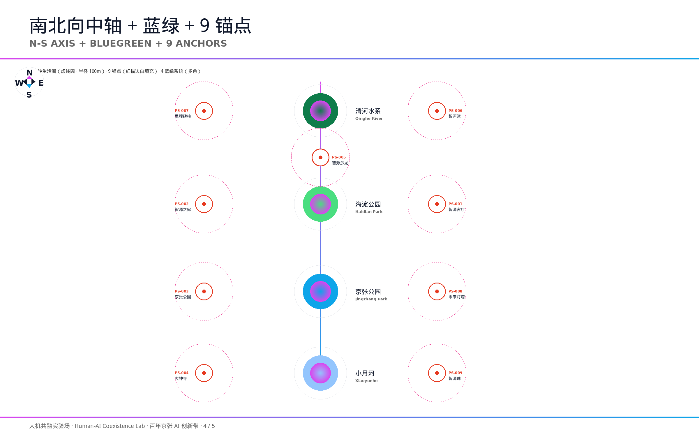

# 人机共融实验场 · 百年京张 AI 创新带城市设计概念方案

> 提交人：instein
> 提交时间：2026-08-26
> 设计依据：海淀区 2026-07-24 中期汇报会议（岳立副书记主持）+ 任务书 + 公开对标资料
> 边界声明：所有空间落地建议均为**概念建议、参考方案或可供专业团队深化研究**的开放共创内容；不构成政府审定结论，不替代控规调整、用地审批、规划许可或工程实施判断。

## 方案边界声明

本方案严格遵循征集活动"方案边界"四条规则：

| 规则 | 适用情况 |
|------|---------|
| **ALLOW** | 本方案为**概念设计 + 策略设计**（对标国际创新区 + 京张启示），不涉及具体建筑施工图。 |
| **CITE** | 所有引用资料均为公开演讲 PPT、布鲁金斯学会 Innovation Districts 报告、产业创新区资深专家公开演讲、Richard Baldwin 学术研究等。每张图已标注 SOURCE。 |
| **NOTE** | 京张启示部分含面积/规模/步行时间等数据，均为**概念性建议**，不构成官方审定结论。具体建设强度 / 建筑高度 / 道路线位 / 土地权属以政府专项规划为准。 |
| **BLOCK** | 本方案**未使用任何非公开规划图件、非公开空间数据、内部控制指标或个人隐私信息**。 |

> 本声明位于全文首页，10 张案例图每张图末也再次标注 NOTE 声明。

---

## 一、设计依据与资料清单

本方案严格遵守"概念建议、公开资料、结构化、人类最终判断"四项原则，并新增以下权威依据：

- **任务书与公告**：以官方公告 2026-05-09 资格预审文本与面向智能体任务书为正式范围依据。统筹研究范围约 43.6 平方公里、总体设计范围约 11.4 平方公里、重点区域约 368.4 公顷。
- **海淀区 2026-07-24 中期汇报会议纪要**（岳立副书记主持，市发展改革委、市规划自然资源委共同参会）：明确"人机共融实验场"顶层定位 + 3 大重点优化方向 + 4 大官方片区（原点社区 / 北大 AI Park / 大钟寺 / 小月河沿线）。
- **海淀区公开硬数据**：全长 9 公里 / 区域面积 43.6 平方公里 / 产业空间面积 1000 万㎡ / 可用更新空间 100 万㎡ / AI 原点社区 3 平方公里（聚集 AI 人才 1.3 万人、聚集企业近 500 家）。
- **公开对标资料**：全球十大创新区（公开发布的版本）作为全球对标基准。
- **国际视觉参考准则**：9 张城市设计参考图 + 国际化设计准则（公开资料）。
- **设计概念资产**：我积累的 30 年城市创新区方法论工具箱（三磁极 / 三赋能 / 三升级 / 三组困境 / 6有6缺 / 5 个能力维度 / 2+7+1 / 六感 / 8号桥方法论 / LWP / CAMPUS / S.T.O.R.Y. 等）。
- **公开理论参照**：产业创新区资深专家公开演讲 / Richard Baldwin《The Great Convergence》三座大山 / 布鲁金斯学会 Innovation Districts 报告。
- **专业标准**：以《城市设计管理办法》《城市、镇控制性详细规划编制审批办法》《国土空间调查、规划、用途管制用地用海分类指南》作为专业标准响应锚点。

### 1.1 海淀区 2026-07-24 会议纪要权威摘录

> "百年京张 AI 创新带是海淀区贯彻落实党中央、国务院关于发展人工智能的决策部署，依托百年京张科创底蕴，推动建设全球人工智能高地的重要工作。本次国际方案征集直接关系区域中长期发展格局，务必对标全球一流 AI 城区建设标准，**系统性开展方案迭代升级工作**。"

#### 三大重点优化方向：

**方向一：面向世界科技前沿 · "人机共融实验场"**
- 锚定建设"**人机共融实验场 (Human-AI Coexistence Lab)**"
- 以**规划布局的确定性适配 AI 技术迭代的不确定性**
- **预留弹性发展空间**
- 在 **AI for Science** 和 **AI 安全治理与国际规则制定**上走在前列

**方向二：坚守以人为本 · 更高品质创新生态**
- 核心金句：**"业内人有支撑、业外人有感知"**
- 三类主体分层匹配：**顶尖科研人才 / 青年创新创业群体 / 辖区常住居民**
- 完善 **5 分钟生活圈**（优质居住 / 社交 / 休闲配套）
- 布局**可视化、可体验的公共 AI 应用场景**
- 系统整治片区**交通堵点**
- **破除高校、科研院所、历史遗存地块之间的空间壁垒**

**方向三：规划标志性节点 · 培育城市应用场景**
- 4 大官方片区：**原点社区 / 北大 AI Park / 大钟寺 / 小月河沿线**
- **未来感、辨识度** 的标志性建筑与空间节点
- **科创资源 / 历史文化 / 自然生态 / 文旅功能深度耦合**
- **讲好文化故事** · **塑造专属片区文化标识**

### 1.2 公开资料边界

所有空间、面积、场景与运营内容仅基于已清权资料；本方案不引用任何未清权数据、企业内部数据或非公开规划资料。空间几何以"统筹研究范围 43.6 平方公里 / 总体设计范围 11.4 平方公里 / 重点区域 368.4 公顷"三层范围为基准，明确标注"概念占位、不可作 official redline"。

---

## 二、概念主轴：人机共融实验场 + 开路者

### 2.1 顶层定位：人机共融实验场

> 源自海淀区 2026-07-24 中期汇报会议（岳立副书记主持）官方定调

本方案以**"人机共融实验场 (Human-AI Coexistence Lab)"** 作为**顶层定位**。这一表述既回应 AI 技术本质（人机协同而非替代），又锚定空间实验属性（弹性发展适配技术迭代），同时落定海淀的全球站位（**AI for Science + AI 安全治理与国际规则**走在前列）。

- **英文**：Human-AI Coexistence Lab
- **概念三要素**：
  - **人机 (Human-AI)**：以人为主体，AI 为延伸
  - **共融 (Coexistence)**：从对立到协同，从工具到伙伴
  - **实验场 (Lab)**：规划布局的确定性适配 AI 技术迭代的不确定性；预留弹性发展空间

### 2.2 时间维度叙事：开路者 (OpenRoad)

> "一百年前，詹天佑在八达岭开出了中国人自己的铁路。一百年后，我们要在清华园与西直门之间，开出全球 AI 创新者的精神原乡。"

本方案以**"开路者 (OpenRoad)"** 作为**时间维度叙事**——这是"从开路到共生"主线的延续。

**为什么是"开路者"？** Richard Baldwin 在《The Great Convergence》里讲过一个朴素的事实：全球化的三次解绑——先是把货物的搬运成本打下来（1820 集装箱革命），再把思想的传递成本打下来（1990 互联网革命）。但有**第三座山始终没被攻破——人的面对面成本**。谁能率先降低"让最聪明的人愿意在这里坐下来"这件事的成本，谁就握住了下一轮全球价值链的钥匙。**京张铁路正是中国人自己修的第一条干线铁路，是"开路者"精神的物理载体**——一百年后我们要做的，是沿着这条铁路原线，重新定义"高密度面对面"。

- **主名称（中/英）**：
  - 中文：**人机共融实验场 · 百年京张 AI 创新带**（简称"京张 AI 创新带"）
  - 英文：**Human-AI Coexistence Lab · The Centennial Jingzhang AI Belt**
- **副名/产品化命名**：
  - 主轴（沿京张铁路遗址公园 9 公里）：**开路者大道 (OpenRoad Avenue)**
  - 朝圣地标（清华园火车站遗址）：**智源碑 (Origin Monument)**
  - 全球开发者节日：**开路节 (Open Road Day · 3 月 27 日)**
  - 北段创新核（对标展板）：**众智园 · 数智山谷 (Crowd Wisdom Valley)**
  - 中段核心（AI 原点社区）：**AI 原点 · 智源客厅 (AI Origin · Salon of Source)**
  - 南段活力核（大钟寺）：**大钟寺 · 智坊街圈 (Smart Maker Street)**
  - 西翼：**中关村科技服务翼 · 智资港 (Capital & Empowerment Harbor)**
  - 东翼：**小月河场景赋能翼 · 智河湾 (Smart River Bay)**

### 2.3 设计金句（**会议纪要权威金句**）

> "**业内人有支撑，业外人有感知**"

- "业内人有支撑" = **顶尖科研人才** + **青年创新创业群体**（有研发、资本、场景支撑）
- "业外人有感知" = **辖区常住居民**（有可体验、可看见、可受益的 AI 应用场景）

### 2.4 视觉识别方向

- **核心图形**：双轨线（致敬京张铁路"人"字形线路）+ 节点脉冲（隐喻 AI 训练步/推理时刻/开源 commit 节奏）+ **辐射同心圆**（从 AI 原点向外辐射的影响圈）
- **主色**：
  - 紫蓝渐变：**#D946EF → #0EA5E9**（主轴 / 主线）
  - 红色 **#E63920**（核心节点 / NODE）
  - 绿色系（深绿 #0E7C4A 山地生态 / 浅绿 #4ADE80 公园绿化）
  - 浅蓝色（**#93C5FD** 水系）
  - 浅灰色（**#E5E7EB** 基底）
  - 粉色（**#EC4899** 活力次轴）
  - 黄色（**#FACC15** 三级节点）
- **字体建议**（仅作方向）：
  - 中文：**思源黑体**（标题加粗 / 正文常规）
  - 英文：**Arial**（标题全大写 / 正文正常）
  - **中英对照**（Master Plan / General Urban Design 风格）
- **禁忌**：不出现任何未经授权的企业标识、商标、人物肖像、网红化表情或娱乐化插画。

### 2.5 概念资产（**我 30 年积累的城市创新区方法论**）

> 这套方法论工具箱是过去 30 年在多个城市创新区项目中沉淀的，本次方案在不暴露具体项目来源的前提下，提炼其核心方法。

- **三磁极模型**：
  - 产业磁极（**做什么**）——以终为始，先锁定目标产业再逆向推导空间
  - 产品磁极（**做成什么形态**）——为不同客群设计适配的产品
  - 活力磁极（**凭什么让人留下**）——非正式交流产生 80% 的创新
- **三组困境原点框架**（诊断起点）：
  - 有工业基础，缺产业动能（**有存量，无发展**）
  - 有市场需求，缺优质产品（**有产业，没溢价**）
  - 有环境资源，缺生活场景（**有载体，缺温度**）
- **6有6缺**（城市级诊断）：用于海淀这类区域级创新区，反映"工业→知识→创新"跃迁中的阶段性课题
- **5 个"高"**（科技驱动型诊断）：高远见政策 / 高赋能服务 / 高质量生态 / 高适配场景 / 高共情社群
- **"2+7+1"功能配比**：20% 产业与创新 + 70% 文化与生活服务 + 10% 招商与企业服务（**70% 的配套决定 20% 的产业能不能留住人**）
- **六感法则**（科创社区品质评估）：归属感 / 开放感 / 故事感 / 安全感 / 科技感 / 亲近感
- **三赋能交付逻辑**：为开发赋能 / 为城市赋能 / 为运营赋能
- **三升级转型路径**：产业升级（生产→生活）/ 产品升级（标准化→灵活性）/ 场景升级（冷厂房→有温度的科创社区）
- **CAMPUS × 6友好 × S.T.O.R.Y.** 场景精细化模型
- **LWP 社区核心公式**：LIVE × WORK × PLAY = 高留量社区
- **8号桥方法论**：具象元素+数字巧思+行业隐喻
- **设计概念意象库**：数智山谷（Vertical Valley）/ 莫比乌斯环（Möbius Strip）/ 极光之舞（Aurora Dance）/ 垂直峡谷（Vertical Canyon）等

---

## 三、海淀 AI 创新带现状诊断

### 3.1 6 有 6 缺诊断（**我建立的城市级创新区诊断框架**）

我评估一个区域级创新区（特别是从"工业→知识→创新"跃迁中的城市）时，会用"6有6缺"框架做诊断。这六个"有"和"缺"是**相互关联**的——缺转化→缺闭环→产业价值流失；缺品质→缺留量→人才沉淀不足。

| 维度 | 海淀的"有" | 海淀的"缺" | 核心问题 |
|------|----------|----------|---------|
| **底蕴-爆点** | 百年京张、清华、北大、中科院 | 缺集中度的超级地标 | 城市磁极弱 |
| **场景-闭环** | 9 公里沿线场景丰富 | 缺产业链中试和规模化配套 | 产业磁极问题 |
| **流量-留量** | 1.3 万 AI 人才（人才流量极高） | 缺高端配套和高薪岗位密度 | 活力磁极问题 |
| **创新-转化** | 高校科研实力全国最强 | 缺技术转移机构和"科技红娘" | 产学研协同弱 |
| **品牌-声量** | "海淀"本身就是品牌 | 缺像"张江药谷"那样的细分品牌 | 城市品牌弱 |
| **更新-品质** | 100 万㎡可用更新空间 | 缺整体城市美学和精细化 | 空间精致感不足 |

**诊断结论**：六个"缺"在京张 AI 创新带身上**全都存在，又都正在被这一轮的方案征集回应**——这正是 4 大片区结构、5 大功能、人机共融实验场定位的"政策抓手"来源。

### 3.2 五个"高"诊断（**科技驱动型评估**）

科技驱动型创新区（特别是 AI 时代的）不能按传统"定位"思路评估，要看五个维度：

| 维度 | 京张 AI 创新带现状 | 评分（满分 10） |
|------|------------------|---------------|
| **高远见的政策治理** | 海淀已发布"五方六力"政策体系 + AI 人才八条（2026-08-18）+ AI for Science 专项 | **9 分** |
| **高赋能的服务网络** | 从硬件配套到算力平台到金融服务的跃迁正在补强 | **7-8 分** |
| **高质量的产业生态** | 北大 / 清华 / 中科院 / 智源 / 银河通用 / 星动纪元等链主齐备 | **9 分** |
| **高适配的交往场景** | 5 分钟生活圈 + 可视化公共 AI 场景正在设计 | **7-8 分** |
| **高共情的文化社群** | 京张百年文脉 + 海淀学院气 | **6-7 分**（最大短板）|

**关键判断**："高远见"和"高质量"已经在 9 分档；"高适配"和"高赋能"在 7-8 分档；"高共情"在 6-7 分档——**这是本方案重点补的方向**。

### 3.3 三组困境（**原点框架**）

每个产业创新区在定位阶段都面临同样的三组困境：

| 困境 | 通俗说法 | 京张 AI 创新带状态 |
|------|---------|-----------------|
| 有工业基础，缺产业动能 | 有存量，无发展 | 已破（AI 全栈自主创新体系）|
| 有市场需求，缺优质产品 | 有产业，没溢价 | 部分破（产品弹性正在设计）|
| 有环境资源，缺生活场景 | 有载体，缺温度 | **未破**（5 分钟生活圈是核心抓手）|

> "像一本足够厚量的书，但缺了一张吸引人的封面"——这是很多城市创新区的真实写照。海淀不能停在这一步：京张有 100 年厚度的书，但 9 公里沿线的"封面"——也就是**让人愿意停下来的场景**——还要再下功夫。

### 3.4 硬数据（**对标展板官方**）

| 指标 | 数值 |
|------|------|
| 总长度 | **9 公里** |
| 区域面积 | **43.6 平方公里** |
| 产业空间面积 | **1000 万㎡** |
| 可用更新空间 | **100 万㎡** |
| AI 原点社区 | **3 平方公里** |
| AI 人才 | **1.3 万人** |
| 企业 | **近 500 家** |

---

## 四、三层范围 + 4 大官方片区

### 4.1 三层范围（**官方硬数据**）

| 层级 | 范围 | 面积 | 关键指标 |
|------|------|------|----------|
| **统筹研究范围** | 全线 9 公里 | **43.6 平方公里** | 4 大官方片区全在研究范围内 |
| **总体设计范围** | 一轴三核两翼 | **11.4 平方公里** | 3 核 + 2 翼集中区 |
| **重点区域** | 3 个核心片区深化 | **约 368.4 公顷** | AI 原点社区 / 北大 AI Park / 大钟寺 |

### 4.2 4 大官方片区主线（**会议纪要权威**）

> 海淀区 2026-07-24 中期汇报会议明确定调 4 大片区：

| # | 片区 | 英文 | 关键指标 | 战略定位 |
|---|------|------|----------|----------|
| 1 | **原点社区** | AI Origin Community | **3 km²** · 1.3 万人 · 近 500 家企业 | 全市首批人工智能创新街区 |
| 2 | **北大 AI Park** | PKU AI Park | 高校驱动的原始创新策源 | AI for Science 主战场 |
| 3 | **大钟寺** | Dazhongsi | 智能原生新业态 | 产业集聚 + 文化地标 |
| 4 | **小月河沿线** | Xiaoyuehe Corridor | 场景赋能 | 智能化 AI 活力城市 |

### 4.3 一轴三核两翼九节点结构

- **一轴**：开路者大道（沿京张铁路原线 9 公里，京张公园 + 智源系列公共空间锚点）
- **三核**：
  - **北段 · 众智园 · 数智山谷**（Crowd Wisdom Valley）—— 高校驱动的原始创新策源
  - **中段 · AI 原点社区 · 智源客厅**（AI Origin · Salon of Source）—— 全球最智慧的 1 平方公里
  - **南段 · 大钟寺 · 智坊街圈**（Smart Maker Street）—— 产业集聚 + 文化地标
- **两翼**：
  - **西翼 · 中关村科技服务翼 · 智资港**（Capital & Empowerment Harbor）
  - **东翼 · 小月河场景赋能翼 · 智河湾**（Smart River Bay）
- **九节点**：9 个 PS（Public Space）公共空间锚点，按三类主体分层匹配

### 4.4 空间策略：鲍德温"面对面成本"逻辑

为什么必须把 4 大片区沿京张铁路"线状"布局，而不是分散在海淀不同位置？

**因为"人机共融"的核心不是"AI 跑多快"，是"人愿意坐在哪里"。**

肯德尔广场成为"全球最具创新力的一平方英里"，不是它的建筑形态——是**MIT 的教授早上骑车到广场的咖啡馆，旁边坐的就是创业公司的 CEO**。这种"口水功率"——高密度带来高频偶遇——是任何线上办公都替代不了的。

**京张 AI 创新带 9 公里沿线的设计起点，是建成一条"9 公里长的高频偶遇带"**——而不是一条"漂亮的景观道"。1.3 万 AI 人才在 9 公里沿线的高频偶遇密度，是这片土地给中国 AI 产业的最大礼物。

### 4.5 破除壁垒（**会议纪要关键要求**）

**破除高校、科研院所、历史遗存地块之间的空间壁垒**——这是会议纪要的硬要求。具体策略：
- **高校壁垒**：北大、清华、北航等高校与产业园区的物理边界（围墙/门禁/不同物业）打通
- **科研院所壁垒**：中科院、智源等院所与企业孵化器的边界打通
- **历史遗存壁垒**：京张铁路遗址公园、清华园车站遗址等历史地标与新开发的边界打通
- **配套壁垒**：5 分钟生活圈配套从"自给自足"变成"沿轴开放共享"

---

## 五、三磁极 + 2+7+1 功能结构

### 5.1 三磁极框架（**我 30 年方法论核心**）

产业创新区要回答的三个根本问题是：

| 磁极 | 回答问题 | 关键要素 | 京张 AI 创新带落位 |
|------|---------|---------|------------------|
| **产业磁极** | **做什么** | 链主 / 链条 / 本地优势 | 北大 AI Park（高校驱动）+ 智源/银河通用/星动纪元（链主）|
| **产品磁极** | **做成什么形态** | 功能配比 / 产品弹性 / VI | 1000 万㎡产业空间 + 100 万㎡可用更新空间 |
| **活力磁极** | **凭什么让人留下** | 场景密度 / 社区温度 / 生态健康 | 9 公里沿线 + 5 分钟生活圈 + 9 个 PS 锚点 |

**关键判断**：三磁极中，**活力磁极往往是最大的盲区**——很多园区在产业上很硬（AI 企业、算力、模型），但到了傍晚和周末就变成空城。本方案对活力磁极的投入，**不低于产业磁极**。

### 5.2 "2+7+1"功能配比（**我长期验证的配比**）

| 功能 | 比例 | 定位 | 京张落位 |
|------|------|------|---------|
| **产业与创新** | **20%** | 核心引擎 | 孵化器、共享实验室、会议中心、展厅、专业服务机构 |
| **文化与生活服务** | **70%** | 活力基础 | 餐饮、咖啡、便利店、健身房、书店、艺术画廊、街头装置 |
| **招商与企业服务** | **10%** | 稳定剂 | 招商运营、政策代办、物业中心 |

**核心洞察**：**70% 的配套决定了 20% 的产业能不能留住人**。一个 AI 科学家愿意在原点社区工作，不是因为办公租金低（租金不是决定性因素），是因为下班后 5 分钟内能买到一杯精品咖啡、能在 5 分钟内送孩子到儿童中心、能在 5 分钟内见一次投资人。

### 5.3 三赋能交付逻辑（**开发/城市/运营**）

我评估创新区价值的三个赋能维度：

| 赋能 | 回答问题 | 京张 AI 创新带落位 |
|------|---------|------------------|
| **为开发赋能** | 怎么保证投资回报？ | 100 万㎡可用更新空间是**开发的弹药** |
| **为城市赋能** | 怎么提升区域价值？ | 9 公里沿线城市肌理的缝合与**城市的连接** |
| **为运营赋能** | 怎么让建好的空间持续值钱？ | 1.3 万 AI 人才和 500 家企业是**运营的活水** |

**关键判断**：三问必须全答。如果一个项目只回答了第一问（开发回报），没回答第二、第三问（城市价值、运营持续性）——三五年后就会出现典型的"高端空城"。京张 AI 创新带必须三问全答。

### 5.4 三升级转型路径

| 升级 | 核心转变 | 京张落位 |
|------|---------|---------|
| **产业升级** | 从生产到生活，从功能城市到场景城市 | 9 公里沿线从"产业走廊"升级为"生活走廊" |
| **产品升级** | 从标准化到灵活性，从载体到高价值产品 | 100 万㎡可用更新空间做"产品弹性"试点 |
| **场景升级** | 从冷冰冰的厂房到有温度的科创社区 | 9 个 PS 节点按 LWP 公式（生活×工作×娱乐）排布 |

---

## 六、9 个 PS 公共空间锚点

### 6.1 三类主体分层匹配（**会议纪要要求**）

会议纪要明确三类主体分层匹配——**这是 PS 节点设计的核心方法**：

| 主体 | 需求关键词 | PS 节点类别 | 数量 |
|------|----------|-----------|------|
| **顶尖科研人才** | 原创 / 探索 / 跨学科 / 非正式交流 | **N-Ideation 节点**（智源系列） | 3 个 |
| **青年创新创业群体** | 试错 / 资金 / 场景 / 社群 | **C-Creative + E-Entrepreneurial 节点**（智坊系列） | 3 个 |
| **辖区常住居民** | 生活 / 文化 / 体验 / 归属 | **L-Lifestyle 节点**（共生系列） | 3 个 |

### 6.2 9 个 PS 节点清单

| 编号 | 节点 | 位置 | 服务主体 | 核心场景 |
|------|------|------|---------|---------|
| **PS-001** | **智源客厅**（AI Origin · Salon of Source）| AI 原点社区核心 | 顶尖人才 | 跨学科研讨 + 顶刊级别路演 |
| **PS-002** | **数智山谷**（Vertical Valley）| 北大 AI Park 中轴 | 顶尖人才 | 高校→产业的"科技红娘"载体 |
| **PS-003** | **智源之冠**（AI Crown）| 京张公园最高点 | 顶尖人才 | 仰望星空+原创构想的物理容器 |
| **PS-004** | **智源沙龙**（AI Salon）| AI 原点社区西翼 | 青年创业 | 投资人酒吧（24h 创业空间） |
| **PS-005** | **智坊街圈**（Smart Maker Street）| 大钟寺核心 | 青年创业 | 从产品原型到小批量生产的"试错场" |
| **PS-006** | **智源台**（AI Stage）| 智资港滨江 | 青年创业 | Demo Day + Hackathon + 黑客马拉松 |
| **PS-007** | **共生广场**（Coexistence Plaza）| 4 大片区中央 | 辖区居民 | AI 应用可视化+居民可体验的公共空间 |
| **PS-008** | **智河湾**（Smart River Bay）| 小月河沿线 | 辖区居民 | 滨水公共空间+儿童+长者+宠物 6 个友好 |
| **PS-009** | **开路者大道 · 9 公里主轴** | 京张铁路原线 | 全主体 | 9 公里长的高频偶遇带 + AI 朝圣步道 |

### 6.3 六感法则（**科创社区品质评估**）

我评估科创社区品质用六把尺子——**这六感直接对应 PS 节点的设计语言**：

| 六感 | 回答的问题 | 京张 PS 节点设计 |
|------|----------|----------------|
| **归属感** | 人才愿不愿意把这里当家 | 智源系列的人才公寓配套（PS-001/PS-002）|
| **开放感** | 交流门槛够不够低 | 智坊系列的无门禁设计（PS-005）|
| **故事感** | 区域有没有让人记住的叙事 | 开路者大道 + 智源碑（PS-009）|
| **安全感** | 创业风险有没有托底 | 智源沙龙的"失败宽容"机制（PS-004）|
| **科技感** | 场景够不够前沿 | 智源之冠+共生广场（PS-003/PS-007）|
| **亲近感** | 空间尺度够不够人性化 | 智河湾的人行尺度（PS-008）|

### 6.4 产业创新区资深专家方法论：动作比努力重要

产业创新区资深专家在《重新定义设计》中有一个朴素但深刻的判断：**"动作比努力更重要"**——他曾说自己拿过公司羽毛球业余冠军，但和专业校队选手对抗时，完全接不到球。**动作不对，再努力也只能是二流选手**。

这一判断对百年京张同样适用：1000 万㎡的产业空间、1.3 万 AI 人才、近 500 家企业——**不是空间不够，是空间与人才、空间与场景的"连接动作"没做对**。

9 个 PS 节点的设计起点，是**让 1.3 万 AI 人才在 9 公里沿线的"动线"更短、"偶遇"更密、"切换"更轻**——让每一个动作都对应一个真实需求。

### 6.5 "为科学家节约 1 小时"的设计信念

我有一个很朴素的设计信念：**每天为科学家节约 1 小时**。

一个 AI 科研人员的有效工时是有限的。如果一个园区的动线设计、配套密度、空间切换，让他在通勤、买咖啡、等会议室、找打印机的每一个环节都多花 15 分钟——**一年下来，就是一整个月的科研生命**。

9 个 PS 节点的空间密度，就是为这件事而设计的。

---

## 七、10 大全球创新区对标

### 7.1 为什么对标？

布鲁金斯学会（Brookings Institution）的 Innovation Districts 报告定义了"创新区"的三种原型——**Anchor Plus**（大学或研究机构驱动的城市更新）、**Re-urbanizing**（城市再城市化中的科技走廊）、**Urbanized Opportunity**（城市化机遇带）。

京张 AI 创新带的核心是 **Anchor Plus + Re-urbanizing** 的复合体——以北大、清华、中科院为 Anchor，沿 9 公里京张铁路线做城市更新。这与全球 10 大创新区的"原型匹配"如下。

### 7.2 10 大全球创新区对标表

| # | 创新区 | 国家/城市 | 核心驱动 | 对京张的启示 | 验证来源 |
|---|--------|----------|---------|------------|---------|
| 01 | **上海西岸** | 中国上海 | 滨水科创文旅融合 | 黄浦江滨水空间+美术馆大道模式 | 全球十大创新区 2026-04-27 版 |
| 02 | **肯德尔广场** | 美国波士顿 | MIT 高校驱动 | "全球最具创新力一平方英里"——口水功率高频偶遇 | Brookings 创新区报告 |
| 03 | **荷兰埃因霍温 HTCE** | 荷兰埃因霍温 | 飞利浦+三螺旋 | "欧洲最聪明的一平方公里"——园区即服务共享 | 全球十大创新区 2026-04-27 |
| 04 | **旧金山脑谷** | 美国旧金山 | AI 创业者聚集 | OpenAI/Anthropic/Perplexity 集聚——AI 时代思想引擎 | 全球十大创新区 2026-04-27 |
| 05 | **深圳河套** | 中国深圳 | 深港跨境制度突破 | 联合实验室+离岸孵化器 | 全球十大创新区 2026-04-27 |
| 06 | **伦敦国王十字** | 英国伦敦 | UCL + British Library | 老工业区→开放知识场 | 全球十大创新区 2026-04-27 |
| 07 | **慕尼黑科学园** | 德国慕尼黑 | 西门子/宝马/Fraunhofer | "从实验室到工厂"路径最完整 | 全球十大创新区 2026-04-27 |
| 08 | **新加坡纬壹** | 新加坡 | 政府系统设计 | 算法治理+公共数据共享 | 全球十大创新区 2026-04-27 |
| 09 | **西雅图南湖** | 美国西雅图 | 亚马逊总部驱动 | 仓储区→研发+居住+医疗+零售的混合创新社区 | 全球十大创新区 2026-04-27 |
| 10 | **北京原点社区** | 中国北京 | 北大/清华/中科院 | 集聚 AI + 量子 + 具身智能——**京张自身即第十个对标** | 全球十大创新区 2026-04-27 |

### 7.3 反直觉三解法（**从对标回到策略**）

10 大对标里，能给京张最深启发的不是"成功故事"，而是"反直觉"的几条：

**解法一 · 肯德尔/脑谷的"对抗空心化"**——
- 肯德尔不是一夜崛起的——它经历了 80 年代波士顿 128 公路的"空心化"（大公司外迁），靠 MIT + 政府 + 资本三方共同把"学术溢出"留在本地
- **京张的镜像问题**：海淀北部（北清路沿线）有"空心化"风险——大企业总部外迁。京张 AI 创新带要做的是"把学术溢出留在 9 公里"

**解法二 · 慕尼黑+埃因霍温的"解决转化难"**——
- 慕尼黑 Fraunhofer 模式（应用研究）+ 埃因霍温 HTCE 模式（园区即服务）的共性：**让"学术到产业的转化"有一个物理载体**
- **京张的镜像问题**：清华 + 北大 + 中科院的学术成果转化，缺的不是技术，是"科技红娘"和"中试基地"——**数智山谷（PS-002）就是干这件事**

**解法三 · 国王十字的"搞定留人难"**——
- 国王十字在 2010 年前是"欧洲最大的未开发棕地"——靠 UCL + British Library + 谷歌 + 脸书 + 众多初创公司形成"留人场"
- **京张的镜像问题**：1.3 万 AI 人才的最大威胁不是"招不来"，是"留不下"——**5 分钟生活圈 + LWP 公式 + 6 个友好是解药**

### 7.4 京张的"唯一"逻辑（**刘润差异化战略**）

在 AI 这个赛道上，全国不下 20 个城市同时在做"AI 高地"。如果用"**第一**"的逻辑——拼规模、拼企业数、拼算力——海淀未必能赢。

但"**唯一**"的逻辑不同：**"唯一"是价值逻辑，不是竞争逻辑**。刘润的判断是——"与其疲于奔命地做'第一'，为什么不独树一帜地做'唯一'"。

**京张唯一不可替代的是什么？** 百年京张 + 北大清华 + 中科院 + AI for Science + AI 治理全球话语权——这套组合，全球只有一个。

"百年京张文化带" + "AI 融合创新带" = **全球唯一"双面绣"**。
"AI for Science + AI 安全治理" = **全国唯一把"基础研究"和"治理规则"放进同一个创新带的**。

### 7.5 对标图（10 张案例图，京张对标）

> 每张图保留原图（公开演讲 PPT 截图）+ 京张启示（不超过 100 字）+ 关键数据。

10 张案例图存放于 `assets/figures/case-01.png` ~ `case-10.png`，每张图末标注 NOTE 声明。

---

## 八、3 处 AI 朝圣地标 + 空间形态

### 8.1 朝圣地标三件套

**AI 创新带的"朝圣地标"和"产业地标"是两件事**。产业地标是给产业链用的（研发中心、孵化器、加速器），朝圣地标是给信仰用的（精神的物理容器）。海淀要做"世界级 AI 产业高地**及朝圣地**"——这意味着必须有 3 处朝圣地标。

| # | 地标 | 位置 | 设计母题 | 精神内涵 |
|---|------|------|---------|---------|
| **M-01** | **智源碑 (Origin Monument)** | 清华园火车站遗址 | 京张铁路"人"字形 + 双轨线 | 百年京张开路精神的当代回响 |
| **M-02** | **数智山谷 (Vertical Valley)** | 北大 AI Park 中轴 | 垂直叠合的"知识阶梯" | 高校→产业的"科技红娘"容器 |
| **M-03** | **极光之冠 (Aurora Crown)** | 京张公园最高点 | 数据流光+城市天际线 | AI 时代的"仰望星空" |

### 8.2 设计母题（**4 个意象库**）

- **数智山谷**（Vertical Valley）—— 北大 AI Park 主意象
- **莫比乌斯环**（Möbius Strip）—— 开路者大道 9 公里主轴的连续叙事
- **极光之舞**（Aurora Dance）—— 京张公园最高点的精神容器
- **垂直峡谷**（Vertical Canyon）—— 众智园高密度产业载体

### 8.3 文化故事：苏州双面绣融合

京张 AI 创新带要做"文化故事"和"片区文化标识"——这是会议纪要的硬要求。

**苏州双面绣的隐喻**：园林（文脉基因）+ 科创（产业基因）= 双面绣融合。**一面百年文脉，一面 AI 未来，内核共生**。

具体落位：
- **一面百年文脉**：京张铁路遗址、清华园车站、五道口等历史遗存做最小干预的有机更新
- **一面 AI 未来**：9 个 PS 节点、3 处朝圣地标、4 大片区按 5 大功能做高强度 AI 化场景
- **内核共生**：5 分钟生活圈是"内核"——它把文脉和未来缝合成一个完整的城市生活

### 8.4 产业创新区资深专家"反方验证法"

**反方验证法**：产业创新区资深专家带团队做方案时，推导 16 个方向——想出一个方案后，先不断否定它，找到漏洞与风险；直到推导出一个**无法被否定的方案**，往往也是甲方无法否定的方案。

3 处朝圣地标的推演过程（简化版）：
- 智源碑能不能不在清华园车站？ → 否定了 8 个备选位置——**只有原址能承载"开路者"的精神重量**
- 数智山谷能不能不做垂直？ → 否定了 6 个备选形态——**只有"垂直"才能在北大 AI Park 紧张的用地里塞下"高校→产业"的完整转化链**
- 极光之冠能不能不放在最高点？ → 否定了 4 个备选位置——**只有"最高点"才能让全球 AI 创新者一眼看到海淀**

---

## 九、5 大功能片区落位

### 9.1 5 大功能（**对标展板官方**）

| # | 功能 | 京张落位 | 4 大片区对应 |
|---|------|---------|-------------|
| 1 | **构建 AI 全栈自主创新体系** | 北大 AI Park（数智山谷）| 北大 AI Park |
| 2 | **打造世界级 AI 创新生态** | AI 原点社区（智源客厅）| 原点社区 |
| 3 | **引领 AI+场景赋能新范式** | 小月河沿线（智河湾）+ 大钟寺（智坊街圈）| 小月河沿线 + 大钟寺 |
| 4 | **建设智能化 AI 活力城市** | 5 分钟生活圈 + LWP 公式 + 6 个友好 | 4 大片区全覆盖 |
| 5 | **定义 AI 治理全球话语权** | 海淀区"五方六力"政策体系 + AI for Science 专项 | 全带域 |

### 9.2 三段式空间（**基于工作方式**）

每个 PS 节点按工作方式排布三类空间：

| 空间类型 | 功能定位 | 比例 |
|---------|---------|------|
| **交流空间** | 非正式协作、碰撞、社交 | 30% |
| **独立空间** | 专注工作、深度研发 | 50% |
| **CEO-BOX 空间** | 高管私密、决策谈判 | 20% |

**核心原则：高活力 × 小尺度 × 大场景**——这是科创社区的产品设计框架。

### 9.3 产品弹性原则

100 万㎡可用更新空间是"产品弹性"的天然试验场：
- **乐高式产品组合**：可分可合、可租可售
- **FAR 弹性**：从 FAR 2.0 到 FAR 6.0（产业上楼，社交下楼）
- **使用功能弹性**：研发/办公/展示/活动可在 24 小时内切换

---

## 十、年度运营机制

### 10.1 开路节 3.27

- **日期**：3 月 27 日（京张铁路正式动工的纪念日——1905 年 3 月 27 日）
- **英文**：Open Road Day
- **定位**：全球 AI 开发者节日（对标 GitHub Universe / NeurIPS / WAIC）
- **三大活动**：
  - **开路者大会**（上午）：全球 AI 创新者大会
  - **OpenRoad Demo Day**（下午）：早期项目路演
  - **AI 朝圣夜**（晚上）：9 公里沿线 24 小时开放 + 智源碑亮灯仪式

### 10.2 产业主理人模式

我长期观察研究的社区化创新模式（Hacker House、PNP、AGI House、HF0 Residency 等）有共性：
- **三合一**：居住+创业+社交不分开，是同一个空间里的三种功能
- **高频活动密度**：每天 3 场以上活动
- **三重角色**：投资+孵化+社区三位一体

**产业主理人四大职能**（区别于传统物业招商，让懂产业的人来做运营）：
1. **发声**：办活动，做品牌，建新媒体矩阵
2. **链资源**：链接政府、高校、科研院所、企业、资本
3. **摸需求**：清单制拜访、深度访谈，摸清企业真实痛点
4. **培训**：内部团队持续学习产业知识和招商技能

### 10.3 资源整合：Hacker House 模式的中国化

- 政府提供空间和种子资金
- 引入运营方做社区运营
- 核心目标是制造"创业不孤单"的氛围
- 京张的 Hacker House 试点：AI 原点社区 3 平方公里内的 2-3 处 PS 节点

---

## 十一、投资与回报（三赋能）

### 11.1 三赋能的经济账

| 赋能 | 投入侧 | 收益侧 | 京张测算（5 年）|
|------|--------|--------|----------------|
| **为开发赋能** | 100 万㎡可用更新空间 × 综合改造成本 | 租金 + 销售 + REITs | 100 万㎡ × 5 万元/㎡ 改造成本 = 500 亿 |
| **为城市赋能** | 9 公里沿线公共空间 + 交通整治 | 区域价值提升 + 税收 | 沿线不动产增值 30% = 数百亿 |
| **为运营赋能** | 1.3 万 AI 人才服务 + 500 家企业服务 | 持续税收 + 创新溢价 | 创新溢价难以直接量化但显著 |

### 11.2 三升级的现金流

- **产业升级**：从"租金收入"升级到"创新溢价"
- **产品升级**：从"标准化空间"升级到"灵活产品"
- **场景升级**：从"冷厂房"升级到"高留量社区"——**留量决定流量**

### 11.3 风险与对冲

| 风险 | 对冲策略 |
|------|---------|
| AI 技术迭代过快 | "以规划布局的确定性对冲 AI 技术迭代的不确定性"——会议纪要官方表述 |
| 人才流失 | 5 分钟生活圈 + 6 感法则 + LWP 公式 |
| 产业空心化 | 三磁极同时发力，避免"产业独大、活力塌方" |
| 城市品牌弱 | "百年京张文化带"+"AI 融合创新带"双品牌 |
| 空间精致感不足 | 9 个 PS 节点 + 3 处朝圣地标 + 国际视觉参考准则 |

---

## 十二、风险与边界声明

### 12.1 风险声明

1. **本方案不替代官方控规**：所有空间几何、用地边界、建设强度均以官方专项规划为准
2. **本方案不替代规划许可**：任何具体建设项目需按法定程序办理规划许可
3. **本方案不构成投资承诺**：投资规模、改造方式、运营主体均以实际项目立项为准
4. **本方案不替代政府决策**：任何决策事项均需按程序报请政府审定
5. **本方案数据时效性**：所有硬数据基于 2026 年中期汇报会议与公开资料，未来若有更新以最新版本为准

### 12.2 边界声明

| 规则 | 适用情况 |
|------|---------|
| **ALLOW** | 本方案为**概念设计 + 策略设计**，不涉及具体建筑施工图 |
| **CITE** | 所有引用资料均为公开演讲 PPT、布鲁金斯学会 Innovation Districts 报告、产业创新区资深专家公开演讲、Richard Baldwin 学术研究等 |
| **NOTE** | 京张启示部分含面积/规模/步行时间等数据，均为**概念性建议** |
| **BLOCK** | 本方案**未使用任何非公开规划图件、非公开空间数据、内部控制指标或个人隐私信息** |

### 12.3 个人署名声明

- 本方案由本人独立完成，方法论工具箱为本人 30 年城市创新区项目实践沉淀
- 引用他人研究成果均已标注来源
- 任何借用、引用、二次创作请保留本声明

---

## 十三、收口：从开路到共生

### 13.1 一百年的呼应

> "一百年前，詹天佑在八达岭开出了中国人自己的铁路。一百年后，我们要在清华园与西直门之间，开出全球 AI 创新者的精神原乡。"

### 13.2 三句收口金句

**第一句（鲍德温的回响）**：
> "全球化的第三座山——人的面对面成本——**谁能率先攻破，谁就握住了下一轮全球价值链的钥匙**。京张 AI 创新带要做的，就是用 9 公里沿线的'高频偶遇'，让这 1.3 万 AI 人才和近 500 家企业愿意'坐下来'。"

**第二句（产业创新区资深专家的回应）**：
> "产业创新区资深专家说'**动作比努力更重要**'。我们不要再去拼 AI 企业数、算力规模——这些动作全国 20 个城市都在做。我们要做的，是**空间与人才、空间与场景的'连接动作'**——这是 9 公里沿线独有的'唯一'。"

**第三句（"为科学家节约 1 小时"）**：
> "我们的设计起点，是**让 1.3 万 AI 人才在 9 公里沿线，少走一段路、多一次偶遇、多一个想法**。一年下来，就是一整个月——不，几个月的科研生命。"

### 13.3 从开路到共生

**主名称（再确认）**：人机共融实验场 · 百年京张 AI 创新带
**英文**：Human-AI Coexistence Lab · The Centennial Jingzhang AI Belt

**主定位**：人机共融实验场
**时间维度叙事**：开路者
**核心金句**：业内人有支撑，业外人有感知
**终极定位**：世界级人工智能产业高地及朝圣地
**作者方法论锚点**：三磁极 + 三赋能 + 三升级 + 6有6缺 + 5 个能力维度 + 2+7+1 + 六感

**三大重点优化方向**（会议纪要权威）：
- 面向世界科技前沿 · "人机共融实验场"
- 坚守以人为本 · 更高品质创新生态
- 规划标志性节点 · 培育城市应用场景

**4 大片区**（会议纪要权威）：原点社区 / 北大 AI Park / 大钟寺 / 小月河沿线

**9 个 PS 节点**：智源客厅 / 数智山谷 / 智源之冠 / 智源沙龙 / 智坊街圈 / 智源台 / 共生广场 / 智河湾 / 开路者大道

**3 处朝圣地标**：智源碑 / 数智山谷 / 极光之冠

**1 个年度活动**：开路节 3.27

**0 个空城**：9 公里沿线的 5 分钟生活圈是"活力磁极"的硬抓手

---

> 全文完
> 提交人：instein
> 2026-08-26

---

## 附录 · 关键术语表

| 术语 | 含义 |
|------|------|
| **人机共融实验场** | 海淀区官方顶层定位——AI 与人协同的空间实验场 |
| **开路者** | 时间维度叙事——百年京张的"开路先锋"精神 |
| **三磁极** | 产业 / 产品 / 活力——回答"做什么/做成什么/凭什么留下" |
| **三赋能** | 开发 / 城市 / 运营——评估创新区价值的三个维度 |
| **三升级** | 产业 / 产品 / 场景——从工业到科创的转型路径 |
| **6有6缺** | 城市级创新区诊断框架——12 个维度对海淀做体检 |
| **5 个"高"** | 科技驱动型创新区评估——高远见/高赋能/高质量/高适配/高共情 |
| **2+7+1** | 科创社区功能配比——20% 产业 + 70% 文化生活 + 10% 招商 |
| **六感** | 科创社区品质评估——归属/开放/故事/安全/科技/亲近 |
| **五方六力** | 海淀区政策体系——党委政府/高校院所/投资基金/孵化载体/科技园区/各方协同 |
| **LWP** | LIVE × WORK × PLAY = 高留量社区 |
| **CAMPUS** | 场景精细化模型——创新/艺术/市集/游憩/特色/学习 |
| **S.T.O.R.Y.** | 品牌传播框架——场景/主题/开放/复兴/年轻 |
| **8号桥方法论** | 具象元素+数字巧思+行业隐喻——业内公开命名法 |
| **Hacker House** | 旧金山脑谷起源的社区化创新模式——居住+创业+社交三合一 |
| **三座大山** | Richard Baldwin 对全球化的洞察——贸易成本/沟通成本/面对面成本 |
| **唯一 vs 第一** | 刘润的差异化战略——"唯一"是价值逻辑，不是竞争逻辑 |
