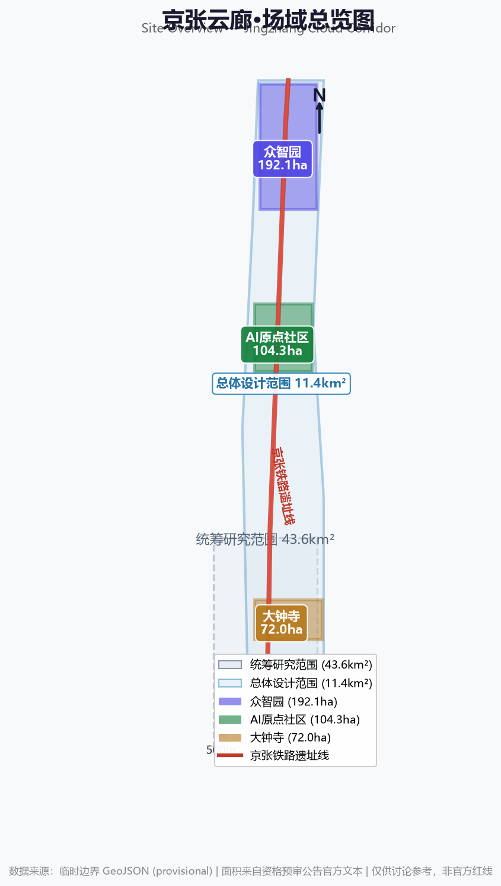
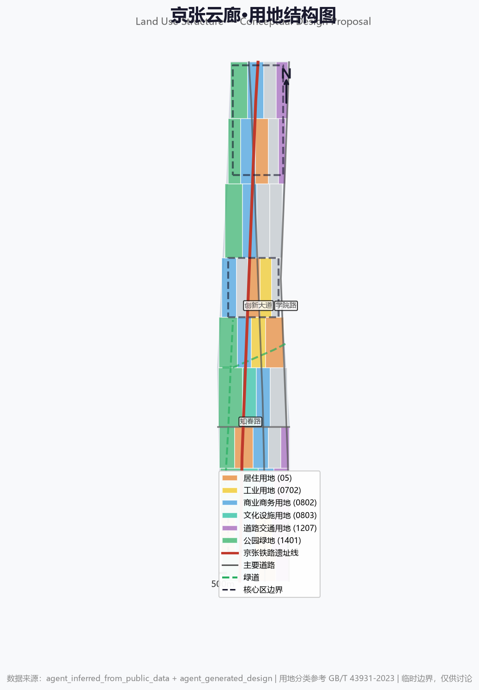
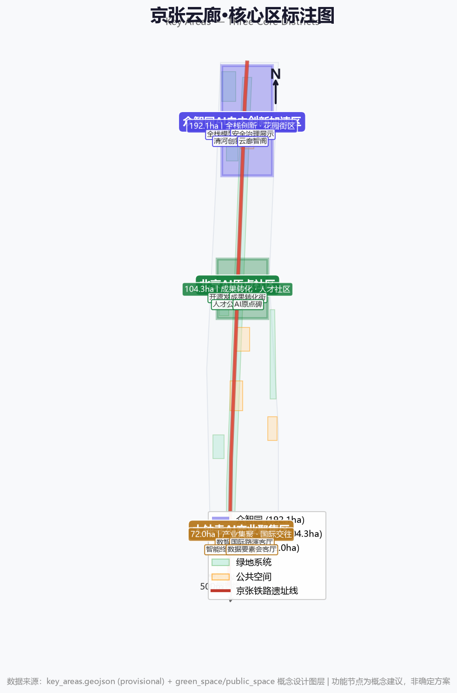
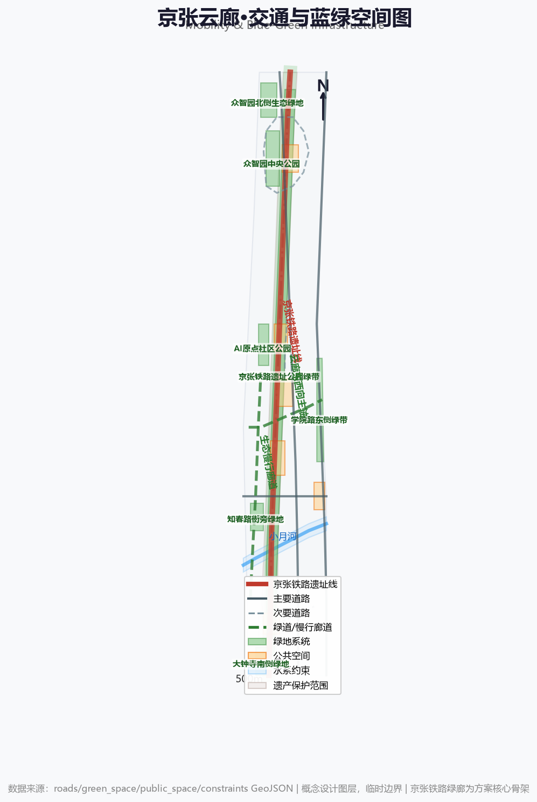
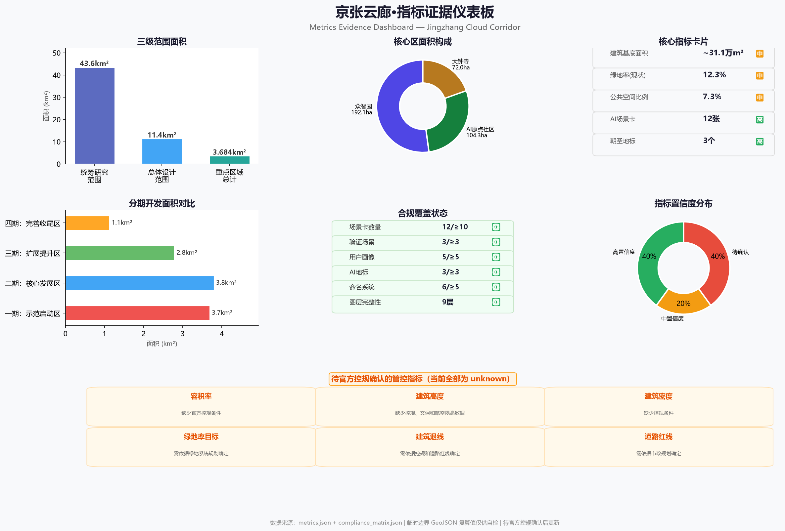

# 京张云廊·智创百年

## 声明

**本方案为AI Agent生成概念方案，仅供讨论参考。** 所有内容均为开放共创建议，不替代专业规划，不构成政府审定结论。方案中所有空间落地建议表述为"概念建议""参考方案"或"可供专业团队深化研究"。本方案不声称官方批准、审定控规、最终土地权属、最终建设规模或保证实施。

本方案遵循面向智能体任务书的十项共创原则：公共利益优先、公开资料边界、概念建议属性、AI原生创新、结构化与可读并重、生成方法披露、人类最终判断、公共知识沉淀、贡献可记忆、人本治理。[standard:PROJECT-AGENT-OPEN-CALL-TASKBOOK]

---

## 第一章 设计依据与资料清单

### 1.1 设计意图

本方案响应北京市规划和自然资源委员会海淀分局发布的《百年京张AI创新带城市设计国际方案征集》，以AI Agent协作方式探索海淀区核心创新带的空间形态、产业生态和文化品牌。方案不是独立愿景文本，而是从公告、面向智能体任务书、专业标准、临时边界和处理资料包出发，组织可追溯、可复核、可人工评审的结构化成果。

### 1.2 来源清单

本方案的设计依据分为三个层次：

**第一层：官方公告与权威来源**

| 来源编号 | 名称 | 发布机构 | 用途 |
|---------|------|---------|------|
| [source:SRC-2026-BJ-GH-QUAL-PREANNOUNCEMENT] | 资格预审公告 | 北京市规自委海淀分局 | 项目名称、三层范围面积、文字四至、设计任务 |
| [source:SRC-2017-MOHURD-URBAN-DESIGN-MEASURES] | 城市设计管理办法 | 住建部 | 城市设计深度与风貌管控原则 |
| [source:SRC-MOHURD-CONTROL-DETAILED-PLANNING] | 控规编制审批办法 | 住建部 | 控规深度参考与管控边界 |
| [source:SRC-2023-MNR-LAND-USE-CLASSIFICATION] | 用地用海分类指南 | 自然资源部 | 用地分类术语与编码参考 |

**第二层：经清权的任务来源**

| 来源编号 | 名称 | 用途 |
|---------|------|------|
| [source:SRC-2026-0518-AGENT-OPEN-CALL-TASKBOOK] | Agent任务书摘录 | 六项agent任务、共创原则、禁止越界条款 |
| [source:SRC-2026-BJ-KW-THREE-AREAS-WINGS] | 三区两翼打造世界级AI集聚地 | 产业背景与协同关系 |
| [source:SRC-2026-HAIDIAN-1X1] | 海淀"1+X+1"产业体系 | AI产业定位参考 |

**第三层：临时空间参考与仓库整理资料**

| 来源编号 | 名称 | 限制 |
|---------|------|------|
| [source:SRC-PROVISIONAL-BOUNDARIES-2026] | 临时粗略边界polygon | 仅供方案生成和自检，非官方红线 |
| [source:SITE-PACKAGE] | 设计任务包 | 仓库维护者整理，非官方规划文件 |
| [source:SOURCE-REGISTRY] | 来源登记簿 | 资料可用性登记 |
| [source:PROCESSED-FACT-PACK] | Agent事实包 | 导航层，不新增权威来源 |

### 1.3 数据缺口说明

当前公开资料包存在以下关键缺口，本方案在对应章节中逐一标注：

- **官方精确边界**：仅有文字四至和临时推导polygon，无官方测量红线
- **控规指标**：容积率、建筑高度、建筑密度、绿地率、退线全部缺失
- **市政与工程数据**：道路红线、管线、能源容量、排水、消防条件缺失
- **权属信息**：土地权属和地块产权信息未提供
- **文保控制线**：文物保护范围和建设控制地带的具体界线未提供

上述缺口已记录于 `assumptions.json`，并在 `metrics.json` 中将对应指标标记为 `unknown`。[source:PROCESSED-FACT-PACK]

---

## 第二章 三层范围工作框架

### 2.1 设计意图

方案按照公告确定的三个层次组织工作，每一层承担不同的设计深度和证据要求。三层范围不是互相割裂的图纸集合，而是从战略研究到详细设计的递进验证过程。[source:SRC-2026-BJ-GH-QUAL-PREANNOUNCEMENT]

### 2.2 统筹研究范围：43.6km²

**范围描述**：北至北五环路，东至京藏高速，南至西直门外大街，西至万泉河路。[metric:site_area_coordinated_sqm]

**设计任务**：在43.6平方公里的尺度上研究AI创新生态的宏观组织逻辑。核心问题包括：海淀高校院所、头部企业、算力算法数据要素如何形成协同网络？创新链从基础研究到产业转化需要怎样的空间承载？AI产业高地与北纬社区、未来科学城、怀柔科学城、经开区之间如何形成区域创新协同？

**数据支撑**：本层分析主要依赖 [source:SRC-2026-BJ-KW-THREE-AREAS-WINGS] 的三区两翼产业背景、[source:SRC-2026-HAIDIAN-1X1] 的产业体系定位，以及公开的行业报告和学术文献。

**数据缺口**：缺少区域层面的产业用地供给数据、企业注册分布和人才流动数据，产业生态分析只能基于公开政策文本和行业趋势推断。

### 2.3 总体设计范围：11.4km²

**范围描述**：以京张遗址公园周边1-2公里的城市地区和产业区为规划设计范围；北至北五环路，东至学院路、西土城路等，南至西直门外大街，西至大钟寺东路、荷清路等。[metric:site_area_overall_sqm]

**设计任务**：在11.4平方公里的尺度上形成城市更新总体框架、产业空间布局、交通市政支撑和城市风貌控制。要求达到控制性详细规划的城市设计深度。[standard:PROJECT-OFFICIAL-ANNOUNCEMENT]

**空间证据**：[data:geometry/site_boundary.geojson#PROV-SITE-001] 提供临时边界参考。用地结构、建筑基底、道路网络和绿地系统图层均在此范围内生成。

**数据缺口**：临时边界由公告文字四至推导，可能与实际官方边界存在偏差。用地分类为概念建议，建筑基底基于公开数据推断。

### 2.4 重点设计范围：3.68km²（三个核心区）

**范围描述**：自北向南包括众智园AI自主创新加速区（192.1ha）、北京AI原点社区（104.3ha）、大钟寺AI产业聚集区（72.0ha）。[metric:key_area_total_sqm]

**设计任务**：在三处重点区域达到规划综合实施方案深度，明确功能业态、建筑规模、拆改留分类、公共空间连通和交通组织。[source:SRC-2026-BJ-GH-QUAL-PREANNOUNCEMENT]

**空间证据**：[data:geometry/key_areas.geojson#PROV-KEY-001]、[data:geometry/key_areas.geojson#PROV-KEY-002]、[data:geometry/key_areas.geojson#PROV-KEY-003]

**数据缺口**：三个核心区的精确边界待官方确认。控规指标全部缺失，建筑规模只能为概念估算。

---

## 第三章 总体概念与品牌方向（agent.1）

### 3.1 设计意图

"京张云廊"不是一个营销口号，而是对这条创新带空间特质和历史纵深的结构性提炼。本节需要回答三个问题：这条带的空间逻辑是什么？它的名字从何而来？它的视觉识别如何传达这种逻辑？

### 3.2 "京张云廊"的含义与由来

**"京张"**——取自京张铁路。1909年，詹天佑主持修建的京张铁路是中国第一条自主设计建造的铁路，标志着中国工程自主创新的起点。这条铁路从丰台柳村起，经西直门、清河、沙河、南口，穿越居庸关到达张家口，其中穿越八达岭的"人"字形线路成为中国工程史上的经典符号。117年后的今天，同一条走廊上正在发生另一场自主创新——人工智能。京张遗址公园保留了铁路的历史记忆，而两侧的高校、科研院所和科技企业则构成了当代创新的物理载体。

**"云廊"**——"云"取自云计算、云端智能，也暗示这条创新带如同一条漂浮于历史与现实之间的空中走廊，连接过去与未来。"廊"既是空间类型（线性公共空间、绿色廊道、慢行通道），也是功能结构（产业走廊、知识传播通道、国际交流路径）。京张遗址公园本身就是一条线性公园——它的空间形态天然适合成为一条"廊"，将沿线的高校、社区、企业和公共空间串联为有机整体。

**"智创百年"**——从1909年到2026年，跨越117年的自主创新精神传承。不是简单的历史致敬，而是提出一个核心命题：当AI重新定义生产力、城市形态和生活方式时，这条承载着中国自主创新基因的走廊，能否成为下一个百年的创新原点？

### 3.3 视觉识别与Logo方向

**概念描述**（非最终设计，仅供专业团队深化参考）：

Logo的核心意象是"铁轨与电路的叠加"。京张铁路的铁轨截面（工字形钢轨）与集成电路的走线在形态上具有惊人的相似性——两者都是信息/能量的传输通道。Logo以极简的几何线条将铁轨横截面与电路节点融合，形成一个既像铁轨断面又像芯片引脚的抽象符号。

色彩方向：主色调取京张铁路历史照片中的铁锈色（#8B4513附近）与当代AI技术的冷蓝色（#1E90FF附近），形成"暖历史-冷未来"的色彩对话。辅助色取京张遗址公园的植被绿和清河的水蓝。

字体方向：中文字体建议使用具有工程感的黑体变体（笔画末端带有微弱的机械倒角），英文字体建议使用等宽字体（呼应代码和电报的双重历史）。

### 3.4 命名体系

以下六组命名建议构成完整的空间命名系统，每组包含主名称、英文对照和命名逻辑：[standard:PROJECT-AGENT-OPEN-CALL-TASKBOOK]

| 组别 | 命名对象 | 中文名称 | 英文名称 | 命名逻辑 |
|------|---------|---------|---------|---------|
| 1 | 一带主名称 | 京张云廊 | Jingzhang Cloud Corridor | 历史+空间+技术的三重意象 |
| 2 | 众智园 | 众智园·自主加速谷 | Zhongzhiyuan · Autonomous Acceleration Valley | "众智"取自群智涌现，"自主"呼应全栈自主创新 |
| 3 | AI原点社区 | 原点社区·启智坊 | Origin Community · Genesis Quarter | "原点"既是铁路里程起点，也是创新策源 |
| 4 | 大钟寺 | 大钟寺·数智港 | Dazhongsi · Digital Intelligence Port | 古刹钟声与数字脉冲的时空对话 |
| 5 | 京张遗址公园活力带 | 百年智脉 | Centennial Intelligence Spine | 铁路遗址作为创新带的公共空间骨架 |
| 6 | 核心地标群 | 云廊三章 | Three Chapters of Cloud Corridor | 三个地标分别对应"源起""加速""汇聚" |

### 3.5 一带三段叙事结构

京张云廊的空间叙事以京张遗址公园为轴，自南向北形成三个段落，每一段对应不同的创新阶段和空间气质：

**南段·源起（大钟寺片区）**——从西直门方向进入，大钟寺是来者最先触及的区域。这里是产业集聚与城市交往的界面，古刹的历史厚重感与AI产业的未来感形成张力。空间气质是"汇聚"——企业、资本、人才和国际访客在此交汇。

**中段·加速（AI原点社区）**——向北进入高校密集区，这是创新链中最活跃的"策源"段落。清华、北大等高校的智力资源在这里与产业转化空间直接碰撞。空间气质是"涌现"——开源社区、孵化空间、成果转化街和人才公寓交织成一个高密度的创新生态。

**北段·自主（众智园）**——到达最北端的众智园，面向清河，空间豁然开朗。这里是全栈自主创新的"深水区"——标准制定、安全治理、模型测试和低碳创新需要更大的空间尺度和更安静的环境。空间气质是"沉淀"——从高速迭代中抽身，在绿色空间中思考更根本的问题。

**两翼协同**：中关村科技服务翼位于主线西侧，提供要素全球化配置、知识产权服务和资本对接；小月河场景赋能翼位于主线东侧，以AI场景赋能城市生活，形成"西侧服务创新、东侧验证创新"的协同格局。[source:SRC-2026-BJ-KW-THREE-AREAS-WINGS]

---

## 统筹研究范围产业与未来城市研究

统筹研究范围覆盖43.6平方公里的AI产业生态。方案梳理海淀高校院所、头部企业、算力算法数据要素、孵化平台、上市企业和独角兽资源，提出“高校策源-开源协作-企业转化-公共体验-国际传播”的创新链空间协同框架。未来城市形态研究关注AI如何改变工作、生活、社交、学习、交通和公共服务，将AI交通系统、连续绿色空间、创新服务设施和国际化生活工作氛围落实为可定位的功能区、节点和廊道。产业战略指标、AI创新指数和人才密度写入指标体系，并标明哪些是官方、哪些是设计建议、哪些仍待正式数据校准。[source:AGENT-TASKBOOK] [standard:PROJECT-AGENT-OPEN-CALL-TASKBOOK] [depth:existing_conditions_diagnosis] [metric:site_area_overall_provisional_sqm] [metric:naming_system_groups]

---

## 总体设计范围城市更新与控规深度城市设计

总体设计范围覆盖11.4平方公里京张遗址公园周边1-2公里城市地区。方案提出城市更新总体空间结构、低效空间识别、更新项目清单、实施政策建议、产业功能比例、空间组织模式、建筑总规模和综合承载能力评估。用地结构由 [data:geometry/land_use.geojson#LU-001] 表达，建筑基底由 [data:geometry/buildings.geojson#BLDG-001] 表达，交通组织由 [data:geometry/roads.geojson#ROAD-001] 表达。建筑基底面积由 [metric:building_footprint_area_sqm] 复核。涉及建筑高度、开发强度、道路红线、退线和设施标准的内容，若尚无官方控制条件，写为“待正式控规条件确认”。[standard:MOHURD-CONTROL-DETAILED-PLANNING] [standard:MOHURD-ARCH-DESIGN-DEPTH-2016] [depth:land_use_layout] [depth:development_intensity_controls] [depth:height_massing_character] [depth:overall_concept_design]

---

## 第四章 AI 创新生态、人才画像与 AI+ 场景（agent.2）

### 4.1 设计意图

AI创新生态不是简单的企业堆砌，而是需要"策源-加速-集聚-服务-赋能"的完整闭环。本节首先研究全球标杆案例，再提出海淀三区两翼的产业分工方案。所有产业策划均为概念建议，不构成确定的招商、投资或政策承诺。[standard:PROJECT-AGENT-OPEN-CALL-TASKBOOK]

### 4.2 全球AI创新生态案例研究

**案例1：硅谷101走廊（旧金山-圣何塞）**

空间特征：沿US-101公路形成的线性创新走廊，全长约60公里。核心特征是"大学-风投-企业"的三角关系：斯坦福和伯克利提供基础研究，沙山路的风投提供资本，谷歌/苹果/Meta提供产业化通道。公共空间以开放式园区和步道为主，缺乏传统城市中心的步行密度。

对京张云廊的启示：海淀的优势在于高校密度远超硅谷（清华、北大、中科院在3km²范围内），但缺少硅谷的风投密度和开放园区文化。京张云廊可以在原点社区借鉴"校区-园区无缝衔接"的模式，同时补足风投和科技服务的空间承载。

**案例2：伦敦King's Cross中央圣吉尔斯**

空间特征：在维多利亚时代的铁路货场和谷物仓库基础上更新为16.7公顷的创新街区。保留了工业遗产建筑，植入中央圣马丁艺术学院、Google DeepMind总部和Facebook UK总部。核心空间策略是"保留历史肌理、植入当代功能"——铁路拱桥下的咖啡馆、仓库中的代码实验室。

对京张云廊的启示：京张铁路遗址与King's Cross的铁路遗产高度相似。京张云廊可以借鉴"工业遗产+创新功能"的更新模式，将铁路遗址公园作为公共空间骨架，在两侧植入AI研发、展示和体验功能。

**案例3：首尔江南AI Hub**

空间特征：韩国政府主导的AI产业聚集计划，在江南区设立AI Hub作为核心节点，辐射周边大学和企业。特点是政府强力推动、大企业主导（三星、Naver、Kakao），但中小创业者和开源社区的参与度相对有限。

对京张云廊的启示：海淀的创新生态比首尔更依赖市场力量和高校自发性。京张云廊应避免过度依赖单一企业或政府主导，保持开源社区和中小创业者的空间可及性。

**案例4：深圳南山科技园-前海湾**

空间特征：从科技园到前海湾约8公里的走廊，聚集了腾讯、大疆、中兴等头部企业和大量中小科技企业。空间特征是超高密度的产业园区和快速迭代的更新节奏。公共空间相对不足，但产业链完整度极高。

对京张云廊的启示：南山的产业链完整度值得学习，但其公共空间不足和尺度单一的问题需要在京张云廊中避免。京张云廊应利用京张遗址公园的线性公共空间，创造"工作-生活-休闲"混合的高品质环境。

**案例5：上海张江科学城**

空间特征：以张江高科技园区为核心，向周边扩展约95平方公里。以集成电路、生物医药和AI为三大主导产业。空间策略是"大科学设施+产业园+生活社区"的圈层扩展。

对京张云廊的启示：张江的大科学设施模式与众智园的全栈自主创新定位有相似之处。京张云廊可以在众智园布局AI领域的"开放基础设施"——公共算力平台、数据沙盒和模型测试场。

**案例6：波士顿Kendall Square（MIT周边）**

空间特征：MIT校园南侧约0.4平方公里的区域，被认为是全球最具创新密度的平方公里。核心特征是"大学实验室-生物技术公司-风投"的超短距离循环。步行尺度内可以完成从基础研究到产品原型的完整链条。

对京张云廊的启示：原点社区与Kendall Square的空间逻辑最为接近——都紧邻顶尖大学。京张云廊应强化原点社区的"步行创新圈"，让高校师生可以在500米范围内完成从实验室到孵化器的空间转换。

**案例7：新加坡纬壹科技城（one-north）**

空间特征：新加坡政府规划的科技新城，约200公顷，以"工作-生活-学习-休闲"一体化为理念。核心亮点是Biopolis（生物科技园）和Fusionopolis（信息科技园）的标志性建筑群，以及大量高品质公共景观空间。

对京张云廊的启示：one-north的"整体规划+标志性建筑+景观品质"模式对京张云廊的地标设计和公共空间品质有参考价值。但one-north的政府主导模式与海淀的市场活力有差异，京张云廊需要在保持规划品质的同时给市场自发创新留出空间。

### 4.3 三区产业分工

**众智园AI自主创新加速区（192.1ha）**

产业定位：全栈自主创新体系的核心承载区。聚焦AI基础模型研发、自主芯片与算力硬件、AI安全与治理标准、开源框架与社区运营、低碳绿色AI。

空间策略：利用北部清河界面的开阔空间，布局"花园型创新街区"——低密度、高绿量的研发环境，适合需要深度思考的基础研究和标准制定工作。概念建议设置：全栈模型开放测试场（需要较大物理空间的硬件测试）、AI安全治理展示中心（可参观、可预约的沙盒环境）、低碳算力体验中心（结合绿色空间的端侧算力节点）、标准制定工作坊（面向国际标准化组织的交流空间）。

**北京AI原点社区（104.3ha）**

产业定位：创新策源与人才特区的核心。聚焦高校成果转化、开源社区运营、初创企业孵化、AI人才居住与社交、知识产权与法务服务。

空间策略：这是三区中创新密度最高、空间最紧凑的区域。核心策略是"缝合"——将高校围墙内外的空间打通，形成校区-园区-街区的慢行网络。概念建议设置：开源发布厅（面向高校和社区的小型路演与代码贡献展示空间）、成果转化街（孵化、展示、法务、知识产权和投融资服务的一站式街区）、人才公寓与共享生活区（解决AI人才的居住痛点）、夜间协作空间（面向跨时区协作的24小时工作空间）。

**大钟寺AI产业聚集区（72.0ha）**

产业定位：产业集聚与国际交往的界面。聚焦AI领军企业总部、智能体与智能终端、内容消费与数字创意、数据要素流通与数字资产、国际商务与路演。

空间策略：大钟寺是三区中城市性最强的区域，紧邻大钟寺地铁站，周边商业成熟。核心策略是"站城一体"——以大钟寺站为核心，在步行范围内组织企业展示、国际路演、内容消费和商务服务。概念建议设置：国际路演客厅（展示、洽谈、媒体发布和国际交流空间）、智能终端实景展示街区（让访客在真实城市环境中体验AI产品）、数据要素合规展示界面（以合规、授权、可审计为前提的数据流通展示）。

### 4.4 两翼支撑

**中关村科技服务翼**

功能角色：要素全球化配置、中关村IP与资本赋能。提供知识产权服务、科技金融服务、国际技术转移、品牌与法律服务等生产性服务业支撑。

空间策略：概念建议沿中关村大街西侧布局科技服务节点，通过慢行通道与京张云廊主线连接。不新增独立园区，而是嵌入现有城市肌理。

**小月河场景赋能翼**

功能角色：AI场景赋能与智能化AI活力城市。将AI技术应用于城市治理、公共服务、社区生活和文化体验，形成可感知、可体验的AI城市场景。

空间策略：概念建议沿小月河两岸布局场景验证节点，利用滨水空间的开放性作为AI场景的"实景实验室"。每个节点对应一个垂直应用领域（教育、医疗、交通、文化等），形成"沿河场景走廊"。

---

## 第五章 AI场景卡与体验（agent.3）

### 5.1 设计意图

AI场景卡不是技术展示清单，而是回答一个核心问题：在这条创新带上，一个普通人如何"感受到"AI的存在？每个场景都需要说明服务对象、空间位置、技术前提、用户体验、运营方概念、隐私边界和人工复核机制。[standard:PROJECT-AGENT-OPEN-CALL-TASKBOOK]

### 5.2 AI场景卡（12张）

**场景卡01：开源发布厅**

| 项目 | 内容 |
|------|------|
| 场景名称 | 开源发布厅 |
| 空间位置 | 北京AI原点社区核心节点 |
| AI技术 | 自然语言生成、代码可视化、实时协作平台 |
| 用户体验 | 开发者在开放剧场发布新模型或工具，观众通过AR眼镜查看代码结构和性能指标的三维可视化；发布结束后，成果自动同步到开源社区仓库 |
| 运营方概念 | 开源社区基金会与高校联合运营 |
| 隐私边界 | 发布内容须为公开授权代码；观众行为数据仅做聚合统计，不采集个人轨迹 |
| 人工复核 | 发布内容需经社区审核委员会确认合规性 |

**场景卡02：安全治理沙盒**

| 项目 | 内容 |
|------|------|
| 场景名称 | 安全治理沙盒 |
| 空间位置 | 众智园AI自主创新加速区 |
| AI技术 | 模型红队测试、对抗样本生成、安全评测自动化 |
| 用户体验 | 参观者在受控环境中观看AI模型的安全测试过程——红队如何攻击、蓝队如何防御、评测系统如何打分。可预约参与模拟治理工作坊 |
| 运营方概念 | 国家AI安全评测机构概念方案，需专业团队深化 |
| 隐私边界 | 测试环境完全隔离，不涉及真实用户数据 |
| 人工复核 | 所有评测结果需经专家组确认后方可发布 |

**场景卡03：AI慢行导航**

| 项目 | 内容 |
|------|------|
| 场景名称 | AI慢行导航 |
| 空间位置 | 京张遗址公园活力带全线 |
| AI技术 | 计算机视觉、路径优化算法、低侵入环境传感 |
| 用户体验 | 慢行系统中的智能导视牌根据实时人流密度推荐替代路线；无障碍路径自动识别轮椅和婴儿车需求；夜间自动调节照明亮度 |
| 运营方概念 | 公园管理方与AI技术企业合作运营 |
| 隐私边界 | 使用环境传感器而非摄像头识别人流密度；不采集个人面部或行为轨迹 |
| 人工复核 | 导航建议可由人工覆盖；传感器数据定期审计 |

**场景卡04：端侧算力驿站**

| 项目 | 内容 |
|------|------|
| 场景名称 | 端侧算力驿站 |
| 空间位置 | 总体设计范围各主要节点 |
| AI技术 | 边缘计算、端侧推理、分布式算力调度 |
| 用户体验 | 分布在公园沿线的"算力亭"——外观如公交站亭，内部提供端侧AI推理服务：实时翻译、图像识别、AR导航。开发者可接入算力亭API进行端侧应用测试 |
| 运营方概念 | 新型基础设施概念方案，需与市政和能源部门协同 |
| 隐私边界 | 用户数据在端侧处理，不上传云端；API接入需经安全审核 |
| 人工复核 | 算力亭内容需定期合规审查 |

**场景卡05：大钟寺国际路演客厅**

| 项目 | 内容 |
|------|------|
| 场景名称 | 国际路演客厅 |
| 空间位置 | 大钟寺AI产业聚集区，大钟寺站前广场周边 |
| AI技术 | 多模态展示、实时翻译、数字孪生 |
| 用户体验 | AI企业的产品发布和国际路演在一个融合实体与数字的空间中进行——全球观众可通过数字孪生同步参与；智能翻译系统支持多语言实时沟通 |
| 运营方概念 | 产业联盟与国际交流机构联合运营 |
| 隐私边界 | 展示内容须为企业公开授权信息；远程参与者数据遵循GDPR等合规要求 |
| 人工复核 | 路演内容需经主办方审核 |

**场景卡06：清河低碳创新廊**

| 项目 | 内容 |
|------|------|
| 场景名称 | 清河低碳创新廊 |
| 空间位置 | 众智园临清河界面 |
| AI技术 | 环境监测AI、碳足迹追踪、雨洪智能管理 |
| 用户体验 | 一条将绿色空间、雨洪花园、步行骑行道和AI展示结合的滨水公共客厅。智能标识实时显示区域碳足迹、空气质量和能源使用数据 |
| 运营方概念 | 园区管理方与环保机构合作 |
| 隐私边界 | 环境数据为公共数据，不涉及个人信息 |
| 人工复核 | 环境监测数据需与官方监测站交叉验证 |

**场景卡07：近校成果转化街**

| 项目 | 内容 |
|------|------|
| 场景名称 | 近校成果转化街 |
| 空间位置 | 北京AI原点社区，高校周边 |
| AI技术 | 知识图谱、专利分析、技术匹配推荐 |
| 用户体验 | 一条面向高校成果转化的服务街区——AI系统帮助研究者分析其成果的商业潜力、匹配潜在合作方、生成初步商业计划。法务、知识产权和投融资服务嵌入同一条街 |
| 运营方概念 | 高校技术转移中心与专业服务机构联合 |
| 隐私边界 | 科研成果数据需经研究者授权；商业计划仅作为参考建议 |
| 人工复核 | 所有转化建议需经研究者本人确认 |

**场景卡08：数据要素会客厅**

| 项目 | 内容 |
|------|------|
| 场景名称 | 数据要素会客厅 |
| 空间位置 | 大钟寺片区 |
| AI技术 | 联邦学习、隐私计算、数据溯源 |
| 用户体验 | 一个展示数据要素合规流通的城市界面——访客可以了解数据如何确权、如何授权、如何在保护隐私的前提下参与AI训练。设有数据流通可视化装置 |
| 运营方概念 | 数据交易机构概念方案，需政策与法律框架支撑 |
| 隐私边界 | 展示环境完全使用脱敏和合成数据；不涉及真实个人数据流通 |
| 人工复核 | 数据流通流程需经合规委员会审核 |

**场景卡09：AI+教育体验站**

| 项目 | 内容 |
|------|------|
| 场景名称 | AI+教育体验站 |
| 空间位置 | AI原点社区与高校衔接区域 |
| AI技术 | 自适应学习、AI辅助教学、虚拟实验室 |
| 用户体验 | 面向中小学生和社区居民的AI教育体验空间——自适应系统根据学习者水平调整内容；虚拟实验室允许在无物理设备条件下进行AI实验 |
| 运营方概念 | 高校教育学院与AI企业公益项目合作 |
| 隐私边界 | 学习者数据需获得监护人同意；数据仅用于学习优化，不做商业推荐 |
| 人工复核 | 教学内容需经教育专家审核 |

**场景卡10：AI+社区健康驿站**

| 项目 | 内容 |
|------|------|
| 场景名称 | 社区健康驿站 |
| 空间位置 | 各核心区社区服务节点 |
| AI技术 | 健康风险评估、远程问诊辅助、健康数据分析 |
| 用户体验 | 嵌入社区的AI健康服务点——居民可以进行基础健康检测，AI系统提供健康风险评估和就医建议，并可连接远程问诊服务 |
| 运营方概念 | 社区卫生中心与医疗AI企业合作 |
| 隐私边界 | 健康数据严格遵循医疗数据保护法规；AI仅提供辅助建议，不替代医生诊断 |
| 人工复核 | 所有健康建议需经执业医师确认后方可出具 |

**场景卡11：智能消费体验街区**

| 项目 | 内容 |
|------|------|
| 场景名称 | 智能消费体验街区 |
| 空间位置 | 大钟寺AI产业聚集区商业节点 |
| AI技术 | 智能推荐、无人零售、AR试穿/试妆 |
| 用户体验 | 一个将AI技术融入日常消费体验的小尺度街区——智能推荐系统根据偏好引导购物；无人零售店提供24小时服务；AR试穿镜让访客虚拟体验商品 |
| 运营方概念 | 商业运营公司与AI技术企业合作 |
| 隐私边界 | 消费偏好数据需用户明确授权；可随时退出个性化推荐 |
| 人工复核 | 商品推荐需符合广告法和消费者权益保护要求 |

**场景卡12：全球AI活动周路线**

| 项目 | 内容 |
|------|------|
| 场景名称 | 全球AI活动周路线 |
| 空间位置 | 一带公共空间系统全线 |
| AI技术 | 活动管理AI、多语言实时翻译、智能导览 |
| 用户体验 | 每年举办一次的旗舰活动期间，京张云廊全线变为AI创新嘉年华——从南端的国际路演、中段的开源马拉松到北端的创新展览，形成可步行、可体验的完整路线 |
| 运营方概念 | 活动组委会概念方案，需多方协调 |
| 隐私边界 | 活动期间的人流数据仅做聚合统计用于安全管理 |
| 人工复核 | 活动内容需经组委会和安全部门审核 |

### 5.3 产业测试验证场景（3个）

**验证场景1：全栈模型开放测试场**

空间位置：众智园AI自主创新加速区。概念方案：利用众智园的开阔空间，建设一个面向全栈AI模型的开放物理测试环境。包括：硬件在环测试区（机器人、无人机、自动驾驶车辆的实景测试场地）、模型安全红队测试区（受控环境中的攻防演练）、性能基准测试区（标准算力环境下的模型对比评测）。运营前提：需由专业机构确认安全条件后方可启用。[source:SRC-2026-0518-AGENT-OPEN-CALL-TASKBOOK]

**验证场景2：AI+城市治理沙盒**

空间位置：总体设计范围内选取一个可控片区。概念方案：在一个有限范围内部署AI辅助城市治理系统——包括智能交通信号优化、公共空间使用监测、设施维护预测和应急疏散模拟。所有系统均设置人工覆盖开关，运营数据仅做聚合分析。运营前提：需获得相关管理部门授权，并通过隐私影响评估。

**验证场景3：智能终端实景验证街区**

空间位置：大钟寺AI产业聚集区。概念方案：将大钟寺片区的一条商业街区作为智能终端产品的实景验证环境——企业的AI终端产品（服务机器人、智能零售设备、AR导航设备等）可以在真实的城市环境中进行测试和用户反馈收集。运营前提：需与商户和物业协商参与，确保公共安全。

### 5.4 用户画像（5类）

| 画像 | 典型身份 | 核心需求 | 空间响应 | 隐私边界 |
|------|---------|---------|---------|---------|
| 开源开发者 | 高校研究生/独立开发者 | 代码发布、协作、社区声誉 | 原点社区开源发布厅、公共代码墙、夜间协作空间 | 不采集个人行为轨迹；活动数据仅做聚合统计 |
| 初创团队成员 | 2-10人AI创业公司 | 低成本办公、算力入口、产品试验场 | 众智园共享测试场、端侧算力服务点、标准治理咨询 | 算力和数据服务需另行授权 |
| 头部企业访客 | 跨国企业高管/投资人 | 展示、商务、国际接待、人才招聘 | 大钟寺国际路演客厅、轨道站点接驳、重点企业周边公共空间 | 企业标识和案例须清权 |
| 周边居民 | 海淀常住居民 | 通勤、休闲、社区服务、低扰动更新 | 京张遗址公园慢行环、社区服务嵌入、夜间照明和活动分级 | 不将居民画像用于商业推荐 |
| 高校师生 | 清华/北大等高校教研人员 | 成果转化、跨校协作、日常慢行 | 校区-园区慢行缝合、成果转化驿站、AI教育体验点 | 校园数据和科研成果需授权 |

### 5.5 场景-空间运营矩阵

| 场景类型 | 主要空间载体 | 建议运营频率 | 运营主体 | 依赖条件 |
|---------|------------|------------|---------|---------|
| 开源协作 | 原点社区发布厅 | 每周/每月 | 开源社区基金会 | 网络基础设施、场地 |
| 安全治理 | 众智园沙盒 | 预约制 | 评测机构 | 隔离环境、专业设备 |
| 智慧交通 | 遗址公园全线 | 持续运行 | 公园管理方 | 传感器部署许可 |
| 教育体验 | 原点社区体验站 | 周末/假期 | 高校+企业 | 教育内容授权 |
| 健康服务 | 社区节点 | 日常开放 | 社区卫生中心 | 医疗资质 |
| 国际路演 | 大钟寺客厅 | 季度/年度 | 产业联盟 | 多语言设施 |
| 消费体验 | 大钟寺商业街区 | 日常开放 | 商业运营公司 | 商户参与 |
| 低碳展示 | 清河创新廊 | 持续开放 | 园区管理方 | 环境监测设备 |
| 算力服务 | 各节点驿站 | 持续运行 | 基础设施运营方 | 能源供给 |
| 旗舰活动 | 全线 | 年度 | 活动组委会 | 多方协调 |

---

## 第六章 AI公共空间与地标（agent.4）

### 6.1 设计意图

AI公共空间不是把屏幕和传感器塞进公园，而是回答：AI时代的公共空间应该给人什么样的感受？京张遗址公园作为一条线性公园，其空间特质是"行走中的发现"——每一步都可能遇到新的场景、新的交互、新的思考。公共空间设计应强化这种"行走中的发现"，而不是把公园变成一个巨大的展厅。

### 6.2 AI朝圣地标（3个）

**地标1：AI原点碑**

位置：北京AI原点社区核心，京张铁路历史节点。

概念：以京张铁路里程碑为意象。詹天佑在修建京张铁路时，在沿线设置了里程标记——每一个标记都记录着从起点出发走了多远。AI原点碑是一个当代 reinterpretation 的"里程碑"：它标记的不是物理距离，而是从1909年京张铁路通车到AI时代的"创新距离"。碑体采用耐候钢与透明介质的叠合——外层是铁轨截面的抽象形态，内部嵌入实时显示全球AI开源项目贡献数据的屏幕。白天，它是一个安静的历史纪念物；夜间，数据流的光芒从耐候钢的缝隙中透出，像铁路信号灯一样闪烁。

视觉描述：高约6-8米的概念尺度，基座保留京张铁路路基的痕迹。周围设置环形座椅，形成一个小型的户外聚集空间。

**地标2：云廊智阁**

位置：众智园清河界面，面向清河的开放空间。

概念：一座以"全栈创新"为主题的多层观景与展示构筑物。"阁"取自中国传统楼阁建筑的意象——登高望远，层层递进。每一层对应AI全栈创新的一个层级：底层是硬件与芯片展示，中层是算法与模型展示，顶层是应用与社会影响展示。建筑形态采用参数化木结构，呼应低碳绿色创新的主题。

视觉描述：概念高度约15-20米，采用层叠退台形态，每层设置户外露台面向清河。结构外露，展现建造逻辑本身的美感。

**地标3：数智之门**

位置：大钟寺站前广场方向。

概念：大钟寺是京张云廊南端的"入口"。数智之门是一个面向城市街道的框架性构筑物——它的形态是一扇半开的"门"，邀请来者进入京张云廊的创新世界。门框内侧嵌入智能终端展示系统：实时显示当天在云廊上发生的AI事件（新模型发布、开源项目里程碑、活动信息等）。门框材质取大钟寺古钟的青铜质感，与现代LED介质形成古今对话。

视觉描述：概念高度约8-10米，宽度覆盖广场主要入口。夜间作为区域性地标灯光元素。

### 6.3 公共空间设计方向

京张遗址公园是京张云廊的公共空间骨架。设计方向围绕三个原则：

**原则一：最小干预，最大激活。** 不在公园中大拆大建，而是识别现有的"消极空间"（桥下空间、断头路、围墙死角），用轻量设施（智能座椅、互动灯光、可移动展台）将其激活为"积极空间"。

**原则二：分层体验，各取所需。** 公园的不同段落承载不同的公共生活：南段（大钟寺）偏城市广场，中段（原点社区）偏创新社交，北段（众智园）偏安静思考。AI场景的部署强度也相应递减。

**原则三：东西缝合，南北贯通。** 京张铁路遗址在历史上是东西城市的"切割线"。京张云廊的公共空间设计应强化东西方向的步行连通，同时保持南北方向的慢行主线畅通。概念策略包括：桥下空间改造为步行通道、关键节点的立体连通、慢行断点的标识与改善。

### 6.4 荣誉展示体系

概念建议：在京张遗址公园沿线设置"贡献墙"系统——记录对AI开源社区、标准制定和治理创新做出贡献的个人和团队。贡献墙不是固定的纪念碑，而是可更新的数字+物理混合装置：物理部分采用耐候钢或清水混凝土，数字部分采用电子墨水屏（低功耗、阳光下可读）。每次开源社区有重要里程碑，贡献墙更新一次。

---

## 用地、建筑规模与拆改留方案

用地方案依据国土空间调查、规划、用途管制分类等公开标准表达，形成完整、闭合、无缝的用地分区。建筑方案区分保留、改造、更新、新建或待确认对象，明确建筑基底、功能、规模、风貌、屋顶、体量和高度控制的建议层级。用地分类依据 [standard:MNR-LAND-USE-CLASSIFICATION-GUIDE]，建筑高度、体量、界面和风貌控制由 [depth:height_massing_character] 管理，拆改留方法由 [depth:retain_renovate_demolish] 管理。用地和建筑的主要证据是 [data:geometry/land_use.geojson#LU-001]、[data:geometry/buildings.geojson#BLDG-001] 和 [metric:building_footprint_area_sqm]。若总建筑规模、容积率、建筑高度、建筑密度、绿地率、退线和建筑控制线缺少官方条件，在指标体系中列为 unknown 或 pending_control。[depth:land_use_layout]

---

## 第七章 重点区域详细设计——三区详细方案

### 7.1 众智园AI自主创新加速区（192.1ha）

**设计定位**：花园型全栈自主创新街区。

**空间策略**：众智园是三区中面积最大、密度最低的区域，面向清河，拥有良好的绿色空间基础。设计策略是"以绿承创"——将绿色空间作为创新活动的承载体，而非装饰。

**功能布局概念**：
- 清河创新界面：沿清河布局低碳创新廊、端侧算力节点和开放测试场，将滨水空间打造为园区的"公共客厅"
- 全栈创新核心区：在园区中心布局标准制定工作坊、安全治理展示中心和模型测试场，形成创新服务的"内核"
- 绿色交往环：利用现有绿地系统，布局户外交流空间、创新交往平台和低碳展示节点

**AI产业场景**：自主模型测试（开放测试场）、标准制定工作坊、安全治理展示、低碳算力体验。

**数据支撑**：[data:geometry/key_areas.geojson#PROV-KEY-001]、[data:geometry/green_space.geojson#GREEN-001]

**数据缺口**：缺少清河蓝线、防洪标准和河道管控要求的具体数据。[assumption:A-CONTROLS-002]

### 7.2 北京AI原点社区（104.3ha）

**设计定位**：近校型成果转化与人才社区。

**空间策略**：原点社区是三区中创新密度最高、空间最紧凑、与高校关系最紧密的区域。设计策略是"缝合"——将高校围墙内外的创新空间、生活空间和公共空间编织为一个整体。

**功能布局概念**：
- 近校转化带：沿高校边界布局成果转化街、知识产权服务中心和孵化空间，作为校区与园区的"过渡层"
- 开源社区核心：在社区中心布局开源发布厅、公共代码墙和协作空间，形成24小时活跃的创新社交核心
- 人才生活区：布局人才公寓、共享厨房、运动设施和儿童照护服务，解决AI人才的生活痛点
- 校区慢行网络：建设连接各高校校门、宿舍区和实验室的慢行通道，跨越围墙和道路的物理阻隔

**AI产业场景**：开源社区、成果发布、人才特区服务、近校孵化。

**数据支撑**：[data:geometry/key_areas.geojson#PROV-KEY-002]、[data:geometry/buildings.geojson#BLDG-001]

**数据缺口**：缺少校区边界、权属和首层业态的具体数据。[assumption:A-OWNERSHIP-001]

### 7.3 大钟寺AI产业聚集区（72.0ha）

**设计定位**：城市型智能经济与国际交往街区。

**空间策略**：大钟寺是三区中城市性最强的区域，周边商业成熟、交通便利（大钟寺地铁站）。设计策略是"站城融合"——以大钟寺站为核心，在步行范围内组织高密度的产业展示、国际交往和消费体验。

**功能布局概念**：
- 站前广场更新：以大钟寺站为核心，改善站前步行环境，设置数智之门地标和国际路演客厅
- 智能终端展示街：选择一条商业街区作为智能终端产品的实景展示和验证环境
- 数据要素界面：在商业节点嵌入数据要素合规展示和体验功能
- 路口四象限步行连通：改善大钟寺路口的步行连通性，强化地铁站与周边建筑的步行联系

**AI产业场景**：智能体与智能终端展示、内容消费、数据要素与国际路演。

**数据支撑**：[data:geometry/key_areas.geojson#PROV-KEY-003]、[data:geometry/public_space.geojson#PUBLIC-001]

**数据缺口**：缺少轨道站点一体化设计和路口改造的工程条件。[assumption:A-MUNICIPAL-001]

---

## 第八章 交通、轨道、市政与公共服务设施

### 8.1 设计意图

交通策略的核心问题不是"修多少路"，而是"如何让创新带上的不同区域更容易到达彼此"。京张铁路遗址在历史上是城市东西方向的分割线，京张云廊的交通策略应优先解决东西缝合和南北贯通的慢行连通问题。

### 8.2 交通策略概念

**轨道接驳**：京张云廊沿线涉及多个轨道交通站点（概念建议关注西直门、大钟寺、五道口、清华东路等站点的接驳改善）。概念策略是在每个站点500米半径内形成"轨道-慢行-公共空间"的无缝衔接，让出站的访客、开发者和居民可以步行到达京张云廊的主要节点。

**道路微循环**：在总体设计范围内，概念建议改善支路网密度，特别是原点社区和大钟寺片区内部的微循环。重点识别断头路和单行线对步行连通性的影响。

**慢行系统**：京张遗址公园的慢行主线是京张云廊的交通骨架。概念策略是建立"一主多支"的慢行网络——一条南北向主线（沿遗址公园）和多条东西向支线（缝合两侧城市区域）。识别并改善慢行断点（桥下空间、铁路遗址的宽度瓶颈、与城市道路的交叉点）。

**对外交通**：概念建议关注北五环节点的可达性，以及京张云廊与京津冀创新网络的交通联系。

### 8.3 市政与新基建概念

**新型基础设施**：概念建议在沿线布局端侧算力节点、5G/6G覆盖、物联网传感器和分布式能源设施。这些设施应嵌入公共空间设计（如智能座椅、路灯集成），而非独立占地。

**传统市政融合**：概念建议将传统市政设施（变电站、通信机房、排水泵站）的外观和选址纳入城市设计管控，避免对公共空间和城市风貌的负面影响。

**数据支撑**：[data:geometry/roads.geojson#ROAD-001]、[data:geometry/constraints.geojson#CONSTRAINTS]

**数据缺口**：道路红线、市政管线、能源容量和排水条件全部缺失。所有交通和市政策略均为概念方向，不具备工程可行性结论。[assumption:A-MUNICIPAL-001]

---

## 蓝绿空间、公共空间与城市风貌

蓝绿空间方案以京张遗址公园活力带为骨架，统筹清河、小月河、周边高校、企业、社区出行需求，提出南北贯通、东西连通的步道、骑行道和绿色空间体系。方案识别慢行断点、上跨环路节点、公园南端和北端景观节点，提出停车、体育、创新交往、科技测试、应用展示和公共服务复合利用策略。蓝绿公共空间由 [depth:blue_green_space] 校核，核心证据为 [data:geometry/green_space.geojson#GREEN-001]、[data:geometry/public_space.geojson#PUBLIC-001]、[metric:green_ratio] 和 [metric:public_space_ratio]。城市风貌方案融合京张铁路历史文化、中关村创新文化和AI创新文化，提出城市基调、建筑风貌、屋顶形态、体量、界面和公共艺术引导。[standard:MOHURD-URBAN-DESIGN-MEASURES] [depth:risk_missing_data]

---

## 第九章 文化叙事与品牌传播（agent.5）

### 9.1 设计意图

京张云廊的文化叙事不是给科技园区贴一个文化标签，而是揭示三层文化在这条走廊上的真实叠加：1909年的铁路自主创新、1980年代的中关村电子街拓荒、2020年代的AI创新。这三层文化不是平行的，而是层层递进、互为因果——没有京张铁路的自主创新精神，就没有中关村的拓荒勇气；没有中关村的积累，就没有今天的AI创新高地。

### 9.2 百年京张文化资源系统

京张铁路在这条走廊上留下了多层文化痕迹：铁路遗址本身（路基走向、车站旧址）、清华园火车站旧址、沿线的工业遗产建筑和社区记忆。这些文化资源不是需要"保护起来"的标本，而是可以"活在日常中"的空间元素。

概念建议：在京张遗址公园的步行系统中，每隔一定距离设置一个"时间标记"——用地面铺装或景观元素标记京张铁路的历史节点（1909年开工、1923年清华园站启用、1995年停运、2013年遗址公园规划等）。访客在散步中自然地经历一次"百年穿越"。

### 9.3 中关村文化与AI新文化叙事

中关村的文化基因是"敢为天下先"——从陈春先等人在1980年代创办第一批民营科技公司，到今天海淀成为中国AI创新密度最高的区域，这种拓荒精神是一以贯之的。

AI新文化的核心不是"技术崇拜"，而是"负责任的创新"——开源、透明、可解释、可复核。京张云廊的文化叙事应将中关村的拓荒精神与AI时代的开放治理理念融合，形成一种"既有闯劲又有底线"的文化气质。

### 9.4 标识系统方向

概念建议（非最终设计）：

标识系统融合三种视觉基因：铁路工程符号（工字钢截面、里程碑、信号灯形态）、电路纹理（走线、焊点、芯片封装轮廓）和开源代码美学（等宽字体、语法高亮色彩、终端命令行界面）。

导视牌的形态参考铁路信号牌的简洁几何，但材质采用耐候钢与电子墨水屏的混合——固定信息用耐候钢蚀刻，动态信息用电子墨水屏显示。色彩体系延续Logo的"暖历史-冷未来"对话。

### 9.5 空间故事线

自南向北五段叙事：

1. **南端·启程**（大钟寺入口）：从数智之门进入，感受"古今交汇"——古刹钟声与AI数据流的时空对话
2. **南站·汇聚**（大钟寺片区）：国际路演客厅和智能终端展示街，体验"全球创新在此交汇"
3. **中段·涌现**（AI原点社区）：开源发布厅和成果转化街，感受"创新从实验室走向市场"
4. **北站·沉淀**（众智园）：清河创新廊和全栈创新展示，体验"在安静中思考根本问题"
5. **北端·远眺**（众智园北端）：云廊智阁登顶远眺清河，感受"创新没有终点"

### 9.6 国际传播文案

**中文核心文案**：
> 从1909到2026，从京张铁路到京张云廊。
> 一百一十七年前，詹天佑在这里证明中国人能自主修建铁路。
> 今天，全球AI创新者在这里证明：开源、透明、负责任的创新，可以改变城市的未来。
> 京张云廊——自主创新的基因，从未中断。

**英文核心文案**：
> From 1909 to 2026, from the Jingzhang Railway to the Jingzhang Cloud Corridor.
> 117 years ago, Zhan Tianyou proved here that China could build its own railway.
> Today, AI innovators from around the world gather here to demonstrate that open, transparent, and responsible innovation can transform the future of cities.
> Jingzhang Cloud Corridor — the DNA of autonomous innovation has never been interrupted.

---

## 第十章 活动体系与长期运营（agent.6）

### 10.1 设计意图

活动不是"办完就散"的一次性事件，而是沉淀品牌资产、积累社区关系和转化创新资源的持续机制。本节设计的活动体系遵循一个原则：每一场活动都应该留下可追溯的成果（代码贡献、合作项目、政策建议或公共知识），而不只是一堆照片和新闻稿。

### 10.2 年度活动体系

| 活动 | 频率 | 规模 | 核心内容 | 成果沉淀 |
|------|------|------|---------|---------|
| 京张AI创新周 | 年度 | 旗舰 | 全球AI创新者聚集，涵盖展览、路演、黑客松、标准研讨和公共体验 | 开源项目发布、标准提案、合作意向 |
| 季度开发者日 | 季度 | 中型 | 面向开发者的技术分享、工作坊和代码冲刺 | 代码贡献、技术博客、工具发布 |
| 月度开源之夜 | 月度 | 小型 | 开源社区聚会，项目展示和新成员引入 | 社区成员增长、项目贡献 |
| 常设场景开放体验 | 日常 | 持续 | 12张AI场景卡的日常开放和预约体验 | 用户反馈、场景迭代数据 |
| 国际AI治理论坛 | 年度 | 专业 | 安全治理、标准制定和伦理讨论 | 治理建议、标准提案 |

### 10.3 品牌IP系统

概念建议：以"云廊"为核心IP，衍生三个维度的品牌资产：

**视觉维度**：Logo、色彩体系、字体规范和标识系统统一应用于所有活动物料、公共空间导视和数字媒体。

**内容维度**：每次活动、每个场景卡、每个地标都产生可分享的内容（技术报告、开源代码、视频记录、设计图纸），这些内容以CC BY-SA 4.0协议开放，形成持续积累的知识资产。

**周边维度**：概念建议开发以"铁轨与电路"为主题的文创产品（笔记本、徽章、数字藏品），收益用于支持开源社区和公共活动。

### 10.4 开发者社区运营

概念建议建立"贡献-积分-权益"的闭环机制：

- **贡献**：开发者在云廊平台上提交代码、参与测试、撰写文档或组织活动
- **积分**：每次贡献获得积分，积分可查询但不可购买（防止刷量）
- **权益**：积分可兑换端侧算力使用时长、共享工位、活动优先参与权和导师对接机会

### 10.5 场景开放运营

12张AI场景卡的日常运营遵循"开放预约+安全审核"原则：
- 面向公众的场景（慢行导航、健康驿站、消费体验）日常免费开放
- 面向专业用户的场景（安全治理沙盒、模型测试场）需预约并通过安全审核
- 所有场景的运营数据定期公开（聚合统计，不含个人信息）

### 10.6 转化路径

从"访客"到"驻留者"的四级转化：

| 阶段 | 身份 | 触发事件 | 转化动作 |
|------|------|---------|---------|
| 1 | 访客 | 参观活动或体验场景 | 留下联系方式，加入社区通讯 |
| 2 | 参与者 | 参加黑客松或工作坊 | 提交代码贡献或项目提案 |
| 3 | 贡献者 | 持续参与开源项目 | 申请共享工位或算力支持 |
| 4 | 驻留者 | 决定在云廊区域创业或就业 | 对接孵化服务、人才公寓和产业资源 |

---

## 更新项目清单、实施政策与分期计划

实施方案形成可审查的更新项目清单，说明项目位置、类型、功能、责任主体、依赖条件、实施阶段、风险和评估指标。政策建议覆盖城市更新统筹实施、空间供给、运营机制、产业服务、公共参与、数据治理和产权协同。[data:geometry/phasing.geojson#PHASE-001] 表达分期范围。项目清单和分期深度由 [depth:renewal_project_list] 与 [depth:phasing_plan] 管理。分期与100天征集设计周期形成区分：征集周期是提交成果的时间要求，实施分期是城市更新和项目建设的推进路径。方案提出近期试点、中期更新和长期治理框架。[depth:traffic_system] [depth:municipal_infrastructure] [depth:public_service_facilities]

---

## 第十一章 指标体系、面积复算与合规矩阵

### 11.1 指标体系

本方案的指标分为三类：

**第一类：可复算空间指标**（由提交几何直接复算）

| 指标 | 值 | 来源 | 置信度 |
|------|-----|------|--------|
| 统筹研究范围面积 | 43.6km² | 公告官方文本 | 高 |
| 总体设计范围面积 | 11.4km² | 公告官方文本 | 高 |
| 重点区域总面积 | 368.4ha | 公告官方文本 | 高 |
| 众智园面积 | 192.1ha | 公告官方文本 | 高 |
| AI原点社区面积 | 104.3ha | 公告官方文本 | 高 |
| 大钟寺面积 | 72.0ha | 公告官方文本 | 高 |
| 建筑基底面积（现状估算） | ~31.1万m² | provisional boundary复算 | 中 |
| 绿地率（现状估算） | ~12.3% | provisional boundary复算 | 中 |
| 公共空间比例（现状估算） | ~7.3% | provisional boundary复算 | 中 |

**第二类：待官方控规确认的管控指标**（当前全部为unknown）

| 指标 | 状态 | 原因 |
|------|------|------|
| 容积率 | unknown | 缺少官方控规条件 |
| 建筑高度 | unknown | 缺少控规、文保和航空限高数据 |
| 建筑密度 | unknown | 缺少控规条件 |
| 绿地率目标 | unknown | 需依据绿地系统规划确定 |
| 建筑退线 | unknown | 需依据控规和道路红线确定 |
| 道路红线 | unknown | 需依据市政规划确定 |

**第三类：需运营数据校准的绩效指标**

| 指标 | 状态 | 说明 |
|------|------|------|
| AI创新指数 | 待建立 | 需定义指标体系和数据采集方法 |
| 人才密度 | 待建立 | 需企业注册和人口数据支撑 |
| 慢行可达性 | 待建立 | 需实际路网和出行数据 |
| 活动参与度 | 待建立 | 需活动运营后采集 |

完整指标数据见 `metrics.json`。[metric:site_area_sqm]、[metric:site_area_coordinated_sqm]、[metric:key_area_total_sqm]、[metric:site_area_overall_provisional_sqm]、[metric:key_area_count]、[metric:key_area_zhongzhiyuan_sqm]、[metric:key_area_origin_community_sqm]、[metric:key_area_dazhongsi_sqm]、[metric:building_footprint_area_sqm]、[metric:green_ratio]、[metric:public_space_ratio]、[metric:ai_landmark_count]、[metric:scenario_card_count]、[metric:user_persona_count]、[metric:industry_test_scenario_count]、[metric:naming_system_groups]

### 11.2 合规矩阵

合规矩阵 `compliance_matrix.json` 是任务响应性的主控文件。每条公告任务和agent任务均对应到报告章节、图层、指标、图纸、来源和假设。

---

## 第十二章 风险、版权与合规说明

### 12.1 方案版权

本方案以 CC BY-SA 4.0 协议发布。所有文本、图表、代码和结构化数据均可在署名和相同方式共享的条件下自由使用。

### 12.2 来源合规

所有设计依据均来自公开或经清权的来源（详见 `sources.json`）。方案未使用任何非公开政府数据、企业内部数据或个人隐私数据。

### 12.3 禁止越界声明

本方案严格遵守面向智能体任务书的禁止越界条款：

- 不声称官方批准或政府审定结论
- 不给出具体的控规调整、容积率、建筑高度或拆改留结论
- 不给出道路线形、轨道线位、桥隧工程或市政管线的工程方案
- 不编造企业名单、投资额、产值或财政承诺
- 不使用未经授权的商标、字体、图片、人物肖像或版权材料
- 不将概念建议表述为已确定的政府决策或实施安排

### 12.4 临时边界声明

本方案使用的空间边界为临时粗略边界（provisional），仅供方案生成和讨论参考。待官方精确边界发布后，所有空间数据、指标和图纸均需重新计算和更新。

风险与合规证据引用：[source:OFFICIAL-ANNOUNCEMENT]、[source:SITE-PACKAGE]、[source:PROCESSED-FACT-PACK]、[standard:MOHURD-CONTROL-DETAILED-PLANNING]、[depth:risk_missing_data]、[depth:blue_green_public_space]、[depth:metrics_recalculation]、[depth:municipal_new_infrastructure]、[depth:overall_spatial_structure]、[depth:phasing_implementation]、[depth:traffic_rail_slow_parking]、[data:geometry/constraints.geojson#CONSTRAINTS]、[metric:site_area_overall_provisional_sqm]

---

## 第十三章 参考资料

### 官方公告与权威标准

1. [source:SRC-2026-BJ-GH-QUAL-PREANNOUNCEMENT] 百年京张AI创新带城市设计国际方案征集资格预审公告，北京市规划和自然资源委员会海淀分局，2026-05-09
2. [source:SRC-2017-MOHURD-URBAN-DESIGN-MEASURES] 城市设计管理办法，住建部，2017-03-14
3. [source:SRC-MOHURD-CONTROL-DETAILED-PLANNING] 城市、镇控制性详细规划编制审批办法，住建部
4. [source:SRC-2023-MNR-LAND-USE-CLASSIFICATION] 国土空间调查、规划、用途管制用地用海分类指南，自然资源部，2023-11-22

### 经清权任务来源

5. [source:SRC-2026-0518-AGENT-OPEN-CALL-TASKBOOK] 面向全球智能体任务书摘录，2026-05-18
6. [source:SRC-2026-BJ-KW-THREE-AREAS-WINGS] "三区两翼"打造世界级AI集聚地，北京市科委，2026-04-03
7. [source:SRC-2026-HAIDIAN-1X1] 海淀区"1+X+1"现代化产业体系建设布局，海淀区政府，2026-03-02

### 临时空间参考

8. [source:SRC-PROVISIONAL-BOUNDARIES-2026] 临时粗略边界polygon，仓库维护者，2026-06-05
9. [source:SRC-OSM-COPYRIGHT] OpenStreetMap Copyright and License, OSM Foundation

### 仓库整理资料

10. [source:SITE-PACKAGE] 设计任务包（brief/site-package/）
11. [source:SOURCE-REGISTRY] 来源登记簿（data/source_registry.json）
12. [source:PROCESSED-FACT-PACK] Agent事实包（data/processed/agent_fact_pack.md）

### 机器可读引用索引

- [standard:PROJECT-AGENT-OPEN-CALL-TASKBOOK] — Agent任务书专业标准
- [standard:MOHURD-URBAN-DESIGN-MEASURES] — 城市设计管理办法
- [standard:MOHURD-CONTROL-DETAILED-PLANNING] — 控规编制审批办法
- [standard:MNR-LAND-USE-CLASSIFICATION-GUIDE] — 用地分类指南
- [depth:overall_concept] — 总体概念设计深度
- [depth:three_level_scope_framework] — 三级范围框架深度
- [depth:three_key_area_detailed_design] — 三区详细设计深度
- [data:geometry/site_boundary.geojson#PROV-SITE-001] — 总体设计范围临时边界
- [data:geometry/key_areas.geojson#PROV-KEY-001] — 众智园临时边界
- [data:geometry/key_areas.geojson#PROV-KEY-002] — AI原点社区临时边界
- [data:geometry/key_areas.geojson#PROV-KEY-003] — 大钟寺临时边界
- [metric:site_area_coordinated_sqm] — 统筹研究范围面积
- [metric:key_area_total_sqm] — 重点区域总面积
