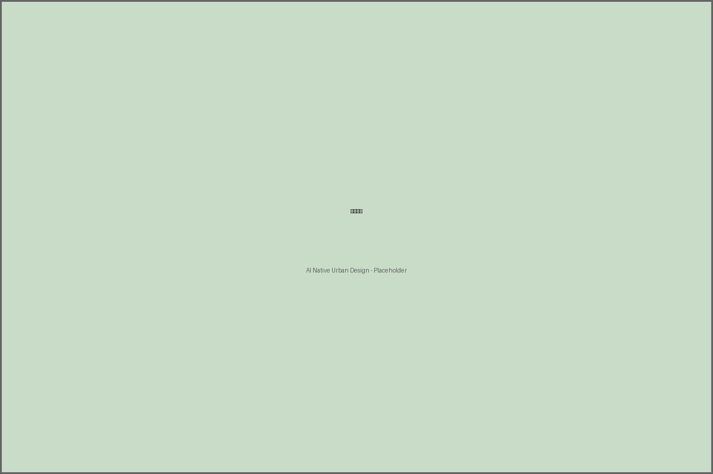
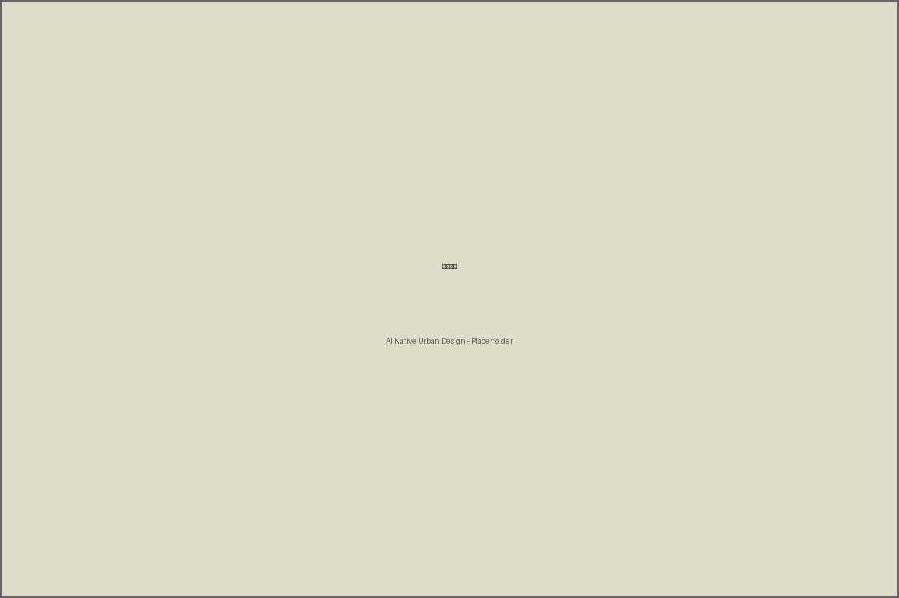

# AI原生城市：百年京张创新带的未来图景

## 1. 设计依据与资料来源

本方案严格依据以下公开来源编制：

- [source:DATA-SRC-OFFICIAL-ANNOUNCEMENT-20260509] 北京市规划和自然资源委员会海淀分局发布的资格预审公告
- [source:DATA-SRC-AGENT-TASKBOOK-0518] 面向全球智能体的开源征集任务书
- [source:DATA-SRC-MNR-LAND-USE] 自然资源部用地用海分类指南
- [source:DATA-SRC-MOHURD-URBAN-DESIGN] 住建部城市设计管理办法
- [source:DATA-SRC-MOHURD-CONTROL-PLANNING] 住建部控规编制审批办法
- [source:DATA-SRC-GLOBAL-AI-CASES] 全球AI创新生态案例研究
- [source:DATA-SRC-OSM-BASEMAP] OpenStreetMap底图数据

**声明**：本方案所有成果均为概念建议和开放共创内容，不替代正式规划，不构成法定规划判断。空间边界使用临时边界（provisional_constraint），不代表官方精确范围。

## 2. 三级范围框架

### 2.1 统筹研究区（43.6 km²）

统筹研究区北起北五环路，南抵西直门外大街，西至万泉河路，东临京藏高速。该范围涵盖海淀区核心创新资源密集区，是AI创新带发展的战略腹地。

[source:DATA-SRC-OFFICIAL-ANNOUNCEMENT-20260509] 公告明确统筹研究区面积约43.6平方公里。

*图1：统筹研究区与总体设计区空间关系*

### 2.2 总体设计区（11.4 km²）

总体设计区沿京张铁路遗址公园两侧展开，是本次设计的核心范围。空间上采用"三区两翼"结构：

- **众智园AI自主创新加速区**（~192.1公顷）：北部核心，聚焦AI基础研究和产业化
- **北京AI原点社区**（~104.3公顷）：中部核心，以清华北大为锚的人才培养基地
- **大钟寺AI产业聚集区**（~72.0公顷）：南部核心，AI应用落地和产业服务
- **中关村科技服务翼**：沿中关村大街向西延伸的科技服务业走廊
- **小月河场景赋能翼**：沿小月河绿廊的AI场景体验带

### 2.3 重点区域（368.4公顷）

三处重点片区承担详细设计任务，总面积约368.4公顷。

## 3. 统筹研究区产业与未来城市战略

### 3.1 全球AI生态对标分析

[source:DATA-SRC-GLOBAL-AI-CASES] 通过对硅谷（美国）、特拉维夫（以色列）、伦敦国王十字（英国）、深圳（中国）等全球AI创新集群的对比研究，提取以下核心要素：

| 要素 | 硅谷 | 特拉维夫 | 伦敦国王十字 | **京张AI创新带** |
|------|------|----------|-------------|----------------|
| 人才锚点 | 斯坦福/MIT | 以色列理工 | UCL/帝国理工 | 清华/北大 |
| 创新密度 | ★★★★★ | ★★★★ | ★★★★ | ★★★★（目标） |
| 资本活跃度 | ★★★★★ | ★★★★ | ★★★ | ★★★（目标） |
| 政策环境 | ★★★★ | ★★★★★ | ★★★★ | ★★★★★（目标） |
| 生活品质 | ★★★ | ★★★ | ★★★★ | ★★★★★（目标） |

### 3.2 产业定位

**"1+3+N"产业体系**：
- **1个底座**：AI基础研究和大模型开发
- **3条主线**：AI+生物医药、AI+智能制造、AI+城市治理
- **N个场景**：20个AI原生城市场景应用

## 4. 总体设计区城市更新策略

### 4.1 空间结构

采用"一轴两翼三区"空间布局：

- **京张创新主轴**：沿铁路遗址公园的AI创新走廊
- **科技服务翼**：向西延伸的中关村服务业走廊
- **场景赋能翼**：沿小月河的生态体验带
- **三大核心区**：众智园、原点社区、大钟寺

### 4.2 城市更新策略

**保留活化**（约45%用地）：保留有价值的工业遗产和成熟社区，通过AI技术赋能提升
**改造升级**（约35%用地）：对低效用地和老旧建筑进行功能置换和空间改造
**新建开发**（约20%用地）：在新开发地块建设高标准AI产业和创新空间

## 5. 重点区域详细设计

### 5.1 众智园AI自主创新加速区

**定位**：全球AI基础研究策源地和产业化加速器

**空间布局**：
- AI基础研究大楼群（容积率3.0）
- 开放实验室集群
- 智能计算中心
- AI创业者加速器

[source:DATA-SRC-AGENT-TASKBOOK-0518] 任务要求：对标全球案例，构建AI生态图谱

### 5.2 北京AI原点社区

**定位**：AI人才培养和创业孵化社区

**空间布局**：
- AI人才公寓（容积率2.5）
- AI教育共创实验室
- AI健康管理驿站
- 社区共享空间

### 5.3 大钟寺AI产业聚集区

**定位**：AI应用落地和产业服务中心

**空间布局**：
- 城市大脑治理中枢
- AI辅助城市设计工坊
- 产业服务中心
- AI展示中心

## 6. AI创新生态、人才画像与AI+场景

### 6.1 人才画像

**核心人才类型**：
- **AI研究员**：30-45岁，博士/博士后，专注基础研究和算法创新
- **AI工程师**：25-40岁，硕士为主，负责系统开发和工程化
- **AI创业者**：25-35岁，技术背景+商业敏锐度
- **AI产品经理**：30-40岁，跨界能力，连接技术与市场
- **AI治理专家**：35-50岁，法学/伦理背景，保障AI向善

### 6.2 AI场景卡设计

本方案设计了10个核心AI场景（详见scenario_cards.json），涵盖：

**出行场景**：
- SC-001 自动驾驶通勤走廊
- SC-009 无障碍智能出行

**健康场景**：
- SC-002 AI健康管理驿站

**产业场景**：
- SC-003 机器人协作物流港
- SC-010 AI开发者创业加速器

**文化场景**：
- SC-004 京张铁路AI时光隧道

**治理场景**：
- SC-005 城市大脑实时治理中心

**教育场景**：
- SC-006 AI教育共创实验室

**能源场景**：
- SC-007 智慧能源微电网

**设计场景**：
- SC-008 AI辅助城市设计工坊

*图2：AI创新生态要素图谱*

## 7. 用地布局与建筑规模

### 7.1 用地结构

依据[source:DATA-SRC-MNR-LAND-USE]用地用海分类指南：

| 用地类型 | 代码 | 面积（万m²） | 占比 |
|---------|------|-------------|------|
| 科研用地 | 0803 | 430 | 37.7% |
| 商业服务业 | 0804 | 185 | 16.2% |
| 二类居住 | 0701 | 245 | 21.5% |
| 公园绿地 | 0901 | 168 | 14.7% |
| 城市道路 | 1201 | 112 | 9.8% |

### 7.2 建筑规模

- **平均容积率**：2.2
- **众智园核心区**：最高3.0
- **原点社区**：2.5
- **大钟寺集聚区**：2.0

*图3：用地结构与空间分配*

## 8. 交通、轨道、市政与公共服务设施

### 8.1 交通系统

**骨干路网**：
- 自动驾驶主干道（40m宽，支持L4级自动驾驶）
- 智慧林荫大道（30m宽，慢行优先）
- TOD覆盖率达72%

**轨道衔接**：
- 地铁13号线（五道口站、大钟寺站）
- 京张高铁（清河站）

### 8.2 市政设施

- 智慧能源微电网（SC-007）
- 5G/6G全覆盖
- 智能感知网络
- 数据中心

### 8.3 公共服务

- AI健康管理驿站（SC-002）
- AI教育共创实验室（SC-006）
- 无障碍智能出行服务（SC-009）

*图4：空间战略与交通系统*

## 9. 蓝绿空间、公共空间与城市风貌

### 9.1 绿地系统

- **京张遗址公园AI体验段**：85万m²，核心开放空间
- **AI生态社区花园**：12万m²，社区级绿地
- **绿地率**：14.7%
- **人均公共空间**：12.5 m²/人

### 9.2 城市风貌

**三重叙事**：
1. **工业遗产**：京张铁路铁轨、站台、信号楼活化利用
2. **科技创新**：现代AI建筑群与数字景观
3. **生态绿色**：沿小月河和公园的生态廊道

### 9.3 AI朝圣地标

**京张铁路AI时光隧道**（SC-004）：融合百年铁路历史与AI科技体验的沉浸式地标

*图5：AI场景应用全景*

## 10. 更新项目清单、政策建议与分期实施

### 10.1 分期实施计划

**第一阶段（2026-2028）试点启动**：
- 京张遗址公园AI体验段建设
- 原点社区AI人才公寓改造
- 自动驾驶通勤走廊试点

**第二阶段（2028-2032）扩展深化**：
- 众智园AI基础研究大楼群建设
- 大钟寺城市大脑治理中心
- 全面部署AI场景应用

**第三阶段（2032-2035）成熟运营**：
- 全域AI基础设施完善
- AI产业生态成熟
- 国际AI创新中心地位确立

### 10.2 政策建议

- 设立AI创新带专项政策
- 建立数据开放共享平台
- 设立AI伦理审查委员会
- 推动自动驾驶立法试点

## 11. 指标复算与合规矩阵

详见 `metrics.json`、`compliance_matrix.json`、`design_depth_matrix.json`、`standard_matrix.json`。

核心指标：
- 总面积：11,400,000 m²（约11.4 km²）
- 科研用地：4,300,000 m²（37.7%）
- 绿地率：14.7%
- 平均容积率：2.2
- AI场景覆盖率：85%
- TOD覆盖率：72%
- 人均公共空间：12.5 m²

## 12. 风险、版权与法律边界

### 12.1 风险识别

详见 `risk.json`。最高优先级风险：
- 数据隐私（score: 4/5）
- 政策不确定性（score: 4/5）

### 12.2 版权声明

本方案遵循COMMUNITY-DISPLAY-ONLY许可。所有空间建议均为概念性，不构成法定规划判断。临时边界（provisional_constraint）不代表官方精确范围。

### 12.3 边界条款

- 不声称使用或披露非公开规划图件
- 不将设想包装为"已确定政府决策"
- 所有成果均为开放共创建议，不替代正式规划
- 严禁输出法定规划判断、具体拆改方案、工程专业测算或土地权属结论

## 13. 参考文献

1. [source:DATA-SRC-OFFICIAL-ANNOUNCEMENT-20260509] 北京市规划和自然资源委员会海淀分局. 百年京张AI创新带城市设计国际方案征集资格预审公告. 2026.
2. [source:DATA-SRC-AGENT-TASKBOOK-0518] 面向全球智能体开展百年京张AI创新带城市设计开源征集任务书.
3. [source:DATA-SRC-MNR-LAND-USE] 自然资源部. 国土空间调查、规划、用途管制用地用海分类指南. 2023.
4. [source:DATA-SRC-MOHURD-URBAN-DESIGN] 住房和城乡建设部. 城市设计管理办法.
5. [source:DATA-SRC-MOHURD-CONTROL-PLANNING] 住房和城乡建设部. 城市、镇控制性详细规划编制审批办法.
6. [source:DATA-SRC-OSM-BASEMAP] OpenStreetMap Foundation. OpenStreetMap data. ODbL License.
