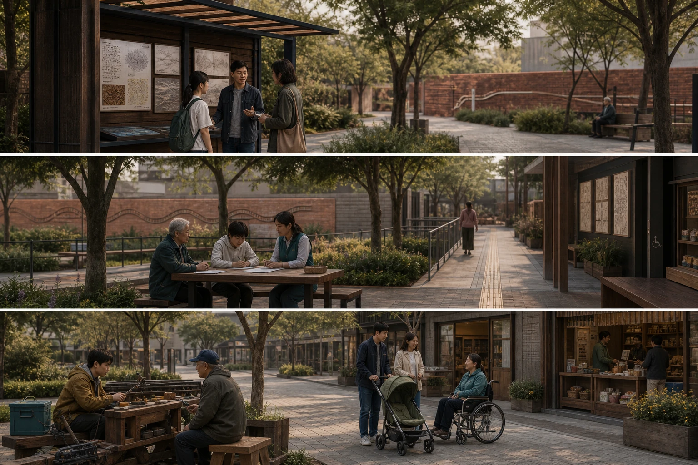
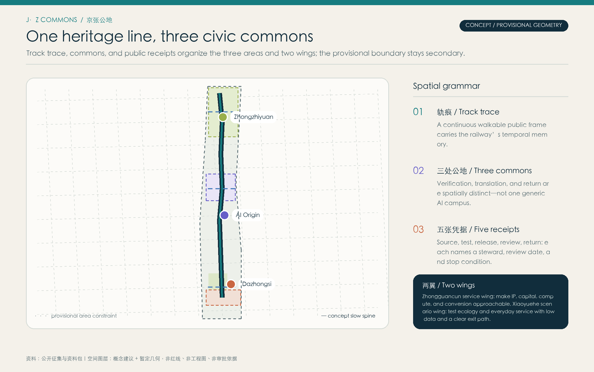
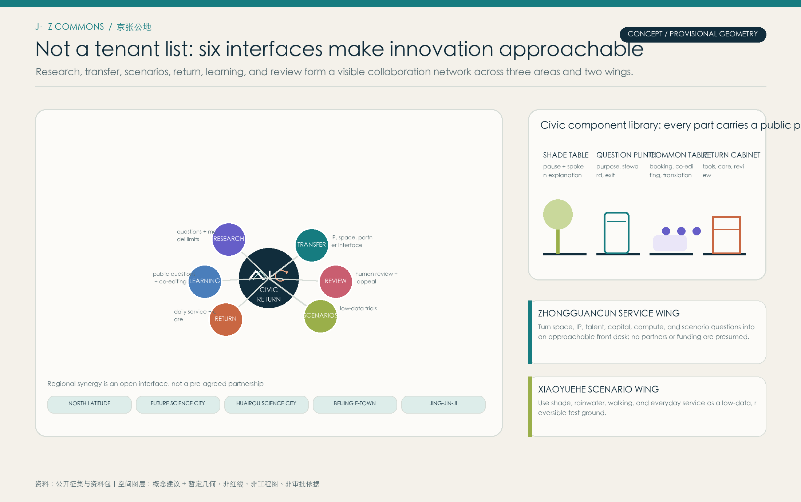
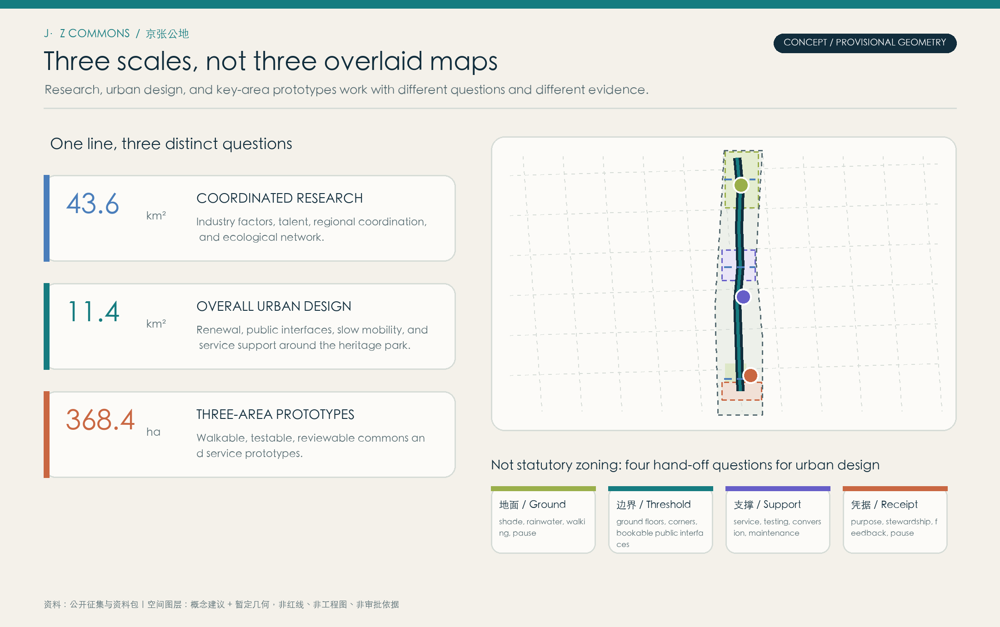
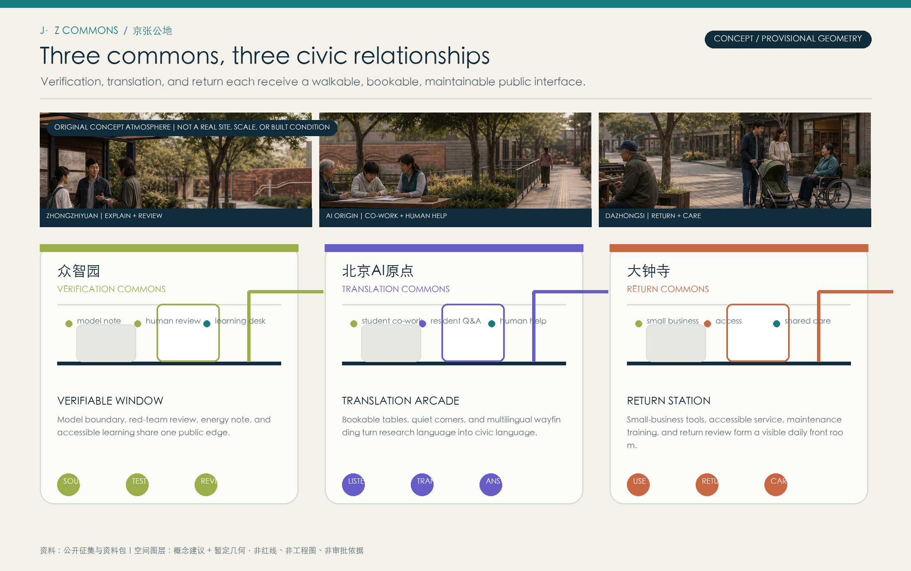
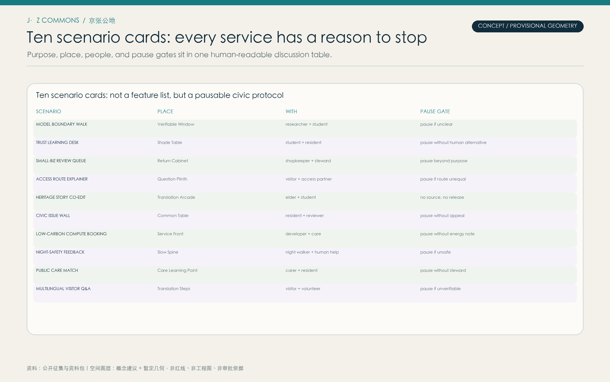
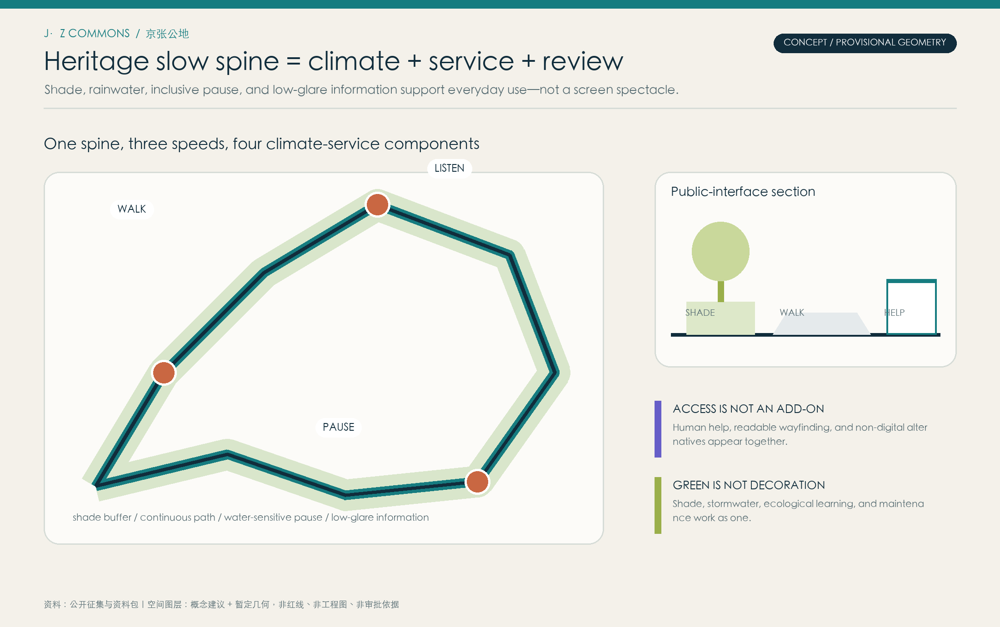
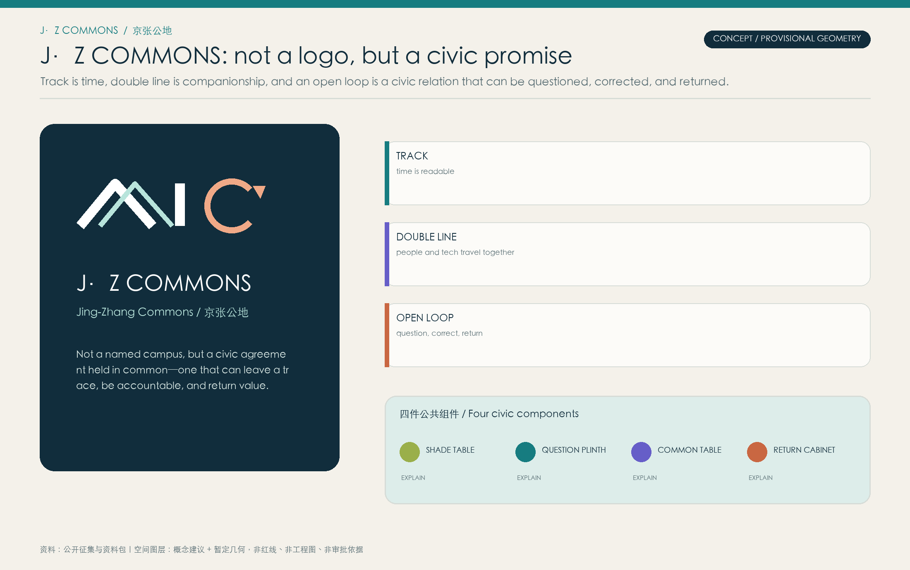
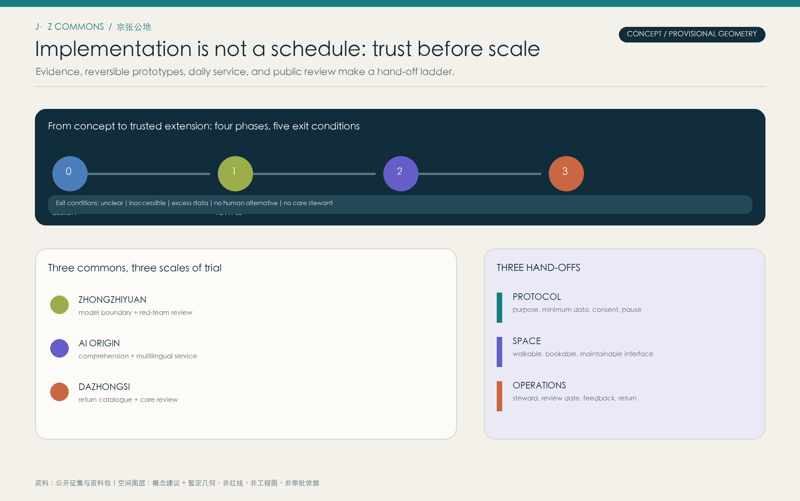
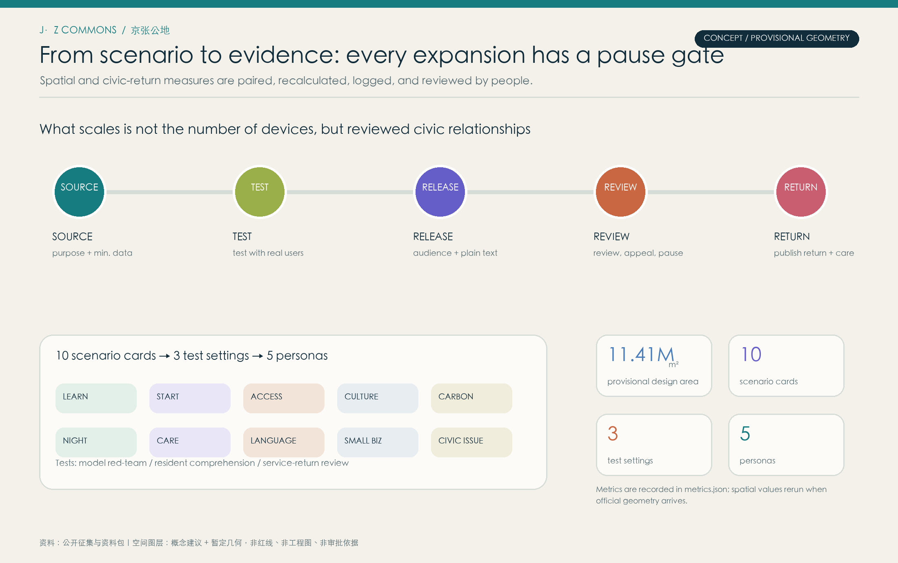

# Jing-Zhang Open Ledger: A Traceable AI Public-Return Belt

**Provisional-boundary statement:** This package uses the repository’s public provisional geometry as a concept constraint. It is not a statutory redline, ownership boundary, engineering boundary, or approval basis. Replace it and rerun area, drawing, and compliance checks when official material becomes available.

**Three-commons concept-atmosphere note:** This original triptych only helps readers understand people, human service, maintenance, and accessibility. Spatial judgement remains with the provisional GeoJSON, drawings, metrics, and text; it does not represent a real site, scale, existing condition, or approved construction. [source:SRC-AI-GENERATED-THREE-COMMONS-20260813]

## Design Basis and Source List

This v1.1 concept package begins with the public call, its taskbook, allowed design space, provisional boundary material, relevant standards, and public Beijing-Haidian policy context. The official call establishes the three work scales, but does not publish a precise vector redline that may be treated as a statutory boundary. Every mapped element is therefore labelled as a provisional constraint or an agent-generated concept, never as a survey, ownership boundary, legal zoning, engineering drawing, or approval. Areas are recalculated in EPSG:4548 only for internal consistency. A cleared boundary, building and parcel survey, road and utility data, heritage controls, and engineering constraints must replace these inputs before professional or statutory action. [source:SRC-OFFICIAL-ANNOUNCEMENT] · [source:SRC-PROVISIONAL-BOUNDARY] · [source:SRC-HAIDIAN-1X1-2026] · [data:geometry/site_boundary.geojson]

## Translation, Not Copying: International Methods

International research is not used to put a foreign innovation-district image on Haidian. It isolates eight operations that can be locally translated. The High Line demonstrates a heritage corridor as a public frame, while its visitor and value pressure reinforces a local priority of daily access, care, and reversibility. Superkilen points to co-authored identity, translated here as multilingual wayfinding, question cards, and bookable collaboration tables—not imported objects. Oodi’s bookable quiet rooms, making facilities, and accessible civic service inform the Translation Commons. one-north’s plug-and-play space and support institutions, plus Station F’s program-led partner interfaces, inform an approachable service wing rather than another closed campus. Cheonggyecheon shows that blue-green corridors need seasonal safety, maintenance, and cultural-use rules as much as a visual effect. [source:SRC-HIGH-LINE-FHL] · [source:SRC-SUPERKILEN] · [source:SRC-OODI] · [source:SRC-ONE-NORTH] · [source:SRC-STATION-F] · [source:SRC-SMART-KALASATAMA] · [source:SRC-ARS-ELECTRONICA] · [source:SRC-CHEONGGYECHEON]

## Three-Level Scope Framework

One heritage line, three civic commons, and five receipts gives each work scale a different question. The coordinated research area considers AI industry, talent, culture, ecology, and regional collaboration. The overall-design area considers public interfaces, slow mobility, renewal rhythm, and answerable services around the heritage park. The three key areas host walkable, bookable, testable, and reviewable prototypes. The line joins heritage, climate, and service; the commons are Verification, Translation, and Return; the receipts are source, test, release, review, and return. Each receipt names an object boundary, steward, plain-language explanation, stop condition, and next review date. This is an accountability structure, not a statutory zoning plan. [source:SRC-AGENT-TASKBOOK] · [depth:three_level_scope_framework] · [data:geometry/key_areas.geojson]

## Coordinated Research Area: Industry and Future City Research

The proposal’s civic proposition is simple: every AI deployment should leave a public receipt. It joins the centennial Jing-Zhang culture belt, the everyday AI experience belt, and the AI integration belt through time, daily use, and accountable conversion. Five functions are carried by full-stack innovation, world-class ecosystem, AI+ scenarios, an intelligent lively city, and public AI-governance discourse. Haidian’s 1+X+1 frame places AI as an engine, 5+3 industries as fields of application, and technology services as the supporting base. Accordingly, the three areas and two wings are not a simple real-estate division: Zhongzhiyuan hosts full-stack and trusted validation; AI Origin hosts near-campus translation and open collaboration; Dazhongsi hosts AI-native daily return; the Zhongguancun service wing turns talent, investment, space, platform, and scenario into approachable service relationships; the Xiaoyuehe wing turns ecology and public life into low-risk prototypes. North Latitude, Future Science City, Huairou Science City, Beijing E-Town, and Jing-Jin-Ji are drawn as open knowledge, test, transfer, and communication interfaces pending confirmation by relevant parties—not as a claimed alliance. [source:SRC-HAIDIAN-1X1-2026] · [source:SRC-BEIJING-AI-SOURCE-2023] · [depth:overall_spatial_structure] · [metric:global_method_case_count]

## Overall Design Area: Urban Renewal and Regulatory-Plan-Level Urban Design

The overall strategy is readable track trace, pause-able threshold, and visible return. It does not assert FAR, height, demolition quantities, or engineering approvals. It offers a professional hand-off list instead: continuous public interfaces; walk-first and inclusive access; adaptable ground floors; shade and stormwater as daily infrastructure; low-glare information; and named stewards with review cycles. The trace is a dark double line, commons use muted semantic colours rather than legal-zone colours, and receipts are small thresholds at paths, arcades, steps, and help desks. This “regulatory-plan-level” response is a conceptual guide plus questions to verify, not a set of statutory controls. [standard:MOHURD-CONTROL-DETAILED-PLANNING] · [depth:development_intensity_controls] · [data:geometry/land_use.geojson]

## Detailed Design of Key Areas

Zhongzhiyuan is a Verification Commons. A Verifiable Window, test garden, and audit workshop put model scope, energy note, red-team review, and learning at a walkable public edge. Beijing AI Origin is a Translation Commons. A Translation Arcade, bookable collaboration tables, quiet corners, and multilingual wayfinding make research language understandable and contestable to students, residents, and service staff. Dazhongsi is a Return Commons. A Return Station, accessible help desk, small-business tool cabinet, and maintenance learning point make return visible in service and care rather than only in display. The three landmarks are civic interfaces, not isolated sculptures. Locations, footprints, form, ownership, and access remain conceptual pending official geometry and professional review. [depth:three_key_area_detailed_design] · [metric:ai_pilgrimage_landmark_count] · [data:geometry/public_space.geojson]

## AI Innovation Ecosystem, Personas, and AI+ Scenarios

The ecosystem is not demonstrated through a company list or funding figures; it is tested through six usable interfaces: declared model/data purpose, shared testing and red-team entry, understandable conversion and service, recorded developer maintenance, public feedback or exit, and accessible independent review or appeal. Land/space, industry, capital, talent, compute, data, and scenarios are not promised as existing resources; they become front-desk questions, each naming need, usable range, steward, and next review. Five accountability personas are researchers, founders, students/developers, residents including older users who need understandable service, and service staff/small-business operators. Ten scenario cards cover model-boundary touring, trusted-AI learning, a human-review queue for small business, accessible movement explanation, collaborative heritage storytelling, community issue summary, low-carbon compute booking, night-safety feedback, public-maintenance matching, and multilingual visitor help. Three tests are model red-team at Zhongzhiyuan, resident comprehension at AI Origin, and service-return review at Dazhongsi; each needs informed consent, data minimisation, withdrawal, and a human alternative. [source:SRC-STATION-F] · [source:SRC-ONE-NORTH] · [source:SRC-OODI] · [metric:scenario_card_count] · [metric:test_validation_scene_count] · [metric:persona_count]

## Land Use, Building Scale, and Retain-Renovate-Demolish Strategy

Land use is expressed as concept functional bands and public interfaces, not confirmed parcels or legal rights. Permitted codes distinguish conversations about mixed service, research translation, open innovation, and green buffering; three footprints only explore the relation between Verification/Audit, City AI Translation, and Return Service workshops and public edges. They do not infer ownership, existing use, legal classification, building quantity, FAR, height, demolition, investment, or confirmed delivery. A future retain-renovate-replace framework must first verify existing building condition, structural safety, fire requirements, heritage resources, stakeholders, and engineering conditions, then identify durable space and improvable public interfaces, and only then consider minimal physical intervention. [standard:MNR-LAND-USE-CLASSIFICATION-GUIDE] · [metric:building_footprint_area_sqm] · [data:geometry/buildings.geojson]

## Transport, Rail, Municipal Infrastructure, and Public Services

The transport strategy begins with a daily service path: a shaded, low-gradient slow spine with short-distance pauses, clear wayfinding, and human-service points joins the three commons. Conceptual east-west stitching admits public interfaces from community, schools, research, and commerce; north-south continuity turns railway time into a continuous walking and pause sequence. It does not redraw any road redline, rail alignment, station, or parking standard. Further work needs traffic observation, rail-transfer analysis, fire access, utilities, logistics, accessibility, and night-safety assessment. New infrastructure is answerable service: edge compute should state energy and shutdown logic, sensors should state purpose and retention, public terminals should offer non-digital alternatives, and network operations should name a contactable steward. Beijing’s scenario-opening context is translated into small, explainable, pausable trials rather than an asserted citywide deployment. [source:SRC-BEIJING-SCENARIO-OPEN-2026] · [depth:traffic_rail_slow_parking] · [depth:municipal_new_infrastructure] · [data:geometry/roads.geojson]

## Blue-Green Network, Public Space, and Urban Character

The blue-green system is climate and social infrastructure, not decorative planting. North, central, and south concept gardens support shaded pause, heritage buffering, and outward-facing return; smaller public rooms support explanation, feedback, demonstration, and collaboration. AI is moved away from the spectacle of bright screens toward tactile material, low-glare information, maintainable planting, safe nighttime light, and places to sit quietly. Accessibility is not an icon on a drawing: wayfinding should pair plain language with visual/audible alternatives, inclusive-route information, and human help; older users and people without a smart terminal need an equivalent traditional path. Cheonggyecheon also demonstrates the need to organize seasonal safety, maintenance, and cultural use alongside water and green space. No unverified hydrological or engineering performance is claimed here. [source:SRC-CHEONGGYECHEON] · [standard:MOHURD-URBAN-DESIGN-MEASURES] · [metric:green_ratio] · [metric:public_space_ratio]

## Culture, Wayfinding, and Brand System

The brand is not a layer of AI spectacle. The original J·Z COMMONS mark combines a folded track, double line, and open loop: readable time, people and technology in companionship, and room to question, correct, and return. Ink-blue track trace, river teal, gingko green, brick return, and restrained violet distinguish line, commons, ecology, service, and collaboration. The system extends into path markers, shade-side question plaques, replaceable research cards, return cabinets, event tickets, and the offline information page. It does not use enterprise marks, unlicensed railway photography, or historical images. The three landmarks—Verifiable Window, Translation Arcade, and Return Station—are both honor display and public-service interfaces. Any physical intervention into heritage resources needs later professional and cultural-heritage review. [source:SRC-AGENT-TASKBOOK] · [metric:ai_pilgrimage_landmark_count] · [data:geometry/public_space.geojson]

## Activities, Developer Community, and Long-term Operation

Long-term operation is organized as the J·Z OPEN LEDGER yearly public-return season, not as a single promotional launch. Spring is a Question Sampling and Translation Week; summer hosts low-data scenario trials with consent, human alternatives, and pause gates; autumn is an Open Ledger Week that reports accepted, rejected, and paused scenarios and publishes bilingual reusable scenario protocols; winter is a Care and Redesign Assembly that brings use, maintenance, inclusion, and climate feedback into the next cycle. The developer community is not a one-way code showcase: it makes technical contribution, public feedback, and offline care visible to one another. The service wing can use an approachable front desk for translation, IP, capital, talent, compute, and scenario questions. The international conversion path is open protocol, peer review, local prototype, and public return—not a promise of investment, partners, or outcomes. [source:SRC-HAIDIAN-1X1-2026] · [source:SRC-ARS-ELECTRONICA] · [source:SRC-AGENT-TASKBOOK] · [depth:renewal_project_list] · [metric:annual_activity_cycle_count]

## Renewal Projects, Implementation Policy, and Phasing

Implementation follows trusted relations before scale. Phase 0 fills evidence and co-design gaps: boundary, baseline, heritage, and inclusion data; shared protocols for question, purpose, steward, consent, and exit. Phase 1 uses reversible prototypes in Zhongzhiyuan to test public explanation, red-team review, and human-AI learning. Phase 2 turns translation networks, collaboration tables, student care, and multilingual wayfinding into bookable daily infrastructure in AI Origin. Phase 3 lets Dazhongsi test a public return catalogue, service-return review, and shared care before extension. Every phase has stop conditions: if comprehension, inclusion, data minimisation, climate comfort, or maintenance readiness fails, expansion pauses and returns to problem definition. Projects are handed off as a protocol + space + operation set; funds, approvals, promoters, operators, and dates are not presented as facts.

Implementation responsibility is allocated by roles to be confirmed, rather than presumed institutions: evidence holders and qualified reviewers verify the baseline; each prototype is confirmed by a scenario initiator, on-site steward, independent reviewer, and user representative; routine service needs a contactable responsible party, care team, and appeal route. Each phase records a baseline before it begins and publicly reviews the same measurable indicators at its close: share of scenarios with informed consent and exit routes; share of participants able to restate the service boundary in plain language; accessibility and human-alternative reach rate; question response time; completed care-loop rate; and authorised anonymised satisfaction. Metrics only decide whether to continue, correct, or pause; they are not unapproved performance promises. The annual public review reconnects feedback, responsibility, and the next question to spatial renewal. [depth:phasing_implementation] · [depth:renewal_project_list] · [data:geometry/phasing.geojson]

## Metrics, Area Recalculation, and Compliance Matrix

The metric sheet pairs spatial and civic-return measures. Spatial measures include provisional site area, concept green space, public space, building footprints, and ratios, recalculated from this package’s GeoJSON in EPSG:4548. Civic-return measures count eight international methods, ten scenario cards, three test settings, five personas, three civic landmarks, and one annual activity cycle. These are named concept counts, not existing facilities or commitments. The compliance matrix connects call requirements, six agent tasks, standards, drawings, geometry, metrics, sources, assumptions, and self-checks. A complete matrix is not approval. Cleared boundaries, statutory controls, baseline survey, engineering conditions, ownership, and partners remain key gaps; each geometry replacement requires spatial review, updated metrics, and updated drawings. [metric:site_area_sqm] · [metric:green_space_area_sqm] · [metric:global_method_case_count] · [depth:metrics_recalculation]

## Risk, Copyright, and Compliance

The key spatial risk is the absence of a cleared exact redline and baseline survey: published material provides textual scope, area scale, and provisional geometry, not a basis for statutory controls or setting-out. Service risks include privacy, bias, misleading automation, and digital exclusion; every scenario therefore requires minimum data, stated purpose, human alternative, exit, explanation, and independent review. A third risk is insufficient care capacity: each gate and landmark needs a steward, care source, review date, and stop condition. Text, concept geometry, drawings, static HTML, and the original cover visual are declared AI-collaborative work or are based on public/cleared sources. The cover is a design atmosphere asset, not an image of a built or approved Haidian condition. No personal data, commercial map tile, enterprise mark, or restricted image is included. CC BY 4.0 supports attributed discussion and reuse, not permission to implement a particular spatial, engineering, project, or service intervention. [source:SRC-AI-GENERATED-COVER-20260813] · [source:SRC-AGENT-TASKBOOK] · [depth:risk_missing_data] · [data:geometry/constraints.geojson]

## References

`sources.json` records provenance and use limits; `sources.json` and `report/narrative.md` record provenance, local translations, non-copying cautions, and the v1.0-to-v1.1 design review record.

[source:SRC-OFFICIAL-ANNOUNCEMENT] Public call and repository site package.

[source:SRC-AGENT-TASKBOOK] Open-call taskbook, six agent tasks, and concept boundary.

[source:SRC-BEIJING-AI-SOURCE-2023] · [source:SRC-BEIJING-SCENARIO-OPEN-2026] · [source:SRC-HAIDIAN-1X1-2026] Beijing and Haidian public policy/industry context, used only for design response.

[source:SRC-HIGH-LINE-FHL] · [source:SRC-SUPERKILEN] · [source:SRC-OODI] · [source:SRC-ONE-NORTH] · [source:SRC-STATION-F] · [source:SRC-SMART-KALASATAMA] · [source:SRC-ARS-ELECTRONICA] · [source:SRC-CHEONGGYECHEON] Comparative methods, not evidence about Haidian conditions or policy.

[standard:PROJECT-OFFICIAL-ANNOUNCEMENT] · [standard:PROJECT-AGENT-OPEN-CALL-TASKBOOK] · [standard:MOHURD-URBAN-DESIGN-MEASURES] · [standard:MOHURD-CONTROL-DETAILED-PLANNING] · [standard:MNR-LAND-USE-CLASSIFICATION-GUIDE]

Publicly verifiable sources support task interpretation and method discussion; spatial, engineering, ownership, heritage, or statutory claims need relevant data and professional review.
