# 京张开源账本：可回查的 AI 公共回报带

**暂定边界声明：** 本方案使用资料包公开的暂定范围作为概念约束；它不是法定红线、产权界线、工程边界或审批依据。正式边界资料到位后，须替换图层并重跑面积、图纸和合规复核。

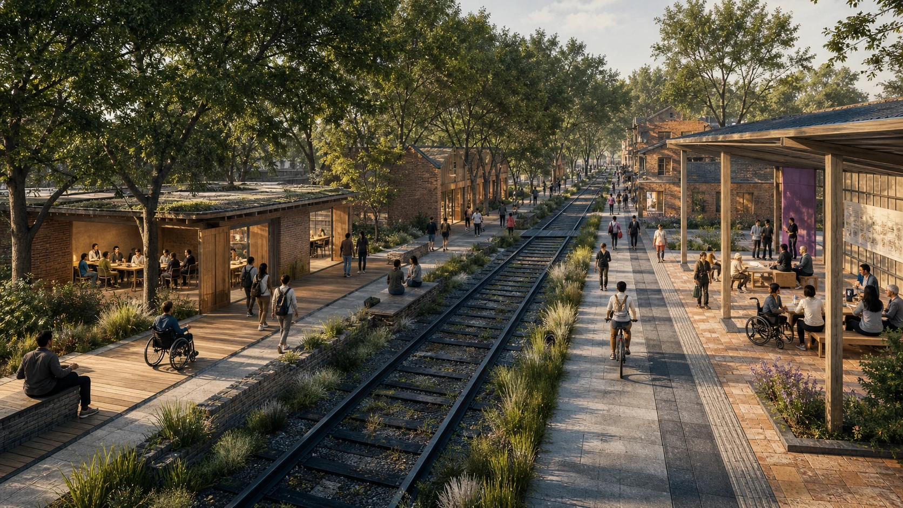

## 一页执行摘要

**一句话：** 京张开源账本把百年京张的慢行—气候—服务主线，组织为众智园的验证、AI原点的转译和大钟寺的回报三种公共关系；每项拟议AI服务均需携带“源、测、发、审、返”五张凭据。

**v1.4-1.5 新增的可核验证据：** 一套零依赖离线桌面复演规则接受1个合成、无个人数据的记录，并拒绝6个来源、人工替代、独立复核、有效期或返回机制缺失的记录；五个区域接口只列明待确认的交换内容；90天零阶段只交付资料、协议、走读、复原与独立复核条件。三联概念场景图把三处公地的日常公共关系与其结构化的非主张、停用门和后续专业前提并列呈现；v1.5 进一步提供离线、可键盘操作、不记录任何用户数据的概念走读，使读者在同一界面比较三处公地的进入、行动与暂停门。静态图纸和结构化证据仍为权威后备。它们均不构成真实服务、合作、预算、建设或批准。

**快速核验入口：** `assets/figures/ledger-proof.png`、`visual/assets/open-ledger-tabletop-result.json`、`visual/assets/regional-exchange-contracts.json`、`visual/assets/zero-phase-readiness.json`、`visual/assets/civic-scene-evidence.json`、`visual/assets/commons-walk-config.json` 与 `visual/assets/review-evidence-map.json`。

## 设计依据与资料清单

本方案以公开征集公告、资料包任务书、允许设计空间、暂定范围、国家/行业参考和公开政策为起点。官方公告明确了43.6平方公里统筹研究范围、约11.4平方公里总体设计范围和三处重点区域的工作层级；公开资料没有提供可作为法定红线使用的精确矢量附件。因此，所有图层均被明确为“暂定约束 + 概念建议”，而不是现状测绘、产权界线、法定分区、工程图或审批结论。面积仅在 EPSG:4548 下复算，用于内部一致性；正式边界、既有建筑、道路红线、管线、权属、保护控制和工程条件到位后，必须替换、复算并由专业团队复核。

本轮 v1.2 将三处重点区的核心表达重构为“空间—服务—凭据”同屏证据板：每处明确公共界面、在场者、人工责任、暂停门与可交接物，避免以氛围图代替空间机制。资料、假设、方法案例和生成资产均在 `sources.json`、`report/narrative.md` 和版权声明中记录用途与限制。 [source:SRC-OFFICIAL-ANNOUNCEMENT] · [source:SRC-PROVISIONAL-BOUNDARY] · [source:SRC-HAIDIAN-1X1-2026] · [data:geometry/site_boundary.geojson]

## 全球案例的转译而非复制

国际研究不是为京张套一个异国园区形象，而是拆解八种可被本地化的城市操作。High Line 提示遗产线可以成为连续公共骨架，但其旅游化与地价外溢风险提醒我们把“日常可达、可维护、可退出”放在造景之前；Superkilen 提示公共身份应由使用者共同写作，因此本方案把对象收集转成多语导视、问题卡和可预约的协作桌，而不移植任何视觉物件；Oodi 的可预约安静室、制作设施和无障碍公共服务，转译为 AI 原点的“翻译公地”。

面向创新生态，one-north 的可插拔空间与支撑机构关系、Station F 的项目制伙伴接口，启发中关村科技服务翼从“单一园区楼宇”转为可进入的服务前台；Helsinki Smart Kalasatama 的共同开发试验逻辑被转译为代表性使用者、低数据样机和公开复盘，而不是数据化管理承诺；Ars Electronica 的“城市作为面向公众的技术文化舞台”被转译为年度开放账本周和国际讲述路径，而不复制其活动品牌。首尔清溪川提示水绿廊道必须同时包含季节性安全、维护和文化使用规则，故小月河场景翼不以大屏展示为目标，而以雨水、树荫、无障碍停留和低数据测试为底板。每一条转译和“不照搬什么”的理由已在研究附录列明。 [source:SRC-HIGH-LINE-FHL] · [source:SRC-SUPERKILEN] · [source:SRC-OODI] · [source:SRC-ONE-NORTH] · [source:SRC-STATION-F] · [source:SRC-SMART-KALASATAMA] · [source:SRC-ARS-ELECTRONICA] · [source:SRC-CHEONGGYECHEON]

## 三层范围工作框架

“一线三处公地五张凭据”不把三层范围叠成一张大图，而给不同层级不同的问题。统筹研究范围处理AI产业、人才、文化、生态与区域协同；总体设计范围处理遗址公园周边的公共界面、慢行、更新节奏和可问责的基础服务；重点区域处理能被走读、预约、试用和复核的原型。

“一线”是沿京张遗产叙事组织的慢行—气候—服务主线；三处公地依次是众智园验证公地、北京AI原点翻译公地和大钟寺回报公地；五张凭据是源、测、发、审、返。每一张凭据都应说明对象边界、责任人、公众可读说明、停止条件和下一次复核日期。它们组织的是可信行动，不划定法定分区。 [source:SRC-AGENT-TASKBOOK] · [depth:three_level_scope_framework] · [data:geometry/key_areas.geojson]

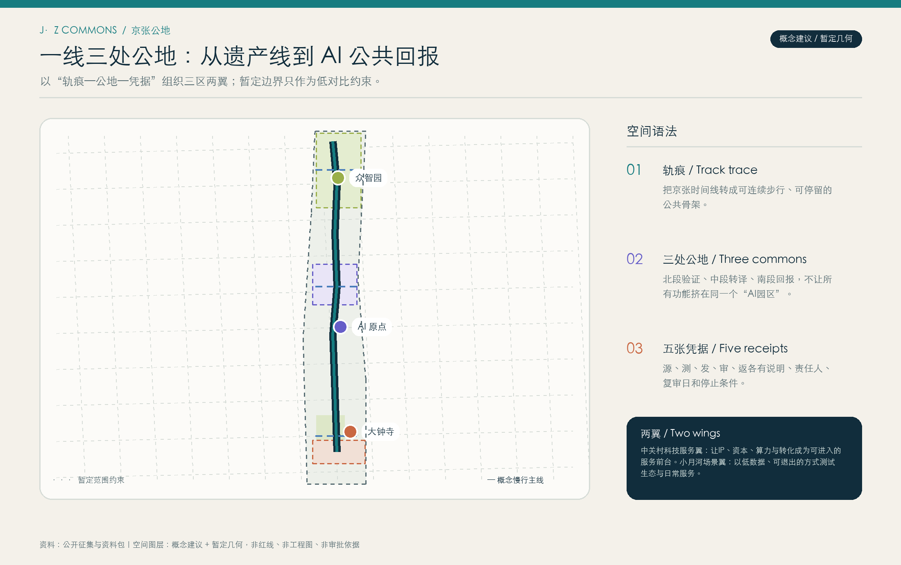

## 统筹研究范围产业与未来城市研究

方案以“每一次AI部署都要留下公共凭据”为统筹命题，把三大定位连接成同一件事：百年京张文化带提供时间与行走的尺度，都市AI生活体验带提供日常使用和反馈的尺度，AI融合创新带提供研发、转化与治理的尺度。五大功能分别由全栈自主创新、世界级生态、AI+场景、智能化AI活力城市与AI治理公共话语来承担；这里的AI不是单一招商标签，而是把研究者、创业者、学生、居民、小店和服务人员放进同一张可追问的公共回报账本。

海淀的“1+X+1”把AI作为核心引擎，以“5+3”产业为交叉应用方向、科技服务业为要素底座；因此三区两翼不是简单的空间分工：众智园承接全栈和可信验证，AI原点承接近校型转译与开源协作，大钟寺承接智能原生服务与日常回报，中关村科技服务翼把人才、投资、空间、平台和场景转成可进入的服务关系，小月河场景翼把生态和公共生活转成低风险原型。北纬社区、未来科学城、怀柔科学城、北京经开区和京津冀在本方案中被画成可打开的知识、测试、转化与传播接口，必须在后续由相关主体确认，而非假称现有联盟。v1.3 将五处关系拆为待确认的交换接口：分别只提出日常可及性问题、研究与评测方法、独立复核问题、受控交接字段或版本化场景格式的输入、转译与可公开输出；用途许可、责任角色、公开等级与独立复核任一缺失，接口保持未启动。它们不转移个人数据、机构背书、资金承诺、监管结论或部署权。 [data:visual/assets/regional-exchange-contracts.json] · [metric:regional_exchange_interface_count] · [source:SRC-HAIDIAN-1X1-2026] · [source:SRC-BEIJING-AI-SOURCE-2023] · [depth:overall_spatial_structure] · [metric:global_method_case_count]

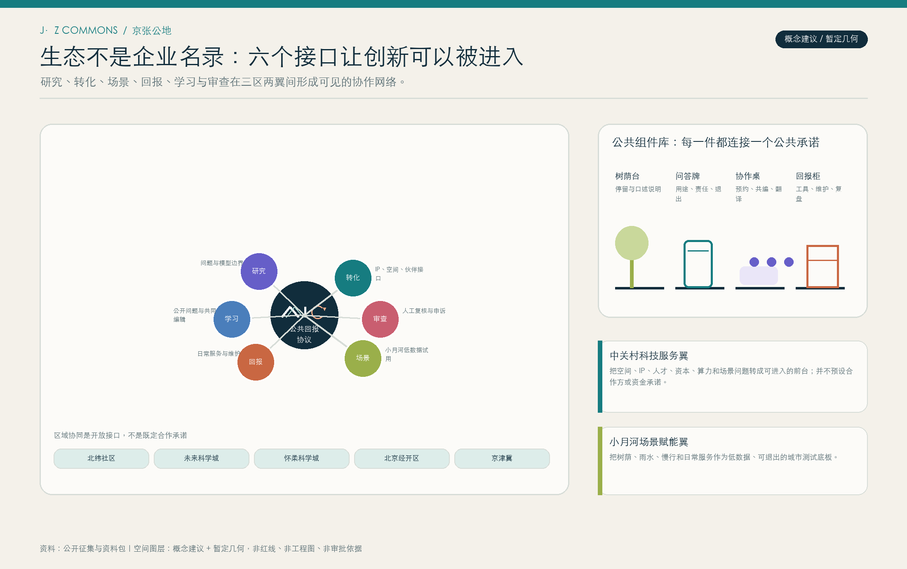

## 总体设计范围城市更新与控规深度城市设计

总体设计以“轨痕可读、边界可停、回报可见”为原则。它不提出未经核验的容积率、限高、拆改清单或交通工程结论，而是形成一张可交接给专业团队的问题清单：公共界面是否连续，慢行是否优先且无障碍，首层是否可转换，树荫与雨洪是否成为日常基础设施，信息是否低眩光且可由人解释，服务是否有可联系的责任人与复核周期。

空间上，轨痕是一条深色双线；公地以低饱和的绿、紫、砖色区分功能而不把色块等同于法定用地；凭据以小尺度门槛出现于路径、廊下、台阶和服务台。这个“控规深度”是概念导则和待核验问题，而不是控制指标。暂定范围中的概念功能带仅服务于阅读和面积复算，正式资料齐备后才可进入专业协调。 [standard:MOHURD-CONTROL-DETAILED-PLANNING] · [depth:development_intensity_controls] · [data:geometry/land_use.geojson]

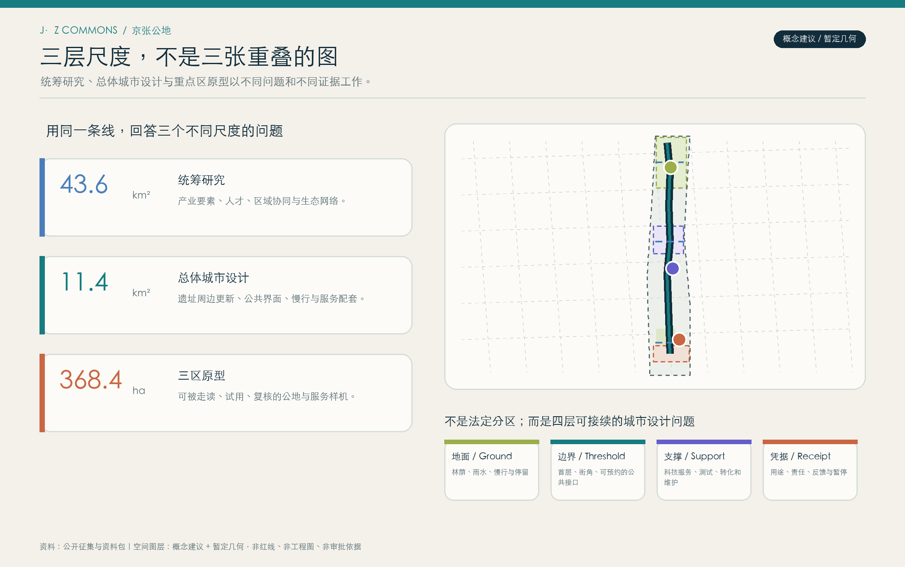

## 重点区域详细设计

众智园是“验证公地”：以可验证之窗、测试花园和审计工坊把模型边界、能耗说明、红队复盘和学习界面放到可走读的公共边缘。北京AI原点是“翻译公地”：以转译钟廊、可预约协作桌、安静角和多语导视，把研发语言转成学生、居民和服务人员可以理解、质询、再编辑的城市语言。大钟寺是“回报公地”：以回报驿站、无障碍服务台、小店工具柜和维护学习站，使收益不止写在海报上，而在服务、劳动和维护关系中可见。

三座AI朝圣地标被设计为接口而非孤立雕塑：可验证之窗显示范围、责任和复核时点；转译钟廊收集问题并给出人工回应入口；回报驿站记录服务、维护和反馈。所有位置、基底和形式均为概念建议，未声明现状、保护等级、权属或建设批准。 [depth:three_key_area_detailed_design] · [metric:ai_pilgrimage_landmark_count] · [data:geometry/public_space.geojson]

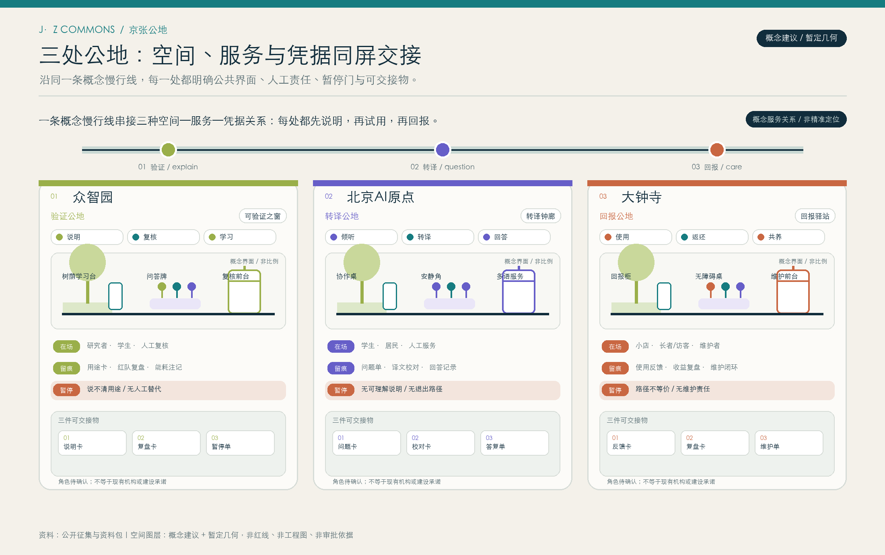

### 三处公地的概念走读意象

v1.4 以一张原创三联概念图把三处公地分别呈现为可到达并看懂的验证边缘、可停留并共编的转译廊下、以及可看见并返还的街道前台。它只帮助读者感知这些公共关系，不描绘海淀现状，也不提供地点、尺度、工程、文保、运营或批准结论；每一处仍须与重点区图、场景卡、五张凭据和后续专业/使用者复核共同阅读。 [source:SRC-AI-GENERATED-THREE-COMMONS-20260814] · [data:visual/assets/civic-scene-evidence.json] · [depth:three_key_area_detailed_design]

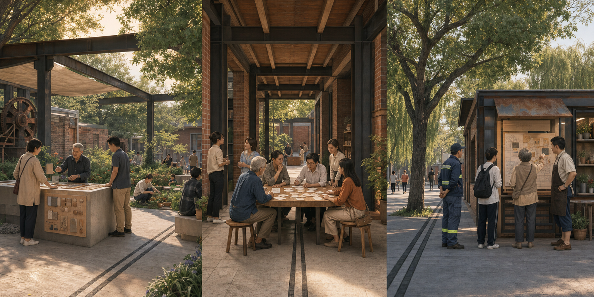

### 离线概念走读：可操作的静态后备表达

v1.5 的 `visual/index.html#concept-walk-lab` 用本地画布把三处公地并置；读者可用键盘或按钮切换，比较谁能进入、进行何种行动以及何时必须暂停。它不请求网络、不记录用户行为、不使用实时地图或真实场地模型。任何空间、运营或落地判断仍以前述图纸、GeoJSON、场景卡、五张凭据、资料清权与专业/使用者复核为准。 [source:SRC-ORIGINAL-OFFLINE-COMMONS-WALK-V15] · [data:visual/assets/commons-walk-config.json] · [depth:offline_commons_walk]

## AI 创新生态、人才画像与 AI+ 场景

生态不以企业名单或融资数字来证明，而以六个接口是否真实可用来判断：模型和数据用途是否被说明，共享测试与红队复盘是否有入口，转化与服务是否可被理解，开发者维护是否被记录，公众能否反馈或退出，独立复核和申诉是否可达。土地/空间、产业、资金、人才、算力、数据与场景不被承诺为既有资源，而被编成“前台问题单”：每一项都必须写明需求、可用范围、责任人和下一次复核。Station F、one-north和Oodi提示“项目、设施和支持网络”须共同出现；本方案因此把科技服务翼理解为一张跨越三区两翼的接口网络，而不是又一座封闭园区。

五类首要使用者是研究者、创业者、学生/开发者、需要可理解服务的居民（包括老年使用者），以及连接线下秩序与数字流程的服务人员/小店经营者。十张场景卡包括：开源模型边界导览、可信AI学习台、小店经营助手的人工复核队列、无障碍出行说明、遗产故事共创、社区议题摘要墙、低碳算力预约提示、夜间安全反馈、公共维护匹配、跨语言来访者问答。三类测试分别在众智园的模型红队、AI原点的居民可理解性与大钟寺的服务收益复盘中进行；每一项都必须有知情同意、数据最小化、退出路径和人工替代。 [source:SRC-STATION-F] · [source:SRC-ONE-NORTH] · [source:SRC-OODI] · [metric:scenario_card_count] · [metric:test_validation_scene_count] · [metric:persona_count]

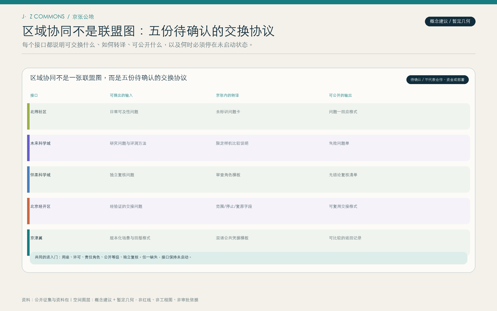

## 用地、建筑规模与拆改留方案

用地表达采用“功能带 + 公共界面”的概念组织，而非确认地块。资料包允许的编码仅用于区分混合服务、研发转译、开放创新和绿地缓冲的讨论层；建筑基底只表示验证与审计、城市AI转译、回报服务三种工作坊与公共接口的关系。它不推断产权、既有用途、法定性质、建筑规模或确认建设量。

后续的保留—更新—替换框架应先完成既有建筑、结构安全、消防、历史文化资源、周边利益相关者和工程条件的核验，再识别可持续使用的空间和能被改善的公共界面，最后才讨论最小干预。概念建筑面积和覆盖率只用于几何自检，不形成开发承诺。 [standard:MNR-LAND-USE-CLASSIFICATION-GUIDE] · [metric:building_footprint_area_sqm] · [data:geometry/buildings.geojson]

## 交通、轨道、市政与公共服务设施

交通策略从“可被每日使用的服务路径”开始：一条慢行主线以连续遮荫、低坡度、短距离停留、易读导视和人工服务点连接三处公地；概念上以东西缝合把社区、学校、研发与商业的公共界面接入，以南北贯通把京张时间线转为连续步行和停留序列。它不重绘现有道路红线、轨道线路、站点位置或停车指标。进一步深化应基于现状交通调查、轨道接驳、消防救援、市政管线、物流、无障碍和夜间安全评估。

新型基础设施被视为可问责的服务：边缘计算应公开能耗与停机逻辑，传感设备应公开用途与数据保留规则，公共终端应提供非数字替代，网络运维应有可联系的责任主体。北京的场景培育开放工作强调技术—场景—产业的路径；本方案将其转译为“小范围、可解释、可暂停”的测试，而非把未成熟技术写成全域部署。 [source:SRC-BEIJING-SCENARIO-OPEN-2026] · [depth:traffic_rail_slow_parking] · [depth:municipal_new_infrastructure] · [data:geometry/roads.geojson]

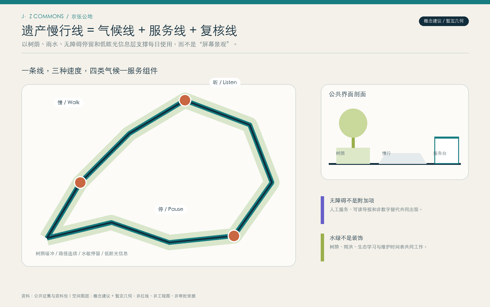

## 蓝绿空间、公共空间与城市风貌

蓝绿系统是账本主线的气候与社会基础设施，不是装饰性绿化。北、中、南三段概念花园分别承接树荫停留、遗产缓冲和回报服务外溢；小尺度公共空间承接说明、反馈、展示和协作。设计语言把AI从高亮屏幕中撤回到可触摸的材料、低眩光的信息层、可维护的植物群落、夜间安全照明和能安静停留的座位上。

对无障碍的回应不是在图纸上加一个图标：导视应有非技术语言、视觉/听觉替代、无障碍路径提示和人工服务位置；对老年人或不使用智能终端的人，服务应有人工或传统路径。清溪川的经验亦提示水绿空间必须连同季节安全、维护与文化使用被组织，因此本方案不对未核验水文或工程性能作承诺。绿色、公共空间和慢行图层在暂定范围内复算，只为了在正式资料替换后快速发现变化。 [source:SRC-CHEONGGYECHEON] · [standard:MOHURD-URBAN-DESIGN-MEASURES] · [metric:green_ratio] · [metric:public_space_ratio]

## 文化叙事、导视与品牌系统

品牌不是为AI加一层炫目的符号，而是把“轨痕、地名、问题和回报”编入可读的公共语言。`J·Z COMMONS / 京张公地` 的原创标志由折轨、双线和开环组成：折轨让时间可读，双线让人和技术同行，开环保留质询、修正和返还的位置。墨蓝轨痕、河流青、银杏绿、砖色回报和克制紫色分别识别线、公地、生态、服务和协作；视觉系统延展为路径钉、树荫下的问答牌、可替换研究卡、回报柜、活动票签和网页信息层。它避免使用企业商标、未获授权的铁路照片或历史图像。

文化叙事以“遗产不是背景、AI不是特效”为前提：京张铁路的时间性给予慢行线和材料语汇，中关村的开放协作被转译为公开问题与维护贡献，AI新文化由可解释、可质询、可共同修改的服务方式构成。三座地标（可验证之窗、转译钟廊、回报驿站）同时是荣誉展示与公共服务接口；任何对历史资源的实体干预，均须在后续文保和专业程序中另行核验。 [source:SRC-AGENT-TASKBOOK] · [metric:ai_pilgrimage_landmark_count] · [data:geometry/public_space.geojson]

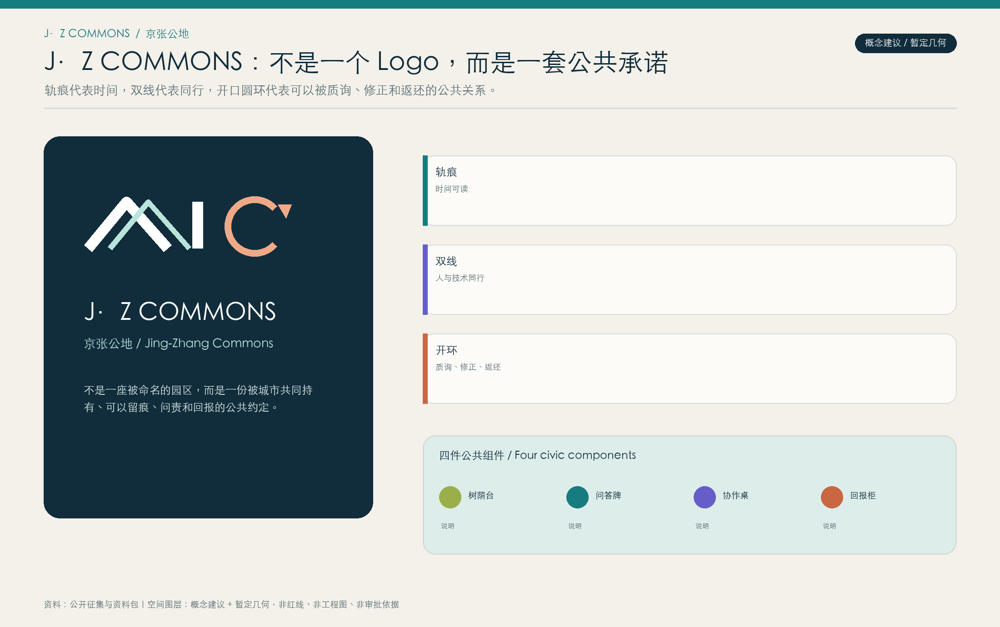

## 活动、开发者社区与长期运营

长期运营以 `J·Z OPEN LEDGER / 京张开放账本` 年度一次的公开回报季组织，而不把活动等同于招商发布会。春季进行‘问题采样与翻译周’，由学生、居民、维护人员和研究者把真实问题整理为可解释的卡片；夏季进行‘低数据场景试用’，以知情同意、人工替代和暂停门为前提；秋季进行‘京张开放账本周’，公开复盘被采纳、被否决与被暂停的场景，并以中英双语发布可复用的场景协议；冬季进行‘维护与再设计会’，把使用、维护、无障碍和气候反馈带回下一年的空间更新。

开发者社区的价值不是单向展示代码，而是让技术贡献、公共反馈和线下维护可以互相看见。中关村科技服务翼可为成果转化、知识产权、资金、人才、算力和场景需求设置“前台问题单”；国际传播的转化路径是“开放协议—同行复核—本地样机—公开回报”，而非承诺招商、资金或合作结果。 [source:SRC-HAIDIAN-1X1-2026] · [source:SRC-ARS-ELECTRONICA] · [source:SRC-AGENT-TASKBOOK] · [depth:renewal_project_list] · [metric:annual_activity_cycle_count]

## 更新项目清单、实施政策与分期计划

实施不按大拆大建排序，而按“先建立可信关系，再扩大可用服务”的节奏。Phase 0 是资料与共同设计：补齐边界、现状、遗产和可及性资料，建立问题、用途、责任、同意和退出协议。Phase 1 在众智园以可逆样机验证公开说明、红队复盘和人机协同学习；Phase 2 在AI原点把翻译网络、协作桌、学生维护和多语导视做成可预约的日常设施；Phase 3 在大钟寺以回报目录、服务收益复盘和维护共担检验是否值得扩展。

每期均有停止条件：如公众可理解性、可及性、数据最小化、气候舒适性或维护能力未满足，则暂停扩展并回到问题定义。更新项目以“协议 + 空间 + 运营”三件套交接，不把政策、资金、招商、审批、建设主体或时间节点写成已经确定的事实。

实施责任应按待确认的角色而非预设机构落位：资料核验由资料持有与专业核验主体负责；每个样机由场景发起人、现场维护者、独立复核者和使用者代表共同确认；日常服务需指定可联系的责任主体、维护团队和申诉入口。每一阶段在开始前记录基线，在结束时公开同一组可衡量指标：完成知情同意/退出路径的场景比例、可由非技术语言复述服务边界的参与者比例、无障碍与人工替代可达率、问题回复时长、维护闭环完成率及经授权的匿名满意度。指标只用于判断“继续、修正或暂停”，不构成未经批准的绩效承诺；年度公开复盘负责将反馈、责任和下一轮问题重新连回空间更新。v1.3 将开始前的90天单列为“零阶段”：只形成资料与权利底图、五张凭据桌面复演、三处公地走读与可及性清单、可逆组件/复原清单、独立审查与公开回执五个未启动工作包；没有场地、权利、专业、责任、许可、独立复核和复原条件时，不能进入真实试点讨论。四件概念组件同时配套空白的工程量和成本方法，数量、规格、单价与币种均待测量、询价和专业复核，绝不伪造预算。 [data:visual/assets/zero-phase-readiness.json] · [data:visual/assets/quantity-cost-method.json] · [metric:zero_phase_work_package_count] · [metric:quantity_cost_method_component_count] · [depth:phasing_implementation] · [depth:renewal_project_list] · [data:geometry/phasing.geojson]

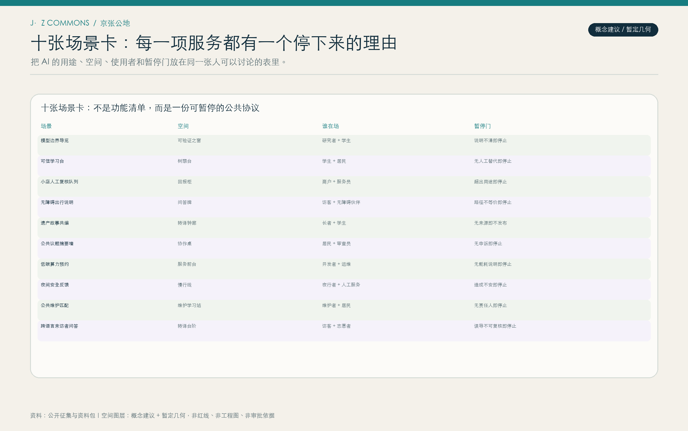

## 指标体系、面积复算与合规矩阵

指标体系把空间与公共回报并列。空间侧包括暂定总体范围、概念绿地、概念公共空间、概念建筑基底及其比率；这些均由本包 GeoJSON 在 EPSG:4548 下复算。公共回报侧包括8个国际方法案例、10张场景卡、3个测试验证场、5类画像、3个公共地标和1个年度活动循环；这些为方案中明确的概念性数量，而非现有设施或承诺。

合规矩阵逐条连接征集要求、六项 agent 任务、标准响应、图纸、几何、指标、来源、假设和自检。矩阵被填写不等于审批或专业结论。官方精确边界、法定控制、现状测绘、工程条件、权属和合作主体仍是关键缺口；任何边界或图层替换后，都应重新运行空间复核、更新指标与图纸。 [metric:site_area_sqm] · [metric:green_space_area_sqm] · [metric:global_method_case_count] · [depth:metrics_recalculation]

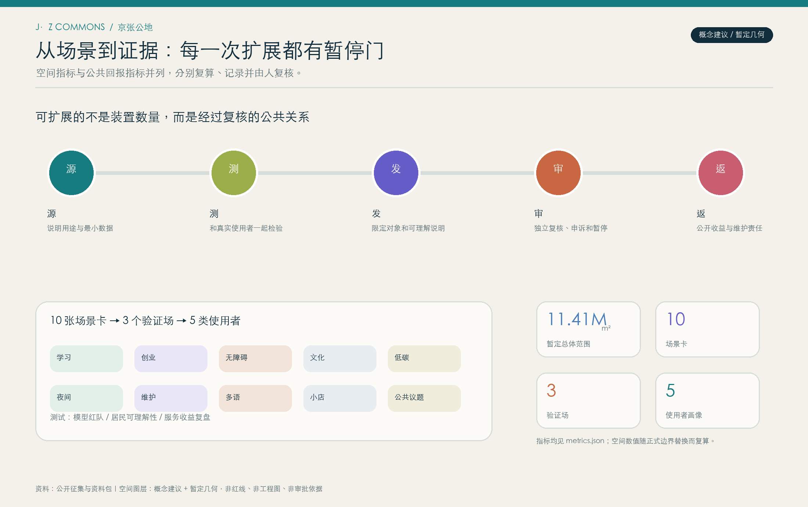

## 风险、版权与合规说明

首要风险是边界与基础资料精度：公开材料提供文字范围、面积量级和暂定几何，不足以支撑法定控制或工程放样。第二类是服务风险：隐私、偏见、误导性自动化和数字排斥，故所有场景采用最小数据、明确用途、人工替代、退出机制、可解释说明和独立复核。第三类是维护风险：每一个门和地标都应有责任主体、维护来源、复审日和停止条件。

本包的文本、概念几何、图纸、静态网页和原创封面视觉均由声明的AI协作生成或基于可公开/清权来源形成。封面只表达设计意象，不描绘已建成或已批准的海淀场景；不含个人数据、商业地图底图、企业标识或受限图片。成果以 CC BY 4.0 发布，支持署名讨论与再利用，但不授予任何第三方实施具体空间、工程、项目或技术服务的许可。 [source:SRC-AI-GENERATED-COVER-20260813] · [source:SRC-AGENT-TASKBOOK] · [depth:risk_missing_data] · [data:geometry/constraints.geojson]

## 参考资料

本方案的来源与使用边界、国际案例的操作/本地转译/不照搬条件，以及 v1.0→v1.5 的评审诊断均见 `sources.json` 与 `report/narrative.md`。

[source:SRC-OFFICIAL-ANNOUNCEMENT] 百年京张AI创新带公开征集公告与资料包范围、任务和交付说明。

[source:SRC-AGENT-TASKBOOK] open-city-ai/haidian 的任务书、六项agent任务和概念边界。

[source:SRC-BEIJING-AI-SOURCE-2023] · [source:SRC-BEIJING-SCENARIO-OPEN-2026] · [source:SRC-HAIDIAN-1X1-2026] 北京与海淀公开政策/产业语境，仅用于设计响应。

[source:SRC-HIGH-LINE-FHL] · [source:SRC-SUPERKILEN] · [source:SRC-OODI] · [source:SRC-ONE-NORTH] · [source:SRC-STATION-F] · [source:SRC-SMART-KALASATAMA] · [source:SRC-ARS-ELECTRONICA] · [source:SRC-CHEONGGYECHEON] 国际方法参照，不作为海淀空间或政策事实。

[standard:PROJECT-OFFICIAL-ANNOUNCEMENT] · [standard:PROJECT-AGENT-OPEN-CALL-TASKBOOK] · [standard:MOHURD-URBAN-DESIGN-MEASURES] · [standard:MOHURD-CONTROL-DETAILED-PLANNING] · [standard:MNR-LAND-USE-CLASSIFICATION-GUIDE]

可公开核查的来源支持任务理解与方法讨论；涉及空间、工程、产权、文保或法定控制的判断，均需在取得相应资料并完成专业复核后另行形成。
