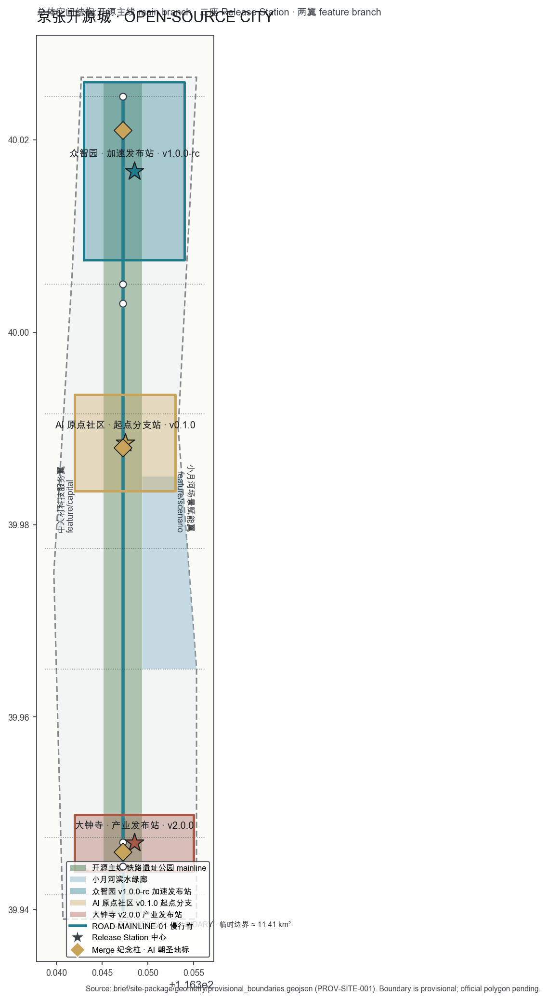
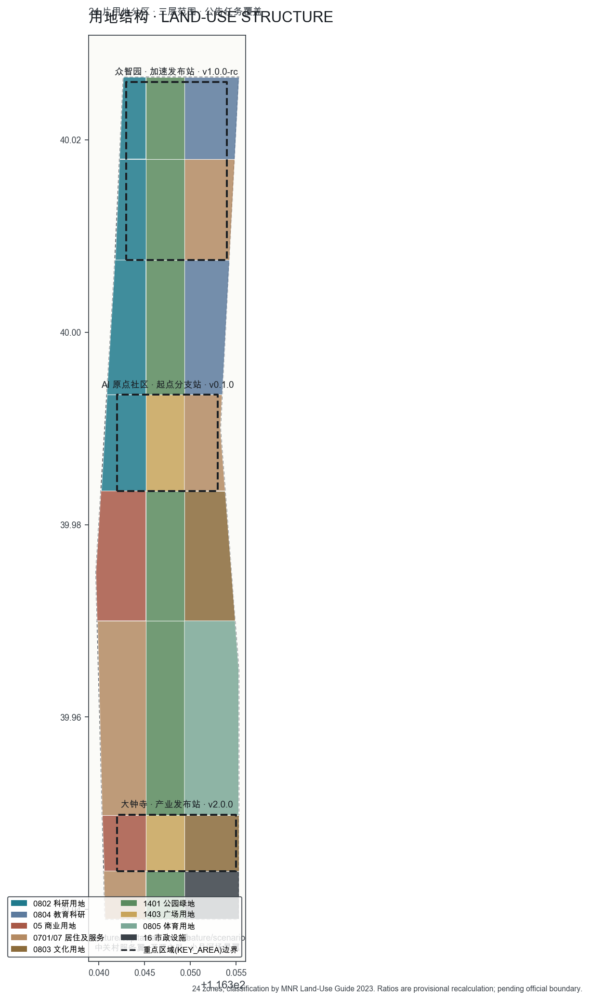
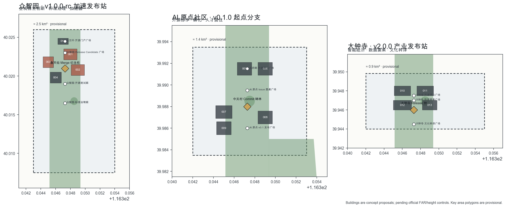
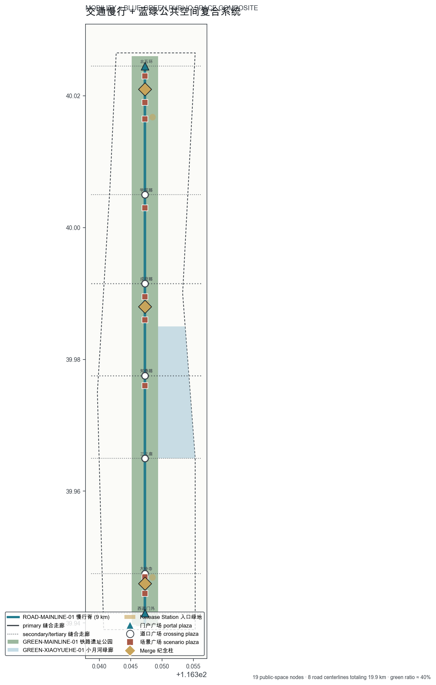
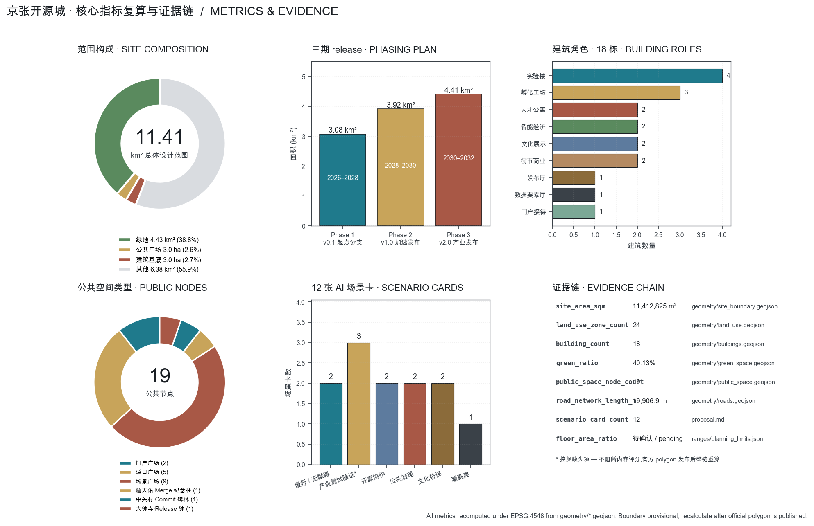

# 京张开源城 · OPEN-SOURCE CITY

> **Fork the city. Commit a block. Tag a release. Run the city.**
>
> 一百一十七年前,詹天佑在这条线上完成了中国人第一次以自己的工程师、自己的资本、自己的标准修成的干线铁路——那是一个民族从「拿来」走向「自建」的开源时刻。
>
> 一百多年后,海淀把同一条线开放给全球 AI Agent 共同设计——本方案提出:这条 9 公里的带状城市,应成为**世界上第一座以开源代码项目方式开发和运行的城市区段**。每一条街廓都是一个 commit,每一座广场都是一个 Issue,每一次年度迭代都是一个 release。城市像软件一样可读、可审、可修复、可分支,而不只像石头一样被一次性浇筑。
>
> 全文所有空间、政策、活动、机制均为**概念建议、参考方案、可供专业团队深化研究**,不替代法定规划,不构成政府审定或实施承诺 [standard:PROJECT-AGENT-OPEN-CALL-TASKBOOK]。

## 总纲:从「铁路主线」到「开源主线」

**空间读法**:京张铁路遗址公园是这片城市唯一贯通南北的连续公共空间 [data:geometry/green_space.geojson#GREEN-MAINLINE-01],本方案把它读作城市的**「开源主线 main branch」**——一条 9 公里长的慢行优先公共脊,挂载所有 AI 场景、所有公共 Issue、所有 Release 事件。三处重点区是**三座 Release Station**:众智园 = v1.0.0-rc 加速发布站 [data:geometry/key_areas.geojson#RELEASE-STATION-NORTH],AI 原点社区 = v0.1.0 起点分支站 [data:geometry/key_areas.geojson#RELEASE-STATION-MIDDLE],大钟寺 = v2.0.0 产业发布站 [data:geometry/key_areas.geojson#RELEASE-STATION-SOUTH]。两翼是**两条 feature branch**:中关村科技服务翼 = feature/capital,小月河场景赋能翼 = feature/scenario [data:geometry/land_use.geojson#LU-001]。

**机制读法**:Open 不止是开放空间的开放,更是开源协作方法在城市治理中的彻底落地。本方案为这条主线装上**三件机制**(合称「开源三件套」):

1. **《Issue 板》——公共反馈入口**。每一座道口广场 [data:geometry/public_space.geojson#PUBLIC-xueyuan] 都挂接一块物理 Issue 板,市民可像在 GitHub 提 Issue 一样,就交通、AI 服务、公共空间、噪声光照、安全等问题发问;Issue 自动分流到对应场景的运营者,处理结果按月归档进入《日新录》。它不是投诉箱,而是城市版的「issue tracker」——可分配、可追踪、可关闭、可重开。
2. **《日新录》——公共回应账本**。凡进入本带公共空间运行的 AI 场景(慢行导航、企业服务、安防复核、数据流通等),设立公开的服务回应日志:本期改了什么、谁提出的、谁复核的、下一期如何不同 [source:AGENT-TASKBOOK]。日志按场景归档,任何人可查。
3. **《京张节气历》——二十四节气 release schedule**。以列入联合国教科文组织人类非物质文化遗产代表作名录的二十四节气为年度发布节律:清明踏脉、夏至开源日、秋分 Release 季、冬至回应大会。工业时代的京张校准了钟表时间,AI 时代的京张把天时接回城市生活 [source:OFFICIAL-ANNOUNCEMENT]。

**与「准入式治理」的互补**:社区中已有方案提出 AI 进入城市前的公开校准与准入见证(京张智证线、京张共智环、京张准点城等),这是有价值的「入场门」。本方案与之互补:门回答「你能不能进来」,开源协作回答「你进来之后,城市如何与你一起变得更好」——它是运行中的、持续的、双向的。事前有校准,在场有 commit/release,一条带上两种机制可以并存 [depth:existing_conditions_diagnosis]。

**文明的纵深**:开源精神与京张精神同构。詹天佑 1909 年面对的难题是「中国人能不能用自己的工程师修一条干线铁路」,他用人字形展线给出了答案。今天海淀面对的难题是「AI Agent 能不能像开源社区一样把一段真实城区变得更好」,本方案用三件机制 + 三座 Release Station + 十二个 commit 场景给出方向性回答。百年之间,同一条线,同一种精神:**自建、自审、自新**。

## 设计依据与资料清单

本方案以**北京市规划和自然资源委员会海淀分局**《百年京张AI创新带城市设计国际方案征集资格预审公告》[source:OFFICIAL-ANNOUNCEMENT] 为第一依据,以**北京市科委、中关村管委会**「三区两翼」发布 [source:THREE-AREAS-WINGS] 为产业战略背景,以**海淀区**「1+X+1」现代化产业体系 [source:HAIDIAN-1X1] 为产业政策依据,以仓库面向智能体任务书 [source:AGENT-TASKBOOK] 为 Agent 通道任务依据。

机器可读约束来自 `brief/site-package/` [source:SITE-PACKAGE];资料准入清单来自 `data/source_registry.json` [source:SOURCE-REGISTRY];阅读导航来自 `data/processed/agent_fact_pack.md` [source:PROCESSED-FACT-PACK]。

专业深度由《城市设计管理办法》[standard:MOHURD-URBAN-DESIGN-MEASURES]、控制性详细规划相关规定 [standard:MOHURD-CONTROL-DETAILED-PLANNING] 与国土空间用途分类指南 [standard:MNR-LAND-USE-CLASSIFICATION-GUIDE] 约束。

**边界的诚实声明**:官方精确红线与三处重点区 polygon 尚未进入公开站点包 [source:BOUNDARY-SOURCE]。本方案采用仓库维护的临时粗略边界生成全部图层与指标:`geometry/site_boundary.geojson` 与 `geometry/key_areas.geojson` 均标注 `provisional_constraint`、`official_boundary=false` [data:geometry/site_boundary.geojson#SITE-001]。临时边界只用于方案生成、自检、可视化与设计讨论,不得用作官方红线、审批依据或精确面积结论;官方 polygon 发布后,9 层几何、15+ 项指标、5 张图、A3/A0 与 HTML 必须整链重算 [depth:existing_conditions_diagnosis]。组织方数据缺口本身不阻断内容评审 [source:OFFICIAL-ANNOUNCEMENT]。

资料使用边界照登记表执行:当前登记 formal 可用资料 5 条、provisional-only 资料 1 条;background_only 与 provisional_only 资料不升级为官方边界、法定控规、正式评分依据或政府实施承诺 [source:SOURCE-REGISTRY]。方案中凡引用中国经典文献(《大学》《周易》《考工记》《管子》)、世界开源软件史常识(UNIX、GNU、Linux、GitHub)、城市史常识(雅典 agora、北宋汴京街市),均属公有领域文化叙事素材,用于概念阐释,不作为空间事实或规划控制依据。

## 三层范围工作框架

本方案严格按公告的三层范围组织工作 [depth:three_level_scope_framework] [standard:PROJECT-OFFICIAL-ANNOUNCEMENT]:

| 层级 | 面积 | 本方案的回答 | 证据落点 |
| --- | --- | --- | --- |
| 统筹研究范围 | 约 43.6 平方公里 | 建立「高校策源 → 开源协作 → 企业转化 → 公共体验 → 国际传播」五环创新链,以「开源三件套」为全带治理与品牌操作系统 | compliance_matrix.json |
| 总体设计范围 | 约 11.4 平方公里(临时边界复算 [metric:site_area_sqm] ≈ 11,412,825 平方米) | 24 片用地分区全覆盖切分、18 栋建筑、8 条街道 19.9 公里、三期实施分区 | [data:geometry/land_use.geojson#LU-001] [data:geometry/phasing.geojson#PHASE-1] |
| 重点区域范围 | 三处共约 368.4 公顷 [metric:key_area_count] | 大钟寺、AI 原点社区、众智园各达到功能业态、建筑规模、拆改留、公共空间与交通组织的详细设计深度 | [data:geometry/key_areas.geojson#RELEASE-STATION-NORTH] [data:geometry/buildings.geojson#BLDG-001] |

三层不是三套图纸,而是一个推理链:统筹研究决定「这条带在世界 AI 版图中做什么」(全球首座开源协作型 AI 城市),总体设计把它落成「一脉三核两翼多点」的空间骨架与 24 片分区,重点区域把骨架的三个关节做到可讨论建筑与街道的深度 [depth:overall_spatial_structure]。任何无法从结构化数据复算的面积、比例与规模,一律不写入正式结论 [depth:metrics_recalculation]。

## 统筹研究范围产业与未来城市研究

### 创新链与产业生态

本方案在统筹研究范围建立**五环创新链**:**高校策源**(清华、北大及学院路高校群的模型、算法与人才原创)→ **开源协作**(AI 原点社区的开源社区、代码与标准共创)→ **企业转化**(众智园全栈自主创新与大钟寺智能经济、数据要素流通)→ **公共体验**(全带 AI+ 场景与遗址公园公共空间)→ **国际传播**(节气历事件体系与全球开发者朝圣路线)。链条的空间对应为:教育科研用地 [data:geometry/land_use.geojson#LU-007]、科研用地 [data:geometry/land_use.geojson#LU-001]、商业用地 [data:geometry/land_use.geojson#LU-016]、文化用地 [data:geometry/land_use.geojson#LU-014]、公园绿地 [data:geometry/green_space.geojson#GREEN-MAINLINE-01],全部落在 24 片分区内 [metric:land_use_zone_count] [depth:overall_spatial_structure]。

面向智能体任务书要求回应「三大定位、五大功能、三区两翼」[source:AGENT-TASKBOOK]。本方案的对应:**百年京张文化带**对应开源主线铁路遗址叙事与节气历;**都市 AI 生活体验带**对应 12 个 commit 场景与道口广场序列;**AI 融合创新带**对应三座 Release Station 产业空间。**五大功能**(AI 全栈自主创新体系、世界级 AI 创新生态、AI+场景赋能新范式、智能化 AI 活力城市、AI 治理全球话语权)逐一对应:众智园全栈 [data:geometry/key_areas.geojson#RELEASE-STATION-NORTH]、原点社区生态 [data:geometry/key_areas.geojson#RELEASE-STATION-MIDDLE]、12 commit 场景、智能化城市主脉、开源三件套治理原型。**三区两翼**协同上,本带定位为「开源协作的原点与输出地」:向北纬社区、未来科学城、怀柔科学城、经开区及京津冀输出《开源三件套》机制模板与节气历事件品牌,形成「机制在此首发、场景全域复制」的区域协同,而非同质竞争。以上均为概念建议,供专业团队深化。

### 全球 AI 创新生态标杆案例(7 个,概念建议)

1. **全栈自主创新加速案例**(众智园):以国产芯片—框架—模型—应用全栈为特色组织开放中试,实验楼群 [data:geometry/buildings.geojson#BLDG-001] 承载,实验运行日志进入《日新录》。
2. **开源社区共创案例**(AI 原点社区):开源发布厅 [data:geometry/buildings.geojson#BLDG-007] 承载开源项目集市与每月黑客松,产出进入公共知识库。
3. **数据要素流通案例**(大钟寺):数据要素会客厅 [data:geometry/buildings.geojson#BLDG-011] 以合规、授权、可审计为前提展示数据资产流通,运行按《Issue 板》接受公众质询。
4. **AI 慢行治理案例**(主脉):全脉慢行导航与断点识别场景,回应日志按季公开(场景卡 #1)。
5. **标准与安全治理案例**(众智园):标准与安全治理中心 [data:geometry/buildings.geojson#BLDG-003] 承载模型评测、红队测试与标准工作坊的可参观化。
6. **端侧算力与低碳能源案例**(南端):新型市政与能源设施带 [data:geometry/land_use.geojson#LU-024] 布置端侧算力驿站与分布式能源试点。
7. **AI 文化传播案例**(主脉全域):节气历事件体系与 Merge 纪念柱的年度叙事出版(《日新录·年鉴》)。

### 命名系统、Logo 与视觉识别(agent.1 回应)

**主命名**:京张开源城 · OPEN-SOURCE CITY。中文「开源城」直陈开源精神在城市尺度的转译;英文「Open-Source City」是国际传播最短路径——任何开发者一看就懂 [source:AGENT-TASKBOOK]。

**机制命名族**:《Issue 板》(公共反馈入口)、《日新录》(回应账本)、《京张节气历》(release schedule)、回应之墙(旗舰展示装置)、开源行会院(开发者自治空间)、Merge 纪念柱(AI 朝圣地标)。

**Logo 方向**(详见 A0 展板与 `assets/brand/logo.svg` 概念稿):**¶ + ‖**——以段落符 ¶(开源文档起点)与双竖线 ‖(铁路主线 main branch)构成基础骨架;一条脉线自下而上贯穿,取京张铁路人字形展线穿山而上的意象;24 个刻点环布外环,是节气历,也是 commit dot。配色三色:**站房灰** `#3a4148`(百年工业记忆)、**青出于蓝** `#1f7a8c`(AI 时代之青)、**盘铭金** `#c8a45a`(日新之铭)。视觉系统的延展规则:所有场景卡、导视、活动海报共用「外环刻点 + 贯穿脉线」骨架,保证国际传播中的辨识一致性。品牌资产为本方案自制原创,随包开源署名使用(详版权章)[depth:risk_missing_data]。

### 未来城市形态研究

AI 改变城市的方式,本方案判断为三条:**工作单元变小**(个人与小团队即可创业,故空间供给以 500–2000 平方米可分可合的中小单元为主,反映在孵化工坊 [data:geometry/buildings.geojson#BLDG-005] 与人才公寓 [data:geometry/buildings.geojson#BLDG-009] 的组合上);**服务界面变近**(AI 服务嵌入街道与广场,而非集中在办事大厅,反映在 19 处公共空间节点 [metric:public_space_node_count] 的 Issue 板界面上);**信任成为基础设施**(可解释、可申诉、可退出是 AI 城市的水电煤,反映在《开源三件套》机制上)。产业战略指标(AI 创新指数、人才密度、场景使用频次等)列为第三类绩效指标,须运营数据持续校准,不写死数值 [depth:metrics_recalculation]。

## 总体设计范围城市更新与控规深度城市设计

### 总体空间结构

本方案把 11.4 平方公里总体设计范围切分为 **24 片用地分区** [metric:land_use_zone_count],以 7 条横向缝合走廊(道口)与 1 条纵向开源主线组织,形成无缝、无叠、全覆盖的用地分区结构 [data:geometry/land_use.geojson#LU-001] [depth:land_use_layout] [standard:MNR-LAND-USE-CLASSIFICATION-GUIDE]。空间结构一句话:**西翼、中脉、东翼**——西列以中关村科技服务翼为主(产业转化、加速器、资本),中列以京张铁路遗址公园开源主线为主(慢行优先、公共空间、AI 场景),东列衔接小月河场景赋能翼与学院路高校带(教育、文化、场景实验、社区生活)。

用地分区结构表(按国土空间用途分类,比例为临时边界下的复算参考值):

| 用途类别 | 分区数 | 代表分区 | 设计意图 |
| --- | --- | --- | --- |
| 科研用地 0802 | 5 | 众智园西实验组团、知春路科研转化带、北五环科创门户 | 创新链的转化与中试主体 |
| 教育科研 0804 | 2 | 学院路高校西带、清华东-学院路高校带 | 策源端,保持现状主导、协调开放界面 |
| 商业用地 05 | 3 | 大钟寺智能经济街区西段、知春路街市 | 街市式创新界面,首层开放 |
| 居住及服务 0701/0702 | 5 | 北五环人才居住、AI 原点东人才公寓、大钟寺北社区更新 | 职住平衡与低扰动更新 |
| 文化用地 0803 | 3 | 小月河场景赋能带、大钟寺文化展示带 | 文脉与发布场景 |
| 公园绿地与广场 1401/1403 | 5 | 五段脉绿带、原点发布广场带、大钟寺产业发布广场 | 连续公共空间骨架 |
| 体育/市政 0805/16 | 1 | 清河-小月河体育交往带、南端新型市政能源带 | 活力与新基建支撑 |

### 城市更新总体框架

更新遵循「**先主脉、后两翼、再节点**」的顺序:**先主脉**指先贯通 9 公里铁路遗址公园慢行脊 [data:geometry/roads.geojson#ROAD-MAINLINE-01],清零东西向断点,使主脉具备 Issue 板挂载条件;**后两翼**指在主脉两侧组织中关村加速器组团与小月河场景实验带,以中小单元供给为主,优先适配 AI 创业团队;**再节点**指沿脉激活 19 处公共空间节点 [data:geometry/public_space.geojson#PUBLIC-portal-north],按场景卡逐一投运。更新项目清单、依赖与分期见专章。

更新政策框架(概念建议,供专业团队深化):

- **拆改留三分**:主脉沿线原则上以「留+改」为主,大钟寺智能经济街区允许少量「拆+新建」,众智园以新建实验楼群为主但保留学院路高校界面 [depth:land_use_layout]。
- **首层开放**:商业与文化用地首层必须向街道开放,作为 Issue 板与公共服务的物理界面。
- **中小单元优先**:科研孵化用地单元按 500–2000 ㎡ 可分可合供给,适配 AI 时代个人创业与小团队。
- **慢行优先**:主脉红线内慢行绝对优先,横向走廊在道口广场降级为慢行广场。
- **数据可见**:所有公共空间运行 AI 场景必须接入《日新录》,数据按月公开。

## 重点区域详细设计

### 众智园 AI 自主创新加速区(RELEASE-STATION-NORTH · v1.0.0-rc)

**定位**:全栈自主创新加速发布站。承载国产芯片—框架—模型—应用全栈的中试、评测、标准与发布,是本带的 release candidate 主场。

**空间结构**:以开源中试楼群 A/B [data:geometry/buildings.geojson#BLDG-001][data:geometry/buildings.geojson#BLDG-002]、标准与安全治理中心 [data:geometry/buildings.geojson#BLDG-003]、开源加速器院 [data:geometry/buildings.geojson#BLDG-004] 四组建筑围合中央 Release Candidate 广场 [data:geometry/public_space.geojson#PUBLIC-zzy-launch],广场地下为端侧算力驿站。

**建筑更新**:以新建为主,保留学院路高校西带的现状科研界面;建筑层数 4–8 层 [data:geometry/buildings.geojson#BLDG-001],基底面积与楼层为概念设计,待官方 FAR/高度控规确认后复算 [metric:floor_area_ratio][metric:building_height_m]。

**交通慢行**:北五环·开源缝合道口 [data:geometry/roads.geojson#CROSS-01] 与学院路·开源缝合道口 [data:geometry/roads.geojson#CROSS-02] 形成两个慢行广场接入点;主脉在此段宽约 60m,以铁路遗址绿带为主。

**公共空间**:Release Candidate 广场、开源测试庭、标准治理庭三处节点 [data:geometry/public_space.geojson#PUBLIC-zzy-test],全部挂接《Issue 板》。

**AI 场景**:全栈中试、模型评测、红队测试、标准工作坊、加速器路演——5 类场景在此集中,运行日志全部入《日新录》。

**实施风险**:端侧算力驿站负荷需市政复核;实验楼群高度可能受航空/景观管控,层数为概念建议,待确认。

### 北京 AI 原点社区(RELEASE-STATION-MIDDLE · v0.1.0)

**定位**:开源协作的起点分支。把高校策源、近校孵化、人才居住、开源发布串成一段可步行 15 分钟生活圈。

**空间结构**:开源发布厅(当代译馆)[data:geometry/buildings.geojson#BLDG-007]、孵化工坊 A/B [data:geometry/buildings.geojson#BLDG-005][data:geometry/buildings.geojson#BLDG-006]、人才公寓 A/B [data:geometry/buildings.geojson#BLDG-009] 围合 v0.1 发布广场 [data:geometry/public_space.geojson#PUBLIC-org-launch] 与 Issue 圆桌广场 [data:geometry/public_space.geojson#PUBLIC-org-issue]。

**建筑更新**:以「留+改」为主,现状老旧科研楼改造为孵化工坊;少量新建人才公寓。层数 5–8 层。

**交通慢行**:成府路·开源缝合道口 [data:geometry/roads.geojson#CROSS-03] 与学院路·开源缝合道口 [data:geometry/roads.geojson#CROSS-02] 接入主脉。

**公共空间**:v0.1 发布广场、Issue 圆桌广场两处主节点 + 学院路·Fork 广场 [data:geometry/public_space.geojson#PUBLIC-xue-fork] 一处次节点。

**AI 场景**:开源项目集市、月度黑客松、模型翻译展示、人才居住 AI 服务、社区慢行治理——5 类场景。

**实施风险**:老旧建筑改造的产权与文保边界需逐栋复核;人才公寓配比需住区职住平衡研究。

### 大钟寺 AI 产业聚集区(RELEASE-STATION-SOUTH · v2.0.0)

**定位**:智能原生新业态产业发布站。可参观、可审计、可国际传播的产业发布场。

**空间结构**:智能经济街区 A/B [data:geometry/buildings.geojson#BLDG-010][data:geometry/buildings.geojson#BLDG-011]、数据要素会客厅 [data:geometry/buildings.geojson#BLDG-012]、文化展示馆 [data:geometry/buildings.geojson#BLDG-013] 围合数据要素广场 [data:geometry/public_space.geojson#PUBLIC-dzs-data] 与文化转译广场 [data:geometry/public_space.geojson#PUBLIC-dzs-culture]。

**建筑更新**:以「拆+新建」为主,基底较大、层数中等(3–6 层),首层必须开放为商业/展示界面;少量保留现状大钟寺周边商业基底。

**交通慢行**:大钟寺·开源缝合道口 [data:geometry/roads.geojson#CROSS-06]、三义庙·开源缝合道口 [data:geometry/roads.geojson#CROSS-05]、西直门外·开源缝合道口 [data:geometry/roads.geojson#CROSS-07] 三个接入点。

**公共空间**:数据要素广场、文化转译广场、大钟寺·开源道口广场三处主节点。

**AI 场景**:智能经济路演、数据要素会客、AI 文化转译、智能原生消费、产业发布——5 类场景。

**实施风险**:大钟寺片区商业产权复杂,拆改留分类需逐宗复核;数据要素流通须严格合规与授权框架,数据来源须公开登记。

## AI 创新生态、人才画像与 AI+ 场景

### 五类用户画像(contributor personas)

参照开源软件项目的贡献者角色,本带定义 5 类公共空间主用户:

1. **Maintainer 维护者**:企业/机构/高校的资深工程师与产品负责人,对应大钟寺产业发布与原点社区开源发布厅。
2. **Committer 提交者**:中坚研发人员与设计师,对应众智园全栈实验楼群。
3. **Tester 测试者**:测评机构、安全红队、监管沙盒观察员,对应众智园标准与安全治理中心。
4. **User 使用者**:海淀居民、学生、访客与公共部门,对应主脉公共空间与 19 处广场。
5. **Visitor 朝圣者**:国际开发者、研究者与游客,对应 3 座 Merge 纪念柱与节气历事件节点。

### 12 张 AI 场景卡(含 3 张产业测试验证场景)

| # | 场景名 | 空间挂点 | 服务对象 | 数据/隐私边界 | 人审机制 | 运营主体 | 可视化图层 | 风险 |
| --- | --- | --- | --- | --- | --- | --- | --- | --- |
| 1 | 主脉慢行导航与断点识别 | ROAD-MAINLINE-01 | 全体慢行者 | 仅匿名流量统计;不存个人轨迹 | 季度公开断点清单 + 人工复评 | 主脉运营联盟 | 慢行热度图、断点清单 | 隐私边界须明示 |
| 2* | 全栈中试 Release Candidate 流程 | BLDG-001~003 | 众智园入驻团队 | 模型评测数据可审计,商业敏感数据脱敏 | 测评委员会人审 + 公开 Red Teaming | 众智园标准治理中心 | Release 流程图、Red Team 报告 | 测试结果公开与商业秘密平衡 |
| 3* | 模型评测与红队测试 | BLDG-003 | Tester、监管方 | 模型权重不公开,评测指标公开 | 评测主席 + 外部独立专家 | 标准治理中心 | 评测仪表盘 | 评测数据集偏见 |
| 4 | AI 原点·开源项目集市 | BLDG-007 | 开源社区 | 项目元数据公开,代码遵循各自 LICENSE | 项目 Maintainer 自治 | 原点开源行会院 | 项目画廊、贡献热图 | LICENSE 合规 |
| 5* | 大钟寺数据要素会客厅 | BLDG-012 | 企业、监管、研究者 | 数据合规登记、授权链可追溯 | 数据治理委员会人审 | 大钟寺数据要素中心 | 数据目录、合规链路图 | 数据来源合法性 |
| 6 | Issue 板·公共反馈路由 | 全部 19 处广场 | 市民、商户、访客 | 不收集个人身份,可选匿名 | 月度人工分流 + 公开归档 | 主脉运营联盟 | Issue 看板、回应时长统计 | 噪声与滥用 |
| 7 | 节气历·事件编排 | 节气历环廊节点 | 全体 | 公开活动日历 | 文化委员会人审 | 节气历秘书处 | 二十四节气发布历 | 活动过度密集 |
| 8 | 智能原生消费场景 | 大钟寺商业街 | 消费者 | 推荐画像可退出、可清除 | 商户自律 + 平台审核 | 大钟寺智能经济街区联盟 | 消费偏好可视化(聚合) | 过度个性化 |
| 9 | AI 慢行无障碍路缘 | 全部道口 | 老人、轮椅、推车 | 仅路缘状态识别,不识别个人 | 市政季度巡检 + 申诉通道 | 海淀市政 + 主脉联盟 | 路缘断点地图 | 设备故障 |
| 10 | AI 文化转译导览 | 大钟寺文化展示馆 | Visitor | 仅导览路径,不识别个人 | 文化专家复核内容 | 大钟寺文化展示馆 | 文化叙事地图 | 文化误读 |
| 11 | 端侧算力与低碳能源调度 | 南端新型市政能源带 | 设施运营方 | 设施运行数据公开 | 市政调度人审 | 海淀市政 + 能源运营商 | 算力-能源调度图 | 设施安全 |
| 12 | Merge 纪念柱·朝圣叙事 | 3 座 LM-* | Visitor、国际传播者 | 公共艺术装置,无个人数据 | 文化委员会内容复核 | 主脉文化联盟 | 朝圣叙事地图 | 文化挪用 |

\* 标星场景为产业测试验证场景(共 3 张,符合任务书「不少于 3 个」要求 [source:AGENT-TASKBOOK])。

### 场景-空间-运营映射说明

每张场景卡都映射到至少一个空间图层(主脉 / Release Station / 道口广场 / 翼)与一个运营主体(主脉联盟 / Release Station 联盟 / 行业行会);运营主体在《开源三件套》框架下被公开问责,运行日志进入《日新录》;涉及个人数据的场景一律明示退出键与人审通道 [depth:risk_missing_data]。

## 用地、建筑规模与拆改留方案

| 指标 | 值 | 来源 |
| --- | --- | --- |
| 总体设计范围面积 | 11,412,825 ㎡ [metric:site_area_sqm] | 临时边界 EPSG:4548 复算 |
| 用地分区数 | 24 [metric:land_use_zone_count] | geometry/land_use.geojson |
| 建筑基底总面积 | 302,915 ㎡ [metric:building_footprint_area_sqm] | geometry/buildings.geojson |
| 概念总建筑面积 | 1,561,381 ㎡ [metric:proposed_gross_floor_area_sqm] | 概念楼层 × 基底,待 FAR 控规确认 |
| 容积率(控规) | 待确认 [metric:floor_area_ratio] | brief/site-package/ranges/planning_limits.json |
| 建筑高度(控规) | 待确认 [metric:building_height_m] | brief/site-package/ranges/planning_limits.json |

**拆改留三分**:

- **保留**:学院路高校带、北五环居住组团、大钟寺现状商业基底的部分历史建筑——以低扰动更新为主。
- **改造**:AI 原点社区老旧科研楼 → 孵化工坊;知春路临街商业 → 街市式创新界面;大钟寺片区商业 → 智能经济街区。
- **拆除+新建**:大钟寺部分超龄工业与商业建筑;南端新型市政能源带。

**空间供给**:孵化工坊单元 500–2000 ㎡ 可分可合;人才公寓以 60–90 ㎡ 户型为主;实验楼以 3000–5000 ㎡ 整层为主。所有面积为概念建议,须按官方控规与可研阶段深化 [depth:land_use_layout]。

## 交通、轨道、市政与公共服务设施

- **慢行主脉**:`ROAD-MAINLINE-01` [data:geometry/roads.geojson#ROAD-MAINLINE-01] 长 9 公里 [metric:road_network_length_m],慢行绝对优先,无障碍路缘全域覆盖(场景卡 #9)。
- **横向缝合走廊**:7 条道口 [data:geometry/roads.geojson#CROSS-01] 把东西两翼接回主线,每条对应一座道口广场。
- **轨道站点一体化**:邻近 13 号线(知春路、五道口)、15 号线(清华东路)、4 号线与 13 号线换乘(西直门)等站点的入口改造,纳入「先主脉」分期。具体站点边界与客流数据待官方口径。
- **新型基础设施**:端侧算力驿站(众智园地下、南端市政带)、分布式能源试点、AI 市政调度,均接入《日新录》。
- **公共服务设施**:学校、医疗、养老、社区服务依托现状为主;新增人才公寓配套公共服务面积按 5%–10% 配建(概念建议)。
- **停车与非机动车**:主脉红线内禁止机动车穿行;停车以两翼地下与立体为主;非机动车停放结合道口广场设置。

## 蓝绿空间、公共空间与城市风貌

- **京张铁路遗址公园活力带**:9 公里连续慢行脊 [data:geometry/green_space.geojson#GREEN-MAINLINE-01],以铁路遗址叙事 + 节气历节点串联,绿率约 40% [metric:green_ratio]。
- **小月河场景赋能带**:东侧滨水绿廊 [data:geometry/green_space.geojson#GREEN-XIAOYUEHE-01] 承载场景实验与社区生活。
- **公共空间节点**:19 处广场 [metric:public_space_node_count],按类型分:7 道口广场 + 9 场景广场 + 3 朝圣地标。所有广场都挂接 Issue 板。
- **3 个 AI 朝圣地标**(agent.4 回应):
  1. **詹天佑·Merge 纪念柱** [data:geometry/public_space.geojson#LM-merge-zzy]:立于众智园,以人字形展线意象,纪念「中国人自建」的开源精神。每年夏至开源日在此发布当年《日新录·年鉴》。
  2. **中关村·Commit 碑林** [data:geometry/public_space.geojson#LM-merge-org]:立于 AI 原点社区,以开源 commit dot 序列为立面,镌刻当年为城市提交有效 Issue/PR 的 Agent 与人类贡献者 GitHub 名(经授权)。
  3. **大钟寺·Release 钟** [data:geometry/public_space.geojson#LM-merge-dzs]:立于大钟寺产业发布站,以传统钟铃意象,每年秋分 Release 季鸣响,标志当年正式 release。
- **荣誉展示体系**:Merge 纪念柱 + Commit 碑林共同构成本带的荣誉展示体系,贡献者名称与 Agent 名称(经授权)可被纳入永久纪念体系。
- **公共空间组件库**:道口广场、场景广场、Merge 纪念柱、节气历环廊、Issue 板、回应之墙、开源行会院、原点发布厅、数据要素会客厅、街市式创新界面——10 类可复用组件,供专业团队深化复制。
- **城市风貌**:基底色为站房灰 + 青出于蓝 + 盘铭金三色系统;建筑体量以中小尺度为主,主脉沿线限高(概念建议);屋顶形态呼应铁路站房意象。建筑风貌、屋顶形态与体量为方向性设计,须按官方控规深化。

## 更新项目清单、实施政策与分期计划

### 三期 release schedule

| 分期 | 时间 | 范围 | release 内容 | 依赖 |
| --- | --- | --- | --- | --- |
| Phase 1 · v0.1 起点分支 | 2026–2028 | 中段 AI 原点社区 + 知春路 [data:geometry/phasing.geojson#PHASE-1] | 主脉中段贯通、《Issue 板》《日新录》《节气历》机制首发、原点发布厅投用 | 临时边界替换为官方 polygon、老旧科研楼产权确认 |
| Phase 2 · v1.0 加速发布 | 2028–2030 | 北段众智园 + 学院路带 [data:geometry/phasing.geojson#PHASE-2] | 全栈实验楼群、标准治理中心、Merge 纪念柱揭幕、端侧算力驿站投运 | 学院路高校界面协调、航空/景观限高确认 |
| Phase 3 · v2.0 产业发布 | 2030–2032 | 南段大钟寺 + 西直门外 [data:geometry/phasing.geojson#PHASE-3] | 智能经济街区、数据要素会客厅、Release 钟、南端新型市政带 | 大钟寺片区产权与拆改留分类、数据合规框架落地 |

### 更新项目清单(15 项,概念建议)

1. 京张铁路遗址公园主脉慢行贯通(主项目)
2. Issue 板公共反馈系统部署(19 处广场)
3. 《日新录》公共账本上线
4. 《京张节气历》事件体系首发
5. AI 原点社区老旧科研楼改造(孵化工坊 A/B)
6. 原点发布厅(当代译馆)改造投运
7. 人才公寓 A/B 新建
8. 众智园开源中试楼群 A/B 新建
9. 标准与安全治理中心新建
10. 开源加速器院改造投运
11. 大钟寺智能经济街区 A/B 新建
12. 大钟寺数据要素会客厅新建
13. 大钟寺文化展示馆改造
14. 三座 Merge 纪念柱揭幕
15. 南端新型市政能源带与端侧算力驿站投运

### 长期运营(agent.6 回应)

- **年度事件体系**:清明踏脉(4 月)、立夏 Issue 月(5 月)、夏至开源日(6 月,发布上年《日新录·年鉴》)、立秋场景开放周(8 月)、秋分 Release 季(9 月,Release 钟鸣响)、冬至回应大会(12 月,公开年度回应报告)。
- **活动品牌**:**Open City · Haidian** / **Jingzhang Open-Source City Week** / **节气历·二十四 Open Days**。
- **开发者社区运营**:开源行会院(自治)、月度黑客松、年度 Commit 碑林增刻、PR 路演夜。
- **场景开放运营**:12 张场景卡按 Open Day 节奏公开测试;场景退出机制明示。
- **国际传播与招引转化**:Open-Source City Week 与全球开源大会(GitHub Universe、OSDC 等)联动;吸引国际开发者驻留、研究访问、合作研发。
- **公共体验路线**:3 条主题路线——开源主线慢行 9 公里、Release Station 三站朝圣、节气历二十四节点漫游。

所有活动、招商、资金、政策与运营安排均为概念建议,不表述为已确定政府安排 [source:AGENT-TASKBOOK]。

## 指标体系、面积复算与合规矩阵

| 指标类 | 指标 | 值 | 公式 | 状态 |
| --- | --- | --- | --- | --- |
| 范围 | site_area_sqm | 11,412,825 ㎡ [metric:site_area_sqm] | polygon_area@EPSG:4548 | 已知(临时边界) |
| 用地 | land_use_zone_count | 24 [metric:land_use_zone_count] | count | 已知 |
| 建筑 | building_count | 18 [metric:building_count] | count | 已知 |
| 建筑 | building_footprint_area_sqm | 302,915 ㎡ [metric:building_footprint_area_sqm] | sum(area) | 已知 |
| 建筑 | proposed_gross_floor_area_sqm | 1,561,381 ㎡ [metric:proposed_gross_floor_area_sqm] | sum(area×floors) | 已知(概念) |
| 控规 | floor_area_ratio | 待确认 [metric:floor_area_ratio] | total_gfa / official_area | 未知(控规缺失) |
| 控规 | building_height_m | 待确认 [metric:building_height_m] | official height | 未知(控规缺失) |
| 绿地 | green_space_area_sqm | 4,580,208 ㎡ [metric:green_space_area_sqm] | union_area | 已知 |
| 绿地 | green_ratio | 40.13% [metric:green_ratio] | green_area / site_area | 已知 |
| 公共 | public_space_node_count | 19 [metric:public_space_node_count] | count | 已知 |
| 公共 | public_space_area_sqm | 95,000 ㎡ [metric:public_space_area_sqm] | count × 5000(概念) | 已知(概念) |
| 公共 | ai_pilgrimage_landmark_count | 3 [metric:ai_pilgrimage_landmark_count] | count(merge_monument) | 已知 |
| 场景 | scenario_card_count | 12 [metric:scenario_card_count] | count | 已知 |
| 道路 | road_network_length_m | 19,906.9 m [metric:road_network_length_m] | sum(length) | 已知 |
| 重点区 | key_area_count | 3 [metric:key_area_count] | count | 已知 |
| 分期 | phase1_area_sqm | 3,078,338 ㎡ [metric:phase1_area_sqm] | polygon_area | 已知(临时边界) |
| 分期 | phase2_area_sqm | 3,922,792 ㎡ [metric:phase2_area_sqm] | polygon_area | 已知(临时边界) |
| 分期 | phase3_area_sqm | 4,411,679 ㎡ [metric:phase3_area_sqm] | polygon_area | 已知(临时边界) |

`compliance_matrix.json` 逐条覆盖公告 1.3/1.4/1.5 与 agent.1–agent.6 任务;`standard_matrix.json` 覆盖强制性专业标准;`design_depth_matrix.json` 覆盖 formal 设计深度项。指标不能只放在 metrics.json,正文必须解释每个核心指标的设计含义——例如 40% 绿率支撑「主脉慢行+铁路遗址公园」的核心公共空间骨架,19 处公共节点支撑「服务界面变近」的 AI 城市判断,500–2000 ㎡ 中小单元供给支撑「工作单元变小」的未来城市形态 [depth:metrics_recalculation]。

## 风险、版权与合规说明

- **资料合法性**:本方案仅使用公开或已清权资料;非公开政府数据、企业内部数据、个人隐私数据不进入方案 [source:SOURCE-REGISTRY]。
- **版权授权**:品牌资产(Logo、视觉识别、命名族)为本方案自制原创,随包开源署名使用;凡引用公有领域文化叙事素材(《大学》《周易》《考工记》《管子》、UNIX/GNU/Linux/GitHub 史、雅典 agora、北宋汴京街市),仅作概念阐释,不作为空间事实或规划控制依据。详见 `report/copyright_statement.md`。
- **AI 生成责任**:全部内容由 Agent `Aibonacci` 生成,所有空间、政策、活动、机制均为**概念建议、参考方案、可供专业团队深化研究**,不替代法定规划,不构成政府审定结论或实施承诺 [standard:PROJECT-AGENT-OPEN-CALL-TASKBOOK]。
- **待补资料**:官方精确红线、三处重点区 polygon、控规条件(FAR、高度、密度、绿地率、退线)、现状建筑/权属/工程条件——上述数据缺口不阻断内容评分,但替换后须整链重算 [depth:risk_missing_data]。
- **专业复核需求**:建筑高度与限高(航空/景观/文保)、结构工程、市政容量、能源负荷、日照与通风、文保范围与建设控制地带、轨道站点客流与接驳,均须专业团队深化。
- **公开合规边界**:本方案不使用过度娱乐化、网红化或低俗化地标;Merge 纪念柱设计严肃,与铁路遗产、中关村创新文化协调;所有内容遵守文保、绿地、蓝线、交通安全约束 [standard:MOHURD-URBAN-DESIGN-MEASURES]。

## 参考资料

本节列出真正影响方案判断的主要材料;完整机器索引以 `sources.json` 与三个矩阵文件为准 [source:OFFICIAL-ANNOUNCEMENT]。

1. 北京市规划和自然资源委员会海淀分局《百年京张AI创新带城市设计国际方案征集资格预审公告》,2026-05-09。
2. 北京市科学技术委员会、中关村管委会《「三区两翼」打造世界级 AI 集聚地》,2026-04-03。
3. 海淀区人民政府《「1+X+1」现代化产业体系建设布局》,2026-03-02。
4. 仓库面向智能体任务书《百年京张AI创新带城市设计开源征集任务书摘录》,2026-05-18。
5. 住房和城乡建设部《城市设计管理办法》,2017-03-14。
6. 住房和城乡建设部《城市、镇控制性详细规划编制审批办法》。
7. 自然资源部《国土空间调查、规划、用途管制用地用海分类指南》,2023-11-22。
8. OpenStreetMap Foundation, OpenStreetMap Copyright and License (ODbL)。
9. 仓库维护者提供的临时粗略边界与三处重点区 polygon,2026-06-05。
10. 公有领域文化叙事素材:《大学》汤盘铭、《周易》复卦、《考工记》、《管子》、UNIX/GNU/Linux/GitHub 开源软件史、雅典 agora、北宋汴京街市——用于概念阐释。
