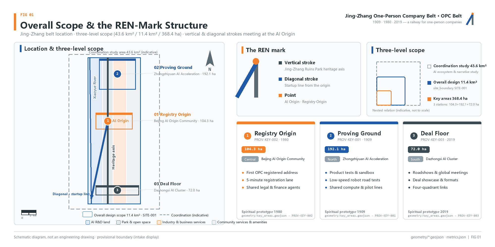
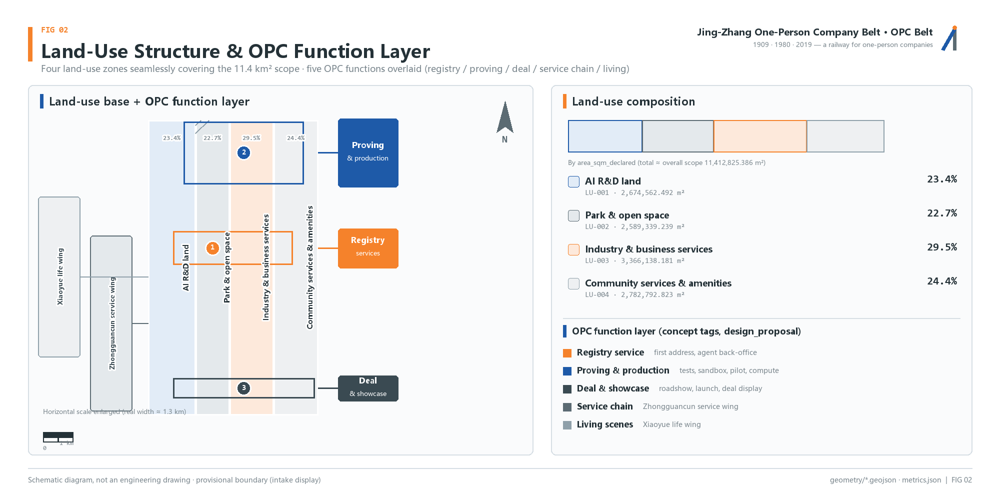
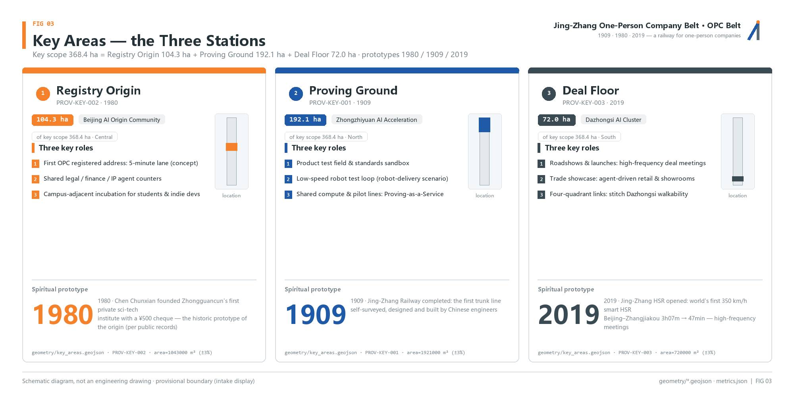
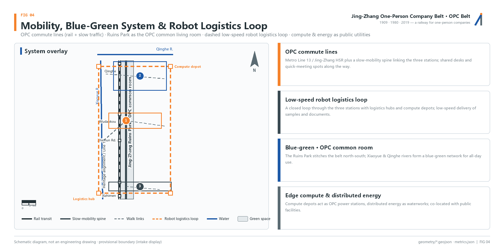
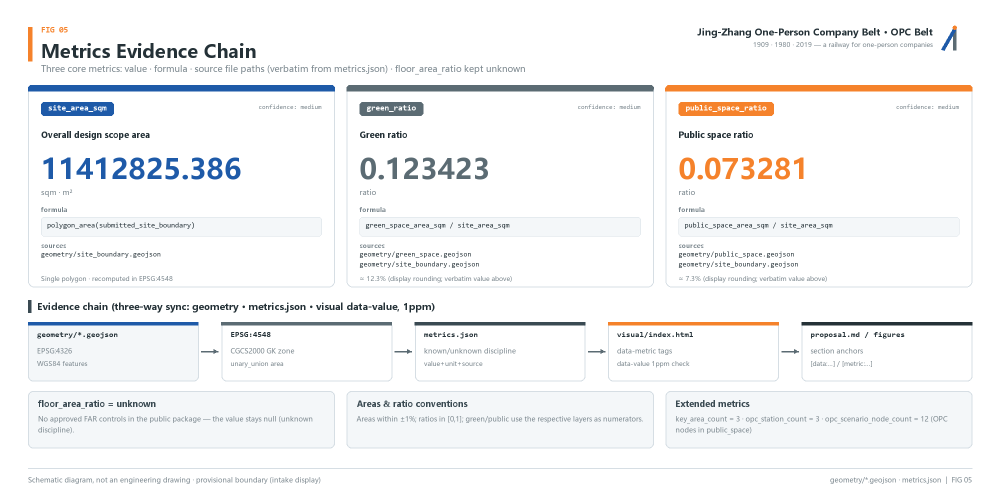

# Jing-Zhang One-Person Company Belt (OPC Belt)

## Design Basis and Source Inventory

This proposal takes the "Centennial Jing-Zhang AI Innovation Belt Urban Design International Open Call - Prequalification Announcement" issued by the Haidian Branch of the Beijing Municipal Commission of Planning and Natural Resources as its primary basis, and uses the temporary rough boundaries, key areas, enumerations, indicators and source inventory registered by the maintainers in `brief/site-package/` as its machine-readable basis. Before generating the proposal, the agent must read `design_brief.json`, `allowed_design_space.json`, `sources.json`, `enums/`, `ranges/`, `schemas/`, `data/source_registry.json` and `data/processed/agent_fact_pack.md`, and use `project_scope_summary.csv`, `agent_task_requirements.csv`, `source_use_matrix.csv` and `missing_data_checklist.csv` to establish the task, scope, source-use and gap checklists. All design judgments are decomposed into traceable sources, recomputable indicators, verifiable layers and human-reviewable assumptions [source:OFFICIAL-ANNOUNCEMENT] [source:AGENT-TASKBOOK] [depth:existing_conditions_diagnosis].

The core concept of the proposal is "the railway of one-person companies." The century-old Jing-Zhang line wrote "individual wisdom accomplishing great things" three times: in 1909, Zhan Tianyou, as a single chief engineer, led a Chinese team with zero foreign dependence to build the Jing-Zhang Railway; in 1980, Chen Chunxian, with a 500-yuan check and no staffing quota or investment, founded the first private science-and-technology institution in Zhongguancun; today, AI makes "one person + a swarm of agents" a company. This proposal designs the belt as a railway for one-person companies (OPC): a full set of tracks for super-individuals to register, validate, meet and live. It should be noted that Zhan Tianyou himself emphasized that the Jing-Zhang Railway was built by the strength of more than ten thousand workers, not by one person alone; the accurate expression of the OPC spirit is "one person leading + an autonomous system + zero external dependence."

The usage boundaries of the source registry are as follows [source:SOURCE-REGISTRY]: `data/source_registry.json` registers the permitted uses of public, rights-cleared and provisional materials; agents must not upgrade background_only or provisional_only materials into official boundaries, statutory regulatory plans, formal scoring bases or government implementation commitments. `data/processed/agent_fact_pack.md` is a reading-navigation layer rather than a new authoritative source [source:PROCESSED-FACT-PACK]; factual judgments must still return to the registered original materials.

Where the official `SITE_BOUNDARY` or the three `KEY_AREA` polygons are not yet available, this proposal uses `brief/site-package/geometry/provisional_boundaries.geojson` to generate a provisional formal package. The `geometry/site_boundary.geojson` and `geometry/key_areas.geojson` in the submission package are both marked `provisional_constraint` and `official_boundary=false`; they may be used only for proposal generation, self-checking, visualization and design discussion, and may not serve as official redlines, approval bases, precise area bases or statutory control conclusions. This organizer-side data gap does not block content scoring; after replacement with official polygons, site boundary, key areas, land use, roads, green space, public space, buildings, phasing and metrics must all be recalculated. Boundary interpretation can return to the overall-scope layer and area recalculation [data:geometry/site_boundary.geojson#SITE-001] [metric:site_area_sqm], and the three key areas are cross-checked by independent layers and count indicators [data:geometry/key_areas.geojson#PROV-KEY-001] [metric:key_area_count].

## Three-Level Scope Framework

The proposal organizes work according to the three levels defined in the announcement. The Coordinated Research Area focuses on the 43.6 km2 AI industry ecosystem, strategic positioning, innovation chain and future urban form; the Overall Design Area focuses on the 11.4 km2 urban and industrial areas within 1-2 km around the Jing-Zhang Heritage Park, requiring an overall urban renewal framework, industrial spatial layout, transport and municipal support, and urban character control; the Key-Area Detailed Design Area focuses on 368.4 hectares across three detailed-design districts, requiring clear functional programs, building scale, demolish-renovate-retain classification, public space connectivity and transport organization. The three levels are mapped item by item in `compliance_matrix.json`, ensuring that the mandatory tasks of announcement sections 1.3, 1.4, 1.5 and agent.1-agent.6 all have chapter, layer, indicator, drawing and HTML evidence [standard:PROJECT-OFFICIAL-ANNOUNCEMENT] [depth:three_level_scope_framework].

The three levels are not mutually isolated drawing sets. The Coordinated Research Area determines the industry chain and urban form judgments; the Overall Design Area translates the judgments into renewal projects, spatial structure and facility capacity; the Key-Area Detailed Design validates the implementability of specific plots, buildings, transport, public space and AI application scenarios. When generating the proposal, the agent must first lock the official or provisional boundary and constraints adopted for the current submission, then generate land use, buildings, roads, green space, public space, phasing and AI service nodes, and finally recompute indicators from these layers and explain in the text which conclusions remain limited by the provisional boundary [depth:overall_spatial_structure] [data:geometry/site_boundary.geojson#SITE-001].

The overall concept recommended by this proposal is the "Jing-Zhang One-Person Company Belt (OPC Belt)": with the Jing-Zhang Heritage Park as the historical and public-space spine, the three key districts of Beijing AI Origin Community, Zhongzhiyuan and Dazhongsi as innovation anchors, and universities, enterprises, communities and transit stations as the everyday network, forming a spatial organization of "one belt, three stations, two wings in coordination, and a blue-green slow-mobility composite loop." The three stations are reinterpreted by OPC function (conceptual recommendation): Beijing AI Origin Community serves as the Registry Origin, providing the first OPC registration address and near-campus incubation; Zhongzhiyuan serves as the Proving Ground, providing product testing and a standards sandbox; Dazhongsi serves as the Deal Floor, providing roadshows, launches and international deal-making. The two wings: the Zhongguancun Technology Services Wing carries the OPC service chain, and the Xiaoyue River Scenario Enablement Wing carries OPC lifestyle scenarios.

| Level | Design question | OPC answer | Data anchor |
| --- | --- | --- | --- |
| Coordinated Research Area | How should the AI industry ecosystem and future urban form be organized | Establish the OPC ecosystem chain of "university ideation - open-source collaboration - one-person company - public experience - international communication" | compliance_matrix.json, standard_matrix.json |
| Overall Design Area | How should industrial space, urban renewal, transport/municipal and character be mapped | Spatial placement of three stations and two wings, jointly expressed by land use, buildings, roads, green space, public space and phasing layers | [data:geometry/land_use.geojson#LU-001], [data:geometry/roads.geojson#ROAD-001] |
| Key-Area Detailed Design Area | How should the three districts reach detailed-design depth | Propose OPC positioning, spatial moves, scenarios and implementation dependencies for each | [data:geometry/key_areas.geojson#PROV-KEY-001], [data:geometry/key_areas.geojson#PROV-KEY-002], [data:geometry/key_areas.geojson#PROV-KEY-003] |

## Coordinated Research Area: Industry and Future City Research

The core task of the Coordinated Research Area is to build an AI innovation ecosystem oriented toward super-individuals. The demand base comes from three verified statistics: approximately 200 million flexible workers in China (per the Ministry of Human Resources and Social Security and the NPC Standing Committee reports), 125 million registered individual businesses nationwide (SAMR, accounting for 66.8% of business entities), and 249 million users of generative AI products in China (CNNIC 55th report, 45.5% using them as office assistants). Together these three figures point to one judgment: the "one-person company" - with the individual as the smallest operating unit and AI as the productivity lever - is becoming a new form of industrial organization, and this belt should provide it with spatial and institutional infrastructure [source:AGENT-TASKBOOK] [standard:PROJECT-AGENT-OPEN-CALL-TASKBOOK].

The proposal puts forward a "1+N" company model: one person + N agent employees. Agents take on legal, finance, customer service, marketing and R&D-assistance functions, allowing an individual to run multiple product lines simultaneously. The era-defining question of this model comes from Sam Altman's prediction - in a group chat with his tech-CEO friends there is a bet on when the first "one-person billion-dollar company" will appear; Altman believes this was unimaginable without AI and will now happen. It should be noted: this is a prediction from an interview recorded in 2023 and released in 2024, not an accomplished fact [source:PROCESSED-FACT-PACK].

The naming and VI system serves the overall recognizability of the "Centennial Jing-Zhang cultural belt, urban AI lifestyle experience belt, and AI-integrated innovation belt." The core of the logo is the character "Ren" (ren, "person"): the "Ren" of Zhan Tianyou's Ren-shaped zigzag reversing line is the "person" of the one-person company - the vertical stroke is the historical spine of the Jing-Zhang Heritage Park, the left-falling stroke is the entrepreneurial line departing from the origin, and the two strokes converge at the AI Origin Community (the Registry Origin). The brand colors are rail steel gray (Jing-Zhang Railway), Zhongguancun blue (technology) and signal orange (AI vitality). In response to the agent taskbook, the proposal must address the "five major functions" and the "three zones and two wings" coordination, forming a naming system, visual identity, overall spatial structure diagram, scenario access and operation mechanism that can be further developed [standard:MOHURD-URBAN-DESIGN-MEASURES] [depth:overall_spatial_structure].

Future city form research should answer how AI changes work, life, socializing, learning, transport and public services. The proposal locates AI transport systems, continuous green space, innovation service facilities and an international living-and-working atmosphere into positionable functional zones, nodes, corridors and scenarios, rather than vaguely describing technological visions. Any mention of global AI innovation events, developer communities, open scenarios or pilgrimage routes must be written as "conceptual recommendation / reference proposal / open for professional teams to deepen," and must not be written as confirmed government events or implementation arrangements [data:geometry/land_use.geojson#LU-001] [data:geometry/public_space.geojson#PUBLIC-001].

## Overall Design Area: Urban Renewal and RDP-Depth Urban Design

The Overall Design Area must reach the urban design depth of a regulatory detailed plan. The proposal must present an overall urban renewal spatial structure, identification of inefficient space, a renewal project list, implementation policy recommendations, industrial functional proportions, spatial organization patterns, total building scale and comprehensive carrying-capacity assessment. `geometry/land_use.geojson` should fully cover the design boundary without overlaps, `geometry/buildings.geojson` should express renewal building footprints or retained building footprints, `geometry/roads.geojson` should express micro-circulation, slow mobility and transit connection relationships, and `metrics.json` should recompute core areas, proportions and layer counts [standard:MOHURD-CONTROL-DETAILED-PLANNING] [depth:land_use_layout].

From the OPC perspective, the Overall Design Area is the track layer of the "one-person company railway network": the Registry Origin provides the first registration address and shared legal/finance agents, the Proving Ground provides product testing and a standards sandbox, and the Deal Floor provides roadshows, launches and international deal-making; the Zhongguancun Technology Services Wing organizes the OPC service chain, and the Xiaoyue River Scenario Enablement Wing organizes OPC lifestyle scenarios. The functional layer is expressed through OPC space-supply types: five types of space - registration post, collaboration pod, proving ground, launch hall and compute post - corresponding respectively to the registration, office, testing, launch and compute needs of the OPC lifecycle [data:geometry/land_use.geojson#LU-001] [data:geometry/buildings.geojson#BLDG-001] [metric:building_footprint_area_sqm].

Content involving building height, development intensity, road red lines, setbacks and facility standards, where no official control conditions yet exist, should uniformly be written as "pending confirmation of formal regulatory conditions," and agent-inferred values must not be passed off as approved indicators. Building footprint area is based on layer recalculation [metric:building_footprint_area_sqm]; control indicators such as floor area ratio (FAR), building coverage ratio and green ratio remain `status=unknown` in `metrics.json`, with the conditions to be supplemented and the recalculation path after formal data arrives explained in `reason`/`assumptions` [depth:development_intensity_controls] [depth:height_massing_character].

The Overall Design Area must also support transport, transit, municipal and supporting facilities. The proposal should propose spatial layouts and implementation paths around transit-station integration, road micro-circulation, non-motorized vehicle parking, parking supply, innovation service platforms, talent living services, new infrastructure, distributed energy and edge computing [data:geometry/roads.geojson#ROAD-001] [data:geometry/constraints.geojson#CONSTRAINTS].

## Key-Area Detailed Design

Key-area detailed design is a mandatory item; the three districts are reinterpreted by OPC function (conceptual recommendation). Beijing AI Origin Community (104.3 ha) serves as the Registry Origin, with the 1980 Chen Chunxian service office as its spiritual prototype: detailed proposals are made around near-campus innovation, achievement incubation and transformation, a talent special zone, an open-source system, brand events, building demolish-renovate-retain, achievement display and launch, residential and living support, campus-park slow-mobility connections and transit-station integration, providing the first OPC registration address, a 5-minute registration process and shared legal/finance agents [data:geometry/key_areas.geojson#PROV-KEY-002] [source:AGENT-TASKBOOK].

Zhongzhiyuan AI Independent Innovation Acceleration Area (192.1 ha) serves as the Proving Ground, with the 1905-1909 independent survey, design and construction of the Jing-Zhang Railway as its spiritual prototype: detailed proposals are made around the national AI platform, full-stack independent innovation, standard-setting, safety governance, industry display, external transport, Qinghe culture, low-carbon green innovation and exchange environments, and green-space AI scenarios, providing product testing, a standards sandbox, low-speed robot road testing and shared compute [data:geometry/key_areas.geojson#PROV-KEY-001] [depth:three_key_area_detailed_design].

Dazhongsi AI Industry Cluster (72.0 ha) serves as the Deal Floor, with the time-space compression of the 2019 Jing-Zhang High-Speed Railway's 47-minute reach as its spiritual prototype: detailed proposals are made around leading enterprises, agents, intelligent terminals, content consumption, data elements, digital assets, commercial services, composite use of planned green space, Dazhongsi station integration and four-quadrant pedestrian connectivity at intersections, providing roadshows, launches, international deal-making and transaction display [data:geometry/key_areas.geojson#PROV-KEY-003] [metric:key_area_count].

The three key areas must appear in `geometry/key_areas.geojson`. If the repository provides official polygons, they should be used as `official_constraint`; if missing, `provisional_constraint` may be used temporarily, but the text, HTML, sources, assumptions and self_check must state that they cannot serve as a basis for formal scoring or approval. Design expression should include functional programs, building scale, building form, demolish-renovate-retain classification, public space systems, transport organization, slow-mobility connectivity and implementation projects; the HTML pages should allow switching among the three key areas, and the A3 booklet and A0 boards should include at least the key-district master plan, partial detail drawings and indicator notes.

| Key district | OPC positioning | Spatial moves | Scenarios | Evidence citations |
| --- | --- | --- | --- | --- |
| Beijing AI Origin Community | Registry Origin | Organize campus-park-block slow-mobility stitching; add registration hall, achievement launch, talent services and open-source collaboration space | First registration address, 5-minute registration, shared legal/finance agents, near-campus incubation | [data:geometry/key_areas.geojson#PROV-KEY-002], [source:AGENT-TASKBOOK] |
| Zhongzhiyuan AI Independent Innovation Acceleration Area | Proving Ground | Strengthen the Qinghe waterfront interface, industry display, low-carbon innovation exchange and external transport organization; use green space to carry open testing and standards-governance display | Independent model testing, standard-setting workshops, low-speed robot road testing, shared compute | [data:geometry/key_areas.geojson#PROV-KEY-001], [depth:three_key_area_detailed_design] |
| Dazhongsi AI Industry Cluster | Deal Floor | Around Dazhongsi station integration, four-quadrant pedestrian connectivity, commercial services and public-environment renewal of key enterprises | Agent and intelligent-terminal display, content consumption, data elements and international roadshows | [data:geometry/key_areas.geojson#PROV-KEY-003], [metric:key_area_count] |

## AI Innovation Ecosystem, Talent Personas and AI+ Scenarios

**Global case studies.** The feasibility of one-person companies already has verifiable global samples; all case figures below are labeled with their basis and are self-reported by founders or self-disclosed by companies, unaudited:

1. **Pieter Levels (levelsio, Netherlands)**: 0 employees, 0 funding, operating Nomad List, Remote OK, PhotoAI, InteriorAI and other products; self-reported a monthly revenue record of USD 420,000/month (about 80% profit) in September 2024, and a July 2025 podcast interview cited an annualized figure of about USD 3.1 million (publicly self-reported by the founder, unaudited).
2. **Tony Dinh / TypingMind (Vietnam)**: launched on day 5 of the ChatGPT API opening, USD 22,000 in revenue in the first 7 days, USD 1 million cumulative over 20 months (self-reported in a November 2024 newsletter); about USD 130,000-160,000/month as of October 2025 (publicly self-reported by the founder, unaudited).
3. **Carrd / AJ (anonymous)**: a pre-AI reference ceiling for one-person company scale, about USD 100,000 MRR, USD 1.2 million ARR and 2.6 million users (The SaaS Podcast interview, circa 2022; self-reported by the founder, unaudited).
4. **Danny Postma / HeadshotPro**: a solo AI headshot product; the website self-reports 17 million images generated cumulatively and revenue exceeding USD 10 million (company self-disclosure, unaudited).
5. **Aaron Sneed (United States, reported February 2026)**: a solo defense-tech founder whose 15 AI agents form a "Council" (chief of staff/HR/finance/legal/compliance), saving about 20 hours per week (Business Insider report, founder's own account, unaudited).
6. **EVE / Vadym Rogovsky (Ukraine, March 2026)**: laid off 7 IT employees and switched to "1 human CTO + 20 AI agents," saving more than USD 250,000 per year in salaries (as cited by Forbes Ukraine, company self-disclosure, unaudited).

In addition, Sam Altman predicted in an interview with Alexis Ohanian (recorded September 2023, released February 2024) that in a group chat with his tech-CEO friends there is a bet on when the first "one-person billion-dollar company" will appear, which was unimaginable without AI and will now happen. **This is a prediction, not an accomplished fact** [source:PROCESSED-FACT-PACK] [source:AGENT-TASKBOOK].

**Six user personas.** Spatial-demand personas for AI talent and enterprises, covering R&D offices, open-source collaboration, achievement launch, enterprise services, talent housing, social learning, consumer life, sports and leisure, and international exchange:

| User persona | Typical needs | Spatial response | Self-check boundary |
| --- | --- | --- | --- |
| Independent developer | Low-cost registration, compute access, product launch, community reputation | Registry Origin first registration address, compute post, open-source launch hall | No collection of personal behavior trajectories; activity data aggregated statistics only |
| AI researcher | Model testing, standards sandbox, academic exchange, achievement transformation | Zhongzhiyuan Proving Ground, standard-setting workshops, near-campus incubation | Research results and experimental data require separate authorization |
| Designer/creator | Content production, copyright confirmation, display and launch, international communication | Dazhongsi content consumption and display space, around the Million-Line Code Wall | Works and portraits require rights clearance |
| Professional services (legal/finance/consulting) | Shared practice space, agent tools, client meetings | Zhongguancun Technology Services Wing OPC service chain, Deal Floor | Client information and case data strictly isolated |
| Tech career switchers (ex-big-tech) | Transition from employee to OPC, registration coaching, community support | Registry Origin 5-minute registration, startup coaching, nighttime collaboration pods | Personal resumes not used for commercial referrals |
| University students (potential OPCs) | Low-cost trial and error, mentor resources, cross-campus collaboration, employment and entrepreneurship | Near-campus incubation, campus-park slow-mobility stitching, AI education experience points | Campus data and academic information require authorization |

**Twelve scenario cards.** Connected by the timeline of "a day in the life of an OPC founder," each scenario card is labeled with its number, time, name, spatial carrier, target users and privacy boundary:

| No. | Time | Scenario card | Spatial carrier | Target users | Privacy boundary |
| --- | --- | --- | --- | --- | --- |
| SC-01 | 07:30 | First registration address | Registry Origin registration hall | Newly registered OPC founders | Registration information used only for statutory registration, not publicly displayed |
| SC-02 | 09:00 | Agent-employee morning standup | Origin Community collaboration pod | One-person company founders | Meeting content processed on-device, not uploaded to the cloud |
| SC-03 | 10:30 | Product road-testing ground | Zhongzhiyuan Proving Ground | Independent developers, AI researchers | Test data anonymized and aggregated |
| SC-04 | 12:00 | Agent coffee | Xiaoyue River lifestyle wing | All OPC practitioners | Consumption data not used for commercial referrals |
| SC-05 | 14:00 | Dazhongsi roadshow hall | Deal Floor launch hall | Founders seeking funding and partnerships | Roadshow content disseminated within authorized scope |
| SC-06 | 16:00 | Compute post | Overall Design Area nodes | Independent developers, designers | Compute and data services require separate authorization |
| SC-07 | 18:00 | Xiaoyue River lifestyle wing | Xiaoyue River Scenario Enablement Wing | Nearby residents and practitioners | Resident profiles not used for commercial referrals |
| SC-08 | 21:00 | Nighttime collaboration pod | Origin Community | OPC founders working remotely | In-pod behavior data collected minimally |
| SC-09 | Next day | Open-source contribution wall | Million-Line Code Wall | Open-source contributors | Only public commit records displayed |
| SC-10 | Weekend | Standards sandbox open day | Zhongzhiyuan | University students, career switchers | Participation records used only for event statistics |
| SC-11 | Anytime | Shared legal/finance agents | Zhongguancun Technology Services Wing | Professional service providers and founders | Case and financial data strictly isolated |
| SC-12 | Periodic | "Ren" developer conference route | Belt-wide public space system | Global developers and visitors | Registration information used only for event organization |

**Three industrial testing and validation scenarios.** 1) Zhongzhiyuan low-speed robot logistics line: organize low-speed robot delivery testing on internal park roads, connecting to the `robot-delivery-low-speed` scenario, with test data used to deepen transport and municipal design; 2) Origin Community agent-office sandbox: validate the office workflow of the "1+N" company model and shared agent services in collaboration pods, forming a replicable operational prototype; 3) Dazhongsi launch hall stress test: stress-test concurrent roadshows, livestreaming and transaction display at the Deal Floor, providing a basis for confirming building and municipal conditions. All three scenarios must state their target users, spatial location, data sources, privacy boundaries, human-review mechanisms and operating entities. Scenario placement is evidenced by public space and green space layers [data:geometry/public_space.geojson#PUBLIC-001] [data:geometry/green_space.geojson#GREEN-001], slow-mobility and transport scenarios cite the road layer [data:geometry/roads.geojson#ROAD-001], and open-space proportions are verified by indicators [metric:public_space_ratio] [metric:green_ratio].

AI governance recommendations must follow the principles of data minimization, public sources, explainability and human review. Urban agents may assist in identifying slow-mobility gaps, public space heat, facility maintenance, enterprise service needs and event safety risks, but must not replace planning approval, output unauthorized personal profiles, or claim official implementation commitments. All AI scenario nodes should enter structured layers or the compliance matrix, so reviewers can see their relationship to industry, space and public interest.

## Land Use, Building Scale and Demolish-Renovate-Retain Plan

The land-use plan should be expressed according to public standards such as territorial spatial survey, planning and use-control classification, forming complete, closed and seamless land-use zones [standard:MNR-LAND-USE-CLASSIFICATION-GUIDE]. The building plan should distinguish retained, renovated, renewed, new or to-be-confirmed objects, and clarify the recommended hierarchy of building footprint, function, scale, character, roof, massing and height control. Where existing buildings, ownership, regulatory plans and engineering conditions are lacking, the proposal may only offer methods and a to-be-calibrated checklist, and must not fabricate demolish-renovate-retain conclusions [depth:retain_renovate_demolish] [depth:height_massing_character].

OPC space-supply types are the functional thread of this chapter; the five space types correspond to the OPC lifecycle:

| Space type | Function | Corresponding district | Data anchor |
| --- | --- | --- | --- |
| Registration post | First OPC registration address, 5-minute registration, shared legal/finance agents | Registry Origin | [data:geometry/buildings.geojson#BLDG-001] |
| Collaboration pod | Agent-employee office, remote collaboration, nighttime use | Registry Origin, Xiaoyue River lifestyle wing | [data:geometry/land_use.geojson#LU-001] |
| Proving ground | Product testing, standards sandbox, low-speed robot road testing | Proving Ground | [data:geometry/public_space.geojson#PUBLIC-001] |
| Launch hall | Roadshows, launches, international deal-making, transaction display | Deal Floor | [data:geometry/roads.geojson#ROAD-001] |
| Compute post | Edge computing, distributed energy, shared computation | Overall Design Area nodes | [data:geometry/constraints.geojson#CONSTRAINTS] |

Building scale and intensity indicators must be consistent with `metrics.json` and the layers. Where total building scale, floor area ratio, building height, building coverage ratio, green ratio, setbacks and building control lines lack official conditions, `status=unknown` should be used uniformly, with the conditions to be supplemented, current assumptions and the recalculation path after formal data arrives explained in `reason`/`assumptions`; fixed numbers must not be used to create a false sense of precision. Building footprint area is based on layer recalculation [metric:building_footprint_area_sqm] [data:geometry/buildings.geojson#BLDG-001]. The A3 booklet should provide the renewal project list and indicator review table, the A0 boards should clearly express the key spatial structure and key districts, and the HTML pages should provide linked viewing of indicators and layers.

## Transport, Transit, Municipal and Public Service Facilities

The transport plan should respond to the announcement's requirements on transit-station integration, road micro-circulation, slow-mobility gaps, external transport, parking, non-motorized vehicle parking and green transport systems, with priority coverage of the North Fifth Ring Road, the Jing-Zhang Heritage Park cross-ring-road nodes, Wudaokou, the west entrance of Qinghua East Road, Dazhongsi station and transport connections around key enterprises. Road and slow-mobility layers should remain within the submission boundary and be cross-checked against public space, green space, industrial nodes and key districts; if the submission boundary is provisional, transport conclusions may only serve as interim design discussion [depth:traffic_rail_slow_parking] [data:geometry/roads.geojson#ROAD-001].

From the OPC perspective, the transport system is the "commuter line of one-person companies": transit stations provide cross-city commuting (echoing the time-space compression of the 2019 Jing-Zhang High-Speed Railway's 47-minute reach), the slow-mobility system provides high-frequency movement within the belt, and the low-speed robot logistics corridor connects to the `robot-delivery-low-speed` scenario, carrying samples, materials and test data between the Proving Ground and the Deal Floor. The robot logistics corridor is expressed as a dashed line indicating a corridor to be deepened; its route, time windows and safety conditions must all be calibrated after formal transport and municipal conditions are confirmed [data:geometry/constraints.geojson#CONSTRAINTS] [data:geometry/public_space.geojson#PUBLIC-001].

Municipal and public service facilities should cover AI industry service facilities, innovation service platforms, talent living service facilities, new infrastructure, distributed energy, edge computing and integration with traditional municipal facilities. In the OPC context, edge computing and distributed energy are the public "water and electricity" of OPCs: compute posts provide public on-demand computing interfaces, distributed energy provides low-carbon power supply, and together with shared legal/finance agents they constitute the city-level infrastructure of one-person companies. The proposal should state facility standards, spatial layout, service radius, operation models and phased implementation logic; where pipeline, energy, drainage, flood-control and fire-safety engineering data are lacking, they should be listed as prerequisites for formal deepening [depth:municipal_new_infrastructure] [data:geometry/roads.geojson#ROAD-001].

## Blue-Green Space, Public Space and Urban Character

The blue-green space plan takes the Jing-Zhang Heritage Park vitality belt as its skeleton, coordinates the travel needs of the Qinghe, the Xiaoyue River, surrounding universities, enterprises and communities, and proposes a north-south through, east-west connected network of footpaths, cycleways and green space. The proposal should identify slow-mobility gaps, overpass nodes at ring roads, and landscape nodes at the park's south and north ends, and propose composite-use strategies for parking, sports, innovation exchange, technology testing, application display and public services [depth:blue_green_public_space] [data:geometry/green_space.geojson#GREEN-001] [data:geometry/public_space.geojson#PUBLIC-001].

From the OPC perspective, the Jing-Zhang Heritage Park is the "central living room of one-person companies": it is both the historical spine and the public base for OPC practitioners to meet, stroll, roadshow and launch. The green and public space proportions are explained for their design meaning in the text, with full recalculation stored in `metrics.json` [metric:green_ratio] [metric:public_space_ratio]; the coordination of urban character, public space and building control returns to the professional standards matrix [standard:MOHURD-URBAN-DESIGN-MEASURES].

**Three pilgrimage landmarks (conceptual recommendation, open for professional teams to deepen).** 1) **Registration Desk No.1**: located in the AI Origin Community, paying tribute to the 1980 Chen Chunxian service office, with a growable nameplate wall engraved with the name of each year's first newly registered OPC - this is a mechanism design, not an accomplished fact; 2) **Ren Viewing Deck**: located in the Jing-Zhang Heritage Park, a viewing structure designed with the imagery of the "Ren" zigzag reversing line, overlooking the full panorama of the belt; 3) **Million-Line Code Wall**: located in Dazhongsi, a public art installation displaying open-source contributions within the belt, with data access as an operational prerequisite. The honor display system is the OPC star-track wall, recording the growth trajectory of OPCs in the belt. All pilgrimage landmarks and event systems are expressed with the wording "conceptual recommendation / open for professional teams to deepen," and must not be written as confirmed government events or implementation arrangements.

The urban character plan should integrate the historical culture of the Jing-Zhang Railway, Zhongguancun innovation culture and AI innovation culture, drawing on cultural resources such as Qinghuayuan Railway Station and the Beijing Film Academy, and propose guidance for urban tone, building character, roof forms, massing, interfaces and public art. The agent should also propose wayfinding signage, cultural symbols, international communication narratives and honor display systems, but all brands, fonts, images, portraits and corporate logos must have rights-cleared sources. Character control should distinguish official control, design recommendations and to-be-confirmed conditions, and must never give pseudo-precise control lines without heritage-protection or regulatory-planning basis [data:geometry/constraints.geojson#CONSTRAINTS].

## Renewal Project List, Implementation Policy and Phasing Plan

The implementation plan should form an auditable renewal project list, stating project location, type, function, responsible entity, dependencies, implementation phase, risks and evaluation indicators. Policy recommendations should cover coordinated urban renewal implementation, space supply, operation mechanisms, industrial services, public participation, data governance and property-rights coordination. `geometry/phasing.geojson` should express phasing scope, and `compliance_matrix.json` should link each task to phasing and drawings [depth:renewal_project_list] [depth:phasing_implementation] [data:geometry/phasing.geojson#PHASE-001].

| Project No. | Project name | Type | Main dependencies | Evidence citations |
| --- | --- | --- | --- | --- |
| JZ-01 | "Ren" axis slow-mobility stitching | Public space/transport | Road red lines, under-bridge space, transport organization review | [data:geometry/roads.geojson#ROAD-001] |
| JZ-02 | Registry Origin registration hall renovation | Urban renewal/industrial services | Campus boundary, ownership, ground-floor programs | [data:geometry/buildings.geojson#BLDG-001] |
| JZ-03 | Zhongzhiyuan proving ground | Blue-green space/industry display | River blue lines, ecological and flood-control conditions | [data:geometry/green_space.geojson#GREEN-001] |
| JZ-04 | Dazhongsi launch hall and four-quadrant connectivity | Transit integration/slow mobility | Transit station, road intersections, municipal pipelines | [data:geometry/public_space.geojson#PUBLIC-001] |
| JZ-05 | Compute post network | New infrastructure/public services | Energy, compute, safety and operating entity | [data:geometry/constraints.geojson#CONSTRAINTS] |
| JZ-06 | "Ren" developer conference route | Operation/brand | Public space permits, event safety, copyright clearance | [data:geometry/phasing.geojson#PHASE-001] |

On policy recommendations, an OPC registration green channel may be studied: forming a service-chain pilot around one-person company registration, shared legal/finance agents, intellectual property and investment-financing services. **This statement is a design recommendation for study, not a government decision.** Phasing should be distinguished from the 100-day open-call design cycle: the open-call cycle is the time requirement for submitting deliverables, while implementation phasing is the advancement path of urban renewal and project construction. The proposal puts forward a near-term pilot, mid-term renewal and long-term governance framework, and indicates which items can start with lightweight facilities, operational activities and service platforms, and which must wait for formal regulatory, municipal, transport and ownership conditions to be confirmed. For the annual event system, developer community operation, scenario open days, public experience routes and international communication mechanisms, the text should state the operating targets, frequency, responsibility boundaries, conversion paths and risks, and must not only write promotional slogans.

## Indicator System, Area Recalculation and Compliance Matrix

The indicator system should include at least the Overall Design Area area, key-area areas, green and public space proportions, building footprints, renewal project count, AI scenario nodes, slow-mobility connectivity indicators, industrial space indicators, talent service indicators and self-check status. All known indicators must be recomputable from GeoJSON or credible sources; unknown indicators must state the reason and the prerequisites for formal submission. The results of `scripts/spatial_review.py` and `scripts/visual_review.py` are important evidence for formal self-checking [depth:metrics_recalculation].

Core indicators are consistent with the geometric layers: Overall Design Area area 11,412,825.386 m2 (about 11.41 km2) [metric:site_area_sqm] [data:geometry/site_boundary.geojson#SITE-001]; green ratio 0.123423 [metric:green_ratio] [data:geometry/green_space.geojson#GREEN-001]; public space ratio 0.073281 [metric:public_space_ratio] [data:geometry/public_space.geojson#PUBLIC-001].

Building footprint area 310,807.184 m2 [metric:building_footprint_area_sqm] [data:geometry/buildings.geojson#BLDG-001]; 3 key areas [metric:key_area_count] [data:geometry/key_areas.geojson#PROV-KEY-001].

Additional recomputable extended indicators: 12 OPC scenario nodes (`opc_scenario_node_count`, counting OPC nodes in the public_space layer) and 3 key areas (`key_area_count`); the six renewal projects are a table count in Chapter 10, not a metrics entry. New indicators mentioned in the text are expressed in words and do not occupy indicator anchors.

During formal deepening, the agent should also classify each indicator into three categories: the first is spatial indicators directly recomputable from the submitted geometry, such as boundary area, green ratio, public space ratio, building footprint area and phasing area; the second is control indicators requiring official regulatory plans or taskbook annexes, such as floor area ratio, building height, building coverage ratio, setbacks, road red lines and facility standards; the third is performance indicators requiring continuous calibration with operational or industrial data, such as the AI innovation index, talent density, industrial service satisfaction, slow-mobility accessibility, event participation and scenario usage frequency. The three categories should enter `metrics.json`, `assumptions.json` and `compliance_matrix.json` respectively, avoiding operational visions being miswritten as approved planning conditions.

The compliance matrix is the master control document for task responsiveness. Every announcement task and agent_taskbook task must map to report chapters, layers, indicators, drawings, HTML pages, sources, assumptions and self-check items. If any mandatory task of announcement sections 1.3, 1.4, 1.5 or agent.1-agent.6 is not covered, the proposal must not enter formal professional scoring.

## Risk, Copyright and Compliance Statement

**Bilingual requirement.** The main proposal file may be in Chinese or English, but must provide a complete counterpart translation via `proposal.en.md` or `proposal.zh.md`; A3/A0, HTML and text-bearing figures must also provide counterpart language copies, and should preferentially use the competition-recommended translations in `docs/terminology-glossary.md`. If a v2 package lacks any required translation, language mapping or valid file, finalize and CI will block the submission. All images, drawings, icons, data and code assets must state their source, license and authorization status in `sources.json` or `report/copyright_statement.md`. HTML pages must not load remote scripts, remote map tiles, remote fonts, iframes, forms or external APIs, and must not track reviewer behavior [source:SITE-PACKAGE].

The risk and missing-data list is jointly cross-checked by risk-depth items, constraint layers and the site package [depth:risk_missing_data] [data:geometry/constraints.geojson#CONSTRAINTS]. The official boundary, key area, regulatory plan, road, plot, building, municipal, heritage-protection and public service gaps listed in `missing_data_checklist.csv` must enter `assumptions.json`, the self-check and the risk chapter of the text. Any conclusion lacking official regulatory plans, road red lines, ownership, municipal, fire-safety or heritage-protection conditions must be downgraded to a to-be-confirmed item.

**Statement-risk item-by-item self-check (corresponding to the 12 red lines of the source library):** 1) do not write "Zhan Tianyou built the Jing-Zhang Railway alone"; use "one chief engineer + a Chinese team + zero foreign dependence," and retain his modest words at the opening of traffic; 2) do not write "the 'Ren' zigzag railway was invented by Zhan Tianyou"; use "introduced and creatively applied in light of local conditions"; 3) the Altman quote is a prediction, not to be written as an accomplished fact; 4) money-saving figures must state their basis (original budget 7.29 million taels, saving over 200,000 taels, with an alternative 280,000-tael figure); 5) "Centennial Jing-Zhang" is used as a brand name, avoiding the precise claim of a "one hundredth anniversary"; 6) the opening date is written as "completed and opened to traffic in 1909, with the opening ceremony on October 2"; 7) Zhan Tianyou's famous quote is from a 1918 speech and must not be mixed into the 1905-1909 timeline; 8) the Chen Chunxian service office is written as "the first private science-and-technology institution/entity," not "the first private enterprise"; 9) the HeadshotPro "USD 300,000/month" figure is not used, and Levels/Tony Dinh revenue is labeled "publicly self-reported by the founder (unaudited)"; 10) unverified cases (such as "one person running 9 companies") are not used; 11) the Chinese-law "one-person limited liability company" and the operational meaning of OPC are expressed as distinct; 12) the Jing-Zhang High-Speed Railway title retains the qualifier "350 km/h."

Case-data statement: the Levels, Tony Dinh, Carrd, HeadshotPro, Aaron Sneed and EVE case figures cited in this proposal are all publicly self-reported by the founders or self-disclosed by the companies (unaudited), serving only as reference samples for the feasibility of one-person companies, not as a basis for investment or planning decisions. This proposal does not name any enterprise or institution intended to move in, does not write "XX will move in," and does not claim official approval, approved regulatory plans, final land ownership, final construction scale or guaranteed implementation. AI agents are responsible for facts, sources, copyright, spatial data, indicators and expression; maintainers and professional reviewers may require revision or rejection based on self-check results, spatial review and the compliance matrix.

## References

- brief/public-brief.md
- brief/site-package/design_brief.json
- brief/site-package/allowed_design_space.json
- brief/site-package/enums/
- brief/site-package/ranges/planning_limits.json
- data/processed/agent_fact_pack.md
- data/processed/project_scope_summary.csv
- data/processed/agent_task_requirements.csv
- data/processed/source_use_matrix.csv
- data/processed/missing_data_checklist.csv
- Full machine index: see `sources.json`, `metrics.json`, `compliance_matrix.json`, `standard_matrix.json` and `design_depth_matrix.json`
- The bibliography entries in this section follow the site-package registration; full citations and licenses are in the structured source list [source:SITE-PACKAGE]

Public source supplements (URLs listed verbatim):

- Jing-Zhang Railway official accounts and historical facts: https://www.nra.gov.cn/tlfc/tpsy/202204/t20220405_293018.shtml ; https://www.thepaper.cn/newsDetail_forward_4500328 ; https://zh.wikipedia.org/wiki/京张铁路 ; http://railway.china.com.cn/2025-04/27/content_117846846.shtml
- Zhan Tianyou's modest words at the opening and famous quote: http://culture.people.com.cn/n/2014/0924/c22219-25724800.html ; http://tech.gmw.cn/scientist/2015-08/11/content_16549669.htm
- Jing-Zhang High-Speed Railway: https://www.xinhuanet.com/politics/2019-12/30/c_1125405473.htm
- Zhongguancun entrepreneurial history: https://www.mmcs.org.cn/xwz/kxjrl/art/2025/art_c481d27f6e51416ab166662d52adc703.html ; https://kw.beijing.gov.cn/ztzl/rdzt/zgcsfq/ ; http://www.chinatorch.gov.cn/gxq30/dsj/201811/c90ff12a3b1c4a6eaa2394c0016f0b37.shtml ; https://www.cas.cn/zt/jzt/wxcbzt/zgkxyyk2005ndyq/ztbd/200504/t20050405_2667691.shtml
- One-person company cases: https://levels.io/new-420k-mo-revenue-record-lex-fridman ; https://www.operatorbook.dev/stories/pieter-levels-revenue-never-sell-solo-portfolio ; https://news.tonydinh.com/p/nov-2024-my-first-million ; https://news.tonydinh.com/p/oct-2025-updates-code-money-and-travel ; https://www.operatorbook.dev/stories/carrd-revenue-number-aj-confirmed-then-went-quiet ; https://www.headshotpro.com/about ; https://www.businessinsider.com/solo-founder-runs-company-with-15-ai-agents-heres-how-2026-2 ; https://dev.ua/en/news/ai-zamist-aitivtsiv-1774535320 ; https://www.ycombinator.com/companies/gojiberry-ai ; https://fortune.com/2024/02/04/sam-altman-one-person-unicorn-silicon-valley-founder-myth/
- Trend statistics: https://arxiv.org/abs/2302.06590 ; https://survey.stackoverflow.co/2025/ai ; https://www.upwork.com/research/freelance-forward-2023-research-report ; https://www.ilo.org/sites/default/files/2024-06/WESO_May2024%20-%20Final_30-05-24_2.pdf ; https://www.cnnic.cn/n4/2025/0117/c88-11229.html ; https://www.gov.cn/lianbo/bumen/202411/content_6985534.htm ; https://www.gov.cn/xinwen/2021-05/20/content_5609599.htm ; http://www.npc.gov.cn/c2/c30834/202512/t20251224_450484.html ; https://www.gov.cn/gongbao/content/2005/content_121466.htm ; https://techcrunch.com/2025/10/06/sam-altman-says-chatgpt-has-hit-800m-weekly-active-users/ ; https://github.blog/news-insights/company-news/100-million-developers-and-counting/

