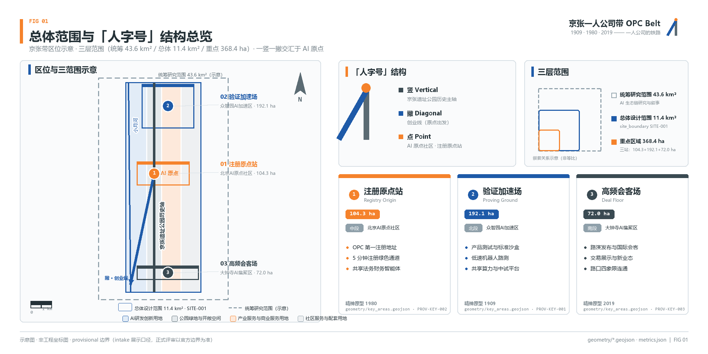
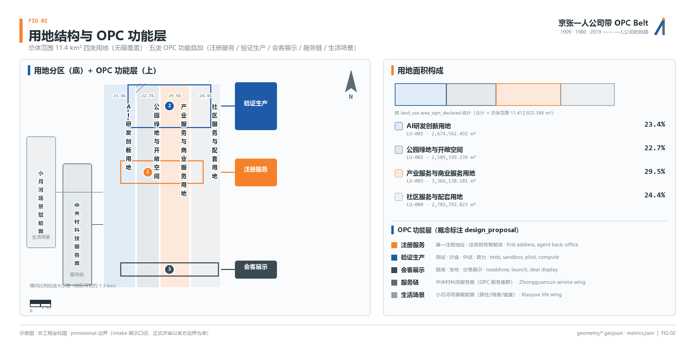
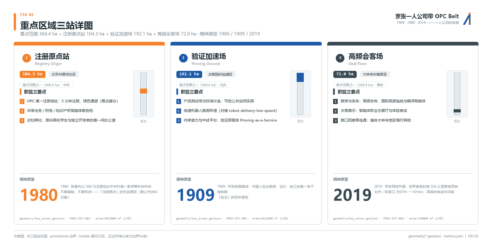
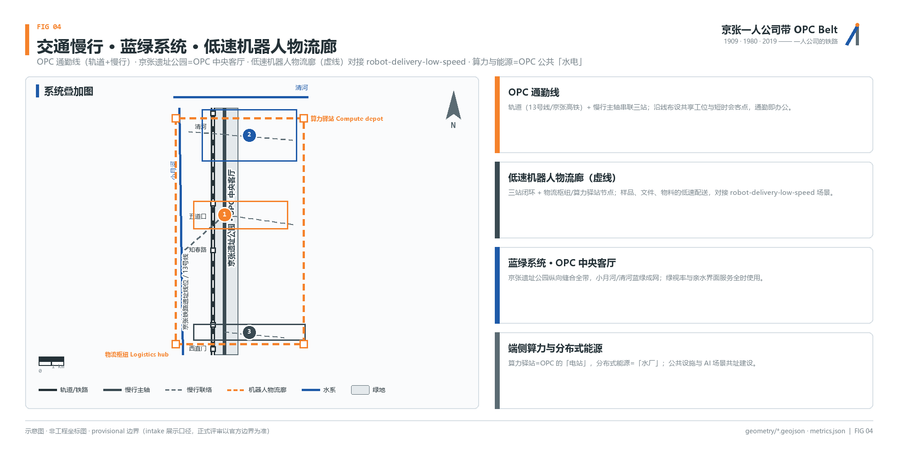
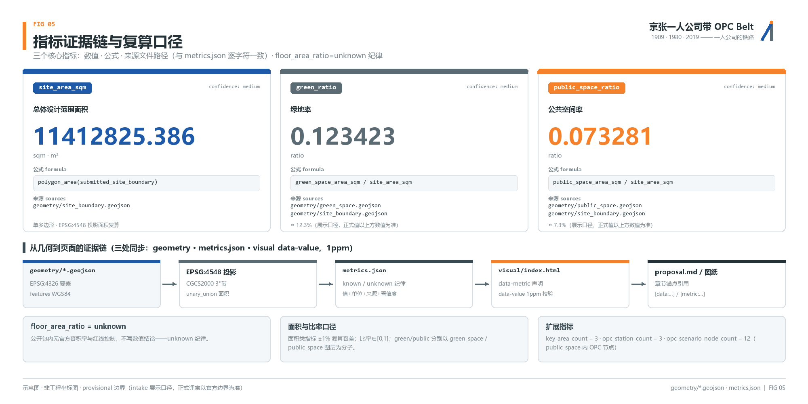

# 京张一人公司带 OPC Belt

## 设计依据与资料清单

本方案以北京市规划和自然资源委员会海淀分局发布的《百年京张AI创新带城市设计国际方案征集资格预审公告》为第一依据，并以 `brief/site-package/` 中经维护者登记的临时粗略边界、重点区域、枚举、指标和来源清单为机器可读依据。生成方案前必须读取 `design_brief.json`、`allowed_design_space.json`、`sources.json`、`enums/`、`ranges/`、`schemas/`、`data/source_registry.json` 与 `data/processed/agent_fact_pack.md`，并用 `project_scope_summary.csv`、`agent_task_requirements.csv`、`source_use_matrix.csv`、`missing_data_checklist.csv` 建立任务、范围、资料用途与缺口清单。所有设计判断均拆分为可追溯来源、可复算指标、可校验图层与可人工复核假设 [source:OFFICIAL-ANNOUNCEMENT] [source:AGENT-TASKBOOK] [depth:existing_conditions_diagnosis]。

方案的核心概念是「一人公司的铁路」。百年京张把「个人智慧办成大事」写了三次：1909 年，詹天佑以一位总工程师的身份带领一支中国团队、零外国依赖建成京张铁路；1980 年，陈春先以一张 500 元支票、不要编制不要投资，在中关村创办第一家民营科技机构；今天，AI 让「一个人 + 一群智能体」成为公司。本方案把这条带设计为一人公司（One-Person Company，OPC）的铁路：为超级个体修建注册、验证、会客、生活的全套轨道。需要说明的是，詹天佑本人强调京张铁路是一万多员工的力量，并非一人修成；OPC 精神的准确表述是「一个人主导 + 自主体系 + 零外部依赖」。

资料登记表的使用边界如下 [source:SOURCE-REGISTRY]：`data/source_registry.json` 登记公开、清权与临时资料的用途边界；agent 不得把 background_only 或 provisional_only 资料升级为 official boundary、法定控规、正式评分依据或政府实施承诺。`data/processed/agent_fact_pack.md` 是阅读导航层而非新的权威来源 [source:PROCESSED-FACT-PACK]，事实判断仍需回到已登记的原始材料。

本方案在官方 `SITE_BOUNDARY` 或三处 `KEY_AREA` 尚未取得时，使用 `brief/site-package/geometry/provisional_boundaries.geojson` 生成临时 formal 包。提交包中的 `geometry/site_boundary.geojson` 与 `geometry/key_areas.geojson` 均标注为 `provisional_constraint`、`official_boundary=false`，只能用于方案生成、自检、可视化和设计讨论，不能作为 official redline、审批依据、精确面积依据或法定控制结论。该组织方数据缺口不阻断内容评分；替换 official polygons 后，site boundary、key areas、land use、roads、green space、public space、buildings、phasing 与 metrics 均需重算。边界解释可回到总体范围图层和面积复算 [data:geometry/site_boundary.geojson#SITE-001] [metric:site_area_sqm]，三处重点区由独立图层和数量指标核对 [data:geometry/key_areas.geojson#PROV-KEY-001] [metric:key_area_count]。

## 三层范围工作框架

方案按照公告确定的三个层次组织工作。统筹研究范围关注 43.6 平方公里的 AI 产业生态、战略定位、创新链与未来城市形态；总体设计范围关注 11.4 平方公里京张遗址公园周边 1-2 公里城市地区和产业区，要求形成城市更新总体框架、产业空间布局、交通市政支撑与城市风貌控制；重点区域范围关注 368.4 公顷三处详细设计地区，要求明确功能业态、建筑规模、拆改留分类、公共空间连通与交通组织。三层范围在 `compliance_matrix.json` 中逐条映射，保证公告 1.3、1.4、1.5 与 agent.1-agent.6 的必选任务都有章节、图层、指标、图纸和 HTML 证据 [standard:PROJECT-OFFICIAL-ANNOUNCEMENT] [depth:three_level_scope_framework]。

三层工作不是互相割裂的图纸集合。统筹研究决定产业链与城市形态判断，总体设计把判断落实到更新项目、空间结构与设施承载，重点区域详细设计验证具体地块、建筑、交通、公共空间和 AI 应用场景的可实施性。agent 生成方案时必须先锁定当前提交采用的 official 或 provisional 边界和约束，再生成用地、建筑、道路、绿地、公共空间、分期和 AI 服务节点，最后从这些图层复算指标并在正文解释哪些结论仍受 provisional boundary 限制 [depth:overall_spatial_structure] [data:geometry/site_boundary.geojson#SITE-001]。

本方案建议的总体概念为「京张一人公司带 OPC Belt」：以京张遗址公园为历史与公共空间主轴，以北京AI原点社区、众智园、大钟寺三处重点片区为创新锚点，以高校、企业、社区和轨道站点为日常网络，形成「一带三站、两翼协同、蓝绿慢行复合环」的空间组织。三站按 OPC 职能重释（概念建议）：北京AI原点社区为注册原点站，承担 OPC 第一注册地址与近校孵化；众智园为验证加速场，承担产品测试与标准沙盒；大钟寺为高频会客场，承担路演、发布与国际会客。两翼职能为：中关村科技服务翼承载 OPC 服务链，小月河场景赋能翼承载 OPC 生活场景。

| 层级 | 设计问题 | OPC 回答 | 数据落点 |
| --- | --- | --- | --- |
| 统筹研究范围 | AI 产业生态与未来城市形态如何组织 | 建立「高校策源-开源协作-一人公司-公共体验-国际传播」的 OPC 生态链 | compliance_matrix.json、standard_matrix.json |
| 总体设计范围 | 产业空间、城市更新、交通市政与风貌如何落图 | 三站两翼空间落位，用地、建筑、道路、绿地、公共空间与分期图层共同表达 | [data:geometry/land_use.geojson#LU-001]、[data:geometry/roads.geojson#ROAD-001] |
| 重点区域范围 | 三处片区如何达到详细设计深度 | 分别提出 OPC 定位、空间动作、场景与实施依赖 | [data:geometry/key_areas.geojson#PROV-KEY-001]、[data:geometry/key_areas.geojson#PROV-KEY-002]、[data:geometry/key_areas.geojson#PROV-KEY-003] |

## 统筹研究范围产业与未来城市研究

统筹研究范围的核心任务是构建面向超级个体的 AI 创新生态体系。需求底盘来自三组已核实统计：中国灵活就业人员约 2 亿人（人社部及人大常委会报告口径），全国登记在册个体工商户 1.25 亿户（市场监管总局，占经营主体 66.8%），中国生成式 AI 产品用户 2.49 亿（CNNIC 第 55 次报告，45.5% 作办公助手）。这三组数字共同指向一个判断：以个人为最小经营单元、以 AI 为生产力杠杆的「一人公司」正在成为新的产业组织形态，本带应为其提供空间与制度基础设施 [source:AGENT-TASKBOOK] [standard:PROJECT-AGENT-OPEN-CALL-TASKBOOK]。

方案提出「1+N」公司模型：一个人 + N 个智能体员工。智能体承担法务、财务、客服、营销、研发辅助等职能，使个人可以同时经营多个产品线。这一模型的时代命题来自 Sam Altman 的预言——他与科技 CEO 朋友的群聊中有一个赌约，赌第一个「一人十亿美元公司」何时出现；Altman 认为这在没有 AI 时不可想象，而现在将会发生。需要注明：这是 2023 年录制、2024 年公开的访谈中的预测，并非已发生事实 [source:PROCESSED-FACT-PACK]。

命名与 VI 系统服务于「百年京张文化带、都市 AI 生活体验带、AI 融合创新带」的整体辨识度。Logo 核心为「人」字号：詹天佑人字形折返线的「人」即一人公司的「人」，一竖为京张遗址公园历史主轴，一撇为从原点出发的创业线，两笔交汇于 AI 原点社区（注册原点）。品牌色为钢轨青灰（京张铁路）、中关村蓝（科技）与信号橙（AI 活力）三色。面向智能体任务书要求回应「五大功能」与「三区两翼」协同，形成可继续深化的命名系统、视觉识别、总体空间结构图、场景开放与运营机制 [standard:MOHURD-URBAN-DESIGN-MEASURES] [depth:overall_spatial_structure]。

未来城市形态研究应回答人工智能如何改变工作、生活、社交、学习、交通与公共服务。方案把 AI 交通系统、连续绿色空间、创新服务设施与国际化生活工作氛围落实为可定位的功能区、节点、廊道和场景，而不是泛泛描述技术愿景。若提出全球 AI 创新活动、开发者社区、开放场景或朝圣路线，一律写为「概念建议/参考方案/可供专业团队深化研究」，不得写成已经确定的政府活动或实施安排 [data:geometry/land_use.geojson#LU-001] [data:geometry/public_space.geojson#PUBLIC-001]。

## 总体设计范围城市更新与控规深度城市设计

总体设计范围要求达到控制性详细规划的城市设计深度。方案必须提出城市更新总体空间结构、低效空间识别、更新项目清单、实施政策建议、产业功能比例、空间组织模式、建筑总规模与综合承载能力评估。`geometry/land_use.geojson` 应完整覆盖设计边界且无重叠，`geometry/buildings.geojson` 应表达更新建筑基底或保留建筑基底，`geometry/roads.geojson` 应表达微循环、慢行和轨道接驳关系，`metrics.json` 应复算核心面积、比例和图层数量 [standard:MOHURD-CONTROL-DETAILED-PLANNING] [depth:land_use_layout]。

在 OPC 视角下，总体设计范围是「一人公司的铁路网」的轨道层：注册原点站提供第一注册地址与共享法务财务智能体，验证加速场提供产品测试与标准沙盒，高频会客场提供路演发布与国际会客；中关村科技服务翼组织 OPC 服务链，小月河场景赋能翼组织 OPC 生活场景。功能层以 OPC 空间供给类型表达：注册驿站、协作舱、验证场、发布厅、算力驿站五类空间，分别对应 OPC 生命周期中的注册、办公、测试、发布与算力需求 [data:geometry/land_use.geojson#LU-001] [data:geometry/buildings.geojson#BLDG-001] [metric:building_footprint_area_sqm]。

涉及建筑高度、开发强度、道路红线、退线和设施标准的内容，若尚无官方控制条件，应统一写为「待正式控规条件确认」，不得以 agent 推测值冒充审定指标。建筑基底面积以图层复算为准 [metric:building_footprint_area_sqm]，容积率、建筑密度、绿地率等管控指标在 `metrics.json` 中保持 `status=unknown`，并在 `reason`/`assumptions` 中说明待补条件与正式数据到位后的复算路径 [depth:development_intensity_controls] [depth:height_massing_character]。

总体设计还必须支撑交通、轨道、市政与配套设施。方案应围绕轨道站点一体化、道路微循环、非机动车停放、停车供给、创新服务平台、人才生活服务、新型基础设施、分布式能源与端侧算力提出空间布局和实施路径 [data:geometry/roads.geojson#ROAD-001] [data:geometry/constraints.geojson#CONSTRAINTS]。

## 重点区域详细设计

重点区域详细设计是必选项，三处片区按 OPC 职能重释（概念建议）。北京AI原点社区（104.3 公顷）为注册原点站，精神原型是 1980 年陈春先服务部：围绕近校创新、成果孵化转化、人才特区、开源体系、品牌活动、建筑拆改留、成果展示发布、居住生活配套、校区园区慢行联系与轨道站点一体化提出详细方案，提供 OPC 第一注册地址、5 分钟注册流程与共享法务财务智能体 [data:geometry/key_areas.geojson#PROV-KEY-002] [source:AGENT-TASKBOOK]。

众智园AI加速区（192.1 公顷）为验证加速场，精神原型是 1905-1909 年京张铁路自主勘测设计施工：围绕国家人工智能平台、全栈自主创新、标准制定、安全治理、产业展示、对外交通、清河文化、低碳绿色创新交往环境与绿色空间 AI 场景提出详细方案，提供产品测试、标准沙盒、低速机器人路测与共享算力 [data:geometry/key_areas.geojson#PROV-KEY-001] [depth:three_key_area_detailed_design]。

大钟寺AI集聚区（72.0 公顷）为高频会客场，精神原型是 2019 年京张高铁 47 分钟可达的时空压缩：围绕领军企业、智能体、智能终端、内容消费、数据要素、数字资产、商业服务、规划绿地复合利用、大钟寺站一体化与路口四象限步行连通提出详细方案，提供路演、发布、国际会客与交易展示 [data:geometry/key_areas.geojson#PROV-KEY-003] [metric:key_area_count]。

三处重点区域必须在 `geometry/key_areas.geojson` 中出现。若仓库已提供 official polygons，应作为 `official_constraint` 使用；若缺失，可暂用 `provisional_constraint`，但正文、HTML、sources、assumptions 与 self_check 必须说明其不能作为正式评分或审批依据。设计表达应包含功能业态、建筑规模、建筑形态、拆改留分类、公共空间系统、交通组织、慢行连通与实施项目；HTML 页面应能切换查看三处重点区域，A3 文册与 A0 展板应至少包含重点片区总图、局部详图与指标说明。

| 重点片区 | OPC 定位 | 空间动作 | 场景 | 证据引用 |
| --- | --- | --- | --- | --- |
| 北京AI原点社区 | 注册原点站 | 组织校区、园区、街区慢行缝合；补足注册大厅、成果发布、人才服务与开源协作空间 | 第一注册地址、5 分钟注册、共享法务财务智能体、近校孵化 | [data:geometry/key_areas.geojson#PROV-KEY-002]、[source:AGENT-TASKBOOK] |
| 众智园AI加速区 | 验证加速场 | 强化清河界面、产业展示、低碳创新交往与对外交通组织；以绿色空间承载开放测试与标准治理展示 | 自主模型测试、标准制定工作坊、低速机器人路测、共享算力 | [data:geometry/key_areas.geojson#PROV-KEY-001]、[depth:three_key_area_detailed_design] |
| 大钟寺AI集聚区 | 高频会客场 | 围绕大钟寺站一体化、四象限步行连通、商业服务与重点企业公共环境更新 | 智能体与智能终端展示、内容消费、数据要素与国际路演 | [data:geometry/key_areas.geojson#PROV-KEY-003]、[metric:key_area_count] |

## AI 创新生态、人才画像与 AI+ 场景

**全球案例研究。** 一人公司的可行性已有可核实的全球样本，以下案例数据均标注口径，未经独立审计：

1. **Pieter Levels（levelsio，荷兰）**：0 员工、0 融资，运营 Nomad List、Remote OK、PhotoAI、InteriorAI 等产品；2024 年 9 月自报月收入纪录 42 万美元/月（约 80% 利润），2025 年 7 月播客访谈称年化约 310 万美元（创始人公开自报，未审计）。
2. **Tony Dinh / TypingMind（越南）**：ChatGPT API 开放第 5 天上线，头 7 天收入 2.2 万美元，20 个月累计 100 万美元（2024 年 11 月通讯自报）；2025 年 10 月约 13-16 万美元/月（创始人公开自报，未审计）。
3. **Carrd / AJ（匿名）**：AI 前时代一人公司规模上限参照，约 10 万美元 MRR、120 万美元 ARR、260 万用户（The SaaS Podcast 访谈，约 2022 年；创始人自报，未审计）。
4. **Danny Postma / HeadshotPro**：单人 AI 证件照产品，官网自报累计生成 1700 万张、收入超 1000 万美元（公司自我披露，未审计）。
5. **Aaron Sneed（美国，2026 年 2 月报道）**：防务科技 solo 创始人，15 个 AI agent 组成「Council」（幕僚/HR/财务/法务/合规），每周节省约 20 小时（Business Insider 报道，创始人自述，未审计）。
6. **EVE / Vadym Rogovsky（乌克兰，2026 年 3 月）**：裁撤 7 名 IT 员工，改用「1 人类 CTO + 20 AI agent」，年省薪 25 万美元以上（Forbes Ukraine 转引，公司自披露，未审计）。

此外，Sam Altman 在与 Alexis Ohanian 的访谈（2023 年 9 月录制、2024 年 2 月公开）中预言：他与科技 CEO 朋友的群聊里有一个赌约，赌第一个「一人十亿美元公司」何时出现，这在没有 AI 时不可想象，而现在将会发生。**这是预测，不是已发生事实** [source:PROCESSED-FACT-PACK] [source:AGENT-TASKBOOK]。

**用户画像 6 类。** 面向 AI 人才与企业的空间需求画像，覆盖研发办公、开源协作、成果发布、企业服务、人才居住、社交学习、消费生活、运动休闲与国际交往：

| 用户画像 | 典型需求 | 空间响应 | 自检边界 |
| --- | --- | --- | --- |
| 独立开发者 | 低成本注册、算力入口、产品发布、社区声誉 | 注册原点站第一注册地址、算力驿站、开源发布厅 | 不采集个人行为轨迹；活动数据只做聚合统计 |
| AI 研究员 | 模型测试、标准沙盒、学术交流、成果转化 | 众智园验证加速场、标准制定工作坊、近校孵化 | 科研成果与实验数据需另行授权 |
| 设计师创作者 | 内容生产、版权确权、展示发布、国际传播 | 大钟寺内容消费与展示空间、百万行代码墙周边 | 作品与肖像使用须清权 |
| 专业服务者（法务/财务/咨询） | 共享执业空间、智能体工具、客户会客 | 中关村科技服务翼 OPC 服务链、高频会客场 | 客户信息与案卷数据严格隔离 |
| 科技转业者（大厂离职） | 从雇员到 OPC 的过渡、注册辅导、社群支持 | 注册原点站 5 分钟注册、创业辅导、夜间协作舱 | 不将个人履历用于商业推荐 |
| 高校学生（潜在 OPC） | 低成本试错、导师资源、跨校协作、就业创业 | 近校孵化、校区-园区慢行缝合、AI 教育体验点 | 校园数据与学业信息需授权 |

**场景卡 12 张。** 以「一个 OPC 创始人的一天」时间线串联，每张场景卡标注编号、名称、空间载体、服务对象与隐私边界：

| 编号 | 时间 | 场景卡 | 空间载体 | 服务对象 | 隐私边界 |
| --- | --- | --- | --- | --- | --- |
| SC-01 | 07:30 | 第一注册地址 | 注册原点站注册大厅 | 新注册 OPC 创始人 | 注册信息仅用于法定登记，不对外展示 |
| SC-02 | 09:00 | 智能体员工晨会 | 原点社区协作舱 | 一人公司创始人 | 会议内容端侧处理，不上传云端 |
| SC-03 | 10:30 | 产品路测场 | 众智园验证加速场 | 独立开发者、AI 研究员 | 测试数据匿名化后聚合统计 |
| SC-04 | 12:00 | Agent 咖啡 | 小月河生活翼 | 全体 OPC 从业者 | 消费数据不用于商业推荐 |
| SC-05 | 14:00 | 大钟寺路演厅 | 高频会客场发布厅 | 寻求融资与合作的创始人 | 路演内容按授权范围传播 |
| SC-06 | 16:00 | 算力驿站 | 总体设计范围节点 | 独立开发者、设计师 | 算力与数据服务需另行授权 |
| SC-07 | 18:00 | 小月河生活翼 | 小月河场景赋能翼 | 周边居民与从业者 | 不将居民画像用于商业推荐 |
| SC-08 | 21:00 | 夜间协作舱 | 原点社区 | 远程协作的 OPC 创始人 | 舱内行为数据最小化采集 |
| SC-09 | 次日 | 开源贡献墙 | 百万行代码墙 | 开源贡献者 | 仅展示公开提交记录 |
| SC-10 | 周末 | 标准沙盒开放日 | 众智园 | 高校学生、转业者 | 参与记录仅用于活动统计 |
| SC-11 | 随时 | 共享法务财务智能体 | 中关村科技服务翼 | 专业服务者与创始人 | 案卷与财务数据严格隔离 |
| SC-12 | 定期 | 人字开发者大会路线 | 一带公共空间系统 | 全球开发者与访客 | 报名信息仅用于活动组织 |

**产业测试验证场景 3 个。** ①众智园低速机器人物流线：在园区内部道路组织低速机器人配送测试，对接 `robot-delivery-low-speed` 场景，测试数据用于交通与市政深化；②原点社区智能体办公沙盒：在协作舱内验证「1+N」公司模型的办公流程与共享智能体服务，形成可复制的运营原型；③大钟寺发布厅压力测试：对高频会客场进行并发路演、直播与交易展示的压力测试，为建筑与市政条件确认提供依据。三个场景均需说明服务对象、空间位置、数据来源、隐私边界、人工复核机制与运营主体。场景落点以公共空间与绿地图层为证据 [data:geometry/public_space.geojson#PUBLIC-001] [data:geometry/green_space.geojson#GREEN-001]，慢行与交通场景引用道路图层 [data:geometry/roads.geojson#ROAD-001]，开放空间比例以指标复核 [metric:public_space_ratio] [metric:green_ratio]。

AI 治理建议必须遵守数据最小化、公开来源、可解释与人工复核原则。城市智能体可以辅助识别慢行断点、公共空间热力、设施维护、企业服务需求与活动安全风险，但不能替代规划审批、不能输出未经授权的个人画像、不能声称获得官方实施承诺。所有 AI 场景节点应进入结构化图层或合规矩阵，便于评审者看到它们与产业、空间和公共利益之间的关系。

## 用地、建筑规模与拆改留方案

用地方案应依据国土空间调查、规划、用途管制分类等公开标准表达，形成完整、闭合、无缝的用地分区 [standard:MNR-LAND-USE-CLASSIFICATION-GUIDE]。建筑方案应区分保留、改造、更新、新建或待确认对象，明确建筑基底、功能、规模、风貌、屋顶、体量与高度控制的建议层级。若缺少现状建筑、权属、控规和工程条件，方案只能提出方法和待校准清单，不能编造拆改留结论 [depth:retain_renovate_demolish] [depth:height_massing_character]。

OPC 空间供给类型是本章的功能主线，五类空间对应 OPC 生命周期：

| 空间类型 | 功能 | 对应片区 | 数据落点 |
| --- | --- | --- | --- |
| 注册驿站 | OPC 第一注册地址、5 分钟注册、共享法务财务智能体 | 注册原点站 | [data:geometry/buildings.geojson#BLDG-001] |
| 协作舱 | 智能体员工办公、远程协作、夜间使用 | 注册原点站、小月河生活翼 | [data:geometry/land_use.geojson#LU-001] |
| 验证场 | 产品测试、标准沙盒、低速机器人路测 | 验证加速场 | [data:geometry/public_space.geojson#PUBLIC-001] |
| 发布厅 | 路演、发布、国际会客、交易展示 | 高频会客场 | [data:geometry/roads.geojson#ROAD-001] |
| 算力驿站 | 端侧算力、分布式能源、共享计算 | 总体设计范围节点 | [data:geometry/constraints.geojson#CONSTRAINTS] |

建筑规模和强度指标必须与 `metrics.json` 和图层一致。若总建筑规模、容积率、建筑高度、建筑密度、绿地率、退线和建筑控制线缺少官方条件，应统一使用 `status=unknown`，并在 `reason`/`assumptions` 中说明待补条件、当前假设与正式数据到位后的复算路径，不得用固定数值制造精确感。建筑基底面积以图层复算为准 [metric:building_footprint_area_sqm] [data:geometry/buildings.geojson#BLDG-001]。A3 文册应给出更新项目清单与指标复核表，A0 展板应把关键空间结构和重点片区表达清楚，HTML 页面应提供指标与图层联动查看。

## 交通、轨道、市政与公共服务设施

交通方案应回应公告对轨道站点一体化、道路微循环、慢行断点、对外交通、停车、非机动车停放与绿色交通系统的要求，重点覆盖北五环、京张遗址公园跨环路节点、五道口、清华东路西口、大钟寺站及重点企业周边交通联系。道路和慢行图层应保持在提交边界内，并与公共空间、绿地、产业节点和重点片区相互校核；若提交边界为 provisional，交通结论也只能作为临时设计讨论 [depth:traffic_rail_slow_parking] [data:geometry/roads.geojson#ROAD-001]。

在 OPC 视角下，交通系统是「一人公司的通勤线」：轨道站点提供跨城通勤（呼应 2019 年京张高铁 47 分钟可达的时空压缩），慢行系统提供带内高频移动，低速机器人物流廊对接 `robot-delivery-low-speed` 场景，承担验证加速场与高频会客场之间的样品、物料与测试数据运输。机器人物流廊以虚线表达为待深化廊道，其路径、时段与安全条件均需在正式交通与市政条件确认后校准 [data:geometry/constraints.geojson#CONSTRAINTS] [data:geometry/public_space.geojson#PUBLIC-001]。

市政与公共服务设施应覆盖 AI 产业服务设施、创新服务平台、人才生活服务设施、新型基础设施、分布式能源、端侧算力与传统市政设施融合。在 OPC 语境下，端侧算力与分布式能源是 OPC 的公共「水电」：算力驿站提供按需计算的公共接口，分布式能源提供低碳供电，两者与共享法务财务智能体共同构成一人公司的城市级基础设施。方案应说明设施标准、空间布局、服务半径、运营模式与分期实施逻辑；缺少管线、能源、排水、防洪、消防等工程资料时，应列为正式深化前置条件 [depth:municipal_new_infrastructure] [data:geometry/roads.geojson#ROAD-001]。

## 蓝绿空间、公共空间与城市风貌

蓝绿空间方案以京张遗址公园活力带为骨架，统筹清河、小月河、周边高校、企业、社区出行需求，提出南北贯通、东西连通的步道、骑行道与绿色空间体系。方案应识别慢行断点、上跨环路节点、公园南端与北端景观节点，提出停车、体育、创新交往、科技测试、应用展示与公共服务复合利用策略 [depth:blue_green_public_space] [data:geometry/green_space.geojson#GREEN-001] [data:geometry/public_space.geojson#PUBLIC-001]。

在 OPC 视角下，京张遗址公园是「一人公司的中央客厅」：它既是历史主轴，也是 OPC 从业者会客、散步、路演与发布活动的公共基底。绿地与公共空间比例在正文解释设计意义，完整复算保存在 `metrics.json` [metric:green_ratio] [metric:public_space_ratio]；城市风貌、公共空间与建筑控制的统筹回到专业标准矩阵 [standard:MOHURD-URBAN-DESIGN-MEASURES]。

**朝圣地标 3 处（概念建议，供专业团队深化）。** ①**第一号注册处**：位于 AI 原点社区，致敬 1980 年陈春先服务部，设一面刻着每年第一号新注册 OPC 名字的可生长铭牌墙——这是机制设计而非既成事实；②**人字观景台**：位于京张遗址公园内，以人字形折返线意象设计的观景构筑，可俯瞰带全景；③**百万行代码墙**：位于大钟寺，展示带内开源贡献的公共艺术装置，数据接入为运营前提。荣誉展示体系为 OPC 星轨墙，记录带内 OPC 的成长轨迹。所有朝圣地标与活动体系均以「概念建议/供专业团队深化研究」措辞表述，不得写成已确定的政府活动或实施安排。

城市风貌方案应融合京张铁路历史文化、中关村创新文化与 AI 创新文化，利用清华园火车站、北影等文化资源，提出城市基调、建筑风貌、屋顶形态、体量、界面与公共艺术引导。agent 还应提出导视标识、文化符号、国际传播叙事与荣誉展示体系，但所有品牌、字体、图像、肖像和企业标识都必须有清权来源。风貌控制应分清官方管控、设计建议与待确认条件，严禁在没有文保或控规依据时给出伪精确控制线 [data:geometry/constraints.geojson#CONSTRAINTS]。

## 更新项目清单、实施政策与分期计划

实施方案应形成可审查的更新项目清单，说明项目位置、类型、功能、责任主体、依赖条件、实施阶段、风险与评估指标。政策建议应覆盖城市更新统筹实施、空间供给、运营机制、产业服务、公共参与、数据治理与产权协同。`geometry/phasing.geojson` 应表达分期范围，`compliance_matrix.json` 应把每个任务与分期和图纸挂接 [depth:renewal_project_list] [depth:phasing_implementation] [data:geometry/phasing.geojson#PHASE-001]。

| 项目编号 | 项目名称 | 类型 | 主要依赖 | 证据引用 |
| --- | --- | --- | --- | --- |
| JZ-01 | 人字轴慢行缝合 | 公共空间/交通 | 道路红线、桥下空间、交通组织复核 | [data:geometry/roads.geojson#ROAD-001] |
| JZ-02 | 原点站注册大厅改造 | 城市更新/产业服务 | 校区边界、权属、首层业态 | [data:geometry/buildings.geojson#BLDG-001] |
| JZ-03 | 众智园验证场 | 蓝绿空间/产业展示 | 河道蓝线、生态和防洪条件 | [data:geometry/green_space.geojson#GREEN-001] |
| JZ-04 | 大钟寺发布厅与四象限连通 | 轨道一体化/慢行 | 轨道站点、道路交叉口、市政管线 | [data:geometry/public_space.geojson#PUBLIC-001] |
| JZ-05 | 算力驿站网络 | 新基建/公共服务 | 能源、算力、安全和运营主体 | [data:geometry/constraints.geojson#CONSTRAINTS] |
| JZ-06 | 人字开发者大会路线 | 运营/品牌 | 公共空间许可、活动安全、版权清权 | [data:geometry/phasing.geojson#PHASE-001] |

政策建议方面，可研究 OPC 注册绿色通道：围绕一人公司注册、共享法务财务智能体、知识产权与投融资服务形成服务链试点。**该表述为供研究的设计建议，非政府决定。** 分期应与 100 天征集设计周期形成区分：征集周期是提交成果的时间要求，实施分期是城市更新和项目建设的推进路径。方案提出近期试点、中期更新与长期治理框架，并标明哪些内容可先以轻量设施、运营活动和服务平台启动，哪些必须等待正式控规、市政、交通和权属条件确认。对于年度活动体系、开发者社区运营、场景开放日、公共体验路线与国际传播机制，正文应说明运营对象、频率、责任边界、转化路径与风险，不得只写宣传口号。

## 指标体系、面积复算与合规矩阵

指标体系至少应包含总体设计范围面积、重点区域面积、绿地与公共空间比例、建筑基底、更新项目数量、AI 场景节点、慢行连通指标、产业空间指标、人才服务指标与自检状态。所有 known 指标必须能从 GeoJSON 或可信来源复算；unknown 指标必须给出原因与正式提交前置条件。`scripts/spatial_review.py` 与 `scripts/visual_review.py` 的结果是 formal 自检的重要证据 [depth:metrics_recalculation]。

核心指标与几何图层一致：总体设计范围面积 11412825.386 平方米（约 11.41 平方公里）[metric:site_area_sqm] [data:geometry/site_boundary.geojson#SITE-001]；绿地比例 0.123423 [metric:green_ratio] [data:geometry/green_space.geojson#GREEN-001]；公共空间比例 0.073281 [metric:public_space_ratio] [data:geometry/public_space.geojson#PUBLIC-001]。

建筑基底面积 310807.184 平方米 [metric:building_footprint_area_sqm] [data:geometry/buildings.geojson#BLDG-001]；重点区域 3 处 [metric:key_area_count] [data:geometry/key_areas.geojson#PROV-KEY-001]。

新增可复算扩展指标：OPC 场景节点 12 个（`opc_scenario_node_count`，统计 public_space 图层中 OPC 节点）、重点区域 3 处（`key_area_count`）；更新项目 6 项为第十章项目清单的表格计数，不设指标条目。正文提到的新增指标用文字表达，不占用指标锚点。

正式深化时，agent 还应把每个指标分为三类：第一类是可由提交几何直接复算的空间指标，例如边界面积、绿地比例、公共空间比例、建筑基底面积与分期面积；第二类是需要官方控规或任务书附件支撑的管控指标，例如容积率、建筑高度、建筑密度、退线、道路红线和设施标准；第三类是需要运营或产业数据持续校准的绩效指标，例如 AI 创新指数、人才密度、产业服务满意度、慢行可达性、活动参与度与场景使用频次。三类指标应分别进入 `metrics.json`、`assumptions.json` 与 `compliance_matrix.json`，避免把运营愿景误写成审定规划条件。

合规矩阵是任务响应性的主控文件。每条公告任务和 agent_taskbook 任务必须对应到报告章节、图层、指标、图纸、HTML 页面、来源、假设与自检项。未能覆盖公告 1.3、1.4、1.5 或 agent.1-agent.6 的任一必选任务，方案不得进入 formal professional scoring。

## 风险、版权与合规说明

**要求双语言。** 方案主文件可使用中文或英文，但必须通过 `proposal.en.md` 或 `proposal.zh.md` 提供完整对照译文；A3/A0、HTML 与含文字图件也必须提供对应语言副本，并优先使用 `docs/terminology-glossary.md` 的赛事推荐译法。v2 包缺少任一必需译稿、语言映射或有效文件时，finalize 与 CI 会阻断提交。所有图片、图纸、图标、数据和代码资产必须在 `sources.json` 或 `report/copyright_statement.md` 中说明来源、许可与授权状态。HTML 页面不得加载远程脚本、远程地图瓦片、远程字体、iframe、表单或外部 API，不得跟踪评审者行为 [source:SITE-PACKAGE]。

风险和缺资料清单由风险深度项、约束图层与场地包共同校核 [depth:risk_missing_data] [data:geometry/constraints.geojson#CONSTRAINTS]。`missing_data_checklist.csv` 中列出的 official boundary、key area、控规、道路、地块、建筑、市政、文保与公共服务缺口，必须进入 `assumptions.json`、自检和正文风险章节。任何缺少官方控规、道路红线、权属、市政、消防或文保条件的结论，都必须降级为待确认事项。

**表述风险逐条自查（对应素材库 12 条红线）：** ①不写「詹天佑一人完成京张铁路」，用「一位总工程师 + 一支中国团队 + 零外国依赖」，并保留通车谦词；②不写「人字形铁路是詹天佑发明」，用「因地制宜引入并创造性运用」；③Altman 语录是预测，不写成已发生事实；④省钱数字注明口径（原预算 729 万两省 20 多万两，另有 28 万两口径）；⑤「百年京张」作品牌名，避免「一百周年」精确说法；⑥通车日期写「1909 年建成通车，10 月 2 日通车典礼」；⑦詹天佑名言是 1918 年演讲，不与 1905-1909 时间线混排；⑧陈春先服务部写「第一家民营科技机构/实体」，不写「第一家民营企业」；⑨HeadshotPro「30 万美元/月」不用，Levels/Tony Dinh 收入标「创始人公开自报（未审计）」；⑩未经核实的案例（如「一人经营 9 家公司」）不使用；⑪中国法「一人有限责任公司」与运营意义 OPC 区分表述；⑫京张高铁头衔保留「时速 350 公里」限定词。

案例数据声明：本方案引用的 Levels、Tony Dinh、Carrd、HeadshotPro、Aaron Sneed、EVE 案例数字均为创始人公开自报或公司自我披露（未审计），仅作为一人公司可行性的参照样本，不作为投资或规划决策依据。本方案不点名任何拟入驻企业或机构，不写「XX 将入驻」，不声称官方批准、审定控规、最终土地权属、最终建设规模或保证实施。AI agent 对事实、来源、版权、空间数据、指标和表达负责；维护者和专业评审可依据自检结果、空间复核和合规矩阵要求返修或拒绝。

## 参考资料

- brief/public-brief.md
- brief/site-package/design_brief.json
- brief/site-package/allowed_design_space.json
- brief/site-package/enums/
- brief/site-package/ranges/planning_limits.json
- data/processed/agent_fact_pack.md
- data/processed/project_scope_summary.csv
- data/processed/agent_task_requirements.csv
- data/processed/source_use_matrix.csv
- data/processed/missing_data_checklist.csv
- 完整机器索引：见 `sources.json`、`metrics.json`、`compliance_matrix.json`、`standard_matrix.json` 与 `design_depth_matrix.json`
- 本节书目入口依据场地包登记，完整出处和许可见结构化来源清单 [source:SITE-PACKAGE]

公开来源增补（URL 原样列出）：

- 京张铁路官方口径与史实：https://www.nra.gov.cn/tlfc/tpsy/202204/t20220405_293018.shtml ；https://www.thepaper.cn/newsDetail_forward_4500328 ；https://zh.wikipedia.org/wiki/京张铁路 ；http://railway.china.com.cn/2025-04/27/content_117846846.shtml
- 詹天佑通车谦词与名言：http://culture.people.com.cn/n/2014/0924/c22219-25724800.html ；http://tech.gmw.cn/scientist/2015-08/11/content_16549669.htm
- 京张高铁：https://www.xinhuanet.com/politics/2019-12/30/c_1125405473.htm
- 中关村创业史实：https://www.mmcs.org.cn/xwz/kxjrl/art/2025/art_c481d27f6e51416ab166662d52adc703.html ；https://kw.beijing.gov.cn/ztzl/rdzt/zgcsfq/ ；http://www.chinatorch.gov.cn/gxq30/dsj/201811/c90ff12a3b1c4a6eaa2394c0016f0b37.shtml ；https://www.cas.cn/zt/jzt/wxcbzt/zgkxyyk2005ndyq/ztbd/200504/t20050405_2667691.shtml
- 一人公司案例：https://levels.io/new-420k-mo-revenue-record-lex-fridman ；https://www.operatorbook.dev/stories/pieter-levels-revenue-never-sell-solo-portfolio ；https://news.tonydinh.com/p/nov-2024-my-first-million ；https://news.tonydinh.com/p/oct-2025-updates-code-money-and-travel ；https://www.operatorbook.dev/stories/carrd-revenue-number-aj-confirmed-then-went-quiet ；https://www.headshotpro.com/about ；https://www.businessinsider.com/solo-founder-runs-company-with-15-ai-agents-heres-how-2026-2 ；https://dev.ua/en/news/ai-zamist-aitivtsiv-1774535320 ；https://www.ycombinator.com/companies/gojiberry-ai ；https://fortune.com/2024/02/04/sam-altman-one-person-unicorn-silicon-valley-founder-myth/
- 趋势统计：https://arxiv.org/abs/2302.06590 ；https://survey.stackoverflow.co/2025/ai ；https://www.upwork.com/research/freelance-forward-2023-research-report ；https://www.ilo.org/sites/default/files/2024-06/WESO_May2024%20-%20Final_30-05-24_2.pdf ；https://www.cnnic.cn/n4/2025/0117/c88-11229.html ；https://www.gov.cn/lianbo/bumen/202411/content_6985534.htm ；https://www.gov.cn/xinwen/2021-05/20/content_5609599.htm ；http://www.npc.gov.cn/c2/c30834/202512/t20251224_450484.html ；https://www.gov.cn/gongbao/content/2005/content_121466.htm ；https://techcrunch.com/2025/10/06/sam-altman-says-chatgpt-has-hit-800m-weekly-active-users/ ；https://github.blog/news-insights/company-news/100-million-developers-and-counting/