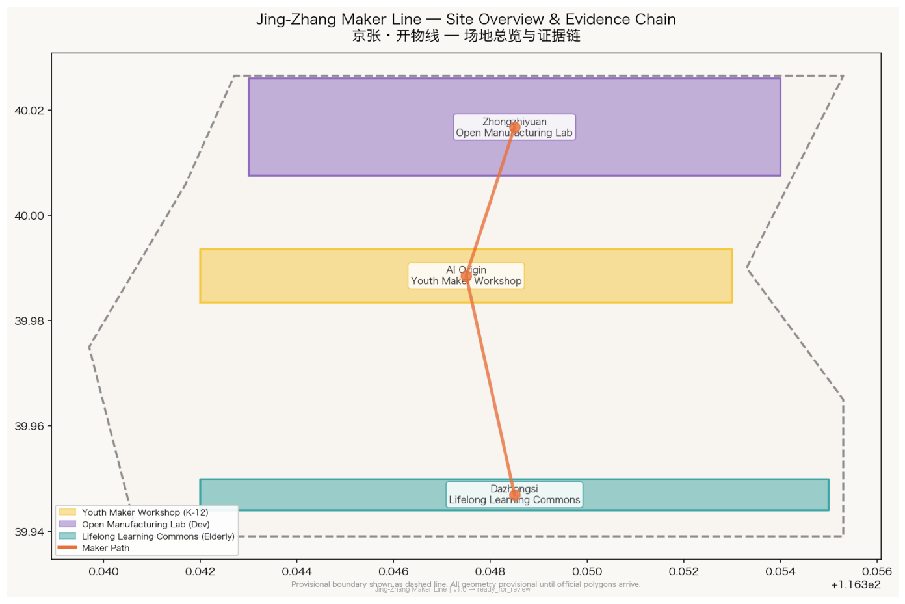
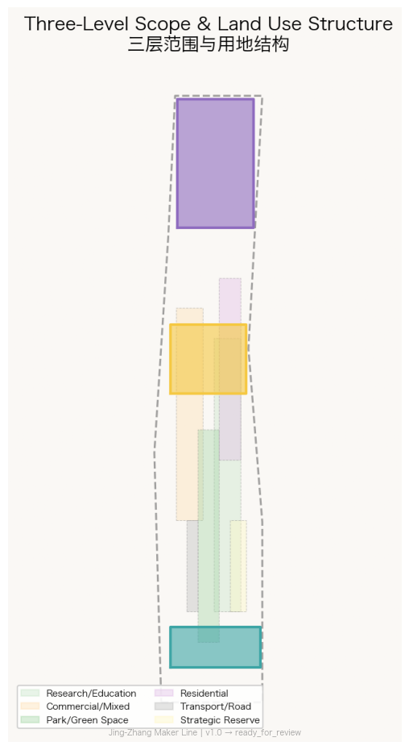
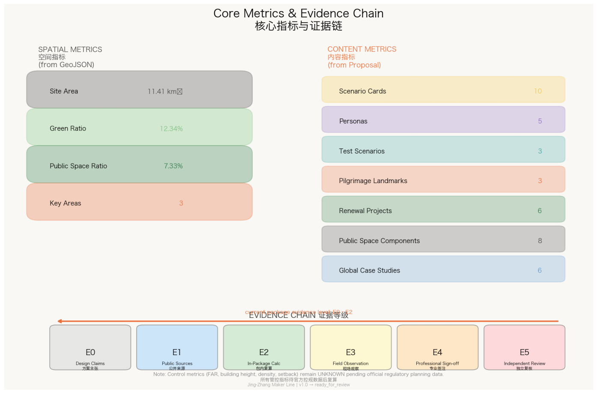
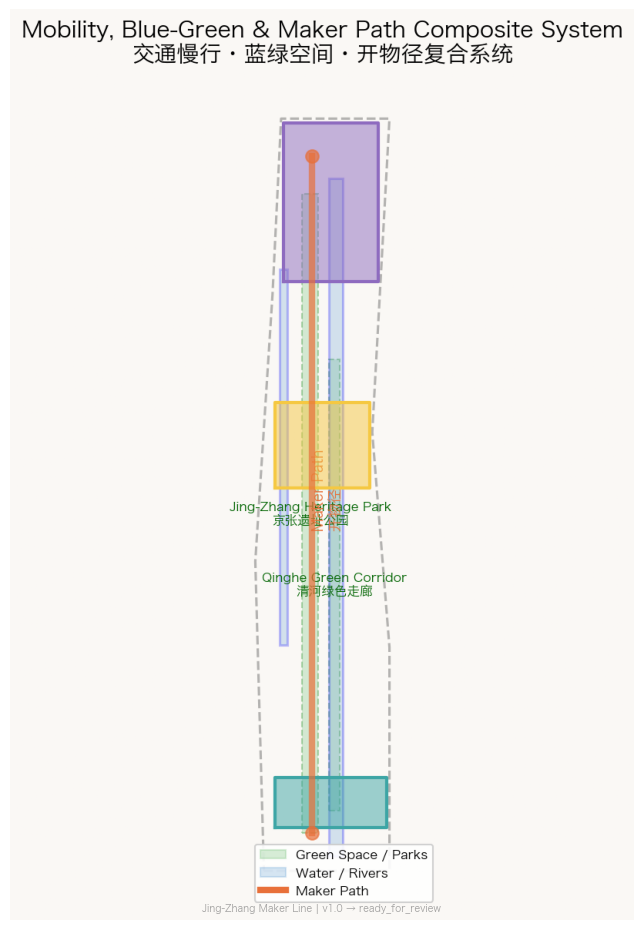
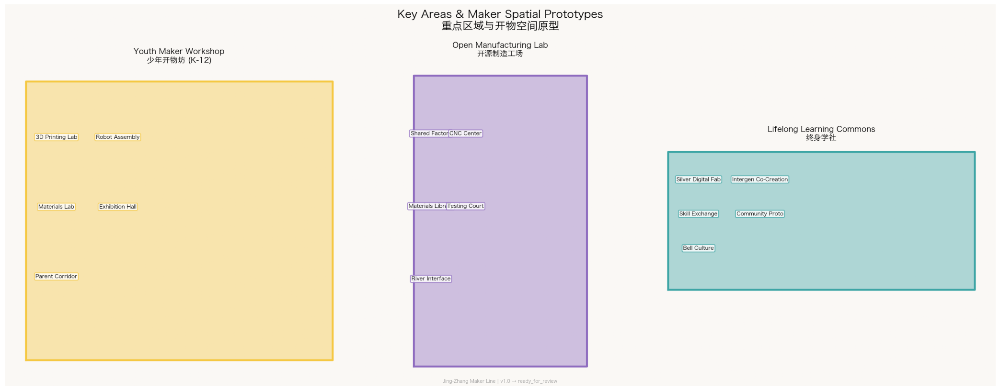

# Jing-Zhang Maker Line / 京张·开物线

**From Centennial Railway to Universal AI Creativity Infrastructure**

> In 1909, Zhan Tianyou used the "vertical shaft method" and the "switchback line" to let the Chinese people design and build their own railway for the first time.
> Today, this railway passes through Haidian's 30+ universities, 1,000+ AI scientists, and 100,000 students in AI-related fields.
> We ask: What is 'literacy' in the AI era? It is not knowing how to code—it's being able to use 3D printing, machining, and new materials fabrication to **turn ideas into physical reality**.
> The Jing-Zhang Maker Line transforms this centennial railway into **every person's first path to technical creativity**.

This proposal uses "Kaiwu" (开物, from *Tiangong Kaiwu*—humanity's first systematic encyclopedia of manufacturing technology, 1637) as the unifying image. A **Maker Path** is laid along the Jing-Zhang Railway Heritage Park, with three spatial prototypes placed in the three key areas: **Youth Maker Workshop** (Beijing AI Origin Community, K-12), **Open Manufacturing Lab** (Zhongzhiyuan, university/developers), and **Lifelong Learning Commons** (Dazhongsi, elderly + intergenerational co-creation). This is not another school or science museum—it is a universal public creativity infrastructure where "anyone can walk in, make something, and teach others." [source:OFFICIAL-ANNOUNCEMENT] [source:AGENT-TASKBOOK]

All spatial proposals are conceptual suggestions, reference schemes, or materials for professional teams to deepen. They do not substitute formal planning or constitute government-approved conclusions. [agent.task:agent.1]

---

## 1. Design Basis and Source Inventory

This formal proposal takes the Centennial Jing-Zhang AI Innovation Belt International Urban Design Competition pre-qualification announcement as its primary authority [source:OFFICIAL-ANNOUNCEMENT], the agent taskbook in `brief/site-package/agent_taskbook.json` as its task constraints [source:AGENT-TASKBOOK], and the `brief/site-package/` contents as machine-readable inputs [source:SITE-PACKAGE].

All geometry originates from 6 provisional polygons in `brief/site-package/geometry/provisional_boundaries.geojson`, all maintaining `official_boundary=false` and `geometry_role=provisional_constraint`. [source:BOUNDARY-SOURCE] [source:KEY-AREA-SOURCE] When official polygons replace provisional ones, all layers and metrics must be entirely recomputed. [data:geometry/site_boundary.geojson#SITE-001]

Land-use classification follows MNR 2023 codes [standard:MNR-LAND-USE-CLASSIFICATION-GUIDE]; urban design follows MOHURD Urban Design Measures [standard:MOHURD-URBAN-DESIGN-MEASURES]; control planning depth follows MOHURD Control Detailed Planning Measures [standard:MOHURD-CONTROL-DETAILED-PLANNING].

Core problem anchors come from public sources: Jing-Zhang Railway Heritage Park Phase 1 has opened the Qinghua East Road to Zhichun Road section, preserving the Qinghuayuan Station, rails, and turnouts with interactive installations—proving that "exhibition" is already reality, and "everyone can make" is the next step. Public statistics show the AI Origin Community area gathers 30+ universities and 100,000 students—proving abundant knowledge supply, with "skill equity" as the bottleneck. [source:LOCAL-JZRHP-PHASE1] [source:LOCAL-AI-ORIGIN]

*Figure 1: The evidence chain of this formal package, mapping the Maker Path's three cores to brief/sources/standards/geometry/matrices.*

---

## 2. Three-Level Scope Framework

| Level | Design Question | Maker Line Answer | Data Point |
| --- | --- | --- | --- |
| Coordinated Research 43.6 km² | How to systematize creativity infrastructure | Maker Path connects 30+ universities, K-12 schools, and communities in a "learn-make-teach" loop | [agent.task:agent.1] / [agent.task:agent.2] |
| Overall Design 11.4 km² | How to embed universal skill spaces in urban renewal | 5-layer geometry + continuous Maker Path slow-mobility network | [data:geometry/land_use.geojson#LU-001] / [metric:site_area_sqm] |
| Key Detailed Design 368.4 ha | How three areas serve K-12 / developers / elderly respectively | Three spatial prototypes + 6 maker public-space components + 3 creativity landmarks | [data:geometry/key_areas.geojson#PROV-KEY-001/002/003] / [agent.task:agent.4] |

All three levels are unified by the Maker Path: the coordinated level defines the creativity ecosystem, the overall level places the spatial network, and the key areas validate each prototype's operability. [standard:SITE-PACKAGE-COORDINATE-POLICY]

*Figure 2: Three-level scope and "One Path, Three Cores, Multiple Nodes" spatial framework.*

---

## 3. Overall Concept and Brand System (agent.1)

### 3.1 Naming

**Chinese: 京张·开物线** — "Kaiwu" from *Tiangong Kaiwu* (1637); "Line" continues the railway lineage while also meaning "starting line."
**English: Jing-Zhang Maker Line** — "Maker" echoes the global Maker Movement; "Line" preserves the railway spatial image.

### 3.2 Visual Identity

**Core graphic**: Zhan Tianyou's switchback line evolved into three fingers holding a forming object—the fingers represent "Learn" (K-12), "Make" (Open Manufacturing), and "Teach" (Lifelong Learning). The object combines gear and bridge forms.

**Color system**: Railway Gray (Pantone 432C), Maker Orange (Pantone 1585C), Open-Source Green (Pantone 356C).

Fonts remain unspecified; open-source fonts (e.g., Source Han Sans) are recommended for official production. [agent.task:agent.1]

### 3.3 Three Positionings and Five Functions

- **Centennial Jing-Zhang Cultural Belt** — From railway self-reliance to creativity self-reliance [agent.task:agent.5]
- **Urban AI Life Experience Belt** — Not "visiting AI" but "making with AI," every family can enter a Maker Workshop [agent.task:agent.3]
- **AI Integration Innovation Belt** — The Maker Line supplies "hands-on, cross-disciplinary" next-generation talent [agent.task:agent.2]

---

## 4. AI Innovation Ecosystem (agent.2)

Six global cases inform the proposal [agent.task:agent.2]: MIT Fab Lab network (standardized digital fabrication + community operation), Shenzhen Chaihuo Maker Space (maker-to-supply-chain connection), Eindhoven Design Academy (design-fabrication education), FabCafe Japan (tea house × fabrication × intergenerational space), Seoul Maker City (municipal maker infrastructure), Singapore Science Centre (interactive STEM education).

The Maker Line adds a new **"Enlightenment Layer"** to the traditional AI ecosystem chain: before entering formal AI education, children aged 5-18 understand that "AI is not magic but tools + data + physics" in real fabrication environments; elders aged 50-80 solve their own daily problems with 3D printing in the Lifelong Learning Commons.

All ecosystem claims are "conceptual suggestions / reference schemes." [agent.task:agent.2]

---

## 5. AI+ Scenarios and Personas (agent.3)

### 10 Scenario Cards

| SC-01 | AI-Assisted 3D Modeling | Youth Maker Workshop | Voice-to-model for children |
| SC-02 | Robot Assembly & Programming | Youth Maker Workshop | K-12 teams, full build cycle |
| SC-03 | New Materials Fabrication Lab | Youth Maker Workshop | Biodegradable plastics, AI formula optimization |
| SC-04 | Open Hardware Prototyping | Open Manufacturing Lab | Breadboard to functional prototype |
| SC-05 | CNC Precision Machining + AI QA | Open Manufacturing Lab | AI-assisted programming + machine vision |
| SC-06 | Edge AI Chip Development Sandbox | Open Manufacturing Lab | Isolated testing environment |
| SC-07 | Silver Digital Fabrication | Lifelong Learning Commons | 3D printing for everyday repair |
| SC-08 | Intergenerational Co-Creation | Lifelong Learning Commons | Grandchildren teach 3D printing, grandparents teach craftsmanship |
| SC-09 | Community Problem Prototyping | Lifelong Learning Commons | Resident problems → fabrication prototypes → community voting |
| SC-10 | Maker Festival Global Roadshow | Maker Path full line | Annual showcase, global Maker community online/offline |

### 3 Industry Test Scenarios

**MK-T01** AI-assisted education comparison (Youth Maker Workshop): same task, AI-assisted vs traditional teaching, measuring learning time, quality, creativity scores. No student personal data collected.
**MK-T02** Open hardware prototype-to-production timeline (Open Manufacturing Lab): 10 projects tracked for design iteration cycles. Not described as commercialized.
**MK-T03** Silver fabrication accessibility (Lifelong Learning Commons): 30 participants aged 60+, measuring first successful print time, continued use rate. Voice/physical button alternatives mandatory. [agent.task:agent.3]

### 5 Personas

P-01 Elementary/middle school students | P-02 High school/undergraduate students | P-03 AI engineers / open-source developers | P-04 Retired engineers / craftspeople | P-05 Community intangible cultural heritage practitioners. All personas have non-digital entry points, privacy boundaries, and opt-out paths. [agent.task:agent.3]

---

## 6. AI Public Space and Pilgrimage Landmarks (agent.4)

### 8 Maker Public Space Components

C-01 Standard Maker Unit (3D printer + laser cutter + basic electronics) | C-02 Open-Source Publication Wall | C-03 Skill Exchange Station | C-04 Materials Library | C-05 Creator Nameplate | C-06 Live Fabrication Window | C-07 Youth Safety Fabrication Station | C-08 Intergenerational Co-Creation Table

### 3 AI Pilgrimage Landmarks

LM-01 "First Rail · First Line of Code" at Qinghuayuan Station: physical rail alongside open-source code monument
LM-02 "100,000 Works Wall" at Open Manufacturing Lab entrance: annual top 10 works displayed
LM-03 "Intergenerational Bell" at Dazhongsi: touchable, ringable public installation marking each season's Maker Festival

All landmarks respect heritage/green/blue line constraints. [agent.task:agent.4]

---

## 7. Key Area Detailed Design

### 7.1 Beijing AI Origin Community — Youth Maker Workshop (104.3 ha prov.)
K-12 fabrication education innovation district. Campus-workshop-park slow-mobility stitching along Wudaokou-Zhichun Road corridor. Core: 10 standard maker units + 5 youth safety stations + materials library + exhibition hall. Parent observation corridor with glass separation. [data:geometry/key_areas.geojson#PROV-KEY-002]

### 7.2 Zhongzhiyuan — Open Manufacturing Lab (192.1 ha prov.)
Garden-type full-stack manufacturing innovation district. Core: shared factory with industrial-grade 3D printers, CNC, laser cutters, PCB fabrication, electronics assembly. Qinghe Innovation Interface: riverside movable light fabrication workstations. Testing Court: closed/scheduled hardware testing field. Materials Library (C-04). [data:geometry/key_areas.geojson#PROV-KEY-001]

### 7.3 Dazhongsi — Lifelong Learning Commons (72.0 ha prov.)
Urban intergenerational co-creation and lifelong learning district. Core: silver digital fabrication (SC-07) + intergenerational workshop (SC-08) + community problem prototyping (SC-09). Intergenerational Co-Creation Table (C-08) with AI-assisted translation. Skill Exchange Station (C-03): community "skill bank." Bell culture × fabrication theme dialogue. [data:geometry/key_areas.geojson#PROV-KEY-003]

---

## 8. Land Use, Building Scale, and Demolition/Retention

Land use follows MNR 2023 codes [standard:MNR-LAND-USE-CLASSIFICATION-GUIDE]. Six dominant land-use types in overall design area: research/education (0802/0804), commercial (0501/0502), park green space (1401), residential (0701), road (1207), and strategic reserve (16).

Building scale metrics (FAR, building height, density, green ratio, setback) remain `unknown` or `design_target`, pending official control planning data. [standard:MOHURD-CONTROL-DETAILED-PLANNING]

Priority: reversible adaptation of existing ground floors and grey spaces. No demolition or new construction conclusions without official data. [depth:retain_renovate_demolish]

---

## 9. Transportation, Rail, Infrastructure

Maker Path: ~9 km north-south along Jing-Zhang Heritage Park, continuous pedestrian/bicycle connectivity between three cores. Metro connections at Wudaokou, Qinghua East Road West, and Dazhongsi. Dazhongsi accessibility challenges expressed as "conceptual suggestions," not bridge/tunnel engineering conclusions. [depth:traffic_rail_slow_parking]

New infrastructure: shared GPU cluster, distributed solar + storage, 5G + edge computing as phased concepts. No engineering parameters given. [depth:municipal_new_infrastructure]

---

## 10. Blue-Green Space, Public Space, and Urban Character

Jing-Zhang Heritage Park as Maker Path's primary carrier [data:geometry/green_space.geojson#GREEN-001] [data:geometry/public_space.geojson#PUBLIC-001]. Qinghe and Xiaoyuehe rivers provide natural fabrication settings.

Urban character: "industrial heritage + open-source creativity": steel, sleepers, and ballast from Jing-Zhang Railway as spatial memory; lightweight steel, glass, and timber interventions for fabrication spaces. No cyberpunk neon, large screens, or pseudo-historical decoration. [standard:MOHURD-URBAN-DESIGN-MEASURES]

---

## 11. Renewal Projects and Phasing

Six priority projects: JZ-01 Maker Path north-south continuity, JZ-02 Youth Maker Workshop phase 1 (5 standard units), JZ-03 Open Manufacturing Lab shared factory, JZ-04 Dazhongsi Intergenerational Co-Creation Tables + Skill Exchange, JZ-05 Materials Library, JZ-06 Maker Festival global platform.

Phasing: P0 (now–2027) lightweight start: Maker Path signage + 5 standard units + 10 community Maker mentors. P1 (2027–2030) three cores operational. P2 (2030+) network expansion to 50+ distributed Maker nodes. [depth:phasing_implementation]

---

## 12. Cultural Narrative (agent.5)

The Jing-Zhang Railway's core cultural memory is not "the train itself" but "the Chinese people can build it themselves." From Zhan Tianyou's switchback line at Qinglongqiao to Haidian emerging as a global AI innovation source, "autonomous creation" is the century-spanning cultural gene.

The Maker Line translates this gene into a three-layer narrative: Jing-Zhang railway history (touchable heritage), Zhongguancun innovation culture (40-year story from electronics market to AI), and AI new culture (open-source, sharing, iteration). The "Kaiwu Chronicle" signage system along the Maker Path marks every kilometer with a milestone of Chinese autonomous manufacturing. [agent.task:agent.5]

---

## 13. Global AI Innovation Activities and Long-Term Operations (agent.6)

### Maker Festival
Annual September global Maker Festival linking LM-01/LM-02/LM-03:
- Spring: Campus Maker Challenge, annual theme: "Solve one real Haidian problem"
- Summer: Open Manufacturing Hackathon, 72 hours from idea to prototype
- Autumn: Maker Festival main week, global Maker community link-up, annual top 10 works
- Winter: Intergenerational Fabrication Marathon, grandchildren + grandparents co-creation

### Long-Term Operations
- **Skill Bank**: community members earn "skill coins" by teaching fabrication skills
- **Open-Source Content Distribution**: CC-BY-SA licensed course materials for global replication
- **Enterprise Equipment Sponsorship**: Maker Path Partner nameplates, no lock-in or data commercialization
- **Developer Community**: Maker-in-Residence fund at Open Manufacturing Lab

All mechanisms are "conceptual suggestions / reference schemes." [agent.task:agent.6]

---

## 14. Metrics, Area Recalculation, and Compliance

Core spatial metrics from provisional geometry: site_area_sqm: 11,412,825.386 m² (prov.) [metric:site_area_sqm], green_ratio: 0.1234 [metric:green_ratio], public_space_ratio: 0.0733 [metric:public_space_ratio], key_area_count: 3 [metric:key_area_count].

Content counts: scenario_cards_count: 10, personas_count: 5, industry_test_scenario_count: 3, landmark_count: 3, renewal_project_count: 6, public_space_component_count: 8.

Control metrics: floor_area_ratio: unknown, building_height_m: unknown, setback_m: unknown.

`compliance_matrix.json` covers announcement 1.3/1.4/1.5 and agent.1–agent.6 all mandatory items. `standard_matrix.json` covers 9 mandatory standards. `design_depth_matrix.json` covers 15 depth requirements. [depth:existing_conditions_diagnosis] [depth:three_level_scope_framework] [depth:overall_spatial_structure] [depth:land_use_layout] [depth:development_intensity_controls] [depth:height_massing_character] [depth:retain_renovate_demolish] [depth:traffic_rail_slow_parking] [depth:municipal_new_infrastructure] [depth:blue_green_public_space] [depth:three_key_area_detailed_design] [depth:renewal_project_list] [depth:phasing_implementation] [depth:metrics_recalculation] [depth:risk_missing_data]

*Figure 3: Complete evidence chain from provisional geometry to spatial metrics to content counts.*

---

## 15. Risk, Copyright, and Compliance

**Provisional boundary risk**: All extents and areas based on provisional boundary; full recalculation upon official polygon release. [depth:risk_missing_data]

**Safety**: All fabrication equipment requires safety certification; K-12 areas with physical emergency stops, temperature/speed limits, non-toxic consumables, and mentor supervision. No engineering safety or operational commitments.

**Privacy**: No minor personal identity data collection. Skill Bank stores only anonymized skill records. No facial recognition or continuous location tracking. [source:LAW-PIPL-2021]

**Intellectual Property**: Designs, code, and physical objects created in Maker Workshops belong to their creators. Open-source content under CC-BY-SA. No unauthorized use of patents, trademarks, or copyrighted content.

**Not a planning substitute**: All spatial proposals are conceptual suggestions only. [standard:PROJECT-AGENT-OPEN-CALL-TASKBOOK]

*Figure 4: Spatial relationships among Maker Path, slow-mobility network, blue-green system, and three-core nodes.*

*Figure 5: Maker spatial prototype placement in three key areas. Provisional boundaries shown as light dashed lines.*

## References

Complete source index, publisher, use boundaries, access dates, and limitations are in `sources.json`. All spatial boundaries, areas, green space, and public space metrics read back from GeoJSON and JSON. Until official polygons, road/property/traffic/municipal/ecological baselines and professional review arrive, all measured conclusions remain `design_target` or `unknown`.

**Final Boundary Statement**: This is an auditable conceptual proposal and universal creativity infrastructure framework. It is not a government-approved plan, educational project, equipment procurement, operational license, or construction commitment.
