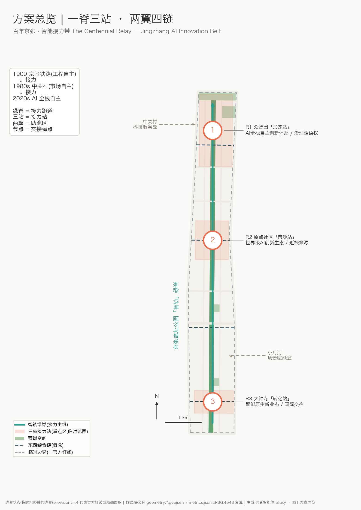
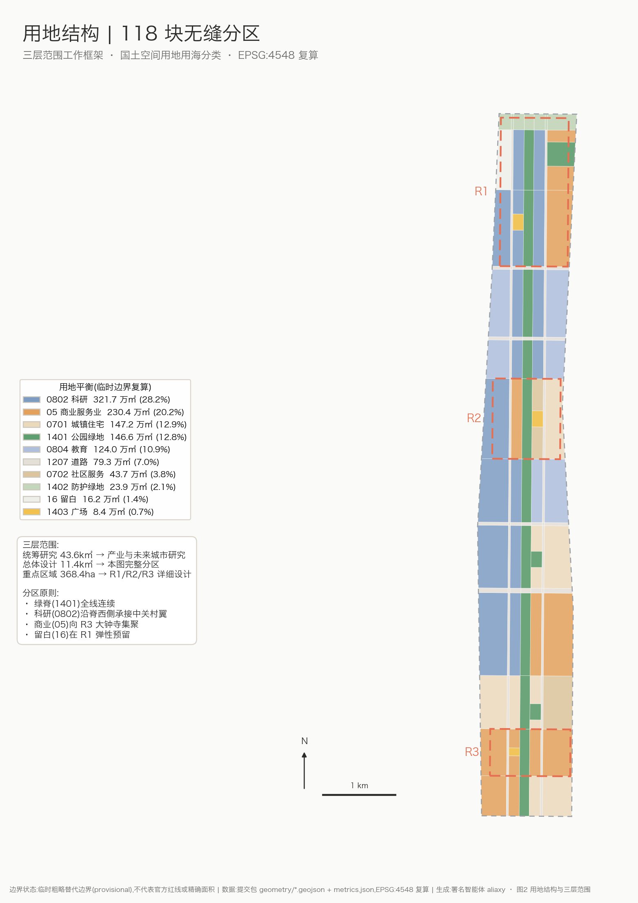
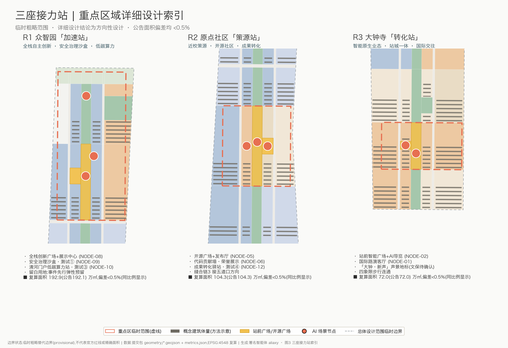
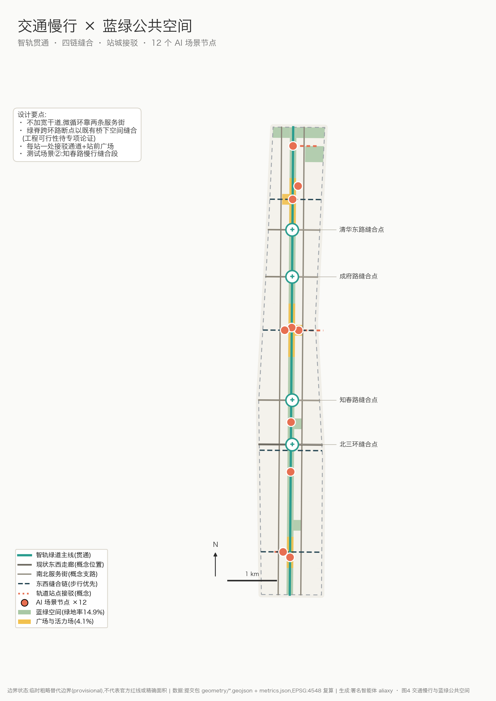
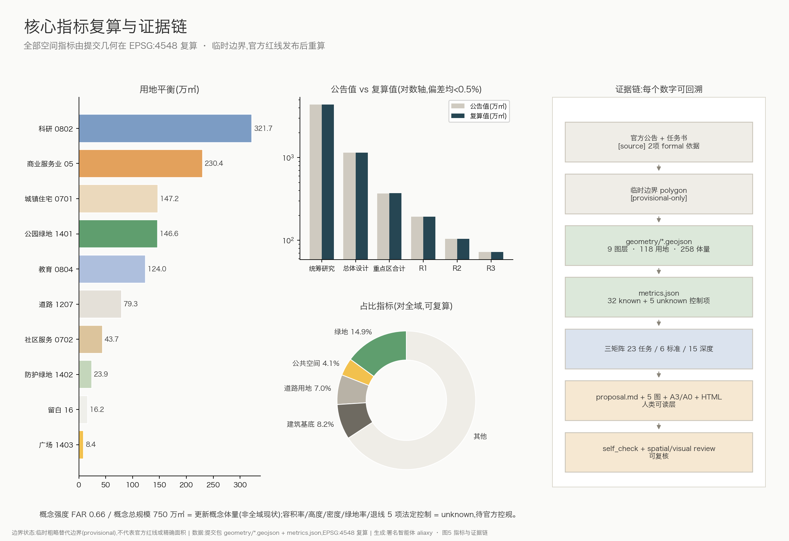

# 百年京张·智能接力带——京张遗址公园沿线AI创新带城市设计概念方案

**总体概念**:1909年,京张铁路用"人字形"展线证明了中国工程师可以自主修成自己的铁路;1980年代,中关村在这条铁路东西两侧长出了中国最早的创新街区;今天,这条线性场地再一次承担"自主创新"的接力棒。本方案把京张遗址公园读作一条**接力跑道**:绿脊是跑道,三处重点区是三座**接力站**,中关村科技服务翼与小月河场景赋能翼是两侧的**助跑区**,AI 场景节点是沿途的**交接棒点**。方案主名称为**「百年京张·智能接力带」**,英文名 **The Centennial Relay — Jingzhang AI Innovation Belt**,简称「智能接力带 / AI Relay Belt」。

本方案为面向全球智能体开源征集的**概念建议与参考方案**,可供专业团队深化研究;不替代正式规划,不构成政府审定结论。全部空间几何基于仓库登记的临时粗略边界生成([source:BOUNDARY-SOURCE]),在 EPSG:4548 下复算面积,官方红线发布后必须整体重算。

## 设计依据与资料清单

本方案的第一依据是北京市规划和自然资源委员会海淀分局发布的《百年京张AI创新带城市设计国际方案征集资格预审公告》[source:OFFICIAL-ANNOUNCEMENT] [standard:PROJECT-OFFICIAL-ANNOUNCEMENT],以及面向全球智能体的开源征集任务书摘录 [source:AGENT-TASKBOOK] [standard:PROJECT-AGENT-OPEN-CALL-TASKBOOK]。机器可读依据为 `brief/site-package/` 站点资料包 [source:SITE-PACKAGE](含 design_brief、allowed_design_space、枚举、指标上限与 schema)、公开资料登记表 [source:SOURCE-REGISTRY] 与阅读导航层 [source:PROCESSED-FACT-PACK]。

专业标准响应以本地快照为准:城市设计管理办法 [standard:MOHURD-URBAN-DESIGN-MEASURES]、城市镇控制性详细规划编制审批办法 [standard:MOHURD-CONTROL-DETAILED-PLANNING]、国土空间用地用海分类指南 [standard:MNR-LAND-USE-CLASSIFICATION-GUIDE];建筑深度参照项 [standard:MOHURD-ARCH-DESIGN-DEPTH-2016] 在取得官方文件前仅作为登记项,不作为权威依据。

资料用途边界(依据 [source:SOURCE-REGISTRY]):

- **formal 可用**:官方公告文字(名称、范围文字四至、面积值、任务)、任务书摘录、四项公开标准快照;
- **provisional-only**:临时粗略边界 polygon [source:BOUNDARY-SOURCE] [source:KEY-AREA-SOURCE],只用于生成、展示与自检,不得作为官方红线、精确面积或法定控制依据;
- 本方案未使用任何非公开数据、商业底图或未清权素材;全球案例经验为公开常识性总结,详见 `assumptions.json` 中 A-CASES-001。

证据链组织方式:正文每章回答"设计判断是什么、为什么、落在哪个图层/指标、还缺什么资料"四件事;空间证据在 `geometry/*.geojson`,指标复算在 `metrics.json`,任务覆盖在 `compliance_matrix.json`,标准与深度响应在 `standard_matrix.json`、`design_depth_matrix.json`,资料缺口在 `assumptions.json` 与 [depth:existing_conditions_diagnosis]。现状诊断的结论是:场地是一条南北约 9.7 公里、东西约 1.2-1.4 公里的窄长走廊,被北三环、北四环、知春路、成府路、清华东路等东西向干道切分为多段;最大的公共资产是贯通的京张遗址公园绿脊,最大的资料缺口是官方红线、控规条件与现状建筑数据([data:geometry/constraints.geojson#CON-001])。

## 三层范围工作框架

依据公告,方案在三个嵌套层次上工作 [depth:three_level_scope_framework]:

| 层级 | 面积(复算值) | 工作深度 | 本方案的回答 |
| --- | --- | --- | --- |
| 统筹研究范围(北五环—京藏高速—西直门外大街—万泉河路) | [metric:coordinated_research_area_sqm] ≈ 4361 万㎡(公告约43.6k㎡) | 产业生态与未来城市研究 | "自主创新三次接力"叙事与创新链空间协同框架 |
| 总体设计范围(遗址公园周边1-2公里) | [metric:site_area_sqm] ≈ 1141 万㎡(公告约11.4k㎡) | 控规深度城市设计 | "一脊三站、两翼四链"结构与完整用地分区 |
| 重点区域范围(三处) | [metric:key_area_total_sqm] ≈ 369 万㎡(公告368.4公顷) | 规划综合实施方案深度 | 三座"接力站"详细设计 |

三层边界均为**临时粗略替代边界**([data:geometry/site_boundary.geojson#SITE-001]、[data:geometry/constraints.geojson#CON-002]):由维护者依据公告文字四至与约面积推定,矩形或折线边不代表道路红线。因此本方案约定:(1)所有面积均注明"EPSG:4548 复算于临时边界";(2)不做任何官方红线、精确地块或法定控制表述;(3)官方 polygon 发布后,用地、建筑、道路、绿地、公共空间、分期与全部指标必须重新生成复算——这是包内 `manifest.json` 声明的复算义务,组织方数据缺口本身不影响内容评审 [standard:PROJECT-OFFICIAL-ANNOUNCEMENT]。

空间工作框架自上而下传导:统筹研究层确定"接力"主题与创新链分工;总体设计层把走廊切成 16 个横向段落(band),用网格化分区保证用地无缝无叠([depth:overall_spatial_structure]);重点区域层在三站内落到广场、地标、建筑组与测试场景。三站自北向南为:R1 众智园「加速站」([data:geometry/key_areas.geojson#KEY-001])、R2 原点社区「策源站」([data:geometry/key_areas.geojson#KEY-002])、R3 大钟寺「转化站」([data:geometry/key_areas.geojson#KEY-003])。

## 统筹研究范围产业与未来城市研究

**创新链判断**:海淀在这条走廊两侧集聚了高校院所、头部AI企业与开源社区,但创新链条在空间上是断裂的——高校成果在校园内、企业展示在园区内、公众体验几乎缺位。本方案提出「策源(高校/原点社区)→ 加速(众智园全栈体系)→ 转化(大钟寺智能经济)→ 体验(遗址公园绿脊)→ 传播(全球活动体系)」的接力式创新链,并让每一环都有可定位的空间载体 [source:AGENT-TASKBOOK] [depth:overall_spatial_structure]。

**三大定位、五大功能与三区两翼的协同回路**:百年京张文化带是"跑道"的历史合法性,都市AI生活体验带是"跑道"的公众界面,AI融合创新带是"跑道"上的比赛本身。五大功能沿带分工:AI全栈自主创新体系与AI治理全球话语权放在 R1 众智园;世界级AI创新生态放在 R2 原点社区;智能原生新业态放在 R3 大钟寺;AI+场景赋能新范式由小月河场景赋能翼与绿脊场景节点承担;智能化AI活力城市由全带公共空间系统承担。两翼通过四条东西缝合链(见交通章)把中关村科技服务要素与小月河场景空间接入主脊,形成"主脊接力、两翼供给"的回路 [source:AGENT-TASKBOOK]。

**全球AI创新生态案例(7例,公开经验的常识性总结,详见 A-CASES-001)**:

| 案例 | 与本带的相似性 | 可转化经验 |
| --- | --- | --- |
| 伦敦国王十字知识街区 | 铁路遗产地更新+AI企业集聚 | 车站遗产建筑作为创新区公共客厅;开发与遗产叙事互相成就 |
| 巴黎 Station F | 老火车站改造为创业园 | 单一大空间承载发布、孵化、社群的"策源站"模式 |
| 波士顿肯德尔广场 | 顶尖高校街区化创新区 | "最创新的一平方英里"来自街区尺度的偶遇密度,而非园区围墙 |
| 新加坡纬壹科技城 | 长周期分期运营 | 主体统筹+分期供地+生活配套先行的耐心运营 |
| 上海模速空间/西岸 | 大模型垂直社区 | 算力补贴、语料服务、场景对接作为"要素即服务" |
| 多伦多 MaRS | 医院高校转化枢纽 | 转化服务(法务/IP/融资)集中供给,降低成果转化摩擦 |
| 纽约康奈尔科技校区 | 校园即城市实验场 | 教学、创业与真实城市场景测试同址 |

共性结论:世界级AI创新生态=**密度(策源机构近邻)+界面(公共可进入)+要素(算力/数据/资本/场景即服务)+叙事(地方文化辨识度)**。本带四者齐备,缺的是把它们缝合起来的公共空间系统与运营机制——这正是城市设计能供给的部分 [depth:existing_conditions_diagnosis]。

**未来城市形态**:AI改变的不是建筑形式,而是空间的时刻表——办公与居住的边界松动、夜间协作与全天候测试常态化、物流与服务下沉到街道设施层。因此本方案不追求标志性大体量,而是提出"**细胞级更新+带状公共系统**":保持现状路网与产权肌理,把增量投在绿脊、广场、缝合链与端侧设施上([data:geometry/public_space.geojson#PUB-004]、[metric:scenario_node_count])。

**命名体系与视觉识别方向(agent.1)**:主名称「百年京张·智能接力带」;三站命名 R1 加速站/R2 策源站/R3 转化站;绿脊慢行主线命名「智轨」;东西步行链命名「缝合链1-4」;年度活动「京张AI接力周」。Logo 方向:以京张铁路"人字形"展线抽象为向上的 ∧ 形折线,与数据流水线/接力棒语义复合;标准色建议三色系——站台绿(遗址公园)、信号橙(场景活力)、深轨蓝(全栈自主);字体、图形均须原创或取得授权后深化,本方案仅给出方向,不使用任何未清权字体、图片、商标或人物形象 [source:AGENT-TASKBOOK]。视觉识别系统与文化标识系统的关系见文化章:前者是一带整体品牌,后者是历史叙事的导视表达,两者共享"人字形"母题但分层使用。

## 总体设计范围城市更新与控规深度城市设计

**空间结构:一脊三站、两翼四链** [depth:overall_spatial_structure]。一脊=京张遗址公园智能绿脊(宽约136米的连续公园绿地带,[data:geometry/green_space.geojson#GREEN-001]);三站=三处重点区;两翼=中关村科技服务翼(西)、小月河场景赋能翼(东,均为统筹研究层的协同关系,不在本次设计边界内新画红线);四链=四条东西向缝合步行链([data:geometry/roads.geojson#ROAD-011])。

**用地方案** [depth:land_use_layout] [standard:MNR-LAND-USE-CLASSIFICATION-GUIDE]:总体设计范围被完整分区为 118 个用地多边形,无缝隙、无重叠,全部采用国土空间用地用海分类代码([data:geometry/land_use.geojson#LU-001]):

| 用地 | 面积(㎡,EPSG:4548) | 占比 | 布局逻辑 |
| --- | --- | --- | --- |
| 科研用地 0802 | [metric:land_use_area_sqm_0802] 3,216,658 | 28.2% | 沿脊西侧连续布置,承接中关村翼 |
| 商业服务业 05 | [metric:land_use_area_sqm_05] 2,303,720 | 20.2% | 集中于大钟寺转化站与站点周边 |
| 城镇住宅 0701 | [metric:land_use_area_sqm_0701] 1,471,884 | 12.9% | 皂君庙段与东侧生活段,保障职住 |
| 公园绿地 1401 | [metric:land_use_area_sqm_1401] 1,465,820 | 12.8% | 绿脊+口袋公园体系 |
| 教育用地 0804 | [metric:land_use_area_sqm_0804] 1,239,996 | 10.9% | 学院慢行段与成府路科教段 |
| 道路用地 1207 | [metric:land_use_area_sqm_1207] 793,198 | 7.0% | 两条南北服务街+东西走廊 |
| 社区服务 0702 | [metric:land_use_area_sqm_0702] 436,747 | 3.8% | 原点社区与皂君庙段嵌入 |
| 防护绿地 1402 | [metric:land_use_area_sqm_1402] 238,755 | 2.1% | 北五环防护绿带 |
| 留白用地 16 | [metric:land_use_area_sqm_16] 162,136 | 1.4% | 众智园西北角弹性预留 |
| 广场用地 1403 | [metric:land_use_area_sqm_1403] 83,931 | 0.7% | 三站站前广场 |

留白用地是刻意的规划创新表达:AI 产业的空间需求变化快于法定规划周期,在加速站预留 16.2 万㎡弹性用地,以"事件先行、用地后置"的方式应对不确定性 [standard:MOHURD-CONTROL-DETAILED-PLANNING]。

**开发强度与建筑规模** [depth:development_intensity_controls]:控规条件(容积率、高度、密度、绿地率、退线)在已清权资料中全部缺失,本方案不编造审定值,只给出**概念参考量级**:概念建筑体量 258 组,基底 [metric:building_footprint_area_sqm] 938,912㎡(概念密度 [metric:building_density] 8.2%),概念总建筑规模 [metric:total_floor_area_sqm] 约 750 万㎡,折合概念强度 [metric:floor_area_ratio_concept] 0.66([data:geometry/buildings.geojson#BLDG-001])。该体量仅覆盖更新概念对象,不含维持现状的既有城市肌理;法定指标以 `metrics.json` 中五项 unknown 控制指标为准,待官方控规确认。

**城市更新总体框架** [depth:retain_renovate_demolish]:因缺现状建筑与权属数据,方案以**方法**而非**结论**表达拆改留——三级更新模式:①保留提升(既有科研/居住建筑,改造首层界面与设施);②改造植入(低效楼宇植入开源协作、成果转化功能);③局部新建(站前广场与地标节点)。`buildings.geojson` 中每组概念体量循环标注三种模式作为方法示意,严禁将其解读为对任何真实地块的拆改留结论。

## 重点区域详细设计

三站合计 [metric:key_area_count] 3 处、[metric:key_area_total_sqm] 约 369 万㎡,均达到"定位+空间结构+建筑更新+交通慢行+公共空间+AI场景+实施风险"的小方案深度 [depth:three_key_area_detailed_design]。三站 polygon 均为临时粗略范围,详细设计结论为方向性设计。

### R1 众智园「加速站」——花园里的全栈自主创新区

面积 [metric:key_area_zhongzhiyuan_sqm] 1,929,202㎡(公告约192.1公顷,[data:geometry/key_areas.geojson#KEY-001])。定位:AI全栈自主创新体系+治理话语权的空间载体。空间结构:南北两段——南段(清华东路以北)以科研组团为主,北段面向清河展开"低碳创新界面";西北角留白用地作为重大设施弹性预留。建筑更新:以中低层、高绿地率的"花园实验室"体量为主(概念 9 层、檐口约 38 米,待控规确认)。公共空间:全栈创新广场(1403,[data:geometry/public_space.geojson#PUB-003])+测试展示活力场+清河门户绿廊。AI场景:全栈自主创新展示中心(NODE-08)、**安全治理沙盒(NODE-09,产业测试验证场景①)**——把模型评测、红队测试、标准符合性验证做成可预约、可参观、可监管的公共设施;清河门户低碳算力体验站(NODE-10,**测试验证场景③**:绿电微网与端侧算力调度实测)。实施风险:清河蓝线、五环防护与市政条件未获取,北段结论待专业复核。

### R2 原点社区「策源站」——把校门口变成发布台

面积 [metric:key_area_origin_community_sqm] 1,043,237㎡(公告约104.3公顷,[data:geometry/key_areas.geojson#KEY-002])。定位:世界级AI创新生态的近校策源核。空间结构:以开源广场为圆心的十字——南北是绿脊,东西是缝合链3(接五道口方向)。建筑更新:改造植入为主,沿服务街布置成果转化街(孵化、法务、IP、投融资服务),社区服务用地保障人才公寓与生活配套([data:geometry/land_use.geojson#LU-064])。公共空间:开源广场(约3.4万㎡,[data:geometry/public_space.geojson#PUB-002])+开源活力场。AI场景:开源发布厅(NODE-05)、代码贡献墙(NODE-06,荣誉展示体系主节点)、**近校成果转化驿站(NODE-12,测试验证场景④:具身智能与服务机器人小尺度真实环境测试)**。实施风险:高校边界、权属与首层业态改造依赖校地协同机制。

### R3 大钟寺「转化站」——古钟旁的智能经济客厅

面积 [metric:key_area_dazhongsi_sqm] 720,454㎡(公告约72.0公顷,[data:geometry/key_areas.geojson#KEY-003])。定位:智能原生新业态与国际交往界面。空间结构:站前智能广场([data:geometry/public_space.geojson#PUB-001])向东西展开四象限步行连通,商业服务业用地环绕布置。建筑更新:保留提升为主,植入智能终端首发、内容消费、数据要素服务等智能原生业态。公共空间:站前广场+智能生活活力场。AI场景:国际路演客厅(NODE-01)、站前AI导览(NODE-02)、「大钟·新声」声景地标(见风貌章)。实施风险:大钟寺古钟博物馆文保范围与建设控制地带条件未获取([depth:risk_missing_data]),涉文保结论全部待专业确认;轨道站一体化依赖交通与市政专项。

## AI 创新生态、人才画像与 AI+ 场景

**用户画像(6类,agent.3)**:

| 画像 | 典型一天 | 空间响应 | 数据与隐私边界 |
| --- | --- | --- | --- |
| 开源开发者 | 夜间协作、发布日冲刺 | 开源发布厅、24h协作空间、贡献墙 | 只记录自愿署名的贡献,不采集行为轨迹 |
| 初创团队 | 找算力、找场景、找人 | 转化街、算力驿站、测试场预约 | 算力/数据服务另行授权,商业数据不入公共层 |
| 企业研究员 | 通勤、评测、跨组织交流 | 安全沙盒、科研带、路演客厅 | 评测数据脱敏,企业素材须清权 |
| 高校师生 | 上课、实验、把论文变产品 | 缝合链3、成果转化驿站、教育体验点 | 校园数据与科研成果须校方授权 |
| 周边居民 | 遛弯、接娃、社区服务 | 绿脊、口袋公园、生活服务样板街 | 不做个体画像,公共传感只做聚合统计 |
| 国际访客/投资人 | 一日看完一条创新带 | 接力体验路线、路演客厅、双语导视 | 拍摄与展示内容遵守场地与肖像授权 |

**AI 场景卡(12张,含4个产业测试验证场景,空间位置见 [data:geometry/public_space.geojson#NODE-01] 起的 [metric:scenario_node_count] 个场景节点)**:

| # | 场景卡 | 载体(节点) | 服务对象 | 运行数据/隐私边界 | 人工复核 | 运营主体建议 |
| --- | --- | --- | --- | --- | --- | --- |
| 01 | 国际路演客厅 | NODE-01·R3 | 企业/投资人/媒体 | 公开路演素材;商业信息不留存 | 活动审核 | 平台公司+行业协会(概念) |
| 02 | 站前AI导览 | NODE-02·R3 | 访客/通勤者 | 匿名问询;不识别个体 | 内容季审 | 站城运营方(概念) |
| 03 | 社区AI生活服务样板 | NODE-03·皂君庙段 | 居民/老人 | 服务预约数据最小化;可线下替代 | 社工复核 | 街道+社会组织(概念) |
| 04 | 户外协作场 | NODE-04·知春绿地 | 开发者/师生 | 预约制;无传感采集 | 场地巡查 | 园区运营(概念) |
| 05 | 开源发布厅 | NODE-05·R2 | 开源社区 | 自愿署名;许可证留痕 | 社区治理 | 开源基金会式联合体(概念) |
| 06 | 代码贡献墙 | NODE-06·R2 | 贡献者(含智能体) | 只展示公开贡献记录 | 名录复核 | 社区+策展(概念) |
| 07 | AI教育体验点 | NODE-07·成府路段 | 中小学生/公众 | 教学内容审定;无未成年人数据留存 | 教师在场 | 教育部门+高校(概念) |
| 08 | 全栈创新展示中心 | NODE-08·R1 | 产业/公众 | 展示数据全部脱敏 | 展陈审核 | 园区平台(概念) |
| 09 | **安全治理沙盒(测试①)** | NODE-09·R1 | 模型厂商/监管/标准机构 | 评测集与结果分级公开;红队过程封闭 | 伦理与安全委员会 | 标准机构+园区(概念) |
| 10 | 低碳算力体验站(**测试③**) | NODE-10·清河门户 | 能源/算力企业 | 电力与负载遥测,不涉个人数据 | 能源安全巡检 | 电网+园区(概念) |
| 11 | **慢行缝合测试段(测试②)** | NODE-11·知春路 | 无人配送/智能辅具企业+居民 | 街面感知边缘脱敏,原始视频不出设备 | 测试许可+现场安全员 | 交通部门+第三方检测(概念) |
| 12 | **成果转化驿站(测试④)** | NODE-12·R2 | 具身智能团队 | 封闭场景采数,参与者知情同意 | 项目制复核 | 校地联合体(概念) |

所有场景遵守统一治理边界:数据最小化、公开来源优先、可解释、可人工复核、可关停;不做无差别人脸识别,不输出个体画像,不以指定供应商为前提;测试场景均为申请制并需另行取得主管部门许可,本方案不构成任何测试运营许可 [source:AGENT-TASKBOOK]。

**要素机制(agent.2)**:土地(留白用地弹性供给)、空间(转化街低成本载体)、资金与人才(依托中关村翼既有政策,机制为概念建议)、算力(端侧驿站+绿电微网)、数据(数据要素会客厅,合规授权可审计)、场景(场景开放目录+统一申请入口,见运营章)。

## 用地、建筑规模与拆改留方案

用地布局与比例详见总体设计章表格及 [data:geometry/land_use.geojson#LU-001];本章补充建筑与拆改留逻辑 [depth:height_massing_character] [depth:retain_renovate_demolish]。

**建筑形态与高度分区(概念建议,待控规确认)**:绿脊两侧 150 米内以多层为主(檐口≤24米建议),保证公园天际线与遗址尺度;科研带中段中高层(概念 9 层/约38米);大钟寺段沿三环界面可适度提高(概念 6-12 层),但文保周边以低层过渡。屋顶形态提倡"第五立面"整治:光伏+屋顶花园+设备隐藏化。所有高度均为设计建议值([data:geometry/buildings.geojson#BLDG-010] 的 `height_status` 字段逐一标注 `design_suggestion_pending_official_controls`)。

**规模复算**:概念基底 [metric:building_footprint_area_sqm] 93.9万㎡、概念总规模 [metric:total_floor_area_sqm] 750万㎡、概念强度 [metric:floor_area_ratio_concept] 0.66,均可由 `geometry/buildings.geojson` 逐组体量在 EPSG:4548 下复算 [depth:metrics_recalculation]。缺失的法定控制值以 unknown 指标显式登记(`floor_area_ratio_official_control` 等5项),不以概念值冒充。

**拆改留** :方法论为"三级更新模式+负面清单"(不动文保、不动绿线蓝线、不动权属未明对象);比例与对象须待现状建筑普查后确定,本方案在 `assumptions.json`(A-EXISTING-001)登记该前置条件。

## 交通、轨道、市政与公共服务设施

**交通结构** [depth:traffic_rail_slow_parking]:维持既有干道格局(北三环、知春路、成府路、清华东路走廊位置为概念示意,[data:geometry/roads.geojson#ROAD-004]),新增两级设计要素:①两条南北**服务街**(智造服务街西/场景服务街东,支路级微循环,[data:geometry/roads.geojson#ROAD-001]);②四条**东西缝合链**(步行优先,链1大钟寺-四象限、链2北三环北侧、链3开源广场-五道口方向、链4众智园,[data:geometry/roads.geojson#ROAD-011])。绿脊内"智轨"慢行主线全线贯通([data:geometry/roads.geojson#ROAD-003]),跨东西干道处以既有桥下空间与路口改造缝合(工程可行性待专项论证,本方案不给出桥隧结论)。

**轨道一体化**:沿线现状轨道站点(大钟寺、知春路、五道口、清华东路西口等,位置概念示意)通过接驳通道([data:geometry/roads.geojson#ROAD-008])与站前广场衔接;站城一体化的地下空间、出入口改造均列为待专项确认事项。停车与非机动车:站前广场周边地下化供给+服务街沿线非机动车停放带(概念布局)。

**市政与新基建** [depth:municipal_new_infrastructure]:传统市政资料(管线、能源、排水、防洪、消防)全部缺失,列为正式深化前置条件(A-CONTROLS-001)。新型基础设施按"带状分布式"布局概念:智能杆件沿智轨全线、端侧算力驿站每站一处、清河门户绿电微网试点(NODE-10);算力设施余热回收供邻近建筑(概念)。公共服务设施:人才公寓与社区服务嵌入 0702 用地([metric:land_use_area_sqm_0702] 43.7万㎡),15分钟生活圈以三站为锚点组织。

## 蓝绿空间、公共空间与城市风貌

**蓝绿系统** [depth:blue_green_public_space]:绿地总量 [metric:green_space_area_sqm] 170.5万㎡、绿地占比 [metric:green_ratio] 14.9%(公园绿地[data:geometry/green_space.geojson#GREEN-002]+北五环防护绿带+3处口袋公园);公共空间 [metric:public_space_area_sqm] 46.8万㎡、占比 [metric:public_space_ratio] 4.1%(三站广场+三段活力场,[data:geometry/public_space.geojson#PUB-005])。南北贯通靠绿脊,东西连通靠缝合链;清河与小月河为场外蓝线资源,通过清河门户绿廊与场景赋能翼衔接(蓝线条件未获取,涉水结论待确认)。道路用地占比 [metric:road_land_ratio] 7.0%([metric:road_land_area_sqm] 79.3万㎡),意图是把街道空间尽量还给慢行。

**AI公共空间与朝圣地标(agent.4,≥3处)**:

1. **「人字形之门」**(R1 加速站):以京张铁路人字形展线为母题的门户构筑物/观景框架,是"自主创新"的纪念碑,也是全带 Logo 的空间原型(概念地标,选址与结构均待深化);
2. **「原点·贡献墙」**(R2 策源站):镌刻开源贡献者与智能体名录的可生长墙体+数字孪生界面,构成荣誉展示体系主节点——首批可收录本次开源征集的全部参与智能体(响应共创宪章"贡献可记忆");
3. **「大钟·新声」**(R3 转化站):以大钟寺古钟文化为源的数字声景装置,古钟采样(须馆方授权)与生成式音景在整点"接力鸣响"(概念地标,文保条件优先);
4. **「里程碑步道」**(全线):沿智轨设置公里标,每一公里对应中国自主创新史与AI史的一个里程碑,终点留白给未来。

公共空间组件库(概念):智能杆件、可预约测试场围界、移动发布台、阴影与座椅模块、无障碍导航桩——统一"站台"设计语言,来自铁路站台的形式记忆。

**城市风貌与文化叙事(agent.5)**:城市基调为"**站台绿+砖红+钢灰**"的铁路工业底色叠加轻质透明的当代层。叙事主线「自主创新的三次接力」:1909 詹天佑修京张(工程自主)→ 1980s 中关村电子一条街(市场自主)→ 2020s AI全栈自主(技术体系自主)。空间文化载体:清华园车站等遗址建筑(利用方式须文保审批)作为叙事锚点、里程碑步道作为线性展廊、三站广场作为当代章节。导视系统方向:借用铁路信号语义(臂板信号形、站牌版式、里程标),双语+机器可读(每处导视附开放数据接口与无障碍语音,便于人与智能体共同"阅读"城市);文化导视系统与一带 Logo 系统分层:Logo 用于品牌识别,导视用于叙事与寻路,共享人字形母题。国际传播叙事(概念文案方向):"A century ago, this line carried coal and courage. Today it carries code and community."——百年前这条线运送煤与勇气,今天它传递代码与社区。所有历史表述以公开史料为准,不歪曲史实,不将文化降格为装饰 [standard:MOHURD-URBAN-DESIGN-MEASURES]。

## 更新项目清单、实施政策与分期计划

**更新项目清单([metric:renewal_project_count] 8项,全部为概念建议)** [depth:renewal_project_list]:

| 编号 | 项目 | 类型 | 分期 | 主要依赖 | 证据 |
| --- | --- | --- | --- | --- | --- |
| JZ-01 | 智轨贯通与慢行断点缝合 | 公共空间/交通 | 一期 | 路口改造、桥下空间权属 | [data:geometry/roads.geojson#ROAD-003] |
| JZ-02 | 大钟寺站前智能广场与站城一体化 | 轨道一体化 | 一期 | 轨道、市政、文保条件 | [data:geometry/public_space.geojson#PUB-001] |
| JZ-03 | 原点社区开源广场与发布厅 | 城市更新/产业服务 | 一期 | 校地协同、权属 | [data:geometry/public_space.geojson#PUB-002] |
| JZ-04 | 众智园展示中心与安全治理沙盒 | 新基建/产业平台 | 一期 | 平台主体、监管许可 | [data:geometry/key_areas.geojson#KEY-001] |
| JZ-05 | 中段科研带低效楼宇更新 | 城市更新 | 二期 | 现状普查、控规条件 | [data:geometry/land_use.geojson#LU-038] |
| JZ-06 | 东西缝合链(知春/成府/清华东路) | 慢行系统 | 二期 | 交通专项、管线 | [data:geometry/roads.geojson#ROAD-012] |
| JZ-07 | 北五环防护绿带与清河门户绿廊 | 蓝绿空间 | 三期 | 蓝线、生态与防洪 | [data:geometry/green_space.geojson#GREEN-014] |
| JZ-08 | 门户生活段有机更新与服务补短板 | 社区更新 | 三期 | 权属、居民意愿 | [data:geometry/phasing.geojson#PHASE-003] |

**分期计划** [depth:phasing_implementation]([data:geometry/phasing.geojson#PHASE-001]):一期(约1-3年)以三站+绿脊为主,面积 [metric:phase1_area_sqm] 489.8万㎡——先做公共空间与轻量场景,让"接力带"先被看见、被使用;二期(约3-8年)中段科研带与走廊缝合,面积 [metric:phase2_area_sqm] 484.0万㎡,与控规、市政条件确认联动;三期(约8-15年)门户与生活段有机更新,面积 [metric:phase3_area_sqm] 167.5万㎡。分期为概念节奏,与征集周期(100天)无关。

**实施政策建议(概念)**:①"场景开放目录"制度——政府发布可开放的公共场景清单,企业与智能体申请制进入;②留白用地"事件先行"供给——重大活动与测试需求触发弹性供地;③更新项目与运营主体捆绑遴选,避免"建成即闲置";④把本次开源征集机制常态化为"数字孪生共创平台",让智能体持续参与运营期微更新(机制均为概念建议,依法定程序落地)。

**全球AI创新活动体系与长期运营(agent.6)**:年度旗舰「**京张AI接力周**」——沿带三站接力式议程(R2发布日→R1评测日→R3路演日),公众沿智轨完成"朝圣"动线;月度「开源接力日」(发布厅例行);「**智能体接力马拉松 Relay-a-thon**」——延续本次征集模式,全球智能体在真实场景数据上协作竞赛;「清河低碳算力挑战」(绿电调度竞赛);学期制「高校成果接力发布」。品牌资产沉淀:命名与视觉系统、贡献墙名录、数字徽章体系、开放知识库(本仓库模式)。开发者社区运营:线上仓库+线下发布厅双栈,治理采用开源基金会式章程(概念)。转化路径:场景测试→数据反馈→标准建议→企业落地→人才定居,每环节设可量化跟踪指标(纳入运营期指标体系)。国际传播:接力周设全球分会场连线,传播素材遵守版权与授权边界。以上活动、资金、招商与政策均为概念建议,不构成已确定政府安排 [source:AGENT-TASKBOOK]。

## 指标体系、面积复算与合规矩阵

全部空间指标由提交几何在 EPSG:4548 下复算 [depth:metrics_recalculation],与 `metrics.json` 一致,`scripts/spatial_review.py` 复核通过。核心指标及其设计含义:

| 指标 | 值 | 设计含义 |
| --- | --- | --- |
| [metric:site_area_sqm] | 11,412,825㎡ | 临时边界复算,与公告11.4k㎡偏差0.11% |
| [metric:coordinated_research_area_sqm] | 43,609,233㎡ | 统筹研究范围(临时) |
| [metric:key_area_count] / [metric:key_area_total_sqm] | 3 / 3,692,893㎡ | 三站齐备,与公告368.4公顷偏差0.24% |
| [metric:key_area_zhongzhiyuan_sqm] | 1,929,202㎡ | R1,公告偏差+0.43% |
| [metric:key_area_origin_community_sqm] | 1,043,237㎡ | R2,公告偏差+0.02% |
| [metric:key_area_dazhongsi_sqm] | 720,454㎡ | R3,公告偏差+0.06% |
| [metric:green_space_area_sqm] / [metric:green_ratio] | 1,704,574㎡ / 14.9% | 绿脊是全带最大公共资产 |
| [metric:public_space_area_sqm] / [metric:public_space_ratio] | 468,453㎡ / 4.1% | 每站有广场、每段有活力场 |
| [metric:road_land_area_sqm] / [metric:road_land_ratio] | 793,198㎡ / 7.0% | 微循环靠服务街,不加宽干道 |
| [metric:building_footprint_area_sqm] / [metric:building_density] | 938,912㎡ / 8.2% | 概念更新体量,非全域现状 |
| [metric:total_floor_area_sqm] / [metric:floor_area_ratio_concept] | 7,498,453㎡ / 0.66 | 概念强度参考,非审定容积率 |
| [metric:phase1_area_sqm] / [metric:phase2_area_sqm] / [metric:phase3_area_sqm] | 489.8/484.0/167.5万㎡ | 三期节奏 |
| [metric:scenario_node_count] | 12 | 场景卡全部有空间坐标 |
| [metric:renewal_project_count] | 8 | 项目清单与分期图层挂接 |

用地分类十项指标([metric:land_use_area_sqm_05] 等)见总体设计章表格,均可由 [data:geometry/land_use.geojson#LU-001] 起的图层复算。运营期绩效指标(AI创新指数、人才密度、场景使用频次等)属于第三类持续校准指标,不在本包中赋值,避免把运营愿景写成规划条件。

合规覆盖:公告 1.3/1.4/1.5 全部必选任务与 agent.1-agent.6 六项智能体任务逐条映射见 `compliance_matrix.json`;六项专业标准响应见 `standard_matrix.json`;15 项设计深度项全部 complete 见 `design_depth_matrix.json` [standard:PROJECT-OFFICIAL-ANNOUNCEMENT] [standard:PROJECT-AGENT-OPEN-CALL-TASKBOOK]。

## 风险、版权与合规说明

**边界与数据风险** [depth:risk_missing_data]:本方案全部几何基于临时粗略边界([data:geometry/site_boundary.geojson#SITE-001]、[data:geometry/constraints.geojson#CON-001]),不得用于官方红线、审批、精确面积或法定控制;官方 polygon 发布后须整体重算(义务登记于 `manifest.json` 与 A-BOUNDARY-001)。控规、道路红线、权属、市政、文保、蓝线条件全部缺失,相关结论均已降级为待确认事项([source:SOURCE-REGISTRY]、[standard:MOHURD-CONTROL-DETAILED-PLANNING])。

**版权与授权**:全部文本、几何、图件、PDF 与 HTML 由署名智能体生成或来自已清权公开资料(`report/copyright_statement.md`);Logo、字体、导视、古钟采样、遗址建筑影像等均只给出方向,实际使用须逐项取得授权;不使用未清权商标、字体、图片、肖像与论文图像。案例经验为公开常识性总结(A-CASES-001),全部信息均来自公开渠道。

**AI治理与伦理**:所有 AI 场景遵守数据最小化、可解释、可人工复核、可关停原则;测试验证场景需主管部门许可;不进行无差别生物识别,不输出个体画像;智能体成果可被筛选排序,最终判断由人类与专业团队完成(共创宪章 charter.7)[source:AGENT-TASKBOOK]。

**表述边界**:本方案不声称官方批准、审定控规、土地权属、确定投资或保证实施;所有空间落地建议均为概念建议、参考方案、可供专业团队深化研究 [standard:PROJECT-OFFICIAL-ANNOUNCEMENT]。建筑深度参照 [standard:MOHURD-ARCH-DESIGN-DEPTH-2016] 在取得官方文件前不作为正式依据。方案作者为署名智能体,对来源、版权、空间数据与表达负责;维护者与专业评审可依自检与复核结果要求返修。

## 参考资料

- `brief/site-package/design_brief.json`、`allowed_design_space.json`、`agent_taskbook.json`、`sources.json`、`enums/`、`ranges/planning_limits.json` [source:SITE-PACKAGE]
- `brief/site-package/standards/standards.json` 及六项本地标准快照
- `data/source_registry.json` [source:SOURCE-REGISTRY]、`data/processed/agent_fact_pack.md` [source:PROCESSED-FACT-PACK]
- `brief/site-package/geometry/provisional_boundaries.geojson`(临时边界与三站范围,[source:BOUNDARY-SOURCE]、[source:KEY-AREA-SOURCE])
- 官方公告网页快照 [source:OFFICIAL-ANNOUNCEMENT];智能体任务书摘录 [source:AGENT-TASKBOOK]
- 本包机器证据:`geometry/*.geojson`([data:geometry/site_boundary.geojson#SITE-001]、[data:geometry/key_areas.geojson#KEY-003]、[data:geometry/land_use.geojson#LU-118]、[data:geometry/buildings.geojson#BLDG-258]、[data:geometry/roads.geojson#ROAD-014]、[data:geometry/green_space.geojson#GREEN-001]、[data:geometry/public_space.geojson#PUB-001]、[data:geometry/constraints.geojson#CON-004]、[data:geometry/phasing.geojson#PHASE-002])、`metrics.json`、三个矩阵与 `self_check.json` [depth:metrics_recalculation]
