# Intelligence in Common: The Jing-Zhang Open Intelligence Commons

**Before AI enters the street, it must pass public acceptance.** This is the proposal's shortest and most testable civic claim. The Centennial Jing-Zhang AI Innovation Belt does not need an AI showcase visible only during festivals. It needs an urban public protocol that operates year-round, welcomes everyone, allows every technology to be questioned, and lets failure exit. The proposal reads the Jing-Zhang Railway Heritage Park as a memory and public-intelligence spine. Zhongzhiyuan, the Beijing AI Origin Community, and Dazhongsi become three distinct urban laboratories for safety governance, open-source translation, and AI-Native everyday life. The Zhongguancun Technology Services Wing and Xiaoyue River Scenario Enablement Wing connect capital, legal services, compute, data, and real urban problems.

Version 3.0 extends public acceptance from one street into a **Public Acceptance Passport** shared by all three key areas. Zhongzhiyuan's Safety Acceptance Garden proves that testing is observable and physically stoppable. The AI Origin Community's Rights & Contribution Arcade proves that provenance is traceable and a contribution can be withdrawn. Dazhongsi's 100-metre Public Acceptance Street proves that daily services retain a staffed path, appeal, and rollback. Each of twelve passports becomes eligible for time-limited public acceptance only when four conditions interlock—purpose visible, accountable owner named, human takeover rehearsed, and exit rehearsed—and every red line passes. This is an original civic metaphor derived from the Jing-Zhang culture of connection; it is not a description of real railway signalling engineering. Every move remains a Conceptual Recommendation, a reference scheme, or material for professional teams to deepen. Nothing replaces statutory planning or constitutes a government-approved conclusion.

## Design Basis and Source List

The proposal first fixes the authority boundary of its evidence. The repository brief `brief/public-brief.md` and official announcement establish the project vision, the wording of the three spatial scales, approximate announced areas, and design tasks [source:OFFICIAL-ANNOUNCEMENT] [standard:PROJECT-OFFICIAL-ANNOUNCEMENT]. The rights-cleared Agent taskbook supplies the three positionings, five functions, Three Zones and Two Wings, and six Agent tasks [source:AGENT-TASKBOOK] [standard:PROJECT-AGENT-OPEN-CALL-TASKBOOK].

Urban design, regulatory detailed planning, and land-use classification follow the local reference snapshots [standard:MOHURD-URBAN-DESIGN-MEASURES] [standard:MOHURD-CONTROL-DETAILED-PLANNING] [standard:MNR-LAND-USE-CLASSIFICATION-GUIDE]. No verifiable official text is available for the architectural design-depth document, so it remains a registered data gap [standard:MOHURD-ARCH-DESIGN-DEPTH-2016].

Three background references calibrate public-AI applicability. The Interim Measures for Generative AI are cited only when a service provides generated content to the public within their statutory scope; numerical appeal deadlines remain self-imposed project targets [standard:GENERATIVE-AI-INTERIM-MEASURES]. Article 39 of the Barrier-Free Environment Law is not generalized beyond its enumerated public-service settings [standard:BARRIER-FREE-ENVIRONMENT-LAW]. State Council General Office document No. 45 of 2020 is a policy reference for parallel traditional and smart service; its 2020–2022 milestones are not presented as a live 2026 project duty [standard:ELDERLY-SMART-TECH-PLAN-2020-45].

The site package, Source Registry, and processed fact pack serve respectively as the rule base, the source-usability decision layer, and the reading guide [source:SITE-PACKAGE] [source:SOURCE-REGISTRY] [source:PROCESSED-FACT-PACK].

The current `SITE_BOUNDARY` and three `KEY_AREA` polygons come from the repository's provisional rough geometry [source:BOUNDARY-SOURCE] [source:KEY-AREA-SOURCE]. They are recorded with `official_boundary=false` and `geometry_role=provisional_constraint` in [data:geometry/site_boundary.geojson#SITE-001] and [data:geometry/key_areas.geojson#PROV-KEY-001]. They support generation, self-check, display, and discontinuity discussion only. The announced scale of approximately 11.4 km² does not become a precise redline because this package recalculates 11.41 km². When official polygons arrive, land use, buildings, roads, green space, public space, phasing, figures, PDFs, HTML, and every spatial metric must be rebuilt. Existing conditions, ownership, heritage, transport, municipal infrastructure, and regulatory-plan gaps are registered in `assumptions.json` [depth:existing_conditions_diagnosis].

Six international cases are used only as mechanism references: one-north for multi-district work-live-learn integration [source:CASE-ONE-NORTH]; Maria 01 for adaptive reuse and community [source:CASE-MARIA01]; STATION F for a large startup campus with stage-specific programs [source:CASE-STATIONF]; MaRS for linking research, enterprise, capital, and public mission [source:CASE-MARS]; Seoul AI Hub for specialist incubation, training, and exchange [source:CASE-SEOULAI]; and Kendall Square for long-term governance of mixed use and public space [source:CASE-KENDALL]. None supports a project boundary, statutory control, tenant placement, investment amount, or implementation commitment here.

The structure is not a post-rationalization of “one spine, three commons, and two wings.” It starts from five urban tensions that must still be tested. North-south railway memory may be continuous while daily east-west connections remain fragmented, so the design combines a memory spine with three types of cross-connection. Innovation resources are concentrated, but public access remains unverified, so open ground floors and staffed service points become the commons interface. AI scenarios may be visible while accountability remains obscure, so notice, data, decision, and appeal become four spatial gates. Renewal too often begins with added floor area, so the proposal prioritizes retain-and-adapt, reversible insertion, and delayed decisions until official data arrives. All three key areas host AI functions, yet safety gradients, porous sharing, and a station-city living room give them different spatial grammars. The first two tensions remain working hypotheses and require public existing-condition data, field surveys, and official drawings.

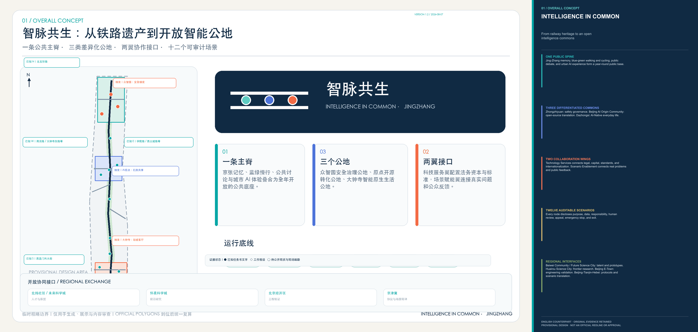

## Three-Level Scope Framework

The three levels are one evidence chain from strategy to space to verification, not three unrelated drawings. The 43.6 km² Coordinated Research Area asks how Haidian's AI innovation chain can collaborate across institutions. The approximately 11.4 km² Overall Design Area asks which urban spaces can carry that collaboration. The three Key-Area Detailed Design Areas ask how reversible small projects can test it. This transmission is governed by [depth:three_level_scope_framework] and [depth:overall_spatial_structure], with [data:geometry/site_boundary.geojson#SITE-001], [data:geometry/key_areas.geojson#PROV-KEY-002], and [metric:key_area_count] as machine-readable evidence.

The overall structure is named “one commons spine + three differentiated commons + two collaboration wings + N auditable nodes.” The spine is the Jing-Zhang memory and open-intelligence commons. The three commons are the Zhongzhiyuan Safety Governance Commons, AI Origin Open-Source Translation Commons, and Dazhongsi AI-Native Living Commons. The two wings are the Zhongguancun Technology Services Wing and Xiaoyue River Scenario Enablement Wing. N begins with twelve scenario nodes. Provisional boundaries remain low-contrast dashed constraints; corridors, nodes, east-west stitching, and operating relationships carry the composition.

Each level has spatial outputs, operating outputs, and review thresholds. The coordinated level produces an ecosystem map and collaboration protocols. The overall-design level produces land use, public space, walking and cycling, and conceptual capacity units. The key-area level produces scenario cards, project lists, and risk prerequisites. Any metric that cannot be recalculated from GeoJSON or a credible source remains pending official data. Any project dependent on ownership, roads, heritage, municipal infrastructure, or approvals cannot be described as certain construction in the phasing plan [depth:risk_missing_data].

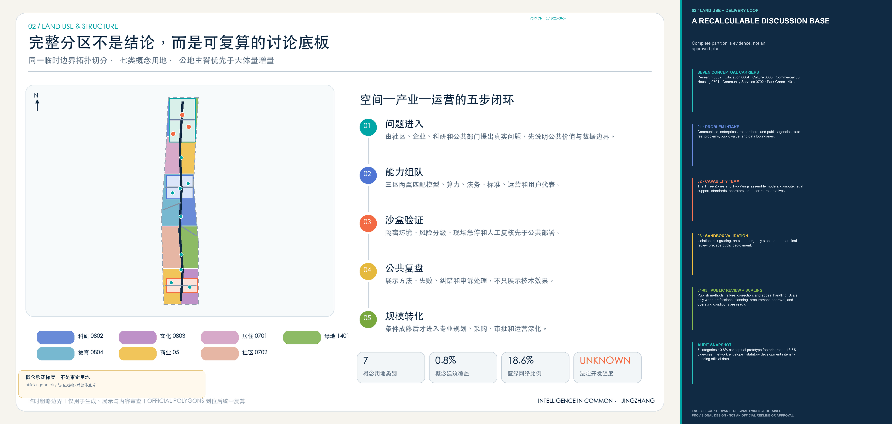

## Coordinated Research Area: Industry and Future City Research

“Intelligence in Common · Jing-Zhang” is not a visual label pasted onto AI. Its identity question is how technology becomes public capability. The logo direction uses two parallel rail lines, three commons nodes, and one open gap. The rails represent Jing-Zhang history and future collaboration, the three dots represent the three zones, and the gap welcomes future contributions. Heritage navy, commons teal, and verification orange form the palette. All type uses open-source or system fonts, and the mark is original geometry rather than an appropriated corporate identity. The naming, English title, and visual system answer [source:AGENT-TASKBOOK] without implying government recognition.

The industrial ecosystem follows a five-step loop: problem intake, capability team formation, sandbox validation, public review, and responsible scaling. Zhongzhiyuan focuses on models, compute, toolchains, safety evaluation, and standards governance. AI Origin focuses on university outputs, open-source collaboration, intellectual property, incubation, and talent services. Dazhongsi focuses on Agents, intelligent devices, content, consumption, and international demonstrations. The Technology Services Wing supplies legal, capital, standards, and international interfaces; the Scenario Enablement Wing supplies real problems, public experience, and user feedback. This turns the five functions into spatial and operating roles rather than a company list or output-value promise [depth:overall_spatial_structure].

Regional collaboration is organized through open interfaces for problems, capabilities, validation, and translation rather than unverified radiating lines on a map. The Jing-Zhang Belt can contribute public scenarios and auditable protocols. Beiwei Community and Future Science City can be conceptual interfaces for talent, basic research, and prototypes. Huairou Science City can connect large scientific facilities and frontier research questions. Beijing E-Town can connect embodied intelligence, vehicles, and advanced-manufacturing validation. The Beijing-Tianjin-Hebei corridor can accumulate cross-city scenario cards, evaluation methods, and exit rules. These are collaboration suggestions only; real participation requires open calls, agreements, and named accountable parties.

Selected lessons from the six cases are translated rather than copied: one-north shows how public space can link specialist districts; Maria 01 suggests adaptive reuse and community before new construction; STATION F suggests stage-based services; MaRS joins research, capital, customers, and public mission; Seoul AI Hub combines incubation with training and exchange; Kendall Square requires persistent stewardship of active ground floors, open space, and mixed urban life. Jing-Zhang's distinctive addition is public auditability: every test discloses purpose, data limits, human review, and exit conditions instead of trading invisible surveillance for convenience.

## Overall Design Area: Urban Renewal and Regulatory-Plan-Level Urban Design

The renewal principle is retain-and-adapt first, reversible insertion second, and discussion of added capacity only after statutory information arrives. One shared provisional boundary is topologically partitioned into seven conceptual carriers: research, education, culture, housing, community services, commercial services, and park green space [data:geometry/land_use.geojson#LU-001] [depth:land_use_layout]. The building layer expresses only small-scale capacity and public-interface prototypes [data:geometry/buildings.geojson#BLDG-001]; it does not classify unknown existing buildings for demolition or construction. Total floor area, FAR, Building Coverage Ratio, height, and setbacks remain pending official data [depth:development_intensity_controls] [depth:height_massing_character] [depth:retain_renovate_demolish].

Four cross-checking systems organize the Overall Design Area. First, a continuous Jing-Zhang commons spine combines culture, ecology, walking and cycling, and events. Second, three conceptual east-west stitching lines serve Dazhongsi Station, the campus-park interface at AI Origin, and Zhongzhiyuan's Qinghe interface. Third, twelve scenario nodes are bookable, auditable, and closable. Fourth, shared basic services support differentiated specialist districts. Green and public spaces are primary infrastructure for encounter, testing review, and public questioning rather than residual land [metric:green_ratio] [metric:public_space_ratio].

Regulatory-plan-level depth is controlled through three columns: known, recommended, and pending confirmation. Land-use codes, submitted geometry, and derived areas are recalculable knowns. Spatial structure, public-space nodes, and operating mechanisms are Conceptual Recommendations. Road redlines, statutory control lines, intensity, height, engineering, utilities, ownership, and heritage controls await official material. This preserves design depth without crossing the statutory boundary described by [standard:MOHURD-CONTROL-DETAILED-PLANNING].

## Detailed Design of Key Areas

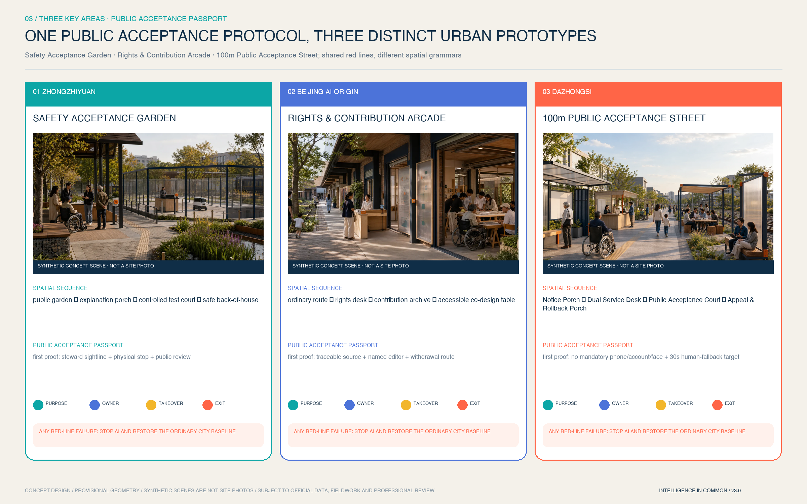

All three areas share one Public Acceptance Passport but never copy one spatial form. The passport is their common governance interface; the three prototypes are the urban design. Zhongzhiyuan makes stoppability spatial through a garden, observation gallery, and test loop. AI Origin makes provenance and withdrawal spatial through an outputs street, rights desk, and Contributors' Living Room. Dazhongsi makes staffed access and appeal spatial through four thresholds in a station-city living room. The four conditions are not a weighted score. If any condition remains open, AI stays off and the site restores its ordinary walking, staffed service, or non-AI display baseline.

### Zhongzhiyuan: Safety Governance Commons

Zhongzhiyuan is positioned as “visible full-stack independence and safety governance.” Within provisional area [data:geometry/key_areas.geojson#PROV-KEY-001], it forms one loop, one hall, and three platforms: a Qinghe innovation-garden loop; a model-safety and standards interpretation hall; and validation platforms for model evaluation, embodied intelligence, and urban services. Reversible pavilions, canopies, outdoor test markings, and bookable trials are preferred along the Qinghe interface without presuming river control lines or engineering conditions. The building strategy prioritizes retain-and-adapt and uses ground floors and public space to connect standards formation, testing, explanation, and appeal. External connections indicate directions only until Fifth Ring Road, street, and fire-safety information is available.

Its spatial prototype is a four-level gradient: public garden edge, observation and interpretation gallery, controlled test loop, and secure research back-of-house. Public circulation never crosses test logistics. The observation gallery carries accountability signage, staffed supervision, emergency stops, and exits. The test loop opens only with booking, enclosure, and a safety officer. Three initial Conceptual Recommendations are a safety-governance foyer, removable test surfacing, and a public review table on the Qinghe edge. They pass through G1 professional review, G2 safety sandbox, and G3 time-limited pilot. Unclear river, fire, or ownership conditions trigger exit.

Its acceptance prototype is the **Safety Acceptance Garden**. A 2.4-metre rain-garden buffer, 3.0-metre continuous step-free clear route, 1.8-metre controlled service bay, and 2.4-metre observation porch are self-imposed concept targets—not surveyed sections or engineering standards. The site operator is the sole A; the test safety officer leads on-site R. The first acceptable evidence is not a robot demonstration video, but a dual-path rehearsal co-observed by a disabled-person representative in which the physical pause signal works and ordinary garden passage stays open. Loss of control, obstruction, or an absent owner restores the no-AI public garden.

### Beijing AI Origin Community: Open-Source Translation Commons

Around [data:geometry/key_areas.geojson#PROV-KEY-002], AI Origin combines an Open Outputs Street, Contributors' Living Room, and near-campus everyday network. The street links release, intellectual property, legal services, incubation, and small demonstrations. The Contributors' Living Room records verifiable code, datasets, standards, and public contributions rather than corporate advertising. The everyday network adds learning, childcare, health, night-time collaboration, and walking connections. Renewal relies on micro-interventions, open ground floors, and time-sharing; campuses, parks, and privately controlled spaces are treated through interfaces and negotiation rather than predetermined alterations.

The stitching grammar is campus and park pores, the Open Outputs Street, shared ground floors, and near-campus everyday lanes. The street is not a single retail strip: release, rights clearance, collaboration, and daily services alternate along a walking sequence. Every release point displays copyright provenance, a human contact, and a withdrawal route. Initial Conceptual Recommendations are a traceable outputs window, Contributors' Living Room, and accessible co-creation table. Pilots begin only after park boundaries, ground-floor fire requirements, time management, and resident-representative consultation are resolved.

Its acceptance prototype is the **Rights & Contribution Arcade**. One side is an outputs window with visible source, licence, and version; the centre is a staffed rights desk; the other side is a long co-acceptance table for contributors and the public. Ordinary passage and paper consultation always remain open. The park operator is the sole A; a rights editor and accessible-session host carry content and on-site R. The first acceptable evidence is one test output completing provenance check, public challenge, contributor correction or withdrawal, and version logging. Unclear rights, failed withdrawal, or blocked passage restores a public arcade without AI recommendation.

### Dazhongsi: AI-Native Living Commons

Within [data:geometry/key_areas.geojson#PROV-KEY-003], Dazhongsi combines a four-quadrant station forecourt living room, a **100-metre Public Acceptance Street**, and an international demonstration hall. The four quadrants prioritize the ground plane, continuous crossings, cycle order, and accessibility without preselecting bridges or tunnels. The 100-metre street is a transferable representative sequence, not a claim about an existing street, parcel, or engineering alignment. The hall connects enterprises, developers, city-problem owners, and international visitors. [depth:three_key_area_detailed_design] coordinates the evidence; engineering and investment remain material for professional deepening.

The site operator is the sole A and the staffed-service lead carries R. The first acceptable evidence is one participant completing an ordinary service without a phone, account, or face recognition, transferring to a person within the self-imposed 30-second target, and receiving an appeal and rollback receipt. A failed digital entrance, unattended human desk, or unlogged exit immediately restores fully staffed dual-desk service.

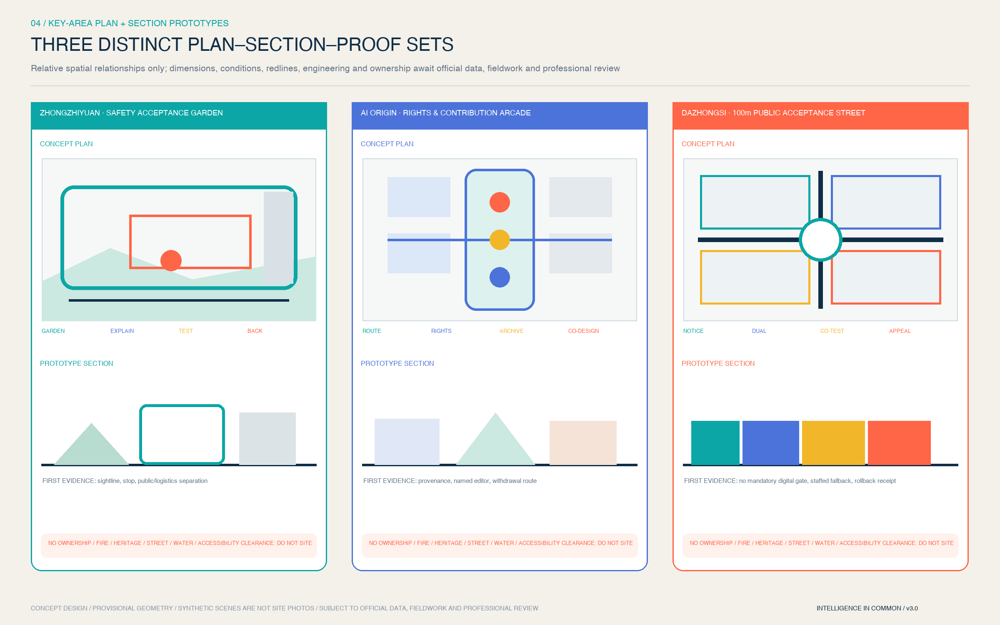

The Public Acceptance Street turns governance clauses into four bodily legible thresholds. The 0–20 metre Notice Porch discloses purpose, data, accountability, and open hours. The 20–45 metre Dual Service Desk places human and AI service side by side; basic access requires no phone, account, or face. The 45–75 metre Public Acceptance Court lets residents, older and disabled people, professionals, and operators co-test. The 75–100 metre Appeal and Rollback Porch logs correction, deletion, pause, and exit. One continuous step-free route, tactile guidance, clear passage, and rest points connect all four; equipment is removable, reusable, and cannot obstruct movement. The prototype, four thresholds, and human-fallback target are recorded by [metric:public_acceptance_prototype_count] [metric:public_acceptance_threshold_count] [metric:human_fallback_target_seconds].

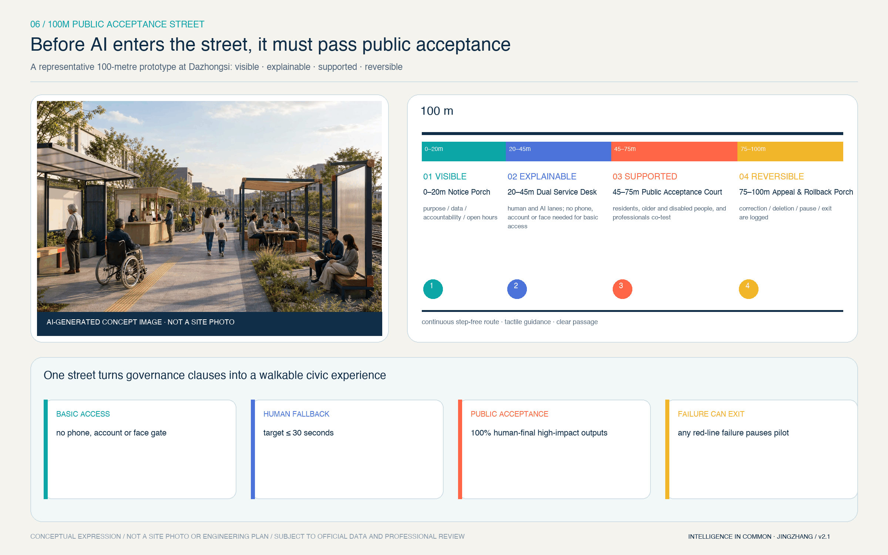

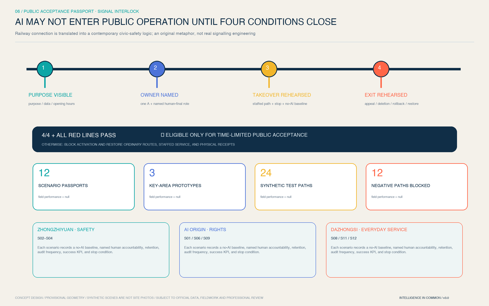

Its value is not another AI photo spot but a city-scale use-before-deploy rule: real users and professionals co-accept a system before it enters everyday public space. “Visible, explainable, supported, reversible” becomes an identity that international visitors can walk, residents can question, and operators must own. No engineering proceeds without station-entrance, cross-section, rail-protection, evacuation, and ownership information.

## AI Innovation Ecosystem, Personas, and AI+ Scenarios

Six personas test the spatial system. Open-source researchers need persistent collaboration and contribution records. Startup teams need low-threshold trials, legal support, and customer entry points. Industry engineers need cross-team integration and safety evaluation. University students and faculty need translation pathways and walkable third places. Nearby residents - especially older people, children, and disabled people - need low-disturbance, explainable, appealable services. Public operators need clear accountability, audit, and exit mechanisms. These are needs-based hypotheses derived from the taskbook, not personal tracking data [metric:persona_count].

All twelve scenario cards map to [data:geometry/public_space.geojson#PUBLIC-001] and follow data minimization, purpose limitation, no default personal identification, human final review for high-impact decisions, appeal, and exit:

| Card | Space and users | Data and human review | Operating boundary |
| --- | --- | --- | --- |
| S01 Open Outputs Hall | AI Origin; universities and developers | Contributor-submitted material; human copyright and fact review | No visitor identity collection; contributions may be corrected or withdrawn |
| S02 Model Safety Evaluation Sandbox (test) | Zhongzhiyuan; model teams and evaluators | Synthetic or authorized test sets; two-person review of red-team findings | Isolated from production; sensitive vulnerabilities remain protected |
| S03 Embodied-Intelligence Public-Space Test Path (test) | Zhongzhiyuan; engineers and public | Booking, enclosure, anonymized event logs; safety officer can stop | No autonomous operation in undisclosed public environments |
| S04 Urban-Service Agent Validation Station (test) | Zhongzhiyuan; public-service teams | Public simulation cases; professionals make final decisions | No connection to real high-impact service backends |
| S05 Explainable Walking and Cycling Navigation Station | Commons spine; commuters | Aggregated conditions and volunteered feedback; operator review | No continuous personal trajectory logging |
| S06 Accessible Mobility Co-Creation Table | AI Origin to Dazhongsi; disabled and older people | Voluntary obstacle annotation; accessibility-adviser review | Never infer personal health data from obstacle categories |
| S07 Jing-Zhang Memory Interpretation Agent | Heritage park; residents and visitors | Public historical sources; history editor and heritage professional review | Clearly disclose AI generation; never invent people or events |
| S08 Community AI Service Desk | Community edge; residents | Minimized session data; staffed referral | No automated eligibility, credit, or welfare decision |
| S09 Talent Learning and Collaboration Station | AI Origin; students and developers | Voluntary registration; human review of courses and mentors | No black-box talent ranking or elimination |
| S10 Low-Carbon Energy Digital-Twin Pavilion | Commons spine; operators and public | Facility-level aggregated data; engineer review | No claim that energy capacity has been calculated |
| S11 Data Consent and Appeal Living Room | Dazhongsi; enterprises and public | Consent records and audit logs; legal and ethics review | Withdrawal, objection, and correction channels required |
| S12 International AI-Native Demonstration Living Room | Dazhongsi; enterprises and visitors | Rights-cleared presenter material; human curatorial review | Demonstration is not an investment or government commitment |

S02-S04 are three industry Testing and Validation Scenarios [metric:testbed_scenario_count]. Their shared gates are isolation, a named accountable person, on-site emergency stop, risk classification, and a public review. The twelve-card total is recalculated by [metric:scenario_count]. AI augments human capability; it never replaces planning approval, medical or legal professional judgment, or the final decision in a public service.

The cards consolidate into three drawable, buildable, and removable spatial prototypes. Type A, the controlled test field for S02-S04, includes a notice gate, buffer, test zone, safety-officer sightline, audience boundary, logistics access, and emergency stop. Type B, the public corridor and co-creation point for S05, S06, and S10, includes continuous accessibility, non-tracking sensing, staffed help, and facility-level data mirrors. Type C, the display, service, and collaboration hall for the remaining scenarios, includes an open foyer, content rights clearance, human final review, an appeal desk, and a retractable archive. Every node must explain purpose, data, accountability, and exit within thirty seconds, and equipment must not reduce basic clear passage.

Every scenario card is also a structured acceptance passport. `visual/assets/acceptance-passports.json` records its area, risk tier, sole accountable role, human-final role, data and retention rule, audit frequency, no-AI baseline, success KPI, and red lines. It is neither a decorative QR code nor a licence for permanent deployment. Every opening is time-limited; expired evidence, changed conditions, or a red-line trigger requires acceptance again. Seven reversible public-realm components make the passport tangible: C01 Notice Signal Porch, C02 Staffed Dual Desk, C03 Clear Step-Free Route, C04 Co-Acceptance Table, C05 Physical Pause Signal, C06 Appeal & Rollback Receipt, and C07 Reversible Utility Rail. Components stay within the controlled service bay and never take ordinary passage; dimensions remain concept targets for professional checking.

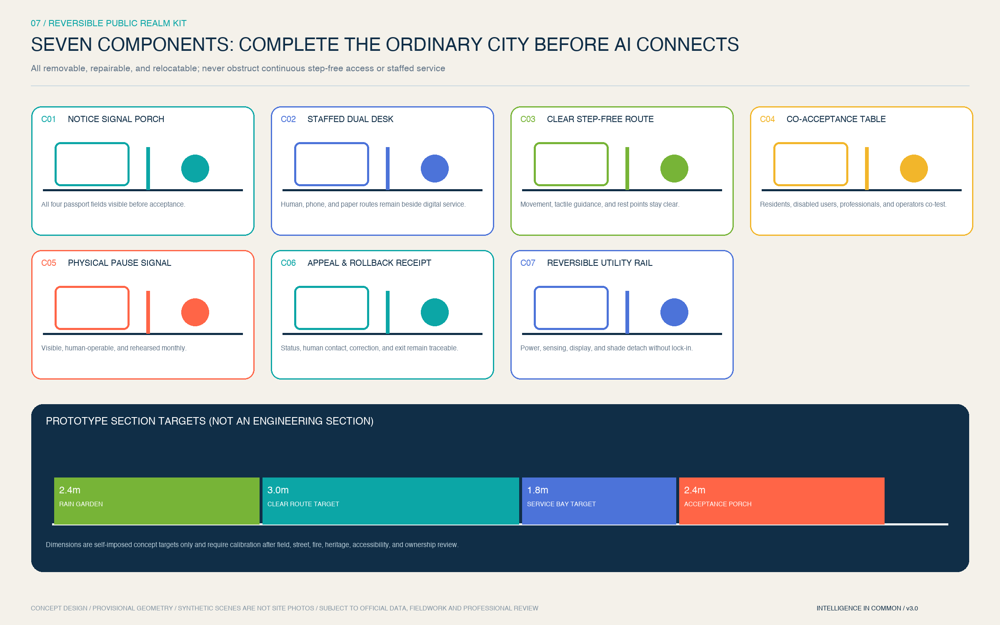

Scenario-specific governance is recorded in `geometry/public_space.geojson`: risk level, final accountable role, retention rule, audit frequency, success KPI, and pause condition are no longer generic duplicates. Shared pilot targets are: 100% coverage of named responsibility, notice, risk grading, and emergency-stop drills before launch; 100% human final decision for high-impact outputs; zero default biometric capture and zero continuous personal trajectory retention; a target of zero serious safety incidents; appeal acknowledgement within one business day and a target response within five business days. These are operating targets, not current performance or government commitments.

To show that these gates are at least logically executable, the package includes the read-only, zero-network `visual/assets/acceptance-runner.js`. It reads twelve passports and 24 synthetic tabletop cases. Twelve positive paths must satisfy all four conditions and every red line; twelve negative paths deliberately omit a condition or trigger a red line and must block activation while restoring the no-AI baseline. The current result is 24/24 logic checks passed. `field_performance=null` and `deployment_decision=not_authorized_not_run` state plainly that this is neither field performance, resident consent, nor deployment authorization. Any real pilot still requires G0-G4 and independent evaluation.

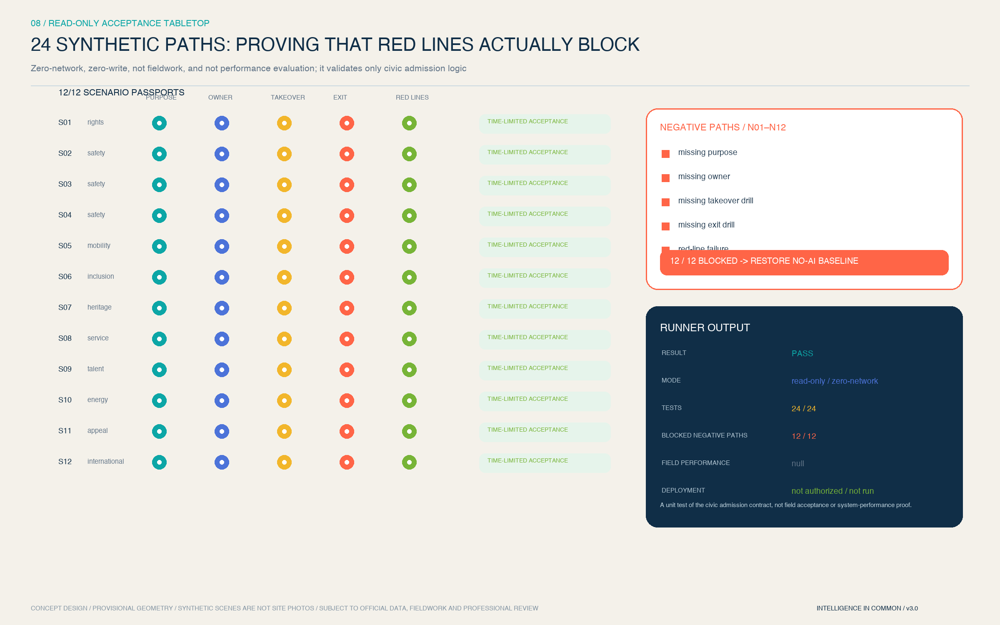

“No phone, account, or face gate for basic access” is the proposal's voluntary public-service baseline [metric:phone_free_basic_access_target_ratio], not a legal conclusion for every place. The one-day acknowledgement and five-day target response are likewise not statutory numerical deadlines. The Generative AI rules apply only when a scenario falls within their public content-service scope; Article 39 human-service duties require separate checking for the enumerated medical, social-security, financial, and utility-payment settings rather than a blanket claim.

## Land Use, Building Scale, and Retain-Renovate-Demolish Strategy

The land-use structure uses a subset of the national classification and fully covers the submitted boundary with shared partition coordinates. Research land carries full-stack development and open-source translation; education-research collaboration sits near AI Origin; commercial services support technology services and AI-Native life; community services and housing support everyday talent needs; culture and parks form the Jing-Zhang public base. Seven conceptual categories and their areas are represented by [data:geometry/land_use.geojson#LU-006], while category and subarea metrics remain fully recalculable in the structured layer [metric:land_use_category_count] [metric:land_use_area_0802_sqm]. These are conceptual carriers, not approved land uses.

The building method has four levels: retain-and-adapt, shared ground floor, reversible insertion, and later renewal when conditions are mature. Without an existing-building or ownership inventory, the sixteen submitted footprints are conceptual capacity units used to test public-space relationships [data:geometry/buildings.geojson#BLDG-002]. Total conceptual footprint and ratio are recorded by [metric:building_footprint_area_sqm] and [metric:concept_building_coverage_ratio]; neither is an approved Building Coverage Ratio nor a DRR conclusion. Professional deepening must add structural safety, property rights, use, age, fire safety, energy, heritage value, and operating condition building by building.

Massing follows a qualitative rule: low disturbance along the spine, recognizable nodes, continuous background fabric, and differentiated key areas. The commons spine retains a pedestrian scale and readable history. Scenario nodes rely on restrained night lighting, signs, and reversible elements rather than oversize landmarks. Height, intensity, roof form, and skyline require regulatory-plan, heritage, aviation, and landscape controls before determination.

## Transport, Rail, Municipal Infrastructure, and Public Services

[data:geometry/roads.geojson#ROAD-001] represents a continuous spine, three east-west stitches, and two wing interfaces. ROAD-001 is the walking, cycling, and service spine. ROAD-002-004 correspond to conceptual stitching at Dazhongsi, AI Origin, and Zhongzhiyuan. ROAD-005-006 represent the Technology Services and Scenario Enablement Wings. These lines show connection directions, not road redlines, rail alignments, bridges, or tunnels. The conceptual spine length is recalculated by [metric:greenway_length_m] and awaits official streets, stations, sections, crossings, parking, and fire-access data [depth:traffic_rail_slow_parking].

Municipal and public services follow “co-location without conflated authority” for urban infrastructure and New Infrastructure. Edge compute supports low-latency public experience. Energy mirrors show facility-level aggregates only. Distributed energy and sponge-city elements begin with monitoring and demand verification. Every public-service Agent retains a staffed human window. Compute, energy, drainage, utilities, fire safety, and cybersecurity capacity remain uncalculated because capacity data is absent [depth:municipal_new_infrastructure]. Services are composed around talent, enterprises, communities, and international visitors rather than a single vendor.

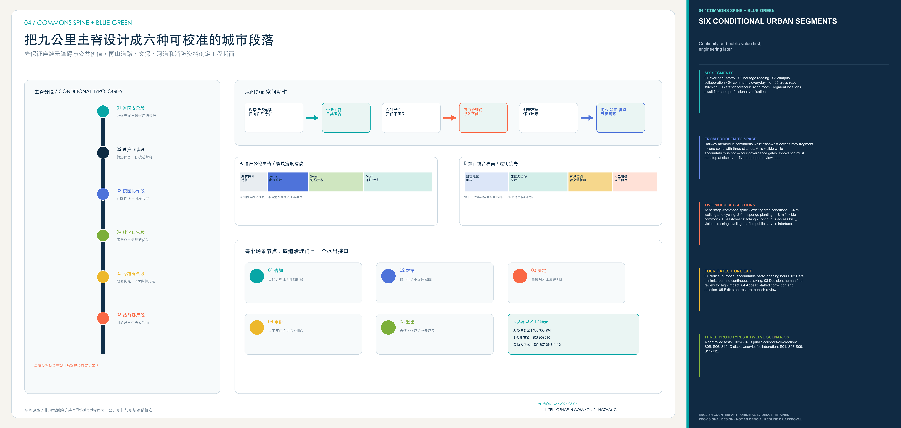

## Blue-Green Network, Public Space, and Urban Character

The blue-green network treats the heritage park as the Innovation Belt's “first meeting room.” A continuous green spine supports everyday walking, cycling, rest, open discussion, and cultural reading. Three east-west green stitches connect universities, parks, communities, and stations. Green space is not a liability-free testing ground: every trial requires booking, notice, limited duration, emergency stop, and restoration. River, heritage, green-line, blue-line, and safety controls take priority when official material arrives. [data:geometry/green_space.geojson#GREEN-001] and [metric:green_space_area_sqm] describe the conceptual network envelope; [depth:blue_green_public_space] describes its professional evidence chain.

Twelve scenario nodes and four conceptual pilgrimage or honour landmarks organize public space. Zhongzhiyuan's Mirror of Safety reveals evaluation methods and correction. AI Origin's Open-Source Star Map records verifiable contribution. Dazhongsi's AI-Native Living Room joins demonstration, appeal, and public experience. The spine's Centennial Algorithm Rings place Jing-Zhang history, Zhongguancun innovation history, and AI-governance milestones side by side. Original geometry, open-source or system type, and reversible facilities avoid portraits, corporate marks, unauthorized images, and spectacle-first placemaking.

Heritage navy, commons teal, and verification orange unify the character. Interfaces prioritize visible ground floors, indoor-outdoor collaboration, and restrained night-time presence. History is not technical decoration: the Jing-Zhang Railway asks how cities connect; Zhongguancun asks how knowledge translates; AI culture asks how technology is publicly governed. Wayfinding displays place, scenario purpose, data boundary, accountable party, and appeal route, making visual identity part of trustworthy operation.

## Renewal Projects, Implementation Policy, and Phasing

Eight Conceptual Recommendation projects form a minimum viable combination of space and operation [metric:renewal_project_count]: JZ-01 continuity diagnosis of the commons spine; JZ-02 three Zhongzhiyuan safety test platforms; JZ-03 AI Origin Open Outputs Street; JZ-04 Dazhongsi four-quadrant ground-priority study; JZ-05 twelve-scenario governance protocol; JZ-06 four contribution and honour nodes; JZ-07 public data-consent and appeal living room; and JZ-08 annual Open Intelligence Commons program. Every project first requires missing ownership, road, heritage, municipal, safety, or operating conditions. The list is not project approval or investment commitment.

Phasing is a risk sequence, not a construction timetable: protocol first, network second, renewal later. [data:geometry/phasing.geojson#PHASE-001] covers reversible pilots in the three key areas, with review jurisdiction area [metric:phase_1_area_sqm]. PHASE-002 connects the commons spine, with area [metric:phase_2_area_sqm]. PHASE-003 considers adaptive district renewal only after official data and professional review, with area [metric:phase_3_area_sqm]. [metric:phase_count] recalculates the three stages; [depth:renewal_project_list] and [depth:phasing_implementation] connect projects, dependencies, and evidence.

The first executable move is not district-scale construction but a **90-day travelling public-acceptance pilot** in which all three areas begin together but qualify independently [metric:pilot_duration_days]. Days 0–30 establish each ordinary-service baseline, conduct accessible walk-throughs, and complete accountability and data registers with no AI activated. Days 31–60 build one removable prototype per area; staff lead offline simulations of pause, fallback, withdrawal, and appeal. Days 61–90 admit only prototypes whose own four conditions and red lines all pass, with daily review and weekly independent acceptance. Zhongzhiyuan first proves “stoppable,” AI Origin “withdrawable,” and Dazhongsi “supported.” Six red-line KPIs are: 100% notice before activation; 100% human-final high-impact outputs; zero mandatory phone, account, or face gates for basic access; human fallback within 30 seconds; appeal acknowledgement in one business day and target response in five; and a target of zero serious safety incidents [metric:pilot_redline_kpi_count]. A failure pauses only that prototype and restores its ordinary baseline; averages, the other sites, or promotional value cannot conceal harm.

The site operator is the single accountable A. Human service, accessibility, safety, data, and legal teams are responsible R. Residents, older and disabled people's representatives, and an independent evaluator co-accept as C. Cost uses bands only: L1 for operations, furniture, and wayfinding; L2 for temporary structures and local systems. No currency estimate is invented. Procurement requires open interfaces, data minimization, no vendor lock-in, and an exit clause. Permanent L3 works wait for official polygons, streets, utilities, heritage, fire, and statutory procedures.

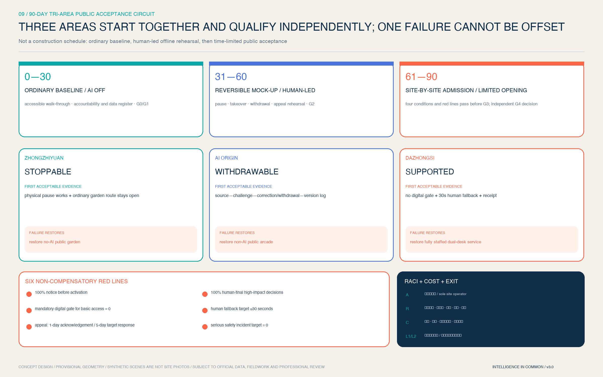

The annual operating cycle has four seasons. Spring Open-Source Contribution Month publishes problems and data licences. Summer Urban Testing Week operates only with isolation, booking, and emergency stop. Autumn Global Open Intelligence Commons Forum compares city cases and governance. Winter Contribution Archive Season reviews failures, corrections, and public value. The developer community operates through issues, post-mortems, and mentoring. Scenario Access follows application, ethics and safety review, time-limited testing, public feedback, and exit. International communication emphasizes verifiable contribution rather than exaggerated rankings.

To prevent “everyone is responsible” from becoming “no one is responsible,” the proposal suggests a conceptual Jing-Zhang Open Intelligence Commons Council. Park and district operators manage access. Universities and research institutions review methods. Enterprises and developers remain responsible for products and incidents. Residents and disabled people's representatives hold questioning seats. Data, legal, safety, and heritage experts hold professional veto recommendations. Government and statutory professional authorities retain their lawful powers. Every scenario still has one named accountable operator. The council never substitutes for statutory approval or dilutes incident responsibility.

Implementation uses gates G0-G4. G0 clears source provenance, copyright, and spatial-data rights. G1 completes professional review of ownership, heritage, transport, municipal infrastructure, fire safety, and accessibility. G2 completes the safety sandbox, public notice, named responsibility, emergency-stop drill, and appeal rehearsal. G3 runs a time-limited pilot and publishes success and failure. G4 uses independent evaluation to adapt, extend, or exit. The eight JZ projects pass through these gates rather than beginning as coloured construction areas. Areas in `geometry/phasing.geojson` are risk-review jurisdictions, not construction footprints or investment scales.

## Metrics, Area Recalculation, and Compliance Matrix

All spatial metrics project EPSG:4326 GeoJSON to EPSG:4548 before calculation [depth:metrics_recalculation]. The provisional site area supports package-level internal consistency only [metric:site_area_sqm]. Buildings, green space, and public space are calculated from unioned geometry [data:geometry/buildings.geojson#BLDG-001] [data:geometry/green_space.geojson#GREEN-002] [data:geometry/public_space.geojson#PUBLIC-004].

Conceptual public-space area and ratio are recorded in [metric:public_space_area_sqm] and [metric:public_space_ratio]. Conceptual green-space area and ratio are recalculated from the overlay network [metric:green_space_area_sqm] [metric:green_ratio]. Counts for key areas, scenarios, testbeds, personas, projects, and phases come from structured files or the scenario table rather than promotional copy.

`green_ratio` is the envelope of a cross-land-use conceptual blue-green network, not the statutory ratio of land-use code 1401. Its four features must be unioned rather than summed. `public_space_ratio` is the support envelope required by twelve scenarios, not the footprint of halls, pavilions, or equipment. The sixteen building polygons are spatial-prototype footprints; their 0.8% ratio must never be read as existing or approved Building Coverage Ratio. With existing-building data and official polygons, professional teams should separate scenario influence areas, indoor and outdoor public space, and statutory green space before deciding whether these metrics remain useful.

The complete machine-readable metric index remains in `metrics.json`; prose explains the metrics that affect design judgment. Conceptual building footprints and the commons spine are supported by [metric:building_footprint_area_sqm] and [metric:greenway_length_m]. Scenario and phase counts are supported by [metric:scenario_count] and [metric:phase_count].

The award revision adds a non-spatial evidence family that is not current performance. Three differentiated prototypes are managed by [metric:public_acceptance_prototype_count], twelve passports by [metric:public_acceptance_passport_count], four interlock conditions by [metric:public_acceptance_interlock_gate_count], and seven reversible components by [metric:reversible_public_realm_component_count]. Twenty-four synthetic tabletop paths and twelve blocked negative paths are managed by [metric:acceptance_tabletop_case_count] [metric:acceptance_tabletop_blocked_negative_path_count].

The 90-day pilot is managed by [metric:pilot_duration_days], and the 30-second human fallback by [metric:human_fallback_target_seconds]. One-hundred-percent basic-access coverage without mandatory phone/account/face gates and six red-line KPIs are managed by [metric:phone_free_basic_access_target_ratio] and [metric:pilot_redline_kpi_count]. They are self-imposed acceptance contracts. The tabletop proves logic only—never existing achievement, statutory standard, resident consent, or government promise.

`compliance_matrix.json` covers announcement sections 1.3, 1.4, and 1.5 plus agent.1-agent.6. `standard_matrix.json` covers mandatory standards and records the unavailable architectural depth document as a data gap. `design_depth_matrix.json` covers fifteen formal design-depth items. Land use and mobility evidence are managed by [depth:land_use_layout] and [depth:traffic_rail_slow_parking].

Blue-green space and risk boundaries are managed by [depth:blue_green_public_space] and [depth:risk_missing_data]. A PASS means the package can enter content review; it does not mean that the proposal is excellent, approved, or implementable.

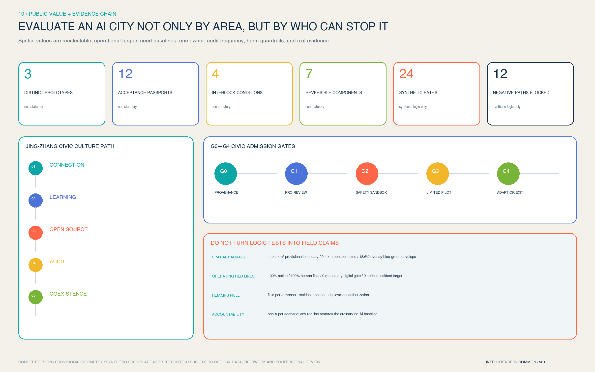

## Risk, Copyright, and Compliance

The first risk is false precision: provisional polygons can change land-use partitions, key-area relationships, and every area, so figures de-emphasize boundaries and prose never calls them precise redlines. The second is planning overreach: FAR, height, density, roads, statutory control lines, ownership, DRR, and engineering remain pending official data; the proposal provides methods and confirmation lists only. The third is technical harm: public AI scenarios limit themselves to aggregated or actively authorized data, require human review for high-impact decisions, and provide stop, appeal, correction, and deletion. The fourth is cultural and copyright risk: historical claims require professional review, and logos, icons, charts, maps, and fonts use original geometry, repository-cleared data, or system and open-source assets.

The submission uses no classified map, commercial map screenshot, remote map tile, news image, personal data, internal corporate spreadsheet, or unauthorized brand material. Paired PNG figures, A3/A0 PDFs, offline HTML, GeoJSON, and JSON share one design evidence chain. Three key-area atmosphere images were produced with OpenAI's built-in image-generation tool, contain no text or brand, and are visibly marked “AI-generated concept image / not a site photo.” They prove no existing condition, boundary, resident opinion, or engineering feasibility; structured evidence and professional drawings remain authoritative. `visual/index.html` uses no remote script, font, form, iframe, API, or tracking. The acceptance runner reads local JSON only, makes no network request, and writes no file. Nine risks and their stop/rollback evidence are registered in `risk.json`. Copyright and generation notes accompany the pending-control register [data:geometry/constraints.geojson#PENDING-CONTROLS-001] and `report/copyright_statement.md`. That feature is only a verification envelope along SITE-001 with `not_a_control_line=true`; it represents neither a published control line nor permission to build. [depth:risk_missing_data] governs data gaps, human review, and replacement with official material.

The external Skill execution surface was also reviewed. No installer writing to personal directories, network scraper, GitHub API script, or external AI review script was used to generate the package. Dependencies remain isolated and use binary wheels. The PR contains only this submission directory, and the authenticated GitHub author confirms attribution, intellectual property, and external submission.

## References

Formal task evidence includes the official announcement, rights-cleared Agent taskbook, urban-design measures, regulatory detailed-planning rules, and the territorial spatial-planning land-use classification guide. The Generative AI, barrier-free environment, and older-adult smart-technology documents are used only within their respective applicability boundaries as public-service and risk-governance references. Local snapshots, hashes, and retrieval status are recorded under `brief/site-package/standards/`. Spatial generation uses only the registered provisional boundaries and explicitly excludes them from official-redline, precise-area, and approval use. International cases remain background mechanisms in `sources.json`; no enterprise roster, quantified performance, or policy commitment is transplanted.

The machine evidence layer consists of `geometry/*.geojson`, `metrics.json`, three matrices, `risk.json`, the acceptance passports/tabletop/runner, manifest, sources, assumptions, self-check, the two proposal languages, paired PNG figures, paired HTML, and paired PDFs. `geometry/constraints.geojson` records a verification envelope for missing official controls: it means controls remain unknown and must be obtained, not that they do not exist. [data:geometry/phasing.geojson#PHASE-003] represents risk sequence rather than a development timetable. The core source links are [source:OFFICIAL-ANNOUNCEMENT] [source:AGENT-TASKBOOK] [source:SOURCE-REGISTRY]; the core standards are [standard:PROJECT-OFFICIAL-ANNOUNCEMENT] [standard:PROJECT-AGENT-OPEN-CALL-TASKBOOK]; the core spatial link is [data:geometry/site_boundary.geojson#SITE-001], and the core metric link is [metric:site_area_sqm].
