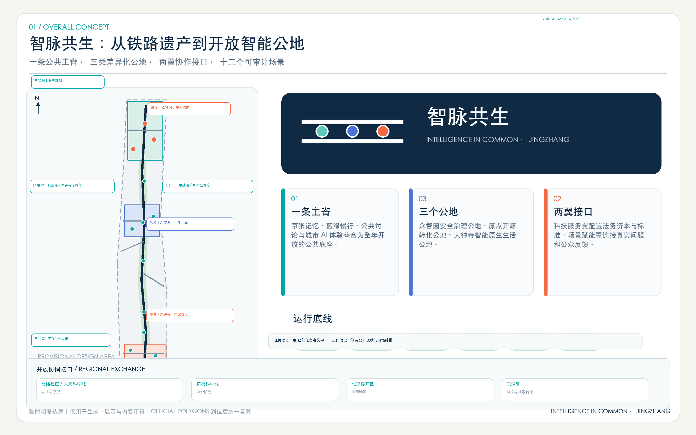
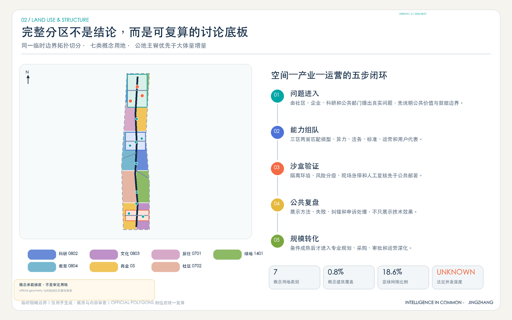
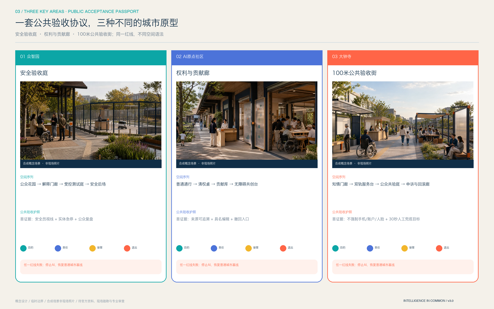
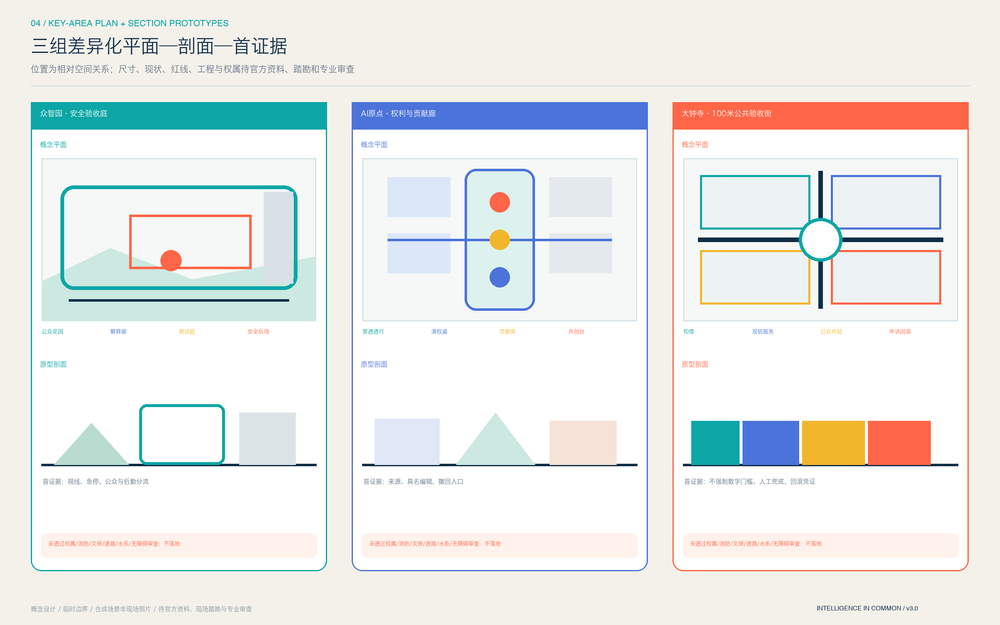
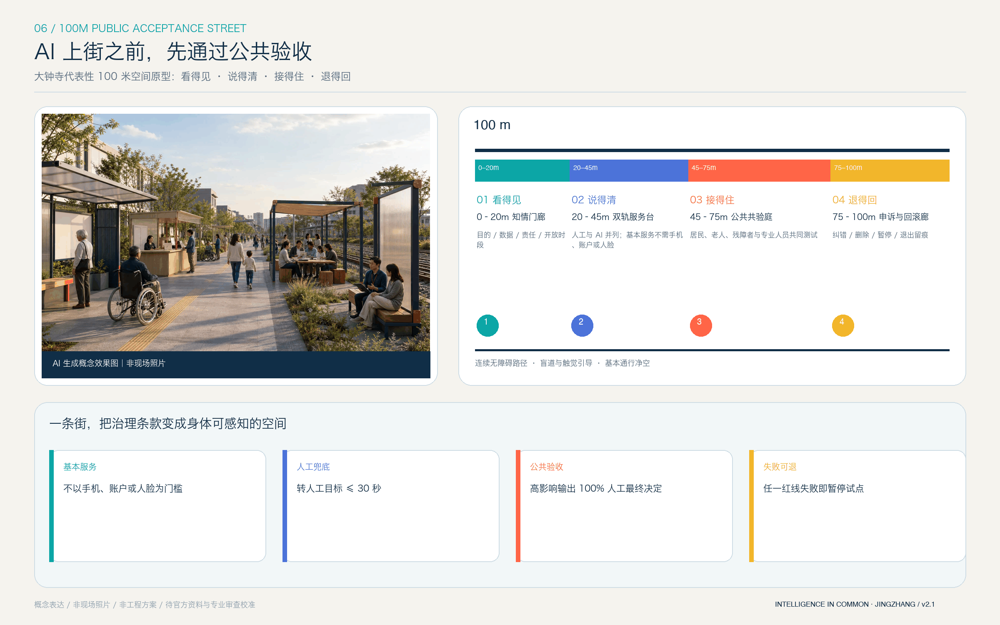
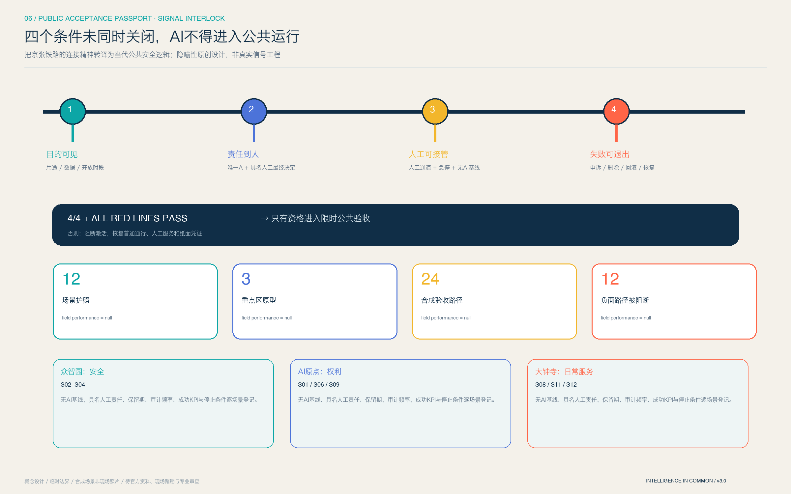
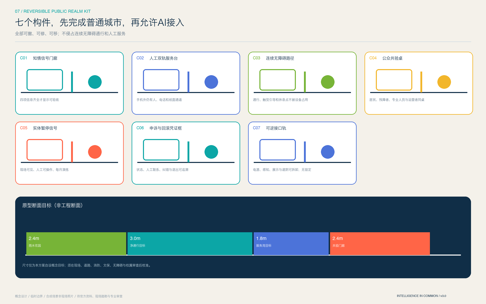
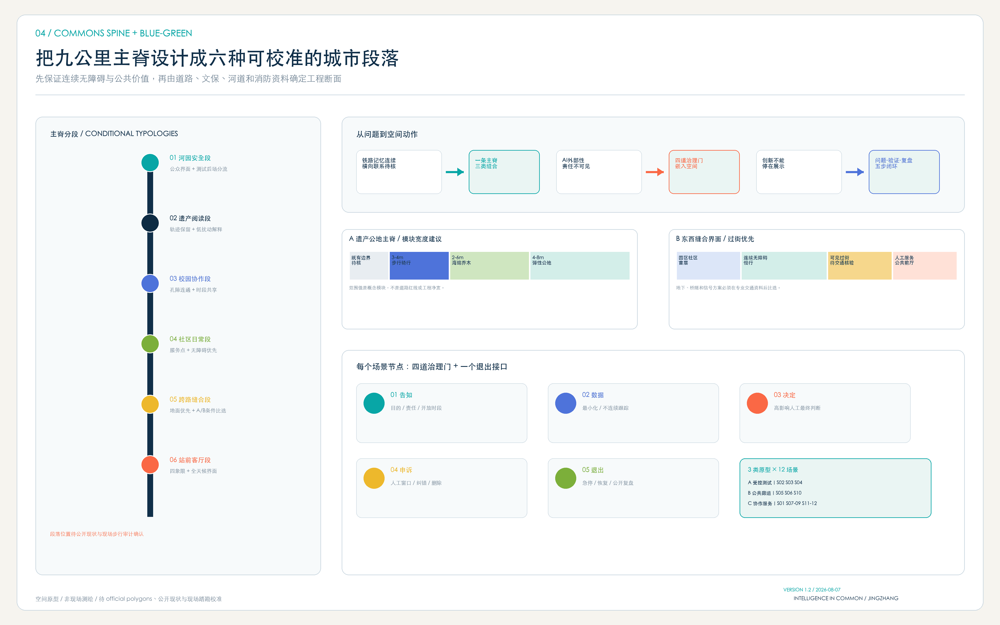
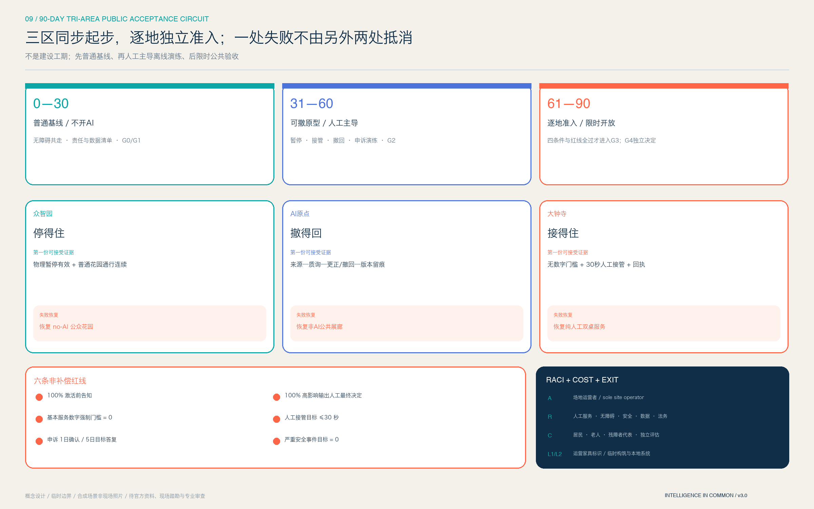
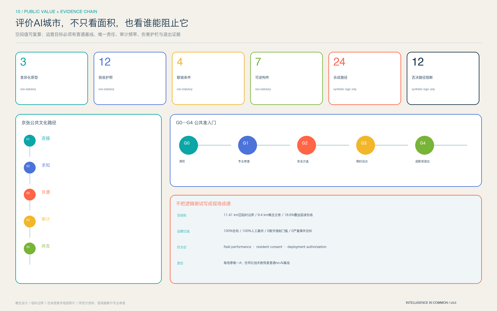

# 智脉共生：京张开放智能公地

**AI 上街之前，先通过公共验收。** 这是“智脉共生”最简短、也最可检验的城市主张：百年京张不需要一条只在节庆时被看见的“AI 展示带”，而需要一套全年运行、人人可进入、技术可被质询、失败能够退出的城市公共协议。方案把京张遗址公园理解为“记忆与公共智能主脊”，将众智园、北京 AI 原点社区、大钟寺分别转译为安全治理、开源转化、智能原生生活三类城市实验室，再以中关村科技服务翼和小月河场景赋能翼连接资本、法务、算力、数据与真实城市问题。

v3.0 将原来只在大钟寺可见的公共验收升级为一套贯穿三区的“**公共验收护照**”：众智园以“安全验收庭”证明测试可观察、可急停；AI 原点以“权利与贡献廊”证明来源可追溯、成果可撤回；大钟寺以“100 米公共验收街”证明日常服务有人工通道、申诉和回滚。十二张护照只在“目的可见、责任到人、人工可接管、失败可退出”四个条件同时闭合且全部红线通过时，才有资格进入限时公共验收。这是把铁路连接文化转译为当代公共安全逻辑的原创隐喻，不是对任何真实铁路信号工程的描述。所有动作均为概念建议、参考方案或可供专业团队深化研究，不替代正式规划，不构成政府审定结论。

## 设计依据与资料清单

方案首先锁定资料权力边界：仓库公开任务书 `brief/public-brief.md` 与官方公告用于确认项目愿景、三层范围文字、公告面积约值和设计任务 [source:OFFICIAL-ANNOUNCEMENT] [standard:PROJECT-OFFICIAL-ANNOUNCEMENT]；清权任务书用于三大定位、五大功能、三区两翼和六项 agent 任务 [source:AGENT-TASKBOOK] [standard:PROJECT-AGENT-OPEN-CALL-TASKBOOK]。

城市设计、控规编制和用地分类分别受本地标准快照约束 [standard:MOHURD-URBAN-DESIGN-MEASURES] [standard:MOHURD-CONTROL-DETAILED-PLANNING] [standard:MNR-LAND-USE-CLASSIFICATION-GUIDE]。建筑设计深度文件尚无可核验官方正文，只登记为数据缺口 [standard:MOHURD-ARCH-DESIGN-DEPTH-2016]。

公共 AI 的适用边界另由三份背景依据校准：生成式 AI 暂行办法只在向境内公众提供生成内容服务的法定范围内引用，申诉数字时限仍是本项目自设目标 [standard:GENERATIVE-AI-INTERIM-MEASURES]；无障碍环境建设法第 39 条的人工办理要求不被泛化到全部公共空间 [standard:BARRIER-FREE-ENVIRONMENT-LAW]；国办发〔2020〕45 号只作为传统与智能服务并行的政策参照，其 2020—2022 阶段目标不写成 2026 年仍在执行的项目义务 [standard:ELDERLY-SMART-TECH-PLAN-2020-45]。

仓库资料包、登记表与处理事实包分别作为规则、可用性判断与阅读导航 [source:SITE-PACKAGE] [source:SOURCE-REGISTRY] [source:PROCESSED-FACT-PACK]。

当前 `SITE_BOUNDARY` 和三处 `KEY_AREA` 都来自仓库临时粗略 polygon [source:BOUNDARY-SOURCE] [source:KEY-AREA-SOURCE]。它们以 `official_boundary=false`、`geometry_role=provisional_constraint` 写入 [data:geometry/site_boundary.geojson#SITE-001] 与 [data:geometry/key_areas.geojson#PROV-KEY-001]，只用于生成、自检、展示和非连续性设计讨论。公告约 11.4 平方公里是任务规模，不因本包复算为 11.41 平方公里就变成精确红线。official polygons 到位后必须重做用地、建筑、道路、绿地、公共空间、分期、图片、PDF、HTML 和全部空间指标；现状、权属、文保、交通、市政和控规缺口已在 `assumptions.json` 登记 [depth:existing_conditions_diagnosis]。

六个国际案例只作为机制参照：one-north 的多片区工作-生活-学习复合 [source:CASE-ONE-NORTH]，Maria 01 的既有建筑适应性再利用和共同体 [source:CASE-MARIA01]，STATION F 的大型创业校园与分层项目 [source:CASE-STATIONF]，MaRS 的研究-企业-资本-公共使命连接 [source:CASE-MARS]，Seoul AI Hub 的专业孵化、培训与交流 [source:CASE-SEOULAI]，Kendall Square 的混合功能与公共空间长期治理 [source:CASE-KENDALL]。这些来源均为背景材料，不支撑本项目红线、控规、企业落位、投资额或实施承诺。

方案不是从“一脊三地两翼”的形式倒推理由，而是从五组待验证的城市矛盾建立因果链：南北铁路记忆连续、日常横向联系可能割裂，因此提出主脊与三类东西缝合；创新资源高度集聚、公众进入门槛仍需核验，因此把首层开放和人工服务点作为公地界面；AI 场景可见、责任链往往不可见，因此把告知、数据、决定、申诉做成四道空间门；园区更新容易先谈增量，因此坚持保留适配、可逆嵌入和正式资料后置判断；三个重点区都承担 AI 功能，因此必须用安全梯度、孔隙共享和站城客厅三种不同空间语法避免同质化。前两组属于工作假设，必须由公开现状、现场踏勘和官方图纸校准，不能被图面写成既成事实。

## 三层范围工作框架

三层范围不是三套互不相干的图，而是一条从战略到空间再到验证的证据链。43.6 平方公里统筹研究范围负责回答“海淀的 AI 创新链如何跨机构协作”；约 11.4 平方公里总体设计范围负责回答“哪些城市空间能承载这种协作”；三处重点区负责回答“如何用可逆的小尺度项目验证”。该传导由 [depth:three_level_scope_framework] 与 [depth:overall_spatial_structure] 管理，以 [data:geometry/site_boundary.geojson#SITE-001]、[data:geometry/key_areas.geojson#PROV-KEY-002] 和 [metric:key_area_count] 为机器证据。

总体结构命名为“1 条公地主脊 + 3 个差异化公地 + 2 个协作翼 + N 个可审计节点”。“1”是京张记忆与开放智能公地主脊；“3”是众智园安全治理公地、原点社区开源转化公地、大钟寺智能原生生活公地；“2”是中关村科技服务翼、小月河场景赋能翼；“N”由十二个首批场景节点构成。三层范围的 provisional 边界在图中始终以低对比虚线出现，设计重点落在廊道、节点、东西缝合与运营关系，而不是把粗略 polygon 当作正式构图。

每一层都设置“空间输出、运营输出、复核门槛”：统筹层输出生态图谱和协作协议；总体层输出用地、公共空间、慢行和概念承载单元；重点区输出场景卡、项目清单和风险前置条件。任何指标若不能从 GeoJSON 或可信来源复算，就进入 unknown；任何项目若依赖权属、道路、文保、市政或审批，就不得在分期中表述为确定建设 [depth:risk_missing_data]。

## 统筹研究范围产业与未来城市研究

“智脉共生 / Intelligence in Common · Jingzhang”的品牌不是给 AI 贴视觉标签，而是把“技术如何成为公共能力”作为辨识核心。Logo 方向由两条平行轨线、三枚公地节点和一条开放缺口构成：轨线代表京张历史与面向未来的协作，三点代表三区，缺口代表持续接纳新贡献。色彩采用遗址深蓝、公共青绿、验证橙三色；所有字形使用开源或系统字体，图形由本方案原创几何生成，不借用企业标识。命名、英文名和视觉系统回应 [source:AGENT-TASKBOOK]，不暗示政府认定品牌。

产业生态采用“问题进入 - 能力组队 - 沙盒验证 - 公共复盘 - 规模转化”五步闭环。众智园聚焦模型、算力、工具链、安全评测和标准治理；原点社区聚焦高校成果、开源协作、知识产权、孵化和人才服务；大钟寺聚焦智能体、智能终端、内容消费和国际路演；科技服务翼提供法务、资本、标准和国际化接口；场景赋能翼提供真实问题、公共体验和用户反馈。这个闭环把五大功能转成空间与运营角色，而非企业名单或产值许诺 [depth:overall_spatial_structure]。

区域协同不是在地图上画放射线，而是建立“问题、能力、验证、转化”的开放接口：京张带负责公共场景与可审计协议；北纬社区和未来科学城可作为人才、基础研究与原型协作的概念接口；怀柔科学城可连接科学设施和前沿研究问题；北京经开区可连接具身智能、汽车和先进制造的工程验证；京津冀合作通道可沉淀跨城市场景卡、评测方法和退出规则。上述均为协同建议，不代表任何机构已参与或承诺资源；真实合作须由公开征集、协议和责任主体确认。

六个案例的可转化机制被有选择地使用：one-north 提示以公共空间串联多专业片区；Maria 01 提示先做适应性再利用和共同体；STATION F 提示按成长阶段配置服务；MaRS 提示把科研、资本、客户和公共使命放在同一转化链；Seoul AI Hub 提示 AI 专业孵化需要培训与交流并重；Kendall Square 提示创新区必须持续治理首层活力、开放空间和混合生活。京张的独特增量是“公共可审计”：所有测试场景公开目的、数据边界、人工复核和退出机制，不以无感监控换取便利。

## 总体设计范围城市更新与控规深度城市设计

总体范围以“保留适配优先、可逆嵌入其次、正式控规后再谈增量”为更新原则。用地由同一 provisional boundary 拓扑切分成科研、教育、文化、居住、社区服务、商业服务、绿地七类概念承载区 [data:geometry/land_use.geojson#LU-001] [depth:land_use_layout]；建筑层只表达小尺度容量与公共界面原型 [data:geometry/buildings.geojson#BLDG-001]，不把未知现状建筑写成拆除或新建对象。总建筑规模、容积率、建筑密度、高度和退线继续为 unknown [depth:development_intensity_controls] [depth:height_massing_character] [depth:retain_renovate_demolish]。

空间结构包含四个互相校核的系统：一是连续的京张公地主脊，串联文化、生态、慢行和活动；二是三条东西缝合概念线，分别服务大钟寺站、原点社区校园园区、众智园清河界面；三是十二个可预约、可审计、可关闭的场景节点；四是“共享基础服务 + 专业片区”用地结构。绿地与公共空间不是剩余地，而是创新交往、测试复盘和公众质询的第一基础设施 [metric:green_ratio] [metric:public_space_ratio]。

控规深度通过“已知 - 建议 - 待确认”三栏控制：用地代码、提交几何和派生面积属于可复算已知；空间结构、公共空间节点和运营机制属于概念建议；道路红线、四线、强度、高度、工程、市政、权属和文保属于待官方资料确认。这样既保持方案深度，又不越过 [standard:MOHURD-CONTROL-DETAILED-PLANNING] 的法定边界。

## 重点区域详细设计

三区共享同一份公共验收护照，但不复制同一种形态。护照是跨片区的治理接口，三种原型才是城市设计：众智园把“可停止”做成花园—观察廊—测试环的安全断面；原点社区把“可追溯、可撤回”做成成果街—清权台—贡献者客厅的开放首层；大钟寺把“有人工、可申诉”做成站城客厅中的四段公共验收街。四道条件不是加权评分，任一未闭合即不得激活 AI，并恢复普通步行、人工服务或非智能展示的 no-AI 基线。

### 众智园：安全治理公地

众智园以“看得见的全栈自主与安全治理”为定位，在 provisional 区域 [data:geometry/key_areas.geojson#PROV-KEY-001] 内形成“一环、一厅、三台”：清河创新花园环；模型安全与标准展示厅；模型评测、具身智能、城市服务三类验证台。沿清河界面优先使用可逆展亭、雨棚、户外评测标记和预约式测试，不预设河道蓝线或工程条件。建筑策略为保留适配优先，利用首层和公共空间建立“标准形成 - 测试 - 解释 - 申诉”流程；对外交通只提出接驳方向，待五环、道路和消防资料后深化。

空间原型采用“公众花园界面 - 观察与解释廊 - 可控测试环 - 安全研发后场”四级梯度。公众流线不穿越测试后勤，观察廊设置责任牌、人工值守、急停和退出口；测试环只在预约、围合和安全员到位时开放。首期三个概念动作是安全治理门厅、可撤除测试铺装和清河界面公共复盘台，分别在 G1 专业审查、G2 安全沙盒和 G3 限时试点后进入；河道、消防和权属任一条件不清即退出。

其验收原型为“**安全验收庭**”：2.4 米雨水花园缓冲、3.0 米连续无障碍净通道、1.8 米受控服务带和 2.4 米观察门廊均为自设概念目标，不是现状断面或工程标准。场地运营者是唯一 A，测试安全员负责现场 R；第一份可接受证据不是机器人演示视频，而是一次由残障者代表参与、物理暂停信号真实生效、普通花园通行保持连续的双路径演练。任何失控、侵占净通道或责任人缺席，立即恢复为不启用 AI 的公众花园。

### 北京 AI 原点社区：开源转化公地

原点社区围绕 [data:geometry/key_areas.geojson#PROV-KEY-002] 组织“开放成果街 + 贡献者客厅 + 近校生活网”。开放成果街把发布、知识产权、法务、孵化和小规模路演串联；贡献者客厅用可追溯档案而非企业广告记录代码、数据集、标准与公共贡献；近校生活网补足学习、托育、健康、夜间协作与慢行。更新采用微更新、首层开放和时段共享，涉及校园、园区或权属空间时只提出接口与协商机制，不作具体改造决定。

空间原型采用“校园/园区孔隙 - 开放成果街 - 共享首层 - 近校生活支路”的织补语法。成果街不是单一商业街，而是发布、清权、协作和生活服务交替出现的步行序列；每个发布节点必须同时看到版权来源、人工联系人和撤回入口。首期三个概念动作是可追溯成果橱窗、贡献者客厅和无障碍共创台；只有在园区边界、首层消防、时段管理和居民代表协商完成后才能试点。

其验收原型为“**权利与贡献廊**”：一侧是来源、许可和版本可见的成果窗，中部是有人值守的权利服务台，另一侧是贡献者与公众共同评议的长桌；普通穿行和纸质咨询始终开放。园区运营者是唯一 A，清权编辑与无障碍主持人分别承担内容和现场 R；第一份可接受证据是一项测试成果完成“来源核验—公众质询—贡献者更正/撤回—版本留痕”的闭环。来源不清、撤回无响应或发布阻断普通通行时，恢复为不使用 AI 推荐的公共展廊。

### 大钟寺：智能原生生活公地

大钟寺在 [data:geometry/key_areas.geojson#PROV-KEY-003] 内形成“站前四象限公共客厅 + **100 米公共验收街** + 国际路演厅”。四象限强调地面优先、连续过街、非机动车秩序和无障碍，不预判桥隧方案；100 米街是可迁移的代表性相对尺度原型，不是对现状道路、地块或工程线位的判断。路演厅连接企业、开发者、城市问题提出者和国际访客。片区详细设计证据由 [depth:three_key_area_detailed_design] 统筹，所有工程与招商内容仍为深化建议。

其验收原型由场地运营者承担唯一 A，人工服务负责人承担 R；第一份可接受证据是同一位测试者在无手机、无账户、无人脸识别条件下完成普通服务，并在 30 秒自设目标内转人工、取得申诉与回滚回执。数字入口故障、人工桌无人或退出不留痕时，立即恢复为纯人工双桌服务。

100 米公共验收街把治理条款变成四段身体可感知的空间：0—20 米“知情门廊”公开目的、数据、责任和开放时段；20—45 米“双轨服务台”让人工与 AI 服务并列，基本服务不以手机、账户或人脸为门槛；45—75 米“公共共验庭”由居民、老人、残障者、专业人员和运营方共同测试；75—100 米“申诉与回滚廊”提供纠错、删除、暂停与退出留痕。四段由连续无障碍路径、触觉引导、基本通行净空和休息点串联，设备可撤、可复用、不得侵占通行。原型数量、四道验收门和人工兜底目标分别由 [metric:public_acceptance_prototype_count] [metric:public_acceptance_threshold_count] [metric:human_fallback_target_seconds] 记录。

这条街的价值不在于再造一个“AI 打卡点”，而在于建立城市尺度的 use-before-deploy：先由真实使用者和专业人员共同验收，再决定技术是否进入日常公共空间。它把“看得见、说得清、接得住、退得回”变成国际访客能走完、普通居民能质询、运营者必须承担责任的京张辨识度。站口、道路断面、轨道保护、疏散和权属资料不到位时不得工程化。

## AI 创新生态、人才画像与 AI+ 场景

方案以六类画像校验空间：开源研究者需要可持续协作和贡献记录；初创团队需要低门槛试验、法务和客户入口；产业工程师需要跨团队集成与安全评测；高校师生需要成果转化和步行可达的第三空间；周边居民尤其老人、儿童与残障者需要低扰动、可解释、可申诉的服务；公共运营者需要明确责任、审计和退出机制。六类画像不来自个人跟踪数据，而是任务书要求下的需求假设 [metric:persona_count]。

十二张场景卡均映射到 [data:geometry/public_space.geojson#PUBLIC-001]，并遵循数据最小化、目的限定、默认不识别个人、高影响决策人工复核、可申诉与可退出：

| 卡片 | 空间与用户 | 数据和人工复核 | 运营边界 |
| --- | --- | --- | --- |
| S01 开源成果发布厅 | 原点社区；高校、开发者 | 投稿者主动提交；版权与事实人工复核 | 不采集观众身份，贡献可撤回更正 |
| S02 模型安全评测沙盒（测试） | 众智园；模型团队、评测者 | 合成/授权测试集；红队结果双人复核 | 与生产系统隔离，不公开敏感漏洞 |
| S03 具身智能公共空间试验径（测试） | 众智园；工程师、公众 | 预约、围栏、匿名事件记录；安全员可急停 | 不在无告知公共环境自主运行 |
| S04 城市服务智能体验证站（测试） | 众智园；公共服务团队 | 公开模拟案例；专业人员最终决定 | 不接入真实高影响业务后端 |
| S05 可解释慢行导航站 | 公地主脊；通勤者 | 聚合路况、用户主动反馈；运营员复核 | 不记录连续个人轨迹 |
| S06 无障碍出行共创台 | 原点至大钟寺；残障者、老人 | 自愿标注障碍；无障碍顾问复核 | 不把障碍类型推断为个人健康信息 |
| S07 京张记忆解说智能体 | 遗址公园；居民、访客 | 公开史料；史实编辑与文保人员复核 | 明示 AI 生成，不虚构人物与事件 |
| S08 社区 AI 服务台 | 社区界面；居民 | 当次问答最小化留存；人工转办 | 不做自动资格、信用或福利决定 |
| S09 人才学习协作驿站 | 原点社区；师生、开发者 | 自愿报名；课程与导师人工审核 | 不以黑箱评分筛选人才 |
| S10 低碳能源数字镜像亭 | 公地主脊；运营者、公众 | 设施级聚合数据；工程师复核 | 不宣称已完成能源容量测算 |
| S11 数据授权与申诉会客厅 | 大钟寺；企业、公众 | 授权记录与审计日志；法务/伦理复核 | 提供撤回、异议和纠错通道 |
| S12 国际智能原生路演客厅 | 大钟寺；企业、访客 | 发布者清权材料；策展人工审核 | 不把路演写成招商或投资承诺 |

S02-S04 是三类产业测试验证场景 [metric:testbed_scenario_count]，其共同门槛为隔离环境、明确责任人、现场急停、风险分级和复盘公开；十二场景总量由 [metric:scenario_count] 复算。AI 场景必须增强人的能力，不能替代规划审批、医疗法律专业判断或公共服务最终决定。

十二场景进一步归并为三类可画、可搭、可退出的空间原型。A 类“受控试验场”服务 S02-S04，包含告知门、缓冲带、测试区、安全员视线、观众边界、后勤口和急停；B 类“公共廊道与共创点”服务 S05、S06、S10，包含连续无障碍通行、非跟踪式感知、人工帮助点和设施级数据镜像；C 类“展示、服务与协作厅”服务其余场景，包含开放前厅、内容清权、人工终审、申诉窗口和可撤回档案。所有节点都必须让人三十秒内读懂“目的、数据、责任、退出”，设备不得占用基本通行净空。

每张场景卡同时是一张结构化验收护照：`visual/assets/acceptance-passports.json` 逐项登记所属片区、风险级别、唯一责任角色、人工最终角色、数据与保存规则、审计频率、no-AI 基线、成功 KPI 和红线。它不是装饰性二维码或“通过即永久上线”的许可证；每次开放都有时限，证据过期、条件变化或红线触发都必须重新验收。护照与七件可逆公共空间组件共同落地：C01 告知信号门廊、C02 人工/AI 双桌、C03 连续无障碍净通道、C04 共验长桌、C05 物理暂停信号、C06 申诉与回滚回执、C07 可逆设施轨。组件只占用受控服务带，不占普通通行；尺寸是概念目标，仍需专业校核。

逐场景治理字段已写入 `geometry/public_space.geojson`：风险等级、最终责任角色、保存规则、审计频率、成功 KPI 和暂停条件不再复用同一泛化句。共同试点目标为：上线前责任、告知、风险分级和急停演练覆盖率 100%；高影响输出人工最终决定覆盖率 100%；默认生物识别采集和连续个人轨迹留存均为 0；严重安全事件目标为 0；申诉在 1 个工作日内确认，并以 5 个工作日给出处理结果为试点目标。上述是运营目标，不是现状绩效或政府承诺。

为了证明这套门槛至少逻辑可执行，提交附带只读、零网络的 `visual/assets/acceptance-runner.js`。它读取十二张护照和 24 个合成桌面案例：12 条正向路径必须满足四条件与全部红线，12 条反向路径分别故意缺失一项条件或触发红线，必须阻止激活并恢复 no-AI 基线。当前运行结果是 24/24 逻辑通过；`field_performance=null`、`deployment_decision=not_authorized_not_run` 明确说明这不是现场绩效、居民意见或部署授权。真实试点仍须完成 G0-G4 与独立评估。

其中“基本服务不以手机、账户或人脸为门槛”是本方案主动提高的公共服务底线 [metric:phone_free_basic_access_target_ratio]，不是对全部场所适用的法律结论；“1 日确认、5 日目标答复”也不是法规规定的数字时限。若场景构成面向境内公众的生成式 AI 内容服务，才在相应法定范围内执行投诉举报和内容治理要求；医疗、社保、金融、生活缴费等列举场所的人工办理边界则按无障碍法第 39 条另行核对，不偷换适用范围。

## 用地、建筑规模与拆改留方案

用地结构采用国土空间分类子集，完整覆盖当前提交边界并共享切分坐标。科研用地承载全栈研发和开源转化，教育科研协作靠近原点社区，商业服务承载科技服务与智能原生生活，社区与居住承载人才日常，文化与公园形成京张公共底座。七类概念用地及面积见 [data:geometry/land_use.geojson#LU-006]，类别数量与各分项面积均在结构化指标中复算 [metric:land_use_category_count] [metric:land_use_area_0802_sqm]。这些是概念分区，不是审定用地。

建筑层采用“保留适配 - 共享首层 - 可逆嵌入 - 条件成熟后更新”四级方法。由于没有现状建筑和权属底数，提交的 16 个基底只是用于校验公共空间与容量关系的概念承载单元 [data:geometry/buildings.geojson#BLDG-002]。概念基底总面积与覆盖率分别为 [metric:building_footprint_area_sqm]、[metric:concept_building_coverage_ratio]；它们不能替代建筑密度或拆改留结论。正式深化需逐栋补齐结构安全、产权、用途、年代、消防、能耗、历史价值和运营状态，再由专业团队分类。

高度体量采用“主脊低扰动、节点可识别、背景连续、重点区差异化”的定性引导。公地主脊保持人行尺度和历史可读性；场景节点靠夜间光环境、标识和可逆构件识别，不追求大体量地标；具体高度、强度、屋顶和天际线需叠加控规、文保、航空和城市景观条件后确定。

## 交通、轨道、市政与公共服务设施

交通以 [data:geometry/roads.geojson#ROAD-001] 表达“主脊连续 + 三处东西缝合 + 两翼接口”。ROAD-001 是步行骑行与服务主脊；ROAD-002-004 对应大钟寺、原点、众智园的概念缝合；ROAD-005-006 对应科技服务翼和场景赋能翼。这些线只表示联系方向，不是道路红线、轨道线位或桥隧工程。概念主脊长度由 [metric:greenway_length_m] 复算，待官方道路、站点、断面、过街、停车和消防条件后校准 [depth:traffic_rail_slow_parking]。

市政与公共服务采用“城市基础设施 + AI 新基建共址但不混权”的原则：端侧算力优先服务低时延公共体验，能源镜像只显示设施级聚合数据，分布式能源和海绵设施先做监测与需求验证，公共服务智能体必须保留人工窗口。算力、能源、排水、管线、消防和网络安全缺少容量资料，因而不做工程测算 [depth:municipal_new_infrastructure]。服务设施按人才、企业、社区、国际访客四类需求组合，而非依赖单一供应商。

## 蓝绿空间、公共空间与城市风貌

蓝绿系统把遗址公园理解为创新带的“第一会议室”：连续绿脊提供日常步行、骑行、休息、开放讨论和文化阅读，三条东西绿缝把两侧高校、园区、社区和站点接入。绿地不是测试场的免责空间，所有试验需预约、告知、限时、急停和恢复；河道、文保、绿线、蓝线和安全控制待官方资料后优先避让。[data:geometry/green_space.geojson#GREEN-001] 与 [metric:green_space_area_sqm] 说明概念网络规模，[depth:blue_green_public_space] 说明其专业证据链。

公共空间以十二个场景节点和四个“朝圣/荣誉”概念地标组织：众智园“安全之镜”公开展示评测方法与纠错；原点社区“开源星图”记录可核验贡献；大钟寺“智能原生会客厅”连接路演、申诉与公众体验；公地主脊“百年算法年轮”把京张史、中关村创新史与 AI 治理里程碑并置。它们用原创几何、开源/系统字体和可逆设施表达，不使用人物肖像、企业商标或未经授权图像，不追求过度网红化。

城市风貌以深蓝轨迹、青绿公地、橙色验证节点为统一识别，建筑界面强调首层可见、室内外协作和夜间克制。历史文化不是科技装饰：京张铁路回答“城市如何连接”，中关村回答“知识如何转化”，AI 新文化回答“技术如何被公共治理”。导视同时显示地点、场景目的、数据边界、责任主体和申诉入口，让视觉识别直接服务可信运行。

## 更新项目清单、实施政策与分期计划

八项概念项目形成从空间到运营的最小可行组合 [metric:renewal_project_count]：JZ-01 公地主脊连续性诊断；JZ-02 众智园三类安全测试台；JZ-03 原点开源成果街；JZ-04 大钟寺四象限地面优先研究；JZ-05 十二场景治理协议；JZ-06 四处贡献与荣誉节点；JZ-07 公共数据授权和申诉会客厅；JZ-08 全球开放智能公地年度计划。每项都必须先补充权属、道路、文保、市政、安全或运营条件，不能把清单当作立项或投资承诺。

分期不是建设工期，而是“先协议、再网络、后更新”的风险顺序。[data:geometry/phasing.geojson#PHASE-001] 先在三处重点区做可逆试点，面积 [metric:phase_1_area_sqm]；PHASE-002 连续化公地主脊，面积 [metric:phase_2_area_sqm]；PHASE-003 在官方资料和专业审查后适配片区更新，面积 [metric:phase_3_area_sqm]。三阶段总数由 [metric:phase_count] 复算，[depth:renewal_project_list] 与 [depth:phasing_implementation] 负责把项目、依赖和证据对应。

首个可执行动作不是大片建设，而是三区同步但彼此独立准入的 **90 天公共验收巡回试点** [metric:pilot_duration_days]：0—30 天分别完成普通服务基线、无障碍共走、责任与数据清单，不激活 AI；31—60 天各搭一套可撤原型，以人工主导离线模拟并演练暂停、转人工、撤回和申诉；61—90 天只有各自护照四条件与红线全部通过的原型才限时开放，每日复盘、每周独立验收。众智园先证明“停得住”，原点先证明“撤得回”，大钟寺先证明“接得住”。六条红线 KPI 是激活前告知 100%、高影响输出人工最终决定 100%、基本服务手机/账户/人脸强制门槛为 0、转人工目标不超过 30 秒、申诉 1 日确认/5 日目标答复、严重安全事件目标为 0 [metric:pilot_redline_kpi_count]。任何一地失败只暂停该原型并恢复其普通基线，不用平均分、另外两地表现或宣传价值掩盖伤害。

责任上由场地运营者承担唯一 A（accountable），人工服务、无障碍、安全、数据与法务小组为 R，居民、老人、残障者代表和独立评估者参与 C；成本只分 L1“运营/家具/标识”和 L2“临时构筑/本地系统”，不编造金额。采购必须包含开放接口、数据最小化、无供应商锁定和退出条款；任何永久工程属于 L3，待 official polygons、道路、市政、文保、消防和法定程序后另行研究。

年度运营提出四季循环：春季“开源贡献月”发布问题与数据许可；夏季“城市测试周”只在隔离、预约和急停条件下验证；秋季“全球开放智能公地论坛”对比城市案例与治理；冬季“贡献档案季”复盘失败、纠错和公共价值。开发者社区以 issue、复盘和导师机制持续运营；场景开放采用申请、伦理/安全审查、限时测试、公众反馈、退出五步流程；国际传播以可验证贡献而非夸张排名为核心。

为避免“人人负责等于无人负责”，方案提出概念性的“京张开放智能公地理事会”：园区与公园运营方负责场地开放，高校和研发机构负责方法审查，企业与开发者负责产品和事件责任，居民及残障者代表拥有质询席位，数据、法律、安全和文化遗产专家拥有专业否决建议权，政府与法定专业部门保留依法应有的最终权限。每个场景仍必须有唯一具名运营责任人；理事会不能代替法定审批，也不能稀释事故责任。

实施采用 G0-G4 阶段门：G0 完成资料来源、版权和空间数据清权；G1 完成权属、文保、交通、市政、消防和无障碍专业审查；G2 完成安全沙盒、公众告知、责任人、急停和申诉演练；G3 进入限时试点并公开成功与失败；G4 由独立评估决定适配、扩展或退出。八项 JZ 项目分别进入这些门，而不是按大片着色面积直接开工；`geometry/phasing.geojson` 的面积表示风险审查辖区，不是施工 footprint 或投资规模。

## 指标体系、面积复算与合规矩阵

空间指标统一把 EPSG:4326 GeoJSON 投影到 EPSG:4548 后计算 [depth:metrics_recalculation]。临时边界面积只用于本包内部一致性 [metric:site_area_sqm]；建筑、绿地和公共空间分别从对应图层取 union 后计算 [data:geometry/buildings.geojson#BLDG-001] [data:geometry/green_space.geojson#GREEN-002] [data:geometry/public_space.geojson#PUBLIC-004]。

公共空间概念面积与比例由结构化指标记录 [metric:public_space_area_sqm] [metric:public_space_ratio]，绿地概念面积与比例同样从叠加网络复算 [metric:green_space_area_sqm] [metric:green_ratio]。重点区数量、场景、测试场景、画像、项目和阶段均由结构化文件或正文表格计数，不以宣传文字估算。

这里的 `green_ratio` 是跨用地叠加的概念蓝绿网络包络，并不等同于法定 1401 公园绿地比例；四个 feature 必须 union 后计算，不能相加。`public_space_ratio` 是十二个场景所需公共空间支持包络，不等同于厅、亭或设备本体面积。16 个建筑 polygon 是空间原型基底，其 0.8% 只称“原型基底占比”，不得解读为现状或规划建筑覆盖率。正式稿取得现状建筑和 official polygons 后，应把场景影响区、室内外公共空间和法定绿地拆成不同语义图层，再决定是否保留这些指标。

机器可读的完整指标索引保留在 `metrics.json`，正文只解释最影响设计判断的面积、网络、场景与实施指标。概念建筑基底和公地主脊分别由 [metric:building_footprint_area_sqm] [metric:greenway_length_m] 支撑，场景与分期数量由 [metric:scenario_count] [metric:phase_count] 支撑。

冲奖版增加一组非空间、非现状绩效的“公共验收指标”：3 个差异化原型由 [metric:public_acceptance_prototype_count] 管理，12 张护照由 [metric:public_acceptance_passport_count] 管理，4 道联锁条件由 [metric:public_acceptance_interlock_gate_count] 管理，7 件可逆组件由 [metric:reversible_public_realm_component_count] 管理。24 条合成推演路径及其中 12 条否决路径分别由 [metric:acceptance_tabletop_case_count] [metric:acceptance_tabletop_blocked_negative_path_count] 管理。

90 天试点由 [metric:pilot_duration_days] 管理，30 秒人工兜底由 [metric:human_fallback_target_seconds] 管理。基本服务无强制手机/账户/人脸目标覆盖率 100% 和 6 条红线 KPI 分别由 [metric:phone_free_basic_access_target_ratio] 与 [metric:pilot_redline_kpi_count] 管理。它们只能作为项目自设验收契约；桌面测试只证明规则逻辑，不得展示为现状成绩、法定标准、居民同意或政府承诺。

`compliance_matrix.json` 覆盖公告 1.3、1.4、1.5 与 agent.1-agent.6；`standard_matrix.json` 覆盖 mandatory 标准并把缺失建筑深度文件标记为资料缺口；`design_depth_matrix.json` 覆盖十五项 formal 深度。用地与交通的关键证据分别由 [depth:land_use_layout] [depth:traffic_rail_slow_parking] 管理。

蓝绿空间与风险边界分别由专业证据链 [depth:blue_green_public_space] [depth:risk_missing_data] 管理。全部 PASS 仅表示包可进入内容审查，不代表方案优秀、获批或可实施。

## 风险、版权与合规说明

第一风险是精度误导：临时 polygon 可能改变用地切分、重点区关系和所有面积，故图面以虚线淡化边界，正文不使用“精确红线”措辞。第二风险是规划越界：容积率、高度、密度、道路、四线、权属、拆改留和工程均为 unknown，方案只给方法与待确认清单。第三风险是技术伤害：公共 AI 场景限定聚合或主动授权数据，高影响决定必须人工复核，并提供停止、申诉、纠错和删除机制。第四风险是文化与版权：史实需专业核对，Logo、图标、图表、地图和字体均使用本方案原创几何、仓库清权数据或系统/开源资产。

本提交不使用秘密地图、商业地图截图、远程地图瓦片、新闻图片、个人隐私、企业内部表格或未经授权的品牌素材。双语 PNG、A3/A0、离线 HTML、GeoJSON 与 JSON 由同一设计证据链派生；三区三张氛围图由 OpenAI 内置图像生成工具生成，无文字、无品牌，并在图面醒目标记“AI 生成概念效果图 / 非现场照片”。它们不证明现状、边界、居民意见或工程可行性，结构化数据和专业图纸优先。`visual/index.html` 无远程脚本、字体、表单、iframe、API 或跟踪；验收器只读本地 JSON、零联网且不写入文件。九类风险及停止/回滚证据登记在 `risk.json`。版权与生成说明见待补控制登记层 [data:geometry/constraints.geojson#PENDING-CONTROLS-001] 和 `report/copyright_statement.md`；该 feature 只是沿 SITE-001 临时包络建立的“控制条件核验范围”，`not_a_control_line=true`，不表示任何已公布控制线或建设许可；数据缺口、人工复核和官方资料替换流程由 [depth:risk_missing_data] 管理。

安全审查还覆盖了外部 Skill 的执行面：未运行会写入个人目录的安装器，未运行联网抓取、GitHub API 或外部 AI 评审脚本；依赖装在仓库内隔离环境并仅使用二进制 wheel。发布 PR 前只应包含本投稿目录，且需由真实 GitHub 作者确认署名、知识产权和对外提交。

## 参考资料

正式任务依据包括官方公告、清权 agent 任务书、城市设计管理办法、控规编制审批办法和国土空间用地分类指南；生成式 AI、无障碍环境与适老智能技术三份文件仅在各自适用边界内作为公共服务和风险治理参照。其本地快照、哈希与获取状态见 `brief/site-package/standards/`。空间生成只使用仓库登记的 provisional boundaries，明确不可用于官方红线、精确面积或审批。国际案例来源仅用于比较创新空间与运营机制，并在 `sources.json` 中标注 background，不向本项目移植企业名单、量化绩效或政策承诺。

机器证据文件依次为 `geometry/*.geojson`、`metrics.json`、三类矩阵、`risk.json`、验收护照/桌面案例/只读 runner、manifest/sources/assumptions/self_check、双语正文、双语 PNG、HTML 与 PDF。`geometry/constraints.geojson` 只登记需要补齐官方控制资料的核验包络，表达“控制条件未知且必须补齐”，而不是已经确认或没有约束；[data:geometry/phasing.geojson#PHASE-003] 表达风险顺序，不是开发时序。核心来源回链为 [source:OFFICIAL-ANNOUNCEMENT] [source:AGENT-TASKBOOK] [source:SOURCE-REGISTRY]，核心标准回链为 [standard:PROJECT-OFFICIAL-ANNOUNCEMENT] [standard:PROJECT-AGENT-OPEN-CALL-TASKBOOK]，核心空间回链为 [data:geometry/site_boundary.geojson#SITE-001]，核心指标回链为 [metric:site_area_sqm]。
