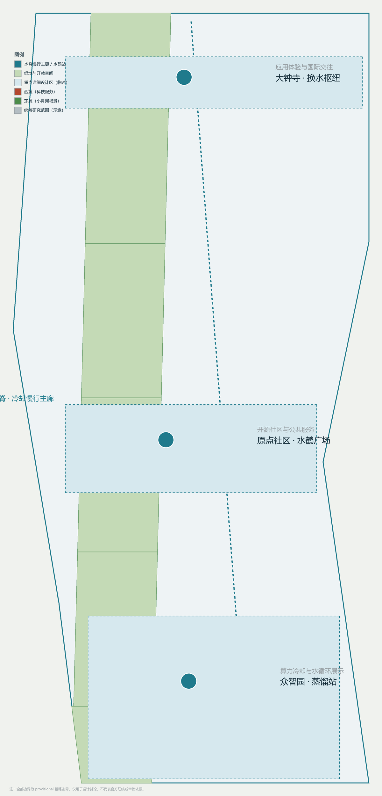
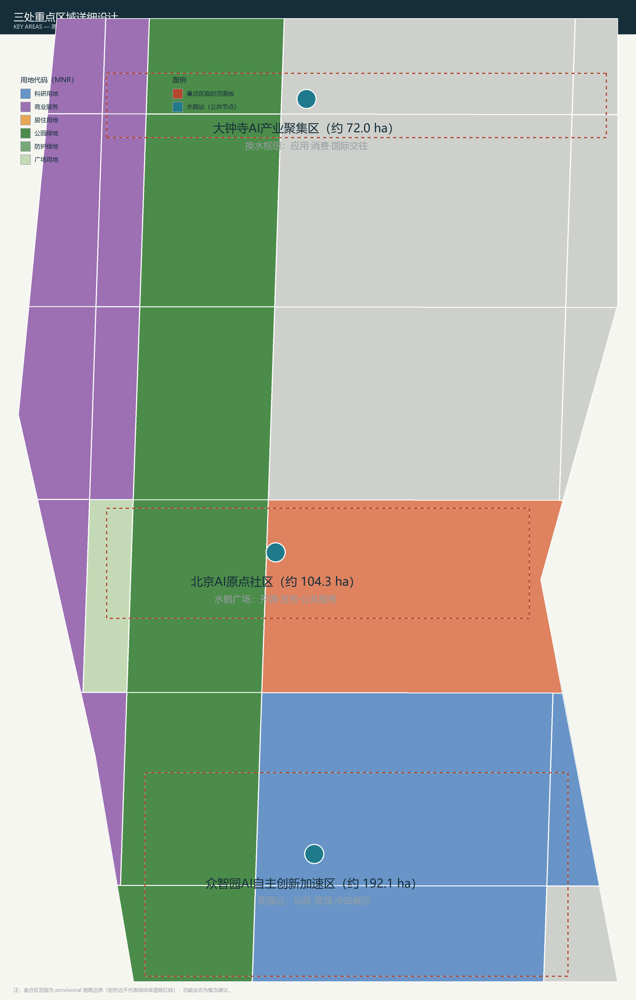
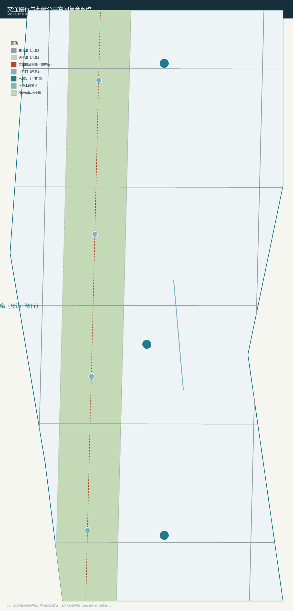
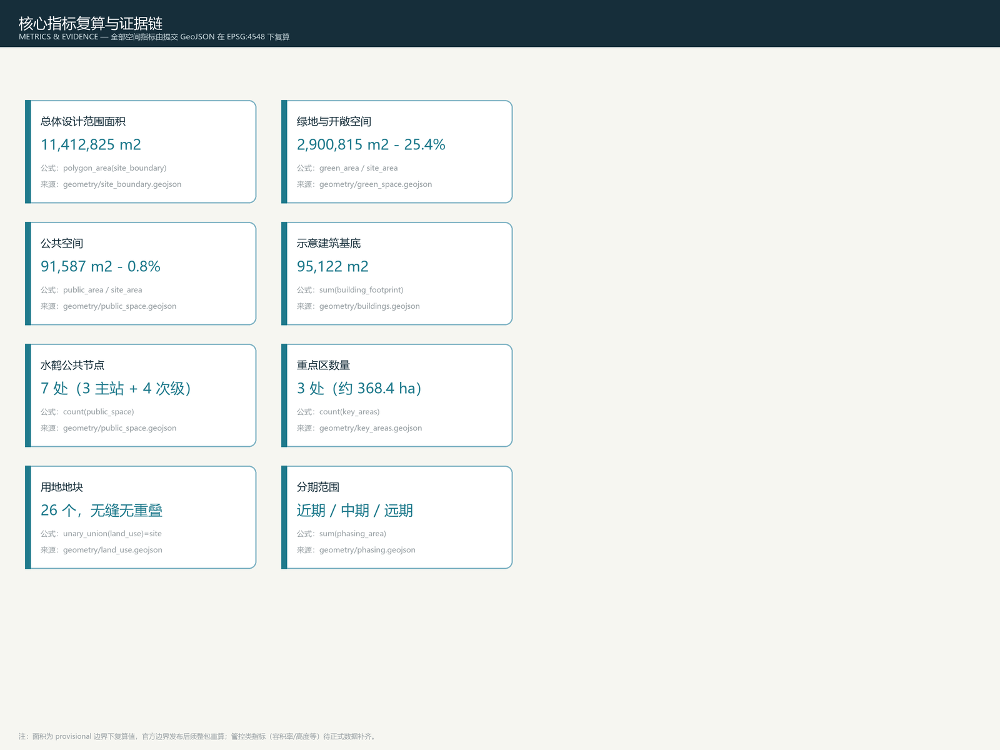

# JINGZHANG WATER CRANE: A Centennial Distillation Belt Circulating Water, Data, and the City

## Design Basis and Source List

This proposal takes as its primary basis the Prequalification Announcement for the International Open Call for Urban Design of the Centennial Jing-Zhang AI Innovation Belt (issued by the Beijing Municipal Commission of Planning and Natural Resources, Haidian Branch); as its secondary basis, the open-call taskbook released to global AI agents; and as its machine-readable basis, the provisional coarse boundaries, three key areas, land-use enums, indicator boundaries, and source lists registered by the maintainers in `brief/site-package/` [source:OFFICIAL-ANNOUNCEMENT] [source:AGENT-TASKBOOK] [source:SITE-PACKAGE]. Every design judgment is decomposed into four layers—traceable sources, recalculable metrics, verifiable layers, and human-reviewable assumptions—and the body text places only the evidence markers adjacent to the relevant judgment; the complete machine index is kept in `sources.json`, `metrics.json`, `compliance_matrix.json`, `standard_matrix.json`, and `design_depth_matrix.json`.

The organizer has not yet published the official precise polygons for `SITE_BOUNDARY` and the three `KEY_AREA`s; this package uses the provisional coarse boundaries provided in the repository (`provisional_constraint`, `official_boundary=false`) to generate all spatial content [source:BOUNDARY-SOURCE] [source:KEY-AREA-SOURCE]. These boundaries may be used only for proposal generation, self-checks, visualization, and design discussion—not as an official redline, an approval basis, a basis for precise area calculations, or statutory control conclusions; the organizer's data gap itself does not block content scoring, and once the official polygons are published, the package's boundaries, land use, roads, green space, public space, buildings, phasing, and all metrics must be recalculated package-wide [standard:PROJECT-OFFICIAL-ANNOUNCEMENT].

## Overall Concept: JINGZHANG WATER CRANE

### 2.1 Concept Origin and Primary Name

In the age of steam locomotives, water cranes (水鹤) were installed along the Jing-Zhang Railway to load locomotives with coal and water—water was the railway's first infrastructure, and the water crane is the material evidence of a century of everyday life on the Jing-Zhang line. One hundred and twenty years later, water in the AI age returns to this corridor in new forms: compute demands cooling water, models require distillation, data flows through pipelines, and the Qinghe River, the Xiaoyue River, and the Wanquan River thread through the city. This proposal takes the circulation of water as its organizing motif: from steam to distillation, from water-filling stations to cooling exchange stations, making the AI innovation belt a **Centennial Distillation Belt** where water is visible, well used, and well governed.

The primary name is 京张水鹤, or JINGZHANG WATER CRANE in English; the naming system is composed of "Spine–Stations–Wings": the Water Spine (the blue-green walking and cycling composite corridor along the main axis of the Jing-Zhang Heritage Park), three water stations (the Distillery Station, the Crane Plaza, and the Exchange Hub), and two wings (the Source Wing and the Network Wing) [source:AGENT-TASKBOOK] [depth:overall_spatial_structure].

### 2.2 Translating the Three Positionings and Five Functions

In this proposal, the three positionings are grounded in concrete objects: the **Centennial Jing-Zhang Cultural Belt** is carried by the memory of water crane relics and the Jing-Zhang Water History Trail; the **Urban AI Life Experience Belt** is carried by the Crane Plaza, waterfront public spaces, and cooling demonstration nodes; and the **AI Convergence Innovation Belt** is carried by the Distillery Station, the Exchange Hub, and the scenario testing belts [standard:PROJECT-AGENT-OPEN-CALL-TASKBOOK].

The five functions are translated as follows: the full-stack independent AI innovation system corresponds to the Zhongzhiyuan Distillery Station (training–distillation–evaluation–showcase); the world-class AI innovation ecosystem corresponds to the station-city network strung along the Water Spine; the new paradigm of AI-enabled scenario empowerment corresponds to the Exchange Hub and the scenario testing belts of the two wings; the intelligent, vibrant AI city corresponds to the day-to-day operations of the Crane Plaza and the public waterfronts; and global discourse leadership in AI governance corresponds to the "Cooling Transparency" mechanism—every AI service entering public space must publicize its energy and water consumption just as a steam locomotive takes on water, making the physical cost of compute visible, auditable, and stoppable [depth:three_key_area_detailed_design].

### 2.3 Three Zones–Two Wings Synergy Loop and Logo Direction

The Three Zones and Two Wings form a synergy loop of "intake–distillation–exchange–reuse": the Source Wing (west wing, the Zhongguancun technology services wing) provides factors, capital, and standards services, like taking water in; the Distillery Station completes model training and distillation at Zhongzhiyuan, like refining; the Crane Plaza completes result releases and open-source collaboration at the Origin Community, like a water station serving citizens; the Exchange Hub completes application conversion and international exchange at Dazhongsi, like exchanging water; and the Network Wing (east wing, the Xiaoyue River scenario enablement wing) feeds scenario testing and waterfront living back into the whole area, like reuse [source:AGENT-TASKBOOK] [depth:three_level_scope_framework].

Logo direction (a conceptual recommendation; no third-party fonts, images, or trademarks are used): a water crane silhouette, a rail track, and a water droplet combined into a single mark, in three primary colors—steam white, rust red, and water blue—symbolizing the temporal chain of the steam age, the railway heritage, and the intelligent age; this direction shares its symbol grammar with the public-space wayfinding system to avoid confusion with the cultural identity system [depth:height_massing_character].

## Three-Level Scope Framework

The proposal organizes its work according to the three-level scope defined in the announcement [standard:PROJECT-OFFICIAL-ANNOUNCEMENT] [depth:three_level_scope_framework]:

| Level | Design Question | Water Crane Proposal's Answer | Data Anchor |
| --- | --- | --- | --- |
| Coordinated Research Area, 43.6 km² | How should the AI industry ecosystem and future urban form be organized? | Establish a water-cycle innovation chain of "university origination–distillation conversion–scenario reuse–international dissemination" | compliance_matrix.json, standard_matrix.json |
| Overall Design Area, 11.4 km² | How should industrial space, urban renewal, transportation and municipal facilities, and urban character be mapped? | The one-Spine-three-Stations-two-Wings spatial structure, jointly expressed by land-use, building, road, green-space, public-space, and phasing layers | [data:geometry/land_use.geojson#LU-001], [data:geometry/roads.geojson#ROAD-001] |
| Key-Area Detailed Design Area, 368.4 ha | How should the three areas reach detailed design depth? | The Distillery Station, the Crane Plaza, and the Exchange Hub each set out positioning, spatial moves, AI scenarios, and implementation dependencies | [data:geometry/key_areas.geojson#PROV-KEY-001], [data:geometry/key_areas.geojson#PROV-KEY-002], [data:geometry/key_areas.geojson#PROV-KEY-003] |

The three levels are not mutually isolated sets of drawings: the coordinated research determines the judgments on the industry chain and urban form; the overall design implements those judgments in renewal projects, spatial structures, and facility capacities; and the key-area detailed design verifies the implementability of specific parcels, buildings, transportation, public space, and AI application scenarios [depth:metrics_recalculation]. All spatial conclusions in this package are recalculated from the submitted layers under EPSG:4548, and every area and ratio appearing in the text can be traced back to `metrics.json` and the GeoJSON.

## Coordinated Research Area: Industry and Future City Research

### 4.1 Global AI Innovation Ecosystem Cases

The proposal selects six publicly verifiable global innovation ecosystem cases as benchmarks for distilling the "water-cycle" innovation organization mechanism (case data are from public sources and serve as background reference only, not as commitments):

| Case | Location | Relevance to the Water Crane Proposal |
| --- | --- | --- |
| King's Cross regeneration | London | A railway goods-yard heritage regenerated into a tech quarter, with the canal waterfront becoming a public living room—structurally analogous to the Jing-Zhang Heritage Park regeneration |
| one-north | Singapore | A composite of waterfront ecology and R&D campus, organizing an innovation community through station-city integration |
| Yunqi Town | Hangzhou | Developer conferences and exhibition IP drive industrial clustering; the event-operation model is transferable |
| Garching Research Campus, Munich | Germany | A cluster of universities and national laboratories—the benchmark for Zhongzhiyuan's full-stack system |
| Mission Bay waterfront R&D district | San Francisco | Waterfront public space coexists with biotech R&D; the water's edge becomes a talent magnet |
| Amsterdam Science Park | Netherlands | A waterfront ecological campus with an everyday walking and cycling network linking universities, enterprises, and the community |

### 4.2 Water-Cycle Innovation Chain and Spatial Synergy

The core judgment of the Coordinated Research Area: a world-class AI innovation ecosystem is not a static campus but a continuous loop of "intake (factors)–distillation (R&D)–exchange (conversion)–reuse (scenarios)" [source:AGENT-TASKBOOK] [standard:PROJECT-AGENT-OPEN-CALL-TASKBOOK]. Haidian's universities and research institutes and Zhongguancun's factor resources act as the water source; Zhongzhiyuan undertakes the full-stack independent system and standards governance; the Origin Community undertakes open source and result releases; Dazhongsi undertakes applications and consumption; and the two wings provide capital, data, compute, and scenario support. This synergy is recorded in the compliance matrix and implemented in `compliance_matrix.json` and the overall spatial structure layers [depth:overall_spatial_structure].

### 4.3 Future Urban Form Research

The ways AI changes work, life, social interaction, learning, transportation, and public services are implemented in this proposal as four types of locatable space: first, the Water Spine main slow-traffic corridor (AI wayfinding, accessibility, and activity grading); second, the three water stations (showcase, release, and roadshow); third, the two wings' scenario testing belts (waterfront testing and experience); and fourth, street-level water crane secondary nodes (embedded everyday AI public services). The future urban form is judged to be "turning the circulation of infrastructure into the scenery of public life," corresponding to the announcement's "intelligent, vibrant AI city" task [source:OFFICIAL-ANNOUNCEMENT] [depth:blue_green_public_space].

## Overall Design Area: Urban Renewal and Regulatory-Plan-Level Urban Design

### 5.1 Water Spine Spatial Structure

The Overall Design Area adopts "one Spine, three Stations, two Wings" as its spatial structure: the Water Spine is a conceptual blue-green composite corridor about 260 meters wide along the main axis of the Jing-Zhang Heritage Park, linking the three water stations and the two wings; it also serves as the main slow-traffic corridor, a cooling demonstration belt, and a stormwater sponge belt [data:geometry/green_space.geojson#GREEN-001] [metric:green_ratio]. The land-use zoning completely and seamlessly covers the submitted boundary without gaps or overlaps, comprising 26 conceptual parcels coded according to a subset of the Guidelines for the Classification of Land and Sea Use in Territorial Spatial Survey, Planning, and Use Control [standard:MNR-LAND-USE-CLASSIFICATION-GUIDE] [data:geometry/land_use.geojson#LU-001].

### 5.2 Land Use, Buildings, and Demolish–Renovate–Retain Logic

The land-use structure takes scientific research (0802) and commercial services (05) as the industrial backbone, with residential (0701) and community services (0702) securing jobs–housing balance and education (0804), culture (0803), and healthcare (0806) completing public services; green space (1401/1402) and plazas (1403) form the blue-green network, while reserved land (16) keeps flexibility for future compute and water-circulation facilities [depth:land_use_layout]. Building footprints are conceptual illustrations (15 sites, about 95,000 m² in total) expressing the method rather than the conclusion of the three "retain–renovate–new-build" actions: existing communities and research buildings along the Jing-Zhang line are mainly retained and renovated, while the areas around the three water stations are mainly renewed and newly built [depth:retain_renovate_demolish] [data:geometry/buildings.geojson#BLDG-001] [metric:building_footprint_area_sqm]. Regulatory-planning conditions such as floor area ratio, building height, building coverage ratio, green ratio, setback lines, and road redlines do not appear in public materials; they are uniformly treated as "pending the completion of official data," with no fabricated values [depth:development_intensity_controls].

### 5.3 Overall Urban Renewal Judgment

Urban renewal in the Overall Design Area follows the principle of "low disturbance, reversibility, water circulation first": prioritize stitching the east–west connections severed by the railway, prioritize reusing existing buildings and courtyards, and prioritize coupling renewal projects with cooling water, stormwater, and slow-traffic systems, avoiding large-scale demolition and construction [depth:renewal_project_list]. The renewal project list is given in Section 10, and the phasing in Section 11.

## Detailed Design of Key Areas

### 6.1 Zhongzhiyuan AI Independent Innovation Acceleration Area (approx. 192.1 ha)—Distillery Station

Positioning: a garden-style full-stack independent innovation neighborhood. Spatial moves: take the Distillery Station as the core public node, strengthen the Qinghe River interface and industrial showcase, and organize low-carbon innovation exchange spaces and external transportation; translate model training, distillation, evaluation, and safety governance into showcase and collaboration facilities that are visitable, bookable, and inspectable; arrange a low-carbon innovation gallery along the Qinghe River carrying demonstrations of stormwater and cooling-water reuse [data:geometry/key_areas.geojson#PROV-KEY-001] [depth:three_key_area_detailed_design].

### 6.2 Beijing AI Origin Community (approx. 104.3 ha)—Crane Plaza

Positioning: a campus-adjacent result-conversion and talent community. Spatial moves: the Crane Plaza hosts open-source releases, result releases, talent services, and public life; organize slow-traffic stitching across campus, park, and neighborhood; supplement talent housing, result showcase, open-source collaboration, and transit-station integrated connections; the Crane Plaza also serves as the showcase venue of the "Cooling Transparency" mechanism, where the energy and water consumption of public AI services is published [data:geometry/key_areas.geojson#PROV-KEY-002] [source:AGENT-TASKBOOK].

### 6.3 Dazhongsi AI Industry Cluster (approx. 72.0 ha)—Exchange Hub

Positioning: an urban smart-economy and international-exchange neighborhood. Spatial moves: the Exchange Hub hosts application conversion, smart-terminal showcase, content consumption, and international roadshows; organize four-quadrant pedestrian connectivity and station-city integration around Dazhongsi Station; renew the public environment around key enterprises and pursue the composite use of planned green space [data:geometry/key_areas.geojson#PROV-KEY-003] [metric:key_area_count].

The functional programs, building scales, building forms, demolish–renovate–retain classifications, public space systems, traffic organization, slow-traffic connectivity, and implementation projects of the three key areas are all recorded in `compliance_matrix.json` (announcement clauses 1.5.3.1/1.5.3.2/1.5.3.3) and the design depth matrix; the key-area extents are provisional coarse boundaries, and the rectangular edges do not represent parcel or road redlines [depth:three_key_area_detailed_design] [source:KEY-AREA-SOURCE].

## Land Use, Building Scale, and Retain-Renovate-Demolish Strategy

The land-use structure takes R&D (0802) and commercial (05) as the industrial core, residential (0701) and community services (0702) for work-housing balance, education (0804), culture (0803) and medical (0806) for public services, green space (1401/1402) and plazas (1403) for the blue-green network, and reserved land (16) for future compute and water-cycle facilities; 26 conceptual parcels seamlessly cover the submitted boundary [standard:MNR-LAND-USE-CLASSIFICATION-GUIDE] [data:geometry/land_use.geojson#LU-001] [depth:land_use_layout].

Building footprints are conceptual indicators (15 parcels, approx. 95,122 m2 in total) expressing a method of retain-renovate-new actions rather than conclusions: existing communities and R&D buildings along the heritage line are primarily retained/renovated, while the surroundings of the three water-crane stations are renewed/new-built; no parcel-level demolition-renovation conclusions are presupposed [data:geometry/buildings.geojson#BLDG-001] [metric:building_footprint_area_sqm] [depth:retain_renovate_demolish]. FAR, building height, density, green ratio, setbacks and road redlines are not present in public materials and are uniformly treated as "pending official data", with no fabricated values [depth:development_intensity_controls].

## AI Innovation Ecosystem, Personas, and AI+ Scenarios

### 7.1 User Personas (5 types)

| User Persona | Typical Needs | Water Crane Spatial Response | Self-Check Boundaries |
| --- | --- | --- | --- |
| Open-source developers | Release, collaboration, testing, community reputation | Open-source release hall at the Crane Plaza, public code wall, developer camp | No collection of personal behavioral traces; activity data used only for aggregate statistics |
| Startup teams | Low-cost offices, compute access, distillation test ground | Shared test ground at the Distillery Station, cooling showcase pavilion, standards-governance consulting | Compute and data services require separate authorization |
| Visitors from leading enterprises | Showcase, business, international reception, talent recruitment | International roadshow lounge at the Exchange Hub, transit connections, waterfront public space | Enterprise logos and cases require rights clearance |
| Nearby residents | Commuting, leisure, community services, low-disturbance renewal | Water Spine slow-traffic loop, water crane secondary nodes, waterfront public life | Resident personas are not used for commercial recommendations |
| University faculty and students | Result conversion, cross-campus collaboration, everyday slow traffic | Campus–park slow-traffic stitching, releases at the Crane Plaza, AI education experience points | Campus data and research results require authorization |

### 7.2 AI Scenario Cards (12 cards, covering the taskbook requirement of no fewer than 10)

| Scenario Card | Spatial Carrier | Design Description |
| --- | --- | --- |
| 01 Water Crane Cooling Showcase Pavilion | Three water stations | A pavilion publishing the energy and water consumption of public AI services, making the cost of compute visible and checkable |
| 02 Distillery Lab Open Day | Zhongzhiyuan Distillery Station | Bookable showcase and collaboration facilities for model distillation, evaluation, and red-team testing |
| 03 Water Spine Slow-Traffic Navigation | Water Spine main corridor | Explainable wayfinding and low-intrusion sensing that identify gaps, congestion, and accessibility needs |
| 04 Qinghe Low-Carbon Innovation Gallery | Zhongzhiyuan's Qinghe River interface | A public living room combining stormwater, cooling-water reuse, walking and cycling, and AI showcases |
| 05 Crane Plaza Open-Source Release | Origin Community | Code wall, result releases, small roadshows, and talent services |
| 06 Exchange Hub International Roadshow Lounge | Dazhongsi area | Showcase, negotiation, and release space for agents, smart terminals, and content-consumption enterprises |
| 07 Xiaoyue River Scenario Testing Belt | Network Wing | Waterfront driverless-vehicle/robot test lanes running in parallel with citizen experience lanes (see 7.3) |
| 08 Data Factor Lounge | Dazhongsi area | A data-factor circulation service interface premised on compliant, auditable authorization |
| 09 AI Water Digital Twin | Municipal facilities citywide | Digital-twin inspection scenarios for pipeline networks, stormwater, and cooling-water circulation |
| 10 Jing-Zhang Water History Trail | Water Spine | AR overlays of steam-age water crane relics, combining cultural narrative with slow traffic |
| 11 Cooling-Water Reuse Garden | Nodes across the Overall Design Area | Touchable waterscapes combining sponge-city and cooling-water reuse |
| 12 Global AI Week Waterfront Route | Public space along the Belt | A walkable narrative line from heritage culture, open-source community, and industry showcases to international roadshows |

### 7.3 Industrial Testing and Validation Scenarios (3 locations)

First, the Zhongzhiyuan compute–cooling integrated test ground: verifies the waste-heat recovery and cooling-water circulation efficiency of high-density compute facilities, with data published after anonymization; second, the Xiaoyue River waterfront scenario testing belt: tests low-speed driverless vehicles, robots, and environmental sensing equipment in a waterfront public environment, with safety officers and emergency-stop boundaries in place; third, the Dazhongsi digital content experience pod: conducts A/B testing of smart-terminal and content-consumption products, with data collection subject to explicit consent and human review. All three testing scenarios are "conceptual recommendations/reference proposals" and do not constitute approved operational arrangements [source:AGENT-TASKBOOK] [depth:risk_missing_data].

### 7.4 Privacy and Human Review Boundaries

All AI scenarios follow the principles of data minimization, public sources, explainability, and human review: no collection of personal behavioral traces, no output of unauthorized personal profiles, no presentation of immature technologies as ready for full-scale deployment, and no reliance on non-public data or designated vendors as necessary conditions [standard:PROJECT-AGENT-OPEN-CALL-TASKBOOK]. The scenario–space–operation mappings are recorded in `compliance_matrix.json` and `visual/index.html`.

## Transport, Rail, Municipal Infrastructure, and Public Services

### 8.1 Transportation and Rail Transit

The transportation strategy is organized around "Water Spine first, transit-station connections, micro-circulation stitching": the Water Spine main corridor serves as the north–south main slow-traffic channel; existing corridors such as the North Fifth Ring Road, Xueyuan Road/Xitucheng Road, and Xizhimen Outer Street form the skeleton for external connections; all three water stations are integrated with transit stations, and Dazhongsi Station organizes four-quadrant pedestrian connectivity; the road layer is a conceptual skeleton illustration and does not constitute road redlines [data:geometry/roads.geojson#ROAD-001] [depth:traffic_rail_slow_parking]. Parking and non-motorized vehicle parking follow the reduction-oriented supply principle of "transit + slow traffic + sharing," with specific capacities to be deepened in a dedicated transportation study.

### 8.2 Municipal Facilities and New Infrastructure

The municipal strategy features "water-circulation municipal services": coupling cooling-water reuse, stormwater management, gray-water systems, and the urban blue-green network into a closed loop of "intake–use–reuse–return to the river"; distributed energy and edge compute are arranged along the Water Spine and the water stations, with cooling waste heat preferentially reused in public spaces and facilities [depth:municipal_new_infrastructure]. The AI water digital twin serves as a new-infrastructure prototype covering sensing–prediction–dispatch for pipeline networks, stormwater, and cooling-water circulation. Engineering conditions such as pipelines, fire protection, and flood control do not appear in public materials and are listed as prerequisites for formal deepening [data:geometry/constraints.geojson#CONSTRAINT-001].

### 8.3 Public Service Facilities

Public services cover innovation service platforms (result conversion, legal affairs, intellectual property, investment and financing), talent life services (talent apartments, community services, childcare and care), public cultural facilities (the water history trail and showcase pavilions), and sports and leisure facilities (Water Spine sports nodes); service radius and capacity indicators will be recalculated once official facility standards are confirmed.

## Blue-Green Network, Public Space, and Urban Character

### 9.1 Water Spine Blue-Green Network

The blue-green system takes the Water Spine as its skeleton: green space and open space total approximately 2.901 million m² (about 25.4% of the Overall Design Area), including park green space along the main axis and protective green space on the north bank of the Qinghe River and along the Xiaoyue River [metric:green_area_sqm] [metric:green_ratio] [data:geometry/green_space.geojson#GREEN-001]. There are 7 public spaces in total: 3 main nodes at the water stations plus 4 street-level water crane secondary nodes, covering about 92,000 m² [metric:public_space_ratio] [data:geometry/public_space.geojson#PUBLIC-001]. The Water Spine simultaneously carries the dual functions of north–south through-connection (trail + cycling) and east–west stitching (lateral connections linking communities and enterprises on both sides), with slow-traffic gaps and ring-road crossing nodes itemized in the renewal project list [depth:blue_green_public_space].

### 9.2 Urban Character and Symbol System

The character keynote is "heritage rust + intelligent water blue": railway industrial traces (rust-red tones) are preserved along the Jing-Zhang Heritage Park, while new AI facilities adopt water-blue and steam-white tones, forming a dialogue between old and new; the wayfinding system shares its grammar with the water crane symbol system, consistent with the overall Logo direction [depth:height_massing_character] [standard:MOHURD-URBAN-DESIGN-MEASURES]. Urban character control distinguishes official controls, design recommendations, and conditions pending confirmation, and provides no pseudo-precise control lines.

### 9.3 AI Pilgrimage Landmarks (3 locations)

First, the **Water Crane Memorial Hall**: a public memorial hall at the steam-age water crane relic/archival memory site, with AR overlays of historical imagery; second, the **Distillation Tower Light Gallery**: a compute-visualization installation at the Zhongzhiyuan Distillery Station that translates the light and heat of training processes into a public landscape; third, **Cooling Well Zero**: the first public cooling exchange station, serving as the origin landmark where "the physical cost of AI services is visible." All three landmarks are conceptual recommendations that avoid excessive entertainment and internet-celebrity sensationalism [source:AGENT-TASKBOOK] [depth:three_key_area_detailed_design].

## Renewal Projects, Implementation Policy, and Phasing

### 10.1 Renewal Project List

| Project No. | Project Name | Type | Key Dependencies | Phase |
| --- | --- | --- | --- | --- |
| JZ-01 | Water Spine slow-traffic gap stitching | Public space/Transportation | Road redlines, under-bridge space, traffic organization review | Near term |
| JZ-02 | Zhongzhiyuan Distillery Station and cooling showcase hall | Blue-green space/Industrial showcase | River blue lines, flood control, compute and energy conditions | Near term |
| JZ-03 | Crane Plaza in the Origin Community | Urban renewal/Public space | Campus boundary, ownership, ground-floor programs | Near term |
| JZ-04 | Dazhongsi Exchange Hub and four-quadrant pedestrian connectivity | Transit integration/Slow traffic | Transit stations, road intersections, municipal pipelines | Near term |
| JZ-05 | Xiaoyue River Network Wing waterfront green belt | Blue-green space/Scenario testing | River blue lines, testing safety, and operating entities | Mid term |
| JZ-06 | Water crane public node component library | Public space/Branding | Public space permits, copyright clearance | Mid term |
| JZ-07 | Jing-Zhang Water History Trail | Culture/Slow traffic | Heritage protection, relic information verification | Mid term |
| JZ-08 | AI water digital twin platform | New infrastructure/Municipal | Pipeline network data, data ownership and security | Long term |

### 10.2 Implementation Policies and Phasing

Implementation phasing is kept distinct from the competition cycle: the near term (pilot first) focuses on the three water stations and a pilot section of the Water Spine, launched with lightweight facilities, operational activities, and service platforms; the mid term (stitching and quality improvement) completes the Network Wing, the water history trail, and the public node component library; the long term (citywide circulation) advances peripheral renewal and citywide water-circulation municipal services [data:geometry/phasing.geojson#PHASE-001] [depth:phasing_implementation]. Policy recommendations cover coordinated implementation of urban renewal, spatial supply, operation mechanisms, industrial services, public participation, data governance, and property-rights coordination; anything involving ownership, funding, implementing entities, and approval pathways is written as implementation risks and prerequisites, not as commitments [depth:renewal_project_list].

## Metrics, Area Recalculation, and Compliance Matrix

All core indicators are recalculated from the submitted geometry under EPSG:4548: the Overall Design Area is approximately 11,412,825 m² (value recalculated from the provisional boundary) [metric:site_area_sqm]; green space and open space total approximately 2.901 million m² (about 25.4%) [metric:green_ratio]; public space totals about 92,000 m² [metric:public_space_ratio]; illustrative building footprints total about 95,000 m² [metric:building_footprint_area_sqm]; there are 7 water crane public nodes [metric:water_crane_node_count]; 3 key areas [metric:key_area_count]; and phasing covers the entire area [metric:phasing_area_sqm].

Indicators are managed in three categories: the first category comprises spatial recalculation indicators (those listed above); the second comprises control indicators requiring official regulatory-planning support (floor area ratio, building height, building coverage ratio, setback lines, road redlines, facility standards), all set to `status=unknown` pending the completion of official data [depth:development_intensity_controls]; the third comprises operational performance indicators (AI innovation index, talent density, event participation, scenario usage frequency), which enter `compliance_matrix.json` as ongoing calibration items and do not pose as approved planning conditions [depth:metrics_recalculation].

The compliance matrix covers all mandatory tasks in announcement clauses 1.3, 1.4, and 1.5 and the six tasks agent.1–agent.6; each task corresponds to report sections, layers, metrics, drawings, HTML pages, sources, assumptions, and self-check items, as detailed in `compliance_matrix.json`.

## Risk, Copyright, and Compliance

**Bilingual contract.** The primary document of this package is in Chinese, accompanied by the complete English counterpart `proposal.en.md`; A3/A0 drawings, HTML pages, and figures are provided in bilingual versions, with terminology giving priority to the translations recommended in `docs/terminology-glossary.md` [source:AGENT-TASKBOOK].

**Principal risks and missing-data list:** the official boundary and key-area polygons are absent (this does not affect content scoring, but all precise areas must be recalculated package-wide after the official data are released); regulatory-planning conditions, road redlines, ownership, municipal, fire-protection, heritage-protection, and engineering conditions are absent (the related conclusions are all downgraded to items pending confirmation) [depth:risk_missing_data]; the historical physical water crane and relic information require professional verification; cooling-water and energy-consumption data require on-site measurement during the operation phase. All of the above are recorded in `assumptions.json` and this self-check report [source:SITE-PACKAGE].

**Copyright and compliance boundaries:** this proposal does not claim official approval, approved regulatory detailed planning, final land ownership, final construction scale, or guaranteed implementation; all spatial content consists of conceptual recommendations based on provisional boundaries; all brands, fonts, images, portraits, and enterprise logos must be used after rights clearance, and no third-party copyrighted material has been used; the sources and license status of image, drawing, icon, data, and code assets are given in `sources.json` and `report/copyright_statement.md`; the HTML pages are offline static files that load no remote resources and track no behavior [standard:MOHURD-CONTROL-DETAILED-PLANNING].

## References

- brief/public-brief.md
- brief/site-package/design_brief.json
- brief/site-package/agent_taskbook.json
- brief/site-package/allowed_design_space.json
- brief/site-package/enums/
- brief/site-package/ranges/planning_limits.json
- brief/site-package/geometry/provisional_boundaries.geojson
- brief/site-package/standards/standards.json
- Complete machine index: `sources.json`, `metrics.json`, `compliance_matrix.json`, `standard_matrix.json`, and `design_depth_matrix.json`
