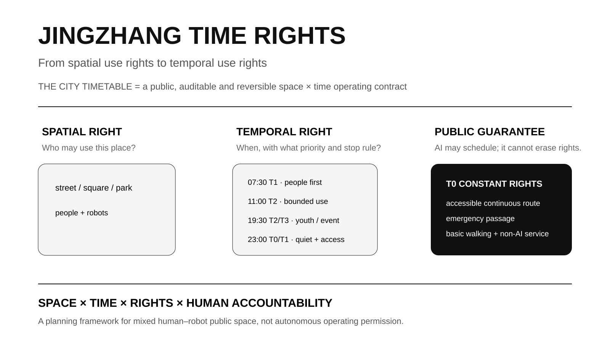
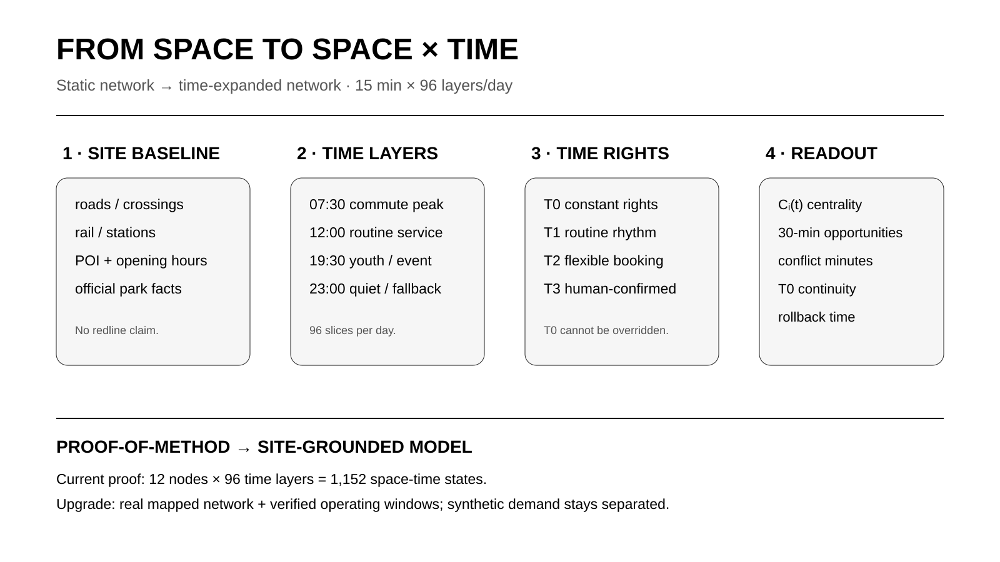
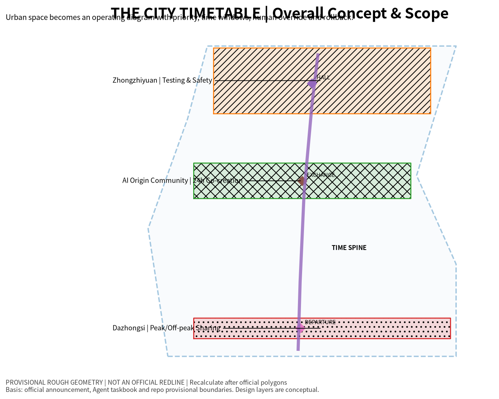
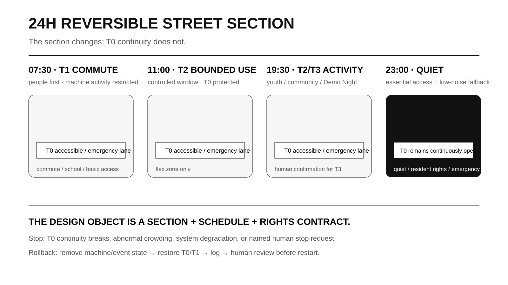
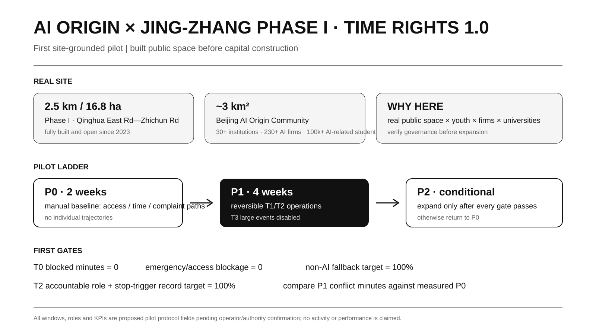
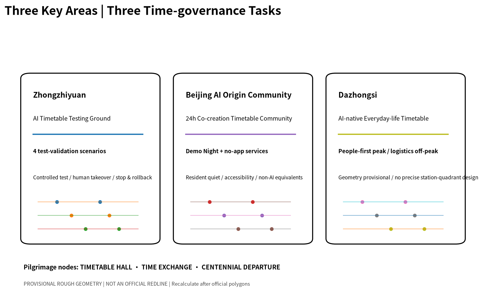
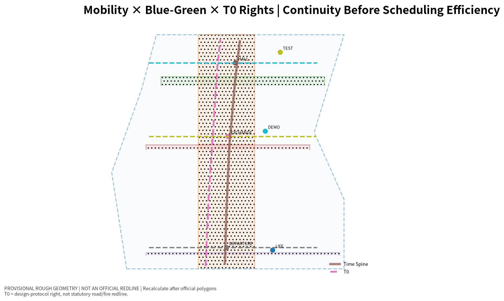

# JINGZHANG TIME RIGHTS · THE CITY TIMETABLE
## From Spatial Use Rights to Temporal Use Rights

Conventional urban design asks what goes where. An AI city must also ask **who has priority when, who exits during conflict, and how a failed state recovers**. Railway timetable, meet/pass, priority and recovery logic therefore become an operating prototype. `THE CITY TIMETABLE` is the system; **Time Rights** is the planning proposition.

This is an open-call formal submission, not statutory planning, engineering approval or observed field performance.

## Design Basis and Source List

The official announcement controls scope and tasks [source:OFFICIAL-ANNOUNCEMENT]; the Agent taskbook controls six Agent tasks, scenarios, personas, landmarks and long-term operation [source:AGENT-TASKBOOK]. Professional boundaries follow the registered urban-design, regulatory-planning and land-use references [standard:MOHURD-URBAN-DESIGN-MEASURES] [standard:MOHURD-CONTROL-DETAILED-PLANNING] [standard:MNR-LAND-USE-CLASSIFICATION-GUIDE].

Official SITE_BOUNDARY/key-area polygons and approved FAR, height, road redlines, ownership, utilities and heritage controls remain incomplete, so competition geometry stays `provisional_constraint` and `official_boundary=false` [source:BOUNDARY-SOURCE] [assumption:A-BOUNDARY-001].

Site-grounded evidence now supports pilot selection. Jing-Zhang Railway Heritage Park Phase I is built and open from Qinghua East Road to Zhichun Road, about 2.5 km / 16.8 ha [source:JZ-PARK-PHASE1-OFFICIAL]. Phase II supporting works were completed in 2026; the northern section is about 30.01 ha with a fishbone cycling/running/walking network [source:JZ-PARK-PHASE2-2026]. Beijing AI Origin Community is about 3 km² with 30+ universities/research institutions, 230+ AI enterprises and about 100,000 AI-related students [source:AI-ORIGIN-2026-BJFGW]. A regulatory-plan draft for the corridor AI innovation district has gone through public consultation/feedback handling [source:JZ-CONTROL-PLAN-PUBLIC-2025]. These facts explain **why to pilot here**; they do not replace official competition polygons or unreleased statutory controls.

## Three-Level Scope Framework

The official task defines about 43.6 km² coordinated research, 11.4 km² overall design and about 368.4 ha across three key areas [source:OFFICIAL-ANNOUNCEMENT]. The research scale studies temporal relationships among universities, enterprises, services and events; the overall-design scale becomes a City Timetable; the three key areas test safety, co-creation/everyday rights, and peak/off-peak station-city sharing [metric:key_area_count].

All three scales use the same T0–T3 grammar: understand rhythms, organize sharing, then test rules as rejectable and reversible spatial prototypes.

## Coordinated Research Area: Industry and Future City Research

Time Rights adds four questions: **what happens when, who has priority, what evidence allows switching, and who exits during conflict**. A conceptual 9.22 km Time Spine organizes the hypothesis [data:geometry/roads.geojson#ROAD-001] [metric:time_spine_length_m].

Six precedents contribute mechanisms only: NYC Open Streets, LADOT Code the Curb, OMF CDS, Singapore controlled AV testing, TfL School Streets and Paris Rues aux écoles [source:CASE-NYC-OPEN-STREETS-2026] [source:CASE-LADOT-CODE-THE-CURB] [source:CASE-OMF-CDS]. The method chain is **Planning Question → Time Rights → TimeSlot Contract → Time-expanded Network → Spatial Prototype → Validation / Rollback**. The 12-node × 96-layer model remains a proof under explicit assumptions [assumption:A-TEMPORAL-MODEL-001].

## Overall Design Area: Urban Renewal and Regulatory-Plan-Level Urban Design

T0 protects accessibility, emergency passage, basic walking and essential non-digital service. T1 covers routine daily rhythms. T2 covers bounded reservation such as demonstrations, delivery/testing or community activity. T3 covers human-confirmed high-crowd events. A TimeSlot Contract records time window, permitted actors, priority, accessibility protection, accountable human, stop trigger, rollback, log and non-AI fallback [metric:validator_negative_case_count].

A 24-hour street type becomes **section + timetable + rights contract**: people-first at 07:30, bounded T2 around 11:00, youth/community use around 19:30 and quiet/essential service around 23:00. T0 remains continuous [assumption:A-CONTROLS-001].

## Detailed Design of Key Areas

**Zhongzhiyuan — AI Temporal Testing Ground.** People-first peaks, controlled daytime testing, public observation/Demo periods and night maintenance test degradation, automatic exit, human takeover and log replay [metric:test_validation_scenario_count].

**Beijing AI Origin Community — 24h Co-creation Timetable Community.** Its real near-campus innovation context and adjacent built heritage-park segment make it the strongest first field location [source:AI-ORIGIN-2026-BJFGW] [source:JZ-PARK-PHASE1-OFFICIAL].

### First executable pilot: AI Origin × Jing-Zhang Phase I | TIME RIGHTS 1.0

The pilot does not wait for demolition or major capital construction. It uses the built Qinghua East Road–Zhichun Road segment to test whether youth activity, public service, demonstration and bounded technology testing can share real public space without sacrificing T0. The machine-readable protocol is `visual/assets/ai-origin-time-rights-pilot.json` [assumption:A-PILOT-001].

- **P0 | two weeks:** manual baseline of entrances, accessibility, peaks, activity/quiet nodes, complaint/management paths and non-digital access; aggregate counts only.
- **P1 | four weeks:** proposed windows pending operator confirmation: 07:30–09:30 people-first; 11:00–15:00 bounded T2; 18:30–21:00 youth/community; quiet/essential service after 21:00. T3 large events stay disabled.
- **P2 | conditional:** expand only after T0 continuity, human takeover, complaint response, non-AI fallback and log-completeness gates pass; otherwise return to P0.

The proposed responsibility chain covers park management, local community, AI Origin operation, universities/volunteers, test enterprises, accessibility/resident representatives and an independent reviewer. **No commitment is claimed.** The slot freezes if the only accessible/emergency path is blocked, the accountable human is absent, privacy limits fail or the non-AI equivalent disappears.

First-cycle targets are public-rights gates, not achieved performance: `T0_blocked_minutes=0`, zero accessibility/emergency blockage incidents, 100% target non-AI fallback availability, 100% target accountable-role/stop-trigger records for T2, and P1 peak-conflict minutes compared against measured P0.

**Dazhongsi — AI-native Everyday-life Timetable.** Peaks prioritize people/transfer; daytime supports ordinary commerce; evening supports youth culture; night shifts logistics off-peak. A 2026 public renewal-area listing confirms an implementation framework with phased renewal and urban-design guidance [source:DAZHONGSI-URBAN-RENEWAL-2026]. It does **not** correct the competition provisional polygon, so precise station-quadrant placement remains unclaimed [assumption:A-DAZHONGSI-001].

The three public-rule/pilgrimage nodes are **TIMETABLE HALL, TIME EXCHANGE and CENTENNIAL DEPARTURE** [data:geometry/public_space.geojson#PUBLIC-001].

## AI Innovation Ecosystem, Personas, and AI+ Scenarios

The unified identity is **Jingzhang Time Rights · THE CITY TIMETABLE**. Six personas cover developers, students/researchers, residents, accessibility/older users, merchants/night workers, and logistics/maintenance/emergency roles [metric:scenario_count]. Twelve scenarios cover robot-delivery windows, low-speed conflict degradation, crowd-peak exit, human takeover/log replay, Demo Night, no-app navigation, AI cultural guidance + non-digital route, night learning, scenario admission, enterprise Demo slots, event scheduling and a public Time Rights display. At least four are test/validation scenarios [metric:test_validation_scenario_count].

Human override and non-AI fallback are 100% at the design-contract level, not as observed performance [metric:human_override_coverage] [metric:non_ai_fallback_coverage] [assumption:A-METRICS-001]. Long-term programs include Open Timetable Week, Urban Agent Scheduling Challenge, Robotics Low-speed Test Week, Jing-Zhang Demo Night and Annual Time Rights Review.

## Land Use, Building Scale, and Retain-Renovate-Demolish Strategy

Concept land-use geometry is machine-checkable but not regulatory approval [data:geometry/land_use.geojson#LU-001] [standard:MNR-LAND-USE-CLASSIFICATION-GUIDE]. FAR remains unknown [metric:floor_area_ratio]. Six conceptual retrofit units total about 88,629 m² footprint and prioritize reversible ground-floor interfaces before demolition/new build [metric:building_footprint_area_sqm] [assumption:A-CONTROLS-001].

## Transport, Rail, Municipal Infrastructure, and Public Services

The Time Spine is a design device, not an engineering alignment [data:geometry/roads.geojson#ROAD-001]. The conceptual T0 continuity network is about 12.33 km [metric:t0_constant_rights_corridor_length_m]. Digital infrastructure includes public status, machine-readable rules, human takeover, logs, rollback and non-digital backup.

In the scenario proof, machine service stays 10h/day while peak human-machine conflict changes 10h → 3h (-70%), peak flexible-space availability 63.0% → 88.9% (+25.9pp), and 30-minute peak reachability 3.70 → 3.91 (+5.7%) [metric:peak_conflict_reduction_ratio] [metric:peak_flexible_space_availability_gain_pp] [metric:temporal_reachability_gain_ratio]. None is field performance [assumption:A-TEMPORAL-MODEL-001].

## Blue-Green Network, Public Space, and Urban Character

On provisional geometry, the conceptual green-layer ratio is 31.5058% and six timetable public spaces represent about 1.4959%; neither is an approved statutory ratio [metric:green_ratio] [metric:public_space_ratio]. The blue-green system is treated as the low-tech substrate of T0 Constant Rights rather than decorative background: continuous walking, accessibility, shade/rest, quiet space and emergency passage take priority over any T2/T3 activation. Phase I is already open and Phase II supporting works add a slow-mobility network, so the near-term design task is to identify spaces that may switch state and spaces that must remain continuously passable, rather than beginning with large new structures [source:JZ-PARK-PHASE1-OFFICIAL] [source:JZ-PARK-PHASE2-2026].

The conceptual green/public-space GeoJSON provides a traceable index, not a statutory plan [data:geometry/public_space.geojson#PUBLIC-001]. Each timetable node must show the T0 route, reservable edge, quiet window, accountable human and rollback state. Street sections, trees, drainage, utilities, lighting, heritage controls and observed use intensity remain field/professional data gaps. Urban character translates railway time axes, station points, meet/pass and recovery logic into signage, paving, public information and event language rather than generic “future-tech” styling [standard:MOHURD-URBAN-DESIGN-MEASURES].

## Renewal Projects, Implementation Policy, and Phasing

Implementation follows **operate and verify before expanding space; reversible pilot before capital construction**. The first near-term project is AI Origin × Jing-Zhang Phase I TIME RIGHTS 1.0: a two-week P0 human baseline followed by a four-week P1 reversible trial, together with the TimeSlot Contract, public Time Rights display, T0 accessibility/emergency checks and no-app navigation. The built/open Phase I is the site evidence [source:JZ-PARK-PHASE1-OFFICIAL], while the machine-readable pilot protocol is `visual/assets/ai-origin-time-rights-pilot.json` [data:visual/assets/ai-origin-time-rights-pilot.json]. Other near-term outputs are key-area rule interfaces, public status boards, human-takeover drills and an Annual Time Rights Review, using existing public space and removable equipment first.

Mid term begins only after official polygons, roads/station access, observed pedestrian activity, logistics, utilities and management boundaries are available; P0/P1 field baselines then replace proof assumptions and temporal conflict/accessibility are recalculated [metric:peak_conflict_reduction_ratio]. Failure of T0 continuity, non-AI fallback, complaint response or named accountability holds the project at P0/P1. Long-term embodied-AI public operation and spatial reconstruction require separate traffic, safety, planning, utility, heritage, ownership and operating confirmation. Phasing is therefore also an evidence-maturity and authorization ladder [depth:phasing_implementation].

## Metrics, Area Recalculation, and Compliance Matrix

Current structured values include 11,412,825.386 m² provisional site area, 88,628.915 m² conceptual retrofit footprint, 31.5058% conceptual green layer, 1.4959% six-space public-space ratio, a 9,216.69 m conceptual Time Spine, 12 scenarios, 100% design-field human override/non-AI fallback, and a 70% scenario-only conflict reduction. FAR remains unknown [metric:site_area_sqm] [metric:floor_area_ratio].

Traceability remains in `compliance_matrix.json`, `standard_matrix.json`, `design_depth_matrix.json`, `metrics.json` and `assumptions.json` [depth:metrics_recalculation].

## Risk, Copyright, and Compliance

Official polygons remain missing, so provisional-derived quantities and placements require recalculation [source:OFFICIAL-ANNOUNCEMENT]. FAR, height, roads, utilities, heritage and ownership are not invented [standard:MOHURD-CONTROL-DETAILED-PLANNING]. The AI Origin pilot is proposed, not authorized or run [data:visual/assets/ai-origin-time-rights-pilot.json]. Robotics testing is not deployment permission, and scenario-model outputs such as the 70% conflict reduction are not observed field performance [metric:peak_conflict_reduction_ratio]. Essential service does not depend on facial recognition, persistent tracking or a mandatory app; field evidence defaults to aggregate counts and human observation. Core figures/models are original or programmatically generated; see `report/copyright_statement.md`.

## References

Official project evidence [source:OFFICIAL-ANNOUNCEMENT] [source:AGENT-TASKBOOK]; built Phase I and completed Phase II supporting works [source:JZ-PARK-PHASE1-OFFICIAL] [source:JZ-PARK-PHASE2-2026]; AI Origin operating context [source:AI-ORIGIN-2026-BJFGW]; regulatory-plan consultation and Dazhongsi renewal framework [source:JZ-CONTROL-PLAN-PUBLIC-2025] [source:DAZHONGSI-URBAN-RENEWAL-2026]; mechanism precedents and time-expanded-network method are indexed in `sources.json` [source:METHOD-TIME-EXPANDED-2026].
