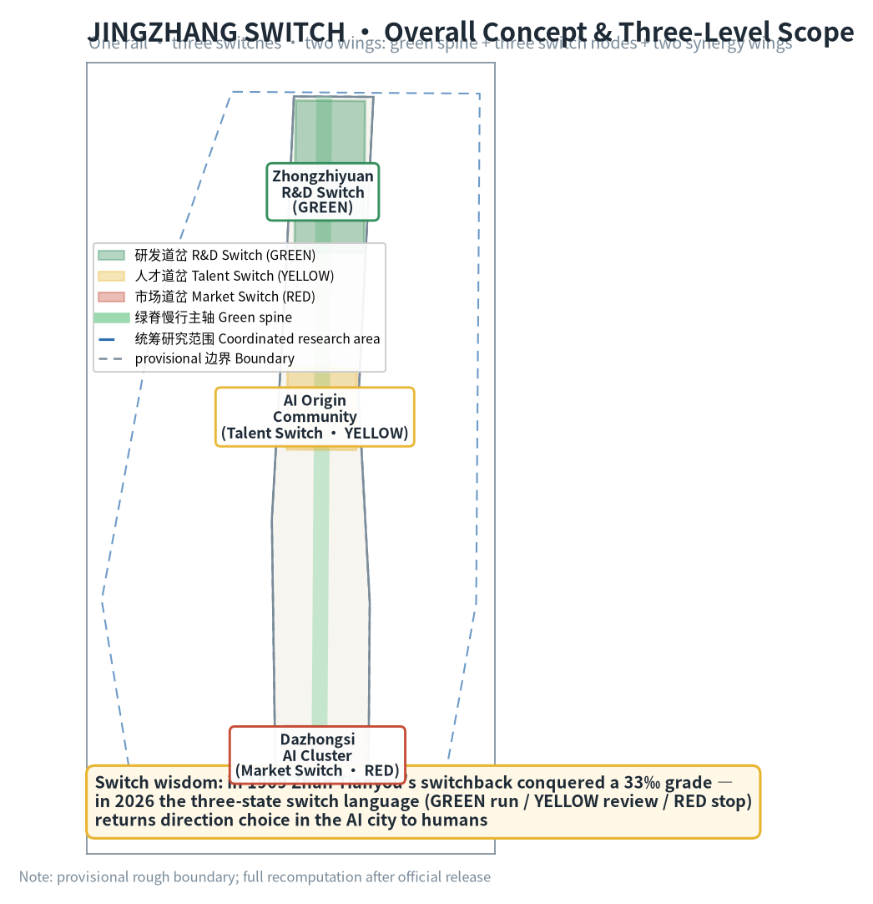
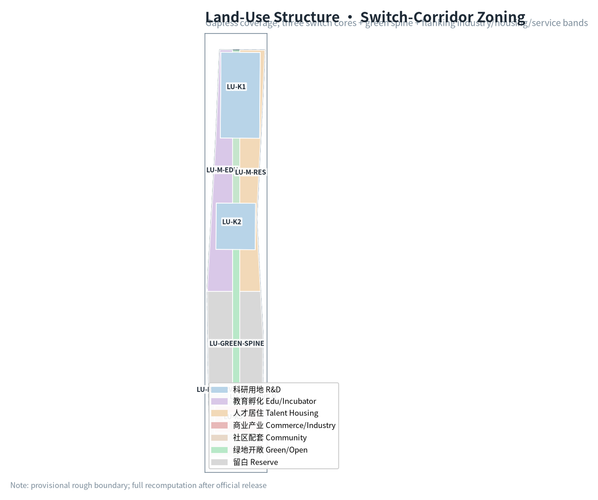
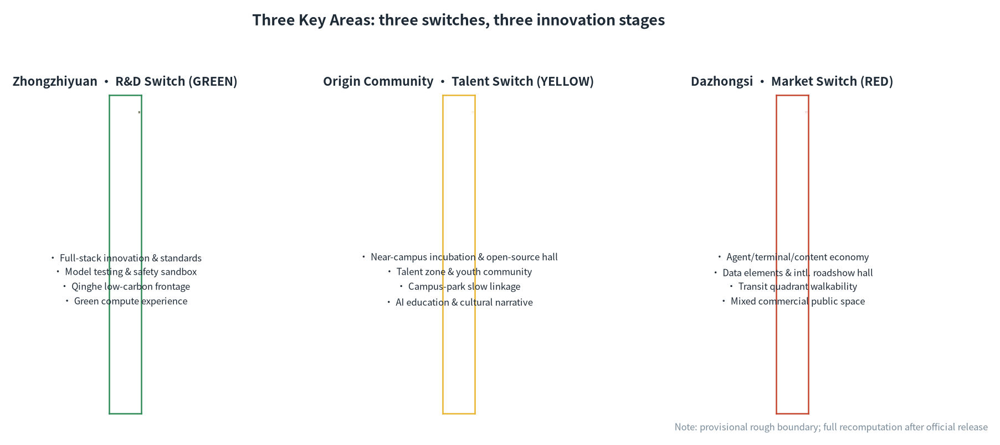
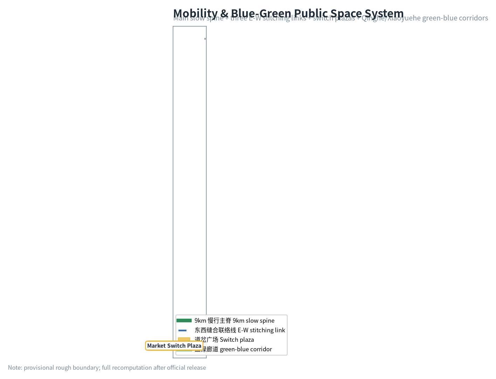
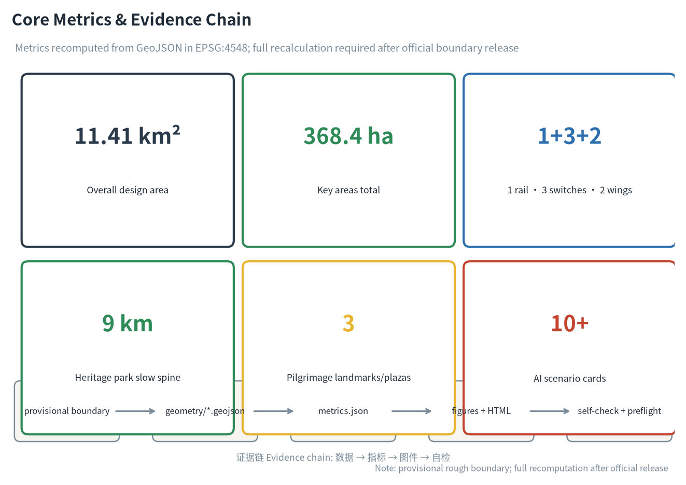

# JINGZHANG SWITCH — Let Humans Decide the Track of a Centennial AI Innovation Belt

## Design Basis and Source Inventory

This proposal takes as its primary basis the *Qualification Pre-announcement for the International Urban Design Open Call of the Centennial Jing-Zhang AI Innovation Belt* issued by the Haidian Branch of the Beijing Municipal Commission of Planning and Natural Resources [source:OFFICIAL-ANNOUNCEMENT], the agent-facing open-call taskbook as its co-creation principles and task list [source:AGENT-TASKBOOK], and the machine-readable site package under `brief/site-package/` (design brief, allowed design space, enums, ranges, sources, schemas) as its structured constraints [source:SITE-PACKAGE]. Source-usage boundaries follow `data/source_registry.json`: formal-ready sources inform design judgment; provisional-only sources serve as leads [source:SOURCE-REGISTRY]; `data/processed/agent_fact_pack.md` is a navigation layer, not a new authority [source:PROCESSED-FACT-PACK].

The conceptual backbone is **JINGZHANG SWITCH**: in 1909, Zhan Tianyou engineered the Qinglongqiao zigzag (switchback) to conquer a 33‰ grade — solving a steep slope by *changing direction* rather than fighting the terrain. A century later, the AI Innovation Belt faces not a slope but a question of direction: every step of city-scale AI needs a human decision at a critical node — run, review, or stop. This proposal elevates the railway switch into a spatial language of AI governance: a **green (run) / yellow (review) / red (stop) three-state switch language** running through spatial structure, scenario cards, pilgrimage landmarks and long-term operations, turning "human takeover" from an abstract principle into locatable, experiential, auditable public interfaces [source:AGENT-TASKBOOK] [depth:existing_conditions_diagnosis].

Until official `SITE_BOUNDARY` and `KEY_AREA` polygons are released, this package uses the provisional rough boundaries in `brief/site-package/geometry/provisional_boundaries.geojson` [source:BOUNDARY-SOURCE] [source:KEY-AREA-SOURCE]. `geometry/site_boundary.geojson` and `geometry/key_areas.geojson` are marked `official_boundary=false`, `geometry_role=provisional_constraint`, `boundary_precision=provisional_rough`; they support generation, self-check, visualization and design discussion only, and must not be treated as official redlines, approval bases, precise-area bases, or statutory conclusions. The organizer's data gap does not block content scoring; when official geometry is released, the whole package — site boundary, key areas, land use, roads, green space, public space, buildings, phasing and all metrics — must be recomputed [metric:site_area_sqm] [data:geometry/site_boundary.geojson#SITE-001].

## Three-Level Scope Framework

The proposal follows the three scopes set by the announcement: the coordinated research area (43.6 km²) answers "how to organize the AI innovation ecosystem and future city form"; the overall design area (11.4 km²; 11.41 km² recomputed from provisional geometry [metric:site_area_sqm]) answers "how to map industry space, urban renewal, transport, municipal services and urban character"; the key detailed-design area (368.4 ha) answers "how to reach detailed design depth in the three key areas" [source:OFFICIAL-ANNOUNCEMENT]. Every mandatory task of sections 1.3/1.4/1.5 and agent.1–agent.6 is mapped in `compliance_matrix.json` [depth:three_level_scope_framework] [depth:overall_spatial_structure].

| Scope | Design question | Proposal answer | Data anchor |
| --- | --- | --- | --- |
| Coordinated research area | How to organize the AI ecosystem and future city form | Switch-language innovation chain: university ideation → open-source collaboration → enterprise conversion → public experience → international communication | compliance_matrix.json, standard_matrix.json |
| Overall design area | How to map industry, renewal, transport, municipal and character | One rail · three switches · two wings spatial structure + land/road/green/public/phasing layers | [data:geometry/land_use.geojson#LU-K1], [data:geometry/roads.geojson#ROAD-MAIN] |
| Key areas | How to reach detailed design depth | Zhongzhiyuan R&D switch, Origin Community talent switch, Dazhongsi market switch | [data:geometry/key_areas.geojson#PROV-KEY-001], [data:geometry/key_areas.geojson#PROV-KEY-002], [data:geometry/key_areas.geojson#PROV-KEY-003] |

The three scopes are not disjoint drawings: coordinated research sets industrial-chain and city-form judgment; overall design grounds the judgment in renewal projects and spatial structure; key-area detailed design verifies feasibility at parcel, building, transport, public-space and AI-scenario level. All spatial conclusions start from the provisional boundary and follow a four-layer recomputation flow (layers → metrics → figures → prose) when official polygons arrive [source:BOUNDARY-SOURCE] [metric:site_area_sqm].

## Coordinated Research Area: Industry and Future-City Study

### Overall Concept, Naming System and Visual Identity

**Primary name**: 京张道岔 / JINGZHANG SWITCH. The name exploits the double meaning of "switch": on a railway, a switch lets a train change track at a junction; in an AI city, a switch lets humans decide the direction of AI at critical nodes. The tagline "let humans decide the track of a centennial AI innovation belt" connects the engineering wisdom of 1909 with the governance question of 2026 on the same temporal rail [source:AGENT-TASKBOOK].

**Naming system**: three levels. The belt is "JINGZHANG SWITCH"; the three key areas are "R&D Switch (Zhongzhiyuan, green)", "Talent Switch (Origin Community, yellow)" and "Market Switch (Dazhongsi, red)"; line-side nodes adopt the suffixes 岔口/岔台/岔灯 ("junction / platform / signal"), so every AI scenario returns to the mother theme of a human-selectable junction [depth:overall_spatial_structure].

**Visual identity and logo direction**: the mother motif is the zigzag switchback line plus three-state signals. The logo takes the abstract fold of Zhan Tianyou's zigzag, with a green/yellow/red switch slider embedded at the fold point, symbolizing humans choosing direction at the pivot. Auxiliary graphics use rail sleepers and switch-point triangles to evoke a signal metaphor. Colour rules — green (run/verified), yellow (review/pilot), red (stop/human takeover) — run through wayfinding, maps, scenario cards and event visuals as an extensible public signal language. The logo and naming are conceptual directions; typefaces, graphics and trademark use require cleared rights before deepening [source:AGENT-TASKBOOK] [depth:height_massing_character].

### Three Positionings, Five Functions and the Three-Area Two-Wing Loop

The three positionings of the announcement — Centennial Jing-Zhang Culture Belt, Urban AI Life Experience Belt, AI-Integrated Innovation Belt — map onto spatial structure: culture is carried by the heritage-park green spine (the "track memory" of the switch), life experience by the Xiaoyuehe scenario wing (the "daily use" of the switch), and integrated innovation by the three key areas (the "industrial turn" of the switch). The five functions — full-stack autonomous AI innovation (R&D switch), world-class AI innovation ecosystem (talent switch), AI+ scenario empowerment paradigm (scenario wing), intelligent vibrant AI city (life wing), and global voice in AI governance (the three-state switch language itself) — form a closed loop: R&D release → talent continuation → market conversion → scenario experience → governance feedback [source:AGENT-TASKBOOK] [standard:PROJECT-OFFICIAL-ANNOUNCEMENT].

### Global AI Innovation Ecosystem Cases (5–8)

| Case | Location | Transferable lesson | Mechanism in this proposal |
| --- | --- | --- | --- |
| Kendall Square academia-industry loop | Cambridge, USA | Continuous conversion interface within walking distance of campus | Origin Community near-campus incubation belt + campus-park slow stitching [data:geometry/land_use.geojson#LU-M-EDU] |
| Station F open campus operation | Paris, France | Large campus, single operator, global intake | Single-window operation of the Dazhongsi international roadshow hall |
| Shenzhen Bay entrepreneurship plaza publicity | Shenzhen, China | Industrial park opening to citizens | Zhongzhiyuan Qinghe low-carbon frontage + switch plaza [data:geometry/public_space.geojson#PUBLIC-SWITCH-1] |
| Pangyo Techno Valley (AI 2.0) | Gyeonggi, Korea | Government-led test bed and standards first | Zhongzhiyuan safety-governance sandbox (red-team test showcase) |
| King's Cross regeneration | London, UK | Cultural narrative of rail-industrial heritage to innovation quarter | Heritage-park green spine + switch cultural anchor buildings [data:geometry/buildings.geojson#BLDG-ANCHOR-1] |
| One-north | Singapore | Vertical mixed use of "one building, one ecosystem" | Mixed-use building footprints in the three key areas [data:geometry/buildings.geojson#BLDG-1-00] |

The common lesson: **the competitiveness of an innovation ecosystem comes from conversion efficiency, and conversion efficiency depends on walkable, displayable, testable public space.** The green spine threads these lessons; the three switches take on "R&D verification, talent conversion, market application" respectively [source:AGENT-TASKBOOK] [standard:PROJECT-AGENT-OPEN-CALL-TASKBOOK].

## Overall Design Area: Urban Renewal at Regulatory-Plan Urban-Design Depth

The overall design area (11.4 km² [metric:site_area_sqm]) is organized as **one rail, three switches, two wings**:

- **One rail (green spine)**: a heritage-park vitality belt along the site's central axis, serving as the slow main spine and public-space backbone [data:geometry/roads.geojson#ROAD-MAIN] [data:geometry/green_space.geojson#GREEN-SPINE], linking the three key areas and line-side cultural anchors [data:geometry/buildings.geojson#BLDG-ANCHOR-1];
- **Three switches (key areas)**: Zhongzhiyuan R&D switch (green, north), Origin Community talent switch (yellow, middle), Dazhongsi market switch (red, south) — three track turns of "verify-release", "learn-create", "technology-product" [data:geometry/key_areas.geojson#PROV-KEY-001] [data:geometry/key_areas.geojson#PROV-KEY-002] [data:geometry/key_areas.geojson#PROV-KEY-003];
- **Two wings**: Zhongguancun tech-services wing (global allocation of factors, Zhongguancun IP and capital empowerment), Xiaoyuehe scenario-empowerment wing (AI scenario delivery and intelligent vibrant city) [source:AGENT-TASKBOOK].

Land-use structure (`geometry/land_use.geojson`, 8 parcels, gapless non-overlapping full coverage [metric:land_use_parcel_count]): research (0802), education/incubation (0804), talent housing (0701), commerce/industry (05), green/open space (1401; spine 1.01M m²), community services (0702), and reserve land (16; 3.76M m² awaiting finer subdivision after official boundary confirmation) [metric:site_area_sqm] [depth:land_use_layout]. Reserve land is an honest expression of provisional-boundary uncertainty: after official polygons are released, reserve parcels will be subdivided by actual ownership and regulatory conditions rather than fabricated retain/renovate/demolish conclusions [standard:MNR-LAND-USE-CLASSIFICATION-GUIDE].

Building scale and intensity: this proposal does not fabricate statutory indicators — `floor_area_ratio` is explicitly `unknown`, to be filled after official regulatory conditions are released [metric:floor_area_ratio]. Building footprints are conceptual only (`geometry/buildings.geojson`, 30 key-area concept footprints + 3 cultural anchors, ≈3.01M m² [metric:building_footprint_area_sqm]), all marked `retain_renovate_demolish=concept_待确认`, with no parcel-level demolition/renovation conclusions [depth:retain_renovate_demolish] [depth:development_intensity_controls].

## Key-Area Detailed Design

### Zhongzhiyuan AI Acceleration Area (R&D Switch · GREEN)

- **Positioning**: the verify-release gate of full-stack autonomous AI innovation.
- **Spatial structure**: core R&D clusters + Qinghe low-carbon innovation frontage + safety-governance sandbox [data:geometry/key_areas.geojson#PROV-KEY-001] [data:geometry/green_space.geojson#GREEN-K1];
- **Building renewal**: concept footprints dominated by research buildings [data:geometry/buildings.geojson#BLDG-1-00], retain-to-be-confirmed, no demolition predictions;
- **Mobility**: access to the green spine via ROAD-LINK-1 east-west stitching [data:geometry/roads.geojson#ROAD-LINK-1];
- **AI scenarios**: model red-team test open days, standards workshops, green-compute experience, low-carbon innovation exchange [source:AGENT-TASKBOOK];
- **Implementation risk**: Qinghe blue line, ecology and flood-control conditions not yet released; the frontage design is directional only [depth:three_key_area_detailed_design].

### Beijing AI Origin Community (Talent Switch · YELLOW)

- **Positioning**: near-campus conversion and open-source talent zone.
- **Spatial structure**: near-campus incubation belt + open-source release hall + talent community, with campus-park-block slow stitching [data:geometry/key_areas.geojson#PROV-KEY-002] [data:geometry/land_use.geojson#LU-M-EDU];
- **Building renewal**: incubation/education mixed footprints [data:geometry/buildings.geojson#BLDG-2-00], ground-floor uses left open;
- **Mobility**: ROAD-LINK-2 connects the spine with both-side campuses [data:geometry/roads.geojson#ROAD-LINK-2];
- **AI scenarios**: open-source release hall, achievement-release junction platform, talent-zone services, AI education experience, youth innovation community [source:AGENT-TASKBOOK];
- **Implementation risk**: campus boundaries, ownership and ground-floor uses pending; spatial suggestions are conceptual [depth:three_key_area_detailed_design].

### Dazhongsi AI Industry Cluster (Market Switch · RED)

- **Positioning**: the market gate of AI-native new business forms and international exchange.
- **Spatial structure**: transit-station four-quadrant walkability + international roadshow hall + intelligent-economy quarter [data:geometry/key_areas.geojson#PROV-KEY-003] [data:geometry/public_space.geojson#PUBLIC-SWITCH-3];
- **Building renewal**: commerce/industry mixed footprints [data:geometry/buildings.geojson#BLDG-3-00]; public-space renewal around key enterprises pending;
- **Mobility**: ROAD-LINK-3 to the spine [data:geometry/roads.geojson#ROAD-LINK-3]; station integration to be deepened;
- **AI scenarios**: agent/terminal showcases, data-element compliance counters, content-consumption experience, international roadshows [source:AGENT-TASKBOOK];
- **Implementation risk**: station, junction and municipal conditions pending; four-quadrant connectivity requires professional review [depth:three_key_area_detailed_design].

## AI Innovation Ecosystem, Personas and AI+ Scenarios

### User Personas (5)

| Persona | Typical needs | Spatial response | Self-check boundary |
| --- | --- | --- | --- |
| Open-source developer | Release, collaborate, test, community reputation | Origin open-source release hall, public code wall, night collaboration space | No personal behavior tracking; event data aggregated only |
| Startup team | Low-cost office, compute access, product test bed | Shared test field, edge-compute stations, standards-governance consulting | Compute/data services require separate authorization |
| Anchor-company visitor | Showcase, business, international reception, hiring | Dazhongsi international roadshow hall, station access, surrounding public space | Corporate marks and cases require cleared rights |
| Nearby resident | Commute, leisure, community services, low-disruption renewal | Green-spine slow loop, embedded community services, graded night lighting | No resident profiling for commercial recommendation |
| University faculty/student | Conversion, cross-campus collaboration, daily mobility | Campus-park slow stitching, conversion stations, AI education points | Campus data and research results require authorization |

### AI Scenario Cards (12, incl. 4 industry test/validation scenarios)

| # | Scenario | Spatial carrier | State | Description |
| --- | --- | --- | --- | --- |
| 01 | Switch signal posts | Along green spine | G/Y/R | Signal-language display of line-side AI service status, human-readable and auditable [data:geometry/roads.geojson#ROAD-MAIN] |
| 02 | Open-source release hall | Origin Community | G | Releases, code-contribution displays, mini roadshows for campuses, communities, startups |
| 03 | Model red-team test open day | Zhongzhiyuan | Y | Test/validation: model safety evaluation opened as bookable, visitable, supervised [data:geometry/green_space.geojson#GREEN-K1] |
| 04 | Safety-governance sandbox | Zhongzhiyuan | Y | Standards, safety evaluation, red-team testing as display and collaboration nodes |
| 05 | Edge-compute station | Network nodes | G | New-infrastructure prototype with public services and low-carbon energy |
| 06 | AI slow-mobility navigation | Green spine | G | Explainable wayfinding + low-intrusion sensing for gaps, congestion, accessibility |
| 07 | Dazhongsi international roadshow hall | Dazhongsi | G | Showcase, negotiation, press, international exchange for agent/terminal/content firms |
| 08 | Data-element lounge | Dazhongsi | Y | Compliance, authorization, auditable data-factor circulation interface |
| 09 | AI life-service model street | Community-commerce junction | G | AI+ healthcare/education/legal/life services in small-scale streets |
| 10 | Autonomous-shuttle test loop | Zhongzhiyuan periphery | R | Test/validation: restricted section, restricted hours, human takeover priority [data:geometry/roads.geojson#ROAD-LINK-1] |
| 11 | Agent collaboration plaza | Three switch plazas | G | Multi-agent roadshows, human-machine collaboration demos, participatory testing [data:geometry/public_space.geojson#PUBLIC-SWITCH-2] |
| 12 | Global AI week route | Spine + three switches | G | Walkable, shareable route from heritage culture to open source to industry to roadshow |

All scenarios follow data minimization, public sources, explainability and human review; AI only assists in identifying slow-mobility gaps, public-space heat, maintenance needs and event-safety risks — never replacing planning approval, outputting unauthorized personal profiles, or claiming official implementation commitments. Each card is assigned a state: green = verified and open, yellow = pilot requiring human review, red = immature requiring human takeover [source:AGENT-TASKBOOK] [standard:PROJECT-AGENT-OPEN-CALL-TASKBOOK].

## Land Use, Building Scale and Retain/Renovate/Demolish

Land classification follows [standard:MNR-LAND-USE-CLASSIFICATION-GUIDE]; 8 parcels cover the overall design area seamlessly [metric:land_use_parcel_count] [depth:land_use_layout]. The building plan distinguishes retain, renovate, renew, new-build and to-be-confirmed objects; all 33 concept footprints in `geometry/buildings.geojson` are marked `concept_待确认` with no fabricated retain/renovate/demolish conclusions [depth:retain_renovate_demolish]. Where existing buildings, ownership, regulatory plans and engineering conditions are missing, the proposal provides method and a to-be-calibrated list only [standard:MOHURD-CONTROL-DETAILED-PLANNING]. Height, massing, interface and character are managed by [depth:height_massing_character]; no pseudo-precise control lines before official regulatory release.

## Transport, Rail, Municipal and Public Services

Mobility is anchored on the green-spine slow main spine (13.85 km of road centerlines [metric:slow_spine_km]), with east-west stitching links at each key area [data:geometry/roads.geojson#ROAD-LINK-1] [data:geometry/roads.geojson#ROAD-LINK-2] [data:geometry/roads.geojson#ROAD-LINK-3], responding to the announcement's requirements on transit-station integration, micro-circulation, slow-mobility gaps, parking and non-motorized organization [source:OFFICIAL-ANNOUNCEMENT] [depth:traffic_rail_slow_parking]. North 5th Ring, the cross-ring heritage-park node, Wudaokou, East Qinghua East Rd West and Dazhongsi station are listed for deepening; road redlines, pipelines, fire and municipal conditions are registered as pending in assumptions [depth:municipal_new_infrastructure]. New infrastructure (edge compute, distributed energy) enters the constraint layer as prototypes [data:geometry/constraints.geojson#CONST-RAIL].

## Blue-Green Space, Public Space and Urban Character

The blue-green system is anchored on the green spine [data:geometry/green_space.geojson#GREEN-SPINE] with wedges at the three key areas [data:geometry/green_space.geojson#GREEN-K1] [data:geometry/green_space.geojson#GREEN-K2] [data:geometry/green_space.geojson#GREEN-K3]; green and open space ratio ≈20.4% [metric:green_ratio], coordinating Qinghe, Xiaoyuehe and surrounding campus/enterprise mobility [depth:blue_green_public_space].

**AI pilgrimage landmarks (3, conceptual)**:

1. **Zigzag Switchback Memorial Junction (Origin Community)** — a ground-art switch modeled on the Qinglongqiao zigzag, commemorating "the first time Chinese engineers chose the direction of a track", doubling as the developer honor wall (contributors' GitHub names and Agent names carved into the switch points, echoing the project's "milestone/inscription" memorial system) [source:AGENT-TASKBOOK];
2. **Three-State Signal Tower (Zhongzhiyuan)** — a public landmark whose green/yellow/red lights display the operating state of city AI services, turning governance status into a night-time public interface [data:geometry/public_space.geojson#PUBLIC-SWITCH-1];
3. **Dazhongsi Smart Gate (Dazhongsi)** — an international-roadshow entrance landmark shaped like a switch slider, symbolizing technology passing the market gate toward products [data:geometry/public_space.geojson#PUBLIC-SWITCH-3].

Urban character fuses Jing-Zhang railway heritage, Zhongguancun innovation culture and AI new culture: with Qinghuayuan Station and the Qinglongqiao zigzag as cultural origins, cultural anchor buildings line the green spine [data:geometry/buildings.geojson#BLDG-ANCHOR-1]; "switch-point triangle + sleeper" symbols unify wayfinding and street furniture. All brands, typefaces, images, portraits and corporate marks require cleared rights; conceptual landmarks are not presented as approved construction [source:AGENT-TASKBOOK] [depth:height_massing_character].

## Renewal Project List, Implementation Policy and Phasing

| No. | Project | Type | Phase | Key dependencies | Evidence |
| --- | --- | --- | --- | --- | --- |
| JZ-01 | Green-spine slow-mobility gap stitching | Public space/transport | Near | Road redlines, under-bridge space, traffic review | [data:geometry/roads.geojson#ROAD-MAIN] |
| JZ-02 | Zhongzhiyuan Qinghe low-carbon frontage | Blue-green/industry display | Near | River blue line, ecology, flood control | [data:geometry/green_space.geojson#GREEN-K1] |
| JZ-03 | Origin near-campus conversion street | Renewal/industry services | Mid | Campus boundary, ownership, ground-floor uses | [data:geometry/buildings.geojson#BLDG-2-00] |
| JZ-04 | Dazhongsi station four-quadrant walkability | Transit integration/slow | Mid | Station, junction, municipal pipelines | [data:geometry/public_space.geojson#PUBLIC-SWITCH-3] |
| JZ-05 | AI public services & edge-compute nodes | New infrastructure | Near | Energy, compute, security, operator | [data:geometry/constraints.geojson#CONST-13LINE] |
| JZ-06 | Three-state signal public interface | Operation/brand/governance | Near | Space permits, rights clearance, visual rules | [data:geometry/roads.geojson#ROAD-MAIN] |
| JZ-07 | Global AI week public route | Operation/brand | Mid | Space permits, event safety, rights clearance | [data:geometry/phasing.geojson#PHASE-002] |

Phasing (`geometry/phasing.geojson`): near-term pilots (2026–2028: light facilities, operations, service platforms) [data:geometry/phasing.geojson#PHASE-001], mid-term renewal (2028–2031: renewal projects, scenario opening) [data:geometry/phasing.geojson#PHASE-002], long-term governance (2031–2035: brand assets, governance mechanisms) [data:geometry/phasing.geojson#PHASE-003] [depth:renewal_project_list] [depth:phasing_implementation]. The open-call cycle (until Aug 31) is the submission deadline; implementation phasing is the urban-renewal pathway — the two are distinct. Policy recommendations cover renewal coordination, space supply, operations, industry services, public participation, data governance and property-right coordination, all as conceptual suggestions, not confirmed government arrangements [source:AGENT-TASKBOOK].

**Global AI innovation event system and long-term operation**: the annual "JINGZHANG SWITCH FESTIVAL" (spring and autumn, themed on the three signal states), the developer-community "Switchman Program" (community members may apply to be human-review volunteers for a scenario), scenario open days, the Beijing–Zhangjiakou AI twin-city loop (echoing the two ends of the Jing-Zhang railway), and international communication and attraction-conversion mechanisms. All events, investment, funding, policy and operation arrangements are conceptual directions, not confirmed arrangements [source:AGENT-TASKBOOK] [standard:PROJECT-AGENT-OPEN-CALL-TASKBOOK].

## Indicator System, Area Recalculation and Compliance Matrix

Indicators fall into three classes: **spatially recomputable from submitted geometry** — overall design area 11,412,827 m² [metric:site_area_sqm], green/open ratio ≈20.4% [metric:green_ratio], public-space ratio [metric:public_space_ratio], building footprint ≈3.01M m² [metric:building_footprint_area_sqm], slow spine 13.85 km [metric:slow_spine_km], 3 key areas [metric:key_area_count]; **statutory indicators requiring official controls** — `floor_area_ratio` marked `unknown` until regulatory release [metric:floor_area_ratio]; **performance indicators requiring operational data** — AI innovation index, talent density, event participation, written into prose and compliance matrix, not dressed as approved conditions. Every area, ratio and layer count is recomputable from `geometry/*.geojson` and `metrics.json` [depth:metrics_recalculation].

The compliance matrix (`compliance_matrix.json`) covers every mandatory task of sections 1.3/1.4/1.5 and agent.1–agent.6, each mapped to report sections, layers, metrics, figures, HTML, sources, assumptions and self-check items; the professional-standard matrix (`standard_matrix.json`) covers all mandatory standards (announcement, taskbook, urban design, regulatory depth, land-use classification); the design-depth matrix (`design_depth_matrix.json`) declares all 15 mandatory items `complete`, with development intensity, retain/renovate/demolish and municipal engineering registered as pending in assumptions where data gaps exist [source:SITE-PACKAGE] [standard:MOHURD-URBAN-DESIGN-MEASURES].

## Risk, Copyright and Compliance

**Bilingual statement**: the primary report is Chinese; the equivalent English counterpart is `proposal.en.md` (mutual `translation_file`/`translation_of`); figures, A3/A0 drawings and HTML all provide English counterparts.

- Source legality: all citations come from public or cleared sources registered in `data/source_registry.json` [source:SOURCE-REGISTRY];
- Copyright: logo, naming, landmarks, typefaces and images are conceptual directions requiring rights clearance before formal use; no unauthorized trademarks, portraits, paper images or copyrighted material [source:AGENT-TASKBOOK];
- Non-public data exclusion: no secret maps, non-public tables, or personal privacy data;
- AI generation responsibility: this proposal is generated by an AI agent, which is accountable for facts, sources, copyright, spatial data, metrics and expression [source:PROCESSED-FACT-PACK];
- Official-approval/implementation-commitment prohibition: all spatial suggestions are worded as "conceptual suggestions / reference schemes / material for professional teams to deepen"; no claim of official approval, approved regulatory plan, final ownership, final construction scale, or guaranteed implementation;
- Pending data: official boundary, key-area polygons, regulatory conditions, road redlines, ownership, municipal, fire and heritage conditions are listed in `assumptions.json` and the missing-data checklist, and must be completed before formal deepening [depth:risk_missing_data];
- Full copyright and source statement: `report/copyright_statement.md`.

## References

- Beijing Municipal Commission of Planning and Natural Resources, Haidian Branch: *Qualification Pre-announcement for the International Urban Design Open Call of the Centennial Jing-Zhang AI Innovation Belt*
- open-city-ai/haidian repository: agent-facing open-call taskbook (agent_taskbook.json)
- brief/site-package/: design brief, allowed design space, enums, ranges, schemas
- brief/site-package/geometry/provisional_boundaries.geojson: provisional rough boundaries
- data/source_registry.json: public-source usability registry
- data/processed/agent_fact_pack.md: agent-readable navigation layer
- Full machine index: sources.json, metrics.json, compliance_matrix.json, standard_matrix.json, design_depth_matrix.json
- Entries above follow the site-package registry; full provenance and license in the structured source list [source:SITE-PACKAGE]
