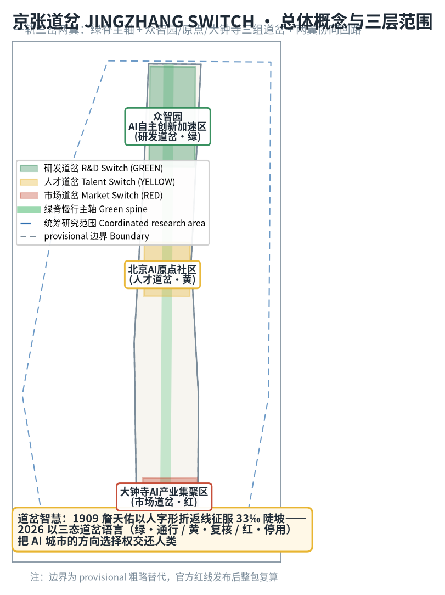
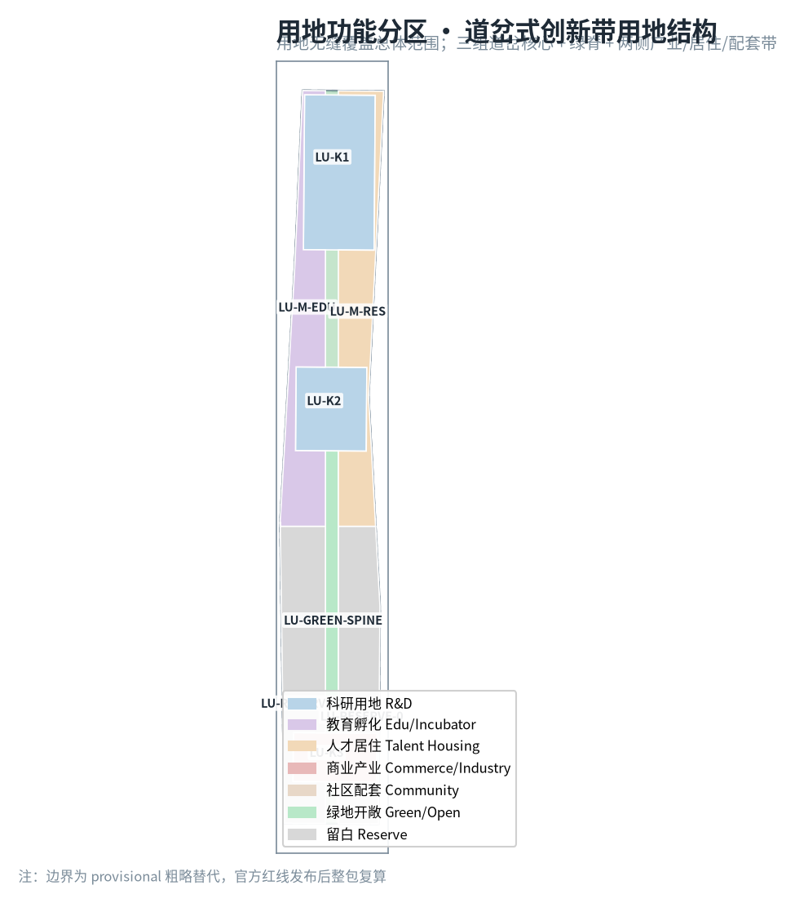
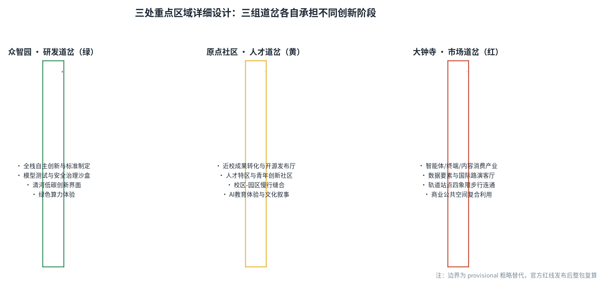
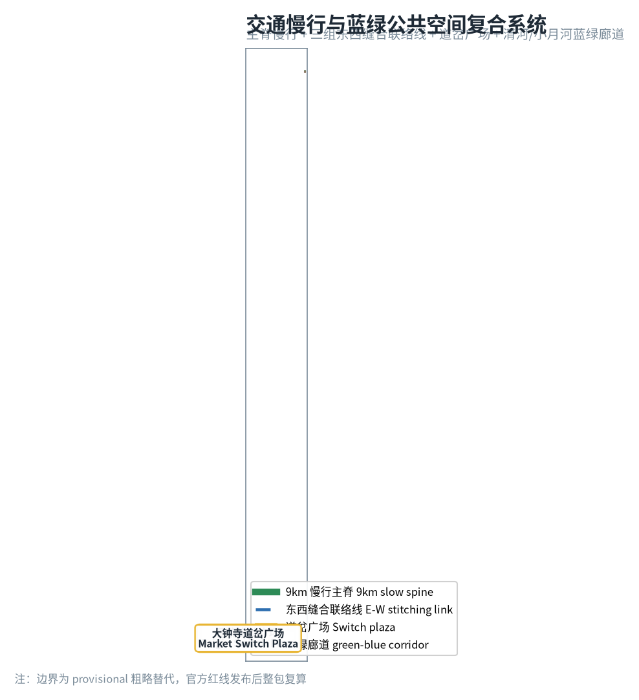
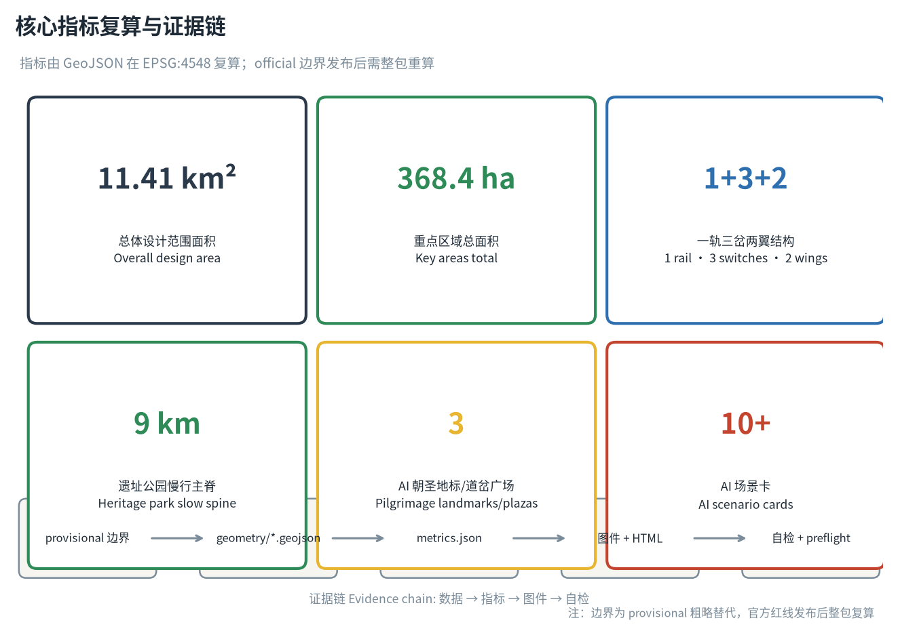

# 京张道岔 JINGZHANG SWITCH——让人类决定轨道的百年AI创新带

## 设计依据与资料清单

本方案以北京市规划和自然资源委员会海淀分局发布的《百年京张AI创新带城市设计国际方案征集资格预审公告》为第一依据 [source:OFFICIAL-ANNOUNCEMENT]，以面向智能体开源征集任务书 [source:AGENT-TASKBOOK] 为共创原则与任务清单，以 `brief/site-package/` 的机器可读场地包（设计任务、允许设计空间、枚举、指标区间、来源清单与 schema）为结构化约束 [source:SITE-PACKAGE]。资料用途边界按 `data/source_registry.json` 区分：formal 可用资料用于设计判断，provisional-only 资料仅作线索 [source:SOURCE-REGISTRY]；`data/processed/agent_fact_pack.md` 是本方案的阅读导航层，不是新权威来源 [source:PROCESSED-FACT-PACK]。

本方案采用的概念骨架是**京张道岔（JINGZHANG SWITCH）**：1909 年詹天佑主持修建京张铁路，在青龙桥以人字形折返线把 33‰ 陡坡化为两次折返，用"改变轨道方向"而非"对抗地形"征服了关沟天险——这是中国工程师第一次用道岔智慧解决工程难题。一百年后，AI 创新带面对的不是陡坡而是方向问题：城市级 AI 每向前一步，都需要人类在关键节点决定"放行、复核还是停用"。因此本方案把道岔从铁路构件升维为 AI 城市治理的空间语言，用**绿（通行）/黄（复核）/红（停用）三态道岔语言**贯穿空间结构、场景卡、朝圣地标与长期运营，让"人工接管"从抽象原则变成可定位、可体验、可复核的城市公共界面 [source:AGENT-TASKBOOK] [depth:existing_conditions_diagnosis]。

本方案在官方 `SITE_BOUNDARY` 与三处 `KEY_AREA` 正式多边形发布前，使用 `brief/site-package/geometry/provisional_boundaries.geojson` 的临时粗略边界 [source:BOUNDARY-SOURCE] [source:KEY-AREA-SOURCE]。提交包中 `geometry/site_boundary.geojson` 与 `geometry/key_areas.geojson` 均标注 `official_boundary=false`、`geometry_role=provisional_constraint`、`boundary_precision=provisional_rough`，只能用于方案生成、自检、可视化和设计讨论，不能作为官方红线、审批依据、精确面积依据或法定控制结论。组织方数据缺口不阻断内容评分；官方几何发布后，site boundary、key areas、land use、roads、green space、public space、buildings、phasing 及全部指标需整包重算 [metric:site_area_sqm] [data:geometry/site_boundary.geojson#SITE-001]。

## 三层范围工作框架

方案按照公告确定的三层范围组织：统筹研究范围（43.6 km²）回答"AI 创新生态与未来城市形态如何组织"；总体设计范围（11.4 km²，provisional 复算 11.41 km²）回答"产业空间、城市更新、交通市政与风貌如何落图"；重点区域范围（368.4 公顷）回答"三处重点片区如何达到详细设计深度" [source:OFFICIAL-ANNOUNCEMENT] [metric:site_area_sqm]。三层范围在 `compliance_matrix.json` 中逐条映射公告 1.3/1.4/1.5 与 agent.1–agent.6 必选任务 [depth:three_level_scope_framework] [depth:overall_spatial_structure]。

| 层级 | 设计问题 | 方案回答 | 数据落点 |
| --- | --- | --- | --- |
| 统筹研究范围 | AI产业生态和未来城市形态如何组织 | 以道岔语言建立"高校策源-开源协作-企业转化-公共体验-国际传播"创新链 | compliance_matrix.json、standard_matrix.json |
| 总体设计范围 | 产业空间、城市更新、交通市政和风貌如何落图 | 一轨三岔两翼空间结构 + 用地/道路/绿地/公共空间/分期图层 | [data:geometry/land_use.geojson#LU-K1]、[data:geometry/roads.geojson#ROAD-MAIN] |
| 重点区域范围 | 三处片区如何达到详细设计深度 | 众智园研发道岔、原点社区人才道岔、大钟寺市场道岔 | [data:geometry/key_areas.geojson#PROV-KEY-001]、[data:geometry/key_areas.geojson#PROV-KEY-002]、[data:geometry/key_areas.geojson#PROV-KEY-003] |

三层范围不是割裂图纸：统筹研究决定产业链与城市形态判断，总体设计把判断落到更新项目与空间结构，重点区域详细设计验证地块、建筑、交通、公共空间与 AI 场景的可实施性。本方案所有空间结论均以 provisional 边界为起点，官方 polygon 发布后按"图层-指标-图件-正文"四层重算流程整包更新，不单独替换单个文件 [source:BOUNDARY-SOURCE] [metric:site_area_sqm]。

## 统筹研究范围产业与未来城市研究

### 总体概念、命名体系与视觉识别

**主名称**：京张道岔（JINGZHANG SWITCH）。命名取"道岔"的双重语义——铁路构件上，道岔让列车在岔口变换轨道；AI 城市里，道岔让人类在关键节点决定 AI 的方向。主副标题"让人类决定轨道的百年 AI 创新带"把 1909 年的工程智慧与 2026 年的治理命题接在同一条时间轨道上 [source:AGENT-TASKBOOK]。

**命名体系**：三级结构。一带主名"京张道岔"；三处重点区分别命名"研发道岔（众智园，绿）""人才道岔（原点社区，黄）""市场道岔（大钟寺，红）"；沿线节点用"岔口/岔台/岔灯"三级词缀（如"开源岔口""发布岔台""信号岔灯"）统一命名，使每个 AI 场景都能在命名上回到"人可选择的岔口"这一母题 [depth:overall_spatial_structure]。

**视觉识别与 Logo 方向**：以"人字形折返线 + 三态信号"为母题。Logo 主形取詹天佑人字形线路的抽象折线，折点处嵌入绿/黄/红三色道岔滑块，象征"人类在折点选择方向"；辅助图形用铁轨枕木与岔尖三角形构成信号灯隐喻。色彩规范：绿（通行/已验证）、黄（复核/试点）、红（停用/待人工接管），贯穿导视、地图、场景卡与活动视觉，形成一套可延展的公共信号语言。Logo 与命名均为概念方向，具体字库、图形与商标使用须经清权后深化 [source:AGENT-TASKBOOK] [depth:height_massing_character]。

### 三大定位、五大功能与三区两翼协同回路

方案把公告"百年京张文化带、都市AI生活体验带、AI融合创新带"三大定位落到空间结构：文化带由遗址公园绿脊承载（道岔的"轨道记忆"），生活体验带由小月河场景赋能翼承载（道岔的"日常使用"），融合创新带由三处重点区承载（道岔的"产业转向"）。五大功能——AI全栈自主创新体系（研发道岔）、世界级AI创新生态（人才道岔）、AI+场景赋能新范式（场景翼）、智能化AI活力城市（生活翼）、AI治理全球话语权（三态道岔语言本身）——形成"研发放行→人才接续→市场转化→场景体验→治理反馈"的闭环回路 [source:AGENT-TASKBOOK] [standard:PROJECT-OFFICIAL-ANNOUNCEMENT]。

### 全球 AI 创新生态案例（5–8 例）

| 案例 | 地点 | 可转化的经验 | 落到本方案的机制 |
| --- | --- | --- | --- |
| Kendall Square 产学研闭环 | 美国剑桥 | 高校-园区步行距离内的连续转化界面 | 原点社区近校孵化带 + 校区园区慢行缝合 [data:geometry/land_use.geojson#LU-M-EDU] |
| Station F 开放式园区运营 | 法国巴黎 | 大园区、单一运营主体、全球招生 | 大钟寺国际路演客厅的单一窗口运营机制 |
| 深圳湾创业广场公共性 | 中国深圳 | 产业园区向市民开放的公共界面 | 众智园清河低碳创新界面 + 道岔广场 [data:geometry/public_space.geojson#PUBLIC-SWITCH-1] |
| AI 2.0 时代韩国板桥 | 韩国京畿道 | 政府主导的测试床与标准先行 | 众智园安全治理沙盒（红队测试展示） |
| 伦敦国王十字更新 | 英国伦敦 | 铁路工业遗址转型创新街区的文化叙事 | 遗址公园绿脊 + 道岔文化锚点建筑 [data:geometry/buildings.geojson#BLDG-ANCHOR-1] |
| 新加坡纬壹科技城 | 新加坡 | "一栋楼一个生态"的垂直混合 | 三处重点区混合功能建筑基底 [data:geometry/buildings.geojson#BLDG-1-00] |

这些案例的共同经验是：**创新生态的竞争力来自"转化效率"，而转化效率依赖可步行、可展示、可试错的公共空间**。本方案以绿脊串联案例经验，以三组道岔分别承接"研发验证、人才转化、市场应用"三种转化 [source:AGENT-TASKBOOK] [standard:PROJECT-AGENT-OPEN-CALL-TASKBOOK]。

## 总体设计范围城市更新与控规深度城市设计

总体设计范围以"一轨三岔两翼"组织 11.4 km² [metric:site_area_sqm]：

- **一轨（绿脊）**：沿场地中轴布置的遗址公园活力带，作为慢行主脊与公共空间主轴 [data:geometry/roads.geojson#ROAD-MAIN] [data:geometry/green_space.geojson#GREEN-SPINE]，串联三处重点区与沿线文化锚点 [data:geometry/buildings.geojson#BLDG-ANCHOR-1]；
- **三岔（三处重点区）**：北端众智园研发道岔（绿）、中部原点社区人才道岔（黄）、南端大钟寺市场道岔（红），分别承担"验证-放行""学习-创造""技术-产品"三种轨道转向 [data:geometry/key_areas.geojson#PROV-KEY-001] [data:geometry/key_areas.geojson#PROV-KEY-002] [data:geometry/key_areas.geojson#PROV-KEY-003]；
- **两翼**：中关村科技服务翼（要素全球化配置、中关村IP与资本赋能）、小月河场景赋能翼（AI 场景落地与智能化活力城市）[source:AGENT-TASKBOOK]。

用地结构（`geometry/land_use.geojson`，8 个分区无缝覆盖总体范围，无缝隙无重叠 [metric:land_use_parcel_count]）：科研用地（0802，含众智园核心 297.2 万 m² 中主要部分）、教育孵化（0804）、人才居住（0701）、商业产业（05）、绿地开敞（1401，绿脊 101.4 万 m²）、社区配套（0702）、留白用地（16，376.2 万 m² 待正式边界复核后细分）[metric:site_area_sqm] [depth:land_use_layout]。留白用地是本方案对 provisional 边界不确定性的诚实表达：官方 polygon 发布后，留白将按实际权属与控规条件细分，不预先编造拆改留结论 [standard:MNR-LAND-USE-CLASSIFICATION-GUIDE]。

建筑规模与开发强度：本方案不编造容积率、建筑高度、建筑密度等法定指标——`floor_area_ratio` 明确标注 `unknown`，待官方控规条件发布后填充 [metric:floor_area_ratio]。建筑基底仅以概念性 footprint 表达（`geometry/buildings.geojson`，30 个重点区概念基底 + 3 个文化锚点，总计约 302.1 万 m² [metric:building_footprint_area_sqm]），全部标注 `retain_renovate_demolish=concept_待确认`，不做地块级拆改留结论 [depth:retain_renovate_demolish] [depth:development_intensity_controls]。

## 重点区域详细设计

### 众智园 AI 自主创新加速区（研发道岔 · 绿）

- **定位**：AI 全栈自主创新的验证-放行闸口。
- **空间结构**：以"核心研发组团 + 清河低碳创新界面 + 安全治理沙盒"组织 [data:geometry/key_areas.geojson#PROV-KEY-001] [data:geometry/green_space.geojson#GREEN-K1]；
- **建筑更新**：概念基底以科研建筑为主 [data:geometry/buildings.geojson#BLDG-1-00]，保留待确认，不预判拆改；
- **交通慢行**：经 ROAD-LINK-1 与东西缝合联络线接入绿脊 [data:geometry/roads.geojson#ROAD-LINK-1]；
- **AI 场景**：模型红队测试开放日、标准制定工作坊、绿色算力体验、低碳创新交往 [source:AGENT-TASKBOOK]；
- **实施风险**：清河蓝线、生态与防洪条件未发布，相关界面设计仅作方向性建议 [depth:three_key_area_detailed_design]。

### 北京 AI 原点社区（人才道岔 · 黄）

- **定位**：近校成果转化与开源人才特区。
- **空间结构**：以"近校孵化带 + 开源发布厅 + 人才社区"组织，校区-园区-街区慢行缝合 [data:geometry/key_areas.geojson#PROV-KEY-002] [data:geometry/land_use.geojson#LU-M-EDU]；
- **建筑更新**：孵化与教育混合基底 [data:geometry/buildings.geojson#BLDG-2-00]，首层业态留白；
- **交通慢行**：经 ROAD-LINK-2 连接绿脊与两侧校区 [data:geometry/roads.geojson#ROAD-LINK-2]；
- **AI 场景**：开源发布厅、成果发布岔台、人才特区服务、AI 教育体验点、青年创新社区 [source:AGENT-TASKBOOK]；
- **实施风险**：校区边界、权属与首层业态待确认，相关空间建议属概念方向 [depth:three_key_area_detailed_design]。

### 大钟寺 AI 产业集聚区（市场道岔 · 红）

- **定位**：智能原生新业态与国际交往的市场闸口。
- **空间结构**：以"大钟寺站四象限步行连通 + 国际路演客厅 + 智能经济街区"组织 [data:geometry/key_areas.geojson#PROV-KEY-003] [data:geometry/public_space.geojson#PUBLIC-SWITCH-3]；
- **建筑更新**：商业产业混合基底 [data:geometry/buildings.geojson#BLDG-3-00]，重点企业周边公共空间更新待确认；
- **交通慢行**：经 ROAD-LINK-3 连接绿脊 [data:geometry/roads.geojson#ROAD-LINK-3]，轨道站点一体化待深化；
- **AI 场景**：智能体/智能终端展示、数据要素合规柜台、内容消费体验、国际路演 [source:AGENT-TASKBOOK]；
- **实施风险**：轨道站点、道路交叉口与市政管线条件待发布，四象限连通方案需专业复核 [depth:three_key_area_detailed_design]。

## AI 创新生态、人才画像与 AI+ 场景

### 用户画像（5 类）

| 用户画像 | 典型需求 | 空间响应 | 自检边界 |
| --- | --- | --- | --- |
| 开源开发者 | 发布、协作、测试、社区声誉 | 原点社区开源发布厅、公共代码墙、夜间协作空间 | 不采集个人行为轨迹；活动数据只做聚合统计 |
| 初创团队 | 低成本办公、算力入口、产品试验场 | 众智园共享测试场、端侧算力驿站、标准治理咨询 | 算力和数据服务需另行授权 |
| 头部企业访客 | 展示、商务、国际接待、人才招聘 | 大钟寺国际路演客厅、轨道站点接驳、企业周边公共空间 | 企业标识和案例须清权 |
| 周边居民 | 通勤、休闲、社区服务、低扰动更新 | 绿脊慢行环、社区服务嵌入、夜间照明分级 | 不将居民画像用于商业推荐 |
| 高校师生 | 成果转化、跨校协作、日常慢行 | 校区-园区慢行缝合、成果转化驿站、AI 教育体验点 | 校园数据和科研成果需授权 |

### AI 场景卡（12 张，其中 4 张产业测试验证场景）

| # | 场景卡 | 空间载体 | 三态 | 设计说明 |
| --- | --- | --- | --- | --- |
| 01 | 道岔信号灯柱 | 绿脊沿线 | 绿/黄/红 | 用信号灯语言显示沿线 AI 服务的运行状态，人可读、可复核 [data:geometry/roads.geojson#ROAD-MAIN] |
| 02 | 开源发布厅 | 原点社区 | 绿 | 面向高校、开源社区与初创团队，成果发布、代码贡献展示、小型路演 |
| 03 | 模型红队测试开放日 | 众智园 | 黄 | 产业测试验证场景：模型安全评测以可预约、可参观、可监管方式开放 [data:geometry/green_space.geojson#GREEN-K1] |
| 04 | 安全治理沙盒 | 众智园 | 黄 | 标准制定、安全评测、红队测试转译为展示与协作节点 |
| 05 | 端侧算力驿站 | 总体范围节点 | 绿 | 与公共服务、低碳能源结合的新型基础设施原型 |
| 06 | AI 慢行导航 | 绿脊 | 绿 | 可解释导视 + 低侵入传感，识别慢行断点、拥挤节点与无障碍需求 |
| 07 | 大钟寺国际路演客厅 | 大钟寺 | 绿 | 智能体/终端/内容消费企业的展示、洽谈、媒体发布与国际交流 |
| 08 | 数据要素会客厅 | 大钟寺 | 黄 | 以合规、授权、可审计为前提的数据要素流通城市界面 |
| 09 | AI 生活服务样板街 | 社区商业交汇处 | 绿 | 医疗、教育、法律、生活服务 AI+ 场景落到小尺度街区 |
| 10 | 自动驾驶接驳测试环 | 众智园外围 | 红 | 产业测试验证场景：限定路段、限定时段、人工接管优先的自动驾驶测试 [data:geometry/roads.geojson#ROAD-LINK-1] |
| 11 | 智能体协作广场 | 三处道岔广场 | 绿 | 多智能体路演、人机协作演示、公共参与式测试 [data:geometry/public_space.geojson#PUBLIC-SWITCH-2] |
| 12 | 全球 AI 活动周路线 | 绿脊+三岔 | 绿 | 从遗址文化、开源社区、产业展示到国际路演的可步行传播路线 |

以上场景均遵守数据最小化、公开来源、可解释与人工复核原则；AI 只辅助识别慢行断点、公共空间热力、设施维护与活动安全风险，不替代规划审批、不输出未经授权的个人画像、不声称获得官方实施承诺。每张场景卡在三态中明确归属：绿=已验证可开放、黄=需人工复核的试点、红=未成熟须人工接管 [source:AGENT-TASKBOOK] [standard:PROJECT-AGENT-OPEN-CALL-TASKBOOK]。

## 用地、建筑规模与拆改留方案

用地分类依据 [standard:MNR-LAND-USE-CLASSIFICATION-GUIDE]，8 个分区无缝覆盖总体设计范围 [metric:land_use_parcel_count] [depth:land_use_layout]。建筑方案区分保留、改造、更新、新建或待确认对象，`geometry/buildings.geojson` 的 33 个概念基底全部标注 `concept_待确认`，不编造拆改留结论 [depth:retain_renovate_demolish]。缺少现状建筑、权属、控规和工程条件时，方案只提供方法与待校准清单 [standard:MOHURD-CONTROL-DETAILED-PLANNING]。建筑高度、体量、界面与风貌控制由 [depth:height_massing_character] 管理，官方控规发布前不给出伪精确控制线。

## 交通、轨道、市政与公共服务设施

交通方案以绿脊慢行主脊（13.85 km 道路中心线 [metric:slow_spine_km]）为骨干，三处重点区各设东西缝合联络线 [data:geometry/roads.geojson#ROAD-LINK-1] [data:geometry/roads.geojson#ROAD-LINK-2] [data:geometry/roads.geojson#ROAD-LINK-3]，回应轨道站点一体化、道路微循环、慢行断点、停车与非机动车组织的公告要求 [source:OFFICIAL-ANNOUNCEMENT] [depth:traffic_rail_slow_parking]。北五环、京张遗址公园跨环路节点、五道口、清华东路西口、大钟寺站的交通联系列为待深化项；道路红线、管线、消防与市政条件缺失，经 assumptions 登记待补 [depth:municipal_new_infrastructure]。新型基础设施（端侧算力、分布式能源）作为原型节点进入约束图层 [data:geometry/constraints.geojson#CONST-RAIL]。

## 蓝绿空间、公共空间与城市风貌

蓝绿系统以绿脊为骨架 [data:geometry/green_space.geojson#GREEN-SPINE]（含三处重点区绿楔 [data:geometry/green_space.geojson#GREEN-K1] [data:geometry/green_space.geojson#GREEN-K2] [data:geometry/green_space.geojson#GREEN-K3]），绿地与开敞空间比例约 20.4% [metric:green_ratio]，统筹清河、小月河与周边高校企业出行需求 [depth:blue_green_public_space]。

**AI 朝圣地标（3 个，均为概念建议）**：

1. **人字形折返纪念岔（原点社区）**——以青龙桥人字线为原型的地面艺术道岔，作为"中国工程师第一次选择轨道方向"的纪念节点，也是开发者荣誉墙（贡献者 GitHub 名与 Agent 名刻入岔尖，呼应项目"碑刻"纪念体系）[source:AGENT-TASKBOOK]；
2. **三态信号塔（众智园）**——用绿/黄/红灯光显示城市 AI 服务运行状态的公共地标，把治理状态变成夜景可读的公共界面 [data:geometry/public_space.geojson#PUBLIC-SWITCH-1]；
3. **大钟寺智能闸口（大钟寺）**——以道岔滑块为形的国际路演入口地标，象征"技术通过市场闸口走向产品" [data:geometry/public_space.geojson#PUBLIC-SWITCH-3]。

城市风貌融合京张铁路历史文化、中关村创新文化与 AI 新文化：以清华园火车站、青龙桥人字线为文化原点，沿绿脊布置文化锚点建筑 [data:geometry/buildings.geojson#BLDG-ANCHOR-1]，用"岔尖三角+枕木"符号统一导视与街道家具。所有品牌、字体、图像、肖像与企业标识均须清权后使用，概念地标不写成已批准建设 [source:AGENT-TASKBOOK] [depth:height_massing_character]。

## 更新项目清单、实施政策与分期计划

| 项目编号 | 项目名称 | 类型 | 分期 | 主要依赖 | 证据引用 |
| --- | --- | --- | --- | --- | --- |
| JZ-01 | 绿脊慢行断点缝合 | 公共空间/交通 | 近期 | 道路红线、桥下空间、交通组织复核 | [data:geometry/roads.geojson#ROAD-MAIN] |
| JZ-02 | 众智园清河低碳创新界面 | 蓝绿空间/产业展示 | 近期 | 河道蓝线、生态与防洪条件 | [data:geometry/green_space.geojson#GREEN-K1] |
| JZ-03 | 原点社区近校成果转化街 | 城市更新/产业服务 | 中期 | 校区边界、权属、首层业态 | [data:geometry/buildings.geojson#BLDG-2-00] |
| JZ-04 | 大钟寺站四象限步行连通 | 轨道一体化/慢行 | 中期 | 轨道站点、道路交叉口、市政管线 | [data:geometry/public_space.geojson#PUBLIC-SWITCH-3] |
| JZ-05 | AI 公共服务与端侧算力节点 | 新基建/公共服务 | 近期 | 能源、算力、安全与运营主体 | [data:geometry/constraints.geojson#CONST-13LINE] |
| JZ-06 | 三态信号语言公共界面 | 运营/品牌/治理 | 近期 | 公共空间许可、版权清权、视觉规范 | [data:geometry/roads.geojson#ROAD-MAIN] |
| JZ-07 | 全球 AI 活动周公共路线 | 运营/品牌 | 中期 | 公共空间许可、活动安全、版权清权 | [data:geometry/phasing.geojson#PHASE-002] |

分期计划（`geometry/phasing.geojson`）：近期试点（2026–2028，轻量设施+运营活动+服务平台）[data:geometry/phasing.geojson#PHASE-001]、中期更新（2028–2031，更新项目+场景开放）[data:geometry/phasing.geojson#PHASE-002]、远期治理（2031–2035，品牌资产+治理机制沉淀）[data:geometry/phasing.geojson#PHASE-003] [depth:renewal_project_list] [depth:phasing_implementation]。征集周期（至 8 月 31 日）是提交成果的时间要求，实施分期是城市更新推进路径，二者明确区分。政策建议覆盖城市更新统筹实施、空间供给、运营机制、产业服务、公共参与、数据治理与产权协同，均表述为概念建议，不写成已确定政府安排 [source:AGENT-TASKBOOK]。

**全球 AI 创新活动体系与长期运营**：年度"京张道岔节"（春秋两季，对应信号灯三态主题）、开发者社区"扳道员计划"（社区成员可申请成为某场景的人工复核志愿者）、场景开放日、AI 双城对开（北京-张家口，呼应京张铁路两端）、国际传播与招引转化机制。所有活动、招商、资金、政策与运营安排均写成概念建议或深化方向，不表述为已确定安排 [source:AGENT-TASKBOOK] [standard:PROJECT-AGENT-OPEN-CALL-TASKBOOK]。

## 指标体系、面积复算与合规矩阵

指标体系分三类：**可由提交几何直接复算的空间指标**——总体设计范围面积 11,412,827 m² [metric:site_area_sqm]、绿地与开敞空间比例约 20.4% [metric:green_ratio]、公共空间比例 [metric:public_space_ratio]、建筑基底面积 3,009,133 m² [metric:building_footprint_area_sqm]、慢行主脊 13.85 km [metric:slow_spine_km]、重点区 3 个 [metric:key_area_count]；**需官方控规或任务书支撑的管控指标**——容积率标注 unknown，待控规发布 [metric:floor_area_ratio]；**需运营数据持续校准的绩效指标**——AI 创新指数、人才密度、活动参与度等写入正文与 compliance 矩阵，不冒充审定条件。所有面积、比例与图层数量均可在 `geometry/*.geojson` 与 `metrics.json` 复算 [depth:metrics_recalculation]。

合规矩阵（`compliance_matrix.json`）逐条覆盖公告 1.3/1.4/1.5 与 agent.1–agent.6 全部必选任务，每个任务对应报告章节、图层、指标、图件、HTML、来源、假设与自检项；专业标准矩阵（`standard_matrix.json`）覆盖公告、任务书、城市设计、控规深度、用地分类等全部 mandatory 标准；设计深度矩阵（`design_depth_matrix.json`）15 个必选项全部声明 `complete`，其中开发强度、拆改留、市政工程等受资料缺口限制的项在 assumptions 中登记待补 [source:SITE-PACKAGE] [standard:MOHURD-URBAN-DESIGN-MEASURES]。

## 风险、版权与合规说明

**双语言声明**：本方案主文件为中文，英文等义对照见 `proposal.en.md`（`translation_file` 字段互指）；图件、A3/A0 图纸与 HTML 均提供对应英文副本。

- 资料合法性：所有引用均来自公开或已清权来源，经 `data/source_registry.json` 登记用途边界 [source:SOURCE-REGISTRY]；
- 版权授权：Logo、命名、地标、字体、图像均为概念方向，正式使用前须清权；不包含未授权商标、肖像、论文图像或版权材料 [source:AGENT-TASKBOOK]；
- 非公开资料排除：不使用秘密地图、非公开表格、个人隐私数据；
- AI 生成责任：本方案由 AI agent 生成，agent 对事实、来源、版权、空间数据、指标与表达负责 [source:PROCESSED-FACT-PACK]；
- 官方批准/实施承诺禁用：全部空间建议表述为"概念建议/参考方案/可供专业团队深化研究"，不声称官方批准、审定控规、最终权属、最终建设规模或保证实施；
- 待补资料：official boundary、key area 正式 polygon、控规条件、道路红线、权属、市政、消防、文保条件均列入 `assumptions.json` 与 `missing_data_checklist`，正式深化前必须补齐 [depth:risk_missing_data]；
- 完整版权与来源声明见 `report/copyright_statement.md`。

## 参考资料

- 北京市规划和自然资源委员会海淀分局：《百年京张AI创新带城市设计国际方案征集资格预审公告》
- open-city-ai/haidian 仓库：面向智能体开源征集任务书（agent_taskbook.json）
- brief/site-package/：设计任务书、允许设计空间、枚举、指标区间、schema
- brief/site-package/geometry/provisional_boundaries.geojson：临时粗略边界（provisional）
- data/source_registry.json：公开资料用途登记
- data/processed/agent_fact_pack.md：智能体阅读导航层
- 完整机器索引：sources.json、metrics.json、compliance_matrix.json、standard_matrix.json、design_depth_matrix.json
- 上述书目入口依据场地包登记，完整出处与许可见结构化来源清单 [source:SITE-PACKAGE]
