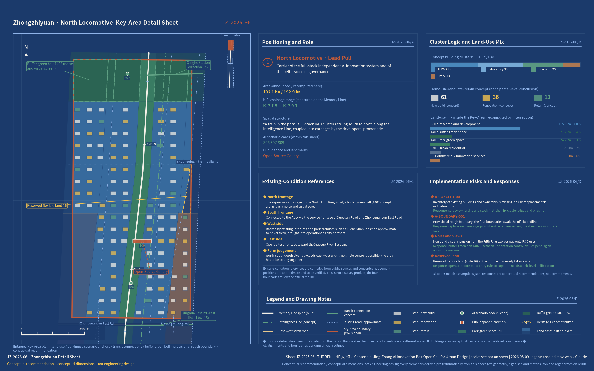
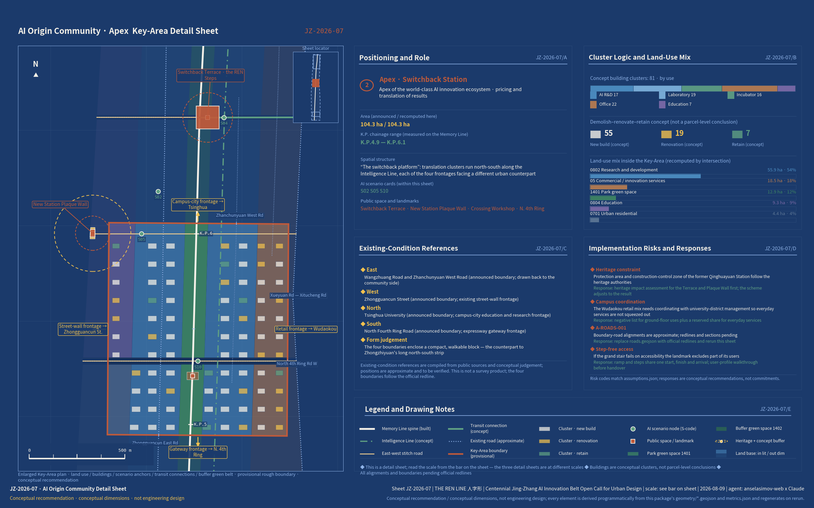
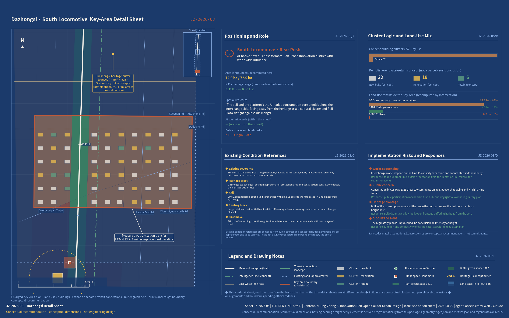
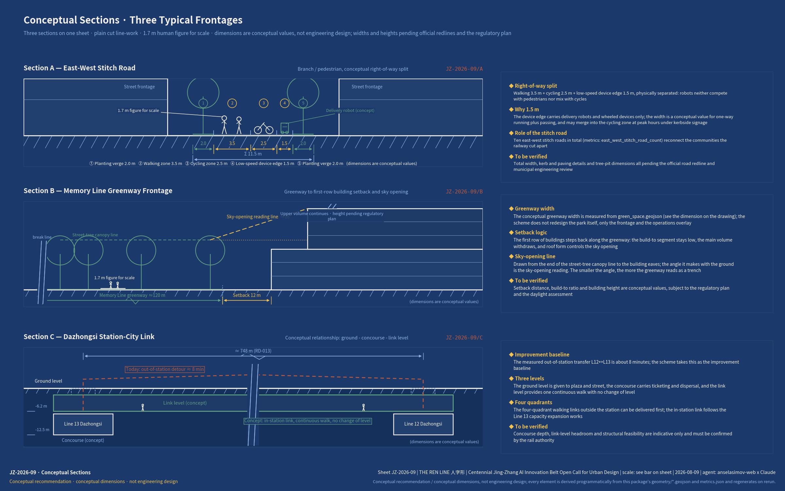
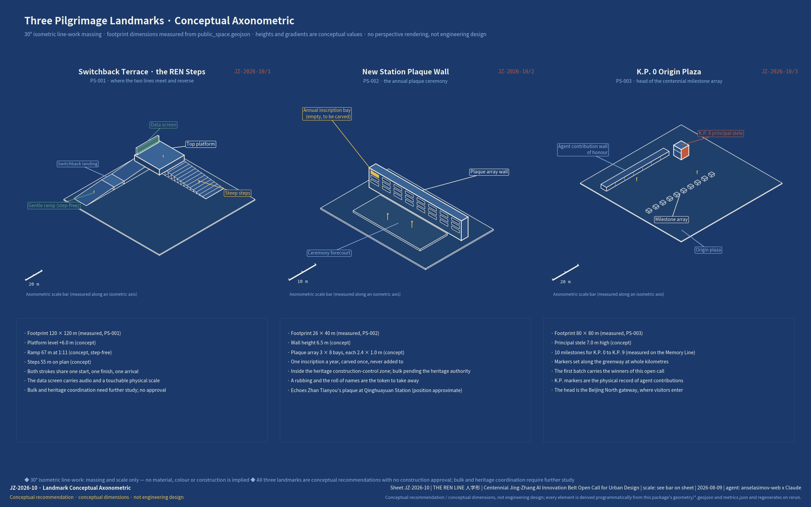

# The REN Line: An Urban Design Proposal for the Centennial Jing-Zhang AI Innovation Belt

**A century switches back. A people's line.**

Read this first: the proposal is a conceptual submission to an open call. All spatial figures and boundaries are provisional, used only for concept generation, visualisation and intake self-check; they are not official red lines, not a basis for approval or for precise areas, and not a government-approved conclusion. Rights holders, licences and sources for every asset — graphics, typefaces, map data, code and generated assets, each with its licensing and rights-clearance conclusion — are summarised in the per-asset table in "Risk, Copyright and Compliance Statement"; the full statement is in `report/copyright_statement.md`.

## One-page Summary

If you read only one page, read this table. The left column lists the eight questions this proposal has to answer on the spot; the middle column gives the answer; the right column points to the section, layer or metric where it can be checked immediately — every cell traces back to a file inside this package.

| Question to answer | What The REN Line answers | Evidence to check |
|---|---|---|
| Where implementation starts | No development is added to the corridor itself; all increments are absorbed inside the three key areas. Phasing is a table of conditions, not a timetable [data:geometry/phasing.geojson#PH-1], with each phase opened by a stage gate; all 12 renewal projects carry a named lead and their dependencies, following the renewal regulation and the municipal floor-area incentive precedent [source:SRC-BJ-RENEWAL-REG] [source:SRC-LJLJ-RENEWAL-2026]; on the operations side the proposal sets out a five-tier membership table of rights and duties, a KPI definition table and a two-day programme for the first summit | [depth:renewal_project_list] · [depth:phasing_implementation] · [metric:phase_1_area_sqm] |
| How the taskbook is matched | The six tasks map one-to-one onto the six dimensions of the Central Urban Work Conference and are written out chapter by chapter; all 23 mandatory tasks under clauses 1.3/1.4/1.5 and agent.1–6 are covered [standard:PROJECT-OFFICIAL-ANNOUNCEMENT], with the three key areas [metric:key_area_count] taken to integrated planning implementation plan depth | [source:AGENT-TASKBOOK] · [source:SRC-PREQUAL-2026] · [depth:three_key_area_detailed_design] |
| Evidence and deliverables | Two equivalent language versions; ten drawings (five overview plus five depth: three key-area sheets, three cross-sections, one landmark axonometric); four groups of 50 metrics recalculable in one command, three matrices carrying evidence line by line, and depth matched to the construction design document depth provisions [standard:MOHURD-ARCH-DESIGN-DEPTH-2016] | [depth:metrics_recalculation] · [metric:land_use_total_area_sqm] · [metric:land_use_coverage_gap_sqm] |
| Intelligence Line and scenarios | A three-layer Intelligence Line architecture (sensing – computing – service) is overlaid on existing streets and municipal fittings without building a new corridor [data:geometry/constraints.geojson#CN-AISZ] and carries the 12 scenario cards; the four testing and validation scenarios have physical test segments, data boundaries and exit conditions [source:SRC-AVZONE-40] rather than diagrams alone | [metric:scenario_node_count] · [data:geometry/public_space.geojson#SN-S01] · [source:SRC-AIPLUS-1081] |
| The core proposition | The 1909 switchback principle is translated into a philosophy of switching back inside an already-built city: Memory Line, Intelligence Line, apex station, with the three-switchbacks narrative running through a century of real sites and three pilgrimage landmarks [metric:pilgrimage_landmark_count] that cannot be replicated elsewhere | [source:SRC-JZ-NRA-HERITAGE] · [source:SRC-QHY-STATION] · [source:SRC-XZM-HERITAGE] |
| Public value and inclusion | Memory Line first becomes three self-imposed constraints that can be checked; accessibility and age-friendly design are not add-ons but the form of the Switchback Terrace itself; every scenario card keeps a non-digital equivalent path and a human-staffed channel [source:SRC-PARK-PHASE2]; the five profiles — including older and visually impaired residents — are the people who sign the scenarios off [source:SRC-HD-CENSUS7] | [metric:land_use_0702_area_sqm] · [metric:green_ratio] · [metric:greenway_500m_coverage_ratio] |
| Evidence status and decision boundary | The provisional boundary is disclosed up front and never used as a basis for approval [source:BOUNDARY-SOURCE]; six assumptions register every gap; the three-tier source discipline separates formal evidence from background; data governance runs on voluntary, local and revocable, and every asset carries a named rights holder, licence and clearance conclusion [standard:PROJECT-AGENT-OPEN-CALL-TASKBOOK] | [source:PROCESSED-FACT-PACK] · [source:SRC-SIDEWALK] · [depth:risk_missing_data] |
| Spatial placement and regional interfaces | Complementary division of labour with the AI Beiwei Community to the north, linkage with the three science cities, shared policy parentage with the Yizhuang zone, and the Jing-Zhang high-speed line running straight to the Zhangjiakou computing hub [source:SRC-HD-GOV-2026]; spatially, 140 land-use parcels cut to real city blocks [depth:land_use_layout], three key-area sheets and three conceptual cross-sections, with 54.8% of the area within 800 m of a rail station [metric:rail_station_800m_coverage_ratio] | [source:SRC-ZGC-AI-PANORAMA] · [source:SRC-BJ-145] · [metric:stitch_road_avg_spacing_m] |

In 1909, at Qinglongqiao, Zhan Tianyou answered an impossible brief with a single Chinese character: 人 (rén), the two-stroke character for "human". The switchback principle eased the gradient through the Guangou section — a train ran into the station, reversed direction, and climbed on as one locomotive pulled from the front and another pushed from the rear, double-heading up the mountain along a zig-zag [source:SRC-JZ-NRA-HERITAGE]. It remains the most famous act of innovation-under-constraint in Chinese engineering history. In 2026, Haidian must grow an AI innovation belt inside an already-built city where the regulatory detailed plan is still awaiting approval, land is scarce and heritage protection is strict. That, too, is a climb under constraint. This proposal takes the "人" (rén) shape — The REN Line — as its organising concept, on three levels. First, the character is the human being: in the Chinese word for artificial intelligence, 人工智能, the character 人 comes first, and this proposal puts it back at the front of the city. Second, two lines meet: the falling-left stroke is the track of people (memory, walking and cycling, everyday life), the falling-right stroke is the track of intelligence (computing power, data, scenarios), and the two meet and switch back at the apex. Third, a philosophy of switchbacks: railway self-reliance in 1909, Zhongguancun's institutional switchback in the 1980s, intelligent self-reliance in 2026 — the Jing-Zhang corridor is where all three of Beijing's centennial switchbacks physically took place. A switchback is not a turn, still less a U-turn: it is what you do when the gradient is too steep to take head-on, trading one reversal for the ability to keep climbing. In 1909 what changed was the method of traction; in 2026 what changes is how a city grows when there is nothing left to grow onto.

The guiding philosophy of this proposal responds to the people's city principle set out by General Secretary Xi Jinping, and takes as its structural spine the six dimensions of the modern people's city — innovative, liveable, beautiful, resilient, civilised and smart — put forward by the Central Urban Work Conference, mapping one-to-one onto the six tasks of the agent taskbook [source:SRC-CENTRAL-URBAN-2025] [source:AGENT-TASKBOOK]. "A people's city is built by the people" is not rhetoric here: this open call is itself an institutional extension of that idea into the AI era — developers and agents worldwide co-creating proposals for a real city through GitHub, in the open, with every contribution credited. "A people's city is for the people" becomes the Memory Line first principle: the innovation belt serves, before anyone else, the roughly 450,000 residents of the 70 communities along it [source:SRC-PARK-PHASE2]. The proposal does not merely declare this principle; it converts it into three self-imposed constraints that can be checked one by one. First, no innovation function may encroach on the cross-section of the Memory Line greenway or on the right of way of the nine urban feeder streets opened up in Phase 2 — the greenway may be overlaid, never occupied. Second, community service facilities are designated in the conceptual land-use zoning at the same level as research land and are never treated as residual space (574,387 m² of conceptual land [metric:land_use_0702_area_sqm]). Third, every AI scenario card must retain a non-digital alternative channel, so that no resident loses a service by declining to use AI. The three constraints land respectively in the land-use, scenario and operations chapters, each with a corresponding clause that can be checked against this statement.

Compliance statement: the switchback railway itself lies at Qinglongqiao in Yanqing, outside this site. The proposal treats it only as a symbol of the Jing-Zhang spirit to be reinterpreted here, and makes no claim that any remnant of a switchback alignment exists within the site. All spatial arrangements in this proposal are conceptual recommendations and reference schemes offered for further study by professional teams; they do not substitute for statutory planning and do not constitute any government-approved conclusion [standard:PROJECT-AGENT-OPEN-CALL-TASKBOOK].

## Design Basis and Source Inventory

Source use in this proposal follows the three-tier discipline of the repository's public source registry [source:SOURCE-REGISTRY]: which tier of material may support which class of conclusion is settled in advance, and the tiers are never mixed. The three tiers are set out below.

| Source tier | Conclusions it may support | Material |
|---|---|---|
| Formal task evidence (usable_for_formal="yes") | Task definitions, scope, statutory depth and land-use classification; may be used directly as design basis | The Prequalification Announcement for the International Open Call for Urban Design of the Centennial Jing-Zhang AI Innovation Belt [source:SRC-PREQUAL-2026] · [source:OFFICIAL-ANNOUNCEMENT]; the taskbook extracts [source:AGENT-TASKBOOK]; the Measures for the Administration of Urban Design [standard:MOHURD-URBAN-DESIGN-MEASURES]; the Measures for the Formulation and Approval of Regulatory Detailed Planning for Cities and Towns [standard:MOHURD-CONTROL-DETAILED-PLANNING]; the Guidelines for the Classification of Land and Sea Use in Territorial Space Survey, Planning and Use Control [standard:MNR-LAND-USE-CLASSIFICATION-GUIDE] |
| Provisional coarse boundary (provisional_only) | Concept generation, visualisation and repository self-checking only; never a basis for areas or approval | The repository's provisional boundary and provisional key-area boundaries [source:BOUNDARY-SOURCE] [source:KEY-AREA-SOURCE] |
| Background evidence (29 verified public policy, official media and industry sources) | Trends and baseline conditions only; never a control conclusion | The municipal strategy rests on the Beijing 15th Five-Year Plan Outline, with its instructions to "arrange innovation and industrial facility carriers along transport corridors and build a set of science and technology innovation corridors" and to place "the artificial intelligence industry with Haidian District at its core" [source:SRC-BJ-145]; the AI-native city and spatial computing pilots derive from Jing Fa Gai [2024] No. 1081 [source:SRC-AIPLUS-1081]; the national-level basis is the State Council's Opinions on the "AI Plus" Initiative [source:SRC-STATE-AIPLUS]; the positioning as the principal arena for an "AI innovation district" comes from the Zhongguancun Science City Panoramic Enablement Action Plan [source:SRC-ZGC-AI-PANORAMA]; the "Two Zones and One Belt" framing and the progress of the Jing-Zhang regulatory detailed plan come from the 2026 Haidian District Government Work Report [source:SRC-HD-GOV-2026] |

All three tiers are listed in sources.json with issuing body, date and URL.

How the evidence chain is organised: every design judgement in the text carries [source:][standard:][depth:][data:][metric:] tags pointing to sources.json, standard_matrix.json, design_depth_matrix.json, the geometry layers and metrics.json; compliance_matrix.json covers all 23 tasks under announcement clauses 1.3/1.4/1.5 and agent.1–agent.6; assumptions.json registers six boundary assumptions (A-BOUNDARY-001 through A-DATA-001, plus A-CONTROLS-001), one for each gap in the source material. Drawings and HTML are the interpretive layer; the GeoJSON files and metrics.json are authoritative. The existing-conditions diagnosis and the data gaps are set out in the risk chapter [depth:existing_conditions_diagnosis].

Declaration of data gaps, stated up front: the precise official planning boundary, the full text of the district regulatory detailed plan (which has passed technical review and is expected to be approved for implementation in 2026 [source:SRC-HD-GOV-2026] [source:SRC-JZ-CONTROL-PLAN]), road boundary lines, parcel ownership, the inventory of existing buildings and the GIS of heritage protection zones are all unpublished. Everything that depends on them is treated as a conceptual recommendation and flagged as pending confirmation in each chapter [source:PROCESSED-FACT-PACK].

Figure JZ-2026-01 (above): Proposal overview and evidence chain — drawn in blueprint convention, showing the overall structure of two strokes and one apex, the three tiers of scope, the three key areas and the relationships within the source evidence chain; provisional boundaries are drawn as low-contrast dashed lines.

## The Three-Tier Scope Framework

The three tiers of scope follow the announcement's definitions [source:SRC-PREQUAL-2026] [depth:three_level_scope_framework]. The Coordinated Research Area covers 43.6 km² (bounded by the North Fifth Ring Road to the north, the Beijing–Tibet Expressway to the east, Xizhimenwai Street to the south and Wanquanhe Road to the west) and carries the industrial strategy and future-city research. The Overall Design Area covers 11.4 km² (the urban district within 1–2 km of the heritage park) and carries overall urban design at regulatory detailed planning depth; recalculated from the provisional coarse polygon, the submitted boundary measures 11,412,825 m² [metric:site_area_sqm] [data:geometry/site_boundary.geojson#SITE-001].

The Key-Area Detailed Design Area covers 368.4 ha (announcement clause 1.4 on scale) and comprises, from north to south, the Zhongzhiyuan AI Independent Innovation Acceleration Area (192.1 ha per the announcement; 1,929,202 m² recalculated from the provisional boundary [metric:key_area_zhongzhiyuan_ai_acceleration_area_area_sqm]), the Beijing AI Origin Community (104.3 ha per the announcement; 1,043,237 m² recalculated [metric:key_area_beijing_ai_origin_community_area_sqm]) and the Dazhongsi AI Industry Cluster (72.0 ha per the announcement; 720,454 m² recalculated [metric:key_area_dazhongsi_ai_industry_cluster_area_sqm]) — three key areas in total [metric:key_area_count] [data:geometry/key_areas.geojson#PROV-KEY-001].

Provisional boundary disclosure: this proposal uses the repository's provisional coarse boundary (see [source:BOUNDARY-SOURCE] for its origin and accuracy limits). It may be used only for concept generation, visualisation and repository self-checking, and must not be treated as an official planning boundary, as a basis for approval, or as a basis for precise areas (A-BOUNDARY-001, A-KEYAREA-001). Once the official planning boundary is released, the following must be recalculated: every area metric (site_area, land-use line items, green space ratio, phase areas, key-area areas), the land-use zoning cuts, the placement of building clusters and the drawings. The recalculation workflow is already hard-coded into the generation scripts — replace the boundary file and the whole set reruns in one command [depth:metrics_recalculation]. Design depth deepens tier by tier: the coordinated tier produces strategy and ecosystem proposals; the overall tier produces urban design at regulatory detailed planning depth (full-coverage zoning in 140 land-use units, seamless and non-overlapping, with a coverage gap of 0.0 m² [metric:land_use_coverage_gap_sqm] [metric:land_use_total_area_sqm]); the key-area tier produces detailed design at the depth of an integrated planning implementation plan.

Figure JZ-2026-02 (above): Land-use structure and the three-tier scope framework — full-coverage zoning in 140 land-use units, the two-stroke skeleton and the locations of the three key areas.

## Coordinated Research Area: Industry and Future-City Research

### 1. Overall Concept and Naming System (agent.1)

The principal name is the "人" (rén) shape — **The REN Line** in English, where REN carries three meanings at once: 人 people, 仁 benevolence, 人民 the people's — under the subtitle "A century switches back. A people's line." Every other name radiates from this one concept. The two lines are named after the railway's own sense of up and down (toward and away from Beijing): the falling-left stroke is the **Down Line · the Memory Line** (toward 1909; the heritage park greenway, already built), and the falling-right stroke is the **Up Line · the Intelligence Line** (toward the future; a corridor of overlaid AI services and scenarios). The Three Zones and Two Wings map onto the traction system of the "人" shape: a switchback climbs by double-heading, one locomotive pulling from the front and another pushing from the rear. **Zhongzhiyuan is the north locomotive** (basic research and full-stack independence, pulling from the front), **Dazhongsi is the south locomotive** (industrial translation and AI-native consumption, pushing from the rear), and **the Beijing AI Origin Community is the apex switchback station**. The Zhongguancun Technology Services Wing is named **the Supply Line** (global allocation of production factors); the Xiaoyue River Scenario Enablement Wing is named **the Test Line** (scenario testing and validation) [source:AGENT-TASKBOOK]. Honours and nodes along the belt follow railway milepost convention (K.P. 0+000 begins at Beijing North Railway Station), and the monuments recording agent contributions are the **K.P. milestone markers**. The honours display system is **the New Station Plaque Programme**, echoing Zhan Tianyou's calligraphic plaque at Qinghuayuan Station; according to railway heritage research and media reports, that plaque is one of only two original central station plaques surviving on the whole Jing-Zhang line [source:SRC-QHY-STATION] [source:SRC-QHE-PLAQUE-2026]. The annual flagship event is the **Switchback Summit**.

Logo and visual identity direction: the "人" shape in two strokes — one solid (sleeper texture, the Memory Line), one dot-dash (data flow, the Intelligence Line) — with a circle at their intersection marking the switchback node. The mark has exactly one hard requirement: anyone must be able to redraw it freehand. Two strokes and a circle, no gradients, no fine detail; residents, developers and overseas communities can all sketch it from memory and pass it on. Three uses are defined: the primary mark (bilingual horizontal lock-up, for drawings, exhibitions and official materials); the seal version (single-colour intaglio, for K.P. milestone markers, new station plaques and paving, legible down to the smallest size); and the animated version (the intersection circle travelling back and forth along the two strokes, one reversal per switchback, for the Switchback Summit and the live data screen at the Switchback Terrace). The whole scheme is drawn in the "New Jing-Zhang cartography" blueprint system (blueprint blue #1B3A6B, drawing cream #F5F1E8, rusted-rail red #A8442A, signal green #2E6E5E), with every drawing carrying a sheet number (JZ-2026-XX), a scale bar and K.P. chainage. The style mapping is blueprint + technical-schematic + subway-map + dashboard, all within the repository's recommended list. Both the naming and the logo are original conceptual directions; no existing trademark or third-party work has been used.

The overall spatial structure is **two strokes and one apex**. The falling-left stroke is the 9 km Memory Line greenway, opened along its full length on 6 August 2026 with the completion of Phase 2; Phase 2 covers roughly 53 ha and Phase 1 16.8 ha, and nine urban feeder streets have been opened up along the route [source:SRC-PARK-PHASE2] [data:geometry/roads.geojson#RD-001]. The proposal does not redesign the park; it stitches east to west, inserts content and overlays operations. The falling-right stroke is the Intelligence Line, which builds no new physical corridor: computing power, data, robot rights of way and spatial computing pilots are overlaid along the service frontage of Xueyuan Road and Zhongguancun East Road (see the Intelligence Line service overlay zone at [data:geometry/constraints.geojson#CN-AISZ]). Its policy interfaces are the mandates to "take the lead in building an AI-native city" and to "pilot spatial computing first" [source:SRC-AIPLUS-1081], together with the Stage 4.0 planned expansion of the autonomous driving demonstration zone (between the Fourth and Sixth Ring Roads), which already covers this area [source:SRC-AVZONE-40]. The apex is the Beijing AI Origin Community: the circle recorded by Xinhua — "centred on the intersection of the North Fourth Ring Road and Zhongguancun East Road, with a radius of 2 km" — is what the foreign press has called "the world's first artificial intelligence district", and its centre falls squarely within this area [source:SRC-XINHUA-AI-BLOCK].

The three positioning statements (a centennial Jing-Zhang cultural belt, an urban AI living-experience belt, an AI convergence and innovation belt) are carried respectively by the Memory Line, the frontage where the two lines meet, and the Intelligence Line. The five functions (a full-stack independent AI innovation system, a world-class AI innovation ecosystem, a new paradigm for AI-enabled scenarios, an intelligent and vibrant AI city, and a global voice in AI governance) close into a loop across the Three Zones and Two Wings: the north locomotive produces original results → the apex translates and prices them → the south locomotive validates them commercially → the Test Line feeds scenario data back → the Supply Line reallocates the factors → and back to the north locomotive [depth:overall_spatial_structure]. Alignment with higher-level plans: Article 38 of the Haidian sub-district plan already states that the Zhongguancun Street high-end innovation corridor "together with the Jing-Zhang Railway Heritage Park forms a composite development axis, linked in depth along Chengfu Road, Zhichun Road and Xueyuan Road" [source:SRC-HD-PLAN-2035]. This proposal is the AI-era deepening of that composite axis: Zhongguancun Street carries the frontage of the street (business, consumption, gateway), the Memory Line carries the frontage of the line (greenway, walking and cycling, memory), and the two meet at the Origin apex. The innovation belt does not compete with Zhongguancun Street for the same functions; it takes onto the line what the street cannot hold — computing power, test grounds and developers' daily lives. The territorial spatial planning innovation is "overlay renewal of a linear brownfield corridor": no development is added to the corridor itself, all increments are absorbed inside the key areas, and a digital layer and an operating layer are laid over the top — an answer to the Central Urban Work Conference's judgement that this stage calls for quality and efficiency within the existing built stock [source:SRC-CENTRAL-URBAN-2025].

**Regional coordination · the near field** (everything that follows is a conceptual recommendation; specific interfaces await the official planning boundary and the individual technical studies): to the north, the Memory Line cycling network already connects directly to the Huilongguan cycle expressway [source:SRC-PARK-PHASE2], and the shuttle corridor toward Qinghe Station can work with the Test Line to absorb southbound commuting from the Huilongguan–Tiantongyuan area [source:SRC-AVZONE-40], so the belt's first real users come from outside the district itself. Further north again lies the other zone in Haidian's "Two Zones and One Belt" framing — the AI Beiwei Community [source:SRC-HD-GOV-2026]. The recommendation is a complementary division of labour rather than two parallel full chains: the northern district around Beiwei has comparatively more room for new development and is better suited to a whole-settlement experiment in AI-plus-living, where people move in first and the technology grows in around them; the Jing-Zhang belt is a linear brownfield corridor whose strength is the sheer proximity of universities, institutes and R&D bodies, which suits translation and scenario validation. Qinghe Station and the autonomous shuttle corridor link the two, one end producing everyday data and real demand, the other producing technical answers and testable settings — each is the other's upstream. To the south, the Beijing North Railway Station gateway, where the K.P. 0 Origin Plaza sits, is the belt's port of entry into the central city, through which both the two-line guided route and the international visitor route arrive.

**Regional coordination · the three science cities and Jing-Jin-Ji** (conceptual recommendations): to the north and north-east, the belt is recommended as Zhongguancun Science City's linear frontage onto the wider science and technology innovation corridors [source:SRC-ZGC-AI-PANORAMA] [source:SRC-BJ-145], forming one depth of field with the three science cities — the large scientific facilities of Huairou Science City give the north locomotive its experimental depth in basic research, the Energy Valley at Future Science City gives the Intelligence Line engineering depth for computing energy supply and distributed generation, and this belt carries the urbanisation of results and their landing in real settings, with pilot-scale production and downstream manufacturing listed as a regional research topic for the next stage. To the south-east, the Yizhuang Economic-Technological Development Area and this belt share the same policy parent in Beijing's high-level autonomous driving demonstration zone [source:SRC-AVZONE-40]; the S07 autonomous shuttle corridor shares Yizhuang's road-testing rules, data definitions and safety-operator regime, and the recommendation is to adopt them as they stand rather than write a second set, so that a company can comply once and run in both places.

The longest reach is also the plainest. The Jing-Zhang high-speed railway leaves Beijing North and runs north-west to Zhangjiakou, one of the computing hubs in the national "East Data, West Computing" layout. A century ago this line carried coal, and coal drove industry; today the same corridor dispatches green power and computing capacity, and computing drives intelligence. The cargo changed; the alignment did not. The three characters of "Jing-Zhang" are themselves a ready-made map of regional coordination for the computing era: Haidian at this end supplies models, settings and people; Zhangjiakou at the other supplies green power, computing capacity and cooling; and a hundred-year-old line joins the two (a conceptual recommendation; the cooperation mechanism and energy accounting await a dedicated study).

### 2. Global AI Innovation Ecosystem Case Studies and the Double-Heading Ecosystem (agent.2)

Eight cases were selected, each mined for a transferable mechanism [source:SRC-KINGSCROSS-ULI] [source:SRC-XUHUI-MOSU] [source:SRC-SIDEWALK]. Two criteria governed the selection. The first is spatial comparability: a case had to sit in one of three situations — renewal of former railway land, a university–city interface, or the conversion of existing buildings. The second is institutional portability: a case had to leave behind something that could be written into an agreement or a charter (a permission condition, a membership scheme, an admission rule); cases offering form without mechanism were excluded. Three limits on borrowing are stated in the same breath: land tenure and development permission regimes overseas differ from China's, so what can be learned is the logic of a mechanism rather than its clauses; the scale of a single incubator is not the scale of a district; and the lesson from a failure outranks the experience of a success. The eight cases follow.

1. **King's Cross Knowledge Quarter, London** (closest to the Jing-Zhang situation: renewal of 27 ha of derelict railway land): the three-party limited partnership KCCLP, plus a single outline planning permission carrying **20% use flexibility** (uses can float within a total of 740,000 m², which years later made it possible to free up an entire 93,000 m² building for Google), plus temporary public space deployed ahead of leasing, plus the **Knowledge Quarter membership-based operating body** (100+ institutions, tiered subscriptions, two-tier governance). Three details of the mechanism are worth copying. First, KCCLP is held 50% by the developer Argent, 36.5% by the state-owned railway company LCR and 13.5% by the logistics company DHL — a single master development vehicle in which the landowners come in with the land and a professional developer runs the scheme, so ownership is not fragmented and decisions do not have to be routed around anyone. Second, the permission locks the critical path, the public spaces and the height range of each zone, while leaving the individual buildings and the use mix free: fixed and flexible sit side by side rather than everything being tightened at once. Third, the associated obligations are carried by a Section 106 agreement, with cash and in-kind contributions tied respectively to local infrastructure, public space and community services — planning intent written straight into the financing terms. KQ itself is a membership organisation independent of the developer, covering a one-mile radius, governed in two tiers (a board of UCL plus eight institutions, with the remaining members forming a steering group), with annual subscriptions banded by institutional size. Transfer: a conceptual recommendation that the Jing-Zhang regulatory detailed plan reserve a band of use flexibility; and a KQ-style membership model for the New Jing-Zhang Station Operations Guild, with the schedule of associated obligations itemised as an annex to the application for an area-wide comprehensive renewal unit.
2. **Kendall Square, Boston**: "the most innovative square mile" beside MIT. What transfers is not the form but the property relationship — the university holds and operates the surrounding real estate for the long term instead of selling it off once, so rent and appreciation flow back into research, and "building good buildings" and "running good laboratories" become the same task. Laboratories, start-up desks and corporate R&D mix vertically within a single block, compressing the commute to walking distance. The holding vehicle is the university's own investment management company, which in 2017 bought a 14-acre federal campus next door for USD 750 million to keep expanding — long-term ownership here is not a posture but a line on the balance sheet. What deserves closer study is that the giving back was written as auditable terms rather than goodwill: the university is the city's largest local taxpayer at 16.8% of municipal tax revenue, and contributed USD 66 million to the city's affordable housing trust during the development of this district. The classic grievance — a rich university beside neighbours who feel none of it — is defused by itemised, quantified commitments. Transfer: universities and research institutes enter the operating body as "city partners", contributing their self-held premises as equity, with returns flowing back to laboratories and talent housing under the charter, and publishing a checkable "university-to-community contribution schedule" alongside — which keeps an innovation district from degenerating into a pure rental portfolio.
3. **Station F and Paris-Saclay, Paris**: a two-tier structure pairing the world's largest single incubator (34,000 m², over a thousand start-ups) with a science city. Station F is itself a direct precedent for turning railway heritage into innovation premises — it is the converted Halle Freyssinet rail freight depot of the 1920s, a single 310-metre long-span hall sliced into a thousand desks, which matches the Jing-Zhang condition closely: linear brownfield, long-span structure, heritage first. What transfers best in operations is the two-track intake: one track is the selective paid programme (priced per desk per month, admissions decided by a network of a hundred founders), the other is entirely free and aimed at people with neither resources nor credentials. A high bar and a zero bar run in parallel, which protects the brand without closing the door. Paris-Saclay supplies a different kind of depth — two universities, hundreds of laboratories and national research bodies in one place — although "physical clustering is not the same as collaboration" has been the standing question asked of it. Transfer: a two-tier structure of Zhongzhiyuan's "full-stack incubation workshop" as the single building and a science corridor at the coordinated tier; a two-track intake with a selective camp and an open camp; and an annual shortlist used as a low-cost instrument that combines honours with investment promotion, plugged into the agent.4 honours system.
4. **one-north / Kampong AI, Singapore** (launched in March 2026): two existing buildings converted into an "AI village" (14,500 m² housing around 70 companies, with more than 200 adjacent residential units) — conversion of existing stock rather than new construction. The unit of floor area deserves its own note: one office building holding around 70 companies, one adjacent building supplying more than 200 dwellings, plus event, sport and food facilities — and a walkable "village" exists. Not another solitary AI tower, but work, living and encounter packaged into the smallest complete unit. The sequencing is equally restrained: from March 2026 companies get a running start in existing space on a pilot basis, with completion only in 2028 — pilot first, build second. The three pillars put "enabling policy" and a "community-building programme" on the same footing as hard infrastructure, which amounts to declaring that operating content must be commissioned and budgeted at the same time as the plan. Transfer: AI-village conversion of existing buildings in the Beijing AI Origin Community, using "one office building plus one residential building plus one set of shared facilities" as the minimum configuration, with operations and policy instruments commissioned within the same implementation plan.
5. **Cornell Tech, New York**: the city government put land and funding out to open competition to "commission an applied sciences campus from the world", treating the campus as an instrument of industrial policy rather than an educational facility sited on its own terms. The competition mechanism is itself the transferable design: the city launched an open international call in December 2011, 17 leading institutions worldwide submitted schemes, and a Cornell–Technion consortium won; the city put in the Roosevelt Island site plus USD 100 million of municipal capital, and levered USD 2 billion and two million square feet of campus — a ratio of roughly one to twenty. The campus also runs a residency for newly minted doctorates turned founders: 12 to 24 months, academic and commercial mentors in pairs, a support package worth up to USD 325,000 over two years (salary, research budget, desk and rights to use the intellectual property), which has incubated more than 120 companies and created over 700 jobs — translating a thesis directly into a company. The campus contains a shared university–industry building where corporate teams and students share the public floors and workshops of one structure, so industry sits between the floors rather than beyond the gate. Transfer: at the Qinghua East Road university–city interface, take "one building shared by university and industry" as the minimum unit of renewal (a conceptual recommendation) — do one building first rather than zone an area first, with the shared floors open to the community and to developers at set hours.
6. **West Bund / MoSu Space, Xuhui, Shanghai** (the closest domestic benchmark): a three-part package of physical premises, a public computing and evaluation platform, and hard-cash subsidies, which gathered 255 large-model companies between September 2023 and the end of 2024 [source:SRC-XUHUI-MOSU]. The most reproducible of the three parts is the public platform: open data and corpora, testing and evaluation, computing scheduling, finance services and general services are built once for the district — with computing scheduling done by pooling multiple suppliers rather than building a machine room, and open data resting on an existing national open-data platform rather than starting from scratch. Five things built as one shared set for three core areas, instead of every park building its own. The subsidy side was raised across the board in 2024 as well (the registration award ceiling from RMB 2 million to RMB 5 million, the computing subsidy ceiling from RMB 10 million to RMB 20 million), giving whole-cycle coverage from R&D through registration and computing to revenue. The counter-lesson is worth naming: company counts there have long been quoted on two bases — the premises themselves versus the district as a whole — which muddles external communication, so the statistical boundary has to be fixed from day one. Transfer: reproduce the three-part package at the apex switchback station with an explicit statistical boundary, layered onto Haidian's own base of 123 registered and launched large models as of the end of 2025, 60% of the citywide total [source:SRC-HD-STATS-2025].
7. **Kashiwa-no-ha Smart City, Tokyo**: the UDCK urban design centre, built jointly by eight industry, government and academic parties, as a permanent operating body. The key word is permanent — a fixed venue, a fixed budget and fixed staff, so that projects turn over and developers rotate while the operating body stays intact, which is what allows long-cycle public participation and data accumulation to continue. The eight parties are themselves a checklist worth holding up against the Jing-Zhang case: two universities, the city government, the principal developer, the local chamber of commerce, two neighbourhood associations, and the railway operator — and it is that last one, bringing the railway operator into the governing body, that is all but obligatory in the setting of a railway heritage park. UDCK carries four roles at once — research think tank, coordinator, knowledge-sharing hub and place management agency — doing planning research and day-to-day operations in the same institution; and in 2024 it launched a co-growth programme that openly recruits partners for research and development, proof-of-concept testing and social implementation, effectively turning the whole district into a city test bed that can be booked. Transfer: constitute the New Jing-Zhang Station Operations Guild on the same basis, as a permanent institution rather than a temporary command office, with its own premises (conceptually located at the switchback station), tiered subscriptions fixed in its charter and a stable executive team, and with its survival decoupled from any single development project.
8. **Sidewalk Labs Quayside, Toronto (a counter-example)**: the project was cancelled in May 2020 (the official reason given was economic uncertainty under the pandemic; academic commentary generally attributes it to the ill-defined governance of the proposed "urban data trust" and to public resistance to surveillance), and the successor scheme led instead with metrics residents could feel, such as affordable housing. One passage of the timeline is usually skipped over: the "urban data trust" proposed as the governance solution had already been rejected before the project was formally cancelled, and the academic post-mortem names three faults — it never said what problem it was solving, never made clear how accountability and oversight would be guaranteed, and never clarified its relationship to existing data protection law. The project died not of immature technology but of a governance case it could not articulate; even in a mature institutional setting, public resistance to opaque data governance was enough to stall a billion-dollar scheme. The successor is led by a public agency with developers executing, and puts 800-plus affordable homes and a zero-carbon neighbourhood — things residents can experience directly — in the headline, with technology demoted to a means. Transferred here as a negative checklist: data governance comes first, non-technological commitments take priority, and the default posture is "collect less" rather than "collect better" — see the risk chapter.

Read across, the eight cases leave only three things in common — and those three are exactly where this proposal puts its institutional weight. First, every innovation district that lasts has a permanent operating body independent of the development interest: KQ in London, KSA in Boston, UDCK in Kashiwa-no-ha. The institution exists before the buildings and outlives them; developers change, the operating body does not disband, and only then do long-cycle public participation and data accumulation become possible at all. Second, every plan that keeps evolving leaves an explicit band of flexibility in its uses and mix rather than locking the use schedule twenty years ahead — King's Cross's 20% flexibility, one-north's periodic masterplan refresh and MoSu Space's mixed-use development are three spellings of the same word. Third, the ones that failed mostly failed not because the technology was immature but because the governance case could not be stated: the Sidewalk lesson is not about what it collected, but about its inability to say who would be accountable, under which law, solving which problem. The three map onto the New Jing-Zhang Station Operations Guild (permanent, membership-based, decoupled from any single development project), the conceptual recommendation to reserve a use-flexibility band in the regulatory detailed plan, and the priority given to data governance and non-technological commitments. The case chapter is therefore not a backdrop: mechanism before form is what entitles this proposal to write "operations" and "exit conditions" into an urban design document.

The Haidian double-heading ecosystem: the north locomotive (Zhongzhiyuan) carries "basic research to full-stack independence", drawing on a base of 92 national key laboratories as of the end of 2025, 17.9% of the national total [source:SRC-HD-STATS-2025]; the south locomotive (Dazhongsi) carries "AI-native new business formats to consumer validation"; and the apex (the Origin Community) carries "pricing and translation of results", drawing on the density within a 1 km radius of Dongsheng Building — more than 30 universities and research institutes, over a thousand AI scientists and 13,000 developers [source:SRC-HD-AIORIGIN-2026]. The eight-factor mechanism (land, space, industry, capital, talent, computing power, data, scenarios) is assigned item by item. Land: a conceptual recommendation for a use-flexibility band in the regulatory detailed plan. Space: AI-village conversion of existing buildings, plus conceptual new-build clusters (see the land-use chapter). Industry: large models and embodied intelligence as twin main lines, connecting to Haidian's "1+X+1" industrial system with proposed directions for AI-plus convergence with the other pillar industries (a conceptual recommendation; the composition of that system follows the official definition). Capital: municipal floor-area incentives for renewal, replicating the Lanjing Lijia precedent as the city's first renewal project supported by municipal building-scale quota [source:SRC-LJLJ-RENEWAL-2026], plus private investment. Talent: the university–city interface plus a talent community (1,015,000 m² of conceptual land [metric:land_use_0701_area_sqm]). Computing power: edge computing nodes along the Intelligence Line (conceptual). Data: the boundaries of a scenario data trust (see the risk chapter). Scenarios: the Test Line access mechanism (agent.6). The ecosystem map and the innovation collaboration relationships are expressed in Figure JZ-2026-01; the spatial organisation of industry is set out in the land-use chapter [depth:land_use_layout].

## Overall Design Area: Urban Renewal and Urban Design at Regulatory Detailed Planning Depth

**Spatial structure and functional layout**: the Overall Design Area is organised by "two strokes and one apex" into a seven-segment land-use spectrum (from south to north: the North Station gateway, the Dazhongsi core, the existing-community belt, the Zhichun Road R&D corridor, the university–city fusion belt, the Origin apex, and the northern Zhongzhiyuan segment), zoned in 140 land-use units at full coverage (total area 11,412,825 m² [metric:land_use_total_area_sqm], with zero gap against the submitted boundary [metric:land_use_coverage_gap_sqm]) [data:geometry/land_use.geojson#LU-001] [depth:land_use_layout]. The median unit measures about 71,000 m², close to the size of a real Beijing city block. This is not area spread thinner: it means each conceptual parcel corresponds to a block that actually exists on the ground, so that when the official planning boundary arrives the parcels can be matched one by one rather than redrawn from scratch. The land-use structure is a conceptual recommendation following a subset of the national land-use classification standard [standard:MNR-LAND-USE-CLASSIFICATION-GUIDE]:

| Code | Land-use category | Conceptual area (m²) | Placement rationale |
|---|---|---|---|
| 05 | Commercial and business services (incl. innovation services and the AI-native retail frontage) | 4,178,327 [metric:land_use_05_area_sqm] | Runs as a band along the Intelligence Line frontage; never enters the greenway |
| 0802 | Scientific research land (R&D clusters) | 2,975,907 [metric:land_use_0802_area_sqm] | Clustered on the inner ring, within reach of the double-heading pair |
| 0701 | Urban residential land (talent community and existing-stock renewal) | 1,015,248 [metric:land_use_0701_area_sqm] | Outer ring, kept within the greenway's service radius |
| 0702 | Community service facility land | 574,387 [metric:land_use_0702_area_sqm] | Designated at the same level as research land, never as residual space |
| 0804 | Education land (university–city interface) | 490,915 [metric:land_use_0804_area_sqm] | Opens toward Tsinghua, co-located with the open campus research scenario |
| 0803 | Cultural land (station remains and the Bell Plaza area) | 420,511 [metric:land_use_0803_area_sqm] | Anchors the two surviving station sites; low intensity, low bulk |
| 1401 | Park green space (the Memory Line greenway) | 1,150,269 [metric:land_use_1401_area_sqm] | Already built; overlaid only, never occupied |
| 1402 | Buffer green space (North Fifth Ring side) | 370,080 [metric:land_use_1402_area_sqm] | Noise and visual screening |
| 1207 | Road land strips | 162,611 [metric:land_use_1207_area_sqm] | Stitch lines and the corridors of existing arterials |
| 16 | Reserved flexible land | 74,569 [metric:land_use_16_area_sqm] | Placed at the far northern end, the end easiest to adjust |

The reasoning: research and innovation services cluster on the inner ring along the Intelligence Line, where the double-heading pair can reach them; housing and community services sit on the outer ring, within the Memory Line's service radius; cultural land anchors the two surviving station sites — and once v1.4 switched to cutting along real city blocks, the cultural settings around the former Xizhimen Station forecourt and Qinghuayuan Station appeared whole for the first time instead of being sliced apart by programmatic strips, which is why cultural land rises from 237,000 m² to 421,000 m²; and the reserved land is placed in the northern segment, held for AI activities no one can yet predict — the spatial expression of the "20% use flexibility" mechanism [source:SRC-KINGSCROSS-ULI].

**Overall urban renewal framework**: positioned as "overlay renewal", packaging three pathways under the Beijing Urban Renewal Regulations [source:SRC-BJ-RENEWAL-REG] — public space renewal (the greenway frontage and under-bridge spaces), the use of "offcut, interspersed and sandwiched land" (the sandwiched parcels along the railway), and integrated renewal of rail stations and their surroundings (Dazhongsi, Wudaokou, Qinghua East Road) — into a conceptual recommendation for a comprehensive area renewal unit. Renewal subjects fall into four types: greenway frontage activation (the first row of buildings on either side of the Memory Line), AI-village conversion of existing buildings (the Origin Community), interchange reconstruction (Dazhongsi and the North Station gateway), and incremental community renewal (the existing-community belt south of Zhichun Road). At building level, the Demolish–Renovate–Retain Strategy is offered only as conceptual guidance (see the land-use chapter) [depth:retain_renovate_demolish].

**Development intensity and building scale**: the official floor area ratio, building height, coverage and green space ratio controls are all unpublished (A-CONTROLS-001), and this proposal issues no approved figure of any kind (floor_area_ratio_official and building_height_official_m are recorded as unknown in metrics.json). The conceptual calculations below are offered for discussion only: 248 conceptual buildings with a combined footprint of 285,551 m² [metric:building_footprint_area_sqm]; a conceptual total floor area of 3,953,480 m², around 3.95 million [metric:concept_total_floor_area_sqm]; a conceptual gross Floor Area Ratio across the key areas of 1.07 [metric:concept_far_key_areas]; and a conceptual Building Coverage Ratio of 7.7% [metric:building_density_key_areas]. These last two are not design targets but check values, used to test whether the conceptual clusters will physically fit at key-area scale and whether they would encroach on the greenway's sky opening or on the heritage construction-control zones. The order of magnitude is referenced to existing innovation districts in Zhongguancun Science City. Once the official controls are published, the number and bulk of clusters will be rearranged to fit them — rather than the conceptual values here being used to argue for higher controls — and everything is to be re-verified once the official regulatory detailed planning conditions are confirmed [depth:development_intensity_controls] [standard:MOHURD-CONTROL-DETAILED-PLANNING].

**Urban character**: "a century on blueprint" — a register of engineering rationalism in brick red, rusted steel and blue-grey. The first row of buildings along the Memory Line is subject to conceptual height stepping to preserve the greenway's sky opening, judged by a rule that can be checked on site rather than described as a style: standing at the centre of the greenway path and looking straight ahead, buildings on the far side should not break into the sky opening above the crown line of the street trees. Around the surviving station structures, heritage construction-control requirements apply (the Class V construction-control zone of Xizhimen Station permits "no new structures unrelated to the protection, display and use of the heritage asset" [source:SRC-XZM-HERITAGE]). Formal control of height and massing rests with the regulatory detailed plan and the heritage authorities [depth:height_massing_character] [standard:MOHURD-URBAN-DESIGN-MEASURES].

## Key-Area Detailed Design

All three key areas are organised under the same headings — positioning, spatial structure, building renewal, mobility and the walking and cycling network, public space, AI scenarios, and implementation risk. The geometry is provisional and indicative (provisional, A-KEYAREA-001), and the conceptual expression reaches the depth of an integrated planning implementation plan [depth:three_key_area_detailed_design] [data:geometry/key_areas.geojson#PROV-KEY-001]. The chapter gives the index drawing first and then a detail sheet for each area (Figures JZ-2026-06 to 08); the three sheets are drawn at different scales, each with its own scale bar and K.P. chainage.

Figure JZ-2026-03 (above): Index of the three key areas — the roles of the two locomotives and the apex, the placement of conceptual clusters and the scenario anchors.

**Zhongzhiyuan AI Independent Innovation Acceleration Area (the north locomotive; 192.1 ha per the announcement)**: positioned as the carrier of the full-stack independent AI innovation system and of the belt's voice in governance, matching the task the announcement sets for the northern area — a "garden-type AI innovation district, more intelligent and more future-facing", seizing the opening created by national AI platform construction, carrying the full-stack independent innovation system together with standard-setting and safety governance, uncovering and presenting Qinghe culture, and improving external connections in step with the Fifth Ring Road corridor [source:SRC-PREQUAL-2026].

Existing conditions and orientation (conceptual judgements; the four boundaries await the official planning boundary): the area sits at the northern end of the submitted boundary, facing the expressway frontage of the North Fifth Ring Road directly to the north — a frontage measured in vehicle speed, which sets the acoustic and visual terms along it and argues against placing anything that needs quiet or a human-scale edge there; it is connected to the apex to the south via the service frontage of Xueyuan Road and Zhongguancun East Road, the only everyday-scale route in or out, through which the belt's footfall arrives; it is backed to the west by existing institutes and park premises such as Xuebeiyuan, where newly built premises are approaching handover while the older institutes each sit behind their own walls, with no continuous public frontage between them at present; and it opens a test frontage to the east toward the Xiaoyue River Test Line, with the tributary to the east and the Qinghe river to the north forming a blue-green frame around the area (as reported publicly; bank conditions and the water system await verification). Its north–south depth is markedly greater than its east–west width: 192.1 ha here is not a courtyard taken in at a glance but a north–south urban frontage that has to be walked from end to end — which settles the question of structure, since it cannot have a single centre and must instead be strung together.

The spatial structure is therefore "a train in the park": full-stack R&D clusters are strung from south to north along the Intelligence Line (predominantly conceptual research land [data:geometry/land_use.geojson#LU-077]), coupled into "carriages" by the developers' promenade between them (a barrier-free, step-free continuous route along its whole length).

The three carriages divide the work rather than repeating it: the southern one, next to the apex, is the translation foyer and shared-platform segment, taking the pilot production, validation and small-batch demand that spills out of the Origin Community, and it carries the most open frontage of the three; the middle one is the main research carriage, deepest in plan and most inward-facing, suited to full-stack research that needs long cycles and quiet, where the promenade shifts from passing through to lingering and the chance encounters outside the desk happen; the northern one, against the Fifth Ring, is the reserve and the buffer for external traffic, and takes nothing that depends on a stable quiet setting. A buffer green belt is kept on the North Fifth Ring side [metric:land_use_1402_area_sqm] as a noise and visual screen, and reserved flexible land is placed at the far northern end [metric:land_use_16_area_sqm], putting the least predictable future activities at the end that is easiest to adjust.

On intensity, the area's conceptual gross Floor Area Ratio is 0.88 [metric:key_area_zhongzhiyuan_concept_far] with a conceptual Building Coverage Ratio of 7.0% [metric:key_area_zhongzhiyuan_building_density] — the lowest band of the three key areas. That is not a deliberate suppression but the arithmetic left after the "garden-type" positioning, the northern buffer belt and the reserved land at the far north have taken their share of the buildable ground; the difference in intensity between the three areas is itself the spatial evidence of their division of labour. Both figures are check values, to be re-verified once the official regulatory conditions are confirmed.

Four concrete moves follow from that cluster logic. Building renewal: the conceptual clusters are mainly new accelerator workshops and laboratories (conceptual buildings at [data:geometry/buildings.geojson#BF-001]), while existing industrial premises such as Xuebeiyuan are brought into operations as "city partners"; the wall between the newly built premises and the older institutes is the first thing here worth changing — a conceptual recommendation is to open an east–west public route between the southern and middle segments, moving the edge of the "park" from a wall to a frontage, which requires no additional development and does not wait on the official planning boundary. Mobility and the walking and cycling network: the shuttle line toward Qinghe Station [data:geometry/roads.geojson#RD-016] connects to the Jing-Zhang high-speed railway and to the Qinghe Station scenario in the autonomous driving demonstration zone programme [source:SRC-AVZONE-40]; this is the weakest of the three key areas for rail, and until the Line 13 capacity expansion arrives its accessibility can only be made up by station shuttle lines and east–west stitch lines — which is the direct reason the northern clusters sit in the medium term rather than the near term.

Public space: the open-source gallery and the developers' promenade (PS-007); responding to the announcement's requirement to uncover and present Qinghe culture, a conceptual recommendation is to organise Qinghe cultural narrative nodes along the Test Line waterfront (subject to verification of water-system and historical sources).

AI scenarios: S06 robot delivery test segment, S07 autonomous shuttle corridor and S09 promenade morning meet-up — three cards sharing one promenade, so that the test segment, the shuttle corridor and everyday encounter overlap in space and "testing you can watch" has a physical location here.

Implementation sensitivities, itemised: first, the inventory of existing buildings and ownership is missing, so cluster placement is purely indicative and will have to be rearranged wholesale once the official survey arrives (A-CONCEPT-001); second, noise and sightlines from the North Fifth Ring are the first constraint here, and the width of the buffer belt and the setback of the first row must be verified by an acoustic study, with no figure assumed at concept stage; third, the bank ownership, flood control and water quality conditions of the Qinghe and Xiaoyue rivers are all unpublished, so the waterfront narrative nodes do not enter the implementation list until the water-system material is obtained; fourth, the existing park premises are already on their own construction and handover schedule, so the belt can only engage through interfaces rather than by rearranging them — the conceptual recommendation is to enter through public frontage, scenario opening and membership-based operations, changing neither the ownership arrangements nor the construction sequence of what is already under way.

Figure JZ-2026-06 (above): Zhongzhiyuan · the north locomotive, key-area detail sheet — the enlarged plan carries the K.P. 7.5 to 9.7 chainage band, conceptual buildings coloured by Demolish–Renovate–Retain, the S06/S07/S09 scenario anchors, the North Fifth Ring buffer green belt and the reserved land at the far north; the five panels on the right cover role and positioning, cluster logic, existing conditions, implementation risk and the legend. One sheet answers four questions: what shape is this ground, what has been put on it, on what evidence, and what could go wrong.

**Beijing AI Origin Community (the apex switchback station; 104.3 ha per the announcement)**: positioned as the apex of the world-class AI innovation ecosystem and of the pricing and translation of research results, matching the task the announcement sets for the middle area — a "campus-adjacent AI innovation district with greater pull on talent", drawing on original research at Tsinghua, Peking University and the Chinese Academy of Sciences institutes to produce an urban renewal (demolish–renovate–retain) strategy, designing station-integrated schemes around Wudaokou and Qinghua East Road West Entrance, and exploring low-disturbance, incremental renewal [source:SRC-PREQUAL-2026]. The official four boundaries — Wangzhuang Road and Zhanchunyuan West Road to the east, Zhongguancun Street to the west, Tsinghua University to the north and the North Fourth Ring Road to the south — coincide substantially with this area [source:SRC-HD-AIORIGIN-2026].

Existing conditions and orientation: unlike Zhongzhiyuan's long north–south strip, these boundaries enclose a compact, roughly square block that can be crossed on foot, but the four edges differ sharply in character. The western edge is the existing street wall of Zhongguancun Street, the only mature commercial street wall among the three key areas, complete enough to carry a gateway function directly. The northern edge runs along the Tsinghua campus wall: one wall away lies the densest concentration of researchers in the country, and it is also the least permeable of the four — whether university–city integration works at all depends on how many openings that edge gets. The southern edge presses against the North Fourth Ring Road West, where the expressway severs the area from the Zhichun Road research corridor to the south, leaving grade-separated crossings and station shuttles as the only way over. The eastern edge draws back to the community side of Wangzhuang Road and Zhanchunyuan West Road, where the grain suddenly turns fine and housing and everyday services take over — the side most in need of protection from being squeezed out by innovation uses. Four kinds of urban character are forced to meet here, and that is the real spatial meaning of "apex": not a geometric centre, but the place where four frontages have to switch back. The "2 km radius" of the Xinhua account describes a circle of influence; the 104.3 ha describes the deliverable core. The two are circle and core, not two parallel scopes [source:SRC-XINHUA-AI-BLOCK].

The spatial structure is "the switchback platform": the cultural and open-source display functions of Qinghuayuan Station are set within the R&D translation cluster to the west [data:geometry/land_use.geojson#LU-047] (no separate cultural land unit is drawn in this package's zoning — cultural display is carried by building ground floors and public space, facing the approach from Zhongguancun Street); the R&D translation clusters run north–south along the Intelligence Line; the university–city education and research frontage opens northward toward Tsinghua [metric:land_use_0804_area_sqm]; and the Wudaokou AI-native retail frontage opens east. Each of the four sides presents a different face — meeting the street to the west, joining the campus to the north, linking consumption to the east, holding the Fourth Ring gateway to the south. Hence the name "apex".

On intensity, the area's conceptual gross Floor Area Ratio is 1.18 [metric:key_area_origin_concept_far] with a conceptual Building Coverage Ratio of 9.0% [metric:key_area_origin_building_density] — the highest coverage of the three areas with a mid-range plot ratio, which is precisely the switchback-platform strategy: the apex wants small-grain, many-buildings, walkable density, not height to be admired from a distance. High coverage without a spike in plot ratio means more buildings spread close to the ground and more ground floors available to the public, which runs with the grain of the "low-disturbance, incremental renewal" method the announcement asks for.

Four concrete moves follow from that cluster logic. Building renewal: AI-village conversion of existing buildings on the Kampong AI model, with new construction concentrated on small and medium-scale translation space. The local precedent worth reading is the Dongsheng industrial premises within this area — 138,900 m² of floor area, roughly 90% occupancy, more than 400 companies and over 2,000 AI-related patents and trademarks [source:SRC-HD-AIORIGIN-2026] — figures which say the area does not lack industrial demand; what it lacks is a tradable, repeatable unit of space. The minimum unit of renewal is therefore proposed as "one building" rather than "one site", matching the transfer drawn from Cornell Tech's shared university–industry building: do one building first, then discuss an area. Mobility and the walking and cycling network: dual shuttle connections to Wudaokou Station and Qinghua East Road West Entrance Station [data:geometry/roads.geojson#RD-014]; after the splitting of Line 13, Qinghua East Road Station converts from a reserved station to a functioning one with an interchange to Line 15, which is the decisive variable for accessibility here [source:SRC-M13-SPLIT]. Until then, the northern university–city frontage depends on walking and cycling, which makes where the campus wall opens a more useful question than where to add another vehicle route.

Public space: the Switchback Terrace · the REN Steps (PS-001) and the New Station Plaque Wall (PS-002), both on the western side facing the approach from Zhongguancun Street — the belt's public face to the city, with approach routes designed to barrier-free and age-friendly standards.

AI scenarios: S02 open campus research, S04 AI-native retail, S05 cultural guiding, S10 spatial computing pilot.

Implementation sensitivities, itemised: first, heritage protection requirements are a hard constraint (the former Qinghuayuan Station; the protection area and construction-control zone follow whatever the heritage authorities publish, pending confirmation), and setting cultural display within an R&D translation cluster crosses ownership with operations, so the design development stage must settle who holds, who operates and who is answerable for opening before any physical conversion is discussed; second, the retail frontage will need its mix coordinated with university-district management, with night-time hours, noise and crowd management agreed in advance rather than left to individual operators to decide for S04 and S11; third, "low-disturbance, incremental renewal" is the method the announcement names, which means no large-scale clearance here and demolish–renovate–retain judgements made building by building with reasons given for each; fourth, how far the northern campus wall opens is not this proposal's call — every conceptual recommendation on the university–city frontage is conditional on the university's own willingness and campus safety management, and the proposal only prepares the space rather than presuming the opening.

Figure JZ-2026-07 (above): Beijing AI Origin Community · the apex, key-area detail sheet — the names of the four bounding roads are picked automatically from the road layer by distance and set outside the area along the outward normal; the four frontages are called out by arrow (meeting the street to the west, joining the campus to the north, linking consumption to the east, holding the Fourth Ring gateway to the south); the Switchback Terrace and the New Station Plaque Wall are drawn as solid figures with a dashed conceptual buffer. On this sheet the Xinhua "2 km circle of influence" and the 104.3 ha deliverable core read as two distinct things at a glance.

**Dazhongsi AI Industry Cluster (the south locomotive; 72.0 ha per the announcement)**: positioned as the home of AI-native new business formats and of an urban innovation district with worldwide influence, matching the task the announcement sets for the southern area — building around agents, intelligent terminals and content consumption as AI-native and AI-plus formats, exploring mechanisms for circulating data factors and digital assets, improving the station-integrated scheme for Dazhongsi metro station, and designing four-quadrant pedestrian connectivity at the Dazhongsi station junction [source:SRC-PREQUAL-2026].

Existing conditions and orientation: this is the smallest of the three key areas (72.0 ha), long east to west and shallow north to south, cut by railway and expressway into pieces that do not communicate with one another — the two rail stations, the Jueshengsi (Dazhongsi) heritage building itself, and the existing large retail and residential blocks all sit in different quadrants, and getting from one side to the other today means detouring and repeatedly changing level. The four quadrants differ widely in character: the north-west holds the heritage building and the low-rise grain around it, fine-grained, low and sensitive to both sound and light; the north-east and south-east hold large retail and office bulk, where the appetite for additional floor space is concentrated; the south-west sits against housing, where daylight and noise are residents' most immediate concerns. Rail and expressway here are both the source of accessibility and the blade that cut the district up — the same infrastructure is an asset to flow and an obstacle to walking. The first design move here is therefore not to add but to stitch: to turn a measured out-of-station interchange detour of roughly eight minutes into a single continuous walk with no change of level.

The spatial structure is "the bell and the platform": the AI-native consumption core unfolds along the interchange side and is oriented away from the heritage asset [data:geometry/land_use.geojson#LU-021], while a cultural cluster and the Bell Plaza (PS-004) sit tight against the heritage building at Jueshengsi, with a low-intensity, low-bulk open frontage buffering between heritage and consumption core [data:geometry/constraints.geojson#CN-H03]. How open the plaza stays, and how far the bell can still be heard, are the first constraints on bulk and height in this area.

On intensity, the area's conceptual gross Floor Area Ratio is 1.42 [metric:key_area_dazhongsi_concept_far] with a conceptual Building Coverage Ratio of 7.8% [metric:key_area_dazhongsi_building_density] — the highest plot ratio of the three with mid-range coverage, which is exactly the price the "south locomotive" has to pay: the smallest area, the strongest appetite for additional floor space, and an obligation to leave open ground around the heritage building, so the increment can only be absorbed through conversion and vertically rather than by spreading out. The conceptual plot ratios across the three key areas run 0.88, 1.18 and 1.42 from north to south, which is the quantified backing for this proposal's judgement of "reserve in the north, weave in the middle, intensify in the south". All three are check values rather than design targets, to be re-verified once the official regulatory conditions are confirmed.

Four concrete moves follow from that cluster logic. Building renewal: an interchange-reconstruction type, conceptually mixing conversion and new build (the policy reference is the Lanjing Lijia precedent — the city's first project supported by municipal building-scale quota, which drew in roughly RMB 4.88 billion of private investment [source:SRC-LJLJ-RENEWAL-2026]). The public consultation on that precedent's integrated planning implementation plan also recorded something more consequential for design: within one implementation unit the eastern side is an existing home-furnishing retail complex and the western side an existing commercial and office complex, held by different landowners [source:SRC-DZS-LJLJ-PLAN-2025] — which means renewal here is not an arrangement of bulk on blank paper but a queue and a negotiation among multiple rights holders. The conceptual recommendation is to sequence it as "agreement within the unit first, bulk afterwards", treating the conclusion of that agreement as one item in the stage gate. The bulk of the conceptual high-rise cluster awaits the regulatory detailed plan and a daylight assessment (public consultation on the integrated planning implementation plan for this precinct in April and May 2025 drew 120 comments, concentrated on building height and overshadowing and on traffic along the North Third Ring Road; both are listed here as implementation sensitivities [source:SRC-DZS-LJLJ-PLAN-2025]).

Mobility and the walking and cycling network: Dazhongsi Station on Line 12 is open but interchanges with Line 13 only outside the fare gates (measured at roughly eight minutes on the opening day in December 2024, taken here as the baseline for improvement [source:SRC-DZS-M12-2024]); the transit-station integration shuttle line [data:geometry/roads.geojson#RD-013] and "four-quadrant" pedestrian connectivity are tasks named in the announcement [source:SRC-PREQUAL-2026]; barrier-free and age-friendly access is the first constraint on that connectivity, since an eight-minute detour is simply unreachable for older residents and people with reduced mobility.

AI scenarios: S03 all-ages health station, S08 community governance cockpit, S11 night-time economy safety — all three land on the side with the highest residential density and the most explicitly stated concerns, which makes this the one key area where scenarios must answer everyday needs rather than display technology.

Implementation sensitivities, itemised: first, the interchange works depend on the programme for the Line 13 capacity expansion, whose opening date has not been announced, so this proposal makes no commitment on timing and gives only conditions and sequence; second, high-intensity renewal immediately beside housing is the greatest implementation risk here, with daylight, height and North Third Ring traffic already on the public record as concerns, so residents' concerns require a public participation mechanism to be put in place first rather than explained after approval; third, the protection area and construction-control zone for the Jueshengsi heritage building follow whatever the heritage authorities publish, and until the official designation is issued the openness of the Bell Plaza and the bulk around it remain conceptual and enter no metric; fourth, four-quadrant pedestrian connectivity crosses rail, expressway and several rights holders' sites, so the conceptual recommendation is to phase it as "at-grade crossings and concourse connection first, continuous underground level second", to avoid a single all-at-once scheme stalling entirely on the length of the coordination — which is also why this area leads in the near term: what can be done first is connection and scenarios that touch neither the planning boundary nor ownership, with the hard parts left until the conditions are in place.

Figure JZ-2026-08 (above): Dazhongsi · the south locomotive, key-area detail sheet — the conceptual heritage buffer around Jueshengsi, the Bell Plaza and the transit-station connection line, together with the baseline note that the out-of-station interchange between Lines 12 and 13 was measured at roughly eight minutes. One caveat is stated on the sheet itself: this package's provisional coarse boundary (PROV-KEY-003) sits 1.4 to 1.9 km away from those three anchors, so they are shown by out-of-frame pointer arrows with distances rather than being dropped silently. The discrepancy has been referred upstream; once the official planning boundary is available, rerunning this sheet brings all three anchors back inside the frame.

## AI Innovation Ecosystem, Talent Profiles and AI-Enabled Scenarios

**Five user profiles** (built from publicly available district-level figures, with zero collection of individual data). (1) **AI scientists and researchers** (of the order of a thousand within the 1 km circle around Dongsheng Building in the Origin Community [source:SRC-HD-AIORIGIN-2026]): they need a 15-minute triangle of laboratory, home and greenway, and settings for international exchange. (2) **Developers and engineers** (a base of 13,000 developers): they need low-cost desks, accessible computing power, night-time transport and a sense of belonging to a community — they are the principal recipients under the New Station Plaque Programme. (3) **University students** (Xueyuan Road subdistrict has a resident population of 226,300, the largest of any subdistrict or town in Haidian, per the 2020 Seventh National Census [source:SRC-HD-CENSUS7]): they need open entry points into research, internship routes and youth-friendly public space. (4) **Residents along the belt** (roughly 450,000 people in 70 communities, spanning all ages including older people [source:SRC-PARK-PHASE2]): they need step-free journeys, non-digital alternative channels, and the assurance that everyday services will not be squeezed out by innovation functions. (5) **International visitors and pilgrims**: they need a single point of entry (the Switchback Terrace), bilingual interpretation and a memory they can take home (the K.P. commemorative system). These five profiles are not illustrations; they are the people who sign off scenarios and operations. Before any scenario card goes live, a representative of the corresponding profile must complete a usability walkthrough — the subdistrict deliberation council represents residents along the belt (walking the step-free routes, the non-digital alternative channels and the usability for older people in particular), the developer community represents engineers, the universities represent students and researchers, the merchants' self-governance body represents the retail frontage, and visitor feedback represents international users. Problems found on the walkthrough, and the remedies applied, are published annually alongside the operating data (see the operations mechanism). If any one profile cannot get through, the scenario does not open.

**The Intelligence Line in three layers** (a conceptual recommendation; every layer is overlaid on existing streets and municipal fittings, and no new corridor is built [data:geometry/constraints.geojson#CN-AISZ]). The **sensing layer** is the city's eyes — spatial computing anchors (S10) and low-density environmental sensing — where discipline comes before hardware: the data catalogue and its publication rules are settled first, and only then is there a conversation about what to install; anchor data is published under a catalogue system, and facial recognition is not deployed as a matter of course [source:SRC-AIPLUS-1081]. The **computing layer** is the near-at-hand layer — the edge computing streetlight network (S12) runs computing capacity out to the kerb along municipal poles, with edge machine rooms at interchange nodes taking latency-sensitive work and leaving large-scale training to remote capacity; on the energy side it connects to the green power and computing hub at the western end of the Jing-Zhang corridor in Zhangjiakou, so that "where does the computing power come from" has an answer to point at (energy accounting awaits a dedicated study). The **service layer** is the layer that opens outward — Agent service interfaces for developers, rights-of-way rules for robots and low-speed equipment (S06), and scenario APIs for companies [source:SRC-AVZONE-40] — with all three designed to be applied for, metered and exited.

How the three layers carry the 12 scenario cards takes one sentence: every card must say which layer it calls on. S10 and S01 sit on the sensing layer, S12 on the computing layer, S06 and S07 on the rights-of-way rules between the computing and service layers, and every remaining service scenario on the service layer. Anything that attaches to none of the three is not admitted as a scenario; conversely, when a layer fails, the cards attached to it are suspended together under their exit conditions, leaving nothing half-open.

**Twelve AI scenario cards** (spatial anchors at [data:geometry/public_space.geojson#SN-S01], count at [metric:scenario_node_count]; each card is set out under seven elements — location, users served, operating data, privacy boundary, human review, operating body and risk — and all are conceptual recommendations):

| Card | Scenario | Spatial anchor | Users served | Operating data and privacy boundary | Human review and operations | Type |
|---|---|---|---|---|---|---|
| S01 | AI-enabled commuting micro-circulation | Zhichun Road stitch line | Commuters / residents | Anonymous footfall counts, no facial data; data stays within the district | Weekly checks by the transport operator; Station Operations Guild | Service |
| S02 | AI-enabled open campus research | University–city interface, Origin Community | Students / researchers | Open datasets by appointment; research ethics review | Universities and institutes; Supply Line mechanism | Service |
| S03 | AI-enabled all-ages health station | Dazhongsi community belt | Residents / older people | Voluntary health records, encrypted locally, revocable | Final review by medical staff; health authority line | Service |
| S04 | AI-enabled AI-native retail | Wudaokou retail frontage | Consumers / young people | No mandatory registration; cash and staffed channels retained | Merchant self-governance plus spot checks by the Station Operations Guild | Service |
| S05 | AI-enabled cultural guiding (the Three Switchbacks route) | Qinghuayuan Station – Station Plaque Wall | Visitors / residents | No personal data; content reviewed by the heritage authority | Annual review by the culture authority line | Service |
| S06 | Robot delivery test segment | Zhongzhiyuan Test Line | Companies / coordination with couriers | De-identified right-of-way telemetry published | Demonstration zone administration [source:SRC-AVZONE-40] | **Testing and validation** |
| S07 | Autonomous shuttle corridor | Toward Qinghe Station | Commuters / companies | Governed by the Beijing Regulations on Autonomous Vehicles | Demonstration zone Stage 4.0 mechanism | **Testing and validation** |
| S08 | AI-enabled community governance cockpit | Existing communities, Dazhongsi | Residents / property management | Aggregated data only; bias audits published quarterly | Subdistrict plus community planner | Service |
| S09 | Developers' promenade morning meet-up | Zhongzhiyuan open-source gallery | Developers | No collection; voluntary sign-in wall | Self-organised by the community | Service |
| S10 | Spatial computing pilot segment | North Fourth Ring node | Companies / the public | Spatial anchor data under a published catalogue system [source:SRC-AIPLUS-1081] | Municipal pilot mechanism | **Testing and validation** |
| S11 | AI-enabled night-time economy safety | Dazhongsi consumption core | Merchants / people heading home at night | No facial recognition; lighting environment and help points come first | Local policing plus retail district self-governance | Service |
| S12 | Edge computing streetlight network | Xueyuan South Road segment | Companies / municipal services | Device telemetry, no personal data | Trial agreement with the municipal services line | **Testing and validation** |

**The governance set of four, card by card** (this is how the principle of keeping a non-digital alternative channel is landed on each card; all four columns are fixed fields, and a scenario that cannot fill one of them does not open):

| Card | Human takeover | Non-digital equivalent path and accessibility | Exit and suspension conditions | Where to appeal |
|---|---|---|---|---|
| S01 | Duty officer can take over dispatch at any time; the algorithm only advises | Paper timetables and a staffed enquiry desk stay; age-friendly and visually impaired passengers are guided by staff | Anomalous footfall definitions or complaints above threshold suspend the card and roll back to human dispatch | Station Operations Guild ledger plus subdistrict council appeals |
| S02 | Dataset requests and licensing are reviewed by university staff; nothing is auto-approved | Offline desk and paper forms retained; open days provide a barrier-free visitor route | Failed ethics review or data leakage suspends access and rolls back permissions | University research administration receives appeals |
| S03 | Medical staff give the final word on every recommendation; one-touch human takeover | Staffed registration, paper records and home visits stay; age-friendly terminals use large type and voice | Misdiagnosis or complaints above threshold suspend the card; records are revocable and roll back to human service | Health authority line plus subdistrict council appeals |
| S04 | Merchant self-governance staffs the human till; the Guild spot-checks attendance | Cash, staffed counters and paper menus may not be removed; older customers get priority at the human channel | Forced registration, refusal of cash or a missing alternative channel suspends the card and rolls back | Retail district alliance plus Guild appeals |
| S05 | Interpretation text is locked after human review by heritage and archival authorities | Paper guides, physical interpretation boards and human guiding stay; visually impaired visitors get tactile guiding | Any factual distortion takes the entry offline and rolls back to the reviewed version | Annual culture-line review plus an on-site comments book for appeals |
| S06 | Safety operators on the segment plus a remote human takeover seat | Doorstep human delivery and pickup points remain; residents with reduced mobility and older residents get delivery to the door by default | Crossing the boundary, personal risk or right-of-way complaints suspend the card and roll back to human delivery | Demonstration zone administration plus subdistrict appeals |
| S07 | Safety operators per the autonomous vehicle regulation; human takeover overrides the system | Existing buses, shuttles and walking connections may not be cut; age-friendly and barrier-free transfers keep priority | A safety incident or disengagement rate above threshold pauses road testing and rolls back to human driving | Demonstration zone Stage 4.0 mechanism plus in-vehicle appeals |
| S08 | Only aggregate dashboards, never individual conclusions; usable for action only after human review by the subdistrict and community planner | Paper work orders, council meetings and home visits are received as before; older and vulnerable households are registered by social workers | A failed bias audit suspends the card and rolls the dashboard back to the last approved version | Subdistrict council plus third-party audit appeals |
| S09 | No collection; the voluntary sign-in wall is maintained by the community itself | Speaking up in person and paper sign-in count equally; you can join without any device | Any gatekeeping or identity filtering stops the event and rolls it back to an open meet-up | Open community issue tracker plus Guild appeals |
| S10 | The anchor catalogue is approved by the municipal pilot mechanism; no automatic expansion | Physical signage and paper maps are provided alongside, with barrier-free routes marked, so wayfinding never needs a device | Loss of accuracy or collection beyond scope seals the anchor and rolls back to the previous catalogue version | Municipal pilot mechanism plus public catalogue comments for appeals |
| S11 | Policing and retail self-governance staff the street first; the algorithm only assists | Physical help points, staffed kiosks and phone calls to police may not be replaced by an app; visually impaired users get braille and low-mounted buttons | Facial recognition or a missing alternative channel suspends the card and rolls back to staffed watch | Local policing plus retail district appeals |
| S12 | The municipal line takes over poles and computing scheduling under the trial agreement | Lighting and other municipal functions are physically decoupled from computing; losing the network or the compute does not affect lighting | Impact on lighting, energy use beyond agreement or abnormal telemetry removes the module and rolls the pole back | Municipal services line plus subdistrict appeals |

The set of four is not four promises but four mechanisms that outsiders can check: human takeover has named posts and attendance spot checks; the non-digital equivalent path together with the barrier-free and age-friendly provisions is walked quarterly by the subdistrict council and scored in the alternative channel integrity KPI; exit and suspension conditions are written into the scenario access agreement; and the appeal route is published together with the thresholds when a scenario opens.

**Risk notes card by card** (the companion to the set of four above: the set of four says how a card is backstopped, this table says when it must stop. One line per card, giving only the single most important risk for that card and its triggering condition, plus the negative condition that takes effect the moment it is triggered; the three risks common to all types are stated once at the end of this chapter and are not repeated here):

| Card | Principal risk and triggering condition | Negative condition: stop on trigger |
|---|---|---|
| S01 | Displacement risk: the staffed enquiry post is unmanned, the paper timetable is removed, or an algorithmic suggestion is executed as a dispatch instruction | With the enquiry post unmanned, dispatch must not be issued on an algorithmic suggestion alone; missing age-friendly or visually impaired guidance suspends the card for rectification |
| S02 | Overreach risk: a dataset is released before the ethics review is complete, or the barrier-free visitor route is temporarily occupied on an open day | With the ethics review unpassed, no dataset may be released; if the barrier-free route is blocked, that open day must not go ahead |
| S03 | Misdiagnosis risk: health advice reaches residents without final review by medical staff, or older residents can only obtain the service through a smart terminal | Without final review by medical staff, no health advice may be pushed; staffed registration, paper records and home visits must not be withdrawn because a terminal has gone live |
| S04 | Squeeze-out risk: cash and staffed counters are quietly removed, and consumers must register before they can transact | Registration must not be made compulsory and cash must not be refused; a missing staffed channel for older customers suspends the card for rectification |
| S05 | Distortion risk: generated answers stray beyond the approved text, and the historical record is rewritten or quoted out of context | Without review by the heritage and historical-records authorities, no interpretive text may go live; any distortion takes that item down and rolls it back to the approved version |
| S06 | Spillover risk: delivery robots leave the test segment for everyday streets, or households with reduced mobility and older residents are defaulted to self-collection | Leaving the physical test segment stops the card; door-to-door human delivery must not be cancelled, and self-collection must not be imposed on all in the name of efficiency |
| S07 | Safety risk: the safety operator is off post, the disengagement rate exceeds the threshold, or existing bus and shuttle services are cut because the shuttle corridor has opened | With no safety operator in place, road testing must not start; existing bus, shuttle and barrier-free feeder services must not be reduced |
| S08 | Bias risk: the aggregated dashboard fails its bias audit yet is still used as the basis for governance action | With the bias audit unpassed, no governance decision may be taken on that basis; paper work orders and home visits must not be discontinued |
| S09 | Gatekeeping risk: the voluntary sign-in wall turns into identity screening, and taking part starts to depend on a terminal and an account | Use of a terminal must not be made a condition of participation; any screening halts the event for rectification and rolls it back to an open morning meeting |
| S10 | Overreach and precision risk: anchor precision fails, or collection extends beyond the published catalogue | Without a catalogue update and public notice, no anchor may be added; failed precision seals that anchor |
| S11 | Surveillance risk: a safety scenario slides towards facial recognition, and physical help facilities are replaced by digital channels | Facial recognition must not be deployed; physical help posts, staffed kiosks and telephone alarms must not be replaced, and low-level braille buttons must not be removed |
| S12 | Coupling risk: a computing module fails or loses connectivity and takes basic municipal functions such as street lighting down with it | Lighting and computing must not share a single power and control chain; the moment lighting is affected the module is removed and the pole rolled back |

These per-card notes come from the same source as the "risk" element in the seven-element scenario card and add no new fields; they only turn the type-level statement into a triggering condition for a single card. The discipline matches the set of four: a scenario for which neither a triggering condition nor a negative condition can be written does not open; once a negative condition is triggered, suspension does not require a further round of argument — stop first, discuss after; and the outcome of rectification after a suspension is published through the same channel as the opening notice, because publishing openings without publishing suspensions is not allowed.

S06, S07, S10 and S12 are the four industrial testing and validation scenarios (meeting the requirement of "no fewer than three"), all anchored on the Test Line and the Intelligence Line. The scenario–space–operations mapping works like assigning a card to a station: each card corresponds to one SCENARIO_NODE spatial anchor, one operating body and one exit condition (operational failure, or complaints above threshold, trigger suspension and rectification — see agent.6). The seventh element, risk, is stated once per type rather than repeated card by card. For service scenarios the principal risk is substitution — the AI channel quietly displacing the staffed one — and the corresponding hard constraint is that staffed and cash channels may not be withdrawn because an AI service has gone live. For testing and validation scenarios the principal risk is spillover — test activity straying off the test segment into everyday streets — and the corresponding hard constraint is that physical boundaries and opening hours are published and any breach stops the test. For cultural guiding the principal risk is distortion — generated content rewriting the historical record — and the corresponding hard constraint is that interpretive texts are locked after review by the heritage and historical records authorities, with generative answers permitted only to rephrase within the approved text. One backstop applies to all three types: once a scenario is withdrawn, no unmaintained equipment or hoarding may be left behind, and the space must be restored to public use. The Xiaoyue River Scenario Enablement Wing (the Test Line) carries the physical test segments and public experience route for S06 and S12, putting testing where the public can see it and building trust that way. Data sources: every scenario is limited to anonymous aggregated data or device telemetry, and individual data follows three principles — voluntary, local and revocable (the positive conversion of the Sidewalk lesson [source:SRC-SIDEWALK]).

**How the scenarios feed one another** (a conceptual recommendation; the 12 cards [metric:scenario_node_count] are neither 12 unrelated islands nor a single large platform): cards exchange only two things with one another — aggregated data, and footfall that has been guided — and no raw individual data moves between them. On the data side there are four feeding chains. First, the anonymous passenger counts produced by S01 commuter micro-circulation are aggregated by block and time band and passed to the S08 community governance cockpit, so what the governance side sees is not anyone's trajectory but the morning-peak load on a particular stitch line and the waiting time at a particular crossing; the cockpit therefore needs no collection system of its own, and S01 needs no second set of definitions. Second, the right-of-way telemetry from the S06 robot delivery test segment and the S07 autonomous shuttle corridor is de-identified and passed to the S10 spatial computing pilot as a continuous sample for correcting anchor accuracy; conversely, S10's anchors are the positioning base for both classes of low-speed device, making these three cards each other's upstream and downstream — the only two-way feed in the proposal. Third, the S12 edge computing lamppost network is the compute supplier for three latency-sensitive cards, S03 all-ages health station, S05 cultural guiding and S11 night-time economy safety: inference happens locally on the edge and data need not travel back, so "computing on the street" is not a figure of speech but the operating precondition for those three. Fourth, the S05 interpretive text, once locked after review by the heritage and historical records authorities, doubles as the content base for S02 open campus research and S09 morning meet-ups — the historical record is maintained once, and any correction takes effect in three places at once.

On the footfall side there are two chains. First, the voluntary sign-in wall at the S09 promenade morning meet-up accumulates real developer questions, which are compiled weekly into the pool of bookable topics for S02 open campus research, turning "what I want to work on" into "what can be booked" and giving the open-research entrance a steady source of demand rather than ad hoc notices. Second, the S04 AI-native retail frontage and S11 night-time economy safety share one set of lighting, help points and staffed channels: the daytime shopping route and the night-time safety route are the same route, with no duplicate installations and no duplicate watch.

Every feeding relationship is written into the card's "upstream/downstream" field and observes three rules: only aggregated results move, never raw records; when an upstream card is suspended, the downstream card degrades to a non-AI baseline service rather than stopping with it (if S12 is suspended, for example, S03 continues to be delivered by staff and local terminals); and any new or altered feeding relationship is published together with that card's exit conditions. This map of relationships is also the lateral check on the three-layer architecture — a scenario whose upstream and downstream cannot be stated is usually the kind that works technically and that nobody in the city needs.

## Land Use, Building Scale and the Demolish–Renovate–Retain Strategy

The logic of the land-use layout was set out in the overall chapter; this chapter deals with recalculability and with the Demolish–Renovate–Retain Strategy [depth:land_use_layout]. All 140 land-use units are generated by cutting together with three sets of lines — the Memory Line corridor, the innovation frontage buffer, and 17 reference alignments taken from existing streets (a 60 m greenway buffer either side of the axis, a 320 m innovation frontage buffer, overlaid with the approximate alignments of streets along the belt such as Daliushu Road, Zaojunmiao Road, North Third Ring Road West, Zhongguancun East Road, Shuangqing Road, Xueqing Road and Xueyuan Road–Xitucheng Road). Slivers thrown off by the cut are then merged into the adjacent unit of the same land-use code, which guarantees shared edges with no seams and no overlaps. Each unit carries a land_use_code, an area and a conceptual note; the recalculation formula is the sum of polygon areas in EPSG:4548 [metric:land_use_total_area_sqm] [depth:metrics_recalculation]. Against v1.3's programmatic strips, the unit count rises from 85 to 140 [metric:land_unit_count], the median unit falls from 122,000 m² to 71,000 m² with a mean unit area of 81,520.2 m² [metric:mean_land_unit_area_sqm], and strip-shaped units drop from 25.9% to 13.6% — the parcels start to read as city blocks rather than slices. That the mean sits above the median carries information of its own: a handful of large units caught between campuses, parks and expressways pull the average up, while most parcels have already fallen back to the scale of a Beijing city block — so when the official planning boundary replaces this one, it is mainly those few large units that need re-cutting, not the whole area. The 17 reference alignments are positioned approximately from publicly known street names and registered as low-confidence existing conditions; they serve as cutting references only and are not road boundary lines (A-ROADS-001).

Functional proportions (conceptual, estimated from the conceptual zoning areas and rounded, so the line items do not sum exactly): innovation functions (research plus innovation services and business) around 63%; living functions (housing plus community services plus education) around 18%; blue-green open space and culture around 17%; road strips and reserved land around 2%. The split serves the twin judgements of double-heading and Memory Line first: innovation space clusters along the Intelligence Line, and living space stays within the greenway's service radius and is not squeezed out.

There are 248 conceptual buildings [metric:concept_building_count] [data:geometry/buildings.geojson#BF-001], with a combined footprint of 285,551 m² [metric:building_footprint_area_sqm] and, on conceptual storey counts, a total floor area of 3,953,480 m² [metric:concept_total_floor_area_sqm]. All of them sit inside research, business, cultural and education units within the three key areas; the corridor and the road strips are left entirely unbuilt. With the blocks subdivided more finely, building placement now allows a ±10 m adjustment along the east–west axis of the block, still requiring each footprint to fall wholly within a single land-use unit, which offsets the placements that finer subdivision would otherwise lose. The Demolish–Renovate–Retain Strategy is offered only as conceptual guidance (A-CONCEPT-001): a cluster-level mix conceptually marked as 60% new build, 30% renovation and 10% retention, with each building carrying a renewal_action_concept attribute. It constitutes no parcel-level Demolish–Renovate–Retain conclusion of any kind — the footprints, heights, construction dates and ownership of existing buildings are all unavailable, and any such judgement must be made by professional teams after an official survey of existing conditions [depth:retain_renovate_demolish]. Space supply and operating strategy: new clusters are mainly "workshop-type" space with small to medium bays that can be divided or combined, suited to the whole cycle from start-up to scale-up, while existing buildings are converted to AI villages as the first option. The pace of supply is tied to the phasing (see the implementation chapter).

## Mobility, Rail, Municipal Systems and Public Service Facilities

**Rail and transit-station integration**: three variables govern the rail picture within the site. Dazhongsi Station on Line 12 is open but interchanges with Line 13 only outside the fare gates (measured at roughly eight minutes on the opening day in December 2024 [source:SRC-DZS-M12-2024], which this proposal takes as the baseline for improvement; the conceptual recommendation is a paid-area connection together with "four-quadrant" pedestrian connectivity [source:SRC-PREQUAL-2026]). After the splitting of Line 13 into 13A and 13B, Qinghua East Road Station converts from a reserved station to a functioning one with an interchange to Line 15, which directly changes accessibility on the northern side of the Origin Community [source:SRC-M13-SPLIT]. And the corridor toward Qinghe Station on the Jing-Zhang high-speed railway is a task point of the autonomous driving demonstration zone Stage 4.0 [source:SRC-AVZONE-40]. Four conceptual station shuttle lines are shown at [data:geometry/roads.geojson#RD-013] (Dazhongsi), RD-014 (Wudaokou), RD-015 (Qinghua East Road West Entrance) and RD-016 (toward Qinghe) [depth:traffic_rail_slow_parking].

**Rail coverage, and what it tells us**: recalculated on an 800 m walking radius, the five rail stations within the site — Beijing North, Dazhongsi, Wudaokou, Qinghua East Road West Entrance and Qinghe — cover 54.8% of the submitted boundary [metric:rail_station_800m_coverage_ratio]. That is not a high figure, and this proposal does not intend to talk it up. It says two things at once: the rail conditions in the middle and southern segments already stand up; and the gap in the north will only improve materially once the Line 13 capacity expansion (13A/13B) is delivered and Qinghua East Road Station is brought into service [source:SRC-M13-SPLIT]. Until then, accessibility in the north has to be made up by the station shuttle lines and the east–west stitch lines — which is the direct reason this proposal puts shuttles and stitch lines in the near term and the northern clusters in the medium term. The coverage figure recalculates in one command as official station coordinates and new lines arrive [depth:metrics_recalculation].

**Road micro-circulation and the walking and cycling network**: Phase 2 of the heritage park has already opened nine urban feeder streets, and the "three paths and one green" runs unbroken along the whole line [source:SRC-PARK-PHASE2]. On that base the proposal lays out ten east–west stitch lines [metric:east_west_stitch_road_count] [data:geometry/roads.geojson#RD-003] (alternating feeder streets and pedestrian routes, conceptual alignments), upgrading "a continuous park" into "a stitched-together district". Stitching does not mean building another road; it means that each east–west route, in conceptual cross-section, carries three bands at once: a step-free, barrier-free walking band along its entire length, passable with a wheelchair or a pram, with age-friendly and tactile guidance laid alongside; a cycle band; and a low-speed equipment edge running along the kerb, for S06 delivery robots and municipal cleaning equipment, taking no carriageway of its own and crossing no pedestrian desire line. This is the only place in the proposal where robot right of way has a physical location; everywhere else it is a management arrangement, and the cross-sections await the transport study.

Along the main axis the ten stitch lines average 1,080.8 m apart [metric:stitch_road_avg_spacing_m], a value back-calculated by dividing the measured 9,726.8 m length of the Memory Line spine [metric:memory_line_length_m] by the number of intervals; the ten stitch lines together with the single longitudinal Intelligence Line service way total 21,543.9 m of designed centreline [metric:design_road_network_length_m], which is the entire length this proposal actually draws beyond the existing network — every other feature in the road layer is the completed spine or an existing reference alignment and adds no new alignment. Set against the 150 to 200 m street grid typical of a walkable district, that is plainly too wide, and the proposal does not dodge it: ten lines are the first skeleton under a "connect first, densify next" approach, and where and how far to densify has to be settled by the transport study and by consultation with residents, not assumed at concept stage.

The principal east–west city roads (Xueyuan South Road, Zhichun Road, North Fourth Ring Road West and Chengfu Road) are included as existing reference alignments [data:geometry/roads.geojson#RD-017]; v1.4 adds a further 17 reference alignments taken from existing streets along the belt (RD-021 to RD-037, including Daliushu Road, Zaojunmiao Road, North Third Ring Road West, Dazhongsi East Road, Zhongguancun East Road, Heqing Road, Jiaoda East Road, Wenhuiyuan North Road, Gaoliangqiao Xiejie, Zhanchunyuan West Road, Wangzhuang Road, Shuangqing Road, Xueqing Road and Xueyuan Road–Xitucheng Road), taking the road layer from 20 features to 37, all registered as low-confidence existing conditions (approximate positions; boundary lines and cross-sections await the official transport study, A-ROADS-001). The walking and cycling network connects to the "science and innovation walking and cycling district" type proposed in the municipal walking and cycling plan (consultation draft), which puts new technologies such as smart lighting columns and smart crossings first [source:SRC-BJ-SLOWMOBILITY]. Parking and bicycles: the conceptual recommendation is distributed parking and geofenced bike-share bays at the ends of the stitch lines, with capacity awaiting the transport study.

Figure JZ-2026-09 (above): three conceptual cross-sections. A, the east–west stitch line (planting 2.0 + walking 3.5 + cycling 2.5 + low-speed equipment edge 1.5 + planting 2.0, about 11.5 m in total, giving robot right of way a place in section that never crosses the pedestrian desire line). B, the Memory Line greenway frontage (greenway conceptual width about 120 m, a 12 m set-back, the first row held to 10 m at the building line before stepping back 20 m, with about 18° between the street-tree crown line and the sky-opening sight line — which turns "stepping back" into a rule anyone can check while standing in the middle of the path). C, the Dazhongsi transit-station connection (ground level, concourse at -12.5 m and connecting level at -6.2 m, turning a measured eight-minute out-of-station detour into a continuous walk with no change of level). All dimensions shown are conceptual; the sections await the transport and rail studies.

**Municipal systems and new infrastructure**: baseline data on conventional municipal capacity (utility lines, fire safety, flood control and drainage) is unpublished, so only systemic recommendations are given and the topic is listed as pending verification (A-DATA-001) [depth:municipal_new_infrastructure]. New infrastructure is overlaid along the Intelligence Line — the edge computing streetlight network trial segment (S12), robot delivery rights of way (S06), spatial computing anchors (S10), and distributed energy and edge computing rooms (conceptually placed at interchange nodes) — all under the principle of overlay without disturbance, altering no existing municipal corridor. Implementation relies on the Intelligence Line service overlay zone [data:geometry/constraints.geojson#CN-AISZ].

**Public service facilities**: working from the district's own base — a resident population of 3.111 million and a regional GDP of RMB 1,369.14 billion in 2025 [source:SRC-HD-STATS-2025] — three categories of facility are added at conceptual level: an innovation service platform for developers (a one-stop counter for government services, computing power and legal services, located at the switchback station); community service facilities for residents (574,387 m² of conceptual land [metric:land_use_0702_area_sqm], ensuring everyday services are not squeezed out by innovation functions); and health stations for all ages including older residents (S03, with entrances and circulation to barrier-free standards). Facility capacities and locations are conceptual recommendations pending verification against the public service facilities study.

Figure JZ-2026-04 (above): Composite mobility and blue-green system — the Memory Line greenway, ten stitch lines, four station shuttle connections and the public space nodes.

## Blue-Green Space, Public Space and Urban Character

**Blue-green system**: the completed Memory Line greenway is the main artery (park green space conceptual units total 1,150,269 m² [metric:land_use_1401_area_sqm] [data:geometry/green_space.geojson#GS-001]), with a 370,080 m² buffer green belt on the North Fifth Ring side [metric:land_use_1402_area_sqm] and a conceptual green space ratio of 13.3% [metric:green_ratio] [metric:green_space_area_sqm]. That figure counts only newly designated green space inside the submitted boundary; it excludes university campus greenery and existing park stock, and it awaits checking against the official green space ratio control (A-CONTROLS-001). The blue-green connections toward the Xiaoyue River (the Test Line) and the Nanchang River are conceptual recommendations; water management data is unpublished and the topic is listed as pending verification [depth:blue_green_public_space]. Greenway connections: the cycling network already links directly to the Huilongguan cycle expressway [source:SRC-PARK-PHASE2], and the conceptual recommendation is to upgrade that route's destination from "arriving at the science city" to "entering the innovation belt" — placing cycle drop-off, storage, barrier-free transfer and supply nodes at the northern end of the Memory Line (a conceptual recommendation; the site awaits confirmation), so that commuters from Huilongguan and Tiantongyuan can ride directly to Zhongzhiyuan and the Test Line, and the belt's jobs–housing balance extends beyond the district itself. An application should also be made for designation as a "historic and cultural greenway" under the municipal greenway system [source:SRC-BJ-GREENWAY-2035].

**Memory Line first, stated as something checkable**: on a 500 m walking service radius, the greenway covers 90.7% of the submitted boundary [metric:greenway_500m_coverage_ratio]. In other words, more than nine in ten of the conceptual residential and innovation units in the site are within a 500 m walk of a greenway that is already built — it is not an amenity for one precinct but a resource for the whole area. Memory Line first therefore stops being a statement about priorities and becomes a number that can be recalculated and, in principle, disproved: recalculate it once the official planning boundary arrives, and if the figure falls, innovation functions have eaten into the greenway's service hinterland, and what needs adjusting is the land use, not the wording. The figure recalculates in one command with the greenway boundary and the land-use zoning [depth:metrics_recalculation].

**Public space system and the three AI pilgrimage landmarks** (agent.4; counts at [metric:pilgrimage_landmark_count] [metric:public_space_area_sqm] [metric:public_space_ratio]): seven public space nodes [metric:public_space_node_count] totalling 37,491 m² [data:geometry/public_space.geojson#PS-001]. (1) **The Switchback Terrace · the REN Steps** (at the apex; a climbable stair in the "人" shape with a live screen of agent contributions, serving as the physical entrance to the open call and to the open-source community). Accessibility is not an add-on to this landmark; it is the form itself. One stroke of the "人" is gentle and the other steep: the gentle falling-left stroke is the accessible ramp, the steep falling-right stroke is the flight of steps, and the two meet at the switchback platform on top. Wheelchairs, prams, the tactile guidance route for visually impaired visitors and people climbing the steps share the same start, the same finish and the same arrival. The data screen carries audio announcements and a physical, touchable scale, so information does not travel by sight alone. (2) **The New Station Plaque Wall** (beside Qinghuayuan Station), home to the annual plaque ceremony — each year a new plaque is inscribed for outstanding human and agent contributors, and the ceremony is itself the media event; scarcity follows a "one inscription only" principle, in that the first roll of contributors is carved once and cannot be added to. (3) **K.P. 0 Origin Plaza** (at Beijing North Railway Station), the head of the K.P. centennial milestone array — markers are set along the greenway by chainage, giving physical form to the wall of honour for agent contributions, with the winners of this open call carved into the first batch.

Alongside them are the Dazhongsi Bell Plaza (the buffer at the cultural frontage), two Crossing Workshops (at Zhichun Road and the North Fourth Ring Road: kits of parts for the under-bridge spaces — demountable market canopies, display racks, repair stations and shelter components, compatible with the existing "science and innovation market" interface [source:SRC-PARK-PHASE2]), and the Zhongzhiyuan open-source gallery; all four sites meet the ground flush, with age-friendly seating and tactile guidance for visually impaired visitors, and never use steps as scenery.

These three earn the name "pilgrimage landmark" rather than "photo spot" only because they must satisfy three conditions at once: uniqueness (there is one of these in the world, and the relationship between the "人" shape and the Jing-Zhang line cannot be replicated); ritual (a dated annual act — the plaque, the carving, the summit — worth making a special journey for); and a token to take away (the roll of names, a rubbing of the plaque, a milestone number: something in the hand on leaving, and a name online). Fail any one condition and the place reverts to ordinary public space — which is also the self-check standard for the three landmarks once built. All landmarks are conceptual recommendations with no construction approval of any kind; their bulk and their coordination with heritage protection require further study [standard:MOHURD-URBAN-DESIGN-MEASURES].

**Inclusive acceptance for public space** (turning "accessibility is not an add-on but the form itself" into an action that can be checked): each of the seven public space nodes [metric:public_space_node_count] goes through the same procedure before it opens, and the people who sign it off are not the designers but representatives of the five profiles together with the subdistrict deliberation council [source:SRC-HD-CENSUS7]. The walkthrough is made four times, along four routes — the wheelchair and pram route, the visually and hearing impaired guidance route, the older and age-friendly walking and resting route, and the no-smart-terminal arrival route. If any one of the four cannot be completed, the node does not join the opening list. The four share a single test: same start, same end, same arrival, with no "special entrance" detour, because a detour is itself a form of exclusion.

- Wheelchair and pram route: step-free and unobstructed throughout, with continuous ramps and resting platforms; the falling-left stroke of the Switchback Terrace is the barrier-free gentle ramp, and it must not be turned back into steps in the name of landscape improvement.
- Visually and hearing impaired route: physical guidance strips, voice announcement and touchable graduations all available at once; information on the data screen must not travel through the visual channel alone, and hearing impaired users must be able to obtain the same content in equivalent written form.
- Older and age-friendly route: seating intervals, shade and a nearby toilet within reach; night lighting and physical help facilities must not be absent during opening hours, and their absence counts as the node not being open.
- No-smart-terminal route: at least two of paper map, physical signage and staffed enquiry are permanently provided; only when a complete arrival can be made without using any smart terminal may the node be marked "open".

The residual risk of inclusive acceptance should be stated alongside it: a walkthrough represents the five profiles, not every user. The cost of getting there for low-income residents and non-registered populations, and what disabled users actually experience in crowded or noisy conditions, may both go unnoticed in a single walkthrough, and the digital divide does not disappear simply because an alternative channel has been provided. Acceptance results are therefore rewalked quarterly and published with the operating data, with objections admitted on site — this uses the same walkthrough records as the alternative channel integrity KPI on the scenario cards, and builds no second set of statistics.

Figure JZ-2026-10 (above): conceptual axonometric of the three pilgrimage landmarks — in axonometric the "人" of the Switchback Terrace reads at once: the falling-left stroke is a 67 m accessible ramp at 1:11, the falling-right stroke is a flight of 14 steps, and the two meet at the switchback platform (+6.0 m) with the same start, the same finish and the same arrival. The New Station Plaque Wall is a plinth and a 3 × 8 grid of plaques, with the top-right slot left open for the year's inscription. K.P. 0 Origin Plaza sets ten milestone markers along its diagonal, the count derived from the length of the main axis (K.P. 0 to K.P. 9). Base dimensions are measured from the public space layer and gradients back-calculated from the geometry as drawn; all are conceptual dimensions, not engineering design.

**Cultural narrative and urban character** (agent.5): the master narrative is "three switchbacks" — engineering self-reliance in 1909 (built under Zhan Tianyou, the first state-owned trunk railway surveyed, designed, constructed and managed by Chinese engineers themselves [source:SRC-JZ-NRA-HERITAGE]); Zhongguancun's institutional switchback in the 1980s (from Electronics Street to a science city); and intelligent self-reliance in 2026 (the AI innovation belt). The spatial vehicle is a two-line guided route. The Down Line tells the century of history: the former Ping-Sui Xizhimen Station with its schedule of eight categories of statutory heritage remains (station building, canopy, footbridge, signal hut, point cabin, locomotive depot building, depot wall and pillbox) [source:SRC-XZM-HERITAGE] → Dazhongsi → the level-crossing place-name system (the mainstream account holds that Sidaokou, Wudaokou and Liudaokou are numbered from south to north after the Jing-Zhang Railway's level crossings; an alternative account traces them to a Yuan dynasty road, and the interpretive text presents both) → Zhan Tianyou's plaque at Qinghuayuan Station [source:SRC-QHY-STATION]. The Up Line tells the history of innovation: 38 years of Zhongguancun's evolution → the centre of what the foreign press has called "the world's first artificial intelligence district" [source:SRC-XINHUA-AI-BLOCK] → the open-source gallery. The arts resources named in the announcement, including the Beijing Film Academy, are conceptually recommended to join the Down Line route through a "Jing-Zhang on Film" module, with platform screenings and documentary premieres located at the Bell Plaza and the open-source gallery. The wayfinding system borrows the vocabulary of railway signalling: semaphore arms mark nodes, mileposts number the route, and the station plaque format carries honours.

The bilingual approach is not translation but two narratives that each stand on their own. In Chinese the story is the character 人 — the shape, the people, benevolence: three meanings inside one character. In English the story is the switchback — a technical term shared by railway engineers and railway enthusiasts worldwide, understood without a footnote, which is what allows "A century switches back" to travel on its own in overseas contexts. At the same sign, a Chinese reader reads a character and an English reader reads an action. Three delivery requirements follow: interpretive panels along the belt, drawing sheet numbers and K.P. mileposts are all set in Chinese and English together; the open-source repository's documentation, scenario card fields and issue templates are provided in English at the same time, so overseas developers can read and submit without translating anything; and international communication leads with "The REN Line" as a single-character IP, since the two-stroke figure needs no translation in any language.

The character of the place is "a century on blueprint": the engineering rationalism of rusted steel, brick red and blue-grey, with building masses stepping back along the greenway and roof forms controlling the sky opening. Specific heights and character controls await approval of the regulatory detailed plan [depth:height_massing_character].

## Renewal Project List, Implementation Policy and Phasing Plan

**Renewal project list** (all are conceptual recommendation projects; the implementing body and the dependencies are noted item by item) [depth:renewal_project_list]:

| # | Project | Type | Location / layer | Dependencies | Conceptual lead |
|---|---|---|---|---|---|
| 1 | Switchback Terrace · the REN Steps | Public space | PS-001 | Approval of the regulatory detailed plan; heritage coordination | District platform company plus private capital |
| 2 | New Station Plaque Wall and annual plaque ceremony | Honours system | PS-002 | Permit within the heritage construction-control zone | Station Operations Guild plus the culture authority line |
| 3 | K.P. centennial milestone array | Honours system | Along the belt from PS-003 | Consent of the parks and greening authority | Station Operations Guild |
| 4 | Crossing Workshop under-bridge kit of parts | Activation of existing space | PS-005/006 | Under-bridge space use agreement | Local subdistrict plus design alliance |
| 5 | AI-village conversion of existing buildings (Origin) | Building renewal | LU-047 cluster | Cooperation of building owners | Owners plus operators |
| 6 | Dazhongsi transit-station integration connection | Interchange reconstruction | RD-013 | Programme of the Line 13 capacity expansion | Rail company plus district government |
| 7 | East–west stitch line district frontages | District renewal | RD-003~012 | Transport study; consultation with residents | Community planner plus subdistrict |
| 8 | Test Line scenario access segment | Scenario infrastructure | S06/S12 anchors | Alignment with the Stage 4.0 zone expansion | Demonstration zone body plus companies |
| 9 | Zhongzhiyuan open-source gallery | Public space | PS-007 | Cooperation of the park premises owner | Park plus open-source community |
| 10 | Edge computing streetlight network trial | New infrastructure | S12 segment | Municipal trial agreement | Municipal services plus computing companies |
| 11 | AI-native retail frontage (Wudaokou) | Commercial renewal | LU-055 frontage | Merchants' self-governance charter | Retail district alliance |
| 12 | Lanjing Lijia precinct coordination frontage | Policy alignment | Dazhongsi core | Coordination with the existing renewal project | Existing implementing body |

**How to read the list** (three notes, working with the funding mechanism and the stage gates below; no separate definitions are introduced):

- First, the twelve projects fall into two groups according to whether they add floor space. Projects 2, 3, 4, 8, 9, 10, 11 and 12 occupy no land, move no boundary line and change no ownership — their dependencies are agreements, permissions and willingness to cooperate — and can proceed before the district regulatory detailed plan is approved; projects 1, 5, 6 and 7 need regulatory conditions, building ownership or engineering sequencing, start only once those conditions are in place, and do not start at all while funding is unsecured.
- Second, the "dependencies" column states hard preconditions rather than reminders: where a project's dependency is unmet, early spending must not be used to force the condition into being — spend first and supply the condition later is an implementation route this proposal explicitly rules out, and it is also the practice most likely to generate disputes inside a multi-owner unit.
- Third, the principal risk of each project is registered by type in the risk register in the risk chapter; this list does not register them again and only states the correspondence: public space and honours projects map to R-03 and R-04, building renewal and interchange rebuilding to R-05 and R-07, and scenario and new-infrastructure projects to R-06 and R-08. A project type with no matching entry in the register must not enter the list.

**Implementation policy instruments** (conceptual recommendations): (1) package the three regulatory pathways into an application for a comprehensive area renewal unit [source:SRC-BJ-RENEWAL-REG]; (2) replicate the Lanjing Lijia route to municipal building-scale quota incentives [source:SRC-LJLJ-RENEWAL-2026]; (3) reserve a band of use flexibility in the regulatory detailed plan, a localised version of the King's Cross mechanism [source:SRC-KINGSCROSS-ULI]; and (4) a three-way co-creation review by city partners, community planners and agents — the institutionalisation of "a people's city built by the people". The division of labour and the scope of each veto are explicit: city partners (universities, institutes, parks, companies, owners) are answerable for premises, funding and operational feasibility; community planners are answerable for impacts on residents, district-scale fit and the quality of public space, and speak for the communities along the belt; agents are answerable for recalculability, the completeness of the evidence chain and the consistency of metrics. Any party may, within its own remit, send a project back for further work. All three parties' comments and the reasons for any return are published with the project, and the review record becomes an input to the next round of the open call.

**Funding mechanism** (stated at concept level: no investment estimate is made, no amount is assumed, and nothing here constitutes a government funding commitment; whether particular amounts, subsidies and dedicated support apply awaits confirmation of official conditions). The renewal project list answered what is to be done and the phasing plan answered under what conditions; this section answers the third question — where the money comes from, who provides it, and what happens when it does not arrive. Without this section the first two leave the list a wish list. The reason for writing funding into an urban design proposal is the same as the reason for writing in KPIs and exit conditions: they are preconditions for implementation happening at all, not optional extras for a later stage.

**Phased cost logic**: this proposal gives no construction costs, no investment scale and no fiscal estimate, only how such an estimate should be organised. The three phases differ in funding intensity and in structure. The near term is led by the honours system, scenario insertion and operational organisation, occupies no land, moves no boundary line and changes no ownership; funding is concentrated in light components, event organisation and the start-up running of the permanent body, unit cost is at its lowest, and most of the spending can be stopped at any point. The medium term enters cluster construction and test-segment infrastructure, the construction share rises, and continuing maintenance spending on computing, equipment and safety operators appears for the first time, so the structure shifts from one-off investment to investment and maintenance running in parallel. The long term is led by incremental renewal of existing communities: construction intensity falls, operations and maintenance become the main outlay, and the revenue side depends on whether membership scale and scenario charging have by then been established. The conceptual phase areas [metric:phase_1_area_sqm] · [metric:phase_2_area_sqm] · [metric:phase_3_area_sqm] indicate the order of magnitude of the work only, and must not be used to derive an investment scale or to support a funding application.

**Funding sources by tier** (conceptual recommendation; the three tiers run in parallel rather than in succession, and one project may be carried by a combination of them):

| Tier | Principal sources (conceptual) | Project types served | Boundaries of use (negative conditions) |
|---|---|---|---|
| Tier 1 · Fiscal and policy instruments | Existing district urban-renewal funding channels, municipal floor-space quota incentives and similar policy support [source:SRC-BJ-RENEWAL-REG] [source:SRC-LJLJ-RENEWAL-2026] | Public space, barrier-free and age-friendly retrofits, the honours system, public interpretation and other public-benefit outlays | Until the competent authority confirms that a policy applies, it must not be written into any implementation commitment; this proposal must not be used as the basis of an application for fiscal or dedicated funds |
| Tier 2 · Private capital | City Partner contributions, investment by building owners and operators, corporate investment in scenarios and computing | AI-village conversion of existing buildings, the AI-native consumption frontage, scenario and test-segment infrastructure | Private capital must not be admitted in exchange for reducing alternative channels, barrier-free provision or public opening hours, and investment must not be traded for a commitment on quota |
| Tier 3 · Operational self-balancing | Tiered Guild membership fees, metered charging for the scenario API and the test segment, event and exhibition income, premises rent [source:SRC-KINGSCROSS-ULI] | Running the permanent body, the annual events programme, scenario maintenance and walkthrough spot checks | Tiers and rates are set by the Guild charter and published, and must not be set by any single party; operating income must not be diverted to service construction debt, so that operations are not held hostage by construction |

**Funding risk and its regulating valves**: money failing to arrive is not an accident but the normal case, so the valves are written in advance rather than left to whoever implements the project. Each of the four valves controls one thing.

- Valve 1 · sequence. The near term does only what adds no floor space; with funding unsecured, no project that adds floor space may start, and construction must not begin on a "build while raising" basis.
- Valve 2 · proportion. A source that grows too large creates dependency: where any tier exceeds the range agreed by the board, the annual report must explain it and set out a correction; funding gaps in construction must not be filled by raising membership fees, because a fee is the price of operations, not a financing instrument for construction.
- Valve 3 · exit. Where operational self-balancing falls short over consecutive periods, events and scenarios are reduced in scale and rolled back to the minimum workable configuration — the permanent body, the four testing and validation scenarios, alternative channels and maintenance of barrier-free and age-friendly provision are kept first, while exhibitions, communications and event expansion are cut first.
- Valve 4 · disclosure. The structure of funding sources and its use over the year are published together with the operating data; only when the previous year's use of funds has been published may the following year's new projects enter stage-gate deliberation, and commercial confidentiality must not be used to exempt the whole of it from disclosure.

**Interface with the stage gates**: funding is not a separate judgement running alongside the stage gates but a precondition within them, so the funding side contributes one condition to each. The near-term gate requires at least one of the three tiers to have an identified party carrying it, failing which nothing beyond the honours system starts. The medium-term gate requires operational self-balancing to cover the basic running cost of the permanent body, failing which the scenario programme is not enlarged. The long-term gate requires the share of operations and maintenance in the funding structure to be stable, failing which no new construction batch begins. All three set a direction and no numbers — like the target values and the exit conditions, the figures are agreed jointly by the Guild board and the subdistrict deliberation council and then published, and are not set by the funder alone, which is the same principle as "who sets the threshold".

**Phasing plan** (consistent with phasing.geojson [depth:phasing_implementation]): phasing here is a table of conditions, not a timetable. Each phase starts when its stage gate (see the operations mechanism) has been met, and the date ranges are indicative only. Before the district regulatory detailed plan is approved for implementation [source:SRC-JZ-CONTROL-PLAN], the near term is limited to three kinds of action that occupy no land, move no boundary line and change no ownership — the honours system, scenario insertion and organising operations. Any project that needs land or planning conditions waits until those conditions are in place. Near term, 2026–2028, "Switchback Start" (4,238,944 m² [metric:phase_1_area_sqm] [data:geometry/phasing.geojson#PH-1]): the apex and the south locomotive go first, with the honours system and scenario insertion landing immediately on the completed greenway. Medium term, 2028–2031, "North Locomotive Acceleration" (2,304,966 m² [metric:phase_2_area_sqm]): the Zhongzhiyuan clusters and the test segment, aligned with the construction programme of the Line 13 capacity upgrade (the official opening dates for 13A and 13B are unpublished and remain to be verified). Long term, 2031–2035, "Switchback Along the Whole Line" (4,868,915 m² [metric:phase_3_area_sqm]): incremental renewal of the existing communities and maturing operations, to be developed further once the regulatory detailed plan and the individual technical studies are all in place.

**Long-term operations mechanism** (agent.6): the governing body is **the New Jing-Zhang Station Operations Guild** — a KQ-style membership organisation in which universities, institutes, parks, companies and subdistricts pay tiered subscriptions under two-tier governance by a council and an executive team [source:SRC-KINGSCROSS-ULI] — independent of any single developer. The annual programme runs to a timetable: spring, the Developers' Marathon (hackathon plus open-source co-creation camp); summer, Open Source City Week (the annual round of the open call plus public open days on the Test Line); autumn, the **Switchback Summit** (following the growth path of events such as WAIC and GTC, with the first edition built around the awards for this open call and the new station plaque ceremony); winter, the New Station Plaque Ceremony (the annual inscription). Event branding and communications use The REN Line blueprint system throughout. Developer community operations: a standing open call through the GitHub repository, honours incentives through the K.P. milestone markers, and self-organised morning meet-ups on the promenade. Scenario access operations: a three-part Test Line agreement covering admission, data boundaries and exit conditions. Public experience routes: the two-line guided route running as standard, plus "testing you can watch" open to the public. International communication and conversion: the Switchback Summit runs live links to global satellite venues, and selected teams are connected to Haidian's science and innovation policy resources (a conceptual recommendation, not a government commitment). **KPIs and stage gates** (filling a gap common to proposals of this kind): the near-term threshold is the honours system delivered, four testing and validation scenarios live, and the Station Operations Guild established; the medium-term threshold is 50 or more member institutions, at least two complete annual programme cycles, and no major data incident in any scenario; the long-term threshold is that employment and firm density along the belt enter the district statistical series. What matters about exit conditions is not whether thresholds exist but who sets them: for each scenario, the complaint threshold, the bias audit standard and the suspension procedure must be agreed jointly by the operator and the local subdistrict deliberation council before the scenario opens, and published — they are not set or interpreted by the operator alone. The Guild's council reserves seats for residents and subdistricts, who may table a motion to suspend any scenario affecting their own district. Any scenario that exceeds the public complaint threshold or fails a bias audit is suspended for rectification (the exit condition). After suspension, equipment must be removed and the space restored within an agreed period, with no unmaintained installations or hoardings left behind (the "no ruins" clause). Operating data is published annually.

**Membership tiers, rights and duties** (a conceptual recommendation; this table fixes the tiers and the duties, not the money): the Guild admits members in five tiers by institution type, with subscriptions banded by institutional size — the core of the KQ membership mechanism [source:SRC-KINGSCROSS-ULI]. The specific bands, rates, collection and withdrawal arrangements are to be settled in the Guild's charter and published, and are deliberately not set here, so that a conceptual proposal does not presume a financial arrangement.

| Tier | Typical members | Principal contribution (conceptual) | Principal rights (conceptual) | Corresponding duty |
|---|---|---|---|---|
| Universities | Universities along the belt and their asset and research administration arms | Opening hours on the university–city frontage; the open research entrance (S02) | A council seat; first access to the developer community and to scenario topics | Keep opening hours stable; carry out research ethics review |
| Research institutes | National key laboratories and research institutes | Pilot production, validation and evaluation capacity; standards and safety topics | A voice in admission review for testing and validation scenarios | Answerable for data and safety compliance, with review records kept |
| Parks and premises | Park operators and building owners | Existing buildings for AI-village conversion; event and exhibition space | Priority in siting scenarios; use of the belt's brand | May not squeeze out existing everyday services in the name of innovation |
| Companies | AI companies and operating service providers | Computing power, models, robots and scenario operations | The right to apply for scenario APIs and test segments; eligibility for the annual shortlist | Honour exit conditions and the "no ruins" clause |
| Subdistricts | Local subdistricts and community deliberation councils | Resident walkthroughs; organising public participation and deliberation | Resident seats on the council; the right to table a motion to suspend a local scenario | Speak for residents along the belt, including older and vulnerable groups, and publish walkthrough findings |

The point of putting all five tiers on one list is this: subdistricts are members alongside universities and companies rather than recipients of a service, and the resident seat is a line in the charter rather than a speaking slot at an event. Any single tier's withdrawal leaves the institution intact — which is the institutional meaning of making the Guild permanent and decoupling it from any single development project.

**A two-day outline programme for the first Switchback Summit** (a conceptual recommendation; timing, venues and scale await the organiser's decision; the format follows the established practice of flagship events that split a main venue, specialist venues and a demonstration venue across districts, which maps onto this proposal's three-area structure): the first edition is built around the awards for this open call and the new station plaque ceremony, with the two days named the Switchback Day and the Test Day.

| Session | Day 1 · Switchback Day | Day 2 · Test Day |
|---|---|---|
| Morning | Opening and the annual switchback report: operating data and KPIs published for the year; keynote conversation on the "three switchbacks" | Public open day on the Test Line: the four testing and validation scenarios visible on site, open to questions and to calls for suspension |
| Afternoon | Three parallel area sessions: Zhongzhiyuan on full-stack independence and standards governance, the Origin Community on pricing and translating results, Dazhongsi on AI-native consumption and data-factor circulation | Open-source co-creation camp: topics for the next round of the open call, with the scenario demand list open for adoption |
| Early evening | The New Station Plaque ceremony at the Switchback Terrace · the REN Steps, with the year's inscription and the first roll of names together | Carving of names on the K.P. markers and closing; live links to global satellite venues and handover to the next host |
| Night | Open Source Night: the evening edition of the promenade morning meet-up, voluntary sign-in, no admission criteria | — |

The two days are arranged on the same self-check standard as the three landmarks: day one supplies the ritual, day two supplies "testing you can watch" and the token to take away. Anything that the public cannot see or take part in directly on site does not enter the programme; and in any year with no real operating data to publish, the annual switchback report session is left empty rather than filled with promotional material.

**Operating KPIs and published definitions** (a conceptual recommendation; this table fixes the metric, its definition, its data source and its publication frequency, and sets no target values — targets must be agreed jointly by the Guild's council and the local subdistrict deliberation council and then published, which is the same principle as "who sets the threshold" under the exit conditions):

| KPI | Definition | Data source | Publication frequency |
|---|---|---|---|
| Scenarios in service | How many of the 12 scenario cards [metric:scenario_node_count] are live, in service, or suspended for rectification | Guild scenario register | Quarterly |
| Openness of test segments | Public opening days on the physical test segments of the four testing and validation scenarios, and the integrity of the posted boundaries | Demonstration zone authority plus the Guild | Quarterly |
| Membership composition | Registered members by tier, with joiners and leavers for the year | Guild membership roll | Annually |
| Integrity of alternative channels | Pass rate of spot checks on staffed and cash channels and on barrier-free and age-friendly provisions in service scenarios | Subdistrict deliberation council walkthroughs | Quarterly |
| Profile walkthrough pass rate | Share of items passed when representatives of the five user profiles walk a scenario before it opens | Walkthrough records, kept per scenario | Before each opening, plus an annual summary |
| Bias audits | Pass and rectification status of bias audits on aggregated scenarios, principally S08 | Third-party audit plus the local subdistrict | Quarterly |
| Complaints and suspensions | Number of public complaints, number of suspensions above threshold, and time taken to restore the space afterwards | Guild plus local authorities | Quarterly |
| Honours awarded | Plaques inscribed and names carved on K.P. markers in the year, including agent contributors | Guild plus the cultural line | Annually |
| Spatial accounts recalculated | Version number of each recalculation of areas, green space ratio and the two coverage ratios [metric:greenway_500m_coverage_ratio] · [metric:rail_station_800m_coverage_ratio] as official data is updated | One-command recalculation from metrics.json | On each data update |

The purpose of this table is not to score the operator but to make "operations" something outsiders can check: every row draws on a source that is either inside this package (recalculable in one command) or already kept locally, so nothing new has to be built just to publish it — which is also the reason for writing KPIs into an urban design proposal rather than leaving them for a future operator to define.

**The public-participation interface for thresholds, suspension and risk** (turning the principle of "who sets the threshold" into three workable steps that share their records with the risk register, the KPI table above and the scenario exit conditions, and add no new ledger):

- Agreeing. The complaint threshold, the bias audit standard and the suspension decision procedure for each scenario must be agreed before opening by the operator, the subdistrict deliberation council and representatives of the five profiles; where the three do not agree, the scenario must not open, and it must not be routed around by going live first and agreeing later.
- Triggering. Any resident, developer or visitor may lodge a request for suspension over a missing alternative channel, a barrier-free failure or collection beyond the boundary, and both the request and how it was handled are published through the same channel; once submissions reach the agreed count, a review starts, and the operator does not get to decide whether it is "worth reviewing".
- Reviewing. The nine risk classes in the register are reviewed annually alongside public submissions, and new classes, threshold changes and shifts in residual risk are published with the annual switchback report; where an item has no real operating data to publish that year, it is marked as vacant rather than filled with promotional language.

This interface adds no institution and no statistical system; it simply connects the existing scenario ledger, the council's walkthrough records and the risk register to a single public entry point. Public participation in this proposal is therefore not one round of consultation before a plan is approved, but a link in the chain that decides whether a scenario may keep running — residents are both users and the parties who can propose that it stop.

## Metrics Framework, Area Recalculation and Compliance Matrix

The metrics framework has four groups and 50 metrics in total. Every metric in metrics.json carries a formula, a source file, a confidence level and its assumptions, and the whole set can be recalculated from the geometry in one command (EPSG:4548) [depth:metrics_recalculation]. Forty-eight are known and tagged item by item in this text; two (the official Floor Area Ratio and the official building height) are recorded as unknown and listed as outstanding rather than invented. Twelve were added this round, in two kinds. The first breaks intensity at the "key area" scale out of a combined figure into figures per area (a conceptual Floor Area Ratio and Building Coverage Ratio for each of the three), so that the division of labour between them has quantified backing. The second states the skeleton dimensions and the countable results once and for all (the length of the Memory Line spine, the total length of designed alignments, the number of land-use units and the mean unit area, the number of conceptual buildings and the number of public space nodes), so a reader can check how much this proposal drew and how much it placed without opening the GeoJSON. The last column, "What if it is missed", states trigger rules and negative conditions only; it sets no thresholds.

| Group | Metrics | What it is used to judge | What if it is missed |
|---|---|---|---|
| (1) Scope and land use · checks | Submitted boundary area [metric:site_area_sqm]; land-use total [metric:land_use_total_area_sqm]; coverage gap [metric:land_use_coverage_gap_sqm] | The hard check on full coverage with no seams or overlaps; the gap must read 0.0 | A gap other than 0.0 voids the zoning; roll back and re-cut |
| (1) Scope and land use · line items (first half) | 05 [metric:land_use_05_area_sqm]; 0701 [metric:land_use_0701_area_sqm]; 0702 [metric:land_use_0702_area_sqm]; 0802 [metric:land_use_0802_area_sqm]; 0803 [metric:land_use_0803_area_sqm] | The quantified basis for the functional split and for "everyday services are not squeezed out" | 0702 below the conceptual figure means everyday services are being squeezed out; roll back and adjust land use |
| (1) Scope and land use · line items (second half) | 0804 [metric:land_use_0804_area_sqm]; 1207 [metric:land_use_1207_area_sqm]; 1401 [metric:land_use_1401_area_sqm]; 1402 [metric:land_use_1402_area_sqm]; 16 [metric:land_use_16_area_sqm] | The spatial account for the campus interface, road strips, blue-green space and reserved flexibility | Any encroachment on blue-green or reserved land rolls back that round of zoning |
| (2) Spatial quality · stock | Green space area and ratio [metric:green_space_area_sqm] · [metric:green_ratio]; public space area and ratio [metric:public_space_area_sqm] · [metric:public_space_ratio]; road land area and ratio [metric:road_land_area_sqm] · [metric:road_land_ratio] | Green space underpins daily life for talent and use by all ages and by older adults; public space underpins the density of innovation encounters | A ratio below the previous version needs a stated reason; without one the drawing is not issued |
| (2) Spatial quality · access (new in v1.4) | Greenway 500 m walking coverage 90.7% [metric:greenway_500m_coverage_ratio]; rail station 800 m coverage 54.8% [metric:rail_station_800m_coverage_ratio]; average stitch-line spacing 1,080.8 m [metric:stitch_road_avg_spacing_m] | Turns "Memory Line first" and "the last mile" from slogans into figures that can be recalculated and disproved | Falling coverage means innovation functions are eating the hinterland; go back and adjust land use |
| (3) Development concept | Building footprint [metric:building_footprint_area_sqm]; conceptual total floor area [metric:concept_total_floor_area_sqm]; conceptual Floor Area Ratio [metric:concept_far_key_areas] and Building Coverage Ratio [metric:building_density_key_areas] across the key areas | Answers industrial space supply; all four are check values rather than targets, low-confidence, awaiting the regulatory detailed plan | Where they conflict with the official plan the official figure governs and clusters are re-laid accordingly |
| (3) Development concept · by area (added in v1.4) | Zhongzhiyuan 0.88 and 7.0% [metric:key_area_zhongzhiyuan_concept_far] · [metric:key_area_zhongzhiyuan_building_density]; Origin Community 1.18 and 9.0% [metric:key_area_origin_concept_far] · [metric:key_area_origin_building_density]; Dazhongsi 1.42 and 7.8% [metric:key_area_dazhongsi_concept_far] · [metric:key_area_dazhongsi_building_density] | Check values for the intensity gradient across the three areas: higher south, lower north, corroborating the "reserve in the north, weave in the middle, intensify in the south" division of labour | An inverted gradient voids the division of labour; re-lay the intensities rather than rewrite the judgement |
| (4) Task response · key areas | Key-area count [metric:key_area_count]; Zhongzhiyuan [metric:key_area_zhongzhiyuan_ai_acceleration_area_area_sqm]; Origin Community [metric:key_area_beijing_ai_origin_community_area_sqm]; Dazhongsi [metric:key_area_dazhongsi_ai_industry_cluster_area_sqm] | Matches the scale clause of announcement 1.4, with announced and recalculated figures shown side by side | A divergence beyond what can be explained suspends the drawing and rolls back to recalculation |
| (4) Task response · counts and phasing | 12 scenario nodes [metric:scenario_node_count]; 3 pilgrimage landmarks [metric:pilgrimage_landmark_count]; 10 east–west stitch lines [metric:east_west_stitch_road_count]; three phases [metric:phase_1_area_sqm] · [metric:phase_2_area_sqm] · [metric:phase_3_area_sqm] | The countable, checkable, sign-offable results across the taskbook's six tasks | Any count that disagrees with the layer rolls back to the last replayable version |
| (4) Task response · skeleton and counts (added in v1.4) | Memory Line spine 9,726.8 m [metric:memory_line_length_m]; designed alignments 21,543.9 m [metric:design_road_network_length_m]; 140 land-use units [metric:land_unit_count] with a mean unit area [metric:mean_land_unit_area_sqm]; 248 conceptual buildings [metric:concept_building_count]; 7 public space nodes [metric:public_space_node_count] | The skeleton dimensions and countable results stated once: how much line was drawn, how many parcels cut, how many buildings placed — every item recalculable from the geometry in one command | A version mismatch rolls back; figures from two versions are never mixed |

**Boundaries on the use of these metrics** (rules written as negative conditions: they state only what must not continue, and set no new thresholds). The last column of the table above answers "what to do if a figure is missed"; this paragraph answers "what these numbers must not be used for". The eight rules apply to all 50 metrics alike and are the mirror image of the six assumptions in assumptions.json — the assumptions record what is still unknown, the rules constrain what must not be done while it stays unknown.

- One. Until the official planning boundary is confirmed, no area claim in this proposal may be used for any statutory purpose, including approval, expropriation, ownership accounting or floor-space quota applications; the limits on the provisional boundary are a hard constraint here and are not relaxed according to who is citing them.
- Two. Conceptual plot ratio, building density, building footprint and conceptual total floor space are check values rather than design targets, and must not be cited as an argument for intensity or as grounds for seeking quota; once the official regulatory conditions are published, the conceptual clusters are rearranged to fit them [depth:development_intensity_controls].
- Three. The two metrics whose status is unknown (official plot ratio, official building height) must not be given a value before the official data is published, nor may conceptual estimates stand in for them; a blank is preferable to a filler.
- Four. Coverage, spacing and length metrics are recalculated from the geometry in one command [depth:metrics_recalculation]; two sets of figures carrying different version numbers must not be mixed in the same drawing or the same passage, otherwise recalculation loses its value as a check.
- Five. Announcement figures and recalculated figures are stated side by side and neither may be cited alone; where the divergence exceeds what can be explained, the affected drawing is withdrawn and the figures recalculated, and "the error is small" is not an acceptable reply.
- Six. The 17 road reference alignments are low-confidence approximations (A-ROADS-001) and must not be read as road boundary lines or engineering alignments; the widths noted on the conceptual sections must not be used for engineering design or for land allocation.
- Seven. A metric falling is not in itself an error — being unable to explain why is. Any ratio that drops below the previous version without a stated reason must not be issued as a drawing, and if the 500 m greenway coverage [metric:greenway_500m_coverage_ratio] slips, what needs adjusting is the land use, not the wording.
- Eight. Only when the recalculation can be rerun in one command after the boundary file is swapped, and the result matches what the text states, may the metrics in this chapter proceed to the next review round; figures that cannot be reproduced must not enter metrics.json and must not appear in the text.

Compliance coverage: compliance_matrix.json covers all 23 mandatory tasks — announcement clause 1.3 (3 items), 1.4 (3 items), 1.5 (11 items) and agent.1–6 (6 items); standard_matrix.json covers the six mandatory standards [standard:PROJECT-OFFICIAL-ANNOUNCEMENT] [standard:MOHURD-ARCH-DESIGN-DEPTH-2016]; and design_depth_matrix.json covers 15 formal depth items, all marked complete. Every record in the three matrices points to a readable section of this text and to the corresponding layer, metric or drawing evidence.

Figure JZ-2026-05 (above): Metrics dashboard — land-use structure, recalculation checks, task coverage and self-check status.

## Risk, Copyright and Compliance Statement

**Boundary and data risk** [depth:risk_missing_data]: every area figure and spatial conclusion in this proposal rests on the provisional coarse boundary (A-BOUNDARY-001 / A-KEYAREA-001). The official planning boundary, the regulatory detailed plan, road boundary lines, ownership parcels, existing buildings, the GIS of heritage protection zones and municipal capacity (A-CONTROLS-001 / A-ROADS-001 / A-DATA-001) are all unpublished. The gap list is registered item by item in assumptions.json. These gaps in the organiser's data do not affect content review of this proposal, but every accuracy-sensitive conclusion must be recalculated once official data is available [source:PROCESSED-FACT-PACK] [depth:existing_conditions_diagnosis].

**Risk register**: the boundary and data risk above is only one class. This section registers the risks this proposal has identified, by type, as a register outsiders can check. Each class records only four things — what counts as a trigger, what mitigates it, how to exit once it is triggered, and what is left after mitigation. The last of the four is the one most often skipped: leave residual risk unwritten and risk management degenerates into a statement of intent. The register shares its source with the exit conditions on the scenario cards and the trigger rules in the metrics chapter, and no separate definitions are introduced across the three. Every entry is a self-imposed constraint at concept stage; it does not allocate liability to any party and does not replace a specialist risk assessment.

**R-01 Boundary and data-gap risk**
- Trigger: once the official planning boundary, the regulatory detailed plan, road boundary lines, ownership parcels, the inventory of existing buildings or the GIS of heritage protection zones is published, an unexplainable divergence from the provisional boundary in this package appears; or this package is cited as a basis for areas before the gaps are closed.
- Mitigation: every area metric is recalculated from the geometry in one command [depth:metrics_recalculation], and swapping the boundary file reruns everything; six boundary assumptions are registered item by item in assumptions.json; every sensitive figure in the text is labelled a check value rather than a target [source:PROCESSED-FACT-PACK].
- Exit: until the official planning boundary is confirmed, no area claim in this proposal may be used for any statutory purpose; where the divergence exceeds what can be explained, the affected drawings and metric definitions are withdrawn and rolled back to the last reproducible version.
- Residual risk: even with a complete recalculation chain, the cutting logic of the conceptual land-use zoning may not be isomorphic with the official parcel division, and the cost of recutting cannot be removed by this package; that is a residual risk acknowledged and disclosed rather than dressed up as a technical matter.

**R-02 Privacy and data-governance risk**
- Trigger: any scenario begins collecting individual data, deploys facial recognition as a matter of course, moves data out of the district, or collects beyond the published anchor catalogue.
- Mitigation: no scenario collects individual data by default, and all operate on the three principles of voluntary, local and revocable; anchor data is published by catalogue [source:SRC-AIPLUS-1081]; bias audits are published quarterly, with the appeal route and the thresholds disclosed at the same time.
- Exit: collection beyond the boundary seals the equipment and suspends the card, and the data is deleted back to the catalogue state; without a catalogue update and public notice, no collection point may be added, and no exemption may be claimed on the grounds that this is "a pilot period".
- Residual risk: aggregated data may still be re-identifiable once it accumulates over years. This proposal cannot promise zero re-identification risk; it can only hold the probability down through minimal collection, scheduled deletion and a no-transfer-out rule (technical definitions to be confirmed by specialist study).

**R-03 Equity, inclusion and digital-divide risk**
- Trigger: spot checks of alternative channel integrity fail; barrier-free or age-friendly provision is missing, occupied or long out of repair; older, visually impaired or mobility-restricted residents cannot complete a full scenario journey during a walkthrough.
- Mitigation: walkthroughs by the five profiles precede opening, and the subdistrict deliberation council walks the routes quarterly and publishes the results; staffed and cash channels, paper vouchers, physical signage and low-level braille buttons are all retained; barrier-free and age-friendly provision is an acceptance item, not an add-on.
- Exit: only when the barrier-free acceptance check is passed may that segment open; a missing alternative channel suspends the card for rectification, and no scenario may be shown to have succeeded on rising user numbers alone.
- Residual risk: a walkthrough covers profile representatives, not everyone. Barriers faced by low-income residents, non-registered populations and hearing- or otherwise disabled users may go unnoticed in a single walkthrough; the digital divide does not disappear merely because an alternative channel exists, and what vulnerable groups actually gain still needs long-term observation and annual review.

**R-04 Heritage and urban character risk**
- Trigger: the formally published protection zone and construction control zone diverge from the conceptual buffers in this package; or any action at the Bell-Sounding Plaza, the New Station Plaque Wall or in the interpretive material touches the protected fabric itself.
- Mitigation: construction control zone requirements are cited up front and written into the implementation sensitivities [source:SRC-XZM-HERITAGE] [source:SRC-QHY-STATION]; interpretive text is locked after review by the heritage and historical-records authorities; massing and height remain conceptual and do not enter any metric definition.
- Exit: before the formal zoning is published, no physical construction may proceed around the protected fabric; any factual distortion takes that interpretive item down and rolls it back to the approved version, and it must not be restored until the distortion is corrected.
- Residual risk: even confined to approved text, a generated answer can still truncate, shift tone or misplace context. Distortion risk can be lowered but not eliminated, which is why human review here is final approval rather than a spot check.

**R-05 Ownership and implementation-coordination risk**
- Trigger: massing is settled inside an implementation unit before the several rights holders have reached agreement; or the construction and handover schedule of an existing park operator conflicts with how this proposal proposes to engage.
- Mitigation: the sequence is "agreement within the unit first, massing second", with reaching agreement itself counted as a stage-gate item [source:SRC-DZS-LJLJ-PLAN-2025]; engagement with existing operators is by interface only, changing neither their ownership arrangements nor their construction sequence.
- Exit: with no agreement reached, the discussion must not move to massing and quota; where coordination runs past what the stage gate allows, the work reverts to the connectivity, scenario and operations actions that can proceed, and consultation must not be skipped to save time.
- Residual risk: the time taken by bargaining among several rights holders cannot be controlled, and interchange-rebuilding projects may stall for a long period. This proposal makes no commitment on timing for them, only on conditions and sequence.

**R-06 Mobility, testing and personal-safety risk**
- Trigger: testing leaves the physical test segment; the disengagement rate or safety incidents exceed the agreed thresholds; construction of the four-quadrant link or the stitching streets lengthens pedestrian detours or breaks a barrier-free route.
- Mitigation: the physical boundary and opening hours of the test segment are published and leaving it stops the test; safety operators and remote human takeover posts are permanent [source:SRC-AVZONE-40]; on the conceptual section the low-speed device lane runs along the edge and does not cross the pedestrian desire line.
- Exit: a safety incident or a boundary breach suspends road testing and rolls back to human driving and human delivery; where a barrier-free detour route has not been provided for the construction period, that work section must not start.
- Residual risk: the timing of rail capacity works is not determined by this proposal, and accessibility at the northern end stays weak until the Line 13 split is delivered [source:SRC-M13-SPLIT]; feeder and stitching routes can only partly compensate for that gap, never substitute for rail.

**R-07 Funding and operational-sustainability risk**
- Trigger: the funding needed by the phased cost logic does not match the funding actually secured; membership fees and operating revenue fall short of the basic running cost of the permanent body; or one funding source grows to a share that creates dependency.
- Mitigation: funding sources are set out in three tiers — fiscal and policy instruments, private capital, and operational self-balancing — each with its own regulating valve (see "Funding mechanism" in the implementation chapter); the near term prioritises the honours system, scenario insertion and operational organisation, none of which occupy land or add floor space.
- Exit: with funding unsecured, no project that adds floor space may start; where operational self-balancing falls short over consecutive periods, the scale is reduced and rolled back to the minimum workable configuration, with maintenance spending on alternative channels and barrier-free provision protected first.
- Residual risk: at concept stage no investment estimate is made and no government funding commitment is implied; whether subsidies, dedicated support and floor-space quota incentives apply awaits confirmation of official conditions, and closing the funding loop remains the least certain part of this proposal.

**R-08 Scenario failure and maintenance risk**
- Trigger: any one of the three layers of the Intelligence Line fails and the scenario cards mounted on it fail with it; or equipment left after a suspension becomes unmaintained components, hoardings and dead poles.
- Mitigation: scenarios are mounted layer by layer, and a failed layer suspends that whole layer rather than leaving cards half open; the "no ruins" clause is written into the scenario access agreement; when an upstream card stops, the downstream card degrades to a non-AI baseline service instead of stopping with it.
- Exit: after any scenario is suspended, no unmaintained equipment or hoarding may be left behind, and the space must be restored to public use within the agreed period; until restoration is complete, that party must not apply for a new scenario location.
- Residual risk: there is a gap whenever maintenance responsibility passes between parties; ledgers, spot checks and annual publication can shorten that gap but not close it, and the physical life of the equipment is shorter than the span of the phasing.

**R-09 Governance-credibility and narrative risk**
- Trigger: thresholds, suspension decisions or statistical definitions are set and interpreted by the operator alone; or external communication uses unverified definitions, producing two parallel sets of figures for "the site itself" and "the whole district".
- Mitigation: thresholds and decision procedures are agreed jointly by the Station Operations Guild board and the subdistrict deliberation council and then published; statistical boundaries are fixed from day one (the counter-lesson of the MoSu Space definitions [source:SRC-XUHUI-MOSU]); operating data and this register are published annually.
- Exit: where thresholds and decision procedures have not been published, the scenario must not open; where definitions are inconsistent, publication of that dataset stops and a correction is issued, and "the latest definition prevails" is not an acceptable way to leave it vague.
- Residual risk: public trust is built slowly and lost quickly, and a single governance commitment that cannot be explained has been enough to halt a billion-dollar project (the Sidewalk counter-example [source:SRC-SIDEWALK]); this class of risk cannot be hedged technically, only accumulated against through continuous, checkable disclosure.

Three further disciplines apply across all nine classes. First, triggering conditions must be written before a scenario opens and before a project starts, and must not be supplied afterwards as explanation; a triggering condition produced after the event does not count. Second, no mitigation may be achieved by narrowing what is disclosed — residual risk may read badly, but it must not disappear from the register. Third, the register is published annually alongside the operating data and reviewed year by year, and newly identified classes are treated exactly as existing ones are, with no downgrading on the grounds that they are new.

**Data governance and privacy** (institutionalising the Sidewalk lesson [source:SRC-SIDEWALK]): every AI scenario operates on the three principles of voluntary, local and revocable; no facial recognition is deployed as a matter of course; each scenario has a named human review body, quarterly published bias audits, and mechanisms for public complaint and for suspension and rectification; non-digital alternative channels and cash or staffed service are retained; and the default state of every scenario card is that no individual data is collected. The proposal also makes non-technological commitments that residents can feel — greenway service, step-free journeys, everyday services not squeezed out — so as to avoid the governance failure of letting technological promises stand in for public ones.

**Copyright and responsibility for generated content**: the text, the naming system, the logo direction and all drawings and HTML were generated originally by an AI agent (Claude, Anthropic) under the supervision of human collaborators, working from public or rights-cleared material. All cited sources are registered in sources.json with issuing body, date and URL (36 entries). No commercial map tiles, images without cleared rights, third-party trademarks or non-public material have been used. All graphics and charts are derived programmatically from this package's GeoJSON and metrics. Institution and company names in the cited cases appear as statements of fact only.

**Per-asset rights and licensing summary** (drawn from `report/copyright_statement.md` into the main text; the rights holder, licence and rights-clearance conclusion for each class of asset follow):

| Asset | Rights holder | Licence / authorisation | Source | How it was generated, and the clearance conclusion |
|---|---|---|---|---|
| Text, both language versions | This agent with human collaborators | COMMUNITY-DISPLAY-ONLY | Written for this package | Original; no third-party text reproduced; no exclusive copyright asserted |
| Ten graphics and the A3/A0 sheets | As above | Same licence and authorisation as the package | This package's GeoJSON and metrics | Derived programmatically by script and replayable; no photographic material and no uncleared images |
| Typefaces | The Noto project, the DejaVu project | Font licences are SIL OFL 1.1 and the DejaVu Fonts License, both licensing embedding and redistribution | Open-source typefaces | Font families are called only; no font file was modified or redistributed with the package |
| HTML display artefacts | This agent | Same licence as the package | This package's data | No remote fonts or remote assets loaded; no @font-face |
| Map and geospatial data | Site package (provisional boundary) plus derivation by this proposal | The site package is used under the repository's authorisation | brief/site-package | No commercial map tiles or restricted base maps used; road reference lines are low-confidence approximations |
| Code | This agent | Same licence as the package; dependencies each under their upstream open-source licences | tools/*.py | Written originally; no third-party proprietary code |
| Generated assets | This agent | Same licence as the package | Derived from code and data | metrics and the three matrices are replayable in one command and traceable to source files |
| The 36 cited sources | The respective publishers | Factual citation; no copyrighted original reproduced at length | sources.json | Publisher, date and URL registered item by item; no uncleared material |
| Name and identity | Original to this proposal | No existing trademark used | Created for this package | Institution and company names in the text are factual citations; their trademarks belong to their respective holders |

Any material whose rights, licence or source this package cannot evidence on its own is not used; official red lines, the regulatory detailed plan and the heritage protection GIS have not been used in any form, and no claim is made that they have been cleared.

**Limits on official claims**: this proposal contains no final conclusion on any adjustment to the regulatory detailed plan, floor area ratio, building height, Demolish–Renovate–Retain decisions, engineering alignments, relocation of municipal infrastructure, investment estimates, approval judgements or government funding commitments. Every spatial recommendation is a conceptual recommendation and a reference scheme offered for further study by professional teams [standard:PROJECT-AGENT-OPEN-CALL-TASKBOOK]. The honours system and the event mechanisms are operating concepts, subject to the organiser's approval. See report/copyright_statement.md for details.

**In closing · the switchback**: what the switchback of 1909 solved was not the gradient. It solved the question of how to keep climbing when the conditions you need cannot be given to you. Haidian today has no more land to add, no site it can clear and start over on, and a regulatory detailed plan still awaiting approval. Three things can be moved: the 9 km greenway already built, the computing power and scenarios now growing, and the people willing to write a line of code or a proposal for this line. This proposal twists those three into the character 人 — the falling-left stroke is the track of people, the falling-right stroke is the track of intelligence, and the apex is where the two have to meet. Looking back some years from now, what is remembered along this line may not be any one building, but an institutional switchback: the first time a city opened the door to its design proposals to human beings and agents worldwide at once, and carved their names into the mileposts. A century switches back, here.

## References

All evidence for this proposal is grounded in the site package [source:SITE-PACKAGE]. The structured list is as follows:

- `brief/site-package/design_brief.json`, `agent_taskbook.json`, `allowed_design_space.json`, `sources.json`, `ranges/planning_limits.json`
- `brief/site-package/standards/standards.json` and `standards/references/` (local snapshots of the six mandatory standards)
- `data/source_registry.json`, `data/processed/` (the fact pack and the gap list)
- `brief/site-package/schemas/*.json` (validation schemas)
- This package: `geometry/*.geojson` (9 layers), `metrics.json` (50 metrics), `sources.json` (36 sources), `assumptions.json` (6 assumptions), the three matrices and `self_check.json`
