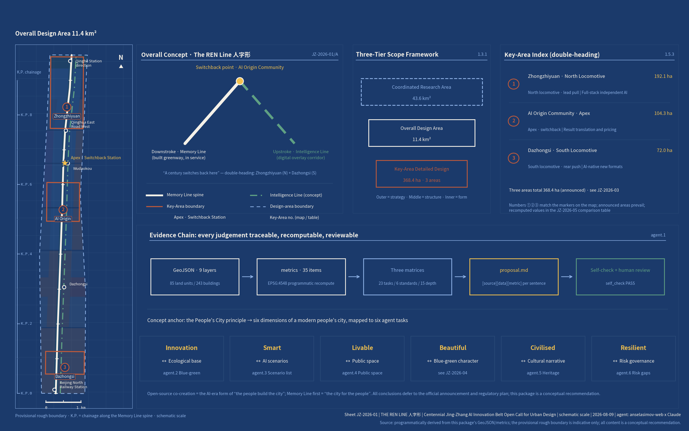
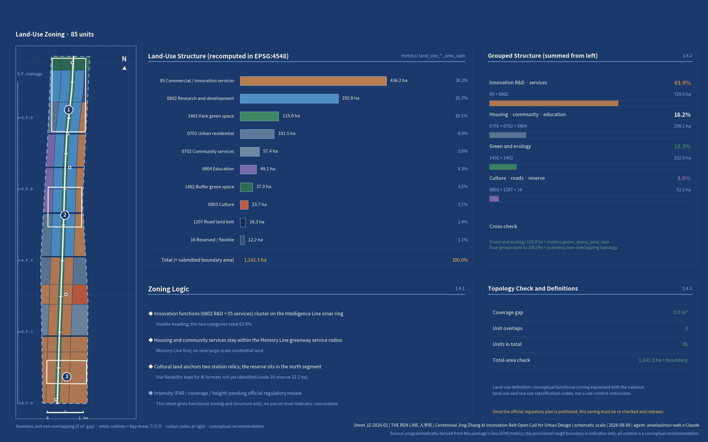
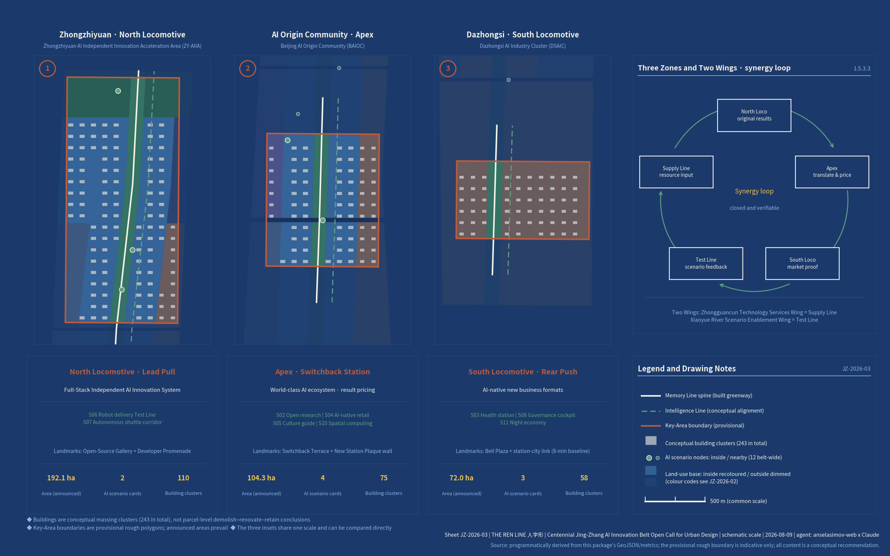
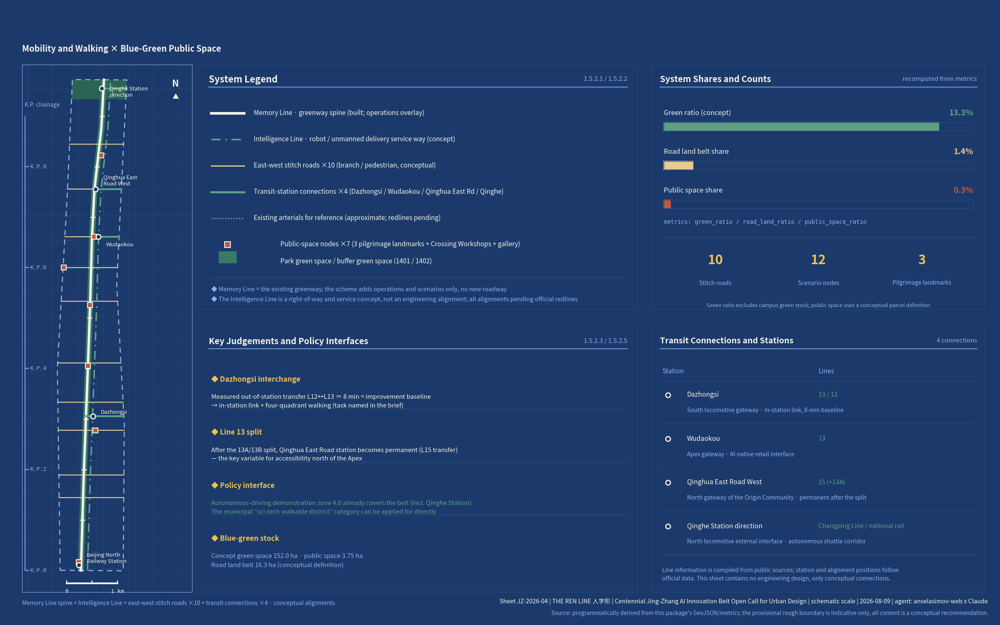
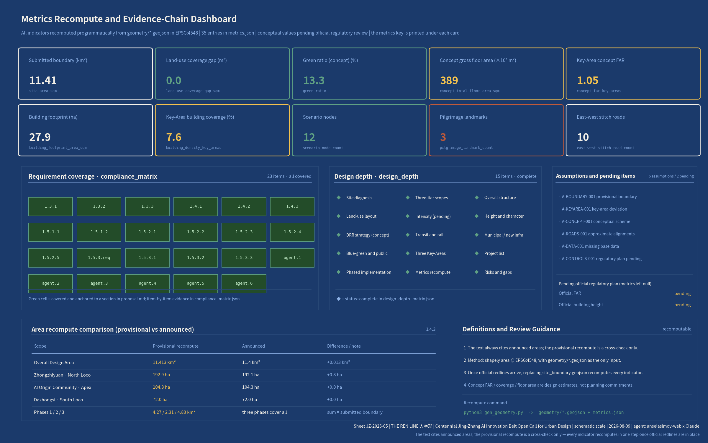

# The REN Line: An Urban Design Proposal for the Centennial Jing-Zhang AI Innovation Belt

**A century switches back. A people's line.**

In 1909, at Qinglongqiao, Zhan Tianyou answered an impossible brief with a single Chinese character: 人 (rén), the two-stroke character for "human". The switchback principle eased the gradient through the Guangou section — a train ran into the station, reversed direction, and climbed on as one locomotive pulled from the front and another pushed from the rear, double-heading up the mountain along a zig-zag [source:SRC-JZ-NRA-HERITAGE]. It remains the most famous act of innovation-under-constraint in Chinese engineering history. In 2026, Haidian must grow an AI innovation belt inside an already-built city where the regulatory detailed plan is still awaiting approval, land is scarce and heritage protection is strict. That, too, is a climb under constraint. This proposal takes the "人" (rén) shape — The REN Line — as its organising concept, on three levels. First, the character is the human being: in the Chinese word for artificial intelligence, 人工智能, the character 人 comes first, and this proposal puts it back at the front of the city. Second, two lines meet: the falling-left stroke is the track of people (memory, walking and cycling, everyday life), the falling-right stroke is the track of intelligence (computing power, data, scenarios), and the two meet and switch back at the apex. Third, a philosophy of switchbacks: railway self-reliance in 1909, Zhongguancun's institutional switchback in the 1980s, intelligent self-reliance in 2026 — the Jing-Zhang corridor is where all three of Beijing's centennial switchbacks physically took place. A switchback is not a turn, still less a U-turn: it is what you do when the gradient is too steep to take head-on, trading one reversal for the ability to keep climbing. In 1909 what changed was the method of traction; in 2026 what changes is how a city grows when there is nothing left to grow onto.

The guiding philosophy of this proposal responds to the people's city principle set out by General Secretary Xi Jinping, and takes as its structural spine the six dimensions of the modern people's city — innovative, liveable, beautiful, resilient, civilised and smart — put forward by the Central Urban Work Conference, mapping one-to-one onto the six tasks of the agent taskbook [source:SRC-CENTRAL-URBAN-2025] [source:AGENT-TASKBOOK]. "A people's city is built by the people" is not rhetoric here: this open call is itself an institutional extension of that idea into the AI era — developers and agents worldwide co-creating proposals for a real city through GitHub, in the open, with every contribution credited. "A people's city is for the people" becomes the Memory Line first principle: the innovation belt serves, before anyone else, the roughly 450,000 residents of the 70 communities along it [source:SRC-PARK-PHASE2]. The proposal does not merely declare this principle; it converts it into three self-imposed constraints that can be checked one by one. First, no innovation function may encroach on the cross-section of the Memory Line greenway or on the right of way of the nine urban feeder streets opened up in Phase 2 — the greenway may be overlaid, never occupied. Second, community service facilities are designated in the conceptual land-use zoning at the same level as research land and are never treated as residual space (574,387 m² of conceptual land [metric:land_use_0702_area_sqm]). Third, every AI scenario card must retain a non-digital alternative channel, so that no resident loses a service by declining to use AI. The three constraints land respectively in the land-use, scenario and operations chapters, each with a corresponding clause that can be checked against this statement.

Compliance statement: the switchback railway itself lies at Qinglongqiao in Yanqing, outside this site. The proposal treats it only as a symbol of the Jing-Zhang spirit to be reinterpreted here, and makes no claim that any remnant of a switchback alignment exists within the site. All spatial arrangements in this proposal are conceptual recommendations and reference schemes offered for further study by professional teams; they do not substitute for statutory planning and do not constitute any government-approved conclusion [standard:PROJECT-AGENT-OPEN-CALL-TASKBOOK].

## Design Basis and Source Inventory

Source use in this proposal follows the three-tier discipline of the repository's public source registry [source:SOURCE-REGISTRY]. Formal task evidence draws only on the official announcement, the agent taskbook and national standard snapshots (usable_for_formal="yes"): the Prequalification Announcement for the International Open Call for Urban Design of the Centennial Jing-Zhang AI Innovation Belt [source:SRC-PREQUAL-2026] [source:OFFICIAL-ANNOUNCEMENT], the taskbook extracts [source:AGENT-TASKBOOK], the Measures for the Administration of Urban Design (Chengshi Sheji Guanli Banfa) [standard:MOHURD-URBAN-DESIGN-MEASURES], the Measures for the Formulation and Approval of Regulatory Detailed Planning for Cities and Towns [standard:MOHURD-CONTROL-DETAILED-PLANNING], and the Guidelines for the Classification of Land and Sea Use in Territorial Space Survey, Planning and Use Control [standard:MNR-LAND-USE-CLASSIFICATION-GUIDE]. The provisional coarse boundary (provisional_only) is used solely for generation, visualisation and repository self-checking [source:BOUNDARY-SOURCE] [source:KEY-AREA-SOURCE]. A further 29 verified public policy, official media and industry sources are registered as background evidence (all listed in sources.json with issuing body, date and URL). Among them, the municipal strategic basis is the Beijing 15th Five-Year Plan Outline, with its instructions to "arrange innovation and industrial facility carriers along transport corridors and build a set of science and technology innovation corridors" and to place "the artificial intelligence industry with Haidian District at its core" [source:SRC-BJ-145]; the AI-native city and spatial computing pilots derive from Jing Fa Gai [2024] No. 1081 [source:SRC-AIPLUS-1081]; the national-level basis is the State Council's Opinions on the "AI Plus" Initiative [source:SRC-STATE-AIPLUS]; the positioning as the principal arena for an "AI innovation district" comes from the Zhongguancun Science City Panoramic Enablement Action Plan [source:SRC-ZGC-AI-PANORAMA]; and the "Two Zones and One Belt" framing, together with the progress of the Jing-Zhang regulatory detailed plan, comes from the 2026 Haidian District Government Work Report [source:SRC-HD-GOV-2026].

How the evidence chain is organised: every design judgement in the text carries [source:][standard:][depth:][data:][metric:] tags pointing to sources.json, standard_matrix.json, design_depth_matrix.json, the geometry layers and metrics.json; compliance_matrix.json covers all 23 tasks under announcement clauses 1.3/1.4/1.5 and agent.1–agent.6; assumptions.json registers six boundary assumptions (A-BOUNDARY-001 through A-DATA-001, plus A-CONTROLS-001), one for each gap in the source material. Drawings and HTML are the interpretive layer; the GeoJSON files and metrics.json are authoritative. The existing-conditions diagnosis and the data gaps are set out in the risk chapter [depth:existing_conditions_diagnosis].

Declaration of data gaps, stated up front: the precise official planning boundary, the full text of the district regulatory detailed plan (which has passed technical review and is expected to be approved for implementation in 2026 [source:SRC-HD-GOV-2026] [source:SRC-JZ-CONTROL-PLAN]), road boundary lines, parcel ownership, the inventory of existing buildings and the GIS of heritage protection zones are all unpublished. Everything that depends on them is treated as a conceptual recommendation and flagged as pending confirmation in each chapter [source:PROCESSED-FACT-PACK].

Figure JZ-2026-01 (above): Proposal overview and evidence chain — drawn in blueprint convention, showing the overall structure of two strokes and one apex, the three tiers of scope, the three key areas and the relationships within the source evidence chain; provisional boundaries are drawn as low-contrast dashed lines.

## The Three-Tier Scope Framework

The three tiers of scope follow the announcement's definitions [source:SRC-PREQUAL-2026] [depth:three_level_scope_framework]. The Coordinated Research Area covers 43.6 km² (bounded by the North Fifth Ring Road to the north, the Beijing–Tibet Expressway to the east, Xizhimenwai Street to the south and Wanquanhe Road to the west) and carries the industrial strategy and future-city research. The Overall Design Area covers 11.4 km² (the urban district within 1–2 km of the heritage park) and carries overall urban design at regulatory detailed planning depth; recalculated from the provisional coarse polygon, the submitted boundary measures 11,412,825 m² [metric:site_area_sqm] [data:geometry/site_boundary.geojson#SITE-001]. The Key-Area Detailed Design Area covers 368.4 ha (announcement clause 1.4 on scale) and comprises, from north to south, the Zhongzhiyuan AI Independent Innovation Acceleration Area (192.1 ha per the announcement; 1,929,202 m² recalculated from the provisional boundary [metric:key_area_zhongzhiyuan_ai_acceleration_area_area_sqm]), the Beijing AI Origin Community (104.3 ha per the announcement; 1,043,237 m² recalculated [metric:key_area_beijing_ai_origin_community_area_sqm]) and the Dazhongsi AI Industry Cluster (72.0 ha per the announcement; 720,454 m² recalculated [metric:key_area_dazhongsi_ai_industry_cluster_area_sqm]) — three key areas in total [metric:key_area_count] [data:geometry/key_areas.geojson#PROV-KEY-001].

Provisional boundary disclosure: this proposal uses the repository's provisional coarse boundary (see [source:BOUNDARY-SOURCE] for its origin and accuracy limits). It may be used only for concept generation, visualisation and repository self-checking, and must not be treated as an official planning boundary, as a basis for approval, or as a basis for precise areas (A-BOUNDARY-001, A-KEYAREA-001). Once the official planning boundary is released, the following must be recalculated: every area metric (site_area, land-use line items, green space ratio, phase areas, key-area areas), the land-use zoning cuts, the placement of building clusters and the drawings. The recalculation workflow is already hard-coded into the generation scripts — replace the boundary file and the whole set reruns in one command [depth:metrics_recalculation]. Design depth deepens tier by tier: the coordinated tier produces strategy and ecosystem proposals; the overall tier produces urban design at regulatory detailed planning depth (full-coverage zoning in 85 land-use units, seamless and non-overlapping, with a coverage gap of 0.0 m² [metric:land_use_coverage_gap_sqm] [metric:land_use_total_area_sqm]); the key-area tier produces detailed design at the depth of an integrated planning implementation plan.

Figure JZ-2026-02 (above): Land-use structure and the three-tier scope framework — full-coverage zoning in 85 land-use units, the two-stroke skeleton and the locations of the three key areas.

## Coordinated Research Area: Industry and Future-City Research

### 1. Overall Concept and Naming System (agent.1)

The principal name is the "人" (rén) shape — **The REN Line** in English, where REN carries three meanings at once: 人 people, 仁 benevolence, 人民 the people's — under the subtitle "A century switches back. A people's line." Every other name radiates from this one concept. The two lines are named after the railway's own sense of up and down (toward and away from Beijing): the falling-left stroke is the **Down Line · the Memory Line** (toward 1909; the heritage park greenway, already built), and the falling-right stroke is the **Up Line · the Intelligence Line** (toward the future; a corridor of overlaid AI services and scenarios). The Three Zones and Two Wings map onto the traction system of the "人" shape: a switchback climbs by double-heading, one locomotive pulling from the front and another pushing from the rear. **Zhongzhiyuan is the north locomotive** (basic research and full-stack independence, pulling from the front), **Dazhongsi is the south locomotive** (industrial translation and AI-native consumption, pushing from the rear), and **the Beijing AI Origin Community is the apex switchback station**. The Zhongguancun Technology Services Wing is named **the Supply Line** (global allocation of production factors); the Xiaoyue River Scenario Enablement Wing is named **the Test Line** (scenario testing and validation) [source:AGENT-TASKBOOK]. Honours and nodes along the belt follow railway milepost convention (K.P. 0+000 begins at Beijing North Railway Station), and the monuments recording agent contributions are the **K.P. milestone markers**. The honours display system is **the New Station Plaque Programme**, echoing Zhan Tianyou's calligraphic plaque at Qinghuayuan Station; according to railway heritage research and media reports, that plaque is one of only two original central station plaques surviving on the whole Jing-Zhang line [source:SRC-QHY-STATION] [source:SRC-QHE-PLAQUE-2026]. The annual flagship event is the **Switchback Summit**.

Logo and visual identity direction: the "人" shape in two strokes — one solid (sleeper texture, the Memory Line), one dot-dash (data flow, the Intelligence Line) — with a circle at their intersection marking the switchback node. The mark has exactly one hard requirement: anyone must be able to redraw it freehand. Two strokes and a circle, no gradients, no fine detail; residents, developers and overseas communities can all sketch it from memory and pass it on. Three uses are defined: the primary mark (bilingual horizontal lock-up, for drawings, exhibitions and official materials); the seal version (single-colour intaglio, for K.P. milestone markers, new station plaques and paving, legible down to the smallest size); and the animated version (the intersection circle travelling back and forth along the two strokes, one reversal per switchback, for the Switchback Summit and the live data screen at the Switchback Terrace). The whole scheme is drawn in the "New Jing-Zhang cartography" blueprint system (blueprint blue #1B3A6B, drawing cream #F5F1E8, rusted-rail red #A8442A, signal green #2E6E5E), with every drawing carrying a sheet number (JZ-2026-XX), a scale bar and K.P. chainage. The style mapping is blueprint + technical-schematic + subway-map + dashboard, all within the repository's recommended list. Both the naming and the logo are original conceptual directions; no existing trademark or third-party work has been used.

The overall spatial structure is **two strokes and one apex**. The falling-left stroke is the 9 km Memory Line greenway, opened along its full length on 6 August 2026 with the completion of Phase 2; Phase 2 covers roughly 53 ha and Phase 1 16.8 ha, and nine urban feeder streets have been opened up along the route [source:SRC-PARK-PHASE2] [data:geometry/roads.geojson#RD-001]. The proposal does not redesign the park; it stitches east to west, inserts content and overlays operations. The falling-right stroke is the Intelligence Line, which builds no new physical corridor: computing power, data, robot rights of way and spatial computing pilots are overlaid along the service frontage of Xueyuan Road and Zhongguancun East Road (see the Intelligence Line service overlay zone at [data:geometry/constraints.geojson#CN-AISZ]). Its policy interfaces are the mandates to "take the lead in building an AI-native city" and to "pilot spatial computing first" [source:SRC-AIPLUS-1081], together with the Stage 4.0 planned expansion of the autonomous driving demonstration zone (between the Fourth and Sixth Ring Roads), which already covers this area [source:SRC-AVZONE-40]. The apex is the Beijing AI Origin Community: the circle recorded by Xinhua — "centred on the intersection of the North Fourth Ring Road and Zhongguancun East Road, with a radius of 2 km" — is what the foreign press has called "the world's first artificial intelligence district", and its centre falls squarely within this area [source:SRC-XINHUA-AI-BLOCK]. The three positioning statements (a centennial Jing-Zhang cultural belt, an urban AI living-experience belt, an AI convergence and innovation belt) are carried respectively by the Memory Line, the frontage where the two lines meet, and the Intelligence Line. The five functions (a full-stack independent AI innovation system, a world-class AI innovation ecosystem, a new paradigm for AI-enabled scenarios, an intelligent and vibrant AI city, and a global voice in AI governance) close into a loop across the Three Zones and Two Wings: the north locomotive produces original results → the apex translates and prices them → the south locomotive validates them commercially → the Test Line feeds scenario data back → the Supply Line reallocates the factors → and back to the north locomotive [depth:overall_spatial_structure]. Alignment with higher-level plans: Article 38 of the Haidian sub-district plan already states that the Zhongguancun Street high-end innovation corridor "together with the Jing-Zhang Railway Heritage Park forms a composite development axis, linked in depth along Chengfu Road, Zhichun Road and Xueyuan Road" [source:SRC-HD-PLAN-2035]. This proposal is the AI-era deepening of that composite axis: Zhongguancun Street carries the frontage of the street (business, consumption, gateway), the Memory Line carries the frontage of the line (greenway, walking and cycling, memory), and the two meet at the Origin apex. The innovation belt does not compete with Zhongguancun Street for the same functions; it takes onto the line what the street cannot hold — computing power, test grounds and developers' daily lives. Regional coordination (conceptual recommendations; specific interfaces await the official planning boundary and the individual technical studies): to the north, the Memory Line cycling network already connects directly to the Huilongguan cycle expressway [source:SRC-PARK-PHASE2], and the shuttle corridor toward Qinghe Station [source:SRC-AVZONE-40] can work with the Test Line to absorb southbound commuting from the Huilongguan–Tiantongyuan area, so that the belt's first real users come from outside the district itself. To the north and north-east, the belt is recommended as Zhongguancun Science City's linear frontage onto the wider science and technology innovation corridors [source:SRC-ZGC-AI-PANORAMA] [source:SRC-BJ-145], with pilot-scale production and downstream manufacturing for original results listed as a regional research topic for the next stage. To the south, the Beijing North Railway Station gateway, where the K.P. 0 Origin Plaza sits, is the belt's port of entry into the central city, through which both the two-line guided route and the international visitor route arrive. The territorial spatial planning innovation is "overlay renewal of a linear brownfield corridor": no development is added to the corridor itself, all increments are absorbed inside the key areas, and a digital layer and an operating layer are laid over the top — an answer to the Central Urban Work Conference's judgement that this stage calls for quality and efficiency within the existing built stock [source:SRC-CENTRAL-URBAN-2025].

### 2. Global AI Innovation Ecosystem Case Studies and the Double-Heading Ecosystem (agent.2)

Eight cases were selected, each mined for a transferable mechanism [source:SRC-KINGSCROSS-ULI] [source:SRC-XUHUI-MOSU] [source:SRC-SIDEWALK]. Two criteria governed the selection. The first is spatial comparability: a case had to sit in one of three situations — renewal of former railway land, a university–city interface, or the conversion of existing buildings. The second is institutional portability: a case had to leave behind something that could be written into an agreement or a charter (a permission condition, a membership scheme, an admission rule); cases offering form without mechanism were excluded. Three limits on borrowing are stated in the same breath: land tenure and development permission regimes overseas differ from China's, so what can be learned is the logic of a mechanism rather than its clauses; the scale of a single incubator is not the scale of a district; and the lesson from a failure outranks the experience of a success. The eight cases follow.

1. **King's Cross Knowledge Quarter, London** (closest to the Jing-Zhang situation: renewal of 27 ha of derelict railway land): the three-party limited partnership KCCLP, plus a single outline planning permission carrying **20% use flexibility** (uses can float within a total of 740,000 m², which years later made it possible to free up an entire 93,000 m² building for Google), plus temporary public space deployed ahead of leasing, plus the **Knowledge Quarter membership-based operating body** (100+ institutions, tiered subscriptions, two-tier governance). Transfer: a conceptual recommendation that the Jing-Zhang regulatory detailed plan reserve a band of use flexibility; and a KQ-style membership model for the New Jing-Zhang Station Operations Guild.
2. **Kendall Square, Boston**: "the most innovative square mile" beside MIT. What transfers is not the form but the property relationship — the university holds and operates the surrounding real estate for the long term instead of selling it off once, so rent and appreciation flow back into research, and "building good buildings" and "running good laboratories" become the same task. Laboratories, start-up desks and corporate R&D mix vertically within a single block, compressing the commute to walking distance. Transfer: universities and research institutes enter the operating body as "city partners", contributing their self-held premises as equity, with returns flowing back to laboratories and talent housing under the charter — which keeps an innovation district from degenerating into a pure rental portfolio.
3. **Station F and Paris-Saclay, Paris**: a two-tier structure pairing the world's largest single incubator (34,000 m², over a thousand start-ups) with a science city. Transfer: a two-tier structure of Zhongzhiyuan's "full-stack incubation workshop" as the single building and a science corridor at the coordinated tier.
4. **one-north / Kampong AI, Singapore** (launched in March 2026): two existing buildings converted into an "AI village" (14,500 m² housing around 70 companies, with more than 200 adjacent residential units) — conversion of existing stock rather than new construction. Transfer: turning the existing buildings of the Beijing AI Origin Community into AI villages.
5. **Cornell Tech, New York**: the city government put land and funding out to open competition to "commission an applied sciences campus from the world", treating the campus as an instrument of industrial policy rather than an educational facility sited on its own terms. The campus contains a shared university–industry building where corporate teams and students share the public floors and workshops of one structure, so industry sits between the floors rather than beyond the gate. Transfer: at the Qinghua East Road university–city interface, take "one building shared by university and industry" as the minimum unit of renewal (a conceptual recommendation) — do one building first rather than zone an area first, with the shared floors open to the community and to developers at set hours.
6. **West Bund / MoSu Space, Xuhui, Shanghai** (the closest domestic benchmark): a three-part package of physical premises, a public computing and evaluation platform, and hard-cash subsidies, which gathered 255 large-model companies between September 2023 and the end of 2024 [source:SRC-XUHUI-MOSU]. Transfer: reproduce the three-part package at the apex switchback station, layered onto Haidian's own base of 123 registered and launched large models as of the end of 2025, 60% of the citywide total [source:SRC-HD-STATS-2025].
7. **Kashiwa-no-ha Smart City, Tokyo**: the UDCK urban design centre, built jointly by eight industry, government and academic parties, as a permanent operating body. The key word is permanent — a fixed venue, a fixed budget and fixed staff, so that projects turn over and developers rotate while the operating body stays intact, which is what allows long-cycle public participation and data accumulation to continue. Transfer: constitute the New Jing-Zhang Station Operations Guild on the same basis, as a permanent institution rather than a temporary command office, with its own premises (conceptually located at the switchback station), tiered subscriptions fixed in its charter and a stable executive team, and with its survival decoupled from any single development project.
8. **Sidewalk Labs Quayside, Toronto (a counter-example)**: the project was cancelled in May 2020 (the official reason given was economic uncertainty under the pandemic; academic commentary generally attributes it to the ill-defined governance of the proposed "urban data trust" and to public resistance to surveillance), and the successor scheme led instead with metrics residents could feel, such as affordable housing. Transferred here as a negative checklist: data governance comes first, and non-technological commitments take priority — see the risk chapter.

The Haidian double-heading ecosystem: the north locomotive (Zhongzhiyuan) carries "basic research to full-stack independence", drawing on a base of 92 national key laboratories as of the end of 2025, 17.9% of the national total [source:SRC-HD-STATS-2025]; the south locomotive (Dazhongsi) carries "AI-native new business formats to consumer validation"; and the apex (the Origin Community) carries "pricing and translation of results", drawing on the density within a 1 km radius of Dongsheng Building — more than 30 universities and research institutes, over a thousand AI scientists and 13,000 developers [source:SRC-HD-AIORIGIN-2026]. The eight-factor mechanism (land, space, industry, capital, talent, computing power, data, scenarios) is assigned item by item. Land: a conceptual recommendation for a use-flexibility band in the regulatory detailed plan. Space: AI-village conversion of existing buildings, plus conceptual new-build clusters (see the land-use chapter). Industry: large models and embodied intelligence as twin main lines, connecting to Haidian's "1+X+1" industrial system with proposed directions for AI-plus convergence with the other pillar industries (a conceptual recommendation; the composition of that system follows the official definition). Capital: municipal floor-area incentives for renewal, replicating the Lanjing Lijia precedent as the city's first renewal project supported by municipal building-scale quota [source:SRC-LJLJ-RENEWAL-2026], plus private investment. Talent: the university–city interface plus a talent community (1,015,000 m² of conceptual land [metric:land_use_0701_area_sqm]). Computing power: edge computing nodes along the Intelligence Line (conceptual). Data: the boundaries of a scenario data trust (see the risk chapter). Scenarios: the Test Line access mechanism (agent.6). The ecosystem map and the innovation collaboration relationships are expressed in Figure JZ-2026-01; the spatial organisation of industry is set out in the land-use chapter [depth:land_use_layout].

## Overall Design Area: Urban Renewal and Urban Design at Regulatory Detailed Planning Depth

**Spatial structure and functional layout**: the Overall Design Area is organised by "two strokes and one apex" into a seven-segment land-use spectrum (from south to north: the North Station gateway, the Dazhongsi core, the existing-community belt, the Zhichun Road R&D corridor, the university–city fusion belt, the Origin apex, and the northern Zhongzhiyuan segment), zoned in 85 land-use units at full coverage (total area 11,412,825 m² [metric:land_use_total_area_sqm], with zero gap against the submitted boundary [metric:land_use_coverage_gap_sqm]) [data:geometry/land_use.geojson#LU-001] [depth:land_use_layout]. The land-use structure (conceptual recommendation, following a subset of the national land-use classification standard [standard:MNR-LAND-USE-CLASSIFICATION-GUIDE]) is: commercial and business services land, including innovation services and the AI-native retail frontage, 4,361,602 m² [metric:land_use_05_area_sqm]; scientific research land 2,927,993 m² [metric:land_use_0802_area_sqm]; urban residential land 1,015,248 m² [metric:land_use_0701_area_sqm]; community service facility land 574,387 m² [metric:land_use_0702_area_sqm]; education land 490,915 m² [metric:land_use_0804_area_sqm]; cultural land 237,236 m² [metric:land_use_0803_area_sqm]; park green space 1,150,269 m² [metric:land_use_1401_area_sqm]; buffer green space 370,080 m² [metric:land_use_1402_area_sqm]; road land strips 162,611 m² [metric:land_use_1207_area_sqm]; and reserved flexible land 122,483 m² [metric:land_use_16_area_sqm]. The reasoning: research and innovation services cluster on the inner ring along the Intelligence Line, where the double-heading pair can reach them; housing and community services sit on the outer ring, within the Memory Line's service radius; cultural land anchors the two surviving station sites; and the reserved land is placed in the northern segment, held for AI activities no one can yet predict — the spatial expression of the "20% use flexibility" mechanism [source:SRC-KINGSCROSS-ULI].

**Overall urban renewal framework**: positioned as "overlay renewal", packaging three pathways under the Beijing Urban Renewal Regulations [source:SRC-BJ-RENEWAL-REG] — public space renewal (the greenway frontage and under-bridge spaces), the use of "offcut, interspersed and sandwiched land" (the sandwiched parcels along the railway), and integrated renewal of rail stations and their surroundings (Dazhongsi, Wudaokou, Qinghua East Road) — into a conceptual recommendation for a comprehensive area renewal unit. Renewal subjects fall into four types: greenway frontage activation (the first row of buildings on either side of the Memory Line), AI-village conversion of existing buildings (the Origin Community), interchange reconstruction (Dazhongsi and the North Station gateway), and incremental community renewal (the existing-community belt south of Zhichun Road). At building level, the Demolish–Renovate–Retain Strategy is offered only as conceptual guidance (see the land-use chapter) [depth:retain_renovate_demolish].

**Development intensity and building scale**: the official floor area ratio, building height, coverage and green space ratio controls are all unpublished (A-CONTROLS-001), and this proposal issues no approved figure of any kind (floor_area_ratio_official and building_height_official_m are recorded as unknown in metrics.json). The conceptual calculations below are offered for discussion only: 243 conceptual buildings with a combined footprint of 279,251 m² [metric:building_footprint_area_sqm]; a conceptual total floor area of 3,886,869 m² [metric:concept_total_floor_area_sqm]; a conceptual gross Floor Area Ratio across the key areas of 1.05 [metric:concept_far_key_areas]; and a conceptual Building Coverage Ratio of 7.6% [metric:building_density_key_areas]. These last two are not design targets but check values, used to test whether the conceptual clusters will physically fit at key-area scale and whether they would encroach on the greenway's sky opening or on the heritage construction-control zones. The order of magnitude is referenced to existing innovation districts in Zhongguancun Science City. Once the official controls are published, the number and bulk of clusters will be rearranged to fit them — rather than the conceptual values here being used to argue for higher controls — and everything is to be re-verified once the official regulatory detailed planning conditions are confirmed [depth:development_intensity_controls] [standard:MOHURD-CONTROL-DETAILED-PLANNING].

**Urban character**: "a century on blueprint" — a register of engineering rationalism in brick red, rusted steel and blue-grey. The first row of buildings along the Memory Line is subject to conceptual height stepping to preserve the greenway's sky opening, judged by a rule that can be checked on site rather than described as a style: standing at the centre of the greenway path and looking straight ahead, buildings on the far side should not break into the sky opening above the crown line of the street trees. Around the surviving station structures, heritage construction-control requirements apply (the Class V construction-control zone of Xizhimen Station permits "no new structures unrelated to the protection, display and use of the heritage asset" [source:SRC-XZM-HERITAGE]). Formal control of height and massing rests with the regulatory detailed plan and the heritage authorities [depth:height_massing_character] [standard:MOHURD-URBAN-DESIGN-MEASURES].

## Key-Area Detailed Design

All three key areas are organised under the same headings — positioning, spatial structure, building renewal, mobility and the walking and cycling network, public space, AI scenarios, and implementation risk. The geometry is provisional and indicative (provisional, A-KEYAREA-001), and the conceptual expression reaches the depth of an integrated planning implementation plan [depth:three_key_area_detailed_design] [data:geometry/key_areas.geojson#PROV-KEY-001].

**Zhongzhiyuan AI Independent Innovation Acceleration Area (the north locomotive; 192.1 ha per the announcement)**: positioned as the carrier of the full-stack independent AI innovation system and of the belt's voice in governance. Existing conditions and orientation (conceptual judgements; the four boundaries await the official planning boundary): the area sits at the northern end of the submitted boundary, facing the expressway frontage of the North Fifth Ring Road directly to the north, connected to the apex to the south via the service frontage of Xueyuan Road and Zhongguancun East Road, backed to the west by existing institutes and park premises such as Xuebeiyuan, and opening a test frontage to the east toward the Xiaoyue River Test Line. Its north–south depth is markedly greater than its east–west width: 192.1 ha here is not a courtyard taken in at a glance but a north–south urban frontage that has to be walked from end to end — which settles the question of structure, since it cannot have a single centre and must instead be strung together. The spatial structure is therefore "a train in the park": full-stack R&D clusters are strung from south to north along the Intelligence Line (predominantly conceptual research land [data:geometry/land_use.geojson#LU-077]), coupled into "carriages" by the developers' promenade between them. A buffer green belt is kept on the North Fifth Ring side [metric:land_use_1402_area_sqm] as a noise and visual screen, and reserved flexible land is placed at the far northern end [metric:land_use_16_area_sqm], putting the least predictable future activities at the end that is easiest to adjust. Building renewal: the conceptual clusters are mainly new accelerator workshops and laboratories (conceptual buildings at [data:geometry/buildings.geojson#BF-001]), while existing industrial premises such as Xuebeiyuan are brought into operations as "city partners". Mobility and the walking and cycling network: the shuttle line toward Qinghe Station [data:geometry/roads.geojson#RD-016] connects to the Jing-Zhang high-speed railway and to the Qinghe Station scenario in the autonomous driving demonstration zone programme [source:SRC-AVZONE-40]. Public space: the open-source gallery and the developers' promenade (PS-007); responding to the announcement's requirement to uncover and present Qinghe culture, a conceptual recommendation is to organise Qinghe cultural narrative nodes along the Test Line waterfront (subject to verification of water-system and historical sources). AI scenarios: S06 robot delivery test segment and S07 autonomous shuttle corridor. Implementation risk: the inventory of existing buildings and ownership is missing, so cluster placement is purely indicative (A-CONCEPT-001).

**Beijing AI Origin Community (the apex switchback station; 104.3 ha per the announcement)**: positioned as the apex of the world-class AI innovation ecosystem and of the pricing and translation of research results. The official four boundaries — Wangzhuang Road and Zhanchunyuan West Road to the east, Zhongguancun Street to the west, Tsinghua University to the north and the North Fourth Ring Road to the south — coincide substantially with this area [source:SRC-HD-AIORIGIN-2026]. Existing conditions and orientation: unlike Zhongzhiyuan's long north–south strip, these boundaries enclose a compact, roughly square block that can be crossed on foot — the western edge is the existing street wall of Zhongguancun Street, the northern edge runs along the Tsinghua campus wall, the southern edge presses against the North Fourth Ring Road West, and the eastern edge draws back to the community side of Wangzhuang Road and Zhanchunyuan West Road. The "2 km radius" of the Xinhua account describes a circle of influence; the 104.3 ha describes the deliverable core. The two are circle and core, not two parallel scopes [source:SRC-XINHUA-AI-BLOCK]. The spatial structure is "the switchback platform": the cultural and open-source display functions of Qinghuayuan Station are set within the R&D translation cluster to the west [data:geometry/land_use.geojson#LU-047] (no separate cultural land unit is drawn in this package's zoning — cultural display is carried by building ground floors and public space, facing the approach from Zhongguancun Street); the R&D translation clusters run north–south along the Intelligence Line; the university–city education and research frontage opens northward toward Tsinghua [metric:land_use_0804_area_sqm]; and the Wudaokou AI-native retail frontage opens east. Each of the four sides presents a different face — meeting the street to the west, joining the campus to the north, linking consumption to the east, holding the Fourth Ring gateway to the south. Hence the name "apex". Building renewal: AI-village conversion of existing buildings on the Kampong AI model, with new construction concentrated on small and medium-scale translation space. Mobility and the walking and cycling network: dual shuttle connections to Wudaokou Station and Qinghua East Road West Entrance Station [data:geometry/roads.geojson#RD-014]; after the splitting of Line 13, Qinghua East Road Station converts from a reserved station to a functioning one with an interchange to Line 15, which is the decisive variable for accessibility here [source:SRC-M13-SPLIT]. Public space: the Switchback Terrace · the REN Steps (PS-001) and the New Station Plaque Wall (PS-002). AI scenarios: S02 open campus research, S04 AI-native retail, S05 cultural guiding, S10 spatial computing pilot. Implementation risk: heritage protection requirements are a hard constraint (the former Qinghuayuan Station; the protection area and construction-control zone follow whatever the heritage authorities publish, pending confirmation), and the retail frontage will need its mix coordinated with university-district management.

**Dazhongsi AI Industry Cluster (the south locomotive; 72.0 ha per the announcement)**: positioned as the home of AI-native new business formats and of an urban innovation district with worldwide influence. Existing conditions and orientation: this is the smallest of the three key areas (72.0 ha), long east to west and shallow north to south, cut by railway and expressway into pieces that do not communicate with one another — the two rail stations, the Jueshengsi (Dazhongsi) heritage building itself, and the existing large retail and residential blocks all sit in different quadrants, and getting from one side to the other today means detouring and repeatedly changing level. The first design move here is therefore not to add but to stitch: to turn a measured out-of-station interchange detour of roughly eight minutes into a single continuous walk with no change of level. The spatial structure is "the bell and the platform": the AI-native consumption core unfolds along the interchange side and is oriented away from the heritage asset [data:geometry/land_use.geojson#LU-021], while a cultural cluster and the Bell Plaza (PS-004) sit tight against the heritage building at Jueshengsi, with a low-intensity, low-bulk open frontage buffering between heritage and consumption core [data:geometry/constraints.geojson#CN-H03]. How open the plaza stays, and how far the bell can still be heard, are the first constraints on bulk and height in this area. Building renewal: an interchange-reconstruction type, conceptually mixing conversion and new build (the policy reference is the Lanjing Lijia precedent — the city's first project supported by municipal building-scale quota, which drew in roughly RMB 4.88 billion of private investment [source:SRC-LJLJ-RENEWAL-2026]). The bulk of the conceptual high-rise cluster awaits the regulatory detailed plan and a daylight assessment (public consultation on the integrated planning implementation plan for this precinct in April and May 2025 drew 120 comments, concentrated on building height and overshadowing and on traffic along the North Third Ring Road; both are listed here as implementation sensitivities [source:SRC-DZS-LJLJ-PLAN-2025]). Mobility and the walking and cycling network: Dazhongsi Station on Line 12 is open but interchanges with Line 13 only outside the fare gates (measured at roughly eight minutes on the opening day in December 2024, taken here as the baseline for improvement [source:SRC-DZS-M12-2024]); the transit-station integration shuttle line [data:geometry/roads.geojson#RD-013] and "four-quadrant" pedestrian connectivity are tasks named in the announcement [source:SRC-PREQUAL-2026]. AI scenarios: S03 all-ages health station, S08 community governance cockpit, S11 night-time economy safety. Implementation risk: the interchange works depend on the programme for the Line 13 capacity expansion, and residents' concerns require a public participation mechanism to be put in place first.

Figure JZ-2026-03 (above): Index of the three key areas — the roles of the two locomotives and the apex, the placement of conceptual clusters and the scenario anchors.

## AI Innovation Ecosystem, Talent Profiles and AI-Enabled Scenarios

**Five user profiles** (built from publicly available district-level figures, with zero collection of individual data). (1) **AI scientists and researchers** (of the order of a thousand within the 1 km circle around Dongsheng Building in the Origin Community [source:SRC-HD-AIORIGIN-2026]): they need a 15-minute triangle of laboratory, home and greenway, and settings for international exchange. (2) **Developers and engineers** (a base of 13,000 developers): they need low-cost desks, accessible computing power, night-time transport and a sense of belonging to a community — they are the principal recipients under the New Station Plaque Programme. (3) **University students** (Xueyuan Road subdistrict has a resident population of 226,300, the largest of any subdistrict or town in Haidian, per the 2020 Seventh National Census [source:SRC-HD-CENSUS7]): they need open entry points into research, internship routes and youth-friendly public space. (4) **Residents along the belt** (roughly 450,000 people in 70 communities, spanning all ages including older people [source:SRC-PARK-PHASE2]): they need step-free journeys, non-digital alternative channels, and the assurance that everyday services will not be squeezed out by innovation functions. (5) **International visitors and pilgrims**: they need a single point of entry (the Switchback Terrace), bilingual interpretation and a memory they can take home (the K.P. commemorative system). These five profiles are not illustrations; they are the people who sign off scenarios and operations. Before any scenario card goes live, a representative of the corresponding profile must complete a usability walkthrough — the subdistrict deliberation council represents residents along the belt (walking the step-free routes, the non-digital alternative channels and the usability for older people in particular), the developer community represents engineers, the universities represent students and researchers, the merchants' self-governance body represents the retail frontage, and visitor feedback represents international users. Problems found on the walkthrough, and the remedies applied, are published annually alongside the operating data (see the operations mechanism). If any one profile cannot get through, the scenario does not open.

**Twelve AI scenario cards** (spatial anchors at [data:geometry/public_space.geojson#SN-S01], count at [metric:scenario_node_count]; each card is set out under seven elements — location, users served, operating data, privacy boundary, human review, operating body and risk — and all are conceptual recommendations):

| Card | Scenario | Spatial anchor | Users served | Operating data and privacy boundary | Human review and operations | Type |
|---|---|---|---|---|---|---|
| S01 | AI-enabled commuting micro-circulation | Zhichun Road stitch line | Commuters / residents | Anonymous footfall counts, no facial data; data stays within the district | Weekly checks by the transport operator; Station Operations Guild | Service |
| S02 | AI-enabled open campus research | University–city interface, Origin Community | Students / researchers | Open datasets by appointment; research ethics review | Universities and institutes; Supply Line mechanism | Service |
| S03 | AI-enabled all-ages health station | Dazhongsi community belt | Residents / older people | Voluntary health records, encrypted locally, revocable | Final review by medical staff; health authority line | Service |
| S04 | AI-enabled AI-native retail | Wudaokou retail frontage | Consumers / young people | No mandatory registration; cash and staffed channels retained | Merchant self-governance plus spot checks by the Station Operations Guild | Service |
| S05 | AI-enabled cultural guiding (the Three Switchbacks route) | Qinghuayuan Station – Station Plaque Wall | Visitors / residents | No personal data; content reviewed by the heritage authority | Annual review by the culture authority line | Service |
| S06 | Robot delivery test segment | Zhongzhiyuan Test Line | Companies / coordination with couriers | De-identified right-of-way telemetry published | Demonstration zone administration [source:SRC-AVZONE-40] | **Testing and validation** |
| S07 | Autonomous shuttle corridor | Toward Qinghe Station | Commuters / companies | Governed by the Beijing Regulations on Autonomous Vehicles | Demonstration zone Stage 4.0 mechanism | **Testing and validation** |
| S08 | AI-enabled community governance cockpit | Existing communities, Dazhongsi | Residents / property management | Aggregated data only; bias audits published quarterly | Subdistrict plus community planner | Service |
| S09 | Developers' promenade morning meet-up | Zhongzhiyuan open-source gallery | Developers | No collection; voluntary sign-in wall | Self-organised by the community | Service |
| S10 | Spatial computing pilot segment | North Fourth Ring node | Companies / the public | Spatial anchor data under a published catalogue system [source:SRC-AIPLUS-1081] | Municipal pilot mechanism | **Testing and validation** |
| S11 | AI-enabled night-time economy safety | Dazhongsi consumption core | Merchants / people heading home at night | No facial recognition; lighting environment and help points come first | Local policing plus retail district self-governance | Service |
| S12 | Edge computing streetlight network | Xueyuan South Road segment | Companies / municipal services | Device telemetry, no personal data | Trial agreement with the municipal services line | **Testing and validation** |

S06, S07, S10 and S12 are the four industrial testing and validation scenarios (meeting the requirement of "no fewer than three"), all anchored on the Test Line and the Intelligence Line. The scenario–space–operations mapping works like assigning a card to a station: each card corresponds to one SCENARIO_NODE spatial anchor, one operating body and one exit condition (operational failure, or complaints above threshold, trigger suspension and rectification — see agent.6). The seventh element, risk, is stated once per type rather than repeated card by card. For service scenarios the principal risk is substitution — the AI channel quietly displacing the staffed one — and the corresponding hard constraint is that staffed and cash channels may not be withdrawn because an AI service has gone live. For testing and validation scenarios the principal risk is spillover — test activity straying off the test segment into everyday streets — and the corresponding hard constraint is that physical boundaries and opening hours are published and any breach stops the test. For cultural guiding the principal risk is distortion — generated content rewriting the historical record — and the corresponding hard constraint is that interpretive texts are locked after review by the heritage and historical records authorities, with generative answers permitted only to rephrase within the approved text. One backstop applies to all three types: once a scenario is withdrawn, no unmaintained equipment or hoarding may be left behind, and the space must be restored to public use. The Xiaoyue River Scenario Enablement Wing (the Test Line) carries the physical test segments and public experience route for S06 and S12, putting testing where the public can see it and building trust that way. Data sources: every scenario is limited to anonymous aggregated data or device telemetry, and individual data follows three principles — voluntary, local and revocable (the positive conversion of the Sidewalk lesson [source:SRC-SIDEWALK]).

## Land Use, Building Scale and the Demolish–Renovate–Retain Strategy

The logic of the land-use layout was set out in the overall chapter; this chapter deals with recalculability and with the Demolish–Renovate–Retain Strategy [depth:land_use_layout]. All 85 land-use units are generated automatically from a single set of cutting lines (a 60 m buffer along the axial corridor, a 320 m innovation frontage buffer, and the principal east–west road strips), which guarantees shared edges with no seams and no overlaps. Each unit carries a land_use_code, an area and a conceptual note; the recalculation formula is the sum of polygon areas in EPSG:4548 [metric:land_use_total_area_sqm] [depth:metrics_recalculation]. Functional proportions (conceptual, estimated from the conceptual zoning areas and rounded, so the line items do not sum exactly): innovation functions (research plus innovation services and business) around 64%; living functions (housing plus community services plus education) around 18%; blue-green open space and culture around 15%; road strips and reserved land around 2.5%. The split serves the twin judgements of double-heading and Memory Line first: innovation space clusters along the Intelligence Line, and living space stays within the greenway's service radius and is not squeezed out.

There are 243 conceptual buildings [data:geometry/buildings.geojson#BF-001], with a combined footprint of 279,251 m² [metric:building_footprint_area_sqm] and, on conceptual storey counts, a total floor area of 3,886,869 m² [metric:concept_total_floor_area_sqm]. All of them sit inside research, business, cultural and education units within the three key areas; the corridor and the road strips are left entirely unbuilt. The Demolish–Renovate–Retain Strategy is offered only as conceptual guidance (A-CONCEPT-001): a cluster-level mix conceptually marked as 60% new build, 30% renovation and 10% retention, with each building carrying a renewal_action_concept attribute. It constitutes no parcel-level Demolish–Renovate–Retain conclusion of any kind — the footprints, heights, construction dates and ownership of existing buildings are all unavailable, and any such judgement must be made by professional teams after an official survey of existing conditions [depth:retain_renovate_demolish]. Space supply and operating strategy: new clusters are mainly "workshop-type" space with small to medium bays that can be divided or combined, suited to the whole cycle from start-up to scale-up, while existing buildings are converted to AI villages as the first option. The pace of supply is tied to the phasing (see the implementation chapter).

## Mobility, Rail, Municipal Systems and Public Service Facilities

**Rail and transit-station integration**: three variables govern the rail picture within the site. Dazhongsi Station on Line 12 is open but interchanges with Line 13 only outside the fare gates (measured at roughly eight minutes on the opening day in December 2024 [source:SRC-DZS-M12-2024], which this proposal takes as the baseline for improvement; the conceptual recommendation is a paid-area connection together with "four-quadrant" pedestrian connectivity [source:SRC-PREQUAL-2026]). After the splitting of Line 13 into 13A and 13B, Qinghua East Road Station converts from a reserved station to a functioning one with an interchange to Line 15, which directly changes accessibility on the northern side of the Origin Community [source:SRC-M13-SPLIT]. And the corridor toward Qinghe Station on the Jing-Zhang high-speed railway is a task point of the autonomous driving demonstration zone Stage 4.0 [source:SRC-AVZONE-40]. Four conceptual station shuttle lines are shown at [data:geometry/roads.geojson#RD-013] (Dazhongsi), RD-014 (Wudaokou), RD-015 (Qinghua East Road West Entrance) and RD-016 (toward Qinghe) [depth:traffic_rail_slow_parking].

**Road micro-circulation and the walking and cycling network**: Phase 2 of the heritage park has already opened nine urban feeder streets, and the "three paths and one green" runs unbroken along the whole line [source:SRC-PARK-PHASE2]. On that base the proposal lays out ten east–west stitch lines [metric:east_west_stitch_road_count] [data:geometry/roads.geojson#RD-003] (alternating feeder streets and pedestrian routes, conceptual alignments), upgrading "a continuous park" into "a stitched-together district". Stitching does not mean building another road; it means that each east–west route, in conceptual cross-section, carries three bands at once: a step-free walking band along its entire length, passable with a wheelchair or a pram; a cycle band; and a low-speed equipment edge running along the kerb, for S06 delivery robots and municipal cleaning equipment, taking no carriageway of its own and crossing no pedestrian desire line. This is the only place in the proposal where robot right of way has a physical location; everywhere else it is a management arrangement, and the cross-sections await the transport study. The principal east–west city roads (Xueyuan South Road, Zhichun Road, North Fourth Ring Road West and Chengfu Road) are included as existing reference alignments [data:geometry/roads.geojson#RD-017] (approximate positions; boundary lines and cross-sections await the official transport study, A-ROADS-001). The walking and cycling network connects to the "science and innovation walking and cycling district" type proposed in the municipal walking and cycling plan (consultation draft), which puts new technologies such as smart lighting columns and smart crossings first [source:SRC-BJ-SLOWMOBILITY]. Parking and bicycles: the conceptual recommendation is distributed parking and geofenced bike-share bays at the ends of the stitch lines, with capacity awaiting the transport study.

**Municipal systems and new infrastructure**: baseline data on conventional municipal capacity (utility lines, fire safety, flood control and drainage) is unpublished, so only systemic recommendations are given and the topic is listed as pending verification (A-DATA-001) [depth:municipal_new_infrastructure]. New infrastructure is overlaid along the Intelligence Line — the edge computing streetlight network trial segment (S12), robot delivery rights of way (S06), spatial computing anchors (S10), and distributed energy and edge computing rooms (conceptually placed at interchange nodes) — all under the principle of overlay without disturbance, altering no existing municipal corridor. Implementation relies on the Intelligence Line service overlay zone [data:geometry/constraints.geojson#CN-AISZ].

**Public service facilities**: working from the district's own base — a resident population of 3.111 million and a regional GDP of RMB 1,369.14 billion in 2025 [source:SRC-HD-STATS-2025] — three categories of facility are added at conceptual level: an innovation service platform for developers (a one-stop counter for government services, computing power and legal services, located at the switchback station); community service facilities for residents (574,387 m² of conceptual land [metric:land_use_0702_area_sqm], ensuring everyday services are not squeezed out by innovation functions); and all-ages health stations (S03). Facility capacities and locations are conceptual recommendations pending verification against the public service facilities study.

Figure JZ-2026-04 (above): Composite mobility and blue-green system — the Memory Line greenway, ten stitch lines, four station shuttle connections and the public space nodes.

## Blue-Green Space, Public Space and Urban Character

**Blue-green system**: the completed Memory Line greenway is the main artery (park green space conceptual units total 1,150,269 m² [metric:land_use_1401_area_sqm] [data:geometry/green_space.geojson#GS-001]), with a 370,080 m² buffer green belt on the North Fifth Ring side [metric:land_use_1402_area_sqm] and a conceptual green space ratio of 13.3% [metric:green_ratio] [metric:green_space_area_sqm]. That figure counts only newly designated green space inside the submitted boundary; it excludes university campus greenery and existing park stock, and it awaits checking against the official green space ratio control (A-CONTROLS-001). The blue-green connections toward the Xiaoyue River (the Test Line) and the Nanchang River are conceptual recommendations; water management data is unpublished and the topic is listed as pending verification [depth:blue_green_public_space]. Greenway connections: the cycling network already links directly to the Huilongguan cycle expressway [source:SRC-PARK-PHASE2], and the conceptual recommendation is to upgrade that route's destination from "arriving at the science city" to "entering the innovation belt" — placing cycle drop-off, storage and supply nodes at the northern end of the Memory Line (a conceptual recommendation; the site awaits confirmation), so that commuters from Huilongguan and Tiantongyuan can ride directly to Zhongzhiyuan and the Test Line, and the belt's jobs–housing balance extends beyond the district itself. An application should also be made for designation as a "historic and cultural greenway" under the municipal greenway system [source:SRC-BJ-GREENWAY-2035].

**Public space system and the three AI pilgrimage landmarks** (agent.4; counts at [metric:pilgrimage_landmark_count] [metric:public_space_area_sqm] [metric:public_space_ratio]): seven public space nodes totalling 37,491 m² [data:geometry/public_space.geojson#PS-001]. (1) **The Switchback Terrace · the REN Steps** (at the apex; a climbable stair in the "人" shape with a live screen of agent contributions, serving as the physical entrance to the open call and to the open-source community). Accessibility is not an add-on to this landmark; it is the form itself. One stroke of the "人" is gentle and the other steep: the gentle falling-left stroke is the accessible ramp, the steep falling-right stroke is the flight of steps, and the two meet at the switchback platform on top. Wheelchairs, prams, the tactile guidance route for visually impaired visitors and people climbing the steps share the same start, the same finish and the same arrival. The data screen carries audio announcements and a physical, touchable scale, so information does not travel by sight alone. (2) **The New Station Plaque Wall** (beside Qinghuayuan Station), home to the annual plaque ceremony — each year a new plaque is inscribed for outstanding human and agent contributors, and the ceremony is itself the media event; scarcity follows a "one inscription only" principle, in that the first roll of contributors is carved once and cannot be added to. (3) **K.P. 0 Origin Plaza** (at Beijing North Railway Station), the head of the K.P. centennial milestone array — markers are set along the greenway by chainage, giving physical form to the wall of honour for agent contributions, with the winners of this open call carved into the first batch. Alongside them are the Dazhongsi Bell Plaza (the buffer at the cultural frontage), two Crossing Workshops (at Zhichun Road and the North Fourth Ring Road: kits of parts for the under-bridge spaces — demountable market canopies, display racks, repair stations and shelter components, compatible with the existing "science and innovation market" interface [source:SRC-PARK-PHASE2]), and the Zhongzhiyuan open-source gallery. These three earn the name "pilgrimage landmark" rather than "photo spot" only because they must satisfy three conditions at once: uniqueness (there is one of these in the world, and the relationship between the "人" shape and the Jing-Zhang line cannot be replicated); ritual (a dated annual act — the plaque, the carving, the summit — worth making a special journey for); and a token to take away (the roll of names, a rubbing of the plaque, a milestone number: something in the hand on leaving, and a name online). Fail any one condition and the place reverts to ordinary public space — which is also the self-check standard for the three landmarks once built. All landmarks are conceptual recommendations with no construction approval of any kind; their bulk and their coordination with heritage protection require further study [standard:MOHURD-URBAN-DESIGN-MEASURES].

**Cultural narrative and urban character** (agent.5): the master narrative is "three switchbacks" — engineering self-reliance in 1909 (built under Zhan Tianyou, the first state-owned trunk railway surveyed, designed, constructed and managed by Chinese engineers themselves [source:SRC-JZ-NRA-HERITAGE]); Zhongguancun's institutional switchback in the 1980s (from Electronics Street to a science city); and intelligent self-reliance in 2026 (the AI innovation belt). The spatial vehicle is a two-line guided route. The Down Line tells the century of history: the former Ping-Sui Xizhimen Station with its schedule of eight categories of statutory heritage remains (station building, canopy, footbridge, signal hut, point cabin, locomotive depot building, depot wall and pillbox) [source:SRC-XZM-HERITAGE] → Dazhongsi → the level-crossing place-name system (the mainstream account holds that Sidaokou, Wudaokou and Liudaokou are numbered from south to north after the Jing-Zhang Railway's level crossings; an alternative account traces them to a Yuan dynasty road, and the interpretive text presents both) → Zhan Tianyou's plaque at Qinghuayuan Station [source:SRC-QHY-STATION]. The Up Line tells the history of innovation: 38 years of Zhongguancun's evolution → the centre of what the foreign press has called "the world's first artificial intelligence district" [source:SRC-XINHUA-AI-BLOCK] → the open-source gallery. The arts resources named in the announcement, including the Beijing Film Academy, are conceptually recommended to join the Down Line route through a "Jing-Zhang on Film" module, with platform screenings and documentary premieres located at the Bell Plaza and the open-source gallery. The wayfinding system borrows the vocabulary of railway signalling: semaphore arms mark nodes, mileposts number the route, and the station plaque format carries honours. The bilingual approach is not translation but two narratives that each stand on their own. In Chinese the story is the character 人 — the shape, the people, benevolence: three meanings inside one character. In English the story is the switchback — a technical term shared by railway engineers and railway enthusiasts worldwide, understood without a footnote, which is what allows "A century switches back" to travel on its own in overseas contexts. At the same sign, a Chinese reader reads a character and an English reader reads an action. Three delivery requirements follow: interpretive panels along the belt, drawing sheet numbers and K.P. mileposts are all set in Chinese and English together; the open-source repository's documentation, scenario card fields and issue templates are provided in English at the same time, so overseas developers can read and submit without translating anything; and international communication leads with "The REN Line" as a single-character IP, since the two-stroke figure needs no translation in any language. The character of the place is "a century on blueprint": the engineering rationalism of rusted steel, brick red and blue-grey, with building masses stepping back along the greenway and roof forms controlling the sky opening. Specific heights and character controls await approval of the regulatory detailed plan [depth:height_massing_character].

## Renewal Project List, Implementation Policy and Phasing Plan

**Renewal project list** (all are conceptual recommendation projects; the implementing body and the dependencies are noted item by item) [depth:renewal_project_list]:

| # | Project | Type | Location / layer | Dependencies | Conceptual lead |
|---|---|---|---|---|---|
| 1 | Switchback Terrace · the REN Steps | Public space | PS-001 | Approval of the regulatory detailed plan; heritage coordination | District platform company plus private capital |
| 2 | New Station Plaque Wall and annual plaque ceremony | Honours system | PS-002 | Permit within the heritage construction-control zone | Station Operations Guild plus the culture authority line |
| 3 | K.P. centennial milestone array | Honours system | Along the belt from PS-003 | Consent of the parks and greening authority | Station Operations Guild |
| 4 | Crossing Workshop under-bridge kit of parts | Activation of existing space | PS-005/006 | Under-bridge space use agreement | Local subdistrict plus design alliance |
| 5 | AI-village conversion of existing buildings (Origin) | Building renewal | LU-047 cluster | Cooperation of building owners | Owners plus operators |
| 6 | Dazhongsi transit-station integration connection | Interchange reconstruction | RD-013 | Programme of the Line 13 capacity expansion | Rail company plus district government |
| 7 | East–west stitch line district frontages | District renewal | RD-003~012 | Transport study; consultation with residents | Community planner plus subdistrict |
| 8 | Test Line scenario access segment | Scenario infrastructure | S06/S12 anchors | Alignment with the Stage 4.0 zone expansion | Demonstration zone body plus companies |
| 9 | Zhongzhiyuan open-source gallery | Public space | PS-007 | Cooperation of the park premises owner | Park plus open-source community |
| 10 | Edge computing streetlight network trial | New infrastructure | S12 segment | Municipal trial agreement | Municipal services plus computing companies |
| 11 | AI-native retail frontage (Wudaokou) | Commercial renewal | LU-055 frontage | Merchants' self-governance charter | Retail district alliance |
| 12 | Lanjing Lijia precinct coordination frontage | Policy alignment | Dazhongsi core | Coordination with the existing renewal project | Existing implementing body |

**Implementation policy instruments** (conceptual recommendations): (1) package the three regulatory pathways into an application for a comprehensive area renewal unit [source:SRC-BJ-RENEWAL-REG]; (2) replicate the Lanjing Lijia route to municipal building-scale quota incentives [source:SRC-LJLJ-RENEWAL-2026]; (3) reserve a band of use flexibility in the regulatory detailed plan, a localised version of the King's Cross mechanism [source:SRC-KINGSCROSS-ULI]; and (4) a three-way co-creation review by city partners, community planners and agents — the institutionalisation of "a people's city built by the people". The division of labour and the scope of each veto are explicit: city partners (universities, institutes, parks, companies, owners) are answerable for premises, funding and operational feasibility; community planners are answerable for impacts on residents, district-scale fit and the quality of public space, and speak for the communities along the belt; agents are answerable for recalculability, the completeness of the evidence chain and the consistency of metrics. Any party may, within its own remit, send a project back for further work. All three parties' comments and the reasons for any return are published with the project, and the review record becomes an input to the next round of the open call.

**Phasing plan** (consistent with phasing.geojson [depth:phasing_implementation]): phasing here is a table of conditions, not a timetable. Each phase starts when its stage gate (see the operations mechanism) has been met, and the date ranges are indicative only. Before the district regulatory detailed plan is approved for implementation [source:SRC-JZ-CONTROL-PLAN], the near term is limited to three kinds of action that occupy no land, move no boundary line and change no ownership — the honours system, scenario insertion and organising operations. Any project that needs land or planning conditions waits until those conditions are in place. Near term, 2026–2028, "Switchback Start" (4,273,926 m² [metric:phase_1_area_sqm] [data:geometry/phasing.geojson#PH-1]): the apex and the south locomotive go first, with the honours system and scenario insertion landing immediately on the completed greenway. Medium term, 2028–2031, "North Locomotive Acceleration" (2,311,244 m² [metric:phase_2_area_sqm]): the Zhongzhiyuan clusters and the test segment, aligned with the construction programme of the Line 13 capacity upgrade (the official opening dates for 13A and 13B are unpublished and remain to be verified). Long term, 2031–2035, "Switchback Along the Whole Line" (4,827,655 m² [metric:phase_3_area_sqm]): incremental renewal of the existing communities and maturing operations, to be developed further once the regulatory detailed plan and the individual technical studies are all in place.

**Long-term operations mechanism** (agent.6): the governing body is **the New Jing-Zhang Station Operations Guild** — a KQ-style membership organisation in which universities, institutes, parks, companies and subdistricts pay tiered subscriptions under two-tier governance by a council and an executive team [source:SRC-KINGSCROSS-ULI] — independent of any single developer. The annual programme runs to a timetable: spring, the Developers' Marathon (hackathon plus open-source co-creation camp); summer, Open Source City Week (the annual round of the open call plus public open days on the Test Line); autumn, the **Switchback Summit** (following the growth path of events such as WAIC and GTC, with the first edition built around the awards for this open call and the new station plaque ceremony); winter, the New Station Plaque Ceremony (the annual inscription). Event branding and communications use The REN Line blueprint system throughout. Developer community operations: a standing open call through the GitHub repository, honours incentives through the K.P. milestone markers, and self-organised morning meet-ups on the promenade. Scenario access operations: a three-part Test Line agreement covering admission, data boundaries and exit conditions. Public experience routes: the two-line guided route running as standard, plus "testing you can watch" open to the public. International communication and conversion: the Switchback Summit runs live links to global satellite venues, and selected teams are connected to Haidian's science and innovation policy resources (a conceptual recommendation, not a government commitment). **KPIs and stage gates** (filling a gap common to proposals of this kind): the near-term threshold is the honours system delivered, four testing and validation scenarios live, and the Station Operations Guild established; the medium-term threshold is 50 or more member institutions, at least two complete annual programme cycles, and no major data incident in any scenario; the long-term threshold is that employment and firm density along the belt enter the district statistical series. What matters about exit conditions is not whether thresholds exist but who sets them: for each scenario, the complaint threshold, the bias audit standard and the suspension procedure must be agreed jointly by the operator and the local subdistrict deliberation council before the scenario opens, and published — they are not set or interpreted by the operator alone. The Guild's council reserves seats for residents and subdistricts, who may table a motion to suspend any scenario affecting their own district. Any scenario that exceeds the public complaint threshold or fails a bias audit is suspended for rectification (the exit condition). After suspension, equipment must be removed and the space restored within an agreed period, with no unmaintained installations or hoardings left behind (the "no ruins" clause). Operating data is published annually.

## Metrics Framework, Area Recalculation and Compliance Matrix

The metrics framework has four groups. Every metric in metrics.json carries a formula, a source file, a confidence level and its assumptions, and the whole set can be recalculated from the geometry in one command (EPSG:4548) [depth:metrics_recalculation]. (1) **Scope and land use**: the submitted boundary area [metric:site_area_sqm]; the full-coverage check (total area [metric:land_use_total_area_sqm] against gap [metric:land_use_coverage_gap_sqm]); and the ten land-use line items (05/0701/0702/0802/0803/0804/1207/1401/1402/16, all tagged in the land-use chapter). (2) **Spatial quality**: green space area and ratio [metric:green_space_area_sqm] [metric:green_ratio]; public space area and ratio [metric:public_space_area_sqm] [metric:public_space_ratio]; road land area and ratio [metric:road_land_area_sqm] [metric:road_land_ratio]. The green space ratio underpins daily life for talent and use by all ages (Memory Line first); the public space ratio underpins the density of innovation encounters, since the Switchback Terrace and the gallery are the ecosystem's physical frontage. (3) **Development concept**: building footprint [metric:building_footprint_area_sqm]; conceptual total floor area [metric:concept_total_floor_area_sqm]; conceptual Floor Area Ratio [metric:concept_far_key_areas] and Building Coverage Ratio [metric:building_density_key_areas] across the key areas. These answer the question of industrial space supply; all are low-confidence and await checking against the regulatory detailed plan. The official floor area ratio and height are unknown and listed as outstanding (floor_area_ratio_official, building_height_official_m). (4) **Task response**: the key-area count and the three areas' figures (see the three-tier scope chapter); 12 scenario nodes [metric:scenario_node_count]; 3 pilgrimage landmarks [metric:pilgrimage_landmark_count]; 10 east–west stitch lines [metric:east_west_stitch_road_count]; and the three phase areas (see the implementation chapter). Compliance coverage: compliance_matrix.json covers all 23 mandatory tasks — announcement clause 1.3 (3 items), 1.4 (3 items), 1.5 (11 items) and agent.1–6 (6 items); standard_matrix.json covers the six mandatory standards [standard:PROJECT-OFFICIAL-ANNOUNCEMENT] [standard:MOHURD-ARCH-DESIGN-DEPTH-2016]; and design_depth_matrix.json covers 15 formal depth items, all marked complete. Every record in the three matrices points to a readable section of this text and to the corresponding layer, metric or drawing evidence.

Figure JZ-2026-05 (above): Metrics dashboard — land-use structure, recalculation checks, task coverage and self-check status.

## Risk, Copyright and Compliance Statement

**Boundary and data risk** [depth:risk_missing_data]: every area figure and spatial conclusion in this proposal rests on the provisional coarse boundary (A-BOUNDARY-001 / A-KEYAREA-001). The official planning boundary, the regulatory detailed plan, road boundary lines, ownership parcels, existing buildings, the GIS of heritage protection zones and municipal capacity (A-CONTROLS-001 / A-ROADS-001 / A-DATA-001) are all unpublished. The gap list is registered item by item in assumptions.json. These gaps in the organiser's data do not affect content review of this proposal, but every accuracy-sensitive conclusion must be recalculated once official data is available [source:PROCESSED-FACT-PACK] [depth:existing_conditions_diagnosis].

**Data governance and privacy** (institutionalising the Sidewalk lesson [source:SRC-SIDEWALK]): every AI scenario operates on the three principles of voluntary, local and revocable; no facial recognition is deployed as a matter of course; each scenario has a named human review body, quarterly published bias audits, and mechanisms for public complaint and for suspension and rectification; non-digital alternative channels and cash or staffed service are retained; and the default state of every scenario card is that no individual data is collected. The proposal also makes non-technological commitments that residents can feel — greenway service, step-free journeys, everyday services not squeezed out — so as to avoid the governance failure of letting technological promises stand in for public ones.

**Copyright and responsibility for generated content**: the text, the naming system, the logo direction and all drawings and HTML were generated originally by an AI agent (Claude, Anthropic) under the supervision of human collaborators, working from public or rights-cleared material. All cited sources are registered in sources.json with issuing body, date and URL (36 entries). No commercial map tiles, images without cleared rights, third-party trademarks or non-public material have been used. All graphics and charts are derived programmatically from this package's GeoJSON and metrics. Institution and company names in the cited cases appear as statements of fact only.

**Limits on official claims**: this proposal contains no final conclusion on any adjustment to the regulatory detailed plan, floor area ratio, building height, Demolish–Renovate–Retain decisions, engineering alignments, relocation of municipal infrastructure, investment estimates, approval judgements or government funding commitments. Every spatial recommendation is a conceptual recommendation and a reference scheme offered for further study by professional teams [standard:PROJECT-AGENT-OPEN-CALL-TASKBOOK]. The honours system and the event mechanisms are operating concepts, subject to the organiser's approval. See report/copyright_statement.md for details.

**In closing · the switchback**: what the switchback of 1909 solved was not the gradient. It solved the question of how to keep climbing when the conditions you need cannot be given to you. Haidian today has no more land to add, no site it can clear and start over on, and a regulatory detailed plan still awaiting approval. Three things can be moved: the 9 km greenway already built, the computing power and scenarios now growing, and the people willing to write a line of code or a proposal for this line. This proposal twists those three into the character 人 — the falling-left stroke is the track of people, the falling-right stroke is the track of intelligence, and the apex is where the two have to meet. Looking back some years from now, what is remembered along this line may not be any one building, but an institutional switchback: the first time a city opened the door to its design proposals to human beings and agents worldwide at once, and carved their names into the mileposts. A century switches back, here.

## References

All evidence for this proposal is grounded in the site package [source:SITE-PACKAGE]. The structured list is as follows:

- `brief/site-package/design_brief.json`, `agent_taskbook.json`, `allowed_design_space.json`, `sources.json`, `ranges/planning_limits.json`
- `brief/site-package/standards/standards.json` and `standards/references/` (local snapshots of the six mandatory standards)
- `data/source_registry.json`, `data/processed/` (the fact pack and the gap list)
- `brief/site-package/schemas/*.json` (validation schemas)
- This package: `geometry/*.geojson` (9 layers), `metrics.json` (35 metrics), `sources.json` (36 sources), `assumptions.json` (6 assumptions), the three matrices and `self_check.json`
