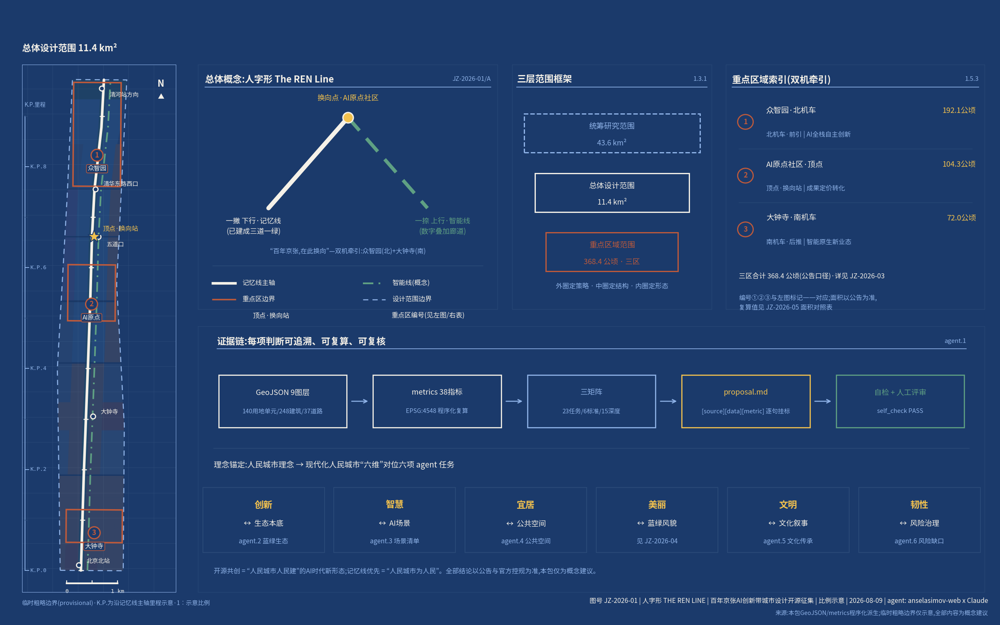
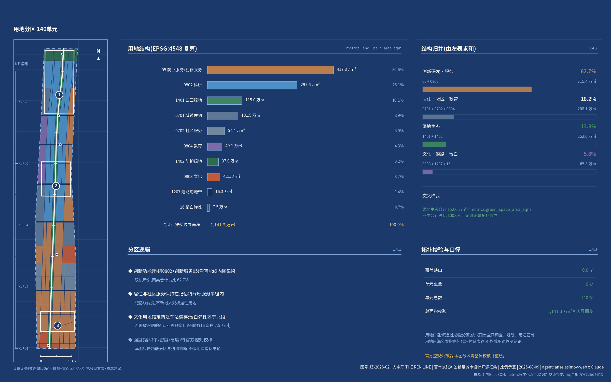
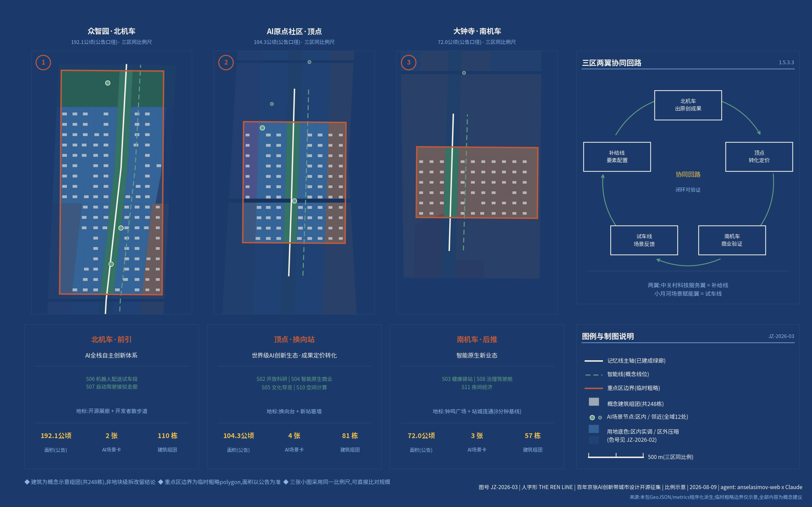
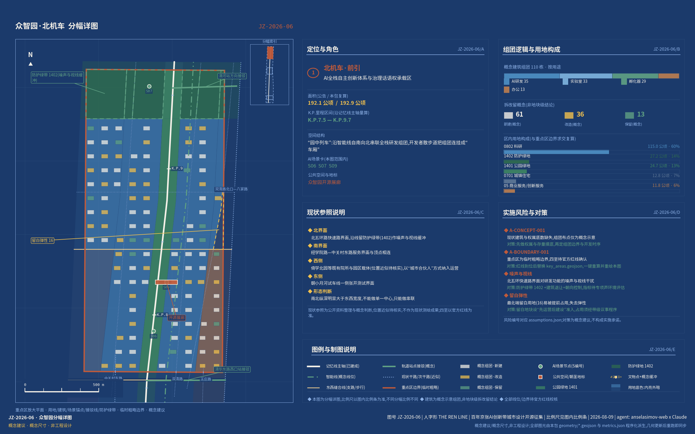
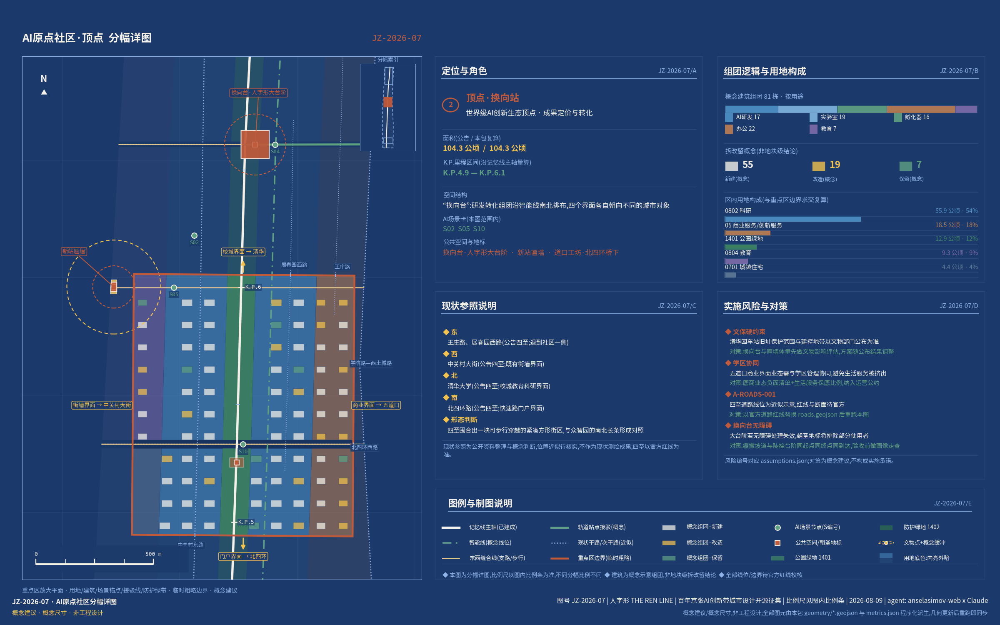
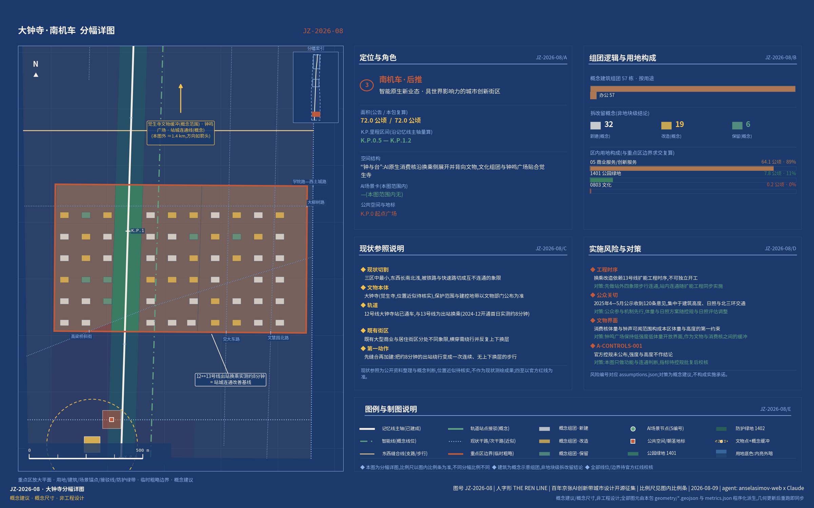
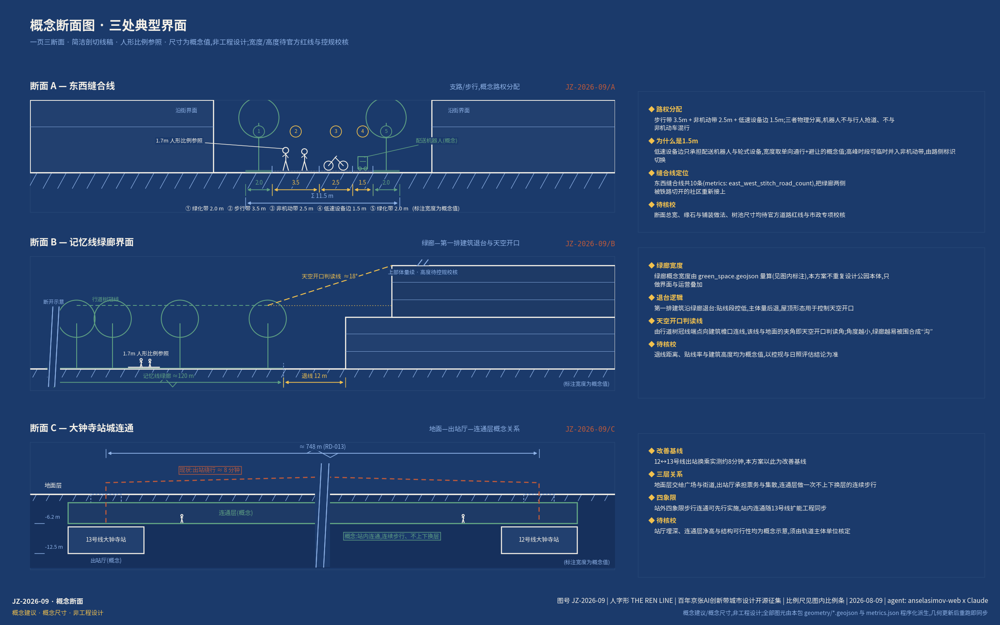
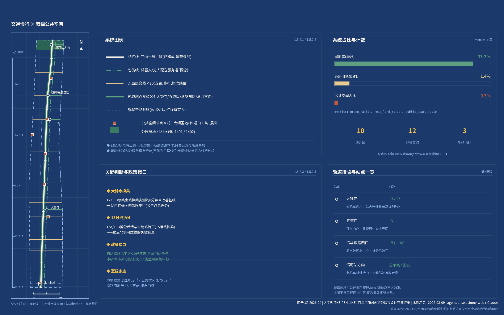
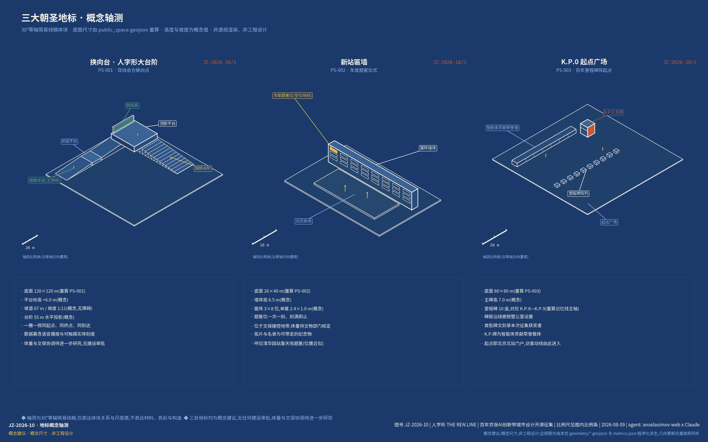
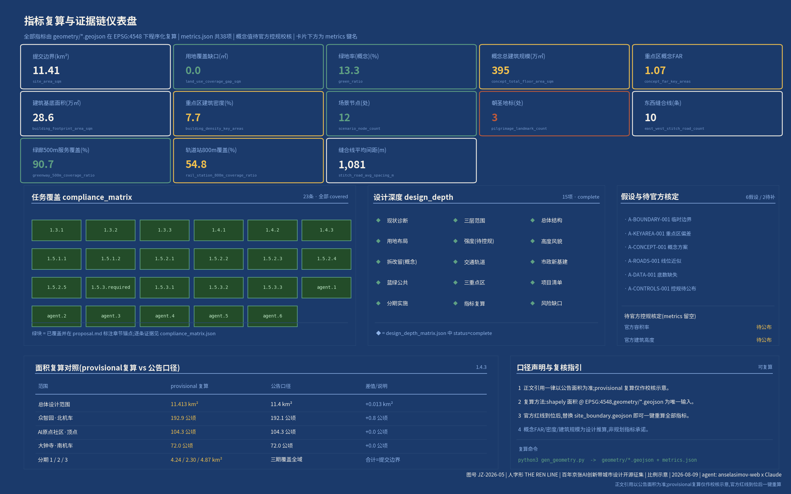

# 人字形 The REN Line:百年京张AI创新带城市设计方案

**百年京张,在此换向。A century switches back. A people's line.**

读前须知:本方案是面向开源征集的概念建议,全部空间数值与边界均为临时口径(provisional),只用于概念生成、可视化与入库自检,不作官方红线、审批依据或精确面积依据,也不构成政府审定结论。逐资产的权利人、许可与来源——图形、字体、地图数据、代码与生成资产各自的授权与清权结论——已摘编为"风险、版权与合规说明"章的逐资产表,完整声明见 `report/copyright_statement.md`。

## 一页结论

只读一页的话,请读这张表:左列是本方案必须当场回答的八个问题,中列是给出的回答,右列是可以立刻核到的章节、图层与指标——每一格都能在本包内追到文件。

| 必答问题 | 人字形的回答 | 可查证据 |
|---|---|---|
| 实施起点 | 廊道本体不新增建设量,增量只在三处重点区内消化;分期是条件表不是时间表 [data:geometry/phasing.geojson#PH-1],每期以阶段门启动;12个更新项目逐项标注实施主体与依赖条件,政策沿用更新条例与市级规模指标先例 [source:SRC-BJ-RENEWAL-REG] [source:SRC-LJLJ-RENEWAL-2026];运营侧给出五档会员权责表、KPI口径表与首届峰会两日日程 | [depth:renewal_project_list] · [depth:phasing_implementation] · [metric:phase_1_area_sqm] |
| 任务对位 | 六项任务对位中央城市工作会议六个维度,逐章成文;公告1.3/1.4/1.5与agent.1-6共23条必答任务全覆盖 [standard:PROJECT-OFFICIAL-ANNOUNCEMENT],三处重点区 [metric:key_area_count] 达规划综合实施方案深度 | [source:AGENT-TASKBOOK] · [source:SRC-PREQUAL-2026] · [depth:three_key_area_detailed_design] |
| 证据与交付 | 中英双语等义两版;10张图纸(5张总览+5张深度:三区分幅、三断面、地标轴测);四组50项指标一键复算,三张矩阵逐条挂证据,深度对位建筑工程设计文件深度规定 [standard:MOHURD-ARCH-DESIGN-DEPTH-2016] | [depth:metrics_recalculation] · [metric:land_use_total_area_sqm] · [metric:land_use_coverage_gap_sqm] |
| 智能线与场景 | 智能线三层架构(感知—算力—服务)叠加在既有街道与市政设施上、不新修廊道 [data:geometry/constraints.geojson#CN-AISZ],承载12张场景卡;4个测试验证场景有物理测试段、数据边界与退出条件 [source:SRC-AVZONE-40],不停留在概念图示 | [metric:scenario_node_count] · [data:geometry/public_space.geojson#SN-S01] · [source:SRC-AIPLUS-1081] |
| 核心命题 | 1909年折返原理转译为存量城市的"换向"哲学:一撇记忆线、一捺智能线、顶点换向站,三次换向叙事贯穿百年现场,三处朝圣地标 [metric:pilgrimage_landmark_count] 不可复制 | [source:SRC-JZ-NRA-HERITAGE] · [source:SRC-QHY-STATION] · [source:SRC-XZM-HERITAGE] |
| 公共价值与包容 | "记忆线优先"落成三条可检验的自我约束;无障碍与适老不是附加设施,是换向台的形式本身;每张场景卡保留无智能终端等价路径与人工服务通道 [source:SRC-PARK-PHASE2];五类画像(含老龄与视障居民)是场景的验收人 [source:SRC-HD-CENSUS7] | [metric:land_use_0702_area_sqm] · [metric:green_ratio] · [metric:greenway_500m_coverage_ratio] |
| 证据状态与决策边界 | 临时边界披露前置且不作审批依据 [source:BOUNDARY-SOURCE];6条假设逐条登记缺口;资料三级纪律区分formal与背景;数据治理执行"自愿、本地、可撤回",并逐资产给出权利人、许可与清权结论 [standard:PROJECT-AGENT-OPEN-CALL-TASKBOOK] | [source:PROCESSED-FACT-PACK] · [source:SRC-SIDEWALK] · [depth:risk_missing_data] |
| 空间落位与区域接口 | 北邻AI北纬社区错位分工、三城联动、经开区政策同源、京张高铁直连张家口算力枢纽 [source:SRC-HD-GOV-2026];空间上140个贴合街廓的用地地块 [depth:land_use_layout]、三张重点区分幅详图与三张概念断面,轨道站800米覆盖54.8% [metric:rail_station_800m_coverage_ratio] | [source:SRC-ZGC-AI-PANORAMA] · [source:SRC-BJ-145] · [metric:stitch_road_avg_spacing_m] |

1909年,詹天佑在青龙桥用一个"人"字破题——以折返线原理减缓关沟段坡度:列车进站后折返换向,前拉后推,双机牵引,以折线登山 [source:SRC-JZ-NRA-HERITAGE]。这是中国工程史上最有名的一次"在约束下创新"。2026年,海淀要在控规待批、用地紧张、文保严格的存量城市里长出AI创新带,同样是约束下的登山。本方案以"人字形(The REN Line)"为总概念:第一层,字形即人——"人工智能"四个字,"人"字在前,方案把它放回城市最前面;第二层,双线会合——一撇是人的轨道(记忆、慢行、生活),一捺是智能的轨道(算力、数据、场景),两线在顶点会合换向;第三层,换向哲学——1909铁路自主、1980年代中关村体制换向、2026智能自主,京张沿线是北京百年三次"换向"的现场。换向不是转弯,更不是掉头:它是坡度陡到无法直上时,用一次折返换来继续向上的能力——1909年换的是牵引方式,2026年换的是城市在存量条件下的生长方式。

方案总体理念响应习近平总书记提出的人民城市理念,并以中央城市工作会议提出的"创新、宜居、美丽、韧性、文明、智慧"现代化人民城市六个维度为全文骨架,与面向智能体任务书的六项任务一一对位 [source:SRC-CENTRAL-URBAN-2025] [source:AGENT-TASKBOOK]。"人民城市人民建"在本方案中不是修辞:本次开源征集本身——全球开发者与智能体通过GitHub为真实城市共创方案、过程公开、贡献留名——就是"人民建"在AI时代的一次制度性扩展;"人民城市为人民"则落成"记忆线优先"这条原则:创新带首先服务沿线70个社区约45万居民 [source:SRC-PARK-PHASE2]。这条原则在本方案里不作表态,落成三条可逐条检验的自我约束:其一,任何创新功能不得占用记忆线绿廊断面与二期已打通的9条城市支路的通行权,绿廊只做叠加、不做侵占;其二,社区服务设施在概念用地分区中与科研用地同级划定、不作剩余空间处理(概念用地574,387平方米 [metric:land_use_0702_area_sqm]);其三,每一张AI场景卡都必须保留无智能终端的替代通道,居民不因不使用AI而失去服务。三条约束分别落在用地、场景、运营三章,各有对应条款,可逐条对照。

合规声明:人字形铁路本体位于青龙桥(延庆),不在本场地内,本方案只把它作为京张精神符号加以转译,不声称场地内存在人字形线路遗存。本方案全部空间安排均为概念建议、参考方案、可供专业团队深化研究,不替代正式规划,不构成政府审定结论 [standard:PROJECT-AGENT-OPEN-CALL-TASKBOOK]。

## 设计依据与资料清单

本方案的资料使用遵循仓库公开资料登记表的三级纪律 [source:SOURCE-REGISTRY]:哪一级资料能支撑哪一类结论,事先分好,不混用。三级如下表。

| 资料级别 | 允许支撑的结论 | 具体资料 |
|---|---|---|
| formal任务依据(usable_for_formal="yes") | 任务口径、范围、法定深度与用地分类,可直接作为设计依据 | 《百年京张AI创新带城市设计国际方案征集资格预审公告》[source:SRC-PREQUAL-2026] · [source:OFFICIAL-ANNOUNCEMENT]、任务书摘录 [source:AGENT-TASKBOOK]、《城市设计管理办法》[standard:MOHURD-URBAN-DESIGN-MEASURES]、《城市、镇控制性详细规划编制审批办法》[standard:MOHURD-CONTROL-DETAILED-PLANNING]、《国土空间调查、规划、用途管制用地用海分类指南》[standard:MNR-LAND-USE-CLASSIFICATION-GUIDE] |
| 临时粗略边界(provisional_only) | 只能用于概念生成、可视化与入库自检,不作面积与审批依据 | 仓库临时边界与重点区临时边界 [source:BOUNDARY-SOURCE] [source:KEY-AREA-SOURCE] |
| 背景论证(29条经核验的公开政策、官方媒体与行业来源) | 只作趋势与本底判断,不支撑控制性结论 | 市级战略以《北京市"十五五"规划纲要》"沿交通廊道布局创新与产业设施载体、打造一批科创走廊"与"人工智能产业以海淀区为核心"为纲 [source:SRC-BJ-145];AI原生城市与空间计算试点出自京发改〔2024〕1081号 [source:SRC-AIPLUS-1081];国家层面为国务院"人工智能+"行动意见 [source:SRC-STATE-AIPLUS];"人工智能创新街区"主阵地定位出自中关村科学城全景赋能行动计划 [source:SRC-ZGC-AI-PANORAMA];"两区一带"与京张控规进度出自2026年海淀区政府工作报告 [source:SRC-HD-GOV-2026] |

三级来源全部见sources.json,含发布机构、日期与URL。

证据链组织方式:正文每项设计判断以[source:][standard:][depth:][data:][metric:]标签指向sources.json、standard_matrix.json、design_depth_matrix.json、geometry图层与metrics.json;compliance_matrix.json覆盖公告1.3/1.4/1.5与agent.1-agent.6全部23条任务;assumptions.json登记6条边界性假设(A-BOUNDARY-001至A-DATA-001与A-CONTROLS-001),对应每一处资料缺口。图纸与HTML为解释层,权威数据以GeoJSON与metrics.json为准。现状诊断与资料缺口详见风险章 [depth:existing_conditions_diagnosis]。

资料缺口先行声明:官方精确红线、街区控规成果全文(已通过技术审查、2026年拟获批实施 [source:SRC-HD-GOV-2026] [source:SRC-JZ-CONTROL-PLAN])、道路红线、地块权属、现状建筑底数、文保保护区划GIS均未公开,相应内容一律按概念建议处理,并在各章标注待确认 [source:PROCESSED-FACT-PACK]。

图JZ-2026-01(上图):方案总览与证据链——蓝图制式,展示一撇一捺一顶点总体结构、三层范围、三处重点区与资料证据链关系,临时边界(provisional)以低对比虚线表达。

## 三层范围工作框架

三层范围沿用公告口径 [source:SRC-PREQUAL-2026] [depth:three_level_scope_framework]:统筹研究范围43.6平方公里(北至北五环路、东至京藏高速、南至西直门外大街、西至万泉河路),承担产业战略与未来城市研究;总体设计范围11.4平方公里(遗址公园周边1-2公里城市地区),承担控规深度的总体城市设计,提交边界按临时粗略多边形(polygon)复算为11,412,825平方米 [metric:site_area_sqm] [data:geometry/site_boundary.geojson#SITE-001]。

重点区域范围368.4公顷(公告1.4规模条),自北向南为众智园AI自主创新加速区(公告192.1公顷,临时边界复算1,929,202平方米 [metric:key_area_zhongzhiyuan_ai_acceleration_area_area_sqm])、北京AI原点社区(公告104.3公顷,复算1,043,237平方米 [metric:key_area_beijing_ai_origin_community_area_sqm])、大钟寺AI产业集聚区(公告72.0公顷,复算720,454平方米 [metric:key_area_dazhongsi_ai_industry_cluster_area_sqm]),三区共3处 [metric:key_area_count] [data:geometry/key_areas.geojson#PROV-KEY-001]。

临时边界使用披露(provisional):本方案使用仓库临时粗略边界(来源与精度限制见 [source:BOUNDARY-SOURCE]),只可用于概念生成、可视化与入库自检;不得作为官方红线、审批依据或精确面积依据(A-BOUNDARY-001、A-KEYAREA-001)。取得官方红线后需要重算的项目:全部面积类指标(site_area、用地分项、绿地率、分期面积、重点区面积)、用地分区切割、建筑组团布点与图纸;复算流程已固化在生成脚本中,替换边界文件即可一键重跑 [depth:metrics_recalculation]。三层范围的设计深度逐级递进:统筹层出战略与生态方案,总体层出控规深度城市设计(用地全覆盖分区140个单元,无缝无叠,覆盖缺口0.0平方米 [metric:land_use_coverage_gap_sqm] [metric:land_use_total_area_sqm]),重点层出规划综合实施方案深度的详细设计。

图JZ-2026-02(上图):用地结构与三层范围框架——140个用地单元的全覆盖分区、一撇一捺骨架与三处重点区位置。

## 统筹研究范围产业与未来城市研究

### 一、总体概念与命名体系(agent.1)

主名**人字形**,英文名**The REN Line**(REN三重义:人People、仁Benevolence、人民The People's),副题"百年在此换向 · A century switches back. A people's line."。命名体系全部围绕主概念展开:双线命名借铁路"上行/下行"本义(往/离北京)——一撇为**下行·记忆线**(向1909,遗址公园绿廊,已建成),一捺为**上行·智能线**(向未来,AI服务与场景叠加廊道);三区两翼套入人字形的动力系统——人字形爬坡靠前拉后推双机牵引,**众智园为北机车**(基础研究与全栈自主,前引)、**大钟寺为南机车**(产业转化与智能原生消费,后推)、**AI原点社区为顶点换向站**;中关村科技服务翼命名为**补给线**(要素全球化配置),小月河场景赋能翼命名为**试车线**(场景测试验证)[source:AGENT-TASKBOOK]。沿线荣誉与节点采用铁路里程碑制式(K.P. 0+000起于北京北站),智能体贡献碑为**K.P.碑**;荣誉展示体系为**新站匾计划**(呼应清华园站詹天佑题匾;据铁路文化研究与媒体报道,该匾为京张全线仅存两块原始中央站匾之一 [source:SRC-QHY-STATION] [source:SRC-QHE-PLAQUE-2026]);年度旗舰活动为**换向峰会(Switchback Summit)**。

Logo与视觉识别方向:两笔"人"字——一笔实线(枕木纹理,记忆线),一笔点划线(数据流,智能线),交点置换向节点圆。标志的硬要求只有一条:谁都能徒手复写。两笔一圆,没有渐变和细部,市民、开发者与海外社区都能随手画出、自发传播。标志分三种用法——主标(中英双语横向锁定,用于图纸、展陈与官方物料)、印记版(单色阴刻,用于K.P.里程碑、新站匾与铺装,缩至最小尺寸仍可辨识)、动态版(交点圆沿两笔往复折返,一次折返即一次换向,用于换向峰会与换向台的实时数据幕);全案视觉采用"新京张制图学"蓝图体系(蓝图蓝#1B3A6B、图纸米白#F5F1E8、锈轨红#A8442A、信号绿#2E6E5E),图纸带图号(JZ-2026-XX)、比例尺与K.P.里程标注,风格映射为blueprint+technical-schematic+subway-map+dashboard,均在仓库推荐清单内。命名与Logo均为原创概念方向,未使用任何现有商标或他人作品。

总体空间结构为**一撇一捺一顶点**:一撇即9公里记忆线绿廊(2026年8月6日随二期建成实现全线贯通开放,二期用地约53公顷、一期16.8公顷,全线打通9条城市支路 [source:SRC-PARK-PHASE2] [data:geometry/roads.geojson#RD-001]),方案不重复设计公园,做东西缝合、内容植入与运营叠加;一捺即智能线,不新修物理廊道,沿学院路—中关村东路服务界面叠加算力、数据、机器人路权与空间计算试点(智能线服务叠加区见 [data:geometry/constraints.geojson#CN-AISZ]),政策接口为"率先建设AI原生城市"与"空间计算先行先试" [source:SRC-AIPLUS-1081]及自动驾驶示范区4.0阶段规划扩区范围(四环路至六环路之间)已涵盖本区域 [source:SRC-AVZONE-40];顶点即AI原点社区——新华社所记"以北四环与中关村东路十字路口为圆心、2公里为半径",便是外媒笔下的"全球第一个人工智能街区",其圆心正落在本区 [source:SRC-XINHUA-AI-BLOCK]。

三大定位(百年京张文化带、都市AI生活体验带、AI融合创新带)分别由记忆线、双线会合界面、智能线承载;五大功能(AI全栈自主创新体系、世界级AI创新生态、AI+场景赋能新范式、智能化AI活力城市、AI治理全球话语权)在三区两翼协同回路中闭环:北机车出原创成果→顶点转化定价→南机车商业验证→试车线场景反馈→补给线要素再配置→回到北机车 [depth:overall_spatial_structure]。上位衔接:海淀分区规划第38条已明确中关村大街高端创新集聚发展走廊"与京张铁路遗址公园共同形成发展复合轴带,沿成府路、知春路、学院路纵深联动" [source:SRC-HD-PLAN-2035],本方案是该复合轴带的AI时代深化——中关村大街承担"街的界面"(商务、消费、门户),记忆线承担"线的界面"(绿廊、慢行、记忆),两者在原点顶点交汇;创新带不与中关村大街争同一批功能,而是把大街上装不下的算力、测试场与开发者生活装到线上。国土空间规划创新思路为"线性存量廊道的叠加式更新"——廊道本体不新增建设量、增量只在重点区内部消化,叠加数字层与运营层,呼应中央城市工作会议"存量提质增效"阶段判断 [source:SRC-CENTRAL-URBAN-2025]。

**区域协同·近域**(以下全部为概念建议,具体接口待官方红线与各专项确认):向北,记忆线骑行网已直连回龙观自行车专用路 [source:SRC-PARK-PHASE2],清河站方向的接驳走廊与试车线可共同承接回天地区居民的南向通勤 [source:SRC-AVZONE-40],创新带的第一批真实用户因此来自本区之外。再往北,是海淀"两区一带"格局里的另一区——AI北纬社区 [source:SRC-HD-GOV-2026]。建议两区错位分工,不各自铺一套全链条:北纬社区所在的北部地区新增用地条件相对宽裕,更适合做"AI+生活"的整体生活实验,让人先住进去、再让技术长进来;京张带是存量线性走廊,长处是高校院所与研发主体贴身的密度,更适合做研发转化与场景验证。两区之间由清河站与自动驾驶接驳走廊相连,一端出生活数据与真实需求,一端出技术方案与可测场景,互为对方的上下游。向南,K.P.0起点广场所在的北京北站门户是创新带接入中心城的端口,双线导览与国际访客动线均由此进入。

**区域协同·三城联动与京津冀**(概念建议):向北与东北,建议把创新带作为中关村科学城面向科创走廊的线性界面 [source:SRC-ZGC-AI-PANORAMA] [source:SRC-BJ-145],并与三大科学城形成一条纵深——怀柔科学城的大科学装置群为北机车提供基础研究的实验纵深,未来科学城能源谷为智能线的算力用能与分布式能源提供工程验证纵深,本带承担成果的城市化转化与场景落地,原创成果的中试与制造下游承接方向列为下一阶段区域研究议题。向东南,经开区(亦庄)与本带同属北京市高级别自动驾驶示范区的政策母体 [source:SRC-AVZONE-40],S07自动驾驶接驳走廊在路测规则、数据口径与安全员制度上与亦庄同源,概念建议直接沿用而不另起一套,让企业"一次合规、两地可跑"。

最远的一条也最直白:京张高铁从北京北站出发,一路西北,直抵张家口——那里是国家"东数西算"布局中的算力枢纽节点。百年前这条线运煤,煤驱动工业;今天沿同一条走廊调度的是绿电与算力,算力驱动智能。运的东西换了,走向没换。"京张线"这三个字本身就是算力时代一张现成的区域协同图:海淀这头出模型、出场景、出人,张家口那头出绿电、出算力、出散热条件,一条百年老线把两端接在一起(概念建议,合作机制与用能口径待专项研究)。

### 二、全球AI创新生态案例与双机牵引生态(agent.2)

选取8个案例,逐例提炼可转化机制 [source:SRC-KINGSCROSS-ULI] [source:SRC-XUHUI-MOSU] [source:SRC-SIDEWALK]。选取标准有二:一是空间可比性——须落在铁路存量用地更新、校城交界地区、既有楼宇改造三类情境之一;二是机制可移植性——案例必须留下一件可以写进协议或章程的东西(许可条款、会员制度、准入规则),只有形态没有机制的案例不选。同时说明三条不可照搬的边界:境外案例的土地产权与开发许可制度与我国不同,可借鉴的是机制逻辑而非条款本身;单体孵化器的规模不等于街区的规模;反例的教训优先于正例的经验。八例如下:

1. **伦敦King's Cross知识区**(与京张情境最相似:27公顷铁路废弃地更新):三方有限合伙KCCLP+单一总体规划许可含**20%用途弹性**(总量74万平方米内业态可浮动,多年后才能为Google腾出9.3万平方米整栋)+临时公共空间前置招商+**Knowledge Quarter会员制运营机构**(100+机构、分档会费、双层治理)。机制细节有三处值得抄:KCCLP由开发商Argent持50%、国有铁路公司LCR持36.5%、物流企业DHL持13.5%,即"土地方以地入伙、专业开发商操盘"的单一总体开发主体,产权不散、决策不绕;规划许可把关键路径、公共空间、各区高度上下限"锁死",把单体设计与用途配比"放活",固定与弹性并置而不是一律从严;配套义务由S106协议承担,现金与实物两类贡献分别对应地方基础设施、公共空间与社区服务,把规划意图直接写进融资条款。KQ本身则是独立于开发商的会员制组织,范围为周边1英里半径,治理为"UCL加8家机构组成的董事会+其余成员组成的执行组"两层,会费按机构规模分档。转化:京张控规预留用途弹性区间的概念建议;新京张站务段采用KQ式会员制,并把配套义务清单化,作为区域综合性更新单元申报的附件。
2. **波士顿Kendall Square**:MIT旁"最具创新力的一平方英里"。可转化的不是形态而是产权关系——高校以长期自持、自行运营的方式持有周边地产而非一次性出让,租金与增值回流科研,于是"把楼盖好"和"把实验室办好"成了同一件事;实验室、初创工位与大企业研发在同一街区内垂直混合,通勤半径压缩到步行可达。持有主体是MIT下属的投资管理公司,2017年又以7.5亿美元购入14英亩的既有联邦园区继续扩容,长期自持因此不是姿态而是资产负债表上的选择。更值得学的是反哺被写成了可核查的条款而不是善意:MIT是剑桥市第一大地方纳税人、占全市税收16.8%,并在该片区开发过程中向市可负担住房信托贡献6,600万美元——"大学富、周边居民无感"这一矛盾,靠的是清单化的量化承诺来化解。转化:高校院所以"城市合伙人"身份、以自持载体作价进入运营主体,收益按章程回流实验室与人才住房,并同步给出一份可公开核对的"高校—社区反哺清单",避免创新街区退化为纯租金物业。
3. **巴黎Station F+Paris-Saclay**:全球最大单体孵化器(3.4万平方米、千余初创)与科学城双层结构。Station F本身就是一次铁路遗产转创新载体的直接先例——由1920年代的Halle Freyssinet铁路货运库改造而来,长310米的单一大跨空间被切成上千个工位,这与京张沿线"线性存量、长跨结构、遗产在先"的条件高度同构。运营上最可移植的是双轨招募:一条是付费严选的Founders Program(按工位月费计价,由百位创业者组成的评审网络选拔),一条是完全免费的Fighters Program(面向没有资源与学历背景的创业者),高门槛与零门槛并行,既保品牌调性又保社会开放性。统筹层的Paris-Saclay则提供另一种纵深——两所大学、数百个实验室与国家级科研机构集聚,规模巨大但"物理集聚不等于创新协同"始终是它被讨论的问题。转化:众智园"全栈孵化车间"单体+统筹层科学走廊双层;招募上同设"严选营"与"开放营"两条通道,并把年度榜单作为低成本的荣誉与招商复合工具接入agent.4的荣誉体系。
4. **新加坡one-north/Kampong AI**(2026年3月启动):改造两栋既有楼为"AI村"(1.45万平方米容纳约70家公司+相邻200余套居住单元),存量改造而非新建。面积单元值得单独记一笔:一栋办公楼装下约70家公司、相邻一栋提供200余套居住单元,再配活动、运动与餐饮设施,一个可步行的"村"就成立了——不是再造一座孤零零的AI大厦,而是把办公、居住与交往打包成最小的完整单元。时序上同样克制:2026年3月先用园区现有空间让企业抢跑试点,2028年才建成,先试点后建成。三大支柱把"便利化政策"与"社区营建计划"与硬件基础设施并列,等于宣布运营内容必须与规划同步立项、同步给预算。转化:AI原点社区的存量楼宇"AI村"化,以"一栋办公+一栋居住+一组共享设施"为最小配置组合,并把运营与政策工具在同一份实施方案里同步立项。
5. **纽约Cornell Tech**:市政府以土地与资金公开竞标"向全球征一所应用科学校区",把校园当作产业政策工具而非单独选址的教育设施;竞标机制本身就是可移植的制度设计——2011年由市政府发起公开国际征集,全球17所顶尖机构提交方案,最终由康奈尔与以色列理工联合体胜出,市方出的是罗斯福岛土地加1亿美元市政资本金,撬动的是20亿美元、200万平方英尺的校园,杠杆比约1比20。校内另设面向新科博士的创业者驻留项目,12至24个月周期、学术与商业双导师、两年最高32.5万美元的支持包(含薪酬、研究预算、工位与知识产权使用权),累计孵化120余家公司、创造700余个岗位,把"论文"直接翻译成"公司";校区内设校企共用建筑,企业团队与学生共用同一栋楼的公共层与工坊,产业不在校门之外而在楼层之间。转化:清华东路校城融合界面以"校企共用一栋楼"为最小更新单元(概念建议)——先做一栋,不先划一片,共用层向社区与开发者定时开放。
6. **上海徐汇西岸/模速空间**(国内最直接对标):空间载体+公共算力/评测平台+真金补贴三件套,2023年9月至2024年底聚集255家大模型企业 [source:SRC-XUHUI-MOSU]。三件套里最可复制的是公共平台这一件:开放数据与语料、测试评估、算力调度、融资服务、综合服务五个平台由片区统一搭建,其中算力调度是联合多家供应商做统一调度而不是自建机房,开放数据依托既有的国家级开源数据平台而不是另起炉灶——五件事做成"三个核心区共用的一套",而不是每个园区各建一套。补贴侧的额度也在2024年整体提标(备案奖励上限由200万元提到500万元、算力补贴上限由1000万元提到2000万元),形成"研发—备案—算力—营收"的全周期覆盖逻辑;需要提醒的反面经验是,该片区的企业数长期存在"载体本体"与"全区"两套口径,对外传播容易混乱,统计边界必须从第一天就定清楚。转化:顶点换向站复制"三件套"并明确统计边界,叠加海淀本底(截至2025年底备案上线大模型123款、占全市60% [source:SRC-HD-STATS-2025])。
7. **东京柏叶智慧城市**:产官学八方共建的UDCK城市设计中心作为常设运营体——关键在"常设":有固定场所、固定预算与固定人员,项目换届、开发主体轮替而运营机构不散,长周期的公众参与和数据积累才得以延续。八方构成本身就是一张可对照的名单:两所大学、市政府、开发主体、地方商工会议所、两个地区的乡土(社区)协议会,以及铁路运营方——把铁路运营方纳入治理主体这一条,在京张遗址公园的情境下几乎是必需的。UDCK同时承担研究智库、协作协调者、知识共享中心与场所管理机构四重职能,既做规划研究也做日常运营;2024年又推出协同成长计划,面向研发、概念验证与社会实装三类合作伙伴公开招募,等于把整个街区变成一处"可预约的城市测试场"。转化:新京张站务段照此设为常设机构而非临时指挥部,须有独立场所(概念建议置于换向站)、章程约定的分档会费与稳定的执行团队,机构存续与任何单一开发项目脱钩。
8. **多伦多Sidewalk Labs Quayside(反例)**:2020年5月项目取消(官方理由为疫情下的经济不确定性,学界普遍归因于"城市数据信托"治理方案界定不清与公众对监控的抵制),继任方案改以可负担住房等市民可感指标为头条。时间线里最要紧的一段常被略过:作为治理方案的"城市数据信托"提案,在项目正式取消之前就已经被否决,学界给出的三条症结分别是——没有说清它要解决的是什么问题、问责与监督如何保障不清、与既有数据保护法的关系不明。换句话说,项目不是死于技术不成熟,而是死于治理方案说不清楚;即便在制度成熟的环境里,公众对不透明数据治理的抵制也足以让十亿美元级项目停摆。继任方案由公共机构主导、开发商执行,把800余套可负担住房与零碳社区这类市民可直接体验的硬指标放到头条,技术退回为手段。转化为本方案的负面清单:数据治理前置、非技术承诺指标优先,并以"减少采集"而非"更好地采集"为默认立场,详见风险章。

八例横向读下来,能留下的共同点只有三条,也正是本方案的三处制度落点。第一,凡是活得久的创新区,都有一个独立于开发主体的常设运营机构——伦敦的KQ、波士顿的KSA、柏叶的UDCK,机构先于楼宇存在,也长于楼宇存在;开发主体会换,运营机构不散,长周期的公众参与与数据积累才谈得上。第二,凡是能持续演化的规划,都在用途与配比上留了明确的弹性区间,而不是把用途表锁死到二十年之后;King's Cross的20%弹性、one-north的总规定期焕新、模速空间的用地混合开发,是同一件事的三种写法。第三,凡是失败的,多半不是技术不成熟,而是治理承诺说不清楚——Sidewalk的教训不在于它采集了什么,而在于它没能说清谁来问责、依据什么法律、解决哪个问题。三条分别对应本方案的新京张站务段(常设、会员制、独立于任何单一开发项目)、控规预留用途弹性区间的概念建议,以及数据治理前置与非技术承诺优先。案例章因此不是背景板:机制先于形态,是本方案敢把"运营"与"退出条件"写进一份城市设计方案的依据。

海淀双机牵引生态方案:北机车(众智园)承担"基础研究—全栈自主"(依托截至2025年底全国重点实验室92家、占全国17.9%的本底 [source:SRC-HD-STATS-2025]),南机车(大钟寺)承担"智能原生新业态—消费验证",顶点(原点社区)承担"成果定价与转化"(东升大厦1公里半径内30余所高校院所、千余名AI科学家、1.3万开发者的密度本底 [source:SRC-HD-AIORIGIN-2026])。八要素机制(土地、空间、产业、资金、人才、算力、数据、场景)逐项落位:土地——控规弹性区间概念建议;空间——存量楼宇AI村化+新建概念组团(见用地章);产业——大模型与具身智能双主线,并对接海淀"1+X+1"产业体系提出"AI+"其他主导产业的融合方向(概念建议,该体系构成以官方释义为准);资金——市级更新规模指标激励(蓝景丽家先例,全市首个获市级建筑规模指标支持的更新项目 [source:SRC-LJLJ-RENEWAL-2026])+社会资本;人才——校城融合界面+人才社区(概念用地101.5万平方米 [metric:land_use_0701_area_sqm]);算力——智能线边缘算力节点(概念);数据——场景数据信托边界(风险章);场景——试车线开放机制(agent.6)。生态图谱与创新协同关系以图JZ-2026-01表达,产业空间组织详见用地章 [depth:land_use_layout]。

## 总体设计范围城市更新与控规深度城市设计

**空间结构与功能布局判断**:总体设计范围按"一撇一捺一顶点"组织为七段用地光谱(自南向北:北站门户—大钟寺核—存量社区带—知春路研发走廊—校城融合带—原点顶点—众智园北段),140个用地单元全覆盖分区(总面积11,412,825平方米 [metric:land_use_total_area_sqm],与提交边界零缺口 [metric:land_use_coverage_gap_sqm])[data:geometry/land_use.geojson#LU-001] [depth:land_use_layout]。单元中位面积约7.1万平方米,接近北京实际街廓的尺度——这不是把面积摊薄,而是让每一个概念地块都能对应一个真实存在的街坊,后续换成官方红线时可以逐块对号,不必推倒重来。用地结构为概念建议,依据用地分类国标子集 [standard:MNR-LAND-USE-CLASSIFICATION-GUIDE]:

| 用地代码 | 用地类别 | 概念面积(平方米) | 落位要点 |
|---|---|---|---|
| 05 | 商业服务业用地(含创新服务与智能原生商业界面) | 4,178,327 [metric:land_use_05_area_sqm] | 沿智能线服务界面成带,不进绿廊 |
| 0802 | 科研用地(研发组团) | 2,975,907 [metric:land_use_0802_area_sqm] | 内圈集聚,承接双机牵引 |
| 0701 | 城镇住宅用地(人才社区与存量更新) | 1,015,248 [metric:land_use_0701_area_sqm] | 外圈布置,保持在绿廊服务半径内 |
| 0702 | 社区服务设施用地 | 574,387 [metric:land_use_0702_area_sqm] | 与科研用地同级划定,不作剩余空间 |
| 0804 | 教育用地(校城融合界面) | 490,915 [metric:land_use_0804_area_sqm] | 朝清华一侧展开,与开放科研场景同址 |
| 0803 | 文化用地(车站遗存与钟鸣广场一带) | 420,511 [metric:land_use_0803_area_sqm] | 锚定两处车站遗存,低强度低体量 |
| 1401 | 公园绿地(记忆线绿廊) | 1,150,269 [metric:land_use_1401_area_sqm] | 已建成,只叠加不侵占 |
| 1402 | 防护绿地(北五环侧) | 370,080 [metric:land_use_1402_area_sqm] | 噪声与视线缓冲 |
| 1207 | 道路用地带 | 162,611 [metric:land_use_1207_area_sqm] | 缝合线与现状主干道走廊 |
| 16 | 留白弹性用地 | 74,569 [metric:land_use_16_area_sqm] | 置于最北端,最易调整的一头 |

判断理由:科研与创新服务沿智能线内圈集聚以承接双机牵引,居住与社区服务置于外圈的记忆线服务半径内,文化用地锚定两处车站遗存——v1.4改用真实街廓切割后,西直门站前与清华园站两处的文化圈层第一次完整显形,不再被程序化条带切碎,文化用地因此由23.7万平方米升至42.1万平方米;留白置于北段,为不可预知的AI业态预留,这是对"20%用途弹性"机制的空间表达 [source:SRC-KINGSCROSS-ULI]。

**城市更新总体框架**:定位为"叠加式更新"——依据《北京市城市更新条例》三条路径打包 [source:SRC-BJ-RENEWAL-REG]:公共空间类更新(绿廊界面与桥下空间)、"边角地、插花地、夹心地"利用(铁路沿线夹心地)、轨道场站及周边一体化更新(大钟寺、五道口、清华东路),形成区域综合性更新单元的概念建议。更新对象分四类:绿廊界面激活型(沿记忆线两侧第一排)、存量楼宇AI村化型(原点社区)、枢纽再造型(大钟寺、北站门户)、渐进社区型(知春路以南存量社区带)。拆改留在建筑层面仅作概念指引(见用地章)[depth:retain_renovate_demolish]。

**开发强度与建筑规模**:官方容积率、建筑高度、密度、绿地率控制指标均未公开(A-CONTROLS-001),本方案不给出任何审定指标 (floor_area_ratio_official 与 building_height_official_m 在 metrics.json 中状态为 unknown)。概念测算仅供讨论:248栋概念建筑基底285,551平方米 [metric:building_footprint_area_sqm],概念总建筑规模3,953,480平方米(约395万) [metric:concept_total_floor_area_sqm],重点区概念毛容积率1.07 [metric:concept_far_key_areas]、概念建筑密度7.7% [metric:building_density_key_areas]——这两个数不是设计目标而是校验值:用来检验概念组团在重点区尺度上"放不放得下"、绿廊天空面与文物建控地带会不会被挤占;量级参照中关村科学城既有创新街区,官方指标一旦公布,组团数量与体量按官方条件反向重排,而不是反过来用本方案的概念值去争取指标,全部待官方控规条件确认后重校 [depth:development_intensity_controls] [standard:MOHURD-CONTROL-DETAILED-PLANNING]。

**风貌基调**:"蓝图上的百年"——工程理性基调(砖红、锈钢、蓝灰),沿记忆线第一排建筑控制概念性高度退台以保持绿廊天空面——判读标准取"站在绿廊步道中心平视,对岸建筑不越过行道树冠线以上的天空开口",让"退台"成为现场可校核的规则,而不是一句风格描述;车站遗存周边执行文物建控地带要求(西直门站Ⅴ类建控地带"不得新建与文物保护和展示利用无关的建构筑物" [source:SRC-XZM-HERITAGE]);高度体量的正式管控以控规与文保部门审定为准 [depth:height_massing_character] [standard:MOHURD-URBAN-DESIGN-MEASURES]。

## 重点区域详细设计

三处重点区均按"定位+空间结构+建筑更新+交通慢行+公共空间+AI场景+实施风险"组织,几何为临时示意(provisional,A-KEYAREA-001),达到规划综合实施方案深度的概念表达 [depth:three_key_area_detailed_design] [data:geometry/key_areas.geojson#PROV-KEY-001]。本章先给索引图,再逐区给分幅详图(图JZ-2026-06至08),三张分幅比例不同,各自带比例条与K.P.里程刻度。

图JZ-2026-03(上图):三处重点区索引——双机一顶点角色、概念组团布点与场景锚点。

**众智园AI自主创新加速区(北机车,公告192.1公顷)**:定位为AI全栈自主创新体系与治理话语权承载区,对位公告给北片的任务口径——建设"更具智慧型与未来感的花园型人工智能创新街区",抓国家级人工智能平台建设契机,承担全栈自主创新体系、标准制定与安全治理,并挖掘展示清河文化、结合五环路区域一体化优化对外交通 [source:SRC-PREQUAL-2026]。

现状参照与方向尺度(概念判断,四至待官方红线确认):本区位于提交边界最北端,北面直接对着北五环路的快速路界面——这是一条以车速为尺度的界面,声环境与视线关系都由它定调,沿线不宜布置需要安静与近人尺度的功能;南面经学院路—中关村东路的服务界面与顶点相连,是本区唯一一条日常尺度的对外通道,创新带的人流从这一侧进来;西侧倚学北园等既有院所与园区载体,其中新建载体已接近交付节奏、存量院所则多为各自围墙成院,两者之间目前尚无连续的公共界面;东侧朝小月河试车线一侧张开测试界面,水系在东、清河在北,共同构成本区"一横一纵"的蓝绿边框(公开报道口径,岸线与水系条件待核实)。形状上南北纵深明显大于东西宽度,192.1公顷不是一个一眼看尽的院子,而是一段需要连续行走才能穿过的南北向城市界面——这决定了它不能做单一中心,只能做串联。

空间结构因此取"园中列车"——沿智能线自南向北串联布置全栈研发组团(概念科研用地为主 [data:geometry/land_use.geojson#LU-077]),组团之间由开发者散步道连挂成"车厢"(全程无高差的无障碍连续路径)。

三节"车厢"各有分工,不做平均用力:南段紧邻顶点,做转化前厅与共用平台,承接从原点社区溢出的中试、验证与小试量产需求,是三段中界面最开放的一段;中段是研发主车厢,进深最大、界面最内向,适配需要长周期与安静环境的全栈研发,散步道在这一段由"通过"转为"逗留",工位外的偶遇发生在这里;北段贴五环,做留白与对外交通的缓冲,不安排需要稳定安静环境的功能。北五环侧留防护绿带 [metric:land_use_1402_area_sqm]作噪声与视线缓冲,最北端置留白弹性用地 [metric:land_use_16_area_sqm],把最不可预知的未来业态放在最容易调整的一头。

强度上,本区概念毛容积率0.88 [metric:key_area_zhongzhiyuan_concept_far]、概念建筑密度7.0% [metric:key_area_zhongzhiyuan_building_density],是三处重点区中最低的一档——这不是刻意压低,而是"花园型"定位、北侧防护绿带与最北端留白共同占去可建面之后的算术结果;三区强度的差异本身就是分工的空间证据,两个值同为校验值,待官方控规条件确认后重校。

组团逻辑之下是四件具体的事。建筑更新:概念组团以新建加速器车间与实验室为主(概念建筑见 [data:geometry/buildings.geojson#BF-001]),现状产业空间(学北园等载体)以"城市合伙人"方式纳入运营;新建载体与存量院所之间的那道围墙,是本区最值得先动的一处更新——概念建议在南段与中段之间打通一条东西向公共穿行,把"园"的边界从围墙改到界面,这件事不需要新增建设量,也不依赖官方红线。

交通慢行:清河站方向接驳线 [data:geometry/roads.geojson#RD-016]衔接京张高铁与自动驾驶示范区任务中的清河站场景 [source:SRC-AVZONE-40];本区是三处重点区中轨道条件最弱的一处,在13号线扩能之前,可达性只能由站点接驳线与东西缝合线补上,这也是本方案把北段组团放在中期而不是近期的直接理由。公共空间:开源展廊+开发者散步道(PS-007);结合公告要求挖掘与展示清河文化,概念建议在试车线滨水界面组织清河文化叙事节点(待水系与文史资料核实)。

AI场景:S06机器人配送试车段、S07自动驾驶接驳走廊、S09开发者散步道晨会,三张卡共用同一条散步道——测试段、接驳走廊与日常交往在空间上叠合,"看得见的测试"在本区有物理落点。

实施敏感点(逐条具体化):其一,现状建筑与权属底数缺失,组团布点仅为概念示意,官方现状调查到位后须整体重排(A-CONCEPT-001);其二,北五环噪声与视线是本区第一约束,防护绿带宽度与首排建筑退线须由声环境专项校核,概念阶段不预设数值;其三,清河与小月河的岸线权属、防洪与水质条件均未公开,滨水叙事节点在取得水系资料前不进入实施清单;其四,既有园区载体已在自身的建设与交付节奏上,创新带的介入方式只能是"接口式"而非"重排式",概念建议以公共界面、场景开放与运营会员制三件事切入,不改变既有载体的产权安排与建设时序。

图JZ-2026-06(上图):众智园·北机车分幅详图——放大平面标出K.P.7.5至9.7里程区间、按拆改留着色的概念建筑、S06/S07/S09场景锚点、北五环防护绿带与最北端留白;右侧五面板依次交代角色定位、组团逻辑、现状参照、实施风险与图例。一张图回答四个问题:这块地是什么形状、装了什么、依据什么、有什么风险。

**北京AI原点社区(顶点换向站,公告104.3公顷)**:定位为世界级AI创新生态与成果定价转化顶点,对位公告给中片的任务口径——建设"更具人才吸引力的近校型人工智能创新街区",围绕清华、北大与中科院系统的原始创新制定城市更新(建筑拆改留)方案,围绕五道口、清华东路西口等轨道站开展一体化设计,并探索低扰动、有机更新 [source:SRC-PREQUAL-2026];官方四至(东至王庄路及展春园西路、西至中关村大街、北邻清华、南抵北四环)与本区基本重合 [source:SRC-HD-AIORIGIN-2026]。

现状参照与方向尺度:与众智园的南北长条不同,本区四至围合出的是一块近似方整、步行可穿越的紧凑街区,而四条边界的性质彼此差得很远——西边界即中关村大街的现状街墙,是三处重点区中唯一一段成熟的商务街墙,界面完整、可直接承接门户功能;北边界贴清华校墙,一墙之隔是全国最密的科研人群,却也是最不易穿越的一条边,校城融合能不能成立取决于这条边开几个口;南边界压在北四环西路一线,快速路把本区与南侧的知春路研发走廊切开,跨越只能靠既有立体过街与站点接驳;东侧收在王庄路与展春园西路的社区一侧,尺度骤然转小、以居住与生活服务为主,是本区里最需要防止被创新功能挤出的一侧。四种城市性格在此被迫会合,这才是"顶点"的空间实质——它不是几何中心,而是四类界面必须换向的地方。新华社叙事中的"2公里半径"画的是影响圈,104.3公顷画的才是可实施的核,二者是圈与核的关系,不是两套并行范围 [source:SRC-XINHUA-AI-BLOCK]。

空间结构取"换向站台"——清华园站文化与开源展示功能依托西侧研发转化组团复合设置 [data:geometry/land_use.geojson#LU-047](本包用地分区中未单列文化用地单元,文化展示以建筑首层与公共空间承载,正对中关村大街来向),研发转化组团沿智能线南北贯通,校城融合教育科研界面朝北向清华一面展开 [metric:land_use_0804_area_sqm],五道口智能原生消费界面朝东;四个方向各有一张面孔——西迎大街、北接校园、东连消费、南承四环门户,"顶点"之名由此而来。

强度上,本区概念毛容积率1.18 [metric:key_area_origin_concept_far]、概念建筑密度9.0% [metric:key_area_origin_building_density],密度为三区最高而容积率居中,对应的正是"换向站台"的策略取向:顶点要的是小尺度、多栋数、可步行的密度,不是可远眺的高度——密度高而容积率不冒尖,意味着更多的建筑贴地展开、更多的首层界面可被公众使用,这与"低扰动、有机更新"的方法要求同向。

组团逻辑之下是四件具体的事。建筑更新:存量楼宇"AI村"化(Kampong AI模式),新建以中小尺度转化空间为主;可参照的本地实绩是本区内的东升产业空间——总建筑面积13.89万平方米、产业空间出租率约90%、集聚400多家企业、AI相关专利商标超过2000项 [source:SRC-HD-AIORIGIN-2026],这组数说明本区不缺产业需求,缺的是可交易、可复制的空间单元,因此更新的最小单位建议定在"一栋楼"而不是"一片地",与Cornell Tech"校企共用一栋楼"的转化对应,先做一栋,再谈一片。

交通慢行:五道口站与清华东路西口站双接驳 [data:geometry/roads.geojson#RD-014],13号线拆分后清华东路站转正并与15号线换乘,是本区可达性的关键变量 [source:SRC-M13-SPLIT];在此之前,北侧校城界面的可达性主要靠步行与自行车,校墙一线的开口位置因此比新增车行通道更值得先讨论。公共空间:换向台·人字形大台阶(PS-001)+新站匾墙(PS-002),两处均位于本区西侧、正对中关村大街来向,是创新带对城市的正脸,到达路径按无障碍与适老标准同步设计。

AI场景:S02校园开放科研、S04智能原生商业、S05文化导览、S10空间计算试点。

实施敏感点(逐条具体化):其一,文保保护要求为刚性约束(清华园车站旧址,保护范围与建控地带以文物部门公布为准,待确认),且文化展示功能与研发转化组团复合设置会带来产权与运营界面的交叉,方案深化阶段须先厘清"谁持有、谁运营、谁负责开放"三件事,再谈空间改造;其二,消费界面业态需与高校区管理协调,夜间时段、噪声与人流组织尤其需要提前议定,S04与S11的运营时段不宜由商户单方决定;其三,"低扰动、有机更新"是公告明确的方法要求,意味着本区不宜出现大面积成片腾退,拆改留判断必须落到单栋并逐栋说明理由;其四,北侧校墙一线的开放程度不由本方案单方决定,校城融合界面的全部概念建议均以校方意愿与校园安全管理为前提,方案只提供空间准备,不预设开放承诺。

图JZ-2026-07(上图):AI原点社区·顶点分幅详图——四至道路名由道路图层按距离自动挑取、沿外法向标注在区外,四个界面朝向以箭头点明(西迎大街、北接校园、东连消费、南承四环门户),换向台与新站匾墙以实体填充加概念缓冲圈表达。新华社叙事里的"2公里影响圈"与104.3公顷的"可实施核",在这张图上是一眼能分开的两件事。

**大钟寺AI产业聚集区(南机车,公告72.0公顷)**:定位为智能原生新业态与世界影响力城市型创新街区,对位公告给南片的任务口径——围绕智能体、智能终端、内容消费等AI原生与"AI+"新业态,探索数据要素与数字资产流通机制,优化轨道交通大钟寺站一体化方案,并开展大钟寺地铁站路口四象限步行连通设计 [source:SRC-PREQUAL-2026]。

现状参照与方向尺度:本区是三处重点区中最小的一处(72.0公顷),形状东西长、南北浅,被轨道与快速路横切成互不通气的几块——两条线路的车站、觉生寺(大钟寺)文物本体、既有大型商业与居住区分处不同象限,今天从一侧走到另一侧要绕行、要反复上下地面。四个象限的性格差得很远:西北一侧是文物本体与其周边的低层肌理,尺度小、高度低、对声与光都敏感;东北与东南两侧是大体量商业与办公,是增量诉求最集中的地方;西南一侧贴着居住社区,日照与噪声是居民最直接的关切。轨道与快速路在这里既是可达性的来源,也是把街区切碎的那把刀——同一件基础设施,对流量是资产,对步行是障碍。因此本区的第一个设计动作不是加建而是缝合:把实测约8分钟的出站换乘绕行,变成一次不必上下地面的连续步行。

空间结构取"钟声与站台"——智能原生消费核沿枢纽一侧展开、并朝远离文物的方向布置 [data:geometry/land_use.geojson#LU-021],觉生寺周边紧贴文物本体设文化组团与钟鸣广场(PS-004),以低强度、低体量的开敞面作为文物与消费核之间的界面缓冲 [data:geometry/constraints.geojson#CN-H03];广场的开敞度与钟声可及范围,是本区体量与高度的第一约束。

强度上,本区概念毛容积率1.42 [metric:key_area_dazhongsi_concept_far]、概念建筑密度7.8% [metric:key_area_dazhongsi_building_density],容积率为三区最高、密度居中——这正是"南机车"要付的空间代价:面积最小、增量诉求最强,又必须为文物留出开敞面,增量只能靠改造与竖向消化,而不是铺开占地。三处重点区的概念容积率由北到南呈0.88、1.18、1.42的梯度,恰是本方案"北留白、中密织、南集约"判断的量化背书;三个值同为校验值,不是设计目标,待官方控规条件确认后重校。

组团逻辑之下是四件具体的事。建筑更新:枢纽再造型,概念以改造与新建混合(蓝景丽家获全市首个市级建筑规模指标支持、拉动社会投资约48.8亿元的先例为政策参照 [source:SRC-LJLJ-RENEWAL-2026]);该先例的规划综合实施方案公示还交代了一件对设计更要紧的事——同一实施单元内东侧现状为家居商业广场、西侧现状为既有商业办公综合体,土地权利人分属不同主体 [source:SRC-DZS-LJLJ-PLAN-2025],说明本区的更新不是在一张白纸上排布体量,而是多权利人之间的排队与协商,概念建议按"单元内先成协议、再谈体量"的顺序推进,把协议达成本身作为阶段门的一项;概念高层簇群体量待控规与日照评估(该片区规划综合实施方案2025年4—5月公示共收到反馈意见120条,集中于建筑高度日照遮挡与北三环交通,列为实施敏感点 [source:SRC-DZS-LJLJ-PLAN-2025])。

交通慢行:12号线大钟寺站已通车但与13号线为出站换乘(2024年12月开通首日实测约8分钟,为改善基线 [source:SRC-DZS-M12-2024]),站城一体化接驳线 [data:geometry/roads.geojson#RD-013]与"四象限"步行连通为公告点名任务 [source:SRC-PREQUAL-2026];四象限连通以无障碍与适老为第一约束:绕行8分钟对老龄与行动不便者就是不可达。

AI场景:S03全龄健康驿站、S08社区治理驾驶舱、S11夜间经济安全,三张卡都落在"居民密度高、诉求已明示"的一侧,本区因此是三处重点区中最需要用场景回应生活关切、而不是用场景展示技术的一处。

实施敏感点(逐条具体化):其一,换乘改造依赖13号线扩能工程时序,官方通车时间尚未公布,本方案不设任何时间承诺,只给条件与顺序;其二,高强度更新与居住社区紧邻是本区最大的实施风险,日照、高度与北三环交通三类诉求已有公示记录在先,居民诉求须以公众参与机制前置,而不是在方案批复后补做说明;其三,觉生寺文物本体的保护范围与建控地带以文物部门公布为准,在正式区划公布前,钟鸣广场的开敞度与周边体量只作概念表达,不进入任何指标口径;其四,四象限步行连通跨越轨道、快速路与多个权利人地块,概念建议按"先地面过街与站厅连通、后地下连片"的顺序分步实施,避免一次性方案因协调周期过长而全盘搁置——这一条同时是把本区放在近期先行的理由:能先做的是不动红线、不改权属的连通与场景,难做的留到条件齐备。

图JZ-2026-08(上图):大钟寺·南机车分幅详图——觉生寺文物概念缓冲、钟鸣广场与站城连通线三处锚点,以及"12号线与13号线出站换乘实测约8分钟"这条改善基线。需说明的是,本包临时粗略边界(PROV-KEY-003)与上述三处锚点尚有1.4至1.9公里偏差,图上因此以图外指向箭头加距离标注表达,不静默丢信息;偏差已提交上游修正,官方红线到位后重跑本图即自动收入图内。

## AI 创新生态、人才画像与 AI+ 场景

**五类用户画像**(基于区级公开口径构建,个体数据零采集):①**AI科学家/研究员**(原点社区东升大厦1公里圈内千余名量级 [source:SRC-HD-AIORIGIN-2026]):需要实验室—住所—绿廊的15分钟三点一线与国际交流场景;②**开发者/工程师**(1.3万开发者本底):需要低成本工位、算力可及、夜间通勤与社区归属(新站匾计划的主要授予对象);③**高校学生**(学院路街道常住人口22.63万、居全区街镇之首,为2020年七普口径 [source:SRC-HD-CENSUS7]):需要开放科研入口、实习通道与青年友好公共空间;④**沿线居民**(70个社区约45万人,含全龄与老龄群体 [source:SRC-PARK-PHASE2]):需要无障碍旅程、无智能终端替代通道与生活服务不被创新功能挤出;⑤**国际访客/朝圣者**:需要单点入口(换向台)、双语导览与可带走的记忆(K.P.纪念体系)。五类画像不是插图,而是场景与运营的验收人:每一张场景卡在开通前须由对应画像的代表完成一次可用性走查——街道议事会代表沿线居民(重点走无障碍路径、无智能终端替代通道与老龄可用性),开发者社区代表工程师,校方代表学生与研究者,商户自治组织代表消费界面,访客反馈代表国际使用者;走查发现的问题与整改结果随运营数据年度公开(见运营机制)。哪一类画像走不通,场景就不开通。

**智能线三层架构**(概念建议,全部叠加在既有街道与市政设施上,不新增廊道 [data:geometry/constraints.geojson#CN-AISZ]):**感知层**是城市侧的眼睛——空间计算锚点(S10)与低密度环境传感,纪律前置于设备:先定数据目录与公开口径,再谈装什么;锚点数据按目录制公开,不做人脸识别常态部署 [source:SRC-AIPLUS-1081]。**算力层**是就近的一层——边缘算力路灯网(S12)顺着市政杆件把算力铺到街道边,枢纽节点设端侧机房承接时延敏感任务,与远端大规模训练算力分工;用能方向衔接京张走廊西端张家口的绿电与算力枢纽,让"算力从哪儿来"这一问有个可回答的方向(用能口径待专项研究)。**服务层**是对外开口的一层——面向开发者的Agent服务接口、面向机器人与低速设备的路权规则(S06)、面向企业的场景API [source:SRC-AVZONE-40],三类接口统一按"可申请、可计量、可退出"设计。

三层与12张场景卡的挂载关系只有一句话:每张卡都得说清自己调用哪一层——S10与S01落在感知层,S12落在算力层,S06与S07落在算力层与服务层之间的路权规则上,其余服务类场景全部落在服务层。三层都挂不上的"场景",本方案不收;反过来,某一层出故障时,挂在这一层的场景卡按退出条件一并停用,不留半开状态。

**12张AI场景卡**(空间锚点见 [data:geometry/public_space.geojson#SN-S01],计数 [metric:scenario_node_count];每卡按"空间位置/服务对象/运行数据/隐私边界/人工复核/运营主体/风险"七要素表述,均为概念建议):

| 卡 | 场景 | 空间锚点 | 服务对象 | 运行数据与隐私边界 | 人工复核与运营 | 类型 |
|---|---|---|---|---|---|---|
| S01 | AI+通勤微循环 | 知春路缝合线 | 通勤者/居民 | 匿名客流统计,无人脸;数据不出区 | 交通运营方周检;站务段 | 服务 |
| S02 | AI+校园开放科研 | 原点社区校城界面 | 学生/研究者 | 预约制开放数据集;科研伦理审查 | 高校院所;补给线机制 | 服务 |
| S03 | AI+全龄健康驿站 | 大钟寺社区带 | 居民/老龄 | 自愿注册健康档案,本地加密,可撤回 | 医务人员终审;卫健条线 | 服务 |
| S04 | AI+智能原生商业 | 五道口消费界面 | 消费者/青年 | 无强制注册;保留现金与人工通道 | 商户自治+站务段抽查 | 服务 |
| S05 | AI+文化导览(三次换向线) | 清华园站-站匾墙 | 访客/市民 | 无个人数据;内容经文保部门审核 | 文化条线年审 | 服务 |
| S06 | 机器人配送试车段 | 众智园试车线 | 企业/骑手协同 | 路权遥测数据脱敏公开 | 示范区管理机构 [source:SRC-AVZONE-40] | **测试验证** |
| S07 | 自动驾驶接驳走廊 | 清河站方向 | 通勤者/企业 | 按《北京市自动驾驶汽车条例》执行 | 示范区4.0机制 | **测试验证** |
| S08 | AI+社区治理驾驶舱 | 大钟寺存量社区 | 居民/物业 | 仅聚合数据,偏差审计季度公开 | 街道+责任规划师 | 服务 |
| S09 | 开发者散步道晨会 | 众智园开源展廊 | 开发者 | 无采集;自愿签到墙 | 社区自组织 | 服务 |
| S10 | 空间计算试点段 | 北四环节点 | 企业/公众 | 空间锚点数据公开目录制 [source:SRC-AIPLUS-1081] | 市级试点机制 | **测试验证** |
| S11 | AI+夜间经济安全 | 大钟寺消费核 | 商户/夜归者 | 不做人脸识别,光环境与求助柱优先 | 属地警务+商圈自治 | 服务 |
| S12 | 边缘算力路灯网 | 学院南路段 | 企业/市政 | 设备遥测,无个人数据 | 市政条线试验协议 | **测试验证** |

**十二张卡的治理四件套**(把"保留无智能终端替代通道"这条原则逐卡落地;四列均为固定字段,任一列写不出来的场景不予开通):

| 卡 | 人工接管方式 | 无智能终端等价路径与无障碍安排 | 退出与停用条件 | 申诉入口 |
|---|---|---|---|---|
| S01 | 值班员随时人工接管调度,算法只出建议 | 纸质时刻表与人工问询岗常设,适老与视障乘客由站务员引导 | 客流口径异常或投诉超阈值即停用整改,回滚至人工调度 | 站务段台账+街道议事会受理申诉 |
| S02 | 数据集申请与授权由高校院所人工复核,不自动放行 | 线下窗口与纸质申请单保留,开放日设无障碍参观路径 | 伦理审查未过或数据外流即暂停开放并回滚权限 | 高校科研管理部门受理申诉 |
| S03 | 医务人员终审每条建议,可一键人工接管 | 人工挂号、纸质档案与上门服务保留,适老终端设大字语音 | 误判或投诉超阈值即停用整改,档案可撤回并回滚至人工服务 | 卫健条线+街道议事会受理申诉 |
| S04 | 商户自治值守人工收银台,站务段抽查在岗率 | 现金、人工窗口与纸质菜单不得撤除,老龄顾客优先人工通道 | 强制注册、拒收现金或替代通道缺失即停用整改并回滚 | 商圈联盟+站务段受理申诉 |
| S05 | 解说文本经文保与史料部门人工复核后锁定 | 纸质导览册、实体解说牌与人工讲解常设,视障访客设触摸导览 | 出现史实失真即下线该条解说并回滚至已审版本 | 文化条线年审+现场意见簿受理申诉 |
| S06 | 测试段设安全员与远程人工接管席位 | 楼门人工投递与自提点保留,行动不便与老龄住户默认送上门 | 越界、人身风险或路权投诉即停用整改并回滚至人工配送 | 示范区管理机构+属地街道受理申诉 |
| S07 | 按自动驾驶条例配安全员,人工接管权限高于系统决策 | 原有公交、班车与步行接驳不得削减,适老与无障碍接驳优先 | 安全事件或脱离率超阈值即暂停路测并回滚至人工驾驶 | 示范区4.0机制+车内申诉入口 |
| S08 | 街道与责任规划师人工复核后方可用于治理动作 | 纸质工单、议事会与上门走访照旧受理,老龄与弱势家庭由社工代办 | 偏差审计不通过即停用整改,看板回滚至上一通过版本 | 街道议事会+第三方审计受理申诉 |
| S09 | 无采集,自愿签到墙由社区自组织人工维护 | 口头参与与纸质签到同等有效,不用终端也可参加 | 出现门槛化或身份筛选即停办整改并回滚为开放晨会 | 开发者社区公开议题+站务段受理申诉 |
| S10 | 锚点目录由市级试点机制人工审定,不自动扩容 | 实体标识与纸质地图同步提供,含无障碍路径标注,不用终端即可寻路 | 精度失效或采集越界即封存锚点并回滚至上一目录版本 | 市级试点机制+公众意见渠道受理申诉 |
| S11 | 警务与商圈自治人工值守优先,算法只为辅助 | 实体求助柱、值班岗亭与电话报警不得被替代,视障者设盲文低位按钮 | 出现人脸识别或替代通道缺失即停用整改并回滚至人工值守 | 属地警务+商圈自治受理申诉 |
| S12 | 市政条线按试验协议人工接管杆件与算力调度 | 照明等市政功能与算力物理解耦,断网断算不影响照明 | 影响照明、能耗超约定或遥测异常即拆除模块并回滚杆件 | 市政条线+属地街道受理申诉 |

四件套不是承诺,是四条可外部核到的机制:人工接管有具名岗位与在岗率抽查;无智能终端等价路径与无障碍、适老安排由街道议事会按季走查,结果计入"替代通道完好率";退出与停用条件写进场景准入协议;申诉入口在场景开通公告中与阈值一并公示。

其中S06/S07/S10/S12为四个产业测试验证场景(满足"不少于3个"的任务要求),全部锚定试车线与智能线;场景-空间-运营映射即"场景卡挂站":每卡对应一个SCENARIO_NODE空间锚点、一个运营主体与一条退出条件(运营失效或公众投诉超阈值即停用整改,见agent.6)。七要素中的"风险"一项按类型统一表述、不逐卡重复:服务类场景的主要风险是替代性风险——AI通道悄悄取代人工通道,对应硬约束是人工与现金通道不得因AI上线而撤除;测试验证类场景的主要风险是外溢风险——测试行为越出测试段进入日常街道,对应硬约束是物理边界与开放时段公示、越界即停;文化导览类场景的主要风险是失真风险——史实被生成内容改写,对应硬约束是解说文本经文保与史料部门审核后锁定,生成式回答只在已审文本范围内组织语言。三类共通的兜底约束是:任一场景停用后不得留下无人维护的设备与围挡,空间须复原为公共可用状态。小月河场景赋能翼(试车线)承担S06/S12的物理测试段与公共体验路径,把测试摆在公众看得见的地方,以此建立信任。数据来源:全部场景以匿名聚合数据或设备遥测为限,个体数据遵循自愿、本地、可撤回三原则(Sidewalk教训的正面转化 [source:SRC-SIDEWALK])。

**场景之间的喂给关系**(概念建议;12张卡 [metric:scenario_node_count] 不是12个互不相干的孤岛,但也不是一个大平台):卡与卡之间只交换两样东西——聚合后的数据,以及被引导的人流;原始个体数据一律不在卡间流动。数据侧有四条喂给链。其一,S01通勤微循环产出的匿名客流计数,按街区与时段聚合后喂给S08社区治理驾驶舱,使治理侧看到的不是某个人的轨迹,而是某条缝合线在早高峰的负荷、某处过街口的等待时长;治理舱因此不需要自建一套采集,S01也不需要为治理另设口径。其二,S06机器人配送试车段与S07自动驾驶接驳走廊产出的路权遥测,脱敏后喂给S10空间计算试点,为空间锚点的精度校正提供连续样本;反过来,S10的锚点又是这两类低速设备的定位底座,三张卡互为上下游,构成本方案唯一一处双向喂给。其三,S12边缘算力路灯网是S03全龄健康驿站、S05文化导览与S11夜间经济安全三张时延敏感场景的算力供给方,端侧推理就近完成,数据不必回传,"算力在街道上"因此不是修辞而是这三张卡的运行前提。其四,S05的解说文本经文保与史料部门审核后锁定,同时成为S02开放科研与S09晨会的内容底本——史实只维护一套,任何一处更正三张卡同步生效。

人流侧有两条喂给链。其一,S09开发者散步道晨会的自愿签到墙沉淀出真实的开发者议题,按周汇总后成为S02校园开放科研的预约选题池,把"想研究什么"变成"可以预约什么",开放科研的入口因此有稳定的需求来源而不是靠临时通知。其二,S04智能原生商业界面与S11夜间经济安全共用同一套光环境、求助柱与人工通道,白天的消费动线与夜间的安全动线是同一条,不各铺一套设施、不各设一套值守。

全部喂给关系写进场景卡的"上游/下游"字段,并遵守三条纪律:只传聚合结果,不传原始记录;上游停用时下游降级为无AI基线服务、不随之停摆(例如S12停用后,S03仍以人工与本地终端方式提供服务);任一条喂给关系的新增或变更,须与该卡的退出条件一并向社会公开。这套关系图也是三层架构的横向校验——凡是说不清上下游的场景,通常就是那种"技术上可行、城市里没人需要"的场景。

## 用地、建筑规模与拆改留方案

用地布局逻辑已在总体章说明;本章交代可复算性与拆改留 [depth:land_use_layout]。全部140个用地单元由记忆线廊道、创新界面缓冲与17条现状道路参照线共同切割生成(轴线±60米绿廊缓冲、±320米创新界面缓冲,叠加大柳树路、皂君庙路、北三环西路、中关村东路、双清路、学清路、学院路—西土城路等沿线现状道路的近似走向),切出的碎屑再按同类相邻单元并入,保证共享边界、无缝无叠;每单元带land_use_code、面积与概念说明,复算公式为EPSG:4548下的多边形面积和 [metric:land_use_total_area_sqm] [depth:metrics_recalculation]。与v1.3的程序化条带相比,单元数由85增至140个 [metric:land_unit_count],中位面积由12.2万平方米降到7.1万平方米、平均单元面积为81,520.2平方米 [metric:mean_land_unit_area_sqm],条带型单元占比由25.9%降到13.6%——地块开始像街廓,而不像切片。均值高于中位这件事本身也有信息:少数被校园、公园与快速路夹持的大尺度单元把平均值拉高,而多数地块已经落回北京街廓的量级,后续换官方红线时,需要重切的主要是那几个大单元,而不是全域重来。17条参照线按公开地名常识近似定位、标注为低置信度现状条件,只作切割参照,不是道路红线(A-ROADS-001)。

产业功能比例(概念,按概念分区面积估算后取整,分项相加因取整略有出入):创新功能(科研+创新服务商务)约占63%,生活功能(住宅+社区服务+教育)约占18%,蓝绿开敞与文化约占17%,道路带与留白约占2%——该比例服务"双机牵引"与"记忆线优先"的双重判断:创新空间沿智能线集聚,生活空间保持在绿廊服务半径内不被挤出。

概念建筑248栋 [metric:concept_building_count] [data:geometry/buildings.geojson#BF-001]:基底合计285,551平方米 [metric:building_footprint_area_sqm],按概念层数测算总建筑规模3,953,480平方米 [metric:concept_total_floor_area_sqm];全部限定在三处重点区内的科研/商务/文化/教育单元中,廊道与道路带零占用。街廓细分后建筑布点增设沿街廓东西向±10米的微调,仍要求基底完全落入单一用地单元,避免细分带来的落位损失。拆改留仅作概念指引(A-CONCEPT-001):概念标记为新建60%、改造30%、保留10%的组团级混合(每栋带renewal_action_concept属性),不构成任何地块级拆改留结论——现状建筑轮廓、高度、年代、权属底数均未获得,任何拆改留判断必须待官方现状调查后由专业团队作出 [depth:retain_renovate_demolish]。空间供给与运营策略:新建组团以中小开间、可分可合的"车间型"空间为主(适配初创到规模化的全周期),存量楼宇优先AI村化改造;供给节奏挂分期(见实施章)。

## 交通、轨道、市政与公共服务设施

**轨道与站城一体化**:范围内轨道格局的三个关键变量——12号线大钟寺站已通车但与13号线为出站换乘(据2024年12月开通首日实测约8分钟 [source:SRC-DZS-M12-2024],本方案以此为改善基线,概念建议站内连通并做"四象限"步行连通 [source:SRC-PREQUAL-2026]);13号线拆分工程(13A/13B)后清华东路站由预留转正并与15号线换乘,直接改变原点社区北侧可达性 [source:SRC-M13-SPLIT];清河站(京张高铁)方向为自动驾驶示范区4.0任务点 [source:SRC-AVZONE-40]。四条站点接驳概念线见 [data:geometry/roads.geojson#RD-013](大钟寺)、RD-014(五道口)、RD-015(清华东路西口)、RD-016(清河方向)[depth:traffic_rail_slow_parking]。

**轨道覆盖率,以及它说明的事**:范围内5座轨道站(北京北、大钟寺、五道口、清华东路西口、清河)按800米步行半径复算,覆盖提交边界的54.8% [metric:rail_station_800m_coverage_ratio]。这个数不高,方案也不打算把它说高。它同时说明两件事:中段与南段的轨道条件已经成立;北端的覆盖空缺要等13号线扩能(13A/13B)与清华东路站转正之后才有实质改善 [source:SRC-M13-SPLIT],在此之前,北端可达性只能由站点接驳线与东西缝合线补上——这也是本方案把接驳线与缝合线放在近期、把北段组团放在中期的直接理由。覆盖率随官方站点坐标与新线开通一键重算 [depth:metrics_recalculation]。

**道路微循环与慢行**:遗址公园二期已打通9条城市支路、"三道一绿"全线无断点 [source:SRC-PARK-PHASE2],方案在此基础上布置10条东西缝合线 [metric:east_west_stitch_road_count] [data:geometry/roads.geojson#RD-003](支路与步行通道交替,概念线位),把"公园贯通"升级为"街区缝合"——缝合不是再修一条路,而是让每条东西向通道在概念断面上同时容纳三条通行带:一条全程无高差、可推轮椅与婴儿车的无障碍步行带(适老与视障导引同步),一条非机动车带,以及一条贴边的低速设备通行边(供S06配送机器人与市政清扫设备使用,不单独占用车行道、不与步行流线交叉);机器人路权在本方案中只有这一处物理落点,其余均为管理约定,断面深化待交通专项。

10条缝合线沿主轴的平均间距为1,080.8米 [metric:stitch_road_avg_spacing_m],该值由记忆线主轴实长9,726.8米 [metric:memory_line_length_m] 按间隔均分反算;10条缝合线与1条纵向智能线服务道合计构成的设计线位中心线总长21,543.9米 [metric:design_road_network_length_m],这是本方案在既有路网之外真正"画了线"的全部长度,道路图层中的其余要素均为已建成主轴与现状参照线,不构成新增线位。对照宜步行街区常见的150至200米路网间距,这个数明显偏大,方案不回避:它说明当前10条只是"先接通、再加密"的第一步骨架,加密的位置与条数须由交通专项与居民协商确定,概念阶段不预设。

主要东西向城市道路(学院南路、知春路、北四环西路、成府路)作为现状参照线纳入 [data:geometry/roads.geojson#RD-017];v1.4另补17条沿线现状道路参照线(RD-021至RD-037,含大柳树路、皂君庙路、北三环西路、大钟寺东路、中关村东路、荷清路、交大东路、文慧园北路、高梁桥斜街、展春园西路、王庄路、双清路、学清路、学院路—西土城路等),道路图层要素由20个增至37个,全部按低置信度现状条件登记(位置近似,红线与断面待官方交通专项,A-ROADS-001)。慢行体系对接市级慢行系统规划(公示稿)提出的"科技科创慢行街区"类型(智能灯杆、智能斑马线等新技术先行 [source:SRC-BJ-SLOWMOBILITY])。停车与非机动车:概念建议沿缝合线端点设分布式停车与共享单车电子围栏,规模待交通专项。

图JZ-2026-09(上图):三张概念断面——A为东西缝合线(绿化2.0+步行3.5+非机动2.5+低速设备边1.5+绿化2.0,总宽约11.5米,机器人路权在断面上有位置,不与步行流线交叉);B为记忆线绿廊界面(绿廊概念宽度约120米、退线12米、第一排贴线段控低10米后退台20米,行道树冠线与天空开口判读线的夹角约18度,把"退台"变成站在步道中心就能校核的规则);C为大钟寺站城连通(地面层—出站厅-12.5米—连通层-6.2米,把实测约8分钟的出站绕行改为不上下换层的连续步行)。标注宽度均为概念值,断面深化待交通与轨道专项。

**市政与新型基础设施**:传统市政承载(管线、消防、防洪排涝)底数未公开,仅作体系性建议并列为待核实(A-DATA-001)[depth:municipal_new_infrastructure];新型基础设施沿智能线叠加——边缘算力路灯网试验段(S12)、机器人配送路权(S06)、空间计算锚点(S10)、分布式能源与端侧算力机房(概念点位于枢纽节点),全部以"叠加不扰动"为原则,不改动既有市政走廊;实施依托智能线服务叠加区 [data:geometry/constraints.geojson#CN-AISZ]。

**公共服务设施**:依托区级本底(2025年常住人口311.1万、地区生产总值13,691.4亿元的服务能级 [source:SRC-HD-STATS-2025]),概念层面补足三类设施:面向开发者的创新服务平台(政务+算力+法务一站式,置于换向站)、面向居民的社区服务设施(概念用地574,387平方米 [metric:land_use_0702_area_sqm],保证生活服务不被创新功能挤出去)、面向全龄与老龄居民的健康驿站(S03,入口与流线按无障碍标准)。设施容量与布点均为概念建议,待公共服务设施专项数据核实。

图JZ-2026-04(上图):交通慢行与蓝绿复合系统——记忆线绿廊、10条缝合线、4条站点接驳与公共空间节点。

## 蓝绿空间、公共空间与城市风貌

**蓝绿体系**:以已建成的记忆线绿廊为主脉(公园绿地概念单元1,150,269平方米 [metric:land_use_1401_area_sqm] [data:geometry/green_space.geojson#GS-001]),北五环侧防护绿带370,080平方米 [metric:land_use_1402_area_sqm],绿地率概念值13.3% [metric:green_ratio] [metric:green_space_area_sqm]——这个数只统计提交边界内新划分的绿地,不含高校校园绿地与既有公园存量,且待官方绿地率控制指标校核(A-CONTROLS-001);小月河(试车线)与南长河方向的蓝绿衔接为概念建议,水系治理数据未公开、列为待核实 [depth:blue_green_public_space]。绿道衔接:骑行网已直连回龙观自行车专用路 [source:SRC-PARK-PHASE2],概念建议把这条专用路的终点由"到达科学城"升级为"进入创新带"——在记忆线北端设骑行落客、寄存、无障碍接驳与补给节点(概念建议,选址待确认),使回天地区通勤者可骑行直抵众智园与试车线,创新带的职住协同不止于本区之内;并按市级绿道体系申报"历史文化绿道" [source:SRC-BJ-GREENWAY-2035]。

**"记忆线优先"的可验证表达**:绿廊按500米步行服务半径复算,覆盖提交边界的90.7% [metric:greenway_500m_coverage_ratio]。换句话说,范围内九成以上的概念居住单元与创新单元,出门500米之内就能走到这条已经建成的绿廊——它不是某一片的配套,而是全域级的公共资源。"记忆线优先"因此不停留在排序上的表态,而是一个可复算、也可被推翻的数:官方红线到位后重算,这个数若掉下来,说明创新功能挤占了绿廊的服务腹地,该回头调的是用地,不是说法。该值随绿廊边界与用地分区一键重算 [depth:metrics_recalculation]。

**公共空间体系与三大AI朝圣地标**(agent.4,计数 [metric:pilgrimage_landmark_count] [metric:public_space_area_sqm] [metric:public_space_ratio]):7处公共空间节点 [metric:public_space_node_count] 合计37,491平方米 [data:geometry/public_space.geojson#PS-001]:①**换向台·人字形大台阶**(顶点,可上人的人字形大台阶+实时智能体贡献数据幕,征集与开源社区的物理入口):无障碍不是这处地标的附加设施,而就是它的形式本身——人字形的两笔一缓一陡,缓的一撇即无障碍坡道,陡的一捺即大台阶,两者在顶部的换向平台会合,轮椅、婴儿车、视障导引路径与拾级而上的人群同起点、同终点、同一个到达仪式;数据幕设语音播报与可触摸的实体刻度,信息不只靠视觉传递;②**新站匾墙**(清华园站旁,年度题匾仪式——每年为杰出人类与智能体贡献者题一方新匾,仪式即媒体事件;稀缺性机制参照"一次性铭刻"原则:首批贡献者名录一次刻成、不可追加);③**K.P.0起点广场**(北京北站,K.P.百年里程碑阵起点——沿绿廊按里程立碑,智能体贡献荣誉墙实体化,本次征集入选者刻于首批);

另有大钟寺钟鸣广场(文化界面缓冲)、道口工坊两处(知春路、北四环桥下空间组件库:可拆装的市集棚、展架、维修站、雨棚构件,适配"科创市集"既有接口 [source:SRC-PARK-PHASE2])、众智园开源展廊;四处场地一律地面平接、设适老座椅与视障导引条,不以台阶做景观。

这三处敢叫"朝圣地标"而不是打卡点,因为它们必须同时满足三个条件:唯一性(全球只此一处,人字形与京张的关系不可复制)、仪式性(有固定日期的年度动作——题匾、刻碑、峰会,值得为之专程前来)、可带走的凭据(名录、匾纹拓印与里程标编号,离开时手里有物、网上有名)。缺一条即退回为普通公共空间,这也是三处地标建成后的自检标准。全部地标为概念建议,未获任何建设批准,体量与文保协调待深化 [standard:MOHURD-URBAN-DESIGN-MEASURES]。

图JZ-2026-10(上图):三大朝圣地标概念轴测——换向台的"人"字在轴测上一眼可读,一撇是67米、1:11的无障碍缓坡道,一捺是14级大台阶,两笔在顶点平台(+6.0米)会合,同起点、同终点、同一个到达;新站匾墙为基座加3×8匾阵,右上角留出当年的题匾空位;K.P.0起点广场沿对角线列10座里程碑(碑数由主轴里程量算,K.P.0至K.P.9)。底面尺寸由公共空间图层量算,坡度由所画几何反算,均为概念尺寸、非工程设计。

**文化叙事与城市风貌**(agent.5):叙事总纲"三次换向"——1909工程自主(詹天佑主持修建、中国人自己勘测设计施工和管理的第一条国有干线铁路 [source:SRC-JZ-NRA-HERITAGE])、1980年代中关村体制换向(电子一条街到科学城)、2026智能自主(AI创新带);空间载体为双线导览:下行线(百年史:平绥西直门车站旧址八类法定遗存台账(站房、雨棚、天桥、信号工房、扳道房、机务段房、车库墙体、碉堡) [source:SRC-XZM-HERITAGE]→大钟寺→道口地名系统(四道口/五道口/六道口的主流说法源于京张铁路平交道口自南向北编号,另有元代古道说,导览文案并述)→清华园站詹天佑题匾 [source:SRC-QHY-STATION]),上行线(创新史:中关村38年演进→"全球第一个人工智能街区"(外媒口径)圆心 [source:SRC-XINHUA-AI-BLOCK]→开源展廊)。公告点名的北京电影学院等艺术资源,概念建议以"影像京张"单元接入下行线导览(站台影像展映、纪录片首映落位钟鸣广场与开源展廊)。导视符号系统用铁路信号语汇(臂板信号=节点标识、里程标=导览编号、站匾制式=荣誉载体)。

双语不做直译,而是两套各自成立的叙事:中文侧讲"人"字——字形、人民、仁,一个字里装下三重义;英文侧讲switchback——全球铁路工程与铁道爱好者共通的技术词,不需注释即可被理解,"A century switches back"由此成为能在海外语境中独立传播的一句话;同一处标识,中文读者读到的是一个字,英文读者读到的是一个动作。落地要求有三:沿线导览牌、图纸图号与K.P.里程标全部中英并置;开源仓库的说明、场景卡字段与议题模板同步提供英文版,使海外开发者不经翻译即可读懂并提交方案;国际传播以"The REN Line"单字符IP输出,一撇一捺的图形在任何语言环境中都无需翻译。

风貌基调"蓝图上的百年":锈钢、砖红、蓝灰的工程理性,建筑体量沿绿廊退台、屋顶形态控制天空面,具体高度与风貌管控待控规审定 [depth:height_massing_character]。

## 更新项目清单、实施政策与分期计划

**更新项目清单**(全部为概念建议项目,实施主体与依赖条件逐项标注)[depth:renewal_project_list]:

| # | 项目 | 类型 | 位置/图层 | 依赖条件 | 概念主体 |
|---|---|---|---|---|---|
| 1 | 换向台·人字形大台阶 | 公共空间 | PS-001 | 控规获批+文保协调 | 区平台公司+社会资本 |
| 2 | 新站匾墙与年度题匾典礼 | 荣誉体系 | PS-002 | 文保建控地带许可 | 站务段+文化条线 |
| 3 | K.P.百年里程碑阵 | 荣誉体系 | PS-003起沿线 | 园林绿化部门同意 | 站务段 |
| 4 | 道口工坊桥下组件库 | 存量激活 | PS-005/006 | 桥下空间使用协议 | 属地街道+设计联盟 |
| 5 | 存量楼宇AI村化(原点) | 楼宇更新 | LU-047组团 | 楼宇权属方合作 | 业主+运营商 |
| 6 | 大钟寺站城一体化连通 | 枢纽再造 | RD-013 | 13号线扩能工程时序 | 轨道公司+区政府 |
| 7 | 东西缝合线街区界面 | 街区更新 | RD-003~012 | 交通专项+居民协商 | 责任规划师+街道 |
| 8 | 试车线场景开放段 | 场景基础设施 | S06/S12锚点 | 示范区4.0扩区衔接 | 示范区机构+企业 |
| 9 | 众智园开源展廊 | 公共空间 | PS-007 | 园区载体方合作 | 园区+开源社区 |
| 10 | 边缘算力路灯网试验 | 新基建 | S12段 | 市政试验协议 | 市政+算力企业 |
| 11 | 智能原生消费界面(五道口) | 商业更新 | LU-055界面 | 商户自治公约 | 商圈联盟 |
| 12 | 蓝景丽家片区协同界面 | 政策衔接 | 大钟寺核 | 既有更新项目协调 | 既有实施主体 |

**实施政策工具**(概念建议):①条例三条打包申报区域综合性更新单元 [source:SRC-BJ-RENEWAL-REG];②市级建筑规模指标激励复制蓝景丽家路径 [source:SRC-LJLJ-RENEWAL-2026];③控规预留用途弹性区间(King's Cross机制的本地化概念 [source:SRC-KINGSCROSS-ULI]);④"城市合伙人+责任规划师+智能体"三重共创评审(人民城市人民建的制度化):三方分工与否决范围明确——城市合伙人(高校院所、园区、企业、业主)对载体、资金与运营可行性负责,责任规划师对居民影响、街区尺度与公共空间品质负责并代表沿线社区发言,智能体对方案的可复算性、证据链完整度与指标一致性负责;任一方可在其职责范围内要求项目退回补充,三方意见与退回理由随项目公开,评审记录进入下一轮开源征集的输入。

**分期计划**(与phasing.geojson一致 [depth:phasing_implementation]):分期在本方案中是条件表而不是时间表——每一期以阶段门(见运营机制)是否达成为启动依据,时间区间仅为示意;在街区控规获批实施前 [source:SRC-JZ-CONTROL-PLAN],近期只做三类不占地、不动红线、不改权属的动作——荣誉体系、场景植入与运营组织,凡需用地与规划条件的项目一律待条件齐备后启动。近期2026-2028"换向启动"(4,238,944平方米 [metric:phase_1_area_sqm] [data:geometry/phasing.geojson#PH-1]):顶点+南机车先行,荣誉体系与场景植入依托已建成绿廊即刻落地;中期2028-2031"北机车加速"(2,304,966平方米 [metric:phase_2_area_sqm]):众智园组团与试车段,衔接13号线扩能提升工程建设时序(13A/13B官方通车时间未公布,待核实);远期2031-2035"全线换向"(4,868,915平方米 [metric:phase_3_area_sqm]):存量社区渐进更新与运营成熟,待控规与各专项条件齐备后深化。

**长期运营机制**(agent.6):治理主体为**新京张站务段**——KQ式会员制运营机构(高校、院所、园区、企业、街道分档会费,理事会+执行组两层治理 [source:SRC-KINGSCROSS-ULI]),独立于任何单一开发主体。年度活动体系"时刻表运营":春·开发者马拉松(黑客松+开源共创营)、夏·开源城市周(方案征集年度轮次+试车线公众开放日)、秋·**换向峰会Switchback Summit**(对标WAIC/GTC的成长路径,首届以本次征集颁奖与新站匾典礼为核)、冬·新站匾典礼(年度题匾仪式)。活动品牌与传播视觉沿用The REN Line蓝图体系。开发者社区运营:GitHub开源仓库常态化征集+K.P.碑荣誉激励+散步道晨会自组织;场景开放运营:试车线场景准入-数据边界-退出条件三段式协议;公共体验路线:双线导览常态化+"看得见的测试"公众开放;国际传播与招引转化:换向峰会设全球分会场连线,入选团队对接海淀科创政策资源(概念建议,不构成政府承诺)。**KPI与阶段门**(补齐同类方案普遍缺失项):近期门槛=荣誉体系落地+4个测试验证场景开通+站务段成立;中期门槛=会员机构≥50家+年度活动完整轮次≥2次+场景无重大数据事件;远期门槛=创新带就业与企业密度进入区级统计序列;退出条件的关键不在有没有阈值,而在阈值由谁定:每个场景的投诉阈值、偏差审计标准与停用判定程序,须在开通前由运营方与属地街道议事会共同议定并向社会公开,不由运营方单方设定与解释;站务段理事会中设居民与街道席位,对涉及本街区的场景停用有提案权。任一场景触发公众投诉超阈值或偏差审计不通过即停用整改(退出条件),停用后须在约定期限内拆除设备、复原空间,不得留下无人维护的设施与围挡("不留废墟"条款),运营数据年度公开。

**会员分档与权责结构**(概念建议;本表只定档位与权责,不定金额):站务段按机构类型分五档吸纳会员,会费按机构规模分档收取,这是KQ会员制的核心机制 [source:SRC-KINGSCROSS-ULI];具体档次、费率、征收与退出方式由站务段章程议定并向社会公开,不在本方案设定,以免以概念方案预设财务安排。

| 档位 | 代表主体 | 主要投入(概念) | 主要权利(概念) | 对应责任 |
|---|---|---|---|---|
| 高校档 | 沿线高校及其资产与科技管理机构 | 校城融合界面的开放时段、开放科研入口(S02) | 理事会席位;优先对接开发者社区与场景选题 | 保障开放时段稳定,承担科研伦理审查 |
| 院所档 | 全国重点实验室与科研院所 | 中试、验证与评测能力,标准与安全议题 | 参与测试验证类场景的准入评议 | 对数据与安全合规负责,评议记录留痕 |
| 园区档 | 园区与楼宇载体方 | 存量楼宇AI村化空间、活动与展陈场地 | 场景落位优先权与品牌使用权 | 不得以创新功能挤出既有生活服务 |
| 企业档 | AI企业与运营服务商 | 算力、模型、机器人与场景运营力量 | 场景API与试车段申请权;年度榜单参评 | 履行退出条件与"不留废墟"条款 |
| 街道档 | 属地街道与社区议事会 | 居民走查、公众参与与议事组织 | 理事会居民席位;对本街区场景停用有提案权 | 代表沿线居民(含老龄与弱势群体)发言,走查结果公开 |

五档并列有一条最要紧的用意:街道与高校、企业同为会员而不是被服务对象,居民席位是章程里的一行字,而不是活动上的一次发言。任一档会员退出不影响机构存续,这也是把站务段设为常设机构、与任何单一开发项目脱钩的制度含义。

**首届换向峰会两日概念日程**(概念建议,时间、场地与规模待主办方审定;组织范式参照旗舰活动"主会场+专业分会场+体验发布场"分片区办会的成熟做法,与本方案三区结构同构):首届以本次开源征集的颁奖与新站匾典礼为核,两日分别命名为"换向日"与"试车日"。

| 时段 | 第一日·换向日 | 第二日·试车日 |
|---|---|---|
| 上午 | 开幕与年度换向报告:运营数据与KPI年度公开;"三次换向"主旨对谈 | 试车线公众开放日:四个测试验证场景现场可见、可问、可提出停用意见 |
| 下午 | 三区分会场同步:众智园谈全栈自主与标准治理、原点社区谈成果定价与转化、大钟寺谈AI原生消费与数据要素流通 | 开源共创营:下一轮征集议题发布,场景需求清单开放认领 |
| 傍晚 | 新站匾题匾典礼(换向台·人字形大台阶),年度题匾与首批名录同场 | K.P.碑刻名与闭幕;全球分会场连线,下一届承办交接 |
| 夜间 | 开源之夜:开发者散步道晨会的夜场版,自愿签到、不设门槛 | — |

两日的编排逻辑与三处地标的自检标准一致:第一日给"仪式性",第二日给"看得见的测试"与"可带走的凭据"。凡是不能在现场被公众直接看到或直接参与的环节,不进入峰会日程;凡是当年没有真实运营数据可公开的年份,年度换向报告环节宁可空场,也不以宣传材料充数。

**运营KPI与公开口径**(概念建议;本表只定指标、口径、数据来源与公开频率,不预设目标值——目标值须由站务段理事会与属地街道议事会共同议定后公开,这与退出条件"阈值由谁定"的原则是同一条):

| KPI | 口径 | 数据来源 | 公开频率 |
|---|---|---|---|
| 场景在运张数 | 12张场景卡 [metric:scenario_node_count] 中已开通、在运、停用整改各多少张 | 站务段场景台账 | 季度 |
| 测试验证段开放度 | 四个测试验证场景物理测试段的公众开放天数与边界公示完好率 | 示范区管理机构+站务段 | 季度 |
| 会员构成 | 五档会员在册数、当年新增与退出数 | 站务段会员名册 | 年度 |
| 替代通道完好率 | 服务类场景的人工与现金通道、无障碍与适老设施抽查合格比例 | 街道议事会走查 | 季度 |
| 画像走查通过率 | 五类画像代表在场景开通前走查的通过项比例 | 走查记录(逐场景留痕) | 每次开通前+年度汇总 |
| 偏差审计 | 聚合类场景(以S08为主)的偏差审计通过与整改情况 | 第三方审计+属地街道 | 季度 |
| 投诉与停用 | 公众投诉件数、超阈值停用次数、停用后空间复原完成时长 | 站务段+属地 | 季度 |
| 荣誉授予 | 当年新站匾题匾数与K.P.碑刻名人数(含智能体贡献者) | 站务段+文化条线 | 年度 |
| 空间账复算 | 面积、绿地率与两项覆盖率 [metric:greenway_500m_coverage_ratio] · [metric:rail_station_800m_coverage_ratio] 随官方数据更新的重算版本号 | metrics.json一键复算 | 每次数据更新 |

这张表的用途不是给运营方打分,而是把"运营"变成可被外部核对的对象:每一行的数据源要么在本包内(可一键复算),要么在属地已有的台账里,不需要为了公开而新建一套统计系统——这也是把KPI写进城市设计方案、而不是留给后续运营方自定的理由。

## 指标体系、面积复算与合规矩阵

指标体系分四组共50项,全部指标在metrics.json中带公式、来源文件、置信度与假设,可由geometry一键复算(EPSG:4548)[depth:metrics_recalculation]。其中48项状态为known、逐项在本文挂标签可查,2项(官方容积率、官方建筑高度)状态为unknown、列入待补而不臆造。本轮新增12项,分两类:一类是把"重点区"这个尺度上的强度从合并值拆到分区值(三处重点区各自的概念容积率与建筑密度),让三区之间的分工有量化背书;另一类是把骨架尺度与可数结果一次交底(记忆线主轴长度、设计线位总长、用地单元数与平均单元面积、概念建筑栋数、公共空间节点数),使读者不必打开GeoJSON就能核到本方案"画了多少、放了多少"。末列"不达标怎么办"只写触发规则与否定条件,不预设阈值。

| 组 | 指标项 | 判断用途 | 不达标怎么办 |
|---|---|---|---|
| ①范围与用地·校验 | 提交边界面积 [metric:site_area_sqm]、用地总面积 [metric:land_use_total_area_sqm]、覆盖缺口 [metric:land_use_coverage_gap_sqm] | 全覆盖、无缝无叠的硬校验,缺口须为0.0 | 缺口不为0.0即判分区失效,回滚重切 |
| ①范围与用地·分项(上) | 05 [metric:land_use_05_area_sqm]、0701 [metric:land_use_0701_area_sqm]、0702 [metric:land_use_0702_area_sqm]、0802 [metric:land_use_0802_area_sqm]、0803 [metric:land_use_0803_area_sqm] | 功能配比与"生活服务不被挤出"的量化依据 | 0702低于概念值即判生活服务被挤出,回滚调用地 |
| ①范围与用地·分项(下) | 0804 [metric:land_use_0804_area_sqm]、1207 [metric:land_use_1207_area_sqm]、1401 [metric:land_use_1401_area_sqm]、1402 [metric:land_use_1402_area_sqm]、16 [metric:land_use_16_area_sqm] | 校城界面、道路带、蓝绿与留白弹性的空间账 | 蓝绿或留白被侵占即回滚该轮分区 |
| ②空间品质·存量 | 绿地面积与比例 [metric:green_space_area_sqm] · [metric:green_ratio]、公共空间面积与比例 [metric:public_space_area_sqm] · [metric:public_space_ratio]、道路用地面积与比例 [metric:road_land_area_sqm] · [metric:road_land_ratio] | 绿地比例支撑人才生活与全龄、适老使用,公共空间比例支撑创新交往密度 | 比例较上一版下降须给出理由,说不清即不出图 |
| ②空间品质·可达(v1.4新增) | 绿廊500米步行覆盖90.7% [metric:greenway_500m_coverage_ratio]、轨道站800米覆盖54.8% [metric:rail_station_800m_coverage_ratio]、缝合线平均间距1,080.8米 [metric:stitch_road_avg_spacing_m] | 把"记忆线优先"与"最后一公里"从口号变成可复算、可被推翻的数 | 覆盖率下降即说明创新功能挤占腹地,回头调用地 |
| ③开发概念 | 建筑基底 [metric:building_footprint_area_sqm]、概念总规模 [metric:concept_total_floor_area_sqm]、重点区概念容积率 [metric:concept_far_key_areas]与密度 [metric:building_density_key_areas] | 回应产业空间供给;四项均为校验值不是目标值,置信度低,待控规校核 | 与官方控规冲突一律以官方为准,组团反向重排 |
| ③开发概念·分区(v1.4新增) | 众智园0.88与7.0% [metric:key_area_zhongzhiyuan_concept_far] · [metric:key_area_zhongzhiyuan_building_density]、原点社区1.18与9.0% [metric:key_area_origin_concept_far] · [metric:key_area_origin_building_density]、大钟寺1.42与7.8% [metric:key_area_dazhongsi_concept_far] · [metric:key_area_dazhongsi_building_density] | 三区强度梯度的校验值:南高北低,与"北留白、中密织、南集约"的分工判断互为印证 | 梯度倒置即判分工失效,重排三区强度而非改写判断 |
| ④任务响应·重点区 | 重点区计数 [metric:key_area_count]、众智园 [metric:key_area_zhongzhiyuan_ai_acceleration_area_area_sqm]、原点社区 [metric:key_area_beijing_ai_origin_community_area_sqm]、大钟寺 [metric:key_area_dazhongsi_ai_industry_cluster_area_sqm] | 对位公告1.4的规模条,公告值与复算值双口径并列 | 双口径偏差超出可解释范围即停用本图并回滚重算 |
| ④任务响应·计数与分期 | 场景节点12个 [metric:scenario_node_count]、朝圣地标3处 [metric:pilgrimage_landmark_count]、东西缝合线10条 [metric:east_west_stitch_road_count]、分期三段 [metric:phase_1_area_sqm] · [metric:phase_2_area_sqm] · [metric:phase_3_area_sqm] | 对位任务书六项任务中可数、可查、可验收的结果 | 任一计数与图层不符即回滚至上一可复演版本 |
| ④任务响应·骨架与计数(v1.4新增) | 记忆线主轴9,726.8米 [metric:memory_line_length_m]、设计线位总长21,543.9米 [metric:design_road_network_length_m]、用地单元140个 [metric:land_unit_count]与平均单元面积 [metric:mean_land_unit_area_sqm]、概念建筑248栋 [metric:concept_building_count]、公共空间节点7处 [metric:public_space_node_count] | 骨架尺度与可数结果一次交底:方案"画了多少线、切了多少块、放了多少栋",任一项随几何一键重算 | 版本号不一致即回滚,不混用两版数值 |

合规矩阵覆盖:compliance_matrix.json覆盖公告1.3(3条)、1.4(3条)、1.5(11条)与agent.1-6(6条)共23条必答任务,standard_matrix.json覆盖6条强制标准 [standard:PROJECT-OFFICIAL-ANNOUNCEMENT] [standard:MOHURD-ARCH-DESIGN-DEPTH-2016],design_depth_matrix.json覆盖15项正式深度项且全部complete——三张矩阵的每条记录都指向本文可读章节与图层/指标/图纸证据。

图JZ-2026-05(上图):指标仪表盘——用地结构、复算校验、任务覆盖与自检状态。

## 风险、版权与合规说明

**边界与数据风险** [depth:risk_missing_data]:本方案全部面积与空间结论基于临时粗略边界(A-BOUNDARY-001/A-KEYAREA-001),官方红线、控规成果、道路红线、权属地块、现状建筑、文保区划GIS、市政承载(A-CONTROLS-001/A-ROADS-001/A-DATA-001)均未公开;缺口清单逐项登记于assumptions.json,组织方数据缺口不影响本方案的内容评审,但所有精度敏感结论须在官方数据到位后重算 [source:PROCESSED-FACT-PACK] [depth:existing_conditions_diagnosis]。

**数据治理与隐私**(Sidewalk教训的制度化转化 [source:SRC-SIDEWALK]):全部AI场景执行"自愿、本地、可撤回"三原则;不做人脸识别常态部署;每场景设人工复核主体、偏差审计季度公开、公众申诉与停用整改机制;保留无智能终端替代通道与现金/人工服务;场景卡的默认状态就是不采集个体数据。方案同时给出非技术的市民可感承诺(绿廊服务、无障碍旅程、生活服务不挤出),避免"技术承诺替代公共承诺"的治理失败模式。

**版权与生成责任**:方案文本、命名体系、Logo方向、全部图纸与HTML由AI智能体(Claude,Anthropic)在人类协作者监督下原创生成,基于公开或已清权资料;所有引用来源在sources.json逐条登记机构、日期与URL(36条);未使用任何商业地图瓦片、未清权图像、他人商标或非公开资料;图形与图表全部由本包GeoJSON/metrics程序化派生。文中所引案例的机构与企业名称仅作事实性引用。

**逐资产权利与授权摘编**(自 `report/copyright_statement.md` 摘编;各类资产的权利人、许可与清权结论如下):

| 资产 | 权利人 | 许可/授权 | 来源 | 生成方式与清权结论 |
|---|---|---|---|---|
| 正文中英两版 | 本智能体与人类协作者 | COMMUNITY-DISPLAY-ONLY | 本包自撰 | 原创,无第三方转载,不主张独占版权 |
| 图形10张与A3/A0版式图纸 | 同上 | 随本包同一许可与授权范围 | 本包GeoJSON与metrics | 由脚本程序化派生、可复演,无摄影素材与未清权图像 |
| 字体 | Noto项目、DejaVu项目 | 字体许可为SIL OFL 1.1与DejaVu Fonts License,均许可嵌入与再分发 | 开源字体 | 仅调用字体族,未修改、未随包再分发字体文件 |
| HTML展示件 | 本智能体 | 随本包同一许可 | 本包数据 | 不加载远程字体与资产,无@font-face |
| 地图与地理数据 | 站点资料包(临时边界)+本方案派生 | 站点资料包按仓库授权使用 | brief/site-package | 未用任何商业地图瓦片与受限底图;道路参照线为低置信度近似 |
| 代码 | 本智能体 | 随本包同一许可;依赖组件各按其上游开源许可 | tools/*.py | 原创编写,无第三方专有代码 |
| 生成资产 | 本智能体 | 随本包同一许可 | 由代码与数据派生 | metrics与三张矩阵可一键复演、可追溯到源文件 |
| 引用来源36条 | 各发布机构 | 事实性引用,未整段转载受版权保护原文 | sources.json | 逐条登记机构、日期与URL,无未清权资料 |
| 名称与标识 | 本方案原创 | 未使用任何现有商标 | 本包自创 | 文中机构与企业名称仅作事实性引用,其商标权归各自权利人 |

凡本包无法自证权利、许可与来源的素材一律不用;官方红线、控规成果与文保区划GIS等未公开资料未以任何形式使用,不主张其已清权。

**官方主张边界**:本方案不含任何控规调整、容积率、建筑高度、拆改留、工程线位、市政迁改、投资测算、审批判断或政府资金承诺的最终结论;全部空间落地建议为概念建议、参考方案、可供专业团队深化研究 [standard:PROJECT-AGENT-OPEN-CALL-TASKBOOK];荣誉体系与活动机制为运营概念,以主办方审定为准。详见report/copyright_statement.md。

**结语·换向**:1909年的那次换向,解决的不是坡度,而是"在给不了的条件下怎么继续往上走"。今天的海淀同样没有更多增量土地、没有可以推倒重来的场地、控规尚待批复,能动的只有三样:已经建成的9公里绿廊、正在生长的算力与场景,以及愿意为这条线写下一行代码或一份方案的人。本方案把这三样拧成一个"人"字——一撇是人的轨道,一捺是智能的轨道,顶点是它们必须会合的地方。若干年后回看,这条线上被记住的也许不是某一栋楼,而是一次制度性的换向:城市第一次把设计方案的入口同时向全球的人与智能体打开,并把他们的名字刻在里程碑上。百年京张,在此换向。

## 参考资料

本方案全部依据以站点资料包为基础 [source:SITE-PACKAGE],结构化清单如下:

- `brief/site-package/design_brief.json`、`agent_taskbook.json`、`allowed_design_space.json`、`sources.json`、`ranges/planning_limits.json`
- `brief/site-package/standards/standards.json` 与 `standards/references/`(6条强制标准本地快照)
- `data/source_registry.json`、`data/processed/`(事实包与缺口清单)
- `brief/site-package/schemas/*.json`(校验模式)
- 本包:`geometry/*.geojson`(9层)、`metrics.json`(50项指标)、`sources.json`(36条来源)、`assumptions.json`(6条假设)、三张矩阵与`self_check.json`
