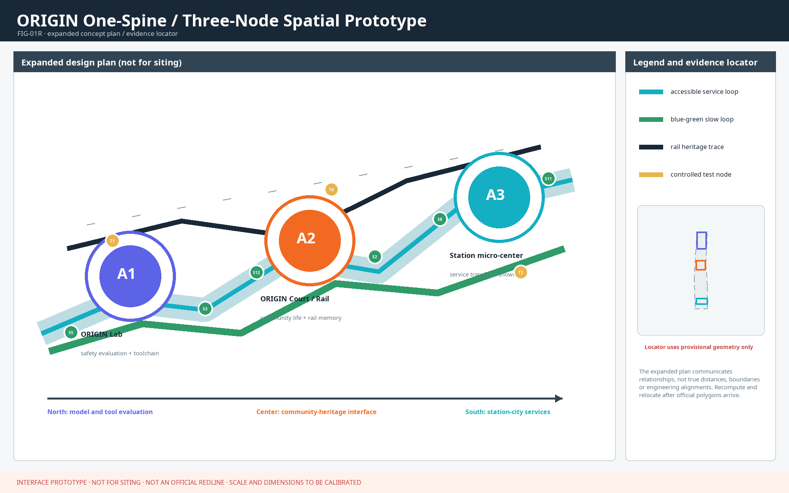
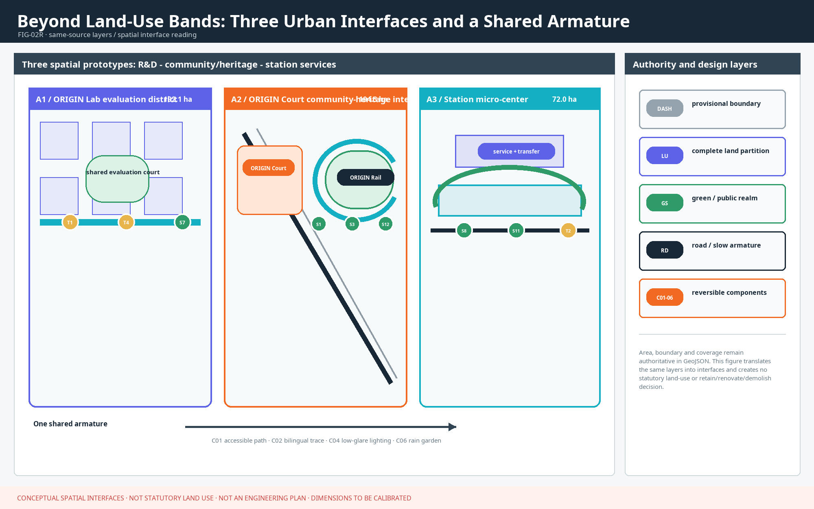
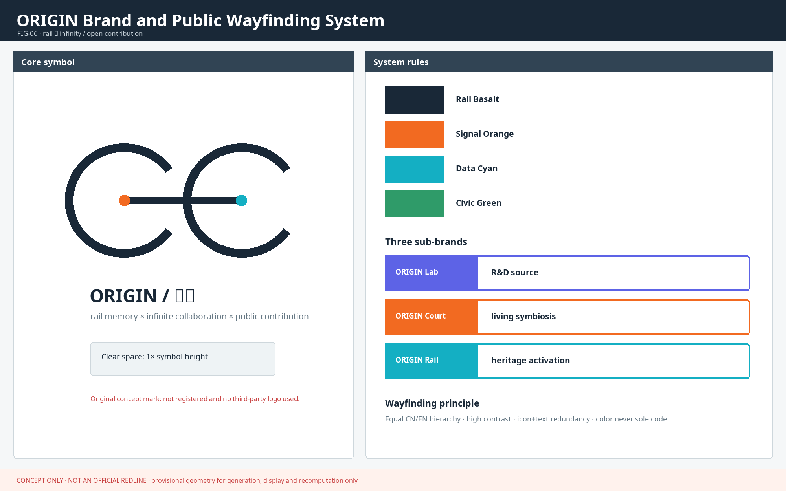
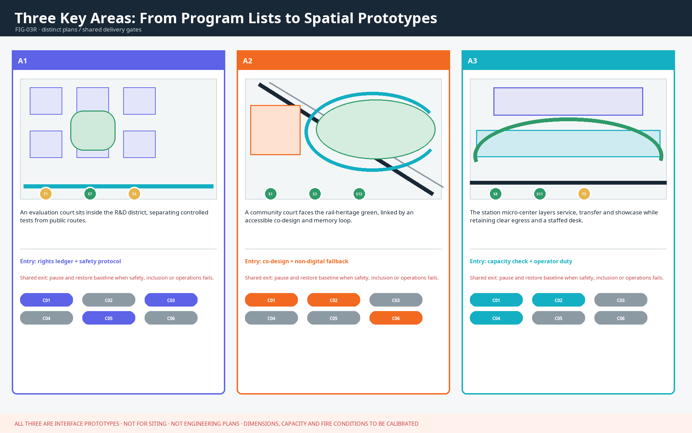
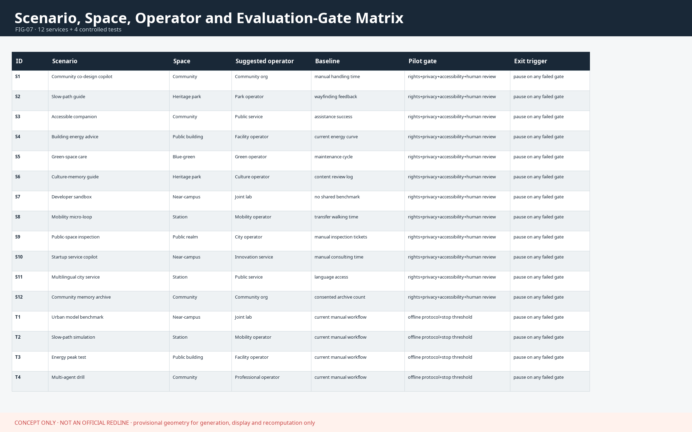
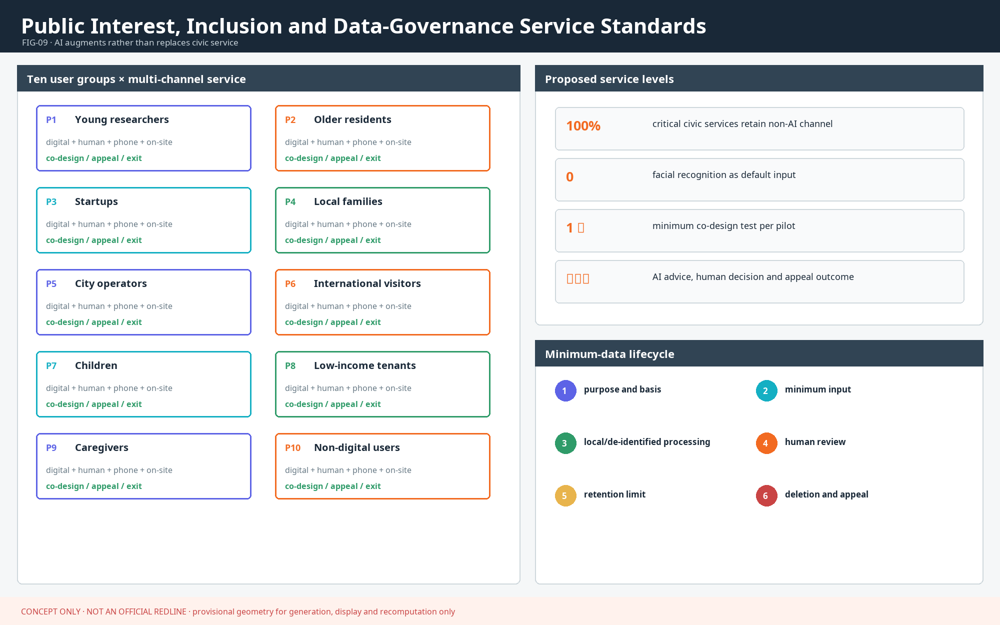
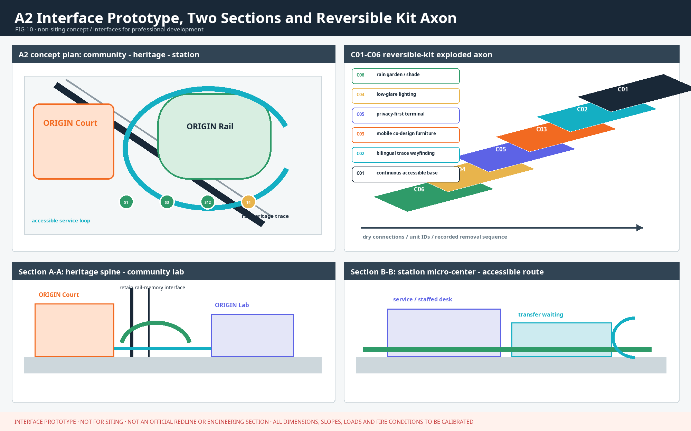
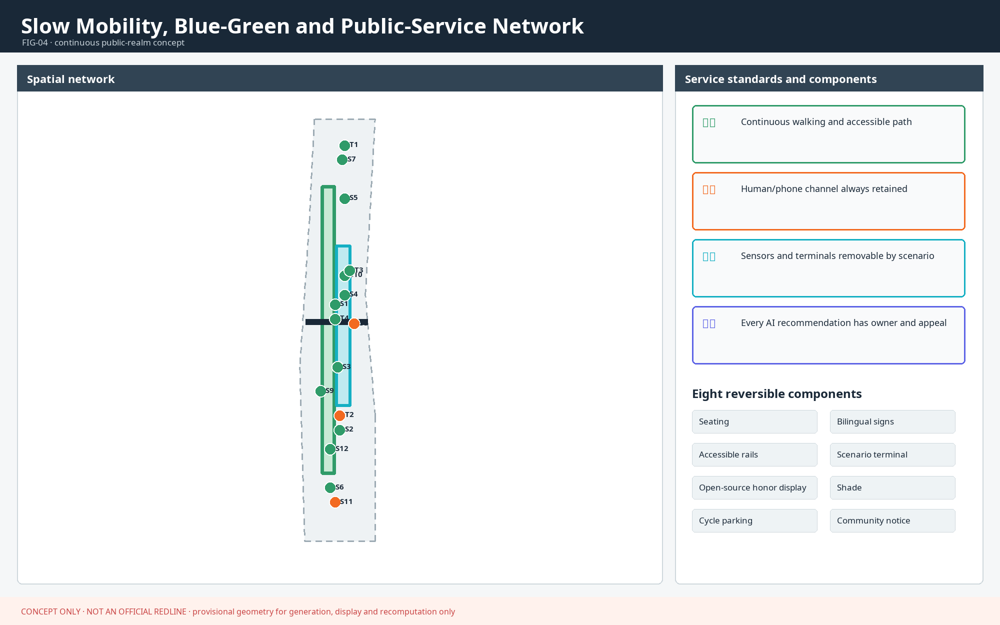
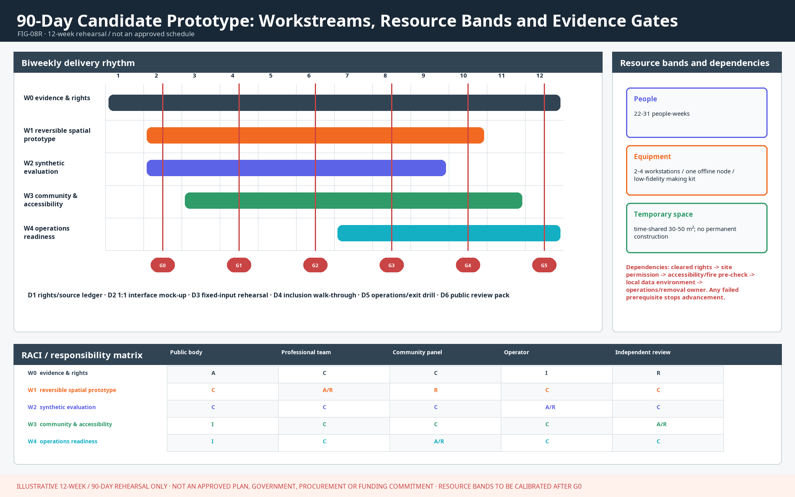
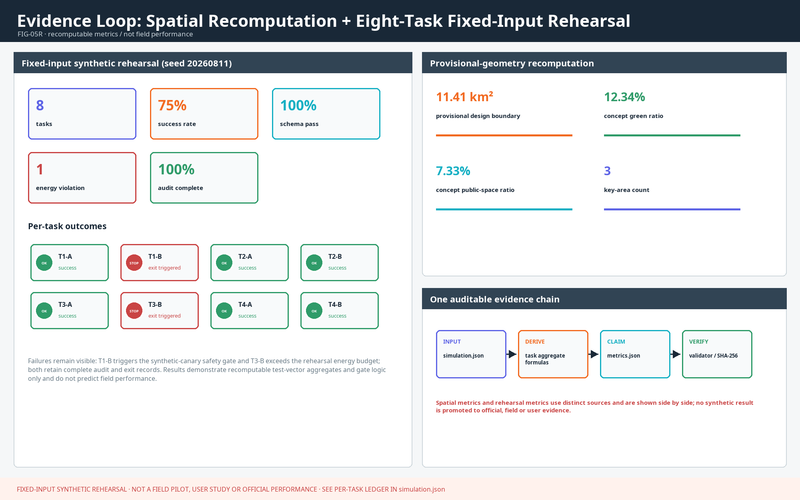

# Jing-Zhang AI Origin Community: A Human-Machine Symbiotic Urban Innovation Cell

This proposal responds to the Centennial Jing-Zhang AI Innovation Belt Open Call for Urban Design. It focuses on A2 Beijing AI Origin Community while placing A1 Zhongzhiyuan, A3 Dazhongsi, the Zhongguancun Technology Services Wing, and the Xiaoyue River Scenario Enablement Wing in one innovation loop. All spatial, event, policy, and operating content is an **open co-creation proposal / reference scheme / material for professional teams to deepen**. It does not replace statutory planning or constitute government approval, an investment commitment, or an engineering-feasibility conclusion [source:AGENT-TASKBOOK] [depth:risk_missing_data].

## Design Basis and Source List

The design basis has three layers: the open-call announcement and Agent taskbook define the objectives and mandatory tasks; the site package, professional-standard snapshots, and public source registry delimit admissible evidence; and the submission's GeoJSON, metrics, assumptions, and matrices form the recomputable audit layer [source:OFFICIAL-ANNOUNCEMENT] [standard:PROJECT-AGENT-OPEN-CALL-TASKBOOK]. The narrative keeps only claim-adjacent anchors, while complete provenance, licenses, formulas, and pending conditions remain in `sources.json`, `metrics.json`, and `assumptions.json`.

The current boundary and all three key-area polygons are **provisional constraints** used only for concept generation, spatial discussion, and recomputation demonstrations. The approximately 11.413 km² submitted boundary, key-area areas, green ratio, and public-space ratio are neither official redlines nor statutory indicators. When official geometry becomes available, the boundary must be replaced as a whole, metrics recomputed, and all bilingual figures, HTML, and PDFs regenerated [source:BOUNDARY-SOURCE] [metric:site_area_sqm]. Missing organizer-supplied official geometry should not reduce the content score, but provisional data must not create a false sense of implementation precision.

## Three-Level Scope Framework

The three scope levels correspond to three decision scales: the 43.6 km² coordinated study area addresses the industrial ecosystem and regional coordination; the approximately 11.4 km² overall design area addresses spatial structure, urban renewal, and public systems; and the three key areas address experiential scenarios and translation paths. The proposal makes A2 the primary design unit while defining reviewable interfaces for A1 and A3, so a single-point idea is not misrepresented as a belt-wide strategy [source:SITE-PACKAGE] [depth:three_level_scope_framework].

<!--AGENT1-->
The taskbook's three official positionings are the **Centennial Jing-Zhang Cultural Belt, Metropolitan AI Life Experience Belt, and AI Convergence Innovation Belt**. This proposal overlays them through “legible memory, usable services, and verifiable innovation”: the heritage spine carries cultural memory, the Xiaoyue River and community networks carry daily experience, and the A1-A2-A3 relay carries R&D, translation, and industrial application [source:AGENT-TASKBOOK] [depth:overall_spatial_structure].

| Level | Core judgment | Spatial move | Reviewable result |
| --- | --- | --- | --- |
| Coordinated study | An AI ecosystem cannot rely on park recruitment alone | Build a “university sourcing - open validation - community experience - industry translation - global communication” chain | All five interfaces have accountable actors, inputs, and outputs |
| Overall design | Industry, daily life, and heritage must share a public framework | Organize land use and scenarios through the Jing-Zhang heritage spine, slow-mobility network, and two wing interfaces | Layers overlay, metrics recompute, and gaps remain traceable |
| Three key areas | The three districts should complement rather than duplicate one another | A1 performs full-stack validation, A2 tests human-machine symbiotic daily life, and A3 performs demand validation and native new-business testing | Each area has projects, users, gate metrics, and exit conditions |

### Implementation Matrix for Three Positionings and Five Functions

The taskbook's five functions are delivery chains rather than slogans. Each chain requires a publicly auditable artifact before it advances [standard:PROJECT-AGENT-OPEN-CALL-TASKBOOK].

| Official function | Primary carrier | Minimum deliverable | Proposed pilot acceptance gate | Human gate |
| --- | --- | --- | --- | --- |
| Full-Stack Independent AI Innovation System | A1 Zhongzhiyuan + Zhongguancun Technology Services Wing | Reproducible experiments, model/data cards, evaluation baselines | 100% of experiments reproducible with dependencies and licenses declared | Joint technical, ethics, and safety review |
| World-class AI innovation ecosystem | A1-A2-A3 relay | Factor catalog, open problem list, translation ledger | Every project states talent, compute, data, scenario, and space interfaces | Conflict-of-interest and provenance review |
| New paradigm for AI+ scenario enablement | A2 + Xiaoyue River Scenario Enablement Wing | 12 scenario cards and 4 controlled test protocols | Every item has a baseline, KPI, human review, and exit threshold | Scenario admissions committee |
| Intelligent and vibrant AI city | Communities, heritage park, station micro-centers | Accessible, multilingual, cultural, and slow-mobility public services | 100% of essential services retain a human or offline alternative | Resident co-design and accessibility testing |
| Global discourse leadership in AI governance | A1 governance node + annual global program | Public rules, evaluation reports, appeal and audit records | 100% of high-impact scenarios complete an impact assessment and publish a summary | Independent ethics and public-interest seats |

## Coordinated Research Area: Industry and Future City Research

### Three Zones and Two Wings Synergy Loop

The “three zones and two wings” operate as a bidirectional loop rather than five isolated labels. A1 outputs toolchains, standards, and safety baselines; A2 translates technology into services residents can experience and contest; A3 collects real but authorized industrial demand and tests AI-native consumption and business scenarios. The Zhongguancun Technology Services Wing inputs talent, compute, professional services, and translation capacity. The Xiaoyue River Scenario Enablement Wing returns scenario feedback, public value, and operational issues to the three zones, closing the “R&D - validation - experience - translation - re-evaluation” loop [source:AGENT-TASKBOOK] [depth:overall_spatial_structure].

| Spatial unit | Input | Output | Interface to the next unit | Failure fallback |
| --- | --- | --- | --- | --- |
| A1 Zhongzhiyuan | Research problems, compute, open tools | Baseline models, evaluation protocols, governance rules | Enter controlled A2 scenarios only after T1/T4 pass | Remain in the offline sandbox; no public-space deployment |
| A2 Origin Community | Validated tools, resident needs, public space | Service prototypes, inclusion evidence, operational feedback | Enter A3 demand validation only after resident co-review | Restore human service and close data collection |
| A3 Dazhongsi | Scenario prototypes, business and visitor needs | Translatable product definitions and station-city service feedback | Return problems and needs to A1 for iteration | Stop commercial expansion and retain only a display sandbox |
| Zhongguancun Technology Services Wing | University, talent, IP, and professional-service interfaces | On-demand technical/legal/capital service catalog | Serve the three zones without promising policy or funding | Revert to public consultation and a knowledge base |
| Xiaoyue River Scenario Enablement Wing | Communities, blue-green space, slow-mobility experience | Perceptible scenarios, public feedback, maintenance data | Return public value and risk to the three areas | Switch to static wayfinding and staffed services |

### Regional Innovation Interfaces

Regional coordination defines **interfaces open for future discussion**, not fabricated existing partnerships. Beiwei Community focuses on community life and digital-inclusion protocols; Future Science City on long-cycle research and talent exchange; Huairou Science City on public science communication and validation methods related to major scientific facilities; Beijing Economic-Technological Development Area on robotics, intelligent manufacturing, and industrial validation; and the Beijing-Tianjin-Hebei level on portable standards, annual challenges, and talent exchange. An interface can enter the project ledger only after a formal counterpart, public source, and authorization exist [source:AGENT-TASKBOOK] [depth:risk_missing_data].

### ORIGIN Brand and Identity System

The original parent brand is “Origin / ORIGIN”, with ORIGIN Lab (R&D sourcing), ORIGIN Court (living symbiosis), ORIGIN Rail (heritage activation), and the annual ORIGIN Commons program. The self-drawn logo turns a rail cross-section into a continuous loop, using rail basalt, signal orange, and data cyan. The parent brand identifies the belt, while cultural wayfinding uses a separate “trace - mileage - time” grammar so heritage signs are not conflated with a commercial identity [source:AGENT-TASKBOOK] [standard:MOHURD-URBAN-DESIGN-MEASURES].

### Eight Global Cases and Local Translation

<!--AGENT2-->
The cases extract public mechanisms only; brands, policies, funding, and performance are not transplanted as local commitments. Each case has a distinct source ID, and its factual scope and rights boundary are recorded in `sources.json`.

| Case / source ID | Transferable mechanism | Jing-Zhang translation | Explicitly not copied |
| --- | --- | --- | --- |
| <!--GLOBAL_CASE--> Mila (Montreal) [source:CASE-01] | Open research and talent pipeline | A1 open evaluation + A2 community questions | Institutional brand, funding scale, organizational relationships |
| <!--GLOBAL_CASE--> Vector Institute (Toronto) [source:CASE-02] | Research-institute-led industrial translation | Expert-demand matching catalog in the Zhongguancun wing | Company lists, investment, or policy commitments |
| <!--GLOBAL_CASE--> Helsinki AI Strategy [source:CASE-03] | Transparent public-AI governance | Public scenario register, model cards, and appeals | Unverified city-performance claims |
| <!--GLOBAL_CASE--> e-Estonia (Tallinn) [source:CASE-04] | Trusted identity and digital-service foundations | Authorization, audit, and least-privilege principles only | Identity architecture and centralized personal data |
| <!--GLOBAL_CASE--> ETH ecosystem (Zurich) [source:CASE-05] | University-engineering translation | Joint A1-A2 questions and reproducible experiment gates | University-industry relationships, patents, and brand assets |
| <!--GLOBAL_CASE--> Punggol Digital District (Singapore) [source:CASE-06] | Integrated industry-education space and city digital platform | A2 near-campus mixed space + controlled scenario sandbox | Planning indicators, development model, and construction schedule |
| <!--GLOBAL_CASE--> Seongsu (Seoul) [source:CASE-07] | Low-intervention reuse of industrial space | Reversible ORIGIN Rail insertions and small innovation spaces | Parcel-specific retain-renovate-demolish conclusions |
| <!--GLOBAL_CASE--> Brainport (Eindhoven) [source:CASE-08] | Industry-government-university collaboration network | Open problem list and multi-party deliberation | Co-investment ratios, industry scale, or confirmed partners |

### Industry-Space-Factor Map

The industrial ecosystem follows “problem intake - resource matching - controlled validation - public co-review - translation/exit”. Land and space provide only reversible pilot carriers; talent, compute, data, and funding use public catalogs and admissions rules; and every enterprise participant must disclose conflicts of interest, data use, and exit responsibility [depth:renewal_project_list] [source:SOURCE-REGISTRY].

| Factor | A1 | A2 | A3 | Wing support | Governance evidence |
| --- | --- | --- | --- | --- | --- |
| Talent | Researchers, evaluators, safety teams | Resident co-creators, service designers | Product and operations teams | Zhongguancun-wing talent services | Role, recusal, and attribution ledger |
| Compute | Isolated evaluation environment | Edge/on-device inference | Display and demand-validation environment | On-demand service catalog | Usage, energy, and permission logs |
| Data | Synthetic/de-identified benchmarks | Minimum necessary community data | Authorized aggregate operational data | Xiaoyue River public feedback | Data cards, retention periods, withdrawal records |
| Scenarios | T1/T4 technical gates | S1-S12 public experience | Business and station-city service validation | Wings supply problems and feedback | Scenario cards, impact assessment, exit report |
| Space | Experiment and evaluation carriers | Mixed community and public space | Station-city, business, and consumption interfaces | Heritage spine and blue-green path | Ownership/heritage/engineering prerequisite list |

## Overall Design Area: Urban Renewal and Regulatory-Plan-Level Urban Design

The overall structure is “one spine, two wings, three units, multiple nodes”: the Jing-Zhang heritage park is the public cultural spine; Zhongguancun technology services and Xiaoyue River scenario enablement form two wings; A1/A2/A3 form complementary innovation units; and station micro-centers, community gardens, open labs, and honor nodes form a reversible scenario network [depth:overall_spatial_structure]. Land use, buildings, roads, green, and public-space layers jointly express this judgment, but the provisional boundary performs no statutory regulatory-plan function [data:geometry/land_use.geojson#LU-001] [standard:MOHURD-CONTROL-DETAILED-PLANNING].

Urban renewal prioritizes public connectivity, reuse of existing space, scenario reversibility, and community benefit over incremental floor area. FAR, building height, road redlines, ownership, municipal capacity, and parcel-specific treatment remain pending official information and professional survey. This proposal defines only the decision method, evidence gates, and candidate components [depth:development_intensity_controls] [metric:floor_area_ratio].

## Detailed Design of Key Areas

All three key areas use provisional polygons. The following actions are a cross-area detailed-design framework, not parcel approval, ownership, or engineering conclusions [source:KEY-AREA-SOURCE] [depth:three_key_area_detailed_design].

### A1 Zhongzhiyuan AI Independent Innovation Acceleration Area

A1 is proposed to host three carriers: a Benchmark Workshop, a Safety and Governance Desk, and an Open Tool Repository. Synthetic or cleared data first produces reproducible experiments, after which technical, ethics, and safety reviewers jointly sign a scenario release record. Space favors reversible test units and shared evaluation facilities; unvalidated models do not enter public areas [data:geometry/key_areas.geojson#PROV-KEY-001].

Proposed KPIs include experiment reproducibility, model/data-card completeness, open-artifact accessibility, and closure of high-risk findings. Any privacy leak, unexplainable high-impact judgment, or non-reproducible result returns the artifact to the isolated sandbox.

### A2 Beijing AI Origin Community (Primary Design Unit)

A2 organizes research, living, services, and culture through a Near-campus Innovation Loop, Symbiotic Neighborhood, Heritage Living Room, and Station Micro-center. ORIGIN Lab receives university outcomes; ORIGIN Court retains staffed public service and affordable participation; ORIGIN Rail inserts the cultural narrative into slow mobility and public space. Scenarios enter from a community problem list and pass privacy, accessibility, technical, and resident co-review gates in sequence [data:geometry/key_areas.geojson#PROV-KEY-002].

The primary unit uses 12 scenarios, 10 personas, public-space accessibility, offline-alternative coverage, resident-appeal closure, and pilot-exit records as performance evidence. A service pauses and restores a human workflow if it widens the digital divide, produces uncorrectable disparate impact, or replaces a statutory human judgment.

### A3 Dazhongsi AI Industry Cluster

A3 is proposed to host an AI-native Business Interface, Station-city Experience Hall, and Demand Validation Desk, turning A2 prototypes that pass public co-review into reviewable product requirements and service standards. Business experiences use authorized aggregate data only; no leading-company list, recruitment scale, or construction indicator is presumed [data:geometry/key_areas.geojson#PROV-KEY-003].

Proposed KPIs include the share of requirements returned to A1, scenario translation cycle, station-city service accessibility, and closure of public problems. If operations cannot demonstrate public value or data compliance, expansion stops and only an offline display remains.

| Key area | Primary users | Core delivery | Gate to the next stage | Exit/fallback |
| --- | --- | --- | --- | --- |
| A1 Zhongzhiyuan | Researchers, engineers, governance experts | Reproducible baseline and safety rules | T1/T4 pass with complete evidence | Return to isolated sandbox |
| A2 Origin Community | Residents, young talent, service workers, visitors | Experiential and contestable public services | Inclusion, privacy, resident co-review pass | Restore staffed/offline service |
| A3 Dazhongsi | Enterprises, operators, consumers, rail passengers | Translatable demand and station-city standards | Public value and authorized data demonstrated | Stop expansion; retain display only |

## AI Innovation Ecosystem, Personas, and AI+ Scenarios

<!--AGENT3-->
### Twelve Scenario Cards

All scenarios are controlled pilot proposals. Each card defines minimum data, space, baseline, acceptance, and exit. High-impact outputs are advisory only, with final decisions retained by accountable people [source:AGENT-TASKBOOK] [depth:risk_missing_data].

<!--SCENARIO_CARD-->
**S1 · Community Co-creation Assistant**: A2 community service points; it handles only voluntarily submitted proposals and public service information. Against a staffed registration baseline, the proposed target is 100% source display and acknowledgment within two working days. Fabricated policy, sensitive-data leakage, or an appeal that cannot transfer to staff stops the service [data:geometry/key_areas.geojson#PROV-KEY-002].

<!--SCENARIO_CARD-->
**S2 · Slow-mobility Greenway Guide**: the heritage spine and Xiaoyue River wing; it uses public/cleared paths and accessibility data. Against static signs, the proposed valid-link rate is at least 95%, with verified routing errors corrected within one maintenance cycle. Official-network change or a high-risk navigation error triggers a return to static signs [data:geometry/roads.geojson#ROAD-001].

<!--SCENARIO_CARD-->
**S3 · Accessibility Companion**: A2 and station micro-centers; location and voice are processed on-device where feasible without persistent trajectory profiles. The proposed gate is a staffed/telephone alternative for 100% of essential journeys plus co-testing with disabled users. Erroneous guidance, non-withdrawable data, or loss of the alternative channel stops the service [data:geometry/key_areas.geojson#PROV-KEY-002].

<!--SCENARIO_CARD-->
**S4 · Public-building Energy Assistant**: candidate public buildings in A1/A2; it uses authorized aggregate metering only. Against rule-based control, the offline-simulation target is at least 5% improvement without violating comfort or safety constraints. It cannot connect to live systems before data authorization, fire-safety, and operations review [data:geometry/buildings.geojson#BLDG-001].

<!--SCENARIO_CARD-->
**S5 · Blue-green Space Stewardship**: Xiaoyue River and community gardens; it uses authorized sensors and manual inspection records. The proposed work-order precision is at least 85%, with every recommendation confirmed by landscape staff. Persistent false alerts, ecological disturbance, or unclear provenance returns the service to manual inspection [data:geometry/green_space.geojson#GREEN-001].

<!--SCENARIO_CARD-->
**S6 · Cultural Memory Guide**: ORIGIN Rail and L1-L5; it publishes content only after provenance, copyright, and heritage review. The proposed gate is 100% fact-to-source matching and 100% alignment of core Chinese/English content. A disputed fact or unclear rights status takes the item offline [data:geometry/public_space.geojson#PUBLIC-001].

<!--SCENARIO_CARD-->
**S7 · Developer Sandbox**: A1 workshop; it uses synthetic, public, or separately authorized data and has no external network egress by default. Every evaluation should be reproducible, with 100% model/data-card completion. Data exfiltration, unknown dependencies, or non-reproducible results trigger isolation [data:geometry/key_areas.geojson#PROV-KEY-001].

<!--SCENARIO_CARD-->
**S8 · Mobility Micro-circulation Simulation Assistant**: station micro-centers; it performs offline/shadow analysis and never controls live traffic. Against the current staffed scheme, it compares walking transfer time, conflict points, and accessible detours. It cannot go live without official traffic data and safety review [data:geometry/roads.geojson#ROAD-001].

<!--SCENARIO_CARD-->
**S9 · Public-space Safety Assistant**: event nodes; face recognition and identity tracking are prohibited, and only authorized group-level anomaly alerts are allowed. Proposed gates are at least 90% precision and no more than a five-percentage-point false-positive gap across groups; people always decide interventions. Disparate impact or persistent false alerts beyond the threshold stop the pilot [data:geometry/public_space.geojson#PUBLIC-001].

<!--SCENARIO_CARD-->
**S10 · Startup Service Copilot**: Zhongguancun wing and A3; it aggregates only public policy, space, and compute catalogs and makes no eligibility decisions. The proposed target is 100% source citation for factual answers and removal of expired records within one maintenance cycle. Hidden conflicts of interest or automatic approval behavior returns the service to staffed consultation [data:geometry/key_areas.geojson#PROV-KEY-003].

<!--SCENARIO_CARD-->
**S11 · Multilingual Public Service**: A2/A3 and international program nodes; core terms use the event glossary and are sampled by bilingual reviewers. The proposed gate is 100% Chinese-English alignment for critical statements, risks, and wayfinding. A safety- or rights-critical translation error removes the automated text and displays a human-approved version [data:geometry/key_areas.geojson#PROV-KEY-002].

<!--SCENARIO_CARD-->
**S12 · Community Memory Archive**: ORIGIN Rail; oral history and images receive item-level authorization, with precise home addresses and similar personal details non-public by default. The proposed gate is 100% consent-record coverage and completion of withdrawal requests within five working days. Incomplete provenance, consent, or copyright prevents publication [data:geometry/public_space.geojson#PUBLIC-001].

### Four Controlled Industry Test Protocols

<!--TEST_SCENARIO-->
**T1 · Open-source Model Urban Benchmark**: the hypothesis is that local-task performance can improve without personal data. Inputs are synthetic/cleared benchmarks and the control is a published baseline model; accuracy, robustness, energy, and group disparity are recorded. It passes only when reproduction succeeds with no high-risk leakage; otherwise the version is sealed and a failure note published [data:geometry/key_areas.geojson#PROV-KEY-001].

<!--TEST_SCENARIO-->
**T2 · Slow-mobility Congestion Simulation**: the hypothesis is that changing signs and service points can reduce accessible detours. Provisional roads are used only in an offline comparison against the current baseline. An official-geometry change, added conflict points, or a worse journey for vulnerable users fails the test and produces no engineering alignment [data:geometry/roads.geojson#ROAD-001].

<!--TEST_SCENARIO-->
**T3 · Energy Peak Stress Test**: the hypothesis is that predictive advice can shave peaks within comfort limits. Synthetic or authorized aggregate series are compared with rule-based control on energy, peak demand, comfort deviation, and human takeover. Any safety/comfort violation or rebound effect stops the test; no live equipment is controlled [data:geometry/buildings.geojson#BLDG-001].

<!--TEST_SCENARIO-->
**T4 · Multi-agent Coordination Drill**: the hypothesis is that governance, service, and operations agents can shorten processing without transferring accountability. Synthetic work orders test handoffs, permissions, and auditability. Handoff-log coverage must be 100%, and every high-impact decision requires a human signature; overreach or an untraceable chain ends the drill [data:geometry/key_areas.geojson#PROV-KEY-001].

#### Fixed-input Synthetic Rehearsal (Not Field Evidence)

`simulation.json` freezes two inputs for each of T1-T4, for eight offline synthetic tasks in total. Six succeeded and two failed at their gates, giving a 0.75 success rate. Failures remain in the denominator and audit ledger; they are not rerun or deleted to improve the result [metric:simulation_task_count] [metric:simulation_success_rate].

All eight dispatch objects passed schema checks and all eight audit records are complete. T3-F02 carries a 1.18 kWh ledger value against a 1.00 kWh rehearsal budget, so the energy-budget violation count is one. These are fixed synthetic ledger values for walking through budget comparison and exit branches, not external power-meter readings, measured model energy, building energy, or municipal-capacity measurements [metric:tool_schema_pass_rate] [metric:energy_budget_violations] [metric:audit_completeness].

| Fixed task | Protocol / input | Outcome | Schema / audit | Rehearsal energy / budget | Failure and exit |
| --- | --- | --- | --- | --- | --- |
| T1-F01 | T1 / 32 bilingual synthetic QA records | Success | Pass / complete | 0.42 / 0.60 kWh | Leakage or non-reproducibility seals the version and restores the staffed-review baseline |
| T1-F02 | T1 / 16 records with one synthetic canary | Safety-gate failure | Pass / complete | 0.38 / 0.50 kWh | Output blocked and version sealed; restart requires the unchanged fixture to pass regression plus human sign-off |
| T2-F01 | T2 / 12 fixed accessible OD pairs | Success | Pass / complete | 0.31 / 0.45 kWh | A worse vulnerable-user detour or added conflict withdraws the suggestion |
| T2-F02 | T2 / 8 OD pairs under synthetic event load | Success | Pass / complete | 0.34 / 0.45 kWh | Capacity conflict or missing staffed fallback pauses the option and restores static/staffed guidance |
| T3-F01 | T3 / 24-step synthetic load A | Success | Pass / complete | 0.76 / 0.90 kWh | A comfort, safety, or rebound breach stops the run and restores the rule baseline |
| T3-F02 | T3 / 24-step high-peak synthetic load B | Energy-budget failure | Pass / complete | 1.18 / 1.00 kWh | Rehearsal terminated and rule baseline restored; no live device is connected or controlled |
| T4-F01 | T4 / 10 synthetic work orders | Success | Pass / complete | 0.28 / 0.40 kWh | Overreach, missing signature, or audit-chain break moves all work to a staffed queue |
| T4-F02 | T4 / 8 synthetic work orders with two appeals | Success | Pass / complete | 0.30 / 0.40 kWh | Appeal bypass or incomplete records freeze automated closure and trigger human review |

The ledger is a deterministic test-vector walkthrough, not an instrumented laboratory or field execution with independent runtime logs. It shows only that task aggregates and gate logic are recomputable under fixed inputs. It contains no real users, field sensing, live equipment control, appointed real-world reviewer, or government-system integration and is not measured model performance, field performance, engineering feasibility, approval progress, a government commitment, or a basis for deployment.

### Ten Personas and Measurable Service Standards

The standards below are proposed pilot acceptance criteria rather than approved service commitments. Final thresholds require co-design, accessibility testing, and calibration against operating capacity [depth:blue_green_public_space].

| ID / persona | Core task | Proposed service standard | Measurement | Failure fallback |
| --- | --- | --- | --- | --- |
| <!--PERSONA--> P1 Young AI researcher | Find compute, data, and collaborators | 100% of catalog entries state license, update date, and contact | Monthly catalog audit | Staffed research service desk |
| <!--PERSONA--> P2 Community elder | Obtain clear and safe daily services | 100% of essential services offer large text, voice, and staff entry | Task walkthrough + elder co-test | Telephone/counter service |
| <!--PERSONA--> P3 Startup founder | Apply for space and test scenarios | Application status returned within 10 working days; no automated approval | Work-order timestamp | Human review panel |
| <!--PERSONA--> P4 Local resident/family | Understand impacts of works, events, and services | Major changes disclosed in advance with one offline briefing | Notice and attendance record | Delay pilot and repeat engagement |
| <!--PERSONA--> P5 City operator | Audit systems and take over anomalies | 100% of high-impact outputs log model, data, version, and human decision | Log sampling | Switch to manual SOP |
| <!--PERSONA--> P6 International visitor/scholar | Understand space and culture | 100% coverage of core wayfinding, risk statements, and scenario descriptions in Chinese/English | Bilingual item check | Staffed bilingual service |
| <!--PERSONA--> P7 Child/young person | Learn and explore safely | 100% age-appropriate interfaces, no commercial profiling, guardian path provided | Child-friendly review | Disable personalization |
| <!--PERSONA--> P8 Low-income/affordable-housing tenant | Access affordable services and opportunity | 100% of essential public services retain a free offline alternative | Fee and channel audit | Free staffed channel |
| <!--PERSONA--> P9 Caregiver/care worker | Access care and training support | 100% of health/care recommendations confirmed by accountable staff | Work-order signature rate | Authoritative static information only |
| <!--PERSONA--> P10 Non-digital user | Complete tasks without a smart device | Every essential journey has a counter, phone, or paper path | Quarterly mystery-user test | Suspend AI-only flow |

### Data Governance and Co-design Loop

Every scenario proceeds through problem co-creation, data classification, impact assessment, small-sample offline testing, vulnerable-user co-testing, a time-bounded pilot, public retrospective, and a continue/modify/exit decision. The default is the minimum data needed for the task. Raw location trajectories are not retained long-term, and pilot operational logs have a proposed default maximum of 30 days unless a clear legal/protocol basis requires otherwise. People can access, correct, withdraw, and appeal [source:AGENT-TASKBOOK] [depth:risk_missing_data].

## Land Use, Building Scale, and Retain-Renovate-Demolish Strategy

Land-use partitioning requires full coverage, shared boundaries, and recomputability. It currently expresses concept functions only and does not replace statutory use classes or regulatory-plan indicators [standard:MNR-LAND-USE-CLASSIFICATION-GUIDE] [data:geometry/land_use.geojson#LU-001]. The approximately 310,807 m² building-footprint area is a low-confidence computation under the provisional boundary, not total floor area; FAR, building height, and ownership remain pending official information [metric:building_footprint_area_sqm].

### Retain-Renovate-Remove Decision Gates and Building Components

| Code | Candidate treatment | Applicable condition | Mandatory evidence | Reversible component | Gate that cannot be bypassed |
| --- | --- | --- | --- | --- | --- |
| R0 | Protect/retain | Confirmed heritage or high-value asset | Heritage identity, survey, condition assessment | Removable wayfinding, lighting, exhibit | No intervention in fabric without heritage approval |
| R1 | Retain/maintain | Structure and function broadly suitable | Ownership, structural safety, use survey | Energy operations, accessibility patch | No model inference in place of professional appraisal |
| R2 | Repair/adapt | Low-intervention adaptation can meet use | Structure, fire, MEP, user needs | Plug-in service core, shared equipment wall | No use change before professional assessment |
| R3 | Reversible insertion | Vacant space can host a short pilot | Owner consent, load, egress, operating plan | Modular test bay, movable furniture | Fully removable at pilot end |
| R4 | Renewal/new-build candidate | Discussed only after official controls and renewal procedure | Regulatory plan, ownership, appraisal, approval, participation | Reserved standardized interfaces | No parcel demolition or construction conclusion here |

### Public-space Component Library

The library includes C01 continuous accessible path, C02 bilingual trace wayfinding, C03 movable co-creation furniture, C04 low-luminance smart lighting, C05 privacy-first scenario terminal, and C06 rain-garden/shade module. Each component records dimensions pending calibration, material provenance, accessibility requirements, energy, maintenance responsibility, and removal method. Procurement, structural, and construction parameters remain for professional deepening [depth:retain_renovate_demolish] [standard:MOHURD-ARCH-DESIGN-DEPTH-2016].

The figure below expands ORIGIN Court, ORIGIN Rail, the continuous accessible loop, and scenario nodes in A2 as a non-siting interface prototype. Two conceptual sections and a C01-C06 exploded axon identify interfaces for professional development. It is not for siting and is not an official redline, engineering plan, or engineering section; all dimensions, gradients, loads, fire conditions, and capacities await official information and field calibration [depth:three_key_area_detailed_design] [depth:urban_character_guidance].

## Transport, Rail, Municipal Infrastructure, and Public Services

The transport sequence is “continuous walking and accessibility first, cycle connections second, motor-vehicle micro-circulation optimization third”. The roads layer expresses concept connections only. Rail interfaces such as Wudaokou and Qinghuadongluxikou require official traffic, ridership, redline, and safety information before review and do not constitute engineering alignments [data:geometry/roads.geojson#ROAD-001] [depth:traffic_rail_slow_parking].

The Xiaoyue River Scenario Enablement Wing proposes a public experience sequence of “Intelligence Valley Gateway - Scenario Neighborhood - Community Garden - Station Micro-center”, connecting S2, S3, S5, S11, and S12. Path length, sections, and node locations await official geometry and field survey. Every node must provide static wayfinding, an accessible alternative, and a scenario kill switch [depth:blue_green_public_space].

Municipal and new infrastructure follow “prove demand, verify capacity, prefer edge processing, preserve human takeover”. Until formal data exist for compute, energy, drainage, flood, fire, utilities, and communications capacity, only interfaces and monitoring items are stated, not capacities or engineering-feasibility conclusions [depth:municipal_new_infrastructure].

## Blue-Green Network, Public Space, and Urban Character

The Jing-Zhang heritage park spine and Xiaoyue River wing form a shared blue-green public framework intended to reconnect east-west communities, link north-south innovation nodes, and provide everyday cooling, rest, cultural, and accessible services. The current 12.3423% green ratio and 7.3281% public-space ratio are low-confidence intermediate values under provisional geometry, used only to diagnose layers and compare options; they must be fully recomputed when the official boundary arrives [metric:green_ratio] [metric:public_space_ratio].

<!--AGENT4-->
### Pilgrimage, Honor, and Public-life Nodes

<!--LANDMARK-->
**L1 · ORIGIN Window**: an open-indicator window in A2's Heritage Living Room. It shows only explainable, traceable community public indicators and provides a non-screen physical version.

<!--LANDMARK-->
**L2 · Memory Rail**: a time narrative along the heritage spine. Source cards and replaceable exhibits convey engineering memory without copying unauthorized historic images.

<!--LANDMARK-->
**L3 · Co-Creation Plaza**: flexible space for community deliberation, open-source markets, and small releases. Events must meet noise, egress, and accessibility gates.

<!--LANDMARK-->
**L4 · Open-source Honor Ring**: records Agent, developer, resident, and professional contributions confirmed under public rules. It supports corrections and additions and does not describe contribution records as awards or official endorsement.

<!--LANDMARK-->
**L5 · Global Challenge Table**: a bilingual problem-publishing and remote-collaboration node in A3/a station micro-center. It publishes only cleared material and genuine open questions, not recruitment commitments.

All five nodes use the operating gates “100% traceable content sources, accessible alternatives for 100% of critical experiences, and a public post-event retrospective”. If heritage, green/blue-line, traffic-safety, or ownership conditions fail, temporary exhibits or an online archive replace permanent construction [standard:MOHURD-URBAN-DESIGN-MEASURES] [depth:blue_green_public_space].

<!--AGENT5-->
### Cultural Resource Ledger and Three-act Storyline

Cultural work builds a ledger before writing a narrative. Rails, station buildings/platforms, bridges/culverts, and industrial structures are candidates under “Jing-Zhang engineering memory”; Xueyuan Road universities, innovation institutions, and entrepreneurial activity are candidates under “Zhongguancun exploration”; open-source code, model cards, scenario records, and contribution archives are candidates under “AI symbiotic culture”. Every record includes name, location, date/status, provenance, rights, protection needs, usable media, and an accountable party still to be confirmed. Unverified protection grades remain “pending heritage-authority confirmation” [source:SOURCE-REGISTRY] [depth:existing_conditions_diagnosis].

The spatial storyline has three acts: **Trace** reads railway and engineering methods at L2; **Exploration** presents Zhongguancun-style problem-solving and open collaboration across A1-A2; **Symbiosis** lets people experience how AI accepts human oversight and returns value to public life at L1/L3/L4/L5. Proposed international copy is “From Jing-Zhang's engineering memory to a city co-created with intelligence.” All translations receive human review and do not portray the concept as built or approved.

## Renewal Projects, Implementation Policy, and Phasing

<!--AGENT6-->
Implementation no longer follows a mechanical latitude or calendar split; it is gated by evidence and public value. `phasing.geojson` shows three spatial candidates only, while the real sequence follows G0-G4 decision gates [data:geometry/phasing.geojson#PH-01] [depth:phasing_implementation].

| Phase | Primary work | Entry gate | Exit gate | Deliverable evidence |
| --- | --- | --- | --- | --- |
| P0 Evidence ready | Official-data list, ownership/heritage/utility gaps, resident problem list | G0: provenance, license, and owner complete | Core information unavailable or impermissible | Data/source/assumption ledger |
| P1 Reversible prototype | ORIGIN wayfinding, offline sandbox, parallel staffed service, small event | G1: privacy, accessibility, safety, preliminary heritage review pass | High-risk issue, service exclusion, or no fallback | Prototype, baseline, test report |
| P2 Controlled pilot | A1 T1/T4, A2 scenario bundle, Xiaoyue River experience sequence | G2: four test protocols pass + resident co-review | KPI misses for two consecutive evaluation cycles | Impact assessment, appeals, exit records |
| P3 Network linkage | Cross-area service across A1-A2-A3 and the wings | G3: interface accountability, operating budget, data protocol clear | Responsibility/funding/data protocol interrupted | Cross-area SLA and public dashboard |
| P4 Long-term operation | Annual program, honor archive, global collaboration | G4: independent evaluation demonstrates public value and clear rights | Public value falls, rights breach, or governance failure | Annual report, open assets, next-year decision |

### 90-day / 12-week Candidate Prototype Plan (Non-commitment)

The following is a candidate work plan for a future team's evaluation: a continuous 90-calendar-day window, with 12 delivery weeks for prototyping and review and no more than six remaining days for close-out, exit, or a next-round recommendation. It is not an approved schedule, procurement plan, or staffing plan and does not imply government resources, space, budget, counterparties, permits, or implementation commitments. If a resource or approval condition is absent, the work package remains desk research or stops [source:AGENT-TASKBOOK] [depth:phasing_implementation].

In the RACI fields, R executes, A is the single human accountable role, C must be consulted, and I is informed. All roles below are candidates and unappointed: a **candidate prototype team** produces the work; a **human pilot steward** accepts A only after appointment by an actual organization; planning/safety/data/ethics/accessibility professionals serve as C; and community co-reviewers and open-call observers are I. The estimated total is a **22-31 people-week resource band**, not a budget or hiring commitment.

| Work package | Proposed window | R / A / C / I | People-week band | Candidate equipment and temporary space | Critical dependencies | Entry / exit gate |
| --- | --- | --- | --- | --- | --- | --- | --- |
| W0 Evidence, governance, and fixture freeze | Weeks 1-2 | Evidence coordinator / human pilot steward / planning, ethics-rights, and data review / community co-reviewers | 3-4 | Two standard workstations, offline repository, bookable 10-20 m² meeting room | Source permissions, role-conflict check, synthetic fixture freeze | Enter: public/cleared material available; exit: unclear rights, no single A, or no auditability |
| W1 Reversible wayfinding and parallel staffed service | Weeks 3-6 | Service-design team / human pilot steward / accessibility, heritage, and safety review / user representatives | 4-6 | Print/low-fidelity kit and 20-40 m² temporary workshop; no permanent works | W0, written space permission, accessible alternative | Enter: G0 passed; exit: heritage/safety failure, irreversibility, or digital exclusion |
| W2 T1/T4 offline sandbox | Weeks 3-8 | Evaluation/audit team / human pilot steward / data security, ethics, and appeal representatives / public observers | 6-8 | Two to four workstations, one air-gapped compute node, 20-40 m² temporary evaluation room | Frozen W0 fixtures, permission matrix, human-signature and appeal SOP | Enter: schema/audit fields and staffed fallback ready; exit: leak, overreach, missing signature, or non-reproducibility |
| W3 T2/T3 offline spatial and energy rehearsal | Weeks 5-10 | Offline-analysis team / human pilot steward / transport, accessibility, energy, and safety professionals / community co-reviewers | 5-7 | One to two analysis workstations, 15-30 m² review room; physically isolated from live equipment | Provisional layers, fixed OD/load fixtures, energy budget, and rule baseline | Enter: read-only offline inputs; exit: worse vulnerable journey, comfort/safety breach, or energy overrun |
| W4 Co-review, failure retrospective, and exit pack | Weeks 9-12 + close-out | Co-review/documentation team / human pilot steward / independent review, accessibility, and copyright / all participants | 4-6 | Bilingual accessible meeting kit and 40-80 m² temporary workshop, used only with permission | Complete W1-W3 logs, failure cases, appeals, and deletion list | Enter: original results preserved; exit: audit gap, unresolved dispute, or interrupted accountability/permission |

Biweekly delivery treats failure as deliverable evidence, not delay:

| Biweekly gate | Candidate delivery | Entry gate | Exit gate / decision |
| --- | --- | --- | --- |
| Week 2 D2 | Provenance/rights ledger, RACI, frozen-fixture list, risk and deletion rules | Public or cleared material readable | Stop affected work if rights, the A role, or fallback channel is incomplete |
| Week 4 D4 | Low-fidelity wayfinding, parallel staffed SOP, T1-T4 baselines and acceptance scripts | D2 passed; equipment remains offline | Failed accessibility/safety screen returns the work to a desk concept, with no co-test |
| Week 6 D6 | First four fixed tasks, schema/audit sampling, issue log | Fixture version frozen and human-review seat staffed | Any high-risk issue pauses work; preserve the original failure and trigger fallback |
| Week 8 D8 | All eight rehearsals, six-success/two-failure retrospective, energy-overrun record | D6 issues have owners and response dates | Unclosed failure permits only modify or stop, never escalation to a field pilot |
| Week 10 D10 | Accessibility co-review, revised prototype, appeal and human-takeover drill | Revisions address logged issues without replacing fixed inputs | Group disparity, appeal, or takeover failure withdraws the affected prototype |
| Week 12 D12 | Bilingual decision memo, candidate open assets, deletion/archive/exit pack | Audit 8/8 and complete rights ledger | Output only continue-research / modify / stop advice; no automatic procurement, works, or launch decision |

Days 85-90 are limited to archive, expiry deletion, accountability handoff, and a written recommendation on another round. The 90-day window is not presented as a government approval deadline, construction sequence, or committed service-launch date.

### Project Portfolio and Dependencies

| Project | First reversible delivery | Prerequisite | Proposed accountability | Core KPI | Mandatory exit trigger |
| --- | --- | --- | --- | --- | --- |
| UP-01 ORIGIN Lab | Offline evaluation workshop | Data license, technical/ethics review | University consortium + professional operator | Reproducibility, model-card completion | Leak, overreach, or non-reproducibility |
| UP-02 ORIGIN Court | Parallel staffed community service point | Resident co-design, accessibility walkthrough | Community organization + service operator | Offline coverage, appeal closure | Digital exclusion or failed appeals |
| UP-03 ORIGIN Rail | Replaceable bilingual exhibit | Heritage and copyright verification | Heritage professional + cultural operator | Source coverage, accessibility | Unresolved fact/rights dispute |
| UP-04 Scenario Test Network | Shadow-mode scenario | T1-T4 and impact assessment | Research, operations, public oversight | Pass rate, human takeover | High-risk incident or disparate impact |
| UP-05 Station Micro-center | Temporary wayfinding and service desk | Traffic, ownership, egress information | Rail/local/accessibility experts | Transfer-task success | Failed safety review |
| UP-06 ORIGIN Commons | Small public retrospective day | Event license, budget, operating team | Open-source community + professional body | Open outputs, follow-on translation | Funding/safety/content-governance interruption |

### Governance, KPIs, and Exit

Governance has five seats: a public-sector interface maintains legal duties and approval boundaries; professional planning/engineering handles space and safety; community and accessibility representatives hold a service-veto recommendation; technology/data handles model, data, and security evidence; and an independent ethics/copyright seat reviews impacts, rights, and appeals. A scenario operator cannot be its sole evaluator [source:AGENT-TASKBOOK] [depth:risk_missing_data].

Unified KPIs fall into five groups: public value (coverage, affordability, offline alternative), technical quality (accuracy, robustness, energy), governance (provenance, authorization, appeal, human takeover), space (accessibility, dwell, maintenance), and translation (open outputs, reuse, problem closure). Every metric reports its baseline, denominator, group disparity, and failure cases. Footfall or impressions alone do not demonstrate success.

Exit has four levels: correct (isolated issue), pause (threshold breach), fallback (restore staffed/static service), and terminate (persistent harm, rights violation, illegality, or missing accountability). After exit, necessary audit evidence is retained, expired data deleted, affected people notified, and a legible retrospective published.

### Global Annual Operations

ORIGIN Commons follows a four-season loop. Spring's Global Problem Call publishes cleared city problems; summer's Open-source Build Season produces reproducible experiments; autumn's Civic Demo & Honor Week brings resident and expert review and updates the L4 honor archive; winter's Governance Assembly publishes a bilingual annual report, failure cases, and the next year's exit/continuation list. International participation enters through open questions, remote evaluation, and exchange workshops without presuming partner institutions or recruitment results [source:AGENT-TASKBOOK] [depth:renewal_project_list].

Proposed minimum annual outputs are one bilingual governance report, one reusable test-protocol set, one rights-cleared public data/tool asset package, one vulnerable-group assessment, and one exited-project list. The program continues only when accountability, licensing, budget, safety, and data protocols are complete.

## Metrics, Area Recalculation, and Compliance Matrix

Current metrics audit internal consistency rather than claim statutory controls. All values must be recomputed when official polygons, regulatory controls, and existing-condition surveys become available [depth:metrics_recalculation] [source:BOUNDARY-SOURCE].

| Metric | Current value/status | Evidence and confidence | Use boundary |
| --- | --- | --- | --- |
| Submitted boundary area | 11,412,825.386 m², known | Provisional polygon, medium [metric:site_area_sqm] | Submission-package recomputation only |
| Building footprint area | 310,807.184 m², known | Concept building layer, low [metric:building_footprint_area_sqm] | Not total floor area |
| Green ratio | 0.123423, known | Provisional geometry, low [metric:green_ratio] | Not statutory green ratio |
| Public-space ratio | 0.073281, known | Provisional geometry, low [metric:public_space_ratio] | Option comparison only |
| FAR | unknown | Pending formal controls [metric:floor_area_ratio] | No guessed implementation intensity |
| Key-area count | 3, known | Taskbook and layer, high [metric:key_area_count] | Locations remain provisional |
| Synthetic rehearsal task count | 8, known | Fixed-input ledger, high [metric:simulation_task_count] | Not a field-task count |
| Synthetic rehearsal success rate | 0.75 (6/8), known | Failures retained in denominator, high [metric:simulation_success_rate] | Not field-service performance |
| Dispatch-schema pass rate | 1.0 (8/8), known | Recomputed from task objects, high [metric:tool_schema_pass_rate] | Does not prove output correctness or safety |
| Energy-budget violations | 1, known | Offline process energy, high [metric:energy_budget_violations] | Not a building-energy measurement |
| Audit completeness | 1.0 (8/8), known | Required audit fields, high [metric:audit_completeness] | Not independent assurance or official review |

The task coverage, professional standard, and design-depth matrices answer “does it respond to the task?”, “under what standard?”, and “is it deep enough for further work?”. The narrative does not repeat every ID, but each required chapter keeps direct evidence. A change to any scenario, case, bilingual figure, or metric requires synchronized updates to the structured layer followed by rendering, self-check, and preflight [standard:PROJECT-OFFICIAL-ANNOUNCEMENT] [depth:existing_conditions_diagnosis].

## Risk, Copyright, and Compliance

The proposal enforces four boundaries: no non-public or personal sensitive material as formal evidence; no fabricated official endorsement, approval, counterpart, or fiscal commitment; no AI replacement of statutory or high-impact human judgment; and no parcel demolition, construction, or capacity conclusion while ownership, heritage, regulatory, and engineering evidence is missing [source:AGENT-TASKBOOK] [standard:PROJECT-OFFICIAL-ANNOUNCEMENT].

Data are managed as public, authorized aggregate, personal/sensitive, or synthetic test data. Personal/sensitive data require a stated purpose, minimum fields, access roles, retention, withdrawal, and appeal. High-impact scenarios first complete a data-protection/algorithmic impact assessment and publish a summary. Third-party fonts, images, code, maps, and generated assets record author, source, license, transformation, and permitted use item by item; unclear provenance or rights excludes an asset from public deliverables [source:SOURCE-REGISTRY] [depth:risk_missing_data].

Chinese `proposal.md` and English `proposal.en.md` align section, table, ID, metric, risk statement, and figure position one-to-one. The English narrative references `.en.png` only. Bilingual equivalence, visual readability, and local Gate success are eligibility conditions only; they do not mean award, selection, implementation, or government endorsement.

## References

- Open-call announcement and three-level task scope [source:OFFICIAL-ANNOUNCEMENT]
- Agent taskbook: three positionings, five functions, three areas/two wings, and agent.1-agent.6 [source:AGENT-TASKBOOK]
- Site package, allowed design space, enums, and professional-standard snapshots [source:SITE-PACKAGE]
- Public/cleared/provisional source-use registry [source:SOURCE-REGISTRY]
- Provisional boundary and key-area sources [source:BOUNDARY-SOURCE] [source:KEY-AREA-SOURCE]
- Item-level sources, dates, and use limits for eight international cases [source:CASE-01] [source:CASE-02] [source:CASE-03]
- Remaining case sources in the same provenance ledger [source:CASE-04] [source:CASE-05] [source:CASE-06]
- Seongsu and Brainport case sources [source:CASE-07] [source:CASE-08]
