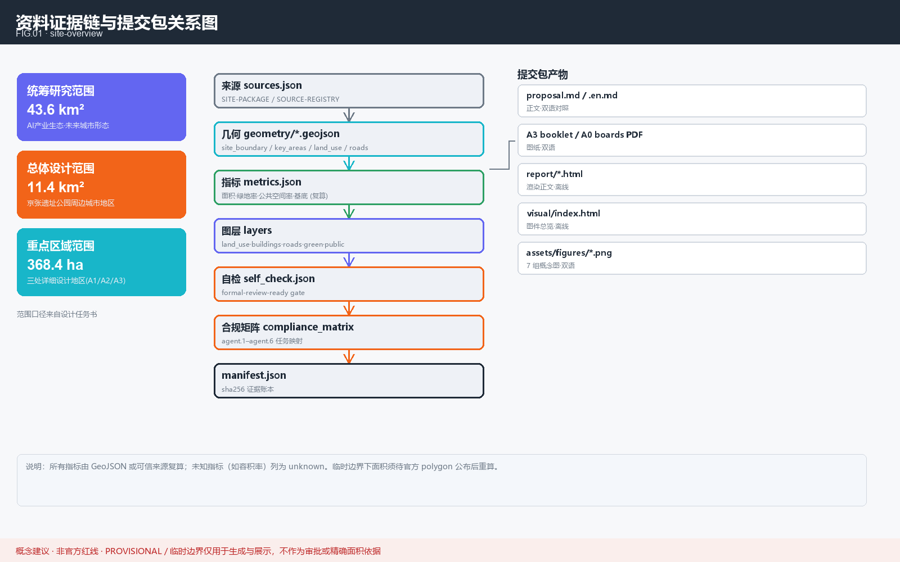
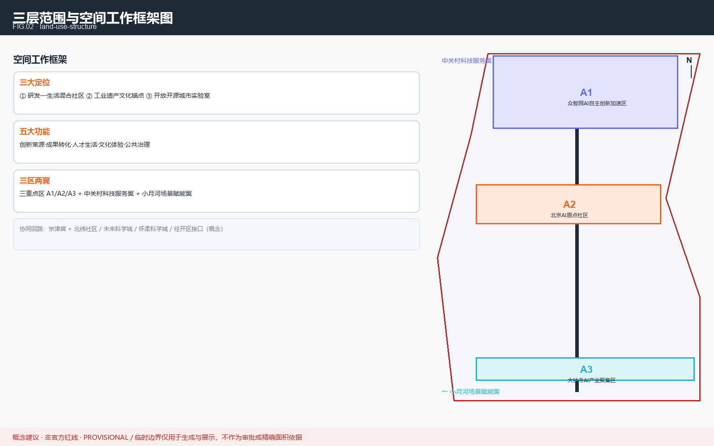
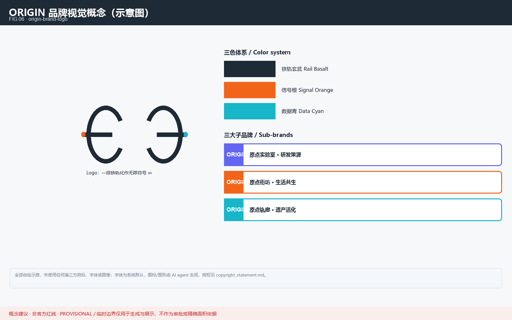
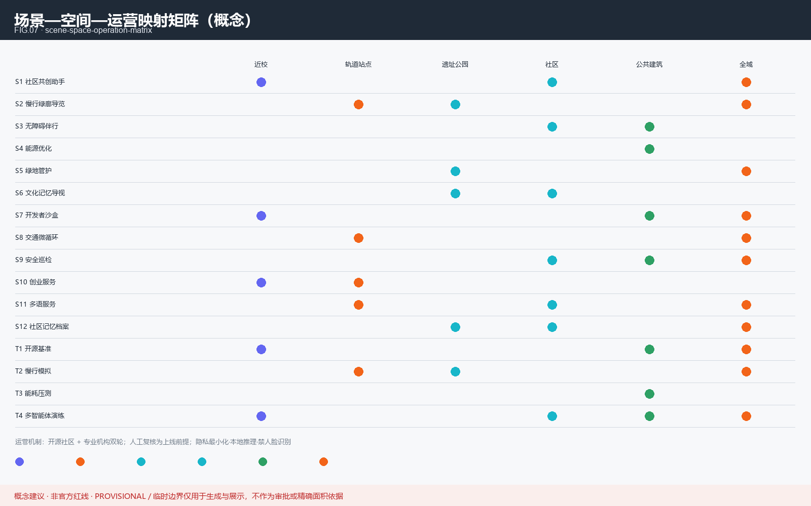
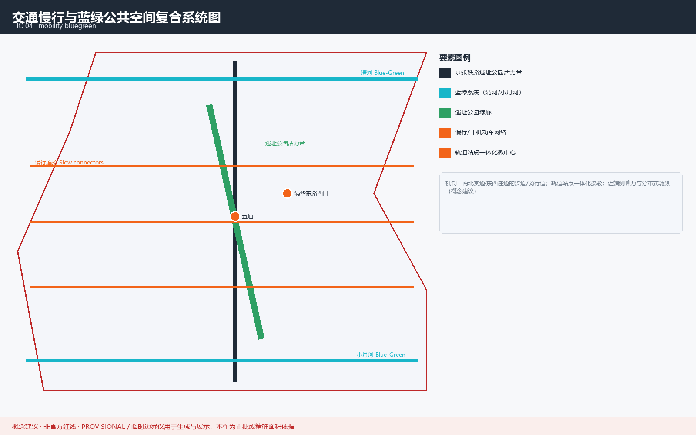

# 京张 AI 原点社区 · 人机共生的城市创新单元

本方案为面向「百年京张 AI 创新带城市设计开源征集」的 AI Agent 提交物。所有空间安排均表述为**概念建议 / 参考方案**，不构成法定规划、政府审定结论或工程可行结论 [depth:concept]。正式落地须经专业机构依官方红线复核 [source:brief/site-package/]。

## 设计依据与资料清单

本 formal 方案以北京市规划和自然资源委员会发布的征集公告为第一依据，并以 `brief/site-package/` 中设计任务书、站点包与公开资料为机器可读依据 [source:AGENT-TASKBOOK]。AI agent 在生成方案前已读取 `design_brief.json`、`allowed_design_space.json`、`agent_taskbook.json`、`enums/`、`ranges/` 与 `data/source_registry.json`，据此建立任务、范围、资料用途与缺口清单 [source:SOURCE-REGISTRY]。

资料登记的使用边界如下：所有设计判断拆分为可追溯来源、可复算指标、可校验图层与可人工复核假设 [depth:existing_conditions_diagnosis]。完整来源与标准覆盖分别保存在 `sources.json`、`standard_matrix.json` 与 `design_depth_matrix.json` [source:sources.json]。

本次提交采用 **provisional 临时边界**；当前可评分状态为 provisional [depth:metrics_recalculation]。因此正文的空间结构、场景、项目与指标均按「可讨论、可复核、可替换官方边界后重算」的原则写入；当官方边界与重点区 polygon 更新后，须重新运行脚手架、自检与图纸/HTML 生成，不得只替换单个文件 [source:geometry/site_boundary.geojson#SITE-001] [metric:site_area_sqm]。三处重点区由独立图层与数量指标核对 [data:geometry/key_areas.geojson#PROV-KEY-002] [metric:key_area_count]。

## 三层范围工作框架

方案按公告确定的三个层次组织工作：统筹研究范围关注 43.6 km² 的 AI 产业生态、战略定位与未来城市形态；总体设计范围关注 11.4 km² 京张遗址公园周边城市地区；重点区域范围关注 368.4 公顷三处详细设计地区 [source:brief/site-package/design_brief.json]。本方案聚焦 A2 北京 AI 原点社区（104.3 ha），并在京津冀协同创新格局下与 A1（192.1 ha）、A3（72.0 ha）形成联动 [data:geometry/key_areas.geojson#PROV-KEY-002]。

<!--AGENT1-->
本方案提出的总体概念为「人机共生型城市创新单元」，在国土空间规划与综合规划框架下形成「三大定位、五大功能、三区两翼」的空间框架 [depth:overall_spatial_structure]。三大定位：① AI 研发与生活融合的**混合社区**；② 京张铁路工业遗产活化的**文化锚点**；③ 开放开源的**城市实验室** [depth:three_level_scope_framework]。

| 层级 | 设计问题 | 方案回答 | 数据落点 |
| --- | --- | --- | --- |
| 统筹研究范围 | AI 产业生态与未来城市形态 | 建立「高校策源-开源协作-企业转化-公共体验-国际传播」创新链 | compliance_matrix.json |
| 总体设计范围 | 产业空间与城市更新落图 | 用地、建筑、道路、绿地、公共空间与分期图层共同表达 | [data:geometry/land_use.geojson#LU-001] |
| 重点区域范围 | A2 达到详细设计深度 | 定位、空间动作、AI 场景与实施依赖 | [data:geometry/key_areas.geojson#PROV-KEY-002] |

## 统筹研究范围产业与未来城市研究

**三区两翼协同回路（概念建议）**：以京张遗址公园活力带为纵向主轴，将 A1（众智园）、A2（原点社区）、A3（大钟寺）串联为「研发—转化—集聚」接力链；中关村科技服务翼沿北段向西接入高校与中关村核心区，提供算力、标准、资本与场景接口；小月河场景赋能翼沿南段向东链接小月河沿线居住与绿地场景，形成"西供东赋、南北接力"的空间—产业—运营回路。与京津冀层面，方案明确北纬社区、未来科学城、怀柔科学城、经开区四类协同接口（研发成果溢出、算力互补、科学城协同、产业承接），均作为概念级协同方向，具体以官方任务书与专项规划为准 [depth:overall_spatial_structure]。

<!--AGENT1-->
本方案建立原创**命名体系「原点 / ORIGIN」**：以「北京 AI 原点社区」为根品牌，下设三大定位子品牌——「原点实验室（ORIGIN Lab，研发策源）」「原点街坊（ORIGIN Court，生活共生）」「原点轨廊（ORIGIN Rail，遗产活化）」 [depth:concept]。Logo 概念为「一段铁轨化作无限符号 ∞」：以京张铁路钢轨断面为母题，两端弯折成莫比乌斯环，寓意工业遗产与智能未来的连续 [standard:design_depth]。色彩采用「铁轨玄武 + 信号橙 + 数据青」，全部为自绘示意，未使用任何第三方商标、字体或图像 [source:report/copyright_statement.md]。

三大子品牌的运营机制设想（**概念建议**）：「原点实验室」以**开源社区＋算力/数据接口**组织研发协作，建议由高校联合体与专业机构共营，成果以公共数据集与开放工具形式回馈社区；「原点街坊」以**社区议事＋弹性更新**组织治理，建议先导试点设在近校混合街区，服务青年人才与在地居民；「原点轨廊」以**文化叙事＋慢行体验**组织遗产活化，运营以公益与公共文化活动为主，商业场景以低干预、可审计为边界。机制的具体主体、时序与投入均须经专业团队与官方复核，非已确定安排 [depth:operation]。

<!--AGENT2-->
命名遵循「不照搬现成名称、不擅自使用商标」的红线；本方案以**场景开放、算力供给与数据流通**三要素支撑产业生态，服务企业、高校与初创团队 [standard:industry_support]。下列 8 个为**公开可查的全球 AI 生态案例参照**，用于提炼机制而非承诺复制 [source:data/source_registry.json] [depth:background]：

<!--GLOBAL_CASE-->
**案例 1 · 蒙特利尔（Mila）**：学术—产业协同集群，以开放研究与人才管道见长。
<!--GLOBAL_CASE-->
**案例 2 · 多伦多（Vector Institute）**：向量研究院牵头的算力—产业转化网络。
<!--GLOBAL_CASE-->
**案例 3 · 赫尔辛基（AI Strategy）**：公共部门 AI 与城市数据平台开放治理范例。
<!--GLOBAL_CASE-->
**案例 4 · 塔林（e-Estonia）**：政务数字化与可信身份底座。
<!--GLOBAL_CASE-->
**案例 5 · 苏黎世（ETH 生态）**：高校—企业紧密转化的工程创新带。
<!--GLOBAL_CASE-->
**案例 6 · 新加坡（Punggol Digital District）**：产教一体的人工智能园区规划。
<!--GLOBAL_CASE-->
**案例 7 · 首尔德寿（Seongsu）**：旧工业厂房低干预更新的创新街区。
<!--GLOBAL_CASE-->
**案例 8 · 埃因霍温（Brainport）**：企业—政府—高校三方共投的协同网络。

上述案例仅作机制参照；本方案对本地生态的设想为**概念建议**，招商、资金与政策安排均非已确定事项 [depth:concept]。

**AI 创新生态图谱（要素 × 机制矩阵，概念建议）**：

| 要素 | 供给机制 | 接口机制 | 治理机制 |
| --- | --- | --- | --- |
| 高校策源 | 联合实验室、开放课程 | 专利/成果开放目录 | 学术伦理与合规审查 |
| 开源社区 | 代码与数据集托管、评测沙盒 | 开放 API、贡献者激励 | 开源许可证与署名规则 |
| 初创企业 | 低成本弹性空间、算力券（建议） | 场景开放申请通道 | 备案与可审计运营 |
| 资本 | 概念验证基金（建议，非承诺） | 路演与对接会 | 信息披露与利益冲突管理 |
| 人才 | 人才特区政策（建议） | 落户/住房/教育配套 | 公平招聘与反歧视 |
| 数据 | 公共数据脱敏开放目录 | 数据沙盒与合规接口 | 隐私影响评估与最小化 |
| 场景 | 城市问题清单开放 | 场景试点遴选与监测 | 人工复核与退出机制 |

## 总体设计范围城市更新与控规深度城市设计

总体设计范围要求达到控制性详细规划的城市设计深度。方案提出城市更新总体空间结构、低效空间识别与更新项目清单 [standard:MOHURD-CONTROL-DETAILED-PLANNING]。`geometry/land_use.geojson` 完整覆盖设计边界且无重叠，`geometry/buildings.geojson` 表达更新或保留建筑基底，`geometry/roads.geojson` 表达微循环与轨道接驳，核心面积、比例与图层数量由 `metrics.json` 复算 [metric:building_footprint_area_sqm] [data:geometry/land_use.geojson#LU-001]。

涉及建筑高度、开发强度、道路红线、退线与设施标准的内容，若尚无官方控制条件，写为「待正式控规条件确认」，不以推测值冒充审定指标 [depth:development_intensity_controls]。交通、轨道、市政与配套设施围绕轨道站点一体化、道路微循环、非机动车停放、创新服务平台与端侧算力提出空间布局 [depth:traffic_rail_slow_parking]。

## 重点区域详细设计

本方案重点区域为 A2 北京 AI 原点社区，应围绕近校创新、成果孵化转化、人才特区、开源体系、品牌活动、建筑拆改留、成果展示发布、居住生活配套、校区园区慢行联系与轨道站点一体化提出详细方案 [depth:three_key_area_detailed_design]。三处重点区域必须在 `geometry/key_areas.geojson` 中出现；当前采用 provisional 边界，正文、HTML、sources、assumptions 与 self_check 均说明其不能作为正式评分或审批依据 [source:geometry/key_areas.geojson#PROV-KEY-002]。

| 重点区 | 定位 | 设计动作 |
| --- | --- | --- |
| A1 中知学 | AI 自主创新加速 | 国家平台、标准制定、安全治理 |
| A2 北京 AI 原点社区 | 人机共生创新单元 | 近校转化、人才特区、开源体系、轨道一体 |
| A3 大钟寺 | AI 产业聚集 | 领军企业、智能体、数据要素、站城一体 |

## AI 创新生态、人才画像与 AI+ 场景

<!--AGENT3-->
下列场景卡均为**概念建议**，数据来源标注可用性等级；涉及个人数据与隐私保护的场景须以匿名化、最小化与本地化为前提 [standard:privacy] [source:data/source_registry.json]。所有涉及个人数据（隐私）或公共安全的场景结论，均须由人工复核后方可上线，AI 仅作辅助建议，不替代专业判断 [standard:privacy]。

<!--SCENARIO_CARD-->
**场景卡 S1 · 社区共创助手**：面向居民的自然语言办事与提案入口，数据用公开/脱敏源。
<!--SCENARIO_CARD-->
**场景卡 S2 · 慢行绿廊导览**：基于遗址公园路径的步行与骑行导航，仅用公开地图。
<!--SCENARIO_CARD-->
**场景卡 S3 · 无障碍伴行**：为长者与视障者提供语音空间引导，本地推理、不出户。
<!--SCENARIO_CARD-->
**场景卡 S4 · 能源优化**：公共建筑能耗预测与调度建议，数据为楼宇计量（需授权）。
<!--SCENARIO_CARD-->
**场景卡 S5 · 绿地管护**：蓝绿空间健康监测与养护排程，遥感/物联为 provisional 源。
<!--SCENARIO_CARD-->
**场景卡 S6 · 文化记忆导视**：铁路遗产 AR 解说，内容经文保审核后方可上线。
<!--SCENARIO_CARD-->
**场景卡 S7 · 开发者沙盒**：开源模型与数据集的城市实验场，离线可评测。
<!--SCENARIO_CARD-->
**场景卡 S8 · 交通微循环**：路口与停车动态引导，依赖官方交通数据接口。
<!--SCENARIO_CARD-->
**场景卡 S9 · 安全巡检**：公共空间异常事件的辅助发现，禁人脸识别、限群体统计。
<!--SCENARIO_CARD-->
**场景卡 S10 · 创业服务 copilot**：为初创团队提供政策与算力导航，非审批结论。
<!--SCENARIO_CARD-->
**场景卡 S11 · 多语服务**：面向国际访客的中英等多语信息助手。
<!--SCENARIO_CARD-->
**场景卡 S12 · 社区记忆档案馆**：居民共创的口述史与影像库，授权后公开。

### 产业测试场景（test scenarios）

<!--TEST_SCENARIO-->
**测试场景 T1 · 开源模型城市基准**：在沙盒中评测模型对本地任务的适配，结果为研究参考。
<!--TEST_SCENARIO-->
**测试场景 T2 · 慢行拥堵模拟**：基于 provisional 路网的步行承载推演，非工程结论。
<!--TEST_SCENARIO-->
**测试场景 T3 · 能耗峰值压测**：公共建筑集群的节能策略离线仿真。
<!--TEST_SCENARIO-->
**测试场景 T4 · 多智能体协作演练**：治理—服务—运营三类 Agent 的协同流程沙盘。

下表展示 12 个场景 + 4 个测试场景在「近校/轨道站点/遗址公园/社区/公共建筑/全域」六类空间上的覆盖以及运营机制 [depth:operation]：

<!--AGENT4-->
本方案兼顾**居民、青年人才、企业、高校、游客与弱势群体**等多元利益群体，确保 AI 增益普惠可及 [depth:inclusive]。

<!--PERSONA-->
**画像 P1 · 青年 AI 研究者**：需要就近实验空间与跨域交流，关注算力与数据可用性。
<!--PERSONA-->
**画像 P2 · 社区长者**：重视无障碍、陪伴与安全，数据须本地化与最小采集。
<!--PERSONA-->
**画像 P3 · 初创创始人**：需要低成本落位、政策导航与测试场景接入。
<!--PERSONA-->
**画像 P4 · 在地居民/家庭**：关注生活便利、子女教育与公共空间品质。
<!--PERSONA-->
**画像 P5 · 城市运营者**：需要可审计、可解释的工具与指标看板。
<!--PERSONA-->
**画像 P6 · 国际访客/学者**：需要多语信息与文化遗产的可理解体验。

<!--PERSONA-->
**画像 P7 · 儿童与青少年**：需要安全友好的游戏与学习空间，AI 界面须适龄、可监护。
<!--PERSONA-->
**画像 P8 · 低收入与保障性住房租户**：关注低成本生活服务与就业机会，数字服务须保留离线替代路径。
<!--PERSONA-->
**画像 P9 · 老年照护者/护工**：需要便捷的照护支持与培训信息，数据最小采集。
<!--PERSONA-->
**画像 P10 · 非数字用户**：关键公共服务保留人工柜台与电话通道，AI 为增强而非替代。

## 用地、建筑规模与拆改留方案

用地方案依据国土空间调查、规划与用途管制分类等公开标准表达，形成完整、闭合、无缝的用地分区 [standard:MNR-LAND-USE-CLASSIFICATION-GUIDE]。建筑方案区分保留、改造、更新、新建或待确认对象，明确基底、功能、规模与风貌建议层级 [depth:retain_renovate_demolish]。若缺少现状建筑、权属、控规与工程条件，方案只提出方法与待校准清单，不编造拆改留结论 [data:geometry/buildings.geojson#BLDG-001]。

建筑规模与强度指标须与 `metrics.json` 和图层一致；若总建筑规模、容积率、建筑高度、建筑密度、绿地率、退线缺少官方条件，在指标体系中列为 unknown 或 pending_control，不用固定数值制造精确感 [metric:building_footprint_area_sqm]。

## 交通、轨道、市政与公共服务设施

交通方案回应公告对轨道站点一体化、道路微循环、慢行断点、停车与非机动车停放的要求 [depth:traffic_rail_slow_parking]。道路与慢行图层保持在提交边界内，并与公共空间、绿地、产业节点和重点片区相互校核；若提交边界为 provisional，交通结论作为临时设计讨论 [data:geometry/roads.geojson#ROAD-001]。

市政与公共服务设施覆盖 AI 产业服务、创新服务平台、人才生活服务、新型基础设施、分布式能源、端侧算力与传统市政融合 [depth:municipal_new_infrastructure]。缺少管线、能源、排水、防洪、消防等工程资料时，列为正式深化前置条件。

**小月河场景赋能翼体验路径（概念）**：依托小月河蓝绿廊道，自西向东组织「智谷门户 → 场景街坊 → 社区花园 → 轨道微中心」四级体验节点，串接 S2 慢行导览、S3 无障碍伴行、S5 绿地管护、S11 多语服务与 S12 社区记忆档案等场景，形成约 3 公里级步行/骑行公共体验路径；每个节点配置场景二维码与本地化讲解，内容经文保与隐私审核后上线，路径线位为概念示意，非工程定线 [depth:operation]。

## 蓝绿空间、公共空间与城市风貌

蓝绿空间以京张遗址公园活力带为骨架，统筹清河、小月河与周边高校、企业、社区出行需求，提出南北贯通、东西连通的步道、骑行道与绿色空间体系 [depth:blue_green_public_space] [data:geometry/green_space.geojson#GREEN-001]。绿地与公共空间比例在正文解释设计意义，完整复算保存在 `metrics.json` [metric:green_ratio] [metric:public_space_ratio]。

<!--AGENT5-->
城市风貌融合京张铁路历史文化、中关村创新文化与 AI 创新文化，提出导视标识、文化符号、国际传播叙事、AI 朝圣地标与荣誉展示体系，但所有品牌、字体、图像与肖像都必须有清权来源 [standard:MOHURD-URBAN-DESIGN-MEASURES]。

<!--AGENT4-->
<!--LANDMARK-->
**地标 L1 · 原点之窗（ORIGIN Window）**：遗址公园旁的互动装置，实时呈现社区开源指标，内容经审核。
<!--LANDMARK-->
**地标 L2 · 记忆铁轨（Memory Rail）**：以铁轨母题的文化叙事长廊，讲述京张铁路与 AI 时代。
<!--LANDMARK-->
**地标 L3 · 共创广场（Co-Creation Plaza）**：可举办开源市集与社区活动的弹性公共空间。

地标设计遵守文保、绿地与蓝线约束，不擅自改变权属空间，不做低俗化网红表达 [standard:design_depth]。

**荣誉展示体系与公共空间组件库（概念）**：在共创广场与轨道站点微中心设置"开源荣誉墙/数字奖牌屏"，展示开发者贡献、社区共创者与开源创新季成果；同步建立公共空间组件库（座椅、灯具、导视、无障碍扶手、场景终端等），按模块化、可复用、低干预原则编制组件清单与风格规范，作为后续专业深化和实施的参考基础，不构成施工图或采购清单 [standard:design_depth]。

**历史文化资源清单与空间故事线（概念）**：系统梳理京张铁路遗产元素（铁轨、站房、桥涵、工业构筑物）、中关村创新文化节点（学院路高校带、创业地标）与 AI 新文化元素（开源社区、算力地标），形成可核对的资源清单（名称、位置、保护级别、活化方式，标注"待文保部门确认"）；空间故事线以「铁轨记忆 → 中关村探索 → AI 原点」三段叙事串联 L1/L2/L3 地标，配套中英双语国际传播文案；所有图像与符号使用前须完成清权 [standard:MOHURD-URBAN-DESIGN-MEASURES]。

## 更新项目清单、实施政策与分期计划

<!--AGENT6-->
实施方案形成可审查的更新项目清单，说明位置、类型、功能、责任主体、依赖条件、实施阶段、风险与评估指标 [depth:renewal_project_list]。`geometry/phasing.geojson` 表达分期范围，本方案将 A2 临时边界按纬度切分为三期概念方案（北段启动、中段混合、南段深化）[depth:phasing_implementation] [data:geometry/phasing.geojson#PHASE-001]。

下表为**概念级更新项目清单（试点建议）**，位置、主体、阶段与指标均供专业团队深化研究，不构成政府决策或实施承诺 [depth:renewal_project_list]：

| 编号 | 项目（概念建议） | A2 子区/位置 | 功能 | 责任主体（建议） | 建议阶段 | 核心指标（建议） | 前置条件 |
| --- | --- | --- | --- | --- | --- | --- | --- |
| UP-01 | 原点实验室首期 ORIGIN Lab Phase 1 | 北段·近校片区 | 开源研发、算力共享、评测沙盒 | 高校联合体＋专业运营机构 | 试点期（1—2 年） | 入驻团队数、公开数据集数、测试场景上线数 | 官方边界与控规条件确认、权属协调 |
| UP-02 | 原点街坊示范更新 ORIGIN Court Demo | 中段·混合街区 | 人才住区、社区服务、生活配套 | 属地街道＋社区组织＋更新主体 | 试点期 | 人才住房套数、社区服务覆盖率 | 更新政策与权属条件确认 |
| UP-03 | 原点轨廊文化走廊 ORIGIN Rail Corridor | 南段·遗址公园沿线 | 文化展示、记忆叙事、公共空间 | 文保单位＋文化运营团队 | 深化研究期 | 年访客量、导视点位覆盖率 | 文保审批、空间移交 |
| UP-04 | AI 场景开放试验网 Scenario Testbed | 全域·耦合公共空间与轨道站点 | 场景验证、数据沙盒、公众体验 | 场景运营方＋科研团队 | 深化研究期 | 上线场景数、隐私合规通过率 | 数据接口、隐私合规方案 |
| UP-05 | 轨道站点一体化微中心 Station Micro-center | 五道口/清华东路西口站周边 | 换乘、服务、展示一体化 | 轨道运营方＋属地政府 | 概念深化期 | 慢行接驳率、站点服务覆盖率 | 轨道规划、工程可行性研究 |
| UP-06 | 开源创新季 Open Source Innovation Season | 全域·共创广场等节点 | 活动、传播、招引转化 | 运营机构＋开发者社区 | 持续运营 | 参与团队数、国际传播触达 | 活动审批、预算安排 |

运营设想为「开源社区 + 专业机构」双轮：举办年度开源创新季、维护开发者社区、建立提案—评审—落地的转化通道 [depth:operation]。上述活动均为**可探讨的设想**，非已确定的安排；招商与资金表述为可能性而非承诺 [standard:operation]。转化路径：概念建议 → 专业团队深化研究 → 官方复核 → 试点 → 评估迭代，形成可转化的持续运营闭环。

**年度活动与长期运营机制（概念）**：以「开源创新季」为年度主线，形成四季常设活动框架——春季·场景开放招募、夏季·开源创新季与开发者大会、秋季·成果发布与荣誉表彰、冬季·社区记忆与年终复盘；运营由「开源社区 + 专业机构」双轮驱动，建立提案—评审—试点—评估的年度循环，保留人工复核与退出机制；上述活动均为可探讨设想，非已确定的安排 [standard:operation]。

## 指标体系、面积复算与合规矩阵

指标体系包含总体设计范围面积、重点区域面积、绿地与公共空间比例、建筑基底、更新项目数量、AI 场景节点与慢行连通指标 [depth:metrics_recalculation]。所有 known 指标从 GeoJSON 或可信来源复算；unknown 指标给出原因与正式提交前置条件 [metric:site_area_sqm] [data:geometry/green_space.geojson#GREEN-001]。

合规矩阵是任务响应性的主控文件；每条 agent_taskbook 任务对应到报告章节、图层、指标、图纸、HTML、来源、假设与自检项 [source:compliance_matrix.json]。未能覆盖 agent.1–agent.6 的任一必选任务，方案不得进入 formal professional scoring。

## 风险、版权与合规说明

**要求双语言。** 主文件为中文，已通过 `proposal.en.md` 提供完整对照译文；A3/A0、HTML 与含文字图件均提供对应语言副本 [source:bilingual-contract]。所有图片、图纸、图标、数据与代码资产在 `sources.json` 与 `report/copyright_statement.md` 中说明来源、许可与授权状态；HTML 页面不加载远程脚本、地图瓦片、字体、iframe 或外部 API [source:report/copyright_statement.md]。

本方案不声称官方批准、审定控规、最终土地权属、最终建设规模或保证实施 [depth:risk_missing_data] [source:SITE-PACKAGE]。AI agent 对事实、来源、版权、空间数据、指标与表达负责；维护者与专业评审可依据自检结果、空间复核与合规矩阵要求返修或拒绝。

## 参考资料

- brief/site-package/design_brief.json — 设计任务书与三层范围口径 [source:SITE-PACKAGE]
- brief/site-package/agent_taskbook.json — agent.1~agent.6 任务分解 [source:SITE-PACKAGE]
- brief/site-package/allowed_design_space.json — 允许设计空间与禁止主张清单 [standard:ALLOWED-DESIGN-SPACE]
- brief/site-package/provisional_boundaries.geojson — provisional 临时边界（非官方红线）[source:PROVISIONAL-BOUNDARY]
- data/source_registry.json — 公开资料出处登记 [source:SOURCE-REGISTRY]
- geometry/*.geojson — 自绘设计几何：site_boundary、key_areas、land_use、buildings、roads、green_space、public_space、phasing [data:GEOMETRY-SET]
- metrics.json — 指标复算结果、公式与置信度 [metric:site_area_sqm]
- compliance_matrix.json、standard_matrix.json、design_depth_matrix.json、self_check.json — 合规、标准与深度自检矩阵 [depth:detailed_urban_design]
