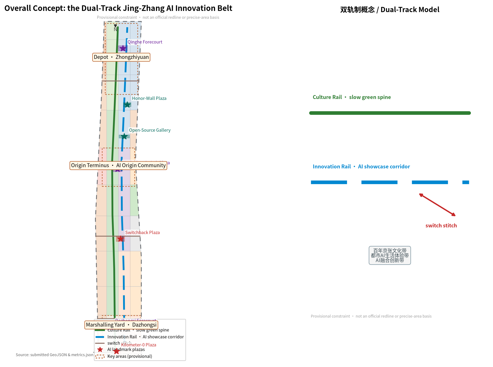
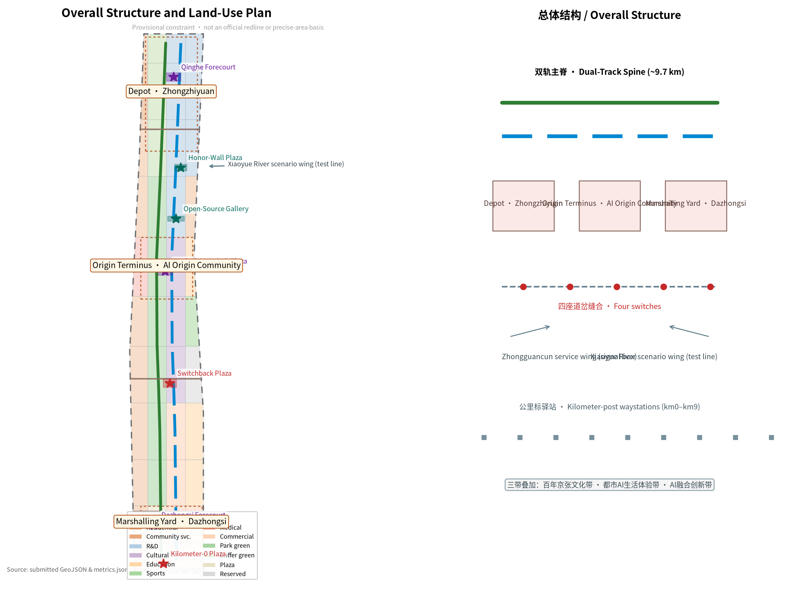
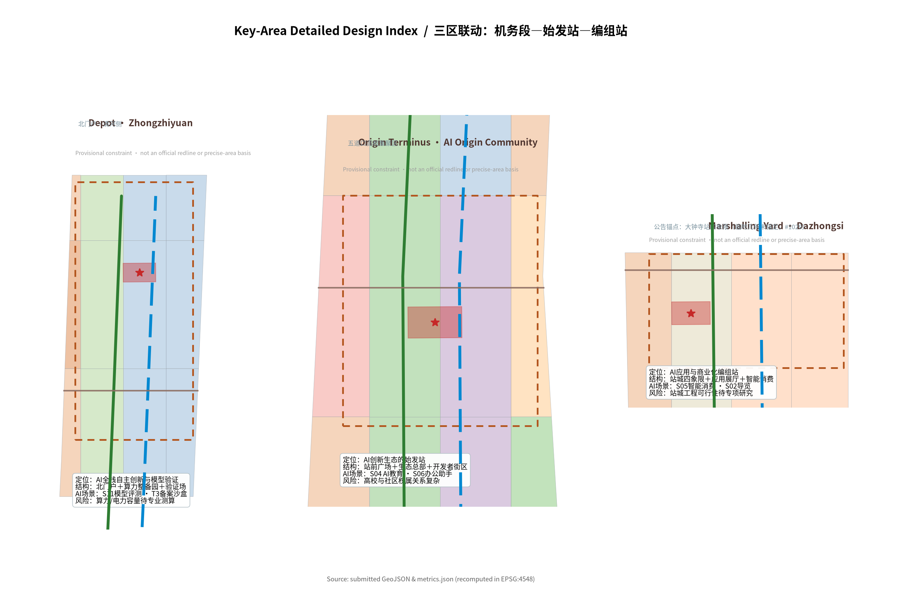
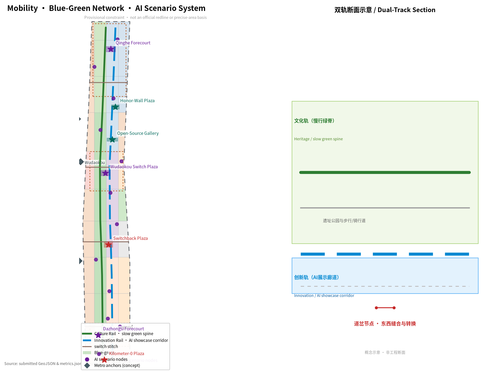
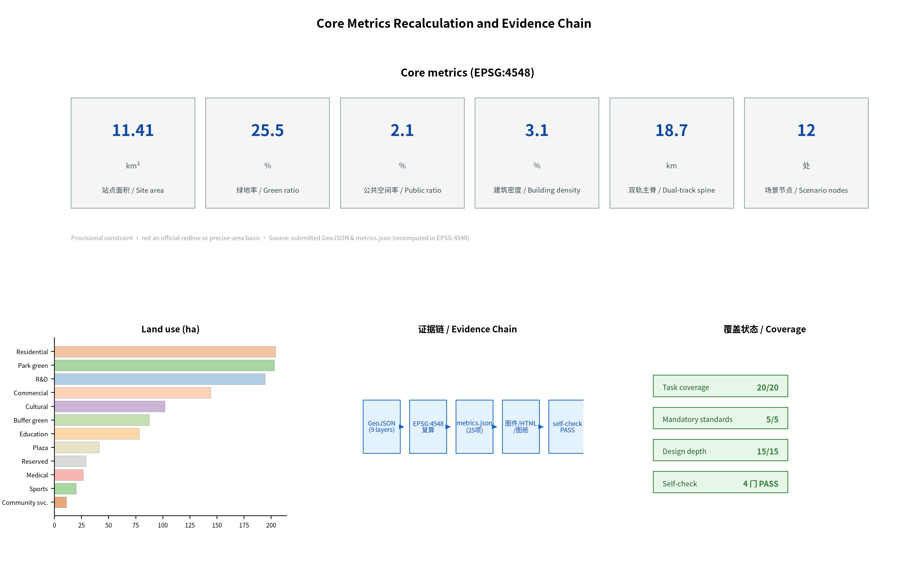

# JINGZHANG DUAL TRACK

A century ago, Zhan Tianyou used a "Ren-Zi" (human-shaped) switchback to let trains climb over Badaling; a century later, Haidian wants the AI of this same railway's heritage corridor to climb the ridge between "innovation speed" and "human value". This proposal is **JINGZHANG DUAL TRACK (京张双轨带)**: the Centennial Jing-Zhang AI Innovation Belt is organised as a dual-track urban line — one **Culture Rail** (human value, centennial heritage, everyday civic life) and one **Innovation Rail** (full-stack AI innovation, industrial ecosystem, global competition). The two rails run parallel and adjacent; **switch nodes** make conversion and choice visible; **blocking and timetable rules** keep the two rails synchronised and balanced so neither one derails.

All spatial proposals in this package are conceptual suggestions, reference schemes or directions for professional teams to deepen; they do not replace statutory planning and do not constitute government approval [source:AGENT-TASKBOOK] [standard:PROJECT-AGENT-OPEN-CALL-TASKBOOK].

## Design Basis and Source List

The proposal is anchored on the *Pre-qualification Announcement for the International Solicitation of Urban Design for the Centennial Jing-Zhang AI Innovation Belt* issued by the Haidian Branch of the Beijing Municipal Commission of Planning and Natural Resources; its three scope levels, three key areas, announced areas and design tasks are the starting point of every spatial judgment [source:OFFICIAL-ANNOUNCEMENT]. The agent-facing open-call taskbook adds the three positionings, five functions, three areas and two wings, the six agent tasks and the unified boundary clause [source:AGENT-TASKBOOK]. On professional standards, the package follows the *Urban Design Administration Measures*, the *Regulatory Detailed Planning Measures* and the national land-use classification logic for character, regulatory-planning boundaries and land-use code semantics [standard:MOHURD-URBAN-DESIGN-MEASURES] [standard:MOHURD-CONTROL-DETAILED-PLANNING] [standard:MNR-LAND-USE-CLASSIFICATION-GUIDE].

On data boundaries, this package strictly follows the central public-source registry's use classes: the announcement and taskbook are formal-ready; the provisional boundary geometry (PROV-SITE-001 and PROV-KEY-001/002/003) is used only for generation, display and intake self-check, with `official_boundary=false`, and must not be treated as an official redline or precise-area basis [source:SOURCE-REGISTRY] [source:BOUNDARY-SOURCE]. Community verification shows the provisional Dazhongsi polygon (PROV-KEY-003) has its centroid near Beijing North Station, about 2.26 km from Dazhongsi metro station, as an area-fit placeholder not anchored to the station; following the community consensus this proposal keeps the upstream geometry unchanged and records the disclosure as an assumption and a source [source:ISSUE-1029]. Official regulatory-planning conditions, road redlines, existing-condition surveys and municipal capacities are not yet public and are uniformly recorded as pending official data (see the assumptions list and Chapter 12) [source:SITE-PACKAGE].

Until official data arrives, all areas, ratios and volumes in this package are recomputed from the submitted GeoJSON in EPSG:4548 and clearly flagged as provisional in the narrative, figures, HTML, sources and assumptions [metric:site_area_sqm] [data:geometry/site_boundary.geojson].

## Three-Level Scope Framework

The coordinated research area of about 43.6 km² is the industrial and regional research layer of the dual-track model: it studies the AI innovation ecosystem, the future-city hypothesis and the innovation loops with Beizhuang community, Future Science City, Huairou Science City, the Economic-Technological Development Area and the Beijing-Tianjin-Hebei region [source:OFFICIAL-ANNOUNCEMENT] [metric:site_area_sqm]. The overall design area of about 11.4 km² is the master urban-design layer: the dual-track spine, two wing corridors, station-yards and switch structure are resolved into land use, transport, blue-green and character (Chapter 4). The key detailed-design area of about 368.4 ha comprises, from north to south, the Zhongzhiyuan AI Autonomous Innovation Acceleration Area (about 192.1 ha), the Beijing AI Origin Community (about 104.3 ha) and the Dazhongsi AI Industry Cluster (about 72.0 ha), hosting the detailed design of the three station-yards — "depot, origin terminus, marshalling yard" [data:geometry/key_areas.geojson#PROV-KEY-001] [data:geometry/key_areas.geojson#PROV-KEY-002] [data:geometry/key_areas.geojson#PROV-KEY-003].

The three levels transmit stepwise: industrial strategy → overall structure → key areas, and every level keeps the unified grammar of "culture rail and innovation rail running in parallel". All three levels currently use provisional polygons; when official geometry is published, the recalculation contract requires regenerating layers, metrics, figures and HTML in one batch [depth:three_level_scope_framework] [metric:key_area_count].

## Coordinated Research Area: Industry and Future City Research

The coordinated research area answers "building a world-class AI innovation ecosystem" and "a future-city form adapted to AI as new productive force". The proposal maps the five functions into space: **full-stack autonomous AI innovation = the Depot** (Zhongzhiyuan: model training, compute and verification); **world-class AI innovation ecosystem = the Origin Terminus** (Origin Community: ecosystem origin, talent and headquarters); **AI+ scenario empowerment paradigm = the Test Line** (Xiaoyue River wing: scenario testing and public experience); **intelligent vibrant AI city = the station-city segment** (where the two rails meet in civic life); **global voice in AI governance = the signalling and dispatching system** (a governance-and-display mechanism running through the whole belt) [source:AGENT-TASKBOOK] [standard:PROJECT-OFFICIAL-ANNOUNCEMENT].

Future-city hypothesis: an AI district is not a "campus full of machines" but a "dual-track synchronised district" — innovation speed must advance in step with public value, cultural continuity and ecological constraints. On this basis the research proposes a "six-loop of factors": compute, data, scenario, talent, capital and governance circulate sustainably within the 43.6 km² [depth:overall_spatial_structure].

The proposal reviews six global AI innovation ecosystems and converts them into actionable mechanisms: **Silicon Valley** (research-industry-capital loop → Haidian technology-transfer and VC circuit), **Shenzhen** (hardware and manufacturing ecology → Zhongguancun hard-tech pilot corridor), **Hangzhou** (application scenario and platform economy → "open scenarios + data sandbox" institution), **Hefei and Zhangjiang** (large-science-facility clusters → Zhongzhiyuan compute and model-verification platform), **London** (fintech and regulatory sandbox → AI-governance trials and compliance services), and **Singapore** (city-scale AI governance and public trust → the Jing-Zhang signalling system and the "dual-track synchronisation" governance mechanism) [source:AGENT-TASKBOOK]. When converted into land and space, these mechanisms correspond to the research, cultural, commercial and reserved bands of the land-use plan (Chapter 4) and become perceptible anchors in the scenario cards and pilgrimage landmarks [depth:land_use_layout].

## Overall Design Area: Urban Renewal and Regulatory-Plan-Level Urban Design

The overall structure of the design area is "**1 dual-track spine + 2 wing corridors + 3 station-yards + 4 switches + N kilometer-post waystations**" [depth:overall_spatial_structure]:

- **Dual-track spine (about 9.7 km)**: the Culture Rail organises slow mobility, green space and heritage display along the heritage park; the Innovation Rail runs parallel, organising the AI showcase corridor, R&D and scenario facilities. Small plazas and public spaces between the two rails keep them "visible to each other" [data:geometry/roads.geojson#ROAD-001] [data:geometry/roads.geojson#ROAD-002] [metric:road_spine_length_m].
- **Two wing corridors**: the Zhongguancun technology-service wing (west) corresponds to the "signal box" function of capital, IP and technology services; the Xiaoyue River scenario-empowerment wing (east) corresponds to the "test line" function of scenario testing and public experience [source:AGENT-TASKBOOK].
- **Three station-yards**: the Depot (Zhongzhiyuan), the Origin Terminus (Origin Community) and the Marshalling Yard (Dazhongsi), serving as the spatial containers of the key-area detailed design (Chapter 5).
- **Four switches**: South stitch (Dazhongsi station forecourt), Middle stitch (Chengfu Road), Wudaokou stitch and North stitch (Qinghe station), re-stitching the east and west sides that the railway heritage has long separated; every switch is at once a pedestrian connection, a transit interchange and a civic event node [data:geometry/roads.geojson#ROAD-003] [data:geometry/roads.geojson#ROAD-004] [metric:road_connector_length_m].
- **Kilometer-post waystations**: one themed waystation per kilometer along the spine (km 0 to km 9), converting the 43.6 km² "grand plan" into a walkable, stoppable, narratable sequence of kilometers.

The land-use layout partitions the site boundary into 40 cells using 12 official land-use codes — residential, research, cultural, education, sports, medical, commercial, park green, buffer green, plaza and reserved land — without gaps or overlaps [data:geometry/land_use.geojson] [depth:land_use_layout]. Development intensity separates "conceptual volume" from "statutory control": the package gives only a geometry-derived conceptual volume; FAR, height, density, green ratio and setbacks are uniformly recorded as pending official regulatory-planning conditions and are never presented as approved indicators [metric:floor_area_ratio] [metric:concept_total_floor_area_sqm] [standard:MOHURD-CONTROL-DETAILED-PLANNING].

The urban-renewal framework proposes four actions — "**preserve the veins, weave the network, exchange the energy, reserve the blank**": preserving and activating the heritage park and cultural elements first; weaving the east-west and north-south slow and blue-green networks; exchanging functions around stations and underused spaces; and reserving blanks for AI trials and future functions (Chapter 7 and Chapter 10) [depth:retain_renovate_demolish].

## Detailed Design of Key Areas

The three key areas correspond to three station-yards, each with a readable sub-scheme of "positioning + spatial structure + building renewal + transport and slow mobility + public space + AI scenarios + implementation risks"; the spine and switch system between the three areas guarantee linkage [depth:three_key_area_detailed_design].

**Zhongzhiyuan AI Autonomous Innovation Acceleration Area (the Depot)**: positioned as the "depot" of full-stack autonomous AI innovation and model verification — as a railway depot maintains and marshals locomotives, this area hosts compute marshalling, model training, safety verification and standards testing [data:geometry/key_areas.geojson#PROV-KEY-001] [metric:key_area_area_sqm_zhongzhiyuan]. Its structure is "north gateway (Qinghe side) + central compute-marshalling park + south verification field"; renewal focuses on research campuses and laboratory clusters; a "compute cooling garden" along the Culture Rail proposes converting data-centre waste heat into winter greenhouses and public warm corridors (a conceptual direction, not an engineering conclusion) [source:AGENT-TASKBOOK]. Risks: compute and power capacities, data security and model-filing boundaries need professional calculation and compliance confirmation.

**Beijing AI Origin Community (the Origin Terminus)**: positioned as the "origin terminus" of the AI innovation ecosystem — the departure point for talent and companies and the "first stop" for global visitors to understand China's AI ecosystem [data:geometry/key_areas.geojson#PROV-KEY-002] [metric:key_area_area_sqm_origin]. Its structure is "station forecourt + ecosystem-headquarters block + developer block"; renewal focuses on headquarters offices, incubators and talent apartments; the public space sets an "origin platform" plaza and the open-source achievement gallery, merging launch, roadshow, open source and commemoration. Risks: the complex relationships among Wudaokou universities and existing communities require professional institutions to deepen ownership and phasing.

**Dazhongsi AI Industry Cluster (the Marshalling Yard)**: positioned as the "marshalling yard" of AI application and commercialisation — marshalling R&D results into deliverable products and services, with station-city integration balancing commerce and business [data:geometry/key_areas.geojson#PROV-KEY-003] [metric:key_area_area_sqm_dazhongsi]. Its structure is "station four quadrants + application-gallery street + smart-consumption street". Disclosure: per Issue #1029 the provisional geometry of this area is a sequential area-fit placeholder not anchored to Dazhongsi station, so this proposal anchors its station-city narrative to the announced task anchor — "the four-quadrant area around Dazhongsi metro station" and the station name — rather than to polygon coordinates; recalculation will happen in one batch when officially anchored geometry is published [source:ISSUE-1029]. Risks: station-city engineering feasibility and underground-space and railway-protection constraints need dedicated studies.

## AI Innovation Ecosystem, Personas, and AI+ Scenarios

The AI innovation ecosystem is organised along the value chain "Origin Community (ecosystem origin) → Zhongzhiyuan (R&D and verification) → Dazhongsi (application marshalling) → Xiaoyue River wing (scenario testing)", with the Zhongguancun wing providing capital, IP and technology services [source:AGENT-TASKBOOK] [standard:PROJECT-AGENT-OPEN-CALL-TASKBOOK].

**Personas (6 types)**: (1) AI researchers — need compute, data and lab environments; (2) founders/startups — need incubation, financing and scenario validation; (3) students/young developers — need learning, competitions and open-source communities; (4) residents/elderly — need accessibility, offline fallback and daily services; (5) enterprise service providers/professional institutions — need compliance, consulting and pilot platforms; (6) tourists/international visitors — need guided tours, experiences and communication content [source:AGENT-TASKBOOK].

**AI scenario cards (12, presented as a card list; spatial anchors in compliance_matrix)**: S01 AI+transport dual-track slow-mobility navigation (whole belt); S02 AI+culture Jing-Zhang guide and storytelling (Culture Rail); S03 AI+health community health navigation (west-wing medical land); S04 AI+education coding and AI camp (Origin Community); S05 AI+commerce station-city smart consumption (Dazhongsi); S06 AI+office enterprise service copilot (Zhongguancun wing); S07 AI+public safety human-reviewed operations (whole belt, gatekeeper institution); S08 robot low-speed delivery testing (Xiaoyue River test line); S09 AI+governance civic-agent Q&A (signalling system); S10 AI+ecology park environmental sensing (Culture Rail); S11 AI+industry model evaluation and verification (Zhongzhiyuan); S12 AI+public affairs accessible errands (whole belt, human fallback) [source:GENERATIVE-AI-INTERIM-MEASURES] [source:BARRIER-FREE-ENVIRONMENT-LAW].

**Industry test/validation scenarios (3)**: T1 autonomous-driving and robot low-speed test corridor (Xiaoyue River wing—north reserved land); T2 AI medical-imaging validation field (west-wing medical land, co-built with hospitals); T3 LLM safety evaluation and filing sandbox (Zhongzhiyuan, organised within the generative-AI regulatory boundary) [source:GENERATIVE-AI-INTERIM-MEASURES] [depth:traffic_rail_slow_parking]. Every test scenario sets a "human-review gatekeeper", data minimisation and opt-out mechanisms, and operational data is collected at minimum necessity and anonymised [metric:scenario_node_count].

## Land Use, Building Scale, and Retain-Renovate-Demolish Strategy

The land-use layout is generated by partitioning the site boundary: 40 cells with 12 official land-use codes fully covering the submitted boundary without gaps or overlaps [data:geometry/land_use.geojson] [depth:land_use_layout]. Structurally, the bands between the Culture Rail and the Innovation Rail are dominated by park green (about 202.99 ha) and plaza (about 41.38 ha) land, forming a "green-space sandwiching the dual tracks" blue-green skeleton; the west wing is dominated by residential and community-service land with embedded medical and community facilities; the east wing hosts research, education and sports land with two reserved cells for AI trials [metric:green_ratio].

On building scale, the package provides a geometry-derived conceptual footprint (about 358,000 m²) and a conceptual total floor area (estimated with assumed floor counts), explicitly flagged as low-confidence concept massing [metric:building_footprint_area_sqm] [metric:concept_total_floor_area_sqm] [depth:development_intensity_controls]. Statutory FAR, density, height, green ratio and setbacks are all recorded with `status=unknown` pending official regulatory-planning conditions [metric:floor_area_ratio].

Retain/renovate/demolish is expressed as conceptual categories, not parcel conclusions: **retain** — the heritage park, cultural buildings and sound residential/university stock; **renovate** — functional conversion of old industrial buildings, underused R&D buildings and station-adjacent buildings; **new-build** — station-city gateways, Innovation Rail showcase facilities and talent apartments; **reserve** — two reserved cells for AI trials and future functions [depth:retain_renovate_demolish]. Any parcel-level demolition, renovation or building volume must be based on official ownership, existing-building and engineering conditions; this proposal states no confirmed demolition/renovation conclusions [standard:MOHURD-CONTROL-DETAILED-PLANNING].

## Transport, Rail, Municipal Infrastructure, and Public Services

The transport strategy is "**dual-track slow mobility first + four switches + integrated rail interchange**" [depth:traffic_rail_slow_parking]: the Culture Rail is the about-9.7-km slow-mobility spine (pedestrian + cycle), the Innovation Rail is the AI showcase corridor, and the parallel pair forms the whole belt's "dual-track" image [data:geometry/roads.geojson#ROAD-001] [data:geometry/roads.geojson#ROAD-002] [metric:road_spine_length_m]. The four switch stitch lines (South·Dazhongsi forecourt, Middle·Chengfu Road, Wudaokou, North·Qinghe) take on east-west stitching and rail-station interchange, aligned with the announced station-integration direction for Dazhongsi, Wudaokou, Qinghe East Road West Entrance and Qinghe stations [data:geometry/roads.geojson#ROAD-004] [metric:road_connector_length_m]. Road redlines, rail alignments and engineering cross-sections await official data; the alignments in this narrative and figures are conceptual only.

For municipal and new infrastructure, the concept direction is "**compute waystations + energy interfaces + municipal integration**": distributed edge-compute waystations along the Innovation Rail, integrated with public space, energy stations and municipal networks; waste-heat recovery, energy loads and municipal capacities are all listed as pending professional calculation [depth:municipal_new_infrastructure]. Public services follow a "station-city integrated + two-tier community" configuration: innovation and talent services around stations, and medical, education, sports and elderly-care facilities at community level, all retaining offline human-fallback channels per the barrier-free environment law and the elderly smart-technology policy [source:BARRIER-FREE-ENVIRONMENT-LAW] [source:ELDERLY-SMART-TECH-PLAN-2020-45].

## Blue-Green Network, Public Space, and Urban Character

The blue-green system is organised as "**one culture green rail + two river links + seven plazas**" [depth:blue_green_public_space]: the Culture Rail links about 202.99 ha of park green and about 87.60 ha of buffer green, with a green ratio of about 25.5% [data:geometry/green_space.geojson] [metric:green_ratio]; the Qinghe (north) and Xiaoyue River (east) act as blue-green links into the spine, forming a continuous open-space network.

The public-space system includes seven landmark plazas (about 23.5 ha, about 2.1% of the site) [metric:public_space_ratio]: **Kilometer-0 Plaza** (the origin of the Jing-Zhang Railway, south gateway), **Dazhongsi four-quadrant pedestrian plaza** (conceptual), **Switchback (Ren-Zi) Plaza** (honouring Zhan Tianyou's switchback engineering wisdom), **Wudaokou Switch Plaza** (the conversion node of east-west stitching), **Open-Source Achievement Gallery**, **Agent Contribution Honor-Wall Plaza** (honour display and milestone commemoration) and **Qinghe Station Forecourt** (north gateway) [data:geometry/public_space.geojson#PUB-001] [data:geometry/public_space.geojson#PUB-003] [metric:switch_plaza_count].

**AI pilgrimage landmarks (3 or more)**: (1) **Kilometer-0 Plaza** — the digital Jing-Zhang kilometer zero, converting "kilometer 0 of the Jing-Zhang Railway" into the narrative origin of "kilometer 0 of the AI innovation belt"; (2) **Switchback Plaza** — the "Ren-Zi" turn of the track symbol honours the beginning of China's autonomous engineering and also embodies the turn-and-balance between speed and value in the dual-track model; (3) **Open-Source Achievement Gallery + Agent Contribution Honor Wall** — permanently exhibiting agents' contributions and open-source results as an honour-display system [source:AGENT-TASKBOOK] [standard:PROJECT-AGENT-OPEN-CALL-TASKBOOK]. Landmarks, wayfinding and the logo use original graphics and symbols only, without unauthorised trademarks, portraits or copyrighted material, and are not presented as approved construction.

Urban character proposes "**one corridor, three districts**": a "track green corridor" character band along the spine, with three character districts — south station-city gateway, middle campus-and-community, north R&D campus; height, massing and roof-form controls are expressed as conceptual directions pending official height controls and urban-design guidelines [standard:MOHURD-URBAN-DESIGN-MEASURES].

## Renewal Projects, Implementation Policy, and Phasing

The renewal project list is concept-first, including: south-gateway station-city integration (Dazhongsi), four switch plazas, the three station-yard renewals (depot/origin terminus/marshalling yard), the dual-track slow-spine completion, the open-source achievement gallery, the agent contribution honor wall, the compute-waystation network and two reserved trial sites [depth:renewal_project_list]. Every project records type, spatial position, dependency conditions and policy suggestions without constituting confirmed investment or implementation arrangements.

Implementation proceeds in three phases: **near-term demonstration (south gateway and switch plazas)** prioritises station-city pedestrian connections, switch plazas and scenario trials [data:geometry/phasing.geojson#PHASE-001]; **mid-term expansion (AI Origin Community and the innovation-culture corridor)** delivers ecosystem headquarters, open-source display and the developer community [data:geometry/phasing.geojson#PHASE-002]; **long-term upgrade (Zhongzhiyuan and Qinghe gateway)** delivers the compute-marshalling park, verification field and honor wall [data:geometry/phasing.geojson#PHASE-003]. The three phases cover about 523, 344 and 274 ha respectively (EPSG:4548) [metric:phase_area_sqm_phase_1] [metric:phase_area_sqm_phase_3].

**Global AI event system and long-term operations (agent.6)**: the annual event brand "**Jing-Zhang Dual-Track Festival**" (every autumn, with an open-source conference, developer marathon, scenario-open week and pilgrimage walk); quarterly developer conferences and monthly roadshows; **developer-community operations** — open-source repositories, contribution walls and milestone commemorations that sediment contributions, with a "event → community → incubation → landing" conversion pathway [source:AGENT-TASKBOOK]. All events, recruitment, funding and policy arrangements are conceptual suggestions or deepening directions and are in no way stated as confirmed government arrangements [depth:phasing_implementation].

## Metrics, Area Recalculation, and Compliance Matrix

The indicators of this proposal are expressed in layers: spatial indicators are all recomputed from the submitted GeoJSON in EPSG:4548 — site area about 1,141.3 ha, green ratio about 25.5%, public-space ratio about 2.1% [metric:site_area_sqm] [metric:green_ratio] [metric:public_space_ratio]; the three key-area areas match the announced values within a 3% tolerance, with Zhongzhiyuan about 192.9 ha, the Origin Community about 104.3 ha and Dazhongsi about 72.0 ha (provisional recomputation) [metric:key_area_area_sqm_zhongzhiyuan] [metric:key_area_area_sqm_origin] [metric:key_area_area_sqm_dazhongsi].

Conceptual functional indicators such as building density and concept volume, dual-track spine length and scenario-node count correspond to the narrative and the task-coverage matrix [metric:scenario_node_count] [metric:switch_plaza_count] [depth:metrics_recalculation].

**Compliance coverage**: all official announcement tasks 1.3.1–1.5.3.3 and agent tasks agent.1–agent.6 are mapped one-by-one in `compliance_matrix.json` to sections, layers, metrics, drawings, HTML, sources and assumptions; the five mandatory professional standards are all `addressed` in `standard_matrix.json`; the fifteen required design-depth items are all `complete` in `design_depth_matrix.json` [depth:risk_missing_data]. The visual page declares `data-metric`/`data-value` markers consistent item-by-item with `metrics.json`, and the spatial review rechecks them within a 1% tolerance [depth:metrics_recalculation].

## Risk, Copyright, and Compliance

This proposal follows public-compliance and copyright requirements: (1) all materials come from public or cleared sources; no non-public planning material, internal data or personal privacy is used; (2) AI-generated content (narrative, figures, HTML, PDF) is produced by the declared agent without unauthorised fonts, images, trademarks, portraits or paper images; (3) generative-AI scenarios are organised within the scope of the *Interim Measures for the Management of Generative AI Services*, retaining human review and complaint channels [source:GENERATIVE-AI-INTERIM-MEASURES]; (4) accessibility and offline fallback follow Article 39 of the *Barrier-Free Environment Law* for the expressly listed service contexts [source:BARRIER-FREE-ENVIRONMENT-LAW]; (5) all spatial landing suggestions are phrased as "conceptual suggestions", "reference schemes" or "directions for professional teams to deepen", and constitute no government approval, engineering feasibility or implementation commitment [standard:PROJECT-AGENT-OPEN-CALL-TASKBOOK].

Key risks: **data privacy** (scenario data minimised and anonymised, level 2); **implementation complexity** (station-city integration and renewal phasing depend on professional deepening, level 3); **policy uncertainty** (regulatory-planning conditions and AI regulation pending, level 3); **spatial dispute** (Dazhongsi provisional-geometry position offset, level 3, handled by assumption A-KEY003-OFFSET-001) [source:ISSUE-1029]; **technology maturity** (test scenarios validated in stages, level 2). The full copyright statement is in `report/copyright_statement.md`; the missing-data list and recalculation contract are in `assumptions.json` [depth:risk_missing_data].

## References

1. Haidian Branch, Beijing Municipal Commission of Planning and Natural Resources: *Pre-qualification Announcement for the International Solicitation of Urban Design for the Centennial Jing-Zhang AI Innovation Belt*, 2026-05-09, https://ghzrzyw.beijing.gov.cn/zhengwuxinxi/tzgg/hd/202605/t20260509_4643047.html
2. Excerpt of the open-call taskbook for global agents on the Centennial Jing-Zhang AI Innovation Belt urban-design solicitation (user-provided cleared document), 2026-05-18
3. Ministry of Housing and Urban-Rural Development: *Urban Design Administration Measures*, 2017-03-14
4. Ministry of Housing and Urban-Rural Development: *Measures for the Compilation and Approval of Regulatory Detailed Plans for Cities and Towns*, 2022-01-25
5. Ministry of Natural Resources: *Guidance on Land-Use and Sea-Use Classification for Territorial-Space Survey, Planning and Use Control*, 2023-11-22
6. Cyberspace Administration of China and six other ministries: *Interim Measures for the Management of Generative AI Services*, 2023-07-13
7. Standing Committee of the National People's Congress: *Barrier-Free Environment Law of the People's Republic of China*, 2023-06-28
8. General Office of the State Council: *Implementation Plan for Effectively Resolving the Difficulties of the Elderly in Using Smart Technology* (Guobanfa [2020] No. 45), 2020-11-24
9. open-city-ai/haidian Issue #1029: community verification record of the PROV-KEY-003 provisional-geometry position offset, 2026-08-09
10. open-city-ai/haidian: public-source registry and provisional-boundary documentation (data/source_registry.json, brief/site-package/), 2026-08

The complete machine index lives in `sources.json`, `metrics.json`, `compliance_matrix.json`, `standard_matrix.json` and `design_depth_matrix.json` [source:SOURCE-REGISTRY].
