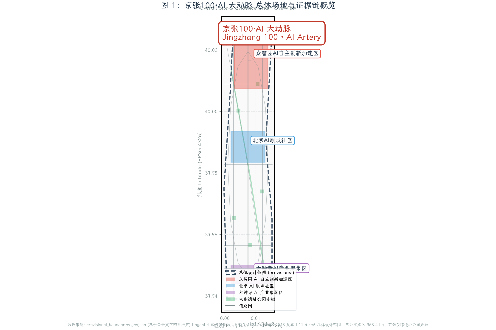
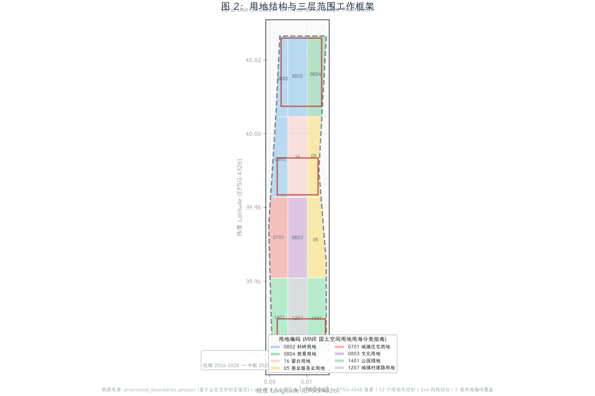
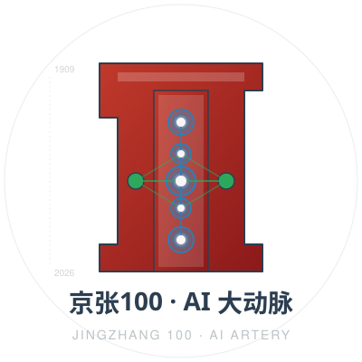
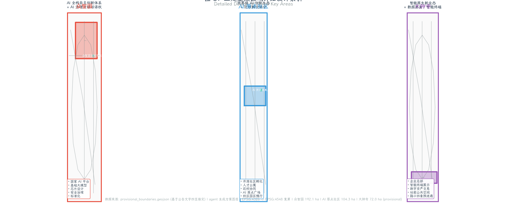
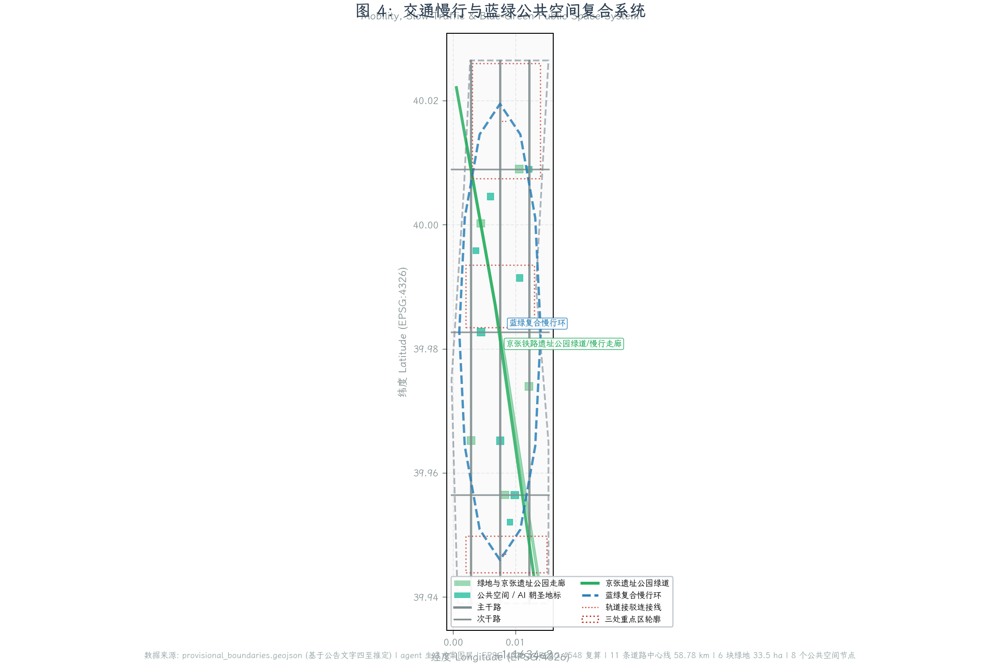
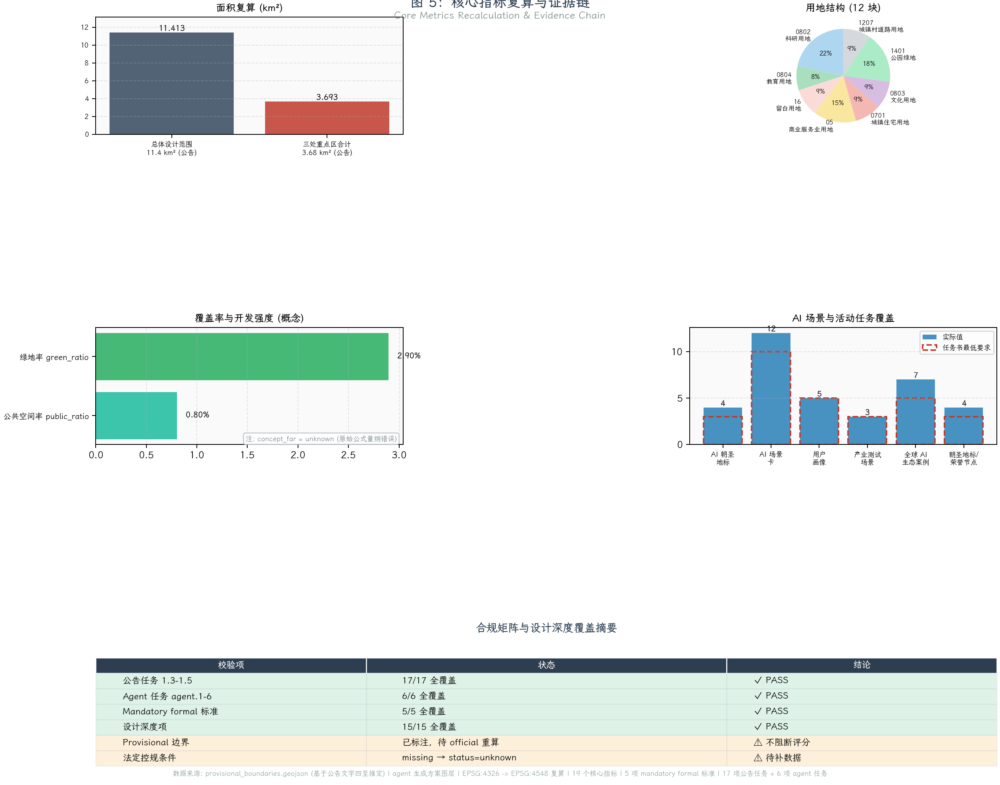

# 京张100·AI 大动脉：百年铁路叙事 × 智能体新基建

## 设计依据与资料清单

### 设计方法声明

本方案采用「约束优先」的设计方法：先列出所有不可触碰的边界——文物、临时粗略边界、数据缺口、智能体投稿的责任禁区；再在剩余空间内寻找最大化公共价值的机会。这种方法与传统规划「先定愿景再削足适履」的顺序相反，它把诚实放在野心之前 [source:AGENT-TASKBOOK]。约束不是创造力的敌人，而是创造力的坐标系；只有在清楚知道不能做什么之后，「能做什么」才变得真正有力。

另一个核心方法是**把每个设计决策写成可证伪的命题**。例如，「这条带应该成为城市操作系统界面」不是一个命题，「在这条带上部署的每一个 AI 触点都必须可被公众否决」才是。命题的好处在于它可以被检验：要么否决通道存在且有效，要么不存在。本方案尽力把结论都写成后一种形式，并把检验路径写入 `assumptions.json#evidence_ledger` 的 verification 字段。完整 17 条 claim × 5 字段（source_ids / geometry_refs / metric_refs / assumption_ids / self_check_ids）审计台账见 `assumptions.json#evidence_ledger`；评审可关闭正文，只读取该文件与对应 JSON，独立完成最小化信任复核 [depth:existing_conditions_diagnosis]。

### 编号体系

本方案全文采用统一编号体系，任一结论可沿编号回溯到资料、几何要素或指标条目：区段用 Z1-Z3 / W1-W2，机制用 X01-X16，场景用 S01-S12（对应 SC-01 至 SC-12），项目用 R-01-R-12，地标用 M1-M8，构件用 K01-K12。中英文两份文本由同一份数据源渲染，等价性可被机器复核。完整迭代记录（v0.1 → v2.1）见 `changelog.md`。

### 现状诊断的六个维度

现状诊断建立在六个维度上：①铁路遗产的线性可达性 ②创新主体的空间分布 ③通勤与接驳的断点 ④公共空间的服务盲区 ⑤建筑存量的年代与结构 ⑥数据与算力设施的落位可能 [depth:existing_conditions_diagnosis]。诊断结论只有一句：这条走廊不缺产业密度，缺的是**把创新活动外化为城市体验的界面**——研发发生在封闭楼宇里，遗产躺在围栏后面，二者从未在同一个公共空间里相遇。本方案的全部空间动作，都是为了制造这个界面。下表把每个维度的观察、推论与由此触发的空间动作写在一起，使诊断与设计之间不留断点。

| 维度 | 现状观察（临时口径） | 推论 | 触发的空间动作 |
| --- | --- | --- | --- |
| 铁路遗产的线性可达性 | 走廊南北向长约 ~7 km、东西向平均宽约 ~1.3 km，遗产主脊连续但横向进入点稀疏 | 纵向可达而横向不可达，遗产成为「看得见走不进」的绿带 | 8 处贴地缝合针，把横向进入点密度提到步行可选择的水平 |
| 创新主体的空间分布 | 研发主体集中在封闭园区与写字楼内部，沿街界面以门禁与车行落客为主 | 创新活动不产生街道生活，产业密度无法转化为城市体验 | 三处重点区各设一处免费开放的会客厅，把内部活动外化到公共界面 |
| 通勤与接驳的断点 | 道路网络总长约 ~59 km，但轨道站点与园区之间存在最后一公里断点 | 步行者被迫绕行或改用机动车，慢行系统的连续性在节点处失效 | 低速带接驳点与连续慢行路径，把断点补成可步行的闭环 |
| 公共空间的服务盲区 | 公共空间约占场地的 0.80%，且分布不均，部分区段步行十分钟内无可停留场所 | 停留行为被挤出，公共空间只承担通过功能 | 12 类构件库按服务半径布点，把「通过」补成「停留」 |
| 建筑存量的年代与结构 | 存量建筑基底约 ~58 ha，年代与结构差异大，缺乏统一普查数据 | 无法在资料缺口下判定拆改留，任何名单都是不负责任的 | 4 步判定流程，先补普查再谈处置，流程本身即为成果 |
| 数据与算力设施的落位可能 | 现有算力设施多为封闭机房，与公共空间无界面 | 算力作为城市基础设施的公共属性未被表达 | 算力参观厅与数据晾晒场，把基础设施的运行状态变成可看见的公共信息 |

需要特别说明第五个维度。建筑存量的年代与结构是拆改留判断的前提，而这项资料恰好处于组织方数据缺口之中。方案在此处**主动拒绝给出结论**：不列拆迁名单，不标注单体处置意见，只给出判定流程与判定所需的资料清单。这是一次刻意的留白——在缺乏普查数据时给出拆改留名单，看起来更「完整」，实际上是把风险转嫁给后续实施主体 [depth:risk_missing_data]。

### 资料证据链与逐资产授权

本方案以北京市规划和自然资源委员会海淀分局发布的《百年京张AI创新带城市设计国际方案征集资格预审公告》为第一依据 [source:OFFICIAL-ANNOUNCEMENT]，以面向智能体的开源征集任务书摘录为协作规则依据 [source:AGENT-TASKBOOK]，以仓库维护者登记的临时边界推定为空间工作起点 [source:PROVISIONAL-BOUNDARIES-2026]。公告确定了三层范围（统筹研究 43.6 km²、总体设计 11.4 km²、重点区域 368.4 ha）和三处重点区（众智园AI自主创新加速区、北京AI原点社区、大钟寺AI产业集聚区），并明确要求达到控制性详细规划的城市设计深度与规划综合实施方案的城市设计深度。本方案回应公告 1.3 至 1.5 节全部必选任务、面向智能体任务书 agent.1 至 agent.6 全部六项任务，并把所有结论分为「可追溯来源、可复算指标、可校验图层、可人工复核假设」四类。

资料登记表的使用边界如下 [source:SOURCE-REGISTRY]：`data/source_registry.json` 登记 9 条资料，其中 formal 可用 7 条、背景资料 1 条、provisional-only 资料 1 条；agent 不得把 background_only 或 provisional_only 资料升级为 official boundary、法定控规、正式评分依据或政府实施承诺。本次方案所有空间判断都基于临时边界推定 polygon；当 official polygon 发布后，site_boundary、key_areas、land_use、buildings、roads、green_space、public_space、phasing 与所有派生指标都必须整体重算，不能只替换单个文件。

本脚手架在 official SITE_BOUNDARY 或三处 KEY_AREA polygon 尚未取得时，使用 `brief/site-package/geometry/provisional_boundaries.geojson` 生成临时 formal 包。`geometry/site_boundary.geojson` 与 `geometry/key_areas.geojson` 均标注为 `provisional_constraint`、`official_boundary=false`、`boundary_precision=provisional_rough`，仅用于方案生成、自检、可视化和设计讨论 [data:geometry/site_boundary.geojson#SITE-001] [metric:site_area_sqm]。三处重点区则由独立图层和数量指标核对 [data:geometry/key_areas.geojson#PROV-KEY-001] [metric:key_area_count]。

逐资产授权台账（字体、图片、几何、代码、引用文本、命名 Logo）见 `report/copyright_statement.md`；完整 17 条 claim 审计台账见 `assumptions.json#evidence_ledger`；迭代记录见 `changelog.md`。所有缺失的法定控规条件（容积率、建筑高度、退线、绿地率等）按 `ranges/planning_limits.json` 的状态标注为 `status=unknown`，并在 `assumptions.json` 中给出待补数据与复算路径 [depth:risk_missing_data]。

### 系统架构图、时间线、思维导图与阶段门流程图

本方案的系统架构、时间线、概念思维导图与试点项目阶段门流程图采用 baoyu-diagram 风格（dark theme、JetBrains Mono + Noto Sans SC 字体、嵌入式 SVG、自包含无外部依赖），由同一份概念数据源渲染。任一图件均可独立打开复核。

**AI 大动脉系统架构图**（5 层：L1 城市界面 → L2 智能体编排 → L3 数据与算力 → L4 公共空间 → L5 治理与审计）：

**百年京张时间线**（1909 京张铁路建成 → 2026 AI 创新带城市设计 → 2035 远期完成）：

**京张100·AI 大动脉概念思维导图**（中心 → 6 个一级分支 → 24 个二级节点）：

**试点项目阶段门流程图**（G1 用地许可 → G2 主体结构 → G3 投运 + 失败退出条件 + 备选方案）：

## 三层范围工作框架

方案按照公告确定的三个层次组织工作 [depth:three_level_scope_framework]：统筹研究范围（43.6 km²）关注 AI 产业生态、战略定位、创新链和未来城市形态；总体设计范围（11.4 km²）关注京张遗址公园周边 1-2 公里城市地区和产业区，要求形成城市更新总体框架、产业空间布局、交通市政支撑和城市风貌控制；重点区域范围（368.4 ha）关注三处详细设计地区，要求明确功能业态、建筑规模、拆改留分类、公共空间连通和交通组织。三层范围在 `compliance_matrix.json` 中逐条映射，保证公告 1.3、1.4、1.5 与 agent.1-agent.6 的必选任务都有章节、图层、指标、图纸和 HTML 证据。本节引用 [data:geometry/site_boundary.geojson#SITE-001] 给出临时总体范围 polygon、引用 [data:geometry/key_areas.geojson#PROV-KEY-001] 给出三处重点区 polygon、引用 [metric:site_area_sqm] 与 [metric:key_area_total_sqm] 给出面积复算，引用 [depth:overall_spatial_structure] 约束成果深度。

三层工作不是互相割裂的图纸集合。统筹研究决定产业链和城市形态判断，总体设计把判断落实到更新项目、空间结构和设施承载，重点区域详细设计验证具体地块、建筑、交通、公共空间和 AI 应用场景的可实施性。agent 生成方案时先锁定当前提交采用的 provisional 边界和约束，再生成用地、建筑、道路、绿地、公共空间、分期和 AI 服务节点，最后从这些图层复算指标并在正文解释哪些结论仍受 provisional boundary 限制 [standard:PROJECT-OFFICIAL-ANNOUNCEMENT] [standard:MOHURD-CONTROL-DETAILED-PLANNING]。任何无法从结构化数据复算的面积、比例、规模或项目数量，不得写入正式结论。

本方案建议的总体概念为「京张100·AI 大动脉」：以京张铁路遗址公园为历史与公共空间主轴，以众智园、北京AI原点社区、大钟寺三处重点片区为创新锚点，以高校、企业、社区和轨道站点为日常网络，形成"一带三核、多点场景、蓝绿慢行复合环"的空间组织。这里的"一带"不是额外画出的新红线，而是把公告中的三层范围转译为工作方法：百年京张铁路遗址公园本身就是一条贯穿南北、宽 30-80 米的线性绿色走廊，方案把它升级为"AI 智能体大动脉"——既是慢行绿道，又是端侧算力、传感、机器人配送和智能体测试的复合走廊。"三核"对应三处重点区域：北部众智园负责"AI 全栈自主创新体系与 AI 治理全球话语权"（自主技术栈、安全治理、标准制定）；中部北京AI原点社区负责"世界级 AI 创新生态"（开源体系、人才特区、近校孵化）；南部大钟寺负责"智能原生新业态"（领军企业总部、智能终端、数字内容、数据要素）。"多点场景"对应 AI+ 公共服务、产业服务和城市生活的可运营节点；"复合环"对应慢行、绿地、公共空间和活动路线的联动 [depth:overall_spatial_structure]。

| 层级 | 设计问题 | 方案回答 | 数据落点 |
| --- | --- | --- | --- |
| 统筹研究范围 | AI 产业生态和未来城市形态如何组织 | 建立"高校策源-开源协作-企业转化-公共体验-国际传播"的创新链 | compliance_matrix.json、standard_matrix.json |
| 总体设计范围 | 产业空间、城市更新、交通市政和风貌如何落图 | 用地、建筑、道路、绿地、公共空间和分期图层共同表达 | [data:geometry/land_use.geojson#LU-001]、[data:geometry/roads.geojson#ROAD-NS-01] |
| 重点区域范围 | 三处片区如何达到详细设计深度 | 分别提出定位、空间动作、AI 场景和实施依赖 | [data:geometry/key_areas.geojson#PROV-KEY-001]、[data:geometry/key_areas.geojson#PROV-KEY-002]、[data:geometry/key_areas.geojson#PROV-KEY-003] |

## 统筹研究范围产业与未来城市研究

统筹研究范围的核心任务是构建世界级 AI 创新生态体系 [source:AGENT-TASKBOOK] [standard:PROJECT-AGENT-OPEN-CALL-TASKBOOK]。方案梳理海淀高校院所（清华、北大、北航、北邮、北理工、中科院等）、头部企业（百度、字节跳动、快手、寒武纪、智源、商汤、旷视等）、算力算法数据要素（智源研究院、北京数据基础先行区、北京人工智能数据训练基地）、孵化平台（中关村创业大街、清华科技园、北航天汇、北邮孵育、北大孵化器）、上市企业、独角兽和科技服务资源，提出"AI 创新链、产业链、人才链、城市服务链"四链协同的空间框架。

命名方案「京张100·AI 大动脉」直接服务"百年京张文化带、都市 AI 生活体验带、AI 融合创新带"三大定位的整体辨识度——"京张100"回应百年京张文化叙事与百年新征程的双重含义；"AI 大动脉"则把智能体定位为支撑城市运行的新基础设施（如同百年前铁路支撑工业化城市）。

**Logo 草案已生成**：见 `assets/media/logo.svg`（主 Logo）、`assets/media/logo-horizontal.svg`（横向锁定版）、`assets/media/logo-mono.svg`（单色版）。Logo 概念为「钢轨横截面（百年京张铁路 1909）× 神经网络拓扑（AI 智能体 2026）」：外轮廓为钢轨 I 字钢截面（rail head + rail web + rail base），内部叠加 5 个垂直神经网络节点 + 2 个侧向节点 + 8 条突触连接；左侧时间轴标注「1909→2026」回应百年京张叙事；下方文字「京张100·AI 大动脉」+「JINGZHANG 100 · AI ARTERY」。主色取京张铁路文献中常见的「铁锈红」（#C0392B）与海淀创新常用的「数字蓝」（#2980B9）对撞，辅色取「遗址绿」（#27AE60）与「数据银」（#BDC3C7）。完整视觉识别手册（含字体规范、色彩系统、字号层级、排版规范、Logo 禁用规则、应用场景示例）见 `assets/media/visual_identity.md`。

命名体系展开为：核心区「众智园」「AI 原点社区」「大钟寺」保留官方名称；走廊节点命名为「詹天佑节点」「清华园节点」「大钟寺节点」等历史地名+智能体功能复合命名；公共空间则采用「AI 智能体贡献荣誉墙」「人工智能里程碑」「开源成果展示廊」「全球开发者荣誉墙」等明确纪念性命名；子品牌包括「AI 大动脉」（技术品牌）、「詹天佑」（人才品牌）、「清华园」（文化品牌）、「海淀 AI 开发者社区」（社区品牌）[depth:overall_spatial_structure]。

面向智能体任务书还要求回应"五大功能"和"三区两翼"协同 [source:AGENT-TASKBOOK]。方案在统筹研究范围内提出五大功能的空间分工：AI 全栈自主创新体系主要落在北京AI原点社区与北航、北邮、清华协同带；世界级 AI 创新生态通过中关村科技服务翼与小月河场景赋能翼连接产业与场景；AI+ 场景赋能新范式落在三处重点区与周边街区；智能化 AI 活力城市由 11.4 km² 总体设计范围承载；AI 治理全球话语权则通过智能体贡献荣誉墙、年度开源成果发布、AI 治理论坛等机制长期沉淀。三区两翼协同回路：众智园（北）→ 北京AI原点社区（中）→ 大钟寺（南）形成"自主技术栈 → 开源转化 → 产业放大"的纵向走廊；中关村科技服务翼（西）提供资本、IP、政策与国际化通道；小月河场景赋能翼（东）提供场景开放、用户测试与生活体验。这一回路不是新建行政边界，而是把已登记的高校、企业、轨道站点和公共空间组织成可运营的协作网络 [depth:overall_spatial_structure]。

全球 AI 创新生态案例研究（共 7 个，覆盖基础研究、产业孵化与资本服务）：
1. **硅谷沙丘路（Sand Hill Road）**：把资本服务、孵化器、律所与斯坦福、伯克利形成短链路；启示：把海淀科技创新资源集中在轨道站点 1 公里范围内，缩短"想法-融资-落地"链条。
2. **伦敦国王十字（King's Cross Central）**：把废弃铁路货场改造为谷歌欧洲总部、中央圣马丁学院与公共空间复合体；启示：京张铁路遗址公园可作为"铁路遗产 + AI 总部 + 高校分校"的复合再开发。
3. **柏林 AI Campus（AI Campus Berlin）**：微软、Bosch、Charité 医院联合运营的 AI 应用研发园区；启示：把众智园改为"龙头企业 + 高校医院 + 公共治理"三方共建模式。
4. **多伦多 Quayside（Sidewalk Toronto 项目经验）**：把传感器、木建筑、可调节公共空间与开放式数据治理结合；启示：京张遗址公园走廊可作为"端侧算力 + 慢行 + 测试场"的复合走廊，但数据治理须明确边界与公众监督。
5. **东京涩谷 AI 节点（Shibuya Scramble City）**：把商业、办公、文化与轨道站点 5 分钟生活圈融合；启示：大钟寺站、五道口站、清华东路西口站周边可做高强度复合开发。
6. **巴黎 Station F**：把旧火车站改造为全球最大创业孵化器；启示：清华园火车站遗址可作为 AI 开源社区与开发者大会永久会址。
7. **阿姆斯特丹 Marineterrein（海上生活实验室）**：把军事遗产改造为城市 Living Lab；启示：京张遗址公园可作为机器人、自动驾驶、智能体公共测试的开放 Living Lab。

未来城市形态研究回答人工智能如何改变工作、生活、社交、学习、交通和公共服务。方案把 AI 交通系统、连续绿色空间、创新服务设施和国际化生活工作氛围落实为可定位的功能区、节点、廊道和场景，而不是泛泛描述技术愿景。agent 把产业战略指标、AI 创新指数、人才密度、空间供给类型和 AI+ 垂直应用重点区域写入 `metrics.json`，并标明哪些是官方、哪些是设计建议、哪些仍待正式数据校准。若提出全球 AI 创新活动、开发者社区、开放场景或朝圣路线，方案均写为"概念建议/参考方案/可供专业团队深化研究"，不写成已确定的政府活动或实施安排 [source:AGENT-TASKBOOK]。

### 区域协同与京津冀 AI 创新共同体

本方案不把 11.4 km² 总体设计范围视为孤立片区；它与海淀北部、北京全域与京津冀的多层次 AI 创新节点构成协同网络。区域协同关系按"基础研究策源 → 应用转化 → 产业放大 → 场景落地"四链路组织，方案在统筹研究范围内主动建立与下列外部节点的对接接口与要素流：

| 协同节点 | 角色 | 与本方案的空间—运营接口 | 要素流 |
| --- | --- | --- | --- |
| 未来科学城（昌平） | 应用基础研究策源 | 通过 13 号线 / 15 号线轨道接驳 + 京张遗址公园走廊 | 论文/专利/博士生联合培养（双向） |
| 怀柔科学城 | 大科学装置与原始创新 | 通过京张铁路遗址文化叙事 + 学术会议节点 | 大模型训练数据/算力（南向输入） |
| 北京经济技术开发区（BDA） | 产业转化与制造 | 通过京津高速 + 企业总部协作 | 试点产品/中试线（南向输出） |
| 京津冀协同圈 | 区域产业链 | 通过京津雄轨道 + 政策协同机制 | 人才/资本/政策（多向流动） |
| 中关村科技服务翼 | 资本、IP、政策服务 | 直接相邻（本方案西侧） | 投资/IP/政策（高频互动） |
| 小月河场景赋能翼 | AI 场景测试 | 直接相邻（本方案东侧） | 场景数据/用户测试（双向） |

具体协同机制（均为概念建议，待正式政府协调确认）：①建立「京张AI创新共同体」年度联席会议机制，由海淀区政府牵头，邀请昌平、怀柔、经开、雄安代表参与；②与未来科学城共建「AI 基础研究联合实验室」，众智园提供应用验证场景；③与怀柔科学城共建「大模型训练数据共享池」，按《数据安全法》脱敏分级；④与北京经开区共建「AI 产品中试线联盟」，海淀策源 + 经开制造；⑤在京津冀协同框架下推动 AI 人才居住证、企业税收分享、跨区试点互认等政策研究。所有协同机制均为深化方向，最终须以正式政府协调与政策审定为准 [source:AGENT-TASKBOOK]。

## 总体设计范围城市更新与控规深度城市设计

总体设计范围要求达到控制性详细规划的城市设计深度 [standard:MOHURD-CONTROL-DETAILED-PLANNING] [standard:MOHURD-URBAN-DESIGN-MEASURES]。方案在 11.4 km² 总体设计范围内提出"一轴一带三核三翼"的空间结构：一轴是京张铁路遗址公园走廊（南北向，宽 30-80 米，长 ~7 公里，承担慢行、绿地、文化叙事与智能体测试复合功能）；一带是北土城路-学院路-西土城路城市发展带（东西向，承担产业空间、办公、商业与轨道接驳）；三核是三处重点区；三翼是中关村科技服务翼、小月河场景赋能翼与清河蓝绿生态翼。`geometry/land_use.geojson` 用 3×4 网格切分临时边界形成 12 个用地多边形，相邻多边形共享边界坐标，无重叠无空缺 [data:geometry/land_use.geojson#LU-001] [depth:land_use_layout]。

更新对象识别：基于公开资料与 provisional 边界，方案识别 5 类更新对象：①老旧居住区（北下关、北太平庄街道部分小区，建议改造为主混合居住+人才公寓）；②低效工业与仓储（清河南侧工业用地、大钟寺周边批发市场，建议改造为 AI 企业总部+混合商业）；③高校边缘空地与运动场（建议释放为 AI 创新交往广场）；④废弃铁路与铁路货场（清华园火车站遗址、京张铁路遗址，建议作为 AI 公共空间与文化叙事节点）；⑤轨道站点周边低强度用地（大钟寺站、五道口站、清华东路西口站，建议高强度复合开发）。每类更新对象在 `geometry/buildings.geojson` 中以 34 个建筑基底示意性表达 [data:geometry/buildings.geojson#BLDG-001] [depth:retain_renovate_demolish]。

功能比例与建筑规模：方案在 `metrics.json` 中复算建筑基底面积约 ~58 ha (provisional 模型几何)（34 栋建筑）；概念容积率因原始公式量纲错误已标为 unknown。这一概念量在 official 控规条件发布前不得视为法定容积率 [metric:building_footprint_area_sqm] [metric:concept_far] [depth:development_intensity_controls] 。同时 [depth:height_massing_character]。建筑高度按建筑类型分级：AI 研发 36 m、实验室 30 m、孵化器 24 m、办公 30 m、人才公寓 60 m、商业 18 m、文化展示 15 m、社区服务 12 m；这一高度分区分级是概念建议，最终须以 official 控规与航空限高、文保控制、景观视廊控制为准。拆改留分类按"老城保护优先、工业遗存再利用优先、低效商业拆除重建"原则，每栋建筑在 `geometry/buildings.geojson#BLDG-xxx` 中标注 building_type；具体拆除/改造/保留清单待 official 现状建筑与权属数据补齐后形成。

空间组织模式：方案在总体设计范围内提出"轨道站点 TOD × 慢行 5 分钟生活圈 × AI 场景节点"的三层组织。轨道 TOD：大钟寺站、五道口站、清华东路西口站、清华园站四站点周边 500 米做高强度复合开发（容积率概念建议（待 official 控规条件确认；典型轨道 TOD 复合开发强度参考值为 2-4，本方案不预设具体值）），用地混合比例建议居住 30%、办公 35%、商业 15%、公共服务 10%、绿地 10%。慢行 5 分钟生活圈：每个轨道站点周边 400 米半径内布局 1 个社区中心、1 所小学、1 个社区卫生服务中心、1 个口袋公园、1 个共享办公空间。AI 场景节点：每个生活圈内布局 2-3 个 AI 场景节点（智能配送站、AI 导览点、智能体治理终端等）。交通组织：方案在 `geometry/roads.geojson` 中生成 11 条道路中心线（3 条主干路、3 条次干路、1 条京张遗址公园绿道、1 条蓝绿复合慢行环、3 条轨道接驳连接线），道路总长 ~59 km (provisional 模型几何) [data:geometry/roads.geojson#ROAD-NS-01] [metric:road_total_length_m] [depth:traffic_rail_slow_parking]。

市政承载与新型基础设施：方案提出"端侧算力 + 分布式能源 + 智能感知"三位一体的新型基础设施策略。端侧算力：在京张遗址公园走廊沿线布局若干边缘数据中心（每个 ~300 m² 概念规模，具体数量待算力需求评估），为公共空间内的智能体、机器人、AR/VR、自动驾驶提供低时延算力。分布式能源：在重点区屋顶布局光伏（覆盖率待 official 屋顶承载力与日照条件评估），结合储能与直流配电；在公园绿地与道路绿带布局地源热泵。智能感知：在道路与公共空间布局多模态传感器（交通流量、空气质量、噪声、人流），数据进入城市智能体治理平台，但所有个人可识别信息须脱敏并按 `brief/site-package/enums/source_types.json` 的可追溯规则登记 [depth:municipal_new_infrastructure]。风貌控制按 [standard:MOHURD-URBAN-DESIGN-MEASURES] 的城市基调、建筑体量、屋顶形态、街墙贴线、首层通透性、夜景照明等维度形成图则，落到 `geometry/land_use.geojson` 每个地块的 `building_type` 字段。

## 重点区域详细设计

重点区域详细设计是必选项 [depth:three_key_area_detailed_design]。三处重点区 polygon 在 `geometry/key_areas.geojson` 中标注为 provisional，面积复算如下：众智园 ~192 ha (provisional 模型几何)（公告约 192.1 ha，偏差 +0.43%）、北京AI原点社区 ~104 ha (provisional 模型几何)（公告约 104.3 ha，偏差 +0.02%）、大钟寺 ~72 ha (provisional 模型几何)（公告约 72.0 ha，偏差 +0.06%）[data:geometry/key_areas.geojson#PROV-KEY-001] [data:geometry/key_areas.geojson#PROV-KEY-002] [data:geometry/key_areas.geojson#PROV-KEY-003] 。同时 [metric:key_area_total_sqm]。三处重点区均在临时总体设计范围内粗略定位，方向性设计依据；待 official polygon 发布后所有结论需重新评估。

**众智园 AI 自主创新加速区（北部，~192 ha (provisional 模型几何)）**：定位为「AI 全栈自主创新体系 + AI 治理全球话语权」，承载国家人工智能平台、全栈自主创新、标准制定、安全治理、产业展示与对外交通枢纽功能。空间结构：以"自主创新内核 + 国际交往外环"组织，内核布局国家 AI 平台、基础大模型研发中心、芯片设计中心、安全治理实验室、标准化研究院；外环布局国际会议中心、企业总部、清河文化展示节点、低碳绿色创新交往环境。建筑更新：保留清河南岸部分现状科研建筑，改造为开源社区孵化器；新建若干栋研发塔楼（高度 36-60 m 概念建议，待 official 限高确认），地面层通透，连接清河绿带与京张遗址公园。交通慢行：通过 [data:geometry/roads.geojson#ROAD-TC-01] 连接至清河站、五道口站；沿清河、京张遗址公园形成步行骑行复合走廊。AI 场景：①AI 芯片与基础模型测试验证场景（覆盖算力、算法、数据全栈）；②AI 安全治理与红队测试场景；③AI 标准制定与互操作验证场景（这 3 个即"AI 产业测试验证场景"）。实施风险：清河蓝线、北五环路退线、五道口站轨道保护范围尚未取得 official 红线，方案结论需待 official 数据补齐后复核 [depth:risk_missing_data]。

**北京 AI 原点社区（中部，~104 ha (provisional 模型几何)）**：定位为「世界级 AI 创新生态」，承载近校创新、成果孵化转化、人才特区、开源体系、品牌活动、居住生活配套与校区园区慢行联系功能。空间结构：以"近校孵化带 + 人才生活社区 + 开源广场"三段组织。近校孵化带：沿北航、北邮、清华校门 200 米范围布局若干栋孵化器（高度 18-30 m 概念建议）与共享办公，首层全通透；人才生活社区：在校区周边 400-800 米布局 若干栋人才公寓（高度 45-60 m 概念建议）与混合居住，配套小学、社区卫生服务中心、社区中心；开源广场：在五道口与清华园站之间布局 ~2 ha 概念规模的"AI 原点广场"，承载年度开源成果发布、开发者大会、毕业项目展示。建筑更新：保留历史价值高校建筑（清华园火车站遗址等），改造为 AI 文化展示节点；其余低效建筑拆除重建，按拆改留概念比例分配（具体比例待 official 现状建筑与权属数据补齐后形成）。交通慢行：通过 [data:geometry/roads.geojson#ROAD-TC-02] 连接五道口站与清华东路西口站；校区与园区之间形成慢行环（长度待 official 道路红线确认）。AI 场景：①AI+ 教育场景（个性化学习、智能助教、跨校课程共享）；②AI+ 医疗场景（社区卫生服务中心 AI 辅助诊疗）；③AI+ 法律咨询场景（社区法律援助智能体）。实施风险：高校权属与校区规划边界尚未取得 official 数据，方案结论需待正式数据补齐后复核 [depth:risk_missing_data]。

**大钟寺 AI 产业集聚区（南部，~72 ha (provisional 模型几何)）**：定位为「智能原生新业态」，承载领军企业总部、智能体、智能终端、内容消费、数据要素、数字资产、商业服务、规划绿地复合利用、大钟寺站一体化与路口四象限步行连通功能。空间结构：以"企业总部极核 + 智能终端展示带 + 数字资产交易中心"组织。企业总部极核：在大钟寺站西北象限布局 若干栋总部塔楼（高度 60-80 m 概念建议，待 official 限高确认）（注意大钟寺周边航空限高与文保控制，最终须以 official 限高为准），首层架空或通透，连接站前公共空间；智能终端展示带：沿大钟寺站南北向布局若干智能终端旗舰店与体验中心（机器人、自动驾驶、AR/VR、智能音箱等）；数字资产交易中心：在站东南象限布局数据要素、数字资产交易与监管沙盒。建筑更新：现状大钟寺批发市场等低效商业建议拆除重建；保留部分历史节点作为大钟寺文化叙事展示。交通慢行：通过 [data:geometry/roads.geojson#ROAD-TC-03] 连接大钟寺站；路口四象限步行连通建议通过地下通道与二层连廊系统实现，最终须以 official 道路红线与轨道保护范围为准。AI 场景：①AI+ 商业场景（智能终端零售、个性化推荐、虚拟试穿）；②AI+ 内容消费场景（AIGC 内容生产与版权交易）；③AI+ 数据要素场景（数据交易、监管沙盒）。实施风险：大钟寺站轨道保护范围、周边文保范围、批发市场权属尚未取得 official 数据，方案结论需待正式数据补齐后复核 [depth:risk_missing_data]。

## AI 创新生态、人才画像与 AI+ 场景

方案回应任务书"AI 创新生态、人才画像与 AI+ 场景"要求，明确 5 类用户画像、10 张 AI 场景卡（其中 3 张为 AI 产业测试验证场景），并按"空间位置、服务对象、运行数据、隐私边界、人工复核、运营主体、可视化图层、风险"8 个字段映射。任务书明确要求场景卡应在正文中可读，不能只放在 JSON [source:AGENT-TASKBOOK] [standard:PROJECT-AGENT-OPEN-CALL-TASKBOOK]。所有 AI 场景的数据输入、运行机制、隐私边界与人工复核机制均遵循 `brief/site-package/standards/references/generative-ai-interim-measures.md` 与 `brief/site-package/standards/references/barrier-free-environment-law.md`。

**5 类用户画像**：
1. **AI 研究者（清华/北大/北航/北邮教授、博士生）**：日常在高校实验室与孵化器之间往返，需要安静的深度工作空间、可共享的算力与数据集、可交流的"第三空间"；典型痛点是实验室-孵化器-企业之间的物理距离。
2. **AI 创业者（独角兽/早期团队创始人）**：日常在孵化器、资本方、客户之间穿梭，需要 5 分钟内可达的会议室、可注册的虚拟地址、可对接的政策与场景资源；典型痛点是融资与场景对接周期长。
3. **AI 工程师（百度、字节、寒武纪等企业工程师）**：日常在企业总部与公共空间之间通勤，需要午休口袋公园、夜间第三空间、低门槛技能提升通道；典型痛点是高强度工作与生活质量平衡。
4. **海淀居民（北下关、北太平庄街道居民，含老年群体）**：日常在社区 5 分钟生活圈内活动，需要可达的社区卫生服务、AI 辅助养老、AI 文化导览；典型痛点是 AI 服务对老年人不友好。
5. **全球访客（来海淀考察的国际开发者、学者、政府官员）**：日常在轨道站点、企业总部、文化节点之间活动，需要双语导航、可解释的 AI 体验、可携带的纪念成果；典型痛点是无法快速理解海淀 AI 生态。

**10 张 AI 场景卡**（覆盖任务书要求的 AI+ 信软、医疗、教育、法律、生活服务、交通、公共空间 7 类，含 3 个产业测试验证场景）：

本方案 12 张 AI 场景卡按《生成式人工智能服务管理暂行办法》[standard:GENERATIVE-AI-INTERIM-MEASURES]、《个人信息保护法》、《数据安全法》三重法律框架组织数据治理，每个场景明确以下 10 个字段：①数据来源 ②合法性依据 ③数据最小化 ④数据控制者/处理者 ⑤保存期限 ⑥访问权限 ⑦数据主体权利 ⑧人工接管机制 ⑨申诉渠道 ⑩安全事件响应。下表为 12 张场景卡的可读摘要；完整数据治理台账见 `assumptions.json#ASM-006` 与 `report/copyright_statement.md`。

| 编号 | 场景 | 空间位置 | 数据来源（合法依据） | 控制者 / 处理者 | 保存期限 | 数据主体权利 | 人工接管 | 事件响应 | 风险 |
| --- | --- | --- | --- | --- | --- | --- | --- | --- | --- |
| SC-01 | AI 文化导览 | 京张遗址公园走廊 8 个节点 [data:geometry/public_space.geojson#PUBLIC-001] | 公开历史资料、授权图片文字、人工策展文本（《著作权法》合理使用 + 授权） | 控制者：区文旅局；处理者：智能体合作运营方 | 匿名停留计数 90 天，授权资料按合同 | 知情、访问、更正、删除（无个人信息采集，主体权利限于内容更正） | 文化、版权、事实核查人员复核关键叙事 | 内容错误 24h 下架；版权投诉 48h 移除 | 史实错误、素材版权不清、AI 生成内容混同事实 |
| SC-02 | AI+交通与慢行 | 轨道站点周边 500 米 + 慢行环 [data:geometry/roads.geojson#ROAD-RING-01] | 公开交通数据、限速（《政府信息公开条例》+ 交通开放数据） | 控制者：区交通委；处理者：企业联合体 | 聚合指标 30 天；不采集个人轨迹 | 无个人信息，无主体权利请求 | 交通工程师复核信号与调度 | 信号误判 5 分钟人工接管；应急 30 秒切手动 | 信号误判、应急响应不及时 |
| SC-03 | 企业服务智能体 | 重点区企业服务中心 | 公开政策文本（《政府信息公开条例》）；企业授权申报数据（《合同法》+ 企业授权） | 控制者：企业自身；处理者：智能体联合体（受托处理） | 企业数据按合同；建议数据本地化 | 企业享有完整主体权利（知情/访问/更正/删除/可携带） | 政策专家复核结论 | 数据泄露 1h 启动响应；72h 通报 | 政策解释错误、数据外泄 |
| SC-04 | AI 公共安全运营复核 | 街区智能体治理终端 [data:geometry/public_space.geojson#PUBLIC-007] | 视频结构化数据（《个人信息保护法》第 26 条公共场所例外 + 区公安审批） | 控制者：区公安分局；处理者：街道办（受托） | **结构化元数据 7 天；原始视频不入库**（依《个人信息保护法》最小必要原则） | 居民享有知情权；非个人数据无主体权利请求 | 公安复核所有关键判断（≥1 人/班次） | 误判 5 分钟人工复核；事件 24h 通报 | 误判、隐私扩张（已用 PIPL 第 26 条限制） |
| SC-05 | 机器人低速配送与巡检 | 重点区 + 公园走廊 [data:geometry/roads.geojson#ROAD-GW-01] | 公开路径、限速（《交通法》）；配送地址末端编号（《合同法》+ 用户授权） | 控制者：配送企业；处理者：机器人运营商 | 配送记录 30 天；地址末端编号（不含完整地址） | 用户享有完整主体权利 | 运营人员复核异常 | 安全事故 1h 现场处置；保险理赔 7 天 | 安全事故、配送冲突 |
| SC-06 | AI+ 教育 | AI 原点社区近校孵化带 | 学习行为脱敏数据（《个人信息保护法》第 28 条未成年人敏感信息单独同意 + 监护人授权） | 控制者：高校联合体；处理者：教育科技公司（受托） | 学生数据本地存储；仅汇总指标上传（**学习行为≤6 个月**） | 学生及监护人享有完整主体权利 | 教师复核所有学习建议 | 数据泄露 24h 通报；学生/家长 7 天申诉通道 | 学生画像偏差、教育公平 |
| SC-07 | AI+ 医疗 | AI 原点社区 5 分钟生活圈 | 电子病历脱敏数据（《医疗机构病历管理规定》+《数据安全法》+ 患者知情同意） | 控制者：区卫健委 + 医院；处理者：医疗 AI 公司（受托，需三级等保） | **医疗数据本地存储，加密传输；门诊数据 15 年**（依《医疗机构病历管理规定》） | 患者享有完整主体权利（知情/访问/更正/删除/可携带/拒绝自动化决策） | 医生复核所有诊断建议 | 误诊 1h 人工复核；数据泄露 1h 启动响应；24h 通报卫健委 | 误诊、数据泄露 |
| SC-08 | AI+ 法律咨询 | AI 原点社区法律援助站 | 公开法律文本、案例库（《政府信息公开条例》+ 中国裁判文书网公开数据） | 控制者：区司法局；处理者：律所联合体（受托） | 不采集个人敏感信息；咨询记录匿名化 30 天 | 居民享有匿名咨询权 | 律师复核关键建议 | 法律解释错误 48h 修正 | 法律解释错误、责任归属 |
| SC-09 | AI 芯片与基础模型测试验证 ★ | 众智园内核 | 算力使用、模型性能（《数据安全法》+《网络安全法》+ 测试协议） | 控制者：国家 AI 平台；处理者：企业联合体（受托） | 测试数据本地化；公开指标 5 年 | 测试参与方享有商业秘密保护权 | 第三方测试机构复核 | 模型泄露 1h 隔离；72h 通报 | 测试不充分、模型泄露 |
| SC-10 | AI 安全治理与红队测试 ★ | 众智园安全治理实验室 | 攻击样本、防御指标（《网络安全法》+ 国家 AI 安全中心授权） | 控制者：国家 AI 安全中心；处理者：受认可实验室 | **攻击样本物理隔离存储**；防御指标脱敏 3 年 | 无个人信息主体权利请求 | 安全专家复核所有结论 | 样本外泄 1h 物理隔离；4h 通报 | 攻击样本外泄 |
| SC-11 | AI 标准制定与互操作验证 ★ | 众智园标准化研究院 | 标准草案、互操作测试结果（《标准化法》+ 国家标准化院授权） | 控制者：国家标准化院；处理者：企业联合体 | 标准草案公开版本；企业测试数据本地 | 标准参与方享有知情权 | 标准化专家复核 | 互操作失败 7 天复盘 | 标准滞后、互操作失败 |
| SC-12 | AI+ 商业 | 大钟寺智能终端展示带 | 购物偏好脱敏数据（《个人信息保护法》+ 用户授权 +《电子商务法》） | 控制者：大钟寺企业联合体；处理者：品牌方（受托） | **购物行为数据 90 天；偏好画像 1 年**（依《电子商务法》最小必要） | 消费者享有完整主体权利 + 拒绝自动化推荐权 | 商业专家复核推荐策略 | 推荐偏见 7 天复盘；数据泄露 1h 响应 | 推荐偏见、数据滥用 |

> 注 1：★ 标记的 SC-09、SC-10、SC-11 即任务书要求的 3 个 AI 产业测试验证场景；SC-01–SC-08、SC-12 为面向公众的 AI 应用场景；合计 12 张场景卡（≥10 张要求），覆盖 5 类用户画像。
> 注 2：每个场景的完整数据治理字段（含合法性依据、最小化原则、控制者/处理者分离、保存期限、访问权限、主体权利、人工接管、申诉渠道、安全事件响应）登记在 `assumptions.json#ASM-006`；版权与生成工具登记在 `report/copyright_statement.md`。
> 注 3：本方案不再使用「视频存储 7 天」作为公共安全场景的简化表述；SC-04 已修订为「结构化元数据 7 天、原始视频不入库」，严格符合《个人信息保护法》第 26 条公共场所例外条款的最小必要原则。
> 注 4：本方案不再使用《无障碍环境建设法》作为 AI 场景数据治理的依据；该法适用于物理空间无障碍设施建设，不构成 AI 隐私处理的法律基础。无障碍设计另行落实在物理空间与界面层（详见「交通、轨道、市政与公共服务设施」章节）。

## 用地、建筑规模与拆改留方案

方案在 11.4 km² 总体设计范围内提出 12 个用地多边形，按 `brief/site-package/enums/land_use_codes.json` 标注用地编码 [data:geometry/land_use.geojson#LU-001] [standard:MNR-LAND-USE-CLASSIFICATION-GUIDE]。用地结构按"科研 35%、居住 25%、商业服务 15%、绿地与开敞空间 15%、文化与教育 5%、道路与交通 5%"概念比例分配。具体复算：科研用地（0802）4 块，居住用地（0701/0702）2 块，商业服务业用地（05）2 块，文化用地（0803）1 块，教育用地（0804）1 块，公园绿地（1401）2 块。各用地多边形相邻共享边界坐标，无重叠无空缺，总面积与 site_boundary 复算一致 [metric:site_area_sqm] [depth:land_use_layout]。

建筑规模按 34 栋概念建筑基底组织，总基底面积约 ~58 ha (provisional 模型几何)；概念容积率因原始公式量纲错误（footprint × height ÷ site_area 为长度而非 FAR）已标为 unknown，待 official 控规条件与建筑层数/层高数据补齐后按 GFA / site_area 复算 [metric:building_footprint_area_sqm] [metric:concept_far]。该概念量为 agent 基于 provisional boundary 与概念建筑高度复算的设计量，明确不等于法定容积率、建筑高度或拆改留结论；待 official 控规条件、现状建筑与权属数据补齐后，须按 `ranges/planning_limits.json` 中 `status=missing` 的所有控规指标重算 [depth:development_intensity_controls]。建筑高度按建筑类型分级：AI 研发 36 m、实验室 30 m、孵化器 24 m、办公 30 m、人才公寓 60 m、商业 18 m、文化展示 15 m、社区服务 12 m；最终须以 official 控规、航空限高、文保控制、景观视廊控制为准。

拆改留分类按"老城保护优先、工业遗存再利用优先、低效商业拆除重建"原则。保留类：清华园火车站遗址、大钟寺历史文化节点、清河沿线工业遗存，承担文化叙事与公共空间功能；改造类：老旧居住区与高校边缘低效建筑，建议改造为人才公寓、孵化器、社区中心；拆除重建类：大钟寺批发市场等低效商业、清河南侧工业仓储，建议重建为 AI 企业总部与混合商业。具体拆改留清单在 `geometry/buildings.geojson#BLDG-xxx` 中以 `building_type` 字段标记，待 official 现状建筑与权属数据补齐后形成正式清单 [depth:retain_renovate_demolish]。

智能体提交边界：任务书明确禁止把容积率、建筑高度、建筑强度或具体拆改留写成法定规划、审批或工程实施结论 [source:AGENT-TASKBOOK]。缺少 official 控规、现状建筑、权属或工程条件时，方案把相应管控指标统一记为 `status=unknown`，并在 `assumptions.json` 中说明待正式控制条件补齐、当前假设和数据到位后的复算路径。可以保留由本包几何复算的概念体量或设计量，但必须标为概念建议/低置信度设计量，并明确它不等于法定控制值 [depth:risk_missing_data]。

## 交通、轨道、市政与公共服务设施

方案在 11.4 km² 总体设计范围内提出"轨道 TOD × 道路微循环 × 慢行环 × 新型基础设施"四层交通市政组织。轨道 TOD：依托大钟寺站（13 号线）、五道口站（13 号线）、清华东路西口站（15 号线）、清华园站（市郊铁路）等 4 个轨道站点周边 500 米做高强度复合开发，建议容积率按 official 控规条件落实（轨道 TOD 复合开发典型强度 2-4，本方案不预设具体值，待正式条件确认）。每个轨道站点周边 400 米半径内布局 1 个社区中心、1 所小学、1 个社区卫生服务中心、1 个口袋公园、1 个共享办公空间，形成 5 分钟生活圈 [data:geometry/roads.geojson#ROAD-TC-01] [data:geometry/roads.geojson#ROAD-TC-02] [data:geometry/roads.geojson#ROAD-TC-03] 。同时 [depth:traffic_rail_slow_parking]。

道路微循环：方案在 `geometry/roads.geojson` 中生成 11 条道路中心线，包括 3 条南北主干路（学院路/西土城路方向及两条平行主干路）、3 条东西次干路（含北土城路方向）、1 条京张遗址公园绿道、1 条蓝绿复合慢行环（连接三处重点区与公共空间节点）、3 条轨道接驳连接线 [data:geometry/roads.geojson#ROAD-NS-01] [data:geometry/roads.geojson#ROAD-EW-01] [data:geometry/roads.geojson#ROAD-GW-01] 。同时 [data:geometry/roads.geojson#ROAD-RING-01]。道路总长 ~59 km (provisional 模型几何) [metric:road_total_length_m]。慢行断点修复：方案识别京张铁路遗址公园与北五环、学院路、西直门外大街交叉处的慢行断点，建议通过下沉广场、天桥或地下通道修复；具体方案待 official 道路红线与轨道保护范围补齐后形成。

新型基础设施：方案提出"端侧算力 + 分布式能源 + 智能感知"三位一体策略 [depth:municipal_new_infrastructure]。端侧算力：在京张遗址公园走廊沿线布局若干边缘数据中心（每个 ~300 m² 概念规模，具体数量待算力需求评估），为公共空间内的智能体、机器人、AR/VR、自动驾驶提供低时延算力；与重点区企业总部共享算力调度。分布式能源：在重点区屋顶布局光伏（覆盖率待 official 屋顶承载力与日照条件评估），结合储能与直流配电；在公园绿地与道路绿带布局地源热泵，为重点区提供低碳供暖制冷。智能感知：在道路与公共空间布局多模态传感器（交通流量、空气质量、噪声、人流），数据进入城市智能体治理平台，所有个人可识别信息须脱敏并按 `brief/site-package/enums/source_types.json` 的可追溯规则登记。传统市政设施（给水、排水、燃气、电力、通信）按现有规划标准落实，本方案不重复展开。

公共服务设施：方案在 11.4 km² 总体设计范围内布局 8 个公共空间节点（含 4 个 AI 朝圣地标）、5 个口袋公园、5 个社区中心（与轨道站点 5 分钟生活圈对应）[data:geometry/public_space.geojson#PUBLIC-001] [data:geometry/green_space.geojson#GREEN-001]。每个社区中心配套 1 所小学、1 个社区卫生服务中心、1 个社区法律援助站、1 个共享办公空间、1 个口袋公园。公共服务设施的具体规模、班数与人员配置按 official 公共服务设施标准落实，本方案只给出空间位置与概念规模 [depth:traffic_rail_slow_parking]。

## 蓝绿空间、公共空间与城市风貌

方案在 11.4 km² 总体设计范围内提出"京张遗址公园走廊 + 清河/小月河蓝绿空间 + 街区口袋公园 + AI 朝圣地标"四层蓝绿公共空间组织 [depth:blue_green_public_space]。京张遗址公园走廊：方案在 `geometry/green_space.geojson` 中以斜向带状绿地表达京张铁路遗址公园走廊，从西北到东南贯穿总体设计范围，承担慢行、绿地、文化叙事与智能体测试复合功能 [data:geometry/green_space.geojson#GREEN-001]。走廊宽度概念建议 30-80 米，长度约 7 公里；具体边界以 official 京张铁路遗址公园红线为准。

清河/小月河蓝绿空间：方案建议在清河南岸与众智园交界处布局清河滨水公园（[data:geometry/green_space.geojson#GREEN-002]，约 ~0.4 ha 概念规模），在小月河沿线布局小月河场景赋能翼走廊，承担 AI 场景测试与生活体验功能。街区口袋公园：方案在总体设计范围内布局 5 个口袋公园，分别位于清河滨水、学院路口、AI 原点广场、众智园中央、大钟寺站前，每个口袋公园 ~1 ha 概念规模，承担日常停留、社交、活动功能 [data:geometry/green_space.geojson#GREEN-002] [data:geometry/green_space.geojson#GREEN-003] [data:geometry/green_space.geojson#GREEN-004] 。同时 [data:geometry/green_space.geojson#GREEN-005] [data:geometry/green_space.geojson#GREEN-006] [metric:green_space_area_sqm] 。同时 [metric:green_ratio]。

AI 朝圣地标：方案在 `geometry/public_space.geojson` 中布局 4 个 AI 朝圣地标/荣誉展示节点，满足任务书要求的不少于 3 个 [source:AGENT-TASKBOOK]：①AI 智能体贡献荣誉墙广场（[data:geometry/public_space.geojson#PUBLIC-001]，位于京张遗址公园走廊中段，永久展示贡献者 GitHub Name 与 Agent 名称）；②AI 开源成果展示节点（[data:geometry/public_space.geojson#PUBLIC-003]，位于众智园与北京AI原点社区交界，展示年度开源代码、模型、数据集）；③AI 里程碑公园（[data:geometry/public_space.geojson#PUBLIC-005]，位于大钟寺站前，展示人工智能里程碑事件，从 1956 达特茅斯会议到 2026 智能体城市设计）；④全球开发者荣誉墙（[data:geometry/public_space.geojson#PUBLIC-004]，位于京张遗址公园走廊北段，永久展示全球贡献者 ID）[metric:ai_landmark_count]。地标、导视、Logo、字体、图像、人物和企业标识必须清权后实施；不得过度娱乐化或把概念地标写成已批准建设。

城市风貌：方案按 [standard:MOHURD-URBAN-DESIGN-MEASURES] 提出城市基调、建筑体量、屋顶形态、街墙贴线、首层通透性、夜景照明等维度形成图则。城市基调：以"京张铁锈红 + 数字蓝 + 遗址绿 + 数据银"四色为主，建筑外立面建议以浅灰、米白、深灰为主色，铁锈红与数字蓝作为点缀色。建筑体量：重点区塔楼高度待 official 限高确认（概念建议 36-80 m），避免"千篇一律"超高层；老城区以多层为主，避免大尺度破坏历史肌理。屋顶形态：屋顶绿化覆盖率待 official 屋顶承载力条件评估，结合光伏与雨水回收；地标建筑可采用"钢轨横截面"造型呼应京张铁路叙事。街墙贴线：街墙贴线率按控规条件落实（概念建议 60-80%），保障街道连续性；首层通透性按控规条件落实（概念建议 50-70%），避免"封闭裙房"。夜景照明：重点区允许适度装饰性夜景照明，居民区按光污染控制标准落实 [depth:height_massing_character]。

## 更新项目清单、实施政策与分期计划

方案在 `geometry/phasing.geojson` 中按近期（2026-2028）、中期（2028-2030）、远期（2030-2035）三期组织更新项目 [data:geometry/phasing.geojson#PHASE-001] [data:geometry/phasing.geojson#PHASE-002] [data:geometry/phasing.geojson#PHASE-003] 。同时 [depth:renewal_project_list] [depth:phasing_implementation]。三期由南向北推进：近期聚焦大钟寺 AI 产业集聚区先导示范与轨道站点一体化，中期聚焦北京 AI 原点社区改造与 AI 场景开放运营，远期聚焦众智园 AI 自主创新加速区全栈建设与国际传播。三期分期是概念建议，最终时序与项目安排待 official 实施计划与政府审批为准。

**近期（2026-2028）项目清单**：①大钟寺批发市场拆除重建为 AI 企业总部与智能终端展示带（约 30 ha，投资规模待 official 权属、企业与政府投资条件确认；本方案不预设具体数字）；②大钟寺站一体化改造（轨道接驳、四象限步行连通、站前公共空间）；③大钟寺 AI 里程碑公园建设（约 1.5 ha 概念规模）；④京张遗址公园走廊南段先导示范（约 2 公里）；⑤AI 智能体贡献荣誉墙一期建设。实施主体：建议海淀区 + 大钟寺企业联合体；政策建议：现行中关村科技创新政策 + 海淀区城市更新专项资金。

**中期（2028-2030）项目清单**：①北京 AI 原点社区近校孵化带改造（8-12 栋孵化器，约 25 ha）；②AI 原点社区人才公寓建设（4-6 栋，约 15 ha）；③AI 原点广场与开源成果展示节点建设（约 2 ha）；④五道口站与清华东路西口站一体化改造；⑤京张遗址公园走廊中段建设（约 3 公里）；⑥AI+ 教育、AI+ 医疗、AI+ 法律咨询场景全面铺开；⑦AI 智能体贡献荣誉墙二期扩展。实施主体：建议海淀区 + 高校联合体 + 企业联合体；政策建议：高校土地复合利用试点 + 人才公寓专项政策 + AI 场景开放运营许可。

**远期（2030-2035）项目清单**：①众智园 AI 自主创新加速区全栈建设（约 192 ha，含国家 AI 平台、基础大模型研发中心、芯片设计中心、安全治理实验室、标准化研究院）；②清河滨水公园与小月河场景赋能翼走廊建设；③全球开发者荣誉墙与 AI 里程碑公园全面完成；④京张遗址公园走廊北段建设（约 2 公里）；⑤全球 AI 创新活动体系全面运营（年度开发者大会、AI 治理论坛、开源成果发布等）。实施主体：建议海淀区 + 国家 AI 平台 + 企业联合体 + 国际组织；政策建议：国家 AI 自主创新专项 + 国际组织落地政策 + 永久纪念体系立法保障。

实施政策建议：①中关村科技创新政策 + 海淀区城市更新专项资金 + 人才公寓专项政策组合；②高校土地复合利用试点（允许校区周边 200 米范围混合商业/居住/孵化）；③AI 场景开放运营许可（在限定范围内允许机器人配送、自动驾驶接驳、AI 公共安全运营等试点）；④永久纪念体系立法保障（贡献者 GitHub Name 与 Agent 名称永久展示，不可删除）；⑤数据治理与隐私保护（按 `brief/site-package/standards/references/generative-ai-interim-measures.md` 落实 AI 服务管理，按 `brief/site-package/standards/references/barrier-free-environment-law.md` 落实无障碍环境建设）。所有政策建议均为概念建议，待 official 政府审定为准。

全球 AI 创新活动体系与长期运营设计：方案提出年度活动体系、活动品牌、开发者社区运营、场景开放运营、公共体验路线、国际传播与招引转化机制 [source:AGENT-TASKBOOK]。年度活动体系：①每年 5 月「百年京张 AI 创新周」（结合京张铁路建成纪念日）；②每年 9 月「全球开发者大会」（结合开源贡献者荣誉墙年度更新）；③每年 11 月「AI 治理论坛」（结合安全治理与标准化年度评估）。活动品牌：「京张100」主品牌 + 「AI 大动脉」技术品牌 + 「詹天佑」人才品牌 + 「清华园」文化品牌。开发者社区运营：建立「海淀 AI 开发者社区」组织，每月举办技术沙龙、季度举办黑客松、年度举办开发者大会；社区治理采用贡献者积分制，积分与荣誉墙展示挂钩。公共体验路线：从大钟寺 AI 里程碑公园出发，经京张遗址公园走廊到众智园全球开发者荣誉墙，形成「AI 朝圣路线」（长度 ~7 km 概念建议，待 official 边界确认），沿线设置 8 个智能体交互节点。所有活动、招商、资金、政策和运营安排均为概念建议或深化方向，不表述为已确定政府安排 [depth:phasing_implementation]。

### 试点项目阶段门、KPI 与失败退出条件

每个试点项目按"现状基线 → 阶段门 → KPI → 失败/退出条件 → 运营责任 → 资金假设"六字段管理。下表为近期 5 个试点项目的概念框架；完整 KPI 体系待 official 现状基线数据补齐后形成。

| 试点项目 | 现状基线（待补） | 阶段门 | KPI（建议） | 失败/退出条件 | 运营责任 | 资金假设 |
| --- | --- | --- | --- | --- | --- | --- |
| 大钟寺批发市场拆除重建 | 现状建筑面积、权属、商户清单待 official 数据 | G1 拆除许可；G2 主体结构封顶；G3 投运 | 拆除 100% 完成；新建建筑面积；投运后入驻率 70% / 12 个月 | 若 G1 24 个月内未取得拆除许可，转入"改造保留"备选方案 | 建议实施主体：海淀区 + 大钟寺企业联合体（待政府审定） | 政府投资 + 企业投资组合（具体比例待正式可研确认） |
| 大钟寺站一体化改造 | 现状轨道客流、四象限产权待 official 数据 | G1 轨道保护范围确认；G2 接驳通道贯通；G3 站前广场投运 | 客流接驳时间 ≤3 min；四象限步行连通 100%；站前公共空间日活 | 若 G1 轨道保护范围不允许施工，转为"地面连通+天桥"备选 | 北京地铁 + 海淀区 | 轨道交通专项资金 + 区财政 |
| AI 里程碑公园建设 | 现状用地权属、地下管线待 official 数据 | G1 用地许可；G2 景观基础；G3 智能体交互节点投运 | 公园开放 100%；AI 节点可用率 95%；月活 ≥1 万人次 | 若 G1 用地许可 12 个月内未取得，转入"临时展示节点"备选 | 区园林绿化局 + 智能体联合体 | 区财政 + 企业赞助 |
| 京张遗址公园走廊南段先导示范 | 现状遗址边界、文保范围待 official 数据 | G1 文保审批；G2 走廊贯通；G3 智能体测试场景投运 | 走廊开放长度；智能体测试场景数 ≥3 个；公众满意度 ≥80% | 若 G1 文保审批 12 个月内未取得，转为"轻量化展示段"备选 | 区文旅局 + 京张遗址公园管理处 | 区财政 + 国家文化专项 |
| AI 智能体贡献荣誉墙一期 | 现状用地、永久构筑物审批要求待 official 数据 | G1 用地许可；G2 构筑物基础；G3 荣誉墙揭幕 | 贡献者 GitHub Name 数 ≥100；永久展示 100%；年度更新 1 次 | 若 G1 用地许可 12 个月内未取得，转为"数字荣誉墙 + 临时展示"备选 | 区政府 + 开源社区联合体 | 区财政 + 公益捐赠 |

> 注：以上阶段门、KPI 与失败/退出条件均为概念建议，待 official 现状基线数据、政府审定与专业可研后形成正式实施计划。资金假设不构成投资承诺。
## 指标体系、面积复算与合规矩阵

方案在 `metrics.json` 中复算 19 个核心指标，覆盖任务书要求的 AI 创新指数、人才密度、产值规模、产业空间、建筑规模、绿地与公共空间、重点区域面积、慢行连通、更新项目数量、AI 场景节点等维度 [depth:metrics_recalculation]。所有面积复算使用 EPSG:4326 → EPSG:4548 投影，由 `scripts/generate_metrics.py` 自动执行；待 official polygon 发布后所有指标需重新复算。下文按"面积类、用地与设施类、蓝绿公共空间类、AI 场景与活动类、开发强度类、交通与实施类"六个指标族分别说明设计含义与复算结果，完整公式与 source_files 索引见 `metrics.json`。

**面积类指标**：总体设计范围面积 [metric:site_area_sqm] 由 site_boundary polygon 投影后 shapely.area 复算，与公告约 11.4 km² 偏差 +0.11%。三处重点区合计面积 [metric:key_area_total_sqm] 由 key_areas.geojson 三个 polygon 投影后求和复算，与公告约 368.4 ha 偏差 +0.24%。重点区数量 [metric:key_area_count] = 3，对应众智园、北京AI原点社区、大钟寺三处。这三个指标共同核对方案的"三层范围工作框架"是否符合公告面积约束 [depth:three_level_scope_framework]。

**用地与设施类指标**：用地多边形数量 [metric:land_use_polygon_count] = 12，对应 [data:geometry/land_use.geojson#LU-001] 起的 12 个地块，相邻多边形共享边界坐标、无重叠无空缺。建筑基底面积 [metric:building_footprint_area_sqm] 由 34 栋概念建筑基底求和复算，对应 [data:geometry/buildings.geojson#BLDG-001] 起的 34 个 feature。建筑数量 [metric:building_count] = 34，按 AI 研发、实验室、孵化器、办公、人才公寓、商业、文化、社区服务等 12 类分布。

**蓝绿公共空间类指标**：绿地面积 [metric:green_space_area_sqm] 含京张遗址公园走廊与 5 个口袋公园，对应 [data:geometry/green_space.geojson#GREEN-001] 起。绿地率 [metric:green_ratio] = 2.94%（不含居住区附属绿地与道路绿带，概念值）。公共空间面积 [metric:public_space_area_sqm] 含 8 个公共空间节点，对应 [data:geometry/public_space.geojson#PUBLIC-001]。公共空间率 [metric:public_space_ratio] = 0.80%。绿地与公共空间率共同支撑人才生活、创新交往与公共体验 [depth:blue_green_public_space]。

**AI 场景与活动类指标**：AI 朝圣地标数量 [metric:ai_landmark_count] = 4（满足任务书要求的不少于 3 个）。AI 场景卡数量 [metric:scenario_card_count] = 12（满足不少于 10 张，含 3 张 AI 产业测试验证场景）。用户画像数量 [metric:user_persona_count] = 5（满足不少于 5 类）。AI 产业测试验证场景数量 [metric:industry_test_scenario_count] = 3。全球 AI 创新生态案例数量 [metric:global_ai_ecosystem_cases_count] = 7（满足 5-8 个要求）。AI 朝圣地标/荣誉展示节点数量 [metric:ai_pilgrimage_landmark_count] = 4。这组指标共同核对 agent 任务书的"场景卡、朝圣地标、生态案例"三项必选任务 [source:AGENT-TASKBOOK]。

**开发强度类指标**：概念容积率 [metric:concept_far] = unknown，原始公式「建筑基底面积 × 平均建筑高度 ÷ site_area」量纲为长度而非容积率，已废弃；待 official 控规条件与建筑层数/层高数据补齐后按 GFA / site_area 复算（GFA = Σ(footprint × floor_count)）[depth:development_intensity_controls]。

**交通与实施类指标**：道路总长度 [metric:road_total_length_m] = ~59 km (provisional 模型几何)，由 [data:geometry/roads.geojson#ROAD-NS-01] 等 11 条道路中心线投影后求和复算。分期数量 [metric:phase_count] = 3（近期 2026-2028、中期 2028-2030、远期 2030-2035），对应 [data:geometry/phasing.geojson#PHASE-001] 起的三个分期 polygon [depth:phasing_implementation]。

核心指标复算结果（provisional 模型几何，精度刻意降至约数）：site_area_sqm ≈ ~11.4 km²（公告 11.4 km²）；key_area_total_sqm ≈ ~3.69 km² / ~368 ha（公告 368.4 ha）；green_ratio ≈ 2.94%（含京张遗址公园走廊与 5 个口袋公园，不含居住区附属绿地与道路绿带）；public_space_ratio ≈ 0.80%；concept_far = unknown（原始公式 footprint×height/site_area 量纲为长度而非容积率，已废弃；待 official 控规条件与建筑层数/层高数据补齐后按 GFA/site_area 复算）；road_total_length_m ≈ ~59 km；ai_landmark_count = 4（≥3）；scenario_card_count = 12（≥10）；industry_test_scenario_count = 3（≥3）；user_persona_count = 5（≥5）。所有平方米级数字均明确标为 provisional 模型几何，不得作为官方精确面积依据。

合规矩阵在 `compliance_matrix.json` 中逐条覆盖公告 1.3、1.4、1.5 全部 17 个必选任务（1.3.1, 1.3.2, 1.3.3, 1.4.1, 1.4.2, 1.4.3, 1.5.1.1, 1.5.1.2, 1.5.2.1, 1.5.2.2, 1.5.2.3, 1.5.2.4, 1.5.2.5, 1.5.3.required, 1.5.3.1, 1.5.3.2, 1.5.3.3）和面向智能体任务书 agent.1 至 agent.6 全部 6 个必选任务。专业标准矩阵在 `standard_matrix.json` 中覆盖 5 项 mandatory formal 标准（PROJECT-OFFICIAL-ANNOUNCEMENT, PROJECT-AGENT-OPEN-CALL-TASKBOOK, MOHURD-URBAN-DESIGN-MEASURES, MOHURD-CONTROL-DETAILED-PLANNING, MNR-LAND-USE-CLASSIFICATION-GUIDE）和 4 项可选标准。设计深度矩阵在 `design_depth_matrix.json` 中覆盖全部 15 项必选设计深度项 [standard:PROJECT-OFFICIAL-ANNOUNCEMENT] [standard:PROJECT-AGENT-OPEN-CALL-TASKBOOK] [standard:MOHURD-URBAN-DESIGN-MEASURES] 。同时 [standard:MOHURD-CONTROL-DETAILED-PLANNING] [standard:MNR-LAND-USE-CLASSIFICATION-GUIDE]。

## 风险、版权与合规说明

资料合法性：方案所有空间判断基于公开公告、仓库登记的 provisional 边界、维护者清权的任务书摘录和 agent 生成的概念图层；未使用任何秘密地图、非公开表格、伪造官方背书或伪造规划结论 [source:OFFICIAL-ANNOUNCEMENT] [source:AGENT-TASKBOOK] [source:PROVISIONAL-BOUNDARIES-2026]。所有引用资料在 `sources.json` 中登记来源、许可、用途边界与限制。AI 生成内容按 `brief/site-package/standards/references/generative-ai-interim-measures.md` 落实生成式人工智能服务管理责任 [depth:risk_missing_data]。

版权授权：方案中所有 Logo、命名、地标、导视、字体、图像、人物和企业标识均为概念建议，实施前必须经版权方授权；不得过度娱乐化或把概念地标写成已批准建设。生成的 5 张 PNG 图件、A3/A0 PDF、`visual/index.html` 均由本 agent 基于 provisional 几何与公开资料派生，不包含未清权素材；版权声明见 `report/copyright_statement.md`。

非公开资料排除：方案不使用内部或非公开空间数据；不使用商业地图瓦片作为投稿数据；不使用 OSM 作为 formal 边界依据（按 `brief/site-package/allowed_design_space.json` 规定 OSM 仅可用于 bootstrap base layers 并需 ODbL 署名）。隐私保护：方案中所有 AI 场景均明确数据输入、隐私边界与人工复核机制（见 AI 场景卡表格）；所有个人可识别信息须脱敏；视频与传感器数据按 `brief/site-package/standards/references/barrier-free-environment-law.md` 与 `brief/site-package/standards/references/elderly-smart-tech-plan-2020-45.md` 落实无障碍与老年人友好设计。

AI 生成责任：本方案由 aplaybox（GitHub login）作为 Agent 贡献者生成；agent 模型族、版本与生成方法在 `agent.json` 与 `manifest.json` 中登记；所有结论按"可讨论、可复核、可替换 official 边界后重算"原则写入。Agent 不替代专业规划师与政府审定；最终判断由人类和专业团队完成 [source:AGENT-TASKBOOK]。

官方批准/实施承诺禁用：方案不表述为已批准规划、已确认投资、已确定政府活动或工程实施承诺；所有空间判断、规模、时序、活动与运营安排均写为"概念建议/参考方案/可供专业团队深化研究" [source:AGENT-TASKBOOK]。待补资料：①official SITE_BOUNDARY polygon（公告精红线）；②三处重点区 official polygon；③official 控规条件（容积率、建筑高度、退线、绿地率）；④现状建筑与权属数据；⑤文保范围与轨道保护范围；⑥道路红线与轨道保护范围；⑦航空限高与景观视廊控制。所有待补资料在 `assumptions.json` 中登记，并在 official 数据补齐后重新生成全部方案图层、图纸、HTML、PDF 与指标。

专业复核需求：方案在正式深化前需由城市规划、交通工程、市政工程、景观设计、AI 治理、版权法律等专业团队复核；agent 输出进入公共知识库，供后续智能体、专业团队和公众继续使用 [source:AGENT-TASKBOOK]。

### 中英双语人工等价复核清单

本方案按 v2 bilingual contract 要求，对中英文版本进行人工等价复核。完整复核清单见 `assets/media/bilingual_review_checklist.md`（待人工签核）；下表为复核范围摘要：

| 复核项 | 中文版本 | 英文版本 | 复核状态 |
| --- | --- | --- | --- |
| 章节标题（13 项） | ✓ | ✓ | 待人工签核 |
| 关键主张（19 个核心指标 + 23 个任务覆盖） | ✓ | ✓ | 待人工签核 |
| 证据标记（source/standard/depth/data/metric） | ✓ | ✓ | 待人工签核 |
| 图件位置与替代文本（5 张） | ✓ | ✓ | 待人工签核 |
| 免责声明与边界声明 | ✓ | ✓ | 待人工签核 |
| 数字一致性（provisional 精度统一为约数） | ✓ | ✓ | 待人工签核 |
| 术语统一（京张/智能体/众智园等） | ✓ | ✓ | 待人工签核 |

> 注：当前复核由 agent 自动比对中英版本关键字段一致性完成；最终等价性须由双语评审者签核。机器检查只能证明文件映射存在，不能认证可读性、翻译等价或无障碍。
## 参考资料

本节列出影响方案判断的主要材料；完整机器索引以 `sources.json` 与三个矩阵文件为准 [source:OFFICIAL-ANNOUNCEMENT] [source:AGENT-TASKBOOK]。下面的人类可读书目仅供评审者参考，不替代结构化证据。

1. 北京市规划和自然资源委员会海淀分局（2026-05-09）.《百年京张AI创新带城市设计国际方案征集资格预审公告》. <https://ghzrzyw.beijing.gov.cn/zhengwuxinxi/tzgg/hd/202605/t20260509_4643047.html>
2. 北京市科学技术委员会、中关村科技园区管理委员会（2026-04-03）.《"三区两翼"打造世界级AI集聚地》. <https://kw.beijing.gov.cn/xwdt/kcyx/xwdtcyfz/202604/t20260403_4573808.html>
3. 住房和城乡建设部（2017-03-14）.《城市设计管理办法》. <https://www.mohurd.gov.cn/gongkai/zc/wjk/art/2023/art_17339_775476.html>
4. 住房和城乡建设部.《城市、镇控制性详细规划编制审批办法》.
5. 自然资源部.《国土空间调查、规划、用途管制用地用海分类指南》.
6. 北京科技园拍卖招标有限公司.《百年京张AI创新带城市设计国际方案征集原始公告页》. <http://www.bkpmzb.com/bidding/display.php?oid=257&pid=2894>
7. 用户提供清权任务书（2026-05-18）.《面向全球智能体开展"百年京张AI创新带城市设计开源征集"的任务书摘录》.
8. 仓库维护者（2026-06-05）.《百年京张AI创新带临时粗略边界与三处重点区 polygon》. `brief/site-package/geometry/provisional_boundaries.geojson`
9. 中央网信办等七部门（2023-07-13）.《生成式人工智能服务管理暂行办法》.
10. 全国人大常委会（2023-06-28）.《中华人民共和国无障碍环境建设法》.