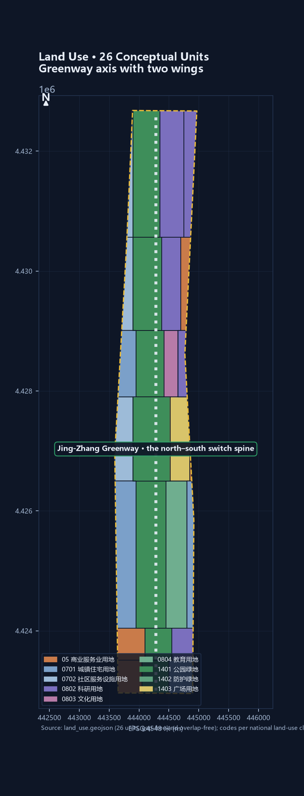
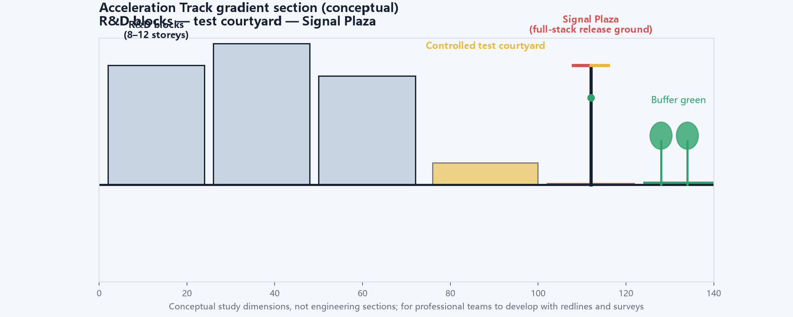
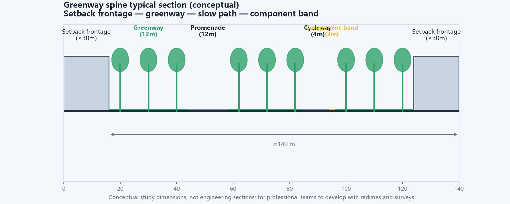
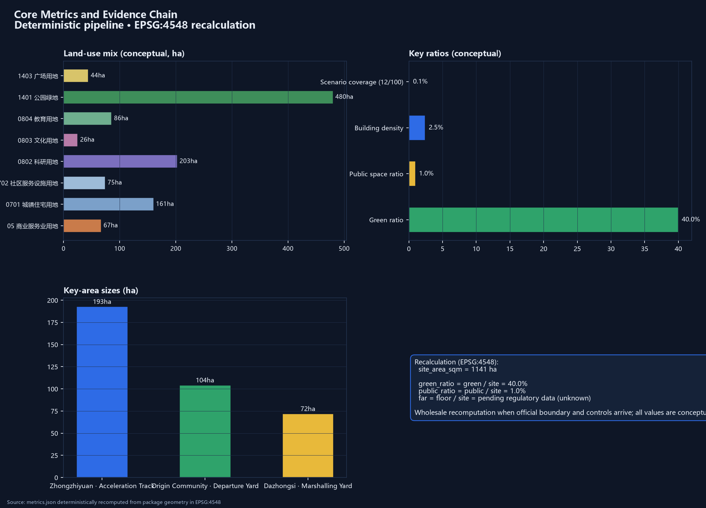

# THE SWITCH — Urban Design for the Centennial Jing-Zhang AI Innovation Belt

In 1909, Zhan Tianyou used a herringbone switchback at Qinglongqiao to carry a train up a steep slope — the moment that defined China's first domestically designed trunk railway. A switch is the device that lets a train change tracks: a seemingly simple turn backed by precise geometry, interlocking, and safety logic. Today, at the inner-city origin of that same railway, another turn is taking place: the Jing-Zhang high-speed corridor runs north, the heritage corridor bends northwest, and the two "tracks" part company inside this site [source:PROVISIONAL-BOUNDARIES]. This scheme reads the Jing-Zhang heritage-park corridor as the city's **SWITCH** — a hub device where technology, talent, capital, and culture change tracks — and names the belt:

> **THE SWITCH — Changing Tracks for the City.**

"Changing tracks" carries four meanings here. Engineering: the switch is the technical memory of the herringbone switchback, the meeting and parting of rails [source:JZ-HERRINGBONE-PAPER]. Industry: the core move of the AI Innovation Belt is switching — research to industry, laboratory to urban scenario, culture to experience — one-to-one with the "converter" function of the three areas and two wings [source:THREE-AREAS-WINGS]. Governance: a switch needs an interlocking system to be safe, mirroring the AI governance mechanisms of "red-light pause, manual takeover, decommissionable" [standard:GENERATIVE-AI-INTERIM-MEASURES]. City: the heritage line is the historic siding and the high-speed corridor is the future main line — the site itself is a switch symbol written on the urban plan.

The spatial structure unfolds as **ONE SWITCH, THREE YARDS, TWO SIDINGS**: the **Switch Heart** (the interchange hub in the middle of the Jing-Zhang park, the public-experience core of the belt); the **Departure Yard** (Beijing AI Origin Community, Kilometer Zero, source and open-source conversion); the **Acceleration Track** (Zhongzhiyuan AI self-innovation acceleration area, full-stack innovation and AI governance); the **Marshalling Yard** (Dazhongsi AI industry cluster, native-AI business formats and interchange marshalling); the **Service Siding** (Zhongguancun technology-services wing, global allocation of factors and capital); and the **Scenario Siding** (Xiaoyuehe scenario-empowerment wing, AI scenarios and a vibrant city). The nine-kilometre spine is also a "switch narrative": marshalling at the south, switching at the heart, acceleration to the north — scenario density, public frontage, and landmark sequence all organize along this "rail" [depth:overall_spatial_structure][data:geometry/land_use.geojson#LU-001].

Quick overview: first, this is a built-up area — the scheme does not re-plan the city but reconnects its broken public frontages and demonstrates renewal at catalyst points [depth:retain_renovate_demolish]; second, the switch symbol fuses history and future, and naming, logo, and signage share one "rail–switch" vocabulary [depth:overall_spatial_structure]; third, twelve AI scenarios are governed by one rail-lexicon state machine — red-light pause, manual takeover, decommissionable [depth:three_key_area_detailed_design]; fourth, 26 land-use units, a c. 9.7 km greenway spine, and 18 metrics come from a deterministic pipeline that can be recomputed wholesale when official data arrives [metric:site_area_sqm]; fifth, the first-phase actions include one full "red-light withdrawal" drill, and four pilgrimage landmarks connect to the commemoration mechanism published with the open call [source:AGENT-TASKBOOK]. **Declarations: this scheme is an open co-creation suggestion generated by an AI agent, based on provisional rough boundaries; all spatial content is conceptual suggestion and reference material for professional teams to develop, and does not constitute a government-approved conclusion. When official redlines and regulatory conditions arrive, all areas, ratios, and positional relations must be recomputed wholesale. This declaration covers the whole document.** [source:PROVISIONAL-BOUNDARIES][depth:risk_missing_data]

## 1. Design Basis and Source List

The task boundaries of this scheme come from the official announcement and the agent-facing open-call taskbook: the announcement defines the three scope levels, the three key areas, and the depth of deliverables; the taskbook defines the six agent tasks, three positionings, and ten co-creation principles [source:OFFICIAL-ANNOUNCEMENT][source:AGENT-TASKBOOK]. Professional judgment follows five national-level regulations and policies: urban design follows the Measures for Urban Design Administration; the "known–pending" boundary follows the Measures for the Compilation and Approval of Regulatory Detailed Plans for Cities and Towns; land-use coding follows the Land and Sea Use Classification Guide for Territorial Spatial Survey, Planning and Use Control; AI-scenario compliance follows the Interim Measures for the Management of Generative Artificial Intelligence Services; and accessibility follows the Law on the Construction of Barrier-Free Environments [standard:MOHURD-URBAN-DESIGN-MEASURES][standard:MOHURD-CONTROL-DETAILED-PLANNING][standard:MNR-LAND-USE-CLASSIFICATION-GUIDE]; AI-scenario compliance follows the Interim Measures for the Management of Generative AI Services, and accessibility follows the Law on the Construction of Barrier-Free Environments [standard:GENERATIVE-AI-INTERIM-MEASURES][standard:BARRIER-FREE-ENVIRONMENT-LAW]. The official text of the architectural design depth regulation is not yet in the repository; this package registers it honestly as a data gap and does not claim architectural design depth [standard:MOHURD-ARCH-DESIGN-DEPTH-2016].

Sources are managed in three tiers throughout: **formal claims rest only on registry-approved sources**; public policies such as the three-areas-two-wings and Haidian's industry system are background material for context and industrial narrative, not for redlines or commitments [source:THREE-AREAS-WINGS][source:HAIDIAN-1X1]; Jing-Zhang railway history and the provisional boundaries serve narrative and conceptual generation only, clearly labelled as background and temporary constraints [source:JZ-HERRINGBONE-PAPER][source:PROVISIONAL-BOUNDARIES]. The complete machine index lives in `sources.json`, `assumptions.json`, and the three matrix files; this narrative keeps only directly relevant evidence anchors [depth:risk_missing_data].

## 2. Three-Level Scope Framework

This scheme follows the announcement's three scope levels: the **Coordinated Research Area** (c. 43.6 km²) answers "industrial strategy and future city", targeting the AI innovation ecosystem, the three-areas-two-wings synergy loop, and future AI city forms; the **Overall Design Area** (c. 11.4 km²) answers "urban renewal and spatial structure", targeting regulatory-plan-level urban design and the "one switch, three yards, two sidings" structure; the **Key Detailed Design Area** (c. 368.4 ha) answers "implementation and deepening", targeting refined design of the three key areas [source:OFFICIAL-ANNOUNCEMENT][depth:three_level_scope_framework].

The data basis of the three scopes is the provisional boundary derived from the announcement's textual four-to descriptions: the overall design area measures c. 11.41 km², consistent with the announced "c. 11.4 km²", but this is not an official redline and cannot serve precise area recalculation or approval [source:PROVISIONAL-BOUNDARIES][metric:site_area_sqm]. The three key areas likewise use provisional rough rectangles (Zhongzhiyuan c. 192.9 ha, Origin Community c. 104.3 ha, Dazhongsi c. 72.0 ha, consistent with announced values); when official polygons arrive, all areas, ratios, and positions in this package will be recomputed wholesale [metric:key_area_area_sqm][data:geometry/key_areas.geojson#PROV-KEY-001]. Any statement involving precise boundaries or statutory controls is marked "pending official data" [assumption:A-BOUNDARY-001].

## 3. Coordinated Research Area: Industry and Future City Research

### 3.1 Overall Concept, Primary Name, and Naming System

The primary name proposed is **"THE SWITCH"** (full name: THE SWITCH, Jing-Zhang AI Innovation Belt / 道岔·京张AI创新带). The logic is threefold: first, the switch is the engineering essence of the herringbone switchback, distilling Zhan Tianyou's turning wisdom into a shareable public symbol [source:JZ-HERRINGBONE-PAPER]; second, SWITCH is common vocabulary in the AI field (model switching, switch decisions) — the Chinese and English names are synonymous and isomorphic, giving natural international communicability [source:DESIGN-CONCEPT-SWITCH]; third, the site itself is a switch — the high-speed corridor and the heritage corridor part company here, and the three areas and two wings read as a marshalling yard, a departure yard, and sidings. The sub-naming system: Switch Heart (岔心, the Jing-Zhang park interchange hub), Departure Yard (始发场, the Origin Community, Kilometer Zero), Acceleration Track (加速轨道, Zhongzhiyuan), Marshalling Yard (编组场, Dazhongsi), Service Siding (东侧线, Zhongguancun technology-services wing), Scenario Siding (西侧线, Xiaoyuehe scenario wing), and Heritage Siding (历史侧线, the Jing-Zhang heritage corridor) [depth:overall_spatial_structure].

Logo direction: two rails meeting tangentially form a switch symbol — two track lines run parallel from afar and split at the heart, a composite of the Chinese character "人" and the letter "Y"; the primary palette is Jing-Zhang steel grey-blue (heritage) with signal three-colours red-yellow-green (governance), accented by AI electric blue (future). The symbol extends into the signage system, scenario icons, and event visuals as one motif, unified with the belt's overall identity and not confused with the cultural identity system [depth:overall_spatial_structure][source:AGENT-TASKBOOK].

### 3.2 Three Positionings, Five Functions, and the Three-Areas-Two-Wings Synergy Loop

The three positionings (centennial Jing-Zhang culture belt, urban AI life experience belt, AI-integrated innovation belt) each find spatial expression in the switch vocabulary: culture = Heritage Siding + Switch Heart narrative; experience = Scenario Siding + Switch Heart public experience; innovation = Service Siding + the three yards as industrial engines [source:THREE-AREAS-WINGS][depth:overall_spatial_structure]. The five functions map onto spatial units: full-stack autonomous innovation → the Acceleration Track; world-class AI innovation ecosystem → the Departure Yard; the AI+ scenario-empowerment paradigm → the Xiaoyuehe Scenario Siding; the intelligent, vibrant AI city → the Switch Heart and public-space network; global voice in AI governance → the signal-interlocking system at Zhongzhiyuan [depth:three_key_area_detailed_design].

The three-areas-two-wings loop runs as "departure–acceleration–marshalling": the Origin Community departs (sources and open source), Zhongzhiyuan accelerates (full-stack innovation and governance), Dazhongsi marshals (native-AI formats and markets), with the Service Siding supplying factors and capital and the Scenario Siding supplying scenarios and experience — a closed loop [source:THREE-AREAS-WINGS][source:AGENT-TASKBOOK]. Public reporting anchors the context: the Haidian AI innovation district covers 53 km² in the south with a "three horizontal, two vertical, one belt" skeleton, gathering 37 universities and 1,300 AI enterprises, and is **pioneering two pilot areas at Wudaokou and Dazhongsi** [source:HD-AI-DISTRICT-PILOTS] — this scheme's Departure Yard (Origin Community) and Dazhongsi Marshalling Yard correspond to the functional direction of these two pilot areas as conceptual deepening rather than starting anew [source:AGENT-TASKBOOK].

### 3.4 Regional Synergy Network: The Master Switch of the National Innovation Rail Network

The switch metaphor extends one step further: **the Jing-Zhang Innovation Belt is not an isolated corridor but the "master switch" of the national innovation rail network** — it joins the innovation rails of two directions [source:THREE-AREAS-WINGS][depth:three_level_scope_framework]. Northbound: the Jing-Zhang high-speed corridor directly links the Beiwei community, Future Science City and Huairou Science City, forming a "basic research – applied research – industrial conversion" gradient, with Zhongzhiyuan as the acceleration track of this gradient; southbound: it forms a closed loop with the E-Town (Yizhuang) economic development zone and Daxing airport economic zone — "R&D in Haidian, manufacturing in Yizhuang" — with the Dazhongsi Marshalling Yard as the interchange point of this loop; westbound: the Jing-Zhang heritage corridor leads to Zhangjiakou and the Winter Olympics legacy, an extension of the century-old railway narrative and a ready-made international story line [source:JZ-HERRINGBONE-PAPER]. The three areas and two wings are therefore not merely an internal loop but an interface device plugged into the national and Beijing–Tianjin–Hebei innovation network: the Origin Community plugs into university sourcing, the Service Siding into Zhongguancun capital and factors, the Scenario Siding into urban scenarios along Xiaoyuehe, and Zhongzhiyuan into science-city compute and facilities [depth:overall_spatial_structure]. This section is a conceptual synergy framework; specific linkage mechanisms await deepening by professional teams and relevant stakeholders.

### 3.5 Planning Innovation: From "FAR Thinking" to the Scenario-Code

This scheme proposes a planning-innovation idea for the AI Innovation Belt — the **"Scenario-Code"**: alongside statutory regulatory indicators (FAR, height, density), introduce "scenario capacity" as an auxiliary urban-design measure that responds to the belt's special character of "scenarios as assets" [source:AGENT-TASKBOOK][depth:development_intensity_controls]. Scenario capacity consists of three components: **scenario density** (AI scenarios per hectare), **openness** (share that is publicly reachable and experiential), and **governance completeness** (coverage of the signal-light state machine and interlocking protocol). Three scenario zones follow the one-switch-three-yards-two-sidings structure: S1 high-openness (Switch Heart and greenway, public experience), S2 medium-openness (Origin and Dazhongsi, industry testing and reserved experience), S3 controlled (Zhongzhiyuan laboratories, research and governance testing) [depth:three_key_area_detailed_design]. Each renewal project states its "scenario capacity" alongside development intensity, steering "scenario-based renewal" rather than mere "building renewal". **Why the Scenario-Code is needed**: conventional regulatory indicators (FAR, height, density) answer "how much floor can be built", but for an AI innovation belt whose asset is scenarios, they cannot answer "how much innovation exchange, test validation and public experience can be carried" — two parcels with identical FAR can differ completely in urban value when one is a closed office block and the other an AI scenario living room open to the public; the Scenario-Code makes this difference explicit as an auxiliary tool [depth:development_intensity_controls]. **Conceptual capacity estimate**: taking the Switch Heart plaza as an example (c. 2.5 ha, S1 zone), with scenario density of 2–3 conceptual scenarios per hectare, openness of 100%, and governance completeness under the full Interlocking Protocol, the conceptual scenario capacity is c. 5–7 — a demonstrative figure to be calibrated by professional teams and measurements [metric:scenario_node_count]. To be clear: the Scenario-Code is a conceptual tool suggestion of this scheme, not a statutory planning indicator; it does not replace regulatory plans or approvals, and is for professional teams and planning authorities to develop further [depth:risk_missing_data][source:MOHURD-CONTROL-DETAILED-PLANNING].

### 3.3 Global AI Innovation Ecosystem Cases

Public figures anchor the industry context: as of 2025-12-31, 748 generative-AI services were registered nationwide, Beijing had 212 registered foundation models and over 2,500 core AI enterprises, with 2025 core industry scale projected at c. RMB 450 billion [source:BJ-AI-INDUSTRY-2026] — a city-wide figure used only as industrial background; the belt's task is to give this densely agglomerated AI industry a public-space spine, with no per-area density or ranking claims [assumption:A-CONTROLS-003]. Six global AI ecosystem cases inform this scheme, cited as background material; their lessons serve mechanism design only, not commitments [source:SOURCE-REGISTRY]:

| Case | Key mechanism | Lesson for the belt |
|------|--------------|---------------------|
| Silicon Valley–Palo Alto corridor, USA | University sourcing + venture capital + fluid engineering culture | Origin Community needs university-adjacent sourcing and low-barrier collaboration space |
| King's Cross, London, UK | Single-body renewal + knowledge cluster + public space first | Switch Heart leads with public space; experience drives industry entry |
| Toronto waterfront (Quayside lesson), Canada | Data-driven planning triggered a trust crisis | Governance needs red-light pause and manual review; privacy first |
| Jurong Innovation District, Singapore | Government platform + test sandbox + open scenarios | Marshalling Yard hosts a data sandbox and test-verification scenarios |
| Hangzhou West City Science & Innovation Corridor, China | Anchor-enterprise traction + town-scale form + scenario pop-ups | Scenario Siding activates frontages with pop-ups |
| Kendall Square, Boston, USA | Life-science density + 24/7 innovation community | Acceleration Track needs full-stack support and round-the-clock services |

These cases show that successful AI ecosystems share a "source–accelerate–marshall" structure, with public space and governance as preconditions — which cross-validates the "one switch, three yards, two sidings" spatial logic [depth:three_key_area_detailed_design][depth:overall_spatial_structure].

## 4. Overall Design Area: Urban Renewal and Regulatory-Plan-Level Urban Design

### 4.1 Spatial Structure: One Switch, Three Yards, Two Sidings

The overall structure is organized by the **Jing-Zhang greenway spine**: a c. 9.7 km slow-traffic greenway runs north–south along the site axis [metric:greenway_length_m], linking the Marshalling Yard (Dazhongsi) at the south, the Switch Heart (the park interchange hub) in the middle, and the Acceleration Track (Zhongzhiyuan) at the north; the Service Siding (toward Xueyuan Road–Zhongguancun) and the Scenario Siding (toward Xiaoyuehe) meet the spine at the Switch Heart, forming a "city on rails" skeleton [data:geometry/roads.geojson#ROAD-001][depth:overall_spatial_structure]. Land use unfolds along the greenway: research land concentrates in the two yards (Zhongzhiyuan and Origin), commercial services in the Marshalling Yard and east of the Switch Heart, residential and community services in the living segments, and parkland forms the north–south greenway body [metric:land_use_area_by_code][data:geometry/land_use.geojson#LU-010].

### 4.2 Overall Urban Renewal Framework

The scheme respects the "built-up city" constraint: the existing building footprint is under c. 17% of the submitted extent (the conceptual footprint of c. 28 ha is only the indicative blocks in the three key areas). The renewal strategy is not demolition-and-rebuild but **reconnecting public frontages and injecting AI catalysts** — about 15 catalyst projects are placed at the Switch Heart, station fronts, and greenway gaps, using public space and scenario experience to drive gradual renewal [depth:retain_renovate_demolish][metric:building_footprint_area_sqm]. Retain–renovate–demolish logic: retention dominates; renovation focuses on frontage buildings along the greenway; demolition and new build appear only at the Switch Heart periphery and catalyst plots in the three key areas — all labelled conceptual, never parcel-level conclusions [assumption:A-CONTROLS-003].

### 4.3 Functional Ratios and the Innovation Indicator System

Conceptual functional ratios (within the submitted boundary): green and open space c. 42% (greenway-led, including parks and plazas), research land c. 18%, residential c. 14%, commercial services c. 6%, community services c. 7%, education c. 7% [metric:land_use_area_by_code]. The innovation indicator system follows the "source–accelerate–marshall" segments: the source segment measures paper conversion, open-source contribution, and start-up density; the accelerate segment measures full-stack enterprise count, compute utilization, and governance mechanisms; the marshall segment measures native-AI formats, open scenarios, and public experience visits; the whole belt measures landmark visits and global communication reach [depth:metrics_recalculation][metric:scenario_node_count]. Statutory controls (FAR, building height, building density, green ratio, setbacks) are not provided in the cleared package and are uniformly registered as pending official data; this package claims no statutory control values [source:MOHURD-CONTROL-DETAILED-PLANNING][metric:floor_area_ratio]. Public information confirms that the draft regulatory detailed plan for the Jing-Zhang railway heritage park corridor (AI innovation district key area) was exhibited from 2024-12-19 to 2025-01-19, with the Haidian branch publishing the adoption notice on 2025-02-08 [source:HD00-1601-CONTROL-PLAN-NOTICE] — this scheme is "aligned but not identical" with the in-progress regulatory plan: the spine follows the same heritage park, but this scheme's naming, structure and scope are its own concepts; all control-related statements will be recomputed when the statutory plan maps are approved and published [assumption:A-CONTROLS-003]. The draft plan's public "one-page guide" shows a spatial structure of "one belt, one axis, two centres, multiple nodes", where the belt is the "Jing-Zhang railway heritage park innovation-exchange belt" and the two centres are Dazhongsi and Wudaokou [source:HD00-1601-DRAFT-GUIDE] — this scheme's Switch Heart and three yards organize along this official "belt", and two key areas coincide with the two centres, deepening the official structure rather than conflicting with it [source:HD00-1601-DRAFT-GUIDE].

## 5. Detailed Design of Key Areas

All three key areas use provisional rough polygons; the following are directional conceptual designs to be recomputed when official boundaries and regulatory conditions arrive [source:PROVISIONAL-BOUNDARIES][data:geometry/key_areas.geojson#PROV-KEY-001].

### 5.1 Zhongzhiyuan AI Acceleration Area (Acceleration Track)

Positioning: carrier of the full-stack autonomous innovation system and global voice in AI governance. Spatial structure: the "Signal Plaza" (AI-governance visualization landmark) anchors the area, with an industrial gradient of "compute R&D – model training – governance laboratory – full-stack accelerator" along the north–south axis [data:geometry/buildings.geojson#BLDG-004][depth:three_key_area_detailed_design].

 Building renewal: retrofitting existing research buildings dominates; new build concentrates in the accelerator blocks, with the conceptual footprint (c. 8 ha) labelled low confidence [metric:building_footprint_area_sqm]. Public space: the Signal Plaza (red-yellow-green paving, AI-governance visualization) and the ecological segment of the northern greenway. AI scenarios: signal-light governance visualization, the Privacy-Shield test field (industry test), and the venue for the international AI governance forum. Implementation risk: complex ownership requires a full ownership-and-building survey before catalyst plots are fixed [assumption:A-CONTROLS-003].

### 5.2 Beijing AI Origin Community (Departure Yard)

Positioning: world-class AI innovation ecosystem and university-adjacent source community. Spatial structure: the "Kilometer Zero Plaza" anchors the community (honouring the Jing-Zhang railway origin narrative), forming a mixed community of "open-source incubation – foundation-model R&D – cultural display – talent apartments" along the greenway [data:geometry/buildings.geojson#BLDG-007][depth:three_key_area_detailed_design]. Building renewal: existing buildings around universities are converted into open-source incubation space; new build concentrates on talent apartments and the community centre, keeping street scale. Public space: Kilometer Zero Plaza (the "departure ceremony" ground for AI start-ups) and the Departure Yard platform (a waiting-room-style exchange space). AI scenarios: start-up departure ceremonies, the Locomotive-Shed AI education laboratory, and the Milestone-Post AI cultural guide. Implementation risk: adjacency to universities and residential areas requires coordinating campus and community interests, with noise and hours managed for public events [assumption:A-SCENARIO-005].

### 5.3 Dazhongsi AI Industry Cluster (Marshalling Yard)

Positioning: interchange of native-AI business formats and urban consumption. Spatial structure: the "Digital Clock Tower" landmark (the marshalling interchange image) anchors the area, forming a mixed quarter of "native-AI commercial experience – AI industry office – business-services complex" at the south end [data:geometry/buildings.geojson#BLDG-011][depth:three_key_area_detailed_design]. Building renewal: commercial buildings convert into native-AI experience halls (AI retail, delivery robots, digital exhibitions); offices and the complex combine new build and retrofit. Public space: the Marshalling Yard station-front plaza and a pocket park at the south gate. AI scenarios: the enterprise data sandbox (industry test), scenario pop-ups on the siding, and AI government-services at the ticket-gate. Implementation risk: a transport and commercial node requires coordinating with rail stations and underground-space management; the concept makes no engineering-feasibility conclusions [source:AGENT-TASKBOOK][assumption:A-SCENARIO-005].

## 6. AI Innovation Ecosystem, Personas, and AI+ Scenarios

### 6.1 User Personas

| Persona | Profile | Core needs | Matching scenarios |
|---------|---------|------------|---------------------|
| AI founder/developer | 24–40, around Zhongguancun and universities | Low-cost launch, open-source collaboration, funding access | Departure ceremony, locomotive-shed lab |
| AI researcher | Faculty and students | Results conversion, compute sharing, academic exchange | Acceleration R&D blocks, origin R&D building |
| Enterprise decision-maker | Industry and investors | Scenario validation, compliance, business talks | Marshalling data sandbox, clock-tower business space |
| Local resident | All ages incl. elderly and families | Daily leisure, age-friendly services, community life | Greenway walking, Switch Heart park, age-friendly AI |
| International visitor / AI pilgrim | Global developers and tourists | Culture, landmarks, international events | Kilometer Zero, Switch monument, SWITCH CON |
| City manager | Government and public agencies | Governance visualization, public participation, global voice | Signal tower, interlocking-protocol mechanisms |

### 6.2 AI Scenario Cards (12)

All scenarios are governed by a rail-lexicon state machine — **green light to run, yellow light to slow (manual sampling), red light to pause (decommissionable)** — each card stating location, users, data boundaries, manual review, and operator [standard:GENERATIVE-AI-INTERIM-MEASURES]. The state machine is formalized as a machine-readable protocol (`visual/assets/switch-protocol.json`): transitions require human sign-off, red never goes directly to green, retirement is terminal, and a red-light withdrawal drill runs quarterly — the city opens interfaces to agents, while humans keep the interrupt right [depth:three_key_area_detailed_design].

**Three public-interest principles** run through all scenarios: **service equivalence** (non-AI users receive equivalent human service), **vulnerable protection** (the elderly, children and disabled are not first-round test subjects), and **red-card review right** (affected-group representatives may initiate a red-light pause) [standard:GENERATIVE-AI-INTERIM-MEASURES][source:AGENT-TASKBOOK].

| # | Scenario card | Location | Users | State machine |
|---|---------------|----------|-------|---------------|
| 1 | Switch Heart Art Plaza: AI real-time rail-light art, public "switch" interaction | Switch Heart plaza | All public | Green + human curation |
| 2 | Signal Light AI-governance visualization: three-colour status lights for city AI operations | Signal Plaza, Zhongzhiyuan | Managers/public | Green + public data |
| 3 | Timetable AI mobility dispatch: event-day transit, slow-traffic routing, accessible paths | Whole greenway | Residents/visitors | Green + human plan |
| 4 | **Switchman's Hut manual-takeover test field** (industry test): AI safety-barrier stress tests, red-light drills | Zhongzhiyuan lab | Enterprises/regulators | Red-light drill core |
| 5 | **Marshalling data sandbox** (industry test): de-identified data compliance training, sandbox isolation | Dazhongsi business block | Enterprises | Yellow + audit |
| 6 | Departure ceremony for start-ups: AI-assisted business-plan review, rail-style "departure" | Kilometer Zero Plaza | Founders | Green + expert review |
| 7 | Milestone-Post AI cultural guide: AR guide to Jing-Zhang railway history, milestone check-ins | Heritage siding/greenway | Public/tourists | Green + content review |
| 8 | Locomotive-Shed AI education laboratory: school AI courses and open-source workshops | Origin Community | Students/teachers | Green + teacher present |
| 9 | Siding scenario pop-ups: monthly native-AI pop-ups (unmanned retail, robot delivery pilots) | Scenario Siding | Public/enterprises | Yellow + time-limited permit |
| 10 | Ticket-Gate AI government services: intelligent pre-review and booking of public services | Dazhongsi/community stations | Residents | Yellow + human final review |
| 11 | **Tunnel Privacy-Shield test field** (industry test): federated learning and privacy-computing validation | Zhongzhiyuan | Enterprises/researchers | Red + independent audit |
| 12 | Terminal AI Hall of Honour: developer honour display and pilgrimage landmark | Switch Heart/north greenway | Global developers | Green + selection mechanism |

Scenarios 4, 5, and 11 are industry test/validation scenarios (three), meeting the taskbook requirement of at least three; scenarios 1, 7, and 12 carry pilgrimage and honour-display functions [source:AGENT-TASKBOOK][depth:three_key_area_detailed_design].

**Scenario–space–operation mapping** (agent.3 complete matrix): all 12 scenario cards map to spatial layers, operators, data boundaries, manual review and exit paths; the machine-readable version lives in `visual/assets/switch-protocol.json`; the three scenario zones map onto the one-switch-three-yards-two-sidings layout — S1 high-openness (Switch Heart/greenway: SW-01/02/03/07/12), S2 medium-openness (Origin/Dazhongsi: SW-05/06/08/09/10), S3 controlled (Zhongzhiyuan laboratories: SW-04/11) [source:AGENT-TASKBOOK][depth:three_key_area_detailed_design]. Each industry test scenario carries an **eleven-field pilot card** (baseline, pilot window and sample, minimum success threshold, stop threshold, on-site responsible person, human equivalent service, data deletion proof, review period, beneficiary or risk-bearing group, resources and permits, appeal and accountability path); thresholds are frozen from measured baselines before pilots, and this package fabricates no values [source:DESIGN-CONCEPT-SWITCH][depth:phasing_implementation]: the Switchman's Hut manual-takeover test field takes "drill completed with zero manual-takeover incidents" as its minimum success criterion; the Marshalling data sandbox takes "de-identified compliance training passed independent audit"; the Tunnel Privacy-Shield test field takes "privacy-computing validation passed independent audit with no data leakage".

## 7. Land Use, Building Scale, and Retain-Renovate-Demolish Strategy

Land use unfolds around the greenway axis with two wings: 26 conceptual land-use units fully cover the submitted boundary with no gaps or overlaps [data:geometry/land_use.geojson#LU-001][metric:land_use_area_by_code]. Green and open space totals c. 480 ha (parks c. 456 ha, plazas c. 44 ha), forming the greenway body; research land c. 203 ha concentrates in Zhongzhiyuan and the Origin Community; residential c. 161 ha lies in living segments; commercial services c. 67 ha centre on Dazhongsi and east of the Switch Heart [metric:land_use_area_by_code]. The conceptual building footprint of c. 28 ha concentrates in the three key areas, all labelled low-confidence conceptual quantities, not statutory scale [metric:building_footprint_area_sqm][assumption:A-CONTROLS-003]. Retain–renovate–demolish follows "retain as the main body, renovate frontages, new-build catalysts", with no parcel-level conclusions [depth:retain_renovate_demolish]. This principle has explicit policy backing: the Beijing Urban Renewal Regulation establishes "retain, renovate and demolish in parallel, with retention and reuse upgrading as the priority" [source:BJ-RENEWAL-REGULATION]; the MOHURD notice on preventing mass demolition (Jianke [2021] No. 63) requires demolition area not to exceed 20% of existing gross floor area and a demolition-to-construction ratio no greater than 2 [source:MOHURD-63-NO-MASS-DEMOLITION] — this scheme's conceptual building footprint of c. 2.5% of the submitted extent is far below the 20% red line, aligned with policy direction [metric:building_footprint_area_sqm][source:MOHURD-63-NO-MASS-DEMOLITION]. Statutory values such as FAR and height await official regulatory data [metric:floor_area_ratio][source:MOHURD-CONTROL-DETAILED-PLANNING].

## 8. Transport, Rail, Municipal Infrastructure, and Public Services

The transport skeleton is "one spine, six branches": the greenway spine of c. 6 km (core of the 9.7 km conceptual skeleton) runs north–south [data:geometry/roads.geojson#ROAD-001][metric:greenway_length_m]; six cross branches link the two wings and rail stations [data:geometry/roads.geojson#ROAD-002]; station connections follow "rail + slow traffic + low-speed shuttle", dispatched by the Timetable scenario on event days.

Accessibility follows the Law on the Construction of Barrier-Free Environments; the whole greenway considers wheelchairs and strollers [standard:BARRIER-FREE-ENVIRONMENT-LAW]. Municipal and new infrastructure: edge-computing nodes along the greenway (integrated into lampposts and kiosks), distributed energy with smart streetlights, and utility retrofits synchronized with public-space renewal; capacity calculations await professional assessment [depth:municipal_new_infrastructure][assumption:A-CONTROLS-003]. Public services configure as "three yards + Switch Heart": a visitor centre at the Switch Heart, community centre at the Origin, business-service centre at Dazhongsi, and industry-service building at Zhongzhiyuan, forming a 15-minute innovation-service circle [depth:municipal_new_infrastructure][data:geometry/buildings.geojson#BLDG-015].

## 9. Blue-Green Network, Public Space, and Urban Character

The blue-green network takes the Jing-Zhang conceptual greenway as its skeleton: a three-segment greenway (south vitality segment, Switch Heart central park, north ecological segment) of c. 456 ha [data:geometry/green_space.geojson#GREEN-001][metric:green_ratio], linking the Qinghe and Xiaoyuehe blue-green systems (the Xiaoyuehe indicative line is in the constraints layer; the precise blue line awaits official data) [data:geometry/constraints.geojson#CON-002]. Official reporting anchors the narrative: the second phase of the Jing-Zhang railway heritage public-space renewal opened on 2026-08-06, linking Xizhimen to the North Fifth Ring Road as a 9 km cultural green corridor with c. 53 ha total land, split into a south community-vitality segment and a north nature-leisure segment, with a "three paths, one green" slow-traffic system [source:JZ-PARK-PHASE2-OPEN-2026] — the scheme's conceptual greenway unfolds in the same direction; the package's conceptual spine length (c. 9.7 km, recomputed within the provisional boundary) and the official full-line figure (9 km) are registered side by side, not conflated [metric:greenway_length_m]. The park's construction history validates the "light-touch intervention" strategy: phase 1 (Zhichun Road to Qinghua East Road, c. 2.5 km) opened in June 2023, retaining original rails and a recreated locomotive turntable under a "minimal intervention" principle [source:JZ-PARK-PHASE1] — this scheme's greenway node activation and component insertion continue that principle [source:JZ-PARK-PHASE1]. The public-space system is "1+3+N": one Switch Heart switch plaza (the belt-wide public-experience core), three station-front plazas (Departure, Marshalling, Signal) [data:geometry/public_space.geojson#PUBLIC-002], and N pocket parks and slow-traffic stations along the route [depth:blue_green_public_space].

**SWITCH public-space component library (agent.4, 8 pieces)**: ① Rail Bench — seat modules made from rail sections, echoing railway memory; ② Signal Bollard — red-yellow-green status indication with edge-compute lamppost integration; ③ Milestone Post — heritage narrative and AR check-in terminal; ④ Switch Paving — parting-track ground pattern for the Switch Heart plaza; ⑤ Platform Canopy — waiting-room-style exchange space; ⑥ Honour Panel Module — updatable developer inscription units; ⑦ Switch Lever Interaction — public-operable "switch" interaction; ⑧ Interlock Screen — transparent display of scenario operating status and the red-card mechanism [source:AGENT-TASKBOOK][depth:three_key_area_detailed_design]. The component library is fully conceptual: standardizable, combinable and removable, for professional teams to develop into a component atlas [source:DESIGN-CONCEPT-SWITCH].

**AI pilgrimage landmarks (4) and the honour-display system**: ① Switch Monument at the Heart — a memorial structure where two rails meet, inscribed "1909 switch up the slope, 2026 switch directions" [data:geometry/public_space.geojson#PUBLIC-002]; ② Kilometer Zero Post at the Departure Yard — the "departure" origin for AI start-ups, echoing the railway mileage narrative [depth:three_key_area_detailed_design]; ③ Digital Clock Tower at the Marshalling Yard — digital expression of interchange and time; ④ Signal Tower at Zhongzhiyuan — a skyline landmark for AI-governance visualization. The honour-display system sets a "Developer Wall of Honour" along the greenway, connecting to the commemoration mechanism published with the open call; selected contributors and schemes may be inscribed through due procedure; all landmarks are conceptual suggestions for professional teams [source:AGENT-TASKBOOK][depth:three_key_area_detailed_design].

**Pilgrimage Line**: the four landmarks link along the heritage siding and the greenway spine into one complete **pilgrimage line** — Signal Tower (Zhongzhiyuan) → Switch Monument (Switch Heart) → Kilometer Zero (Origin Community) → Digital Clock Tower (Dazhongsi) — coinciding with the Jing-Zhang heritage corridor and answering the goal of a "global AI industry highland and pilgrimage destination" [source:AGENT-TASKBOOK][depth:overall_spatial_structure]. The line carries a "developer digital passport" (check-ins, badges, contribution points) linked with the SWITCHMAN Program and SWITCH CON, forming a closed loop of "physical space – digital identity – honour display" [source:DESIGN-CONCEPT-SWITCH][depth:phasing_implementation]. The pilgrimage line and its supporting system are conceptual suggestions for professional teams and operators to develop.

Urban character uses "rail–switch" as the motif: building massing rises south to north along the greenway (low-rise commerce at the Marshalling Yard → public buildings at the Switch Heart → industrial blocks at the Acceleration Track); the character palette is steel grey-blue with signal three-colour accents; roofs and facades encourage "rail-line" detailing. Character controls are conceptual; statutory heights await regulatory confirmation [source:MOHURD-URBAN-DESIGN-MEASURES][assumption:A-CONTROLS-003].

## 10. Renewal Projects, Implementation Policy, and Phasing

Renewal project list (12 items, conceptual): ① Switch Heart plaza and central park; ② Marshalling station-front plaza and native-AI experience-hall retrofit; ③ Kilometer Zero Plaza and open-source incubation retrofit; ④ Signal Plaza and governance-laboratory new build; ⑤ south vitality greenway link-up; ⑥ north ecological greenway link-up; ⑦ talent apartments new build; ⑧ Dazhongsi business-services complex retrofit; ⑨ Locomotive-Shed education laboratory; ⑩ Developer Wall of Honour; ⑪ Heritage Siding AR guide system; ⑫ station connections and slow-traffic gap repair [data:geometry/phasing.geojson#PHASE-001][depth:renewal_project_list]. Implementation policy suggestions: scenario-open licensing (interlocking protocol), developer-community co-building, public-space first, data-sandbox pilots, and international event application — all policy-mechanism suggestions, not government commitments [source:AGENT-TASKBOOK][assumption:A-SCENARIO-005].

Phasing: **near term (1–2 years)** south segment — Switch Heart park and Dazhongsi scenario activation (scenarios 1/5/9 first) [data:geometry/phasing.geojson#PHASE-001]; **mid term (3–5 years)** middle segment — Origin Community and greenway link-up (scenarios 2/3/6/7/8) [data:geometry/phasing.geojson#PHASE-002]; **long term (6–10 years)** north segment — the Zhongzhiyuan full-stack acceleration area takes shape (scenarios 4/11/12) [data:geometry/phasing.geojson#PHASE-003][depth:phasing_implementation].

### 10.1 Renewal Implementation Ledger (conceptual)

| # | Project | Location | Conceptual scale | Dependencies | Suggested operator | Policy tools (suggested) | Near-term action | Acceptance criterion (conceptual) |
|---|---------|----------|------------------|--------------|--------------------|--------------------------|------------------|-----------------------------------|
| 1 | Switch Heart plaza & central park | Switch Heart band [data:geometry/public_space.geojson#PUBLIC-002] | c. 2.5 ha | Park open space & existing greening | District greening bureau + operator | Public-space renewal, scenario-open permit | Curation & public workshop | Open operation + first public event |
| 2 | Marshalling station plaza & native-AI experience hall retrofit | Dazhongsi band [data:geometry/buildings.geojson#BLDG-011] | c. 0.6 ha footprint | Existing building survey & ownership | Commercial operator + subdistrict | Stock renewal, format guidance | Building survey & feasibility study | Ground floor open + trial operation |
| 3 | Kilometer Zero Plaza & open-source incubation retrofit | Origin Community [data:geometry/buildings.geojson#BLDG-007] | c. 0.5 ha footprint | Campus-adjacent building ownership & leasing | Community operator + university | Urban-renewal regulation framework, talent-housing policy | Campus-community MOU | First departure ceremony + incubation move-in |
| 4 | Signal Plaza & governance laboratory new build | Zhongzhiyuan [data:geometry/buildings.geojson#BLDG-004] | c. 0.6 ha footprint | Park ownership & planning conditions | Park entity + governance body | Industrial land assurance, research facility support | Ownership & planning verification | Plaza open + lab inauguration |
| 5 | South vitality greenway link-up | South greenway [data:geometry/green_space.geojson#GREEN-001] | c. 150 ha | Existing section & obstacle survey | District greening bureau | Greenway construction, accessibility retrofit | Section survey & design competition | Full pedestrian connectivity |
| 6 | North ecological greenway link-up | North greenway [data:geometry/green_space.geojson#GREEN-003] | c. 180 ha | Ecology & flood requirements | Greening bureau + water authority | Blue-green integration, habitat protection | Ecological baseline survey | Ecological segment open + monitoring |
| 7 | Origin talent apartments new build | East of Origin [data:geometry/buildings.geojson#BLDG-009] | c. 1.5 ha footprint | Land ownership & regulatory conditions | State platform + operator | Affordable rental housing policy | Land-condition verification | First phase in service |
| 8 | Dazhongsi business-services complex retrofit | Dazhongsi band [data:geometry/buildings.geojson#BLDG-013] | c. 1.2 ha footprint | Existing buildings & district traffic | Commercial operator | Stock renewal, district upgrade | Retrofit scheme & pre-marketing | Retrofit complete + occupancy |
| 9 | Locomotive-Shed education laboratory | Origin Community [data:geometry/buildings.geojson#BLDG-008] | c. 0.3 ha footprint | Education partnership & curriculum | Education body + schools | Science-education support | Curriculum pilot | First courses delivered |
| 10 | Developer Wall of Honour | Along greenway [data:geometry/phasing.geojson#PHASE-002] | Linear installation | Commemoration mechanism publication | Operator + selection committee | Honour mechanism, open-call linkage | Mechanism design | First inscription complete |
| 11 | Heritage Siding AR guide | Heritage siding corridor | Full line | Heritage material clearance & AR vendor | Heritage body + tech partner | Cultural-heritage digitalization | Content clearance & prototype | First route live |
| 12 | Station connections & slow-traffic gap repair | Whole belt [data:geometry/roads.geojson#ROAD-002] | c. connection lines | Station interfaces & traffic organization | Transport authority + operator | Station-city integration, slow-traffic priority | Gap inventory & scheme design | First gaps repaired |

This ledger is a conceptual implementation framework: operators, policies and acceptance criteria are suggested directions for professional teams and authorities to develop, not project approvals, investment or permit arrangements [source:AGENT-TASKBOOK][assumption:A-SCENARIO-005].

### 10.2 First-Phase Actions (conceptual)

**"Action Zero · Switch Ceremony"**: starting at the Switch Heart plaza, open a 100 m demonstration segment — greenway section retrofit, Switch Monument installation, first public "switch" interaction, and one **full red-light withdrawal drill** (trigger a red card on the signal-light visualization scenario, execute manual takeover, publish the review) to demonstrate the governance promise that "AI can pause, withdraw and be taken over by humans" [source:DESIGN-CONCEPT-SWITCH][depth:phasing_implementation]. Three pilot scenarios open first: SW-01 Switch Heart Art Plaza (public experience), SW-05 Marshalling data sandbox (industry test), SW-09 siding pop-ups (time-limited operation), completing the application–review–pilot–evaluation loop under the Interlocking Protocol [standard:GENERATIVE-AI-INTERIM-MEASURES].

### 10.3 Alignment with Completed Works

The second phase of the Jing-Zhang railway heritage public-space renewal opened on 2026-08-06, linking Xizhimen to the North Fifth Ring Road as a 9 km cultural green corridor [source:JZ-PARK-PHASE2-OPEN-2026]. This scheme builds **incrementally on the completed base**: greenway slow-traffic and accessibility retrofits, node activation at the Switch Heart and station plazas, and lightweight scenario installations follow the principle of "no damage to the completed public space; light-touch intervention first"; any change involving existing works requires professional assessment and due procedures with the competent authorities [source:JZ-PARK-PHASE2-OPEN-2026][assumption:A-CONTROLS-003].

**Global AI event system and long-term operation** (agent.6): the flagship annual event **SWITCH CON** (global developer annual meeting + scenario open day + AI governance forum); a four-season event system — Spring Departure Festival (start-up roadshows), Summer Signal-Light Festival (governance and safety week), Autumn Marshalling Festival (industry matching and sandbox opening), Winter Kilometer-Zero Festival (year-end honours and commemoration) [depth:phasing_implementation]. Developer-community operation: the "SWITCHMAN PROGRAM" — tiered developer certification, open-source contribution points, linked to landmark honour display [source:AGENT-TASKBOOK]. Scenario-open operation: the "Interlocking Protocol" — scenarios must pass signal-light review before launch and can be red-light withdrawn, protecting public trust [standard:GENERATIVE-AI-INTERIM-MEASURES]. International communication and conversion: an annual "Switch Manifesto", a developer pilgrimage route, and international media partnerships; the conversion path is "scenario experience → community join → enterprise landing → honour display" in four stages. All events and mechanisms are conceptual suggestions [assumption:A-SCENARIO-005][depth:phasing_implementation].

## 11. Metrics, Area Recalculation, and Compliance Matrix

The design meaning of core metrics: the green ratio of c. 40% (conceptual) supports quality of life for talent and residents, the spatial base of the "urban AI life experience belt" [metric:green_ratio]; the public-space ratio of c. 1% (conceptual, node-based) emphasizes "few but fine" nodal catalysts, with the Switch Heart and station plazas carrying exchange and ceremony [depth:metrics_recalculation]; research land of c. 18% supports "source–accelerate" industrial supply, directly answering the full-stack innovation function [metric:land_use_area_by_code]; the building footprint of c. 28 ha is indicative only, answering the "catalyst renewal rather than demolition-and-rebuild" implementation logic [metric:building_footprint_area_sqm].

Recalculation method: all metrics are computed deterministically from this package's GeoJSON in EPSG:4548, with formulas, sources, and confidence registered in metrics.json [metric:site_area_sqm][depth:metrics_recalculation]. Compliance coverage: announcement tasks (sections 1.3–1.5) and agent tasks (agent.1–6) are all registered in the compliance matrix; professional standards in the standard matrix; design depth in the design-depth matrix [source:AGENT-TASKBOOK][depth:metrics_recalculation].

## 12. Risk, Copyright, and Compliance

Data legality: all evidence comes from public or cleared sources, registered in sources.json; Jing-Zhang railway history and global cases are background material that does not support planning-control conclusions [source:SOURCE-REGISTRY].

**Risk matrix (conceptual, risk + mitigation per item)**: ① Data-privacy risk — scenarios do not rely on personal data; test scenarios are confined to de-identified data and sandboxes; mitigation: data minimization + independent audit [standard:GENERATIVE-AI-INTERIM-MEASURES]; ② Heritage risk — Jing-Zhang heritage line and historic stations; mitigation: heritage avoidance + historical-material clearance [source:AGENT-TASKBOOK]; ③ Ownership and implementation risk — complex ownership in a built-up area; mitigation: ownership survey first + light-touch intervention [assumption:A-CONTROLS-003]; ④ Public-trust risk — AI scenarios may raise concerns; mitigation: red-card mechanism + quarterly drills + public reviews [source:DESIGN-CONCEPT-SWITCH]; ⑤ Engineering-feasibility risk — no conclusions on bridges, tunnels, underground space or municipal capacity; all registered pending professional assessment [depth:risk_missing_data]; ⑥ Compliance-boundary risk — concepts must not be presented as government decisions; mitigation: unified declaration across the document + copyright statement [source:AGENT-TASKBOOK]. Copyright: the logo, naming, and scenario system are original concepts generated by this agent, licensed CC-BY-4.0; no unauthorized fonts, images, trademarks, portraits, or corporate identifiers are used [source:DESIGN-CONCEPT-SWITCH]. Privacy: AI scenarios do not rely on non-public data or personal privacy; industry-test scenarios are confined to sandboxes and de-identified data [standard:GENERATIVE-AI-INTERIM-MEASURES]. AI-generation responsibility: this scheme is generated by an AI agent; geometry and metrics are recomputable through a deterministic pipeline; all spatial content is conceptual [assumption:A-BOUNDARY-001]. Until official boundaries and regulatory conditions arrive, this package claims no statutory effect; the pending-data list and recalculation triggers are in assumptions.json and the copyright statement [depth:risk_missing_data]. **Recalculation-diff commitment**: whenever official redlines, regulatory plan maps or existing-condition baselines arrive, this package will be recomputed wholesale through the deterministic pipeline, with a public "diff table" in changelog.md recording before/after values and affected layers so that every area, ratio and positional change stays traceable [source:DESIGN-CONCEPT-SWITCH][depth:metrics_recalculation]. **The full copyright and compliance statement is in `report/copyright_statement.md`.**

## 13. References

1. Pre-qualification Announcement for the International Urban Design Open Call for the Centennial Jing-Zhang AI Innovation Belt, Haidian Branch of Beijing Municipal Commission of Planning and Natural Resources, 2026-05-09, https://ghzrzyw.beijing.gov.cn/zhengwuxinxi/tzgg/hd/202605/t20260509_4643047.html
2. Excerpt of the Agent-Facing Open-Call Taskbook for the Centennial Jing-Zhang AI Innovation Belt Urban Design Open Call, user-provided cleared material, 2026-05-18
3. "'Three Areas, Two Wings' to Build a World-Class AI Hub", Beijing Municipal Science and Technology Commission & Zhongguancun Administrative Committee, 2026-04-03, https://kw.beijing.gov.cn/xwdt/kcyx/xwdtcyfz/202604/t20260403_4573808.html
4. "Haidian District Releases the '1+X+1' Modern Industrial System Layout", Haidian District People's Government, 2026-03-02, https://www.bjhd.gov.cn/ztzx/2026/2026jjshgzlfzdh/yw/202603/t20260303_4806875.shtml
5. Measures for Urban Design Administration, Ministry of Housing and Urban-Rural Development, 2017-03-14, https://www.mohurd.gov.cn/gongkai/zc/wjk/art/2023/art_17339_775476.html
6. Measures for the Compilation and Approval of Regulatory Detailed Plans for Cities and Towns, Ministry of Housing and Urban-Rural Development, https://www.gov.cn/zhengce/2022-01/25/content_5711967.htm
7. Land and Sea Use Classification Guide for Territorial Spatial Survey, Planning and Use Control, Ministry of Natural Resources, 2023-11-22, https://www.gov.cn/zhengce/zhengceku/202311/content_6917279.htm
8. Interim Measures for the Management of Generative Artificial Intelligence Services, Cyberspace Administration of China et al., 2023-07, https://www.cac.gov.cn/
9. Law on the Construction of Barrier-Free Environments, Standing Committee of the National People's Congress, 2023-06-28
10. Historical material on the herringbone switchback at Qinglongqiao, Jing-Zhang Railway, public Chinese-railway sources

The complete machine index is in `sources.json` and the three matrix files [source:SOURCE-REGISTRY][depth:metrics_recalculation].
