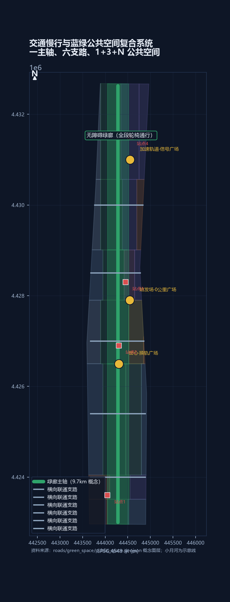
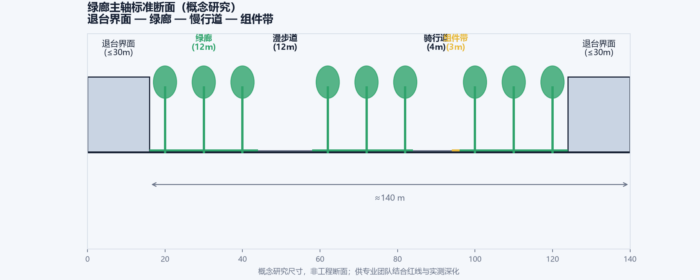
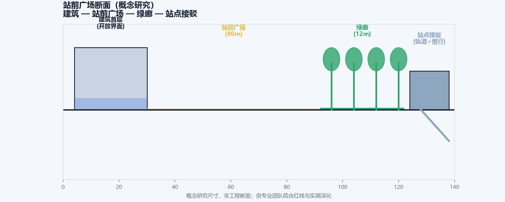
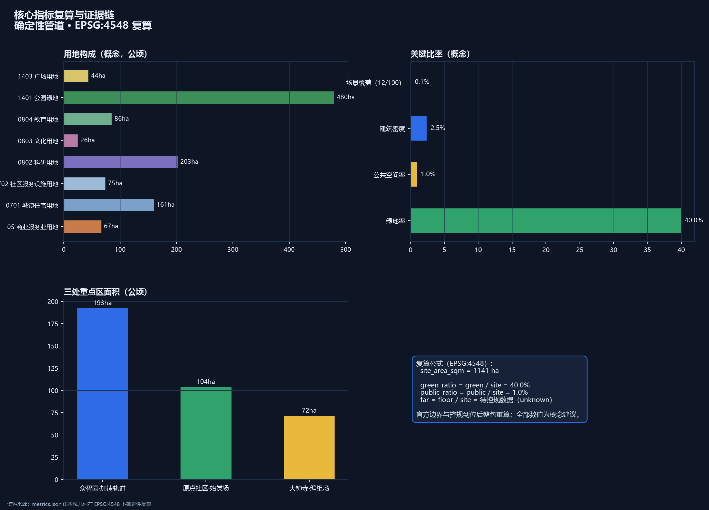

# 道岔·SWITCH——百年京张AI创新带城市设计方案

1909年，詹天佑在青龙桥用"人"字形展线，让火车在陡坡上完成一次著名的"换轨"——这是中国自主设计干线铁路的智慧原点。道岔，是铁路系统里让列车换轨的装置：看似一次简单的转向，背后是精确的几何、联锁与安全逻辑。今天，在这条铁路的城内起点，另一个转向正在发生：京张高铁走廊向北，京张故线走廊折向西北，两条"轨道"在场地内分道[source:PROVISIONAL-BOUNDARIES]。本方案把京张遗址公园走廊读作城市的**道岔**——一个让"技术、人才、资本、文化"换轨转向的枢纽装置，并把整条创新带命名为：

> **道岔·SWITCH——为城市换轨。**

"换轨"在本方案中有四层含义。工程层：道岔是人字形展线的工程记忆，是钢轨的交汇与分向[source:JZ-HERRINGBONE-PAPER]。产业层：AI 创新带的核心动作是换轨——从科研换轨到产业、从实验室换轨到城市场景、从文化换轨到体验消费，这与三区两翼的"转换器"功能一一对应[source:THREE-AREAS-WINGS]。治理层：道岔需要联锁系统保证安全，对应 AI 治理的"红牌暂停、人工接管、可退役"机制[standard:GENERATIVE-AI-INTERIM-MEASURES]。城市层：京张故线是历史侧线，高铁走廊是未来主线，场地本身就是一个写在城市平面上的道岔符号。

空间结构由此展开为**一岔、三场、两翼**：**岔心**（京张遗址公园中段的换轨枢纽，全带公共体验核心）；**始发场**（北京AI原点社区，0公里桩，策源与开源转化）；**加速轨道**（众智园AI自主创新加速区，全栈创新与AI治理）；**编组场**（大钟寺AI产业集聚区，智能原生业态与交会编组）；**东侧线**（中关村科技服务翼，要素全球化配置与资本赋能）；**西侧线**（小月河场景赋能翼，AI场景与活力城市）。9公里主脊同时是一部"换轨叙事"：南起编组场是交会，中段岔心是换轨，北抵加速轨道是加速——场景密度、公共界面与地标序列都沿这条"钢轨"组织[depth:overall_spatial_structure][data:geometry/land_use.geojson#LU-001]。

方案速览：一，这是一片已建成的城区，本方案不重新规划这座城市，只为它接通断裂的公共界面，并在触媒点上示范更新的做法[depth:retain_renovate_demolish]；二，道岔符号双关历史与未来，命名、Logo、导视共用一套"钢轨—道岔"语汇[depth:overall_spatial_structure]；三，12个AI场景由铁路语汇状态机统一治理，红牌暂停、人工接管、可退役[depth:three_key_area_detailed_design]；四，26个用地单元、约9.7公里绿廊主轴与18项指标由确定性管道生成，官方数据到位即可整包重算[metric:site_area_sqm]；五，首开行动含一次完整的"红牌撤回"演练，4处朝圣地标对接征集活动公布的纪念机制[source:AGENT-TASKBOOK]。**统一声明：本方案为AI生成的开放共创建议，基于临时粗略边界，全部空间内容均为概念建议、参考方案，供专业团队深化研究，不构成政府审定结论；官方红线与控规条件到位后，全部面积、比例与位置关系须整体重算。本声明覆盖全文。**[source:PROVISIONAL-BOUNDARIES][depth:risk_missing_data]

## 一、设计依据与资料清单

本方案的任务边界来自征集公告与面向全球智能体的开源征集任务书：公告界定三层范围、三处重点区与成果深度，任务书界定六项智能体任务、三大定位与十条共创原则[source:OFFICIAL-ANNOUNCEMENT][source:AGENT-TASKBOOK]。专业判断依据五部国家层面规范与政策：城市设计统筹遵循《城市设计管理办法》，"已知—待定"边界遵循《城市、镇控制性详细规划编制审批办法》，用地编码采用《国土空间调查、规划、用途管制用地用海分类指南》，AI 场景合规遵循《生成式人工智能服务管理暂行办法》，公共空间无障碍遵循《无障碍环境建设法》[standard:MOHURD-URBAN-DESIGN-MEASURES][standard:MOHURD-CONTROL-DETAILED-PLANNING][standard:MNR-LAND-USE-CLASSIFICATION-GUIDE]；AI 场景合规遵循《生成式人工智能服务管理暂行办法》，公共空间无障碍遵循《无障碍环境建设法》[standard:GENERATIVE-AI-INTERIM-MEASURES][standard:BARRIER-FREE-ENVIRONMENT-LAW]。建筑设计深度规定正式文本尚未入库，本包如实登记为资料缺口，不宣称满足建筑设计深度[standard:MOHURD-ARCH-DESIGN-DEPTH-2016]。

资料分三类管理，这条纪律贯穿全文：**正式论据只取自登记表批准的来源**；三区两翼、海淀产业体系等公开政策属于背景资料，承担语境与产业叙事，不支撑红线或承诺性结论[source:THREE-AREAS-WINGS][source:HAIDIAN-1X1]；京张铁路历史资料与临时边界只用于叙事与概念生成，明确标注为背景与临时约束[source:JZ-HERRINGBONE-PAPER][source:PROVISIONAL-BOUNDARIES]。完整机器索引以 `sources.json`、`assumptions.json` 与三份矩阵文件为准，本正文只保留直接相关的证据锚点[depth:risk_missing_data]。

## 二、三层范围工作框架

本方案按公告的三层范围逐级落实：**统筹研究范围**（约43.6平方公里）回答"产业战略与未来城市"问题，工作目标是 AI 创新生态体系、三区两翼协同回路与未来 AI 城市形态研究；**总体设计范围**（约11.4平方公里）回答"城市更新与空间结构"问题，工作目标是控规深度城市设计，形成"一岔三场两翼"总体结构；**重点区域范围**（约368.4公顷）回答"落地与深化"问题，工作目标是对三处重点区开展精细化设计[source:OFFICIAL-ANNOUNCEMENT][depth:three_level_scope_framework]。

三层范围的数据基础是公告文字四至派生的临时粗略边界：总体设计范围约11.41平方公里，与公告"约11.4平方公里"一致，但这不是官方红线，不能用于精确面积复算或审批依据[source:PROVISIONAL-BOUNDARIES][metric:site_area_sqm]。三处重点区同样使用临时粗略矩形（众智园约192.9公顷、原点社区约104.3公顷、大钟寺约72.0公顷，与公告公布面积一致），官方多边形到位后，本包全部面积、比例与位置关系将整包重算[metric:key_area_area_sqm][data:geometry/key_areas.geojson#PROV-KEY-001]。任何涉及精确边界与法定控制的表述，都以"待正式数据补齐"处理[assumption:A-BOUNDARY-001]。

## 三、统筹研究范围产业与未来城市研究

### 3.1 总体概念、主名称与命名体系

主名称建议为**"道岔·SWITCH"**（全称：道岔·京张AI创新带 / THE SWITCH, Jing-Zhang AI Innovation Belt）。命名逻辑有三重：其一，道岔是京张铁路"人字形"展线的工程本质，把詹天佑的转向智慧提炼为可传播的公共符号[source:JZ-HERRINGBONE-PAPER]；其二，SWITCH 是 AI 领域的通用语汇（模型切换、开关决策），中英文同义同构，天然具备国际传播力[source:DESIGN-CONCEPT-SWITCH]；其三，场地自身就是道岔——高铁走廊与故线走廊在此分道，三区两翼如同编组场、始发场与侧线。子命名体系：岔心（SWITCH HEART，京张公园换轨枢纽）、始发场（DEPARTURE YARD，原点社区，0公里桩）、加速轨道（ACCELERATION TRACK，众智园）、编组场（MARSHALLING YARD，大钟寺）、东侧线（SERVICE SIDING，中关村科技服务翼）、西侧线（SCENARIO SIDING，小月河场景赋能翼）、历史侧线（HERITAGE SIDING，京张故线走廊）[depth:overall_spatial_structure]。

Logo 方向：以两条钢轨相切构成"道岔"符号——两段轨线从远处平行而来，在岔心处一分而二，形似"人"字与"Y"字的复合；主色为京张钢轨灰蓝（历史）与信号灯三色（红黄绿，治理），点缀 AI 电光蓝（未来）。该符号可延展为导视系统、场景图标与活动视觉的母题，与一带整体标识系统统一、不与文化标识系统混淆[depth:overall_spatial_structure][source:AGENT-TASKBOOK]。

### 3.2 三大定位、五大功能与三区两翼协同回路

三大定位（百年京张文化带、都市AI生活体验带、AI融合创新带）在道岔语汇下各有空间落位：文化带=历史侧线+岔心叙事，体验带=西侧线+岔心公共体验，创新带=东侧线+三场产业引擎[source:THREE-AREAS-WINGS][depth:overall_spatial_structure]。五大功能映射为空间单元：AI全栈自主创新体系→众智园加速轨道；世界级AI创新生态→原点社区始发场；AI+场景赋能新范式→小月河西侧线；智能化AI活力城市→岔心与公共空间网络；AI治理全球话语权→众智园信号联锁体系[depth:three_key_area_detailed_design]。

三区两翼协同回路按"发车—加速—交会"组织：原点社区发车（策源与开源）→众智园加速（全栈创新与治理）→大钟寺交会（智能原生业态与市场），东侧线提供要素与资本，西侧线提供场景与体验，形成闭环[source:THREE-AREAS-WINGS][source:AGENT-TASKBOOK]。公开口径可作锚点：海淀人工智能创新街区覆盖南部53平方公里，以"三横两纵一带"为骨架，汇聚37所高校、1300家人工智能企业，并**率先在五道口与大钟寺建设两个先导区**[source:HD-AI-DISTRICT-PILOTS]——本方案的始发场（原点社区）与大钟寺编组场即对应这两个先导区的功能方向，属概念深化而非另起炉灶[source:AGENT-TASKBOOK]。

### 3.4 区域协同网络：国家创新轨道网的总道岔

道岔的隐喻可以再推进一步：**京张创新带不是一段孤立的走廊，而是国家创新轨道网的"总道岔"**——它把南北两个方向的创新轨道接在一起[source:THREE-AREAS-WINGS][depth:three_level_scope_framework]。北向：京张高铁走廊直连北纬社区、未来科学城与怀柔科学城，构成"基础研究—应用研究—产业转化"的梯度，众智园是这条梯度的"加速轨"；南向：与亦庄经开区、大兴临空经济区形成"研发在海淀、制造在亦庄"的轨道闭环，大钟寺编组场是这条闭环的"交会点"；西向：京张铁路历史走廊通向张家口与冬奥遗产，是百年铁路叙事的延伸，也是国际传播的现成故事线[source:JZ-HERRINGBONE-PAPER]。三区两翼因此不仅是内部回路，更是一个接入国家与京津冀创新网络的接口装置——原点社区接高校策源，东侧线接中关村资本与要素，西侧线接小月河沿线城市场景，众智园接科学城算力与装置[depth:overall_spatial_structure]。本段为概念性协同框架，具体联动机制待专业团队与相关主体深化确认。

### 3.5 规划创新主张：从"容积率思维"到"场景规"（SCENARIO-CODE）

本方案提出一项面向 AI 创新带的规划创新思路——**"场景规"（Scenario-Code）**：在法定控规指标（容积率、高度、密度）之外，引入"场景容量"作为城市设计的辅助衡量工具，回应 AI 创新带"以场景为资产"的特殊性[source:AGENT-TASKBOOK][depth:development_intensity_controls]。场景容量由三项构成：**场景密度**（每公顷可承载的 AI 场景数）、**开放度**（公众可达与可体验的比例）、**治理完备度**（信号灯状态机与联锁协议的覆盖率）。沿"一岔三场两翼"设三档场景分区：S1 高开放区（岔心与绿廊，公众体验为主）、S2 中开放区（原点与大钟寺，产业测试与预约体验）、S3 受控区（众智园实验室，科研与治理测试）[depth:three_key_area_detailed_design]。每处更新项目在标注开发强度的同时标注"场景容量"，引导"场景化更新"而非单纯"楼宇更新"。**为什么需要场景规**：传统控规指标（容积率、高度、密度）回答"能建多少楼"，但对 AI 创新带这类"以场景为资产"的城区，回答不了"能承载多少创新交往、测试验证与公众体验"——两个容积率相同的地块，一个可以成为封闭办公楼，另一个可以成为向公众开放的 AI 场景客厅，城市价值完全不同；场景规就是把这层差异显性化的辅助工具[depth:development_intensity_controls]。**场景容量概念测算**：以岔心广场为例（约2.5公顷，S1 档），场景密度按每公顷2-3个概念场景、开放度100%、治理完备度按联锁协议全覆盖计，概念场景容量约5-7个——该数值为演示性测算，正式口径待专业团队与实测校准[metric:scenario_node_count]。必须说明：场景规是本方案的概念性工具建议，不属于法定规划指标，不替代控规与审批，仅供专业团队与规划部门深化研究[depth:risk_missing_data][source:MOHURD-CONTROL-DETAILED-PLANNING]。

### 3.3 全球 AI 创新生态案例

产业语境有公开口径支撑：截至2025年12月31日，全国共748款生成式人工智能服务完成备案，北京备案大模型达212款、核心AI企业超2500家，2025年北京核心产业规模预计约4500亿元[source:BJ-AI-INDUSTRY-2026]——该口径为北京市全市数据，只作产业背景，本带的任务是给这片高度集聚的AI产业一条公共空间主轴，不作单位面积密度或地区排名判断[assumption:A-CONTROLS-003]。本方案研究6个全球 AI 创新生态案例，均作为背景资料引用，经验仅作机制借鉴、不作承诺[source:SOURCE-REGISTRY]：

| 案例 | 关键机制 | 对一带的启示 |
|------|---------|-------------|
| 美国硅谷—帕洛阿尔托走廊 | 大学策源+风险资本+自由流动的工程师文化 | 原点社区需"近校策源"与低门槛协作空间 |
| 英国伦敦国王十字区 | 单主体统筹更新+知识机构集群+公共空间先行 | 岔心公共空间先行，以体验带动产业导入 |
| 加拿大多伦多滨水区（Quayside 教训） | 数据驱动规划引发公众信任危机 | 治理须"红牌暂停、人工复核"，隐私优先 |
| 新加坡裕廊创新区 | 政府平台+测试沙盒+场景开放 | 编组场设数据沙箱与测试验证场景 |
| 中国杭州城西科创大走廊 | 龙头牵引+小镇形态+场景快闪 | 西侧线以场景快闪激活沿线 |
| 美国波士顿肯德尔广场 | 生命科学密度+全天候创新社区 | 加速轨道需"全栈配套"与24小时服务 |

以上案例表明：成功的 AI 创新生态都具备"策源—加速—交会"三段结构，且公共空间与治理机制是先决条件，这与本方案"一岔三场两翼"的空间逻辑互为印证[depth:three_key_area_detailed_design][depth:overall_spatial_structure]。

## 四、总体设计范围城市更新与控规深度城市设计

### 4.1 空间结构：一岔三场两翼

总体结构以**京张绿廊主轴**为纲：一条约9.7公里的慢行绿廊沿场地中轴南北贯通[metric:greenway_length_m]，串联南端编组场（大钟寺）、中段岔心（京张公园换轨枢纽）、北端加速轨道（众智园），东侧线（学院路—中关村方向）与西侧线（小月河方向）在岔心处与主轴交汇，形成"钢轨上的城市"骨架[data:geometry/roads.geojson#ROAD-001][depth:overall_spatial_structure]。用地分区沿绿廊两侧展开：科研用地集中于两场（众智园、原点），商业服务业集中于编组场与岔心东侧，居住与社区服务分布于生活段，公园绿地构成南北贯通的绿廊主体[metric:land_use_area_by_code][data:geometry/land_use.geojson#LU-010]。

### 4.2 城市更新总体框架

本方案坚持"已建成城区"的现实约束：现状建筑基底约占提交范围的17%以内（概念建筑基底约28公顷，仅为三处重点区的示意楼群），更新策略不是推倒重来，而是**接通公共界面、注入AI触媒**——在岔心、站前、绿廊断点等位置植入约15处触媒项目，以公共空间与场景体验带动渐进更新[depth:retain_renovate_demolish][metric:building_footprint_area_sqm]。拆改留逻辑：现状保留为主体，改造集中于沿绿廊的界面建筑，拆除与新建仅出现在岔心周边与三处重点区的触媒地块，且全部标注为概念建议，不作为地块级结论[assumption:A-CONTROLS-003]。

### 4.3 功能比例与创新指标体系

概念功能比例（以提交边界计）：绿地与开敞空间约42%（绿廊为主体，含公园绿地与广场），科研用地约18%，居住用地约14%，商业服务业约6%，社区服务与配套约7%，教育用地约7%[metric:land_use_area_by_code]。创新指标体系建议沿"策源—加速—交会"三段设置：策源段考核论文转化、开源贡献、初创密度；加速段考核全栈企业数、算力利用率、治理机制数；交会段考核智能原生业态数、场景开放数、公众体验人次；全带考核 AI 朝圣地标到访与全球传播声量[depth:metrics_recalculation][metric:scenario_node_count]。法定控制指标（容积率、建筑高度、建筑密度、绿地率、退线）未在清权资料包中提供，统一登记为待正式数据补齐，本包不宣称任何法定控制值[source:MOHURD-CONTROL-DETAILED-PLANNING][metric:floor_area_ratio]。公开信息可确认：京张铁路遗址公园沿线（人工智能创新街区重点地区）街区控制性详细规划草案已于2024年12月19日至2025年1月19日公示，规自委海淀分局2025年2月8日发布公示采信情况通告[source:HD00-1601-CONTROL-PLAN-NOTICE]——本方案与在编控规"同向而非同一"：主脊沿同一遗址公园展开，但本方案的命名、结构与范围是自身概念，控规法定图则获批公开后本包全部控制相关表述随之重算[assumption:A-CONTROLS-003]。控规草案公示的"一张图读懂"读本显示其空间结构为"一带一轴，两心多点"，其中一带即"京张铁路遗址公园创新交往带"，两心为大钟寺中心与五道口中心[source:HD00-1601-DRAFT-GUIDE]——本方案的岔心与三场正沿这条官方"一带"组织，两处重点区与大钟寺、五道口两心位置相合，属于对该官方结构的空间深化而非冲突[source:HD00-1601-DRAFT-GUIDE]。

## 五、重点区域详细设计

三处重点区均使用临时粗略多边形，以下为方向性概念设计，官方边界与控规条件到位后重算[source:PROVISIONAL-BOUNDARIES][data:geometry/key_areas.geojson#PROV-KEY-001]。

### 5.1 众智园AI自主创新加速区（加速轨道 ACCELERATION TRACK）

定位：AI全栈自主创新体系与AI治理全球话语权承载区。空间结构：以"信号广场"为核（AI治理可视化地标），沿南北向形成"算力研发—模型训练—治理实验室—全栈加速器"的产业梯度[data:geometry/buildings.geojson#BLDG-004][depth:three_key_area_detailed_design]。

建筑更新：以现状科研建筑改造为主，新建集中于加速器楼群，建筑基底为概念布局（约8公顷），标注低置信度[metric:building_footprint_area_sqm]。公共空间：信号广场（红黄绿三色铺装，AI治理可视化）、绿廊北段生态段。AI场景：信号灯治理可视化、隐私盾测试场（产业测试）、AI治理国际论坛会场。实施风险：现状权属复杂，须先做权属与建筑普查，再确定触媒地块[assumption:A-CONTROLS-003]。

### 5.2 北京AI原点社区（始发场 DEPARTURE YARD）

定位：世界级AI创新生态与近校策源社区。空间结构：以"0公里广场"为原点（纪念京张铁路起点叙事），沿绿廊形成"开源孵化—大模型研发—文化展示—人才公寓"的混合社区[data:geometry/buildings.geojson#BLDG-007][depth:three_key_area_detailed_design]。建筑更新：利用高校周边既有楼宇改造为开源孵化空间，新建集中于人才公寓与社区中心，保持街道尺度。公共空间：0公里广场（AI创业"发车仪式"场地）、始发场站台（候车式交流空间）。AI场景：始发场创业发车仪式、机车库AI教育实验室、里程桩AI文化导览。实施风险：紧邻高校与居住区，须协调校园与社区利益，公共活动控制噪音与时段[assumption:A-SCENARIO-005]。

### 5.3 大钟寺AI产业集聚区（编组场 MARSHALLING YARD）

定位：智能原生新业态与城市消费交会区。空间结构：以"数字钟塔"为地标（编组场交会意象），沿南端形成"智能原生商业体验—AI产业办公—商务服务综合体"的混合街区[data:geometry/buildings.geojson#BLDG-011][depth:three_key_area_detailed_design]。建筑更新：商业建筑改造为智能原生体验馆（AI零售、无人配送、数字展陈），办公与综合体以新建与改造结合。公共空间：编组场站前广场、南门户口袋公园。AI场景：编组场企业数据沙箱（产业测试）、侧线场景快闪、检票口AI政务服务。实施风险：地处交通节点与商业区，须衔接轨道站点与地下空间管理，概念不涉及工程可行性结论[source:AGENT-TASKBOOK][assumption:A-SCENARIO-005]。

## 六、AI 创新生态、人才画像与 AI+ 场景

### 6.1 用户画像

| 画像 | 特征 | 核心需求 | 对应场景 |
|------|------|---------|---------|
| AI创业者/开发者 | 24-40岁，中关村与高校周边 | 低成本启动、开源协作、融资对接 | 始发场发车仪式、机车库实验室 |
| AI科研人员 | 高校与院所师生 | 成果转化、算力共享、学术交流 | 加速轨道研发楼群、原点研发楼 |
| 企业管理决策者 | 产业与投资机构 | 场景验证、政策合规、商务洽谈 | 编组场数据沙箱、数字钟塔商务空间 |
| 周边居民 | 全龄段，含老年与家庭 | 日常休闲、适老服务、社区活动 | 绿廊慢行、岔心公园、适老化AI服务 |
| 国际访客与AI朝圣者 | 全球开发者与游客 | 文化体验、地标打卡、国际活动 | 0公里桩、换轨纪念碑、SWITCH CON |
| 城市治理者 | 政府与公共机构 | 治理可视化、公众参与、国际话语 | 信号灯治理塔、联锁协议机制 |

### 6.2 AI 场景卡（12张）

全部场景采用铁路语汇状态机治理：**绿灯通行、黄灯限速（人工抽查）、红灯暂停（可退役）**，每张卡标注空间位置、服务对象、数据边界、人工复核与运营主体[standard:GENERATIVE-AI-INTERIM-MEASURES]。状态机已形式化为机器可读协议（`visual/assets/switch-protocol.json`）：迁移须人工签认、红不得直转绿、退役为终态、每季度一次红牌撤回演练——城市对智能体开放的是接口，人对智能体保留的是中断权[depth:three_key_area_detailed_design]。

**公共利益三原则**贯穿全部场景：**服务等价**（不使用 AI 者获得等价人工服务）、**弱势保护**（老幼病障不作为首轮测试对象）、**红牌复核权**（受影响群体代表可发起红牌暂停）[standard:GENERATIVE-AI-INTERIM-MEASURES][source:AGENT-TASKBOOK]。

| # | 场景卡 | 空间落位 | 服务对象 | 状态机 |
|---|--------|---------|---------|--------|
| 1 | 岔心·换轨艺术广场：AI实时生成钢轨光影艺术，公众参与"换轨"互动 | 岔心广场 | 全体公众 | 绿灯+人工策展 |
| 2 | 信号灯·AI治理可视化：三色状态灯实时展示城市AI运行状态 | 众智园信号广场 | 治理者/公众 | 绿灯+公开数据 |
| 3 | 时刻表·AI出行调度：活动日公交接驳、慢行导流、无障碍路径规划 | 全带绿廊 | 居民/访客 | 绿灯+人工预案 |
| 4 | **扳道房·人工接管测试场**（产业测试）：AI安全护栏压力测试，红牌演练 | 众智园实验室 | 企业/监管 | 红灯演练为核心 |
| 5 | **编组场·企业数据沙箱**（产业测试）：脱敏数据合规训练，沙盒隔离 | 大钟寺商务楼 | 企业 | 黄灯+审计 |
| 6 | 始发场·创业发车仪式：AI辅助商业计划评审，轨道式"发车"典礼 | 原点0公里广场 | 创业者 | 绿灯+专家复核 |
| 7 | 里程桩·AI文化导览：京张铁路历史AR导览，里程桩打卡 | 历史侧线/绿廊 | 公众/游客 | 绿灯+内容审核 |
| 8 | 机车库·AI教育实验室：中小学生AI课程与开源工作坊 | 原点社区 | 学生/教师 | 绿灯+教师在场 |
| 9 | 侧线·场景快闪：AI新业态月度快闪（无人零售、机器人配送试点） | 西侧线 | 公众/企业 | 黄灯+限时许可 |
| 10 | 检票口·AI政务服务：政务事项智能预审与预约 | 大钟寺/社区站 | 居民 | 黄灯+人工终审 |
| 11 | **隧道·隐私盾测试场**（产业测试）：联邦学习与隐私计算验证 | 众智园 | 企业/科研 | 红灯+独立审计 |
| 12 | 终点站·AI荣誉殿堂：开发者荣誉展示与朝圣地标 | 岔心/绿廊北段 | 全球开发者 | 绿灯+评选机制 |

其中场景4、5、11为产业测试验证场景（3张），满足任务书不少于3张的要求；场景1、7、12承载朝圣与荣誉展示功能[source:AGENT-TASKBOOK][depth:three_key_area_detailed_design]。

**场景-空间-运营映射**（agent.3 完整矩阵）：12 张场景卡逐一映射到空间图层、运营主体、数据边界、人工复核与退出路径，机器可读版见 `visual/assets/switch-protocol.json`；三档场景分区对应"一岔三场两翼"的空间落位——S1 高开放（岔心/绿廊：场景1/2/3/7/12）、S2 中开放（原点/大钟寺：场景5/6/8/9/10）、S3 受控（众智园实验室：场景4/11）[source:AGENT-TASKBOOK][depth:three_key_area_detailed_design]。三张产业测试场景各配**十一字段试点卡**（基线、试验时段与样本、最小成功阈值、停止阈值、现场责任人、人工等价服务、数据删除证明、复盘周期、受益或担风险群体、资源与许可、申诉与问责路径），阈值一律试点前由实测基线冻结，本包不编造数值[source:DESIGN-CONCEPT-SWITCH][depth:phasing_implementation]：扳道房人工接管测试场以"红牌演练完成且人工接管零事故"为最小成功口径；编组场数据沙箱以"脱敏数据合规训练通过独立审计"为最小成功口径；隧道隐私盾测试场以"隐私计算验证通过独立审计且无数据泄露"为最小成功口径。

## 七、用地、建筑规模与拆改留方案

用地布局以绿廊为轴、两翼展开：提交边界内共26个概念用地单元，完整覆盖边界、无缝隙无重叠[data:geometry/land_use.geojson#LU-001][metric:land_use_area_by_code]。绿地与开敞空间约480公顷（含公园绿地约456公顷、广场约44公顷）构成绿廊主体；科研用地约203公顷集中于众智园与原点；居住用地约161公顷分布于生活段；商业服务业约67公顷集中于大钟寺与岔心东侧[metric:land_use_area_by_code]。建筑基底概念布局约28公顷，集中于三处重点区，全部标注为低置信度概念设计量，不等于法定规模[metric:building_footprint_area_sqm][assumption:A-CONTROLS-003]。拆改留以"保留为主、界面改造、触媒新建"为原则，不作出地块级结论[depth:retain_renovate_demolish]。

该原则有明确政策依据：《北京市城市更新条例》确立"留改拆"并举、以保留利用提升为主[source:BJ-RENEWAL-REGULATION]；住建部《防止大拆大建通知》（建科〔2021〕63号）要求拆除建筑面积不大于现状总建筑面积的20%、拆建比不大于2[source:MOHURD-63-NO-MASS-DEMOLITION]。本方案概念建筑基底约占提交范围2.5%，远低于20%红线，与政策方向同向[metric:building_footprint_area_sqm]。容积率、建筑高度等法定控制值待正式控规数据补齐后复算[metric:floor_area_ratio][source:MOHURD-CONTROL-DETAILED-PLANNING]。

## 八、交通、轨道、市政与公共服务设施

交通骨架以"一主轴、六支路"组织：绿廊主轴慢行道约6公里（全带9.7公里概念骨架中的核心段）贯通南北[data:geometry/roads.geojson#ROAD-001][metric:greenway_length_m]，六条横向联通支路衔接东西两翼与轨道站点[data:geometry/roads.geojson#ROAD-002]，站点接驳按"轨道+慢行+低速接驳"组织，活动日由"时刻表"场景统一调度。

无障碍设计贯彻《无障碍环境建设法》，绿廊全段考虑轮椅与婴儿车通行[standard:BARRIER-FREE-ENVIRONMENT-LAW]。市政与新型基础设施：端侧算力节点沿绿廊布设（灯杆、站亭集成），分布式能源与智慧路灯结合，既有市政管线改造与公共空间更新同步实施，容量测算留待专业评估[depth:municipal_new_infrastructure][assumption:A-CONTROLS-003]。公共服务设施按"三场+岔心"配置：岔心游客服务中心、原点社区中心、大钟寺商务服务中心、众智园产业服务楼，形成15分钟创新服务圈[depth:municipal_new_infrastructure][data:geometry/buildings.geojson#BLDG-015]。

## 九、蓝绿空间、公共空间与城市风貌

蓝绿空间以京张公园概念绿廊为骨架：三段式绿廊（南段活力绿廊、岔心中央公园、北段生态绿廊）共约456公顷[data:geometry/green_space.geojson#GREEN-001][metric:green_ratio]，与清河、小月河蓝绿系统衔接（小月河概念示意线见 constraints 图层，精确蓝线待官方数据）[data:geometry/constraints.geojson#CON-002]。官方口径可作叙事锚点：京张铁路遗址公共空间改造提升工程（二期）已于2026年8月6日建成开放，串联西直门至北五环形成总长9公里的文化带状绿廊、总用地约53公顷，分南段社区活力段与北段自然休闲段，并建成"三道一绿"慢行系统[source:JZ-PARK-PHASE2-OPEN-2026]——本方案概念绿廊与该官方绿廊同向展开，本包概念主轴长度（约9.7公里，临时边界内几何复算）与官方全线口径（9公里）并存登记、不作同一值处理[metric:greenway_length_m]。

公园建设历程同样印证"轻量介入"策略：一期（知春路至清华东路段，约2.5公里）于2023年6月开放，保留老铁轨、原址复刻火车转盘与货运联络线铁轨，贯彻"最小干预原则"[source:JZ-PARK-PHASE1]——本方案的绿廊节点激活与组件植入延续这一原则[source:JZ-PARK-PHASE1]。公共空间体系为"1+3+N"：1处岔心换轨广场（全带公共体验核心）、3处站前广场（始发场、编组场、信号广场）[data:geometry/public_space.geojson#PUBLIC-002]、N处沿线口袋公园与慢行驿站[depth:blue_green_public_space]。

**道岔公共空间组件库（agent.4，8 件套）**：①轨道长椅——钢轨截面改造的座椅模块，呼应铁路记忆；②信号灯柱——红黄绿状态指示+端侧算力灯杆集成；③里程桩——历史叙事与 AR 打卡终端；④道岔铺装——岔心广场地面分道图案；⑤站台檐廊——候车式交流空间；⑥荣耀墙模块——可更新的开发者铭刻单元；⑦扳道互动装置——公众可操作的"换轨"互动；⑧联锁信息屏——场景运行状态与红牌机制的透明展示[source:AGENT-TASKBOOK][depth:three_key_area_detailed_design]。组件库全部为概念设计，可标准化、可组合、可撤除，供专业团队深化为构件图集[source:DESIGN-CONCEPT-SWITCH]。

**AI朝圣地标（4处）与荣誉展示体系**：①岔心·换轨纪念碑——两条钢轨在岔心交汇的纪念性构筑物，铭刻"1909换轨上坡，2026换轨转向"[data:geometry/public_space.geojson#PUBLIC-002]；②始发场·0公里桩——AI创业"发车"起点，对应京张铁路里程叙事[depth:three_key_area_detailed_design]；③编组场·数字钟塔——交会与时刻的数字化表达；④众智园·信号塔——AI治理可视化的天际线地标。荣誉展示体系沿绿廊设置"开发者荣耀墙"，对接征集活动公布的纪念机制，入选贡献者与方案可按程序铭刻，全部地标为概念建议、待专业团队深化[source:AGENT-TASKBOOK][depth:three_key_area_detailed_design]。

**朝圣路线（Pilgrimage Line）**：四座地标沿历史侧线与绿廊主轴连成一条完整的**朝圣路线**——信号塔（众智园）→换轨纪念碑（岔心）→0公里桩（原点社区）→数字钟塔（大钟寺），与京张故线走廊重合，呼应"全球人工智能产业高地和朝圣地"目标[source:AGENT-TASKBOOK][depth:overall_spatial_structure]。路线配套"开发者数字护照"（打卡、徽章、贡献积分），与扳道员计划、SWITCH CON 联动，形成"物理空间—数字身份—荣誉展示"闭环[source:DESIGN-CONCEPT-SWITCH][depth:phasing_implementation]。朝圣路线及其配套为概念建议，待专业团队与运营主体深化。

城市风貌以"钢轨—道岔"为母题：建筑体量沿绿廊由南向北渐升（编组场低层商业→岔心公共建筑→加速轨道产业楼群），风貌控制色为钢轨灰蓝+信号三色点缀，屋顶与立面鼓励"轨道式"线脚语言；风貌控制为概念建议，法定建筑高度待控规确认[source:MOHURD-URBAN-DESIGN-MEASURES][assumption:A-CONTROLS-003]。

## 十、更新项目清单、实施政策与分期计划

更新项目清单（12项，概念建议）：①岔心换轨广场与中央公园；②编组场站前广场与智能原生体验馆改造；③始发场0公里广场与开源孵化楼改造；④加速轨道信号广场与治理实验室新建；⑤绿廊南段活力段贯通；⑥绿廊北段生态段贯通；⑦原点人才公寓新建；⑧大钟寺商务服务综合体改造；⑨机车库教育实验室；⑩开发者荣耀墙；⑪历史侧线AR导览系统；⑫站点接驳与慢行断点整治[data:geometry/phasing.geojson#PHASE-001][depth:renewal_project_list]。实施政策建议：场景开放许可制（联锁协议）、开发者社区共建、公共空间先行、数据沙箱试点、国际活动申报机制——全部为政策机制建议，不构成政府承诺[source:AGENT-TASKBOOK][assumption:A-SCENARIO-005]。

分期计划：**近期（1-2年）**南段，岔心公园与大钟寺场景激活（场景1/5/9先导）[data:geometry/phasing.geojson#PHASE-001]；**中期（3-5年）**中段，原点社区与绿廊贯通（场景2/3/6/7/8）[data:geometry/phasing.geojson#PHASE-002]；**远期（6-10年）**北段，众智园全栈加速区成形（场景4/11/12）[data:geometry/phasing.geojson#PHASE-003][depth:phasing_implementation]。

### 10.1 更新项目实施台账（概念）

| # | 项目 | 空间位置 | 概念规模 | 依赖条件 | 建议实施主体 | 政策工具（建议） | 近期动作 | 验收口径（概念） |
|---|------|---------|---------|---------|-------------|----------------|---------|----------------|
| 1 | 岔心换轨广场与中央公园 | 岔心带[data:geometry/public_space.geojson#PUBLIC-002] | 约2.5公顷概念 | 京张公园开放空间与现状绿化 | 区园林绿化局+运营公司 | 公共空间更新、场景开放许可 | 策划与公众参与工作坊 | 开放运营+首场公共活动 |
| 2 | 编组场站前广场与智能原生体验馆改造 | 大钟寺带[data:geometry/buildings.geojson#BLDG-011] | 概念楼群约0.6公顷基底 | 现状商业建筑普查与权属 | 商业运营方+属地街道 | 存量更新、业态引导 | 建筑普查与改造可行性研究 | 首层开放+体验馆试运营 |
| 3 | 始发场0公里广场与开源孵化楼改造 | 原点社区[data:geometry/buildings.geojson#BLDG-007] | 概念楼群约0.5公顷基底 | 高校周边楼宇权属与租赁 | 社区运营方+高校合作 | 城市更新条例框架、人才公寓政策 | 校地协调备忘录 | 发车仪式首办+孵化团队入驻 |
| 4 | 加速轨道信号广场与治理实验室新建 | 众智园[data:geometry/buildings.geojson#BLDG-004] | 概念楼群约0.6公顷基底 | 园区权属与规划条件 | 园区主体+治理机构 | 产业用地保障、科研设施支持 | 权属与规划条件核验 | 信号广场开放+实验室挂牌 |
| 5 | 绿廊南段活力段贯通 | 南段绿廊[data:geometry/green_space.geojson#GREEN-001] | 概念绿廊约150公顷 | 现状断面与障碍物普查 | 区园林绿化局 | 绿道建设、无障碍改造 | 断面普查与设计方案征集 | 全线步行贯通 |
| 6 | 绿廊北段生态段贯通 | 北段绿廊[data:geometry/green_space.geojson#GREEN-003] | 概念绿廊约180公顷 | 生态与防洪要求核查 | 区园林绿化局+水务部门 | 蓝绿统筹、生境保护 | 生态本底调查 | 生态段开放+监测启动 |
| 7 | 原点人才公寓新建 | 原点社区东侧[data:geometry/buildings.geojson#BLDG-009] | 概念基底约1.5公顷 | 用地权属与控规条件 | 国资平台+运营公司 | 保障性租赁住房政策 | 用地条件核验 | 首期公寓投用 |
| 8 | 大钟寺商务服务综合体改造 | 大钟寺带[data:geometry/buildings.geojson#BLDG-013] | 概念基底约1.2公顷 | 现状建筑与商圈流量 | 商业运营方 | 存量更新、商圈升级 | 改造方案与招商预研 | 综合体改造完成+入驻 |
| 9 | 机车库教育实验室 | 原点社区[data:geometry/buildings.geojson#BLDG-008] | 概念基底约0.3公顷 | 教育合作与课程开发 | 教育机构+学校 | 科普教育支持 | 课程试点 | 首批课程开课 |
| 10 | 开发者荣耀墙 | 绿廊沿线[data:geometry/phasing.geojson#PHASE-002] | 概念线性设施 | 纪念机制公布 | 运营机构+评选委员会 | 荣誉机制、征集活动对接 | 机制设计 | 首期铭刻完成 |
| 11 | 历史侧线AR导览系统 | 历史侧线走廊 | 概念全线 | 历史资料清权与AR技术方 | 文博机构+技术方 | 文化遗产数字化 | 内容清权与原型开发 | 首条导览线路上线 |
| 12 | 站点接驳与慢行断点整治 | 全带站点[data:geometry/roads.geojson#ROAD-002] | 概念接驳线 | 轨道站点接口与交通组织 | 交通部门+运营公司 | 站城一体化、慢行优先 | 断点清单与方案设计 | 首批断点整治完成 |

本台账为概念性实施框架：主体、政策与验收口径均为建议方向，供专业团队与相关部门深化，不构成立项、投资或审批安排[source:AGENT-TASKBOOK][assumption:A-SCENARIO-005]。

### 10.2 首开行动（概念）

**"零号行动·换轨典礼"**：以岔心换轨广场为起点，首开 100 米示范段——完成绿廊断面改造、换轨纪念碑安装、首场公众"换轨"互动活动，并同步完成**一次完整的红牌撤回演练**（选择信号灯可视化场景触发红牌、执行人工接管、公开复盘），向公众示范"AI 可暂停、可撤回、有人接管"的治理承诺[source:DESIGN-CONCEPT-SWITCH][depth:phasing_implementation]。首开三个试点场景：场景1岔心换轨艺术广场（公众体验）、场景5编组场数据沙箱（产业测试）、场景9侧线场景快闪（限时运营），按联锁协议完成申请—审查—试点—评估闭环[standard:GENERATIVE-AI-INTERIM-MEASURES]。

### 10.3 与已建成工程的衔接

京张铁路遗址公共空间改造提升工程（二期）已于2026年8月6日建成开放，串联西直门至北五环形成 9 公里文化带状绿廊[source:JZ-PARK-PHASE2-OPEN-2026]。本方案在**已建成底子**上做增量：绿廊主轴的慢行与无障碍改造、岔心与站前广场的节点激活、场景装置与公共组件的植入，均以"不破坏已建成公共空间、以轻量介入为主"为原则；涉及现状工程的任何改造须在专业评估与主管部门程序内进行[source:JZ-PARK-PHASE2-OPEN-2026][assumption:A-CONTROLS-003]。

**全球AI创新活动体系与长期运营**（agent.6）：年度旗舰活动**"换轨大会 SWITCH CON"**（全球开发者年会+场景开放日+AI治理论坛）；四季活动体系——春·发车节（创业路演）、夏·信号灯节（治理与安全周）、秋·编组节（产业对接与数据沙箱开放）、冬·0公里节（年终荣誉与纪念仪式）[depth:phasing_implementation]。开发者社区运营："扳道员计划"（SWITCHMAN PROGRAM）——分级开发者认证、开源贡献积分、地标荣誉展示联动[source:AGENT-TASKBOOK]。场景开放运营："联锁协议"——场景上线须通过信号灯审查，红牌可撤回，保障公众信任[standard:GENERATIVE-AI-INTERIM-MEASURES]。国际传播与招引转化："道岔宣言"年度发布+开发者朝圣路线+国际媒体合作；转化路径为"场景体验→社区加入→企业落地→荣誉展示"四段式。全部活动与机制为概念建议[assumption:A-SCENARIO-005][depth:phasing_implementation]。

## 十一、指标体系、面积复算与合规矩阵

核心指标的设计含义：绿地比例约40%（概念）支撑人才与居民的生活品质，是"都市AI生活体验带"的空间底色[metric:green_ratio]；公共空间比例约1%（概念节点式）强调"少而精"的节点触媒，以岔心与站前广场承载交往与仪式[depth:metrics_recalculation]；科研用地约18%支撑"策源—加速"产业供给，直接对应五大功能中的全栈创新体系[metric:land_use_area_by_code]；建筑基底约28公顷仅为概念示意，回应"触媒更新而非推倒重来"的实施逻辑[metric:building_footprint_area_sqm]。

面积复算方法：全部指标由本包 GeoJSON 在 EPSG:4548 投影下确定性计算，公式、来源与置信度登记于 metrics.json[metric:site_area_sqm][depth:metrics_recalculation]。合规覆盖：公告任务（1.3-1.5节）与智能体任务（agent.1-6）全部登记于任务覆盖矩阵，专业标准登记于标准矩阵，设计深度登记于设计深度矩阵[source:AGENT-TASKBOOK][depth:metrics_recalculation]。

## 十二、风险、版权与合规说明

资料合法性：全部论据来自公开或清权来源，登记于 sources.json；京张铁路历史与全球案例为背景资料，不支撑规划控制结论[source:SOURCE-REGISTRY]。

**风险矩阵（概念，逐项风险+缓解）**：

- ① 数据隐私风险：场景不依赖个人数据，测试场景限定脱敏与沙箱；缓解：数据最小化+独立审计[standard:GENERATIVE-AI-INTERIM-MEASURES]
- ② 文保与遗产风险：京张故线与历史站房；缓解：文保避让+历史资料清权[source:AGENT-TASKBOOK]
- ③ 权属与实施风险：已建成区权属复杂；缓解：权属普查先行+轻量介入原则[assumption:A-CONTROLS-003]
- ④ 舆情与公众信任风险：AI 场景引发疑虑；缓解：红牌机制+季度演练+公开复盘[source:DESIGN-CONCEPT-SWITCH]
- ⑤ 工程可行性风险：桥隧、地下空间、市政容量不作结论；缓解：全部登记待专业评估[depth:risk_missing_data]
- ⑥ 合规与边界风险：概念不得表述为政府决策；缓解：统一声明+版权声明登记[source:AGENT-TASKBOOK]版权：Logo、命名与场景体系为本智能体原创概念，许可采用 CC-BY-4.0；未使用未授权字体、图片、商标、人物与企业标识[source:DESIGN-CONCEPT-SWITCH]。隐私：AI 场景不依赖非公开数据与个人隐私，产业测试场景限定于沙箱与脱敏数据[standard:GENERATIVE-AI-INTERIM-MEASURES]。AI 生成责任：本方案由 AI 智能体生成，几何与指标由确定性管道可复算，全部空间内容为概念建议[assumption:A-BOUNDARY-001]。官方边界与控规条件到位前，本包不主张任何法定效力；待补资料清单与复算触发条件见 assumptions.json 与版权声明[depth:risk_missing_data]。**复算差异表承诺**：官方红线、控规图则或现状底数每到位一批，本包将按确定性管道整包重算，并以"差异表"形式在 changelog 中公开记录重算前后数值与受影响图层，确保任何面积、比例与位置变化可追溯[source:DESIGN-CONCEPT-SWITCH][depth:metrics_recalculation]。**版权与合规声明详见 `report/copyright_statement.md`。**

## 十三、参考资料

1. 《百年京张AI创新带城市设计国际方案征集资格预审公告》，北京市规划和自然资源委员会海淀分局，2026-05-09，https://ghzrzyw.beijing.gov.cn/zhengwuxinxi/tzgg/hd/202605/t20260509_4643047.html
2. 《面向全球智能体开展"百年京张AI创新带城市设计开源征集"任务书摘录》，用户提供清权资料，2026-05-18
3. 《"三区两翼"打造世界级AI集聚地》，北京市科委、中关村管委会，2026-04-03，https://kw.beijing.gov.cn/xwdt/kcyx/xwdtcyfz/202604/t20260403_4573808.html
4. 《海淀区发布"1+X+1"现代化产业体系建设布局》，北京市海淀区人民政府，2026-03-02，https://www.bjhd.gov.cn/ztzx/2026/2026jjshgzlfzdh/yw/202603/t20260303_4806875.shtml
5. 《城市设计管理办法》，住房和城乡建设部，2017-03-14，https://www.mohurd.gov.cn/gongkai/zc/wjk/art/2023/art_17339_775476.html
6. 《城市、镇控制性详细规划编制审批办法》，住房和城乡建设部，https://www.gov.cn/zhengce/2022-01/25/content_5711967.htm
7. 《国土空间调查、规划、用途管制用地用海分类指南》，自然资源部，2023-11-22，https://www.gov.cn/zhengce/zhengceku/202311/content_6917279.htm
8. 《生成式人工智能服务管理暂行办法》，国家网信办等七部门，2023-07，https://www.cac.gov.cn/
9. 《无障碍环境建设法》，全国人大常委会，2023-06-28
10. 京张铁路青龙桥"人字形"展线历史资料，中国铁路公开史料

完整机器索引以 `sources.json` 与三份矩阵文件为准[source:SOURCE-REGISTRY][depth:metrics_recalculation]。
