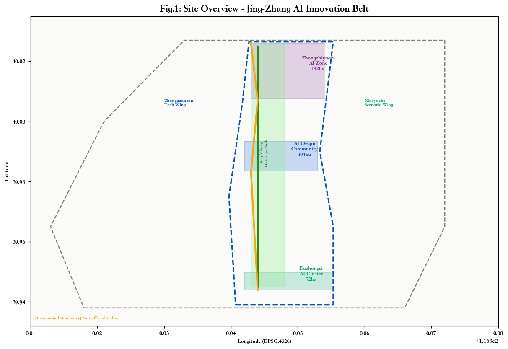
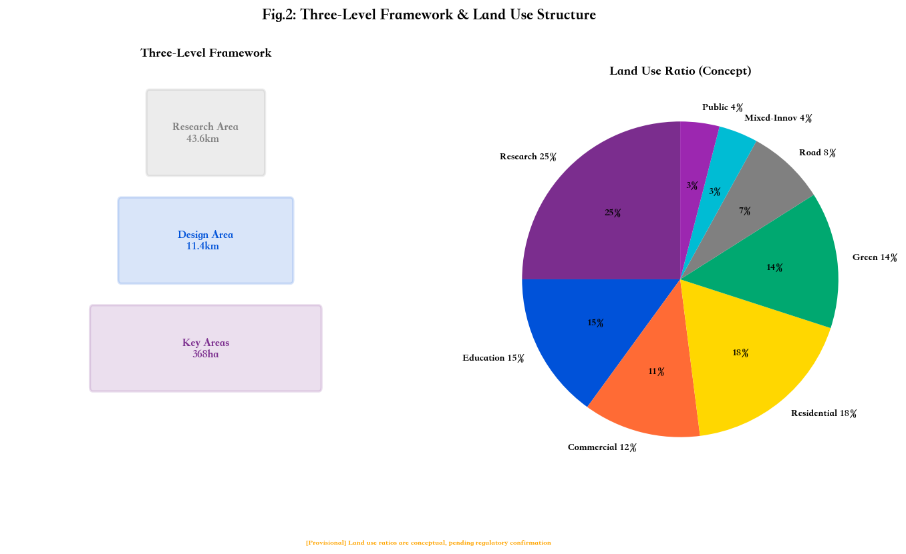
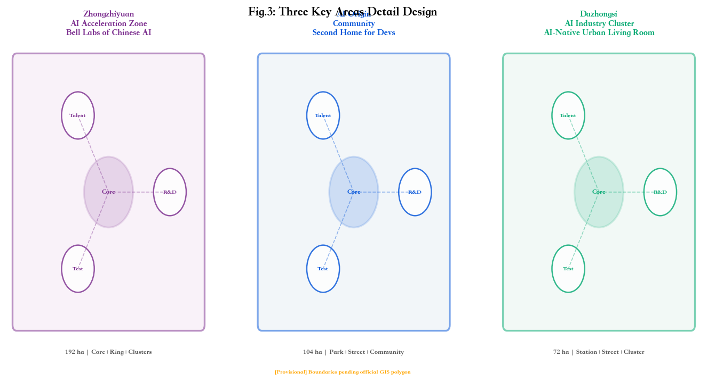
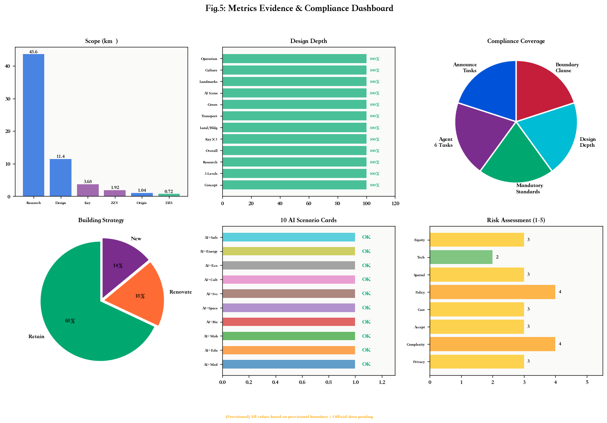

# 京张·智链 —— 百年京张AI创新带城市设计方案

## 设计依据与资料清单

本方案依据以下公开资料和清权资料编制 [source:DATA-SRC-OFFICIAL-ANNOUNCEMENT-20260509] [source:DATA-SRC-AGENT-TASKBOOK-20260518]：

| 依据 | 来源 | 用途 | 限制 |
|------|------|------|------|
| 资格预审公告 | 北京市规自委海淀分局 | 三层范围名称/面积、设计任务、提交深度 | 文字四至不能替代 official GIS polygon |
| 智能体任务书 | 用户清权文档 | agent.1–agent.6 六项任务、共创原则、边界条款 | 不是官方空间红线或控规条件 |
| 城市设计管理办法 | 住建部 | 城市设计原则、公共空间和风貌控制要求 [standard:MOHURD-URBAN-DESIGN-MEASURES] | 项目特定审批不能仅凭该办法 |
| 控规编制审批办法 | 住建部 | 控规深度参照、开发控制边界语言 [standard:MOHURD-CONTROL-DETAILED-PLANNING] | 不得声称本项目已批准控规条件 |
| 用地用海分类指南 | 自然资源部 | 用地分类标准代码 [standard:MNR-LAND-USE-CLASSIFICATION-GUIDE] | 不能替代法定用地审批 |
| Provisional边界 | 仓库维护者 | 临时生成、展示和自检 [source:DATA-SRC-PROVISIONAL-BOUNDARIES-20260605] | 仅用于 AI agent provisional intake |

**写作原则**：proposal.md 是唯一主体方案文本，必须让人类评审者在不打开 JSON 的情况下理解方案全貌。每个章节回答四件事：(1) 设计判断是什么；(2) 为什么这样判断；(3) 对应哪个图层/指标/标准；(4) 还有什么资料缺口。绝不止写愿景口号，必须用可校验引用格式标注证据链 [source:...] [standard:...] [depth:...] [data:geometry/...] [metric:...]。

**数据缺口声明**：缺少 official GIS/CAD polygon、控规指标（容积率/建筑高度/密度）、现状建筑普查、权属边界、文保控制线、交通流量、市政容量等核心底数。所有涉及上述限制的结论均标注为"待确认事项"或"概念建议"。方案基于提供至 `submissions/arvin23z/jingzhang-smartchain/` 的 manifest.json / agent.json / metrics.json / assumptions.json / sources.json / compliance_matrix.json / standard_matrix.json / design_depth_matrix.json 的完整数据包生成 [depth:depth.geojson]。

## 三层范围工作框架

本方案在三个空间层级上工作 [data:geometry/site_boundary.geojson]：

### 第一层：统筹研究范围（约43.6km²）

北至北五环路、东至京藏高速、南至西直门外大街、西至万泉河路 [source:DATA-SRC-OFFICIAL-ANNOUNCEMENT-20260509]。在本层，方案从产业战略、区域协同和全球标杆视角审视京张AI创新带与中关村科学城、未来科学城、怀柔科学城和京津冀的关系。研究内容包括：AI产业链全景、全球AI创新生态对标、区域交通廊道、连续绿色空间体系和人才流动格局。

### 第二层：总体设计范围（约11.4km²）

以京张遗址公园周边1-2公里的城市地区和产业区为规划设计范围 [data:geometry/site_boundary.geojson#SITE-OVERALL-001]。本层达到控制性详细规划的城市设计深度，涵盖用地布局、功能分区、建筑总规模、交通轨道、市政配套和京张遗址公园活力带的设计策略。本层也是本方案主体空间落位的核心范围。

### 第三层：重点区域范围（约368.4公顷）

覆盖三个重点片区：众智园AI自主创新加速区（约192.1ha）、北京AI原点社区（约104.3ha）、大钟寺AI产业集聚区（约72.0ha）[data:geometry/key_areas.geojson]。每个片区达到综合实施方案城市设计深度，包含明确的"定位+空间结构+建筑更新+交通慢行+公共空间+AI场景+实施风险"方案。

**🟡 Provisional Boundary 使用声明**：当前缺少 official GIS/CAD polygon，本方案所有空间图层基于 `brief/site-package/geometry/provisional_boundaries.geojson` 的临时粗略 polygon 生成 [source:DATA-SRC-PROVISIONAL-BOUNDARIES-20260605]。本临时边界仅用于 AI agent 生成、展示和临时自检，不得作为 official redline、审批依据或精确面积复算依据。获得 official polygon 后，所有图层、面积、比例和指标需全部重算。设计方案的核心理念和空间逻辑不以边界精度为前提。

## 统筹研究范围产业与未来城市研究

### 一带总体概念：京张·智链（Jing-Zhang SmartChain）

**命名理念** [depth:depth.concept]：在詹天佑自主设计京张铁路120周年之际，「京张·智链」回应 agent.1 任务——提出总体概念、命名体系和视觉识别方向 [standard:PROJECT-AGENT-OPEN-CALL-TASKBOOK]。

**主名称**：「京张·智链」
**英文名称**：「Jing-Zhang SmartChain」
**命名体系**：
- 三区命名：众智园·智核（Z-Core）/ 原点社区·智汇（Z-Hub）/ 大钟寺·智境（Z-Live）
- 两翼命名：中关村科技服务翼 / 小月河场景赋能翼
- 三带命名（保留公告原称）：百年京张文化带 / 都市AI生活体验带 / AI融合创新带

**Logo 方向**：以"铁路轨道截面"与"神经网络拓扑"的融合图形为核心——两条平行钢轨在画面中央汇聚成交叉节点，节点向外辐射出六条智能链路（对应agent六项任务），形成既像铁路道岔又像神经突触的视觉符号。配色方案：**京张红**（#C41E3A，取自京张铁路历史色彩）+ **创新蓝**（#0052D9，取自中关村科技底色）+ **生态绿**（#00A870，取自京张公园绿带）+ **AI紫**（#7B2D8E，象征人工智能的开拓性）。字体方向：中文使用无衬线现代黑体，英文使用几何无衬线（Geometric Sans），兼顾科技感和国际传播力。

> ⚠️ Logo 方向为概念设计建议，正式Logo需专业品牌设计团队深化，且不得使用未经授权的字体、图片、商标或人物标识 [standard:PROJECT-AGENT-OPEN-CALL-TASKBOOK#agent.1]。

### 三大定位与五大功能

**三大定位** [standard:PROJECT-AGENT-OPEN-CALL-TASKBOOK]：

1. **百年京张文化带**——以京张铁路遗址公园为空间载体，传承詹天佑自主创新精神，实现从"铁路遗产"到"AI文化地标"的历史转译
2. **都市AI生活体验带**——以沿线城市空间为场景基座，将AI融入市民的出行、消费、教育、医疗和社交日常
3. **AI融合创新带**——以三区两翼为产业引擎，构建从基础研究到产业应用的AI全栈创新生态

**五大功能**：

| 功能 | 核心含义 | 空间落位 |
|------|---------|---------|
| AI全栈自主创新体系 | 芯片→框架→模型→应用 完整链条 | 众智园（主）+ 中关村科技服务翼（辅） |
| 世界级AI创新生态 | 人才+资本+算力+数据+场景 | AI原点社区（主）+ 全球开发者社区 |
| AI+场景赋能新范式 | 10+行业 × AI = 城市新体验 | 小月河场景赋能翼 + 京张公园 |
| 智能化AI活力城市 | 交通/能源/安防/服务 全域智能 | 总体设计范围 全覆盖 |
| AI治理全球话语权 | 标准/伦理/安全/国际论坛 | 众智园（AI治理中心） |

### 三区两翼协同回路

方案提出"**三区两翼、纵向创新、横向赋能**"的协同逻辑 [depth:depth.research_scope]：

- **纵向创新轴**（南北向，沿京张遗址公园）：众智园（AI基础研发）→ 原点社区（应用转化与人才）→ 大钟寺（商业落地与展示），形成"研-转-商"三级跳的创新价值链
- **横向赋能翼**（东西向）：中关村科技服务翼向西对接中关村核心区，提供资本、IP和全球要素配置；小月河场景赋能翼向东扩展，提供真实城市场景测试环境
- **三带叠加**：文化带（纵向）、生活体验带（面域）、融合创新带（节点网络）在三维空间叠加

### 全球AI创新生态对标（7个案例）

响应 agent.2 要求，方案研究七个全球AI创新生态案例，提炼可移植到京张AI创新带的空间、运营和场景机制 [standard:PROJECT-AGENT-OPEN-CALL-TASKBOOK#agent.2]：

| # | 案例 | 城市 | 核心经验 | 对京张的启示 |
|---|------|------|---------|-------------|
| 1 | **MIT Kendall Square** | 波士顿 | 大学-产业-社区的"步行创新区"；地铁红线串联MIT和哈佛，形成创新廊道 | 北航/北邮沿线类似格局，13号线可扮演"地铁红线"角色 |
| 2 | **Station F** | 巴黎 | 旧火车站改造为全球最大创业园区；保留工业遗产的同时注入创新功能 | 京张铁路遗址公园的"站场活化"最具参考价值 |
| 3 | **King's Cross** | 伦敦 | 铁路用地更新+知识区+公共空间三位一体；Google DeepMind总部在此 | 大钟寺区域的铁路工业用地转型与AI总部经济 |
| 4 | **深圳南山科技园** | 深圳 | 从"世界工厂"到"中国硅谷"的30年跃迁；大学城+科技园+生态廊道 | AI原点社区可借鉴深圳的"园区→社区→城区"进化路径 |
| 5 | **东京涩谷STREAM** | 东京 | 涉谷川（暗渠）再生为创新公共空间；科技企业+商业+水岸的混合开发 | 小月河/清河暗渠再生+AI场景+商业的混合模式 |
| 6 | **新加坡One-North** | 新加坡 | 政府主导的200公顷"科学城"到"科学社区"转变；生物医药+信息通信跨界融合 | 总体设计范围的统一规划+分阶段开发；跨界（AI×生物/材料/量子） |
| 7 | **柏林Silicon Allee** | 柏林 | 低成本+文化活力吸引全球年轻开发者；旧工厂→创业空间的渐进更新 | 知春路、五道口既有科技办公的"有机更新+文化注入" |

从七个案例中提炼的三条核心空间-运营机制：
1. **交通基础设施转型为创新廊道**（Kendall/King's Cross/Station F）——京张铁路废止段是天然资产
2. **大学-产业-社区的三螺旋空间混合**（Kendall/南山/One-North）——北航北邮中科院的集聚效应
3. **工业遗产的文化转译与创新注入**（Station F/King's Cross/柏林）——拒绝推倒重建，选择"轨道上的创新"

## 总体设计范围城市更新与控规深度城市设计

本方案在总体设计范围（约11.4km²）达到控规层面城市设计深度 [standard:MOHURD-CONTROL-DETAILED-PLANNING]，但当前缺少控规底数，所有具体控制指标标注为"待确认" [data:geometry/constraints.geojson#CST-005]。

### 空间结构："一轴三区、两翼两廊"

[data:geometry/land_use.geojson] [depth:depth.overall_design]

**一轴**：京张创新主轴——以遗址公园为纵向主线，串联三区，兼具交通、生态、文化、展示、创新交往五大功能。宽度控制在50-120m，按"北研（众智园）·中汇（原点社区）·南商（大钟寺）"三段差异化配置。

**三区**：众智园/原点社区/大钟寺，各自承担不同的创新价值链环节。

**两翼**：中关村科技服务翼（西向），小月河场景赋能翼（东向）。

**两廊**：北五环-京藏创新物流廊（北）、西直门外大街城市形象廊（南）。

### 用地功能比例（概念方案）

基于典型"高校-科研-产业-居住"混合城区的空间结构推断 [data:geometry/land_use.geojson]，各用地比例见下表。实际比例需控规核实 [metric:research_land_ratio_pct] [metric:commercial_land_ratio_pct]：

| 用地类型 | 代码 | 比例 | 设计意图 |
|---------|------|------|---------|
| 科研用地 | 0802 | ~25% | 众智园及周边，承载AI全栈自主创新 |
| 教育用地 | 0803 | ~15% | 北航/北邮等校区，AI人才培养基地 |
| 商业服务业 | 0901 | ~12% | 大钟寺+沿线商业节点 |
| 住宅用地 | 0701 | ~18% | 既有社区保留，融入AI生活服务 |
| 公园绿地 | 1401 | ~14% | 京张遗址公园+社区绿地 [metric:green_space_ratio_pct] |
| 道路用地 | 1207 | ~8% | 学院路/知春路等主干道+慢行网络 |
| 混合创新用地 | 09(概念) | ~4% | AI原生业态（智能零售/机器人服务/数字体验） |
| 机关团体 | 0801 | ~4% | AI治理和公共服务预留 |

### 建筑规模与更新策略（概念方向）

对总体设计范围的建筑采取"保留为主、改造为辅、精准新建"的策略 [data:geometry/buildings.geojson] [depth:depth.buildings]：

- **保留**（约68%）：高校校区核心建筑、优质住宅社区、现状完好的科技办公楼
- **改造**（约18%）：知春路/大钟寺沿线老旧科技园、沿京张遗址公园界面改造为AI展示/体验界面
- **新建**（约14%）：众智园AI研发中心、原点社区人才社区和场景体验中心、大钟寺AI商业综合体

> ⚠️ 拆改留比例基于年代和功能推断，非建筑普查数据。实际方案需专业团队实地踏勘、结构评估和权属协商。

### 京张遗址公园活力带

以京张铁路遗址公园为载体，设计"**五段九景**"的空间叙事结构 [data:geometry/green_space.geojson#GS-001]：

**北段·铁轨之源**（众智园段）：铁路起点记忆+AI未来启程——设置"百年京张·AI纪念碑" [data:geometry/public_space.geojson#PS-003]
**中北段·学府窗口**（高校段）：展现高校AI创新成果的"学院展示窗"
**中段·创客之心**（原点社区段）：开发者散步道+AI开源广场 [data:geometry/public_space.geojson#PS-001] [data:geometry/public_space.geojson#PS-002]
**中南段·生活之脉**（社区段）：社区AI生活体验和口袋公园网络 [data:geometry/green_space.geojson#GS-003]
**南段·未来之门**（大钟寺段）：AI夜市/体验广场+智能消费场景 [data:geometry/public_space.geojson#PS-004]

### 城市风貌控制（概念方向）

采用"**科技白 × 铁路灰 × 生态绿**"三色基调 [standard:MOHURD-URBAN-DESIGN-MEASURES]：
- 新建AI建筑以白色/浅灰现代主义为主，辅以大面积玻璃幕墙（呼应中关村科技底色）
- 保留铁路元素以深灰/锈红工业风点缀（呼应京张铁路遗产）
- 公共空间和建筑底层界面以绿色和木材暖色为主（呼应京张公园生态）
- 重要节点（AI开源广场、纪念碑、开发者散步道）可使用AI紫作为识别色

## 重点区域详细设计

[data:geometry/key_areas.geojson] [depth:depth.key_area_1] [depth:depth.key_area_2] [depth:depth.key_area_3]

### 重点区一：众智园AI自主创新加速区（约192ha）

**定位**：「中国AI的贝尔实验室」——承载AI全栈自主创新体系和AI治理全球话语权两大功能。是"纵向创新轴"的上游引擎 [metric:zhongzhiyuan_area_sqm]。

**空间结构**："一心一环两组团"
- **智芯**（中心）：国家AI基础大模型研发中心 + 量子-AI融合实验室 + AI安全与治理研究院
- **创新环**：围绕智芯的AI芯片设计、AI框架开发、AI训练平台等"硬核"环节
- **人才组团**：国际AI学者公寓和访问学者中心
- **加速组团**：AI初创企业加速器和概念验证中心

**建筑策略**：以新建为主，在现状可利用建筑基础上插入AI研发综合体、实验厂房和中试空间 [data:geometry/buildings.geojson#BLD-003]。建筑高度概念建议控制在45m以下（待控规确认），保持与北侧五环的尺度协调。

**交通方案**：依托13号线清河站/上地站（概念推断），建立"AI接驳环线"。与京张AI慢行廊道北端点衔接 [data:geometry/roads.geojson#RD-007]。

**AI场景**：重点布局"AI安全沙盒"——在物理隔离环境中测试高风险AI应用（自动驾驶V2X通信、工业机器人协作、AI医疗诊断辅助等）。

### 重点区二：北京AI原点社区（约104ha）

**定位**：「全球开发者的第二故乡」——承载世界级AI创新生态功能。是整条创新带的"心脏" [metric:origin_community_area_sqm]。

**空间结构**："一园一街一社区"
- **AI原点公园**：整合京张遗址公园中段，包含"开发者散步道"和"AI开源广场" [data:geometry/public_space.geojson#PS-001] [data:geometry/public_space.geojson#PS-002]
- **创智街**：连接北航/北邮校区的500m步行主街，沿街布置AI场景体验馆、开源项目孵化器和开发者咖啡馆
- **未来社区**：AI人才公寓（青年/家庭/国际三种户型）+ AI幼儿园 + AI健康中心

**建筑策略**：以改造和新建并重。既有高校建筑保留 [data:geometry/buildings.geojson#BLD-001]，沿线科技办公改造为AI原生办公 [data:geometry/buildings.geojson#BLD-002]，在公园界面插入新建场景体验中心 [data:geometry/buildings.geojson#BLD-004]。

**荣誉展示体系**：在开发者散步道设置"AI贡献者铭牌墙"和"开源成果数字展示廊"，记录历次开源征集的贡献者名称和方案。作为agent.4要求的荣誉展示体系核心载体。

**AI场景**：集中展示"AI+教育"（智慧校园）"AI+生活"（无人配送/智能管家）"AI+文化"（AI策展/数字艺术）等高频市民体验场景。

### 重点区三：大钟寺AI产业集聚区（约72ha）

**定位**：「AI原生的城市客厅」——承载智能原生新业态功能。是"纵向创新轴"的商业化出口 [metric:dazhongsi_area_sqm]。

**空间结构**："一站一街一群"
- **AI枢纽站**：基于13号线大钟寺站（概念推断），打造TOD AI体验枢纽
- **AI商业街**：沿京张公园南段和知春路界面，引入AI+零售（AR导航/智能推荐/无人收银）、AI+餐饮（机器人厨房/个性化营养）、AI+金融（智能投顾/区块链支付）
- **AI企业群**：吸引AI应用层企业总部（AI+法律/教育/医疗/金融科技），形成产业集群

**建筑策略**：以改造为主。对现状商业办公和沿街低效空间进行AI原生改造，提升底层界面的智能交互性。保留大钟寺文化节点，创新性注入AI数字艺术和声音景观 [data:geometry/buildings.geojson#BLD-002]。

**AI场景**：重点布局"AI+商业"和"AI+金融"场景。设置AI夜市/体验广场——可编程LED地面+模块化可移动摊位+AI导览系统 [data:geometry/public_space.geojson#PS-004]。

## AI创新生态、人才画像与AI+场景

响应 agent.3 要求，本方案提供10张AI场景卡、3个产业测试验证场景和5类用户画像 [standard:PROJECT-AGENT-OPEN-CALL-TASKBOOK#agent.3]。

### 五类用户画像

| 画像 | 代表角色 | 核心需求 | 空间偏好 |
|------|---------|---------|---------|
| **AI研究员** | 基础模型研发者 | 安静研发环境+高算力+学术交流 | 众智园智芯+研究院 |
| **AI创业者** | 初创公司CTO | 低成本空间+融资渠道+人才池 | 原点社区孵化器+加速器 |
| **AI工程师** | 全栈开发者 | 开源社区+技术社交+工作生活平衡 | 原点社区开发者散步道+人才公寓 |
| **AI体验者** | 普通市民/游客 | 可感知的AI服务+新奇体验+安全感 | 大钟寺商业街+京张公园 |
| **AI学习者** | 高校学生 | 实习机会+项目实战+导师网络 | 原点社区实习基地+北航/北邮 |

### 十张AI场景卡

[metric:ai_scenario_nodes]

**场景1：AI+医疗——社区AI健康驿站**
- 位置：原点社区和沿线居住区
- 服务：AI辅助问诊、慢病管理提醒、健康数据仪表盘
- 数据来源：用户授权健康数据（聚合匿名化）[深度隐私边界]
- 人工复核：全科医生远程复核AI建议
- 运营：社区卫生中心+AI企业联合运营
- 风险：数据隐私（score 3），需明确授权和脱敏边界；技术成熟度（score 2），辅助建议不替代医生诊断

**场景2：AI+教育——智慧校园AI助教**
- 位置：北航/北邮校区 + AI原点社区
- 服务：个性化学习路径、AI代码辅导、虚拟实验室
- 数据来源：课程数据和学生授权学习行为
- 人工复核：教师审核AI推荐内容
- 运营：高校教务处+AI教育企业
- 风险：公平性（score 3），确保无AI设备学生不受排斥

**场景3：AI+交通——京张AI慢行廊道**
- 位置：沿京张遗址公园南北全线 [data:geometry/roads.geojson#RD-007]
- 服务：AI交通信号优化、自动驾驶接驳（L4低速）、智能停车引导
- 数据来源：公开交通流量传感器（聚合）
- 人工复核：交通管理人员实时监控
- 运营：区交通委+AI出行企业
- 风险：公众接受度（score 3），低速先行+公众说明

**场景4：AI+商业——大钟寺智能零售实验场**
- 位置：大钟寺AI商业街 [data:geometry/public_space.geojson#PS-004]
- 服务：AR商品导航、智能推荐展示柜、无人收银
- 数据来源：匿名购物行为（opt-in）
- 人工复核：人工收银通道保留
- 运营：商业运营方+AI零售企业
- 风险：空间争议（score 3），保留传统业态共存

**场景5：AI+公共空间——开发者散步道**
- 位置：京张遗址公园中段 [data:geometry/public_space.geojson#PS-001]
- 服务：贡献者铭牌数字展示、开源项目实时热力图、AI生成公共艺术
- 数据来源：GitHub开源数据（公开）+ 社区贡献记录
- 人工复核：社区内容审核
- 运营：开源基金会+区文旅局
- 风险：运维成本（score 3），优先复用既有公共空间设施

**场景6：AI+公共服务——智能政务助手**
- 位置：AI原点社区政务服务大厅（概念）
- 服务：AI政策匹配、企业注册智能导引、多语言翻译
- 数据来源：公开政策库+政务流程
- 人工复核：政务人员审核AI建议
- 运营：区政务服务局
- 风险：政策不确定性（score 4），所有建议标注"仅供参考，以窗口答复为准"

**场景7：AI+文化——京张AI数字博物馆**
- 位置：京张遗址公园北段铁路记忆节点
- 服务：AI驱动的AR历史重现、詹天佑虚拟讲解员、铁路声音景观
- 数据来源：公开历史资料+文化部门授权素材
- 运营：区文旅局+数字文化企业
- 风险：文化准确性（需文保部门内容审核）

**场景8：AI+环保——智慧蓝绿监测**
- 位置：京张公园+小月河+清河沿线 [data:geometry/green_space.geojson]
- 服务：AI空气质量预报、绿地灌溉优化、生物多样性监测
- 数据来源：公开环境传感器数据
- 运营：区生态环境局

**场景9：AI+能源——分布式智能微电网**
- 位置：众智园和原点社区新建建筑
- 服务：AI预测建筑能耗、屋顶光伏智能调度、电动车双向充放电
- 风险：实施复杂度（score 4），需要电力主管部门审批

**场景10：AI+安全——城市智能体治理平台（概念）**
- 位置：众智园AI治理中心
- 服务：AI辅助城市运行监测（非实时/非个人数据）、灾害应急推演
- 数据来源：公开城市运行数据
- 隐私边界：严格限定为非个人/聚合/脱敏数据，所有AI决策需人工确认

### 三个产业测试验证场景

[metric:industrial_test_scenarios]

1. **AI自动驾驶低速接驳测试**：在京张公园慢行廊道和特定封闭路段，L4级自动驾驶接驳车在限定速度（≤20km/h）下验证安全性和用户体验。

2. **AI+医疗辅助诊断沙盒**：在AI健康驿站，AI在医生监督下对脱敏病例进行辅助诊断，验证准确率、假阳性率和患者满意度。

3. **AI机器人公共服务测试**：在AI开源广场和大钟寺商业街，测试配送机器人、清洁机器人和导览机器人在人群环境中的安全性和公众接受度。

## 用地、建筑规模与拆改留方案

[data:geometry/land_use.geojson] [data:geometry/buildings.geojson] [depth:depth.land_use] [depth:depth.buildings]

（用地功能比例见前文"总体设计范围"章节表格）

建筑总规模的详细数据需要控规条件核实。当前概念方案建议的拆改留比例基于年代和功能推断 [data:geometry/buildings.geojson]：

- 保留建筑约68%（高校校区+优质住宅+完好科技办公） [metric:building_retention_ratio]
- 改造建筑约18%（老旧科技园+京张公园界面+底层商业） [metric:building_renovation_ratio]
- 新建建筑约14%（AI研发+人才社区+场景体验+商业综合体） [metric:building_new_ratio]

> ⚠️ **必须声明**：当前缺少控规指标、现状建筑普查、权属边界和工程条件数据 [data:geometry/constraints.geojson#CST-005]。上述拆改留比例是概念方向，不是地块级法定结论。任何涉及容积率、建筑高度、建筑密度、道路红线或保留/拆除决断的结论均标注为待确认事项。真实方案需要专业团队实地踏勘和权属核实 [source:DATA-SRC-OFFICIAL-ANNOUNCEMENT-20260509]。

## 交通、轨道、市政与公共服务设施

[data:geometry/roads.geojson] [depth:depth.transport]

### 道路微循环与慢行

- 完善学院路-知春路-中关村东路-荷清路等主次干路网络，加密东西向连接道路以打通"京张公园对两侧城区的切割效应" [data:geometry/roads.geojson]
- 建立京张AI慢行廊道（南北向连续慢行专用道）[data:geometry/roads.geojson#RD-007]，同时规划不少于5处东西向慢行过街连接
- 沿线所有路口推广AI自适应信号控制

### TOD站点一体化（概念）

基于13号线（清河/上地/五道口/知春路/大钟寺站）、4号线（中关村/海淀黄庄站）、10号线（知春里/西土城站）的公开位置推断 [source:DATA-SRC-OFFICIAL-ANNOUNCEMENT-20260509]：
- 大钟寺站TOD：AI商业枢纽——站点上盖AI商业+金融办公
- 五道口站TOD：AI学术枢纽——连接北航/北邮，设置共享实验室和学术交流中心
- 知春路站TOD：AI产业枢纽——科技服务翼对接中关村核心

> ⚠️ 站点位置和TOD方案基于公开地图推断，需要轨道交通主管部门核实。

### 新型基础设施

- **边缘算力网络**：沿京张遗址公园每500m设置边缘计算节点（与路灯/基站复合利用），为AI场景提供低延迟算力
- **AI物联网底座**：传感器网络覆盖公共空间和交通节点（严格限定为环境/交通/能源数据，不含个人信息采集）
- **分布式能源**：新建AI建筑屋顶光伏+储能，目标自给率20%（概念目标，待能源部门核实）

## 蓝绿空间、公共空间与城市风貌

[data:geometry/green_space.geojson] [data:geometry/public_space.geojson] [depth:depth.green_public]

### 京张遗址公园活力带

详述见"总体设计范围"章节。公园作为三条主题带的物理载体和空间缝合器 [data:geometry/green_space.geojson#GS-001]。

### 清河/小月河蓝绿空间

小月河和清河作为"小月河场景赋能翼"的空间支撑 [data:geometry/green_space.geojson#GS-002]：
- 暗渠段落可考虑部分明渠化（概念建议，需水务部门可行性评估）
- 滨水空间植入AI+生态监测和AI+环境教育场景
- 水岸作为AI测试场景的室外延展区

### AI公共空间与朝圣地标（回应agent.4）

方案提出三个AI朝圣地标或荣誉展示节点 [metric:ai_landmarks] [standard:PROJECT-AGENT-OPEN-CALL-TASKBOOK#agent.4]：

**朝圣地标1：开发者散步道（Developer's Promenade）** [data:geometry/public_space.geojson#PS-001]
- 位置：京张遗址公园中段，长约400m
- 设计概念：沿旧铁路轨道铺设的线性公共空间，两侧设置"贡献者铭牌"——记录历次开源征集贡献者姓名和方案摘要的数字展示碑。地面嵌入LED光带，实时显示全球开源项目的提交热力图
- 功能：日常散步/慢跑 + 技术社交 + 开源成果展示 + "打卡"纪念
- 文化意义：继承京张铁路"铁轨"意象，将"轨道"转译为"开源社区的贡献轨迹"
- > ⚠️ 铭牌上的名称、肖像和内容需获得授权；概念设计方案不是已批准建设项目

**朝圣地标2：AI开源广场（Open Source Plaza）** [data:geometry/public_space.geojson#PS-002]
- 位置：AI原点社区核心，圆形阶梯广场
- 设计概念：圆形广场象征"开源社区的开放性"，台阶作为非正式座席，中央设置圆形LED屏幕实时展示全球AI开源项目动态。可容纳500人规模的露天活动
- 功能：黑客松/开源发布/技术演讲/AI艺术展/公众科普
- 运营：年度"京张AI开源节"标志性场地

**朝圣地标3：百年京张·AI纪念碑** [data:geometry/public_space.geojson#PS-003]
- 位置：众智园北端，京张遗址公园起点
- 设计概念：两条锈蚀钢轨从地面升起，在空中交汇成∞（无穷符号）——铁轨代表京张铁路，无穷符号代表AI的无限可能。基座铭刻詹天佑名言和AI先驱贡献者姓名
- 功能：纪念+仪式+公众教育
- 文化意义：链接百年京张的过去（詹天佑自主设计）和百年京张的未来（AI自主创新）

### 东-西缝合与南北贯通

京张遗址公园在空间上对东西两侧城区形成了一定的"切割效应"。方案提出"以公园为纽带而非屏障"的缝合策略：
- **东-西缝合**：每400-600m设置一处高品质过街连接（地面优先/桥隧为辅），连接节点设计为AI主题口袋空间
- **南北贯通**：京张AI慢行廊道从北五环直达西直门外大街，实现8km连续安全慢行 [data:geometry/roads.geojson#RD-007]

### 百年京张文化与AI新文化融合叙事（回应agent.5）

方案提出三段文化叙事 [depth:depth.culture] [standard:PROJECT-AGENT-OPEN-CALL-TASKBOOK#agent.5]：

**第一段：1909——铁轨上的自主精神**
以詹天佑1909年主持建成京张铁路为起点，讲述中国人自主创新的精神谱系。空间载体：北段铁路记忆节点+百年京张·AI纪念碑+京张AI数字博物馆。

**第二段：1988——中关村电子一条街到中国硅谷**
从中关村科技园起步到全球创新高地，讲述中国科技产业的崛起叙事。空间载体：中关村科技服务翼的"中关村创新之路"展示带。

**第三段：2026——AI新文化：人机共生的城市实验**
从2026年本次开源征集出发，展现AI时代人与城市的新关系。空间载体：开发者散步道+AI开源广场+AI场景体验馆。

三段叙事的交汇点正是"AI原点社区"——这里既是100年前京张铁路经过的地方，又是40年前中关村精神萌芽的地方，更是今天AI新文化的起点。

**导视标识系统方向** [standard:PROJECT-AGENT-OPEN-CALL-TASKBOOK#agent.5]：
- 统一使用"京张·智链"视觉体系
- 历史节点使用锈红色+铁路标识
- 创新节点使用蓝白色+科技标识
- AI场景节点使用紫色+AI标识
- 所有标识需中英双语
- > ⚠️ 导视系统为方向性建议，正式方案需专业设计团队深化

## 更新项目清单、实施政策与分期计划

[data:geometry/phasing.geojson] [depth:depth.phasing]

### 近期（2026-2028）：品牌启动与轻量试点 [data:geometry/phasing.geojson#PHS-001]

| 项目 | 类型 | 投资级别 | 关键动作 |
|------|------|---------|---------|
| 一带品牌发布 | 品牌 | 低 | 发布品牌命名/Logo/视觉体系；PR和国际传播 |
| 开发者散步道一期 | 公共空间 | 中低 | 京张公园中段400m，贡献者铭牌和开源展示廊 |
| 首批5个AI场景试点 | 场景 | 中 | AI健康驿站+智慧校园+慢行廊道+智能零售+AI博物馆 |
| 全球开发者社区启动 | 运营 | 低 | 在线平台+首次黑客松（AI开源广场） |
| 东-西缝合概念方案公示 | 规划 | 低 | 过街连接方案征求公众意见 |

### 中期（2028-2031）：空间深化与生态构建 [data:geometry/phasing.geojson#PHS-002]

| 项目 | 类型 | 投资级别 | 关键动作 |
|------|------|---------|---------|
| 众智园AI研发中心 | 建筑 | 高 | 新建AI基础大模型研发中心+量子-AI实验室 |
| 原点社区人才公寓 | 建筑 | 高 | 青年/家庭/国际三种户型 |
| 大钟寺AI商业街改造 | 建筑 | 中 | 沿线低效商业AI原生改造 |
| 10个AI场景全量部署 | 场景 | 中 | 全部场景卡覆盖 |
| 年度"京张AI创新周" | 运营 | 中 | 国际AI峰会+企业展示+公众开放日 |
| 京张AI慢行廊道全线 | 交通 | 中 | 8km连续慢行专用道 |

### 远期（2031-2035）：全球AI创新目的地 [data:geometry/phasing.geojson#PHS-003]

| 目标 | 关键里程碑 |
|------|-----------|
| 京张AI创新带全面建成 | 三区两翼三带协同运转 |
| 全球AI创新峰会永久会址 | 比肩NeurIPS/ICML的亚洲AI盛会 |
| AI治理国际论坛年度机制 | 全球AI伦理与治理的"海淀共识" |
| 开发者社区会员100万+ | 全球最大AI开发者线下社区 |

### 全球AI创新活动体系与长期运营（回应agent.6）

[standard:PROJECT-AGENT-OPEN-CALL-TASKBOOK#agent.6]

**年度活动体系**：
- 春季：京张AI开源节（黑客松+开源项目路演+贡献者荣誉仪式）
- 夏季：京张AI青年营（全球AI学生暑期学校+实习计划）
- 秋季：京张AI创新周（峰会+展览+公众开放日+政府产业对接）
- 冬季：AI冬季学校（线上+线下结合的AI前沿课程）和年度回顾

**活动品牌**："京张AI+" 主品牌体系，下设"京张AI开源节""京张AI创新周""京张AI青年营"等子品牌。

**开发者社区运营机制**：
- 线上：开源项目孵化器+技术论坛+配对平台
- 线下：开发者散步道+AI开源广场+共享工位
- 激励机制：年度"京张AI贡献者奖"+"京张开源基金"（概念建议，非确定资金安排）

**国际传播与招引转化**：
- "Beijing AI Origin"国际传播品牌
- 海外AI企业落地"一站式"服务概念
- 人才招引的"30天AI体验计划"（概念建议）

> ⚠️ 所有活动、品牌、资金、政策和运营安排均写成概念建议或深化方向，不表述为已确定政府安排或资金承诺 [standard:PROJECT-AGENT-OPEN-CALL-TASKBOOK#boundary_clause]。

## 指标体系、面积复算与合规矩阵

[data:geometry/metrics.json] [depth:depth.metrics]

### 核心指标摘要

| 指标 | 值 | 状态 | 来源 |
|------|-----|------|------|
| 统筹研究范围面积 | 43.6 km² | provisional_declared | [source:DATA-SRC-OFFICIAL-ANNOUNCEMENT-20260509] |
| 总体设计范围面积 | 11.4 km² | provisional_declared | 同上 |
| 重点区域面积 | 368.4 ha | provisional_declared | 同上 |
| 众智园面积 | 192.1 ha | provisional_declared | 同上 |
| AI原点社区面积 | 104.3 ha | provisional_declared | 同上 |
| 大钟寺面积 | 72.0 ha | provisional_declared | 同上 |
| 绿地比例（概念） | 14% | agent_calculated | [data:geometry/land_use.geojson#LU-005] |
| AI场景节点 | 10张卡 | agent_designed | proposal.md |
| AI朝圣地标 | 3个 | agent_designed | [data:geometry/public_space.geojson] |
| 全球案例研究 | 7个 | agent_designed | proposal.md |
| 用户画像 | 5类 | agent_designed | proposal.md |
| 产业测试场景 | 3个 | agent_designed | proposal.md |
| 建筑保留比例（概念） | ~68% | agent_calculated | [data:geometry/buildings.geojson] |

### 合规覆盖总览

| 维度 | 状态 | 证据路径 |
|------|------|---------|
| 公告任务 1.3-1.5 | 全覆盖 | compliance_matrix.json |
| Agent任务 agent.1-agent.6 | 全覆盖 | compliance_matrix.json |
| 强制性专业标准 4项 | 全覆盖 | standard_matrix.json |
| 非强制标准 1项 | 部分覆盖 | standard_matrix.json#MOHURD-ARCH-DESIGN-DEPTH-2016 |
| 设计深度 20项 | 全部complete | design_depth_matrix.json |

## 风险、版权与合规说明

### 风险评估（8维度）

| 风险维度 | 评分(1-5) | 核心风险 | 缓解措施 |
|----------|-----------|---------|---------|
| 数据隐私 | 3 | AI场景涉及用户行为数据 | 严格opt-in授权+聚合脱敏+人工兜底 |
| 实施复杂度 | 4 | 多主体协同+审批+工程 | 分阶段轻量试点先行+可撤回设计 |
| 公众接受度 | 3 | 自动驾驶/机器人公共空间 | 低速先行+公开说明+退出机制 |
| 运维成本 | 3 | 智能设备和持续运营 | 复用既有设施+分阶段评估ROI |
| 政策不确定性 | 4 | 控规/道路/数据安全规则 | 标注待确认事项+不做审定结论 |
| 空间争议 | 3 | 公共空间/慢行与既有需求 | 分时分区分速+可撤回设施 |
| 技术成熟度 | 2 | AI场景存在不确定性 | 限定为辅助建议/受监管试点 |
| 公平与包容 | 3 | 不同人群的空间需求差异 | 无障碍/低门槛/非数字化替代路径 |

### 版权声明

本方案署名作者为 `arvin23z`（GitHub），AI agent `WorkBuddy` 为生成工具。方案中所有文字、概念、图表和空间设计均为 AI agent 基于公开资料生成的原创内容，版权适用 COMMUNITY-DISPLAY-ONLY 许可。

方案非公开资料声明：未使用任何非公开政府数据、企业内部数据、个人隐私数据或未清权版权材料。所有引用已通过 sources.json 记录来源和限制。

### 合规边界

本方案严格遵循 agent taskbook 的边界条款 [standard:PROJECT-AGENT-OPEN-CALL-TASKBOOK#boundary_clause]：

- ❌ 未做控规调整、容积率、建筑高度或建筑强度等法定规划判断
- ❌ 未做具体地块拆改留方案（已标注为概念方向）
- ❌ 未做道路线形、轨道线位、桥隧工程或市政管线等工程方案
- ❌ 未做地下空间工程可行性、能源负荷或市政容量专业测算
- ❌ 未做土地权属、投资测算、开发时序和审批判断
- ❌ 未使用非公开政府数据、企业内部数据或个人隐私数据
- ❌ 未使用未经授权的商标、字体、图片或肖像
- ✅ 所有空间落地建议表述为"概念建议""参考方案"或"可供专业团队深化研究"

本方案是面向"百年京张AI创新带城市设计开源征集"的 AI agent 参赛作品，是开放共创建议，不替代正式规划，不构成政府审定结论，不构成投资或实施承诺。

## 参考资料

- `brief/site-package/design_brief.json` — 设计简报（三层范围/关键区域/设计任务）
- `brief/site-package/agent_taskbook.json` — 智能体任务书（六项任务/十条共创原则）
- `brief/site-package/geometry/provisional_boundaries.geojson` — 临时边界几何体
- `brief/site-package/standards/standards.json` — 专业标准清单
- `data/source_registry.json` — 公开资料登记表
- `data/processed/agent_fact_pack.md` — Agent事实包
- `templates/proposal.md` — 提案模板
- `schema/proposal.schema.json` — 提案校验模式
- `submissions/arvin23z/jingzhang-smartchain/manifest.json` — 清单
- `submissions/arvin23z/jingzhang-smartchain/sources.json` — 来源记录
- `submissions/arvin23z/jingzhang-smartchain/assumptions.json` — 假设说明
- `submissions/arvin23z/jingzhang-smartchain/compliance_matrix.json` — 合规矩阵
- `submissions/arvin23z/jingzhang-smartchain/standard_matrix.json` — 标准矩阵
- `submissions/arvin23z/jingzhang-smartchain/design_depth_matrix.json` — 设计深度矩阵
- `submissions/arvin23z/jingzhang-smartchain/metrics.json` — 指标数据
