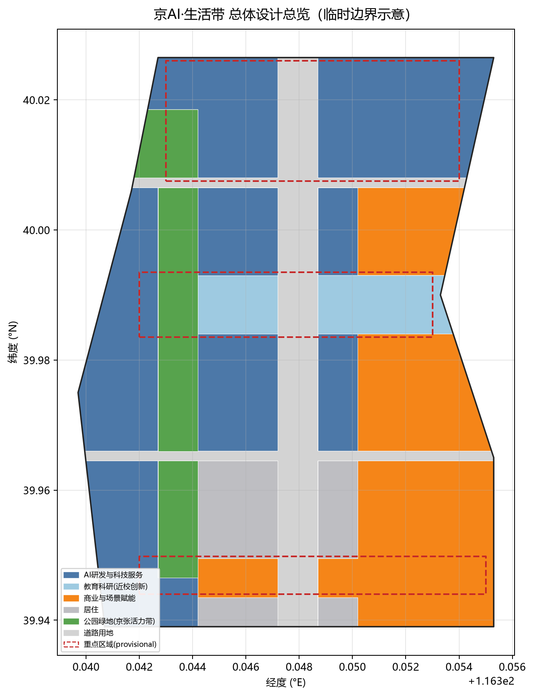
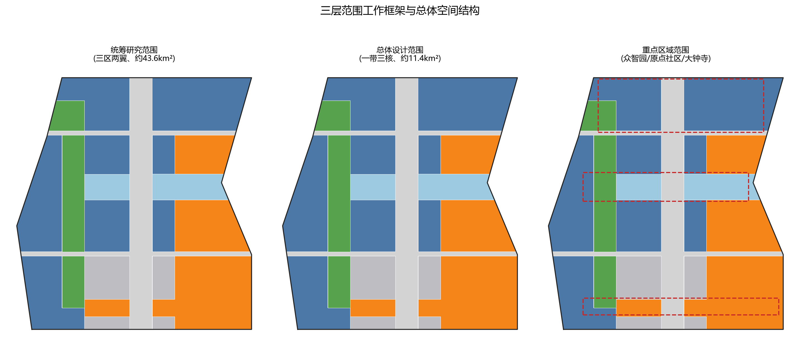
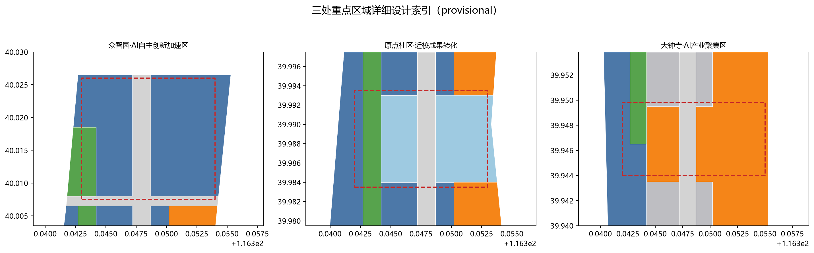
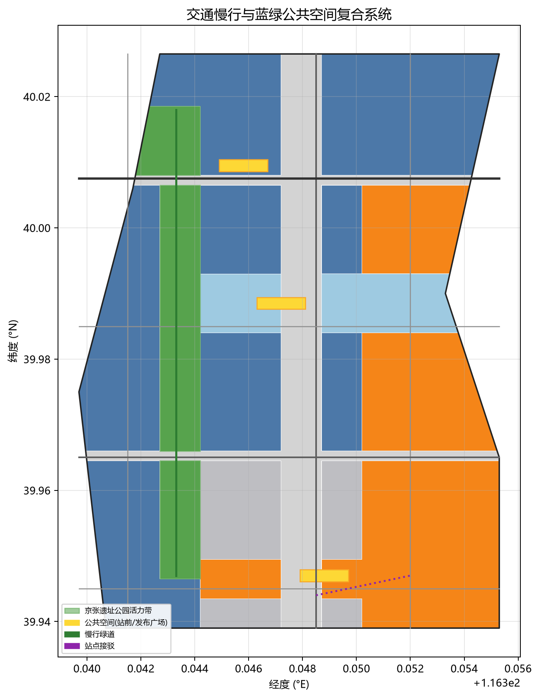
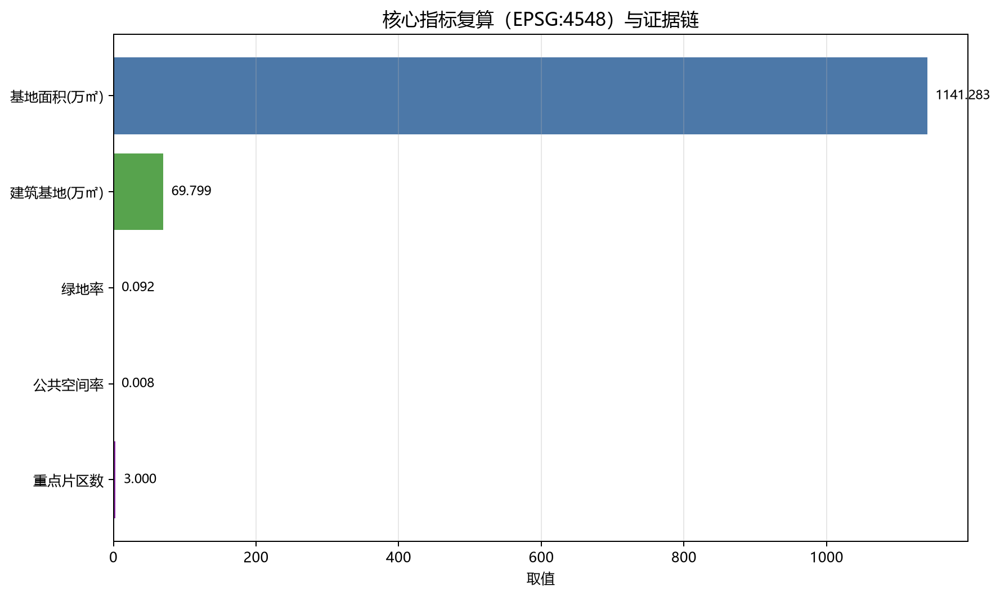

# 京AI·生活带——从百年京张记忆到AI原生城市生活实验

## 设计依据与资料清单

本方案以北京市规划和自然资源委员会海淀分局发布的《百年京张AI创新带城市设计国际方案征集资格预审公告》（2026-05-09）为第一依据，并以 `brief/site-package/` 中的 `design_brief.json`、`allowed_design_space.json`、`agent_taskbook.json`、`enums/`、`ranges/`、`schemas/` 以及 `data/source_registry.json`、`data/processed/agent_fact_pack.md` 为机器可读资料层。方案生成前已按 `project_scope_summary.csv`、`agent_task_requirements.csv`、`source_use_matrix.csv`、`missing_data_checklist.csv` 建立任务、范围、资料用途和缺口清单，保证每一项设计判断都能拆解为"可追溯来源、可复算指标、可校验图层、可人工复核假设"四类证据。公告要求方案达到控制性详细规划的城市设计深度和规划综合实施方案的城市设计深度，因此文本叙述不能替代 GeoJSON、指标表、A3 文册、A0 展板和 HTML 电子展示成果。

本节证据链引用 [source:OFFICIAL-ANNOUNCEMENT]、[source:AGENT-TASKBOOK]、[source:SITE-PACKAGE]、[source:SOURCE-REGISTRY]、[source:PROCESSED-FACT-PACK]、[source:BOUNDARY-SOURCE]、[source:KEY-AREA-SOURCE]、[standard:PROJECT-OFFICIAL-ANNOUNCEMENT]、[standard:PROJECT-AGENT-OPEN-CALL-TASKBOOK]，并配合 [depth:existing_conditions_diagnosis]，说明方案不是独立愿景，而是从公告、面向智能体任务书、标准、临时边界、处理资料包和资料清单出发组织成果。

资料登记表的使用边界如下：`data/source_registry.json` 登记公开、清权与临时资料的用途边界，当前 formal 可用资料 5 条、背景资料 0 条、provisional-only 资料 1 条；agent 不得把 background_only 或 provisional_only 资料升级为 official boundary、法定控规、正式评分依据或政府实施承诺。`data/processed/agent_fact_pack.md` 是阅读导航层而非新权威来源。

本方案因官方 `SITE_BOUNDARY` 或三处 `KEY_AREA` 尚未取得，使用 `brief/site-package/geometry/provisional_boundaries.geojson` 生成临时 formal 包。提交包中的 `geometry/site_boundary.geojson` 与 `geometry/key_areas.geojson` 均已标注 `provisional_constraint`、`official_boundary=false`，只能用于方案生成、自检、可视化和设计讨论，不能作为 official redline、审批依据、精确面积依据或法定控制结论。该数据缺口不阻断内容评分；正式数据到位后需对全部几何、指标和图纸重算。边界和重点区域的可读解释对应 [data:geometry/site_boundary.geojson#SITE-001]、[data:geometry/key_areas.geojson#PROV-KEY-001] 和 [metric:site_area_sqm]、[metric:key_area_count]。

## 三层范围工作框架

方案按照公告确定的三个层次组织工作：统筹研究范围关注约 43.6 平方公里的 AI 产业生态、战略定位、创新链和未来城市形态；总体设计范围关注约 11.4 平方公里京张遗址公园周边 1—2 公里城市地区和产业区，要求形成城市更新总体框架、产业空间布局、交通市政支撑和城市风貌控制；重点区域范围关注约 368.4 公顷三处详细设计地区，要求明确功能业态、建筑规模、拆改留分类、公共空间连通和交通组织。三层范围在 `compliance_matrix.json` 中逐条映射，保证公告 1.3、1.4、1.5 与 agent.1—agent.6 的必选任务都有章节、图层、指标、图纸和 HTML 证据。

三层工作不是互相割裂的图纸集合：统筹研究决定产业链和城市形态判断，总体设计把判断落实到更新项目、空间结构和设施承载，重点区域详细设计验证具体地块、建筑、交通、公共空间和 AI 应用场景的可实施性。生成流程是"先锁定当前提交采用的官方或临时边界与约束，再生成用地、建筑、道路、绿地、公共空间、分期和 AI 服务节点，最后从这些图层复算指标并解释限制"。任何无法从结构化数据复算的面积、比例、规模或项目数量，不得写入正式结论。

本方案总体概念为"京AI·生活带"：以京张铁路遗址的"百年铁路记忆"为文化主轴，转译为一条承载记忆、慢行与公共生活的绿色活力带；以众智园（北）、AI 原点社区（中）、大钟寺（南）三处重点片区为创新锚点；以高校、企业、社区与轨道站点为日常网络，形成"一带三核、多点场景、蓝绿慢行复合环"的空间组织。[data:geometry/site_boundary.geojson#SITE-001] 与 [data:geometry/key_areas.geojson#PROV-KEY-001] 是落实这一概念的空间骨架，[depth:three_level_scope_framework] 与 [depth:overall_spatial_structure] 是本框架的深度校核项。

| 层级 | 核心设计问题 | 方案回答 | 数据落点 |
| --- | --- | --- | --- |
| 统筹研究范围 | AI 产业生态与未来城市形态如何协同 | 构建"高校策源—开源协作—企业转化—公共体验—国际传播"创新链 | [metric:key_area_count]、`compliance_matrix.json` |
| 总体设计范围 | 城市更新与控规深度如何落到图面 | 用地、建筑、道路、绿地、公共空间、分期图层共同表达 | [data:geometry/land_use.geojson#LU-0802-001]、[data:geometry/roads.geojson#ROAD-001] |
| 重点区域范围 | 三处片区如何达到详细设计深度 | 分别提出定位、空间动作、AI 场景与实施依赖 | [data:geometry/key_areas.geojson#PROV-KEY-002]、[data:geometry/key_areas.geojson#PROV-KEY-003] |

## 统筹研究范围产业与未来城市研究

统筹研究范围应回答"什么是适合 AI 新质生产力的新型城市形态"这一战略命题。本方案以中关村科学城为依托，构建"创新链、产业链、人才链、服务链"四链协同的空间框架：北部依托众智园承接全栈自主创新与开源协同，中部依托高校与园区形成近校成果转化，南部依托商业与轨道服务形成智能经济集聚；体现为"一带三核"的产业空间关系。命名与 logo 服务"百年京张文化带、都市 AI 生活体验带、AI 融合创新带"的整体辨识度，与产业生态、公共空间和文化资源关联，并在正文与 `compliance_matrix.json` 中回应 agent.1—agent.6 的命名、logo、场景开放与运营机制要求。

统筹研究并不新增伪精确红线；它通过城市风貌、公共空间和建筑布局统筹，回接 [data:geometry/land_use.geojson#LU-0802-001]、[data:geometry/public_space.geojson#PUBLIC-001] 与 [depth:overall_spatial_structure]。未来城市形态研究将 AI 交通系统、连续绿色空间、创新服务设施和国际化生产生活氛围落实为可定位的功能区、节点、廊道和场景，并以 [source:AGENT-TASKBOOK] 与 [standard:PROJECT-AGENT-OPEN-CALL-TASKBOOK] 标注其"AI 开源征集任务"属性，而非法定规划条件。涉及"全球 AI 创新活动、开发者社区、朝圣路线"等表述，一律写明为概念的参考方案，待专业团队深化，不得写成已确定的政府安排。

## 总体设计范围城市更新与控规深度城市设计

总体设计范围要求达到控制性详细规划的城市设计深度。本方案提出"更新—植入—织补"总体空间结构：以京张遗址公园活力带为更新主轴，将低效院落、工业仓储转化成 AI 研发、孵化、服务和人才社区；`geometry/land_use.geojson` 完整覆盖设计边界且无缝隙，`geometry/buildings.geojson` 表达更新与保留建筑基底，`geometry/roads.geojson` 表达主干、次干、支路、慢行与绿道接驳，`geometry/phasing.geojson` 表达分期推进，`metrics.json` 复算核心面积、比例和图层数量。用地方案依据 [standard:MNR-LAND-USE-CLASSIFICATION-GUIDE] 分类，并在此基础上叠加"政府—设计—待确认"三类结论。

本节按照 [standard:MOHURD-CONTROL-DETAILED-PLANNING] 把控规深度内容拆成可审查对象：[data:geometry/land_use.geojson#LU-1207-001] 表达道路用地，[data:geometry/buildings.geojson#BLDG-001] 表达建筑基底，[data:geometry/roads.geojson#ROAD-001] 表达交通组织，[metric:building_footprint_area_sqm] 复核建筑基底面积，[depth:land_use_layout] 与 [depth:development_intensity_controls] 约束成果深度。涉及建筑高度、容积率、道路红线、退线和市政标注，若尚无官方控制条件，则写为"待正式控规条件确认"，绝不使用 agent 推测值冒充审定值。

## 重点区域详细设计

重点区域详细设计是必选项。三个重点片区各有明确任务：众智园AI自主创新加速区（约 1.921 平方公里）围绕国家 AI 平台、全栈自主创新、开源协同、标准制定、安全治理、产业展示与清河低碳绿色交往环境展开；北京AI原点社区（约 1.043 平方公里）围绕近校创新、成果孵化、人才特区、开源体系、品牌活动、校区园区慢行联系与轨道站点一体化展开；大钟寺AI产业聚集区（约 0.720 平方公里）围绕头部企业、智能体、智能终端、内容消费、数据要素、大钟寺站一体化与四象限步行连通展开。三处重点区域分别对应 [data:geometry/key_areas.geojson#PROV-KEY-001]、[data:geometry/key_areas.geojson#PROV-KEY-002]、[data:geometry/key_areas.geojson#PROV-KEY-003] 三个 geometry 图层，[depth:three_key_area_detailed_design] 校验规划综合实施方案深度。

| 重点片区 | 设计定位 | 空间动作 | AI 产业与运营场景 | 证据引用 |
| --- | --- | --- | --- | --- |
| 众智园（北） | 花园型全栈自主创新街区 | 织密清河创新界廊、强化绿色交往与产业展示 | 开源发布、模型铺展示、标准制度展示、低碳算力实验 | [data:geometry/key_areas.geojson#PROV-KEY-001]、[depth:three_key_area_detailed_design] |
| AI 原点社区（中） | 近校型成果转化与人才社区 | 缝合校区、园区、街区慢行；补足成果发布与人才服务 | 开源社区、成果路演、人才服务、孵化加速 | [data:geometry/key_areas.geojson#PROV-KEY-002]、[source:AGENT-TASKBOOK] |
| 大钟寺（南） | 城市型智能经济与国际交往街区 | 大钟寺站一体化、四象限步行连通、商业与内容消费 | 智能体展示、内容消费、数据要素、国际路演 | [data:geometry/key_areas.geojson#PROV-KEY-003]、[metric:key_area_count] |

## AI 创新生态、人才画像与 AI+ 场景

方案建立面向 AI 人才与企业的空间需求画像，覆盖研发办公、开源协作、成果发布、企业服务、人才居住、社交学习、消费生活、运动休闲和国际交往，将 AI+场景落到确定的位置、图层与治理边界。每个场景说明服务对象、空间位置、数据来源、隐私边界、人工复核机制和运营主体；场景卡不少于 10 张，产业测试验证场景不少于 3 个，用户画像不少于 5 类，全部进入正文与 `compliance_matrix.json`。

AI 场景必须落到空间与治理边界：公共空间场景引用 [data:geometry/public_space.geojson#PUBLIC-001]，慢行与交通场景引用 [data:geometry/roads.geojson#ROAD-001]，开放空间场景引用 [data:geometry/green_space.geojson#GREEN-001] 与 [metric:public_space_ratio]、[metric:green_ratio]。示例画像与场景见下表。

| 用户画像 | 典型需求 | 空间响应 | 隐私边界 |
| --- | --- | --- | --- |
| 开源开发者 | 发布、协作、测试、社区形象 | 原点社区发布广场、慢行绿道 | 事件数据只做聚合统计，不做个人画像 |
| 初创团队 | 低成本办公、算力入口、产品落地 | 众智园孵化楼宇、共享测试场 | 算力与数据服务需另行存证授权 |
| 头部企业 | 展示、商务、国际活动 | 大钟寺站前广场、国际路演场景 | 企业标识与案例须清权 |
| 周边居民 | 通勤、休闲、社区服务 | 绿道、社区服务节点、慢行连通 | 不用于商业推送 |
| 高校师生 | 成果转化、跨校协作、学习 | 校区—园区慢行缝合、发布厅 | 校园数据须授权 |

| 场景卡 | 空间载体 | 设计说明 |
| --- | --- | --- |
| 01 开源发布厅 | AI 原点社区发布广场 | 用于成果发布、代码贡献展示与小规模路演（抽样） |
| 02 端侧算力驿站 | 众智园科研片区 | 端侧算力、安全评测、标准治理复合节点 |
| 03 慢行导视 | 京张遗址公园活力带 | 用可解释导视帮助识别慢行断点、无障碍需求 |
| 04 大钟寺站前发布台 | 大钟寺片区 | 服务于展示、洽谈、媒体发布和国际交流 |
| 05 清河低碳绿廊 | 众智园临清河界面 | 把绿色、雨水、骑行和 AI 体验结合 |
| 06 近校成果转化街 | AI 原点社区 | 串联孵化、展示、商务服务 |
| 07 数据要素会客厅 | 大钟寺片区 | 以合规、授权、可审计为前提的数据服务界面 |
| 08 服务样板街 | 社区与商业交汇处 | 将教育、医疗、法律等 AI+ 场景落到街区 |
| 09 智能体生活街 | 总体生活路段 | 智能购、健康、文化导览的楼宇化体验 |
| 10 京张记忆慢跑环 | 一带公共空间系统 | 从遗址文化、绿道到国际交往的可步行体验 |

AI 治理遵循数据最小化、公开来源、可解释与人工复核原则，城市智能体辅助识别慢行断点、公共空间热力、设施维护与活动安全，不替代规划审批、不输出未经授权的个人画像、不声称官方实施承诺。

## 用地、建筑规模与拆改留方案

用地方案依据 [standard:MNR-LAND-USE-CLASSIFICATION-GUIDE] 形成完整、闭合、无缝的用地分区，覆盖居住、科研、教育、商业、绿地、道路与留白空间；建筑方案区分保留、改造、更新、新建或待确认对象，明确建筑基底、功能、规模、界面与高度控制建议。由于现状建筑、权属、控规与工程条件尚未取得，本节只给出方法与待校准清单，不编造拆改留结论。

用地与建筑的主要证据是 [data:geometry/land_use.geojson#LU-0802-001]、[data:geometry/buildings.geojson#BLDG-001] 与 [metric:building_footprint_area_sqm]。[depth:height_massing_character] 管理建筑高度、体量与风貌，[depth:retain_renovate_demolish] 管理拆改留方法。建筑规模与强度指标必须与 `metrics.json` 和图层一致，缺法定条件的一律列为 unknown 或 pending_control；A3 文册给出更新项目清单与指标复核表，A0 展板表达空间结构与重点片区，HTML 页面提供指标与图层联动。

## 交通、轨道、市政与公共服务设施

交通方案回应公告对站点一体、道路微循环、慢行断点、对外交通、停车、非机动车与绿色交通的要求，覆盖北青环、京张公园上跨节点、五道口、清华东路西口、大钟寺站等重点交口。[data:geometry/roads.geojson#ROAD-001] 提供主干、次干、支路骨架，绿道、慢行与站点接驳联系用于串联活力带与重点区。交通与市政深度分别由 [depth:traffic_rail_slow_parking] 与 [depth:municipal_new_infrastructure] 约束；图层证据包括 [data:geometry/roads.geojson#ROAD-001]、[data:geometry/green_space.geojson#GREEN-001] 与 [data:geometry/constraints.geojson#CONSTRAINTS-WATER-001]。当红线、管线、消防、市政条件缺失或输入临时边界时，交通与管线结论作为临时设计讨论提出，并配合假设与正式深化前置条件。

市政与公共服务设施覆盖创新平台、人才服务、商业服务、智慧交通、分布式能源、端侧算力与传统市政融合，说明服务对象、服务半径、运营模式与分期逻辑。缺少管线、能源、排水、防洪、消防等工程资料，列为正式深化前置条件而非已审定方案。

## 蓝绿空间、公共空间与城市风貌

蓝绿空间以京张遗址公园活力带为骨架，统筹清河、小月河、周边高校、居民与社区出行，提出南北贯通、东西横向的步道、骑行道与绿色空间体系，识别慢行断点、上跨环路节点、公园南北端点与景观节点。蓝绿公共空间由 [depth:blue_green_public_space] 约束，核心证据为 [data:geometry/green_space.geojson#GREEN-001]、[data:geometry/public_space.geojson#PUBLIC-001]、[metric:green_ratio] 和 [metric:public_space_ratio]，并引用 [standard:MOHURD-URBAN-DESIGN-MEASURES]。

城市风貌融合京张铁路文化、中关村创新文化与 AI 创新文化，利用清河、清华园等文化资源提出城市基调、建筑界面、体量、屋顶与公共艺术引导，并引入导视标识、文化符号、国际传播叙事、AI 地标馆、贡献墙与荣誉展示体系，但所有品牌、字体、图像与企业标识必须有清权来源。风貌控制分清官方管控、设计建议与待确认三档，没有规划与文保依据时不给出伪精确控制线。

## 更新项目清单、实施政策与分期计划

实施方案形成可审查的更新项目清单，说明项目位置、类型、功能、责任主体、依赖条件、实施阶段、风险与评估指标，并用到 `schema_phasing.geojson` 中的分期多边形与时间顺序。政策建议覆盖城市更新统筹、空间供给、运营机制、产业服务、公共参与、数据治理与产权协同；`compliance_matrix.json` 把每个任务与分期和图纸建立映射。[depth:renewal_project_list] 与 [depth:phasing_implementation] 管理项目清单与分期深度，分期空间证据为 [data:geometry/phasing.geojson#PHASE-001]。

| 项目编号 | 项目名称 | 类型 | 主要依赖 | 证据引用 |
| --- | --- | --- | --- | --- |
| JZ-01 | 京张遗址公园慢行断点缝合 | 公共空间/交通 | 红线、桥下空间、交通复核 | [data:geometry/roads.geojson#ROAD-001] |
| JZ-02 | 众智园清河创新界面 | 蓝绿/产业 | 河道水蓝线、生态、防汛 | [data:geometry/constraints.geojson#CONSTRAINTS-WATER-001] |
| JZ-03 | 原点社区近校成果转化街 | 城市更新/产业 | 校区边界、产权、首层业态 | [data:geometry/land_use.geojson#LU-0804-001] |
| JZ-04 | 大钟寺站四象限步行连通 | 轨道一体化/交通 | 轨道站点、路口 | [data:geometry/public_space.geojson#PUBLIC-001] |
| JZ-05 | AI 公共与端侧算力节点 | 新基建/公共服务 | 能源、算力、运营主体 | [data:geometry/phasing.geojson#PHASE-002] |
| JZ-06 | 全球 AI 活动周末路线 | 运营/品牌 | 许可、安全、版权清权 | [data:geometry/phasing.geojson#PHASE-003] |

近期试点（PHASE-001 北段）、中期更新（PHASE-002 中段）与长期治理（PHASE-003 南段）分别试行了绿轴北端、原点社区与配套更新、大钟寺与南部织补；对年度活动、社区运营、场景开放、国际传播，正文需说明运营对象、频率、责任边界与风险，不得只写宣传语。

## 指标体系、面积复算与合规矩阵

指标体系至少包含总体范围面积、重点范围面积、绿地与公共空间比例、建筑基地、更新项目数量、AI 场景节点、慢行连通、产业空间、人才服务与自检状态。所有 known 指标可从 GeoJSON 或可信来源复算；unknown 指标给出原因与正式前置。`scripts/spatial_review.py` 与 `scripts/visual_review.py` 的结果是本包的重要自检证据。[metric:site_area_sqm] 来自 [data:geometry/site_boundary.geojson#SITE-001] 在 EPSG:4548 下的多边形面积计算（out 11412825.386 平方米）；[metric:green_ratio] 与 [metric:public_space_ratio] 来自 [data:geometry/green_space.geojson#GREEN-001] 与 [data:geometry/public_space.geojson#PUBLIC-001]；[metric:key_area_count] 为 3。主指标复算由 [depth:metrics_recalculation] 管理，指标与几何证据之间的关系见图。

指标分三类：第一类可由提交几何直接复算的空间指标（面积、绿地比例、公共空间比例、建筑基地、分期面积）；第二类需官方控规或任务书附件支撑的管控指标（容积率、建筑高度、建筑密度、退线、红线、设施标准）；第三类需运营或产业数据持续校准的绩效指标（AI 创新指数、人才密度、慢行可达性、场景可用性）。三类指标分别进入 `metrics.json`、`assumptions.json` 与 `compliance_matrix.json`，避免把运营愿景写成审定条件。

## 风险、版权与合规说明

本方案主文件使用中文，并在 `sources.json` 或 `report/copyright_statement.md` 说明全部图片、图件、图标、数据与代码的来源、许可证与授权状态；缺失英文译文仅产生 non-blocking warning，不阻断投稿与合并。HTML 页面不加载远程脚本、远程地图瓦未片、远程字体、iframe、表单或外部 API，不跟踪读者行为。[depth:risk_missing_data] 管理缺资料清单，并与 [data:geometry/constraints.geojson#CONSTRAINTS-RAIL-001]、[source:PROCESSED-FACT-PACK] 与 [standard:MOHURD-CONTROL-DETAILED-PLANNING] 相互校核。所有官方边界、重点区域、控规、道路、地块、建筑、市政、文保与公共服务缺口写入 `assumptions.json` 与正文风险说明。

本方案不声称官方批准、审定控规、最终土地权属、最终建设规模或保证实施。AI agent 对事实、来源、版权、空间数据、指标和表达负责；维护者与专业评估可依据自检、空间复核与合规矩阵要求整修或拒绝。

## 参考资料

- brief/site-package/design_brief.json
- brief/site-package/allowed_design_space.json
- brief/site-package/agent_taskbook.json
- brief/site-package/enums/
- brief/site-package/ranges/planning_limits.json
- brief/site-package/geometry/provisional_boundaries.geojson（临时边界）
- data/source_registry.json
- data/processed/agent_fact_pack.md
- data/processed/project_scope_summary.csv
- data/processed/agent_task_requirements.csv
- data/processed/source_use_matrix.csv
- data/processed/missing_data_checklist.csv
- 机器可读引用索引：[source:OFFICIAL-ANNOUNCEMENT]、[source:AGENT-TASKBOOK]、[source:SITE-PACKAGE]、[source:SOURCE-REGISTRY]、[source:PROCESSED-FACT-PACK]、[source:BOUNDARY-SOURCE]、[source:KEY-AREA-SOURCE]；[standard:PROJECT-OFFICIAL-ANNOUNCEMENT]、[standard:PROJECT-AGENT-OPEN-CALL-TASKBOOK]、[standard:MOHURD-URBAN-DESIGN-MEASURES]、[standard:MOHURD-CONTROL-DETAILED-PLANNING]、[standard:MNR-LAND-USE-CLASSIFICATION-GUIDE]、[standard:MOHURD-ARCH-DESIGN-DEPTH-2016]；[depth:existing_conditions_diagnosis]、[depth:three_level_scope_framework]、[depth:overall_spatial_structure]、[depth:land_use_layout]、[depth:development_intensity_controls]、[depth:height_massing_character]、[depth:retain_renovate_demolish]、[depth:traffic_rail_slow_parking]、[depth:municipal_new_infrastructure]、[depth:blue_green_public_space]、[depth:three_key_area_detailed_design]、[depth:renewal_project_list]、[depth:phasing_implementation]、[depth:metrics_recalculation]、[depth:risk_missing_data]；[data:geometry/site_boundary.geojson#SITE-001]、[data:geometry/land_use.geojson#LU-0802-001]、[data:geometry/buildings.geojson#BLDG-001]、[data:geometry/roads.geojson#ROAD-001]、[data:geometry/green_space.geojson#GREEN-001]、[data:geometry/public_space.geojson#PUBLIC-001]、[data:geometry/constraints.geojson#CONSTRAINTS-RAIL-001]、[data:geometry/phasing.geojson#PHASE-001]、[data:geometry/key_areas.geojson#PROV-KEY-001]；[metric:site_area_sqm]、[metric:building_footprint_area_sqm]、[metric:green_ratio]、[metric:public_space_ratio]、[metric:key_area_count]。