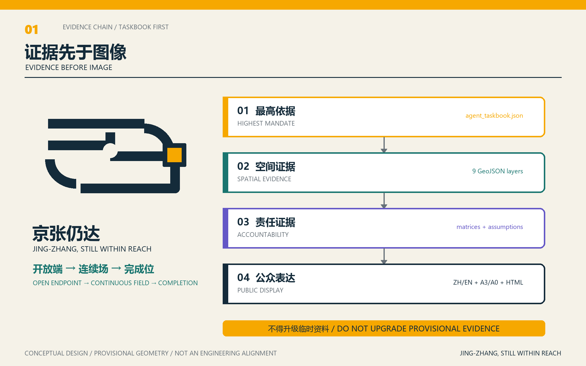
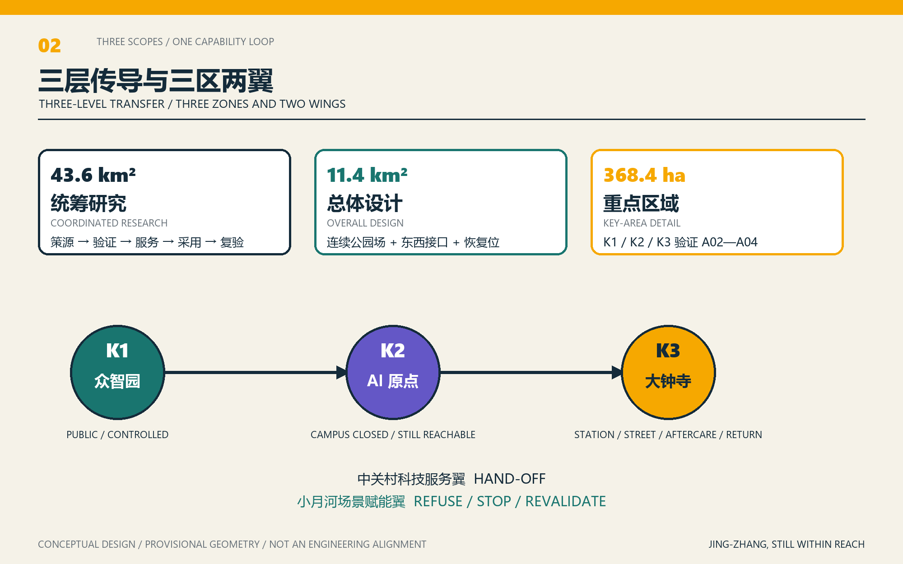
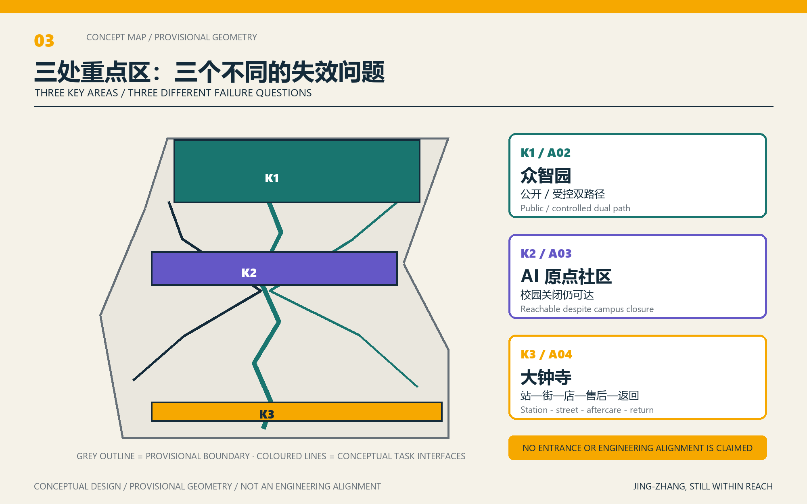
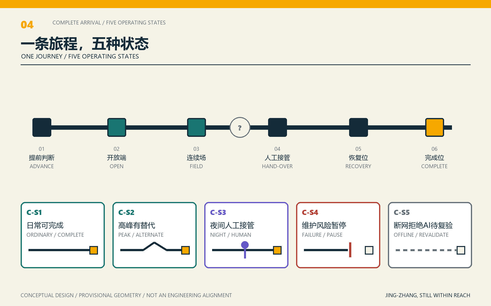
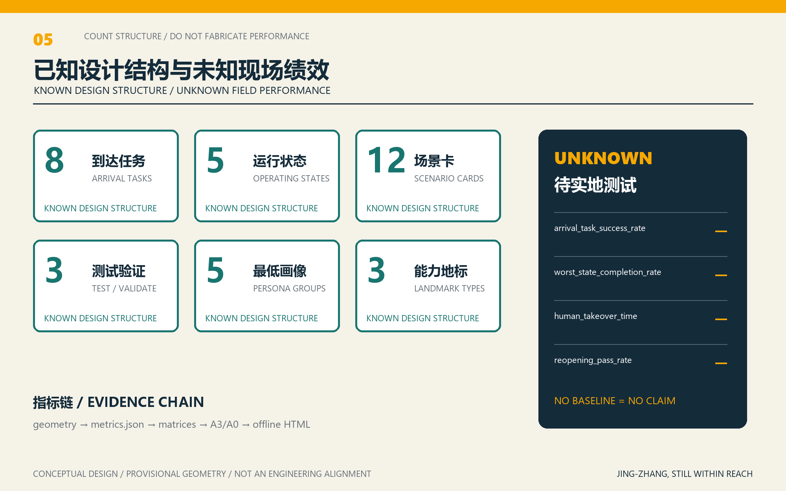

# JING-ZHANG, STILL WITHIN REACH

## Design Basis and Source List

This proposal treats `brief/site-package/agent_taskbook.json` as its highest design mandate. The official announcement issued by the Haidian Branch of the Beijing Municipal Commission of Planning and Natural Resources confirms the three spatial levels and professional tasks. “Continuity” therefore does not mean drawing a longer green line. It means a public capability that a real person can complete: no road, station entrance, lift, wall, gate, opening hour, organizational hand-off, or digital system may be the single point whose failure makes public value disappear [source:AGENT-TASKBOOK] [source:OFFICIAL-ANNOUNCEMENT] [depth:existing_conditions_diagnosis].

The acceptance object is eight complete arrival tasks, A01-A08, tested in five states: ordinary operation; peak or event; night; maintenance or failure; and network outage, power loss, or refusal of AI. Each task requires an advance decision surface, continuous transition surface, recovery position, no-AI baseline, accountable role, stop condition, and reopening evidence. GeoJSON stores spatial evidence; metrics store recalculable values; matrices store obligation and responsibility; the A3/A0 set and offline HTML communicate the same system. The task register, scenario cards, and state-responsibility matrix remain in this principal narrative so the core design cannot be hidden in side files.

The registered source boundary is explicit [source:SOURCE-REGISTRY]. The registry presently records seven formal-use items, one background-only item, and one provisional-only item. Background or provisional material cannot be promoted into an official boundary, statutory regulatory plan, official scoring basis, or government delivery commitment. `data/processed/agent_fact_pack.md` is a reading and routing layer rather than a new authority [source:PROCESSED-FACT-PACK]. Factual conclusions return to registered originals; complete provenance is stored in `sources.json`.

Official `SITE_BOUNDARY` and three official `KEY_AREA` polygons have not yet been supplied. The current package therefore uses `brief/site-package/geometry/provisional_boundaries.geojson` only for generation, self-checking, visualization, and design discussion. `geometry/site_boundary.geojson` and `geometry/key_areas.geojson` remain `provisional_constraint` with `official_boundary=false`; they are not official redlines, approval evidence, precise area evidence, or statutory control conclusions. When official polygons arrive, the boundary, key areas, land use, roads, green space, public space, buildings, phasing, and metrics must all be recalculated.

Issue #846 reports a background location discrepancy between the provisional overall area and an OSM-drawn heritage-park reference. Issue #1029 questions the location of `PROV-KEY-003`. Neither item upgrades OSM into a boundary, and neither blocks substantive review, but both prevent the temporary rectangular geometry from being presented as a confirmed urban form. Current areas and ratios prove only that the scaffold layers can be recalculated [source:BOUNDARY-SOURCE] [metric:site_area_sqm] [depth:risk_missing_data]. The boundary evidence is [data:geometry/site_boundary.geojson#SITE-001]; the three key-area records begin at [data:geometry/key_areas.geojson#PROV-KEY-001] and are checked by [metric:key_area_count].

## Three-Level Scope Framework

The official call defines three levels. The 43.6-square-kilometre coordinated research area addresses the AI industrial ecosystem, strategic positioning, innovation chain, and future urban form. The 11.4-square-kilometre overall design area covers the urban and industrial districts around the Jing-Zhang Heritage Park and requires an urban-renewal framework, industrial spatial layout, transport and municipal support, and character control. The 368.4-hectare key-area level requires detailed design for three districts, including programme, building scale, retain-renovate-demolish logic, public-space connection, and transport organization. These published quantities state the task scope and are not recalculated from the provisional polygons.

The three-level work is controlled by [depth:three_level_scope_framework] and [depth:overall_spatial_structure]. Spatial evidence uses [data:geometry/site_boundary.geojson#SITE-001] and [data:geometry/key_areas.geojson#PROV-KEY-001]; the task authority is [standard:PROJECT-OFFICIAL-ANNOUNCEMENT].

The three levels are not separate drawing sets. Coordinated research selects the industrial and urban-form logic; overall design converts it into renewal projects, spatial structure, and infrastructure capacity; detailed design tests whether plots, buildings, movement, public space, and AI applications can actually support a complete task. Geometry and metrics are generated only after the official-or-provisional status of the boundary and constraints is locked. Any area, proportion, scale, or project count that cannot be reproduced from structured evidence is excluded from a formal conclusion.

The concept is **JING-ZHANG, STILL WITHIN REACH**: a no-single-point-of-failure urban capability access system. It coordinates the three positionings, five functions, and “three zones and two wings” required by the taskbook. D1, **Open Field**, condenses the spatial mechanism into **open endpoint - continuous field - completion position**. D2 is retained as a human hand-over and public-help component. D3 becomes the five-state component family and a 60-second “same journey” explanation. The name commits the proposal to testing a complete task with users facing the greatest constraints rather than relabelling a conventional walking scheme [standard:PROJECT-AGENT-OPEN-CALL-TASKBOOK] [depth:overall_spatial_structure].

At the coordinated scale, the transfer path is university origin - full-stack validation - technology service - scenario adoption - public revalidation. At the overall scale, it becomes a continuous park field, east-west interfaces, help points, and recovery positions. At the detailed scale, Zhongzhiyuan tests public and controlled routes; AI Origin tests whether public capability survives campus closure; Dazhongsi tests the full station-street-parking-purchase or repair-aftercare-return journey. The Zhongguancun technology-service wing handles responsibility and resource hand-offs. The Xiaoyue River scenario-empowerment wing supports public applications that can be refused, stopped, and revalidated.

| Level | Design question | Proposal response | Evidence landing |
| --- | --- | --- | --- |
| Coordinated research | How should the AI ecosystem and future city be organized? | University origin, open collaboration, enterprise transfer, public experience, and international communication form one capability loop. | `compliance_matrix.json`, `standard_matrix.json` |
| Overall design | How do industry, renewal, mobility, municipal support, and character become spatial? | Land use, buildings, roads, green space, public space, and phasing act as one evidence system. | [data:geometry/land_use.geojson#LU-001], [data:geometry/roads.geojson#ROAD-001] |
| Key areas | How do three districts reach detailed-design depth? | Each receives a capability position, spatial action, AI scenario, and explicit delivery dependency. | [data:geometry/key_areas.geojson#PROV-KEY-001], [data:geometry/key_areas.geojson#PROV-KEY-002], [data:geometry/key_areas.geojson#PROV-KEY-003] |

## Coordinated Research Area: Industry and Future City Research

The research-area task is to build a world-class AI innovation ecosystem while linking Haidian’s universities and institutes, leading firms, computing-algorithm-data resources, incubators, listed companies, unicorns, and technology services. The spatial framework joins the innovation, industrial, talent, and urban-service chains. Naming and identity must support the Centennial Jing-Zhang Cultural Belt, Metropolitan AI Life Experience Belt, and AI Integrated Innovation Belt; they cannot remain slogans detached from public space and cultural resources. The taskbook also requires five functions and coordination across three zones and two wings, with a system that can be deepened into spatial structure, open scenarios, and operations [source:AGENT-TASKBOOK] [standard:PROJECT-AGENT-OPEN-CALL-TASKBOOK].

The local ecosystem is organized through eight elements: land and public space; industrial premises; capital and technology service; talent and community; computing and energy; data and rights; scenarios and procurement; and governance and revalidation. Zhongzhiyuan hosts full-stack validation and governance interfaces. AI Origin translates upstream research into publicly reachable capability. Dazhongsi hosts urban adoption and aftercare. The Zhongguancun wing transfers intellectual-property, capital, talent, and accountable ownership; the Xiaoyue River wing tests everyday public scenarios.

Six case bridges transfer mechanisms only. one-north links rail first/last mile, walking, and public space as one arrival chain. Punggol Digital District separates the relations among industry, university, community, controlled experiments, and operational responsibility [source:CASE-ONE-NORTH] [source:CASE-PUNGGOL-DIGITAL-DISTRICT].

Kendall Square demonstrates why an innovation district needs permeable blocks and public connections. STATION F makes public, semi-public, controlled, and through-passage gradients legible [source:CASE-KENDALL-SQUARE] [source:CASE-STATION-F]. Barcelona 22@ couples innovation economy with transport, green space, housing, facilities, and everyday services. Toronto Quayside is used as a risk case: changing project arrangements reinforce the need for independent review, participation, privacy, and democratic accountability before digital systems enter public space [source:CASE-BARCELONA-22AT] [source:CASE-TORONTO-QUAYSIDE]. Sources and “do not transfer” limits are registered in `sources.json`.

AI has three limited roles: assist advance decisions, assist cross-organization hand-offs, and assist public revalidation. It is never a mobility credential. Cash, paper, telephone, staffed counters, and human help cannot be removed by an AI layer. Personal trajectories or unexplained scores cannot replace planning or service decisions. Twelve scenarios are registered below; S01-S03 are industry testing and validation scenarios, and every scenario has a no-AI baseline and stop condition [depth:municipal_new_infrastructure].

The research framework returns to space through [standard:MOHURD-URBAN-DESIGN-MEASURES], [data:geometry/land_use.geojson#LU-001], and [data:geometry/public_space.geojson#PUBLIC-001]. In this way, an industrial strategy must produce visible and reviewable public interfaces rather than an unlocated ecosystem diagram. Missing enterprise permissions, operating agreements, and investment evidence remain assumptions and are not converted into named delivery commitments.

## Overall Design Area: Urban Renewal and Regulatory-Plan-Level Urban Design

The overall area requires regulatory-plan-level urban-design content: a renewal spatial structure, identification method for underperforming spaces, project list, implementation policies, industrial programme proportions, spatial organization, building-scale method, and capacity assessment. `geometry/land_use.geojson` must cover the design boundary without overlap. `geometry/buildings.geojson` expresses conceptual retained or renewal footprints. `geometry/roads.geojson` expresses local circulation, walking, cycling, and rail interchange. `metrics.json` recalculates area, proportions, and feature counts.

The review objects are separated by [standard:MOHURD-CONTROL-DETAILED-PLANNING]: [data:geometry/land_use.geojson#LU-001] for land-use structure, [data:geometry/buildings.geojson#BLDG-001] for building footprint, [data:geometry/roads.geojson#ROAD-001] for movement, and [metric:building_footprint_area_sqm] for footprint checking. [depth:land_use_layout] and [depth:development_intensity_controls] control professional depth.

The design must support station integration, local street circulation, bicycle parking, parking supply, innovation-service platforms, talent amenities, new infrastructure, distributed energy, and edge computing. Building height, development intensity, road redlines, setbacks, fire access, and facility standards remain **unknown pending official regulatory and engineering conditions**. No agent-generated number is presented as an approved control.

The present vertical colour bands and single sample building are machine-contract scaffold content, not a site diagnosis. Spatial development replaces them with a continuous public field, east-west arrival interfaces, help and recovery components, and three task-oriented district interfaces. Until parcel, building, ownership, heritage, drainage, fire, and utility datasets are cleared, retain-renovate-demolish decisions stay at method level and cannot identify a real building for removal.

## Detailed Design of Key Areas

Detailed design of all three key areas is mandatory. Zhongzhiyuan must address the national AI platform, full-stack indigenous innovation, standards and safety governance, industry display, external access, Qing River culture, and a low-carbon exchange environment. AI Origin must address near-campus innovation, incubation and transfer, talent services, open-source systems, events, retain-renovate-demolish logic, demonstration, living services, campus-park walking links, and station integration. Dazhongsi must address leading enterprises, agents, smart terminals, content consumption, data elements, digital assets, commerce, composite use of planned green space, Dazhongsi Station integration, and four-quadrant walking connections.

All three records appear in `geometry/key_areas.geojson`. Their present status is provisional, and references to [data:geometry/key_areas.geojson#PROV-KEY-001], [data:geometry/key_areas.geojson#PROV-KEY-002], and [data:geometry/key_areas.geojson#PROV-KEY-003] communicate that limitation. [depth:three_key_area_detailed_design] checks programme, buildings, transport, public space, and implementation together. “Create a demonstration zone” without these evidentiary layers is incomplete.

Eight complete arrival tasks put the three zones, two wings, and everyday public life into one acceptance language:

| ID | Complete arrival task | Primary geography | Completion evidence |
| --- | --- | --- | --- |
| A01 | Enter the continuous park from a community or public-transport point and reach a public interface on the other side. | Overall area | Continuous passage does not depend on one gate, app, or lift. |
| A02 | Reach a public innovation service in Zhongzhiyuan and receive a public substitute if the controlled area is unavailable. | Zhongzhiyuan | Public and controlled paths both show state and recovery position. |
| A03 | Reach a public research-transfer service at AI Origin without relying on campus opening. | AI Origin | The public capability interface remains reachable when campus is closed. |
| A04 | From Dazhongsi Station, complete crossing, parking, purchase or repair, aftercare, and return. | Dazhongsi | The journey does not break at a quadrant, parking point, or aftercare step. |
| A05 | Complete an enquiry and hand-off for intellectual property, capital, or talent service. | Zhongguancun wing | Ownership, queue, transfer, and offline alternative are visible. |
| A06 | Complete a public experience or test while retaining the right to refuse AI, withdraw data, or use a non-digital path. | Xiaoyue River wing | Basic service and passage remain available to nonparticipants. |
| A07 | Complete cultural learning, contribution display, and international exchange. | Whole belt | Information is readable, audible, and tactile; contribution status is traceable. |
| A08 | Complete substitution, help, recovery, and revalidation during equipment, organizational, or digital failure. | Whole belt | Human takeover, stop condition, and peer-user revalidation all exist. |

Every task is tested in ordinary, peak/event, night, maintenance/failure, and offline/power-loss/refusal states. State graphics must not rely on colour alone; text, form, tactile, or operational cues also change. A08 closes the system: an interface cannot regain the “Still Within Reach” mark if accountable owner, substitute path, no-AI baseline, or reopening evidence is missing [source:AGENT-TASKBOOK] [depth:risk_missing_data].

| Key area | Capability position | Spatial move | Scenario and operation | Evidence |
| --- | --- | --- | --- | --- |
| Zhongzhiyuan | Public/controlled dual path | Controlled validation may pause, while public passage, enquiry, observation, and exit remain; Qing River, Fifth Ring Road, ownership, and fire conditions require professional confirmation. | S02 five-state interface test; S03 dual-path sandbox | [data:geometry/key_areas.geojson#PROV-KEY-001] |
| AI Origin | Reachable despite campus closure | Transfer, talent, and open-source release sit at a publicly reachable interface; opening conditions are knowable before entry. | S06 near-campus transfer booking; S09 accessible cultural interpretation | [data:geometry/key_areas.geojson#PROV-KEY-002] |
| Dazhongsi | Complete journey first | Test station-crossing-parking-consumption or repair-aftercare-return; any broken step triggers an end-to-end substitute. No entrance or engineering alignment is claimed as confirmed. | S07 complete-journey assistant; S05 human-takeover help point | [data:geometry/key_areas.geojson#PROV-KEY-003] |

## AI Innovation Ecosystem, Personas, and AI+ Scenarios

Personas are defined by the task a person must complete under a given condition, not by a demographic label. Minimum coverage includes wheelchair users and carers; older people and people with low digital confidence; nearby residents and night users; university researchers, developers, and start-ups; and enterprise staff, commuters, and international visitors. Personas are never used for forced identification or commercial recommendation [source:AGENT-TASKBOOK].

| Persona | Need | Spatial response | Self-check boundary |
| --- | --- | --- | --- |
| Wheelchair user / carer | Continuous accessible path, advance decision, rest, and toilet information | Low-threshold transition, recovery position, tactile/audio/human help | No single lift or app is the only completion route. |
| Older / low-digital-confidence user | Non-digital entry, staffed handling, clear receipt | Human takeover, telephone, counter, and paper in parallel | No mandatory scan, registration, or face recognition. |
| Resident / night user | Low disturbance, opening information, safe help | Night baseline, quiet alternative, tiered event capacity | No personal profile for promotion. |
| Researcher / developer / start-up | Public transfer, controlled test, accountable hand-off | AI Origin public interface and Zhongzhiyuan dual path | Research, corporate, and personal data need separate authorization. |
| Enterprise staff / commuter / international visitor | Complete station-city journey, bilingual information, aftercare and return | Dazhongsi end-to-end route and technology-service hand-off | Brands, case claims, and commitments require permission. |

AI scenarios land in spatial and governance evidence: [data:geometry/public_space.geojson#PUBLIC-001] for public interfaces, [data:geometry/roads.geojson#ROAD-001] for movement, and [data:geometry/green_space.geojson#GREEN-001] for open space. [metric:public_space_ratio] and [metric:green_ratio] describe only the provisional design layers. There are 12 scenario cards, including three testing and validation scenarios and five minimum persona groups.

| Scenario | Spatial carrier | Design and governance rule |
| --- | --- | --- |
| S01 Worst-arrival diagnosis (test) | Whole belt | Users facing stronger constraints re-walk A01-A08; no face recognition; stop on safety risk. |
| S02 Five-state interface test (test) | Key interfaces | Test ordinary, peak, night, failure, and offline/refusal states at the same entrance. |
| S03 Public/controlled dual-path sandbox (test) | Zhongzhiyuan | If controlled testing stops, public route and staffed enquiry remain. |
| S04 Explainable walking alert | Park and interfaces | Facility and aggregate signals assist advance judgment; physical signs and people are the baseline. |
| S05 Human takeover point | Whole-belt nodes | Directions, printing, complaints, and service transfer without forced registration. |
| S06 Near-campus transfer booking | AI Origin | In-person, phone, and digital booking in parallel; campus closure does not cancel the public service. |
| S07 Dazhongsi complete-journey assistant | Dazhongsi | Links station, street, shop, aftercare, and return; any break produces a complete substitute. |
| S08 Low-disturbance public-space scheduling | Community/event edges | Capacity, quiet time, and alternative spaces reduce conflict without tracking individuals. |
| S09 Accessible Jing-Zhang interpretation | Cultural nodes | Bilingual text, captions, audio, tactile and easy-read formats; generated content is disclosed. |
| S10 Contribution and revalidation display | Three capability landmarks | Shows task, evidence, and status without confusing submission, review, selection, and delivery. |
| S11 Privacy-friendly edge maintenance | Facility nodes | Identifies fault type only; automated judgment exits when unexplained or unreliable. |
| S12 Global Still-Within-Reach Week | Public experience route | Uses complete tasks for open days and revalidation; no unapproved event is promised. |

Urban agents may assist in finding walking breaks, maintaining facilities, transferring enterprise-service requests, and reviewing event risk, but cannot replace planning approval or create unauthorized personal profiles. Data minimization, public provenance, explainability, refusal, human review, and deletion or withdrawal are operational requirements. A scenario stops when basic passage is conditioned on participation, a risk cannot be bounded, rights or sources are unclear, or no accountable human hand-off exists.

## Land Use, Building Scale, and Retain-Renovate-Demolish Strategy

The current `land_use.geojson` and `buildings.geojson` prove topology and machine-contract execution only. Four vertical bands and one demonstration footprint are not asserted as existing conditions or a confirmed design. Spatial development will use the continuous park field, east-west arrival interfaces, help and recovery positions, and task interfaces for the three zones. Without parcels, existing buildings, ownership, regulatory controls, and engineering conditions, retain-renovate-demolish stays a verification method rather than naming a real building for demolition [standard:MNR-LAND-USE-CLASSIFICATION-GUIDE] [depth:retain_renovate_demolish].

Land-use classification follows [standard:MNR-LAND-USE-CLASSIFICATION-GUIDE]. Height, massing, interface, and character are managed by [depth:height_massing_character]; renewal treatment is managed by [depth:retain_renovate_demolish]. Evidence includes [data:geometry/land_use.geojson#LU-001], [data:geometry/buildings.geojson#BLDG-001], and [metric:building_footprint_area_sqm].

Building scale and intensity must agree with `metrics.json`. Floor-area ratio, height, density, setbacks, road redlines, and building-control lines remain `status=unknown` when no official condition exists. Their metric records explain missing input, current assumption, and recalculation path instead of fabricating precision. The A3 booklet will pair the renewal list with a checking table; the A0 boards will communicate the spatial structure and key areas; HTML will connect layers and evidence.

Retain means retaining verified cultural fabric, useful structures, mature landscape, and existing public capability after survey. Renovate means reversible accessibility, ground-floor interface, energy, safety, or reuse work subject to structural and heritage review. Demolish is never inferred from low utilization alone; it requires ownership, structural, heritage, environmental, relocation, and public-interest evidence plus authorization. These rules apply before any site-specific action is accepted.

## Transport, Rail, Municipal Infrastructure, and Public Services

Mobility responds to station integration, local circulation, walking breaks, external access, parking, bicycle parking, and low-carbon movement. Relevant interfaces include the North Fifth Ring Road, crossings of the Jing-Zhang Heritage Park, Wudaokou, Qinghuadongluxikou, Dazhongsi Station, and areas near major employers. Because road redlines, station entrances, sections, and engineering conditions are missing, the proposal defines task and interface logic rather than pretending to fix bridge, tunnel, or entrance alignments.

[depth:traffic_rail_slow_parking] and [depth:municipal_new_infrastructure] control professional depth. Spatial evidence uses [data:geometry/roads.geojson#ROAD-001], [data:geometry/public_space.geojson#PUBLIC-001], and [data:geometry/constraints.geojson]. A route must remain inside the submission boundary and be cross-checked against public space, green space, industrial interfaces, and key areas. A provisional boundary makes every transport conclusion provisional as well.

The movement hierarchy is: a legible continuous public field; east-west arrival interfaces; station and neighbourhood feeders; and short recovery loops. Each decision surface shows state before a user commits. Each transition provides a reversible fallback. Each completion position confirms arrival, help, and return. Physical signage, staffed help, and accessible route information are the minimum; AI may improve prediction but cannot become the route itself.

Municipal and public-service planning includes innovation platforms, talent services, distributed energy, edge computing, and conventional infrastructure. Standards, service radius, operating model, and phasing cannot be finalized without pipes, energy, drainage, flood, fire, emergency, and ownership information. These are formal preconditions in `assumptions.json`, not aesthetic blanks to be concealed.

## Blue-Green Network, Public Space, and Urban Character

The blue-green system is first tested through A01 rather than a claimed length. Before a real discontinuity, an advance decision surface explains status. Across a road, ownership, or time boundary, a continuous transition maintains the task. When unavailable, a recovery position permits safe return and human help. Lighting, seating, toilet direction, staffed assistance, and maintenance-hours information are the baseline. Exact breaks, sections, heritage controls, and blue lines remain unknown, so no false engineering alignment is drawn [standard:MOHURD-URBAN-DESIGN-MEASURES] [depth:blue_green_public_space].

Green and public-space evidence is checked through [data:geometry/green_space.geojson#GREEN-001], [data:geometry/public_space.geojson#PUBLIC-001], [metric:green_ratio], and [metric:public_space_ratio]. Their current percentages describe provisional design geometry only. Urban character integrates public space, building interface, and landscape through the professional standard matrix rather than using an ornamental “AI style.”

The cultural narrative has three capability histories. The Jing-Zhang Railway represents indigenous construction and a complete chain of responsibility. Zhongguancun represents open transfer and cross-institution collaboration. Emerging AI culture represents explainable, optional, and publicly revalidated intelligence. D1, open endpoint - continuous field - completion position, provides the identity. Five-state components provide operational guidance.

Three capability landmarks remain modest and useful. The **First-Arrival Court** records a first verified complete arrival. The **Hand-over Kiosk** provides people, paper, telephone, and non-digital substitution. The **Revalidation Station** requires a peer user to test a repaired task before reopening. No location, material, size, landmark building, or construction approval is claimed until professional survey and consultation are complete [source:AGENT-TASKBOOK] [depth:height_massing_character].

## Renewal Projects, Implementation Policy, and Phasing

An auditable renewal list records location, type, capability, accountable role, dependencies, phase, risk, and evaluation method. Policy topics include coordinated renewal, spatial supply, operation, industry services, public participation, data governance, and property coordination. `geometry/phasing.geojson` stores spatial phasing; [depth:renewal_project_list] and [depth:phasing_implementation] control detail. Without ownership, funds, implementation body, or approval pathway, an item remains a proposal rather than a delivery promise.

| ID | Project | Type | Principal dependency | Evidence |
| --- | --- | --- | --- | --- |
| JZ-01 | A01 park-crossing arrival pilot | Public space / transport | Road redline, under-bridge space, heritage, traffic management | [data:geometry/roads.geojson#ROAD-001] |
| JZ-02 | Zhongzhiyuan public/controlled dual path | Industry validation / public interface | Ownership, fire, Qing River, opening hours | [data:geometry/key_areas.geojson#PROV-KEY-001] |
| JZ-03 | AI Origin public capability interface | Light-touch renewal / industry service | Campus edge, ownership, ground-floor use, opening hours | [data:geometry/key_areas.geojson#PROV-KEY-002] |
| JZ-04 | Dazhongsi complete-journey pilot | Rail / walking / aftercare | Entrances, road sections, parking, utilities, commerce | [data:geometry/key_areas.geojson#PROV-KEY-003] |
| JZ-05 | Human-takeover and recovery component | Public service / accessibility | Accountable body, staffed hours, accessibility review | [data:geometry/public_space.geojson#PUBLIC-001] |
| JZ-06 | Five-state task validation programme | Scenario governance / operation | Scripts, public representatives, stop and reopening protocol | [data:geometry/phasing.geojson#PHASE-001] |

Phasing follows evidence maturity, not a fictional construction schedule. Phase 0 obtains official boundaries, discontinuity survey, ownership, heritage, fire, and facility-state evidence. Phase 1 selects one reversible complete task and installs low-cost state signs, human takeover, and recovery position. Phase 2 tests A02-A04 in the three districts and publishes stop/reopening evidence. Phase 3 evaluates whole-belt long-term operation. A Global Still-Within-Reach Week, developer revalidation, public experience route, and international communication are conceptual until venue, safety, permission, responsibility, and budget are separately confirmed.

Operating ownership is role-based at this stage: a public-space steward owns safe passage; a service owner owns opening and hand-off; a data controller owns consent, withdrawal, and deletion; an accessibility reviewer signs off baseline access; and a peer-user panel tests reopening. A named institution or company enters the package only after authorization. Public evidence records task state, fault category, accountable role, action, revalidation date, and expiry - not personal movement history.

## Metrics, Area Recalculation, and Compliance Matrix

Completion metrics precede coverage metrics. The first design register contains 8 parent tasks, 5 operating states, 12 scenario cards, 3 testing scenarios, 5 minimum persona groups, and 3 capability-landmark types. These are countable design structures, not field-performance claims. Arrival success, worst-state completion, human-takeover time, and reopening pass rate remain `unknown` without field testing. Geometric areas and ratios describe only the provisional layers [metric:site_area_sqm] [metric:key_area_count] [depth:metrics_recalculation].

`metrics.json` stores value, unit, status, formula or method, source file, assumptions, and confidence. Directly reproducible geometry metrics include boundary area, green ratio, public-space ratio, building footprint, and phase area. Control metrics such as floor-area ratio, height, density, setback, road redline, and facility standard require official planning inputs. Performance metrics such as innovation outcomes, service satisfaction, accessibility, participation, and scenario use require operations evidence. The latter two groups cannot be converted into known values merely to make the document look complete.

`compliance_matrix.json` is the main task-response controller. Every announcement item and taskbook item maps to a report section, layer, metric, drawing, HTML evidence, source, assumption, and self-check. Omission of any mandatory task in announcement 1.3, 1.4, 1.5 or agent.1-agent.6 prevents readiness for professional scoring. `standard_matrix.json` records whether a reference is a project mandate, national regulation, planning standard, or applicability-limited law. `design_depth_matrix.json` prevents a well-formatted but professionally thin package from passing.

The count of eight tasks does not prove that eight tasks work. A task becomes field-verified only after a dated test records starting condition, participant constraints, route or service sequence, fault state, no-AI completion, help or transfer, end condition, stop decision, corrective action, and peer-user reopening. Until that evidence exists, the package labels the indicators as design coverage or unknown performance.

## Risk, Copyright, and Compliance

The v2 package requires full Chinese and English counterparts. This English file translates the principal narrative; both HTML pages, A3/A0 documents, and all text-bearing display material must be bilingual or explicitly language-neutral. `docs/terminology-glossary.md` governs recommended competition terms. Assets, data, diagrams, and code are registered in `sources.json` or `report/copyright_statement.md`. Offline HTML must not load remote scripts, tiles, fonts, iframes, forms, APIs, or tracking.

Risk evidence uses [depth:risk_missing_data], [data:geometry/constraints.geojson], and [source:SITE-PACKAGE]. The package does not claim official approval, adopted regulatory controls, final ownership, final building scale, funding, event permission, or guaranteed delivery. Nine material gaps remain: official three-level and three-key-area polygons; regulatory controls; road sections and station entrances; parcels and ownership; existing buildings; heritage constraints; utilities, fire, and flood conditions; public-service baselines; and operations or footfall evidence.

| Task | Ordinary | Peak / event | Night | Maintenance / failure | Offline / refuse AI | Stop and reopen |
| --- | --- | --- | --- | --- | --- | --- |
| A01 park crossing | Continuous passage | Split flow without closing substitute | Lighting, help, toilet direction | Advance notice and reversible detour | Physical signs and staffed enquiry | Stop if substitute is unsafe; peer re-walk before reopening. |
| A02 Zhongzhiyuan service | Public/controlled separation | Visible queue and capacity | Published public hours | Controlled closure leaves public interface | Phone and in-person enquiry | Stop if public service is held hostage; revalidate both paths. |
| A03 AI Origin transfer | Campus-external service continues | Booking and walk-in quota | Reduced but query/help remains | Transfer if one institution fails | Paper, phone, staffed booking | Stop if campus entry is mandatory; retest with campus closed. |
| A04 Dazhongsi journey | Station-street-shop-return | Quadrant and parking overflow plan | Return and aftercare hours visible | Any break produces complete substitute | Offline signs, receipt, human aftercare | Stop if return or aftercare fails; end-to-end re-walk. |
| A05 service hand-off | Owner and queue visible | Tiered response | Asynchronous record and human duty | Timeout escalates to accountable person | Phone, counter, paper receipt | Stop infinite transfer; reopen after a real closed loop. |
| A06 experience/test | Participate or observe | Capacity and exit separated | Low-stimulus alternative | Test closure does not block passage | Equivalent basic service after refusal | Stop if refusal/deletion fails; refusal user revalidates. |
| A07 cultural learning | Multisensory bilingual material | Event and everyday modes coexist | Easy-read, low-glare, quiet substitute | Correct or withdraw content | Paper, tactile, human interpretation | Stop unclear fact or rights; source and access review. |
| A08 failure recovery | Evidence current for normal state | Human takeover pre-positioned | Night accountability contact | Stop-substitute-repair-revalidate | Recovery works without network | Stop on risk or expired evidence; peer validation and owner closure. |

Accessibility, staffed service, and generative-AI laws are cited only within their legal scope; the proposal does not expand a provision into an unsupported universal claim. Data collection is minimized. AI-generated content is disclosed. Automated advice remains contestable. A person can refuse AI without losing baseline passage or public service. Any professional conclusion affected by missing official data is explicitly downgraded.

All original narrative structure, diagrams, and code created for this package are contributed under `COMMUNITY-DISPLAY-ONLY`. Official materials retain their original rights. Base geometry is registered as provisional site-package data. No third-party logo, photograph, private dataset, personal data, proprietary map tile, or unlicensed font is embedded in the deliverables.

## References

- `brief/public-brief.md`
- `brief/site-package/agent_taskbook.json` - highest agent-facing task mandate
- `brief/site-package/design_brief.json`
- `brief/site-package/allowed_design_space.json`
- `brief/site-package/ranges/planning_limits.json`
- `data/source_registry.json`
- `data/processed/agent_fact_pack.md`
- `data/processed/project_scope_summary.csv`
- `data/processed/agent_task_requirements.csv`
- `data/processed/source_use_matrix.csv`
- `data/processed/missing_data_checklist.csv`
- Complete machine indexes: `sources.json`, `metrics.json`, `compliance_matrix.json`, `standard_matrix.json`, and `design_depth_matrix.json` [source:SITE-PACKAGE]
