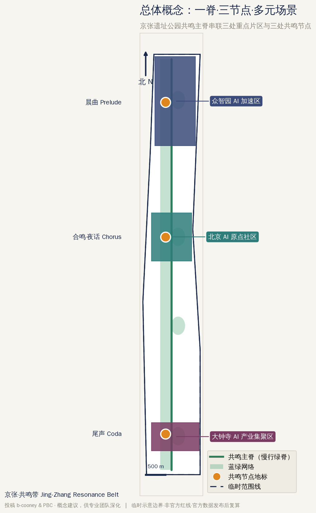
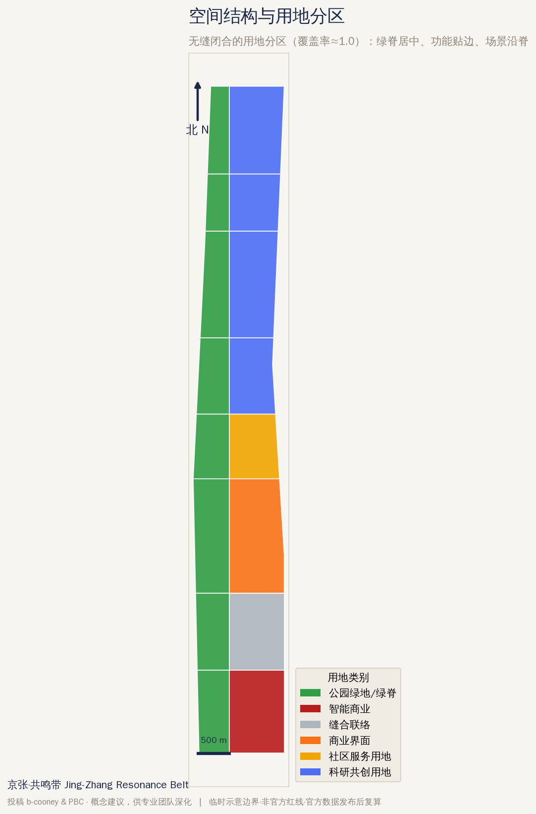
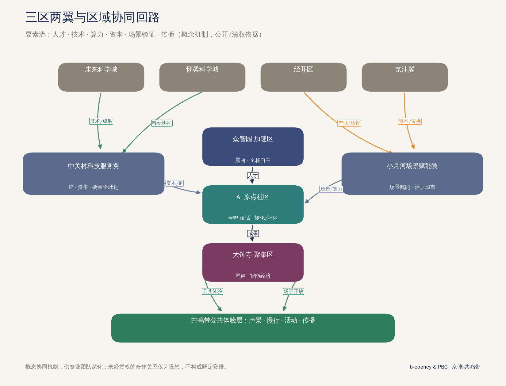
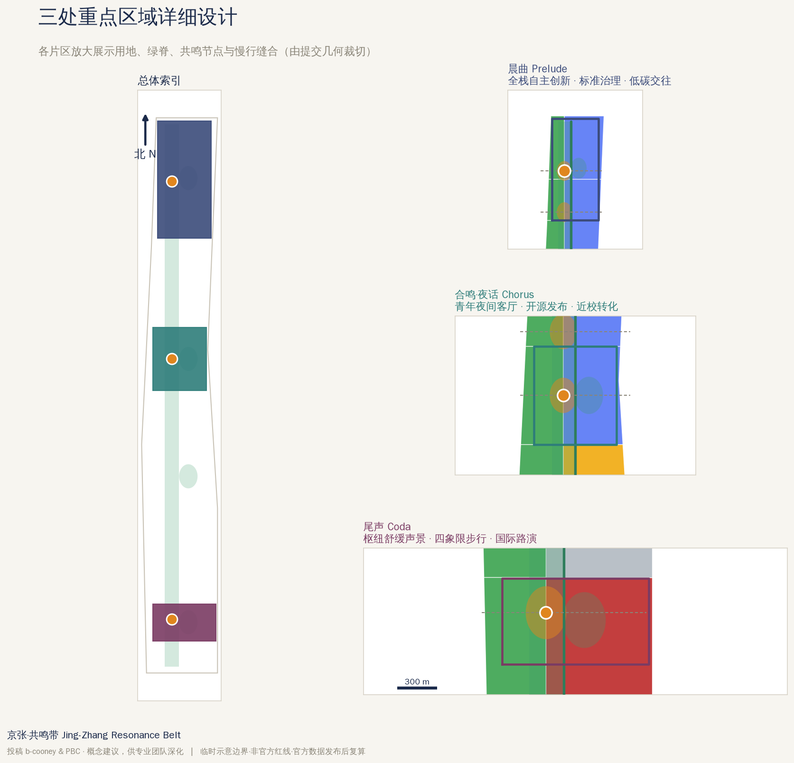
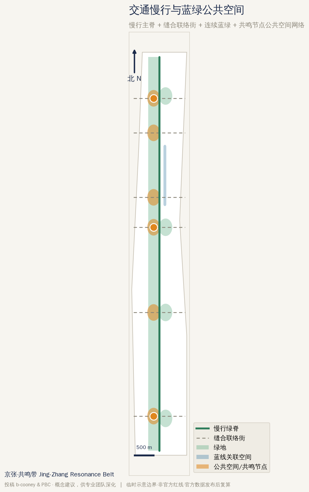
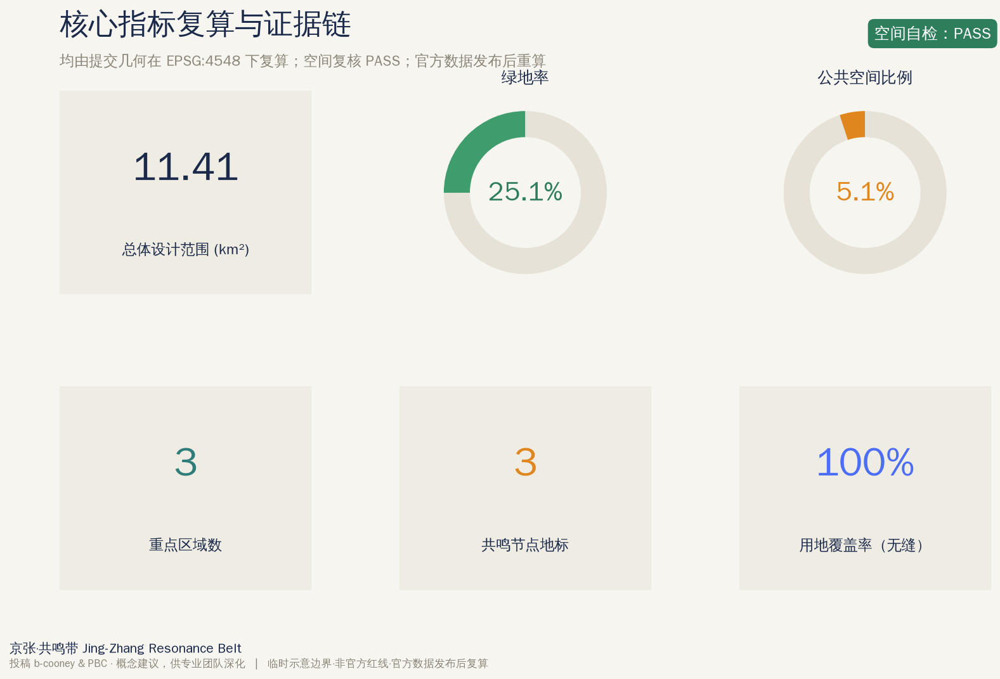

# 京张·共鸣带 Jing-Zhang Resonance Belt

**作者 Authors｜b-cooney · PBC**

> 一句话概念：让一条会呼吸的城市声音，成为百年京张AI创新带最先被“听见”的公共基础设施——永不重复、放松身心、随人群与时间自适应，把 AI 从屏幕里的算法变成人人可感的城市体验。

## 设计依据与资料清单

本 formal 方案以北京市规划和自然资源委员会海淀分局发布的《百年京张AI创新带城市设计国际方案征集资格预审公告》为第一依据，并以 `brief/site-package/` 中经维护者登记的临时示意边界、重点区域、枚举、指标和来源清单为机器可读依据 [source:OFFICIAL-ANNOUNCEMENT] [source:AGENT-TASKBOOK]。方案生成前已读取 `design_brief.json`、`allowed_design_space.json`、`sources.json`、`enums/`、`ranges/planning_limits.json`、`schemas/` 与 `data/source_registry.json`，并据此建立任务、三层范围、资料用途与缺口清单。所有设计判断都被拆分为可追溯来源、可复算指标、可校验图层与可人工复核假设；公告要求达到控制性详细规划与规划综合实施方案的城市设计深度，因此文字叙述不替代 GeoJSON、指标表、A3 文册、A0 展板与 HTML 展览 [standard:PROJECT-OFFICIAL-ANNOUNCEMENT] [depth:existing_conditions_diagnosis]。

本方案的“标志性内容”是一套城市尺度的**生成式自适应声景系统**：它不是背景音乐，而是被当作与照明、座椅、绿化同级的公共空间基础设施来设计。声景在夜间聚集地、交通枢纽厅和遗址公园慢行带持续生成永不重复的舒缓音乐，并依据**时间、人流密度、天气与轨道到发节律等非个人化的聚合信号**自适应变化。它服务公告“都市AI生活体验带”的定位，把 AI 的公共价值从效率叙事扩展到**身心健康、社会交往与城市归属感**。

资料登记表的使用边界如下 [source:SOURCE-REGISTRY]：

- `data/source_registry.json` 登记公开、清权与临时资料的用途边界；本方案新增的健康循证、全球案例与生成工具来源统一登记在本包 `sources.json`。
- agent 不得把 `background_only` 或 `provisional_only` 资料升级为 official boundary、法定控规、正式评分依据或政府实施承诺。
- 声景健康效益的循证材料按“背景与设计依据”使用，不作为法定控制指标；采集类场景一律遵循数据最小化、聚合化与可人工复核原则。

`data/processed/agent_fact_pack.md` 是阅读导航层而非新的权威来源 [source:PROCESSED-FACT-PACK]；事实判断仍回到已登记原始材料 [source:OFFICIAL-ANNOUNCEMENT]，完整来源关系由 `sources.json` 保存。

在官方 `SITE_BOUNDARY` 与三处 `KEY_AREA` 尚未公开时，提交包中的 `geometry/site_boundary.geojson` 与 `geometry/key_areas.geojson` 均标注为 `provisional_constraint`、`official_boundary=false`，只能用于方案生成、自检、可视化与设计讨论，不能作为 official redline、审批依据、精确面积依据或法定控制结论 [data:geometry/site_boundary.geojson#SITE-001] [data:geometry/key_areas.geojson#PROV-KEY-001]。该组织方数据缺口本身不阻断内容评分；替换 official polygons 后，用地、道路、绿地、公共空间、建筑、分期与 metrics 均需重算，声景节点布点也需回校。边界解释可回到总体范围面积复算 [metric:site_area_sqm]，重点区数量由独立指标核对 [metric:key_area_count]。

## 三层范围工作框架

方案按公告三个层次组织工作：统筹研究范围（约 43.6 平方公里）关注 AI 产业生态、战略定位、创新链与未来城市形态；总体设计范围（约 11.4 平方公里，京张遗址公园周边 1–2 公里城市地区与产业区）要求形成城市更新总体框架、产业空间布局、交通市政支撑与城市风貌控制；重点区域范围（约 368.4 公顷三处详细设计地区）要求明确功能业态、建筑规模、拆改留分类、公共空间连通与交通组织 [depth:three_level_scope_framework]。三层在 `compliance_matrix.json` 中逐条映射，保证公告 1.3、1.4、1.5 与 agent.1–agent.6 均有章节、图层、指标、图纸与 HTML 证据。

本方案的总体概念为**“京张·共鸣带 / Jing-Zhang Resonance Belt”**：以京张遗址公园为历史与公共空间主轴（“共鸣主脊”），以众智园、北京 · AI 原点社区、大钟寺三处重点片区为创新锚点，以高校、企业、社区与轨道站点为日常网络，形成“**一脊三节点 · 多元场景 · 蓝绿慢行复合环**”的空间组织 [depth:overall_spatial_structure] [data:geometry/land_use.geojson#LU-001]。这里的“一脊”不是新增红线，而是把公告三层范围转译为一条可被听见、可被走通的公共主轴；“三节点”对应下文三处 AI 朝圣地标（共鸣节点）；“多元场景”对应 AI+ 公共服务、产业服务与城市生活的可运营节点；“复合环”对应慢行、绿地、公共空间与活动路线的联动。

命名系统以“共鸣（Resonance）”为母题，向三方向延展：其一为声学层面的城市声音；其二为社会层面的人群共处与交往；其三为历史层面的百年京张向 AI 未来的回响。“带（Belt）”直接呼应公告“AI 创新带”，兼顾国际传播辨识度。三处重点片区在保留官方名称的前提下，叠加乐章式副名以形成可延展的导视与运营语汇：众智园·**晨曲（Prelude）**、AI原点社区·**合鸣·夜话（Chorus）**、大钟寺·**尾声（Coda）**。

| 层级 | 设计问题 | 方案回答 | 数据落点 |
| --- | --- | --- | --- |
| 统筹研究范围 | AI 产业生态与未来城市形态如何组织 | 建立“高校策源—开源协作—企业转化—公共体验—国际传播”创新链，并以声景为公共体验入口 | compliance_matrix.json、standard_matrix.json |
| 总体设计范围 | 产业空间、城市更新、交通市政与风貌如何落图 | 用地、建筑、道路、绿地、公共空间与分期图层共同表达 | [data:geometry/land_use.geojson#LU-001]、[data:geometry/roads.geojson#ROAD-001] |
| 重点区域范围 | 三处片区如何达到详细设计深度 | 分别提出定位、空间动作、AI 场景与共鸣节点 | [data:geometry/key_areas.geojson#PROV-KEY-001]、[data:geometry/key_areas.geojson#PROV-KEY-002]、[data:geometry/key_areas.geojson#PROV-KEY-003] |

## 统筹研究范围产业与未来城市研究

统筹研究范围的核心任务是构建世界级 AI 创新生态体系，并回应“三大定位、五大功能、三区两翼”协同 [source:AGENT-TASKBOOK] [standard:PROJECT-AGENT-OPEN-CALL-TASKBOOK]。方案梳理海淀高校院所、头部企业、算力算法数据要素、孵化平台与科技服务资源，提出 AI 创新链、产业链、人才链与城市服务链的空间协同框架。命名与 Logo 方向服务于“百年京张文化带、都市AI生活体验带、AI融合创新带”的整体辨识度：视觉母题取“声波—轨道—链路”三重叠合的连续波纹，既是声景的可视化，也是京张铁路轨迹与创新链路的抽象，可延展为导视、灯光、公共艺术与活动主视觉。以上均为可供专业团队深化的概念建议，不构成法定规划或商标结论。

统筹研究并不新增伪精确红线；它通过城市风貌、公共空间与建筑布局统筹回接可见空间结构 [standard:MOHURD-URBAN-DESIGN-MEASURES] [data:geometry/public_space.geojson#PUBLIC-001] [depth:overall_spatial_structure]。

**全球案例研究（5–8 例，作为设计参照与背景依据）** [source:CASE-STUDIES]：

| 编号 | 案例 | 与本方案的关联 | 借鉴要点 |
| --- | --- | --- | --- |
| C1 | Brian Eno《Music for Airports》与生成式环境音乐 | 声景的“功能性、非侵入、永不重复”范式 | 生成规则而非固定曲目；服务空间氛围而非表演 |
| C2 | 赫尔辛基 Oodi 图书馆与城市“第三空间” | 合鸣·夜话节点作为青年友好公共客厅 | 开放、免费、可停留、可协作的公共性 |
| C3 | 巴塞罗那 Superblocks 超级街区 | 慢行优先与公共健康导向的街道再分配 | 以健康与交往指标评估空间改造 |
| C4 | 巴塞罗那 Sónar（音乐+科技节） | agent.6 年度活动体系与国际传播 | 产业—艺术—城市联动的活动 IP |
| C5 | 林茨 Ars Electronica（AI 艺术与开放实验室） | 开发者社区运营与 AI 文化叙事 | 常设实验室 + 年度节庆 + 荣誉体系 |
| C6 | 新加坡智慧国（Smart Nation）公共服务 | AI+ 公共服务与治理边界 | 以公共服务为切口、强调人本与信任 |
| C7 | teamLab / 沉浸式公共艺术 | 共鸣节点的多模态体验与可及性 | 交互与无障碍、静态后备的平衡 |
| C8 | 多伦多 Sidewalk Labs（审慎案例） | 数据治理与隐私的反面教训 | 以数据最小化与人工复核规避监控争议 |

未来城市形态研究回答 AI 如何改变工作、生活、社交、学习、交通与公共服务：方案把 AI 交通系统、连续绿色空间、创新服务设施与国际化生活工作氛围落实为可定位的功能区、节点、廊道与场景，而非泛泛的技术愿景。声景系统在此作为“可感知的 AI 公共层”，把抽象的算力与模型转化为市民每天可听、可停留、可参与的城市体验。产业战略指标、AI 创新指数、人才密度与 AI+ 应用重点区域写入指标体系，并标明官方、设计建议与待正式数据校准的区分；所有活动、开放场景与朝圣路线均表述为“概念建议 / 参考方案 / 可供专业团队深化研究”。

### 三区两翼与区域协同回路

三区两翼在"共鸣带"框架下形成协同回路：**众智园·晨曲**承载全栈自主创新与标准治理，**AI 原点社区·合鸣·夜话**承载近校成果转化与青年社区，**大钟寺·尾声**承载智能原生经济与国际交往；**中关村科技服务翼**输入 IP、资本与要素全球化配置，**小月河场景赋能翼**输出场景赋能与城市活力。对外与**未来科学城、怀柔科学城、北京经开区及京津冀**协同，围绕人才、技术、算力、资本、场景验证与国际传播六类要素流动 [source:AGENT-TASKBOOK] [depth:overall_spatial_structure] [data:geometry/public_space.geojson#PUBLIC-001]。所有对外协作均为概念协同机制，供专业团队深化；未经授权的合作关系仅为设想，不构成既定安排。

| 单元 | 角色 | 主要要素流 | 空间载体 |
| --- | --- | --- | --- |
| 众智园·晨曲 | 全栈自主创新 / 标准治理 | 人才、算力、标准 | 加速区研发带 + 晨曲节点 |
| AI 原点社区·合鸣·夜话 | 近校转化 / 青年社区 | 成果、人才、开源 | 社区服务核 + 夜间客厅 |
| 大钟寺·尾声 | 智能原生经济 / 国际交往 | 资本、内容、数据要素 | 枢纽商业带 + 尾声厅 |
| 中关村科技服务翼 | IP / 资本 / 要素全球化 | 资本、IP、要素 | 科技服务界面 |
| 小月河场景赋能翼 | 场景赋能 / 活力城市 | 场景、算力、体验 | 场景赋能滨水带 |
| 区域协同（未来科学城/怀柔科学城/经开区/京津冀） | 科研—产业—验证—传播 | 技术、场景验证、传播 | 概念协作通道 |

## 总体设计范围城市更新与控规深度城市设计

总体设计范围要求达到控制性详细规划的城市设计深度：方案提出城市更新总体空间结构、低效空间识别、更新项目清单、实施政策建议、产业功能组织与空间模式 [standard:MOHURD-CONTROL-DETAILED-PLANNING] [depth:land_use_layout]。`geometry/land_use.geojson` 完整覆盖设计边界且无缝无叠（用地覆盖率复算约为 1.0），`geometry/buildings.geojson` 表达更新/保留建筑基底示意，`geometry/roads.geojson` 表达慢行主脊与缝合联络街，`metrics.json` 复算核心面积、比例与图层数量 [data:geometry/land_use.geojson#LU-001] [data:geometry/buildings.geojson#BLDG-001] [metric:building_footprint_area_sqm]。

用地结构沿“共鸣主脊”组织：中段为京张遗址公园线性绿脊与公共空间网络，两侧依三区两翼布局科研共创、社区服务与智能商业界面，形成“绿脊居中、功能贴边、场景沿脊”的断面逻辑 [depth:development_intensity_controls]。凡涉及建筑高度、开发强度、道路红线、退线与设施标准而尚无官方控制条件者，统一写为“待正式控规条件确认”，不以 agent 推测值冒充审定指标。

## 重点区域详细设计

三处重点区域详细设计为必选项，并分别承载一处“共鸣节点”AI 朝圣地标 [depth:three_key_area_detailed_design] [data:geometry/key_areas.geojson#PROV-KEY-001] [data:geometry/key_areas.geojson#PROV-KEY-002]：

- **众智园 · AI 自主创新加速区 · 晨曲（Prelude）**：花园型全栈自主创新街区。强化清河界面、产业展示、低碳创新交往与对外交通；共鸣节点“晨曲”以清晨工作律动为声景主题，把标准制定、安全评测与算力体验组织为可参观、可预约的开放展示带。
- **北京 · AI 原点社区 · 合鸣·夜话（Chorus）**：近校型成果转化与青年友好社区。缝合校区—园区—街区慢行，补足成果发布、人才服务、居住生活与开源协作空间；共鸣节点“合鸣·夜话”是夜间聚集的公共客厅——本方案回应的“夜间聚集、游玩、交往”核心正落于此，声景在夜晚生成舒缓、鼓励停留与交谈的音乐。
- **大钟寺 · AI 产业集聚区 · 尾声（Coda）**：城市型智能经济与国际交往街区。围绕大钟寺站一体化、四象限步行连通与商业服务更新；共鸣节点“尾声”位于交通枢纽厅，以舒缓的到发声景缓解通勤压力、提升可达性与安全感。

三处片区在 `geometry/key_areas.geojson` 中均为 `provisional_constraint`，正文、HTML、`sources.json`、`assumptions.json` 与 `self_check.json` 均说明其不能作为正式评分或审批依据；`compliance_matrix.json` 分别覆盖公告 1.5.3.1、1.5.3.2、1.5.3.3。设计表达包含功能业态、建筑规模示意、公共空间系统、交通组织、慢行连通与实施项目，HTML 可切换查看三处片区，A3/A0 含片区总图、共鸣节点详图与指标说明。

| 重点片区 | 设计定位 | 空间动作 | AI 产业与运营场景 | 共鸣节点 | 证据引用 |
| --- | --- | --- | --- | --- | --- |
| 众智园 · AI 自主创新加速区 | 花园型全栈自主创新街区 | 清河界面、产业展示、低碳交往、对外交通 | 自主模型测试、标准工作坊、安全治理展示 | 晨曲 Prelude | [data:geometry/key_areas.geojson#PROV-KEY-001] |
| 北京 · AI 原点社区 | 近校型转化与青年友好社区 | 校区—园区—街区慢行缝合、夜间公共客厅 | 开源发布、人才特区、近校孵化、夜间交往 | 合鸣·夜话 Chorus | [data:geometry/key_areas.geojson#PROV-KEY-002] |
| 大钟寺 · AI 产业集聚区 | 城市型智能经济街区 | 大钟寺站一体化、四象限步行连通、商业更新 | 智能终端展示、内容消费、数据要素、国际路演 | 尾声 Coda | [data:geometry/key_areas.geojson#PROV-KEY-003] |

## AI 创新生态、人才画像与 AI+ 场景

方案建立面向 AI 人才与企业的空间需求画像，并把公告提出的交通、服务、消费、医疗、教育、法律、生活服务等方向组织为产业发展场景与 AI 赋能城市功能场景。每个场景说明服务对象、空间位置、数据来源、隐私边界、人工复核机制与运营主体；采集类场景一律遵循数据最小化与聚合化，声景系统只读取**非个人化的聚合环境信号**（时段、天气、聚合人流密度、轨道到发节律），不采集个人身份或行为轨迹 [data:geometry/public_space.geojson#PUBLIC-001] [metric:public_space_ratio] [metric:green_ratio]。

声景设计以同行评议的健康循证为背景依据，并严格采用科学可辩护的表述：**研究表明，经过深思设计的声景可支持心理恢复/复愈、降低感知压力与负面情绪、影响生理应激恢复，并改善人对公共环境的体验**；相关证据在压力、情绪、心理恢复与环境体验方面最强，而非长期临床结局，因此本方案不构成“音乐改善健康”之类的临床承诺 [source:HEALTH-EVIDENCE]。据此，三处共鸣节点与“合鸣·夜话”夜间客厅采用五项声景设计准则——自然度、声级控制、声源可辨识、主观声景评价与“感官景观”协调性（HeReS 框架）——并以聚合、可人工复核的方式运营，健康效益作为设计目标与后评估指标（如夜间停留时长、感知压力自评），不作为法定控制指标。

声景生成引擎遵循 ISO 12913 声景框架，以“环境状态”而非曲目组织声音：设置 RESTORE/FOCUS/SOCIAL/VITALIZE/BUFFER/TRANSITION/NIGHT 等功能状态，用 arousal、density、brightness、pulse、novelty 等连续参数向量表达；通过 SENSE→INTERPRET→TARGET→COMPOSE→RENDER→LISTEN→ADAPT 闭环，基于时段、聚合人流、环境声压与轨道节律缓慢自适应；并以“近期记忆抑制”保证永不明显重复（随机产生变化、记忆产生非重复、约束产生地方性）。三处共鸣节点共享同一“声音语法”，但在晨曲/合鸣·夜话/尾声按状态权重呈现不同氛围。所有状态—感受映射均作为需现场验证的设计假设，声环境须遵守分区声级上限与夜间安宁要求 [source:SOUND-FRAMEWORK]。

**用户画像（≥5 类）**：

| 用户画像 | 典型需求 | 空间响应 | 自检边界 |
| --- | --- | --- | --- |
| 夜间聚集的青年与市民 | 放松、交往、低压力停留、安全感 | 合鸣·共鸣客厅、遗址公园慢行带、分级夜间照明与舒缓声景 | 仅用聚合人流与时段调节声景；不做个人画像或商业推荐 |
| 开源开发者 | 发布、协作、测试、社区声誉 | 原点社区开源发布厅、公共代码墙、贡献·回音壁 | 活动数据只做聚合统计；不采集个人行为轨迹 |
| 初创团队 | 低成本办公、算力入口、试验场 | 众智园共享测试场、端侧算力驿站、标准治理咨询 | 算力与数据服务需另行授权 |
| 通勤与访客 | 换乘、寻路、减压、无障碍 | 尾声枢纽厅舒缓声景、四象限步行连通、AI 慢行导航 | 导航为可解释、低侵入；不追踪个人 |
| 周边居民与高校师生 | 通勤、休闲、社区服务、日常慢行 | 校区—园区慢行缝合、社区服务嵌入、声景公园 | 校园与居民数据需授权；不用于商业推荐 |

**AI 场景卡（≥10 张，含 ≥3 个产业测试验证场景，标注 ★）**：

| 场景卡 | 空间载体 | 设计说明 |
| --- | --- | --- |
| 01 合鸣·社区共鸣客厅 | AI原点社区（合鸣·夜话） | 夜间生成舒缓、永不重复的声景，鼓励停留与交谈；以聚合人流与时段自适应 |
| 02 尾声枢纽舒缓声景 | 大钟寺站（尾声） | 随轨道到发节律调节，缓解通勤压力、提升安全感与可达性 |
| 03 晨曲工作律动声景 | 众智园（晨曲） | 清晨低强度律动，服务园区专注与低碳交往 |
| 04 ★自主模型测试与红队沙盒 | 众智园 | 把模型评测、安全红队与标准制定转译为可参观、可预约、可监管的产业验证场景 |
| 05 ★端侧算力与低碳能源驿站 | 总体范围节点 | 新型基础设施原型，验证端侧推理与分布式能源协同（待深化） |
| 06 ★数据要素合规会客厅 | 大钟寺片区 | 以授权、可审计为前提验证数据要素与数字资产的城市服务界面 |
| 07 开源发布厅与贡献·回音壁 | AI原点社区 | 成果发布、代码贡献展示与小型路演；贡献者姓名沉淀为“回音壁”荣誉 |
| 08 AI 慢行与无障碍导航 | 遗址公园活力带 | 可解释导视 + 低侵入传感识别慢行断点、拥挤与无障碍需求 |
| 09 AI 健康服务导航 | 社区与枢纽 | 结合声景放松，导航至就近健康与生活服务（对应 ai-health-service-navigation） |
| 10 京张 AI 文化导览 | 遗址公园与站点 | 讲述京张铁路与 AI 新文化叙事（对应 ai-cultural-guide） |
| 11 生成式声景开放 API 日 | 一带公共空间 | 开发者可为不同节点贡献合规的生成规则，纳入人工审核后上线 |
| 12 全球 AI 活动周体验路线 | 一带公共空间系统 | 从遗址文化、开源社区、产业展示到国际路演的可步行体验路线 |

AI 治理建议遵守数据最小化、公开来源、可解释与人工复核原则：城市智能体可辅助识别慢行断点、公共空间热力、设施维护与活动安全风险，但不替代规划审批、不输出未授权个人画像、不声称获得官方实施承诺。所有 AI 场景节点均进入结构化图层或合规矩阵，便于评审看到它们与产业、空间与公共利益的关系 [data:geometry/roads.geojson#ROAD-001] [data:geometry/green_space.geojson#GREEN-001]。

**无障碍与包容性**：三处共鸣节点与声景公共空间设置**安静/低刺激时段与静音区**，为听觉敏感与神经多样性人群提供可随时退出的低唤醒环境；为听障人士提供**视觉与触觉替代体验**（灯光节律、震动座椅、字幕导视）；面向老年人与儿童提供**清晰、放缓、可预期**的声景与就近休憩；所有 AI 导航与服务均保留**传统人工与线下服务通道**，不以数字化为唯一入口。无障碍标准与实测须在深化阶段由专业团队与使用者共同验证，机器检查不构成无障碍合规认证 [source:HEALTH-EVIDENCE] [data:geometry/public_space.geojson#PUBLIC-001]。

## 用地、建筑规模与拆改留方案

用地方案依据国土空间用途管制分类表达，形成完整、闭合、无缝的用地分区 [standard:MNR-LAND-USE-CLASSIFICATION-GUIDE] [data:geometry/land_use.geojson#LU-001]。建筑方案区分保留、改造、更新、新建或待确认对象，明确建筑基底、功能、规模与风貌控制的建议层级 [depth:height_massing_character] [depth:retain_renovate_demolish] [data:geometry/buildings.geojson#BLDG-001]。若缺少现状建筑、权属、控规与工程条件，方案只提出方法与待校准清单，不编造拆改留结论。

建筑规模与强度指标与 `metrics.json` 和图层一致，建筑设计深度参照建筑工程设计文件编制深度要求 [standard:MOHURD-ARCH-DESIGN-DEPTH-2016] [metric:building_footprint_area_sqm]。总建筑规模、容积率、建筑高度、建筑密度、绿地率、退线与建筑控制线在缺少官方条件时统一使用 `status=unknown`，并在 `reason`/`assumptions` 中说明待补条件与正式数据到位后的复算路径，不以固定数值制造精确感。声景相关的物理载体（灯柱扬声阵列、座椅、廊架）作为轻量公共设施纳入更新项目，不改变权属建筑，不涉及结构与消防审定结论。

## 交通、轨道、市政与公共服务设施

交通方案回应轨道站点一体化、道路微循环、慢行断点、对外交通、停车与绿色交通系统要求，重点覆盖北五环、京张遗址公园跨环路节点、五道口、清华东路西口、大钟寺站及重点企业周边 [depth:traffic_rail_slow_parking] [data:geometry/roads.geojson#ROAD-001]。道路与慢行图层保持在提交边界内，并与公共空间、绿地、产业节点与重点片区相互校核；提交边界为 provisional 时，交通结论仅作临时设计讨论。尾声枢纽厅的舒缓声景作为“交通—健康”交叉场景，以非个人化信号缓解通勤压力，提升站城步行体验。

市政与公共服务设施覆盖 AI 产业服务设施、创新服务平台、人才生活服务、新型基础设施、分布式能源与端侧算力融合 [depth:municipal_new_infrastructure] [data:geometry/constraints.geojson#CON-001]。方案说明设施标准、空间布局、服务半径、运营模式与分期逻辑；缺少管线、能源、排水、防洪、消防等工程资料时列为正式深化前置条件。

## 蓝绿空间、公共空间与城市风貌

蓝绿空间以京张遗址公园活力带为骨架（共鸣主脊），统筹清河、小月河与周边高校、企业、社区出行，提出南北贯通、东西连通的步道、骑行道与绿色空间体系，绿地率设计模型值约 0.25、公共空间比例约 0.05，均为可复算的临时设计模型输出 [depth:blue_green_public_space] [data:geometry/green_space.geojson#GREEN-001] [data:geometry/public_space.geojson#PUBLIC-001]。方案识别慢行断点、上跨环路节点与公园南北端景观节点，并把三处共鸣节点作为公共空间网络的锚点。绿地与公共空间比例的完整复算保存在 `metrics.json` [metric:green_ratio] [metric:public_space_ratio]。

城市风貌融合京张铁路历史文化、中关村创新文化与 AI 创新文化，利用清华园火车站等文化资源，提出城市基调、建筑风貌、界面与公共艺术引导 [standard:MOHURD-URBAN-DESIGN-MEASURES]。导视标识、文化符号与 AI 朝圣地标（共鸣节点、贡献·回音壁、荣誉展示体系）构成可延展的文化标识系统，并与“一带整体 Logo 系统”分级区分；所有品牌、字体、图像、肖像与企业标识均需清权来源，风貌控制在无文保或控规依据时不给出伪精确控制线。

## 更新项目清单、实施政策与分期计划

实施方案形成可审查的更新项目清单，说明位置、类型、功能、责任主体、依赖条件、阶段、风险与评估指标 [depth:renewal_project_list] [depth:phasing_implementation] [data:geometry/phasing.geojson#PHASE-001]。`geometry/phasing.geojson` 表达近期/中期/长期三段分期，`compliance_matrix.json` 把每个任务与分期、图纸挂接。

| 项目编号 | 项目名称 | 类型 | 主要依赖 | 证据引用 |
| --- | --- | --- | --- | --- |
| JZ-01 | 遗址公园慢行断点缝合（共鸣主脊） | 公共空间/交通 | 道路红线、桥下空间、交通组织复核 | [data:geometry/roads.geojson#ROAD-001] |
| JZ-02 | 众智园清河创新界面（晨曲节点） | 蓝绿/产业展示 | 河道蓝线、生态与防洪条件 | [data:geometry/green_space.geojson#GREEN-001] |
| JZ-03 | 原点社区 · 合鸣共鸣客厅 | 城市更新/青年公共空间 | 夜间照明分级、活动许可、声环境评估 | [data:geometry/public_space.geojson#PUBLIC-001] |
| JZ-04 | 大钟寺站四象限步行连通（尾声节点） | 轨道一体化/慢行 | 轨道站点、交叉口、市政管线 | [data:geometry/key_areas.geojson#PROV-KEY-003] |
| JZ-05 | 生成式声景公共设施与端侧算力节点 | 新基建/公共服务 | 声环境、能源、算力、安全与运营主体 | [data:geometry/constraints.geojson#CON-001] |
| JZ-06 | 全球 AI 活动周公共路线 | 运营/品牌 | 公共空间许可、活动安全、版权清权 | [data:geometry/phasing.geojson#PHASE-001] |

分期区分 100 天征集周期与实施推进：近期以轻量声景设施、运营活动与开放 API 启动“合鸣·夜话”客厅试点；中期缝合慢行主脊、贯通原点社区；长期深化众智园与治理框架。**agent.6 长期运营**：以“共鸣带”为品牌 IP，构建年度活动体系——年度**京张·共鸣周（Resonance Week）**（开源黑客松 + 生成式声景共创 + 国际路演）、季度**声景开放日**、常设**开发者社区与贡献·回音壁**荣誉机制、以及**声景开放 API** 的合规运营（社区贡献生成规则 → 人工审核 → 上线）。运营写明对象、频率、责任边界、转化路径与风险，不写成已确定安排。

## 指标体系、面积复算与合规矩阵

指标体系包含总体设计范围面积、重点区域数量、绿地与公共空间比例、建筑基底、用地覆盖率、共鸣节点数量与自检状态；所有 known 指标可从 GeoJSON 复算，unknown 指标给出原因与前置条件 [depth:metrics_recalculation] [metric:site_area_sqm] [data:geometry/green_space.geojson#GREEN-001]。`scripts/spatial_review.py` 与 `scripts/visual_review.py` 结果是 formal 自检的重要证据（本包空间复核为 PASS，仅保留 provisional 提示）。

合规矩阵是任务响应性的主控文件：每条公告任务与 agent_taskbook 任务对应到报告章节、图层、指标、图纸、HTML、来源、假设与自检项；未覆盖公告 1.3、1.4、1.5 或 agent.1–agent.6 任一必选任务的方案不得进入 formal professional scoring。正式深化时指标分三类分别进入 `metrics.json`、`assumptions.json` 与 `compliance_matrix.json`：可由几何直接复算的空间指标、需官方控规支撑的管控指标、需运营数据校准的绩效指标（如声景使用频次、夜间停留时长、慢行可达性、活动参与度）。

## 风险、版权与合规说明

**要求双语言。** 主文件为中文，通过 `proposal.en.md` 提供完整对照译文；A3/A0、报告 HTML、可视 HTML 与含文字图件均提供 `.en` 语言副本，并优先使用 `docs/terminology-glossary.md` 推荐译法。HTML 页面不加载远程脚本、远程地图瓦片、远程字体、iframe、表单或外部 API，不跟踪评审者行为；音频与三维交互本地打包、非自动播放、提供字幕/文字说明与静态后备。

风险与缺资料清单由风险深度项、约束图层与场地包共同校核 [depth:risk_missing_data] [data:geometry/constraints.geojson#CON-001] [source:SITE-PACKAGE]。official boundary、key area、控规、道路、地块、建筑、市政、文保与公共服务缺口均进入 `assumptions.json`、自检与本章风险；任何缺少官方控规、道路红线、权属、市政、消防或文保条件的结论一律降级为待确认事项。声景系统的合规要点：仅使用非个人化聚合信号、非自动播放且音量分级、夜间遵守声环境与安宁要求、所有音乐由声明的生成工具产生并记录来源与权利边界、社区贡献规则须经人工审核。

本方案不声称官方批准、审定控规、最终土地权属、最终建设规模或保证实施；所有空间落地建议均为“概念建议 / 参考方案 / 可供专业团队深化研究”。AI agent 对事实、来源、版权、空间数据、指标与表达负责，维护者与专业评审可依据自检、空间复核与合规矩阵要求返修或拒绝。

## 参考资料

- brief/public-brief.md
- brief/site-package/design_brief.json
- brief/site-package/allowed_design_space.json
- brief/site-package/ranges/planning_limits.json
- brief/site-package/agent_taskbook.json
- data/processed/agent_fact_pack.md
- 完整机器索引：见 `sources.json`、`metrics.json`、`compliance_matrix.json`、`standard_matrix.json` 与 `design_depth_matrix.json`
- 本节书目入口依据场地包与本包 `sources.json` 登记，完整出处与许可见结构化来源清单 [source:SITE-PACKAGE] [source:CASE-STUDIES]
