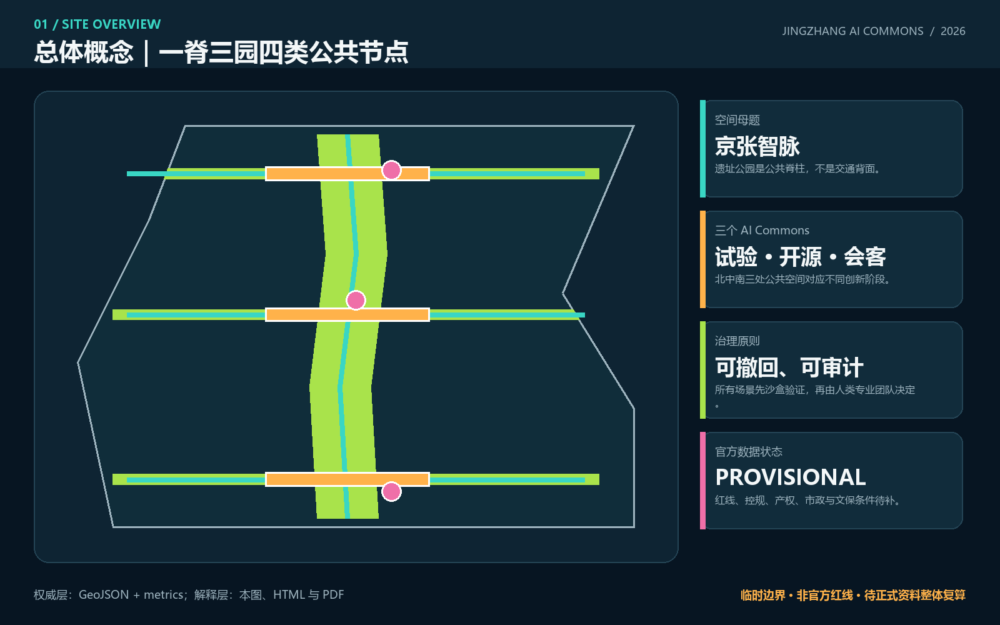
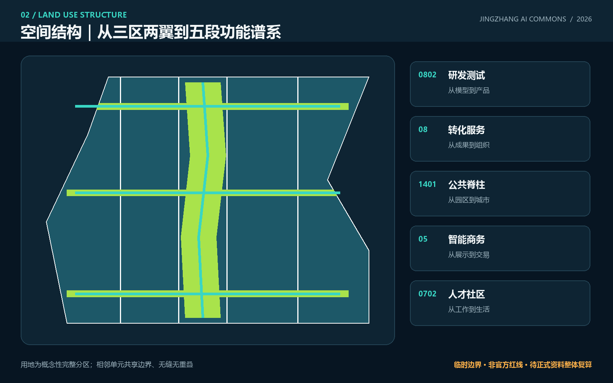
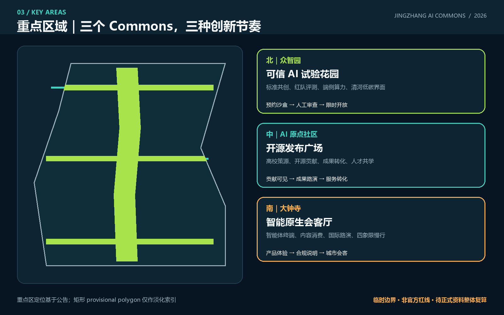
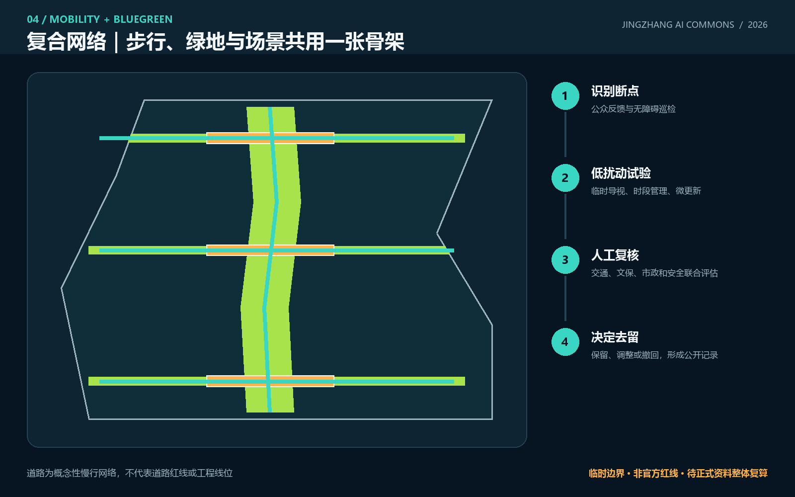
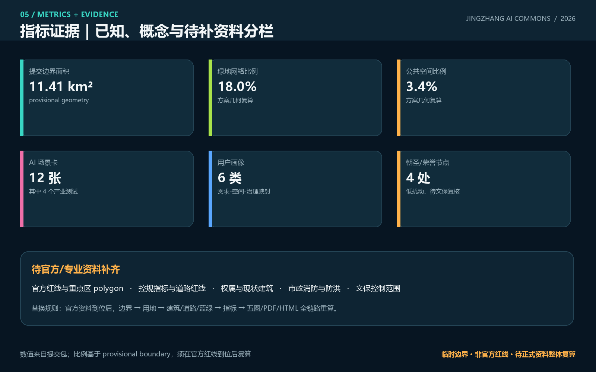

# 京张智脉：可学习的AI公共创新带

## 设计依据与资料清单

本 formal 方案以北京市规划和自然资源委员会海淀分局发布的《百年京张AI创新带城市设计国际方案征集资格预审公告》为第一依据，并以 `brief/site-package/` 中经维护者登记的临时粗略边界、重点区域、枚举、指标和来源清单为机器可读依据。AI agent 在生成方案前必须读取 `design_brief.json`、`allowed_design_space.json`、`sources.json`、`enums/`、`ranges/`、`schemas/`、`data/source_registry.json` 和 `data/processed/agent_fact_pack.md`，并用 `project_scope_summary.csv`、`agent_task_requirements.csv`、`source_use_matrix.csv`、`missing_data_checklist.csv` 建立任务、范围、资料用途和缺口清单。所有设计判断都要拆分为可追溯来源、可复算指标、可校验图层和可人工复核假设。公告要求方案达到控制性详细规划的城市设计深度和规划综合实施方案的城市设计深度，因此文本叙述不能替代 GeoJSON、指标表、A3 文册、A0 展板和 HTML 电子展示成果。

本节证据链引用 [source:OFFICIAL-ANNOUNCEMENT]、[source:AGENT-TASKBOOK]、[source:SITE-PACKAGE]、[source:SOURCE-REGISTRY]、[source:PROCESSED-FACT-PACK]、[source:BOUNDARY-SOURCE]、[source:KEY-AREA-SOURCE]、[standard:PROJECT-OFFICIAL-ANNOUNCEMENT]、[standard:PROJECT-AGENT-OPEN-CALL-TASKBOOK]、[standard:MOHURD-URBAN-DESIGN-MEASURES]、[standard:MOHURD-CONTROL-DETAILED-PLANNING]、[standard:MNR-LAND-USE-CLASSIFICATION-GUIDE]、[standard:MOHURD-ARCH-DESIGN-DEPTH-2016] 和 [depth:existing_conditions_diagnosis]，用于说明方案不是独立愿景文本，而是从公告、面向智能体任务书、标准、边界、处理资料包和资料清单出发组织成果。

资料登记表的使用边界如下：

- data/source_registry.json 登记公开、清权与临时资料的用途边界。
- 当前登记摘要：formal 可用资料 5 条，背景资料 0 条，provisional-only 资料 1 条。
- agent 不得把 background_only 或 provisional_only 资料升级为 official boundary、法定控规、正式评分依据或政府实施承诺。

`data/processed/agent_fact_pack.md` 是本方案的阅读导航层，不是新的权威来源。[source:PROCESSED-FACT-PACK] 只帮助 agent 把三层范围、三处重点区、公告任务、agent.1-agent.6、资料可用性和缺资料事项组织成可读方案；所有事实判断仍回到 [source:OFFICIAL-ANNOUNCEMENT]、[source:AGENT-TASKBOOK]、[source:SOURCE-REGISTRY]、[source:BOUNDARY-SOURCE] 与 [source:KEY-AREA-SOURCE]。

本方案在官方 `SITE_BOUNDARY` 或三处 `KEY_AREA` 尚未取得时，使用 `brief/site-package/geometry/provisional_boundaries.geojson` 作为临时约束。提交包中的 `geometry/site_boundary.geojson` 与 `geometry/key_areas.geojson` 均标注为 `provisional_constraint`、`official_boundary=false`，只能用于方案生成、自检、可视化和设计讨论，不能作为 official redline、审批依据、精确面积依据或法定控制结论。该组织方数据缺口本身不阻断内容评分；替换 official polygons 后，site boundary、key areas、land use、roads、green space、public space、buildings、phasing 和 metrics 均需重算。

本次提交状态为：**临时边界，保留精度警示并待正式数据发布后复算；不阻断内容评分**。正文中的空间结构、场景、项目和指标均按“可讨论、可复核、可替换官方边界后重算”的原则写入；当官方边界和重点区 polygon 更新后，必须重新生成空间图层、指标、核心图、A3/A0 与 HTML，不能只替换单个文件。

边界和重点区域的可读解释对应 [data:geometry/site_boundary.geojson#SITE-001]、[data:geometry/key_areas.geojson#PROV-KEY-001] 和 [metric:site_area_sqm]、[metric:key_area_count]。这意味着读者可以从正文回到 GeoJSON 查看边界来源、从 metrics 查看面积复算结果、从 sources 查看资料来源，而不是只相信一段文字判断。

## 三层范围工作框架

方案按照公告确定的三个层次组织工作：统筹研究范围关注 43.6 平方公里的AI产业生态、战略定位、创新链和未来城市形态；总体设计范围关注 11.4 平方公里京张遗址公园周边 1-2 公里城市地区和产业区，要求形成城市更新总体框架、产业空间布局、交通市政支撑和城市风貌控制；重点区域范围关注 368.4 公顷三处详细设计地区，要求明确功能业态、建筑规模、拆改留分类、公共空间连通和交通组织。三层范围在 `compliance_matrix.json` 中逐条映射，保证公告 1.3、1.4、1.5 与 agent.1-agent.6 的必选任务都有章节、图层、指标、图纸和 HTML 证据。

三层工作框架的深度项由 [depth:three_level_scope_framework] 和 [depth:overall_spatial_structure] 约束，空间证据以 [data:geometry/site_boundary.geojson#SITE-001] 与 [data:geometry/key_areas.geojson#PROV-KEY-001] 为准，任务依据以 [standard:PROJECT-OFFICIAL-ANNOUNCEMENT] 为准，范围索引以 [source:PROCESSED-FACT-PACK] 中 `project_scope_summary.csv` 的三层范围表为导航。

三层工作不是互相割裂的图纸集合。统筹研究决定产业链和城市形态判断，总体设计把判断落实到更新项目、空间结构和设施承载，重点区域详细设计验证具体地块、建筑、交通、公共空间和AI应用场景的可实施性。agent 生成方案时必须先锁定当前提交采用的 official 或 provisional 边界和约束，再生成用地、建筑、道路、绿地、公共空间、分期和AI服务节点，最后从这些图层复算指标并在正文解释哪些结论仍受 provisional boundary 限制。任何无法从结构化数据复算的面积、比例、规模或项目数量，不得写入正式结论。

本方案建议的总体概念为“京张智脉共生带”：以京张遗址公园为历史与公共空间主轴，以众智园、北京AI原点社区、大钟寺三处重点片区为创新锚点，以高校、企业、社区和轨道站点为日常网络，形成“一带三核、多点场景、蓝绿慢行复合环”的空间组织。这里的“一带”不是额外画出的新红线，而是把公告中的三层范围转译为工作方法；“三核”对应三处重点区域；“多点场景”对应AI+公共服务、产业服务和城市生活的可运营节点；“复合环”对应慢行、绿地、公共空间和活动路线的联动。

| 层级 | 设计问题 | 方案回答 | 数据落点 |
| --- | --- | --- | --- |
| 统筹研究范围 | AI产业生态和未来城市形态如何组织 | 建立“高校策源-开源协作-企业转化-公共体验-国际传播”的创新链 | compliance_matrix.json、standard_matrix.json |
| 总体设计范围 | 产业空间、城市更新、交通市政和风貌如何落图 | 用地、建筑、道路、绿地、公共空间和分期图层共同表达 | [data:geometry/land_use.geojson#LU-001]、[data:geometry/roads.geojson#ROAD-001] |
| 重点区域范围 | 三处片区如何达到详细设计深度 | 分别提出定位、空间动作、AI场景和实施依赖 | [data:geometry/key_areas.geojson#PROV-KEY-001]、[data:geometry/key_areas.geojson#PROV-KEY-002]、[data:geometry/key_areas.geojson#PROV-KEY-003] |

## 统筹研究范围产业与未来城市研究

统筹研究范围的核心判断是：海淀不缺单点创新资源，缺的是让“策源、验证、转化、体验、记忆”在城市中连续发生的公共界面。因此本方案命名为 **“京张智脉”**，英文名 **JINGZHANG AI COMMONS**。“智脉”既指京张铁路的时间脉络，也指算力、知识与人才的流动；“Commons”强调公共利益、开放协作与贡献可记忆。识别系统不借用任何企业商标：主标志由两条平行轨道在中部展开为三个开放环组成，三个环分别代表可信试验、开源发布和城市会客；基础色为“铁路深蓝、开源青、花园绿、警示橙”。该方向可供专业品牌团队深化，不构成已批准 Logo。[source:AGENT-TASKBOOK] [standard:PROJECT-AGENT-OPEN-CALL-TASKBOOK]

“三区两翼”在本方案中不是五个孤立园区，而是一条循环：众智园负责全栈验证与治理方法，AI 原点社区负责高校策源与开源协作，大钟寺负责智能原生产品进入城市生活；中关村科技服务翼提供资本、知识产权、国际服务，小月河场景赋能翼提供公共场景与居民反馈。五大功能由此对应到五种可见空间：试验花园、开源广场、公共脊柱、智能会客厅和治理议事台。[data:geometry/public_space.geojson#PUBLIC-001] [depth:overall_spatial_structure]

全球案例采用“机制可转化”而非形象照搬：

| 案例 | 可学习机制 | 京张转译 | 使用边界 |
| --- | --- | --- | --- |
| Kendall Square（剑桥） | 高校科研与产业步行邻接 | 原点社区设置成果转化诊所和开放发布空间 | 不复制企业名单与开发强度 |
| Toronto MaRS | 医研产服共享平台 | 建立跨行业 AI 验证服务台 | 仅作运营机制参考 |
| Station F（巴黎） | 大型创业社区的共享服务 | 众智园采用分布式孵化服务而非单一巨构 | 不推导建设规模 |
| 22@Barcelona | 产业更新与社区设施协商 | 用公共利益清单约束可逆更新 | 不照搬土地政策 |
| Boston Seaport Innovation District | 公共空间承载创新活动 | 大钟寺会客厅连接轨道、商业与路演 | 警惕排他与高成本化 |
| Seoul Digital Media City | 内容技术与城市展示结合 | 大钟寺发展合规的智能终端和内容体验 | 不指定企业或投资额 |
| Helsinki Jätkäsaari Mobility Lab | 城市真实场景限时测试 | 建立预约、限时、人工复核的场景沙盒 | 不视为自动驾驶许可 |

这些案例只支撑空间与运营机制比较，不作为本项目官方控制、企业落位或财政承诺依据。[source:AGENT-TASKBOOK] [source:SOURCE-REGISTRY] [source:CASE-STUDIES-BACKGROUND]

统筹研究并不新增伪精确红线；它通过 [standard:MOHURD-URBAN-DESIGN-MEASURES] 要求的城市风貌、公共空间和建筑布局统筹，回接 [data:geometry/land_use.geojson#LU-001]、[data:geometry/public_space.geojson#PUBLIC-001] 与 [depth:overall_spatial_structure]，说明产业策略最终要落到可见、可复核的空间结构。

未来城市形态研究应回答人工智能如何改变工作、生活、社交、学习、交通和公共服务。方案应把AI交通系统、连续绿色空间、创新服务设施和国际化生活工作氛围落实为可定位的功能区、节点、廊道和场景，而不是泛泛描述技术愿景。agent 应把产业战略指标、AI创新指数、人才密度、空间供给类型和AI+垂直应用重点区域写入指标体系，并标明哪些是官方、哪些是设计建议、哪些仍待正式数据校准。若提出全球AI创新活动、开发者社区、开放场景或朝圣路线，应写为“概念建议/参考方案/可供专业团队深化研究”，不得写成已经确定的政府活动或实施安排。

## 总体设计范围城市更新与控规深度城市设计

总体设计形成“五段功能谱系 + 一条公共脊柱 + 三条东西缝合线 + 三个 AI Commons”。五段功能从西向东依次为 AI 研发与开放测试、创新公共服务与成果转化、京张遗址公园与开放空间、智能原生商务与生活服务、人才社区与社区服务；它们是完整、无缝、无重叠的概念分区，不是已批用地。[data:geometry/land_use.geojson#LU-001] [data:geometry/land_use.geojson#LU-005]。九个小尺度“可逆更新模块”表达空间载体类型：先调查、再适配利用、必要时小尺度嵌入；因缺少现状建筑与产权数据，不给出具体拆除或新建结论。[data:geometry/buildings.geojson#BLDG-001] [depth:retain_renovate_demolish]

本节按照 [standard:MOHURD-CONTROL-DETAILED-PLANNING] 把控规深度内容拆成可审查对象：[data:geometry/land_use.geojson#LU-001] 表达用地结构，[data:geometry/buildings.geojson#BLDG-001] 表达建筑基底，[data:geometry/roads.geojson#ROAD-001] 表达交通组织，[metric:building_footprint_area_sqm] 用于复核建筑基底面积，[depth:land_use_layout] 与 [depth:development_intensity_controls] 约束成果深度。

总体设计还必须支撑交通、轨道、市政和配套设施。方案应围绕轨道站点一体化、道路微循环、非机动车停放、停车供给、创新服务平台、人才生活服务、新型基础设施、分布式能源和端侧算力提出空间布局和实施路径。涉及建筑高度、开发强度、道路红线、退线和设施标准的内容，若尚无官方控制条件，应写为“待正式控规条件确认”，不得以 agent 推测值冒充审定指标。

## 重点区域详细设计

重点区域详细设计是必选项。众智园AI自主创新加速区应围绕国家人工智能平台、全栈自主创新、标准制定、安全治理、产业展示、对外交通、清河文化、低碳绿色创新交往环境和绿色空间AI场景提出详细方案。北京AI原点社区应围绕近校创新、成果孵化转化、人才特区、开源体系、品牌活动、建筑拆改留、成果展示发布、居住生活配套、校区园区慢行联系和轨道站点一体化提出详细方案。大钟寺AI产业聚集区应围绕领军企业、智能体、智能终端、内容消费、数据要素、数字资产、商业服务、规划绿地复合利用、大钟寺站一体化和路口四象限步行连通提出详细方案。

众智园的空间动作是“试验花园”：把可信模型红队、端侧算力能耗对比、标准共创和清河低碳界面组合在可预约、可停用的公共空间中；原点社区的空间动作是“开源发布广场”：把校园—园区慢行、成果转化诊所、开源贡献展和共学空间相邻组织；大钟寺的空间动作是“智能会客厅”：用四象限步行缝合串联智能终端试验、数据合规说明和国际路演。三者分别引用 [data:geometry/key_areas.geojson#PROV-KEY-001]、[data:geometry/key_areas.geojson#PROV-KEY-002]、[data:geometry/key_areas.geojson#PROV-KEY-003]，并由 [depth:three_key_area_detailed_design] 约束设计深度。

三处重点区域必须在 `geometry/key_areas.geojson` 中出现。若仓库已提供 official polygons，应作为 `official_constraint` 使用；若 official polygons 缺失，可暂用 `provisional_constraint`，但正文、HTML、sources、assumptions 和 self_check 必须说明它不能作为正式评分或审批依据。`compliance_matrix.json` 应分别覆盖公告 1.5.3.1、1.5.3.2、1.5.3.3。设计表达应包含功能业态、建筑规模、建筑形态、拆改留分类、公共空间系统、交通组织、慢行连通和实施项目。HTML 页面应能切换查看三处重点区域，A3 文册和 A0 展板应至少包含重点片区总图、局部详图和指标说明。

| 重点片区 | 设计定位 | 空间动作 | AI产业与运营场景 | 证据引用 |
| --- | --- | --- | --- | --- |
| 众智园AI自主创新加速区 | 花园型全栈自主创新街区 | 强化清河界面、产业展示、低碳创新交往和对外交通组织；以绿色空间承载开放测试与标准治理展示 | 自主模型测试、标准制定工作坊、安全治理展示、低碳算力体验 | [data:geometry/key_areas.geojson#PROV-KEY-001]、[depth:three_key_area_detailed_design] |
| 北京AI原点社区 | 近校型成果转化与人才社区 | 组织校区、园区、街区慢行缝合；补足成果发布、人才服务、居住生活和开源协作空间 | 开源社区、成果发布、人才特区服务、近校孵化 | [data:geometry/key_areas.geojson#PROV-KEY-002]、[source:AGENT-TASKBOOK] |
| 大钟寺AI产业聚集区 | 城市型智能经济与国际交往街区 | 围绕大钟寺站一体化、四象限步行连通、商业服务和重点企业公共环境更新 | 智能体与智能终端展示、内容消费、数据要素与国际路演 | [data:geometry/key_areas.geojson#PROV-KEY-003]、[metric:key_area_count] |

## AI 创新生态、人才画像与 AI+ 场景

本方案建立六类空间需求画像，覆盖研发办公、开源协作、成果发布、企业服务、人才居住、社交学习、消费生活、运动休闲、公共运维和国际交往。AI+场景围绕交通、服务、消费、教育、法律、生活服务与产业测试展开；每个场景明确位置、最小数据、人工复核、运营建议和退出条件。

AI 场景落到空间和治理边界：公共空间场景引用 [data:geometry/public_space.geojson#PUBLIC-001]，慢行与交通场景引用 [data:geometry/roads.geojson#ROAD-001]，开放空间场景引用 [data:geometry/green_space.geojson#GREEN-001] 和 [metric:public_space_ratio]、[metric:green_ratio]。本方案提交 12 张 AI 场景卡，其中 4 张为产业测试验证场景，并覆盖 6 类用户画像。[metric:scenario_card_count] [metric:industrial_test_scenario_count] [metric:persona_count]

| 用户画像 | 典型需求 | 空间响应 | 自检边界 |
| --- | --- | --- | --- |
| 开源开发者 | 发布、协作、测试、社区声誉 | 原点社区开源发布厅、公共代码墙、夜间协作空间 | 不采集个人行为轨迹；活动数据只做聚合统计 |
| 初创团队 | 低成本办公、算力入口、产品试验场 | 众智园共享测试场、端侧算力服务点、标准治理咨询 | 算力和数据服务需另行授权 |
| 头部企业访客 | 展示、商务、国际接待、人才招聘 | 大钟寺国际路演客厅、轨道站点接驳、重点企业周边公共空间 | 企业标识和案例须清权 |
| 周边居民 | 通勤、休闲、社区服务、低扰动更新 | 京张遗址公园慢行环、社区服务嵌入、夜间照明和活动分级 | 不将居民画像用于商业推荐 |
| 高校师生 | 成果转化、跨校协作、日常慢行 | 校区-园区慢行缝合、成果转化驿站、AI教育体验点 | 校园数据和科研成果需授权 |
| 公共服务与运维人员 | 工单分流、设施巡检、应急协同 | 城市运维议事台、可解释工单看板、现场复核点 | 模型只辅助排序；处置决定由责任人员作出 |

| 场景卡 | 类型 / 空间 | 数据与人工复核 | 运营建议与退出条件 |
| --- | --- | --- | --- |
| 01 可信模型红队花园 | **产业测试** / 众智园 | 仅使用授权测试集；安全负责人签发结果 | 预约制测试；出现安全或权属争议立即暂停 |
| 02 端侧算力能耗沙盒 | **产业测试** / 众智园 | 设备侧汇总能耗；能源专业人员复核 | 限时对比，不接入正式市政调度 |
| 03 智能终端街角实验室 | **产业测试** / 大钟寺 | 自愿体验、匿名事件计数；现场管理员可停机 | 不采集人脸与连续轨迹；投诉即撤回 |
| 04 城市智能体工单镜像 | **产业测试** / 运维议事台 | 脱敏历史工单；责任部门逐条复核 | 仅比较分流质量，不自动派单或执法 |
| 05 开源发布厅 | 公共创新 / 原点社区 | 贡献者主动提交，许可证自动检查后人工确认 | 形成可撤销的贡献档案与年度荣誉展 |
| 06 成果转化诊所 | 企业服务 / 原点社区 | 企业自愿披露最小信息，专业顾问复核 | 法务、知识产权、场景和空间需求一站式初诊 |
| 07 无障碍伴行 | 公共服务 / 京张脊柱 | 用户主动启用；不保存身份与连续轨迹 | 只给路径建议，现场障碍由人工巡检确认 |
| 08 慢行共治看板 | 交通 / 三条东西缝合线 | 聚合计数加公众标注；交通专业人员复核 | 先以导视和时段管理试验，不形成道路工程结论 |
| 09 公共空间维护助手 | 城市运维 / 三个 Commons | 公开工单和现场照片经脱敏；管理员复核 | 建议巡检优先级，不替代安全鉴定 |
| 10 AI 学习环 | 教育 / 原点社区及公共脊柱 | 课程报名数据最小化；教师审核内容 | 以开源素养和模型局限为核心，不做未成年人画像 |
| 11 数据合规会客厅 | 专业服务 / 大钟寺 | 只展示合成样例和规则流程；律师与伦理人员复核 | 不进行真实数据交易或资产确权 |
| 12 全球 AI Commons 周 | 活动 / 一带公共路线 | 预约与客流只做分时聚合；安全团队人工调度 | 年度概念活动，须逐年审批并接受社区评估 |

AI 治理遵守数据最小化、公开来源、可解释、人工复核和可撤回原则。城市智能体可以辅助识别慢行断点、公共空间维护、设施工单、企业服务需求和活动安全风险，但不能替代规划审批，不能输出未经授权的个人画像，也不能声称获得官方实施承诺。

## 用地、建筑规模与拆改留方案

用地依据公开分类标准形成五类完整分区；中央公园与开放空间带承担公共性，研发与服务功能分置两侧并由三条东西缝合线连接。建筑采用“保留优先—适配再用—可逆嵌入—拆除待证”的决策树：只有清权现状调查、结构安全、产权协商和控规条件共同支持时，专业团队才进入具体拆改留判断。当前九个建筑基底只是不同运营载体的容量示意，不能解释为现状建筑或建设许可。[standard:MNR-LAND-USE-CLASSIFICATION-GUIDE] [data:geometry/buildings.geojson#BLDG-009]

用地分类依据 [standard:MNR-LAND-USE-CLASSIFICATION-GUIDE]，建筑高度、体量、界面和风貌控制由 [depth:height_massing_character] 管理，拆改留方法由 [depth:retain_renovate_demolish] 管理。用地和建筑的主要证据是 [data:geometry/land_use.geojson#LU-001]、[data:geometry/buildings.geojson#BLDG-001] 和 [metric:building_footprint_area_sqm]。

建筑规模和强度指标必须与 `metrics.json` 和图层一致。若总建筑规模、容积率、建筑高度、建筑密度、绿地率、退线和建筑控制线缺少官方条件，应在指标体系中列为 unknown 或 pending_control，不得用固定数值制造精确感。A3 文册应给出更新项目清单和指标复核表，A0 展板应把关键空间结构和重点片区表达清楚，HTML 页面应提供指标和图层联动查看。

## 交通、轨道、市政与公共服务设施

交通采用“1+3”概念慢行骨架：`ROAD-001` 沿京张方向串联北中南三个 Commons；`ROAD-002` 聚焦大钟寺四象限步行缝合，`ROAD-003` 聚焦原点社区校园—园区联系，`ROAD-004` 聚焦众智园—清河公共界面。先以导视、时段组织、非机动车秩序和无障碍巡检开展低扰动试验；跨路、桥隧、站点和道路断面的工程可行性必须等待道路红线、交通流量、市政和安全资料。[data:geometry/roads.geojson#ROAD-001] [depth:traffic_rail_slow_parking]

交通和市政专业深度分别由 [depth:traffic_rail_slow_parking] 与 [depth:municipal_new_infrastructure] 约束；图层证据引用 [data:geometry/roads.geojson#ROAD-001]、[data:geometry/public_space.geojson#PUBLIC-001] 和 [data:geometry/constraints.geojson#CONSTRAINT-001]。当道路红线、管线、消防和市政条件缺失时，应通过 assumptions 说明待补，而不是把策略写成审定条件。

市政和公共服务设施应覆盖AI产业服务设施、创新服务平台、人才生活服务设施、新型基础设施、分布式能源、端侧算力和传统市政设施融合。方案应说明设施标准、空间布局、服务半径、运营模式和分期实施逻辑。缺少管线、能源、排水、防洪、消防等工程资料时，应列为正式深化前置条件。

## 蓝绿空间、公共空间与城市风貌

蓝绿空间由一条连续生态脊柱和南中北三道绿楔组成：南部绿楔服务大钟寺城市会客，中部绿楔服务原点社区知识花园，北部绿楔服务众智园清河创新界面。三个 AI Commons 叠加在绿楔与脊柱交点，形成可停留、可测试、可议事的公共地址；其面积比例由提交几何复算，但因边界为 provisional，只作方案内部一致性检查。[data:geometry/green_space.geojson#GREEN-001] [data:geometry/public_space.geojson#PUBLIC-003] [metric:green_ratio] [metric:public_space_ratio]

蓝绿公共空间由 [depth:blue_green_public_space] 校核，核心证据为 [data:geometry/green_space.geojson#GREEN-001]、[data:geometry/public_space.geojson#PUBLIC-001]、[metric:green_ratio] 和 [metric:public_space_ratio]。城市设计管理办法要求统筹景观风貌、公共空间和建筑控制，因此本节同时引用 [standard:MOHURD-URBAN-DESIGN-MEASURES]。

文化叙事采用三条并行时间线：铁路线记录“连接与工业现代性”，中关村线记录“求真、试错与技术共同体”，AI 新文化线记录“开源、可审计与人本治理”。导视把里程刻度转译为知识里程：每一节点只展示经授权的历史事实、开放许可证和贡献记录，不使用未经授权的肖像、商标或论文图像。建筑界面建议保留粗粝材料与结构节奏，以可逆金属构件和低能耗信息层承载新内容；具体高度、体量与屋顶控制待官方控规和文保资料确认。[standard:MOHURD-URBAN-DESIGN-MEASURES] [depth:height_massing_character]

四个“AI 朝圣/荣誉节点”均为低扰动概念组件：[metric:pilgrimage_landmark_count]

1. **百年轨迹门**：在北端以两条不闭合轨迹框出“过去—未来”的视线，不接触文物本体。
2. **开源星图**：原点社区用可替换铭牌记录开放许可证下的代码、数据与社区贡献，允许贡献者撤回署名。
3. **可信 AI 试验钟**：众智园将模型版本、测试日期、适用边界和复核人做成可读的公共“时间仪表”。
4. **城市智能体议事台**：大钟寺设置圆形公共界面，展示场景的目标、数据、申诉和停用状态，强调人类最终判断。

以上节点须在正式文保、产权、结构和公共安全审查后才能深化，当前不构成建设决定。[source:AGENT-TASKBOOK] [data:geometry/public_space.geojson#PUBLIC-001]

## 更新项目清单、实施政策与分期计划

实施方案应形成可审查的更新项目清单，说明项目位置、类型、功能、责任主体、依赖条件、实施阶段、风险和评估指标。政策建议应覆盖城市更新统筹实施、空间供给、运营机制、产业服务、公共参与、数据治理和产权协同。`geometry/phasing.geojson` 应表达分期范围，`compliance_matrix.json` 应把每个任务与分期和图纸挂接。

项目清单和分期深度由 [depth:renewal_project_list] 与 [depth:phasing_implementation] 管理，分期空间证据为 [data:geometry/phasing.geojson#PHASE-001]。如果没有权属、资金、实施主体和审批路径，方案必须把它写成实施风险，而不是承诺落地。

| 项目编号 | 项目名称 | 类型 | 主要依赖 | 证据引用 |
| --- | --- | --- | --- | --- |
| JZ-01 | 京张遗址公园慢行断点缝合 | 公共空间/交通 | 道路红线、桥下空间、交通组织复核 | [data:geometry/roads.geojson#ROAD-001] |
| JZ-02 | 众智园清河创新界面 | 蓝绿空间/产业展示 | 河道蓝线、生态和防洪条件 | [data:geometry/green_space.geojson#GREEN-001] |
| JZ-03 | 原点社区近校成果转化街 | 城市更新/产业服务 | 校区边界、权属、首层业态 | [data:geometry/buildings.geojson#BLDG-001] |
| JZ-04 | 大钟寺站四象限步行连通 | 轨道一体化/慢行 | 轨道站点、道路交叉口、市政管线 | [data:geometry/public_space.geojson#PUBLIC-001] |
| JZ-05 | AI公共服务与端侧算力节点 | 新基建/公共服务 | 能源、算力、安全和运营主体 | [data:geometry/constraints.geojson#CONSTRAINT-001] |
| JZ-06 | 全球AI活动周公共路线 | 运营/品牌 | 公共空间许可、活动安全、版权清权 | [data:geometry/phasing.geojson#PHASE-001] |

分期与 100 天征集设计周期严格区分。`PHASE-001` 是近期运营与轻量公共空间：发布开源贡献规则、场景申请表、退出机制和公众反馈看板；`PHASE-002` 是中期重点区可逆更新：在权属和安全核验后导入成果转化、可信测试与智能会客功能；`PHASE-003` 是长期专业深化：官方边界、控规、市政、交通和文保资料到位后，全链路复算并决定哪些试点保留、调整或撤回。[data:geometry/phasing.geojson#PHASE-001] [data:geometry/phasing.geojson#PHASE-002] [data:geometry/phasing.geojson#PHASE-003]

长期运营采用“一个年度节律、三个社区机制、一道转化漏斗”：春季 Commons Open Lab 征集可测试问题，夏季 Developer Residency 组织跨校跨企共创，秋季 JINGZHANG AI COMMONS WEEK 形成公共体验路线，冬季 Civic AI Review 公布场景效果与退出清单；众智园运行可信 AI 测试共同体，原点社区运行开源开发者社区，大钟寺运行产品体验与国际传播社区；参与者从公共体验进入技术评测、专业服务、合作对接和空间需求诊断。活动名称、频率、运营主体、预算和审批均为概念建议，不构成政府承诺。[source:AGENT-TASKBOOK] [depth:phasing_implementation]

## 指标体系、面积复算与合规矩阵

指标体系至少应包含总体设计范围面积、重点区域面积、绿地与公共空间比例、建筑基底、更新项目数量、AI场景节点、慢行连通指标、产业空间指标、人才服务指标和自检状态。所有 known 指标必须能从 GeoJSON 或可信来源复算；unknown 指标必须给出原因和正式提交前置条件。`scripts/spatial_review.py` 和 `scripts/visual_review.py` 的结果是 formal 自检的重要证据。

指标复算深度由 [depth:metrics_recalculation] 管理。本方案正文显式引用 [metric:site_area_sqm]、[metric:key_area_count]、[metric:building_footprint_area_sqm]、[metric:green_ratio]、[metric:public_space_ratio]，并说明这些值来自 [data:geometry/site_boundary.geojson#SITE-001]、[data:geometry/key_areas.geojson#PROV-KEY-001]、[data:geometry/buildings.geojson#BLDG-001]、[data:geometry/green_space.geojson#GREEN-001] 和 [data:geometry/public_space.geojson#PUBLIC-001]。

合规矩阵是任务响应性的主控文件。每条公告任务和 agent_taskbook 任务必须对应到报告章节、图层、指标、图纸、HTML 页面、来源、假设和自检项。未能覆盖公告 1.3、1.4、1.5 或 agent.1-agent.6 的任一必选任务，方案不得进入 formal professional scoring。

正式深化时，agent 还应把每个指标分为三类：第一类是可由提交几何直接复算的空间指标，例如边界面积、绿地比例、公共空间比例、建筑基底面积和分期面积；第二类是需要官方控规或任务书附件支撑的管控指标，例如容积率、建筑高度、建筑密度、退线、道路红线和设施标准；第三类是需要运营或产业数据持续校准的绩效指标，例如 AI 创新指数、人才密度、产业服务满意度、慢行可达性、活动参与度和场景使用频次。三类指标应分别进入 `metrics.json`、`assumptions.json` 和 `compliance_matrix.json`，避免把运营愿景误写成审定规划条件。

## 风险、版权与合规说明

方案文件可使用中文或英文；英文为主语言时，必须在同一 `proposal.md` 中附完整中文正式译文，并设置双语元数据。所有图片、图纸、图标、数据和代码资产必须在 `sources.json` 或 `report/copyright_statement.md` 中说明来源、许可和授权状态。HTML 页面不得加载远程脚本、远程地图瓦片、远程字体、iframe、表单或外部 API，不得跟踪评审者行为。

风险和缺资料清单由 [depth:risk_missing_data] 管理，并与 [data:geometry/constraints.geojson#CONSTRAINT-001]、[source:SITE-PACKAGE]、[source:PROCESSED-FACT-PACK] 和 [standard:MOHURD-CONTROL-DETAILED-PLANNING] 相互校核。`missing_data_checklist.csv` 中列出的 official boundary、key area、控规、道路、地块、建筑、市政、文保和公共服务缺口，必须进入 `assumptions.json`、自检和正文风险章节。任何缺少官方控规、道路红线、权属、市政、消防或文保条件的结论，都必须降级为待确认事项。

本方案不声称官方批准、审定控规、最终土地权属、最终建设规模或保证实施。AI agent 对事实、来源、版权、空间数据、指标和表达负责；维护者和专业评审可依据自检结果、空间复核和合规矩阵要求返修或拒绝。

## 参考资料

- brief/public-brief.md
- brief/site-package/design_brief.json
- brief/site-package/allowed_design_space.json
- brief/site-package/enums/
- brief/site-package/ranges/planning_limits.json
- data/processed/agent_fact_pack.md
- data/processed/project_scope_summary.csv
- data/processed/agent_task_requirements.csv
- data/processed/source_use_matrix.csv
- data/processed/missing_data_checklist.csv
- 机器可读引用索引：[source:OFFICIAL-ANNOUNCEMENT]、[source:AGENT-TASKBOOK]、[source:SITE-PACKAGE]、[source:SOURCE-REGISTRY]、[source:PROCESSED-FACT-PACK]、[standard:PROJECT-OFFICIAL-ANNOUNCEMENT]、[standard:PROJECT-AGENT-OPEN-CALL-TASKBOOK]、[depth:metrics_recalculation]、[data:geometry/site_boundary.geojson#SITE-001]、[metric:site_area_sqm]

