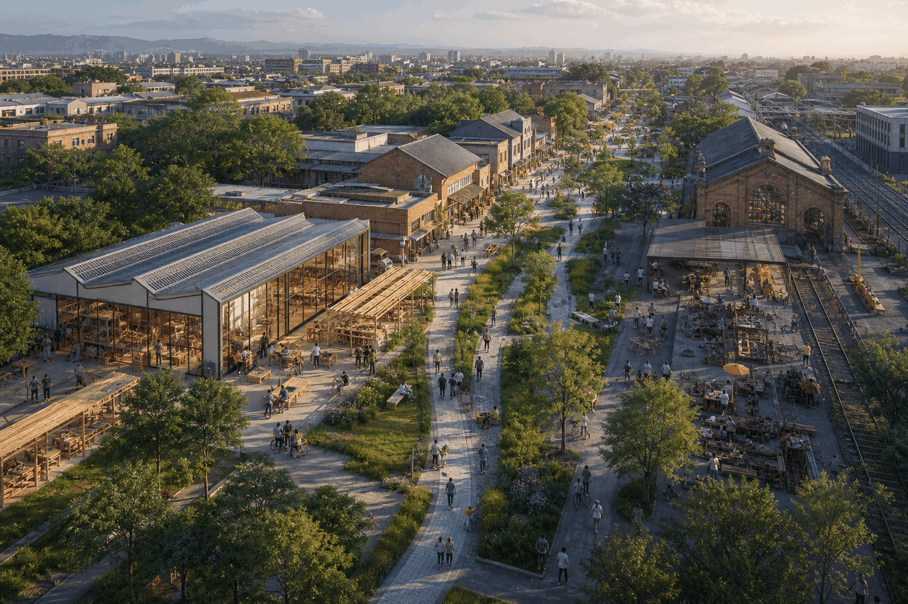
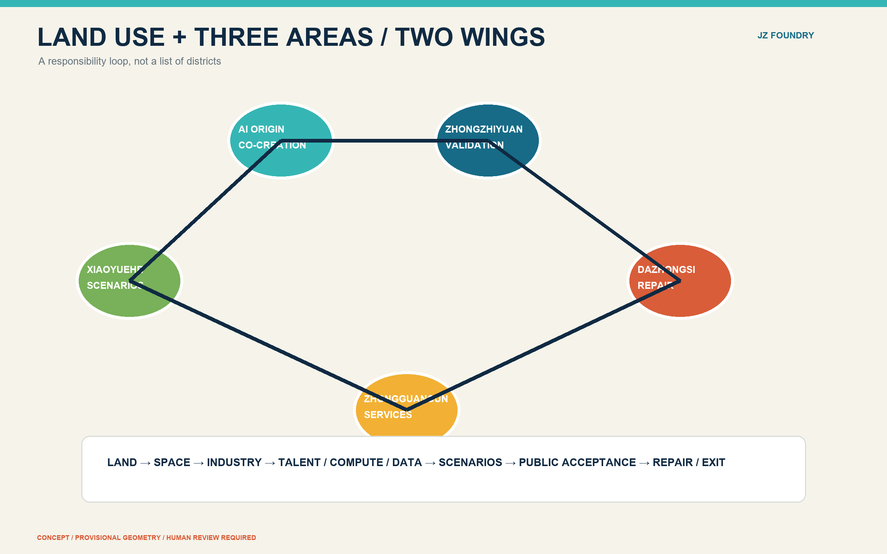
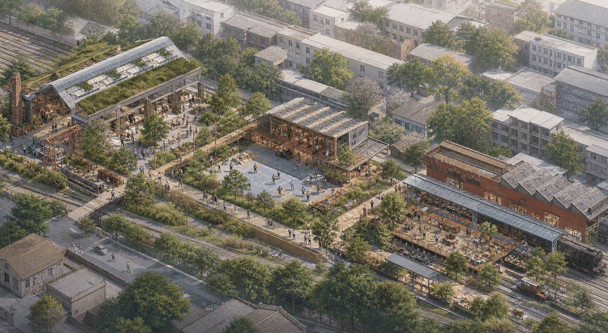
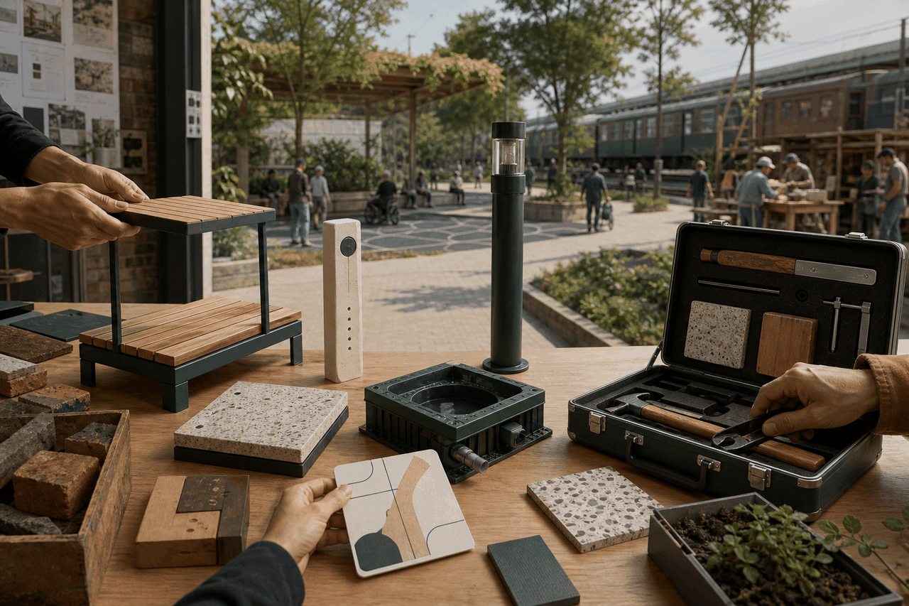

# Jingzhang Civic Prototyping Foundry: An Open Component Chain from AI Experiment to Everyday Life

The proposal treats AI urban value as more than a model demonstration. Sensors, wayfinding, shade, seating, service terminals and maintenance tools should become civic components that can be specified, procured, tested, repaired and reused. Jingzhang Heritage Park becomes a public test street for these components. The spatial chain is “making—interface—maintenance”: Zhongzhiyuan is the prototype foundry, AI Origin is the open-interface community, and Dazhongsi is the civic repair and reconfiguration market. This is an open co-creation proposal, not an approved plan or a substitute for procurement, engineering or professional review.[source:AGENT-TASKBOOK] [data:geometry/phasing.geojson#PHASE-001] [depth:phasing_implementation]

## Distinct proposition: a civic prototyping commons

The proposal gives every component a traceable lifecycle: **problem framing → component design → small-batch making → public-space trial → human acceptance → repair/reconfiguration → open archive**. A “civic component passport” records provenance, version or material, users, location, maintenance responsibility, procurement conditions, exit conditions and public feedback. It records authorised public-asset information only; it does not collect personal trajectories.[source:AGENT-TASKBOOK] [depth:ai_ecosystem_and_talent]

Three component families make the idea spatial:

1. **Everyday components:** shade seats, accessible wayfinding, movable stalls, drinking-water and rest points for residents, older people, children and commuters.
2. **Innovation components:** edge-computing boxes, model-evaluation interfaces, sensor poles and low-speed robot docking bays inside governed test boundaries.
3. **Maintenance components:** replaceable paving, lighting-power boxes, rainwater modules and inspection interfaces, with a named maintainer and removal path.

Zhongzhiyuan specifies compatibility and safety; AI Origin hosts open design, public trials and contributor training; Dazhongsi supports small-batch production, demonstration, repair and reconfiguration. Public procurement is proposed as a “lease/test first, purchase/standardise later” concept flow; budgets, ownership, procurement law and engineering conditions remain subject to professional confirmation.[data:geometry/key_areas.geojson#PROV-KEY-001] [data:geometry/key_areas.geojson#PROV-KEY-002] [data:geometry/key_areas.geojson#PROV-KEY-003] [standard:PROJECT-AGENT-OPEN-CALL-TASKBOOK]

## Evidence basis and data limits

The package follows the official announcement, the agent open-call taskbook and the maintained site package. `data/source_registry.json`, `sources.json`, `assumptions.json`, the standards matrix and the design-depth matrix are the machine-auditable layer. The submitted site boundary and three detailed-design areas are explicitly provisional constraints: they support discussion, visualisation and intake self-check, but are not official redlines or precise scoring geometry.[source:SITE-PACKAGE] [data:geometry/site_boundary.geojson#SITE-001]

The three working scales are the 43.6 km² coordinated research area, the 11.4 km² overall design area around the park, and the 368.4 ha key-area range. Areas, ratios and layer counts are recomputed from GeoJSON; FAR, height, density, setbacks, road redlines and municipal standards remain pending official controls.[metric:site_area_sqm] [standard:MOHURD-CONTROL-DETAILED-PLANNING]

## Spatial strategy

The belt is structured by the heritage park and its railway narrative. The three anchors are: Zhongzhiyuan AI Acceleration Area as a garden-like full-stack innovation and governance district; Beijing AI Origin Community as a near-campus open-source, talent and transfer neighbourhood; and Dazhongsi AI Industry Cluster as a transit-connected urban showroom for intelligent enterprises, agents, terminals and digital services.[data:geometry/key_areas.geojson#PROV-KEY-001] [data:geometry/key_areas.geojson#PROV-KEY-002] [data:geometry/key_areas.geojson#PROV-KEY-003]

The land-use partition, building-footprint layer, streets, green space and public space are coordinated around three moves: protect an everyday public realm, concentrate innovation services at walkable nodes, and make new construction conditional on professional confirmation. The blue-green loop connects the park, river interfaces, campus edges, neighbourhood services and station approaches. The mobility proposal prioritises legible walking and cycling, accessible crossings, station interchange, bicycle parking and low-speed service pilots; it does not claim a final transport scheme.[data:geometry/land_use.geojson#LU-001] [data:geometry/roads.geojson#ROAD-001] [data:geometry/green_space.geojson#GREEN-001]

## Three key-area reference schemes

**Zhongzhiyuan AI Acceleration Area.** Create a “garden test commons” combining open model testing, standards workshops, safety review, low-carbon computing demonstrations and a clear Qinghe edge. Proposed projects are the Qinghe innovation interface, a public test courtyard and a governed demonstration route. Any ecological, flood-control, traffic or building-control conclusion remains subject to official data.[depth:three_key_area_detailed_design]

**Beijing AI Origin Community.** Stitch campus, incubator, housing and daily services through a near-campus transfer street. Provide an open-source release hall, talent service desk, small-scale showcase spaces and a protected everyday walking route. Retain/renovate/new-build categories are design hypotheses until ownership, existing buildings and heritage conditions are verified.[data:geometry/key_areas.geojson#PROV-KEY-002] [depth:retain_renovate_demolish]

**Dazhongsi AI Industry Cluster.** Use the station and four-quadrant crossings as the public address of intelligent industry. Propose an international demo lounge, data-governance salon, content-and-terminal showroom and a low-speed delivery/service test street. These are operational and spatial reference schemes, not investment or implementation commitments.[data:geometry/key_areas.geojson#PROV-KEY-003] [depth:traffic_rail_slow_parking]

## AI ecosystem, people and scenario cards

The ecosystem links university research, open-source collaboration, start-up acceleration, enterprise transfer, public-service pilots and international exchange. Candidate cases include an open-source release hall, a safety-evaluation sandbox, an edge-computing service point, a Qinghe low-carbon innovation corridor, a near-campus transfer street, a data-governance salon, an AI life-service street and a global AI week route. Each case requires a public source, an accountable operator, data minimisation, a visible human-review path and a way to stop or roll back the pilot.[source:AGENT-TASKBOOK] [depth:ai_ecosystem_and_talent]

Ten scenario cards are anchored to space: (01) open-source release hall, (02) safety-governance sandbox, (03) edge-computing service point, (04) explainable walking guidance, (05) Dazhongsi international demo lounge, (06) Qinghe low-carbon innovation corridor, (07) near-campus transfer street, (08) data-governance salon, (09) AI everyday-service street, and (10) global AI week route. The three initial industrial validation scenarios are model safety testing, enterprise-service navigation and low-speed robot/service operations. They are evaluation prototypes with consent, audit logs and human override—not automated public decisions.[data:geometry/public_space.geojson#PUBLIC-001] [source:SOURCE-REGISTRY]

Five user groups guide the design: open-source developers, start-up teams, enterprise visitors, nearby residents and university students. The spaces answer release, testing, service, commuting, rest, learning and social needs without using unauthorised personal profiles. Public-space heat, route feedback and event information are aggregated and minimised.[depth:ai_ecosystem_and_talent]

## Culture, identity and long-term operation

The working name “Jingzhang Intelligence Link” translates railway continuity into a contemporary civic identity. A visual identity direction combines a railway line, a link node and a human-scale public square; a final logo, typeface and any historic image use require clearance. Three proposed AI pilgrimage landmarks are the Heritage Memory Gate, the Open Model Commons and the Human-AI Public Service Forum. They are public-space concepts for professional deepening, not official monuments.[depth:identity_and_cultural_narrative]

The operating proposal is a quarterly open-source review, a seasonal public test week and an annual global AI exchange. A community steward maintains the public knowledge base, publishes evidence and unresolved assumptions, and convenes professional review for any spatial or safety claim. Contribution records remain attributable; public participation, accessibility and privacy are first-class measures.[depth:long_term_global_ai_operations]

## Renewal, infrastructure and phasing

Six candidate projects organise implementation: park walking-gap stitching, Qinghe innovation interface, origin-community transfer street, Dazhongsi station crossings, AI public-service/edge-computing nodes, and the global AI week route. Phase 1 focuses on reversible public-realm and service pilots; Phase 2 tests the three anchors with professional review; Phase 3 deepens statutory, municipal, ownership and capital coordination. Each phase has stop conditions and a recalculation gate when official geometry arrives.[data:geometry/phasing.geojson#PHASE-001] [depth:renewal_project_list]

The package provides a municipal/new-infrastructure strategy for shared service points, distributed low-carbon energy, edge computing, station interchange, bicycle storage, maintenance and accessible public facilities. Exact pipe, fire, drainage, flood, road-redline and energy parameters are deliberately marked as pending official confirmation.[depth:municipal_new_infrastructure] [data:geometry/constraints.geojson#CONSTRAINTS]

## Metrics, risk and rights

Known metrics are derived from the submitted layers: site area, green ratio, public-space ratio, building footprint area and three key areas. Unknown controls are not invented. The provisional-boundary warning is repeated in the narrative, source records, assumptions and visual materials. No proprietary data, private map, unlicensed image, remote tile, external script or tracking service is used. PDFs and HTML are presentation layers; GeoJSON and structured records remain authoritative.[metric:green_ratio] [metric:public_space_ratio] [depth:metrics_recalculation]

Before any formal design or implementation decision, the professional team should replace provisional boundaries, verify existing buildings and roads, confirm heritage and ownership conditions, review municipal and safety systems, and rerun all geometry, metrics, figures, HTML and self-checks. Human and professional judgement remains final.[depth:risk_missing_data] [standard:PROJECT-OFFICIAL-ANNOUNCEMENT]
