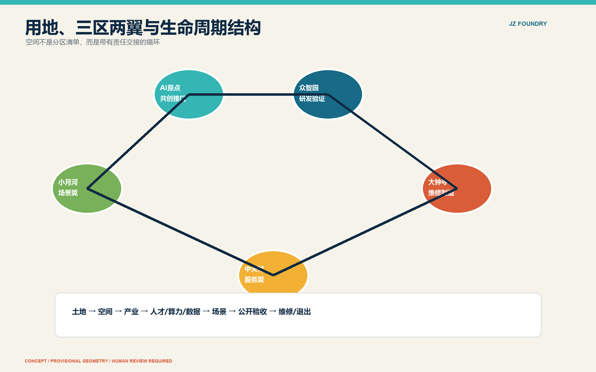
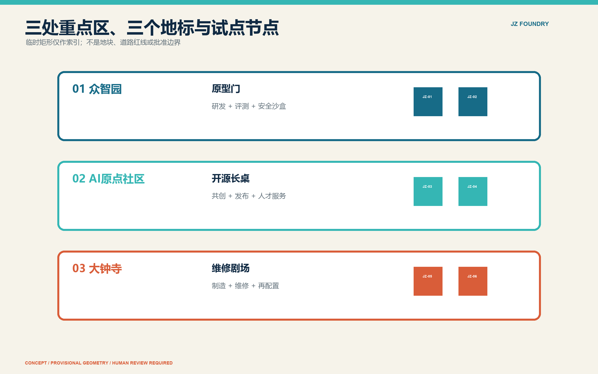
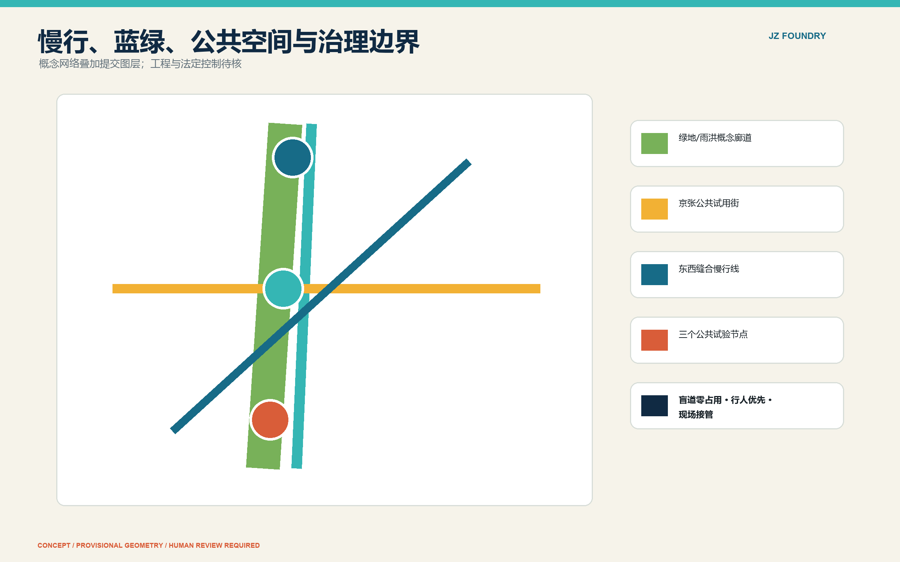
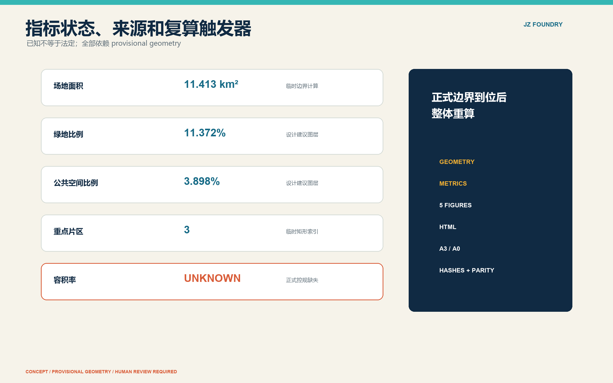

# 京张城市原型制造公地

## 摘要与状态

本方案把 AI 创新带定义为一套可被城市**提出问题、研发、试用、人工验收、维修、退出和公开归档**的部件链。众智园做研发与安全验证，AI原点社区做开放接口与公众共创，大钟寺做制造、维修与再配置；中关村科技服务翼提供资本、知识产权与企业服务接口，小月河场景赋能翼提供公共场景和反馈接口。所有内容均为开放共创建议，不代表批准、采购、权属或工程可行性结论。[source:OFFICIAL-ANNOUNCEMENT] [source:AGENT-TASKBOOK]

当前 SITE_BOUNDARY 与三处 KEY_AREA 为 provisional repository geometry。图中矩形不是红线，面积、比例、裁切和片区关系须在正式 polygon 到位后整体复算；容积率、建筑高度/密度、退线、道路红线和批准用途均为 unknown。本缺口不阻断概念内容评审，但阻断精确面积和法定结论。[data:geometry/site_boundary.geojson#SITE-001] [metric:floor_area_ratio]

## 品牌与总体协同机制（agent.1）

主名称为“京张城市原型制造公地”，英文名为 **Jingzhang Civic Prototype Foundry**，传播短名为 **JZ Foundry**。Logo 方向采用“J/Z 轨道折线 + 可替换方形部件 + 开放接口缺口”，不使用第三方商标。深蓝代表治理底线，青绿代表公共空间，金色代表试验状态，红色只用于风险/退出。延展系统包含部件护照二维码框、节点编号、活动章、地面测试边界和中英双语导视。图形仅为原创方向稿，最终字体、无障碍对比度和注册检索需专业团队复核。

三大定位被转译为机制：百年京张文化带保存铁路时间线和维修伦理；都市AI生活体验带以公共问题清单和十张场景卡开放试用；AI融合创新带以研发—接口—维护链完成转化。五大功能分别对应全栈验证、生态撮合、场景开放、活力公共空间、治理与公开档案。[source:AGENT-TASKBOOK]

“三区两翼”按闭环而非名录运行：**小月河翼收集经同意的公共问题 → AI原点社区共创需求与开源接口 → 众智园完成模型/硬件/安全验证 → 大钟寺完成小批量制造和维护设计 → 京张公园公开试用 → 中关村翼完成知识产权、采购咨询、资本与企业服务 → 公开验收结果返回问题库**。每次跨区移交均用城市部件护照记录责任人、版本、数据边界、维护期限和退出条件。北纬社区作为居民共创接口；未来科学城、怀柔科学城、经开区及京津冀关系仅提出“联合挑战、互认测试记录、跨区路演”概念，须由相关主体自愿确认，不主张既有合作。[depth:overall_spatial_structure]

## 国际案例与AI生态图谱（agent.2）

案例用于提取机制，不用于排名或复制空间形态：

| 案例 | 一手证据中的机制 | 京张转译 | 不照搬内容 |
| --- | --- | --- | --- |
| Toronto Vector Institute | 研究、人才、产业采用与负责任AI连接 | 众智园“评测+采用门” | 不引用其投资/就业数为京张目标 [source:CASE-VECTOR] |
| Montréal Mila / Mile-Ex | 开放科学、大学协作、技术转移、社区伦理 | 原点社区开源贡献与社会评议 | 不复制机构治理或品牌 [source:CASE-MILA] |
| AI Singapore | 研究、治理、产业共创、人才、开源产品一体化 | “问题单—试作—人才训练”组合 | 不推定国家级资源可获得 [source:CASE-AISG] |
| Seoul AI Hub | 培训、企业培育、社区交流和海外拓展 | 大钟寺维修市场+出海诊所 | 不使用企业名单和绩效数字 [source:CASE-SEOUL] |
| ELLIS Network | 多中心研究网络、联合培养和跨站协作 | 京津冀互认测试记录概念 | 不宣称加入网络 [source:CASE-ELLIS] |
| Cyber Valley | 科研、创业、投资和公众伦理对话连接 | 三区两翼季度“证据门” | 不复制资金或伙伴承诺 [source:CASE-CYBERVALLEY] |

本地生态图谱以八类要素形成可审计链：土地（仅临时范围与可逆布点）、空间（研发/共创/维修/公园试用）、产业（不点名的研发机构、初创、制造维护者）、资金（竞赛/租赁/采购咨询的待确认入口）、人才（高校师生、工程师、维护工与居民专家）、算力（经授权的云/边/端资源）、数据（许可台账与最小化数据包）、场景（公开征集与人工验收）。中关村翼不承诺资金，而提供“IP初筛—合规咨询—采购路径—投资人路演”四项可选择服务；每项须记录服务主体与利益冲突。

众智园设置模型评测台、端侧兼容台和安全治理沙盒；AI原点社区设置开源发布厅、问题诊所、人才服务台；大钟寺设置小批量工坊、维修档案库和循环展示架。三者通过开放规格、测试报告和部件护照衔接，不绑定供应商。[depth:ai_ecosystem_and_talent]

## 十张场景卡、画像与公共体验路径（agent.3）

五类核心画像为：居民/老人儿童及照护者、通勤者与骑行者、开发者/高校师生、初创及维护团队、企业与国际访客。另将轮椅使用者、视听障碍者、夜班工作者和非中文使用者纳入横向无障碍测试组；不把任何画像用于商业推荐。

| # / 场景 / 空间 | 最小数据与模型能力 | 运营者与人工复核 | 失败模式 / 退出条件 |
| --- | --- | --- | --- |
| 01 开源发布厅 / 原点 | 自愿提交的项目卡；检索与字幕 | 社区运营方；发布人确认 | 错误归属/泄密；撤下并留版本记录 |
| 02 安全治理沙盒 / 众智园 | 合成或清权测试集；鲁棒性/偏差评测 | 独立评测组；双人签字 | 越界采集/不可复现；停测、封存、复盘 |
| 03 端侧算力盒 / 众智园 | 设备遥测；资源调度 | 设施运维方；人工断电 | 过热/网络失联；降级或物理断电 |
| 04 低速机器人停靠 / 公园 | 匿名占用状态；低速路径规划 | 场地管理员；现场接管 | 人车冲突/阻挡盲道；立即停运移除 |
| 05 AI慢行导航 / 小月河翼 | 官方开放路网及用户主动输入；无障碍路径推荐 | 出行服务方；用户确认 | 错路/施工过期；回退静态导视并下线更新 |
| 06 雨洪维护助手 / 公园 | 设施状态与天气公开数据；异常提示 | 绿地维护方；现场查验 | 误报/漏报；只作工单建议，不自动处置 |
| 07 多语言城市客厅 / 大钟寺 | 清权公共信息；翻译、问答 | 客厅值守者；敏感问题转人工 | 误译/幻觉；显示来源、停止回答并纠正 |
| 08 社区服务台 / 原点 | 居民主动作答；表单分类 | 社区人员；人工办结 | 错分/敏感信息外泄；删除记录并人工受理 |
| 09 可移动夜市摊位 / 大钟寺 | 摊位预约与设备状态；排程 | 市集运营方；每日巡检 | 噪声/拥堵/用电风险；缩时、撤位或停办 |
| 10 部件护照与维修库 / 全带 | 资产版本、材料、工单；检索与寿命提示 | 资产责任人；维修签收 | 责任缺失/记录冲突；冻结采购并撤除部件 |

其中 02、03、04 为产业测试验证场景。所有场景默认不做人脸识别、不采集连续个人轨迹、不做自动执法或自动资格判断。公共体验路径为“小月河问题入口—原点共创—众智园透明测试窗—京张公园试用街—大钟寺维修剧场”，每个节点同时提供非数字替代方案。[data:geometry/public_space.geojson#PUBLIC-001] [data:geometry/roads.geojson#ROAD-001]

## AI公共空间、地标与荣誉体系（agent.4）

东西缝合采用可逆平面措施：连续无障碍过街提示、同标高接口、可移动座椅与遮荫；南北贯通依托既有慢行意向线和京张部件试用街。桥隧、地下空间、道路红线和交通组织均不作工程可行性判断。[standard:MOHURD-URBAN-DESIGN-MEASURES]

三个“朝圣地标”不是雕塑竞赛，而是可工作的公共设施：

1. **原型门 / 众智园**：展示正在测试的开放规格、通过/未通过项和人工评测人；失败也可见。
2. **开源长桌 / AI原点社区**：轮椅可并席的共创桌、触觉编号和多语言电子墨水议程；无活动时作为普通休息桌。
3. **维修剧场 / 大钟寺**：透明维修台、部件拆解架和再配置市集；把维护者署名置于产品展示之前。

荣誉系统分“贡献、照护、复现、纠错”四类，不按流量排名；展示项目版本、证据链接、贡献角色、争议/纠错记录和有效期，允许匿名贡献与撤回个人姓名。公共组件库包含日常部件（座椅、饮水、导视）、创新部件（端侧盒、评测接口、机器人泊位）、维护部件（可替换铺装、电源盒、雨洪模块），均需部件护照。[metric:component_families]

## 文化叙事与导视系统（agent.5）

叙事主线为“铁路把知识与人连接起来，AI把问题、模型与照护连接起来”。京张铁路历史只使用任务包确认的项目语境，不补写未经核实的遗址细节；中关村文化以问题驱动、试错、开源和工程维护呈现；AI新文化强调模型局限、人工判断与公共纠错。空间载体依次为时间刻度、原型门、开源长桌、试用街、维修剧场和公开档案。

导视采用 JZ 折线、节点编号和四种状态环：蓝=公共服务，青=可参与，金=测试中，红=暂停/退出。每块牌同时含中文、英文、图形、触觉编号和非二维码文本入口。国际传播句为：**Build in public. Test with care. Repair for the city. / 公开制造，审慎试用，为城市而维修。** 文化标识与整体 Logo 分层使用，不使用人物肖像、企业商标或论文图像。

## 可逆项目卡与实施门（agent.1/4）

| 项目 | 边界/角色 | 前置与阶段门 | 成本/验收/维护/退出 |
| --- | --- | --- | --- |
| JZ-01 原型门 | 众智园临时节点；牵头：试点联合体，协同：场地/评测/无障碍代表 | 边界确认→安全评测→限时开放 | 中；评测记录可复现、断电可用；月检；不合格即撤 |
| JZ-02 开源长桌 | 原点社区公共界面；社区方牵头 | 权属同意→样机无障碍检查→活动试用 | 低；轮椅席位与触觉编号通过；周检；恢复普通桌 |
| JZ-03 维修剧场 | 大钟寺可逆室内/棚架；维护联盟牵头 | 消防/用电核查→工种培训→预约开放 | 中；工单闭环率只作试点指标；日清；到期拆除 |
| JZ-04 部件试用街 | 京张公园概念走廊；公园管理协同 | 交通/文保/绿地核查→分段试装→公众验收 | 中；连续通行不降低、投诉可追踪；周巡；逐件撤除 |
| JZ-05 小月河问题站 | 场景翼入口；社区组织牵头 | 防洪/绿地核查→匿名问题征集→季度筛选 | 低；反馈可匿名且有回执；月度公开；季末撤台 |
| JZ-06 部件护照库 | 全带数字+纸本；资产责任人牵头 | 数据字典→隐私评审→小样本录入 | 低；字段完整、纸本可查；季度审计；导出后关停 |

成本仅用低/中/高类别，不编造预算。阶段门统一为 Gate 0 权属与约束、Gate 1 无障碍/安全/隐私、Gate 2 30—90日限时试用、Gate 3 人工验收、Gate 4 采购/续租/改造/退出四选一。任何事故、盲道阻断、数据越界、连续两轮关键指标失败或维护责任空缺均触发暂停。

## 年度运营、开放场景与转化（agent.6）

年度组合：Q1“城市问题季”（居民/维护者提出问题）；Q2“开放规格季”（开发者共创和红队）；Q3“公园试用季”（30—90日公开测试）；Q4“维修与复现季”（维修节、失败档案、年度复盘）。品牌体系使用 JZ Foundry 主标，四季分别用问题泡、接口括号、测试环和扳手方块，不引入吉祥物或第三方 IP。

开发者社区采用公开问题单、贡献者公约、导师轮值、可复现仓库和利益冲突披露。开放场景流程为：公开征题→资格/公共利益初筛→数据与权利审查→沙盒→现场风险评审→限时试用→人工验收→结果公开→采购咨询或退出。国际招引只建立“来访—挑战匹配—共同试验—证据复盘—自愿落地咨询”漏斗，不承诺落地、资金或政策；按季度公布进入/退出数量及原因，不公开个人或商业秘密。

运营角色建议采用“公共场地责任人 + 独立安全/隐私评审 + 社区陪审团 + 技术/维护团队”四方分权。任何模型不得同时担任运行者和最终验收者。[depth:phasing_implementation]

## 包容性、公众参与与申诉

每个试点必须完成：轮椅连续通行净宽与坡度现场核验、盲道/触觉连续性、座椅休息点、儿童夹伤/跌落风险、夜间眩光、多语言和非数字替代检查；具体工程数值待法定标准、测绘和专业设计确认，不在本阶段伪造。招募至少覆盖居民、老人/照护者、残障者代表、儿童监护人、夜间工作者、维护工和非中文使用者；提供交通/时间补偿的建议须待预算批准。

反馈可现场纸卡、电话/线下窗口或匿名网页提交。运营方 2 个工作日内确认收悉、10 个工作日内给出处理状态（均为建议服务目标，非政府承诺）；安全问题立即停用。申诉由未参与原决定的人员复核，季度公开脱敏问题、决定、纠正与未采纳理由。低速机器人实行行人绝对优先、盲道零占用、地理围栏、现场接管和事故公开复盘。

## 指标、交通蓝绿与证据边界

当前机器复算值仅用于临时几何内部一致性检查：site_area_sqm=11,412,825.386；green_ratio=0.113723；public_space_ratio=0.038980。[metric:site_area_sqm] [metric:green_ratio] [metric:public_space_ratio]

重点片区数 key_area_count=3；floor_area_ratio=unknown。[metric:key_area_count] [metric:floor_area_ratio] 正式边界到位后必须整体重跑 geometry、metrics、五张图、HTML、A3/A0、manifest 哈希和双语清单。

## 设计依据与资料清单

设计依据分为官方公告、清权任务书、仓库来源登记、临时边界和六个国际机构一手案例。每项用途与限制见 sources.json；案例只支持机制比较，临时几何只支持生成、自检和概念讨论。[source:OFFICIAL-ANNOUNCEMENT] [source:AGENT-TASKBOOK] [source:SOURCE-REGISTRY]

证据采用“主张旁标记—登记表释义—图层或指标复算—人工最终确认”四级链。公告确认范围与成果深度，任务书确认 agent.1—agent.6，国际案例只证明机制可借鉴，geometry 与 metrics 只证明提交包内部一致。正式边界、控规、权属、测绘、管线、消防、防洪、文保和设施容量均未提供，必须进入阶段门而不能由图像推定。五张图、HTML 与 PDF 从同一内容模型生成，以降低主张、数字和图位错配。

## 三层范围工作框架

统筹研究范围承载生态与区域协作判断；总体设计范围承载更新结构、交通蓝绿与项目清单；三处重点区域承载地标、场景和可逆试点。正式范围 polygon 到位前，不以当前矩形推导法定边界或精确容量。[depth:three_level_scope_framework]

三个层级通过同一生命周期连接：统筹层筛选公共问题，总体层把问题分配到研发、共创、维护、慢行和蓝绿载体，重点层再以限时试点检验。每层同时给出空间对象、运营角色、数据边界和退出条件，避免上位层只谈产业、下位层只画场景。公告面积仅作任务语境，当前可计算对象仍以提交图层为准；正式 polygon 到位将触发全包复算，而不是局部替换一个数字或一张图。

## 统筹研究范围产业与未来城市研究

产业策略以“研发—接口—制造维护—公共验收—服务转化”链组织，并用土地、空间、产业、资金、人才、算力、数据、场景八类要素逐项留痕；区域关系只作为自愿协作接口，不写成既定招商或政策承诺。[depth:ai_ecosystem_and_talent]

未来城市形态不以更高强度或更多屏幕为目标，而以可替换、可离线、可维护和可申诉的设施接口为特征。高校与研究人员在原点社区发布开放规格，企业与初创在众智园接受评测，维护工与居民专家在大钟寺及公园参与验收。中关村翼只提供可选择的专业服务入口，小月河翼只承载经同意的场景反馈。对外关系采用联合挑战和测试记录互认概念，不指定企业，也不编造资金、人才、算力或产业绩效。

## 总体设计范围城市更新与控规深度城市设计

总体更新优先保留与再利用，以部件级安装替代不可逆大拆大建。用地、建筑基底、道路、绿地、公共空间和分期图层提供概念证据；容积率、高度、密度、退线和批准用途待正式控规确认。[standard:MOHURD-CONTROL-DETAILED-PLANNING]

京张公共试用街作为纵向反馈脊，东西向慢行缝合线连接社区、园区与轨道接口意向节点。更新政策采用先租赁/试用、后采购/固化，并要求部件护照、维护责任和撤除路径随项目审查。land_use 是概念分区，buildings 是代理基底，不能据此计算建筑总量或拆除名单。待控规与现状资料到位后，须校核用地兼容、承载能力、道路红线、市政接口和公共服务缺口，再决定永久工程。

## 重点区域详细设计

众智园、AI原点社区和大钟寺分别落实原型门、开源长桌和维修剧场，并以 JZ-01—JZ-06 项目卡说明角色、阶段门、维护和退出。现状测绘、拆改留依据和权属资料不足，因此不作单体建筑或工程实施结论。[data:geometry/key_areas.geojson#PROV-KEY-001] [data:geometry/key_areas.geojson#PROV-KEY-002] [data:geometry/key_areas.geojson#PROV-KEY-003]

众智园补充透明评测窗、端侧兼容台和清河界面意向；原点社区补充校区—园区—社区慢行缝合、成果发布和非数字共创入口；大钟寺补充站点接驳意向、四象限步行连续、智能消费试用与维修再配置。三地均从可移动家具、室内适配和限时装置起步，先验证公共价值和维护能力。临时矩形不能判断具体地块归属、建筑规模或道路关系，后续必须叠加测绘、权属、交通和消防资料。

## AI 创新生态、人才画像与 AI+ 场景

八要素生态图、五类核心画像、横向无障碍测试组和十张场景卡共同构成场景—空间—运营映射；02、03、04 为产业验证场景，全部保留人工复核、失败回退和退出条件。

每张卡把服务对象、空间载体、最小数据、模型能力、运营者、人工复核、失败模式和退出条件置于同一行，防止技术能力替代公共责任。场景只使用自愿输入、清权公共信息、合成测试集或设施状态，不使用连续个人轨迹；自动执法、自动资格判断和不可接管运行被排除。五类画像用于发现空间障碍，不形成商业标签。[source:AGENT-TASKBOOK] 体验路径在每个节点提供纸本、人工或静态导视替代，并按季度公开反馈与纠正。

空间含义通过 public_space、roads 与 green_space 图层建立索引，但不把示意节点解释成已批准设施。模型、数据和运营能力必须在 Gate 1 逐项核验，无法说明数据许可、人工接管或维护责任的场景不得进入现场。正式路网、客流、通信、电力与社区服务资料到位后，还需重新校准服务半径、开放时段、应急路线和可达性。

## 用地、建筑规模与拆改留方案

land_use 与 buildings 图层只表达设计建议和代理基底，优先“保留—修缮—适配—可逆加装”。缺少正式测绘与权属时，不给出建筑总规模、具体拆改留名单或强度指标。[data:geometry/land_use.geojson#LU-001] [data:geometry/buildings.geojson#BLDG-001]

四类概念用地分别承载研发创新、公园开敞、产业商业服务和社区配套，但不是批准用途或地块编码调整。建筑策略先按结构安全、消防、可达性、权属与运营适配形成待核分类，再决定保留、修缮或轻量加装；拆除必须另有测绘、价值评估与法定程序。三个地标优先用可拆卸构造验证客流、噪声、能源和维护负担。floor_area_ratio 保持 unknown，避免从代理建筑基底推导虚假强度。

## 交通、轨道、市政与公共服务设施

交通采用慢行优先、非数字替代、机器人行人绝对优先和现场接管；轨道接驳、市政容量、消防、电气、排水、能源与道路红线均设为 Gate 0/1 前置核查，不作工程可行性承诺。[data:geometry/roads.geojson#ROAD-001]

三条提交线均是设计意向中心线，不代表道路红线。机器人仅在地理围栏、低速、现场接管和盲道零占用条件下限时测试；施工或数据过期时，导航回退到静态导视。轨道站点一体化只提出步行换乘、骑行停放和公共客厅接口，须依据正式交通资料深化。端侧盒、电源、雨洪与照明设施必须完成容量、消防、电气、防水、运维和应急断电核查，且不得挤占无障碍连续空间。

## 蓝绿空间、公共空间与城市风貌

蓝绿系统承载雨洪维护、遮荫休息与公共试用，三个地标以可工作的公共设施形成“开放、克制、可维修”的城市气质。任何布点须先核查绿地、蓝线、文保、通行与夜间环境。[data:geometry/green_space.geojson#GREEN-001] [data:geometry/public_space.geojson#PUBLIC-001]

绿地与公共空间比例是设计图层相对临时边界的内部复算值，不是现状或规划指标。雨洪助手只给维护工单建议，现场人员负责判断；遮荫、饮水和休息优先服务老人、儿童、残障者与通勤者。原型门展示失败，开源长桌支持并席，维修剧场公开维护，共同形成区别于科技橱窗的语言。夜景避免高亮屏幕和持续声光刺激，活动须按噪声、生态和疏散条件分级，必要时恢复普通公园使用。

## 更新项目清单、实施政策与分期计划

JZ-01—JZ-06 采用 Gate 0—4 和低/中成本等级；近期以 30—90 日可逆试验验证，中期只深化通过人工验收的部件，长期以年度活动、维护档案和公开退出记录形成制度学习。[data:geometry/phasing.geojson#PHASE-001]

Gate 0 核查边界、权属与约束，Gate 1 核查无障碍、安全、隐私和运维，Gate 2 限时试用，Gate 3 独立人工验收，Gate 4 在采购、续租、改造和退出中择一。牵头方不得兼任最终验收方；社区陪审、维护团队和专业评审共同分权。成本只用等级，待预算和采购规则确认后再量化。事故、盲道阻断、数据越界、两轮关键指标失败或维护责任空缺均触发暂停并公开脱敏原因。

## 指标体系、面积复算与合规矩阵

指标严格区分 known、unknown 和概念建议。compliance_matrix.json 现对 agent.1—agent.6 使用专项章节、图件和来源，不再复用同一泛化映射；design_depth_matrix.json 同时记录官方资料缺口造成的限制。

site_area_sqm、green_ratio、public_space_ratio 与 key_area_count 从当前图层得到，只验证数量、拓扑和相对比例；floor_area_ratio 因正式控制和总建筑面积缺失而保持 unknown。[metric:site_area_sqm] [metric:floor_area_ratio] 指标图同步显示状态、来源类别与复算触发器，避免有数字等同已批准。正式 polygon 到位时必须更新九类 geometry、metrics、五张图、中英文 HTML、A3/A0、双语核对与 manifest 哈希，并保留版本差异。

## 参考资料

- 北京市规划和自然资源委员会海淀分局征集公告。[source:OFFICIAL-ANNOUNCEMENT]
- 面向智能体开源征集任务书摘录。[source:AGENT-TASKBOOK]
- 仓库来源登记与临时边界说明。[source:SOURCE-REGISTRY]
- Vector、Mila、AI Singapore、Seoul AI Hub、ELLIS、Cyber Valley 一手机构页面，逐项 URL、获取日期和用途见 sources.json。

参考资料按法定/任务依据、仓库结构化资料、国际案例和生成资产四组管理。前两组约束范围与允许主张，案例只支持开放科学、人才、产业采用、社区交流和多中心协作机制，不能证明本地企业、投资、产值或政策。网页均记录发布者、直接 URL、获取日期、用法和限制；没有复制页面图片、Logo 或长段文字。图、PDF、字体和 HTML 的作者、方法、嵌入、许可边界与修改也逐项登记，供出版前再次清权。

## 风险、版权与合规说明

写实图均未使用；本包五张图为脚本生成的信息图，A0/A3 为同一数据模型生成的概念成果。地图不使用远程瓦片，字体为运行系统自带微软雅黑/Arial，仅嵌入 PDF，不作为资产分发；具体生成、许可与限制见 sources.json 和 report/copyright_statement.md。所有 AI 输出、翻译、无障碍、消防、电气、排水、交通、文保、隐私、采购和规划判断均须由相应专业人员及主管主体最终确认。[source:SOURCE-REGISTRY]

风险台账把组织方数据缺口与参与者可控制内容分开：前者触发整体复算和专业核查，后者通过最小数据、人工复核、阶段门、维护责任和退出管理。未使用写实图，避免概念渲染被误认作现状照片；每张信息图持续显示 provisional 与 human review 警示。中英文成果来自同一模型并完成逐项对照，但不宣称自动翻译即等价，出版前仍需母语、规划和无障碍复核。任何公开发布、采购、建设或数据处理均须另行取得对应权限。
