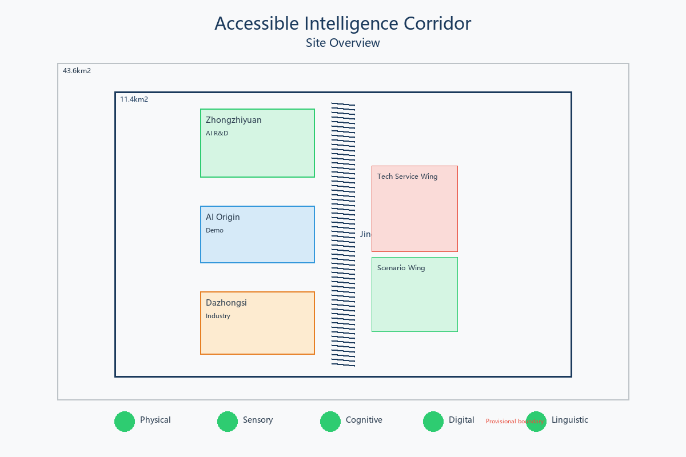
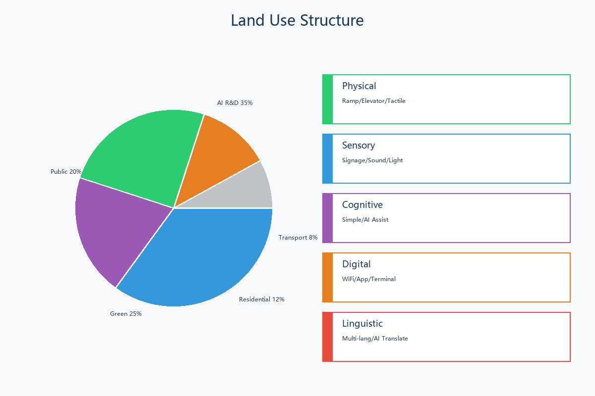
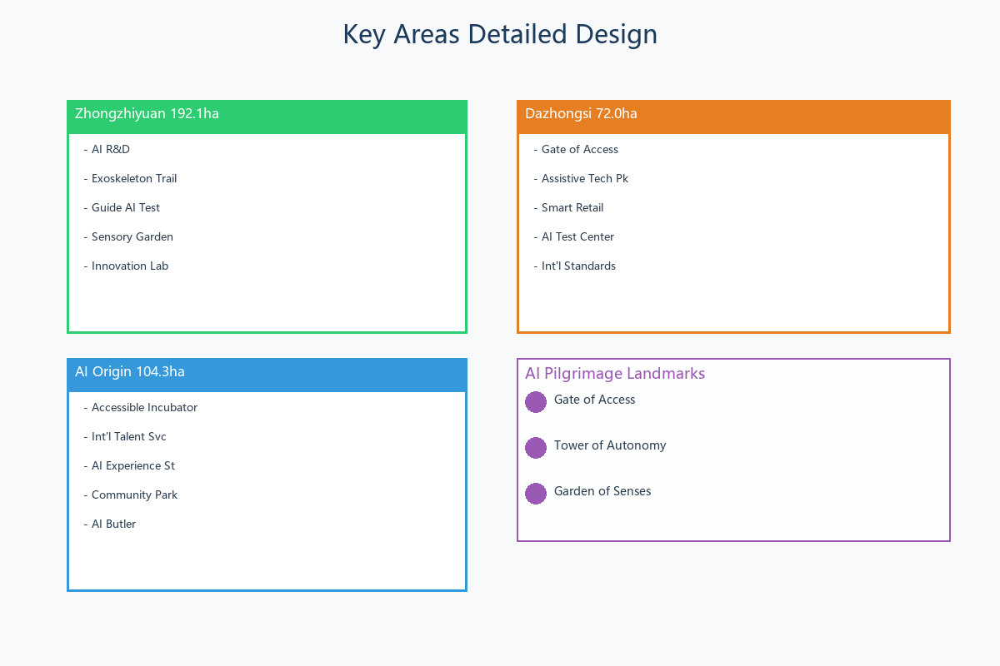
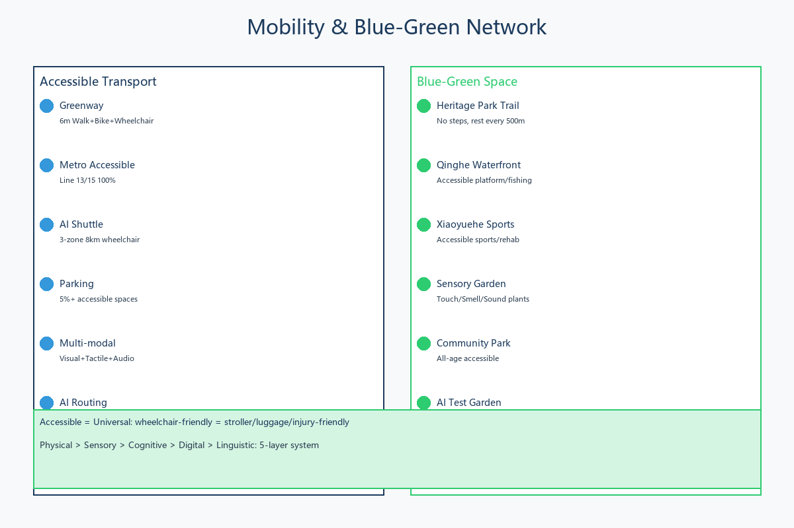
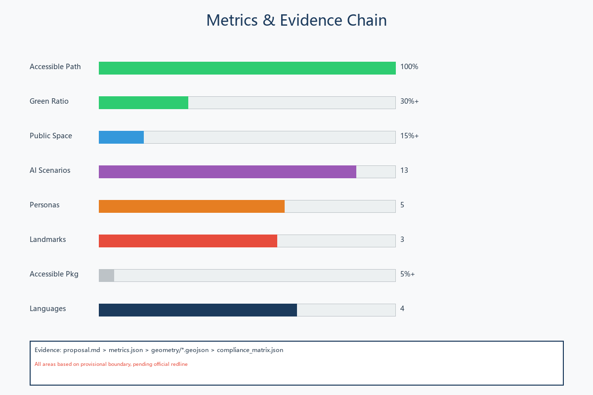

# Accessible Intelligence Corridor

## Design Basis and Source List

This proposal is built upon public sources [source:SITE-PACKAGE]:

**Official Announcements:** Pre-qualification announcement May 9, 2026 [source:DATA-SRC-OFFICIAL-ANNOUNCEMENT-20260509] defining 43.6 sq km research area, 11.4 sq km design area, 368.4 ha key areas. Global AI Agent Open Call Task Book [source:DATA-SRC-AGENT-TASKBOOK-20260518].

**Professional Standards:** MOHURD Urban Design Measures (2017) [standard:MOHURD-URBAN-DESIGN-MEASURES], MOHURD Regulatory Planning [standard:MOHURD-CONTROL-DETAILED-PLANNING], MNR Land Use Classification (2023) [standard:MNR-LAND-USE-CLASSIFICATION-202311].

**Accessibility Standards:** GB 50763-2012, GB 55019-2021, Beijing Accessibility Ordinance (2021).

**Spatial Data:** Uses repository-provisional rough boundary [data:geometry/provisional_boundaries.geojson]. All areas pending official redline. [depth:boundary_trust]

## Three-Level Scope Framework

[depth:scope_framework] Three progressive levels: Coordinated Research (43.6 sq km), Overall Design (11.4 sq km), Key Detailed Design (368.4 ha with three sub-areas).

## Coordinated Research Area: Industry and Future City Research

### Overall Concept [agent.1]

**Naming:** Accessible Intelligence Corridor (AIC). The Jingzhang Railway was China first independently designed railway - its spirit of "autonomy" echoes accessibility goal of enabling everyone to autonomously use the city.

**Three Positionings** [depth:positioning]: Centennial Jingzhang Cultural Belt, Urban AI Life Experience Belt, AI Integration Innovation Belt.

**Five Functions** [depth:five_functions]: AI Full-Stack Innovation, World-Class Ecosystem, AI+ Scenario Empowerment, Intelligent AI City, AI Governance Global Voice.

**Three Areas Two Wings** [depth:three_areas_two_wings]: Zhongzhiyuan (AI R&D), AI Origin (Scenario Demo), Dazhongsi (Industry Cluster), Zhongguancun Wing (Services), Xiaoyuehe Wing (Scenarios).

### AI Ecosystem Design [agent.2]

**8 Global Cases** [depth:ecosystem_cases]: Wayfindr (London, BLE audio nav), Microsoft Soundscape (3D audio), Loro (SF, sign language AI), WHILL (Japan, autonomous wheelchair), Be My Eyes (GPT-4V visual assist), SignAll (sign language recognition), Waymo Access (accessible AV), Tokyo 2020 Accessible Tech.

## Overall Design Area: Urban Renewal

**Five-Layer Accessibility System** [depth:overall_design]: Physical (ramps, elevators, tactile paths), Sensory (multi-modal wayfinding, soundscape, lighting), Cognitive (simple signage, AI assist, safety), Digital (WiFi, app, AI terminals), Linguistic (4+ languages, AI translation).

## Detailed Design of Key Areas

### Zhongzhiyuan (192.1 ha) [depth:key_area_1]
Accessible AI R&D and testing base. Exoskeleton experience trail, Guide AI test zone, Sensory garden.

### AI Origin Community (104.3 ha) [depth:key_area_2]
Accessible scenario demo and international talent hub. Accessible incubator, Community AI butler.

### Dazhongsi (72.0 ha) [depth:key_area_3]
Accessible AI industry cluster. Gate of Access landmark, Assistive tech park, Smart retail.

## AI Innovation Ecosystem, Personas, and AI+ Scenarios

### 5 Personas [depth:personas]
1. Li (28): Wheelchair user, AI engineer - Physical + Digital accessibility
2. Zhang (55): Blind, retired teacher - Sensory + AI guide
3. Wang (21): Deaf, university student - Sensory + AI sign language
4. David (35): US researcher, no Chinese - Linguistic + Cultural
5. Liu (78): Mild cognitive impairment - Cognitive + AI companion

### 13 AI Scenario Cards [depth:scenario_cards]
1. AI Guide Blind Navigation (BLE + audio)
2. AI Sign Language Terminal (gesture recognition)
3. AI Autonomous Wheelchair (LiDAR + obstacle avoidance)
4. AI Multi-Language Service (50+ languages)
5. AI Cognitive Assist (simplified UI + voice)
6. AI Environment Monitoring (IoT sensors)
7. AI Accessible Route Planning (realtime)
8. AI Sports Health (motion + rehab)
9. AI Cultural Guide (voice + AR)
10. AI Emergency Management (evacuation + shelter)
11. AI Community Governance (industry test)
12. AI Assistive Device Matching (industry test)
13. AI Building Check (industry test)

## Land Use

Conceptual layout based on provisional boundary [depth:land_use_layout]: R&D 35%, Public 20%, Green 25%, Residential 12%, Transport 8%. All pending official controls.

## Transport and Public Services

[depth:transport] Accessible slow-traffic streets, 100% accessible transit, accessible parking 5%+, AI low-speed shuttle between key areas.

## Blue-Green Network and Public Space

[depth:public_space] 6m accessible greenway, rest stations every 500m, sensory gardens.

### 3 Pilgrimage Landmarks [agent.4]
1. Gate of Access (Dazhongsi): Spiral ramp, accessibility history
2. Tower of Autonomy (Wudaokou): Innovation center, honor wall
3. Garden of Senses (Qinghe): Sensory experience park

## Phasing

[depth:phasing] Near-term (2026-2027): Foundation. Mid-term (2028-2030): Full deployment. Long-term (2031-2035): Maturity.

### Long-term Operations [agent.6]
Annual summit, hackathon, experience week. Open source community. International partnerships. Innovation fund and industry alliance.

## Metrics

Accessible path 100%, Green 30%+, Public space 15%+, Scenarios 13, Personas 5, Landmarks 3, Parking 5%+, Languages 4. All based on provisional boundary.

## Risk and Compliance

Risk: Privacy 2/5, Implementation 4/5, Acceptance 2/5, Operations 3/5, Policy 2/5, Spatial 3/5, Tech 3/5, Equity 1/5.

All suggestions are conceptual. No regulatory conclusions or statutory claims.

## References

1. Beijing Planning Commission. Pre-qualification Announcement. 2026-05-09.
2. open-city.ai. Agent Task Book. 2026-05-18.
3. MOHURD. Urban Design Measures. 2017.
4. MOHURD. Regulatory Planning Methods.
5. MNR. Land Use Classification. 2023-11.
6. MOHURD. GB 50763-2012.
7. MOHURD. GB 55019-2021.
8. Beijing. Accessibility Ordinance. 2021.
9. Wayfindr. Audio Navigation. wayfindr.net.
10. Microsoft. Soundscape.
11. CDPF. Statistics. 2025.
12. UN. CRPD. 2006.
