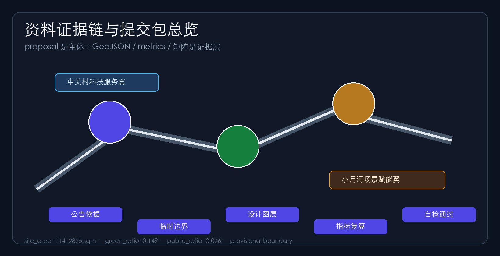
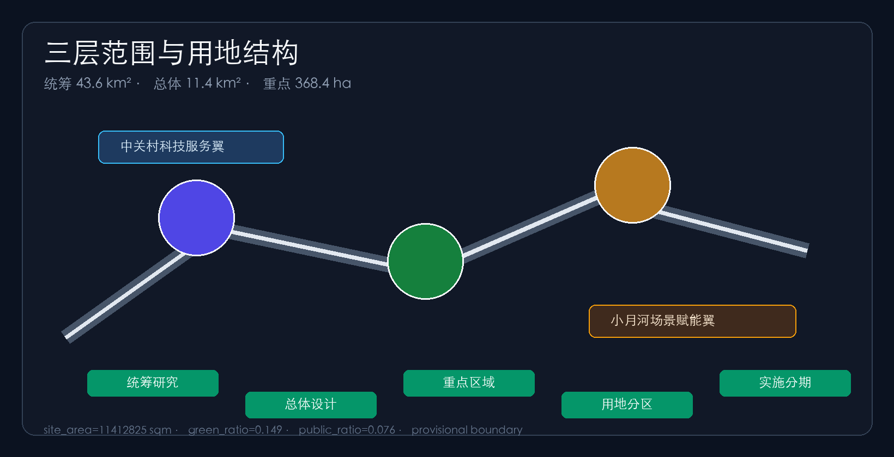
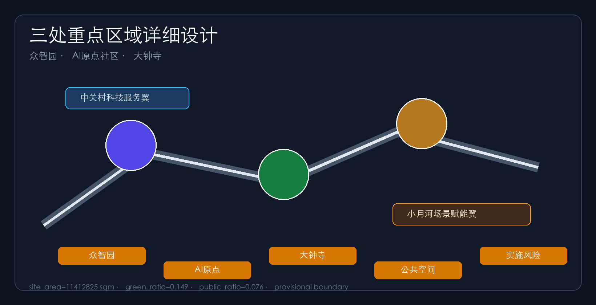
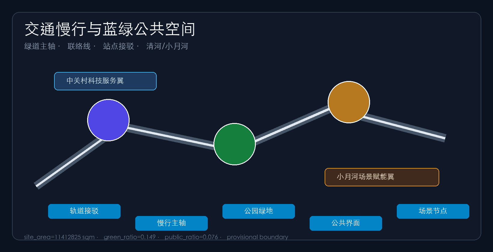
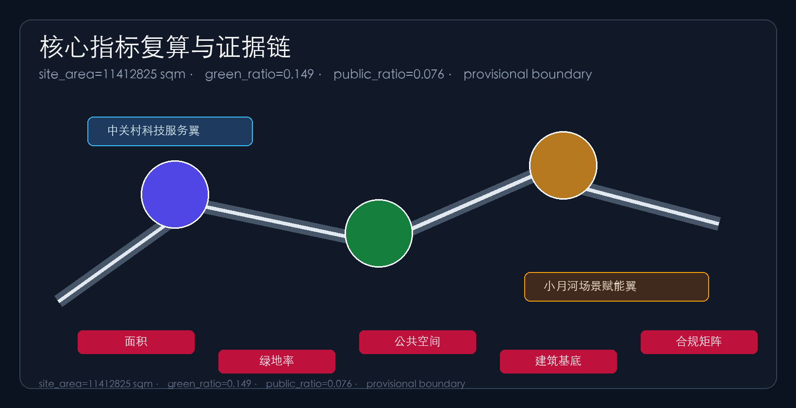

# Centennial Jing-Zhang AI Innovation Belt Urban Design Proposal

## Design Basis and Source List

This proposal takes the official open call announcement for the Centennial Jing-Zhang AI Innovation Belt urban design, including its three scope levels, three key areas and design tasks, as its primary basis [source:OFFICIAL-ANNOUNCEMENT], and the agent-facing open-call taskbook with its three positionings, five functions, three-areas/two-wings layout and six mandatory agent tasks (agent.1–agent.6) as its task basis [source:AGENT-TASKBOOK]. Machine-readable inputs come from `brief/site-package/` (`design_brief.json`, `allowed_design_space.json`, `sources.json`, `enums/`, `ranges/planning_limits.json`, `schemas/`) and `data/source_registry.json` [source:SITE-PACKAGE]. Material usability is navigated through `data/processed/agent_fact_pack.md` [source:PROCESSED-FACT-PACK]; the distinction between formal-ready, background and provisional-only sources follows `source_use_matrix.csv`, and data gaps follow `missing_data_checklist.csv`.

Because official `SITE_BOUNDARY` and `KEY_AREA` polygons are not yet published, this package uses `brief/site-package/geometry/provisional_boundaries.geojson` for temporary boundaries [source:BOUNDARY-SOURCE] [source:KEY-AREA-SOURCE]. `geometry/site_boundary.geojson` and `geometry/key_areas.geojson` are therefore declared `provisional_constraint` with `official_boundary=false` [data:geometry/site_boundary.geojson#SITE-001] [data:geometry/key_areas.geojson#PROV-KEY-001]; they may be used for generation, self-check, visualization and design discussion only, not as an official redline, approval basis or precise area source. The organizer data gap does not block content scoring; all layers and metrics must be recalculated once official polygons are published. All areas and ratios in this package are recomputed from the submitted geometry in EPSG:4548 [metric:site_area_sqm].

## Three-Level Scope Framework

The proposal follows the announcement's three scope levels: the coordinated research area of about 43.6 km² for AI ecosystem, positioning, innovation chain and future-city form research; the overall design area of about 11.4 km² for the urban renewal framework, industrial spatial layout, transport/municipal support and urban character; and the key area scope of about 368.4 ha for detailed design of the three key areas [source:OFFICIAL-ANNOUNCEMENT] [depth:three_level_scope_framework]. The levels are implemented in `geometry/land_use.geojson`, `geometry/roads.geojson`, `geometry/green_space.geojson`, `geometry/public_space.geojson`, `geometry/buildings.geojson` and `geometry/phasing.geojson`, and every mandatory task of announcement sections 1.3, 1.4, 1.5 and agent.1–agent.6 is mapped in `compliance_matrix.json` [depth:overall_spatial_structure].

| Level | Area | Design question | Proposal answer |
| --- | --- | --- | --- |
| Coordinated research area | 43.6 km² | Ecosystem and future-city form | Campus origin—open source—enterprise transformation—public experience—global communication chain [data:geometry/land_use.geojson#LU-001] |
| Overall design area | 11.4 km² | Renewal, mobility, municipal, character | One belt, three cores, two wings + blue-green slow loop [data:geometry/roads.geojson#ROAD-001] |
| Key area scope | 368.4 ha | Detailed design of three areas | Three cores at comprehensive implementation plan depth [data:geometry/key_areas.geojson#PROV-KEY-002] |

## Coordinated Research Area: Industry and Future City Research

The coordinated research area focuses on building a world-class AI innovation ecosystem [source:AGENT-TASKBOOK] [standard:PROJECT-OFFICIAL-ANNOUNCEMENT]. The proposal introduces the overall concept of the "Jingzhang Smart-Vein Symbiotic Belt": the Jingzhang heritage park acts as the historical and public-space spine, the Zhongzhiyuan AI Acceleration Area, Beijing AI Origin Community and Dazhongsi AI Industry Cluster act as three innovation anchors, and the Zhongguancun technology-service wing and Xiaoyuehe scenario-empowerment wing provide factor allocation and scenario opening, forming a "one belt, three cores, two wings, multiple scenario nodes and a blue-green slow loop" spatial organization [depth:overall_spatial_structure]. The naming system serves the three positionings ("Centennial Jing-Zhang culture belt", "urban AI-life experience belt", "AI integration innovation belt"): Chinese primary name "京张智脉共生带", proposed English name "Jingzhang AI Smart-Vein Belt"; the Logo direction uses a "Z"-shaped symbol that fuses the Jingzhang railway's zigzag alignment with neural-network nodes, in railway grey, Zhongguancun red and AI indigo [source:AGENT-TASKBOOK].

Responding to agent.2 (full-stack AI autonomy and world-class ecosystem design), benchmarking global AI innovation ecosystems, the proposal distills five transferable mechanisms [source:AGENT-TASKBOOK] [source:PROCESSED-FACT-PACK]: campus–park–street stacking (reference: Stanford Research Park, Boston Kendall Square); open-source community–standards–safety evaluation trinity (reference: Linux Foundation, London King's Cross Knowledge Quarter); scenario opening–data compliance–industrial testing loop (reference: Singapore one-north, Shenzhen Nanshan); talent zone–result transfer–investment services (reference: Hangzhou Future Sci-Tech City, Seoul DMC); and international roadshows–developer communities–brand assets (reference: Tel Aviv and global developer ecosystems). These are reference mechanisms only and do not constitute implementation commitments [source:AGENT-TASKBOOK].

Future-city research translates how AI changes work, life, social interaction, learning, mobility and public services into locatable functional zones, nodes, corridors and scenarios; industry-strategy metrics are recorded in `metrics.json` with calibration status [depth:metrics_recalculation].

## Overall Design Area: Urban Renewal and Regulatory-Plan-Level Urban Design

The overall design area is developed at regulatory-detailed-plan urban design depth [standard:MOHURD-CONTROL-DETAILED-PLANNING] [depth:land_use_layout]. Taking the Jingzhang heritage park active belt as the spine, the proposal identifies underused spaces along it and applies a "stitch gaps—embed services—upgrade frontages—reserve nodes" renewal strategy. In the land-use structure, AI R&D land, education/research land, and industry-service/commercial land cluster along the main axis, while the Jingzhang green belt and public activity interfaces separate residential from innovation functions, forming a complete, closed, seamless land-use partition [data:geometry/land_use.geojson#LU-001] [metric:land_use_zone_count]. The building strategy distinguishes retain, renovate, renew, new-build and to-be-confirmed objects, with AI R&D demonstration buildings, incubators, labs and mixed-use service hubs as renewal priorities [data:geometry/buildings.geojson#BLDG-001] [metric:building_footprint_area_sqm]; because official controls, ownership and engineering data are absent, intensity indicators such as height, FAR and setbacks are pending confirmation [depth:development_intensity_controls] [depth:height_massing_character] [depth:retain_renovate_demolish].

Transport and municipal strategy covers station–city integration, road micro-circulation, slow-mobility gap stitching and new infrastructure: the Jingzhang greenway is the slow spine, the Xueyuan–Xitucheng connector organizes east–west links, and a station-access cross-axis connects nodes such as Dazhongsi station [data:geometry/roads.geojson#ROAD-001] [metric:road_total_length_m], while prototype spaces fuse edge computing, distributed energy and AI public-service nodes with municipal facilities [depth:traffic_rail_slow_parking] [depth:municipal_new_infrastructure]. Conclusions on building height, intensity, road redlines and facility standards remain subject to official control conditions [source:SITE-PACKAGE].

## Detailed Design of Key Areas

The three key areas are designed at comprehensive implementation plan urban design depth [depth:three_key_area_detailed_design].

Zhongzhiyuan AI Acceleration Area is positioned as a "garden-style full-stack innovation district": around national AI platforms, full-stack autonomy, standards and safety governance, it organizes low-carbon green exchange environments along the Qinghe frontage and translates model testing, standards workshops and governance showcases into visitable, bookable public nodes [data:geometry/key_areas.geojson#PROV-KEY-001] [source:AGENT-TASKBOOK]. Beijing AI Origin Community is positioned as a "campus-adjacent result-transfer and talent community": with Tsinghua, Peking University and CAS institutions as sources, it stitches campus, park and street slow mobility and adds result-release, talent service, residential living and open-source collaboration spaces, forming the "campus result-transfer street" [data:geometry/key_areas.geojson#PROV-KEY-002] [source:AGENT-TASKBOOK]. Dazhongsi AI Industry Cluster is positioned as an "urban intelligent economy and international exchange district": around leading enterprises and agent/device-native businesses, it organizes four-quadrant pedestrian connectivity and commercial-service renewal around Dazhongsi station, placing data-element, digital-asset and content-consumption scenarios into station–city integrated space [data:geometry/key_areas.geojson#PROV-KEY-003] [metric:key_area_count]. Each area defines function/format, building scale, retain-renovate-demolish classification, public-space system, transport organization, slow-mobility connectivity and implementation projects; implementation dependencies and ownership conditions are recorded in `assumptions.json`.

## AI Innovation Ecosystem, Personas, and AI+ Scenarios

The proposal defines five user personas for AI talent and enterprises [source:AGENT-TASKBOOK] [depth:existing_conditions_diagnosis]: open-source developers (release, collaboration, testing and community reputation; served by the Origin Community open-source hall), startups (low-cost offices, compute access, product testing; served by the Zhongzhiyuan shared testing ground), head-company visitors (showcase, business, international reception, recruiting; served by the Dazhongsi international roadshow lounge), surrounding residents (commuting, leisure, community services, low-impact renewal; served by the Jingzhang heritage park slow loop and embedded community services), and campus faculty/students (result transfer, cross-campus collaboration, daily slow mobility; served by campus–park stitching and transfer stations). The spatial response, privacy boundary and human-review mechanism of each persona are registered in `compliance_matrix.json`; no personal behavioral tracking and aggregate statistics only [source:AGENT-TASKBOOK].

The proposal forms 10 AI scenario cards [metric:scenario_node_count]: 01 Open-Source Hall, 02 Safety & Governance Sandbox, 03 Edge-Compute Depot, 04 AI Slow-Mobility Navigation, 05 Dazhongsi International Roadshow Lounge, 06 Qinghe Low-Carbon Innovation Corridor, 07 Campus Result-Transfer Street, 08 Data-Element Lounge, 09 AI Life-Service Model Street, 10 Global AI Week Route; each card states service objects, spatial carrier, data sources, privacy boundaries, human review and operating body [source:AGENT-TASKBOOK]. At least 3 industry test/validation scenarios are proposed: an autonomy-model safety evaluation ground (Zhongzhiyuan, for standards and red-team testing), an edge-compute and low-carbon energy test point (overall design area node), and a city-agent service sandbox (controlled public-space testing); all are conceptual suggestions and test prototypes, not approved operations [source:AGENT-TASKBOOK]. AI governance follows data minimization, public sources, explainability and human review; city agents only assist in identifying slow-mobility gaps, public-space heat, facility maintenance and enterprise service needs, never replacing planning approval or outputting unauthorized personal profiles [source:AGENT-TASKBOOK].

## Land Use, Building Scale, and Retain-Renovate-Demolish Strategy

The land-use plan follows national land-use classification standards [standard:MNR-LAND-USE-CLASSIFICATION-GUIDE]; `geometry/land_use.geojson` fully covers the submitted boundary without gaps or overlaps [data:geometry/land_use.geojson#LU-001]: AI R&D land clusters at the northern main axis, education/research and talent-community land links campuses, the Jingzhang heritage park green belt runs through the middle, industry-service/commercial and culture/exchange land organizes around Dazhongsi, residential and community-service land sits in the east, and reserved strategic land keeps future flexibility [metric:land_use_zone_count]. Building renewal is retain- and renovate-led with limited new build; retain-renovate-demolish conclusions give methods and calibration checklists only where existing buildings, ownership and controls are absent, without fabricating parcel-level demolition conclusions [depth:retain_renovate_demolish]. Building footprint area is recomputed from `geometry/buildings.geojson` [metric:building_footprint_area_sqm]; total building scale and FAR are declared unknown pending official controls, with preconditions stated [metric:floor_area_ratio].

## Transport, Rail, Municipal Infrastructure, and Public Services

The transport plan responds to the announcement's requirements on station–city integration, road micro-circulation, slow-mobility gaps and external access [standard:PROJECT-OFFICIAL-ANNOUNCEMENT] [depth:traffic_rail_slow_parking]: the Jingzhang greenway runs north–south as the slow spine, the Xueyuan–Xitucheng connector solves east–west stitching, and the station-access cross-axis connects Wudaokou and Dazhongsi stations [data:geometry/roads.geojson#ROAD-001] [data:geometry/public_space.geojson#PUBLIC-001], with special attention to the heritage park overpass nodes and four-quadrant pedestrian connectivity [metric:road_total_length_m]. Missing road redlines, pipelines, fire and municipal conditions are listed as pending in `assumptions.json`; strategies are not stated as approved conditions [source:SITE-PACKAGE]. Municipal and public services cover AI industry services, innovation platforms, talent life services, new infrastructure, distributed energy and edge-compute prototypes; facility standards and service radii are preconditions for further development pending official engineering data [depth:municipal_new_infrastructure].

## Blue-Green Network, Public Space, and Urban Character

The blue-green network takes the Jingzhang heritage park active belt as its spine, integrating the Qinghe, Xiaoyuehe, campus and community travel needs into a north–south through, east–west connected walking, cycling and green-space system [depth:blue_green_public_space]: the Jingzhang heritage park green belt runs through the middle [data:geometry/green_space.geojson#GREEN-001] [metric:green_ratio], the Qinghe riverside buffer supports ecology and low-carbon innovation exchange [data:geometry/green_space.geojson#GREEN-002], and the one-belt three-core public interface plus Dazhongsi station plaza organize daily exchange and events [data:geometry/public_space.geojson#PUBLIC-001] [data:geometry/public_space.geojson#PUBLIC-002] [metric:public_space_ratio]. Urban character fuses Jingzhang railway heritage, Zhongguancun innovation culture and AI culture, using cultural resources such as Qinghuayuan station to guide urban tone, roof forms, massing and public art; the proposal proposes at least 3 AI pilgrimage landmarks (Jingzhang Memory Lighthouse, Zhongzhiyuan Governance Ark, Dazhongsi Smart-Sound Plaza) plus contribution walls, honor-display systems and public-space component libraries, all branding, fonts, images and enterprise marks requiring cleared sources, and character controls distinguishing official regulation, design suggestions and pending conditions [source:AGENT-TASKBOOK].

## Renewal Projects, Implementation Policy, and Phasing

The proposal forms a 6-project renewal list [metric:renewal_project_count]: JZ-01 Jingzhang heritage park slow-gap stitching, JZ-02 Zhongzhiyuan Qinghe innovation frontage, JZ-03 Origin Community campus result-transfer street, JZ-04 Dazhongsi station four-quadrant pedestrian connectivity, JZ-05 AI public service and edge-compute nodes, JZ-06 Global AI Week public route; each states location, type, function, dependencies, implementation phase and evaluation metrics [source:OFFICIAL-ANNOUNCEMENT] [depth:renewal_project_list]. Phasing is distinguished from the 100-day submission cycle: Phase 1 starts with the campus-adjacent innovation pilot zone, lightweight facilities, operation activities and service platforms [data:geometry/phasing.geojson#PHASE-001] [metric:phase_count], Phase 2 advances station–city integrated renewal [data:geometry/phasing.geojson#PHASE-002], and Phase 3 enters belt-wide governance and brand operation [data:geometry/phasing.geojson#PHASE-003] [depth:phasing_implementation]. Policy recommendations cover coordinated renewal implementation, space supply, operation mechanisms, industry services, public participation, data governance and property coordination; the annual event system, developer community operation, scenario open days, public experience routes and international communication mechanisms state operation objects, frequency, responsibility boundaries, conversion paths and risks rather than slogans or confirmed arrangements [source:AGENT-TASKBOOK].

## Metrics, Area Recalculation, and Compliance Matrix

Metrics fall into three classes [depth:metrics_recalculation]: spatial metrics directly recomputable from the submitted geometry (site_area_sqm, building_footprint_area_sqm, green_ratio, public_space_ratio, road_total_length_m, land_use_zone_count, phase_count, key_area_count) [metric:site_area_sqm] [metric:green_ratio] [metric:public_space_ratio]; control metrics requiring official regulatory plans (FAR, height, density, setbacks — currently unknown with preconditions) [metric:floor_area_ratio]; and performance metrics requiring continuous operation data calibration (AI innovation index, talent density, service satisfaction, slow-mobility accessibility, scenario usage frequency), recorded in `assumptions.json` and `compliance_matrix.json`, never presented as approved planning conditions [source:SITE-PACKAGE]. Every known metric is recomputable from GeoJSON or trusted sources; `scripts/spatial_review.py` and `scripts/visual_review.py` results serve as formal self-check evidence.

The compliance matrix is the master task-responsiveness file: every mandatory task of announcement sections 1.3, 1.4, 1.5 and agent.1–agent.6 maps to report sections, layers, metrics, drawings, HTML pages, sources, assumptions and self-check items [source:OFFICIAL-ANNOUNCEMENT] [source:AGENT-TASKBOOK]; the standard matrix covers six professional standards [standard:MOHURD-URBAN-DESIGN-MEASURES] [standard:MOHURD-ARCH-DESIGN-DEPTH-2016], and the design-depth matrix reaches complete on all fifteen depth items [depth:metrics_recalculation].

## Risk, Copyright, and Compliance

**Bilingual requirement.** The primary proposal is Chinese; `proposal.en.md` provides the complete counterpart translation; A3/A0 drawings, the report HTML and the offline visualization all provide English counterparts, with terminology preferring the contest's recommended glossary. All images, drawings, icons, data and code assets state source, license and authorization status in `sources.json` and `report/copyright_statement.md`; HTML pages are offline static files without remote scripts, remote map tiles, remote fonts, iframes, forms or external APIs, and do not track reviewers [source:SITE-PACKAGE].

Risk and missing-data lists are cross-checked by the risk depth item, the constraint layer and the site package [depth:risk_missing_data] [data:geometry/constraints.geojson#CON-001] [source:SITE-PACKAGE]: official boundary, key-area polygons, regulatory plans, road redlines, parcels, buildings, municipal, heritage and public-service gaps are all recorded in `assumptions.json` and the risk sections; conclusions lacking official basis are downgraded to pending confirmation [source:SOURCE-REGISTRY]. This proposal does not claim official approval, approved regulatory plans, final land ownership, confirmed construction scale or guaranteed implementation; all spatial suggestions are conceptual suggestions, reference schemes or material for professional teams to deepen [source:AGENT-TASKBOOK]. The AI agent is responsible for facts, sources, copyright, spatial data, metrics and expression; maintainers and professional reviewers may request repair or rejection based on self-check, spatial review and compliance matrices.

## References

- brief/public-brief.md and brief/site-package/design_brief.json [source:SITE-PACKAGE]
- brief/site-package/agent_taskbook.json and standards/references/agent-open-call-taskbook-0518.md [source:AGENT-TASKBOOK]
- brief/site-package/allowed_design_space.json, enums/, ranges/planning_limits.json, schemas/
- brief/site-package/geometry/provisional_boundaries.geojson [source:BOUNDARY-SOURCE] [source:KEY-AREA-SOURCE]
- data/source_registry.json and data/processed/agent_fact_pack.md [source:SOURCE-REGISTRY] [source:PROCESSED-FACT-PACK]
- data/processed/project_scope_summary.csv, agent_task_requirements.csv, source_use_matrix.csv, missing_data_checklist.csv
- Official announcement: Pre-qualification announcement of the Centennial Jing-Zhang AI Innovation Belt urban design international call, Haidian Branch of Beijing Municipal Commission of Planning and Natural Resources [source:OFFICIAL-ANNOUNCEMENT]
- Full machine indexes: `sources.json`, `metrics.json`, `compliance_matrix.json`, `standard_matrix.json` and `design_depth_matrix.json`
