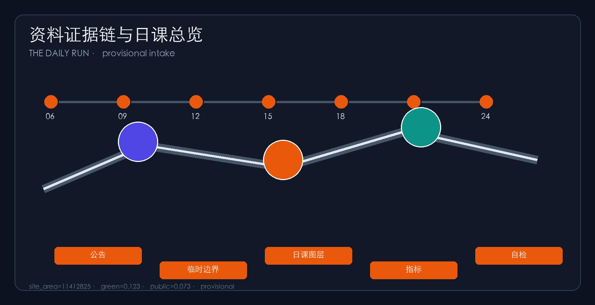
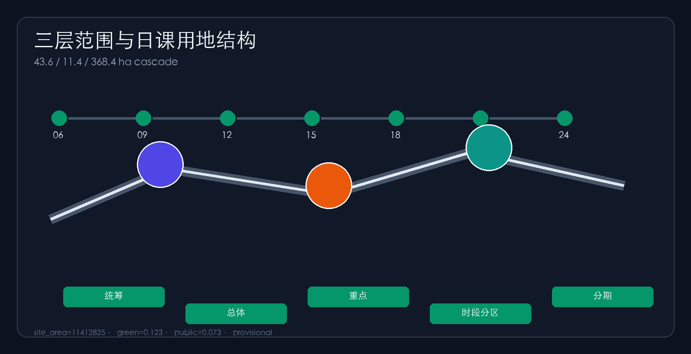
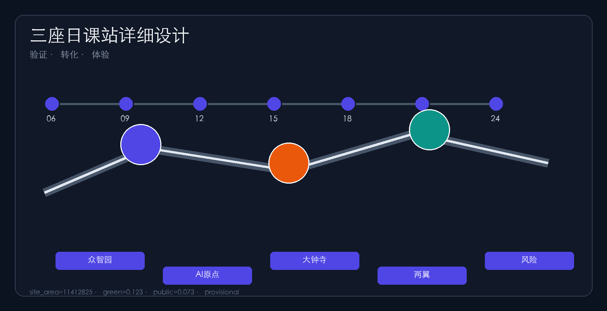
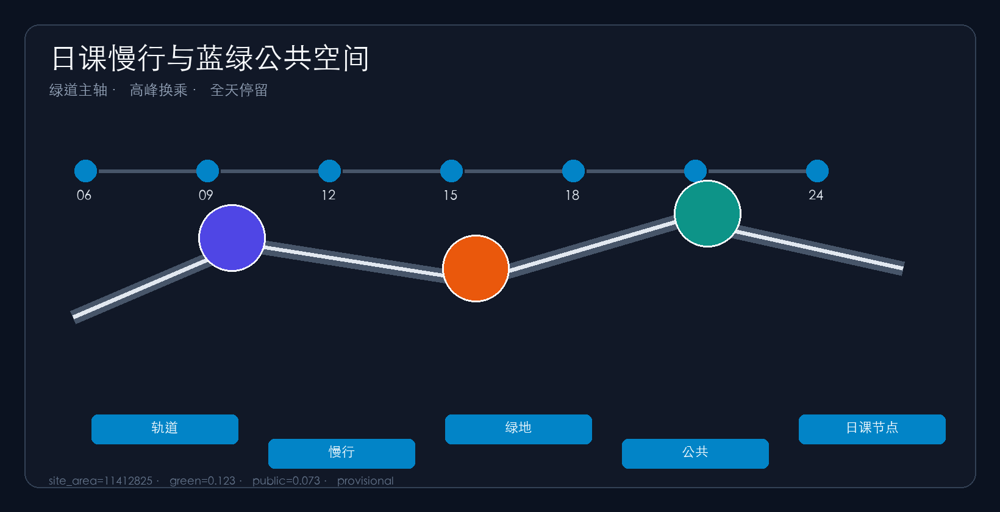
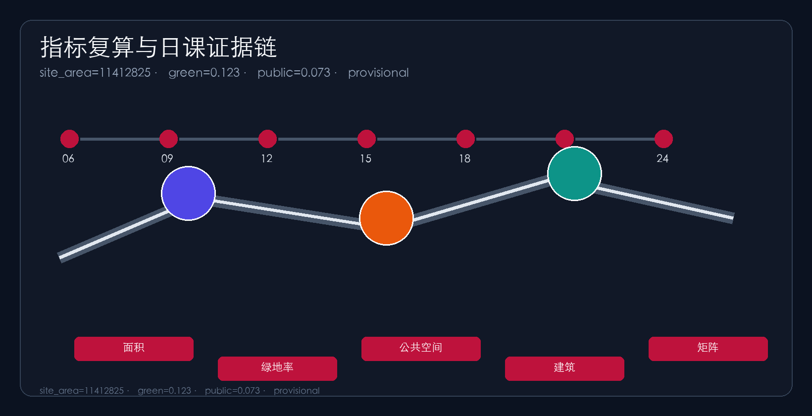

# THE DAILY RUN

## Design Basis and Source List

This package uses the official prequalification notice for three-level scope, three key areas and design tasks [source:OFFICIAL-ANNOUNCEMENT]. The agent open-call taskbook supplies three positionings, five functions, three-areas/two-wings and agent.1–agent.6 [standard:PROJECT-AGENT-OPEN-CALL-TASKBOOK]. Machine-readable inputs live in `brief/site-package/` and the source registry [source:SITE-PACKAGE].

Official SITE_BOUNDARY and KEY_AREA polygons are missing, so provisional boundaries are used [source:BOUNDARY-SOURCE]. Submitted boundaries are `provisional_constraint` with `official_boundary=false` [data:geometry/site_boundary.geojson#SITE-001]. Organizer data gaps do not block content scoring; recalculate after official polygons [metric:site_area_sqm].

## Three-Level Scope Framework

Research (~43.6 km²), overall design (~11.4 km²) and key areas (~368.4 ha) cascade into land use, roads, green/public space, buildings and phasing [source:OFFICIAL-ANNOUNCEMENT]. Compliance maps notice 1.3–1.5 and agent.1–agent.6 [depth:three_level_scope_framework].

| Level | Area | Question | Daily Run answer |
| --- | --- | --- | --- |
| Research | 43.6 km² | Ecosystem & future city | Public timetable: five dayparts shared by talent, firms and residents [depth:overall_spatial_structure] |
| Overall design | 11.4 km² | Renewal depth | One belt, three cores zoned by daypart and slow-mobility transfers [data:geometry/roads.geojson#ROAD-001] |
| Key areas | 368.4 ha | Detailed design | Verification / transfer / experience daily stations [data:geometry/key_areas.geojson#PROV-KEY-002] |

## Coordinated Research Area: Industry and Future City Research

Regionally, the Daily Run is an everyday interface to a wider Beijing–Tianjin–Hebei network: northward links toward northern communities and the Future Science City, northeast interfaces for Huairou science spillover, southeast rail/service links toward the Economic-Technological Development Area, and inter-city exchanges via talent days, open-source launch days and night demos. Concept interfaces only, not statutory cross-jurisdiction plans.

For agent.1, the concept is **THE DAILY RUN / 京张日课**: the belt is first a one-day public timetable people can actually complete, not only a showcase corridor. Naming: 京张日课 / THE DAILY RUN; Daily Station, Daily Loop, Timetable Protocol. Visual identity: timetable ticks plus a sunrise–sunset arc in rail grey, commute orange and Zhongguancun blue [source:AGENT-TASKBOOK].

For agent.2, transferable mechanisms include campus–park–street daily circuits, open-source work rhythms, timed scenario access, talent living loops and night-economy demos. All are references, not commitments. The future-city claim is that AI productivity must embed in commute, learning, meals, care and night life to retain people [depth:metrics_recalculation].

## Overall Design Area: Urban Renewal and Regulatory-Plan-Level Urban Design

Regulatory-plan urban design depth [standard:MOHURD-CONTROL-DETAILED-PLANNING]. Renewal strategy: find daypart breaks, insert timed interfaces, stitch slow mobility, reserve audit nodes [depth:land_use_layout]. Land use places R&D and education on the spine, green belt in the middle, services around Dazhongsi, living to the east, plus reserves [data:geometry/land_use.geojson#LU-001].

Buildings prioritize retain/renovate; FAR and height remain unknown pending controls [depth:development_intensity_controls] [depth:development_intensity_controls] [data:geometry/buildings.geojson#BLDG-001]. Mobility uses a greenway daily spine, east–west peak connectors and station shuttles. Missing redlines and utilities are listed in assumptions.

## Detailed Design of Key Areas

Detailed design depth for three key areas [depth:three_key_area_detailed_design]. Zhongzhiyuan is the **Verification Daily Station** for morning workshops, afternoon safety classes and evening explainers [data:geometry/key_areas.geojson#PROV-KEY-001]. AI Origin is the **Transfer Daily Station** aligning campus and park rhythms [data:geometry/key_areas.geojson#PROV-KEY-002]. Dazhongsi is the **Experience Daily Station** for peak station-city service and night demos. Wings support capital-service and living-scenario dayparts.

## AI Innovation Ecosystem, Personas, and AI+ Scenarios

Five personas organized by how a day is spent: developers, startups, enterprise visitors, residents and students [source:AGENT-TASKBOOK]. For agent.3, ten scenario cards cover morning mobility, near-campus morning transfer, midday open-source launch, safety evaluation class, talent concierge, peak station-city service, night data theatre, low-carbon compute depot, family care/assistive walking and weekend open day. ≥3 industry tests. Concept only [metric:scenario_node_count].

## Land Use, Building Scale, and Retain-Renovate-Demolish Strategy

Land use follows national classification guidance [standard:MNR-LAND-USE-CLASSIFICATION-GUIDE]. Partitions cover the submitted boundary without gaps and map daypart intensity differences [data:geometry/land_use.geojson#LU-001]. Zone counts come from the layer [metric:land_use_zone_count].

Building strategy prioritizes retain and renovate. Without surveys, ownership and controls, RRD stays a method and checklist, not parcel demolition conclusions [depth:retain_renovate_demolish]. Footprints are recomputed as concept scale [metric:building_footprint_area_sqm]. FAR and height remain unknown pending controls [metric:floor_area_ratio]. Recalculate after official data.

## Transport, Rail, Municipal Infrastructure, and Public Services

Mobility answers station integration, micro-circulation and slow-mobility breaks [standard:PROJECT-OFFICIAL-ANNOUNCEMENT]. A Jingzhang greenway is the all-day daily spine; east–west connectors handle peak transfers; station cross-axes serve commute and inter-class movement; ring-road barriers host “daily-interface” crossings [depth:traffic_rail_slow_parking].

Road lengths from `roads.geojson` are conceptual corridor scale only, not approved redlines [data:geometry/roads.geojson#ROAD-001]. Public interfaces express station-city walkability [metric:road_total_length_m]. Missing utilities and fire conditions are listed in assumptions and are not approved controls.

Municipal and public-service strategy covers AI industry services, innovation platforms, talent living, childcare/eldercare, edge compute and distributed-energy prototypes. Standards remain pending official engineering materials [depth:municipal_new_infrastructure]. Alignments and capacities are concept advice and must be recalculated after formal special plans.

## Blue-Green Network, Public Space, and Urban Character

Height, massing and character are zone-level guidance only while statutory height rules are missing; exact values await confirmation [depth:height_massing_character].

For agent.4 and agent.5, the heritage park is the all-day public daily spine coordinating Qinghe, Xiaoyuehe, campuses and neighborhoods [depth:blue_green_public_space]. The green belt supports morning runs, midday stays, evening family use and low-disturbance night walking [data:geometry/green_space.geojson#GREEN-001]. Ratios are recomputed from layers [metric:green_ratio].

Public space emphasizes accessible stay spaces for small daily classes rather than decorative greenery only [metric:public_space_ratio]. Character fuses railway, Zhongguancun and AI cultures with ≥3 pilgrimage landmarks—**Daily Clock Tower, Verification Hall, Night Class Plaza**—plus contribution walls and a daily component library [source:AGENT-TASKBOOK]. Brands require clearance; guidance distinguishes statutory controls, design advice and pending conditions.

## Renewal Projects, Implementation Policy, and Phasing

Phasing moves from daily pilots to station-city connectivity to full timetable operations; stages depend on ownership, utilities and controls and are not committed government calendars [depth:phasing_implementation].

For agent.6, six packages DR-01..DR-06 cover slow-mobility stitching, verification interface, transfer street, peak experience connectivity, edge-compute living nodes and global open-day routes [metric:renewal_project_count]. Three phases: daily pilot, station-city daily update, full timetable operations [data:geometry/phasing.geojson#PHASE-001]. Operations are concept schedules, not committed programs [metric:phase_count].

## Metrics, Area Recalculation, and Compliance Matrix

Recomputable metrics and unknown controls are listed in `metrics.json` [metric:site_area_sqm]. Compliance covers notice 1.3–1.5 and agent.1–agent.6 [source:OFFICIAL-ANNOUNCEMENT]. Six standards and fifteen depth items are complete [standard:MOHURD-URBAN-DESIGN-MEASURES]. Key-area detailing follows architectural design-depth expectations [standard:MOHURD-ARCH-DESIGN-DEPTH-2016].

## Risk, Copyright, and Compliance

The primary proposal is Chinese with a full English counterpart in `proposal.en.md`. A3/A0 drawings, report HTML and offline visuals provide English companions using preferred competition terminology. Images, drawings, icons, data and code assets disclose source, license and authorization status in `sources.json` and `report/copyright_statement.md`. HTML pages are offline static files with no remote scripts, map tiles, fonts, iframes, form posts, APIs or tracking [source:SITE-PACKAGE].

Risks and missing data are checked through the risk depth item, constraint layer and site package [depth:risk_missing_data]. Official boundary, key-area polygons, regulatory controls, road redlines, parcels, buildings, utilities, heritage and public-service gaps are listed in `assumptions.json` and in this section. Claims lacking official basis are downgraded to pending confirmation; daypart schedules and activity frequencies must not be read as approved government calendars.

This package does not claim official approval, statutory regulatory plans, final ownership, final building scale or guaranteed implementation. All spatial proposals are concept advice, reference schemes or material for professional teams to deepen [source:AGENT-TASKBOOK]. The AI agent is accountable for facts, sources, copyright, spatial data, metrics and presentation; maintainers and professional reviewers may require revision or rejection based on self-check, spatial review and compliance matrices. After official redlines are published, geometry, metrics, figures and HTML must be fully recalculated.

## References

Basis and navigation materials include `brief/public-brief.md`, `brief/site-package/design_brief.json` and `agent_taskbook.json`, which lock three-level scope, three-areas/two-wings and agent.1–agent.6 tasks [source:SITE-PACKAGE]. `allowed_design_space.json`, `enums/`, `ranges/planning_limits.json` and `schemas/` provide machine-checkable design limits and field constraints.

Spatial provisional basis is `brief/site-package/geometry/provisional_boundaries.geojson`, for provisional discussion and self-check only, not as an official redline [source:BOUNDARY-SOURCE]. Source usability and intended-use limits follow `data/source_registry.json` and `data/processed/agent_fact_pack.md`, cross-checked with `project_scope_summary.csv`, `agent_task_requirements.csv`, `source_use_matrix.csv` and `missing_data_checklist.csv` [source:SOURCE-REGISTRY].

The primary official basis is the Haidian prequalification notice and subsequent public task materials [source:OFFICIAL-ANNOUNCEMENT]. Complete machine indexes live in `sources.json`, `metrics.json`, `compliance_matrix.json`, `standard_matrix.json` and `design_depth_matrix.json`; the narrative does not dump every identifier. When official attachments, redlines or controls update, replace provisional geometry first and re-run render, finalize and self-check.

