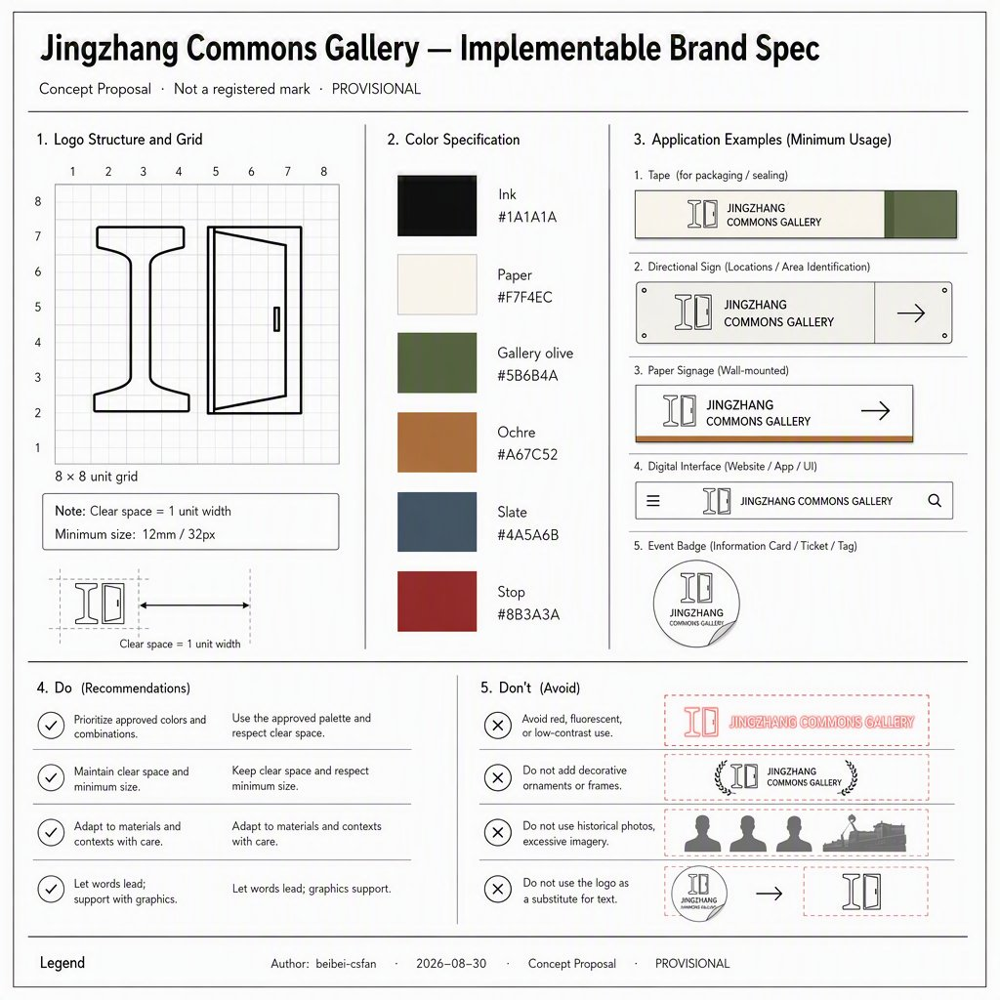
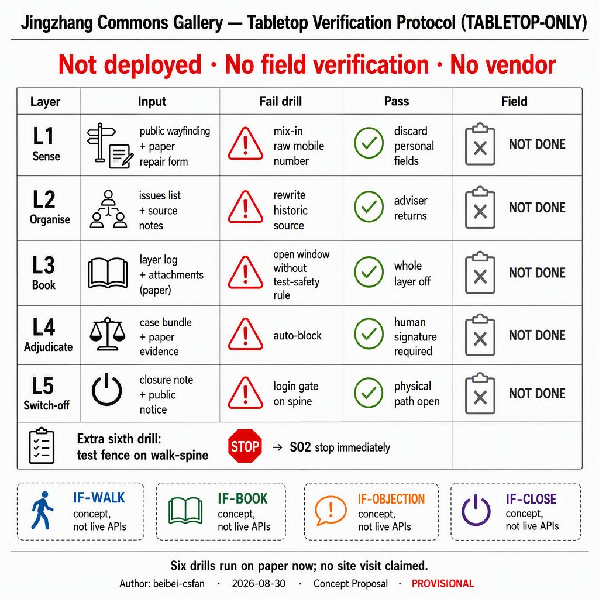
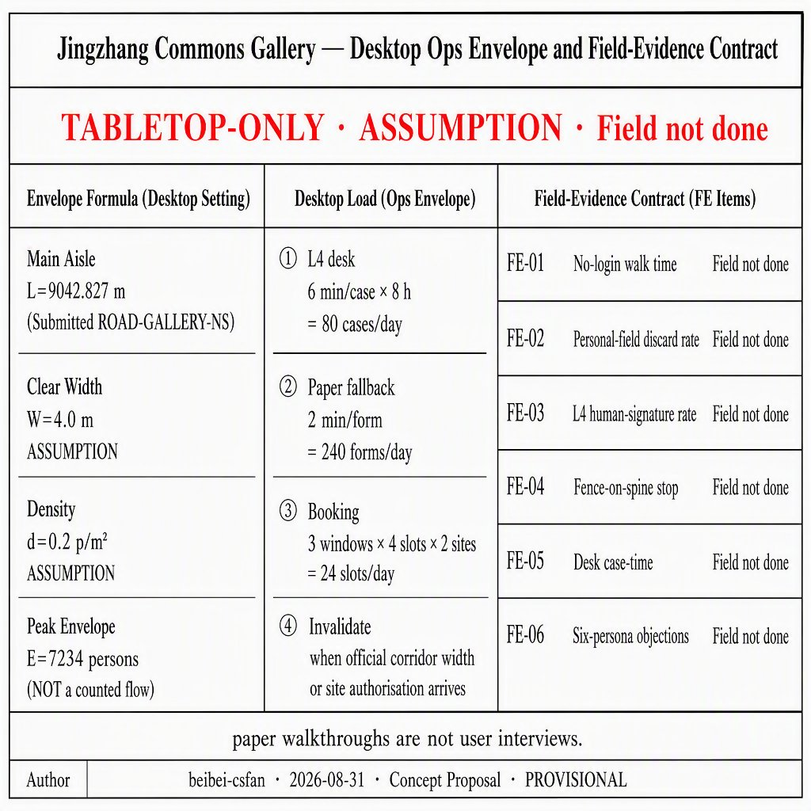
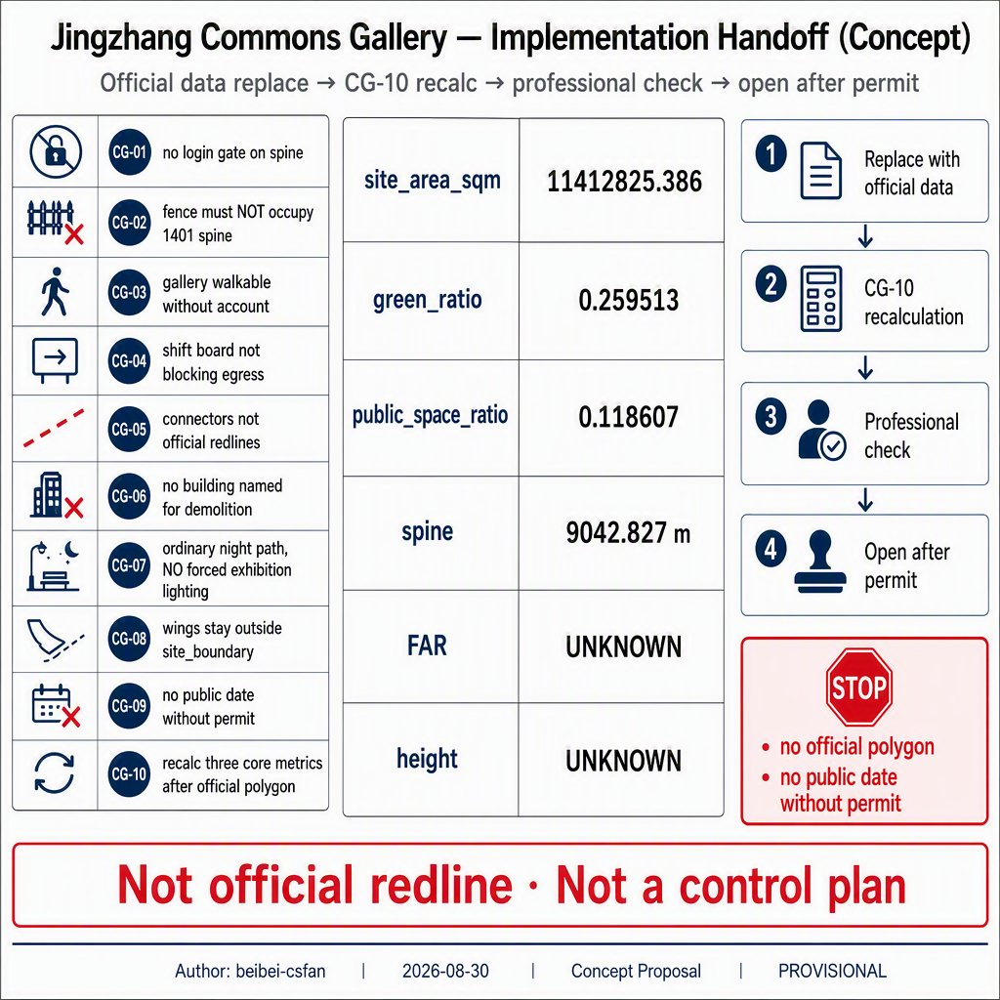
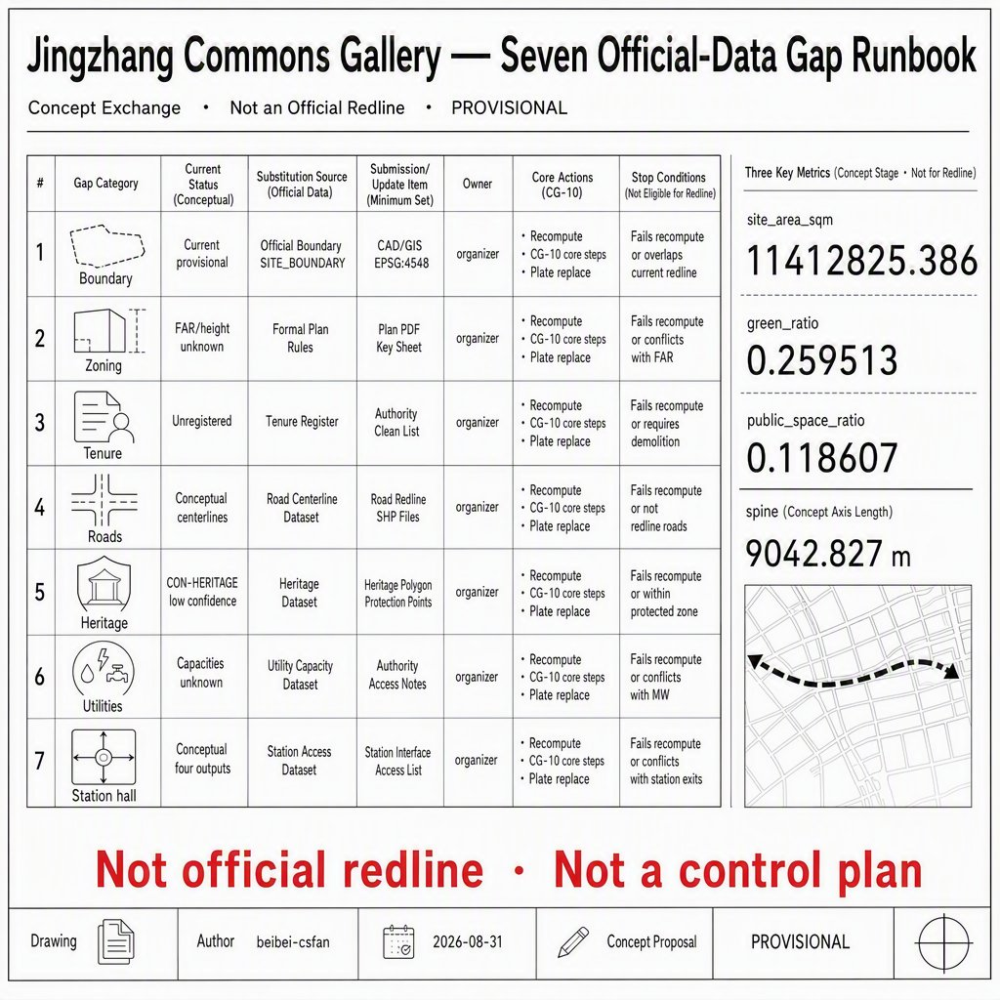

# Jingzhang Commons Gallery

> This package is an open co-creation concept and reference scheme for professional teams to deepen. It does not replace statutory planning and is not a government approval or delivery pledge. The site boundary and three key areas are maintainer provisional constraints; replace them and recalculate every derived layer when official polygons arrive.

## Abstract

Jingzhang Commons Gallery writes the Jing-Zhang heritage-park corridor as a public verification section that still works after an account is switched off, and splits the three key areas into a ready–measure–operate funnel instead of three cloned garden AI blocks. Zhongzhiyuan keeps test yards on the gallery edge; Origin Community places near-campus shared measurement under the gallery; Dazhongsi places operations handover in a station-city hall. Green ratio 0.259513 and public-space ratio 0.118607 are recomputed from this package, not the scaffold template pair.

## Design Basis and Source List

The first authority is the Haidian qualification announcement: three scope levels, three named key areas, and the task tree—not news graphics or OSM-inferred redlines [source:OFFICIAL-ANNOUNCEMENT] [standard:PROJECT-OFFICIAL-ANNOUNCEMENT]. The agent taskbook supplies co-creation principles, six agent tasks, and the shared boundary clause; facts still go back to registered primaries [source:AGENT-TASKBOOK].

Site and key-area polygons copy the maintainer provisional file and keep `provisional_constraint` with `official_boundary=false` [source:BOUNDARY-SOURCE]. The precise qualification appendix remains password-gated, so this package discloses provisional status and triggers a full recalculation when cleared CAD/GIS arrives [source:SITE-PACKAGE].

Usability follows the central registry: formal-ready sources may support task coverage; background sources stay narrative; provisional sources must not be upgraded into redlines [source:SOURCE-REGISTRY]. The processed fact pack is navigation only; gaps enter assumptions instead of invented FAR numbers [source:PROCESSED-FACT-PACK].

The package does not use planning attachments outside the public site package, uncleared tracks, or uncleared enterprise data. Global cases keep transferable mechanisms only. Generated figures are explanatory concepts, not site photographs or resident testimony.

## Three-Level Scope Framework

The announcement’s three levels map as follows: 43.6 km² coordinated research carries naming, ecology mechanisms, and wing interfaces; 11.4 km² overall design carries the Commons Gallery spine and the land-use partition; 368.4 ha key areas carry the three distinct gates. This package’s `site_boundary` is the provisional stand-in for the overall design area, with recomputed area 11,412,825.386 m² [metric:site_area_sqm].

That figure is close to the announced 11.4 km² because maintainers fitted text bounds; it is not official redline precision [data:geometry/site_boundary.geojson#PROV-SITE-001]. Key areas keep the official `area_id` values and remain provisional; their rectangles are not parcel or road edges [depth:three_level_scope_framework].

The coordinated layer does not draw a new 43.6 km² redline. It only writes conceptual interfaces to Beilin Community, Future Science City, Huairou, and the Economic-Technological Development Area. The overall layer’s clipping face is this package’s site boundary. The key-area layer must land on the three gates. After official polygons arrive, land use, green, public space, buildings, roads, phasing, and the three core metrics must all be recomputed.

## Coordinated Research Area: Industry and Future City Research

The belt is named 京张共证廊 / Jingzhang Commons Gallery. One structural sentence: a walkable, verifiable, switch-off public gallery stitches a ready–measure–operate funnel [standard:PROJECT-AGENT-OPEN-CALL-TASKBOOK]. The logo direction is a rail cross-section plus a door that can open or close: open in daily life, closed during verification. No corporate badge, no historical portrait.

The previous review said visual identity that stays at direction, hierarchy and graphic language is not yet a complete, implementable brand specification. The table below is a concept VI a professional visual team can build on a grid. **It is not a registered trademark and not a government colour standard.**

| Item | Locked value | Minimum / licence bound | Stop rule |
| --- | --- | --- | --- |
| Chinese name | 京张共证廊 (must not split into two brand lines) | Full name readable in print | Split name or pun substitute |
| English name | Jingzhang Commons Gallery | Do not shorten to JCG in public | Invented uncleared festival name |
| One claim | 关掉账号也能走完的核验廊 / A gallery you can walk with AI off | Same sentence as `visual/index.en.html` | Cyber-neon posing as built work |
| Logo construction | 8×8 grid: rail I-section + openable door | Clear space = 1 door-leaf; print ≥12 mm high; screen ≥32 px | Rotate >15°, add corporate badge or historical portrait |
| Colour chips (package concept) | Ink `#1A1A1A` · Paper `#F7F4EC` · Gallery olive `#5B6B4A` · Ochre `#A67C52` · Slate `#4A5A6B` · Stop `#8B3A3A` | Not an official Haidian palette | Neon replacing Stop |
| Type | Chinese visible face: WenQuanYi Micro Hei subset (embedded Apache-2.0); English: system sans | Does not claim a purchased Source Han / Helvetica licence | CDN remote fonts |
| Belt lockup | Full name + logo | 12 mm / 32 px | Event sticker replacing the logo |
| Gate mark | Ready / Measure / Operate + colour dot | 8 mm | Mixing in the event sticker |
| Paper wayfinding | Claim + no-login | A5 | QR required to walk |
| Digital header | visual lockup | Offline | Linked script fonts |
| Event sticker | Time-limited Commons Open Day | Must not exceed the logo | Written as a fixed government festival |

Do: thin line, bilingual, PROVISIONAL, walkable with AI off. Don't: neon as-built, corporate badge, historical portrait, event sticker replacing belt identity, calling this spec a registered mark [metric:brand_lockup_count].

Three positions become space: a global AI highland maps to Ready Gate’s edge-attached test yard; a pilgrimage place maps to three checkable landmarks rather than a light show; a high-quality district maps to the no-login walk section. Among the five functions, innovation and testing sit at Zhongzhiyuan, translation and talent services sit at Origin, consumption and international handover sit at Dazhongsi, cultural checking sits along the gallery, and governance review sits in the annual open day.

The two wings are interfaces only: the Zhongguancun wing offers enterprise-service booking; the Xiaoyuehe wing offers scenario-opening booking. No fake wing redline is drawn. Regional synergy with Beilin Community, Future Science City, Huairou Science City, and the Economic-Technological Development Area is written as a **checkable interface list**, not as signed agreements. Each row names what the Haidian side can offer, what the counterpart might offer, a verifiable action, a stop rule, and what this package does not claim. If site access, test-safety rules, or an event permit are missing, that interface stays closed.

| Partner | Conceptual interface | Haidian side can offer | Counterpart may offer | Verifiable action | Stop rule | This package does not claim |
| --- | --- | --- | --- | --- | --- | --- |
| Beilin Community | Everyday living | No-login walk, ordinary night lighting, paper wayfinding | Residential access and daily services | Written interface list + stop rules | No site authorisation → do not enter the compound | No MOU, no changed neighbourhood redline |
| Future Science City | Pilot verification | Ready Gate edge test yard, booking window | Mid-scale pilot slots | Apply → review → pause six-step | No test-safety rule → stop tests | No investment figure, no firm list |
| Huairou Science City | Large-instrument narrative | Public-fact windows on the gallery (public fields only) | Instrument-visit booking if they open it | Display only already-public source fields | Tracking or biometrics → close windows | No instrument access, no uncleared archives |
| Economic-Technological Development Area | Manufacturing translation | Scenario-opening flow, Operations Handover Hall | Manufacturing / pilot line | Translation nodes only after a permit trigger | No permit → no public date | No factory pledge, no investment quota |
| Zhongguancun wing | Enterprise-service booking | Origin Q&A wall, component library | Enterprise booking window | Human final call; AI only sorts public evidence | Test occupying the spine → stop | No tenant list |
| Xiaoyuehe wing | Scenario-opening booking | Annual rhythm + six-step opening | Scenario sites | Apply—review—open—monitor—pause—review | No permit → no announced date | No government-set calendar |

All of the above are concept suggestions for professional teams after counterpart authorisation. They do not constitute a closed cross-region collaboration.

The taskbook also asks regional synergy to cover **Beijing–Tianjin–Hebei**, not only Beijing-side parks [standard:PROJECT-AGENT-OPEN-CALL-TASKBOOK]. The next table writes Jin–Ji counterparts as **conditional interfaces** in the same columns as the Beijing-side list. They are not signed agreements, not approved inter-provincial plans, and not investment pledges. The Haidian side only offers public-verification flows and spatial types already in this package. Counterpart venues, instruments, and production lines stay unknown; a row stays closed until authorisation exists.

| Partner | Conceptual interface | Haidian side can offer | Counterpart may offer | Verifiable action | Stop rule | This package does not claim |
| --- | --- | --- | --- | --- | --- | --- |
| Tianjin Binhai New Area | Port–manufacturing translation narrative | Handover-hall shift-board method; six-step opening | Port / manufacturing pilot visit if they open it | Exchange only public shift templates and stop rules | No counterpart site authorisation → do not enter | No port rights, freight volumes, or investment quota |
| Tianjin Haihe innovation belt | Mutual recognition of urban scenes | No-login wayfinding field list; objection-window flow | Binhai / Haihe public-scene booking if open | Written field crosswalk; human final call | Tracking or login-to-walk → close | No federated accounts, no joint app |
| Hebei Xiong'an New Area | New-town governance contrast | Provisional-geometry recalc method (CG-10); evidence-window format | Reading already-public new-town texts only | Cite only already-public text fields | Using a Xiong'an plan sheet as this package’s redline → stop | No Xiong'an land, no start-area implementation right |
| Zhangjiakou Jing-Zhang heritage corridor | Mutual check of railway public facts | Three public-fact windows on the gallery | Zhangjiakou-section public facts if they open them | Display only already-public sources | Uncleared images or “approved heritage works” → close windows | No Zhangjiakou parcels, no Winter-Olympics venue rights |
| Hebei ring-Beijing (Langfang et al., concept) | Everyday commuting interface | South ordinary night path; paper wayfinding | Ring-Beijing interchange facts if operators publish them | Transcribe already-public timetables only; no mobile numbers | No public timetable → write no shift | No new rail, no inter-province bus pledge |

The five Jin–Ji rows plus the six Beijing-side rows make 11 conditional interfaces [metric:regional_interface_count]. Every row stays “closed without authorisation.” Jin–Ji partners are not drawn into this package’s `site_boundary`.

Eight ecology cases keep mechanisms only and are mapped onto Zhongzhiyuan, Origin Community, the Zhongguancun wing, and scenario cards. Street widths, fixtures, firm lists, and investment figures are not copied [metric:ecology_case_count].

| ID | Public case (mechanism) | Lands in this package | Scenes | Do not copy |
| --- | --- | --- | --- | --- |
| C1 | Barcelona superblocks: tactical, reversible public reclaim | Origin gallery public face, youth third space | S05 | Street widths or tactical furniture |
| C2 | Seoul Cheonggyecheon: everyday walkable corridor | North–south Commons Gallery spine | S01 | Channel engineering |
| C3 | Singapore Park Connector: continuous walk network | Spine + three gate connectors | S01 S09 | Overseas mileage or sign families |
| C4 | Helsinki MyData: data that can be switched off | No-login section and objection window | S01 S12 | Claiming a live MyData deployment |
| C5 | Barcelona Decidim: public review | Human objection window | S12 | Writing it as an adopted statute |
| C6 | Copenhagen bicycle streets: ordinary path first | No-login slow spine | S01 S09 | Lane geometry or flow pledges |
| C7 | Vienna Seestadt: phased trials | Near–mid–far partition and Ready Gate windows | S02 S07 | FAR or investment timing |
| C8 | Taipei open government: evidence windows | Three heritage windows on the gallery | S06 | UI skins or uncleared archives |

The land/space, industry, capital, talent, compute, data, and scenario loop is drawn in the next chapter. No fake wing redline is added at the coordinated layer.

## Overall Design Area: Urban Renewal and Regulatory-Plan-Level Urban Design

The structure is one gallery, three gates, two wing interfaces. The gallery is a north–south park-green plus no-login walk; the gates sit in the three key areas; the wings stay outside this site polygon [depth:overall_spatial_structure]. Land use tiles the provisional site without gaps; a shrink-and-fill step removes projection-chord overlaps; the gallery itself is coded 1401 park green rather than an equal-weight colour band [data:geometry/land_use.geojson#LU-GALLERY-1401].

Renewal logic is public section first, edge stitching second, wing interfaces last. Near-term work is the gallery and three public gates; mid-term work stitches designable key-area edges; long-term work may discuss wings. Retain–renovate–demolish, height, and FAR stay unknown without official controls; this chapter only offers zoning logic [depth:development_intensity_controls].

Character is restrained: light ground, thin lines, low-chroma bands, checkable fields. Generated mood images are not a finished park. The heritage-park vitality belt is a public verification spine, not a memorial project. When a statutory plan arrives, land-use codes and intensity suggestions must be remounted on official parcels.

## Detailed Design of Key Areas

The three areas must not clone one “garden AI block.” The funnel is ready, shared-measure, operate, mapped to the official `area_id` values [data:geometry/key_areas.geojson#PROV-KEY-001].

### Zhongzhiyuan AI Autonomous Innovation Acceleration Area

Role: Ready Gate. Test yards attach to research land on the east edge and must not occupy the no-login section. Spatial moves: north garden, verification plaza, and a bounded test yard. The public face shows booking windows and stop rules only. Links to Qinghe and the 5th Ring remain interchange concepts, not approved interchanges. Risk: noise and fences eating the walk. Exit: stop testing if a fence lands on the slow spine [depth:three_key_area_detailed_design].

### Beijing AI Origin Community

Role: Shared-Measure Gallery. A near-campus service hall and living block pinch the gallery so students, shift workers, and young teams share auditable measure days. Spatial moves: gallery plaza, Q&A-wall landmark, and an east–west slow connector. Retain–renovate–demolish is conceptual: keep the public gallery face; housing updates wait for tenure. Risk: treating campus data as already open. This package does not collect personal tracks.

### Dazhongsi AI Industry Cluster

Role: Operations Handover Hall. Four-quadrant station walking meets the handover plaza; native-AI retail stays on commercial land; the hall is not a forced exhibition. Spatial moves: handover plaza, clock-gallery landmark, and a shift board. The link to the heritage park is the south green edge and an ordinary night path. Risk: retail swallowing the public face. Exit: restore no-login passage if a paid gate cuts the public surface.

## AI Innovation Ecosystem, Personas, and AI+ Scenarios

The ecology is not a tenant brochure. Eight case mechanisms, twelve scenario cards, six personas, and three landmarks place AI on the gallery, gates, and hall rather than “district-wide coverage” [standard:PROJECT-AGENT-OPEN-CALL-TASKBOOK]. Scenario and test counts are stored as metrics [metric:scenario_card_count].

| Persona | Daily need | Spatial reply | Stop rule |
| --- | --- | --- | --- |
| Near-campus graduate | Publish, measure, night study | Shared-Measure Gallery, Q&A wall | No personal tracks |
| Shift-care worker | Shift pause, safe night path | Handover Hall, south ordinary path | No forced night show |
| Startup test engineer | Bounded test, booking window | Ready Gate edge yard | Stop if test crosses the fence |
| Resident with children | Continuous walk, shade | No-login section, north garden | Children are not user data |
| Traveller with access needs | Restatable slope and rests | Three plazas and connectors | Mark unsurveyed grades |
| Short-stay visitor | Checkable guide, switch-off recs | Three landmarks, heritage windows | Guide can be switched off |

| Scene | Type | Place | Data / privacy | Review | Stop rule |
| --- | --- | --- | --- | --- | --- |
| S01 No-login walk guide | Daily | Gallery spine | Public wayfinding only | Human breakpoint check | Close recs if login is required |
| S02 Ready Gate bounded test | Test | Zhongzhiyuan edge | On-site aggregates | Safety officer | Fence on the slow spine |
| S03 Shared-measure day | Test | Origin gallery | Voluntary, withdrawable | Campus–district joint | Personal-track capture |
| S04 Handover shift board | Daily | Dazhongsi hall | Public timetable | Duty operator | Board blocking egress |
| S05 Youth third space | Daily | Gallery and south | Booking without biometrics | Community duty | Paid gate cuts public face |
| S06 Heritage evidence window | Daily | Three gallery windows | Public historical facts only | Heritage adviser | Written as approved memorial |
| S07 After-rain walk audit | Test | Gallery + gates | Pooled flood photos | Municipal observer | Written as approved sponge plan |
| S08 Access repair ticket | Daily | Three plazas | Ticket without portraits | Access officer | Treating grades as surveyed |
| S09 Ordinary night path | Daily | South green edge | Zoned lighting | Resident observer | Forced exhibition lighting |
| S10 Annual Commons Open Day | Operation | Full gallery | Separate event permit | Host review | Written as a fixed government date |
| S11 Enterprise-service interface | Daily | Zhongguancun wing | Booking tickets | Service desk | Fake wing redline |
| S12 Human objection window | Governance | Gate duty points | Objection text | Human final call | Automated over-blocking |

Test scenes are at least S02, S03, and S07. AI only organises public evidence and bookings; it does not replace human final calls. After AI is switched off, the spine, gates, hall, and ordinary path still stand.

The factor loop is a concept, not a tenant brochure or fiscal pledge. Capital amounts, compute-room capacity, and firm names stay unknown.

| Factor | Conceptual provider | Use boundary | Human review | Stop rule | Conversion path |
| --- | --- | --- | --- | --- | --- |
| Land / space | Park and transport deepening team (concept) | Public section inside the provisional site only | Spatial layers; full recalc after official geometry | Conflict with a future official redline returns the claim to concept | CG-10 full recalc |
| Industry | Zhongguancun-wing enterprise interface | Appointment tickets; stays outside this polygon | Enterprise desk | Fake wing redline | S11 method interface; no investment figure |
| Capital | Not supplied | No fiscal or private-capital pledge | — | Delete any invented amount | Later authorised finance work |
| Talent | Origin near-campus service (concept) | Voluntary, withdrawable | Campus–district joint | Personal-track capture | Measure-day experience, not a job offer |
| Compute | Ready Gate edge test yard | On-site aggregates; no MW rooms | Safety officer | Fence on the slow spine | Test hours, not a data-centre promise |
| Data | Public wayfinding and voluntary repair tickets | No biometrics, no personal tracks | Human final call | Writing campus or firm data as already open | S06 evidence windows, S12 objection text |
| Scenario | Xiaoyuehe-wing booking + gate duty | Apply–review–open–monitor–pause–review | Duty plus safety / heritage advisers | Paid gate cuts the public face | Cards S01–S12; permits separate |

A conceptual technical stack (not deployed; no vendor; no MW / GPU counts) keeps AI in five layers so the package is not only a governance slogan:

| Layer | What it does | Data boundary | Human gate | Switch-off fallback | Stop rule |
| --- | --- | --- | --- | --- | --- |
| L1 Sense | Read public wayfinding breaks, voluntary repair text, aggregated after-rain photos | No tracks, biometrics, or raw mobile numbers | Duty officer decides what enters | Paper repair slip | Discard any personally identifiable field |
| L2 Organise | Sort public fields into checkable tables (hours, stop rules, fact sources) | L1-cleared fields only | Heritage / access advisers spot-check | Printed timetable | Model rewriting a fact source |
| L3 Book | Queue test windows and measure days | Booking tickets without portraits | Safety officer opens a window | Paper window card | No test-safety rule → whole layer off |
| L4 Adjudicate | Objections, blocks, over-reaching tests | Objection text | **Human only**; the model must not close a case | Face-to-face duty desk | Automated over-blocking |
| L5 Switch-off | After L2–L3 are off, the spine still walks | No leftover account session | Park duty confirms the path is open | Physical slow section | Login gate on the spine |

This stack is a reference architecture, not a live system, and it does not enter a regulatory plan or a tender [depth:overall_spatial_structure]. The previous review therefore stayed at strong: the stack is explicitly not deployed and has no field verification. This round does not invent a field baseline; it writes “not deployed” as a tabletop protocol that can be run now.

Tabletop verification protocol (TABLETOP-ONLY; field status is “not done” on every row) [metric:tabletop_drill_count]:

| Layer | Input available now | Output | Fail drill | Pass criterion | Field |
| --- | --- | --- | --- | --- | --- |
| L1 Sense | Public wayfinding field list; paper repair slip | Admit / discard log | Mix in a raw mobile number | Personal fields discarded | Not done |
| L2 Organise | L1-cleared fields | Checkable table | Model rewrites a fact source | Adviser returns it | Not done |
| L3 Book | Paper window card | Approve / close | Open a window with no test-safety rule | Whole layer off | Not done |
| L4 Adjudicate | Objection text | Human ruling | Model auto-blocks | Human signature required | Not done |
| L5 Switch-off | Switch-off checklist | Spine still walks | Login gate appears on the spine | Physical section open | Not done |

A sixth drill is not bound to one layer: a test fence on the slow spine → S02 stops at once. All six can be run on paper at a desk. No site visit, no tracks.

Verifiable interfaces (concept, not a live API) [metric:verifiable_interface_count]:

| Interface | Input | Output | Fallback | This package does not claim |
| --- | --- | --- | --- | --- |
| IF-WALK | Intent to walk without an account | Physical slow section | The section itself | A deployed guide platform |
| IF-BOOK | Paper-card hours request | Safety-officer signed window | Window closed | A networked booking system |
| IF-OBJECTION | Objection text | Human desk ruling | Face-to-face duty | Live auto-blocking |
| IF-CLOSE | Order to switch off L2–L3 | Spine still walks | Physical path | A passed field drill |

Retracted: no federated Jing-Jin-Ji accounts; no deployed stack; no field baseline, MW rooms, or vendor. Field verification stays a conditional follow-up after site authorisation and test-safety rules, blocking_now=false.

The 93-score review still withholds a fifth point because there is “no field performance, operations load, or real user feedback.” This round does not invent those three field facts. It writes them as a desktop envelope, a field-evidence contract, and paper walkthroughs that can be checked now. Except for the submitted spine length, every number below is an ASSUMPTION; the invalidation rule sits on the same row.

Desktop operations envelope (TABLETOP-ONLY / ASSUMPTION; not a counted pedestrian survey) [metric:ops_envelope_assumption_count]:

| Item | Formula or rule | Present value | Invalidate / stop |
| --- | --- | --- | --- |
| Spine length L | `length(ROAD-GALLERY-NS)` in EPSG:4548 | 9,042.827 m (submitted geometry) | Recalc under CG-10 after an official corridor |
| Conceptual clear width W | No-login section clear width, **not surveyed** | 4.0 m ASSUMPTION | Official corridor width arrives → void |
| Conceptual density d | Loose-walk envelope, **not a count** | 0.2 persons/m² ASSUMPTION | An authorised field count arrives → void |
| Peak envelope E | E = L × W × d | 7,234 persons ASSUMPTION | Must not be written as a counted flow; recalc if W or official geometry changes |
| L4 desk load | 1 desk × 6 min/case × 8 h | 80 cases/day ASSUMPTION | Auto-block over-reach → whole layer off |
| Paper-fallback throughput | 1 clerk × 2 min/form × 8 h | 240 forms/day ASSUMPTION | Login required to file a repair → stop |
| Booking-window envelope | 3 windows × 4 slots × 2 sessions | 24 slots/day ASSUMPTION | No test-safety rule → whole layer off |

Field-evidence contract (only after a permit; field status is “not done” now) [metric:field_evidence_contract_count]:

| ID | Quantity to record | Method | Pass criterion | Field |
| --- | --- | --- | --- | --- |
| FE-01 | Time to walk the spine with no login | Stopwatch + paper map | Completes without an account | Not done |
| FE-02 | Personal-field discard rate | Mix a raw mobile number at the desk | 100% discarded | Not done |
| FE-03 | L4 human-signature rate | Case-file sample | 100% human signed | Not done |
| FE-04 | Fence-on-spine stop | Tabletop first, field later | S02 stops at once | Not done |
| FE-05 | Desk case-time vs envelope | Minutes per case | Compare with the 6-minute assumption; revise the desk, not a field slogan | Not done |
| FE-06 | Six-persona objection count | Paper walkthrough log | Each persona can finish and write one objection | Paper written; field not done |

Six-persona paper walkthroughs (a user-feedback substitute; **not interviews, not field observation**) [metric:persona_count]:

| Persona | Paper route | Expected objection | No-login fallback | Field |
| --- | --- | --- | --- | --- |
| Near-campus graduate | Origin gallery → Q&A wall → north spine | Q&A wall asks for a login | Chalk / paper card | Not done |
| Shift-care worker | Dazhongsi hall → south ordinary night path | Forced exhibition lighting | Printed timetable + always-on light | Not done |
| Startup test engineer | Ready Gate edge yard → never enters the 1401 spine | Fence on the spine | Paper hours card | Not done |
| Resident with children | Spine + north-garden shade | Children written as user data | Seats without an app | Not done |
| Traveller with access needs | Three-plaza repair posts + connectors | Treating unsurveyed grades as surveyed | Phone + paper slip | Not done |
| Short-stay visitor | Three landmark fact windows | Guide requires a login | Recs off, walk still completes | Not done |

Four interface state machines (concept, not a live API):

| Interface | State sequence | Fail → stop | Fallback |
| --- | --- | --- | --- |
| IF-WALK | Intent → walking → login gate? | Login gate → STOP | The physical section itself |
| IF-BOOK | Paper request → safety rule? → officer sign | Open without a rule → layer off | Window closed |
| IF-OBJECTION | Objection text → model final call? | Auto-block → STOP | Face-to-face duty |
| IF-CLOSE | Switch off L2–L3 → spine still walks? | Gate on the spine → STOP | Physical path |

## Land Use, Building Scale, and Retain-Renovate-Demolish Strategy

Land use tiles the provisional site without gaps or overlaps. The gallery is 1401; north research is 0802; near-campus education is 0804; living is 0701; mid mixed services are 09; south commerce is 0901 with community service 0702 [data:geometry/land_use.geojson#LU-READY-R&D]. These are design-model classes using the MNR code subset, not approved land-use sheets [standard:MNR-LAND-USE-CLASSIFICATION-GUIDE].

Buildings are six conceptual footprints only. Recomputed footprint area is 1,287,206.112 m² at low confidence and is not a surveyed outline [data:geometry/buildings.geojson#BLDG-READY-LAB]. FAR and height stay unknown pending official controls [depth:retain_renovate_demolish].

Retain–renovate–demolish is a concept: keep the gallery and three public gates; mark designable edges as “update after tenure”; name no building for demolition. The constraint layer locks a provisional heritage hint and a missing-regulatory hint before design layers enter [data:geometry/constraints.geojson#CON-HERITAGE-GALLERY].

## Transport, Rail, Municipal Infrastructure, and Public Services

The transport product is the no-login slow spine, recomputed at about 9,042.827 m, plus three east–west gate connectors [data:geometry/roads.geojson#ROAD-GALLERY-NS]. These are conceptual centre-lines, not road redlines or engineering alignments [depth:traffic_rail_slow_parking].

Rail interchange is written only as four-quadrant walking from Dazhongsi Station into the handover hall, Wudaokou / Qinghua East Road West into the shared-measure gallery, and 5th Ring / Qinghe toward Ready Gate. No new rail, bridge, tunnel, or approved station rebuild is asserted. Parking and low-speed access may sit in bounded edge yards only.

Municipal and new-infrastructure statements stay strategic: lighting zones, edge wayfinding, after-rain observation points. Pipe diameters, return periods, power capacity, and compute rooms stay unknown. Public services sit at gate duty points, access-repair desks, and objection windows. Surveillance is not written as district-wide coverage.

## Blue-Green Network, Public Space, and Urban Character

Blue-green continuity is the gallery green spine plus the Ready Gate north garden and the south everyday edge. Union green area is 2,961,780.682 m²; green ratio is 0.259513 = green union / site area in EPSG:4548 [metric:green_ratio]. The value is a design model, not a statutory green-space rate [data:geometry/green_space.geojson#GREEN-GALLERY].

Public space is the no-login walk plus three gate plazas. Union area is 1,353,644.457 m²; public-space ratio is 0.118607, meeting this package’s self-set visible-section target of about 10% or more [metric:public_space_ratio]. Public and green layers may overlap; authority remains each layer’s union [data:geometry/public_space.geojson#PUBLIC-WALK-SPINE].

Three pilgrimage landmarks hold only checkable public fields; experiments stay off the daily track [metric:landmark_count]:

1. Ready Gate Verification Pavilion: booking, fence range, stop rules.
2. Shared-Measure Q&A Wall: public near-campus Q&A and measure-day calendar.
3. Operations Handover Clock Gallery: shifts, egress, ordinary night path.

Honor display is not a corporate trophy wall. The three landmarks show only checkable public fields that can be read without an account [metric:landmark_count]: Ready Gate shows booking windows, fence range, and stop rules; the Shared-Measure Gallery shows public near-campus Q&A and the measure-day calendar; the Clock Gallery shows shifts, egress, and the ordinary night path. All sizes, materials, and furniture are concept suggestions pending official controls and tenure.

Public-space component library (concept; usable without an account):

| Component | Node | Public / test | No-login fallback | Conceptual steward | Stop rule |
| --- | --- | --- | --- | --- | --- |
| Verification kiosk | Ready Gate plaza | Public read / test inside | Paper timetable | Park ops + safety officer | Fence on the slow spine |
| Q&A wall | Origin gallery | Public | Chalk / paper cards | Campus–community | Posted personal data |
| Clock-gallery shift board | Dazhongsi hall | Public | Analog clock + printed shifts | Station-city ops | Blocking egress |
| No-login walk section | Full spine | Public | Physical path always open | Park / transport team | Login turnstile |
| Objection-window desk | Three gate duty points | Public | Paper form | Human reviewer | Automated over-blocking |
| Shade rest module | Three plazas | Public | Bench without an app | Community duty | Charging for sitting |
| Accessible repair post | Three plazas | Public | Phone number + paper ticket | Access officer | Treating grades as surveyed |
| Ordinary night lighting | South green edge | Public | Always-on ordinary lights | Community + lighting | Forced exhibition lighting |

Inclusion must land on identifiable spatial types, not policy sentences alone. Elevations and gradients are unsurveyed and stay “to be re-measured”; no fake percentages are filled in.

| Persona | Visible place | Spatial type | No-login fallback | Stop rule |
| --- | --- | --- | --- | --- |
| Near-campus graduate | Origin gallery plaza + Q&A wall | Gallery public face | Chalk / paper cards | Posting personal data |
| Shift nurse | Dazhongsi handover hall + south green edge | Station-city walk + ordinary night path | Printed shifts + always-on lighting | Forced exhibition lighting |
| Start-up test engineer | Zhongzhiyuan east-edge test yard | Inside research land; not on the 1401 spine | Paper hours sheet | Fence on the slow spine |
| Resident with children | No-login spine + north garden shade | Continuous 1401 park-green section | Seats without an app | Writing children as user data |
| Disabled traveller | Gate-plaza repair posts | Plaza + connectors (gradient to be re-measured) | Phone + paper slip | Treating pending elevations as surveyed |
| Short-term visitor | Three landmark fact windows | Public-readable interface | Walk the whole spine with recommendations off | Guide that requires login |

Public-space ratio 0.118607 comes from the walk-section and three-gate plaza union, not a slogan. If a test yard occupies that union, public circulation wins and the test stops.

Cultural resources use public facts only and are not written as approved heritage works [source:OFFICIAL-ANNOUNCEMENT] [source:AGENT-TASKBOOK].

| Public resource | Spatial carrier | Signage layer | Source boundary |
| --- | --- | --- | --- |
| Public Jing-Zhang railway facts | Three gallery windows | Cultural mark; must not replace the belt logo | Announcement and public history; no uncleared images |
| Zhongguancun open-innovation narrative | Origin Q&A wall | Gate node mark (shared-measure) | Taskbook narrative, not a firm mark |
| Everyday station-city handover | Handover hall | Gate node mark (operate) | Public station context, not an approved rebuild |
| Belt identity | Full gallery | Belt logo (rail section + openable door) | This package; no corporate badge |
| Event brand | Annual Commons Open Day | Event brand, time-limited | Not a fixed government date before a permit |

Mixing rule: the belt logo marks the whole gallery only; cultural marks carry public facts only; the three gate marks distinguish ready / measure / operate; the event brand must not replace the logo. Conceptual landmarks must not be drawn as approved memorials [standard:MOHURD-URBAN-DESIGN-MEASURES].

Character rules: light ground, thin lines, restrained bands, bilingual labels, north arrow and legend. No cyber neon, glassmorphism, or provisional rectangles as the composition hero. Youth-friendliness is third space and an ordinary night path, not café renderings. Title blocks name submitter `beibei-csfan` and “Concept proposal”; they do not invent a client committee or a Formal Plan. Drawing date 2026-08-30.

## Renewal Projects, Implementation Policy, and Phasing

Phasing faces match the project list. Near, mid, and far polygons come from this package’s partition and are not a fixed government investment plan [data:geometry/phasing.geojson#PHASE-NEAR-GALLERY]. Policy is written as triggers: official redlines, heritage lines, road redlines, and event permits must arrive before any upgrade [depth:renewal_project_list].

| ID | Project | Place | Phase | Conceptual owner | Trigger |
| --- | --- | --- | --- | --- | --- |
| CG-01 | No-login gallery section | Full gallery | Near | Park / transport team | Official corridor extent |
| CG-02 | Ready Gate plaza and edge test yard | Zhongzhiyuan | Near | Park operator + safety officer | Test safety rules |
| CG-03 | Shared-Measure Gallery and Q&A wall | Origin | Near | Campus–community service | Site permit |
| CG-04 | Handover hall and clock gallery | Dazhongsi | Near | Station-city operator | Station-hall interface data |
| CG-05 | Three-gate slow connectors | Three areas | Mid | Transport team | Road redline |
| CG-06 | Edge living and campus stitch | Origin edge | Mid | Renewal implementer | Tenure |
| CG-07 | South ordinary night path | South Dazhongsi | Mid | Community + lighting | Night-event rules |
| CG-08 | Wing enterprise / scenario interfaces | Outside site | Far | Enterprise desk | Wing materials |
| CG-09 | Annual Commons Open Day | Full gallery | Recurring | Host + human review | Event permit |
| CG-10 | Full recalc after official geometry | Whole package | Conditional | Package maintainer | Official polygons |

The review still scores implementation 4/5: the organiser geometry gap did not lower the score, but a professional team needs checkable acceptance and evidence, not only project names. The next table writes “official data replace → CG-10 recalc → professional check → open after permit” as a handoff list.

| ID | Accept now (checkable) | Evidence | Stop rule | Professional next step | Still unknown |
| --- | --- | --- | --- | --- | --- |
| CG-01 | No login gate on the spine; length formula matches `ROAD-GALLERY-NS` | Roads layer + desk walk list (field not done) | Turnstile or paid section | Replace the centre-line with the official corridor | Official corridor |
| CG-02 | Fence does not occupy the 1401 spine; stop rules visible | Land-use + card S02 | Fence on the spine | Open a window only after a test-safety rule | Test-safety rule |
| CG-03 | Gallery public face walkable without an account | Public-space layer + S03 | Posted personal data | Place the Q&A wall after a site permit | Site permit |
| CG-04 | Shift board does not block egress | Public-space layer + S04 | Blocking egress | Align after station-hall interface data | Station-hall interface |
| CG-05 | Connectors marked as concept centre-lines, not redlines | Road-layer attributes | Drawn as a road redline | Re-hang after official road redlines | Road redline |
| CG-06 | No building named for demolition | Buildings + constraints | Written as approved RRD | Update after a tenure register | Tenure |
| CG-07 | Ordinary night path describable; no forced exhibition | S09 + south green edge | Forced exhibition lighting | Zone after night-event rules | Night rules |
| CG-08 | Wings stay outside `site_boundary` | 11-row interface table | Fake wing redline | Book only after wing materials | Wing materials |
| CG-09 | No public date without a permit | Operations table + copyright text | Written as a fixed government festival | Publicise only after an event permit | Event permit |
| CG-10 | Recalc the three core metrics with the same formulae after official polygons | Old/new crosswalk (has not occurred) | Treating provisional area as statutory | Run the recalc and sync bilingual figures, HTML, metrics | Official geometry not yet here |

Layer ↔ metric ↔ prose ↔ visual crosswalk (same numbers; no second set):

| Metric | `metrics.json` | Prose | visual `data-value` | Input layer |
| --- | ---: | ---: | ---: | --- |
| site_area_sqm | 11412825.386 | 11412825.386 | 11412825.386 | `site_boundary` |
| green_ratio | 0.259513 | 0.259513 | 0.259513 | `green_space` / `site_boundary` |
| public_space_ratio | 0.118607 | 0.118607 | 0.118607 | `public_space` / `site_boundary` |
| commons_gallery_length_m | 9042.827 | 9,042.827 | (narrative) | `ROAD-GALLERY-NS` |
| floor_area_ratio | unknown | unknown | — | no official FAR |
| building_height_m | unknown | unknown | — | no official height |

FAR and height stay unknown. This table is not a passed professional check or a granted permit.

The 93-score review still withholds a fifth point because “boundary, zoning, tenure, roads, heritage, utilities, and station-hall interfaces have not been formally supplied.” The next table writes those seven gaps as a substitution runbook a professional team can pick up. It is not an engineering conclusion [metric:official_data_gap_count].

| Gap | Present state | Unlock file | CRS / format | Owner | Recalc after arrival | Stop rule |
| --- | --- | --- | --- | --- | --- | --- |
| Boundary | `provisional_constraint`, `official_boundary=false` | Official SITE_BOUNDARY + three KEY_AREA polygons | EPSG:4548; CAD/GIS → GeoJSON | organizer supplies; participant recalcs | CG-10: site area, green ratio, public-space ratio, spine length, all derived layers | Treat provisional area as statutory |
| Zoning | FAR / height unknown | Official control sheets and project limits | Official projection | shared | Re-hang land-use classes; do not pre-fill FAR/height | Invent FAR or height |
| Tenure | No cadastre | Land / building ownership register | Official table or GIS | shared | Update only “pending tenure” plots; name no demolition | Written as approved RRD |
| Roads | Concept centre-line `ROAD-GALLERY-NS` | Official road redlines | EPSG:4548 | shared | Re-hang spine and connectors; keep unofficial until replaced | Draw the concept centre-line as a road redline |
| Heritage | `CON-HERITAGE-GALLERY` low-confidence hint | Official purple line and reviewed heritage files | Official linework | shared | Replace the constraint layer; landmarks still show public fields only | Written as an approved memorial |
| Utilities | Capacity / diameter / MW unknown | Utility capacity, fire, and traffic-operations files | Professional text + capacity table | shared | Stay unknown until numbers exist; do not pre-fill MW | Invent power or machine-room capacity |
| Station hall | Concept four-quadrant walk | Station-hall interface drawings and tenure | Station-city professional drawings | shared | CG-04 align the shift board and egress | Written as an approved station remodel |

All seven rows stay closed or conceptual until the unlock file arrives. The three core numbers in the layer crosswalk must not become a second set.

The long-term operations pack is a conceptual rhythm, not a government-set calendar. Every session is triggered by event permits, site authorisation, and safety rules [depth:phasing_implementation].

Annual mix (no public date before a permit):

| Cadence | Conceptual event | Place | Roles | Trigger |
| --- | --- | --- | --- | --- |
| Daily | No-login walk, shift board, objection-window duty | Gallery + gates | Park duty, human reviewer | None; path always open |
| Intermittent | Ready Gate bounded test window | Zhongzhiyuan edge | Safety officer, test applicant | Test safety rules |
| Seasonal | Measure day; after-rain audit walk | Origin gallery / full gallery | Campus–district joint; municipal observer | Site permit; no tracks |
| Annual | Commons Open Day + failure review (S12) | Full gallery | Host, heritage adviser, access officer | Event permit |
| Conditional | Public recalc note after official geometry | Whole package | Package maintainer | Official polygons |

Developer-community roles, not a firm roster: package maintainer, scenario applicant, safety reviewer, heritage adviser, access officer, community observer. Scenario opening follows apply → safety/privacy/heritage review → time-boxed open → monitor → pause or stop → versioned review. Landmark upkeep uses the same component table; a damaged or over-reaching piece is taken out of service.

Brand / IP: only 京张共证廊 / Jingzhang Commons Gallery and the time-limited event name Commons Open Day. The belt logo and the event sticker must not be swapped.

International communication is not only a professional-package index. A visitor-facing campaign card is added (concept; no public date before a permit):

| Layer | Chinese | Visitor-facing English | Entry | Forbidden |
| --- | --- | --- | --- | --- |
| One claim | 关掉账号也能走完的核验廊 | A gallery you can walk with AI off | `visual/index.en.html` | Cyber-neon posters posing as built work |
| Signage | Belt logo → fact window → gate mark → event sticker | Belt / fact window / gate / event | Three landmarks | Mixed layers or corporate badges |
| Open day | 共证开放日（许可触发） | Commons Open Day (permit-triggered) | CG-09 | Writing it as a fixed government festival |
| Conversion | 经历 / 方法接口 / 补丁 | experience / method interface / patch | S03 S11 S12 | Jobs, investment, procurement |

Conversion stays non-promissory: talent gains measure-day experience, not a job; firms gain an S11 method interface, not investment; developers submit patches through evidence windows, not procurement.

Concept KPIs (internal checks, not official targets): the spine remains walkable with AI off (yes/no); tests never occupy the slow spine (stop count); the objection window ends with a human call (logged items); zero personal-track collection (spot check); CG-10 recalc after official geometry (yes/no). Capital, investment promotion, visitor counts, and output value are not written.

## Metrics, Area Recalculation, and Compliance Matrix

The three core visual metrics must be known, recalculable, and identical to `data-value` on `visual/index.html` [depth:metrics_recalculation].

| Metric | Value | Algorithm |
| --- | ---: | --- |
| site_area_sqm | 11412825.386 | Polygon area of submitted `site_boundary` in EPSG:4548 |
| green_space_area_sqm | 2961780.682 | Union area of `green_space` |
| public_space_area_sqm | 1353644.457 | Union area of `public_space` |
| green_ratio | 0.259513 | 2961780.682 / 11412825.386 |
| public_space_ratio | 0.118607 | 1353644.457 / 11412825.386 |

Site area reuses the maintainer provisional overall extent and is close to the announced 11.4 km², but it is not an official redline area. Green and public ratios come from this scheme’s gallery-and-gates partition and deliberately avoid the scaffold pair 0.123423 / 0.073281. FAR and height stay unknown [metric:public_space_ratio].

Task coverage lives in `compliance_matrix.json`: announcement 1.3 / 1.4 / 1.5 and agent.1–6 each have chapter, layer, metric, drawing, and visual evidence. Standards live in `standard_matrix.json`. Design depth lives in `design_depth_matrix.json`; core items are complete, with official-geometry and control-plan gaps disclosed via `completeness_limited_by`.

## Risk, Copyright, and Compliance

Main risks: reading provisional bounds as redlines; test yards eating the walk; over-reaching heritage language; treating generated images as photographs; writing events as settled government dates [depth:risk_missing_data]. Mitigations: provisional watermarks throughout; stop rules on test cards; landmarks limited to public facts; copyright and AI statements in `report/copyright_statement.md`; policy kept separate from permits.

Privacy: no personal tracks, biometrics, or raw mobile numbers.

Copyright statement, in raw text for the review packet (full file: `report/copyright_statement.md`; licence intent **COMMUNITY-DISPLAY-ONLY**):

1. Prose, matrices, self-drawn analysis figures, and conceptual geometry with `geometry_role=design_proposal` belong to submitter `beibei-csfan` and the named Agent.
2. All spatial, operational, brand, and policy content is a concept suggestion, not a statutory plan, approval, investment pledge, or built record; generated images are an explanation layer, not photographs.
3. Provisional polygons come from the repository `provisional_boundaries.geojson` and must not be treated as official redlines; the qualification announcement and land-use codes are cited only for tasks and the classification subset; OSM is background only (ODbL) and not a formal redline.
4. Figures are generated with the draw skill / Venus image pool from prompts; no peer-proposal images, portraits, or uncleared marks.
5. The four required HTML files (`report/proposal.html`, `report/proposal.en.html`, `visual/index.html`, `visual/index.en.html`) embed a WenQuanYi Micro Hei used-glyph subset after the official HTML render, via `@font-face` + `data:font/woff2`, Apache-2.0; no CDN and no review-machine system fonts. Re-render without re-injection produces tofu boxes.
6. No non-public plans, no personal privacy uploads, no output framed as government approval. Rights questions go to GitHub Issues for `beibei-csfan`.
7. The copyright digest, embedded-font licence and generated-image ledger are for review and intake only; machine review and visible images do not replace final legal clearance, and do not constitute trademark registration, government endorsement, or a commercial licence.

AI use: the model drafted prose, geometry scripts, and figure prompts; humans adjudicate site judgement and compliance.

Still missing: official SITE_BOUNDARY and KEY_AREA, regulatory sheets, road redlines, heritage purple lines, tenure, municipal capacity, and event permits. Any missing item keeps the related claim at concept depth; no fake numbers are filled in.

## References

- Haidian qualification announcement and three-level text bounds [source:OFFICIAL-ANNOUNCEMENT]
- Agent open-call taskbook extract [source:AGENT-TASKBOOK]
- Repository site package, enums, and allowed design space [source:SITE-PACKAGE]
- Central source registry [source:SOURCE-REGISTRY]
- Processed navigation layer and missing-data list [source:PROCESSED-FACT-PACK]
- Provisional boundary and key-area polygons [source:BOUNDARY-SOURCE] [source:KEY-AREA-SOURCE]
- MOHURD urban design measures (local snapshot) [standard:MOHURD-URBAN-DESIGN-MEASURES]
- Control detailed-planning measures (local snapshot) [standard:MOHURD-CONTROL-DETAILED-PLANNING]
