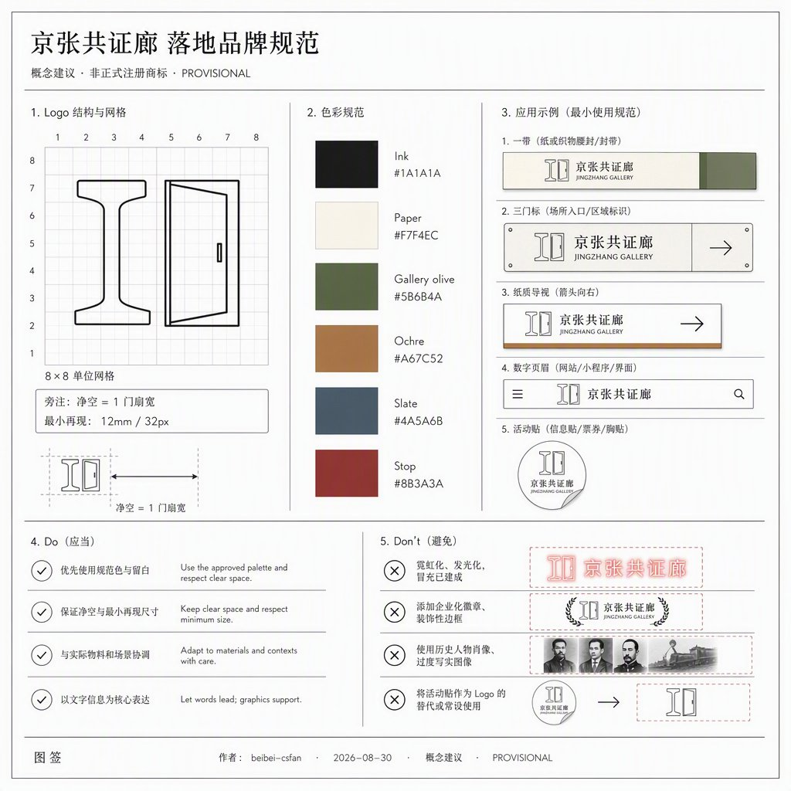
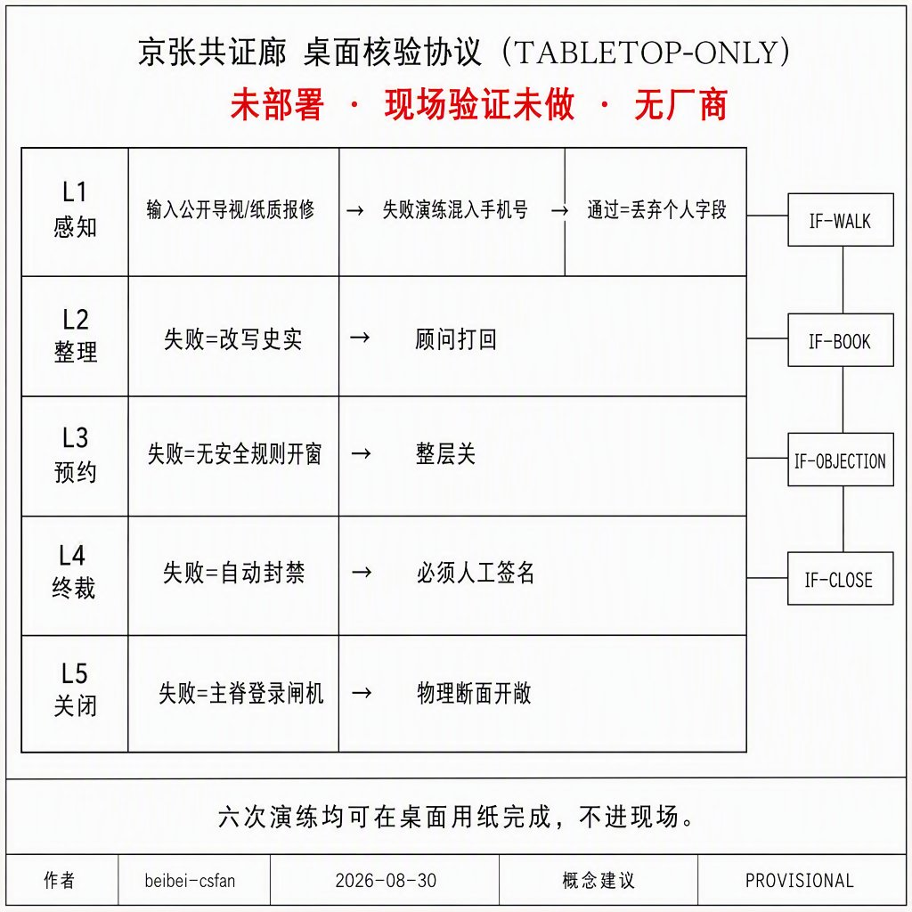
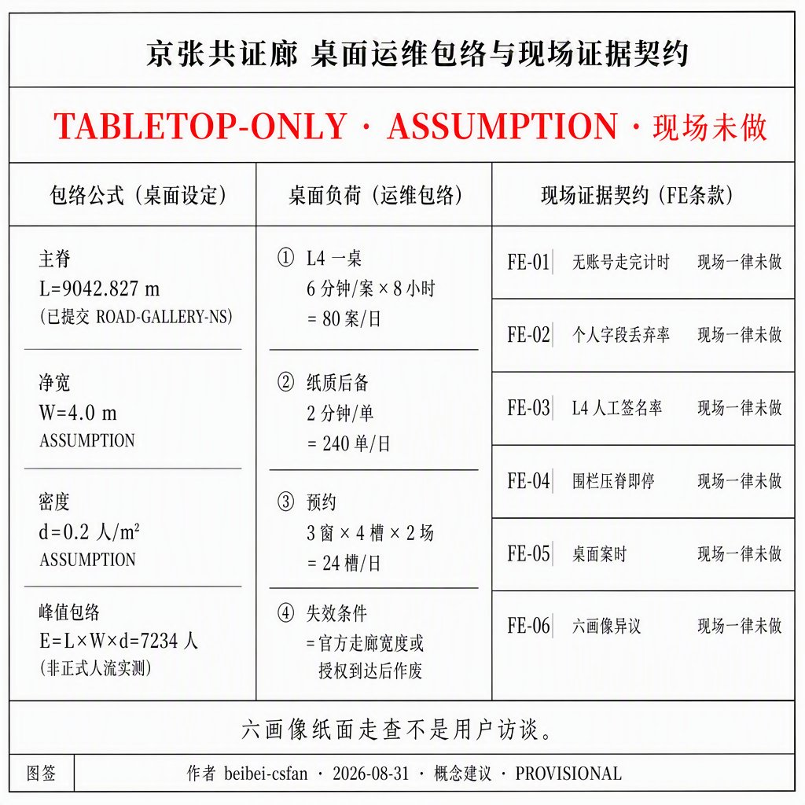
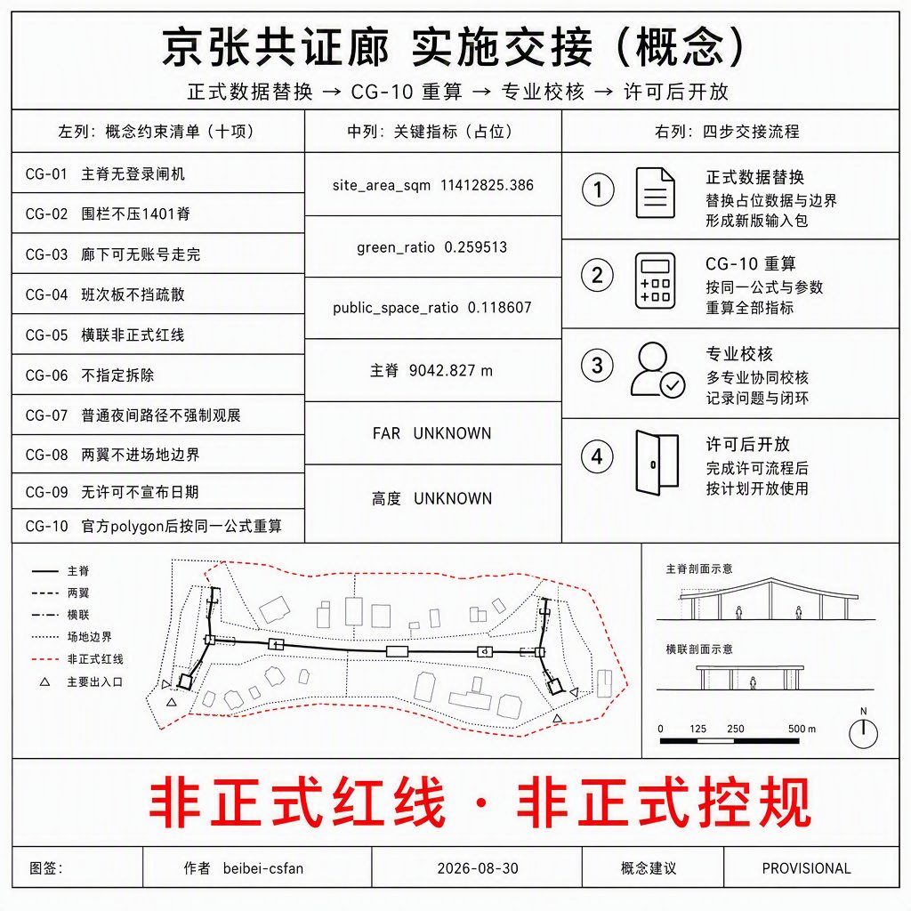
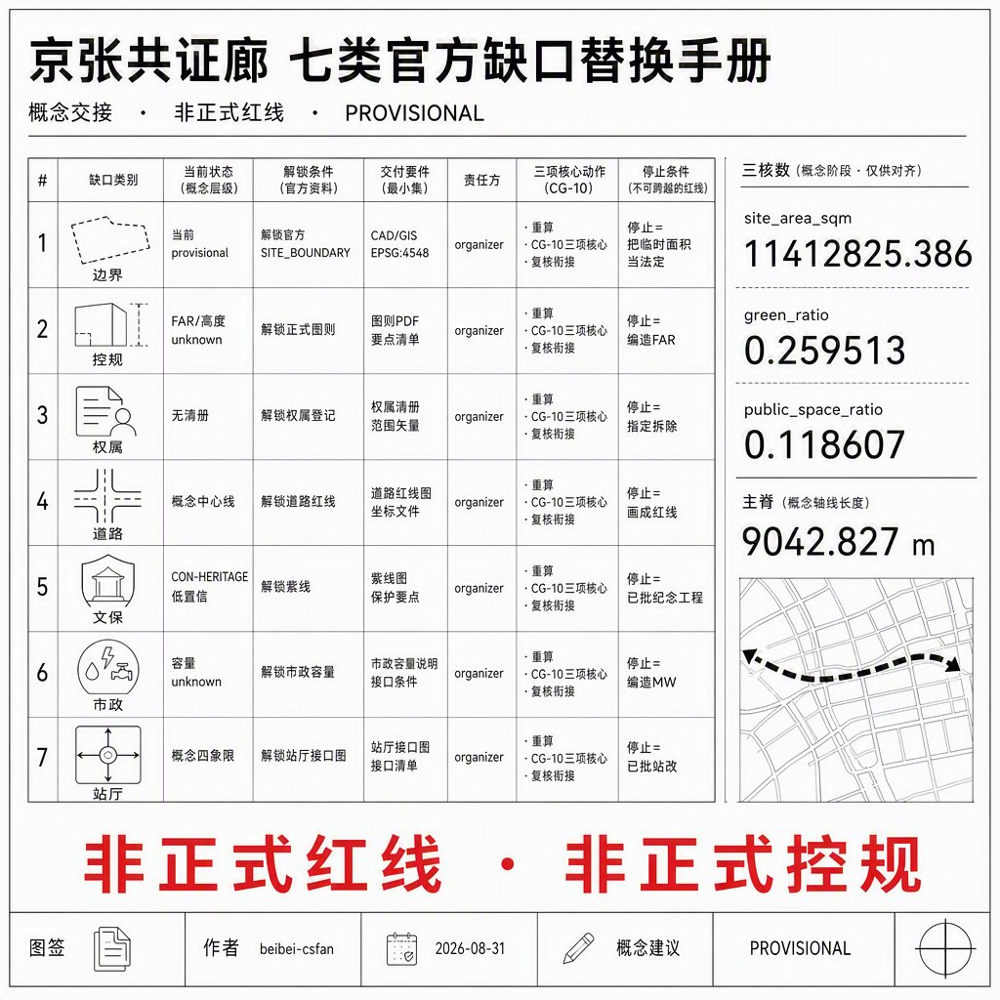

# 京张共证廊

> 本方案为开放共创的概念建议与参考方案，供专业团队深化研究，不替代法定规划，不构成政府审定或实施承诺。场地边界与三重点区均来自仓库临时约束范围，正式红线发布后须按同一公式全量重算。

## 摘要

京张共证廊把京张遗址公园走廊写成一条普通人关掉账号也能走完的公共核验断面，并把三处重点区差分成「就绪—共测—运营」漏斗，而不是三个花园型 AI 街区的换皮。众智园只把测试场贴在廊边，原点把近校共测放进廊下，大钟寺把运营交接放进站城厅。绿地率 0.259513、公共空间率 0.118607，均由本包几何复算，不是模板三项比。

## 设计依据与资料清单

本包第一依据是海淀分局资格预审公告中的三层范围、三重点区名称与任务结构，而不是新闻图或 OSM 推测红线 [source:OFFICIAL-ANNOUNCEMENT] [standard:PROJECT-OFFICIAL-ANNOUNCEMENT]。智能体任务书提供共创原则、六项任务和统一边界条款；事实判断仍回到原始登记，不把加工层当新权威 [source:AGENT-TASKBOOK]。

场地边界与三重点区复制维护者登记的临时 polygon，属性保持 `provisional_constraint`、`official_boundary=false` [source:BOUNDARY-SOURCE]。资格预审精确附件仍受密码保护，因此本包全程披露临时性，并在正式 CAD/GIS 到达后触发全层重算 [source:SITE-PACKAGE]。

可用与不可用边界以中央来源登记为准：`usable_for_formal=yes` 的材料支撑任务覆盖，背景材料只写协同叙事，provisional 材料不得升级为红线 [source:SOURCE-REGISTRY]。`agent_fact_pack.md` 只作导航，缺口清单进入假设，不在正文伪造控规数 [source:PROCESSED-FACT-PACK]。

本包未使用场地包以外的规划附件、未授权轨迹或企业未授权数据。全球案例只蒸馏可转化机制，不复制商标造型。生成图均为概念解释层，不是现场照片或居民意见。

## 三层范围工作框架

公告三层在本包中的传导是：43.6 km² 统筹层写命名、生态机制和两翼接口；11.4 km² 总体层写共证廊主脊与用地剖分；368.4 ha 三区层写三门差异。本包 `site_boundary` 对应总体设计范围的临时替代面，复算面积 11,412,825.386 m² [metric:site_area_sqm]。

该面积接近公告约 11.4 km²，偏差来自维护者按文字四至拟合，不是官方红线精度 [data:geometry/site_boundary.geojson#PROV-SITE-001]。三重点区沿用官方固定 `area_id`，仍标临时，不得解释为地块或道路边线 [depth:three_level_scope_framework]。

统筹层不强制画 43.6 km² 新红线，只把北纬社区、未来科学城、怀柔、经开区写成概念接口。总体层的权威裁剪面就是本包场地边界。重点层必须落到三门，而不是漂浮口号。正式 polygon 替换后，用地、绿地、公共空间、建筑、道路、分期和三项核心指标同步重算。

## 统筹研究范围产业与未来城市研究

一带中文名「京张共证廊」，英文名 Jingzhang Commons Gallery。一句结构：一条可走、可核、可关的公共核验廊，把三区串成就绪—共测—运营漏斗 [standard:PROJECT-AGENT-OPEN-CALL-TASKBOOK]。Logo 方向是轨道断面加一扇可开合的门：日常开、验证关；不用企业徽章，不用历史人物肖像。

上一轮评审指出：视觉识别若只停在方向、层级和图面语言，还不是完整的落地品牌规范。下表把规范写成专业视觉团队可按网格实施的概念 VI，**不是已注册商标，不是政府指定色**。

| 项 | 锁定值 | 最小再现 / 许可边界 | 停止条件 |
| --- | --- | --- | --- |
| 中文名 | 京张共证廊（不可拆成两行品牌） | 印刷全名可读 | 拆名、谐音梗替代 |
| 英文名 | Jingzhang Commons Gallery | 对外不缩成 JCG | 自造未授权国际节庆名 |
| 一句主张 | 关掉账号也能走完的核验廊 / A gallery you can walk with AI off | 与 `visual/index.en.html` 同句 | 赛博霓虹冒充已建成 |
| Logo 构造 | 8×8 网格：左轨道工字断面 + 右可开合门扇 | 净空 = 1 门扇宽；印刷 ≥12 mm 高，屏幕 ≥32 px | 旋转>15°、加企业徽章、加历史肖像 |
| 色票（本包概念色） | Ink `#1A1A1A` · Paper `#F7F4EC` · Gallery olive `#5B6B4A` · Ochre `#A67C52` · Slate `#4A5A6B` · Stop `#8B3A3A` | 非正式官方色；不得写成海淀标准色 | 用霓虹替代 Stop |
| 字体 | 中文可见面：文泉驿微米黑子集（已内嵌 Apache-2.0）；英文：系统无衬线 | 不声称已购思源/Helvetica 商用许可 | CDN 远程字体 |
| 一带锁 | 全名 + Logo | 12 mm / 32 px | 活动贴替换 Logo |
| 三门标 | Ready / Measure / Operate + 色点 | 8 mm | 混用活动贴 |
| 纸质导视 | 主张 + 无账号 | A5 | 要求扫码才能走 |
| 数字页眉 | visual 锁 | 离线 | 外链脚本字体 |
| 活动贴 | 时限「共证开放日」 | 不得大于 Logo | 写成政府已定国际节 |

Do：细线、双语、PROVISIONAL、关掉 AI 仍可走。Don't：霓虹当已建成、企业徽章、历史肖像、活动贴替换一带识别、把本规范写成已注册商标 [metric:brand_lockup_count]。

三大定位落到空间：全球 AI 产业高地对应就绪门的受控测试贴边；朝圣地对应三处可核对地标而不是灯光秀；高品质城区对应无账号慢行断面。五大功能中，创新与测试进众智园廊边，转化与人才服务进原点廊下，消费与国际交接进大钟寺厅，文化核对沿廊布置，治理复盘进年度开放日。

三区两翼只写接口：中关村翼提供企业服务预约，小月河翼提供场景开放预约，不把翼区画成假红线。与北纬社区、未来科学城、怀柔科学城、经开区的协同写成可核验的**接口清单**，不是已签协议：每行都有海淀侧可提供的空间/流程、对方可能接口、可核验动作、停止条件，以及本包明确不声称的事项。没有场地授权、测试安全规则或活动许可时，对应接口保持关闭。

| 协同对象 | 概念接口 | 海淀侧可提供 | 对方可能接口 | 可核验动作 | 停止条件 | 本包不声称 |
| --- | --- | --- | --- | --- | --- | --- |
| 北纬社区 | 居住日常 | 无账号慢行、普通夜间照明、纸质导视 | 居住区日常进出与生活服务 | 书面接口清单 + 停止条件 | 无场地授权则不进小区 | 未签 MOU、未改小区红线 |
| 未来科学城 | 中试验证 | 就绪门受控测试贴边、预约窗口 | 中试/中规模验证位 | 申请→审查→暂停六步 | 无测试安全规则则停测 | 无投资额、无企业名单 |
| 怀柔科学城 | 大装置叙事 | 廊上公开史实核对窗（仅公开字段） | 装置参观预约（若对方开放） | 只展示已公开来源字段 | 采集轨迹/生物特征则关窗 | 无装置使用权、无未授权档案 |
| 经开区 | 制造转化 | 场景开放流程、运营交接厅 | 制造转化/中试产线 | 许可触发后才谈转化节点 | 无许可不宣布日期 | 无工厂承诺、无招商额度 |
| 中关村翼 | 企业服务预约 | 原点廊下问答墙、组件库 | 企业服务预约窗口 | 人工终裁，AI 只整理公开证据 | 测试侵占主脊则停 | 无已入驻企业名单 |
| 小月河翼 | 场景开放预约 | 年度节奏 + 六步开放 | 场景场地 | 申请—审查—开放—监测—暂停—复盘 | 许可未办前不宣布 | 无已定政府日程 |

以上均为概念建议，供专业团队在对方园区授权后深化，不构成跨区域协作已闭环。

任务书还要求区域协同覆盖**京津冀**，不能只停在北京侧园区名单 [standard:PROJECT-AGENT-OPEN-CALL-TASKBOOK]。下表把津冀侧写成与北京侧同构的**条件接口**，不是已签协议、不是已批跨省市规划、不是投资承诺。海淀侧只提供本包已有的公共核验流程与空间类型；对方园区的场地、装置和产线使用权均 unknown，未授权则整行关闭。

| 协同对象 | 概念接口 | 海淀侧可提供 | 对方可能接口 | 可核验动作 | 停止条件 | 本包不声称 |
| --- | --- | --- | --- | --- | --- | --- |
| 天津滨海新区 | 港口—制造转化叙事 | 运营交接厅班次板方法、场景六步开放 | 港口/制造中试参观（若对方开放） | 只交换公开班次与停止条件模板 | 无对方场地授权则不进园 | 无港口使用权、无物流量、无招商额度 |
| 天津海河创新带 | 城市场景互认 | 无账号导视字段表、异议窗流程 | 滨海/海河公共场景预约（若开放） | 书面字段对照，人工终裁 | 采集轨迹或要求登录才能走则关 | 无已互通账号、无联合 App |
| 河北雄安新区 | 新城治理对照 | 临时几何重算方法（CG-10）、证据窗格式 | 新城公开规划对照阅读（仅已公开文本） | 只引用对方已公开文本字段 | 把雄安规划图当本包红线则停 | 无雄安用地、无起步区实施权 |
| 张家口京张遗产走廊 | 铁路史实互核 | 廊上三处公开史实窗 | 京张铁路张家口段公开史实（若开放） | 双方只陈列已公开来源 | 未授权图像或写成已批文保工程则关窗 | 无张家口地块、无冬奥场馆运营权 |
| 河北环京（廊坊等，概念） | 通勤日常接口 | 南段普通夜间路径、纸质导视 | 环京通勤接驳信息（若城际运营方公开） | 只转写已公开时刻，不采集手机号 | 无公开时刻表则不写班次 | 无新轨道、无跨省公交承诺 |

京津冀五行与北京侧六行合计 11 个条件接口 [metric:regional_interface_count]。全部保持「无授权即关闭」。不把津冀画进本包 `site_boundary`。

8 个生态案例只蒸馏机制，并逐项落到众智园、原点社区、中关村翼和场景卡，禁止复制街道宽度、装置造型、企业名单或投资额 [metric:ecology_case_count]。

| 编号 | 公开案例（机制） | 落到本包 | 相关场景 | 禁止复制 |
| --- | --- | --- | --- | --- |
| C1 | 巴塞罗那超级街区：临时、可逆的公共面回收 | 原点廊下公共面、青年第三空间 | S05 | 街道宽度、临时装置造型 |
| C2 | 首尔清溪川：日常可走的连续走廊 | 共证廊南北主脊 | S01 | 河道工程与已批断面 |
| C3 | 新加坡 Park Connector：连续步行网络 | 主脊 + 三门横联 | S01 S09 | 外地里程与标志系统 |
| C4 | 赫尔辛基 MyData：数据可关 | 无账号断面与异议窗 | S01 S12 | 声称已部署该平台 |
| C5 | 巴塞罗那 Decidim：公共评议 | 人工异议窗 | S12 | 写成已立法条例 |
| C6 | 哥本哈根自行车街：普通路径优先 | 无账号慢行主脊 | S01 S09 | 车道几何与流量承诺 |
| C7 | 维也纳 Seestadt：分期试验 | 近中远剖分与就绪门间歇窗 | S02 S07 | 容积率与投资时序 |
| C8 | 台北开放政府：证据窗 | 廊上三处遗产核对窗 | S06 | 界面皮肤与未授权档案 |

土地/空间、产业、资金、人才、算力、数据、场景的概念闭环见下章图谱，不在统筹层画假红线。

## 总体设计范围城市更新与控规深度城市设计

总体结构是「一廊三门、两翼接口」。一廊是南北向共证廊公园绿地与无账号慢行断面；三门落在三重点区；两翼不进本包场地 polygon [depth:overall_spatial_structure]。用地由临时场地边界剖分铺满，邻边经收缩—回填避免投影弦缝重叠，廊本身记为公园绿地 1401，而不是等权色带 [data:geometry/land_use.geojson#LU-GALLERY-1401]。

更新逻辑是「先公共断面、后廊边缝合、再翼区接口」。近期只实施廊与三门公共面；中期缝合三重点区可设计边；远期才谈廊边与两翼接口。拆改留、高度、容积率因缺少正式控规保持未知，正文只给分区逻辑，不编法定控制值 [depth:development_intensity_controls]。

风貌方向克制：白底细线、低饱和色带、可核对字段，不把生成氛围图当成已建成公园。京张遗址公园活力带在本包中是公共核验脊，不是纪念工程。正式控规到达后，本层用地代码与强度建议必须重挂官方地块。

## 重点区域详细设计

三区禁止复制同一段「花园型 AI 街区」。漏斗顺序是就绪、共测、运营，对应三处官方 `area_id` [data:geometry/key_areas.geojson#PROV-KEY-001]。

### 众智园 AI 自主创新加速区

定位：就绪门。测试场贴在廊东侧科研用地，不占无账号断面。空间动作是北园绿带 + 核验广场 + 受控测试场；公共界面只展示可预约时段和停止条件。与清河、五环的关系写成接驳概念，不是已批立交。风险：测试噪声、围栏侵占步行；退出条件是围栏压上慢行脊即停测 [depth:three_key_area_detailed_design]。

### 北京 AI 原点社区

定位：共测廊下。近校服务厅与生活楼夹住廊下，让师生、一轮班劳动者和青年团队共用可审计测量日。空间动作是廊下广场 + 问答墙地标 + 近校慢行横联。拆改留只标概念：廊下公共面优先保留，廊边住宅更新待权属。风险：把校园数据写成已开放；本包不采集个人轨迹。

### 大钟寺 AI 产业集聚区

定位：运营交接厅。站城四象限步行接到交接厅广场，智能原生消费留在商业用地，不把大厅做成强制观展。空间动作是交接厅广场 + 钟廊地标 + 班次看板。与遗址公园的衔接是南段绿边和普通夜间路径。风险：商业界面吞掉公共面；退出条件是公共面被收费闸机切断即改回无账号通行。

## AI 创新生态、人才画像与 AI+ 场景

生态不是园区招商册。本包用 8 个案例的机制、12 张场景卡、6 类画像和 3 处地标，把 AI 落在廊、门、厅，而不是「全区覆盖」 [standard:PROJECT-AGENT-OPEN-CALL-TASKBOOK]。场景卡计数与测试场景计数写入指标，便于复核 [metric:scenario_card_count]。

| 画像 | 日常需求 | 空间响应 | 停止条件 |
| --- | --- | --- | --- |
| 近校研究生 | 发布、共测、夜间学习 | 共测廊下、问答墙 | 不采集个人轨迹 |
| 一轮班护理员 | 换班停留、安全夜间路径 | 运营交接厅、南段普通路径 | 夜间不强制观展 |
| 初创测试工程师 | 受控测试、预约窗口 | 就绪门贴边测试场 | 测试越出围栏即停 |
| 带儿童居民 | 连续步行、遮荫停留 | 无账号慢行断面、北园 | 不把儿童写成用户数据 |
| 无障碍出行者 | 可复述坡度与休息点 | 三门广场与横联 | 高程未测段标待复测 |
| 短期访客 | 可核对导览、可关掉推荐 | 三处地标、遗产核对窗 | 导览可关，不强制账号 |

| 场景 | 类型 | 位置 | 数据/隐私 | 复核 | 停止条件 |
| --- | --- | --- | --- | --- | --- |
| S01 无账号慢行导览 | 日常 | 共证廊脊 | 仅公开导视 | 人工校对断点 | 导览要求登录则关闭推荐 |
| S02 就绪门受控测试 | 测试 | 众智园廊边 | 场内聚合 | 安全官 | 围栏压上慢行脊 |
| S03 共测廊下测量日 | 测试 | 原点廊下 | 自愿、可撤 | 校地联合 | 采集个人轨迹 |
| S04 运营交接班次看板 | 日常 | 大钟寺厅 | 班次公开表 | 运营值班 | 看板遮挡疏散 |
| S05 青年第三空间 | 日常 | 廊下与南段 | 预约不存生物特征 | 社区值班 | 收费闸机切断公共面 |
| S06 遗产物证核对窗 | 日常 | 廊上三窗 | 只放公开史实 | 文保顾问 | 写成已批纪念工程 |
| S07 雨后复盘走查 | 测试 | 廊+三门 | 积水照片聚合 | 市政观察 | 把雨水写成已批海绵专项 |
| S08 无障碍报修 | 日常 | 三门广场 | 报修不含肖像 | 无障碍专员 | 高程数当实测 |
| S09 夜间普通路径 | 日常 | 南段绿边 | 照明分区 | 居民观察 | 强制观展灯光 |
| S10 年度共证开放日 | 运营 | 全廊 | 活动许可另办 | 主办复核 | 写成政府已定日程 |
| S11 企业服务接口 | 日常 | 中关村翼接口 | 预约工单 | 企业服务台 | 翼区假红线 |
| S12 人工复核异议窗 | 治理 | 三门值班点 | 异议文本 | 人工终裁 | 自动封禁越权 |

测试场景至少 S02、S03、S07。AI 只整理公开证据和预约，不替代人工终裁。关掉 AI 后，脊、门、厅和普通路径仍然成立。

要素闭环是概念建议，不是招商册或财政承诺。资金、算力机房容量、企业名单均 unknown，不得填写假数。

| 要素 | 概念提供方 | 使用边界 | 人工复核 | 停止条件 | 转化路径 |
| --- | --- | --- | --- | --- | --- |
| 土地/空间 | 公园与交通深化团队（概念） | 仅临时场地内公共断面 | 空间图层与正式几何到达后重算 | 与未来官方红线冲突则退回概念层 | CG-10 全量重算 |
| 产业 | 中关村翼企业服务接口 | 预约工单，不进本包 polygon | 企业服务台 | 翼区画假红线 | S11 方法接口，无投资额 |
| 资金 | 未提供 | 不写财政或社会资本承诺 | — | 出现金额即删除 | 待授权后由专业财务深化 |
| 人才 | 原点近校服务（概念） | 自愿、可撤 | 校地联合 | 采集个人轨迹 | 测量日经历，不保证就业 |
| 算力 | 就绪门贴边测试场 | 场内聚合，不计机房 MW | 安全官 | 围栏压上慢行脊 | 测试工时，不承诺数据中心 |
| 数据 | 公开导视与自愿报修 | 无生物特征、无个人轨迹 | 人工终裁 | 把校园/企业数据写成已开放 | S06 证据窗、S12 异议文本 |
| 场景 | 小月河翼预约 + 三门值班 | 申请—审查—开放—监测—暂停—复盘 | 值班与安全/文保顾问 | 收费闸机切断公共面 | S01–S12 卡片，许可另办 |

概念技术架构（未部署，无厂商，无 MW / GPU 数）把 AI 收成五层，避免只写治理口号：

| 层 | 做什么 | 数据边界 | 人工闸 | 关闭后备 | 停止条件 |
| --- | --- | --- | --- | --- | --- |
| L1 感知 | 只读公开导视断点、自愿报修文本、雨后积水聚合照片 | 无轨迹、无生物特征、无未脱敏手机号 | 值班员决定是否入库 | 纸质报修单 | 出现个人可识别字段即丢弃 |
| L2 整理 | 把公开字段排成可核对表（时段、停止条件、史实出处） | 仅 L1 已放行字段 | 文保/无障碍顾问抽查 | 印刷时刻表 | 模型改写史实出处 |
| L3 预约 | 测试窗与测量日的时段排队 | 预约工单不含肖像 | 安全官批准开窗 | 窗口纸卡 | 无测试安全规则则整层关闭 |
| L4 终裁 | 异议、封禁、越权停测 | 异议文本 | **必须人工**，模型不得终裁 | 值班桌面谈 | 自动封禁越权 |
| L5 关闭 | 一键关掉 L2–L3 后主脊仍可走 | 不留账号会话 | 公园值班确认路径开敞 | 物理慢行断面 | 登录闸机出现在主脊 |

该栈是参考架构，不是已运行系统，也不进入控规或招标文件 [depth:overall_spatial_structure]。上一轮评审因此只给 strong：架构明确标注未部署、尚无现场验证。本轮不伪造现场基线，只把「未部署」写成现在就能做的桌面协议。

桌面核验协议（TABLETOP-ONLY；现场状态一律「未做」）[metric:tabletop_drill_count]：

| 层 | 现在可备的输入物 | 输出物 | 失败演练 | 通过判据 | 现场 |
| --- | --- | --- | --- | --- | --- |
| L1 感知 | 公开导视字段表、纸质报修单样张 | 放行 / 丢弃记录 | 混入未脱敏手机号 | 个人字段被丢弃 | 未做 |
| L2 整理 | L1 已放行字段 | 可核对表 | 模型改写史实出处 | 顾问抽查打回 | 未做 |
| L3 预约 | 窗口纸卡 | 批准 / 关闭 | 无测试安全规则仍开窗 | 整层关闭 | 未做 |
| L4 终裁 | 异议文本 | 人工裁定 | 模型自动封禁 | 必须人工签名 | 未做 |
| L5 关闭 | 关闭开关清单 | 主脊仍可走 | 登录闸机出现在主脊 | 物理断面开敞 | 未做 |

第六次演练不绑单层：测试围栏压上慢行脊 → S02 立即停止。六次均可在桌面用纸完成，不进现场、不采集轨迹。

可核验接口（概念，不是已运行 API）[metric:verifiable_interface_count]：

| 接口 | 输入 | 输出 | 关闭后备 | 本包不声称 |
| --- | --- | --- | --- | --- |
| IF-WALK | 无账号步行意图 | 物理慢行断面 | 断面本身 | 已部署导览平台 |
| IF-BOOK | 纸卡时段申请 | 安全官签字开窗 | 窗口关闭 | 已联网预约系统 |
| IF-OBJECTION | 异议文本 | 人工桌面裁定 | 值班面谈 | 自动封禁已上线 |
| IF-CLOSE | 关闭 L2–L3 指令 | 主脊仍可走 | 物理路径 | 现场已演练通过 |

收回：不声称京津冀已互通账号；不声称本栈已部署；不声称已有现场基线、机房 MW 或厂商。现场核验仅在场地授权与测试安全规则到达后触发，blocking_now=false。

93 分原文仍扣在「尚无现场性能、运维负荷或真实用户反馈」。本轮不伪造这三类现场证据，只把它们写成现在就能核的**桌面包络、现场证据契约、纸面走查**。所有数字除主脊长度外均为 ASSUMPTION，失效条件写在同一行。

桌面运维包络（TABLETOP-ONLY / ASSUMPTION；不是人流实测）[metric:ops_envelope_assumption_count]：

| 项 | 公式或规则 | 现值 | 失效 / 停止 |
| --- | --- | --- | --- |
| 主脊长度 L | `length(ROAD-GALLERY-NS)` EPSG:4548 | 9,042.827 m（已提交几何） | 官方走廊替换后按 CG-10 重算 |
| 概念净宽 W | 无账号断面概念净宽，**未实测** | 4.0 m ASSUMPTION | 正式走廊宽度到达即作废 |
| 概念密度 d | 宽松步行包络，**不是计数** | 0.2 人/m² ASSUMPTION | 授权后的现场计数到达即作废 |
| 峰值包络 E | E = L × W × d | 7,234 人 ASSUMPTION | 不得写成已测人流；W 或官方几何变则重算 |
| L4 桌面负荷 | 1 桌 × 6 分钟/案 × 8 小时 | 80 案/日 ASSUMPTION | 自动封禁越权则整层关 |
| 纸质后备吞吐 | 1 员 × 2 分钟/单 × 8 小时 | 240 单/日 ASSUMPTION | 要求扫码才能报修则停 |
| 预约窗包络 | 3 窗 × 4 槽 × 2 场 | 24 槽/日 ASSUMPTION | 无测试安全规则则整层关 |

现场证据契约（许可到达后才做；现在现场=未做）[metric:field_evidence_contract_count]：

| ID | 要记的量 | 方法 | 通过判据 | 现场 |
| --- | --- | --- | --- | --- |
| FE-01 | 无账号走完主脊的时间 | 秒表 + 纸质地图 | 不登录也能走完 | 未做 |
| FE-02 | 个人字段丢弃率 | 桌面混入未脱敏手机号 | 100% 丢弃 | 未做 |
| FE-03 | L4 人工签名率 | 案卷抽查 | 100% 人工签名 | 未做 |
| FE-04 | 围栏压脊即停 | 先桌面后现场 | S02 立即停止 | 未做 |
| FE-05 | 桌面案时 vs 包络 | 记每案分钟 | 对照 6 分钟假设，超则改桌不改现场口号 | 未做 |
| FE-06 | 六画像异议数 | 纸面走查记录 | 每类画像都能走完并写下一条异议 | 纸面已写，现场未做 |

六类画像纸面走查（用户反馈替代物，**不是访谈、不是现场观察**）[metric:persona_count]：

| 画像 | 纸面路线 | 预期异议 | 无账号后备 | 现场 |
| --- | --- | --- | --- | --- |
| 近校研究生 | 原点廊下 → 问答墙 → 主脊北段 | 问答墙若要求登录 | 粉笔/纸卡 | 未做 |
| 一轮班护理员 | 大钟寺厅 → 南段普通夜间路径 | 强制观展灯光 | 印刷班次 + 常亮照明 | 未做 |
| 初创测试工程师 | 就绪门贴边场 → 不进入 1401 脊 | 围栏压脊 | 纸质时段表 | 未做 |
| 带儿童居民 | 主脊 + 北园遮荫 | 儿童被写成用户数据 | 无 App 座椅 | 未做 |
| 无障碍出行者 | 三门广场报修桩 + 横联 | 把待复测高程当实测 | 电话 + 纸质单 | 未做 |
| 短期访客 | 三处地标核对窗 | 导览要求登录 | 关掉推荐仍可走完 | 未做 |

四接口状态机（概念，不是已运行 API）：

| 接口 | 状态序列 | 失败转停止 | 关闭后备 |
| --- | --- | --- | --- |
| IF-WALK | 意图 → 步行中 → 遇闸？ | 登录闸机 → STOP | 物理断面本身 |
| IF-BOOK | 纸卡申请 → 有安全规则？ → 安全官签字 | 无规则开窗 → 整层关 | 窗口关闭 |
| IF-OBJECTION | 异议文本 → 是否模型终裁？ | 自动封禁 → STOP | 值班面谈 |
| IF-CLOSE | 关 L2–L3 → 主脊仍可走？ | 脊上出现闸机 → STOP | 物理路径 |

## 用地、建筑规模与拆改留方案

用地铺满临时场地边界，无缝无重叠。廊为 1401，北段科研 0802，近校教育 0804，生活 0701，中段混合 09，南段商业 0901 与社区服务 0702 [data:geometry/land_use.geojson#LU-READY-R&D]。这是设计模型分类，采用自然资源部用地代码子集，不是已批地类图则 [standard:MNR-LAND-USE-CLASSIFICATION-GUIDE]。

建筑只给六处概念基底，复算基底面积 1,287,206.112 m²，置信度低，明确不是实测轮廓 [data:geometry/buildings.geojson#BLDG-READY-LAB]。容积率与高度保持 unknown，待正式控规 [depth:retain_renovate_demolish]。

拆改留仅为概念建议：廊与三门公共面优先保留；廊边可设计地块标「待权属后更新」；没有任何一栋建筑被指定拆除。约束层先锁定临时文保提示和控规缺口提示，再允许设计层进入 [data:geometry/constraints.geojson#CON-HERITAGE-GALLERY]。

## 交通、轨道、市政与公共服务设施

交通主产品是无账号慢行主脊，复算长度约 9,042.827 m，加上三门东西向接驳横联 [data:geometry/roads.geojson#ROAD-GALLERY-NS]。它是概念中心线，不是道路红线或工程线位 [depth:traffic_rail_slow_parking]。

轨道接驳只写大钟寺站四象限步行接到运营交接厅，五道口/清华东路西口接到共测廊下，五环/清河方向接到就绪门。不断言新轨道、新桥隧或已批站改。停车与低速接驳只允许在廊边受控场，禁止占用慢行断面。

市政与新基建保持策略级：照明分区、端侧导视、雨后观察点。管径、重现期、电力容量、算力机房均 unknown。公共服务沿三门布置值班点、无障碍报修和异议窗，不把监控写成全区覆盖。

## 蓝绿空间、公共空间与城市风貌

蓝绿连续性沿共证廊绿脊 + 就绪门北园 + 南段日常绿边组织。绿地并集面积 2,961,780.682 m²，绿地率 0.259513，公式为绿地并集 / 场地面积，投影 EPSG:4548 [metric:green_ratio]。该值是设计模型，不是法定绿地率 [data:geometry/green_space.geojson#GREEN-GALLERY]。

公共空间由无账号慢行断面和三门广场组成，并集 1,353,644.457 m²，公共空间率 0.118607，达到本包自定的可见连续断面目标（不低于约 10%） [metric:public_space_ratio]。公共面与绿地可以重叠，权威仍是各自图层并集 [data:geometry/public_space.geojson#PUBLIC-WALK-SPINE]。

三处朝圣地标只放可核对的公开字段，实验与日常严格分开 [metric:landmark_count]：

1. 就绪门核验亭：展示测试预约、围栏范围、停止条件。
2. 共测廊下问答墙：展示近校公开问答与测量日日历。
3. 运营交接钟廊：展示班次、疏散口和普通夜间路径。

荣誉展示不是企业奖杯墙。三处地标只陈列可核对的公开字段，供无账号阅读 [metric:landmark_count]：就绪门展示预约窗/围栏范围/停止条件；共测廊下展示近校公开问答与测量日日历；运营交接钟廊展示班次、疏散口与普通夜间路径。尺度、材料、家具均为概念建议，待正式控规与权属后由专业团队改核。

公共空间组件库（概念，可无账号使用）：

| 组件 | 适用节点 | 公共/测试 | 无账号后备 | 维护主体（概念） | 停止条件 |
| --- | --- | --- | --- | --- | --- |
| 核验亭 | 就绪门广场 | 公共可读 / 测试在场内 | 纸质时段表 | 园区运营+安全官 | 围栏压上慢行脊 |
| 问答墙 | 原点廊下 | 公共 | 粉笔/纸卡 | 校地服务+社区 | 张贴个人数据 |
| 钟廊班次板 | 大钟寺厅 | 公共 | 模拟钟+印刷班次 | 站城运营 | 遮挡疏散 |
| 无账号慢行断面 | 全廊主脊 | 公共 | 物理路径始终可走 | 公园/交通深化 | 登录闸机 |
| 人工异议窗桌 | 三门值班点 | 公共 | 纸质表格 | 人工复核员 | 自动封禁越权 |
| 遮荫休息模块 | 三门广场 | 公共 | 无 App 座椅 | 社区值班 | 坐席收费 |
| 无障碍报修桩 | 三门广场 | 公共 | 电话+纸质单 | 无障碍专员 | 把高程当实测 |
| 普通夜间照明 | 南段绿边 | 公共 | 常亮普通照明 | 社区+照明 | 强制观展灯光 |

包容性必须落到可指认的空间类型，而不是只写政策句。高程与坡度未实测，一律标待复测，不填假百分数。

| 画像 | 可见地点 | 空间类型 | 无账号后备 | 停止条件 |
| --- | --- | --- | --- | --- |
| 近校研究生 | 原点廊下广场 + 问答墙 | 廊下公共面 | 粉笔/纸卡问答 | 张贴个人数据 |
| 一轮班护理员 | 大钟寺交接厅 + 南段绿边 | 站城步行 + 普通夜间路径 | 印刷班次 + 常亮照明 | 强制观展灯光 |
| 初创测试工程师 | 众智园廊东贴边测试场 | 科研用地内侧，不占 1401 脊 | 纸质时段表 | 围栏压上慢行脊 |
| 带儿童居民 | 无账号主脊 + 北园遮荫 | 公园绿地 1401 连续断面 | 无 App 座椅 | 儿童被写成用户数据 |
| 无障碍出行者 | 三门广场报修桩 | 广场 + 横联（坡度待复测） | 电话 + 纸质单 | 把待复测高程当实测 |
| 短期访客 | 三处地标核对窗 | 公共可读界面 | 关掉推荐仍可走完 | 导览要求登录 |

公共空间率 0.118607 来自慢行断面与三门广场并集，不是口号。测试场若侵占该并集，公共通行优先，测试停止。

文化资源只使用公开史实，不写成已批文保工程 [source:OFFICIAL-ANNOUNCEMENT] [source:AGENT-TASKBOOK]。

| 公开资源 | 空间载体 | 导视层级 | 来源边界 |
| --- | --- | --- | --- |
| 京张铁路可公开史实 | 廊上三处核对窗 | 文化标识，不得替代一带 Logo | 公告与公开史料，不引未授权图像 |
| 中关村开放创新叙事 | 原点问答墙 | 三门节点标识（共测） | 任务书叙事，非企业商标 |
| 站城日常交接 | 运营交接厅 | 三门节点标识（运营） | 公开站城语境，非已批站改 |
| 一带识别 | 全廊 | 一带 Logo（轨道断面+可开合门） | 本包概念，无企业徽章 |
| 活动品牌 | 年度共证开放日 | 活动品牌，时限使用 | 许可未办前不得写成已定日程 |

导视不可混用：一带 Logo 只标识整条廊；文化标识只承载公开史实；三门节点标识只区分就绪/共测/运营；活动品牌不得替换 Logo。禁止把概念地标画成已批纪念工程 [standard:MOHURD-URBAN-DESIGN-MEASURES]。

风貌导则：浅底、细线、克制色带、中英标注、指北与图例齐全。禁止赛博霓虹、玻璃拟态和把 provisional 矩形画成构图主体。青年友好体现在第三空间与夜间普通路径，而不是咖啡馆效果图。图签只写投稿者 `beibei-csfan` 与「概念建议」，不写虚假委托方或 Formal Plan。制图日期 2026-08-30。

## 更新项目清单、实施政策与分期计划

分期与项目一一对应，近中远三面来自本包剖分，不是政府已定投资计划 [data:geometry/phasing.geojson#PHASE-NEAR-GALLERY]。政策只写触发条件：正式红线、文保线、道路红线和活动许可到达后才能升格 [depth:renewal_project_list]。

| 编号 | 项目 | 区位 | 分期 | 主体（概念） | 触发 |
| --- | --- | --- | --- | --- | --- |
| CG-01 | 共证廊无账号断面 | 全廊 | 近 | 公园/交通深化团队 | 正式走廊范围 |
| CG-02 | 就绪门核验广场与贴边测试场 | 众智园 | 近 | 园区运营+安全官 | 测试安全规则 |
| CG-03 | 共测廊下与问答墙 | 原点 | 近 | 校地服务+社区 | 场地许可 |
| CG-04 | 运营交接厅与钟廊 | 大钟寺 | 近 | 站城运营 | 站厅接口资料 |
| CG-05 | 三门慢行横联 | 三区 | 中 | 交通深化团队 | 道路红线 |
| CG-06 | 廊边生活与近校缝合 | 原点周边 | 中 | 更新实施主体 | 权属 |
| CG-07 | 南段夜间普通路径 | 大钟寺南 | 中 | 社区+照明 | 夜间活动规则 |
| CG-08 | 两翼企业/场景接口 | 廊外接口 | 远 | 企业服务台 | 翼区资料 |
| CG-09 | 年度共证开放日 | 全廊 | 循环 | 主办+人工复核 | 活动许可 |
| CG-10 | 正式几何替换后全量重算 | 全包 | 条件 | 本包维护者 | 官方 polygon |

评审仍给可实施 4/5：官方几何缺口未扣分，但专业团队需要可核的验收与证据物，而不是只看见项目名。下表把「正式数据替换—CG-10 重算—专业校核—许可后开放」写成交接清单。

| 编号 | 验收判据（现在可核） | 证据物 | 停止条件 | 专业下一步 | 仍 unknown |
| --- | --- | --- | --- | --- | --- |
| CG-01 | 主脊无登录闸机；长度公式与 `ROAD-GALLERY-NS` 一致 | 道路图层 + 桌面走查清单（现场未做） | 闸机或收费断面 | 用正式走廊范围替换中心线 | 官方走廊 |
| CG-02 | 围栏不压 1401 脊；停止条件可见 | 用地 + 场景卡 S02 | 围栏压脊 | 写入测试安全规则后才能开窗 | 测试安全规则 |
| CG-03 | 廊下公共面可无账号走完 | 公共空间图层 + S03 | 张贴个人数据 | 场地许可后布置问答墙 | 场地许可 |
| CG-04 | 班次板不挡疏散口 | 公共空间图层 + S04 | 遮挡疏散 | 站厅接口资料到达后对位 | 站厅接口 |
| CG-05 | 横联标为概念中心线，非正式红线 | 道路图层属性 | 画成道路红线 | 正式道路红线到达后重挂 | 道路红线 |
| CG-06 | 不指定拆除任何一栋 | 建筑图层 + 约束层 | 写成已批拆改留 | 权属清册后更新 | 权属 |
| CG-07 | 普通夜间路径可描述、不强制观展 | S09 + 南段绿边 | 强制观展灯光 | 夜间活动规则后分区 | 夜间规则 |
| CG-08 | 两翼不进 `site_boundary` | 接口表 11 行 | 翼区假红线 | 翼区资料后谈预约 | 翼区资料 |
| CG-09 | 无许可不宣布日期 | 运营表 + 版权声明 | 写成政府已定国际节 | 活动许可后才能公示 | 活动许可 |
| CG-10 | 官方 polygon 到达后按同一公式重算三项核心 | 新旧对照表（尚未发生） | 把临时面积当法定 | 执行重算并同步中英图文 HTML | 官方几何未到 |

图层 ↔ 指标 ↔ 正文 ↔ visual 对照（必须同数，禁止另写一套）：

| 指标 | `metrics.json` | 正文 | visual `data-value` | 输入图层 |
| --- | ---: | ---: | ---: | --- |
| site_area_sqm | 11412825.386 | 11412825.386 | 11412825.386 | `site_boundary` |
| green_ratio | 0.259513 | 0.259513 | 0.259513 | `green_space` / `site_boundary` |
| public_space_ratio | 0.118607 | 0.118607 | 0.118607 | `public_space` / `site_boundary` |
| commons_gallery_length_m | 9042.827 | 9,042.827 | （叙述） | `ROAD-GALLERY-NS` |
| floor_area_ratio | unknown | unknown | — | 无正式控规 |
| building_height_m | unknown | unknown | — | 无正式高度 |

FAR / 高度继续 unknown。不把本表写成已通过专业校核或已获许可。

93 分原文仍扣在「边界、控规、权属、道路、文保、市政和站厅接口均未正式提供」。下表把这七类缺口写成专业团队可接手的替换手册，不是工程结论 [metric:official_data_gap_count]。

| 缺口 | 当前状态 | 解锁文件 | CRS / 格式 | 责任 | 到达后重算 | 停止条件 |
| --- | --- | --- | --- | --- | --- | --- |
| 边界 | `provisional_constraint`，`official_boundary=false` | 官方 SITE_BOUNDARY + 三处 KEY_AREA polygon | EPSG:4548；CAD/GIS → GeoJSON | organizer 提供，participant 重算 | CG-10：场地面积、绿地率、公共空间率、主脊长度、全部派生层 | 把临时面积当法定 |
| 控规 | FAR / 高度 unknown | 正式控规图则与项目控制条件 | 以官方投影为准 | shared | 用地分类重挂；FAR/高度仍不得先填 | 编造 FAR 或高度 |
| 权属 | 无清册 | 土地/建筑权属登记 | 官方表格或 GIS | shared | 建筑层只更新「待权属后」地块；不指定拆除 | 写成已批拆改留 |
| 道路 | 概念中心线 `ROAD-GALLERY-NS` | 正式道路红线 | EPSG:4548 | shared | 横联与主脊重挂；属性保持非正式直至替换 | 把概念中心线画成道路红线 |
| 文保 | `CON-HERITAGE-GALLERY` 低置信提示 | 正式紫线与经审核遗产资料 | 官方线划 | shared | 约束层替换；地标仍只放公开字段 | 写成已批纪念工程 |
| 市政 | 容量 / 管径 / MW unknown | 市政容量、消防、交通运行资料 | 专业文本 + 容量表 | shared | 保持 unknown 直到有数；不先填 MW | 编造电力或机房容量 |
| 站厅 | 概念四象限步行 | 轨道站厅接口图与权属 | 站城专业图 | shared | CG-04 对位班次板与疏散口 | 写成已批站改 |

七行在解锁文件到达前全部保持关闭或概念层。图层对照表的三核数不得另写一套。

长期运营包是概念节奏，不是政府已定活动日历。任何场次均以活动许可、场地授权和安全规则为触发条件 [depth:phasing_implementation]。

年度组合（许可未办前不得对外宣布日期）：

| 节奏 | 概念活动 | 地点 | 角色 | 触发 |
| --- | --- | --- | --- | --- |
| 日常 | 无账号慢行、班次板、异议窗值班 | 全廊+三门 | 公园值班、人工复核员 | 无；路径始终开 |
| 间歇 | 就绪门受控测试窗 | 众智园廊边 | 安全官、测试申请人 | 测试安全规则 |
| 季度 | 共测测量日、雨后复盘走查 | 原点廊下 / 全廊 | 校地联合、市政观察 | 场地许可；不采集轨迹 |
| 年度 | 共证开放日 + 失败复盘（S12） | 全廊 | 主办、文保顾问、无障碍专员 | 活动许可 |
| 条件 | 正式几何替换后公开复算说明 | 全包 | 本包维护者 | 官方 polygon |

开发者社区只设角色，不设公司名单：包维护者、场景申请人、安全审查员、文保顾问、无障碍专员、社区观察者。场景开放流程为申请 → 安全/隐私/文保审查 → 限时开放 → 监测 → 暂停或停止 → 复盘改版本。公共地标维护与组件库同一张表，损坏或越权即停用该组件。

活动品牌/IP：仅「京张共证廊 / Jingzhang Commons Gallery」与时限活动名「共证开放日」；不得混用一带 Logo 与活动贴。

国际传播不只做专业包目录，另给访客向战役卡（概念，许可未办前不得宣布日期）：

| 层 | 中文 | 英文访客向 | 入口 | 禁止 |
| --- | --- | --- | --- | --- |
| 一句主张 | 关掉账号也能走完的核验廊 | A gallery you can walk with AI off | `visual/index.en.html` | 赛博霓虹海报冒充已建成 |
| 导视 | 一带 Logo → 文化窗 → 三门标识 → 活动贴 | Belt / fact window / gate / event | 三处地标 | 混用层级、企业徽章 |
| 开放日 | 共证开放日（许可触发） | Commons Open Day (permit-triggered) | CG-09 | 写成政府已定国际节 |
| 转化 | 经历 / 方法接口 / 补丁 | experience / method interface / patch | S03 S11 S12 | 岗位、投资、采购合同 |

转化路径保持非承诺：人才经测量日获得经历而非岗位；企业经 S11 预约获得方法接口而非投资；开发者经证据窗提交补丁而非采购合同。

概念 KPI（内部核验，非正式考核指标）：AI 关闭后主脊仍可走（是否）；测试未占慢行脊（停止次数）；异议窗由人终裁（记录条数）；零个人轨迹采集（抽查）；官方几何到达后完成 CG-10 重算（是否）。资金、招商、访客量和产值一律不写。

## 指标体系、面积复算与合规矩阵

三项核心视觉指标必须 known、可复算，并与 `visual/index.html` 的 `data-value` 一致 [depth:metrics_recalculation]。

| 指标 | 数值 | 算法 |
| --- | ---: | --- |
| site_area_sqm | 11412825.386 | 提交 `site_boundary` 在 EPSG:4548 的多边形面积 |
| green_space_area_sqm | 2961780.682 | `green_space` 并集面积 |
| public_space_area_sqm | 1353644.457 | `public_space` 并集面积 |
| green_ratio | 0.259513 | 2961780.682 / 11412825.386 |
| public_space_ratio | 0.118607 | 1353644.457 / 11412825.386 |

场地面积沿用维护者临时总体范围，与公告约 11.4 km² 接近，但不是官方红线面积。绿地率与公共空间率来自本方案自己的廊+三门剖分，刻意避开脚手架模板比 0.123423 / 0.073281。容积率、高度保持 unknown [metric:public_space_ratio]。

任务覆盖见 `compliance_matrix.json`：公告 1.3/1.4/1.5 与 agent.1–6 均有章节、图层、指标、图纸和 visual 区块。专业标准见 `standard_matrix.json`，设计深度见 `design_depth_matrix.json`，核心项均为 complete，并以 `completeness_limited_by` 披露官方几何与控规缺口。

## 风险、版权与合规说明

主要风险：临时边界被误读为红线；测试场侵占慢行；文保措辞越权；生成图被当成现场照片；活动被写成政府已定安排 [depth:risk_missing_data]。缓解：全程 provisional 水印；测试停止条件写入场景卡；地标只放公开史实；版权与 AI 声明见 `report/copyright_statement.md`；政策与许可分开写。

隐私：不采集个人轨迹、生物特征和未脱敏手机号。

版权声明原文要点（供评审包直接阅读，完整文本在 `report/copyright_statement.md`，许可意向 **COMMUNITY-DISPLAY-ONLY**）：

1. 正文、矩阵、自绘分析图与 `geometry_role=design_proposal` 的概念几何，版权归投稿者 `beibei-csfan` 及具名 Agent。
2. 全部空间、运营、品牌与政策内容均为概念建议，不是法定规划、批准文件、投资承诺或已建成记录；生成图是解释层，不是现场照片。
3. 临时 polygon 来自仓库 `provisional_boundaries.geojson`，不得当作 official 红线；资格预审公告与用地代码只引任务与分类子集；OSM 仅背景核对，ODbL，不进 formal 红线。
4. 图件由 draw skill / Venus 图像池按提示词生成，无他人方案图、无肖像、无未授权商标。
5. 四份必需 HTML（`report/proposal.html`、`report/proposal.en.html`、`visual/index.html`、`visual/index.en.html`）在官方渲染后注入文泉驿微米黑用字子集，`@font-face` + `data:font/woff2`，Apache-2.0；不依赖 CDN 或评审机系统字体。重渲后必须再注入，否则中文会成方框。
6. 未使用非公开规划，未上传个人隐私，未将输出表述为政府批准。权利问题经 GitHub Issue 联系 `beibei-csfan`。
7. 版权摘要、内嵌字体许可与生成图台账只供评审核验与 intake；机器审查和可见图像不能替代最终法律清权，也不构成商标注册、政府背书或可对外商用授权。

AI 使用：模型起草正文、几何脚本与图件提示词，人类裁定场地判断与合规边界。

待补资料：官方 SITE_BOUNDARY 与 KEY_AREA、控规图则、道路红线、文保紫线、权属、市政容量、活动许可。缺一项就把对应结论留在概念层，不补假数。

## 参考资料

- 海淀分局资格预审公告与三层范围文字 [source:OFFICIAL-ANNOUNCEMENT]
- 智能体开源征集任务书摘录 [source:AGENT-TASKBOOK]
- 仓库场地包、枚举与允许设计空间 [source:SITE-PACKAGE]
- 中央来源登记 [source:SOURCE-REGISTRY]
- 加工导航层与缺资料清单 [source:PROCESSED-FACT-PACK]
- 临时边界与三重点区 polygon [source:BOUNDARY-SOURCE] [source:KEY-AREA-SOURCE]
- 住建部城市设计管理办法（本地快照）[standard:MOHURD-URBAN-DESIGN-MEASURES]
- 控规编制审批办法（本地快照）[standard:MOHURD-CONTROL-DETAILED-PLANNING]
