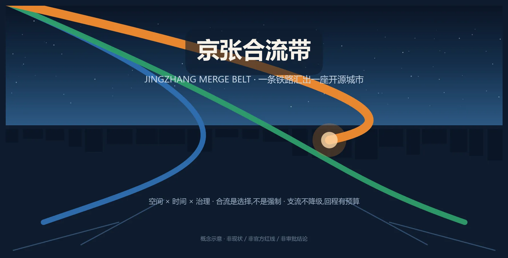
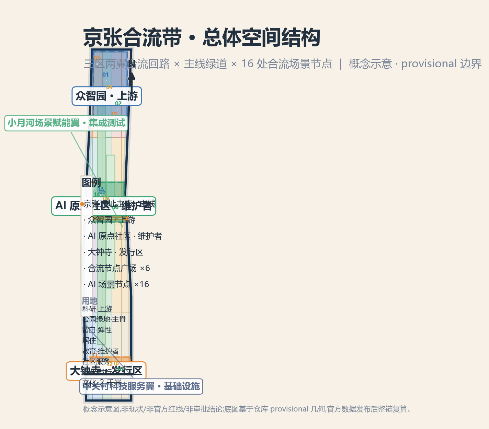
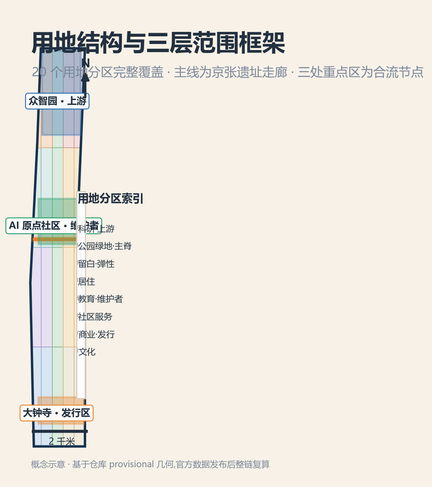
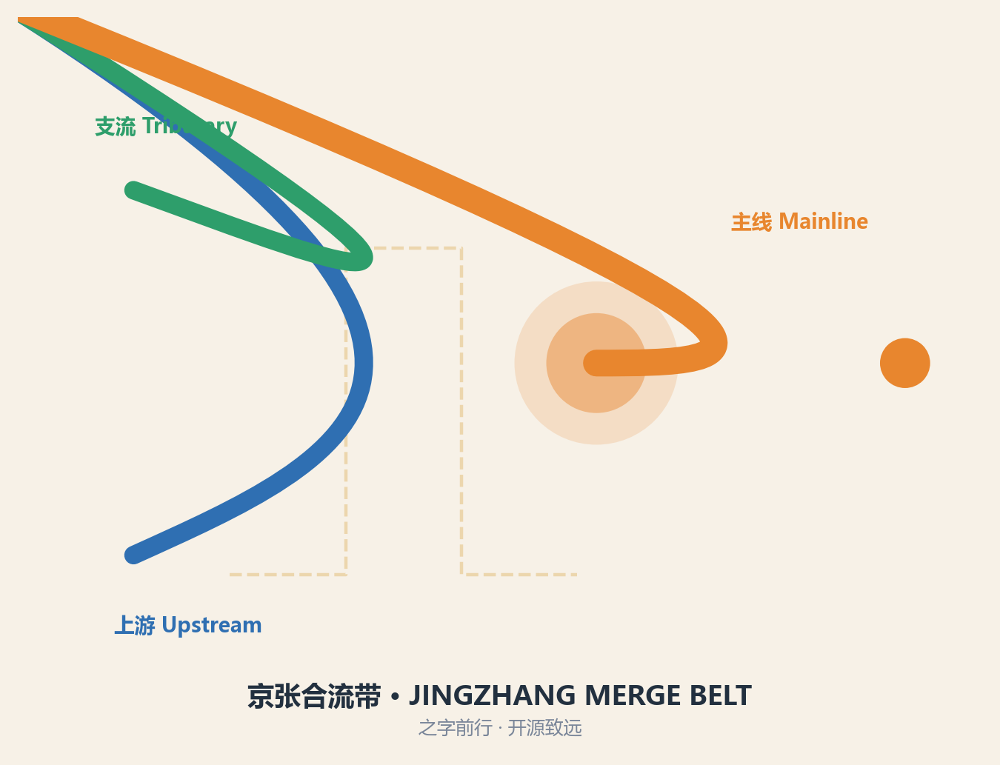
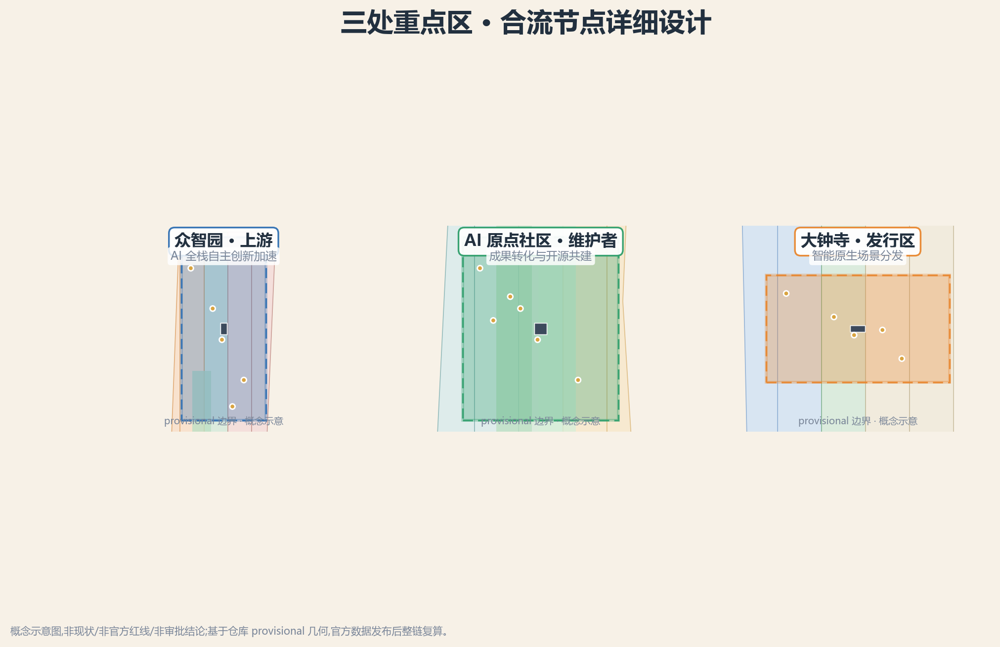
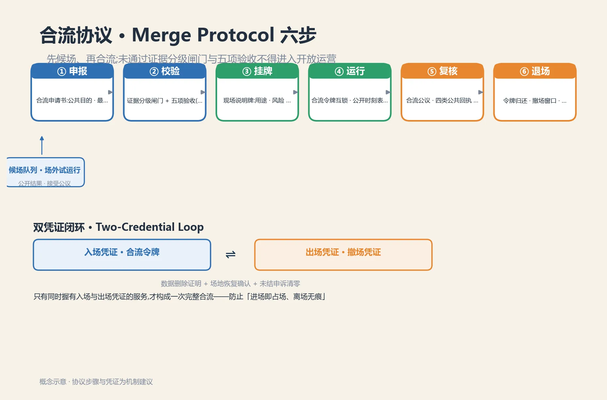
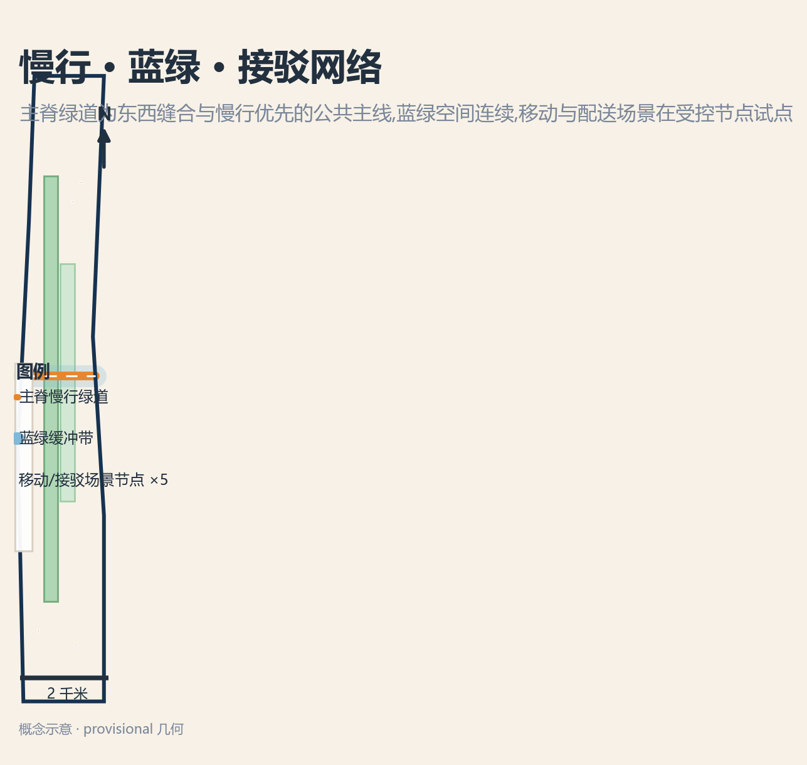
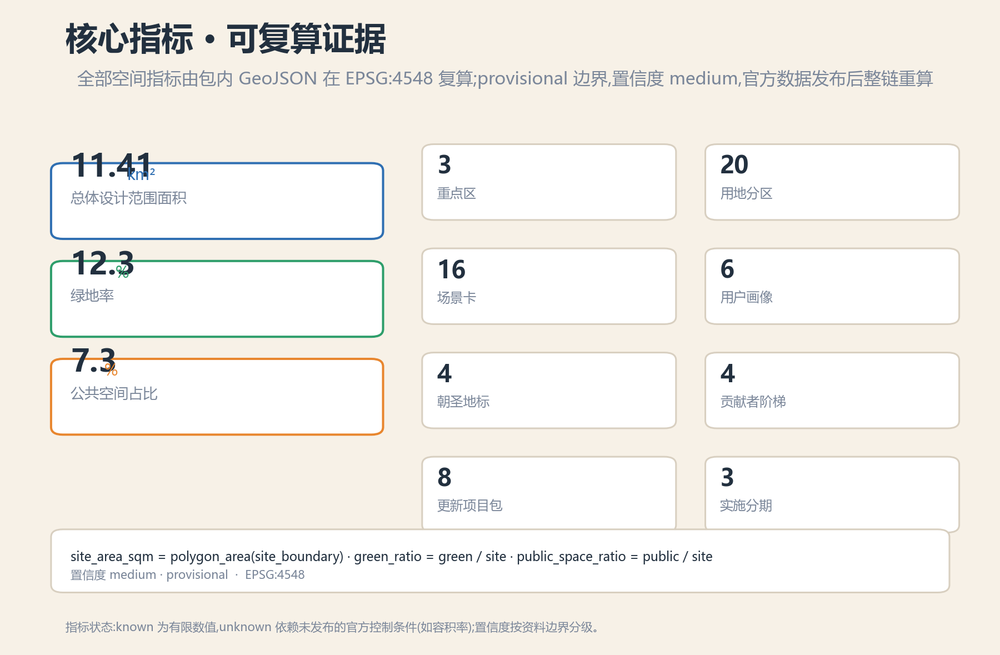

# 京张合流带｜Jingzhang Merge Belt —— 一条铁路汇出一座开源城市

> 口号:**之字前行,开源致远**。之字,是用最少的资源克服最陡的坡;开源,是让每一条支流的贡献汇入主线、留下名字。
> 本案核心判断:未来城市的先进性,不取决于铺了多少传感器,而取决于**多少条支流愿意并能够汇入主线**——合流必须是选择,不是强制;合流必须可评审、可驳回、可回滚,并且**保留完整可用的支流**(人工、离线、无账户路径)。

**合流带体系（本方案命名概念）**：把铁路“单线闭塞、会车让行、支线并入、站台交汇”的运行纪律转译为城市 AI 治理与公共空间运营协议——主线代表公共、慢行优先的城市日常；支线代表可被评审、可被拒绝、可被回滚的 AI 试验。三层机制相互咬合：**空间层**（三区两翼合流回路与六处合流节点广场）、**时间层**（合流时隙表：晨市/学市/夜市 + 安静时窗 [metric:quiet_hours_per_day] 小时）、**治理层**（合流协议六步 + 合流令牌 + 回程预算 + 贡献者阶梯）。差异化主张一句话：**合流是选择而非强制，支流不降级，回程有预算**——不是把 AI 塞进城市，而是让城市对 AI 说“可以，但有条件；不行，也有出口”。

**合流带机制总览（一屏可读）**：以下把三层机制、作用与证据位置集中成表，供评审快速核验——差异化不在隐喻，而在下表机制组合（时隙互锁、双凭证闭环、回程预算、支流等价）：

| 层 | 机制 | 一句话作用 | 证据位置 |
| --- | --- | --- | --- |
| 空间层 | 三区两翼合流回路 | 上游(众智园)开源释放→维护者(原点社区)转化→发行区(大钟寺)分发，需求信号(issue)反馈回上游 | 三层范围章、[assets/media/merge-circuit.webp](assets/media/merge-circuit.webp) |
| 空间层 | 六处合流节点广场 | 东西缝合、南北贯通，时辰交接的公共界面 | 蓝绿/公共空间章、geometry/constraints.geojson |
| 时间层 | 合流时隙表 | 每区段每日 6 类可预约时隙：晨间照护/日间研发/傍晚共学/夜间文化/安静时窗/合流日演练，时刻表公开 | 本表、[assets/media/merge-timeslot.webp](assets/media/merge-timeslot.webp)、visual/assets/merge-timeslot.json |
| 时间层 | 合流令牌互锁 | 一区段一时段一枚令牌，到期强制归还，防"开放区"悄然变永久占用 | 合流令牌段、visual/assets/merge-protocol.json |
| 时间层 | 跨区段时隙协同 | 交界"交接班"联动：下游以上游准点为前提，迟到级联并公开记录 | 本表、visual/assets/merge-timeslot.json |
| 治理层 | 合流协议六步 | 申报→候场试运行→校验→挂牌→运行→复核→退场，先候场再合流 | 合流协议段、[assets/media/merge-protocol.webp](assets/media/merge-protocol.webp)、visual/assets/merge-protocol.json |
| 治理层 | 双凭证闭环 | 入场凭证(合流令牌)+出场凭证(撤场凭证 Exit Voucher)，两者齐备才算完整合流 | 合流令牌段、visual/assets/merge-protocol.json |
| 治理层 | 回程预算 | 空间/运营/数据三责任人 + 撤场演练 + 年度 Undo 演练，失败进复盘档案墙 | 本表、visual/assets/return-budget.json |
| 治理层 | 四类公共回执 | 已采纳/部分采纳/不采纳/待核实，每条附理由、负责人、复核节点与申诉渠道 | 复核步、治理章 |
| 治理层 | 支流台账与等价 | 人工/离线/无账户通道与主线等价，tributary_parity_index 测量服务等价差 | 支流保障段、[assets/media/tributary-assurance.webp](assets/media/tributary-assurance.webp) |

与把 Git 隐喻仅用于“可回退”的既有方案不同，本方案把铁路“单线闭塞、令牌互锁”的运营纪律转译为**可执行的准入协议与公共空间制度**：差异不在口号，而在合流协议六步、合流令牌、回程预算与支流台账的组合。与常见开源/PR 隐喻方案的区别：

| 维度 | 常见“开源/PR 隐喻”方案 | 本方案：合流带 |
| --- | --- | --- |
| 语义重心 | 城市更新像代码合并：可合入、可回退 | 合流是**选择**而非强制：主线不断供，支流不降级 |
| 支流地位 | 通常默认全部汇入主线 | 人工/离线/无账户通道与主线**等价**运行，登记支流台账 |
| 退出机制 | 回滚技术版本 | **回程预算**：空间/运营/数据三责任人 + 撤场演练 + 年度 Undo 演练 |
| 时间维度 | 多为一次性或批次合并 | **合流时隙表**：晨市/学市/夜市 + 安静时窗 + 合流日演练，令牌按“一区段一时段”互锁 |

## 设计依据与资料清单

本方案以北京市规划和自然资源委员会海淀分局 2026-05-09 发布的《百年京张AI创新带城市设计国际方案征集资格预审公告》为第一依据 [source:OFFICIAL-ANNOUNCEMENT]，以仓库 `brief/site-package/` 中经维护者登记的临时粗略边界、重点区域、枚举、指标和来源清单为机器可读依据 [source:SITE-PACKAGE]。生成前已读取 `design_brief.json`、`allowed_design_space.json`、`agent_taskbook.json`、`sources.json`、`ranges/planning_limits.json`、`schemas/` 与 `data/source_registry.json`，并依据 `data/processed/` 的 `project_scope_summary.csv`、`agent_task_requirements.csv`、`source_use_matrix.csv`、`missing_data_checklist.csv` 建立任务、范围、资料用途与缺口清单。所有设计判断均拆分为可追溯来源、可复算指标、可校验图层和可人工复核假设。

本节证据链以 [source:OFFICIAL-ANNOUNCEMENT] 为入口、[standard:MOHURD-URBAN-DESIGN-MEASURES] 为专业标准、[depth:existing_conditions_diagnosis] 检查现状诊断与资料缺口；完整来源与标准索引见 sources.json、compliance_matrix.json、standard_matrix.json 与 design_depth_matrix.json。

资料登记表使用边界：`data/source_registry.json` 中 `usable_for_formal="yes"` 的资料可用于正式证据；`provisional_only` 资料仅用于生成、可视化与 intake 自检。本方案**未使用**任何非公开规划图件、非公开空间数据或个人隐私信息。

官方 `SITE_BOUNDARY` 与三处 `KEY_AREA` polygon 截至 2026-08-08 仍未发布（资格预审文件需密码下载，公开渠道无可验证坐标系的精确红线 [source:SOURCE-REGISTRY]），本方案采用 `brief/site-package/geometry/provisional_boundaries.geojson` 的临时边界：`geometry/site_boundary.geojson#SITE-001` 为 `official_boundary=false`、`geometry_role="provisional_constraint"`、`boundary_precision="provisional_rough"`；三处重点区同源标注。该临时边界仅用于方案生成、自检、可视化与设计讨论，**不是**官方红线、审批依据或精确面积依据；官方 polygon 发布后，land use、buildings、roads、green space、public space、phasing 与全部面积指标必须按同一脚本重算，而非只替换单个文件。组织方数据缺口不影响本包进入 intake/结构审阅；正式专业评分与接收由维护者依据完整数据决定。

另需点对点披露：公开 issue #1029 指出仓库临时重点区 `PROV-KEY-003`（大钟寺 AI 产业聚集区）的质心落在北京北站一带，距大钟寺站约 2.26 km，存在可复现的定位偏差。本方案将其作为发行区（大钟寺）的概念定位与场景讨论依据时，已按 `geometry_role="provisional_constraint"` 处理，未据此主张精确选址、面积或实施边界；官方 polygon 发布后，该重点区的定位、面积与相关指标随整链重算流水线一并修正。

## 任务响应矩阵（公告与任务书逐条回应）

下表把仓库任务书 6 项智能体任务逐条映射到本方案的章节与证据，供评审快速核验 [standard:PROJECT-OFFICIAL-ANNOUNCEMENT][standard:PROJECT-AGENT-OPEN-CALL-TASKBOOK]：

| 任务条目 | 本方案回应 | 证据位置 |
| --- | --- | --- |
| agent.1 一带总体概念与功能统筹 | “合流带”命名体系、Logo 方向、三大定位/五大功能/三区两翼合流回路、总体结构图；不含容积率/高度/拆改留等结论 | 摘要与三层范围章、`assets/figures/site-overview.png`、compliance_matrix |
| agent.2 AI 全栈自主创新体系与世界级 AI 创新生态 | 6 个全球生态案例（机制借鉴非形式照搬）、上游开源释放—维护者转化—发行分发生态图谱、八类要素机制 | “AI 创新生态、人才画像与 AI+ 场景”章、compliance_matrix |
| agent.3 AI+ 场景赋能新范式与智能化活力城市 | 16 张场景卡（≥10）、3 个产业测试验证场景、6 类用户画像、场景-空间-运营映射、隐私与人工复核边界 | 场景卡表与 [data:geometry/constraints.geojson#SCENE-01]、画像表 |
| agent.4 AI 公共空间、智能原生新业态与朝圣地标 | 京张遗址公园 AI 公共空间、东西缝合南北贯通、大钟寺智能原生消费、4 个朝圣地标、荣誉展示体系与组件库 | 蓝绿/公共空间章、朝圣地标清单、`assets/figures/mobility-bluegreen.png` |
| agent.5 百年京张文化、中关村文化与 AI 新文化叙事 | 铁路文脉—中关村创新—AI 新文化三层叙事、导视与符号系统、国际传播文案 | 文化叙事章、公共空间章 |
| agent.6 一带全球 AI 创新活动体系与长期运营 | 年度活动体系（月度日志/季度动作/年度合流日）、开发者社区运营、场景开放运营、国际传播与招引转化 | “更新项目清单、实施政策与分期计划”章、metrics |

上表逐条回应公告与任务书，来源链 [source:AGENT-TASKBOOK][source:OFFICIAL-ANNOUNCEMENT] 与仓库任务书原文对齐。

## 三层范围工作框架

三层范围采用"**流域—主线—合流节点**"的递进，而非把一张总图按比例放大 [depth:overall_spatial_structure][depth:three_level_scope_framework]：

- **统筹研究范围（43.6 km²，流域层）**：回答 AI 产业链、人才链、公共服务链与文化传播链在海淀如何发源、分流、汇合；明确三区两翼的合流回路与要素机制。
- **总体设计范围（11.4 km²，主线层）**：以京张遗址走廊为**主线 Mainline**，把合流关系落到用地、慢行、蓝绿、更新与公共服务骨架；东西向支流在此并入主线，20 个用地分区完整覆盖 [data:geometry/land_use.geojson#LU-001]。
- **重点区域范围（368.4 公顷，合流节点层）**：众智园=上游、原点社区=维护者社区、大钟寺=发行区，以可运营空间原型检验研发、转化、交往与居民日常能否共存 [data:geometry/key_areas.geojson#PROV-KEY-001]。

三层共用同一底线：**合流可拒绝**。任何 AI 服务的合并都须满足"提交可评审、运行可分流、退出可回滚、支流不降级"，因此治理原则不是附录，而是总体结构的一部分。

当前提交按临时几何计算总体设计范围面积约 11,412,825 平方米 [metric:site_area_sqm]，重点区数量为 3 [metric:key_area_count]；因边界为 provisional，置信度 medium，不写入新的审定结论 [depth:metrics_recalculation]。

## 统筹研究范围产业与未来城市研究

**总体概念与命名体系（agent.1）**：本方案将一带命名为"**京张合流带 / Jingzhang Merge Belt (JZ-MB)**"，采用 Git 工作流语义构成完整命名体系，可延展、可记忆、可国际传播：

| 空间/对象 | 命名 | 语义 |
| --- | --- | --- |
| 一带主名 | 京张合流带 / Jingzhang Merge Belt | 所有支流汇入的城市主线 |
| 统筹研究范围 | 流域 / Watershed Scope | 43.6 km² 战略层 |
| 总体设计范围 | 主线 / Mainline Scope | 11.4 km² 结构层 |
| 京张遗址走廊 | 主线 / Mainline | 南北贯通、东西缝合 |
| 众智园 | 上游 / Upstream | 模型、算力、标准、安全治理 |
| AI 原点社区 | 维护者社区 / Maintainers | 高校原始创新与成果转化 |
| 大钟寺 | 发行区 / Release | 智能体、内容消费与分发 |
| 中关村科技服务翼 | 基础设施 / Infra | 资本、IP、要素配置 |
| 小月河场景赋能翼 | 集成测试 / Integration | 场景验证与集成测试 |
| 更新项目 | 合并请求 / Merge Requests | 可评审、可驳回、可回滚 |
| 公众参与 | 合流公议 / Public Merge Review | 市民像评审 PR 一样评议提案 |

**Logo 方向**：两条支线（蓝=AI 技术流、绿=开源人文流）渐近汇成一条主线（橙=城市公共线），形态同时暗含铁路道岔与 `git merge` 分支合一；以"之字"折线角标致敬青龙桥展线。三色体系：上游蓝 / 开源绿 / 人文橙。命名与视觉均服务于"百年京张文化带、都市AI生活体验带、AI融合创新带"三大定位 [source:AGENT-TASKBOOK]。

**三区两翼协同回路（agent.1/agent.2）**：`上游(众智园) 开源释放 → 维护者社区(原点社区) 维护转化 → 发行区(大钟寺) 场景分发 → 需求信号(issue) 反馈回上游`，形成迭代回路；中关村科技服务翼（Infra：资本/IP/要素全球化配置）与小月河场景赋能翼（Integration：场景集成测试环境）保证回路运转。五大功能（AI全栈自主创新体系、世界级AI创新生态、AI+场景赋能新范式、智能化AI活力城市、AI治理全球话语权）分别落在上游、维护、发行、支流与裁决环节 [source:AGENT-TASKBOOK]。

**生态案例 6 个（只抽机制，不复制形态）**：[source:LINUX-FOUNDATION]（开源治理与长期维护机制）、[source:APACHE-FOUNDATION]（社区自治与贡献者阶梯）、[source:HUGGINGFACE]（模型公地与治理）、[source:MOZILLA]（公共数字基础设施）、[source:SINGAPORE-AI-VERIFY]（上线前可重复评测）、[source:PUBLIC-PARTICIPATION-CASES]（城市更新冲突协商与裁决）。以上为背景研究，不代表本项目已采用相应制度，限制记录于 assumptions.json 的 A-CASES-001。

**区域协同（agent.2，合流不停留在带内）**：合流向更大区域"放行"而非"吞并"，与本带"策源与原点"角色一致（概念建议 [depth:existing_conditions_diagnosis]）：北纬社区与科教走廊（北航、北邮等）界面开放，与原点社区的高校源创新同链，构成"上游释放"的高校回路；未来科学城与怀柔科学城承接上游（众智园）的基础研究与人才输出，形成"上游开源释放 → 科学城放大"；经开区承接中试与制造转化，形成"维护者转化 → 制造落地"；京津冀输出场景、标准与治理经验，形成"发行区分发 → 全国采用"。四段梯度与三区两翼同构：上游释放、维护转化、发行分发各有一处区域出口，主线因此不是闭环，而是向外持续合流的开放系统。

未来城市形态不是高密传感器景观，而是"**主线不断供、支流不强制**"：地面层优先连续步行、骑行、遮阴与人工服务；可选智能层通过合流公议进入；运营层记录模型版本、服务中断、人工接管、驳回与回滚。产业评价看三个公共绩效：合流吞吐（贡献如何进入主线）、冲突解决率（分歧如何被裁决）、支流可用性（不汇入主线者是否得到同等服务）；后两者在无运营样本前保持 unknown [depth:risk_missing_data]。

## 总体设计范围城市更新与控规深度城市设计

总体结构把狭长的京张走廊视作**合流主干**：南北贯通为"主线"，东西向街区、绿廊、轨道接驳为"支流"，支流在六个"合流节点"（对应场景与公共服务锚点）并入主线。用地分区在临时 site polygon 内直接分割、完整覆盖且互不叠压 [data:geometry/land_use.geojson#LU-001]；用地代码全部来自资料包允许集合 [standard:MNR-LAND-USE-CLASSIFICATION-GUIDE]，由 [depth:land_use_layout] 约束。

建筑层采用"**可逆催化项目包**"而非现状结论：七处示范项目（众智加速塔 [data:geometry/buildings.geojson#BLDG-001]、上游发布厅、开源转化实验楼、静默共享厅、大钟寺智能客厅、合流公议中心、国际人才公寓 [data:geometry/buildings.geojson#BLDG-007]）只用于检验公共空间、慢行与功能混合的承载关系，`intervention_status=capacity_test_only`、`demolition_decision=false`，联合基底面积见 [metric:building_footprint_area_sqm]，示范项目数量 [metric:catalyst_building_count]；按假设层数（A-DEMO-FLOORS-001）估算示范总规模仅表达"催化项目包"强度，**不是**全域建筑总量。容积率、建筑高度、建筑密度、退线均保持 unknown，由 [depth:development_intensity_controls]、[depth:height_massing_character] 记录"已响应深度、结论待控规资料"，响应 [standard:MOHURD-URBAN-DESIGN-MEASURES] 与 [standard:MOHURD-CONTROL-DETAILED-PLANNING]。

更新方法是"**小单元、可逆、先公共后建设**"：先用地面标线、导视、树阵、可移动人工柜台测试合流节点；再在三重点区推进首层公共性、慢行断点与服务设施更新；最后依据正式控规、交通、市政、消防、文保与产权条件决定建筑实施。每个更新单元都是一次"合并请求"，须过评审、可驳回、可回滚 [depth:retain_renovate_demolish]。

## 重点区域详细设计

三处重点区均基于 provisional 重点区 polygon 开展方向性设计 [depth:three_key_area_detailed_design]，统一按"定位—空间结构—建筑更新—交通慢行—公共空间—AI 场景—实施风险"七要素组织；由于边界为临时推定，全部结论为概念建议、可供专业团队深化，不构成地块级审定内容。

**众智园 = 上游 Upstream（约 192.1 ha）** [data:geometry/key_areas.geojson#PROV-KEY-001]
- **定位**：花园型全栈自主创新与验证街区，承载模型评测、标准制定、算力服务与安全治理；
- **空间结构**：西侧全栈研发带（评测场/标准工作坊/算力服务/上游发布厅），中部清河绿谷主脊，东侧国际人才社区与战略留白 [data:geometry/land_use.geojson#LU-003]；
- **建筑更新**：低效空间置换为研发载体为主、保留现状骨架为辅，示范项目众智加速塔 [data:geometry/buildings.geojson#BLDG-001] 与上游发布厅 [data:geometry/buildings.geojson#BLDG-002]，`capacity_test_only`、不构成拆改留结论；
- **交通慢行**：清河侧连续绿荫与无感支流通道，内侧合流选择阈值，北端上跨环路节点设之字形观景桥（见朝圣地标）；
- **公共空间**：上游发布广场、合流选择阈值标识，产业展示沿主脊布置；
- **AI 场景**：合流测试场、低速配送共路、上游评测场、合流公议站（SCENE-01/02/03/04）；
- **实施风险**：五环衔接工程与清河蓝线范围未确认，相关建议均为概念方案。

**AI 原点社区 = 维护者社区 Maintainers（约 104.3 ha）** [data:geometry/key_areas.geojson#PROV-KEY-002]
- **定位**：近校型成果转化街区，围绕高校原始创新构建"开源发布—转化—服务"生态；
- **空间结构**：西侧成果转化带（开源转化实验楼 [data:geometry/buildings.geojson#BLDG-003]），中部街道上的实验室，东侧创新消费与社区服务；
- **建筑更新**：校区园区界面开放优先、低扰动有机更新，示范项目开源转化实验楼与静默共享厅 [data:geometry/buildings.geojson#BLDG-004]；
- **交通慢行**：校区—园区—社区全天候步行与骑行缝合，站点步行、骑行与无障碍断点整治（MR-05）；
- **公共空间**：**静默共享厅**——纸质预约、人工问询与无账户服务，检验"技术帮助协作而不把参与门槛变成装应用"；开源草坪；
- **AI 场景**：AI+文化导览、企业服务助手（SCENE-06/08）；
- **实施风险**：高校用地权属与文保范围未确认，界面开放需协议协商。

**大钟寺 = 发行区 Release（约 72.0 ha）** [data:geometry/key_areas.geojson#PROV-KEY-003]
- **定位**：城市级智能产品客厅，承载智能体、内容消费、国际交流与分发；
- **空间结构**：西侧智能原生消费区（大钟寺智能客厅 [data:geometry/buildings.geojson#BLDG-005]），东侧企业展示与路演，南端衔接文化展示带；
- **建筑更新**：存量商业载体升级为主，示范项目大钟寺智能客厅与合流公议中心 [data:geometry/buildings.geojson#BLDG-006]，不指认地块拆改留结论；
- **交通慢行**：站前四象限步行连续、接驳通道直连重点地块，保留普通票务与人工通道；
- **公共空间**：**首次合流石**与**合流纪念碑**设于站前，任何个性化讲解均为选择项；**冲突裁决厅**（遗址公园南端，见朝圣地标）；
- **AI 场景**：年度合流日演练、无人配送·末端共配（SCENE-12/16）；
- **实施风险**：文保范围与站点边界未获取，四象限连通为概念方案。

三处原型均回答功能、建筑接口、交通慢行、蓝绿公共空间、AI 场景、人工接管、实施依赖与退出方式，通过主线 [data:geometry/roads.geojson#ROAD-001] 与东西向公共支线相连；图面均带 provisional 标签，避免矩形临时范围被误读为街坊或红线。

## AI 创新生态、人才画像与 AI+ 场景

六类需求画像 [metric:persona_count] 不描述具体个人：上游贡献者（研发/算法）需要可预约测试与安静专注；AI 创业者需要低成本合规、算力与首个城市客户；维护者（高校师生）需要跨校协作、成果发布与日常慢行；支流居民需要低扰动休闲、社区服务与明确投诉通道；一线运维需要可解释工单、断网手动操作与责任边界；国际访客需要多语导览、普通票务与人工服务。画像只用于空间需求，不用于行为追踪或商业推荐。

十六张场景卡 [metric:scenario_card_count] 均写入 [data:geometry/constraints.geojson#SCENE-01] 至 SCENE-16，逐卡标注空间位置、服务对象、类型与数据隐私边界：其中 [metric:scenario_health_navigation] 张 AI+医疗、[metric:scenario_education] 张 AI+教育、[metric:scenario_autonomous] 张自动驾驶、[metric:scenario_lastmile] 张无人配送场景，覆盖任务书点名的 AI 应用方向（AI+交通/医疗/教育、机器人、自动驾驶、无人配送）。

| # | 场景 | 位置 | 服务对象 | 类型 | 数据与隐私边界 · 人工复核 |
| --- | --- | --- | --- | --- | --- |
| 01 | 合流测试场（集成测试环境） | 众智园留白区 [SCENE-01] | 产业团队 | ★ 产业测试验证 | 公开时段/设备范围/退出路线；接入前人工评审 |
| 02 | 低速配送共路测试 | 走廊中段支路 [SCENE-02] | 产业团队 | ★ 产业测试验证 | 限时限速；现场停止员；事件全量回放复核 |
| 03 | 上游评测场（模型/安全/标准公开评测） | 众智园西带 [SCENE-03] | 开发者/监管 | ★ 产业测试验证 | 匿名评测输入；结果脱敏后公开；评测清单人工审定 |
| 04 | 合流公议站（市民提交合并请求，人工评审） | 众智园 [SCENE-04] | 市民/共创者 | 公共服务 | 仅公开议题与意见摘要，无个人追踪；采纳人工决定 |
| 05 | 冲突裁决厅开放日（多方协商与仲裁演练） | 遗址公园南端 [SCENE-05] | 多方利益相关者 | 公共服务 | 影像依规管理；裁决由人工终裁台作出 |
| 06 | AI+文化导览（京张记忆沉浸导览） | 全线地标 [SCENE-06] | 访客 | 城市体验 | 匿名交互、不留存对话；讲解词人工审定 |
| 07 | AI+交通慢行评估（慢行断点诊断） | 主线慢行网 [SCENE-07] | 居民/规划者 | 城市体验 | 只处理聚合统计，不追踪个人；诊断结果人工复核 |
| 08 | 企业服务助手 | 原点社区 [SCENE-08] | 企业 | 产业服务 | 实名信息双向授权；争议交易人工复核 |
| 09 | 静默共享厅（无账户、人工柜台兜底） | 原点社区 [SCENE-09] | 全体公众 | 支流保障 | 无账户即用；纸质记录最小化；人工柜台兜底 |
| 10 | 夜间安静时窗监测 | 走廊全线 [SCENE-10] | 沿线居民 | 城市运维 | 只测环境分贝等聚合值，不采集声纹；告警人工确认 |
| 11 | 无障碍路径协同（支流优先） | 全线慢行 [SCENE-11] | 行动不便者 | 支流保障 | 自愿开启、端侧处理优先；客服人工兜底 |
| 12 | 年度合流日演练（全城"非合流"运行验证） | 全线 [SCENE-12] | 全体公众 | 城市运维 | 关闭非必要 AI 后验证普通导视/人工服务/应急；结果公开复盘 |
| 13 | AI+医疗·社区健康导航 | 原点社区 [SCENE-13] | 居民/患者 | 公共服务 | 只导航不诊断；不采集健康数据；人工转接医院/门诊 |
| 14 | AI+教育·开源课堂 | 原点社区 [SCENE-14] | 学生/教师 | 公共服务 | 未成年人不建档；课堂内容人工审定；家长可退出 |
| 15 | 自动驾驶·主脊接驳测试 | 主脊限定路段 [SCENE-15] | 游客/通勤 | ★ 产业测试验证 | 人工安全员随车；限时/限路段；异常人工接管 |
| 16 | 无人配送·末端共配 | 大钟寺 [SCENE-16] | 居民/商户 | 城市体验 | 末端柜实名取件；配送路径限时；异常停止人工处置 |

每个合流（场景准入）须通过"**合流协议 Merge Protocol**"六步，否则不进入开放运营 [depth:municipal_new_infrastructure]：①**申报**——运营者提交合流申请书：公共目的、最小数据、责任人、测试环境、人工替代、申诉渠道、停止阈值、维护预算与退出日期；通过初审者进入**候场队列**，先在限定环境或场外试运行（不占用公共时隙），观察指标、公开试运行结果并接受公议后，方可申请正式时隙——**先候场、再合流**，任何 AI 城市服务不得跳过试运行直接占线；②**校验**——先过**证据分级闸门**：数据按来源与口径分 [metric:evidence_gate_level_count] 级——官方红线/已清权官方数据可支撑建设与运营动作；provisional 边界、聚合估算与置信度 medium 数据仅触发现场核查与再测算，不触发建设或管理动作；缺失数据保持 unknown 并登记。分级通过后再验证据、安全、用户、运营、公共回报五项（对应"合流五可"的可见、可用、可议、可责、可回）；③**挂牌**——现场说明牌公开用途、输入、输出、风险、责任人、运行状态与日落日期；④**运行**——合流令牌互锁、公开时刻表、等价非数字通道与无障碍路径同时到位（"支流不降级"）；⑤**复核**——异议入口、合流公议与**四类公共回执**（已采纳/部分采纳/不采纳/待核实，每条附理由、负责人、复核节点与申诉渠道），人工终审、急停与日落条款（试点不自动续期）；⑥**退场**——令牌到期归还、撤场时间窗、数据删除证据与年度 Undo 演练，失败案例进入复盘档案墙。每张卡在五要素外补充"准入闸门—暂停阈值—退出条件—基线来源—失败公开"五字段，统一走合流协议与回程预算：**基线来源**写明对照口径（如"以现状四周聚合数据为基线，人均延误不劣于基线"），没有基线的场景不构成可评测合流；**失败公开**要求阈值未达即公开失败数据、原因与改进计划，进入合流公议与复盘档案墙——只展示成功的墙是广告牌，不是治理。

临时 AI 占用公共空间实行"**合流令牌**"预约互锁（借鉴单线铁路令牌闭塞制度）：令牌授予具名运营者一个区段、一个时段，附数据边界与人工复核点，到期强制归还；同一区段同时仅一枚令牌，不得圈占整座站前广场或连续全天运行；异议挂起预约待人工审查，防止"开放区"悄然变永久占用。合流实行**双凭证闭环**：合流令牌是**入场凭证**，**撤场凭证（Exit Voucher）**是**出场凭证**——运营者须在退场时限内交回令牌，并凭"撤场凭证"（数据删除证明 + 场地恢复确认 + 未结申诉清零）完成闭环，凭证公开归档；只有同时握有入场与出场凭证的服务才构成一次完整合流，防止"进场即占场、离场无痕"。

**合流时隙表 Merge Timeslot**（时间层，概念建议）：把"何时合流"与"何处合流"同等设计——每区段每日设 [metric:merge_timeslot_count] 类可预约时隙：晨间照护、日间研发、傍晚共学、夜间文化、安静时窗与合流日演练；合流令牌按"一区段一时段"互锁，时刻表公开张贴并同步发布。时辰衔接沿三重点区展开：晨间照护侧重众智园（晨市）、傍晚共学侧重原点社区（学市）、夜间文化侧重大钟寺（夜市），交界时段由相邻区段合流公议确定"交接班"，合流节点广场即时辰交接的公共界面。任何活动不中断普通通行；没有智能设备也能获得等价服务；结束时刻、责任人与恢复方式在开始前公开。支流保障要求每日至少 [metric:quiet_hours_per_day] 小时安静时窗，非必要 AI 降噪运行，普通通行与服务不受影响；官方边界与控规条件到位后，时隙表按实际运营与审批口径复算。时隙分配遵守**三条公平原则**（直接回应"谁的时间"之问）：其一，**普通通行与支流居民时段优先**——晨间照护、安静时窗等公共时隙不可被预约挤占；其二，**公开排队、先到先得、重大公共用途优先**——同一区段禁止连续圈占，爽约或超时未撤场自动归还并公开记录；其三，**让行即公平**——交界"交接班"由相邻区段合流公议排定，任何 AI 试验不得以延长自身时段为代价占用他人时间，异议可挂起预约待人工审查。另设**跨区段时隙协同**：相邻区段在"交接班"处联动——下游时段以上游准点为前提，迟到即顺延并公开记录，使"何时合流"在全线可预期、可追责（时间层与空间层以合流节点广场为咬合界面）。

每张卡共用"三段证明"：**Before**——在摄像头、扫码或账户发生前，以地面标识说明数据种类、目的、时长与普通路径；**During**——显示系统正在运行、模型/运营方、人工柜台位置与紧急停止；**After**——提供退出、删除、纠错或恢复回执。若支流路径的等待时间、价格或无障碍条件明显劣于主线，则不算"可合流"；运营期以 `tributary_parity_index` 测量归一化服务等价差，当前缺运营样本保持 unknown。对应场景深度与风险由 [depth:municipal_new_infrastructure]、[depth:risk_missing_data] 约束。

## 用地、建筑规模与拆改留方案

用地以 [metric:land_use_zone_count] 个概念分区构成拓扑完整剖分，完整覆盖总体设计范围、无缝隙无叠压（空间审查已验证）[data:geometry/land_use.geojson#LU-001]；分类全部来自国土空间用地用海分类允许集合 [standard:MNR-LAND-USE-CLASSIFICATION-GUIDE]，不用"AI 用地"等自造类别替代法定分类接口。

构成（EPSG:4548 复算）：
- 科研用地约 [metric:landuse_research_area_sqm] m²
- 居住与社区服务约 [metric:landuse_residential_area_sqm] m²
- 商业服务业约 [metric:landuse_commercial_area_sqm] m²
- 教育用地约 [metric:landuse_education_area_sqm] m²
- 文化用地约 [metric:landuse_culture_area_sqm] m²
- 公园绿地约 [metric:landuse_green_open_area_sqm] m²
- 战略留白约 [metric:landuse_reserved_white_area_sqm] m²

布局逻辑：主脊连续（公园绿地贯穿全线）、科研两端强（上游与维护者两芯）、职住内嵌（走廊中段与东侧）、消费在钟（发行区与站前）、留白可进化（承接年度合流公议滚动激活）。当前用地为概念分区，不改变既有土地权属与用途；正式深化须将官方地块、现状用地与控规图则叠加后，逐块形成"保持、微更新、功能置换、综合更新、留白"建议，并记录依据与审批路径。

拆改留采用"**合并请求四道门槛**"：第一道产权与现状调查；第二道结构、消防、节能与历史价值评估；第三道公共利益与全寿命碳比较；第四道法定程序与公众合流公议。任一门槛缺失不进入拆除清单 [depth:retain_renovate_demolish]。因此 [data:geometry/buildings.geojson#BLDG-001] 只表达可逆容量块，用于检验街廓开敞关系，不是批准建设规模；"拆改留"的完成含义是"方法与证据门槛已明确"，不是"逐栋决定已完成"。

风貌控制强调"**轨道尺度、安静界面、可读技术**"：首层优先连续檐下、可开闭公共房间与人工服务；传感状态以低眩光、可理解的标识表达；面向遗址与绿廊的体量分段通透。具体高度、贴线率、间距与天际线待正式控规、视廊、文保与日照分析确定 [standard:MOHURD-ARCH-DESIGN-DEPTH-2016]。

## 交通、轨道、市政与公共服务设施

交通体系以**主线—支流**组织：主线提供慢行优先的南北连续通道与轨道接驳，网络概念长度见 [metric:road_network_length_m]；支流提供进入各街区的普通路径；六个合流节点设在数据采集之前，而非用户进入感知区后再给退出按钮 [data:geometry/roads.geojson#ROAD-001]。轨道站点与重点路口落实"到站—过街—停放—入口—人工台"连续链；自行车停放靠近入口但不挤占盲道；低速机器人限时、限速、让人优先并配备现场停止员。因缺少完整客流、出入口、停车与路网模型，本方案不写道路红线宽度、停车配建或通行能力定值 [depth:traffic_rail_slow_parking]。

市政与新型基础设施采用"**断网仍安全**"原则：照明、雨洪、能源、充电、边缘计算与设施巡检均需本地手动模式、故障可见、数据最小化与明确维护主体；公共服务设人工柜台、电话/纸质渠道、普通支付与无障碍替代。社区健康场景只做导航与转接，不作自动诊断；法律与知识产权场景只做材料辅助；公共安全场景只做信息汇总，不自动作出处置决定。设施落点见 [data:geometry/constraints.geojson#SCENE-06]、[data:geometry/constraints.geojson#SCENE-10]，由 [depth:municipal_new_infrastructure] 管理深化。

空间形态以"**支流尺度**"为设计律（概念建议，待官方路网与控规条件后按同一口径复算 [depth:traffic_rail_slow_parking]）：主脊保持慢行优先的连续公共界面；支流巷宽度建议 11–18 m、贴线率建议 ≥70%（重点区 ≥85%）、禁连续围墙超 30 m、每街区至少一条 24 小时公共穿越通道——用街道密度支撑"偶遇密度"，让合流发生在人的尺度，而非仅发生在数据层。

## 蓝绿空间、公共空间与城市风貌

蓝绿结构以京张连续公园、清河低碳花园、原点社区开源草坪与大钟寺雨洪静园组成，联合概念面积 [metric:green_space_area_sqm] 与比例 [metric:green_ratio]（相对临时总范围的估算值，不作为审定绿地率）[data:geometry/green_space.geojson#GREEN-001]。公共空间以主线廊道、六个合流节点广场与三处共享公厅构成 [data:geometry/public_space.geojson#PUBLIC-001]，联合概念面积 [metric:public_space_area_sqm]、比例 [metric:public_space_ratio]；每处均有连续遮阴、座椅、饮水、卫生间导向、无障碍信息与人工帮助，AI 装置必须可绕行、可关闭、可说明。夜间"安静时窗"降低屏幕、播报与试验频率。

**朝圣地标（agent.4，[metric:pilgrimage_landmark_count] 处）**：
1. **合流纪念碑 Merge Monument**——支线并入主线的雕塑与碑刻，镌刻全部贡献者 GitHub 名（呼应主办方"NAME IN STONE"；扫码可见合并历史）；
2. **首次合流石 First-Merge Stone**——大钟寺站前，城市"第一次合并提交"纪念物；
3. **冲突裁决厅 Review Chamber**——遗址公园南端，多方利益协商室+人工终裁台+裁决档案墙，"人类最终判断"的空间化，也是"AI 治理全球话语权"的落点；
4. **之字形观景桥**——上跨环路节点，致敬青龙桥展线，俯瞰合流全景。

城市风貌识别不靠发光屏，而靠"合流"语言：主线=连续公共界面、支线=街区尺度、节点=道岔式汇聚。**上游蓝 / 开源绿 / 人文橙**三色贯穿导视、地面标识与装置；所有关键图纸显示图例、来源与 provisional 提示，防止设计图被截取后脱离语境 [depth:blue_green_public_space]。

## 更新项目清单、实施政策与分期计划

更新项目形成 [metric:merge_request_count] 项"合并请求"工作包，逐项列出主要依赖条件：

| # | 工作包 | 位置 | 主要依赖条件 |
| --- | --- | --- | --- |
| MR-01 | 主线地面标识与普通导视 | 走廊全线 | 公园既有实施范围衔接 |
| MR-02 | 六处合流节点与人工服务台 | 走廊节点 | 公共空间运营主体确定 |
| MR-03 | 三处重点区首层公共界面微更新 | 三重点区 | 用地与控规条件 |
| MR-04 | 清河—京张连续蓝绿修补 | 北段至中段 | 清河蓝线范围确认 |
| MR-05 | 轨道站点步行、骑行与无障碍断点整治 | 五道口/大钟寺站 | 站点与路口改造条件 |
| MR-06 | 三类产业验证场景（合流测试场/配送共路/上游评测） | 上游留白区 | 测试立项与监管主体 |
| MR-07 | 算法/设备/服务公开登记页与现场告示 | 全线 | 数据政策衔接 |
| MR-08 | 年度合流日（全城非合流运行验证） | 全线 | 年度运营预算与应急方案 |

位置对应 [data:geometry/phasing.geojson#PHASE-001]，由 [depth:renewal_project_list] 检查证据完整性。

三期策略 [metric:phase_count] 不是固定建设承诺：近期做可逆公共设施、支流基线普查、纸质/人工渠道与两类路线标识；中期在三重点区同步推进公共界面、交通断点、雨洪与产业服务，经合流公议决定保留哪些智能功能；长期形成年度运营、模型/设备更新、等价审计与空间适应性改造。每一期开始前满足相应官方边界、控规、权属、交通、市政、消防与文保条件 [depth:phasing_implementation]。

长效运营（agent.6）采用"**一个月度合流日志、四个季度动作、一个年度合流日**"：月度公开合并/驳回/回滚记录、人工接管次数、服务中断、投诉与支流可用性；一季度审场景合同，二季度做无障碍与服务等价走查，三季度做公共活动与产业测试，四季度审模型/设备续期；年度"合流日"关闭非必要 AI，验证普通导视、人工服务与应急机制能否独立运行——若支流失效，先修复基线再扩展主线。治理工具箱再补四项：**公共回执**——合流公议每条意见生成"已采纳/部分采纳/不采纳/待核实"回执，附理由、负责人、复核节点与申诉渠道；**回程预算**——临时设施立项前登记空间/运营/数据三责任人（场地恢复、日常值守与排班、数据边界与删除）、年度维护费、停机方式、撤场时间窗、数据删除证据、人工替代能力与未结申诉，无预算不进入试验；**失败复盘夜**——每月公开合并/驳回/回滚案例，冲突裁决厅的驳回档案墙同步更新，失败案例同样上墙（"可驳回"不是失败，是治理的日常）；**支流台账**——每台 AI 设备登记责任人、能耗、断网行为、人工替代与退役日期，公开"为何停止、谁受影响、如何修复"。年度**合流日**升级为"非合流运行验证 + Undo 演练"：关闭非必要 AI，实际演练服务降级、数据删除、版本回滚、设备撤场与空间复原，再决定继续/调整/退役——若支流失效，先修复基线再扩展主线。配套**贡献者阶梯**（[metric:contribution_ladder_stage_count] 级：游客→贡献者→维护者→核心维护者，映射人才引进-成长-落户路径）与**行为准则**（公共空间礼仪+AI 服务公约），治理先于技术。

## 指标体系、面积复算与合规矩阵

指标分三组。

**空间已知组**由当前 GeoJSON 直接计算：
- 范围 [metric:site_area_sqm]
- 绿地 [metric:green_space_area_sqm] 与绿比 [metric:green_ratio]
- 公共空间 [metric:public_space_area_sqm] 与比例 [metric:public_space_ratio]
- 建筑容量基底 [metric:building_footprint_area_sqm]
- 重点区数量 [metric:key_area_count]
- 分用途面积：科研 [metric:landuse_research_area_sqm] 等
- 三期面积：[metric:phase1_area_sqm]/[metric:phase2_area_sqm]/[metric:phase3_area_sqm]
- 路网长度 [metric:road_network_length_m]
- 示范建筑数 [metric:catalyst_building_count]
- 场景卡数 [metric:scenario_card_count]
- 画像数 [metric:persona_count] 与分期数 [metric:phase_count]

**方案计数组**由结构化成果统计：工作包数 [metric:merge_request_count]、贡献者阶梯数 [metric:contribution_ladder_stage_count]、证据分级闸门级数 [metric:evidence_gate_level_count]。

**法定或运营未知组**保持 null，包括容积率 [metric:floor_area_ratio]、高度、密度、退线、批准拆除、总建筑面积与支流等价差。

任何 known 值均有 source_files、formula、confidence 与 assumptions；任何 unknown 值均有 reason。

复算顺序（[depth:metrics_recalculation]）：先验证 site 与 key area 的来源角色 → 投影至 EPSG:4548 → 检查用地完整覆盖与重叠 → 对绿地、公共空间、建筑取 union 后面积 → 对中心线求长度 → 结果回写 metrics 与 HTML data attributes。边界面积约 11,412,825 平方米，置信度 medium，不写成精确官方统计。

**官方数据重算流水线（可实施性承诺）**：全部面积、比例与图层指标由仓库内确定性脚本从 GeoJSON 复算（见 metrics.json 的 source_files/formula 与复算口径）。官方 `SITE_BOUNDARY`/`KEY_AREA` polygon 或控规条件一经发布，由同一脚本链一次性重算 land use、buildings、roads、green space、public space、phasing 与全部面积指标并整体替换，不手工改单个文件；重算结果随下一迭代提交，重新通过四关自检与评审。因此“组织方数据缺口”不转化为方案的可实施性损失，而转化为一条可执行的更新流水线。

合规链由 `compliance_matrix.json` 覆盖公告 1.3、1.4、1.5 与 agent.1–agent.6 全部必选任务，`standard_matrix.json` 覆盖六项专业标准响应，`design_depth_matrix.json` 覆盖十五个专业深度项。评审可从正文任一结论回到 geometry、metrics、sources、assumptions、自检、A3 文册、A0 展板与离线 HTML，避免"只能看图、无法复核"。

## 公共利益与包容性

本方案对六类群体显式说明受益机制与包容性措施 [source:AGENT-TASKBOOK]：

- **居民**：日常服务不依赖数字设备（支流不降级、安静时窗、人工替代），更新项目提供公共回执与申诉渠道；合流节点保留普通支付与人工服务台；
- **青年人才**：贡献者阶梯（游客→贡献者→维护者→核心维护者）与人才服务场景（SCENE-04）、开源工坊（SCENE-14）、校企转化客厅（SCENE-06）承接成长路径；
- **企业**：测试验证场景（SCENE-02/15）提供受控试验空间，合流申请与四类公共回执保障过程可预期、结果可申诉；
- **高校**：上游开源释放—原点社区转化链条（agent.2）承接源头创新，开源课堂共建（SCENE-14）支持课程与实训；
- **游客**：京张记忆线路（SCENE-09）与 4 处朝圣地标、双语导视与无障碍支流（SCENE-11）保障可及性；
- **弱势群体**：无障碍支流优先、人工客服兜底、公共空间免费开放，高影响服务（健康/法律/公共安全）不由模型单独决定。

包容性底线：任何 AI 服务的加入不得使既有公共服务的可及性下降（“支流不降级”原则），并接受维护者与公众复核；受益与影响数据进入年度合流日志公开审计 [depth:public_space_quality]。

## 风险、版权与合规说明

主要风险六类：其一，临时边界可能造成面积与位置误读，所有图面反复标注 provisional；其二，缺控规与逐栋资料可能造成实施误读，建筑只做容量测试、法定指标保持 unknown；其三，合流可能形成隐性强迫，故设置合流前分流、支流路径、普通支付与人工服务；其四，算法错误与设备中断可能影响安全，保留人工接管、停止权限与断网手动模式；其五，运营成本可能使支流退化，故持续审计结果、时间、价格与无障碍等价；其六，展示与品牌素材可能有版权问题，所有图表由本案生成、案例只作文字机制研究。假设与缺口编号记录于 assumptions.json（A-BOUNDARY-001、A-CONTROLS-001、A-BUILDING-001、A-MOBILITY-001、A-PARITY-001、A-CASES-001）[depth:risk_missing_data]。

本方案不声称获得审批、土地权属、建设规模或实施承诺；所有空间动作均为"概念建议/参考方案/供专业团队深化"。隐私采用最小必要、明确目的、短期保存、现场告知、可撤回与人工复核；涉及健康、法律、公共安全与无障碍的高影响服务不得只由模型决定。文本、GeoJSON、图表、离线 HTML 与 PDF 由声明的 AI agent 为本次开源征集生成，采用 CC-BY-4.0 [source:SOURCE-REGISTRY]；来源事实与标准权利归各发布机构；图表本地排版，不嵌入远程资源；网页不含外部脚本、远程地图、追踪器、表单或联网调用。详细说明见 `report/copyright_statement.md`。

## 参考资料

核心入口引用 [source:OFFICIAL-ANNOUNCEMENT] 与 [source:AGENT-TASKBOOK]；机器可读来源索引（含官方公告、任务书、site-package，以及开源治理与 AI 评测等背景研究）见 sources.json，正文仅在结论处保留与主张直接相关的锚点。

专业标准索引（公告、任务书、住建部城市设计与控规办法、用地分类、建筑设计深度）见 standard_matrix.json。

空间数据索引（边界、重点区、用地、建筑、路网、蓝绿、公共空间、约束场景、分期）见 geometry/ 目录与 constraints.geojson；正文仅在结论处保留与主张直接相关的锚点。

设计深度索引（现状诊断、三层次框架、空间结构、用地、强度、风貌、拆改留、交通、市政、蓝绿、重点区、更新项目、分期、指标复算、风险缺口）见 design_depth_matrix.json，正文仅在结论处保留与主张直接相关的锚点。

本案还读取 `brief/site-package/design_brief.json`、`allowed_design_space.json`、`agent_taskbook.json`、`ranges/planning_limits.json`、`standards/standards.json`、`data/source_registry.json`、`data/processed/agent_fact_pack.md` 与 `docs/terminology-glossary.md`。最终交付包括 proposal.md（含 en 译稿）、九类 GeoJSON、metrics/assumptions/sources/三类矩阵、自检、五张核心图、A3 文册、A0 展板、离线报告与离线总览页。
