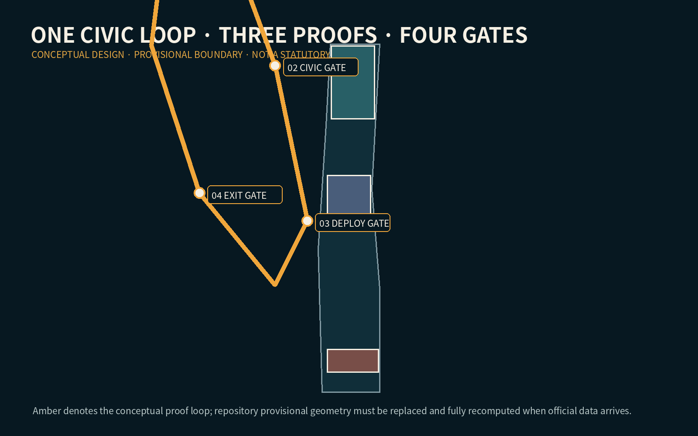
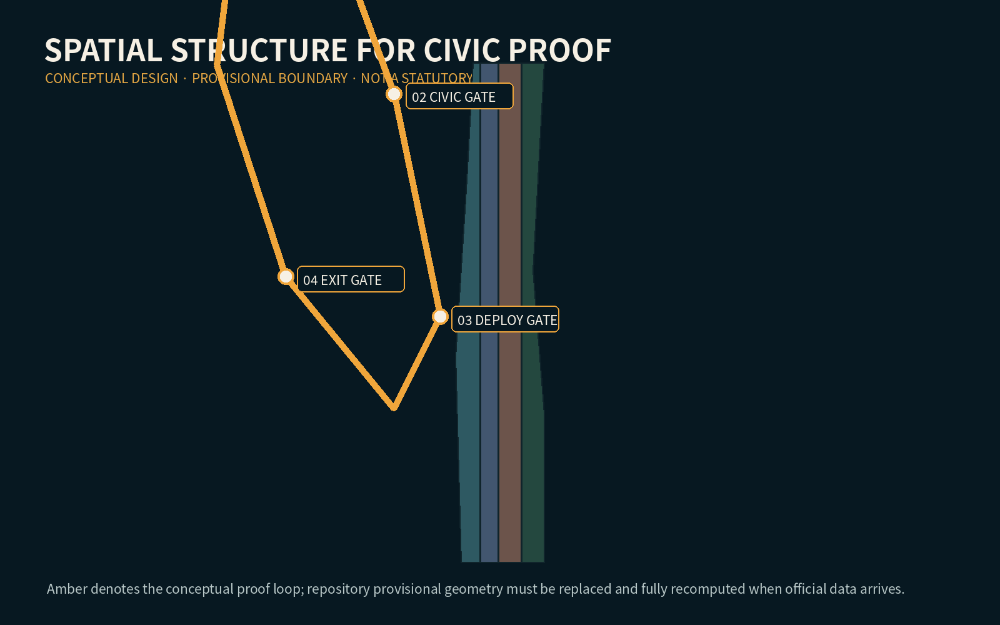
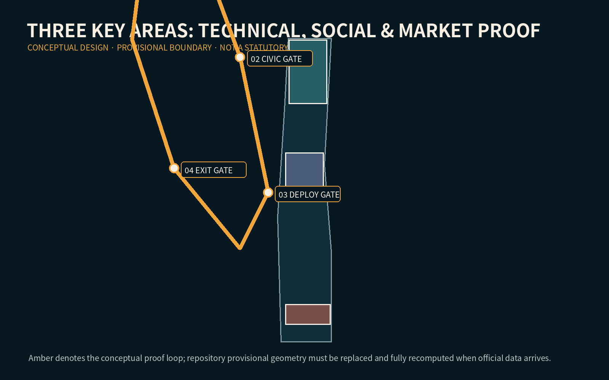
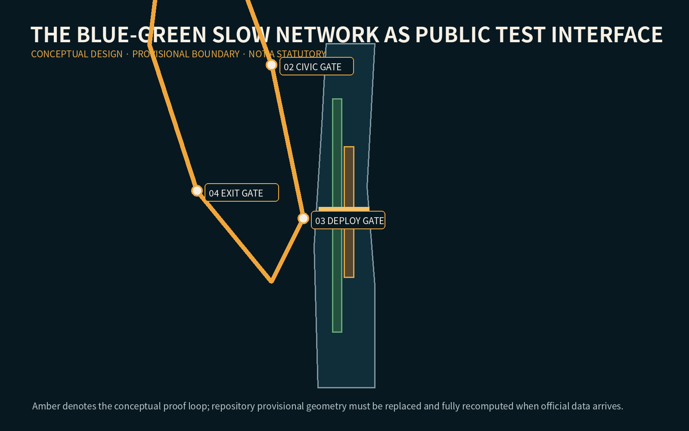
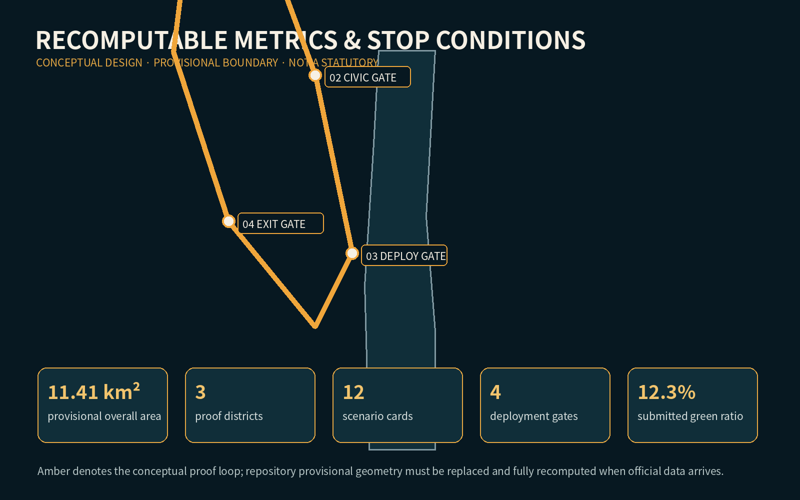

# JINGZHANG CIVIC PROOF LOOP

## Design Basis and Source List

The package uses the official open-call announcement, the registered source inventory, and the repository provisional geometry. The latter is a temporary constraint only: it is not an official redline and every precision-sensitive metric must be recomputed when official polygons arrive. [source:OFFICIAL-ANNOUNCEMENT] [source:SOURCE-REGISTRY] [data:geometry/site_boundary.geojson#SITE-001]

## Three-Level Scope Framework

At 43.6 km² the research scope coordinates the AI ecosystem; at approximately 11.4 km² the overall design scope organizes renewal and infrastructure; three key areas receive detailed concepts. The Civic Proof Loop links these levels without inventing a new statutory boundary. [standard:PROJECT-OFFICIAL-ANNOUNCEMENT] [metric:site_area_sqm] [depth:three_level_scope_framework]

## Coordinated Research Area: Industry and Future City Research

The proposal treats public proof as shared innovation infrastructure. Universities and laboratories produce methods; Zhongzhiyuan tests technical robustness; the AI Origin Community tests social usefulness and accessibility; Dazhongsi tests market adoption and accountable operation. A service advances only when evidence, a human fallback, and an exit route are visible. [source:AGENT-TASKBOOK] [depth:overall_spatial_structure]

## Overall Design Area: Urban Renewal and Regulatory-Plan-Level Urban Design

One heritage spine, one return loop, three proof districts, and four gates structure the concept. Existing parcels remain a provisional full-coverage land-use partition; development intensity, height and demolition decisions remain pending official controls and surveys. [data:geometry/land_use.geojson#LU-001] [standard:MOHURD-CONTROL-DETAILED-PLANNING] [depth:development_intensity_controls]

## Detailed Design of Key Areas

Zhongzhiyuan hosts technical proof gardens and red-team rooms; the AI Origin Community hosts resident trials, accessibility audits and open-source release; Dazhongsi hosts time-limited market pilots, international demonstration and public incident review. Every move is a conceptual suggestion within provisional key-area polygons. [data:geometry/key_areas.geojson#PROV-KEY-001] [depth:three_key_area_detailed_design]

## AI Innovation Ecosystem, Personas, and AI+ Scenarios

Five personas—resident, disabled or older visitor, developer, start-up operator, and public-service worker—test twelve scenario cards. Cases include slow-mobility guidance, barrier-free wayfinding, heat-risk rest points, model red-teaming, open-source release, legal triage, learning support, enterprise copilot, responsible retail, cultural interpretation, crowd support, and incident replay. Three industry scenarios explicitly validate models, edge systems and agents. [standard:PROJECT-AGENT-OPEN-CALL-TASKBOOK] [data:geometry/public_space.geojson#PUBLIC-001]

## Land Use, Building Scale, and Retain-Renovate-Demolish Strategy

The package changes no parcel into an asserted legal use. Reuse is prioritized for structurally serviceable buildings; reversible fit-out precedes new build; demolition is not concluded without ownership, safety and heritage surveys. FAR and height remain pending official data. [standard:MNR-LAND-USE-CLASSIFICATION-GUIDE] [data:geometry/buildings.geojson#BLDG-001] [depth:retain_renovate_demolish]

## Transport, Rail, Municipal Infrastructure, and Public Services

The loop is a walking and cycling service sequence linked to rail stations, east-west crossings and human help desks. Sensors are minimal, edge-processed where feasible, and never replace tactile paving, signs or staffed fallback. Road redlines and utilities remain subject to professional confirmation. [data:geometry/roads.geojson#ROAD-001] [depth:traffic_rail_slow_parking] [depth:municipal_new_infrastructure]

## Blue-Green Network, Public Space, and Urban Character

The railway heritage corridor is the civic test interface: green space absorbs waiting, recovery and informal learning, while proof stations make purpose, data, operator, review date and stop control legible. Rail steel, amber gate markers and restrained night lighting form the identity system. [data:geometry/green_space.geojson#GREEN-001] [metric:green_ratio] [depth:blue_green_public_space]

## Renewal Projects, Implementation Policy, and Phasing

Phase 1 establishes reversible signs, staffed proof desks and accessibility audits; Phase 2 links the three districts and station crossings; Phase 3 admits only services that publish evaluation and exit records. Six projects cover the loop, three district rooms, crossing repairs and an annual Civic Proof Week. No project is an approved investment commitment. [data:geometry/phasing.geojson#PHASE-001] [depth:phasing_implementation]

## Metrics, Area Recalculation, and Compliance Matrix

Known values are computed from submitted geometry; unknown FAR, total floor area, heights and engineering capacity remain explicitly unknown. Success is assessed by gate completion, fallback availability, accessibility defects closed and incident-review time—not by sensor count. [metric:site_area_sqm] [metric:public_space_ratio] [depth:metrics_recalculation]

## Risk, Copyright, and Compliance

Risks include provisional geometry, exclusion through digital-only service, surveillance creep, automation bias, vendor lock-in and unclear incident ownership. Controls include data minimization, visible human override, fixed pilot expiry, public logs and deletion after the stated purpose. The cover is synthetic conceptual imagery, not site evidence. [source:SITE-PACKAGE] [data:geometry/constraints.geojson#CONSTRAINTS] [depth:risk_missing_data]

## References

The complete, machine-auditable bibliography and permitted-use notes are held in sources.json. Principal references are the official announcement, the Agent taskbook, the site package, the source registry and local professional-standard snapshots. [source:SITE-PACKAGE] [source:AGENT-TASKBOOK]
