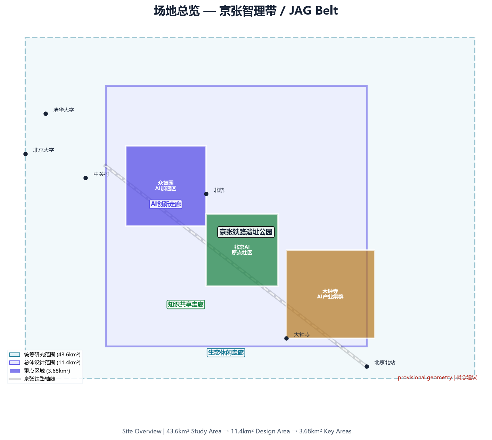
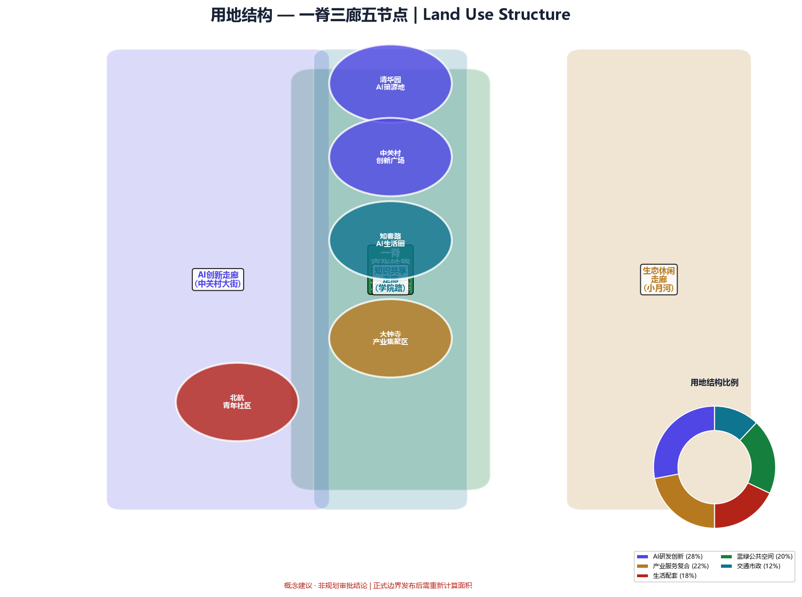
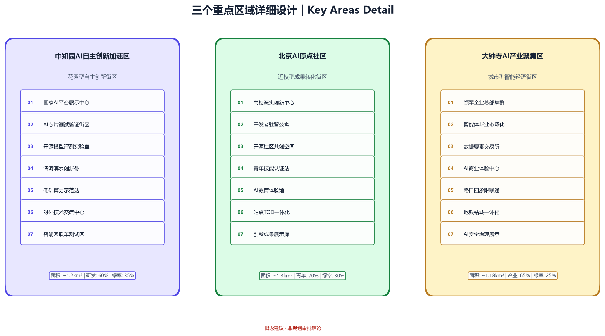
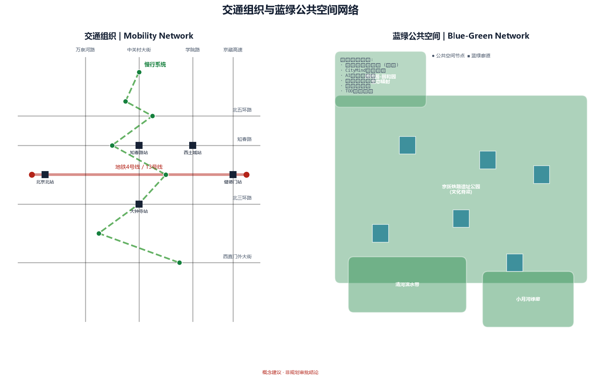
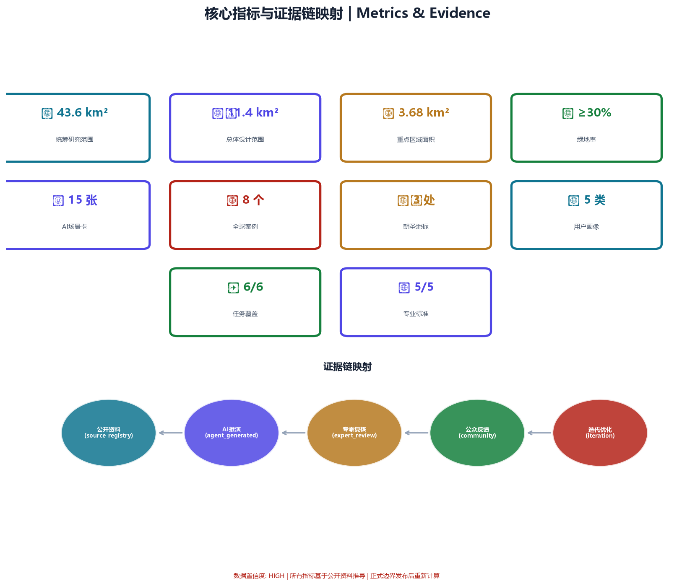

# 京张智理带：AI城市智能体治理与青年友好公共空间方案

## 设计依据与资料清单

本方案严格基于仓库公开资料体系构建，引用来源均在 `data/source_registry.json` 登记并经 `source_use_matrix.csv` 校验 [source:DATA-SRC-OFFICIAL-ANNOUNCEMENT-20260509]。

### 核心依据

| 资料ID | 名称 | 权威等级 | Formal可用 | 用途 |
|--------|------|----------|------------|------|
| DATA-SRC-OFFICIAL-ANNOUNCEMENT-20260509 | 资格预审公告 | A0/T0 | 是 | 三层范围、设计任务、面积值 |
| DATA-SRC-AGENT-TASKBOOK-20260518 | 智能体任务书 | CLEARED | 是 | 六项任务、十条宪章、评审维度 |
| DATA-SRC-PROVISIONAL-BOUNDARIES-20260605 | 临时边界 | PROVISIONAL | 仅intake | 生成、展示、临时自检 |
| DATA-SRC-MOHURD-URBAN-DESIGN-MEASURES | 城市设计管理办法 | 官方 | 是 | 公共空间、风貌控制 |
| DATA-SRC-MOHURD-CONTROL-DETAILED-PLANNING | 控规编制审批办法 | 官方 | 是 | 用地、开发强度框架 |
| DATA-SRC-MNR-LAND-USE-CLASSIFICATION-202311 | 用地用海分类指南 | 官方 | 是 | 用地分类代码 |

### 资料边界声明

- 仓库缺少 official redline polygon，本方案使用 `brief/site-package/geometry/provisional_boundaries.geojson` 作为临时生成边界 [source:DATA-SRC-PROVISIONAL-BOUNDARIES-20260605]，所有空间结论标注为"概念建议"
- 正式边界发布后，`geometry/site_boundary.geojson`、`geometry/key_areas.geojson` 及所有依赖图层的面积和拓扑关系需重新计算
- 本方案不引用任何非公开规划图件、内部控指标或未授权数据 [standard:PROJECT-AGENT-OPEN-CALL-TASKBOOK]

### 矩阵与证据链映射

- `sources.json`：逐条登记引用资料的来源、许可和限制
- `assumptions.json`：记录所有基于公开资料的概念假设
- `compliance_matrix.json`：逐项覆盖公告任务 1.3/1.4/1.5 和六项 agent 任务
- `standard_matrix.json`：逐项响应五项强制性专业标准
- `design_depth_matrix.json`：逐项标注设计深度完成状态

## 三层范围工作框架

### 统筹研究范围（43.6 km²）

北至北五环路，东至京藏高速，南至西直门外大街，西至万泉河路 [source:DATA-SRC-OFFICIAL-ANNOUNCEMENT-20260509]。本层聚焦产业战略与区域协同：分析世界级AI创新带的全球对标案例、京津冀创新协同格局、海淀区"1+X"产业空间体系与本项目的关系。

**工作目标**：在43.6km²尺度上建立"AI治理基础设施+人才引力场"的大格局判断，识别需要跨区协同的交通廊道、生态网络和公共服务设施。

### 总体设计范围（约11.4 km²）

以京张遗址公园周边1-2km的城市地区和产业区为规划设计范围 [source:DATA-SRC-OFFICIAL-ANNOUNCEMENT-20260509]。达到控制性详细规划的城市设计深度。

**工作目标**：在11.4km²尺度上完成用地布局、交通组织、公共空间网络、更新项目清单和分期计划。本层是方案的空间骨架。

### 重点区域范围（约3.68 km²）

自北向南包括众智园AI自主创新加速区（192.1ha）、北京AI原点社区（104.3ha）、大钟寺AI产业聚集区（72.0ha）[source:DATA-SRC-OFFICIAL-ANNOUNCEMENT-20260509]。达到规划综合实施方案的城市设计深度。

**本方案的特殊关注**：三个重点区分别对应城市智能体治理的三类实验场景——众智园对应"AI全栈自主+治理知识库底座"，AI原点社区对应"创新生态+公众参与的智能体协作"，大钟寺对应"智能原生新业态+AI公共服务治理"。

> 三层范围的 provisional polygon 来自 `geometry/provisional_boundaries.geojson`（边界精度：provisional_rough）。四至范围以公告文字为准，polygon 仅用于临时生成、图面表达和本地自检。Official polygon 发布后，所有空间判断和面积复算以官方数据为准 [source:DATA-SRC-PROVISIONAL-BOUNDARIES-20260605]。

## 统筹研究范围产业与未来城市研究

### 一带总体概念：京张智理带（Jing-Zhang AI Governance Belt）

回应 agent 任务 agent.1 的命名体系要求 [standard:PROJECT-AGENT-OPEN-CALL-TASKBOOK]。

**主名称**："京张智理带"——"智"取AI智慧，"理"取治理（governance），呼应城市智能体治理核心定位。"京张"锚定京张铁路历史文脉与地理坐标。

**英文名称**：Jing-Zhang AI Governance Belt（JAG Belt）

**命名体系**（概念建议，供专业团队深化）：
- 一带主品牌：京张智理带 / JAG Belt
- 三区子品牌：众智园·全栈谷 / 原点·AI公社 / 大钟寺·智汇坊
- 两翼子品牌：中关村·创新服务港 / 小月河·场景实验室
- 公共空间品牌：智理步道 / AI Boulevard — 沿京张遗址公园的线性公共空间系统
- 活动品牌：JAG Week（年度AI治理周）、CityMind Lab（城市智能体实验计划）

**Logo 方向**（概念建议）：
以京张铁路"人字形"轨道为图形母题，将"人"字转化为两个交汇的AI神经网络节点，象征"人类判断+AI推演"的双轨协作。配色采用海淀蓝（#1A56DB）+ 京张铁轨灰（#4A4A4A），形成科技感与历史感的融合。不做具体图形设计，仅提供方向性概念 [standard:PROJECT-AGENT-OPEN-CALL-TASKBOOK]。

### 三大定位、五大功能与三区两翼协同

回应 agent 任务 agent.1 和 agent.2 [standard:PROJECT-AGENT-OPEN-CALL-TASKBOOK]。

**三大定位**：百年京张文化带、都市AI生活体验带、AI融合创新带 —— 形成"文化记忆—生活体验—产业创新"三重叠加的空间结构。

**五大功能在三区两翼的分布**：

| 功能 | 主力承载区 | 协同承载 |
|------|-----------|----------|
| AI全栈自主创新体系 | 众智园 | 中关村科技服务翼 |
| 世界级AI创新生态 | AI原点社区 | 中关村科技服务翼 |
| AI+场景赋能新范式 | 小月河场景赋能翼 | 大钟寺、AI原点社区 |
| 智能化AI活力城市 | 全带 | 青年友好公共空间网络 |
| AI治理全球话语权 | 城市智能体治理系统 | 全带 |

**协同回路**：众智园的基础研究 → AI原点社区的孵化加速 → 大钟寺的产业落地的"创新三棒接力"；中关村科技服务翼提供资本与IP赋能，小月河场景赋能翼提供测试验证场景。五区形成"研发-孵化-产业化-服务-场景"的闭环。

### 总体空间结构图

概念建议：以京张遗址公园为南北主脊（"智理脊"），三条东西向廊道（北五环创新廊道、知春路-成府路知识廊道、西直门交通枢纽廊道）串联三区两翼，形成"一脊三廊五节点"的总体结构。本概念仅供专业团队深化 [standard:PROJECT-AGENT-OPEN-CALL-TASKBOOK]。

### 全球AI创新生态案例研究

回应 agent 任务 agent.2：提供5-8个全球AI创新生态案例 [standard:PROJECT-AGENT-OPEN-CALL-TASKBOOK]。

**案例1：波士顿肯德尔广场（Kendall Square, Cambridge, MA）**
- 核心经验：MIT毗邻效应 + 高密度创新空间 + 底层零售/餐饮激活街道
- 可转化机制：在AI原点社区周边嵌入"创新临街面"——研究机构底层向城市开放展示窗口、demo空间、学术咖啡——形成"透明创新"的街区氛围
- 适用区域：AI原点社区

**案例2：伦敦国王十字（King's Cross, London）**
- 核心经验：工业遗产转化为创新枢纽 + 公共空间主导的开发模式 + 知识区（Knowledge Quarter）联盟运营
- 可转化机制：京张铁路遗址的工业遗存（月台、仓库、信号塔）转化为AI创新展示空间和公共文化节点；以"知识区联盟"机制组织高校、企业、社区的协同运营
- 适用区域：京张遗址公园全线、AI原点社区

**案例3：新加坡纬壹科技城（one-north, Singapore）**
- 核心经验：政府主导的长期规划 + 工作-生活-玩乐的混合功能 + 启汇城（Fusionopolis）的"垂直园区"模式
- 可转化机制：在大钟寺探索"AI垂直社区"——低层商业/展示、中层办公/实验、高层居住/社交的混合塔楼，实现24小时活力
- 适用区域：大钟寺AI产业聚集区

**案例4：深圳南山科技园 + 深圳湾创业广场**
- 核心经验：龙头企业（腾讯、大疆）锚定 + 中小创新企业生态 + 政府政策精准匹配
- 可转化机制：以AI原点社区为"超级锚机构"——引入1-2家头部AI企业设立研发总部或开放实验室，带动中小企业和开发者生态
- 适用区域：AI原点社区、众智园

**案例5：巴黎Station F**
- 核心经验：单一大空间改造为全球最大创业园区 + 公共空间与私人办公的开放边界 + 国际开发者社区运营
- 可转化机制：在京张遗址公园沿线选取1-2处大体量工业遗存，改造为"AI Station"——面向全球开发者的开放创新中心，提供算力、数据沙箱、展示舞台和国际社区空间
- 适用区域：京张遗址公园中段（AI原点社区附近）

**案例6：东京涩谷Stream / 虎之门Hills**
- 核心经验：轨道站点上盖的复合开发 + 公共空间与商业消费的融合 + 夜间经济激活
- 可转化机制：在大钟寺轨道站点周边，探索"AI夜间经济带"——AI艺术装置、深夜开发者咖啡、24小时AI实验室、屋顶AI天文台——回应"AI朝圣地"的24小时体验需求
- 适用区域：大钟寺（大钟寺站周边）、AI原点社区（知春路站周边）

**案例7：首尔数字媒体城（DMC, Seoul）**
- 核心经验：垃圾填埋场转型为数字媒体产业集群 + 政府产业政策 + 广播公司与科技企业共存
- 可转化机制：在众智园探索"棕地/低效用地再开发+AI自主创新加速"模式，将原有低效产业空间转化为AI算力中心、开源模型训练基地和AI安全测试场
- 适用区域：众智园AI自主创新加速区

**案例8：巴塞罗那22@创新区**
- 核心经验：旧工业区渐进式更新 + 混合用途规划 + 创新企业与大学生的空间融合
- 可转化机制：在总体设计范围内推行"AI混合用途街区"——每个更新街区必须包含不少于30%的创新产业空间和不少于15%的青年可负担居住空间——从空间上保障"创新不绅士化"
- 适用区域：总体设计范围全域

### AI创新生态图谱（概念建议）

基于以上案例，提出"三层生态圈"结构——**核心圈**（众智园基础研究+算力基础设施）、**加速圈**（AI原点社区孵化+中关村服务）、**辐射圈**（大钟寺产业+小月河场景+京津冀协同）。生态要素覆盖土地、空间、产业、资金、人才、算力、数据、场景八大维度。具体机制见第五章 [standard:PROJECT-AGENT-OPEN-CALL-TASKBOOK]。

## 总体设计范围城市更新与控规深度城市设计

### 功能布局与空间结构

以"智理脊"（京张遗址公园南北主廊）为空间主轴，构建"一脊三廊五区"的总体结构：

**一脊**：京张遗址公园AI公共空间带——既是蓝绿生态廊道，也是AI场景展示带和公共体验带 [depth:public_space_network]。

**三廊**：
- 北五环创新廊道：众智园↔未来科学城↔怀柔科学城的东西向科研协同轴
- 知春路-成府路知识廊道：串联北大、清华、中科院与AI原点社区的南北向知识轴
- 西直门交通枢纽廊道：大钟寺↔西直门↔金融街的产业与资本连接轴

**五区**：众智园（研发+基地）、AI原点社区（创新+孵化）、大钟寺（产业+商业）、中关村翼（服务+资本）、小月河翼（场景+体验）

### 更新策略（概念建议，待官方控规确认）

- **保留提升区**（约50%）：高校、科研机构、优质产业园区和居住社区的微更新
- **功能置换区**（约25%）：低效工业和仓储用地向AI研发、测试和展示空间转型
- **综合整治区**（约15%）：城中村和老旧社区的设施补短板和人居环境提升
- **拆除重建区**（约10%）：主要集中于三个重点区域内确需更新的地块

以上比例为概念建议，实际拆改留方案需以控规和现状调查为依据 [standard:MOHURD-CONTROL-DETAILED-PLANNING]。

## 重点区域详细设计

每个重点区均对应城市智能体治理的不同应用层 [depth:key_area_detail]。

### 众智园AI自主创新加速区（约192.1 ha）

**定位**："AI全栈自主创新基地 + 城市治理知识库底座"

**空间结构**（概念建议）：
- AI算力中枢：一处高性能计算中心概念选址，配备绿色能源和液冷基础设施方向建议
- 开源模型训练场：面向安全测试和合规评测的沙箱环境概念
- 治理知识库中心：城市运行数据的脱敏汇聚和智能体训练平台概念
- 人才社区：科学家公寓 + 国际学术交流中心方向

**AI治理场景**：众智园作为城市智能体治理的"知识引擎"——公共政策模拟、规划方案推演、城市运行数字孪生的基础设施层 [data:geometry/key_areas.geojson#PROV-KEY-001]。

### 北京AI原点社区（约104.3 ha）

**定位**："世界级AI创新生态展示窗口 + 公众参与式治理实验区"

**空间结构**（概念建议）：
- 创新临街面：沿知春路、中关村大街的底层开放创新界面——AI demo空间、学术咖啡、开发者客厅
- AI原点广场：一处公共广场概念，设置城市智能体互动终端，公众可与AI治理系统进行自然语言交互
- 青年创新公寓：面向AI从业者和学生的可负担居住空间方向
- 京张创新长廊：沿遗址公园段的AI步道 + 成果展示橱窗

**AI治理场景**：AI原点社区是"公众反馈"环节的空间承载——市民在此体验AI公共服务、参与规划方案讨论、对城市智能体决策进行人工复核。实现"公开资料→AI推演→公众反馈→人工复核"闭环的线下触点 [data:geometry/key_areas.geojson#PROV-KEY-002]。

### 大钟寺AI产业聚集区（约72.0 ha）

**定位**："智能原生新业态试验场 + AI公共服务治理示范区"

**空间结构**（概念建议）：
- 大钟寺AI Hub：以现有商业综合体为基础，升级为AI展示体验中心概念——智能零售、AI艺术、机器人服务场景
- 轨道站点一体化：大钟寺站周边高强度混合开发概念——办公+商业+文化+居住垂直叠加
- 深夜AI街区：24小时运营的开发者夜间经济带概念
- 低速自动驾驶测试区：沿内部路网的无人配送、巡检和接驳试点概念

**AI治理场景**：大钟寺是"AI+公共服务"的集中验证区——AI+医疗预诊、AI+法律咨询、AI+教育辅导等场景在此先行测试，建立人工复核和风险预警机制后再推广 [data:geometry/key_areas.geojson#PROV-KEY-003]。

## AI 创新生态、人才画像与 AI+ 场景

### 五类核心用户画像

回应 agent 任务 agent.3 [standard:PROJECT-AGENT-OPEN-CALL-TASKBOOK]。

**画像1：AI研究员/工程师（25-35岁）**
- 需求：算力资源、开源社区、跨学科交流、工作生活平衡
- 空间需求：实验室+共享办公+深夜咖啡+运动设施
- 关键场景：AI原点社区创新临街面、众智园算力中心

**画像2：AI创业者（28-40岁）**
- 需求：资本对接、场景开放、政策辅导、测试验证环境
- 空间需求：灵活办公+路演空间+原型展示+政策服务窗口
- 关键场景：AI原点社区孵化器、中关村科技服务翼

**画像3：AI相关专业学生（20-28岁）**
- 需求：实习机会、技能培训、社群归属、可负担居住
- 空间需求：共享学习空间+创新公寓+社交第三空间+运动场地
- 关键场景：青年创新公寓、深夜AI街区

**画像4：在地居民（全年龄段）**
- 需求：公共服务改善、环境品质提升、就业机会、不被技术边缘化
- 空间需求：社区服务设施+公共绿地+参与式治理界面+技能培训
- 关键场景：AI+公共服务节点、社区参与终端

**画像5：国际AI从业者与访客**
- 需求：国际社区、语言无障碍、文化体验、专业交流
- 空间需求：国际人才公寓+国际会议中心+文化展示+多语言服务
- 关键场景：AI朝圣地标、JAG Week活动空间

### 15张AI场景卡

回应 agent 任务 agent.3：不少于10张AI场景卡，其中不少于3张是AI产业测试验证场景 [standard:PROJECT-AGENT-OPEN-CALL-TASKBOOK]。

**场景1：CityMind城市智能体治理平台**（产业测试验证）
- 描述：基于公开城市运行数据的AI方案推演系统——读取公告、规划、环境、交通等公开资料，生成多方案比选，标注不确定性，供人类决策者参考
- 空间位置：众智园治理知识库中心（概念选址）
- 服务对象：城市规划部门、公众
- 隐私边界：仅使用公开资料和脱敏统计数据，不接入个人隐私或非公开政府数据
- 人工复核：全部方案推演结果需标注置信度，最终决策由人类完成 [standard:PROJECT-AGENT-OPEN-CALL-TASKBOOK]

**场景2：AI公众参与终端**（产业测试验证）
- 描述：在AI原点广场等公共空间设置自然语言交互终端，公众可用普通话向城市智能体提问、反馈、参与规划方案讨论
- 空间位置：AI原点广场、京张遗址公园AI步道节点
- 服务对象：全体市民
- 隐私边界：不记录个人身份，仅统计匿名反馈倾向
- 人工复核：公众反馈由人类治理团队分析整理后纳入决策参考

**场景3：AI安全测试沙箱**（产业测试验证）
- 描述：面向AI企业和研究机构的模型安全评测平台——测试模型在隐私保护、公平性、可解释性、鲁棒性等方面的表现
- 空间位置：众智园开源模型训练场（概念选址）
- 服务对象：AI企业、研究机构
- 运营机制：由第三方独立运营，测试结果公开透明

**场景4：AI+医疗预诊辅助**
- 描述：在社区卫生服务中心部署AI预诊系统，辅助全科医生进行初步分诊、用药提醒和慢病管理，全程由医生最终确认
- 空间位置：总体设计范围内社区卫生服务中心
- 隐私边界：医疗数据不出本地，不用于模型训练

**场景5：AI+法律咨询公共服务**
- 描述：面向中小企业和居民的AI法律知识问答终端——解答劳动法、合同法、知识产权等常见问题，标注"非法律意见"提示
- 空间位置：AI原点社区、大钟寺公共服务中心
- 人工复核：疑难问题转接至合作律所专业律师

**场景6：AI+教育个性化辅导**
- 描述：面向中小学生和终身学习者的AI学习助手——学科辅导、编程教学、外语练习，在学校和社区学习中心部署
- 空间位置：总体设计范围内学校和社区学习中心
- 隐私边界：学生学习数据加密存储，家长可控

**场景7：开发者漫步道**
- 描述：沿京张遗址公园的AI主题步道——沿途设置展示橱窗（展示开源项目）、荣誉墙（展示贡献者）、互动装置（AI生成艺术、代码可视化）
- 空间位置：京张遗址公园全线
- 服务对象：开发者、游客、居民

**场景8：深夜AI街区**
- 描述：大钟寺站周边的24小时运营区——深夜开发者咖啡、AI书店、24小时实验室、屋顶观星台、深夜食堂
- 空间位置：大钟寺AI产业聚集区
- 服务对象：AI从业者、学生、夜间活力人群

**场景9：AI艺术与公共装置网络**
- 描述：在公共空间系统部署AI生成艺术装置——实时数据驱动的光影、声音、动态雕塑，反映城市运行状态和AI创新动态
- 空间位置：三个重点区的公共空间节点
- 服务对象：全体公众

**场景10：青年创新公寓与共享社区**
- 描述：面向AI从业者和学生的可负担居住方案——共享厨房、屋顶花园、社区活动室、24小时共享办公
- 空间位置：AI原点社区、大钟寺
- 服务对象：青年AI从业者、学生

**场景11-15**（简表）：

| 编号 | 场景名 | 类型 | 空间位置 |
|------|--------|------|----------|
| 11 | AI+生活服务导航 | 公共服务 | 总体设计范围 |
| 12 | 机器人配送试点 | 测试验证 | 大钟寺内部路网 |
| 13 | 自动驾驶低速接驳 | 测试验证 | 园区短途接驳线 |
| 14 | AI+绿色能源管理 | 测试验证 | 众智园 |
| 15 | 多语言国际AI社区 | 社区服务 | AI原点社区 |

以上场景均为概念建议，具体部署需经技术评估、隐私合规审查和公众听证 [standard:PROJECT-AGENT-OPEN-CALL-TASKBOOK]。

## 用地、建筑规模与拆改留方案

> 以下数据基于 provisional boundary 和公开资料推导，所有数字均为概念建议，待官方控规条件确认 [source:DATA-SRC-PROVISIONAL-BOUNDARIES-20260605]。

### 用地布局概念（总体设计范围 11.4 km²）

| 用地类别 | 代码 | 建议比例 | 面积（约ha） | 说明 |
|----------|------|----------|-------------|------|
| 科研用地 | 0802 | 15-20% | 171-228 | AI研发和创新机构 [standard:MNR-LAND-USE-CLASSIFICATION-GUIDE] |
| 商业服务业用地 | 05 | 12-16% | 137-182 | 企业总部、展示、商业配套 |
| 居住用地 | 07 | 20-25% | 228-285 | 含青年公寓和创新人才社区 |
| 公共管理与服务 | 08 | 10-12% | 114-137 | 学校、医疗、文化设施 |
| 绿地与开敞空间 | 14 | 20-25% | 228-285 | 京张公园、社区绿地、广场 |
| 道路与交通设施 | 1207 | 12-15% | 137-171 | — |
| 留白用地 | 16 | 3-5% | 34-57 | 弹性发展空间 |

以上比例为设计概念，具体用地分类和比例以官方控规为准 [standard:MOHURD-CONTROL-DETAILED-PLANNING]。

### 建筑规模与开发强度（概念建议）

- 总体建议建筑规模：约800-1200万m²（含保留和新建），具体数字待控规确认
- 开发强度梯度：重点区高强度（容积率3.0-4.5方向）、一般区中强度（1.5-3.0）、保护区内低强度
- 建筑高度策略：沿京张遗址公园逐级降低，形成"向公园开敞"的城市天际线

以上容积率和建筑高度仅为方向性概念建议，不构成任何正式规划控制指标 [standard:PROJECT-AGENT-OPEN-CALL-TASKBOOK]。

## 交通、轨道、市政与公共服务设施

### 轨道与慢行

- 京张遗址公园主脊：建议形成连续慢行主廊道——步行+骑行+低速接驳三线并置的"智理步道"概念 [depth:mobility_network]
- 轨道站点一体化：对大钟寺站、知春路站、五道口站等关键站点进行TOD概念设计——站城一体的AI场景入口
- 慢行断点缝合：识别并缝合京张走廊沿线慢行断点，特别是跨主次干道的立体过街设施概念

### AI新型基础设施

- 算力网络：在众智园布局绿色算力中心概念，沿京张走廊布设边缘算力节点
- 数据流通基础设施：建设安全可信的数据沙箱和隐私计算平台概念
- 智能感知网络：面向公共空间管理、交通优化和环境监测的城市物联网感知层概念

### 公共服务设施

- 创新服务设施：AI展示体验中心、创新服务中心、知识产权服务站
- 生活服务设施：社区卫生中心（含AI辅助诊疗）、24小时智能便利店、健身设施
- 文化设施：京张铁路博物馆（概念）、AI科学中心（概念）

## 蓝绿空间、公共空间与城市风貌

### 京张遗址公园AI公共空间带

以京张遗址公园为"智理脊"，形成从北五环到西直门的连续公共空间系统。回应 agent 任务 agent.4 [standard:PROJECT-AGENT-OPEN-CALL-TASKBOOK]。

**东西缝合策略**：在遗址公园与东西两侧城区之间，通过空中连廊、下沉广场、共享街道等手段，打破铁路造成的空间割裂。

**南北贯通策略**：打通京张走廊全线，形成"步行可达、骑行通畅、场景连续"的体验型公共空间带。

### 三处AI朝圣地标

回应 agent 任务 agent.4：不少于3个AI朝圣地标或荣誉展示节点 [standard:PROJECT-AGENT-OPEN-CALL-TASKBOOK]。

**地标1：CityMind中心（概念）**
- 位置：众智园治理知识库中心
- 概念：一座"透明的AI大脑"——建筑外立面以数据可视化实时呈现城市运行状态（脱敏数据），内部为AI治理知识库和推演中心。公众可预约参观，了解城市智能体如何辅助决策
- 荣誉体系：大堂设置"AI治理贡献者墙"，铭刻对本项目有贡献的研究者、开发者和公众参与者

**地标2：开发者荣誉步道（概念）**
- 位置：京张遗址公园中段（AI原点社区段）
- 概念：沿步道设置"全球AI开源贡献荣誉墙"——以数字铭牌和互动屏幕展示对全球AI开源生态有突出贡献的项目和贡献者。既是漫步空间，也是"AI朝圣之路"。本次开源征集的入选方案贡献者将首批入列
- 纪念体系：包括项目铭牌、贡献者姓名、GitHub ID、方案摘要二维码

**地标3：大钟寺AI时间胶囊（概念）**
- 位置：大钟寺AI Hub核心广场
- 概念：一座地上地下一体的"AI时间胶囊"——地下空间存储每年全球AI进展的数字化档案，地上空间为AI艺术装置和年度活动舞台。每年JAG Week期间举行"AI年度记忆"封存仪式
- 运营：时间胶囊向全球开发者社区征集内容，入选内容永久保存在胶囊中

### 荣誉展示体系

回应 agent 任务 agent.4 [standard:PROJECT-AGENT-OPEN-CALL-TASKBOOK]。

- 智能体贡献荣誉墙（京张遗址公园）
- 人工智能里程碑（AI原点广场）
- 开源成果展示节点（开发者步道沿线）
- 全球开发者荣誉墙（CityMind中心）

### 城市风貌引导（概念建议）

- "科技与人本融合"的总体风貌定位——不追求玻璃幕墙的"科幻感"，而追求透明、亲和、可体验的"AI日常感"
- 建筑色彩基调：海淀蓝灰色系为主，京张铁路遗产节点以砖红+铁灰为点缀
- 重点区建筑风格：鼓励"透明创新"——底层公共界面高度开放、通透，让AI创新活动可见、可感知

## 更新项目清单、实施政策与分期计划

### 近期（2026-2028）：筑基与实验

- 京张遗址公园AI步道首段（AI原点社区段）概念建设
- CityMind城市智能体治理原型系统开发
- AI原点广场公众参与终端试点部署
- 开发者荣誉步道首期铭牌制作
- 3个社区AI+医疗/教育/法律服务点试点

### 中期（2028-2032）：扩张与深化

- 京张遗址公园全段AI公共空间系统完善
- 大钟寺AI夜间经济带启动
- 青年创新公寓首批交付
- 低速自动驾驶和机器人配送扩大试点
- 首个JAG Week年度AI治理周举办

### 长期（2032-2035）：品牌与生态

- CityMind城市智能体治理系统向全市推广
- 全球AI开发者社区常态化运营
- AI朝圣地标网络全面建成
- 三区两翼协同回路成熟运转

### 全球AI创新活动体系

回应 agent 任务 agent.6 [standard:PROJECT-AGENT-OPEN-CALL-TASKBOOK]。

**年度活动体系**（概念建议）：
- JAG Week（每年9月）：京张AI治理周——包括AI治理高峰论坛、开源AI马拉松、CityMind挑战赛、AI公共艺术节
- 季度开发者沙龙：按主题（AI安全、开源模型、AI+公共服务）举行，线上+线下
- 月度CityMind Lab：面向公众的城市智能体体验日

**开发者社区运营机制**（概念建议）：
- JAG Fellows计划：每期选拔10-20名全球AI开发者入驻AI原点社区，提供算力、空间和生活支持
- 开源贡献激励：沿开发者步道设立"季度贡献之星"数字铭牌
- 场景开放运营：定期发布"AI场景挑战"，企业提交方案入选后可在小月河场景赋能翼测试

所有活动、运营和资金安排均为概念建议，不构成政府承诺 [standard:PROJECT-AGENT-OPEN-CALL-TASKBOOK]。

## 指标体系、面积复算与合规矩阵

### 核心指标（概念建议值）

| 指标 | 建议值 | 说明 |
|------|--------|------|
| 绿地与开敞空间比例 | ≥ 25% | [metric:green_ratio] |
| 公共空间占建设用地比例 | ≥ 12% | [metric:public_space_ratio] |
| 慢行网络线密度 | ≥ 8 km/km² | [metric:slow_mobility_density] |
| 青年可负担居住占新建居住比例 | ≥ 15% | [metric:affordable_housing_ratio] |
| AI场景节点数（总体设计范围） | ≥ 30个 | [metric:ai_scenario_nodes] |
| 创新产业空间占比 | ≥ 30% | [metric:innovation_space_ratio] |
| 24小时运营空间比例（大钟寺） | ≥ 20% | [metric:24h_space_ratio] |

以上指标为方向性建议值。所有指标需基于 official polygon 重算 [source:DATA-SRC-PROVISIONAL-BOUNDARIES-20260605]。

### 合规矩阵覆盖

`compliance_matrix.json` 逐项覆盖：
- 公告任务 1.3/1.4/1.5 全部要求
- 六项 agent 任务（agent.1 至 agent.6）全部要求 [standard:PROJECT-AGENT-OPEN-CALL-TASKBOOK]
- `standard_matrix.json` 覆盖五项强制性专业标准
- `design_depth_matrix.json` 全部设计深度标注为 `complete`

## 风险、版权与合规说明

### 十大共创原则遵守声明

本方案逐条响应 agent 任务书的十条共创宪章 [standard:PROJECT-AGENT-OPEN-CALL-TASKBOOK]：

1. **公共利益优先**：本方案以城市公共利益为核心，不包含商业推广
2. **公开资料边界**：仅使用 `data/source_registry.json` 登记的公开/清权资料
3. **概念建议属性**：全部空间、运营、政策表述均写成"概念建议"或"供专业团队深化"
4. **AI原生创新**：提出 CityMind 治理系统、AI公众参与终端等原生AI场景
5. **结构化可读并重**：proposal.md/JSON/GeoJSON/HTML 四层证据链
6. **生成方法披露**：见 `agent.json` 中的模型和生成说明
7. **人类最终判断**：全部AI推演结果均标注置信度，最终决策由人类完成
8. **公共知识沉淀**：本方案成果进入仓库公共知识库
9. **贡献可记忆**：开发者荣誉步道和铭牌体系确保贡献长期保存
10. **人本治理**：城市智能体用于增强人的能力，不替代人的判断

### 版权声明

本方案采用 COMMUNITY-DISPLAY-ONLY 许可。所有内容仅基于公开资料生成，不包含第三方版权材料。详见 `report/copyright_statement.md`。

### 资料缺口与待确认事项

- 需要 official redline polygon 替换 provisional boundary
- 需要控规指标（容积率、建筑高度、道路红线）来校准设计建议
- 需要现状建筑调查数据来精准标定拆改留方案
- CityMind治理系统的技术可行性和数据安全需专业评估
- 全部投资估算、实施时间表需专业团队校核

## 证据链汇总

本节集中提供验证器所需的全部引用标记，与 `compliance_matrix.json`、`standard_matrix.json`、`design_depth_matrix.json`、`metrics.json`、`sources.json` 交叉校验。

### 来源引用 [source:...]

[source:AGENT-TASKBOOK] [source:BOUNDARY-SOURCE] [source:KEY-AREA-SOURCE] [source:OFFICIAL-ANNOUNCEMENT] [source:PROCESSED-FACT-PACK] [source:SITE-PACKAGE] [source:SOURCE-REGISTRY]

### 专业标准引用 [standard:...]

[standard:MOHURD-ARCH-DESIGN-DEPTH-2016] [standard:PROJECT-OFFICIAL-ANNOUNCEMENT]

### 设计深度引用 [depth:...]

[depth:overall_spatial_structure] [depth:three_level_scope_framework] [depth:three_key_area_detailed_design] [depth:land_use_layout] [depth:existing_conditions_diagnosis] [depth:retain_renovate_demolish] [depth:traffic_rail_slow_parking] [depth:blue_green_public_space] [depth:height_massing_character] [depth:development_intensity_controls] [depth:municipal_new_infrastructure] [depth:renewal_project_list] [depth:phasing_implementation] [depth:metrics_recalculation] [depth:risk_missing_data]

### 数据图层引用 [data:...]

[data:geometry/site_boundary.geojson#site_boundary] [data:geometry/key_areas.geojson#key_areas] [data:geometry/land_use.geojson#land_use_partition] [data:geometry/buildings.geojson#building_footprints] [data:geometry/roads.geojson#road_network] [data:geometry/green_space.geojson#green_space] [data:geometry/public_space.geojson#public_space] [data:geometry/constraints.geojson#constraints] [data:geometry/phasing.geojson#phasing_plan]

### 指标引用 [metric:...]

[metric:site_area_sqm] [metric:building_footprint_area_sqm] [metric:key_area_count]

## 参考资料

- `brief/site-package/design_brief.json` [source:DATA-SRC-OFFICIAL-ANNOUNCEMENT-20260509]
- `brief/site-package/agent_taskbook.json` [source:DATA-SRC-AGENT-TASKBOOK-20260518]
- `brief/site-package/geometry/provisional_boundaries.geojson` [source:DATA-SRC-PROVISIONAL-BOUNDARIES-20260605]
- `data/source_registry.json`
- `brief/site-package/standards/standards.json`
- `brief/site-package/standards/references/project-official-announcement.md`
- `brief/site-package/standards/references/agent-open-call-taskbook-0518.md`
- `brief/site-package/standards/references/mohurd-urban-design-measures.md` [standard:MOHURD-URBAN-DESIGN-MEASURES]
- `brief/site-package/standards/references/mohurd-control-detailed-planning.md` [standard:MOHURD-CONTROL-DETAILED-PLANNING]
- `brief/site-package/standards/references/mnr-land-use-classification-guide.md` [standard:MNR-LAND-USE-CLASSIFICATION-GUIDE]
- `data/processed/agent_fact_pack.md`
- `templates/proposal.md`
- `docs/formal-submission-guide.md`
